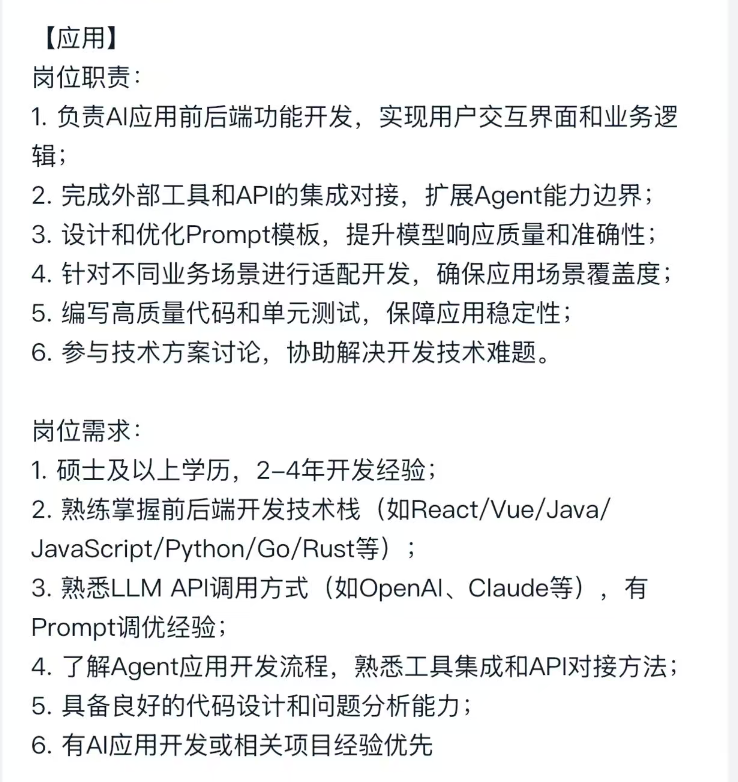

- 2026-07-09 16:14 | 需要完整的梳理一遍UDS协议的代码流程 | next:  | #idea/inbox
- 2026-07-09 16:58 | can CONTROLLER的配置是什么？ | next:  | #idea/inbox
- 2026-07-10 14:25 | ASAP2脚本搞一下，生成A2L，还是按照之前的来吧 | next:  | #idea/inbox
- AI 架构工程师的要求，得想想和嵌入式相结合

- 2026-07-13 09:05 | 机器人今晚必须完成的:电源组装；电机控制学习，测功机了解；CANOPEN协议；ROS了解（需要买开发板） | next:  | #idea/inbox
- 2026-07-13 09:42 | 把抖音的收藏的内容，抓紧总结了，然后把电机的东西看看能不能在哔哩哔哩上平替了，这样也不会觉得可惜，抖音会让我停不下来，必须卸载，太浪费时间了 | next:  | #idea/inbox
- 2026-07-15 10:23 | DTC DID是如何配置的，需要学习清楚 | next:  | #idea/inbox
- 2026-07-15 11:37 | UDS服务整理 | next:  | #idea/inbox
- 2026-07-15 11:38 | 中转站搭建 | next:  | #idea/inbox
- 2026-07-15 11:38 | 软件需求编写对应系统需求 | next:  | #idea/inbox
- 2026-07-15 17:36 | 晚上回去要看一下电机控制，明天有课程 | next:  | #idea/inbox
- 2026-07-23 17:48 | CAN休眠唤醒总结  被动 | next:  | #idea/inbox
- 2026-07-23 17:48 | BE13是不是关闭看门狗后，静态电流会变小，需要确认一下 | next:  | #idea/inbox
- 2026-07-23 17:49 | 软件架构设计 | next:  | #idea/inbox
- 2026-07-23 17:49 | 软件详细设计 | next:  | #idea/inbox
- 2026-07-23 17:50 | 奇供应商质量审核 | next:  | #idea/inbox
- 2026-08-16 12:27 | 平躺侧睡的代偿姿势，会引发头前伸、圆肩驼背等全身体态问题。  训练原理：90/90 呼吸训练可恢复胸廓与骨盆的协同配合，改善呼吸空间不足引发的体态代偿。 动作细节：双脚踩墙保持膝盖、大腿根呈 90°，夹枕头后脚后跟搓墙、大腿后侧发力至屁股微离地；双手举向天花板，舌尖抵上颚，鼻吸 3 秒、嘴吐 6 秒，完成 8 个循环。每天睡前练两组可调整呼吸状态。 | next:  | #idea/inbox