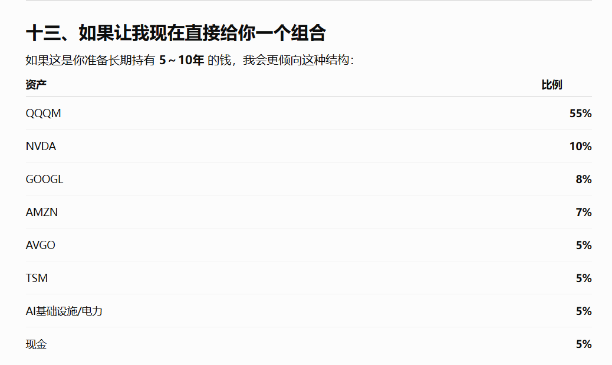

- 2026-07-30 09:22 | 盯住跟特斯拉产业链相关的中国国内企业。比如拓普、三花智控等 | next:  | #idea/inbox
- 
- 2026-07-30 09:27 | 大A其他的所有股票都不要轻易的碰 | next:  | #idea/inbox
- 2026-07-30 09:28 | 国内基金购买之前需要详细的调查清楚基金的成分是什么？如果偷偷加了很多国内的股票，不要买 | next:  | #idea/inbox
- 2026-07-30 09:28 | 任何时候任何地点，如果涨了太多的时候，不要买不要跟风梭哈某一只股票。 | next:  | #idea/inbox
- 2026-07-30 09:29 | 永远相信NSDQ,QQQ,国内买不到的时候也要想办法买 | next:  | #idea/inbox
- 2026-07-30 09:30 | 韩国存储跌这么多的原因是：60%估值与仓位调整 + 25%对未来盈利见顶的担忧 + 15%基本面长期风险重新定价。高位泡沫和杠杆被挤掉，而不是存储产业逻辑已经彻底反转。但这类股票短期再跌20%甚至更多，也不能说不可能，因此股票本身的风险确实非常高。 | next:  | #idea/inbox
- 2026-07-30 09:45 | 韩国接下来技术上比较关键的是约5700点附近的200日均线。如果指数很快重新站稳5700—6000点，可能进入剧烈震荡筑底；如果持续跌破，并且200日均线也开始拐头向下，说明长期趋势也可能从调整转向熊市。 | next:  | #idea/inbox
- 2026-07-30 09:53 | BTC跌到3万左右的时候买3万块钱 | next:  | #idea/inbox
- 2026-07-30 09:57 | 重建一个能活过本轮波动的组合。 | next:  | #idea/inbox
- 2026-07-30 16:45 | 需要稳定收入、持续投入、分散投资、控制情绪和持有很多年。大多数人容易追涨杀跌。 | next:  | #idea/inboxp
- 2026-08-04 13:31 | 可以通过币安来购买美股 | next:  | #idea/inbox
- 2026-08-06 10:11 | 等待回本，本质上是让历史成本替你决定未来风险。 | next:  | #idea/inbox
- 2026-08-06 10:12 | 假如我今天手里拿的是现金，我还愿不愿意按照当前价格买入这么大的仓位？ | next:  | #idea/inbox
- 2026-08-06 14:03 | 未来一定会开征资本利得税CRS,赠与税，和遗产税。现在等境外的先扫荡差不多就会处理国内的了 | next:  | #idea/inbox
- 2026-08-12 09:22 |<mark style="background: #FF5582A6;"> CapEx → AI收入 → 利润 → Free Cash Flow  到底有没有利润，自由现金流正常不</mark>？ | next:  | #idea/inbox
- 
- 2026-08-12 09:23 | AI CapEx 正在快速吞噬科技巨头自由现金流，市场开始要求 AI 投资证明自己的回报率。 | next:  | #idea/inbox
- 
- 2026-08-12 09:24 | 拿铲子挖到金子的人 才是未来的真正的机会 | next:  | #idea/inbox
- 2026-08-16 14:58 | 中国下一阶段能不能真正走出低利率，关键要看新的科技产业能不能创造足够高的真实回报率。 | next:  | #idea/inbox
- 2026-08-16 14:58 | 中国正在从“房地产吸收资金”转向“科技和新产业吸收资金”的过程中。 | next:  | #idea/inbox
- 2026-08-16 14:58 | 现在的问题在于：  旧发动机已经弱了，新发动机又还没完全强起来。  于是你会看到一个很奇怪的组合：  利率低 + 钱很多 + 部分资产横盘 + 科技资产特别活跃。  这其实就是经济结构切换期的典型表现。 | next:  | #idea/inboxp 
- 
- 2026-08-23 18:22 | AI应用-- 大模型 -- 云计算 --  GPU/ASIC -- HBM -- 数据中心 -- 电力 | next:  | #idea/inbox
- 
- 2026-08-23 19:33 | 我不知道底在哪里，但是跌的越多，我愿意买的越多。 | next:  | #idea/inbox
- 
- 2026-08-23 19:40 | 现金长期待在场外本身也有机会成本 | next:  | #idea/inbox
- 2026-08-23 19:42 | **<mark style="background: #FFB86CA6;">不要追AI这两个字，而是追踪AI资本开始最终流向谁</mark>**。 | next:  | #idea/inbox

- 
- 2026-08-23 19:48 | 如果AI超级周期继续，我能赚到；如果AI中途发生30-40%的估值杀，我也不会打死。 | next:  | #idea/inbox
- 2026-08-23 19:49 | 既不会因为害怕高位而永远踏空，而不会因为一次梭哈刚好埋在阶段顶部而心理崩溃 | next:  | #idea/inbox
- 2026-08-23 19:51 | 把握价值而不是把我趋势，这是美股不是大A | next:  | #idea/inbox
- 

<mark style="background: #BBFABBA6;">第一批：12 万

先建立仓位。

第二批：6 万

市场整体回调约 8～10%时。

第三批：6 万

回调约 15%左右。

第四批：6 万

回调 20%以上。

如果一直不跌呢？

就继续用未来工资/现金流：

每月定投。</mark>

- 2026-08-23 19:53 | 你必须接受刚买完就跌 | next:  | #idea/inbox
- 
- 2026-08-23 19:54 | 现在大仓位入场-- 剩一点点药-- 以后收入持续定投 | next:  | #idea/inbox
- 2026-08-23 19:55 | 大资金解决尽早入场，定投解决未来现金流持续进入市场 | next:  | #idea/inbox
- 2026-08-23 19:58 | 尽量左侧交易，买低不买高 | next:  | #idea/inbox