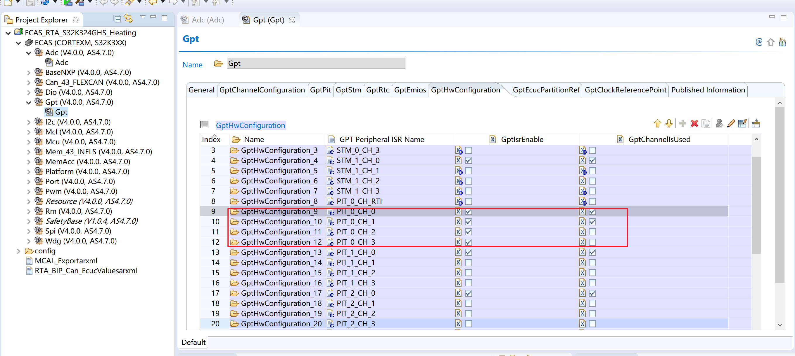
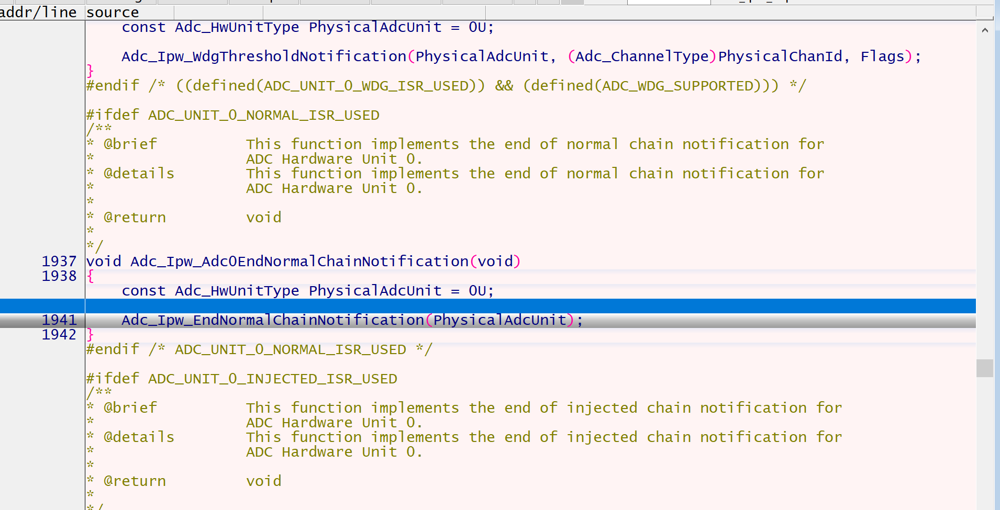
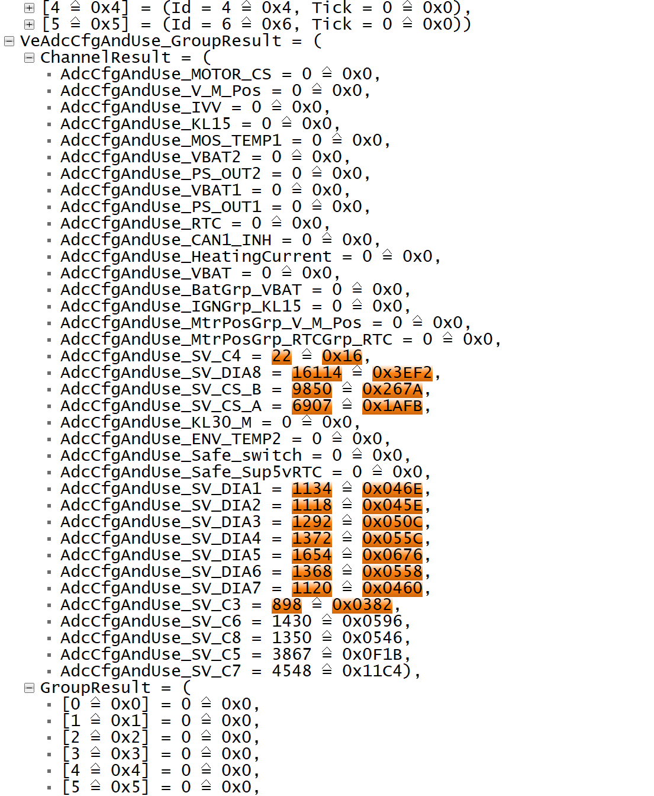
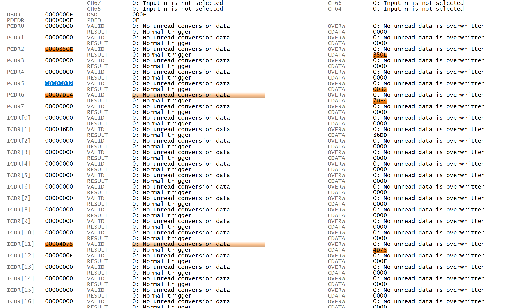
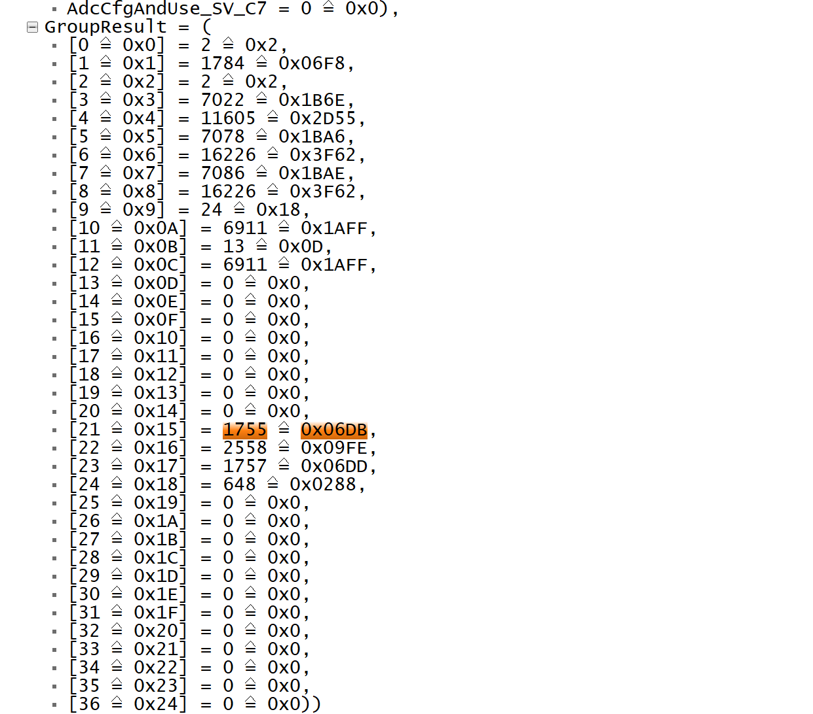
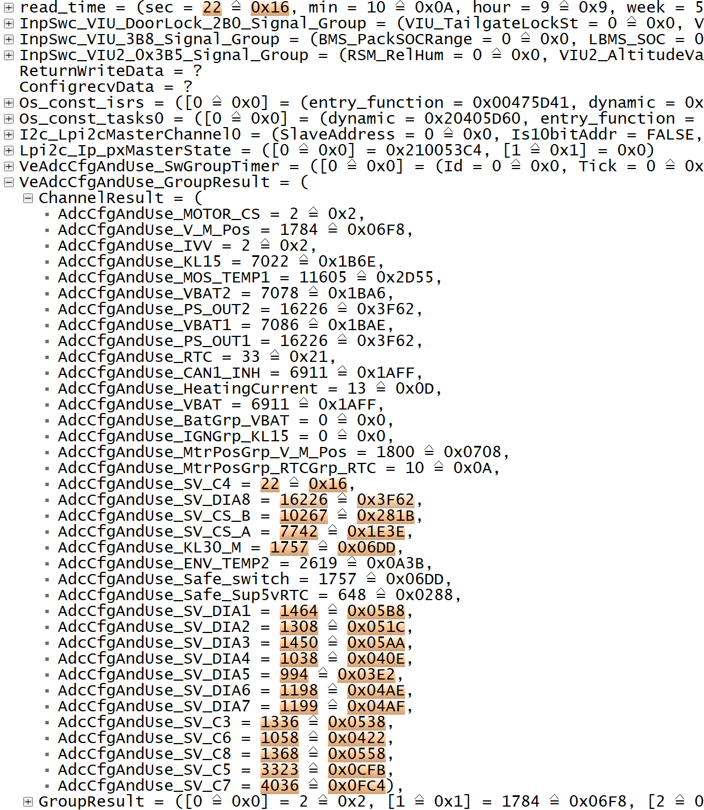
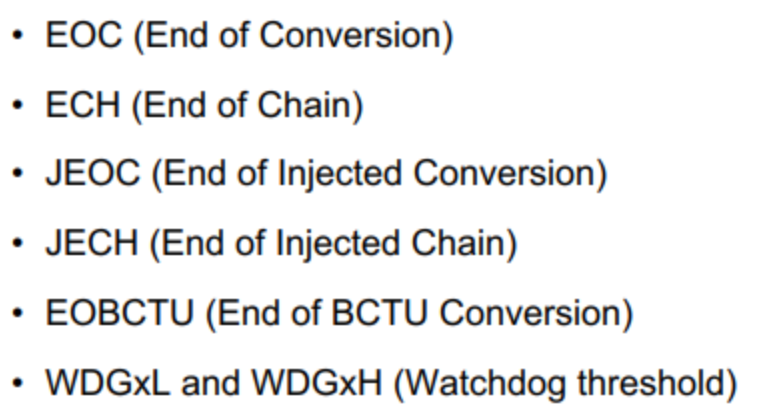
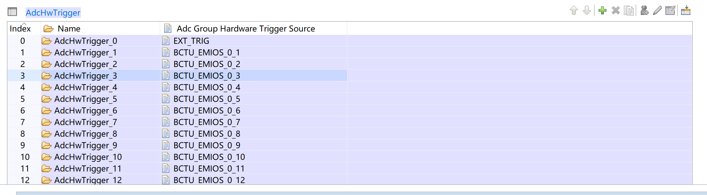

## 什么寄存器可以显示引脚的高低电平状态？
看引脚实际高低电平，主要看 **SIUL2 的 `GPDI` 寄存器**：
- 单个引脚实际输入电平：`SIUL2->GPDI[n]`
  - 例如 `GPIO[24]` 看 `GPDI24`
  - `GPIO[59]` 看 `GPDI59`
  - bit0 / `PDI_n` 为 `1` 表示高电平，`0` 表示低电平

- 一组端口并行读：`PGPDIx`
  - `PGPDI` 是 Parallel GPIO Pad Data In Register，适合一次看 16 个 pin。

- 输出锁存值看：`GPDO[n]` 或 `PGPDOx`
  - 这个表示软件写出去的输出值，不一定完全等于物理引脚实际电平。
  - 如果想确认引脚脚上真实状态，优先看 `GPDI/PGPDI`。

在本工程 MCAL 里，`Dio_ReadChannel()` 实际就是读 `GPDI`：

```c
Dio_ReadChannel(DioConf_DioChannel_DIO_PTA24_ASSVSW1);
```

所以调试时最推荐用 `Dio_ReadChannel(...)`；如果直接看寄存器，就看对应的 `IP_SIUL2->GPDIxx`。例如你图里的 `ASSV_SW_1 GPIO[24]` 就看 `IP_SIUL2->GPDI24`。

## ADC模块所有通道都支持14bit精度吗

不是严格意义上的“所有通道都有 14bit 精度保证”。更准确地说：

在这个 S32K324 工程里，ADC0/ADC1/ADC2 这三个 ADC 硬件单元都配置成了 `RESOLUTION_14`，生成代码也是 `ADC_SAR_IP_RESOLUTION_14`，所以当前已配置使用的 ADC 通道都会按 14bit 分辨率转换/读取。

关键依据：
- [Adc.xdm](E:/github/ECAS_RTA_S32K324GHS_Heating/BasicSoftware/integration/mcal/MCAL_Cfg/config/Adc.xdm:100)：ADC0 配置 `RESOLUTION_14`
- [Adc.xdm](E:/github/ECAS_RTA_S32K324GHS_Heating/BasicSoftware/integration/mcal/MCAL_Cfg/config/Adc.xdm:2460)：ADC1 配置 `RESOLUTION_14`
- [Adc.xdm](E:/github/ECAS_RTA_S32K324GHS_Heating/BasicSoftware/integration/mcal/MCAL_Cfg/config/Adc.xdm:4093)：ADC2 配置 `RESOLUTION_14`
- [Adc_Sar_Ip_Types.h](E:/github/ECAS_RTA_S32K324GHS_Heating/BasicSoftware/integration/mcal/src/modules/Adc/include/Adc_Sar_Ip_Types.h:296)：驱动支持 `14/12/10/8 bit`

但注意：14bit 这里是“转换分辨率 resolution”，不是模拟意义上的“有效精度/ENOB/绝对误差都达到 14bit”。S32K324 的 ADC 通道还分 Precision 输入、Standard 输入、External 输入；它们都可在 ADC 单元 14bit 配置下工作，但实际有效精度会受通道类型、采样时间、源阻抗、参考电压、噪声、校准等影响。

所以一句话：**本项目配置上是所有已用 ADC 通道按 14bit 分辨率工作；但不能说所有物理通道都保证 14bit 有效精度。**

## 按这个配置的话， PIT0的四个通道都会进入到PIT_0_ISR这个中断里面吗


是的，从当前生成代码看，`PIT0` 是一个 module-level ISR：`PIT_0_ISR`，不是每个通道一个独立 ISR。

关键生成代码是：

- [Pit_Ip_Cfg_Defines.h](E:/github/ECAS_RTA_S32K324GHS_Heating/BasicSoftware/integration/mcal/src/gen/include/Pit_Ip_Cfg_Defines.h:109) 只生成了：

```c
#define PIT_0_ISR_USED
```

没有生成 `PIT_0_CH_0_ISR_USED`、`PIT_0_CH_1_ISR_USED` 这种逐通道 ISR。

- [Pit_Ip.c](E:/github/ECAS_RTA_S32K324GHS_Heating/BasicSoftware/integration/mcal/src/modules/Gpt/src/Pit_Ip.c:2194) 里的 `PIT_0_ISR` 会遍历 PIT0 的 channel：

```c
ISR(PIT_0_ISR)
{
    uint8 channel;
    uint8 instance = PIT_0_IP_INSTANCE_NUMBER;

    for (channel = 0U; channel < PIT_0_IP_CHANNELS_NUMBER - 1U; ++channel)
    {
        Pit_Ip_ProcessCommonInterrupt(instance, channel);
    }
}
```

当前 `PIT_0_IP_CHANNELS_NUMBER` 是 5，因为包含 RTI，所以 `- 1U` 后实际会扫 `channel 0..3`。也就是说：**PIT0_CH0/1/2/3 的中断源都会进同一个 `PIT_0_ISR`，ISR 内部再逐通道判断和处理 flag。**

但还有一个重点：你现在生成配置里 `GptChannelIsUsed` 只有 `PIT_0_CH_0`、`PIT_0_CH_1` 是 `true`，`PIT_0_CH_2`、`PIT_0_CH_3` 是 `false`。所以正常通过 GPT driver 使用时，真正配置成 GPT channel 的只有 CH0/CH1。CH2/CH3 即使 `GptIsrEnable` 勾了，如果没有 `GptChannelIsUsed`，一般不会被 GPT 初始化/启动。

结论：

```text
中断入口：PIT0 四个通道共用 PIT_0_ISR
当前 GPT 可用通道：主要是 PIT0_CH0 和 PIT0_CH1
PIT0_CH2/CH3 要正常用：GptChannelIsUsed 也要勾上，并配置对应 GptChannelConfiguration
```
## PIT硬件触发ADC采样。会进入ADC中断吗？请帮我查看一下整个流程
会。按当前配置，`PIT0_CH1` 作为硬件触发源触发 ADC0/ADC1/ADC2 普通转换，转换完成后会进对应的 ADC 中断：`Adc_Sar_0_Isr`、`Adc_Sar_1_Isr`、`Adc_Sar_2_Isr`。

但有个前提：`PIT0_CH1` 的 GPT 通道必须真的启动。你工程里启动代码被 `Debug_ADC_10ms` 包住了，源码里我没搜到这个宏的定义；如果编译参数里也没定义，那 PIT 硬件触发不会跑起来。

**当前流程**


关键配置点：

- `GptChannelConfiguration_ADC0` 对应 `PIT0` 的 `channel 1`：  
  [Gpt_Ipw_PBcfg.c](E:/github/ECAS_RTA_S32K324GHS_Heating/BasicSoftware/integration/mcal/src/gen/src/Gpt_Ipw_PBcfg.c:311)

- 但是启动被宏包住：  
  [Target.c](E:/github/ECAS_RTA_S32K324GHS_Heating/BasicSoftware/integration/src/target/src/Target.c:161)
  ```c
  #ifdef Debug_ADC_10ms
  Gpt_StartTimer(...ADC0, 400000);
  Gpt_EnableNotification(...ADC0);
  #endif
  ```

- TRGMUX 把 `PIT0_CH1` 接到 ADC0/1/2 普通转换触发输入：  
  [Trgmux_Ip_PBcfg.c](E:/github/ECAS_RTA_S32K324GHS_Heating/BasicSoftware/integration/mcal/src/gen/src/Trgmux_Ip_PBcfg.c:118)

- ADC 硬件触发组是：
  - `Group5 = Adc0Group_LV15VLV_10ms`
  - `Group7 = Adc1Group_LV15VLV_10ms`
  - `Group8 = Adc2Group_LV15VLV_10ms`

  它们都是 `ADC_TRIGG_SRC_HW`，触发源都是 `AdcHwTrigger_0`：  
  [Adc_PBcfg.c](E:/github/ECAS_RTA_S32K324GHS_Heating/BasicSoftware/integration/mcal/src/gen/src/Adc_PBcfg.c:676)

- 这三个 group 的 `AdcWithoutInterrupt` 都是 `STD_OFF`，所以 `Adc_EnableHardwareTrigger()` 会打开 ADC end-chain 中断：  
  [Adc_Ipw.c](E:/github/ECAS_RTA_S32K324GHS_Heating/BasicSoftware/integration/mcal/src/modules/Adc/src/Adc_Ipw.c:2278)

- ADC ISR 入口在这里：  
  [Adc_Sar_Ip_Irq.c](E:/github/ECAS_RTA_S32K324GHS_Heating/BasicSoftware/integration/mcal/src/modules/Adc/src/Adc_Sar_Ip_Irq.c:98)

OS 向量号也已经配好：

- `Adc_Sar_0_Isr`: vector `196`, MSCM channel `180`
- `Adc_Sar_1_Isr`: vector `197`, MSCM channel `181`
- `Adc_Sar_2_Isr`: vector `198`, MSCM channel `182`

见 [Os_ConfigInterrupts.h](E:/github/ECAS_RTA_S32K324GHS_Heating/BasicSoftware/src/os/gen/Os_ConfigInterrupts.h:142)。

注意：PIT 硬件触发 ADC 不一定需要进 `PIT_0_ISR`；`PIT_0_ISR` 是 GPT notification 路径。ADC 采样完成后进的是 `Adc_Sar_x_Isr`。你现在如果想验证，TRACE32 里可以下这些断点：

```text
Break.Set Adc_Sar_0_Isr
Break.Set Adc_Sar_1_Isr
Break.Set Adc_Sar_2_Isr
Break.Set ADC0Group_10ms_Notification
```

其中只有 ADC0 的 Group5 配了用户 notification：`ADC0Group_10ms_Notification()`；ADC1/ADC2 的硬件组 notification 是 `NULL_PTR`，所以它们会进 ADC ISR，但不会调用你自己的 notification 函数。



## 同一个硬件，为什么软件触发没有值，硬件触发的有值，从寄存器上看软件触发根本没有触发成功。


对，你这个判断基本成立：**软件触发没有真正启动到 ADC 硬件层**。

最关键的原因是当前代码里 ADC0/ADC1 的硬件触发 group 已经被 `Adc_EnableHardwareTrigger()` 使能了：

- ADC0：`Adc0Group_LV15VLV_10ms = 5`
- ADC1：`Adc1Group_LV15VLV_10ms = 7`

MCAL 在使能硬件触发时会设置：

```c
Adc_axUnitStatus[Unit].OngoingHwGroup = Group;
Adc_axGroupStatus[Group].Conversion = ADC_BUSY;
```

位置在 [Adc.c](E:/github/ECAS_RTA_S32K324GHS_Heating/BasicSoftware/integration/mcal/src/modules/Adc/src/Adc.c:2740)。

之后你在 [AdcCfgAndUse_ext.c](E:/github/ECAS_RTA_S32K324GHS_Heating/CDD/Cdd_Adc/Config/AdcCfgAndUse_ext.c:137) 调 `Adc_StartGroupConversion()` 启动软件 group 时，MCAL 会先进 [Adc_ValidateStateStartGroupConvNotBusy](E:/github/ECAS_RTA_S32K324GHS_Heating/BasicSoftware/integration/mcal/src/modules/Adc/src/Adc.c:1612) 检查。**如果同一个 ADC unit 上已经有 `OngoingHwGroup`，并且硬件 group 和软件 group 都是 `ADC_CONV_TYPE_NORMAL`，这里会直接 `ValidState = E_NOT_OK`**，所以根本不会走到 `Adc_Ipw_StartNormalConversion()`，也就不会写 `NCMR` / `MCR.NSTART` 去触发软件转换。

所以你的寄存器现象是合理的：**不是软件 group 转换完没读到，而是大概率被 MCAL 拦在启动前了。**
另外还有第二个问题：`Adc0Group_Bat/IGN/MotorPosVolt/RTC` 这些软件 group 配的是 `AdcWithoutInterrupt = STD_ON`，即使启动成功，也需要 `Adc_ReadGroup()` 把结果读出来；现在 `AdcCfgAndUse_Per1_10ms()` 只 start，没有 read。这个是后续要补的，但你现在首要问题确实是：**软件触发被硬件触发 normal group 占用同一个 ADC unit 导致没启动成功。**

**硬件触发Adc_EnableHardwareTrigger注释了，软件触发就有值了。**

是的，这就对上了：硬件触发关掉后，软件组能启动，所以第一次有值；但后面被 **无中断软件组卡住了**。

你现在 `AdcCfgAndUse_Per1_10ms()` 只做了：

```c
Adc_StartGroupConversion(...)
```

没有做：

```c
Adc_ReadGroup(...)
```

而配置里这些 group 是 `AdcWithoutInterrupt = STD_ON`：

- `Adc0Group_Bat`
- `Adc0Group_IGN`
- `Adc0Group_MotorPosVolt`
- `Adc0Group_RTC`

**这些组不会通过 ADC ISR 自动把结果写回 buffer，也不会自动把 MCAL 状态/队列释放掉。必须 `Adc_ReadGroup()` 成功后，MCAL 才会在 [Adc.c](E:/github/ECAS_RTA_S32K324GHS_Heating/BasicSoftware/integration/mcal/src/modules/Adc/src/Adc.c:2558) 里把 group 置回 `ADC_IDLE`，并从 `SwNormalQueue` 里移除。**

所以现在流程大概率是：

1. `Adc0Group_Common` 第一次启动，ISR 更新了 `[0..12]`。
2. 后面某个无中断 ADC0 软件组启动或排队，比如 `Adc0Group_MotorPosVolt/RTC/Bat/IGN`。
3. 因为没有 `Adc_ReadGroup()`，它一直停在 `ADC_BUSY` 或队列头。
4. ADC0 后续软件组就不再正常启动，所以你看到只更新一次。

修法：`AdcCfgAndUse_Per1_10ms()` 里不能只 start。对 `AdcWithoutInterrupt = STD_ON` 的软件组，要在后续周期调用 `Adc_ReadGroup(group, &VeAdcCfgAndUse_GroupResult.GroupResult[offset])`，读成功后再允许下一轮启动。更稳的是做一个小状态机：先 start，下一拍 poll/read，`Adc_ReadGroup()` 返回 `E_OK` 后再重新计时启动。


## 如果同一个硬件的软件触发组和硬件触发组，都是normal模式，为什么不能正常触发软件了
因为在同一个 ADC 硬件单元里，**normal conversion chain 只有一条执行资源**。硬件触发组和软件触发组如果都配置成 `ADC_CONV_TYPE_NORMAL`，它们会抢同一条 normal chain，所以 MCAL 直接禁止这种并发/交错启动。

关键点是：`Adc_EnableHardwareTrigger()` **不是“等 PIT 来了才占用 ADC”，而是从使能那一刻开始，MCAL 就认为这个 ADC unit 的 normal 硬件触发链已经被占用了**：

```c
Adc_axUnitStatus[Unit].OngoingHwGroup = Group;
Adc_axGroupStatus[Group].Conversion = ADC_BUSY;
```

在 [Adc.c](E:/github/ECAS_RTA_S32K324GHS_Heating/BasicSoftware/integration/mcal/src/modules/Adc/src/Adc.c:2740)。

所以后面你再调 `Adc_StartGroupConversion(Adc0Group_RTC)` 这类软件 normal group 时，MCAL 会在 [Adc.c](E:/github/ECAS_RTA_S32K324GHS_Heating/BasicSoftware/integration/mcal/src/modules/Adc/src/Adc.c:1660) 检查：

```c
if (ADC_INVALID_HW_GROUP_ID != OngoingHwGroupId)
{
    ...
    if ((ADC_CONV_TYPE_NORMAL == TypeSwGroup) &&
        (ADC_CONV_TYPE_NORMAL == TypeHwGroup))
    {
        ValidState = E_NOT_OK;
    }
}
```

也就是说，只要 ADC0 上已经 enable 了 `Adc0Group_LV15VLV_10ms` 这个硬件 normal group，ADC0 上的 `Adc0Group_Common / Bat / IGN / MotorPosVolt / RTC` 这些软件 normal group 就会被拒绝启动。不是寄存器触发失败，而是**根本没有走到写 `NCMR` / `MCR.NSTART` 的软件触发硬件动作**。

为什么 MCAL 要这么做：硬件触发是异步来的，PIT/TRGMUX 随时可能触发 normal chain；如果这时软件也启动同一条 normal chain，通道列表、结果 buffer、状态机、ISR 归属都会冲突，结果可能写错组或破坏队列。所以**驱动保守地把同 ADC unit、同 normal 类型的 HW/SW 组合禁止掉。**

可选方案：

1. 把这些需要周期采样的软件通道也放进 PIT 硬件触发 group。
2. 在软件采样窗口里先 `Adc_DisableHardwareTrigger()`，软件 group 转换并 `Adc_ReadGroup()` 完成后再 enable 回去。
3. 如果硬件/MCAL 配置支持，把软件组改成 injected，和 normal 硬件触发错开资源。
4. 分配到不同 ADC unit，避免同一个 unit 上混用 normal HW 和 normal SW。


## ADC_CONV_TYPE_INJECTED 是怎么运行的？

把软件组改成 `injected`，意思是：在 ADC MCAL 配置里，把某个 ADC group 的 **Conversion Type** 从：

```c
ADC_CONV_TYPE_NORMAL
```

改成：

```c
ADC_CONV_TYPE_INJECTED
```

它不是“注入数据”的意思，而是 ADC 硬件里另一条转换链：**Injected Conversion Chain**。S32K3 ADC 大致有两类转换链：

- `Normal chain`：普通转换链。你现在 PIT 硬件触发组用的是它。
- `Injected chain`：优先级更高、可插队的转换链，通常用于需要临时采样、抢占普通采样的场景。

你现在的问题是：

```text
ADC0 硬件触发组 = normal
ADC0 软件触发组 = normal
```

这两个都抢 ADC0 的 normal chain，所以 MCAL 禁止软件组启动。

如果改成：

```text
ADC0 硬件触发组 = normal
ADC0 软件触发组 = injected
```

那它们用的不是同一条 chain，MCAL 的校验逻辑允许这种组合。代码里也是这个判断：只有 `normal + normal` 或 `injected + injected` 才会拒绝；`normal + injected` 不会因为这个条件被拒绝。

但这个方案要注意：

1. 需要在 EB tresos/ADC group 配置里改，不是只改 C 代码宏。
2. injected group 也要配置对应通道、通知/无中断模式、结果 buffer。
3. 如果软件 injected group 配成无中断，仍然要 `Adc_ReadGroup()`。
4. injected 会打断/插入普通采样，采样时序要确认是否能接受。
5. 如果 PIT 硬件触发很密，软件 injected 触发也要避免太频繁。

所以它的含义可以简单理解为：**把软件采样组从 ADC 的普通转换队列挪到“插队转换队列”里，这样就不和 PIT 硬件 normal group 抢同一条 normal 链。**

## Adc Group Without Interrupts 如果不用中断的话，跟使用中断有什么区别吗

有区别，而且这个区别会直接影响你现在的 ADC 读取方式。

`Adc Group Without Interrupts = TRUE/ON` 的意思是：这个 ADC group 转换完成后，不靠 ADC 中断 ISR 来处理完成事件。MCAL 不会在转换结束时自动进 `Adc_Ipw_EndNormalChainNotification()` / `Adc_Ipw_EndInjectedChainNotification()` 去搬结果、更新状态、调用 notification。你必须后面主动调用 `Adc_ReadGroup()`，它会去读 ADC 状态标志，确认 end-chain 已完成后再取结果。

你工程里的代码也能看到这个逻辑：

- 无中断时，`Adc_ReadGroup()` 会走 `Adc_Ipw_ReadGroupNoInt()`，检查 ADC 的完成标志：  
  [Adc_Ipw.c](</E:/github/ECAS_RTA_S32K324GHS_Heating/BasicSoftware/integration/mcal/src/modules/Adc/src/Adc_Ipw.c:960>)
- 有中断时，启动转换会打开 normal/injected end-chain interrupt：  
  [Adc_Ipw.c](</E:/github/ECAS_RTA_S32K324GHS_Heating/BasicSoftware/integration/mcal/src/modules/Adc/src/Adc_Ipw.c:1930>)  
  [Adc_Ipw.c](</E:/github/ECAS_RTA_S32K324GHS_Heating/BasicSoftware/integration/mcal/src/modules/Adc/src/Adc_Ipw.c:2974>)
- 中断进来后会更新软件/硬件 group 的完成状态，并处理 notification：  
  [Adc_Ipw_Irq.c](</E:/github/ECAS_RTA_S32K324GHS_Heating/BasicSoftware/integration/mcal/src/modules/Adc/src/Adc_Ipw_Irq.c:1696>)  
  [Adc_Ipw_Irq.c](</E:/github/ECAS_RTA_S32K324GHS_Heating/BasicSoftware/integration/mcal/src/modules/Adc/src/Adc_Ipw_Irq.c:1749>)

简单说：

`Without Interrupts = OFF`  
转换完成后进 ADC 中断，MCAL 在 ISR 里更新状态/结果，可以用 notification 回调。

`Without Interrupts = ON`  
转换完成后不进 ADC 中断，你要周期性 `Adc_ReadGroup()`。没完成时 `Adc_ReadGroup()` 返回 `E_NOT_OK`，完成后才返回 `E_OK` 并把数据读出来。

对你现在这个 PIT 硬件触发 ADC 的场景，我建议：

- 软件触发的普通采样组：可以用 `Without Interrupts = ON`，在任务里 `StartGroupConversion()` 后轮询/延迟再 `Adc_ReadGroup()`。
- PIT 硬件触发的 10ms group：更建议 `Without Interrupts = OFF`，让 ADC 完成中断来收尾，否则你必须保证每次 PIT 触发后都有任务及时 `Adc_ReadGroup()`，不然状态和数据更新会变得不直观。

如果硬件触发组改成 injected，同时又想靠 notification 更新值，那 `Adc Group Without Interrupts` 应该关掉，也就是使用中断。


## 一个ADC硬件有很多采样通道，是放到不同的group里总的采样时间久，还是放在同一个group里面

同一个 ADC 硬件里的多个通道，**放同一个 group 通常总耗时更短或至少不更久**。

原因是同一个 ADC 核心本来就不能真正并行采多个通道，不管你分几个 group，最终都是按通道一个个转换。区别在于：

`同一个 group`：
- 一次触发，一条 conversion chain 顺序采完所有通道
- 只有一次启动、一次 end-chain、一次中断/读结果处理
- 通道结果时间更接近，适合同一周期、同一触发源的数据

`不同 group`：
- 每个 group 都要单独触发、排队、启动、结束、读结果
- 会多出 group 调度、中断/轮询、状态切换开销
- 如果多个 group 都在同一周期触发，还可能互相等待或冲突
- 在你这个工程里，normal 硬件组还可能挡住同 ADC 上的软件 normal 组

所以结论是：

如果这些通道都是 **同一个周期、同一个触发源、同一个采样时刻需求**，比如都跟 PIT 10ms 走，那建议放到同一个 group 里。

如果通道的需求不同，比如：
- 有些 10ms，有些 100ms
- 有些 PIT 硬件触发，有些软件按需触发
- 有些要 injected 抢占，有些普通 normal 就行
- 有些需要中断 notification，有些任务里轮询即可

那就分不同 group。

一句话：**按“采样时机/周期/触发方式”分 group，不要按“通道数量”随便分。** 同一个 ADC 上，同周期通道合并成一个 group，通常是更稳、更省开销的配置。

## 软件触发和硬件触发的冲突已经修改好了，但是软件触发的采样还是更新不了

**no-interrupt 软件组被多个 ADC0 group 一起排队后，Adc_ReadGroup() 只有队列头那个 group 能读成功**。后面的 group 不在 SwNormalQueue[0] 时会直接 E_NOT_OK，所以你看到部分字段一直是 0。


## ADC的中断是怎么触发的
在这个工程里，ADC 中断不是应用代码直接“触发”的，而是 **ADC 转换完成后由 SAR ADC 硬件的 End-of-Chain 标志触发**。应用侧只负责启动转换或打开硬件触发。
一句话：**Adc_StartGroupConversion() 或 PIT/TRGMUX 只负责开始采样；真正的 ADC 中断由 SAR ADC 转换链完成 ECH 事件触发，然后 MCAL ISR 再调用上层 notification。**

## 该怎么理解这几种触发信号

可以这样理解：这些不是“启动 ADC 转换的触发源”，而是 **ADC 转换过程中产生的事件/中断标志**。它们告诉你“转换完成到哪一步了”或“结果是否越界”。

假设一个 ADC group/chain 配了 3 个通道：

```text
CH0 -> CH1 -> CH2
```

对应关系大概是：

| 信号 | 含义 | 什么时候产生 |
|---|---|---|
| `EOC` | End of Conversion，单次转换结束 | 每转换完一个普通通道产生一次，比如 CH0 完、CH1 完、CH2 完都会有 |
| `ECH` | End of Chain，普通转换链结束 | 整个普通 channel list/group 全部转换完后产生一次 |
| `JEOC` | End of Injected Conversion，注入通道单次转换结束 | 每完成一个 injected 通道产生一次 |
| `JECH` | End of Injected Chain，注入转换链结束 | injected channel list 全部转换完后产生一次 |
| `EOBCTU` | End of BCTU Conversion | BCTU 硬件触发/控制的 ADC 转换完成时产生 |
| `WDGxL / WDGxH` | Watchdog threshold low/high | ADC 结果低于下限或高于上限阈值时产生 |

关键区别是：

`EOC` 看的是 **一个通道完成**。  
`ECH` 看的是 **一组通道完成**。  

所以如果你只关心一组采样数据全部准备好，通常用 `ECH`，不要用 `EOC`，否则每个通道都会进一次中断，频率会高很多。

`J` 开头的是 injected conversion，也就是“注入转换”。它通常用于更紧急、更高优先级、被特定外部事件触发的采样，比如电机控制里 PWM 边沿采电流。普通链正在跑时，injected 转换可以插进来。

`BCTU` 可以理解成 S32K 上的硬件触发调度单元。比如 PIT、eMIOS、PWM 事件通过 TRGMUX/BCTU 去触发 ADC。`EOBCTU` 就是这条硬件触发路径上的转换完成事件。

`WDGxL / WDGxH` 不是喂狗那个 watchdog，而是 **ADC analog watchdog**：硬件帮你比较 ADC 结果是否低于 Low threshold 或高于 High threshold。适合做过压、欠压、过流这类快速检测。

结合你这个工程，目前主路径更像是用 `ECH`：`Adc_Sar_Ip_IRQHandler()` 里检查 `ADC_ISR_ECH_MASK`，然后调用 `Adc_Ipw_Adc0EndNormalChainNotification()`，最后再调 AUTOSAR group notification。也就是说：**一组 ADC 转换完成后再通知上层**。


## ADC采样的结果寄存器怎么看

S32K324 的 SAR ADC 结果不叫单独的 RESULT，而是在：

- ADCx->PCDR[n]：Precision input 结果，通道 0..7
- ADCx->ICDR[n]：Standard input 结果，通道 32..55
- ADCx->ECDR[n]：External input 结果，通道 64..95


## 我想让ADC 参考GPT硬件触发采集，我应该选择哪个触发源


选 `AdcHwTrigger_0`，因为你这个工程里它被定义成 `EXT_TRIG`，而不是某个 `BCTU_EMIOS_0_x`。对应配置在 [Adc_CfgDefines.h](/E:/github/ECAS_RTA_S32K324GHS_Heating/BasicSoftware/integration/mcal/src/gen/include/Adc_CfgDefines.h:594) 和 [Adc_PBcfg.c](/E:/github/ECAS_RTA_S32K324GHS_Heating/BasicSoftware/integration/mcal/src/gen/src/Adc_PBcfg.c:675)。

但要注意一件事：你工程里的 `GptChannelConfiguration_ADC0` 实际是 `PIT` 通道回调 `[Gpt_PBcfg.c](/E:/github/ECAS_RTA_S32K324GHS_Heating/BasicSoftware/integration/mcal/src/gen/src/Gpt_PBcfg.c:220)`，不是直接把 GPT 绑定到 ADC 的 eMIOS 硬触发。所以如果你的意思是“GPT 定时到点后软件去启 ADC”，那用 `AdcHwTrigger_0`；如果你要的是“eMIOS 硬件脉冲直接进 ADC/BCTU”，那就选对应的 `BCTU_EMIOS_0_x`，通常是 `AdcHwTrigger_1` 到 `AdcHwTrigger_18` 里的某一路。

简单说：  
- GPT 定时回调驱动 ADC：`AdcHwTrigger_0`  
- eMIOS 硬触发 ADC：`AdcHwTrigger_1~18` 里对应那一路

如果你愿意，我可以继续帮你把“PIT 回调里怎么触发 ADC”那条链路也对出来。