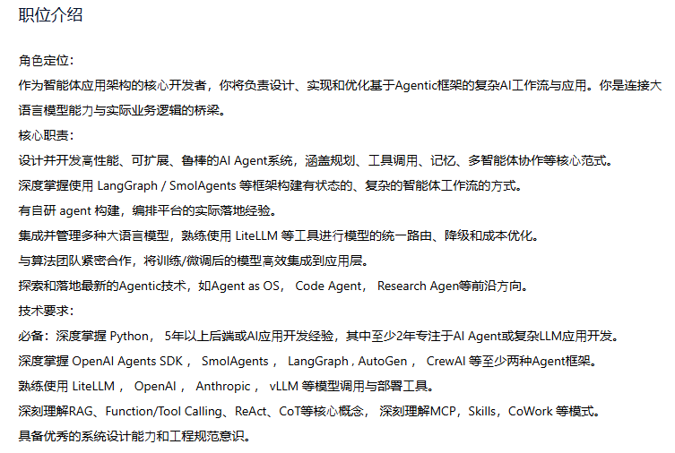
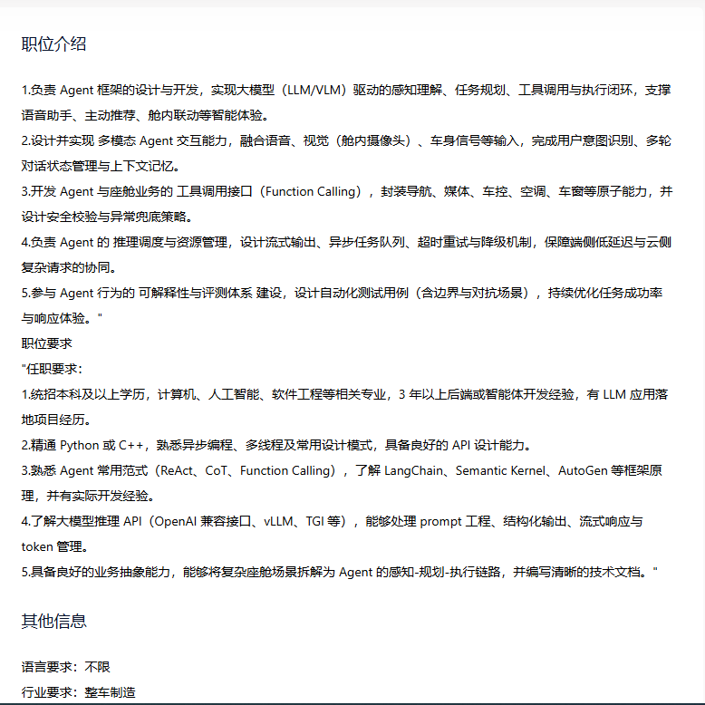
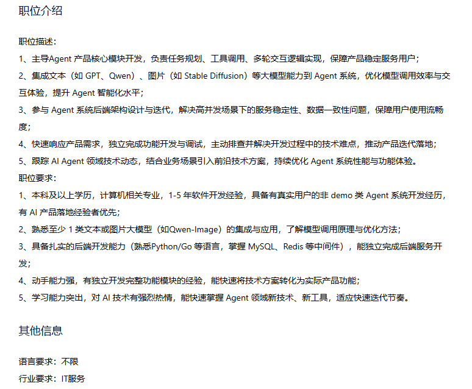

职位介绍

一、岗位职责 参与公司下一代 AI Agent 系统的设计与落地，围绕复杂任务自动化，构建具备任务理解、规划拆解、工具调用与自我迭代能力的智能体系统； 基于多 Agent 协同架构，设计并实现端到端任务执行流程（如 Proposal → Task → Coding → Fix 闭环），提升复杂问题的自动解决能力与系统稳定性； 负责大模型在工程场景中的系统化应用，包括： 多轮推理链路设计（如 CoT / ReAct / Tool Use） Prompt 设计与优化（结构化输出、上下文控制、Prompt Cache） 上下文管理与 Token 效率优化 参与 Agent 核心能力模块建设： Memory 机制设计（短期/长期记忆、状态管理、上下文演进） Tool 调用体系（代码执行、检索、环境操作等） 任务编排与执行机制（任务拆解、调度、回溯与自修复） 构建与优化 AI 系统工程能力，包括： Agent 评测与评估体系（Eval / Harness / 自动化评测） 系统稳定性与可观测性建设（调用成功率、延迟、成本等） Prompt 与策略的持续迭代优化机制 结合具体业务场景（如代码生成、开发辅助、运维自动化等），推动 Agent 能力从“可用”到“好用”，不断提升实际业务价值； 二、岗位要求 计算机相关专业，本科及以上学历，1-3 年开发经验； 熟悉 Python / Go / Java 等至少一门语言，具备良好的工程能力与代码规范； 了解主流大模型（如 GPT / Claude / 开源模型）的基本原理与调用方式，有实际项目经验优先； 理解 Prompt Engineering 基本方法（如 Few-shot、CoT、ReAct 等），有多轮对话或 Agent 应用经验优先；

其他信息

语言要求：普通话

行业要求：互联网,网络/信息安全,计算机硬件