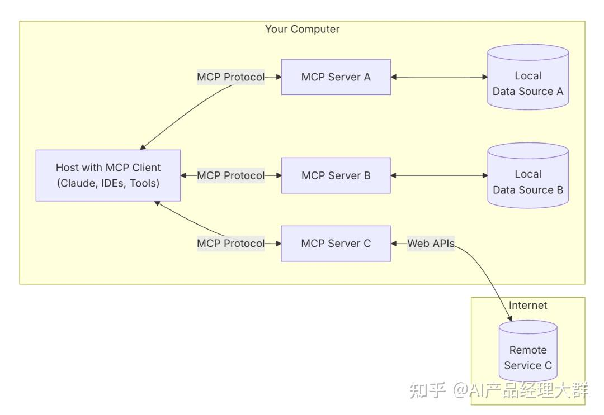

### MCP 逐渐被接受，是因为 MCP 是开放标准。在智能体应用项目开发中可以发现，集成 AI 模型复杂，现有框架如 LangChain Tools、LlamaIndex 和 Vercel AI SDK 存在问题。LangChain 和 LlamaIndex 代码抽象高，商业化过重；Vercel AI SDK 与 Nextjs 绑定过深。

## 一、什么是 MCP（Model Context Protocol）
MCP（Model Context Protocol，模型上下文协议） ，2024 年 11 月底，由 Anthropic 推出的一种开放标准，旨在统一大模型与外部数据源和工具之间的通信协议。MCP 的主要目的在于解决当前 AI 模型因数据孤岛限制而无法充分发挥潜力的难题，MCP 使得 AI 应用能够安全地访问和操作本地及远程数据，为 AI 应用提供了连接万物的接口。
即使是最强大模型也会受到数据隔离的限制，形成信息孤岛，要做出更强的大模型，每个新数据源都需要自己重新定制实现，使真正互联的系统难以扩展，存在很多的局限性。
现在，MCP 可以直接在 AI 与数据（包括本地数据和互联网数据）之间架起一座桥梁，通过 MCP 服务器和 MCP 客户端，大家只要都遵循这套协议，就能实现“万物互联”。
有了 MCP，可以和数据和文件系统、开发工具、Web 和浏览器自动化、生产力和通信、各种社区生态能力全部集成，实现强大的协作工作能力，它的价值远不可估量。

### MCP 核心架构
MCP 遵循客户端-服务器架构（client-server），其中包含以下几个核心概念：

- MCP 主机（MCP Hosts）：发起请求的 LLM 应用程序（例如 [Claude Desktop](https://zhida.zhihu.com/search?content_id=254488153&content_type=Article&match_order=1&q=Claude+Desktop&zhida_source=entity)、IDE 或 AI 工具）。
- MCP 客户端（MCP Clients）：在主机程序内部，与 MCP server 保持 1:1 的连接。
- MCP 服务器（MCP Servers）：为 MCP client 提供上下文、工具和 prompt 信息。
- 本地资源（Local Resources）：本地计算机中可供 MCP server 安全访问的资源（例如文件、数据库）。
- 远程资源（Remote Resources）：MCP server 可以连接到的远程资源（例如通过 API）。
- 