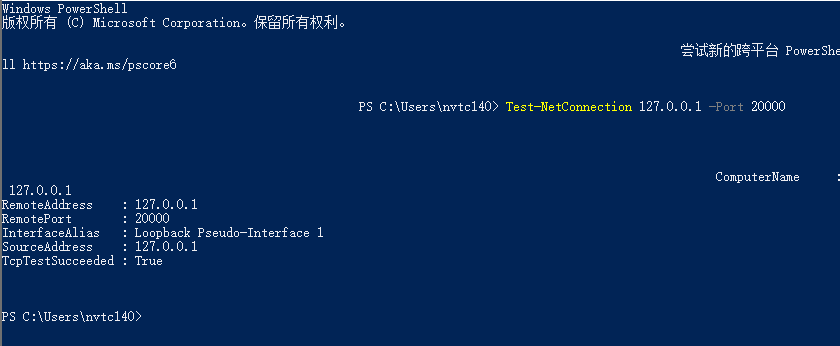
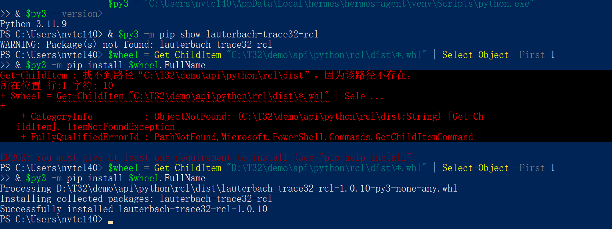
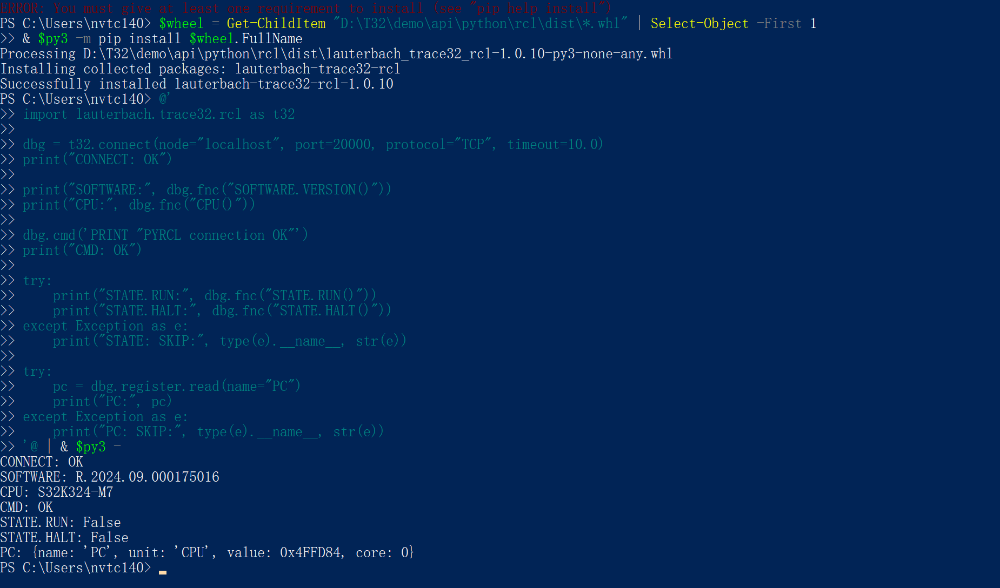
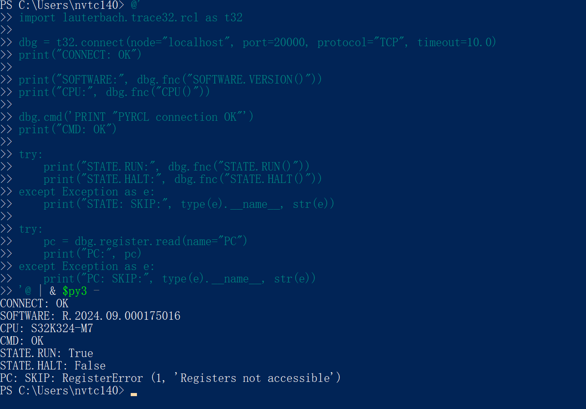
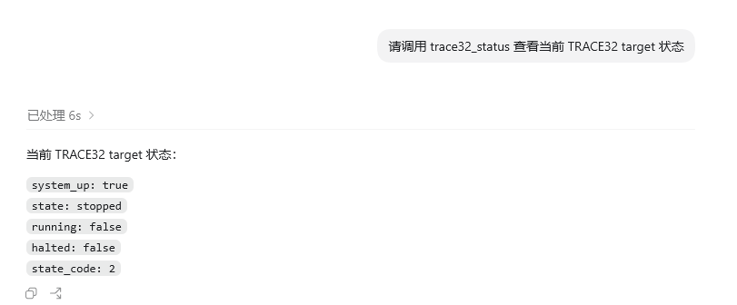

# 综述
LLM / Codex / IDE
        |
      MCP Client
        |
  Debugger MCP Server
        |
 DAP / GDB MI / LLDB / pydevd / Chrome DevTools Protocol
        |
   被调试程序
   

可以，而且你现在用 Lauterbach/TRACE 32，路线很清楚：**让 Codex 通过 MCP 调一个本地 `trace32-mcp-server`，这个 server 再通过 TRACE 32 Remote API/PYRCL 访问 PowerView**。

```
Codex
  -> MCP Client
    -> trace32-mcp-server
      -> lauterbach.trace32.rcl / TRACE32 Remote API
        -> TRACE32 PowerView
          -> Lauterbach Probe
            -> Target MCU
```

# **总体流程**

## **在 TRACE 32 侧打开 Remote API**  
    在 `config.t32` 里加独立 block。推荐 TCP：

```
RCL=NETTCP
PORT=20000
```

UDP/NETASSIST 也可以：

```
RCL=NETASSIST
PACKLEN=1024
PORT=20000
```

Lauterbach 官方 Python 文档说明 `lauterbach.trace32.rcl` 是 TRACE 32 Remote API 的 Python 接口，并且支持 TCP/UDP，TCP 推荐使用；配置示例也就是上面的 `RCL=NETTCP` 或 `RCL=NETASSIST` block。参考：[Controlling TRACE32 via Python 3](https://www2.lauterbach.com/pdf/app_python.pdf)。

## Windows 侧确认端口已打开  
    用 Python 先确认能连上 TRACE 32，而不是一上来写 MCP。最小验证动作：
    
    - `connect localhost:20000`
    - `ping`
    - 读 TRACE 32 版本
    - 读当前 target state
    - 读一个寄存器或变量


## 用 Python 3 安装/检查 PYRC

你当前 `python` 是 2.7，不能用。先用这个 Python 3.11：

```
$py3 = "C:\Users\nvtc140\AppData\Local\hermes\hermes-agent\venv\Scripts\python.exe"
& $py3 --version
```

检查是否已经安装：

```
& $py3 -m pip show lauterbach-trace32-rcl
```

如果没装，优先从 TRACE 32 本地 wheel 安装：

```
$wheel = Get-ChildItem "C:\T32\demo\api\python\rcl\dist\*.whl" | Select-Object -First 1
& $py3 -m pip install $wheel.FullName
```

如果本地没有 wheel，也可以：

```
& $py3 -m pip install lauterbach-trace32-rcl
```

PYRCL 官方建议用 pip 安装，wheel 通常在 `<T32SYS>\demo\api\python\rcl\dist`。参考：[PYRCL Installation](https://pyrcl.readthedocs.io/en/latest/sub/installation.html)。



## 执行最小 Python 连通性脚本


```
@'
import lauterbach.trace32.rcl as t32

dbg = t32.connect(node="localhost", port=20000, protocol="TCP", timeout=10.0)
print("CONNECT: OK")

print("SOFTWARE:", dbg.fnc("SOFTWARE.VERSION()"))
print("CPU:", dbg.fnc("CPU()"))

dbg.cmd('PRINT "PYRCL connection OK"')
print("CMD: OK")

try:
    print("STATE.RUN:", dbg.fnc("STATE.RUN()"))
    print("STATE.HALT:", dbg.fnc("STATE.HALT()"))
except Exception as e:
    print("STATE: SKIP:", type(e).__name__, str(e))

try:
    pc = dbg.register.read(name="PC")
    print("PC:", pc)
except Exception as e:
    print("PC: SKIP:", type(e).__name__, str(e))
'@ | & $py3 -
```





    如果你用 legacy Remote API，官方示例流程是 `T32_Config -> T32_Init -> T32_Attach -> T32_Ping -> T32_Exit`。如果用新项目，优先用 `lauterbach.trace32.rcl`，包在 TRACE 32 安装目录的 `~~/demo/api/python/rcl` 下。
    
    
## **写一个 TRACE 32 Adapter 层**  
    先不要把 MCP 和 TRACE 32 API 混在一起。建议先写：
    

```
Trace32Client
  connect()
  ping()
  cmd(command)
  get_state()
  read_register(name)
  read_variable(expr)
  read_memory(address, size)
  get_stack()
  get_window(name, format)
  go()
  break_target()
  step()
  set_breakpoint(file, line | symbol | address)
```

这一层负责 TRACE 32 连接、错误处理、超时、日志、互斥锁。TRACE 32 API 可以执行命令 `T32_Cmd`，也能读 message、window content、变量、状态、单步、go/break 等；官方 C API 文档也明确 Remote API 用于第三方程序控制和访问 target。参考：[API for Remote Control and JTAG Access in C](https://www2.lauterbach.com/pdf/api_remote_c.pdf)。
```
cd E:\trace32_mcp
& "C:\Users\nvtc140\AppData\Local\hermes\hermes-agent\venv\Scripts\python.exe" smoke_test.py
```

## **把 Adapter 包成 MCP Server**  
    MCP 工具建议分两类：只读工具和会改变目标状态的工具。

```
只读工具：
trace32_ping
trace32_status
trace32_snapshot
trace32_read_registers
trace32_read_variable
trace32_read_memory
trace32_stack
trace32_window
trace32_get_events

控制工具：
trace32_break
trace32_go
trace32_step
trace32_set_breakpoint
trace32_delete_breakpoint
trace32_run_practice
trace32_raw_command   # 强烈建议默认禁用
```

`trace32_snapshot` 很关键，它一次性返回 Codex 最常用的上下文：

```
{
  "state": "stopped",
  "pc": "0x08001234",
  "sp": "0x2000ff00",
  "function": "CanIf_RxIndication",
  "registers": {},
  "locals": {},
  "watch": {},
  "stack": []
}
```

E:\trace 32_mcp\server.py


## **在 Codex 中注册 MCP Server**  
    Codex 的 MCP 配置放在 `config.toml`，支持本地 STDIO server 和 HTTP server；官方文档说明可以用 `codex mcp add` 或直接编辑 `config.toml`。参考：[Codex MCP docs](https://developers.openai.com/codex/mcp)。
    
    示例：
    

```
[mcp_servers.trace32]
command = "C:\\path\\to\\venv\\Scripts\\python.exe"
args = ["C:\\path\\to\\trace32-mcp\\server.py"]
cwd = "C:\\path\\to\\trace32-mcp"
startup_timeout_sec = 20
tool_timeout_sec = 15
default_tools_approval_mode = "prompt"
enabled = true
```

早期建议只开放只读工具：

```
enabled_tools = [
  "trace32_ping",
  "trace32_status",
  "trace32_snapshot",
  "trace32_read_registers",
  "trace32_read_variable",
  "trace32_stack"
]
```


## 验证一下是否加载工具

```
codex mcp list
trace32 ... enabled
```

也就是说配置已经被 Codex 识别到了。接下来分两层验证。

### **第一层：确认当前 Codex 会话是否加载了工具**

在 Codex 里直接问一句：

```
请调用 trace32_status 查看当前 TRACE32 target 状态
```

或者：

```
请调用 trace32_info 读取 TRACE32 版本、CPU 和 target 状态
```

如果 MCP 已加载成功，Codex 应该能直接调用工具，并返回类似：

```
{
  "ok": true,
  "result": {
    "version": "R.2024.09.000175016",
    "cpu": "S32K324-M7",
    "target": {
      "system_up": true,
      "running": false,
      "state": "stopped"
    }
  }
}
```



### **第二层：如果当前会话看不到工具**

我这个当前线程里还没看到 `trace32_*` 工具，说明它可能是在你注册 MCP 之前启动的。处理方式：

1. 重启 Codex App，或开一个新的 Codex 线程。
2. 进入新线程后输入：

```
请列出当前可用的 TRACE32 MCP 工具
```

3. 再测试：

```
请调用 trace32_snapshot，读取 PC 和 SP
```

预期能看到：

```
trace32_ping
trace32_info
trace32_status
trace32_snapshot
trace32_read_register
trace32_read_registers
trace32_read_variable
trace32_read_uint32
trace32_reconnect
```

如果调用失败，按错误判断：

```
Connection refused
```

说明 TRACE 32 PowerView 没开、端口不对，或 `RCL=NETTCP PORT=20000` 没生效。

```
ModuleNotFoundError
```

说明 MCP 配置里的 Python 不是那个已安装 `mcp` 和 `lauterbach-trace32-rcl` 的 venv。

```
Registers not accessible
```

说明 target 正在 running，读 PC/SP 这类核心寄存器需要先 halt。

你现在最推荐的验证提示词是：

```
请通过 TRACE32 MCP 调用 trace32_info，然后调用 trace32_snapshot 读取 PC 和 SP。
```


## **实现“实时获取”的正确方式**  
    Codex/MCP 更适合“工具调用式实时”，不是毫秒级推送流。所以要在 MCP Server 内部做后台采样：

```
watch_start(items, interval_ms)
watch_latest()
watch_history(seconds)
watch_stop()
```

后台线程每 200 ms、500 ms 或 1 s 从 TRACE 32 读取指定寄存器/变量/window，并写入 ring buffer。Codex 需要分析时调用 `watch_latest` 或 `watch_history`。这样 Codex 看起来就像能实时观察调试器，但不会让 LLM 自己疯狂轮询 TRACE 32。

## **嵌入式场景要特别注意干扰**  
    如果 target 正在跑，频繁 halt/read/go 会改变实时行为。建议：
    - 只读 MVP 先限制在 target stopped 时读变量、栈、寄存器。
    - running 状态下优先读 TRACE 32 trace/profiler/window 已采集数据。
    - 对 `break/go/step/raw_command` 设置人工确认。
    - 限制 `read_memory` 最大长度，比如 4 KB。
    - 默认只允许连接 `127.0.0.1`，不要直接暴露到局域网。

**推荐落地顺序**

先做 1 天 MVP：TRACE 32 Remote API 连通、`ping/status/read_register/read_variable/snapshot`、Codex 能通过 MCP 调到。  
第二步再做 watch/ring buffer。  
第三步才开放 `break/go/step/breakpoint`。  
最后再考虑 `raw_command` 和 PRACTICE 脚本执行。这个顺序最稳，不容易把调试现场搞乱。


## 如何调用？
不用必须说具体工具名。正常使用时你完全可以说：

```
请用 TRACE32 MCP 看一下当前调试现场，帮我判断为什么卡住了。
```

或者：

```
请通过 TRACE32 MCP 获取当前调用栈、局部变量和关键寄存器，分析这个 CAN 发送问题。
```

我刚把 [server.py](E:/trace32_mcp/server.py) 的 MCP instructions 强化了：当用户说 `TRACE32 MCP`、`current debug context`、`call stack`、`locals`、`globals`、`watch variables`、`诊断 stopped firmware bug` 这类话时，优先使用 `trace32_debug_context`。

有两个小提醒：

1. 你改完 `server.py` 后，需要重启 Codex 或开新线程，让 MCP server 重新加载说明。
2. 如果 `config.toml` 里配置了 `enabled_tools` 白名单，要把新工具也加进去，否则 Codex 仍然看不到它们。

以后精确工具名只在测试/排错时需要。日常调试直接说“TRACE 32 MCP 获取当前调试上下文”就可以。