# ETAS AUTOSAR PNC 入门笔记

资料来源：

- PDF：`E:\ETAS_AUTOSAR_User_Manual_PNC.pdf`
- 结合工程：`E:\github\tc377_l9388`
- 图片：从 PDF 原图抽取，存放在 `assets/ETAS_AUTOSAR_User_Manual_PNC`

这篇笔记按零基础理解来写。先不背 AUTOSAR 名词，先抓住一句话：

> PNC（Partial Networking Cluster，局部网络簇）就是把一条 CAN 总线上的通信按功能分组，只让“跟当前功能有关的 ECU”保持醒着，跟当前功能无关的 ECU 可以睡觉省电。

---

## 1. 先用一句人话理解 PNC

传统 CAN 网络里，如果总线上还有 NM 报文，很多 ECU 会被认为“网络还活着”，于是跟着保持唤醒。PNC 想解决的问题是：同一条 CAN 总线上，可能只有一部分功能还要通信，其他功能相关的 ECU 不应该被白白叫醒。

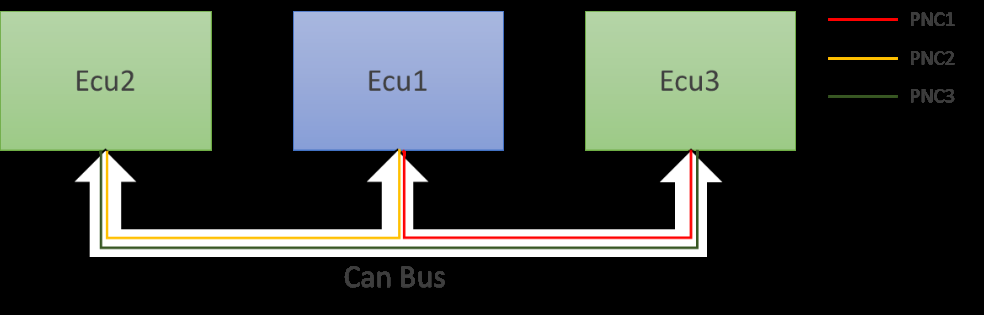

上图可以这样理解：

- 一条 CAN Bus 上挂了 ECU1、ECU2、ECU3。
- 总线上的报文被分成 PNC1、PNC2、PNC3 这些“功能小组”。
- ECU1 只关心 PNC1 和 PNC2。
- 如果当前只有 PNC3 在活动，ECU1 就可以判断“这事跟我没关系”，不必因为总线还在通信就一直醒着。

所以 PNC 的核心不是“总线有没有报文”，而是“这些报文请求的功能簇跟我有没有关系”。

---

## 2. PNC 不是一个模块，而是一串模块配合

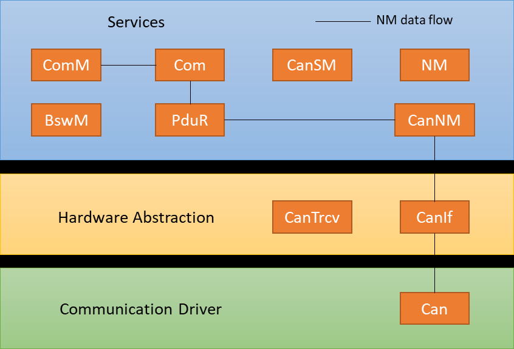

PNC 在 AUTOSAR 里不是只配一个开关。它从硬件收发器、CAN NM、Com、ComM、BswM 一路串起来：

| 模块 | 通俗理解 | 在 PNC 里的作用 |
|---|---|---|
| CanTrcv | CAN 收发器 | 支持 selective wakeup 时，可以在 MCU 睡着时用硬件过滤唤醒帧 |
| CanIf | CAN 驱动上层接口 | 把 CanNm、CanSM 和下层 CAN/收发器连接起来 |
| CanSM | CAN 状态管理 | 管 CAN 网络状态，也接收 PN availability 之类通知 |
| CanNm | 网络管理 | 看 NM PDU 里的 PNC bit，判断收到的 NM 是否跟本 ECU 有关 |
| PduR | 路由器 | 在 CanNm 和 Com 之间搬运 NM User Data/EIRA PDU |
| Com | 信号层 | 把 PN bit vector 当作信号收发 |
| ComM | 通信管理 | 维护 PNC 状态机，处理用户对某个 PNC 的通信请求 |
| BswM | 模式管理 | 根据 PNC 状态开关 PDU Group，决定相关 I-PDU 是否收发 |

一条典型路径可以这样看：

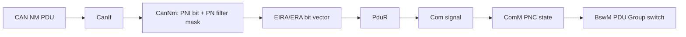

---

## 3. PNC 信息藏在 NM PDU 里

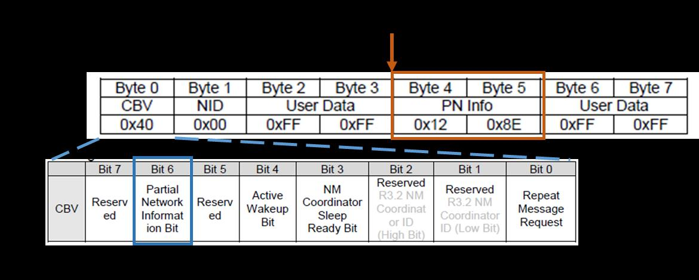

这张图是理解 PNC 的关键。NM PDU 里有几个重要点：

- CBV（Control Bit Vector）里 bit 6 是 PNI bit。
- PNI bit = 1 表示这个 NM PDU 里带了 Partial Networking 信息。
- User Data 里会放 PN bit vector。
- 一个 bit 代表一个 PNC 是否被请求。
- `CanNmPnInfoOffset` 决定 PN 信息从 User Data 的哪个字节开始。
- `CanNmPnInfoLength` 决定 PN 信息长度。

最简单的判断公式：

```text
收到的 PN 信息 & 本 ECU 关心的 PN Filter Mask
```

结果非 0：这条 NM PDU 请求了本 ECU 关心的 PNC，需要处理。  
结果为 0：这条 NM PDU 请求的 PNC 跟本 ECU 无关，可以不让它把 ECU 保持唤醒。

---

## 4. 用 tc377_l9388 的配置把 bit 看懂

工程里 CanNm 的 PN 配置在：

- `E:\github\tc377_l9388\BasicSoftware\BasicSoftware\src\bsw\CanNm_PreCompile_and_PB_Variant\CanNm_Cfg_Internal.h`
- `E:\github\tc377_l9388\BasicSoftware\BasicSoftware\src\bsw\CanNm_PreCompile_and_PB_Variant\CanNm_PBcfg.c`

当前工程的关键配置：

```c
#define CANNM_PN_ENABLED          STD_ON
#define CANNM_EIRACALC_ENABLED   STD_ON
#define CANNM_ERACALC_ENABLED    STD_OFF
#define CANNM_PN_INFOLENGTH      6U
#define CANNM_PN_INFO_OFFSET     2U
```

也就是说：

- 工程启用了 PNC。
- 启用了 EIRA 计算。
- 没启用 ERA 计算，说明当前不像网关那样维护每个通道的外部请求阵列。
- PN 信息从 NM PDU User Data 的第 2 字节开始。
- PN 信息长度是 6 字节。

工程中的 PN filter mask 是：

```c
static const uint8 CanNm_PnFilterMask[CANNM_PN_INFOLENGTH] =
{
    0x43, 0xF0, 0x00, 0x00, 0x00, 0x00
};
```

把 `0x43F0` 展开看：

| PNC | PN 信息位置 | mask | 对应用户 |
|---|---:|---:|---|
| PNC16 | byte 0 bit 0 | `0x01` | `PNCUser_16` |
| PNC17 | byte 0 bit 1 | `0x02` | `PNCUser_17` |
| PNC22 | byte 0 bit 6 | `0x40` | `PNCUser_22` |
| PNC28 | byte 1 bit 4 | `0x10` | `PNCUser_28` |
| PNC29 | byte 1 bit 5 | `0x20` | `PNCUser_29` |
| PNC30 | byte 1 bit 6 | `0x40` | `PNCUser_30` |
| PNC31 | byte 1 bit 7 | `0x80` | `PNCUser_31` |

为什么 PNC16 正好是 byte 0 bit 0？因为 ComM 配置里：

```c
#define COMM_PNC_VECTOR_OFFSET             2u
#define COMM_PNC_VECTOR_STARTBITPOSITION   (COMM_PNC_VECTOR_OFFSET * 8u)
```

`2 * 8 = 16`，所以 PN vector 的第一个 bit 对应 PNC16。

ASW 里也能看到同样的影子：

- `E:\github\tc377_l9388\ASW\NmUT\src\NmUT.c`
- `PNIbit = (CanNm_RamData_s[0].RxBuffer_au8[1] >> 6) & 0x01u;`
- `receivedUserdata = (CanNm_RamData_s[0].RxBuffer_au8[2] << 8) | CanNm_RamData_s[0].RxBuffer_au8[3];`
- `userdatamask = 0x43F0;`

这里 ASW 读取的是：

- `RxBuffer[1]` 的 bit 6，也就是 PNI bit。
- `RxBuffer[2]` 和 `RxBuffer[3]`，也就是 PN vector 的前两个字节。
- `0x43F0`，正好对应上面 7 个 PNC。

---

## 5. CanNm 怎么判断“这条 NM 跟我有关”

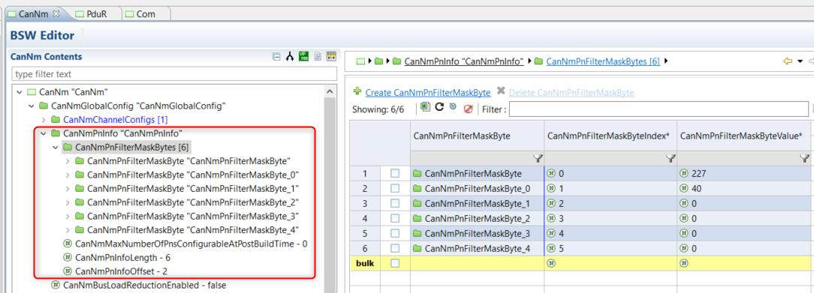

PDF 里的配置截图对应的就是 CanNm PN 信息和 filter mask。工程里的判断逻辑在：

- `E:\github\tc377_l9388\BasicSoftware\BasicSoftware\src\bsw\CanNm\src\CanNm_RxIndication.c`

核心逻辑可以简化成：

```c
PNIBitStatus = SduDataPtr[CBV] & 0x40;

for (i = 0; i < PN_INFO_LENGTH; i++)
{
    data[i] = SduDataPtr[PN_INFO_OFFSET + i] & PnFilterMask[i];
}

if (PNIBitStatus != 0 && any(data[i] != 0))
{
    ProcessPdu = TRUE;
}
```

举几个直观例子：

| 收到的 PN 信息 | 本 ECU mask | 结果 | 含义 |
|---:|---:|---:|---|
| `0x4000` | `0x43F0` | `0x4000` | PNC22 被请求，本 ECU 关心，处理 |
| `0x0040` | `0x43F0` | `0x0040` | PNC30 被请求，本 ECU 关心，处理 |
| `0x0008` | `0x43F0` | `0x0000` | 请求了别的 PNC，本 ECU 不关心 |
| `0x0000` | `0x43F0` | `0x0000` | 没有相关 PNC 请求 |

工程 ARXML 里 `CanNmAllNmMessagesKeepAwake` 是 `false`。这很关键：

- 如果收到的 NM PDU 和本 ECU 的 PNC 无关，就不会因为这条 NM PDU 继续保持唤醒。
- 如果这个参数是 `true`，所有 NM PDU 都会倾向于保持唤醒，PN 省电效果会被削弱。这个设置通常更像网关场景会用。

---

## 6. EIRA 和 ERA 是什么

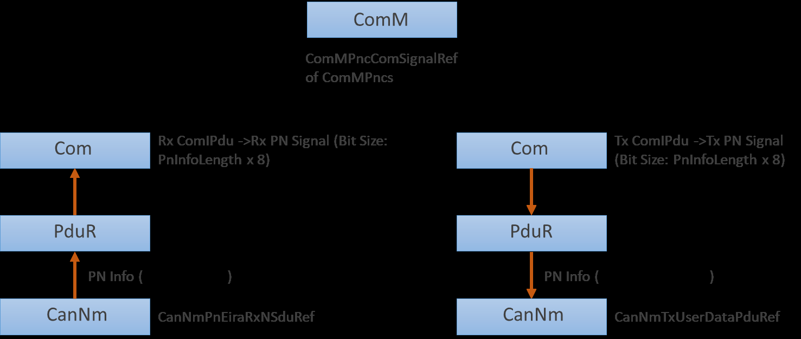

可以先这样记：

- EIRA：External Internal Request Array。把本 ECU 看到的 PNC 请求聚合成一个 bit vector，供 Com/ComM 使用。
- ERA：External Request Array。更偏网关用，记录每个通道外部来的 PNC 请求。

当前工程：

```c
#define CANNM_EIRACALC_ENABLED STD_ON
#define CANNM_ERACALC_ENABLED  STD_OFF
```

所以重点看 EIRA。

CanNm 收到 NM PDU 后，如果某个 PNC bit 被请求，就会：

1. 更新 EIRA 当前状态。
2. 重新加载该 PNC 的 PN timer。
3. 在 timer 没超时前认为该 PNC 仍然被请求。
4. EIRA 状态变化后，通过 PduR/Com 送给 ComM。

工程里这段主要在：

- `E:\github\tc377_l9388\BasicSoftware\BasicSoftware\src\bsw\CanNm\src\CanNm.c`

其中 PN reset time 在配置里是 `590`。可以把它理解成：收到某个 PNC 请求后，这个请求可以保持一段时间；如果后续一直没再收到对应请求，timer 超时后这个 PNC bit 会被清掉。

手册给的原则是：

```text
CanNmMsgCycleTime < CanNmPnResetTime < CanNmTimeoutTime
```

也就是 PN 请求保持时间要比 NM 报文周期长，但不能长过 NM 超时。

---

## 7. ComM PNC 状态机

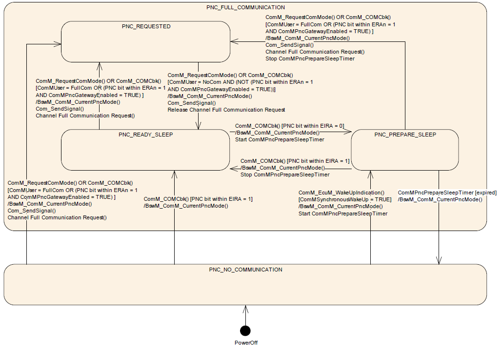

CanNm 只是判断“外部有没有请求某个 PNC”。真正决定某个 PNC 当前处于什么通信状态的是 ComM。

可以把 ComM 的 PNC 状态这样理解：

| 状态 | 通俗解释 |
|---|---|
| `COMM_PNC_NO_COMMUNICATION` | 没人需要这个 PNC，相关通信可以关掉 |
| `COMM_PNC_REQUESTED` | 本地用户或外部网络正在请求这个 PNC，需要保持通信 |
| `COMM_PNC_READY_SLEEP` | 已经没有本地强请求，准备睡，但还在等待协调 |
| `COMM_PNC_PREPARE_SLEEP` | 睡前准备阶段，通常会等一个 timer 再真正进入 No Communication |

工程中可以直接观察：

- `E:\github\tc377_l9388\ASW\NmUT\src\NmUT.c`
- `ComM_PncRamStruct[0].PncState_en`
- `ComM_PncRamStruct[1].PncState_en`
- ...
- `ComM_PncRamStruct[6].PncState_en`

这些变量在 ASW 中被读出来做调试，分别对应 PNC16、PNC17、PNC22、PNC28、PNC29、PNC30、PNC31。

---

## 8. PNC、User、Channel 的关系

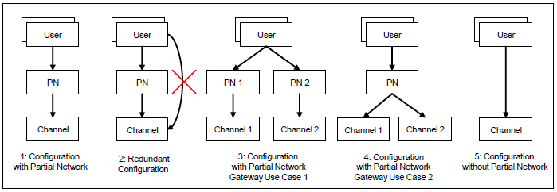

这张图讲的是映射关系，容易混：

- User：软件功能用户，比如某个 SWC 需要请求通信。
- PNC：功能通信簇，比如 PNC30。
- Channel：实际 CAN 通道，比如 ChassisCAN2。

一个 PNC 可以关联多个 User，也可以关联多个 Channel。一个 User 也可能关联多个 PNC。

当前工程比较直接：

- `COMM_NO_OF_PNCS = 7`
- PNC ID 是 16、17、22、28、29、30、31。
- 每个 PNC 都映射到 `ChassisCAN2`。
- 每个 PNC 都有一个对应的 `PNCUser_x`。

配置位置：

- `E:\github\tc377_l9388\BasicSoftware\BasicSoftware\src\bsw\ComM\ComM_PBcfg.c`

ASW 里通过 RTE 调 ComM 用户接口，比如：

```c
Rte_Call_UR_PNCUser_30_RequestComMode(COMM_FULL_COMMUNICATION);
Rte_Call_UR_PNCUser_30_RequestComMode(COMM_NO_COMMUNICATION);
```

这可以理解成：

- `FULL_COMMUNICATION`：我现在需要 PNC30，别睡。
- `NO_COMMUNICATION`：我不再需要 PNC30，可以释放。

`NmUT.c` 里可以看到 Test_17、Test_22、Test_28、Test_29、Test_31 等测试变量，它们用来手动请求不同 PNC 的 Full/No Communication。

---

## 9. ComM 怎么把 PNC ID 放进发送 bit vector

工程中这段逻辑在：

- `E:\github\tc377_l9388\BasicSoftware\BasicSoftware\src\bsw\ComM\src\ComM_LPncMainFunction.c`

简化后是：

```c
byteIndex = (PncId - COMM_PNC_VECTOR_STARTBITPOSITION) >> 3;
bitPosition = (PncId - COMM_PNC_VECTOR_STARTBITPOSITION) % 8;
pnSignalValues[byteIndex] |= (1u << bitPosition);
```

以 PNC30 为例：

```text
COMM_PNC_VECTOR_STARTBITPOSITION = 16
PNC30 - 16 = 14
byteIndex = 14 / 8 = 1
bitPosition = 14 % 8 = 6
```

所以 PNC30 对应 PN vector 的 byte 1 bit 6，也就是 `0x40`。这和前面的 `0x43F0` mask 完全对得上。

---

## 10. PduR 和 Com 的配置截图怎么看

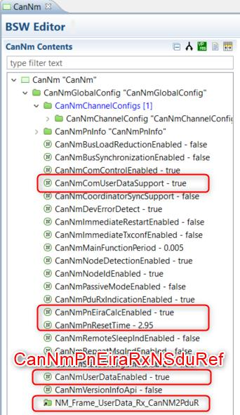

这张图表示 CanNm 要有一个 EIRA Rx NSdu，供 EIRA 数据往上走。

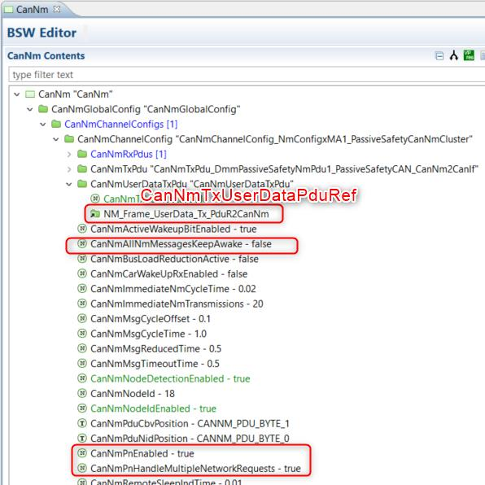

这张图表示 CanNm 发送 NM User Data 时，需要关联对应的 Tx User Data PDU。ComM 请求某个 PNC 后，PN bit vector 最终也要进入 NM User Data。

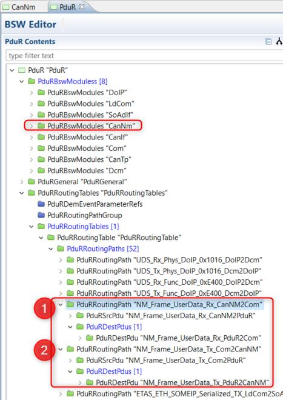

PduR 的作用可以简单理解为“搬运”。它不理解 PNC 业务含义，只负责把：

- CanNm 侧的 User Data PDU 搬到 Com。
- Com 侧准备好的 User Data PDU 搬到 CanNm。

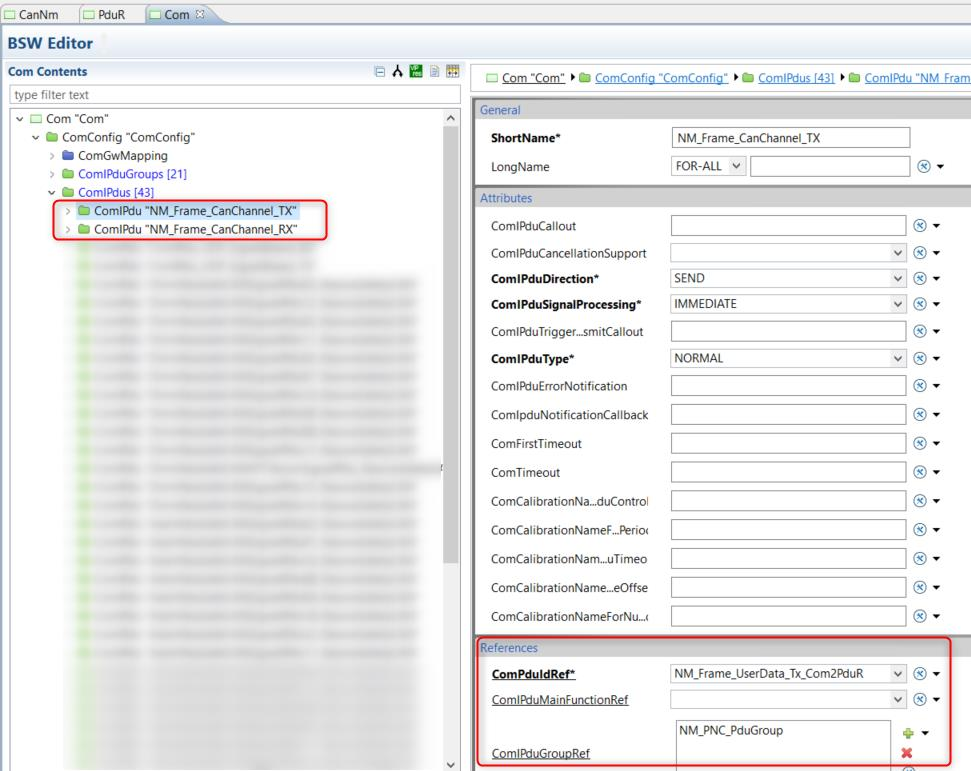

Com 里需要配置承载 PN bit vector 的 I-PDU。手册里强调这类信号通常用 `UINT8_N`/opaque 方式处理，因为它本质上是一串 bit vector，不是普通物理量。

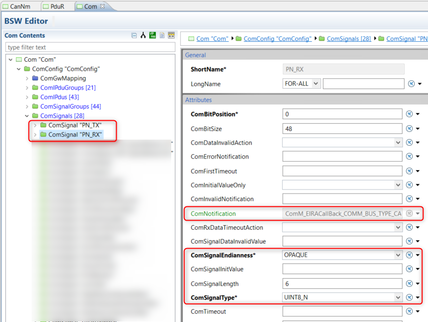

这张图对应 PN bit vector 的信号配置。把它和工程里的 `COMM_PNC_VECTOR_OFFSET = 2`、`COMM_PNC_VECTOR_LENGTH = 6` 放在一起看，会更清楚：ComM/Com/CanNm 必须对 PN vector 的起点和长度理解一致，否则 bit 会错位。

---

## 11. ComM 和 BswM 的配置截图怎么看

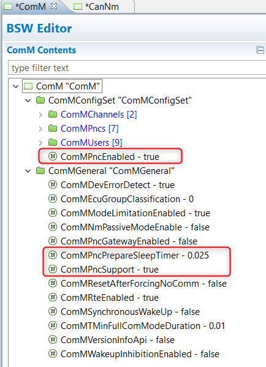

ComM General 里要启用 PNC，并配置 PNC vector offset、长度、prepare sleep timer 等参数。

当前工程中：

- `COMM_PNC_ENABLED = STD_ON`
- `COMM_PNC_VECTOR_OFFSET = 2`
- `COMM_PNC_VECTOR_LENGTH = 6`
- `COMM_NO_OF_PNCS = 7`

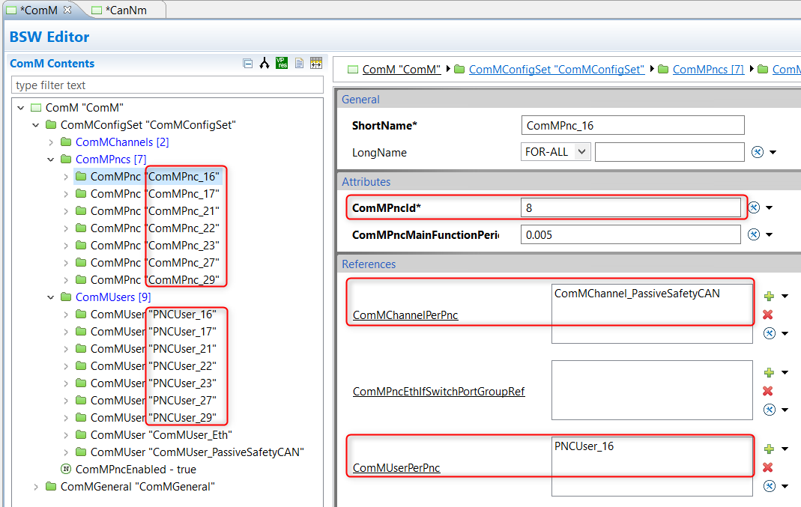

这张图是具体 PNC 条目的配置。每个 PNC 要知道：

- 自己的 PNC ID。
- 属于哪些 Channel。
- 被哪些 User 请求。

工程中的对应文件：

- `E:\github\tc377_l9388\BasicSoftware\BasicSoftware\src\bsw\ComM\ComM_PBcfg.c`

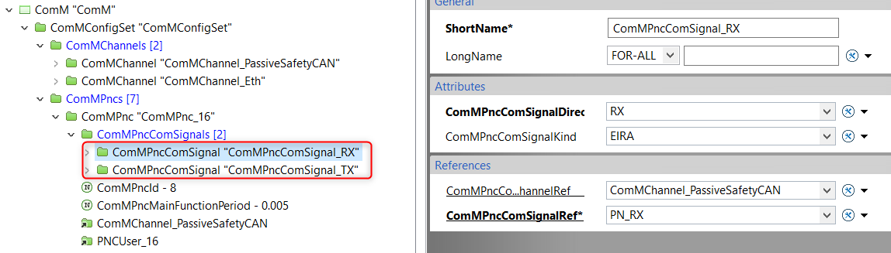

这张图是 ComM 和 ComSignal 的关联。ComM 需要知道哪个 Com signal 是 PN bit vector，这样才能读 EIRA、发送自己的 PN 请求。

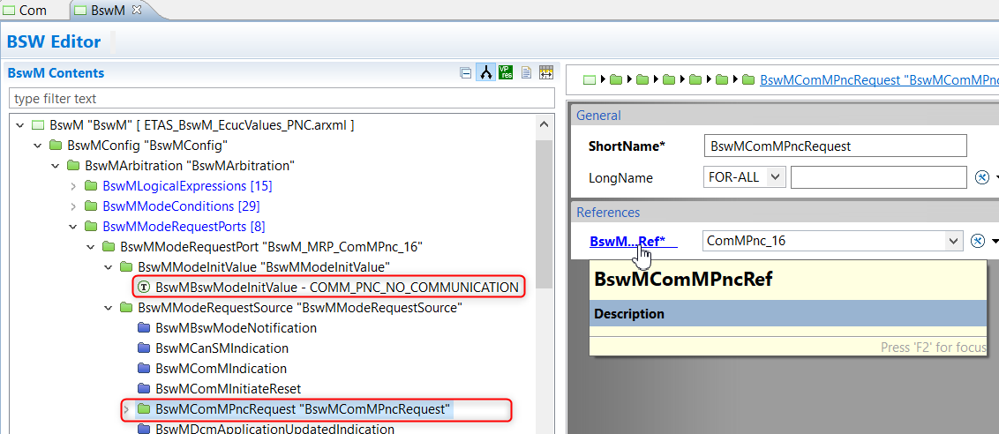

BswM 监听 ComM 的 PNC 状态变化。工程中的通知入口是：

- `E:\github\tc377_l9388\BasicSoftware\BasicSoftware\src\bsw\BswM\src\BswM_ComM.c`
- `BswM_ComM_CurrentPNCMode(PNCHandleType PNC, ComM_PncModeType CurrentPncMode)`

直观理解：

- ComM 告诉 BswM：PNC30 现在 Requested / ReadySleep / PrepareSleep / NoCommunication。
- BswM 根据规则决定相关 PDU Group 开还是关。
- 这样做到“只有相关 PNC 活跃时，相关 I-PDU 才参与通信”。

---

## 12. Selective Wakeup：PNC 的硬件省电部分

PNC 有两层意思，容易混：

| 层次 | 作用 |
|---|---|
| 软件 PNC | MCU 醒着并收到 NM PDU 后，判断这条 NM 是否和自己相关 |
| 硬件 Selective Wakeup | MCU 睡着时，CAN 收发器先过滤唤醒帧，只有匹配的帧才叫醒 MCU |

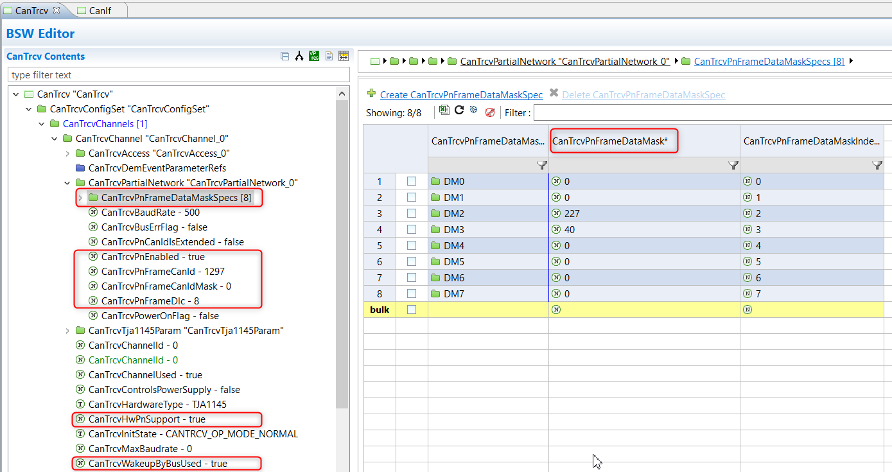

手册里以 TJA1145 为例。收发器可以配置：

- 唤醒帧 CAN ID。
- CAN ID mask。
- Data mask。
- DLC。

其中 Data mask 的思路和 PN filter mask 类似：只关心 mask 中指定的那些 bit。这样 ECU 在深睡时，不必被所有 CAN 活动叫醒。

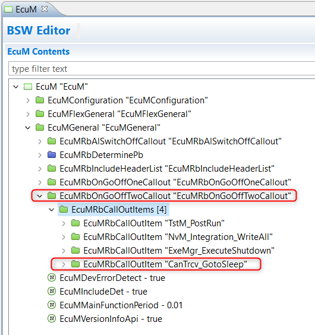

手册强调在 EcuM 进入 sleep 前，要让 CanTrcv 正确下发 sleep 相关命令。对 TJA1145 这类收发器，通常需要：

- 启用 remote CAN wakeup。
- 启用 selective wakeup。
- 写入对应 SPI 寄存器。
- 再让收发器进入 sleep。

当前 `tc377_l9388` 工程里要特别注意：

- `E:\github\tc377_l9388\BasicSoftware\BasicSoftware\integration\src\bsw\CanTrcv\user\CanTrcv_Integration.c`
- `CanTrcv_Init()` 还是 `Customer Integration Required`。
- `CanTrcv_TJA1145_GotoSleep()` 也是 `Customer Integration Required`。

也就是说，当前工程里软件侧 PNC/ComM/CanNm 这条链路有配置和代码，但硬件 selective wakeup 这一段还没有完整集成。

另外：

- CanIf 里 `CanIfPublicPnSupport` 是 `true`。
- CanIf 的 `ConfirmPnAvailability` 配到了 `CanSM_ConfirmPnAvailability`。
- CanSM 里 `CanSMPncSupport` 是 `true`。
- 但 CanSM 网络配置里 transceiver handle 显示为 `255`，并且相关 PN flag 为 `FALSE`，这也说明当前收发器 PN 支持链路还需要进一步补齐。

---

## 13. 把整个流程串起来

下面用一次“外部请求 PNC30”为例：

1. 其他 ECU 发 NM PDU。
2. CBV bit 6 置 1，表示带 PN 信息。
3. PN vector 里 PNC30 对应的 bit 置 1，也就是 byte 1 bit 6。
4. 本 ECU 的 CanNm 用 mask `0x43F0` 做过滤。
5. 结果非 0，说明 PNC30 是本 ECU 关心的 PNC。
6. CanNm 更新 EIRA，并刷新 PNC30 的 PN timer。
7. EIRA 通过 PduR/Com 传到 ComM。
8. ComM 把 PNC30 状态推到 Requested 或保持相关状态。
9. ComM 通知 BswM。
10. BswM 打开 PNC30 相关 PDU Group。
11. ASW 或 BSW 相关通信继续工作。

如果之后一直没有 PNC30 请求：

1. PN timer 超时。
2. EIRA 里 PNC30 bit 清掉。
3. ComM 状态逐步进入 ReadySleep / PrepareSleep / NoCommunication。
4. BswM 关闭相关 PDU Group。
5. 如果整个通道也无其他请求，ECU 可以继续往低功耗走。

---

## 14. 在 tc377_l9388 里调试 PNC 可以看什么

优先看这些变量或配置：

| 想确认的问题 | 建议观察点 |
|---|---|
| 收到的 NM 是否带 PN 信息 | `CanNm_RamData_s[0].RxBuffer_au8[1]` 的 bit 6 |
| 收到的 PN vector 是什么 | `CanNm_RamData_s[0].RxBuffer_au8[2]`、`RxBuffer_au8[3]` |
| 本 ECU 关心哪些 PNC | `CanNm_PnFilterMask = {0x43, 0xF0, ...}` |
| PN 过滤是否启用 | `CanNm_RamData_s[0].PnMsgFilteringEnabled_b` |
| EIRA 当前状态 | `CanNm_EIRACurrentStatus_au8` / `CanNm_EIRAGlobalStatus_au8` |
| PN timer 是否刷新 | `CanNm_PNTimer_au32` |
| ComM PNC 状态 | `ComM_PncRamStruct[x].PncState_en` |
| ASW 是否主动请求 PNC | `Rte_Call_UR_PNCUser_x_RequestComMode(...)` |
| BswM 是否收到状态 | `BswM_ComM_CurrentPNCMode(...)` |
| 硬件 selective wakeup 是否完整 | `CanTrcv_TJA1145_GotoSleep()` 是否已实现 |

工程中的 `NmUT.c` 已经把很多调试变量拉出来了：

- `PNIbit`
- `receivedUserdata`
- `userdatamask`
- `PNC16_state`
- `PNC17_state`
- `PNC22_state`
- `PNC28_state`
- `PNC29_state`
- `PNC30_state`
- `PNC31_state`

这些变量很适合在 TRACE32 或调试器里直接观察。

---

## 15. 最后用一句话记住

PNC 的本质是：

```text
NM PDU 里带 PNC bit
  -> CanNm 用 filter mask 判断是不是本 ECU 关心的 PNC
  -> EIRA/Com 把结果交给 ComM
  -> ComM 维护 PNC 状态
  -> BswM 根据状态开关 PDU Group
  -> CanTrcv selective wakeup 负责更深层的硬件唤醒过滤
```

如果只记三个关键词：

- `PNI bit`：这条 NM PDU 有没有带 PN 信息。
- `PN filter mask`：本 ECU 到底关心哪些 PNC。
- `ComM PNC state`：当前某个 PNC 到底是 Requested、ReadySleep、PrepareSleep 还是 NoCommunication。

---

## 16. 本工程代码索引

| 文件 | 作用 |
|---|---|
| `E:\github\tc377_l9388\ASW\NmUT\src\NmUT.c` | ASW 侧 PNC 调试变量和 PNCUser 请求调用 |
| `E:\github\tc377_l9388\BasicSoftware\BasicSoftware\src\bsw\CanNm_PreCompile_and_PB_Variant\CanNm_Cfg_Internal.h` | CanNm PN 开关、PN offset、PN length、EIRA/ERA 开关 |
| `E:\github\tc377_l9388\BasicSoftware\BasicSoftware\src\bsw\CanNm_PreCompile_and_PB_Variant\CanNm_PBcfg.c` | CanNm PN filter mask、PN 信息表、PN reset time |
| `E:\github\tc377_l9388\BasicSoftware\BasicSoftware\src\bsw\CanNm\src\CanNm_RxIndication.c` | 收到 NM PDU 后的 PNI bit 检查和 PN filter 算法 |
| `E:\github\tc377_l9388\BasicSoftware\BasicSoftware\src\bsw\CanNm\src\CanNm.c` | EIRA 状态、PN timer、EIRA PDU 上报 |
| `E:\github\tc377_l9388\BasicSoftware\BasicSoftware\src\bsw\ComM\ComM_Cfg_Internal.h` | ComM PNC 开关、vector offset、vector length |
| `E:\github\tc377_l9388\BasicSoftware\BasicSoftware\src\bsw\ComM\ComM_PBcfg.c` | PNC、PNCUser、Channel 映射 |
| `E:\github\tc377_l9388\BasicSoftware\BasicSoftware\src\bsw\ComM\src\ComM_LPncMainFunction.c` | ComM PNC 状态机和 PNC bit 设置/清除 |
| `E:\github\tc377_l9388\BasicSoftware\BasicSoftware\src\bsw\BswM\src\BswM_ComM.c` | BswM 接收 ComM PNC 状态通知 |
| `E:\github\tc377_l9388\BasicSoftware\BasicSoftware\integration\src\bsw\CanTrcv\user\CanTrcv_Integration.c` | CanTrcv/TJA1145 selective wakeup 集成入口，目前仍需用户实现 |

