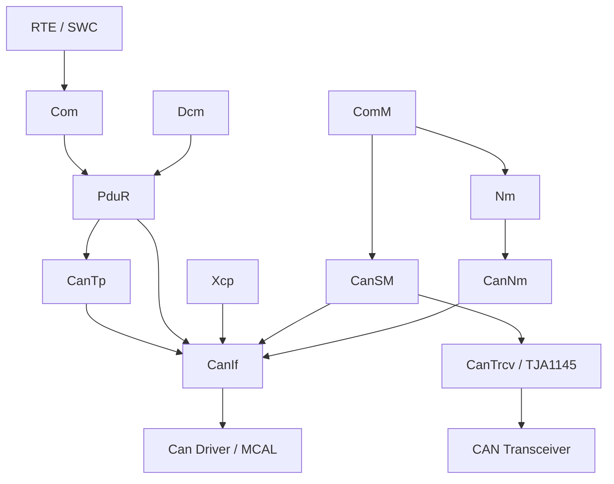
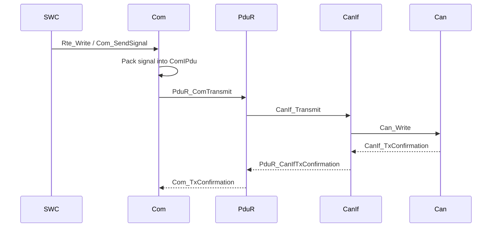
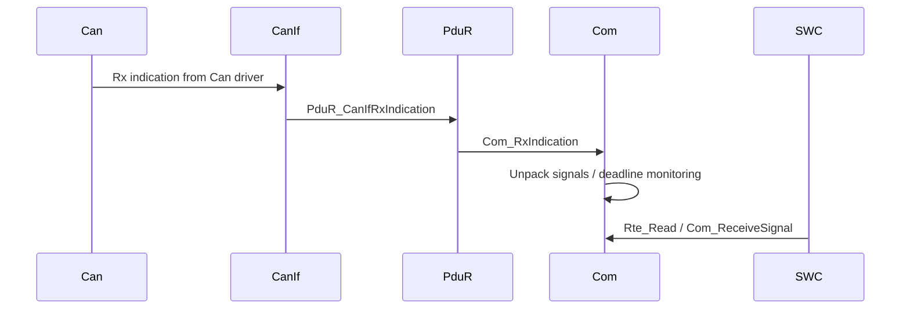
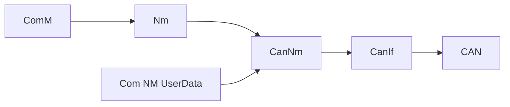
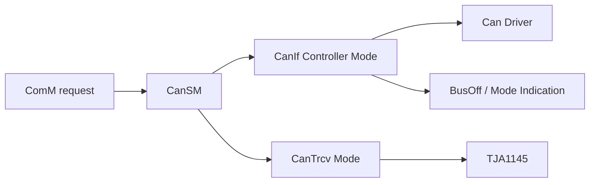

# ETAS AUTOSAR Com Stack 配置学习笔记

> 工程：`ECAS_qirui_Single_Chamber`  
> 工具视图：ETAS AUTOSAR AR 22-11  
> 代码特征：生成文件多处标识 RTA-BSW / AUTOSAR 4.5.x  
> 目标：把 ETAS 配置工具中 `Bsw Modules / Com Stack` 下的配置按 AUTOSAR 模块边界讲清楚，并结合本工程 ARXML、生成代码和公开资料形成可复习、可排查问题的笔记。

## 1. 阅读范围

截图中的 Com Stack 包含：

- CAN 模块族：`CanIf`、`CanNm`、`CanSM`、`CanTp`、`CanTrcv`
- 通信服务层：`Com`、`PduR`、`Nm`
- 标定测量通道：`Xcp`

本笔记主要依据以下工程文件：

| 类型 | 文件 |
|---|---|
| ECUC 配置源 | `BasicSoftware/ecu_config/bsw/gen/RTA_BIP_Com_EcucValues.arxml` |
| ECUC 配置源 | `BasicSoftware/ecu_config/bsw/gen/RTA_BIP_PduR_EcucValues.arxml` |
| ECUC 配置源 | `BasicSoftware/ecu_config/bsw/gen/RTA_BIP_CanIf_EcucValues.arxml` |
| ECUC 配置源 | `BasicSoftware/ecu_config/bsw/gen/RTA_BIP_CanTp_EcucValues.arxml` |
| ECUC 配置源 | `BasicSoftware/ecu_config/bsw/gen/RTA_BIP_CanSM_EcucValues.arxml` |
| ECUC 配置源 | `BasicSoftware/ecu_config/bsw/gen/RTA_BIP_CanNm_EcucValues.arxml` |
| ECUC 配置源 | `BasicSoftware/ecu_config/bsw/gen/RTA_BIP_Nm_EcucValues.arxml` |
| ECUC 配置源 | `BasicSoftware/ecu_config/bsw/gen/RTA_BIP_Xcp_EcucValues.arxml` |
| CanTrcv 配置源 | `BasicSoftware/ecu_config/bsw/static/Other_Modules/RTA_BIP_CanTrcv_EcucValues.arxml` |
| 生成代码 | `BasicSoftware/src/bsw/Com` |
| 生成代码 | `BasicSoftware/src/bsw/PduR` |
| 生成代码 | `BasicSoftware/src/bsw/CanIf` |
| 生成代码 | `BasicSoftware/src/bsw/CanTp_PC`、`BasicSoftware/src/bsw/CanTp` |
| 生成代码 | `BasicSoftware/src/bsw/CanSM` |
| 生成代码 | `BasicSoftware/src/bsw/CanNm_PreCompile_and_PB_Variant`、`BasicSoftware/src/bsw/CanNm` |
| 生成代码 | `BasicSoftware/src/bsw/Nm` |
| 生成代码 | `BasicSoftware/src/bsw/CanTrcv` |
| 生成代码 | `BasicSoftware/src/bsw/Xcp` |

公开资料参考：

- AUTOSAR SWS CAN Interface R21-11：<https://www.autosar.org/fileadmin/standards/R21-11/CP/AUTOSAR_SWS_CANInterface.pdf>
- AUTOSAR SWS CAN Network Management R23-11：<https://www.autosar.org/fileadmin/standards/R23-11/CP/AUTOSAR_CP_SWS_CANNetworkManagement.pdf>
- ETAS RTA-CAR AUTOSAR Classic：<https://www.etas.com/ww/en/products-services/vehicle-software-platform/autosar-classic-profile-rta-car/>
- Understanding AUTOSAR Architecture and AUTOSAR COMSTACK：<https://www.einfochips.com/wp-content/uploads/resources/whitepaper-understanding-autosar-architecture-and-autosar-comstack.pdf>

说明：AUTOSAR 标准规范是权威资料，但本文不逐条引用标准条款编号；配置项的标准含义以工程 ARXML 参数名、AUTOSAR 模块职责和生成代码落点为依据。

## 2. 本工程 Com Stack 总体拓扑

核心路径可以拆成五类：

| 路径 | 方向 | 说明 |
|---|---|---|
| 应用 Tx | `SWC/RTE -> Com -> PduR -> CanIf -> Can` | 周期/事件信号打包成 I-PDU，再映射到 CAN L-PDU。 |
| 应用 Rx | `Can -> CanIf -> PduR -> Com -> RTE/SWC` | CAN 报文经 RxIndication 进入 PduR，再由 Com 解包成信号。 |
| 诊断 | `Dcm <-> PduR <-> CanTp <-> CanIf` | UDS 物理/功能请求和多帧传输。 |
| 网络管理 | `ComM -> Nm -> CanNm -> CanIf` | 网络唤醒、保持通信、远程睡眠、NM UserData。 |
| 标定测量 | `Xcp -> CanIf` | XCP on CAN，与应用 Com/PduR 业务报文并行。 |

## 3. 工程配置规模快照

以下数量来自 ECUC ARXML 结构化统计，用来快速判断当前工程实际启用了哪些配置域。

| 模块 | 容器数 | 参数数 | 引用数 | 关键配置规模 |
|---|---:|---:|---:|---|
| `Com` | 221 | 1076 | 241 | `ComSignal x106`、`ComFilter x67`、`ComTxMode x13`、`ComIPdu x9` |
| `PduR` | 53 | 51 | 65 | `PduRRoutingPath`、`PduRSrcPdu`、`PduRDestPdu` |
| `CanIf` | 48 | 142 | 76 | `CanIfTxPduCfg x9`、`CanIfRxPduCfg x6`、`CanIfHthCfg x9`、`CanIfHrhCfg x6`、`CanIfCtrlCfg x2` |
| `CanTp` | 11 | 21 | 8 | `CanTpRxNSdu x2`、`CanTpTxNSdu x1`、`CanTpRxNPdu x2`、`CanTpTxNPdu x1` |
| `Nm` | 7+ | 20+ | 1+ | `NmGlobalConfig`、`NmChannelConfig_CanNmCluster_ETAS_CAN_1` |
| `CanNm` | 多容器 | 多参数 | 多引用 | 1 个 CAN NM 通道，含 NM Rx/Tx/UserData PDU |
| `CanSM` | 多容器 | 多参数 | 控制器/ComM/DEM 引用 | 2 个 CAN network/controller：`ETAS_CAN`、`ETAS_CAN2` |
| `CanTrcv` | 15 | 43 | 2 | `TJA1145`、PN mask 8 字节、SPI sequence、wake source |
| `Xcp` | 少量 | 20+ | 2 | 1 个 CAN XCP 通道，Rx `0x332`，Tx `0x333` |

## 4. Com

### 4.1 模块职责

`Com` 是 AUTOSAR 信号层。它不关心具体 CAN 控制器和 CAN ID，而是面向 RTE/SWC 提供信号级接口，把应用信号打包到 I-PDU，或从接收 I-PDU 中解包信号。

在本工程中，`Com` 生成文件位于：

- `BasicSoftware/src/bsw/Com/Com_Cfg.h`
- `BasicSoftware/src/bsw/Com/Com_Cfg.c`
- `BasicSoftware/src/bsw/Com/Com_PBcfg.c`
- `BasicSoftware/src/bsw/Com/Com_PBcfg_Common.c`
- `BasicSoftware/src/bsw/Com/Com_PBcfg_Variant.c`

生成代码里可以看到：

- AUTOSAR release：`COM_AR_RELEASE_MAJOR_VERSION 4u`、`COM_AR_RELEASE_MINOR_VERSION 5u`
- `Com_MainFunctionRx_ComMainFunctionRx()` 的 timebase：`0.01 s`
- `Com_MainFunctionTx_ComMainFunctionTx()` 的 timebase：`0.01 s`
- RTE 使用开关：`COM_ECUC_RB_RTE_IN_USE (STD_ON)`

### 4.2 工程中的主要配置对象

| 容器 | 数量 | 含义 |
|---|---:|---|
| `ComIPdu` | 9 | COM 管理的 I-PDU，包含方向、类型、信号处理方式、超时等。 |
| `ComSignal` | 106 | 应用级信号，配置位位置、长度、大小端、初值、传输属性。 |
| `ComFilter` | 67 | 信号过滤器，用于判断是否触发发送或是否接受新值。 |
| `ComTxMode` | 13 | Tx I-PDU 发送模式集合。 |
| `ComTxModeTrue` | 7 | Tx mode selector 为 true 时使用的发送模式。 |
| `ComTxModeFalse` | 6 | Tx mode selector 为 false 时使用的发送模式。 |
| `ComIPduGroup` | 2 | `ComIPduGroup_Tx`、`ComIPduGroup_Rx`，用于批量启动/停止通信。 |
| `ComMainFunctionTx` | 1 | Tx 主函数周期和 OS partition 绑定。 |
| `ComMainFunctionRx` | 1 | Rx 主函数周期和 OS partition 绑定。 |

### 4.3 关键配置项详解

| 配置项 | 本工程取值/示例 | 说明 |
|---|---|---|
| `ComIPduDirection` | `SEND`、`RECEIVE` | I-PDU 方向。`SEND` 时 Com 通过 PduR 向下发送；`RECEIVE` 时 PduR 向上调用 Com 接收。 |
| `ComIPduType` | `NORMAL` | 普通 I-PDU。区别于 TP 类型、动态长度或特殊网关场景。 |
| `ComIPduSignalProcessing` | `IMMEDIATE` | 信号处理方式。`IMMEDIATE` 表示接收回调中直接处理信号，实时性好；若为 `DEFERRED`，则延后到 `Com_MainFunctionRx`。 |
| `ComMainTxTimeBase` | `0.01` | `Com_MainFunctionTx_ComMainFunctionTx` 调度周期，单位秒。本工程是 10 ms。周期报文、重复发送、Tx 超时都依赖这个节拍。 |
| `ComMainRxTimeBase` | `0.01` | `Com_MainFunctionRx_ComMainFunctionRx` 调度周期，单位秒。本工程是 10 ms。Rx deadline monitoring 依赖这个节拍。 |
| `ComTxModeMode` | `PERIODIC` | 发送模式。`PERIODIC` 表示周期发送；若是 `DIRECT` 或 `MIXED`，信号更新触发行为更重要。 |
| `ComTxModeTimePeriod` | 常见 `0.01` | 周期发送周期，单位秒。当前示例为 10 ms，必须与 DBC/网络规范中的报文周期匹配。 |
| `ComTxModeTimeOffset` | `0.0` | 首次发送偏移。多个报文同周期时可通过 offset 错开发送，降低总线瞬时负载。 |
| `ComTxModeNumberOfRepetitions` | `0` | 触发发送后的重复次数。为 0 表示不做额外重复。 |
| `ComTxModeRepetitionPeriod` | `0` | 重复发送间隔。只有 repetition 次数非 0 时有实际意义。 |
| `ComTimeout` | 常见 `0.01` | 接收超时或发送确认超时监控时间。Rx 报文周期如果也是 10 ms，则此值较紧，需要确认是否符合项目容差。 |
| `ComFirstTimeout` | 常见 `0.01` | I-PDU Group 启动后的首次超时时间。过短可能导致刚启动就报 timeout。 |
| `ComSignalType` | `UINT8`、`UINT16` 等 | 信号类型，影响解包后的变量宽度和 RTE 数据类型映射。 |
| `ComSignalEndianness` | `BIG_ENDIAN` | 信号大小端。需要与 DBC 中 Motorola/Intel 定义一致。 |
| `ComBitPosition` | 多个值，如 `31`、`35`、`55` | 信号起始位。与大小端组合后决定真实 bit 排布，是最常见配置错误点之一。 |
| `ComBitSize` | 多个值，如 `3`、`12`、`16` | 信号位宽。必须与 System Description/DBC 一致。 |
| `ComSignalInitValue` | 常见 `0` | 信号初值。影响 ECU 上电到首次接收/首次应用写入之间的输出值。 |
| `ComTransferProperty` | `TRIGGERED` 等 | 信号更新后的触发属性。`TRIGGERED` 表示写信号可触发 I-PDU 发送请求，但最终还受 TxMode、过滤器和 PduR/CanIf 状态影响。 |
| `ComFilterAlgorithm` | `ALWAYS`、`NEW_IS_WITHIN` | 信号过滤算法。`ALWAYS` 永远通过；`NEW_IS_WITHIN` 要求新值位于 min/max 范围内。 |
| `ComFilterMin/Max/Offset` | 例如 `0..3000`、`0..65535` | 过滤参数。对 `NEW_IS_WITHIN`，min/max 是允许范围。 |
| `ComNotification` | 约 30 处 | 接收或发送成功后的用户通知回调。 |
| `ComTimeoutNotification` | 约 30 处 | deadline monitoring 超时时的回调。 |

### 4.4 Com 的工程核查点

1. Tx 报文发不出来时，先查 `ComIPduGroup_Tx` 是否启动，再查 `ComTxModeMode/TimePeriod`，最后查 PduR 和 CanIf。
2. Rx 信号没有更新时，先查 `CanIfRxPduCfg` 是否进入 `PDUR`，再查 PduR 路由目标是否为 Com，最后查 `ComSignal` 的 bit/endian/size。
3. 超时报错时，重点看 `ComTimeout` 和实际报文周期。若报文周期 10 ms，超时也 10 ms，现场抖动很容易触发 deadline。
4. 信号值异常时，优先怀疑 `ComBitPosition`、`ComSignalEndianness`、`ComBitSize` 和 DBC 不一致。

## 5. PduR

### 5.1 模块职责

`PduR` 是 PDU 路由器。它不理解信号，只理解 PDU 的来源和目的。它把上层模块和下层模块连接起来：

- `Com <-> CanIf`
- `Dcm <-> CanTp`
- `CanTp <-> Dcm`
- 也可支持网关、组播、路由路径组启停

本工程生成代码位于：

- `BasicSoftware/src/bsw/PduR/PduR_Cfg.h`
- `BasicSoftware/src/bsw/PduR/PduR_Cfg.c`
- `BasicSoftware/src/bsw/PduR/PduR_PBcfg.c`
- `BasicSoftware/src/bsw/PduR/PduR_Com.h`
- `BasicSoftware/src/bsw/PduR/PduR_CanIf.h`
- `BasicSoftware/src/bsw/PduR/PduR_CanTp.h`

### 5.2 关键配置对象

| 容器 | 说明 |
|---|---|
| `PduRRoutingPaths` | 路由路径集合。 |
| `PduRRoutingPath` | 单条路由，描述一个源 PDU 到一个或多个目标 PDU。 |
| `PduRSrcPdu` | 源 PDU。 |
| `PduRDestPdu` | 目标 PDU。 |
| `PduRBswModules` | 上下层 BSW 模块注册，如 Com、CanIf、CanTp、Dcm。 |
| `PduRRoutingPathGroup` | 路由路径组，可用于动态启停某组路由。 |

### 5.3 典型路由命名

工程中可见的路由命名非常有用：

| 命名模式 | 含义 |
|---|---|
| `CASU_1_Com2CanIf_Can_Network_Channel_CAN` | Com 发送的普通 CAN I-PDU，经 PduR 到 CanIf。 |
| `CIC_P_1_CanIf2PduR_Can_Network_Channel_CAN` | CanIf 接收后进入 PduR，再路由到上层。 |
| `UdsRxPhy_CanTp2PduR_Can_Network_Channel_CAN` | CanTp 接收物理诊断 N-SDU 后交给 PduR。 |
| `UdsTxPhy_PduR2CanTp_Can_Network_Channel_CAN` | Dcm/上层经 PduR 交给 CanTp 发送物理响应。 |
| `XcpTx_0x333_Xcp2CanIf_Can_Network_Xcp_Channel_CAN` | XCP Tx PDU 经 CanIf 发送。 |

### 5.4 关键配置项详解

| 配置项 | 说明 |
|---|---|
| `PduRSrcPduRef` | 指向源 PDU。Tx 普通报文通常源自 Com；Rx 普通报文通常源自 CanIf；诊断 Tx 源自 Dcm，诊断 Rx 源自 CanTp。 |
| `PduRDestPduRef` | 指向目标 PDU。Tx 普通报文目标通常是 CanIf；Rx 普通报文目标通常是 Com。 |
| `PduRDestPduDataProvision` | 目标 PDU 数据提供方式，影响 direct data / trigger transmit 场景。 |
| `PduRRoutingPathGroupId` | 路由路径组 ID。若路径组未启动，即使 Com 请求发送，PduR 也可能丢弃或返回失败。 |
| `PduRUpperModule` | 上层模块定义，如 `Com`、`Dcm`。 |
| `PduRLowerModule` | 下层模块定义，如 `CanIf`、`CanTp`。 |

### 5.5 PduR 的工程核查点

1. PduR 是“方向错误”的高发点。不要只看名字，要看 `SrcPduRef` 和 `DestPduRef`。
2. 普通信号 Tx 应是 `Com -> PduR -> CanIf`，诊断 Tx 应是 `Dcm -> PduR -> CanTp -> CanIf`。
3. CanIf 的 `TxConfirmation` 上层若配置为 `PDUR`，PduR 中必须有对应 Tx PDU handle。
4. 如果开启 routing path group，确认 BswM/ComM 启动通信时有启用对应 RPG。

## 6. CanIf

### 6.1 模块职责

`CanIf` 是 CAN Interface，位于上层通信模块和 MCAL CAN Driver 之间。AUTOSAR 官方 CAN Interface 规范说明了它承担的核心接口：Transmit request、TxConfirmation、RxIndication、Controller mode control、BusOff notification 等。

本工程中 CanIf 连接的上层包括：

- `PDUR`
- `CAN_NM`
- `XCP`
- `CANSM`，用于 controller mode、busoff 等状态通知

生成代码位于：

- `BasicSoftware/src/bsw/CanIf/CanIf_Cfg.h`
- `BasicSoftware/src/bsw/CanIf/CanIf_cfg.c`
- `BasicSoftware/src/bsw/CanIf/CanIf_PBcfg.c`

生成代码中可见：

- 2 个 controller：`ETAS_CAN`、`ETAS_CAN2`
- `CanIf_TxPdus_Ctrl_0` 有 8 个 Tx PDU
- `CanIf_TxPdus_Ctrl_1` 有 1 个 Tx PDU
- `ETAS_CAN` 绑定普通通信、NM、诊断
- `ETAS_CAN2` 绑定 XCP

### 6.2 关键配置对象

| 容器 | 数量 | 含义 |
|---|---:|---|
| `CanIfCtrlCfg` | 2 | 抽象 CAN controller，映射到 MCAL Can controller。 |
| `CanIfHthCfg` | 9 | Hardware Transmit Handle，发送硬件对象。 |
| `CanIfHrhCfg` | 6 | Hardware Receive Handle，接收硬件对象。 |
| `CanIfTxPduCfg` | 9 | CanIf 发送 PDU，配置 CAN ID、ID 类型、TxConfirmation 上层。 |
| `CanIfRxPduCfg` | 6 | CanIf 接收 PDU，配置 CAN ID、DLC、RxIndication 上层。 |
| `CanIfBufferCfg` | 9 | 发送缓冲配置，关联 HTH。 |
| `CanIfDispatchCfg` | 1 | Controller/Transceiver/BusOff 等事件分发配置。 |

### 6.3 关键配置项详解

| 配置项 | 本工程取值/示例 | 说明 |
|---|---|---|
| `CanIfCtrlCanCtrlRef` | `ETAS_CAN`、`ETAS_CAN2` | CanIf controller 到 MCAL Can controller 的引用。 |
| `CanIfCtrlTrcvRef` | `CanIfTrcvCfg_1145` | controller 关联的 transceiver。当前两个 controller 都引用同一 TJA1145 配置，需结合硬件确认是否合理。 |
| `CanIfHthCanCtrlIdRef` | `ETAS_CAN`、`ETAS_CAN2` | HTH 所属 CAN controller。 |
| `CanIfHthIdSymRef` | `ETAS_CAN_Tx_Std_MailBox_*`、`ETAS_CAN2_Tx_Std_MailBox_1` | 发送邮箱/硬件对象符号引用。 |
| `CanIfHrhCanCtrlIdRef` | `ETAS_CAN`、`ETAS_CAN2` | HRH 所属 CAN controller。 |
| `CanIfHrhIdSymRef` | `ETAS_CAN_Rx_Std_MailBox_*`、`ETAS_CAN2_Rx_Std_MailBox_1` | 接收邮箱/硬件对象符号引用。 |
| `CanIfTxPduCanId` | `102`、`105`、`121`、`872`、`950`、`133`、`1547`、`1963`、`819` | Tx CAN ID，十进制。`1547 = 0x60B` 是 NM Tx；`819 = 0x333` 是 XCP Tx。 |
| `CanIfRxPduCanId` | `153`、`1453`、`1558`、`2015`、`1835`、`818` | Rx CAN ID，十进制。`1558 = 0x616` 是 NM Rx；`818 = 0x332` 是 XCP Rx。 |
| `CanIfTxPduCanIdType` | `STANDARD_FD_CAN`、`STANDARD_CAN`、`STANDARD_NO_FD_CAN` | CAN ID 类型和 FD 能力。普通 CAN FD 报文与经典 CAN 报文在这里区分。 |
| `CanIfRxPduCanIdType` | `STANDARD_FD_CAN`、`STANDARD_CAN`、`STANDARD_NO_FD_CAN` | Rx PDU 的 ID 类型和 FD 能力。 |
| `CanIfRxPduDataLength` | `48`、`16`、`8`、`0` | Rx PDU 期望长度。FD 报文可大于 8；0 通常表示由上层/配置特殊处理或长度不固定，需要结合生成代码确认。 |
| `CanIfTxPduUserTxConfirmationUL` | `PDUR`、`CAN_NM`、`XCP` | TxConfirmation 分发到哪个上层模块。 |
| `CanIfTxPduUserTxConfirmationName` | `PduR_CanIfTxConfirmation`、`CanNm_TxConfirmation`、`Xcp_CanIfTxConfirmation` | TxConfirmation 回调函数名。 |
| `CanIfRxPduUserRxIndicationUL` | `PDUR`、`CAN_NM`、`XCP` | RxIndication 分发到哪个上层模块。 |
| `CanIfRxPduUserRxIndicationName` | `PduR_CanIfRxIndication`、`Xcp_CanIfRxIndication` | RxIndication 回调函数名。CanNm 的回调可能由 UL 枚举和生成逻辑确定。 |
| `CanIfBufferSize` | `0` | Tx buffer 深度。当前所有 buffer size 为 0，说明基本不依赖 CanIf 队列缓冲。 |
| `CanIfPublicTxBuffering` | 工程配置中存在 | 全局 Tx buffering 开关。即使有 buffer 容器，size 为 0 也不会形成有效队列。 |
| `CanIfPublicReadRxPduNotifyStatusApi` | `true` | 支持读取 Rx notification status。 |
| `CanIfPublicReadTxPduNotifyStatusApi` | `true` | 支持读取 Tx notification status。 |
| `CanIfPublicSetDynamicTxIdApi` | 配置存在 | 是否支持动态修改 Tx CAN ID。当前 Tx PDU 多为 `STATIC`，通常不使用动态 ID。 |
| `CanIfDispatchUserCtrlBusOffUL` | 配置存在 | BusOff 事件的上层接收者，通常是 `CanSM`。 |
| `CanIfDispatchUserCtrlModeIndicationUL` | 配置存在 | Controller mode indication 的上层接收者，通常是 `CanSM`。 |

### 6.4 本工程 CAN ID 快速换算

| 十进制 | 十六进制 | 用途 |
|---:|---:|---|
| 102 | `0x066` | 普通 Tx |
| 105 | `0x069` | 普通 Tx |
| 121 | `0x079` | 普通 Tx |
| 133 | `0x085` | 普通 Tx |
| 153 | `0x099` | 普通 Rx |
| 818 | `0x332` | XCP Rx |
| 819 | `0x333` | XCP Tx |
| 872 | `0x368` | 普通 Tx |
| 950 | `0x3B6` | 普通 Tx |
| 1453 | `0x5AD` | 普通 Rx |
| 1547 | `0x60B` | NM Tx |
| 1558 | `0x616` | NM Rx |
| 1835 | `0x72B` | 诊断/特殊 Rx |
| 1963 | `0x7AB` | 诊断 Tx |
| 2015 | `0x7DF` | UDS 功能寻址 Rx |

### 6.5 CanIf 的工程核查点

1. Tx 报文确认不到：查 `CanIfTxPduUserTxConfirmationUL` 和回调名是否指向正确上层。
2. Rx 报文进错模块：查 `CanIfRxPduUserRxIndicationUL`，例如 NM 必须进 `CAN_NM`，XCP 必须进 `XCP`。
3. CAN FD 报文异常：查 `CanIfTxPduCanIdType/RxPduCanIdType` 和 `CanIfRxPduDataLength`。
4. Mailbox/HTH 冲突：查 `CanIfTxPduBufferRef -> CanIfBufferHthRef -> CanIfHthIdSymRef`。
5. BusOff 不进 CanSM：查 `CanIfDispatchCfg` 的 BusOff dispatch 上层。

## 7. CanTp

### 7.1 模块职责

`CanTp` 是 ISO 15765-2 传输层，解决 CAN 单帧长度不足的问题。它把 Dcm/PduR 的 N-SDU 分段成 Single Frame、First Frame、Consecutive Frame，并处理 Flow Control、Block Size、STmin、Padding。

本工程生成代码位于：

- `BasicSoftware/src/bsw/CanTp_PC/CanTp_Cfg.h`
- `BasicSoftware/src/bsw/CanTp_PC/CanTp_Cfg.c`
- `BasicSoftware/src/bsw/CanTp/api`
- `BasicSoftware/src/bsw/CanTp/src`

生成代码中可见：

- `CANTP_DEV_ERROR_DETECT CANTP_ON`
- `CANTP_VERSION_INFO_API CANTP_ON`
- `CANTP_CANFD_SUPPORT CANTP_ON`
- `CANTP_FD_CALLOUT_SUPPORT CANTP_ON`
- `CANTP_MAX_RX_CONNECTION_SIZE 2u`
- `CANTP_MAX_TX_CONNECTION_SIZE 1u`
- `CANTP_MAX_NPDU_LENGTH 64u`
- `CANTP_PADDING_BYTE 0x0u`

### 7.2 关键配置对象

| 容器 | 数量 | 含义 |
|---|---:|---|
| `CanTpRxNSdu` | 2 | 接收 N-SDU，当前物理请求和功能请求各 1 条。 |
| `CanTpTxNSdu` | 1 | 发送 N-SDU，当前物理响应 1 条。 |
| `CanTpRxNPdu` | 2 | 下层接收 N-PDU，来自 CanIf。 |
| `CanTpTxNPdu` | 1 | 下层发送 N-PDU，发往 CanIf。 |
| `CanTpRxFcNPdu` | 1 | 接收 FlowControl N-PDU。 |
| `CanTpTxFcNPdu` | 1 | 发送 FlowControl N-PDU。 |
| `CanTpChannel` | 1 | CanTp 通道配置。 |

### 7.3 关键配置项详解

| 配置项 | 本工程取值 | 说明 |
|---|---|---|
| `CanTpRxTaType` | `CANTP_PHYSICAL`、`CANTP_FUNCTIONAL` | 接收目标地址类型。物理请求需要响应，功能请求通常用于广播诊断服务，响应规则由 Dcm 决定。 |
| `CanTpTxTaType` | `CANTP_PHYSICAL` | 发送目标地址类型。诊断响应通常是物理响应。 |
| `CanTpRxAddressingFormat` | `CANTP_STANDARD` | 标准寻址，无额外地址字节。CAN ID 本身表达 SA/TA。 |
| `CanTpTxAddressingFormat` | `CANTP_STANDARD` | Tx 标准寻址。 |
| `CanTpRxPaddingActivation` | `CANTP_ON` | Rx 期望 padding。诊断一致性测试常检查 padding。 |
| `CanTpTxPaddingActivation` | `CANTP_ON` | Tx 启用 padding。 |
| `CanTpBs` | `8` | Block Size。接收方允许对方连续发 8 个 CF 后需要新的 FC。 |
| `CanTpTc` | `true` | 支持 transmit cancellation。 |
| `CanTpPaddingByte` | `0` | padding 字节为 `0x00`。需确认客户规范是否要求 `0xAA` 或其他值。 |
| `CanTpRbFdSupportInfoCallback` | `CanTp_BIP_ExternalFdSupportCallback` | ETAS/RTA 扩展回调，用于判断 FD 支持。 |
| `CanTpRbStrictDlcCheck` | `false` | 严格 DLC 检查关闭，兼容性更强，但错误报文可能更晚暴露。 |
| `CanTpReadParameterApi` | `false` | 不支持运行时读取 BS/STmin 等参数。 |
| `CanTpChangeParameterApi` | `false` | 不支持运行时修改 BS/STmin 等参数。 |

### 7.4 PDU 引用关系

| 引用 | 目标 |
|---|---|
| `CanTpRxNSduRef` | `UdsRxPhy_CanTp2PduR_Can_Network_Channel_CAN` |
| `CanTpRxNSduRef` | `UdsRxFnc_CanTp2PduR_Can_Network_Channel_CAN` |
| `CanTpRxNPduRef` | `NPdu_UdsRxPhy_CanIf2CanTp_Can_Network_Channel_CAN` |
| `CanTpRxNPduRef` | `NPdu_UdsRxFnc_CanIf2CanTp_Can_Network_Channel_CAN` |
| `CanTpTxNSduRef` | `UdsTxPhy_PduR2CanTp_Can_Network_Channel_CAN` |
| `CanTpTxNPduRef` | `NPdu_UdsTxPhy_CanTp2CanIf_Can_Network_Channel_CAN` |

### 7.5 CanTp 的工程核查点

1. 物理请求无响应：查 `CanIfRxPduCanId 0x72B/0x7DF` 是否进 CanTp，PduR 是否路由到 Dcm。
2. 多帧中断：查 `CanTpBs`、STmin、N_As/N_Bs/N_Cr 等时间参数；本摘录里未列出的时间参数建议在 ETAS CanTp 容器里继续展开。
3. CAN FD 诊断异常：查 `CANTP_CANFD_SUPPORT`、`CanTpRbFdSupportInfoCallback`、CanIf PDU 类型和 DLC。
4. 测试仪抱怨 padding：查 `CanTpPaddingByte` 和 Tx/Rx padding activation。

## 8. Nm

### 8.1 模块职责

`Nm` 是 Network Management Interface。它屏蔽具体总线 NM，例如 CanNm、LinNm、FrNm、UdpNm，为 ComM 和上层提供统一的网络管理 API。

本工程生成代码位于：

- `BasicSoftware/src/bsw/Nm/Nm_Cfg.h`
- `BasicSoftware/src/bsw/Nm/Nm_Cfg.c`
- `BasicSoftware/src/bsw/Nm/src`

生成代码中可见：

- `NM_DEV_ERROR_DETECT STD_ON`
- `NM_VERSION_INFO_API STD_ON`
- `NM_BUSNM_CANNM_ENABLED STD_ON`
- `NM_NUMBER_OF_CHANNELS 1u`
- `NM_MAX_CANNM_CHANNELS 1u`
- `NM_USER_DATA_ENABLED STD_ON`
- `NM_COM_USER_DATA_SUPPORT STD_ON`
- `NM_COM_CONTROL_ENABLED STD_ON`
- `NM_STATE_CHANGE_IND_ENABLED STD_ON`
- `NM_PDU_RX_INDICATION_ENABLED STD_ON`
- `NM_REMOTE_SLEEP_IND_ENABLED STD_OFF`
- `NM_COORDINATOR_SUPPORT_ENABLED STD_OFF`

### 8.2 关键配置项详解

| 配置项 | 本工程取值/状态 | 说明 |
|---|---|---|
| `NmNumberOfChannels` | `1` | Nm 管理的网络通道数。本工程只有 1 个 Nm 通道。 |
| `NmBusType` | `CanNm` | 该 Nm 通道实际下层是 CanNm。 |
| `NmUserDataEnabled` | `true` / 生成宏 `STD_ON` | 支持 NM 用户数据。 |
| `NmComUserDataSupport` | `true` / 生成宏 `STD_ON` | NM 用户数据通过 Com 提供。此时 Com 中会有 NM UserData 相关信号/PDU。 |
| `NmComControlEnabled` | `true` / 生成宏 `STD_ON` | 支持启停 NM 通信控制。 |
| `NmPduRxIndicationEnabled` | `true` / 生成宏 `STD_ON` | 接收 NM PDU 时向上通知。 |
| `NmStateChangeIndEnabled` | `true` / 生成宏 `STD_ON` | NM 状态变化时通知。 |
| `NmRemoteSleepIndEnabled` | `false` / 生成宏 `STD_OFF` | 不启用 remote sleep indication。 |
| `NmCoordinatorSupportEnabled` | `false` / 生成宏 `STD_OFF` | 不启用 NM coordinator。 |
| `NmCycletimeMainFunction` | 生成宏 `NM_MAIN_FUNCTION_CYCLETIME (0u)` | Nm 自身 MainFunction 周期。当前生成值为 0，实际调度应重点看 CanNm MainFunction。 |
| `NmChannelConfig` | `NmChannelConfig_CanNmCluster_ETAS_CAN_1` | Nm 通道配置，映射到 CanNm cluster。 |

### 8.3 Nm 的工程核查点

1. ComM 请求 Full Communication 后 NM 不动作：查 ComM channel 到 Nm channel 的 handle 映射。
2. NM UserData 不更新：查 `NM_COM_USER_DATA_SUPPORT`、Com 中对应 NM Tx PDU 和 CanNm UserData Tx PDU。
3. 网络睡眠异常：本工程未启用 coordinator 和 remote sleep indication，不能按 coordinator 网络预期分析。

## 9. CanNm

### 9.1 模块职责

`CanNm` 是 CAN 网络管理协议模块。AUTOSAR 官方 CAN Network Management 规范说明：CanNm 在 `Nm` 和 `CanIf` 之间，主要目的是协调网络从 normal operation 到 bus-sleep mode 的转换，同时支持用户数据、节点检测、PN 等可配置特性。

本工程生成代码位于：

- `BasicSoftware/src/bsw/CanNm_PreCompile_and_PB_Variant/CanNm_Cfg.h`
- `BasicSoftware/src/bsw/CanNm_PreCompile_and_PB_Variant/CanNm_Cfg.c`
- `BasicSoftware/src/bsw/CanNm_PreCompile_and_PB_Variant/CanNm_PBcfg.c`
- `BasicSoftware/src/bsw/CanNm`

生成代码中可见：

- `CANNM_AR_RELEASE_MAJOR_VERSION 4u`
- `CANNM_AR_RELEASE_MINOR_VERSION 5u`
- `CANNM_CONFIGURATION_VARIANT CANNM_VARIANT_PRE_COMPILE`
- `CanNmConf_CanNmRxPdu_NM_Rx_0x616_Can_Network_Channel`
- `CanNmConf_CanNmTxPdu_NM_Tx_0x60B_Can_Network_Channel`
- `CanNmConf_CanNmUserDataTxPdu_NM_Tx_0x60B_UserData_Can_Network_Channel`

### 9.2 本工程 NM PDU

| PDU | CAN ID | 方向 | 说明 |
|---|---:|---|---|
| `NM_Rx_0x616` | `0x616` | Rx | CanIf 接收后直接分发到 `CAN_NM`。 |
| `NM_Tx_0x60B` | `0x60B` | Tx | CanNm 通过 CanIf 发送。 |
| `NM_Tx_0x60B_UserData` | 复用 NM Tx | Tx UserData | NM UserData 由 Com 支持时关联到该 PDU。 |

### 9.3 关键配置项详解

| 配置项 | 说明 |
|---|---|
| `CanNmNodeId` | 本节点 NM Node ID。其他 ECU 可用它识别当前节点。 |
| `CanNmPduNidPosition` | Node ID 在 NM PDU 中的位置。若为 off，则 PDU 中不带 Node ID。 |
| `CanNmPduCbvPosition` | Control Bit Vector 在 NM PDU 中的位置。CBV 用于 Repeat Message Request、PN、active wakeup 等控制位。 |
| `CanNmMsgCycleTime` | NM 周期报文发送周期。决定网络保持通信时 NM 报文频率。 |
| `CanNmMsgCycleOffset` | NM 周期报文初始偏移。多个节点可通过 offset 错开 NM 帧。 |
| `CanNmImmediateNmTransmissions` | 进入 repeat message 等阶段时立即发送 NM 的次数。 |
| `CanNmImmediateNmCycleTime` | 立即发送阶段的周期。 |
| `CanNmRepeatMessageTime` | Repeat Message 状态持续时间。 |
| `CanNmTimeoutTime` | NM 超时时间。超过该时间未收到 NM 报文可触发状态迁移。 |
| `CanNmWaitBusSleepTime` | Prepare Bus-Sleep 到 Bus-Sleep 的等待时间。 |
| `CanNmRemoteSleepIndTime` | Remote sleep indication 时间；本工程 Nm 层 remote sleep 未启用。 |
| `CanNmUserDataEnabled` | 是否支持 UserData。与 Nm/Com 的 UserData 配置联动。 |
| `CanNmPnEnabled` | 是否启用 Partial Networking。若启用，需要 CBV、PN info、CanTrcv PN 配合。 |
| `CanNmComMNetworkHandleRef` | 映射到 ComM channel。 |
| `CanNmRxPduRef` | 映射 EcuC PDU collection 中的 NM Rx PDU。 |
| `CanNmTxPduRef` | 映射 EcuC PDU collection 中的 NM Tx PDU。 |

### 9.4 CanNm 的工程核查点

1. NM 帧发不出：查 ComM 是否请求 FullCom，Nm 是否映射到 CanNm，CanNm Tx PDU 是否映射到 CanIf `0x60B`。
2. NM 帧收到了但状态不变：查 CanIf Rx PDU `0x616` 的 UL 是否为 `CAN_NM`。
3. UserData 不对：查 `NmComUserDataSupport`、`CanNmUserDataTxPdu`、Com 中 NM Tx 的信号映射。
4. 睡眠不符合预期：核查 `RepeatMessageTime`、`TimeoutTime`、`WaitBusSleepTime` 与网络规范。

## 10. CanSM

### 10.1 模块职责

`CanSM` 是 CAN State Manager。它接收 ComM 的通信模式请求，控制 CanIf controller mode 和 CanTrcv transceiver mode，处理 BusOff 恢复，并向 ComM/BswM 通知当前网络通信模式。

本工程生成代码位于：

- `BasicSoftware/src/bsw/CanSM/CanSM_Cfg.h`
- `BasicSoftware/src/bsw/CanSM/CanSM_PBcfg.c`
- `BasicSoftware/src/bsw/CanSM/src`

生成代码中可见：

- `CANSM_DEV_ERROR_DETECT STD_ON`
- `CANSM_VERSION_INFO_API STD_OFF`
- `CANSM_NUM_CAN_NETWORKS 2u`
- `CANSM_NUM_CAN_CONTROLLERS 2u`
- `CANSM_PN_SUPPORT_CONFIGD STD_ON`
- `CANSM_CFG_TRCV_CANIF_SUPPORT STD_ON`
- `CANSM_CFG_GLOBAL_PN_NM_SUPPORT STD_OFF`

### 10.2 网络与控制器

| CanSM network | ComM channel | Controller | 说明 |
|---|---|---|---|
| 普通 CAN network | `Can_Network_Channel_Can_Network` | `ETAS_CAN` | 业务、诊断、NM。 |
| XCP CAN network | `Can_Network_Xcp_Channel_Can_Network_Xcp` | `ETAS_CAN2` | XCP 标定测量。 |

两个 network 都引用 DEM 事件：

- `CANSM_E_BUS_OFF -> DTC_0xC11001_Event`

### 10.3 关键配置项详解

| 配置项 | 本工程取值/示例 | 说明 |
|---|---|---|
| `CanSMComMNetworkHandleRef` | `Can_Network_Channel_Can_Network`、`Can_Network_Xcp_Channel_Can_Network_Xcp` | CanSM network 到 ComM channel 的映射。 |
| `CanSMControllerId` | `ETAS_CAN`、`ETAS_CAN2` | CanSM 控制哪个 CanIf/Can controller。 |
| `CanSMTransceiverId` | `CanIfTrcvCfg_1145` | CanSM 控制的 transceiver。普通 CAN network 配置了该引用。 |
| `CanSMModeRequestRepetitionMax` | `5` | 模式请求最大重试次数，例如请求 controller STARTED 或 transceiver NORMAL 失败时重试。 |
| `CanSMModeRequestRepetitionTime` | `0.07` | 模式请求重试周期，单位秒。 |
| `CanSMBorCounterL1ToL2` | `32` | BusOff recovery 从 L1 进入 L2 的阈值。 |
| `CanSMBorTimeL1` | `0.01` | BusOff L1 快速恢复等待时间。 |
| `CanSMBorTimeL2` | `60.0` | BusOff L2 慢速恢复等待时间。 |
| `CanSMBorTimeTxEnsured` | `1.0` | 恢复后确认 Tx 稳定的时间窗口。 |
| `CanSMBorTxConfirmationPolling` | `false` | 不通过轮询 Tx confirmation 判定恢复。 |
| `CanSMDevErrorDetect` | `true` | 开启 DET 开发错误检测。 |
| `CanSMVersionInfoApi` | `false` | 关闭版本信息 API。 |

### 10.4 BusOff 恢复理解

本工程配置的 BusOff 恢复节奏可以理解为：

1. 发生 BusOff 后，CanIf 通知 CanSM。
2. CanSM 进入 BusOff recovery，先按 L1 快速恢复，等待 `0.01 s`。
3. 如果连续 BusOff 次数达到 `32`，进入 L2，等待 `60.0 s` 再恢复，避免总线被故障节点反复冲击。
4. 恢复后用 `1.0 s` 观察 Tx 是否稳定。
5. DEM 事件 `DTC_0xC11001_Event` 用于记录 `CANSM_E_BUS_OFF`。

### 10.5 CanSM 的工程核查点

1. ComM 请求 FullCom 后 controller 不启动：查 `CanSMComMNetworkHandleRef` 和 controller 引用。
2. XCP 通道不能通信：除 XCP 自身外，还要查 `ETAS_CAN2` 的 CanSM network 是否进入 FullCom。
3. BusOff DTC 不上报：查 `CANSM_E_BUS_OFF` 到 DEM event 的引用和 DEM event enable condition。
4. 唤醒/睡眠失败：查 CanSM 是否正确控制 `CanIfTrcvCfg_1145`，以及 CanTrcv 初始模式。

## 11. CanTrcv

### 11.1 模块职责

`CanTrcv` 是 CAN transceiver driver，控制外部 CAN 收发器。它负责 Normal/Standby/Sleep 模式切换、唤醒标志、PN 过滤、硬件错误状态等。

本工程 CanTrcv 配置来自：

- `BasicSoftware/ecu_config/bsw/static/Other_Modules/RTA_BIP_CanTrcv_EcucValues.arxml`

生成代码位于：

- `BasicSoftware/src/bsw/CanTrcv/CanTrcv_Cfg.h`
- `BasicSoftware/src/bsw/CanTrcv/CanTrcv_Cfg.c`
- `BasicSoftware/src/bsw/CanTrcv/CanTrcv_PBcfg.c`

工程还存在一个 CDD 收发器目录：

- `CDD/CanTrcv/CANTrcv_BE13`

需要注意区分 AUTOSAR `CanTrcv` 模块和项目 CDD 收发器代码的边界。

### 11.2 关键配置项详解

| 配置项 | 本工程取值 | 说明 |
|---|---|---|
| `CanTrcvRbHardwareType` | `TJA1145` | ETAS/RTA 硬件类型，说明外部收发器按 NXP TJA1145 类器件配置。 |
| `CanTrcvIndex` | `0` | 收发器实例索引。 |
| `CanTrcvMainFunctionPeriod` | `0.02` | `CanTrcv_MainFunction` 周期，20 ms。唤醒轮询等依赖它。 |
| `CanTrcvWakeUpSupport` | `CANTRCV_WAKEUP_BY_POLLING` | 通过轮询方式检测唤醒。 |
| `CanTrcvWakeupByBusUsed` | `true` | 支持总线唤醒。 |
| `CanTrcvWakeupSourceRef` | `ECUM_WKSOURCE_INTERNAL_CAN` | 唤醒源引用到 EcuM。 |
| `CanTrcvInitState` | `CANTRCV_OP_MODE_STANDBY` | 初始化后进入 Standby，而不是直接 Normal。是否切到 Normal 由 CanSM/CanIf 控制。 |
| `CanTrcvChannelUsed` | `1` | 通道启用。 |
| `CanTrcvControlsPowerSupply` | `0` | 不由 CanTrcv 控制收发器供电。 |
| `CanTrcvMaxBaudrate` | `500` | 最大波特率 500 kbps。 |
| `CanTrcvBaudRate` | `500` | 当前 PN/通道波特率 500 kbps。 |
| `CanTrcvHwPnSupport` | `true` | 硬件支持 Partial Networking。 |
| `CanTrcvPnEnabled` | `false` | 当前 PN 使能为 false。注意：硬件支持 PN 不等于项目启用 PN。 |
| `CanTrcvPnFrameCanId` | `1558` (`0x616`) | PN 唤醒帧 CAN ID。虽然 PN 未启用，仍保留配置。 |
| `CanTrcvPnFrameCanIdMask` | `255` | PN ID mask。 |
| `CanTrcvPnFrameDlc` | `8` | PN 帧 DLC。 |
| `CanTrcvPnFrameDataMaskIndex` | `0..7` | PN 数据字节索引。 |
| `CanTrcvPnFrameDataMask` | `0, 0, 31, 0, 0, 0, 0, 0` | PN 数据掩码，第 2 字节 mask 为 `0x1F`。 |
| `CanTrcvSpiSequenceName` | `SpiSequence_CAN` | 访问收发器的 SPI sequence。 |
| `CanTrcvSpiAccessSynchronous` | `false` | SPI 访问非同步方式。 |
| `CanTrcvSPICommRetries` | `0` | SPI 通信重试次数。 |
| `CanTrcvSPICommTimeout` | `0` | SPI 通信超时时间。 |

### 11.3 CanTrcv 的工程核查点

1. 上电后 CAN 不通：确认 CanTrcv 初始为 Standby 后，CanSM 是否请求 Normal。
2. 总线唤醒无效：查 `CANTRCV_WAKEUP_BY_POLLING` 的 MainFunction 是否 20 ms 周期调度，EcuM wake source 是否配置。
3. PN 行为不符合预期：本工程 `CanTrcvHwPnSupport=true` 但 `CanTrcvPnEnabled=false`，不要误以为 PN 已启用。
4. SPI 访问失败：查 `SpiSequence_CAN`、SPI 驱动配置和 TJA1145 硬件连接。

## 12. Xcp

### 12.1 模块职责

`Xcp` 用于标定和测量。它可以走 CAN、Ethernet 等传输层。本工程配置的是 XCP on CAN，直接与 CanIf 对接，不经过 Com/PduR 的普通信号路由。

配置源：

- `BasicSoftware/ecu_config/bsw/gen/RTA_BIP_Xcp_EcucValues.arxml`

集成代码：

- `BasicSoftware/integration/src/bsw/Xcp`
- `BasicSoftware/src/bsw/Xcp`

### 12.2 本工程 XCP 通道

| 配置 | 取值 |
|---|---|
| `XcpCommunicationChannel` | `Can_Network_Xcp_Channel` |
| `XcpTransportLayerType` | CAN |
| `XcpTransportLayerName` | CAN 相关名称 |
| XCP Rx | `XcpRx_0x332`，CAN ID `0x332` |
| XCP Tx | `XcpTx_0x333`，CAN ID `0x333` |
| CanIf controller | `ETAS_CAN2` |

### 12.3 关键配置项详解

| 配置项 | 本工程取值/示例 | 说明 |
|---|---|---|
| `XcpMaxDto` | 配置存在 | DTO 最大长度，影响 DAQ/STIM 数据包大小。 |
| `XcpMaxCto` | 配置存在 | CTO 最大长度，影响命令/响应包大小。 |
| `XcpTransportLayerType` | CAN | XCP 使用 CAN 传输层。 |
| `XcpDaqOverloadIndication` | 配置存在 | DAQ 过载指示方式。 |
| `XcpIdentificationFieldType` | 配置存在 | DAQ DTO 中识别字段类型。 |
| `XcpTimestampType` | 配置存在 | 时间戳类型。 |
| `XcpTransmitInMainFunction` | 配置存在 | 是否在 MainFunction 中发送。 |
| `XcpMainFunctionPeriod` | 配置存在 | XCP MainFunction 周期。 |
| `XcpDevErrorDetect` | 配置存在 | DET 开关。 |
| `XcpCalibrationCal` | 配置存在 | CAL 标定功能。 |
| `XcpSynchronousDataAcquisitionDaq` | 配置存在 | DAQ 同步采集功能。 |
| `XcpSeedAndKey` | 配置存在 | Seed & Key 安全访问。 |
| `XcpSeedAndKeyExternalFunction` | 配置存在 | 外部 Seed & Key 函数名。 |
| `XcpTimestampTicks` | 配置存在 | 时间戳 tick 数。 |
| `XcpTimestampUnit` | 配置存在 | 时间戳单位。 |
| `XcpVersion` | 配置存在 | XCP 协议版本。 |

### 12.4 Xcp 的工程核查点

1. INCA/CANape 连不上：查 `0x332/0x333` 是否在 CanIf 配置到 `XCP`，并确认 `ETAS_CAN2` 已 FullCom。
2. 能连接但无 DAQ：查 DAQ 开关、事件通道、A2L 和 XCP event mapping。
3. 标定访问被拒绝：查 `XcpSeedAndKey` 和 memory access protection 集成代码。
4. 报文发出但无确认：查 `Xcp_CanIfTxConfirmation` 和 CanIf Tx PDU `XcpTx_0x333`。

## 13. 端到端配置关系

### 13.1 普通信号 Tx

核查链：

1. `ComSignal` 的 bit/endian/size 正确。
2. `ComIPdu` direction 为 `SEND`。
3. `PduRRoutingPath` 源为 Com，目标为 CanIf。
4. `CanIfTxPduCfg` CAN ID 正确。
5. `CanIfTxPduUserTxConfirmationUL=PDUR`。
6. 对应 HTH 绑定到正确 controller。

### 13.2 普通信号 Rx

核查链：

1. `CanIfRxPduCanId` 和 DBC 一致。
2. `CanIfRxPduDataLength` 能覆盖实际 DLC。
3. `CanIfRxPduUserRxIndicationUL=PDUR`。
4. PduR 目标为 Com。
5. `ComIPduDirection=RECEIVE`。
6. `ComIPduGroup_Rx` 已启动。

### 13.3 诊断 Tx/Rx

关键点：

- 功能寻址 Rx：`0x7DF`
- 物理寻址相关 Rx/Tx：工程中可见 `0x72B`、`0x7AB`
- CanTp 支持 CAN FD，最大 N-PDU 长度 `64`
- Padding byte 为 `0x00`
- Rx 有 2 条连接，Tx 有 1 条连接

### 13.4 NM

关键点：

- NM Rx：`0x616`
- NM Tx：`0x60B`
- `NmUserDataEnabled=ON`
- `NmComUserDataSupport=ON`
- coordinator 未启用
- remote sleep indication 未启用

### 13.5 状态管理

关键点：

- 2 个 CanSM network
- 2 个 Can controller
- 普通 CAN 和 XCP CAN 分开管理
- BusOff 事件引用 `DTC_0xC11001_Event`
- L1 恢复 10 ms，L2 恢复 60 s，L1 到 L2 阈值 32 次

## 14. 配置学习顺序建议

推荐按下面顺序学习，不要从截图树从上到下硬啃：

1. 先看 `EcuC PduCollection` 和 System Description/DBC，知道有哪些 PDU、CAN ID、方向、长度。
2. 看 `CanIf`，确认每个 CAN ID 进入哪个上层模块。
3. 看 `PduR`，确认 PDU 在模块之间怎么路由。
4. 看 `Com`，理解普通信号如何打包、周期发送、超时监控。
5. 看 `CanTp`，理解诊断多帧和功能/物理寻址。
6. 看 `Nm/CanNm`，理解网络管理状态机和 NM UserData。
7. 看 `CanSM/CanTrcv`，理解通信模式、BusOff 和睡眠唤醒。
8. 最后看 `Xcp`，确认标定测量通道是否独立、是否需要 ComM/CanSM 打开对应网络。

## 15. 常见问题定位表

| 现象 | 优先检查 | 典型原因 |
|---|---|---|
| 应用 Tx 信号不发 | Com TxMode、PduR route、CanIf TxPdu、CanSM FullCom | IPduGroup 未启动、路由关闭、controller 未 started |
| Tx 有请求但总线无报文 | CanIf HTH、Can controller、CanSM、Can driver mailbox | HTH 映射错、BusOff、CanIf PDU mode offline |
| Rx 报文总线上有但应用读不到 | CanIf RxIndication UL、PduR route、Com Rx I-PDU | Rx PDU 进错上层、PduR 没路由到 Com、ComIPduGroup 未启动 |
| 信号值错位 | Com bit position、endianness、bit size | DBC 与 ARXML 映射不一致 |
| 周期报文周期不对 | ComTxModeTimePeriod、Com_MainFunctionTx 调度周期 | OS task 周期不等于配置 timebase、TxMode 配错 |
| 一上电就 Rx timeout | ComFirstTimeout、ComTimeout、IPduGroup 启动时机 | 首次超时过短、对端尚未发送 |
| 诊断单帧 OK 多帧失败 | CanTp BS/STmin/padding/FD、PduR Tp route | FlowControl 配置不匹配、padding 不符合测试仪 |
| NM 不发 | ComM -> Nm -> CanNm 映射、CanSM FullCom | 网络未请求 FullCom、NM channel 未启动 |
| NM 收到但不唤醒 | CanIf `0x616` UL、CanNm timing、CanTrcv wake source | Rx PDU 未进 CanNm、收发器唤醒未上报 EcuM |
| XCP 连不上 | CanIf `0x332/0x333`、ETAS_CAN2 CanSM、Xcp seed/key | XCP 网络未 FullCom、CAN ID 不匹配、安全访问未过 |
| BusOff 后长时间不恢复 | CanSM BOR L1/L2 参数、DEM、Can controller mode indication | 达到 L2 阈值后等待 60 s、controller indication 丢失 |

## 16. 结合本工程的重点结论

1. 本工程普通通信、诊断、NM 主要在 `ETAS_CAN`；XCP 独立在 `ETAS_CAN2`。
2. `Com` 配置规模最大：106 个信号、9 个 I-PDU、67 个过滤器，是理解应用通信的核心。
3. `CanIf` 是分流点：普通报文进 `PDUR`，NM 进 `CAN_NM`，XCP 进 `XCP`。
4. `CanTp` 已开启 CAN FD 支持，最大 N-PDU 长度 64，padding byte 是 `0x00`。
5. `Nm` 和 `CanNm` 启用了 NM UserData，并且支持 Com UserData。
6. `CanSM` 管理 2 个 CAN network，BusOff L1 很快，L2 很慢，现场反复 BusOff 时会出现 60 s 恢复等待。
7. `CanTrcv` 硬件类型是 TJA1145，初始化为 Standby，总线唤醒通过 polling；硬件支持 PN，但当前 `CanTrcvPnEnabled=false`。
8. XCP 使用 `0x332/0x333`，走 `ETAS_CAN2`，排查 XCP 时不要只看普通 CAN 通道。

## 17. 后续深入建议

为了把这份笔记继续升级成项目级配置手册，建议补充三类表：

1. 从 `System.arxml` 或 DBC 导出完整 PDU 表：PDU 名、CAN ID、方向、DLC、周期、发送 ECU、接收 ECU。
2. 从 `Com_EcucValues.arxml` 导出完整 Signal 表：Signal 名、所属 PDU、bit position、bit size、endian、init、timeout、callback。
3. 从 `PduR_EcucValues.arxml` 导出完整 RoutingPath 表：source module、source PDU、destination module、destination PDU、route group。

有了这三张表，就可以从任意一个信号一路追踪到 CAN ID，也可以从任意一个 CAN ID 反查到应用信号和 RTE 接口。
