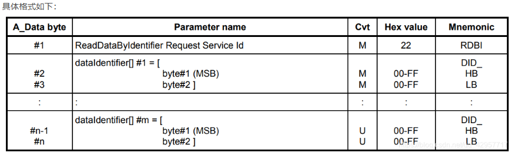
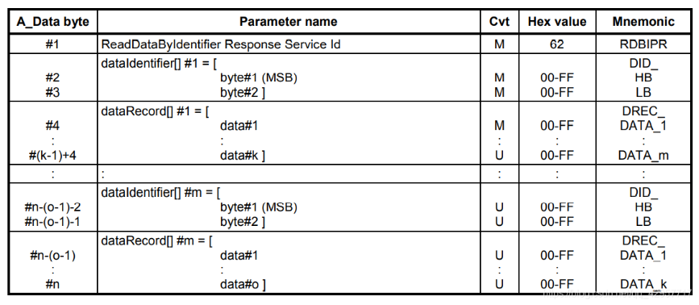
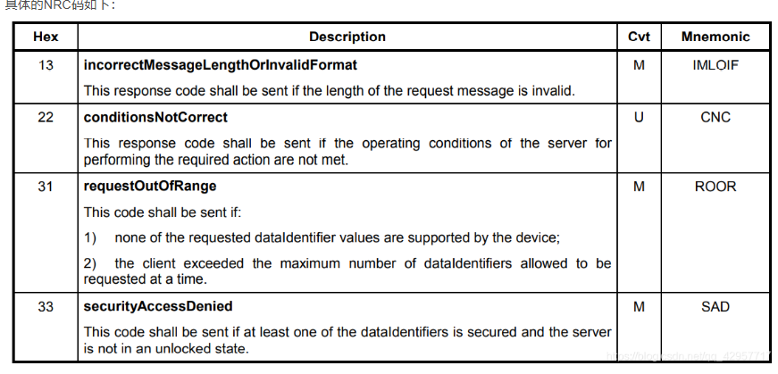

# 功能
客户端请求读取由提供的 dataIdentifier 标识的记录的当前值。该服务允许客户端从服务器请求由一个或多个 DID 标识的数据记录值。客户端请求消息包含一个或多个两字节的 DID 值，这些值标识服务器维护的数据记录。 dataRecord 的格式和定义应特定于车辆制造商或系统供应商，并且如果服务器支持，则可以包括模拟输入和输出信号，数字输入和输出信号，内部数据和系统状态信息。
服务器可以限制车辆制造商和系统供应商所同意的可同时请求的 DID 的数量。 收到 ReadDataByIdentifier 请求后，服务器应访问 DID 参数指定的记录的数据元素，并在一个包含相关 dataRecord 参数的单个 ReadDataByIdentifier 肯定响应中传输其值。该请求消息可能包含多次使用相同的 DID。服务器应将每个 DID 视为一个单独的参数，并根据请求的频率用每个 DID 的数据进行响应。换个理解就是，对于一次请求多个 DID，响应必须要依次记录每一个 DID 的响应值。这里不在乎多个 DID 里面是否存在重复的现象，均需要被响应。
# 诊断格式

这里跟之前介绍的诊断和通信管理功能单元中的服务存在不一样的地方是，不存在 sub-function 的参数。至于允许多个 DID 是多少，这里需要主车厂/供应商定义，理论上是可以将所有支持的 DID 均通过一次请求全部读取。但是这样子不利于获取每一个 DID 的数值，因为响应中是没有具体的分隔符来区分每一个 DID 的数值。所以一般都会定义每次请求最大的 DID 数。

# 正响应

# 负响应

