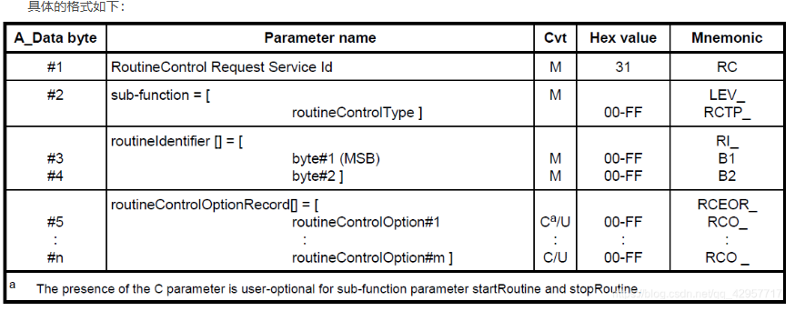
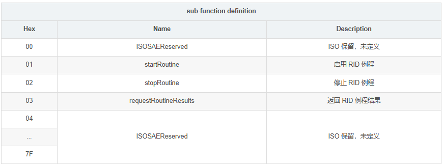
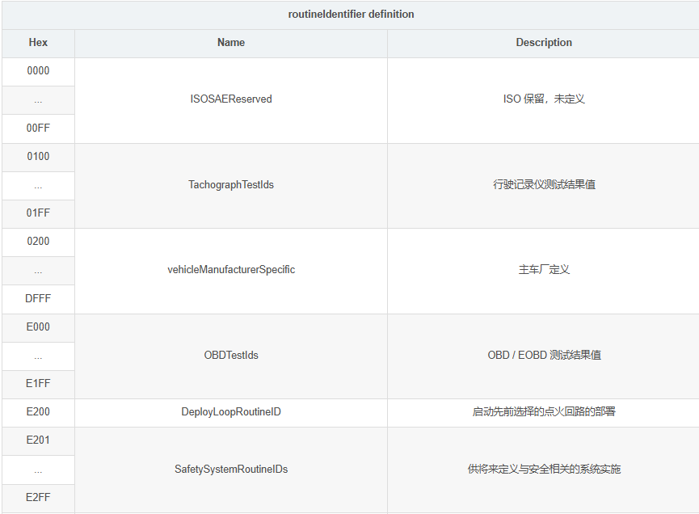
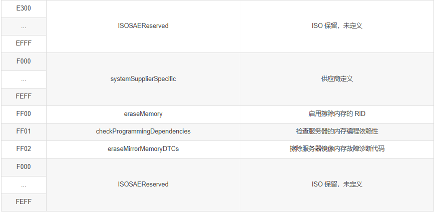
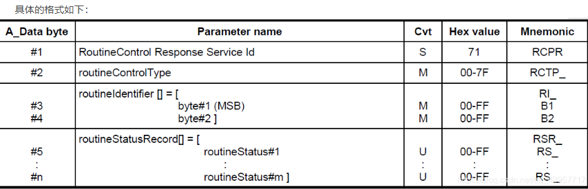
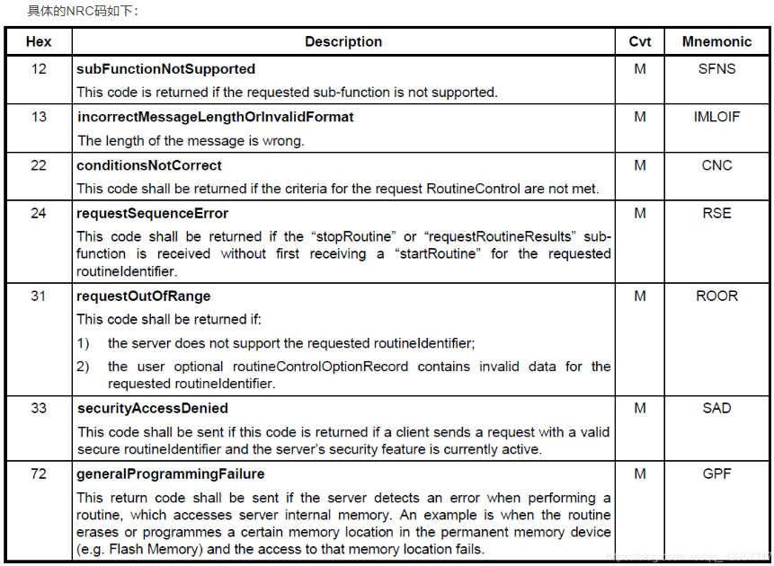

 **0 x 31：RoutineControl（例程控制）** 用于让诊断仪控制 ECU 内部预先定义的“例程/任务”。
客户端请求启动/停止服务器中的例程或请求例程结果。客户端使用 RoutineControl 服务来控制 RID，<mark style="background: #FFF3A3A6;">RID 由两字节的例程标识符标识。</mark>具体的控制类 型有以下三种：第一种： 启动 RID；第二种： 停止 RID；第三种： 查询 RID 执行结果。这里对 RID 的三种控制类型做一个详细的介绍：

启动 RID
 如果对诊断请求的响应是肯定或否定，则表明该请求已被执行或正在进行中，例程将从 StartRoutine 请求消息完成到第一响应消息完成之间的某个时间在服务器的内存中启动。例程可以是运行，也可以是在正常操作代码运行的情况下启用和执行的例程。特别是在第一种情况下，可能有必要在使用 StartRoutine 服务之前，使用 DiagnosticSessionControl 服务在特定的诊断会话中切换服务器，或者使用 SecurityAccess 服务解锁服务器。
停止由例程标识符引用的例程
 在完成 StopRoutine 请求消息和第一次响应消息后，发送该请求，无论响应是肯定或否定，这表明停止例程的请求已经执行或者正在处理，需要服务器例程应在服务器的内存中停止。服务器例程应在服务器内存中编程或事先初始化的任何时间停止。
查询 RID 执行结果
 客户端使用此子功能来请求在服务器的内存中执行的 RID 生成的结果。基于例程结果，可能已在肯定响应中接收到该结果。 如果消息包含 stopRoutine 子功能参数，则应使用 requestRoutineResults 子功能。 RID 结果的一个示例可能是服务器收集的数据，由于服务器性能的限制，在 RID 执行期间无法传输这些数据。

# 诊断请求格式
当参数 sub-function 的值为 startRoutine 或 stopRoutine 时，参数 routineControlOptionRecord 是可选的参数。

对于 RID 的定义，ISO 14229 同样也做了初步的定义，具体的情况如下表：

# 正响应格式：

# 负响应 NRC 码

