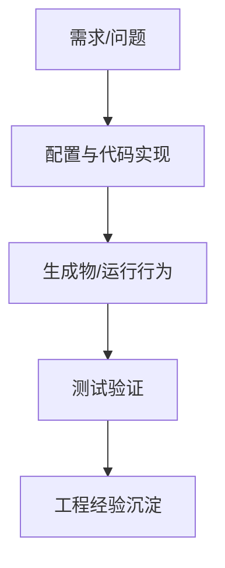

# Autosar Crypto Interface学习笔记 - 学习笔记

> 来源公众号：汽车电子学习笔记

> 原文标题：Autosar Crypto Interface学习笔记

> 原文链接：http://mp.weixin.qq.com/s?__biz=Mzk0NTM4MTI2MA==&mid=2247486581&idx=1&sn=055fe06605e8e3d90573c8af6dbe2441&chksm=c3170696f4608f80c209fa608f5cce6a9d03f9db99ce83f1b7cad9c5bef50d2e5704416538ab#rd

> 发布时间：2024-03-23

> 归档标签：#Autosar

> 整理方式：本文是基于原文主题的学习笔记，不复制原文全文；重点补充概念框架、工程理解、排查思路和可复用检查清单。

---

## 1. 先给结论

这篇文章可以归到 **AUTOSAR 平台生成** 这一类问题里。学习时不要只记某个配置项或某个函数名，而要先抓住它背后的工程链路：为什么需要它、它位于哪一层、它依赖哪些前置条件、失败以后系统应该怎样响应。

我的理解是：**Autosar Crypto Interface学习笔记** 这类问题的核心，不是把步骤机械跑通，而是把“需求、配置、生成物、运行行为、验证证据”连成闭环。只要闭环断了，项目里就会出现“配置看起来对、代码也生成了、但现象就是不对”的典型问题。

## 2. 原文脉络速读

这篇文章适合按 **BSW/RTE/OS 集成** 的思路来读。不要把它当成孤立技巧，建议先建立一条从需求到验证的学习路线：

- 先确认它位于启动、调度、RTE 调用还是 BSW 周期函数链路。
- 再把 Runnable、Task、Event、Alarm、MainFunction 和模式状态对应起来。
- 重点检查生成配置和实际编译对象是否一致。
- 最后用断点、trace、任务周期和初始化日志确认运行行为。

读这类文章时，建议不要一上来抄配置，而是先问三个问题：

- 这个机制解决的是哪个层级的问题？

- 它的输入、输出和触发条件是什么？

- 它失败时，系统应该怎么被观察、怎么被诊断、怎么被恢复？

## 3. 像老师一样拆开讲

### 3.1 先看它在系统里的位置

如果把整车软件看成分层系统，**AUTOSAR 平台生成** 通常不是孤立存在的。它会同时牵涉需求、配置工具、基础软件模块、生成代码、运行时状态和测试验证。BSW/RTE/OS 代码生成的重点，是从模型配置到运行任务的闭环。看起来是工具按钮，实际上背后连接了 Runnable、Task、Event、Alarm、RTE API 和 BSW main function。

一个比较实用的理解方法是：把它拆成“静态配置”和“动态行为”两半。

- 静态配置回答：哪些参数、接口、映射、开关、阈值、回调需要提前定义？

- 动态行为回答：运行时谁先触发、谁负责转发、谁保存状态、谁最终产生外部可见结果？

很多问题之所以难排查，是因为我们只看了静态配置，没有顺着动态行为走一遍。

### 3.2 再看关键路径

结合这类问题的工程共性，可以把关键路径理解为：

1. 明确触发源：谁发起这个动作，是诊断请求、工具生成、周期任务、总线报文，还是启动流程？

2. 明确前置条件：会话、安全等级、网络状态、初始化阶段、模式管理状态是否满足？

3. 明确配置落点：配置最终进入哪个 ARXML、生成代码、配置表或链接段？

4. 明确运行路径：从入口到最终输出，中间经过哪些模块、回调、状态机或驱动接口？

5. 明确观测证据：总线、日志、DTC、调试变量、复位原因或生成文件 diff 能否证明链路闭合？

这里要提醒一点：这些点不是让你死记，而是让你在项目里建立“检查顺序”。先确认入口，再确认中间状态，最后确认输出和反馈。顺序对了，排查效率会高很多。

### 3.3 最容易踩坑的地方

这类问题在项目里常见的坑，通常不是某一个语法点，而是上下游没有对齐：

- Runnable 映射到 Task 了，但触发事件没有配置好。

- BSW MainFunction 周期和系统 tick 不匹配。

- 生成代码版本和配置文件版本不一致。

- 只看生成成功，没有检查编译、链接和运行时调度。

所以排查时不要只盯着一个模块。要沿着“触发源 -> 配置 -> 生成代码 -> 运行状态 -> 外部现象”一路看下去。

## 4. 图片与原文图示

下面保留原文中解析到的图片引用，便于对照阅读：

## 5. 工程检查清单

- Runnable/Task/Event 映射是否清楚？

- BSW main function 周期是否符合需求？

- 生成代码是否和当前配置一一对应？

- 是否能通过断点或 trace 证明调度发生？

- 是否有日志、DTC、调试变量或总线报文可以证明链路走通？

- 是否考虑了复位、休眠唤醒、重复触发、多核、中断或超时场景？

## 6. 一句话总结

这篇文章真正值得学的，不只是 **Autosar Crypto Interface学习笔记** 这个具体知识点，而是它展示的工程方法：把一个看似局部的问题，放回 AUTOSAR/MCU/工具链/诊断/测试的完整链路里理解。
