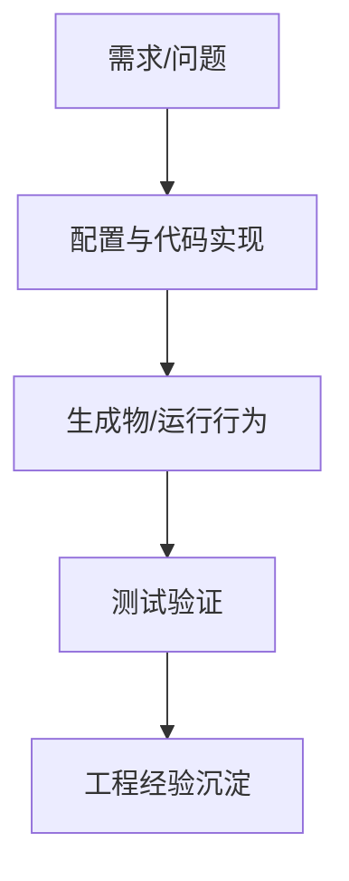

# Autosar MCAL-ADC详解（二）-基于Tc27x的cfg软件 - 学习笔记

> 来源公众号：汽车电子学习笔记

> 原文标题：Autosar MCAL-ADC详解（二）-基于Tc27x的cfg软件

> 原文链接：http://mp.weixin.qq.com/s?__biz=Mzk0NTM4MTI2MA==&mid=2247484338&idx=1&sn=67aa9cb9462f4e8cde5b9ae1d2c6f49d&chksm=c3170951f4608047e0f36b41ae1a8a3bd1bb08b108d51ab241a4d81929b5dec584951fbf3348#rd

> 发布时间：2022-11-05

> 归档标签：#Autosar

> 整理方式：本文是基于原文主题的学习笔记，不复制原文全文；重点补充概念框架、工程理解、排查思路和可复用检查清单。

---

## 1. 先给结论

这篇文章可以归到 **AUTOSAR 通信栈** 这一类问题里。学习时不要只记某个配置项或某个函数名，而要先抓住它背后的工程链路：为什么需要它、它位于哪一层、它依赖哪些前置条件、失败以后系统应该怎样响应。

我的理解是：**Autosar MCAL-ADC详解（二）-基于Tc27x的cfg软件** 这类问题的核心，不是把步骤机械跑通，而是把“需求、配置、生成物、运行行为、验证证据”连成闭环。只要闭环断了，项目里就会出现“配置看起来对、代码也生成了、但现象就是不对”的典型问题。

## 2. 原文脉络速读

这篇文章适合按 **MCAL 与外设配置** 的思路来读。不要把它当成孤立技巧，建议先建立一条从需求到验证的学习路线：

- 先把芯片资源、引脚复用、时钟和外设实例对应起来。
- 再看工具配置如何映射到 MCAL channel、container 和生成文件。
- 重点关注初始化顺序、中断/回调、硬件触发和 variant 策略。
- 最后用寄存器、波形、生成代码 diff 和功能现象交叉验证。

读这类文章时，建议不要一上来抄配置，而是先问三个问题：

- 这个机制解决的是哪个层级的问题？

- 它的输入、输出和触发条件是什么？

- 它失败时，系统应该怎么被观察、怎么被诊断、怎么被恢复？

## 3. 像老师一样拆开讲

### 3.1 先看它在系统里的位置

如果把整车软件看成分层系统，**AUTOSAR 通信栈** 通常不是孤立存在的。它会同时牵涉需求、配置工具、基础软件模块、生成代码、运行时状态和测试验证。通信栈问题要从信号一路看到总线：Signal、IPdu、Com、PduR、CanIf、CanDrv，每一层都可能正确，也都可能在边界条件下断开。

一个比较实用的理解方法是：把它拆成“静态配置”和“动态行为”两半。

- 静态配置回答：哪些参数、接口、映射、开关、阈值、回调需要提前定义？

- 动态行为回答：运行时谁先触发、谁负责转发、谁保存状态、谁最终产生外部可见结果？

很多问题之所以难排查，是因为我们只看了静态配置，没有顺着动态行为走一遍。

### 3.2 再看关键路径

结合这类问题的工程共性，可以把关键路径理解为：

1. 明确触发源：谁发起这个动作，是诊断请求、工具生成、周期任务、总线报文，还是启动流程？

2. 明确前置条件：会话、安全等级、网络状态、初始化阶段、模式管理状态是否满足？

3. 明确配置落点：配置最终进入哪个 ARXML、生成代码、配置表或链接段？

4. 明确运行路径：从入口到最终输出，中间经过哪些模块、回调、状态机或驱动接口？

5. 明确观测证据：总线、日志、DTC、调试变量、复位原因或生成文件 diff 能否证明链路闭合？

这里要提醒一点：这些点不是让你死记，而是让你在项目里建立“检查顺序”。先确认入口，再确认中间状态，最后确认输出和反馈。顺序对了，排查效率会高很多。

### 3.3 最容易踩坑的地方

这类问题在项目里常见的坑，通常不是某一个语法点，而是上下游没有对齐：

- 只看 DBC 或只看 COM 配置，没有确认 PDU 路由。

- 忽略超时、UpdateBit、信号初值和接收使能条件。

- 总线有报文，但应用层读不到，因为 RTE 或 COM signal path 没通。

- 周期发送、事件发送和 Nm/ComM 状态之间没有对齐。

所以排查时不要只盯着一个模块。要沿着“触发源 -> 配置 -> 生成代码 -> 运行状态 -> 外部现象”一路看下去。

## 4. 图片与原文图示

下面保留原文中解析到的图片引用，便于对照阅读：

## 5. 工程检查清单

- 信号到 PDU 的映射是否正确？

- PduR/CanIf/CanDrv 路径是否完整？

- ComM/Nm 状态是否允许通信？

- 是否验证总线、COM buffer、RTE 读值三处观测点？

- 是否有日志、DTC、调试变量或总线报文可以证明链路走通？

- 是否考虑了复位、休眠唤醒、重复触发、多核、中断或超时场景？

## 6. 一句话总结

这篇文章真正值得学的，不只是 **Autosar MCAL-ADC详解（二）-基于Tc27x的cfg软件** 这个具体知识点，而是它展示的工程方法：把一个看似局部的问题，放回 AUTOSAR/MCU/工具链/诊断/测试的完整链路里理解。
