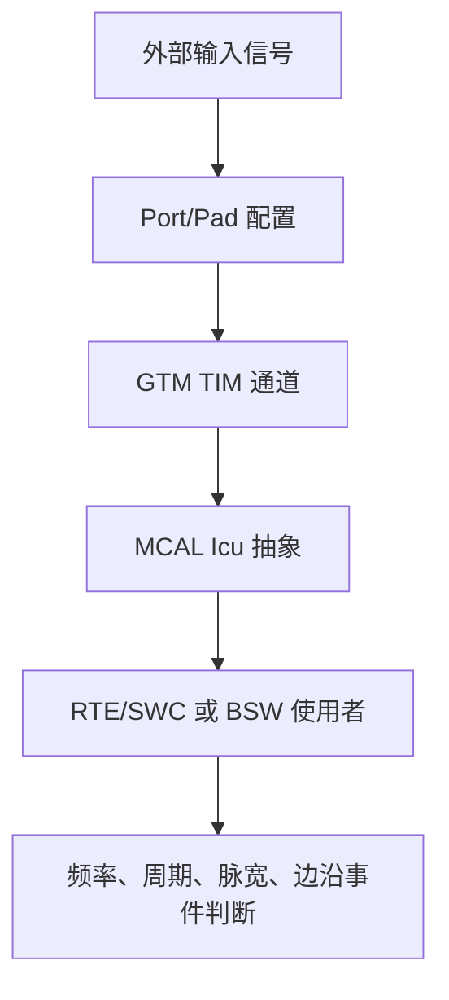

# Autosar MCAL-GTM之定时输入TIM - 学习笔记

> 来源公众号：汽车电子学习笔记

> 原文标题：Autosar MCAL-GTM之定时输入TIM

> 原文链接：http://mp.weixin.qq.com/s?__biz=Mzk0NTM4MTI2MA==&mid=2247484258&idx=1&sn=e167730858144504886ea0fca42807e8&chksm=c3170981f4608097d79e391e4843537bd9af4563d048be8eb3813d872725c430b0205333826d#rd

> 发布时间：2022-10-15

> 归档标签：#Autosar

> 抓取状态：微信页面本次返回验证/受限内容，未能解析到正文和正文图片；本文先根据标题、合集索引和 AUTOSAR MCAL 工程语境整理成学习笔记，后续拿到可访问原文后可补齐图片与原文脉络。

> 整理方式：本文是基于原文主题的学习笔记，不复制原文全文；重点补充概念框架、工程理解、排查思路和可复用检查清单。

---

## 1. 先给结论

GTM 的 TIM（Timer Input Module）可以理解为 **MCAL 层里用于捕获外部时序事件的硬件入口**。它关心的不是“引脚电平是多少”这么简单，而是“某个边沿什么时候到来、两个边沿之间相隔多久、输入信号是否满足预期的周期/占空比/脉宽约束”。

学 TIM 时要先把它和常见模块区分开：

- Dio 关注静态电平。
- Icu 关注输入捕获的 AUTOSAR 抽象接口。
- GTM TIM 是底层硬件资源，负责把输入边沿、时间戳、滤波、测量状态这些信息采出来。
- MCAL 配置的任务，是把 ECU 引脚、GTM 通道、Icu 通道、通知回调和上层算法串成闭环。

## 2. 原文主题速读

从题目看，原文大概率围绕 **GTM TIM 的定时输入配置与使用** 展开。阅读这类文章时，建议抓住四个问题：

- 输入信号从哪个物理引脚进入 MCU？
- 这个引脚被路由到哪个 GTM TIM channel？
- AUTOSAR MCAL 中是通过 Icu 还是厂商扩展接口暴露给上层？
- 上层最终要测的是边沿、周期、脉宽、占空比，还是输入事件计数？

真正的工程重点是：不要只会点工具界面，而要能从外部信号一路追到软件可见变量。

## 3. 像老师一样拆开讲

### 3.1 TIM 的本质：给输入事件打时间戳

TIM 的核心价值是“时间”。外部信号的上升沿、下降沿进入 MCU 后，TIM 通道会结合 GTM 的时钟基准记录事件发生时刻。只要有了时间戳，软件就能计算周期、频率、脉宽、占空比，也能判断丢边沿、毛刺或超时。

这也是为什么 TIM 配置一定要和 GTM 时钟配置一起看。时钟分频不同，计数分辨率和溢出时间就不同；分辨率太粗，短脉冲测不准；计数窗口太短，低频信号又容易溢出。

### 3.2 AUTOSAR 里通常怎么落地

在 AUTOSAR Classic 工程中，上层一般不直接碰 GTM TIM 寄存器，而是通过 MCAL 的 Icu 模块使用输入捕获能力。典型关系是：

- Port 配置决定引脚复用和输入属性。
- Mcu/Gtm 配置决定时钟、GTM 使能和资源基础。
- Icu 配置把逻辑通道映射到具体 TIM channel。
- Icu 通知函数或周期读取接口把结果交给 BSW/SWC。

如果工具里只配了 Icu 通道，却忘了 Port 复用、GTM 时钟、输入滤波或中断通知，现象就会变成“配置看着有，回调就是不来”。这种问题在项目里很常见。

### 3.3 排查要按信号链走

遇到 TIM 输入捕获不工作，不建议先改一堆参数。更稳的顺序是：

1. 用示波器确认 MCU 引脚上真的有信号。
2. 查 Port 配置，确认引脚方向、复用功能、输入缓冲和上下拉没有错。
3. 查 GTM clock，确认 TIM 所在子模块已经有有效时钟。
4. 查 Icu channel 映射，确认逻辑通道对应正确的 TIM 通道。
5. 查边沿选择、滤波、通知开关和中断路由。
6. 最后再看软件调用顺序，比如 Icu_Init、Icu_EnableNotification、Icu_StartSignalMeasurement 是否真的执行。

这个顺序的好处是每一步都有可观测证据，不会陷入“工具里来回点但不知道哪里变了”的状态。

## 4. 图片与原文图示

本次未能解析到原文正文图片。建议后续可补一张链路图：`Pad -> GTM TIM -> Icu channel -> notification/read API -> application logic`。这张图比单独截图某个配置页更有学习价值，因为它把硬件资源和 AUTOSAR 抽象关系讲清楚了。

## 5. 工程检查清单

- Port 引脚复用是否指向正确的 GTM TIM 输入？
- GTM/TIM 时钟是否已开启，分频是否满足测量精度和量程？
- Icu logical channel 是否映射到正确的硬件 channel？
- 边沿选择、滤波、测量模式、通知回调是否符合需求？
- 初始化顺序是否满足 `Mcu/Port/Gtm/Icu` 依赖关系？
- 是否验证了无信号、毛刺、超短脉冲、低频溢出和连续边沿场景？
- 是否有示波器波形、寄存器快照、回调计数或日志作为验证证据？

## 6. 一句话总结

TIM 不只是“输入捕获配置项”，它是外部时序信号进入 AUTOSAR 软件世界的桥。把引脚、GTM 时钟、TIM 通道、Icu 抽象和上层算法串起来，才算真正学会这类 MCAL 配置。
