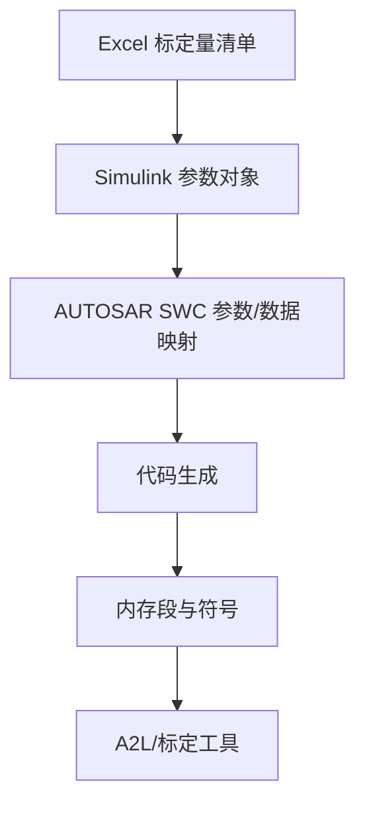

# Excel管理Simulink SWC中的标定量与观测量之标定量 - 学习笔记

> 来源公众号：汽车电子学习笔记

> 原文标题：Excel管理Simulink SWC中的标定量与观测量之标定量

> 原文链接：http://mp.weixin.qq.com/s?__biz=Mzk0NTM4MTI2MA==&mid=2247483944&idx=1&sn=97a24c69078ac97d85d19628e1aec1c7&chksm=c31708cbf46081dd5ee08859adb7d7323d1d63bed06cce1050fd9501738399dc65781237e9d9#rd

> 发布时间：2022-07-17

> 归档标签：#Autosar

> 抓取状态：微信页面本次返回验证/受限内容，未能解析到正文和正文图片；本文先根据标题、合集索引和 AUTOSAR SWC/Simulink 工程语境整理成学习笔记，后续拿到可访问原文后可补齐图片与原文脉络。

> 整理方式：本文是基于原文主题的学习笔记，不复制原文全文；重点补充概念框架、工程理解、排查思路和可复用检查清单。

---

## 1. 先给结论

用 Excel 管理 Simulink SWC 的标定量，本质上不是“表格自动化”，而是在做 **模型、AUTOSAR 元数据、代码生成和标定工具之间的数据一致性管理**。

标定量不是普通变量。它需要同时满足：

- Simulink 模型里能被算法引用。
- AUTOSAR SWC 描述里有正确的数据类型、接口或内部参数定义。
- 生成代码里落到期望的内存段或可访问符号。
- A2L、标定工具或下游集成流程能识别它。

## 2. 原文主题速读

从题目看，原文重点应是用 Excel 统一维护 Simulink SWC 中的标定量。学习时不要只关注脚本怎么读表，而要关注 Excel 每一列背后的工程含义：

- 名称：是否符合模型、代码和 A2L 命名规则？
- 类型：是否和 Simulink data type、ImplementationDataType 一致？
- 初值：是否有工程默认值，是否支持变体或项目差异？
- 范围：是否便于标定工具检查上下限？
- 单位：是否和需求、信号定义、标定说明一致？
- 存储类/内存段：是否决定变量最终放到可标定区域？

这类自动化越早做规范，后面模型扩展越省心；越晚做，越容易出现“模型能跑、代码能出、标定工具找不到”的问题。

## 3. 像老师一样拆开讲

### 3.1 为什么要用 Excel 管

在真实项目里，标定量数量会越来越多。如果每个参数都在 Simulink 里手工建对象，短期看可行，长期会出现三个问题：

- 参数命名和类型容易漂移。
- 不同模型之间难以复用同一套标定定义。
- 评审时很难一次性看清所有标定量的范围、单位、初值和用途。

Excel 的价值不是比模型高级，而是它天然适合做“清单化管理”。清单一旦稳定，就可以用 Matlab 脚本生成或更新 Simulink.Parameter、AUTOSAR 映射、数据字典，甚至辅助生成标定说明。

### 3.2 标定量要和 AUTOSAR 语义对齐

在 AUTOSAR SWC 里，标定量可能表现为 Parameter、PerInstanceParameter、ConstantMemory 或工具链特定的内部参数映射。具体采用哪一种，要看项目的 AUTOSAR 版本、代码生成策略和标定访问方式。

更重要的是：不要把标定量只看成 Matlab workspace 里的变量。它最终要跨过 RTE/代码生成/链接/A2L 这几道关口。任何一道关口语义不一致，都会导致后续集成问题。

一个稳妥的判断方法是：从 Excel 里任意挑一个参数，反向追踪它是否能在模型、生成代码、map 文件和 A2L 里找到同一个名字或明确映射关系。

### 3.3 自动化脚本最该防的坑

脚本读 Excel 很简单，难的是防止错误数据进入模型。建议脚本至少做这些检查：

- 名称重复检查。
- 类型合法性检查。
- 初值是否能转换到目标类型。
- 上下限是否和初值、类型范围一致。
- 单位、描述、分组字段是否为空。
- 存储类或内存段是否属于项目允许集合。
- Excel 删除某个参数时，模型中残留对象如何处理。

很多自动化脚本失败，不是因为生成不了对象，而是没有定义“脏数据如何被拒绝”。老师傅看这类脚本，第一眼通常不是看生成逻辑，而是看校验逻辑。

## 4. 图片与原文图示

本次未能解析到原文正文图片。后续可补两类图：

- Excel 字段设计示意图：展示名称、类型、初值、范围、单位、存储类、描述等列。
- 数据流图：展示 Excel 到 Simulink 参数对象，再到 AUTOSAR 映射、代码生成和 A2L 的链路。

## 5. 工程检查清单

- Excel 是否定义了名称、类型、初值、范围、单位、描述和存储属性？
- 参数名是否同时满足 Matlab、C 代码、AUTOSAR 和 A2L 的命名约束？
- 是否区分标定量、观测量、内部状态量和普通局部变量？
- Simulink.Parameter 或数据字典对象是否由脚本统一生成？
- AUTOSAR 参数映射是否能稳定生成，不依赖手工点选？
- 生成代码、map 文件、A2L 中是否能追踪到同一参数？
- 删除、改名、类型变化时是否有明确的变更检查和评审记录？

## 6. 一句话总结

Excel 管标定量的核心不是 Excel，而是建立一条可追踪、可校验、可重复生成的数据链。只要这条链稳定，Simulink SWC 的标定管理才不会随着模型变大而失控。
