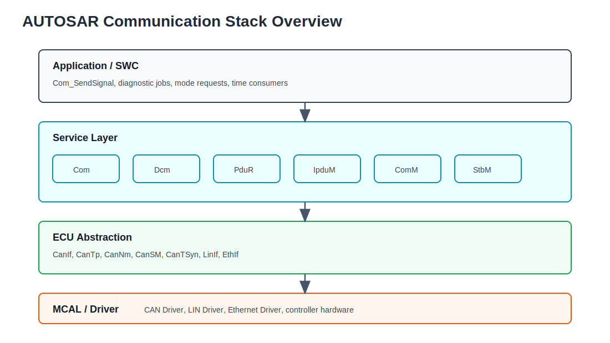
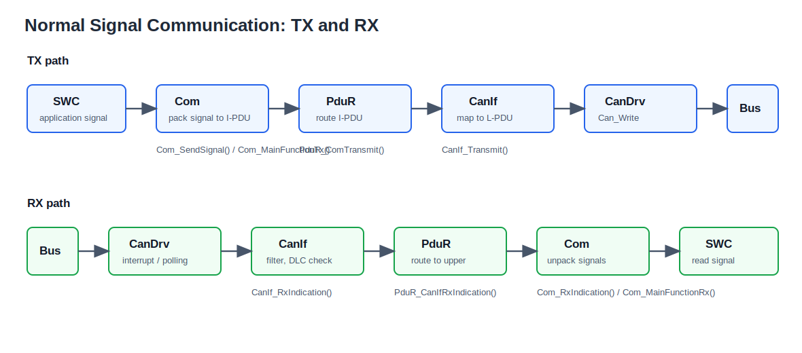
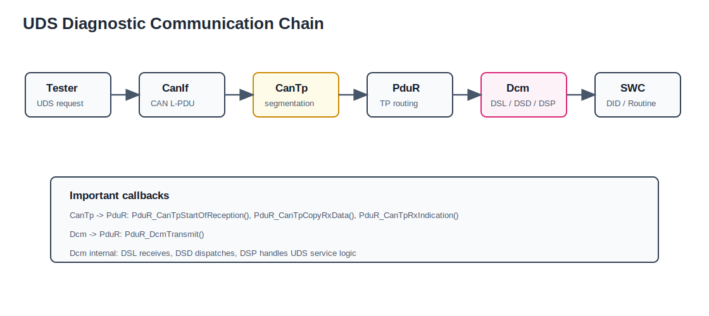
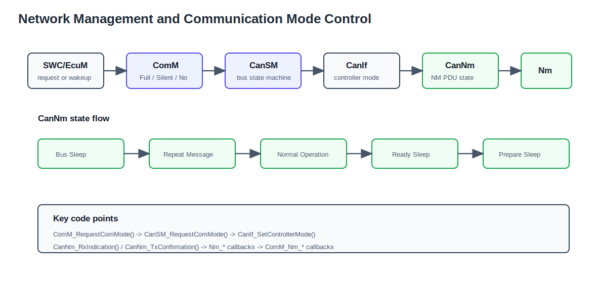
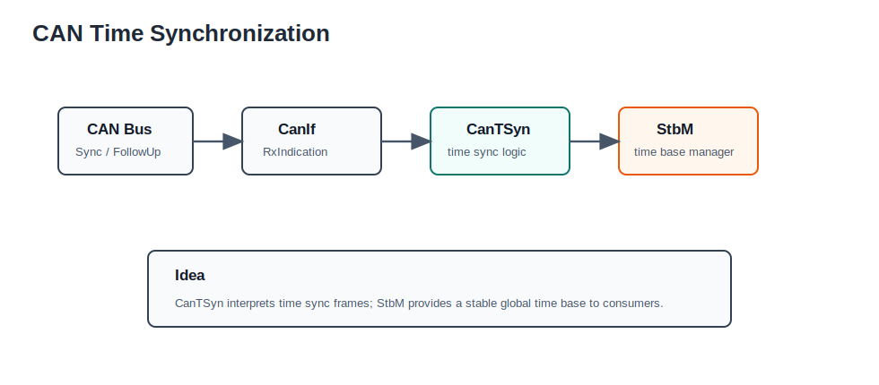

# communication stack

## 1. Communication Stack 概览

Communication Stack 是 AUTOSAR BSW 中负责车载网络收发、诊断通信、网络管理、总线状态控制和时间同步的一组模块。可以按职责分成两类：




1. 通信数据传输
   - `Com`
   - `Dcm`
   - `PduR`
   - `IpduM`

2. 通信模式管理
   - `ComM`
   - `CanSM`
   - `CanNm`
   - `CanTSyn`
   - `StbM`

### 1.1 分层

- `MCAL`: 最底层硬件驱动，负责 CAN/LIN/FlexRay/Ethernet 控制器访问
- `ECU Abstraction`: 如 `CanIf`、`LinIf`、`EthIf`，屏蔽硬件差异
- `Service Layer`: 如 `Com`、`Dcm`、`ComM`、`CanSM`、`Nm`、`E2E`

### 1.2 典型链路



- 信号通信
  - `App` -> `Com` -> `PduR` -> `CanIf` -> `CanDrv`
- 诊断通信
  - `Tester` -> `CanTp` -> `PduR` -> `Dcm`
- 网络管理
  - `EcuM` -> `ComM` -> `CanSM` -> `CanNm` -> `Nm`
- 时间同步
  - `CanTSyn` -> `StbM` -> 上层时间基准消费者

### 1.3 两大职责

1. 数据传输
   - 负责系统信号、诊断数据、网关转发
   - 核心模块：`Com`、`Dcm`、`PduR
   - 
   - `
	   -Com服务中的CAN消息传递路径如下图：
		   - 
		   - 对于接收而言，MCAL层中的CanDrv接收到最原始的CAN报文后传输到CanIf模块，CanIf模块相当于是一个报文分类模块，它会根据CAN ID将CAN报文分类，然后传递到服务层的不同模块，比如图中的PduR模块。经过了CanIf模块后，这个时候原始CAN报文变换为服务层PDU。PduR功能为PDU路由，它会对PDU再次进行分类，随后将其传递到更上层的软件模块，比如Com模块
	   - Dcm服务的CAN消息传递路径如下图：
	   - 
	   - 在Dcm服务中，对比Com服务，发现其有两个不同，第一个不同为Dcm服务与APP没有交集，因为Dcm就是UDS。第二个不同为在CanIf模块和PduR模块中多了一层CanTP模块，这个模块其实就是实现了ISO15765-2中描述的UDS on CAN的网络层

2. 通信管理
   - 负责总线状态、唤醒、休眠、网络保持
   - 核心模块：`ComM`、`CanSM`、`CanNm`
   - 
```
SM模块则是负责总线的状态管理，主要负责总线通信开启和关闭，另外还负责总线错误的检测和恢复。而NM模块则负责总线的网络管理，基于总线报文协议控制ECU的睡眠和唤醒。
```
---

## 2. CAN Driver / MCAL

CAN Driver 位于最底层，负责：

- 初始化 CAN 控制器
- 配置收发对象
- 收发 CAN 帧
- 中断 / 轮询处理
- Bus-Off、Wakeup、TxConfirmation、RxIndication

### 2.1 HOH

HOH = `Hardware Object Handle`

- `HTH`: Transmit HOH，发送用
- `HRH`: Receive HOH，接收用

HOH 更像是对底层硬件对象的抽象映射，上层不用直接操作寄存器。
首先介绍一个叫做（HOH）Hardware Object handles的这个概念，这个其实在MCAL层出现的较多，对MCAL的上层软件来说，HOH其实就是一个CAN报文的消息缓冲区，上层软件想发送报文的时候，就把报文往里面塞就好了，MCAL会负责发送出去，同理，接收报文就是从缓冲区里读取。但是在MCAL层，这个HOH的实现就五花八门了，这里就不多解释了。后文出现的HTH意思就是用来发送的HOH，而HRH意思就是用来接收的HOH.

### 2.2 FullCAN / BasicCAN

- `FullCAN`: 硬件直接过滤特定 ID，通常更快
- `BasicCAN`: 过滤更灵活，但常常还要软件再筛一遍

### 2.3 轮询 / 中断 / 混合

- `Interrupt Mode`: 事件到来直接进 ISR
- `Polling Mode`: 周期调用 `MainFunction` 处理事件
- `Mixed Mode`: 不同控制器或不同功能采用不同方式

### 2.4 代码链路

在你工程里，CAN Driver 向上最关键的回调是：

- 接收后调用 `CanIf_RxIndication()`
- 发送完成后调用 `CanIf_TxConfirmation()`

对应位置可看：
- [CanIf_RxIndication.c](E:/github/ECAS_qirui_Single_Chamber/BasicSoftware/src/bsw/CanIf/src/CanIf_RxIndication.c)
- [CanIf_Transmit.c](E:/github/ECAS_qirui_Single_Chamber/BasicSoftware/src/bsw/CanIf/src/CanIf_Transmit.c)
- [CanIf_TxConfirmation.c](E:/github/ECAS_qirui_Single_Chamber/BasicSoftware/src/bsw/CanIf/src/CanIf_TxConfirmation.c)
- [CanIf_Controller.c](E:/github/ECAS_qirui_Single_Chamber/BasicSoftware/src/bsw/CanIf/src/CanIf_Controller.c)

---

## 3. CanIf

`CanIf` 是 CAN Driver 和上层模块之间的接口层。

### 3.1 主要功能

1. 初始化
2. 发送请求
3. 发送确认
4. 接收指示
5. Controller mode 控制
6. Transceiver mode 控制
7. PDU channel mode 控制
8. DLC 检查
9. PDU / CAN ID 映射

### 3.2 核心概念

- `CanIf Rx L-PDU`: 下层收到的 CAN 帧
- `CanIf Tx L-PDU`: 上层要发到 CAN 总线的帧
- `CanIfRxBuffer`: 接收缓存
- `CanIfTxBuffer`: 发送缓存
- `CanIf Tx PDU`: 上层 I-PDU / L-SDU 到 CAN 帧的绑定

### 3.3 运行时行为

接收时：
- 按 CAN ID 过滤
- 检查长度和控制器状态
- 调用上层回调，如 `Com`、`CanNm`、`CanTp`、`Dcm`

发送时：
- 把上层 I-PDU 转成 CAN L-PDU
- 根据 HTH / buffer / 优先级投递到底层驱动
- 发送完成后通知上层确认

### 3.4 代码链路

从代码看，`CanIf` 的关键入口是：

- `CanIf_Transmit()`：上层发起发送，内部最终会调用 `Can_Write()` 或 `CanXL_Write()`
- `CanIf_RxIndication()`：底层接收后进入，先做控制器 / 通道 / ID 过滤，再转给上层
- `CanIf_TxConfirmation()`：底层发送完成后进入，向 `PduR` 或直接向业务层上报确认
- `CanIf_SetControllerMode()`：`CanSM` 会通过它控制控制器状态

可直接看：
- [CanIf_Transmit.c](E:/github/ECAS_qirui_Single_Chamber/BasicSoftware/src/bsw/CanIf/src/CanIf_Transmit.c)
- [CanIf_RxIndication.c](E:/github/ECAS_qirui_Single_Chamber/BasicSoftware/src/bsw/CanIf/src/CanIf_RxIndication.c)
- [CanIf_TxConfirmation.c](E:/github/ECAS_qirui_Single_Chamber/BasicSoftware/src/bsw/CanIf/src/CanIf_TxConfirmation.c)
- [CanIf_Controller.c](E:/github/ECAS_qirui_Single_Chamber/BasicSoftware/src/bsw/CanIf/src/CanIf_Controller.c)

### 3.5 你笔记里值得记住的点

- `CanIf` 可以理解成“报文分类器 + 适配器”
- 原始 CAN 帧进入 `CanIf` 后，才变成上层能理解的 PDU
- `CanSM` 通过 `CanIf_SetControllerMode()` 管控制器
- `PduR`、`CanNm`、`CanTp`、`Dcm` 都依赖 `CanIf`

---

## 4. PduR / IpduM

`PduR` = `PDU Router`

### 4.1 作用

- 负责 I-PDU 路由
- 上层到下层、下层到上层都靠它转发
- 路由规则通常来自静态配置，不是运行时动态决定

### 4.2 常见上下层

上层：
- `Com`
- `Dcm`
- `Dem`
- `IpduM`

下层：
- `CanIf`
- `CanNm`
- `CanTp`
- `LinIf`
- `FrIf`

### 4.3 你工程里的 NM 路由

你工程里有类似：

- `NM_Tx_0x60B` 通过 `PduR` 路由到 `CanNm`
- `CanIf` 再把它发到底层 CAN
- RX 方向相反：`CanIf` -> `PduR` -> `CanNm`

### 4.4 `IpduM`

`IpduM` = `I-PDU Multiplexer`

- 用于 I-PDU 复用
- 一个 PDU 的不同 Layout 通过 selector field 区分
- 常见于信号复用、不同数据布局共用同一个报文 ID

### 4.5 代码链路

你工程里的函数名很清楚：

- `PduR_ComTransmit()` -> `PduR_rComTransmit()`
- `PduR_DcmTransmit()` -> `PduR_rDcmTransmit()`
- `PduR_CanIfRxIndication()` -> `PduR_rCanIfRxIndication()`
- `PduR_CanIfTxConfirmation()` -> `PduR_rCanIfTxConfirmation()`
- `PduR_CanTpStartOfReception()` / `PduR_CanTpCopyRxData()` / `PduR_CanTpCopyTxData()`
- `PduR_CanNmRxIndication()` / `PduR_CanNmTxConfirmation()`

对应代码：
- [PduR_UpIf.c](E:/github/ECAS_qirui_Single_Chamber/BasicSoftware/src/bsw/PduR/PduR_UpIf.c)
- [PduR_UpTp.c](E:/github/ECAS_qirui_Single_Chamber/BasicSoftware/src/bsw/PduR/PduR_UpTp.c)
- [PduR_dLoIf.c](E:/github/ECAS_qirui_Single_Chamber/BasicSoftware/src/bsw/PduR/PduR_dLoIf.c)
- [PduR_dLoIfTT.c](E:/github/ECAS_qirui_Single_Chamber/BasicSoftware/src/bsw/PduR/PduR_dLoIfTT.c)
- [PduR_LoTp.c](E:/github/ECAS_qirui_Single_Chamber/BasicSoftware/src/bsw/PduR/PduR_LoTp.c)

---

## 5. Com

`Com` 负责信号层通信。

### 5.1 作用

- 信号打包 / 解包
- 周期发送 / 事件发送
- 接收超时监测
- 发送超时监测
- group control
- E2E / callout 配合

### 5.2 典型特征

- 面向 `Signal`，不是直接面向 CAN 帧
- 一个 I-PDU 里可以有多个信号
- 信号更新后，再由 `Com` 统一组包发送

### 5.3 常见 API

- `Com_Transmit()`
- `Com_RxIndication()`
- `Com_ReceiveSignal()`
- `Com_SendSignal()`
- `Com_IpduGroupControl()`
- `Com_TxConfirmation()`

### 5.4 TP 报文

- TP 报文通常经 `PduR` -> `CanTp`
- 发送过程中不应随便改发送数据
- 接收失败时通常会丢弃整帧或整组数据

### 5.5 超时

- `ComTimeout`
- `ComFirstTimeout`
- 收发超时都可配置
- 超时后可触发回调或使用默认值

### 5.6 代码链路

你工程里：

- `Com_SendSignal()` 更新信号缓存
- `Com_RxIndication()` 由下层收到 I-PDU 后调用
- `Com_TxConfirmation()` 由下层发送完成后调用
- `Com_MainFunctionTx()` 负责周期发送、事件发送、重复发送和 MDT 处理
- `Com_MainFunctionRx()` 负责超时、更新位、失效值、接收相关处理

对应文件：
- [Com_SendSignal.c](E:/github/ECAS_qirui_Single_Chamber/BasicSoftware/src/bsw/Com/src/Com_SendSignal.c)
- [Com_RxIndication.c](E:/github/ECAS_qirui_Single_Chamber/BasicSoftware/src/bsw/Com/src/Com_RxIndication.c)
- [Com_TxConfirmation.c](E:/github/ECAS_qirui_Single_Chamber/BasicSoftware/src/bsw/Com/src/Com_TxConfirmation.c)
- [Com_MainFunctionTx.c](E:/github/ECAS_qirui_Single_Chamber/BasicSoftware/src/bsw/Com/src/Com_MainFunctionTx.c)
- [Com_MainFunctionRx.c](E:/github/ECAS_qirui_Single_Chamber/BasicSoftware/src/bsw/Com/src/Com_MainFunctionRx.c)

---

## 6. Dcm

`Dcm` = `Diagnostic Communication Manager`



### 6.1 作用

- 处理 UDS / OBD 诊断通信
- 管理会话、安全等级、诊断服务
- 处理 DID 读写、RoutineControl、SecurityAccess 等

### 6.2 模块分层

- `DSL`: 诊断会话层
- `DSD`: 诊断服务分发
- `DSP`: 诊断服务处理

### 6.3 路径

- `Tester` -> `CanTp` -> `PduR` -> `Dcm`

### 6.4 你笔记里该记的点

- `Dcm` 面向诊断仪，不直接面向 App
- 它可以看成 OSI 里应用层 + 会话层的一部分
- `CanTp` 是它和 `CanIf` 之间的关键桥梁

### 6.5 代码链路

你工程里的 Dcm 入口主要落在：

- `Dcm_Dsl_RxIndication()`：接收诊断请求
- `Dcm_Dsl_StartOfReception()`：TP 开始接收
- `Dcm_Dsl_CopyRxData()`：分段接收拷贝
- `Dcm_Dsl_CopyTxData()`：分段发送取数
- `Dcm_Dsl_Confirmation()`：发送确认 / 会话确认
- `Dcm_ComM_FullComModeEntered()` / `Dcm_ComM_NoComModeEntered()` / `Dcm_ComM_SilentComModeEntered()`：和 ComM 交互

虽然你这份工程里 Dcm 的文件组织比较深，但从代码层面能看到：
- DSL 负责收发入口
- DSD 负责服务分发
- DSP 负责具体业务服务，如 DSC、RDBI、WDBI、RoutineControl、SecurityAccess

---

## 7. ComM

`ComM` = `Communication Manager`



### 7.1 作用

- 管理通信请求
- 协调 `Com`、`Nm`、`CanSM`、`EcuM`
- 控制通道进入 `FullCom` / `NoCom` / `SilentCom`

### 7.2 典型交互

- `RTE` / `SWC` / `BswM` 通过 `ComM` 发通信请求
- `EcuM` 唤醒后通知 `ComM`
- `Nm` 把网络状态回报给 `ComM`
- `CanSM` 把底层总线状态变化反馈给 `ComM`

### 7.3 PNC

PNC = `Partial Network Cluster`

- `ComM` 为每个 PNC 维护状态机
- 常见状态包括：
  - `PNC_NO_COMMUNICATION`
  - `PNC_PREPARE_SLEEP`
  - `PNC_READY_SLEEP`
  - `PNC_REQUESTED`

### 7.4 代码链路

你工程里能看到这些关键函数：

- `ComM_RequestComMode()`
- `ComM_EcuM_WakeupIndication()`
- `ComM_Nm_NetworkMode()`
- `ComM_Nm_BusSleepMode()`
- `ComM_Nm_PrepareBusSleepMode()`
- `CanSM_RequestComMode()`

对应文件：
- [ComM_RequestComMode.c](E:/github/ECAS_qirui_Single_Chamber/BasicSoftware/src/bsw/ComM/src/ComM_RequestComMode.c)
- [ComM_Nm_NetworkMode.c](E:/github/ECAS_qirui_Single_Chamber/BasicSoftware/src/bsw/ComM/src/ComM_Nm_NetworkMode.c)
- [ComM_Nm_BusSleepMode.c](E:/github/ECAS_qirui_Single_Chamber/BasicSoftware/src/bsw/ComM/src/ComM_Nm_BusSleepMode.c)
- [ComM_Nm_PrepareBusSleepMode.c](E:/github/ECAS_qirui_Single_Chamber/BasicSoftware/src/bsw/ComM/src/ComM_Nm_PrepareBusSleepMode.c)

---

## 8. CanNm

`CanNm` = `CAN Network Management`

### 8.1 作用

- 负责 CAN 网络管理
- 控制节点保持、休眠、唤醒
- 周期发送 NM PDU

### 8.2 常见状态

- `Repeat Message`
- `Normal Operation`
- `Ready Sleep`
- `Prepare Bus Sleep`
- `Bus Sleep`

### 8.3 关键机制

- `Repeat Message`
  - 唤醒后快速广播，保持网络活跃
- `NM Timeout`
  - 超时后重置计时，进入相应状态切换
- `CBV`
  - `Control Bit Vector`
  - 包含 `Repeat Message Request Bit` 等控制位
- `SNI`
  - `Source Node Identifier`

### 8.4 代码链路

- `CanNm_RxIndication()` 识别 NM PDU
- `CanNm_TxConfirmation()` 处理发送完成
- `CanNm_NetworkRequest()` / `CanNm_NetworkRelease()` 发起或释放网络请求
- `CanNm_RequestBusSynchronization()` 和同步模式相关
- `CanNm_RequestSynchronizedPncShutdown()` 处理同步 PNC 关闭

再向上：
- `Nm_SynchronizeMode()` / `Nm_ForwardSynchronizedPncShutdown()` / `Nm_RequestBusSynchronization()`
- 再到 `ComM`

对应文件：
- [CanNm_RxIndication.c](E:/github/ECAS_qirui_Single_Chamber/BasicSoftware/src/bsw/CanNm/src/CanNm_RxIndication.c)
- [CanNm_TxConfirmation.c](E:/github/ECAS_qirui_Single_Chamber/BasicSoftware/src/bsw/CanNm/src/CanNm_TxConfirmation.c)
- [CanNm_NetworkRequest.c](E:/github/ECAS_qirui_Single_Chamber/BasicSoftware/src/bsw/CanNm/src/CanNm_NetworkRequest.c)
- [CanNm_NetworkRelease.c](E:/github/ECAS_qirui_Single_Chamber/BasicSoftware/src/bsw/CanNm/src/CanNm_NetworkRelease.c)
- [CanNm_RequestBusSynchronization.c](E:/github/ECAS_qirui_Single_Chamber/BasicSoftware/src/bsw/CanNm/src/CanNm_RequestBusSynchronization.c)

---

## 9. CanSM

`CanSM` = `CAN State Manager`

### 9.1 作用

- 管理 CAN 总线状态机
- 控制 controller 启停、恢复、bus-off 处理
- 和 `ComM` 协调网络模式

### 9.2 常见职责

- 从 `ComM` 接收通信模式请求
- 控制 `CanIf` 改变控制器模式
- 处理 `Bus-Off`
- 上报 controller mode indication

### 9.3 代码链路

- `CanSM_RequestComMode()` 接收 `ComM` 请求
- `CanSM_ControllerModeIndication()` 接收 `CanIf` / CAN 驱动的状态反馈
- `CanSM_ControllerBusoff()` 处理总线下电平或故障状态

对应文件：
- [CanSM_RequestComMode.c](E:/github/ECAS_qirui_Single_Chamber/BasicSoftware/src/bsw/CanSM/src/CanSM_RequestComMode.c)
- [CanSM_ControllerModeIndication.c](E:/github/ECAS_qirui_Single_Chamber/BasicSoftware/src/bsw/CanSM/src/CanSM_ControllerModeIndication.c)
- [CanSM_ControllerBusoff.c](E:/github/ECAS_qirui_Single_Chamber/BasicSoftware/src/bsw/CanSM/src/CanSM_ControllerBusoff.c)

---

## 10. Time Sync



### 10.1 CanTSyn

`CanTSyn` 负责基于 CAN 的时间同步报文处理。

- 接收同步帧
- 发送同步帧
- 维护时间同步链路
- 通常会向 `StbM` 提供同步结果

### 10.2 StbM

`StbM` = `Synchronized Time Base Manager`

- 统一管理时间基准
- 接收多个同步源的时间信息
- 为上层提供统一时间源

### 10.3 你工程里的痕迹

工程中确实存在：
- `CanTSyn_EcucParamDef.arxml`
- `StbM_EcucParamDef.arxml`
- `CanIf` 侧也包含 `CanTSyn_RxIndication` 相关配置痕迹

这说明时间同步不是纯概念，而是已经进了工程配置。

---

## 11. E2E

`E2E` = `End-to-End protection`

### 11.1 作用

- 防止通信链路上的数据错误未被发现
- 常见保护内容：
  - 序号
  - CRC
  - Alive counter
  - 数据一致性检查

### 11.2 位置

- 通常在 `Com` 上层或者信号处理层使用
- 不负责传输本身，只负责保护和校验

### 11.3 你笔记里该记的点

- E2E 不等于通信层
- 它是给通信数据“加保险”的
- 常和 `Com`、`RTE`、`SWC` 配合

---

## 12. 一条完整链路

### 12.1 普通信号发送

`App/SWC` -> `Com_SendSignal()` -> `Com_MainFunctionTx()` -> `PduR_ComTransmit()` -> `CanIf_Transmit()` -> `CAN Driver`

### 12.2 普通信号接收

`CAN Driver` -> `CanIf_RxIndication()` -> `PduR_CanIfRxIndication()` -> `Com_RxIndication()` -> `Com_MainFunctionRx()` -> `App/SWC`

### 12.3 诊断接收

`Tester` -> `CAN Driver` -> `CanIf_RxIndication()` -> `PduR_CanIfRxIndication()` / `PduR_CanTpStartOfReception()` -> `CanTp` -> `PduR_DcmTransmit()` / `Dcm_Dsl_*()` -> `Dcm`

### 12.4 网络管理

`EcuM` / `BswM` / `SWC` -> `ComM_RequestComMode()` -> `CanSM_RequestComMode()` -> `CanIf_SetControllerMode()` -> `CanNm_*()` -> `Nm_*()` -> `ComM_Nm_*()`

### 12.5 时间同步

`CanTSyn` -> `StbM` -> 上层时间消费者

---

## 13. 你这套工程里最值得回看的文件

- [BasicSoftware/src/bsw/CanIf/src/CanIf_RxIndication.c](E:/github/ECAS_qirui_Single_Chamber/BasicSoftware/src/bsw/CanIf/src/CanIf_RxIndication.c)
- [BasicSoftware/src/bsw/CanIf/src/CanIf_Transmit.c](E:/github/ECAS_qirui_Single_Chamber/BasicSoftware/src/bsw/CanIf/src/CanIf_Transmit.c)
- [BasicSoftware/src/bsw/CanIf/src/CanIf_TxConfirmation.c](E:/github/ECAS_qirui_Single_Chamber/BasicSoftware/src/bsw/CanIf/src/CanIf_TxConfirmation.c)
- [BasicSoftware/src/bsw/PduR/PduR_UpIf.c](E:/github/ECAS_qirui_Single_Chamber/BasicSoftware/src/bsw/PduR/PduR_UpIf.c)
- [BasicSoftware/src/bsw/PduR/PduR_LoTp.c](E:/github/ECAS_qirui_Single_Chamber/BasicSoftware/src/bsw/PduR/PduR_LoTp.c)
- [BasicSoftware/src/bsw/Com/src/Com_RxIndication.c](E:/github/ECAS_qirui_Single_Chamber/BasicSoftware/src/bsw/Com/src/Com_RxIndication.c)
- [BasicSoftware/src/bsw/Com/src/Com_TxConfirmation.c](E:/github/ECAS_qirui_Single_Chamber/BasicSoftware/src/bsw/Com/src/Com_TxConfirmation.c)
- [BasicSoftware/src/bsw/Com/src/Com_MainFunctionTx.c](E:/github/ECAS_qirui_Single_Chamber/BasicSoftware/src/bsw/Com/src/Com_MainFunctionTx.c)
- [BasicSoftware/src/bsw/Com/src/Com_MainFunctionRx.c](E:/github/ECAS_qirui_Single_Chamber/BasicSoftware/src/bsw/Com/src/Com_MainFunctionRx.c)
- [BasicSoftware/src/bsw/Dcm/src/Dsl/Dcm_Dsl.c](E:/github/ECAS_qirui_Single_Chamber/BasicSoftware/src/bsw/Dcm/src/Dsl/Dcm_Dsl.c)
- [BasicSoftware/src/bsw/ComM/src/ComM_RequestComMode.c](E:/github/ECAS_qirui_Single_Chamber/BasicSoftware/src/bsw/ComM/src/ComM_RequestComMode.c)
- [BasicSoftware/src/bsw/CanSM/src/CanSM_RequestComMode.c](E:/github/ECAS_qirui_Single_Chamber/BasicSoftware/src/bsw/CanSM/src/CanSM_RequestComMode.c)
- [BasicSoftware/src/bsw/CanNm/src/CanNm_RxIndication.c](E:/github/ECAS_qirui_Single_Chamber/BasicSoftware/src/bsw/CanNm/src/CanNm_RxIndication.c)
- [BasicSoftware/src/bsw/CanNm/src/CanNm_TxConfirmation.c](E:/github/ECAS_qirui_Single_Chamber/BasicSoftware/src/bsw/CanNm/src/CanNm_TxConfirmation.c)

---

## 14. 资料来源

- 本地导出 Notion 页：`communication stack _ Notion.html`
- 本地工程代码：`BasicSoftware/src/bsw/*`
- 本地配置文件：`BasicSoftware/ecu_config/*`
- 外部参考：CSDN / 知乎链接（仅作为补充）
