# S32K3xx Chapter 64 BCTU 学习笔记

> 模块：Chapter 64 Body Cross-triggering Unit (BCTU)  
> 参考手册：`C:/Users/nvtc140/Zotero/storage/GKPNECE2/S32K3xx Reference Manual.pdf`，Chapter 64，PDF page 2680-2718  
> 工程上下文：`E:/github/ECAS_RTA_S32K324GHS_Heating`，目标芯片按工程文件为 S32K324  
> 输出目录：`E:/github/BCTU_Chapter64_StudyNotes`

本文把手册 Chapter 64 的 BCTU 机制、EB tresos 配置项、当前工程生成代码和调试检查点放在一起。图片均为重新绘制或由工程配置生成的“截图式”说明，便于复习和排查。

## 1. 先用一张图建立直觉

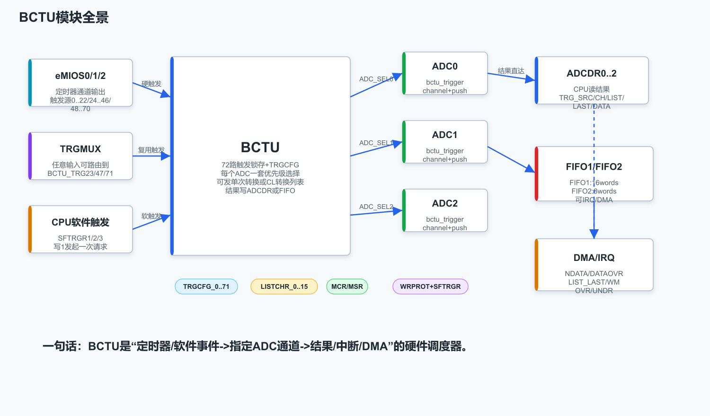

BCTU 可以理解为 ADC 的硬件触发调度器。它接收定时器、TRGMUX 或软件触发，把某一路触发映射成“某个 ADC 的某个通道转换命令”，再把转换结果放到 ADC 专用结果寄存器或 FIFO，最后通过 CPU 读取、IRQ 或 DMA 交给软件。

**它解决的问题不是“ADC 怎么采样”，而是“哪个时刻、由哪个硬件事件、让哪个 ADC 通道采样，并且如何保证多个触发竞争时有确定规则”**。

## 2. Chapter 64 章节地图

| 章节 | 主题 | 学习重点 |
|---|---|---|
| 64.1 | Chip-specific BCTU information | S32K3xx 具体 BCTU 实例、FIFO 深度、触发源编号 |
| 64.2 | Overview | BCTU 总体功能、72 路触发、3 个 ADC 输出、CL、结果路径 |
| 64.3.1 | Triggers | 硬触发、软触发、全局使能、TRG_FLAG、优先级、清除机制 |
| 64.3.2 | Conversion list (CL) | 转换列表、LAST、NEXT_CH_WAIT_ON_TRIG、多 ADC 并行 CL |
| 64.3.3 | ADC conversion results access | ADCDR、FIFO、IRQ、DMA、overrun/underrun/watermark |
| 64.4 | Register descriptions | MCR、MSR、TRGCFG、SFTRGR、ADCDR、LISTCHR、FIFO 寄存器 |
| 64.5 | Glossary | CL、MPC、PSI 等术语 |

## 3. S32K324 上的 BCTU 资源

### 3.1 实例与 FIFO

对本工程使用的 S32K324，BCTU 资源可以按下面记：

| 项目 | 数量/能力 |
|---|---|
| BCTU instance | 1 个 |
| Trigger input | 72 路，编号 0-71 |
| ADC output | ADC0、ADC1、ADC2，共 3 路 |
| Conversion list | 32 个 CL element，由 `LISTCHR_0..15` 存放，每个寄存器放 2 个 element |
| FIFO1 | 16 words |
| FIFO2 | 8 words |
| FIFO3 | S32K324 手册本章表 421 未列出；本项目生成头文件 `BCTU_IP_FIFO_COUNT` 为 2 |

### 3.2 触发源编号

BCTU 触发编号本身就是优先级编号：编号越小，优先级越高。

| 触发编号 | 来源 | 说明 |
|---|---|---|
| 0-22 | `eMIOS_0 Channel_0..22` | 所有 S32K3xx 适用，本项目主要使用这里 |
| 23 | `TRGMUX -> BCTU_Trg23` | 可由 TRGMUX 选择任意输入 |
| 24-46 | `eMIOS_1 Channel_0..22` | 所有 S32K3xx 适用 |
| 47 | `TRGMUX -> BCTU_Trg47` | 可由 TRGMUX 选择任意输入 |
| 48-70 | `eMIOS_2 Channel_0..22` | S32K324 适用 |
| 71 | `TRGMUX -> BCTU_Trg71` | S32K324 适用 |

注意：手册在 trigger source 表后有一个很容易漏掉的提示：TRGMUX 编程之后，要通过 `TRGCFG_n[TRG_FLAG]` 清掉送到 BCTU 的触发，避免旧触发残留。

## 4. BCTU 与 ADC、eMIOS、TRGMUX 的关系

BCTU 不是孤立外设，它在 Power Control and Motor Control 相关路径里通常和这些模块配合：

| 模块 | 与 BCTU 的关系 |
|---|---|
| eMIOS | 最常见的周期触发源。比如 PWM 周期某个比较事件产生一路 BCTU trigger。 |
| TRGMUX | 给 BCTU 的 23/47/71 三个入口提供可配置来源，也可以直接给 ADC external trigger。 |
| ADC | BCTU 向 ADC 发 `bctu_trigger + channel number`，ADC 转换完成后返回 `bctu_push + data`。 |
| DMA | 当结果进 ADCDR 或 FIFO 时，BCTU 可产生 DMA request。 |
| NVIC/OS ISR | BCTU 的状态、结果、FIFO 水位或错误可触发 BCTU 中断。 |

ADC 章节里说得更直接：BCTU 接口增强了 ADC 的 injected conversion 能力。BCTU 给 ADC 一个触发脉冲和通道号；ADC 完成后返回结果、下一命令握手和 push 信号。使用 BCTU 前，ADC 必须完成校准，应用应避免校准期间产生 BCTU 触发。

## 5. 一次触发从产生到结果的完整过程

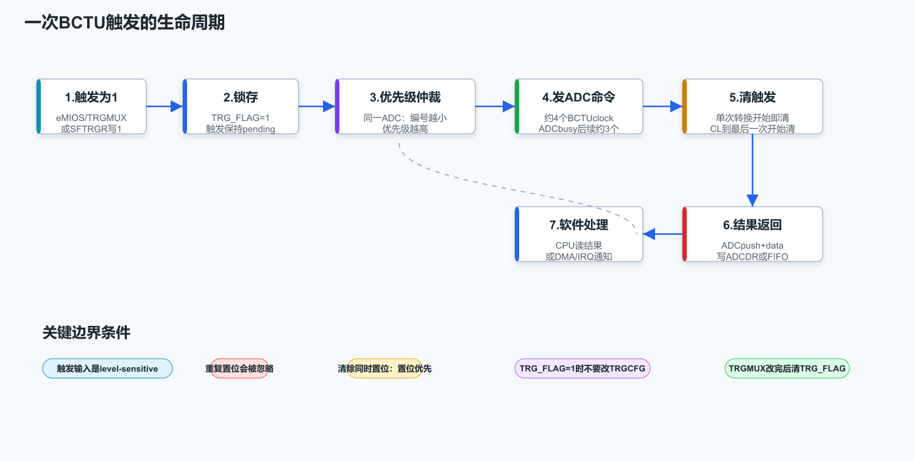

### 5.1 硬触发

硬触发通常来自 eMIOS 或 TRGMUX。流程是：

1. eMIOS 某通道输出置为有效，或者 TRGMUX 路由来的输入有效。
2. BCTU 看到该 trigger input 为逻辑 1。
3. BCTU 把该触发锁存，`TRGCFG_n[TRG_FLAG]` 读到 1。
4. BCTU 根据 `TRGCFG_n` 找到目标 ADC、通道或 CL 起点。
5. 如果目标 ADC 空闲，BCTU 发 conversion command。
6. 单次转换时，BCTU 在发给 ADC 的同时对触发源发 trigger clear。
7. ADC 完成后返回 conversion result，BCTU 写 ADCDR 或 FIFO，并置状态位。

关键点：BCTU input trigger 是 level-sensitive，不是边沿敏感。逻辑 1 被捕获后，如果在该 trigger register 已经为 1 时又来一次逻辑 1，BCTU 不会记录第二次事件。也就是说，如果上游源太快，BCTU 不帮你统计“错过了几次触发”。

### 5.2 软件触发

软件触发通过 `SFTRGR1/2/3` 对应 bit 写 1：

| 软件触发寄存器 | 覆盖 trigger |
|---|---|
| `SFTRGR1` | 0-31 |
| `SFTRGR2` | 32-63 |
| `SFTRGR3` | 64-71 |

软件触发与硬触发共享后续调度逻辑。写 1 后，BCTU 在对应转换开始时把该 bit 清 0。若软件在转换仍 pending/进行时再次写 1，通常不会叠加一次新的转换。

手册和 RTD 都建议：如果要用软件触发某个 trigger index，最好先禁用对应硬触发 `TRGCFG_x[TRIGEN]`，避免结果来源歧义。

### 5.3 全局触发与单路触发

BCTU 有两层开关：

| 开关 | 位置 | 作用 |
|---|---|---|
| 全局硬触发使能 | `MCR[GTRGEN]` | 激活所有单路已使能触发 |
| 单路硬触发使能 | `TRGCFG_n[TRIGEN]` | 允许该 trigger input 发起硬件转换 |

手册推荐的配置顺序：

1. 清掉当前 active/asserted trigger，避免旧事件进入新配置。
2. 关闭 `MCR[GTRGEN]`。
3. 配置各个 `TRGCFG_n`。
4. 打开 `MCR[GTRGEN]`，让所有单路触发同时生效。

动态修改单个 trigger 时，必须确保该路 `TRG_FLAG=0`。如果 `TRG_FLAG=1`，说明该触发对应的转换或 CL 仍未完全结束，此时改 `TRGCFG_n` 不安全。

## 6. 优先级、ADC busy 与触发清除

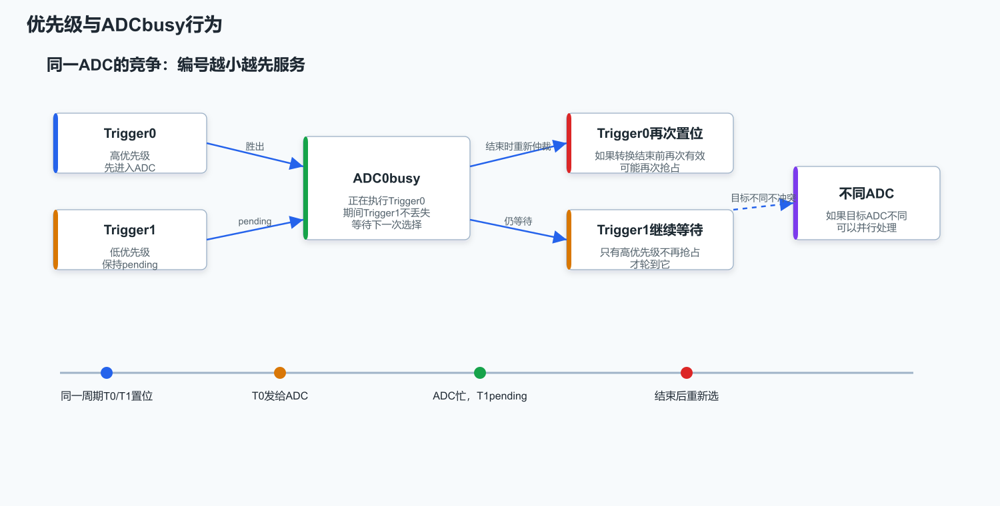

### 6.1 优先级规则

BCTU 按 trigger 编号决定优先级：

| 编号 | 优先级 |
|---|---|
| 0 | 最高 |
| 1 | 次高 |
| ... | ... |
| 71 | 最低 |

同一个 ADC 被多个 trigger 同时请求时，低编号先执行。低优先级 trigger 不会立刻丢失，它会保持 pending，等当前转换结束后再参与下一轮仲裁。

### 6.2 一个容易踩的现象

如果 trigger 0 和 trigger 1 同时请求 ADC0，BCTU 先执行 trigger 0。若 trigger 0 在下一次仲裁机会之前再次变成有效，trigger 0 可能再次胜出，trigger 1 继续 pending。也就是说，低优先级触发在高频高优先级触发面前可能长期得不到服务。

### 6.3 时序记忆

| 场景 | BCTU 到 ADC 的触发延迟 |
|---|---|
| ADC 空闲时新触发到来 | 约 4 个 BCTU clock |
| ADC busy，等待下一次转换 | 下一次转换请求约 3 个 BCTU clock |
| 不同 trigger 目标不同 ADC | 可以并行处理，不互相竞争 |

### 6.4 清除机制

触发清除规则：

| 转换类型 | 何时清 trigger |
|---|---|
| Single conversion | 该转换开始时清 |
| Conversion list | list 最后一次转换开始时清 |

如果新的逻辑 1 正好和硬件清除发生在同一时刻，置位优先，trigger register 仍保持为 1，并按优先级规则发起下一次转换。

## 7. Single conversion、CL 与多 ADC CL

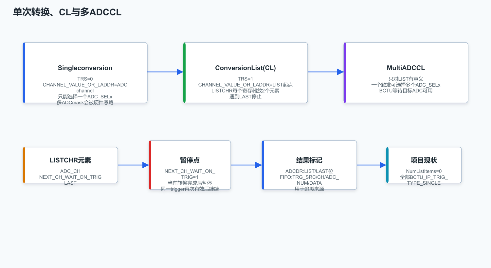

### 7.1 Single conversion

`TRGCFG_n[TRS]=0` 表示 single conversion：

| 字段 | 含义 |
|---|---|
| `ADC_SEL0/1/2` | 选择一个目标 ADC |
| `CHANNEL_VALUE_OR_LADDR` | 直接表示 ADC channel number |
| `DATA_DEST` | 结果放 ADCDR 或 FIFO |
| `LOOP` | 可让该 trigger 循环触发转换，直到禁用 loop |

手册明确说明：single conversion 只能选择一个 ADC。如果 single trigger 选择多个 ADC，BCTU 会忽略该 trigger。RTD 驱动 `Bctu_Ip_ConfigTrigger()` 也按这个规则实现：single 模式下只有 mask `1/2/4/8` 这样的单 bit ADC mask 才合法。

### 7.2 Conversion list (CL)

`TRGCFG_n[TRS]=1` 表示 CL conversion：

| 字段 | 含义 |
|---|---|
| `CHANNEL_VALUE_OR_LADDR` | 表示 CL 起始 element index |
| `LISTCHR_m[ADC_CH_y]` | CL element 的 ADC channel |
| `LISTCHR_m[NEXT_CH_WAIT_ON_TRIG_y]` | 当前 element 完成后等待同一 trigger 再继续 |
| `LISTCHR_m[LAST_y]` | 当前 element 是 list 最后一个 |
| `LISTSTAR[LISTSZ]` | CL 总 element 数，S32K324 为 32 |

CL 执行到 `LAST=1` 的 element 后停止。如果 list pointer 到达最后一个有效 element，又没有遇到 LAST，则会回绕到 0。

### 7.3 NEXT_CH_WAIT_ON_TRIG 的用途

`NEXT_CH_WAIT_ON_TRIG=1` 可以把一个 list 拆成多个触发节拍：

1. 触发到来，执行当前 CL element。
2. 当前转换完成后暂停。
3. BCTU 清触发源。
4. 同一个 trigger 再次有效时，从下一个 element 继续执行。

这适合把多个 ADC 通道分布到多个 PWM 周期点采样。

### 7.4 多 ADC CL

多个 ADC 同时被同一个 trigger 选择，仅在 CL 场景有意义。BCTU 会等待所有目标 ADC 可用，再按 CL 的 element 进行并行转换。这个模式适合电机控制中同一时刻对多相电流或电压做同步采样。

## 8. 结果路径：ADCDR、FIFO、IRQ、DMA

### 8.1 ADCDR 结果直达

如果 `TRGCFG_n[DATA_DEST]=000b`，结果进入 ADC 专用结果寄存器：

| 寄存器 | 对应 |
|---|---|
| `ADC0DR` | ADC0 的 BCTU 转换结果 |
| `ADC1DR` | ADC1 的 BCTU 转换结果 |
| `ADC2DR` | ADC2 的 BCTU 转换结果 |

`ADCDR` 中不仅有转换数据，还有来源信息：

| 位域 | 含义 |
|---|---|
| `TRG_SRC` | 触发编号 0-71 |
| `CH` | ADC channel |
| `LIST` | 是否来自 CL |
| `LAST` | 是否为 CL 最后一次转换 |
| `ADC_DATA` | 转换结果数据 |

这点很重要：软件可以通过 `TRG_SRC + CH` 反查“这一次结果到底是哪一路触发、哪个通道采来的”。

### 8.2 FIFO 结果路径

如果 `DATA_DEST=FIFO1/FIFO2`，结果进入 FIFO。FIFO result data 的字段是：

| 位域 | 含义 |
|---|---|
| `TRG_SRC` | 触发编号 |
| `CH` | ADC channel |
| `ADC_NUM` | ADC 编号 |
| `ADC_DATA` | 转换结果 |

FIFO 适合多路触发快速进入同一个队列，由 CPU 或 DMA 批量搬运。

### 8.3 IRQ/DMA 事件

| 事件 | 使能位 | 说明 |
|---|---|---|
| Trigger flag | `MCR[TRGEN]` | `MSR[TRGF]` 置位时可中断 |
| ADCDR new data | `MCR[IENn]` 或 `MCR[DMAn]` | 新结果进入 `ADCnDR` |
| ADCDR overrun | `MCR[IENn]` | 旧结果未读又被新结果覆盖 |
| CL last | `MCR[LIST_IEN]` | CL 最后一次转换完成 |
| FIFO watermark | `FIFOCR[IEN_FIFOn]` 或 `FIFOCR[DMA_EN_FIFOn]` | FIFO entry 数超过水位 |
| FIFO overrun | `FIFOERR[OVR_ERR_FIFOn]` | 写满 FIFO |
| FIFO underrun | `FIFOERR[UNDR_ERR_FIFOn]` | 读空 FIFO |

清标志时要注意 W1C：`MSR` 和 `FIFOERR` 里的很多状态位是写 1 清除。

## 9. 寄存器速查

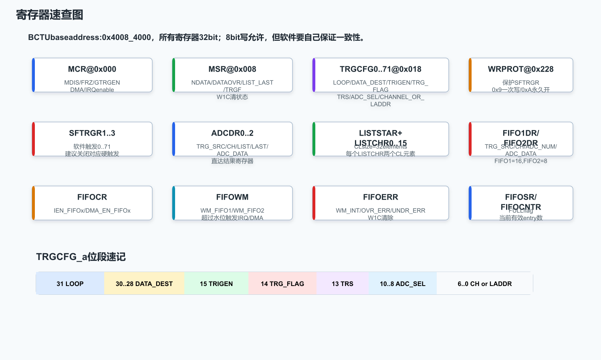

### 9.1 MCR

`MCR` 是全局控制寄存器：

| 字段 | 作用 |
|---|---|
| `Software_Reset` | 软件复位 BCTU |
| `MDIS` | 模块禁用/低功耗 |
| `FRZ` | Debug freeze，关闭硬触发但软件触发仍可用 |
| `GTRGEN` | 全局触发使能 |
| `DMA0/1/2` | ADCnDR 新数据 DMA |
| `TRGEN` | trigger flag interrupt |
| `LIST_IEN` | CL last interrupt |
| `IEN0/1/2` | ADCnDR new data / overrun interrupt |

### 9.2 MSR

`MSR` 是状态寄存器：

| 字段 | 作用 |
|---|---|
| `TRGF` | 有 trigger flag 事件 |
| `LISTn_Last` | ADCn 执行了 CL 最后一次转换 |
| `DATAOVRn` | ADCnDR 结果被覆盖 |
| `NDATAn` | ADCnDR 有新结果 |

### 9.3 TRGCFG_n

这是 BCTU 最核心的寄存器，每个 trigger 一个：

| 字段 | 配置含义 |
|---|---|
| `LOOP` | 当前 trigger 循环执行 |
| `DATA_DEST` | `ADCDR`、`FIFO1`、`FIFO2` |
| `TRIGEN` | 单路硬触发使能，不影响软件触发 |
| `TRG_FLAG` | trigger 是否 asserted / conversion 是否进行；写 1 清 |
| `TRS` | `0=single`，`1=CL` |
| `ADC_SEL0/1/2` | 选择目标 ADC |
| `CHANNEL_VALUE_OR_LADDR` | single 时为 channel；CL 时为 list 起点 |

### 9.4 WRPROT 与 SFTRGR

`SFTRGR1/2/3` 被 `WRPROT` 保护。RTD `Bctu_Ip_SwTriggerConversion()` 会先写保护码，再写对应 software trigger bit。

保护码记忆：

| `WRPROT[PROTEC_CODE]` | 含义 |
|---|---|
| `0000b` | 开启保护 |
| `1001b` | 只放行一次写 |
| `1010b` | 永久关闭保护，直到复位 |

## 10. EB tresos 配置路径

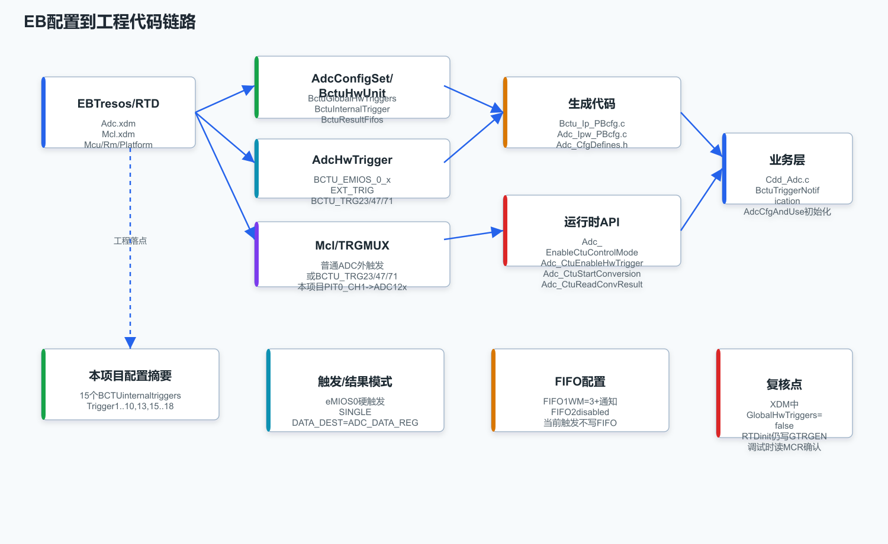

下面按 EB 配置习惯写。不同 RTD 版本界面节点名可能略有差异，但本工程 `Adc.xdm` 字段名如下，足够反推 EB 页面。

### 10.1 前置配置

| 模块 | 要确认的点 |
|---|---|
| `Mcu` / Clock | BCTU clock、ADC clock、eMIOS clock 已打开；本项目 `Clock_Ip_Cfg_Defines.h` 中有 `CLOCK_IP_HAS_BCTU0_CLK` |
| `Rm` / XRDC | BCTU 外设访问权限；本项目 `Rm.xdm` 有 `Xrdc_0_BCTU` |
| `Adc` | ADC hardware unit、channel、calibration、BCTU interface/control mode |
| `Pwm` / `Mcl eMIOS` | 若用 eMIOS 触发，要先有对应 eMIOS channel 输出事件 |
| `Mcl / TRGMUX` | 若用 BCTU trigger 23/47/71，要配置 TRGMUX BCTU output |
| `Platform` / OS | BCTU interrupt vector；OS 参数定义里 interrupt 103 是 Body Cross Triggering Unit |

### 10.2 配置 `AdcHwTrigger`

在 `Adc -> AdcConfigSet -> AdcHwTrigger` 里建立硬件触发源。当前工程存在：

| `AdcHwTrigger` | `AdcHwTrigSrc` |
|---|---|
| `AdcHwTrigger_0` | `EXT_TRIG` |
| `AdcHwTrigger_1..18` | `BCTU_EMIOS_0_1..18` |

如果用 TRGMUX 三个 BCTU 入口，应选择类似 `BCTU_TRG23/47/71` 的触发源，同时在 `Mcl.xdm` 的 TRGMUX 配置里把实际输入路由到 `TRGMUX_IP_OUTPUT_BCTU_TRG23/47/71`。

### 10.3 配置 `BctuHwUnit_0`

当前工程节点：

```text
Adc/Adc/AdcConfigSet/BctuHwUnit/BctuHwUnit_0
```

关键字段：

| EB/XDM 字段 | 当前工程值 | 说明 |
|---|---:|---|
| `BctuHwUnitId` | `0` | BCTU instance 0 |
| `BctuLogicalUnitId` | `0` | 逻辑 unit id |
| `BctuLowPowerMode` | `false` | 不进入低功耗 |
| `BctuGlobalHwTriggers` | `false` | XDM 值为 false；RTD 初始化函数内部仍默认写 `GTRGEN`，调试时以实际 `MCR` 为准 |
| `BctuNewDataDMAEnableMask` | `0` | ADCDR new data 不走 DMA |
| `BctuFifoDmaRawData` | `false` | FIFO DMA raw 模式关闭 |
| `BctuTriggerNotification` | `BctuTriggerNotification` | trigger flag 回调 |

### 10.4 配置 `BctuInternalTrigger`

每个 `BctuInternalTrigger_x` 对应一个 `TRGCFG_x`。关键字段：

| EB/XDM 字段 | 写到哪里 | 说明 |
|---|---|---|
| `BctuTriggerSource` | trigger index | 引用 `AdcHwTrigger_x`，决定使用 BCTU trigger 编号 |
| `BctuTriggerLoop` | `TRGCFG[LOOP]` | 是否循环转换 |
| `BctuDataDestination` | `TRGCFG[DATA_DEST]` | `BCTU_ADC_DATA_REG` / FIFO |
| `BctuHwTriggerEnable` | `TRGCFG[TRIGEN]` | 单路硬触发使能 |
| `BctuTriggerConversionMode` | `TRGCFG[TRS]` | `SINGLE` 或 `LIST` |
| `BctuAdcTargetMask` | `TRGCFG[ADC_SELx]` | ADC 选择 bitmask |
| `BctuAdcChannelSingle` | `TRGCFG[CHANNEL_VALUE]` | single 模式的 ADC channel |
| `BctuConversionListStartIndex` | `TRGCFG[LADDR]` | list 模式的 CL 起点 |

`BctuAdcTargetMask` 建议按这个心智模型理解：

| mask | 目标 |
|---:|---|
| `1` | `ADC_SEL0` |
| `2` | `ADC_SEL1` |
| `4` | `ADC_SEL2` |
| `1+2+4` | 仅适合 LIST 多 ADC 并行场景 |

### 10.5 配置 `BctuAdcNotifications`

当前工程配置：

| 通知节点 | ADC | New data callback | Data overrun | List last |
|---|---|---|---|---|
| `BctuAdcNotifications_0` | `AdcHwUnit_0` | `Adc0NewDataNotification` | `NULL_PTR` | `NULL_PTR` |
| `BctuAdcNotifications_1` | `AdcHwUnit_1` | `Adc1NewDataNotification` | `NULL_PTR` | `NULL_PTR` |

要让 new data 中断真正进来，还要有 `MCR[IEN0/1]` 使能。RTD 会根据配置和调用的 notification API 设置。

### 10.6 配置 `BctuListItems`

当前工程 `BctuListItems` 是空的，所以没有 CL。若使用 CL，需要配置：

| 字段 | 说明 |
|---|---|
| `AdcChanIndex` | 当前 CL element 的 ADC channel |
| `NextChanWaitOnTrig` | 当前 element 后是否等待同一 trigger |
| `LastChanInList` | 是否为 list 最后 element |

### 10.7 配置 `BctuResultFifos`

当前工程配置：

| FIFO | Watermark | Notification enable | Watermark callback | DMA |
|---|---:|---|---|---|
| FIFO1 | 3 | true | `WatermarkNotification1` | false |
| FIFO2 | 0 | false | `NULL_PTR` | false |

注意：仅配置 FIFO 本身不代表转换结果会进入 FIFO。还必须把对应 trigger 的 `BctuDataDestination` 改为 `BCTU_FIFO_1` 或 `BCTU_FIFO_2`。当前工程所有 trigger 的 destination 都是 `BCTU_ADC_DATA_REG`，所以 FIFO 配置目前更像预留能力。

## 11. 当前工程的 BCTU 生成代码

### 11.1 生成文件入口

| 文件 | 作用 |
|---|---|
| `BasicSoftware/integration/mcal/src/gen/src/Bctu_Ip_PBcfg.c` | BCTU post-build 配置主体 |
| `BasicSoftware/integration/mcal/src/gen/include/Bctu_Ip_PBcfg.h` | BCTU 配置声明和回调原型 |
| `BasicSoftware/integration/mcal/src/gen/include/Bctu_Ip_CfgDefines.h` | 特性宏：FIFO count、ADC count 等 |
| `BasicSoftware/integration/mcal/src/gen/src/Adc_Ipw_PBcfg.c` | ADC IP wrapper 中挂接 BCTU config |
| `BasicSoftware/integration/mcal/src/modules/Adc/src/Bctu_Ip.c` | RTD BCTU driver 实现 |
| `BasicSoftware/integration/mcal/src/modules/Adc/src/Bctu_Ip_Irq.c` | BCTU ISR wrapper |

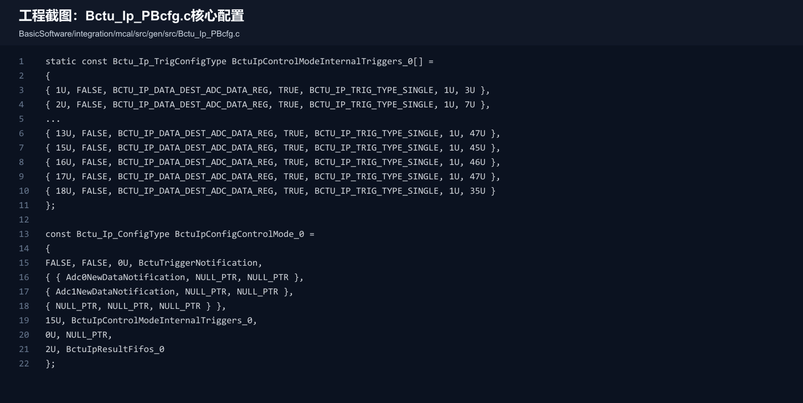

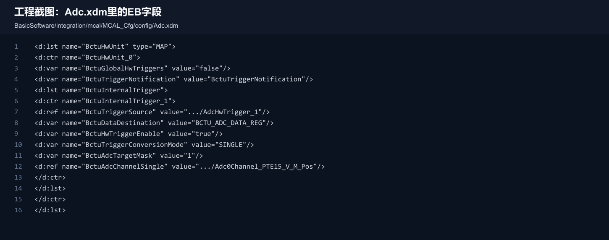

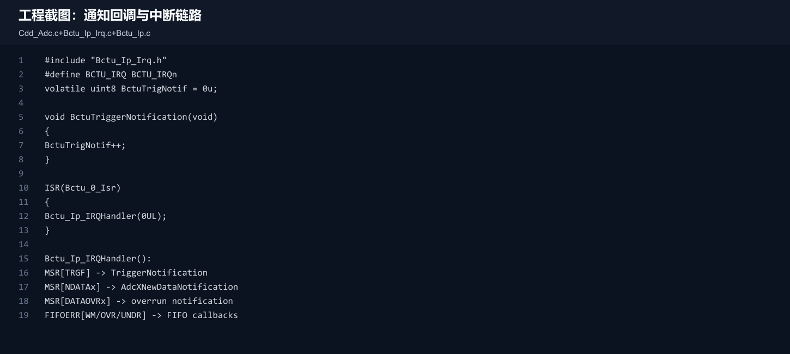

### 11.2 当前工程触发矩阵

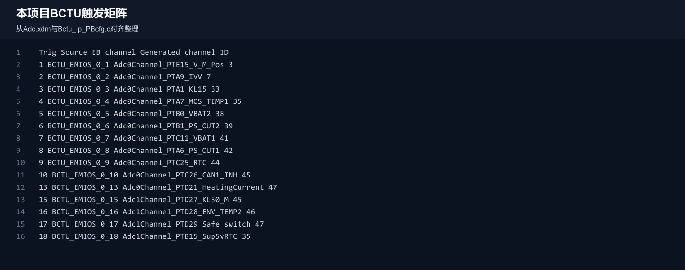

整理成表格如下：

| Trigger | EB source | EB channel | Generated channel ID | Mode | Destination | Generated target mask |
|---:|---|---|---:|---|---|---:|
| 1 | `BCTU_EMIOS_0_1` | `Adc0Channel_PTE15_V_M_Pos` | 3 | SINGLE | ADCDR | 1 |
| 2 | `BCTU_EMIOS_0_2` | `Adc0Channel_PTA9_IVV` | 7 | SINGLE | ADCDR | 1 |
| 3 | `BCTU_EMIOS_0_3` | `Adc0Channel_PTA1_KL15` | 33 | SINGLE | ADCDR | 1 |
| 4 | `BCTU_EMIOS_0_4` | `Adc0Channel_PTA7_MOS_TEMP1` | 35 | SINGLE | ADCDR | 1 |
| 5 | `BCTU_EMIOS_0_5` | `Adc0Channel_PTB0_VBAT2` | 38 | SINGLE | ADCDR | 1 |
| 6 | `BCTU_EMIOS_0_6` | `Adc0Channel_PTB1_PS_OUT2` | 39 | SINGLE | ADCDR | 1 |
| 7 | `BCTU_EMIOS_0_7` | `Adc0Channel_PTC11_VBAT1` | 41 | SINGLE | ADCDR | 1 |
| 8 | `BCTU_EMIOS_0_8` | `Adc0Channel_PTA6_PS_OUT1` | 42 | SINGLE | ADCDR | 1 |
| 9 | `BCTU_EMIOS_0_9` | `Adc0Channel_PTC25_RTC` | 44 | SINGLE | ADCDR | 1 |
| 10 | `BCTU_EMIOS_0_10` | `Adc0Channel_PTC26_CAN1_INH` | 45 | SINGLE | ADCDR | 1 |
| 13 | `BCTU_EMIOS_0_13` | `Adc0Channel_PTD21_HeatingCurrent` | 47 | SINGLE | ADCDR | 1 |
| 15 | `BCTU_EMIOS_0_15` | `Adc1Channel_PTD27_KL30_M` | 45 | SINGLE | ADCDR | 1 |
| 16 | `BCTU_EMIOS_0_16` | `Adc1Channel_PTD28_ENV_TEMP2` | 46 | SINGLE | ADCDR | 1 |
| 17 | `BCTU_EMIOS_0_17` | `Adc1Channel_PTD29_Safe_switch` | 47 | SINGLE | ADCDR | 1 |
| 18 | `BCTU_EMIOS_0_18` | `Adc1Channel_PTB15_Sup5vRTC` | 35 | SINGLE | ADCDR | 1 |

这里有一个建议复核点：`Adc.xdm` 中 trigger 15-18 引用了 `AdcHwUnit_1` 的通道名，但生成到 `Bctu_Ip_PBcfg.c` 的 `AdcTargetMask` 仍为 `1U`。RTD `Bctu_Ip_ConfigTrigger()` 在 single 模式下会把 mask `1U` 写成 `TRGCFG[ADC_SEL0]`。如果项目意图是让 trigger 15-18 由 ADC1 执行，建议读回 `BCTU.TRGCFG[15..18]` 的 `ADC_SELx` 位，或在 EB 中检查 `BctuAdcTargetMask` 是否应该为 `2`。

### 11.3 运行时初始化关系

`Adc_Ipw_PBcfg.c` 中，工程把 BCTU 配置挂到了 control mode：

```c
{ NULL_PTR },                    /* CtuConfigTriggerMode */
{ &BctuIpConfigControlMode_0 },  /* CtuConfigControlMode */
```

这说明当前工程生成的是 BCTU control mode 配置，而不是传统 ADC group hardware trigger mode 下的 CTU trigger mode。运行时需要关注这些 API：

| API | 作用 |
|---|---|
| `Adc_EnableCtuControlMode(AdcHwUnit_x)` | 让某个 ADC 进入 CTU/BCTU control mode，并初始化 BCTU 配置 |
| `Adc_DisableCtuControlMode(AdcHwUnit_x)` | 退出 CTU/BCTU control mode |
| `Adc_CtuEnableHwTrigger(BctuHwUnit_0_BctuInternalTrigger_x)` | 使能某个 BCTU 硬触发 |
| `Adc_CtuDisableHwTrigger(...)` | 禁用某个 BCTU 硬触发 |
| `Adc_CtuStartConversion(...)` | 对某个 BCTU trigger 发软件触发 |
| `Adc_CtuReadConvResult(AdcHwUnit_x, ...)` | 读取 ADCDR 形式的结果 |
| `Adc_CtuReadFifoResult(...)` | 读取 FIFO 形式的结果 |
| `Adc_CtuSetFifoWatermark(...)` | 设置 FIFO watermark |
| `Adc_CtuSetList(...)` | 配置 CL list |
| `Adc_CtuSetListPointer(...)` | 修改 trigger 的 CL 起点 |

业务层当前有 `BctuTriggerNotification()`，只是把 `BctuTrigNotif++`。如果要调 BCTU 是否触发，这是一个很直接的计数观察点。

## 12. 调试检查清单

### 12.1 不触发、不进结果

按这个顺序查：

1. ADC 是否已 `Adc_Init()` 并完成校准。
2. 是否调用了 `Adc_EnableCtuControlMode(AdcHwUnit_x)`。
3. `BCTU.MCR[MDIS]` 是否为 0。
4. `BCTU.MCR[FRZ]` 是否因为调试冻结屏蔽了硬触发。
5. `BCTU.MCR[GTRGEN]` 是否为 1。
6. 对应 `TRGCFG_n[TRIGEN]` 是否为 1。
7. eMIOS 或 TRGMUX 是否真的输出到对应 BCTU trigger 编号。
8. `TRGCFG_n[TRG_FLAG]` 是否长期为 1。如果是，说明 trigger pending 或转换链路没有完成。
9. `MSR[NDATAn]` 是否置位。
10. `ADCDR[n]` 的 `TRG_SRC` 是否等于预期 trigger 编号。

### 12.2 触发一次后不再触发

重点查：

| 可能原因 | 检查方法 |
|---|---|
| 上游 trigger 是 level，不是短脉冲 | 看 eMIOS/TRGMUX 输出是否一直为 1 |
| trigger source 没被清掉 | 看 `TRG_FLAG`，必要时写 1 清 |
| ADC 未完成，BCTU 不清触发 | 看 ADC 状态和 `MSR[NDATAn]` |
| CL 没到 LAST | 看 `LISTCHR[LAST]` 配置 |

### 12.3 结果错通道

重点查：

1. `TRGCFG_n[CHANNEL_VALUE_OR_LADDR]`。
2. `ADCDR[n][CH]`。
3. EB 中 `BctuAdcChannelSingle` 的 channel path。
4. 生成代码中的 `AdcChanOrListStart`。
5. 对 ADC1/ADC2 通道，确认 `BctuAdcTargetMask` 与实际 `ADC_SELx` 对应。

### 12.4 FIFO 没有数据

FIFO 没数据不一定是 FIFO 配置错。先确认该 trigger 的 `DATA_DEST`：

| `DATA_DEST` | 结果位置 |
|---|---|
| `BCTU_ADC_DATA_REG` | ADCDR |
| `BCTU_FIFO_1` / `BCTU_IP_DATA_DEST_FIFO1` | FIFO1 |
| `BCTU_FIFO_2` / `BCTU_IP_DATA_DEST_FIFO2` | FIFO2 |

当前工程所有 BCTU trigger 都是 `BCTU_IP_DATA_DEST_ADC_DATA_REG`，所以不应该期待 FIFO1/2 有转换结果。

### 12.5 中断不进

检查点：

| 项目 | 检查 |
|---|---|
| ISR wrapper | `Bctu_0_Isr -> Bctu_Ip_IRQHandler(0UL)` 是否进向量表 |
| NVIC/OS | interrupt 103 / `BCTU_IRQn` 是否使能、优先级是否正确 |
| MCR interrupt bit | `TRGEN`、`IEN0/1/2`、`LIST_IEN`、`FIFOCR[IEN_FIFOx]` |
| callback | `BctuTriggerNotification`、`Adc0NewDataNotification`、`WatermarkNotification1` 是否非空 |
| status flag | `MSR` 或 `FIFOERR` 是否真的置位 |

## 13. 常见配置建议

### 13.1 周期性采样单个通道

推荐配置：

| 字段 | 建议 |
|---|---|
| Trigger source | `BCTU_EMIOS_0_x` |
| `BctuTriggerConversionMode` | `SINGLE` |
| `BctuAdcTargetMask` | 对应单个 ADC |
| `BctuDataDestination` | `BCTU_ADC_DATA_REG` |
| Notification | 开 new data interrupt 或业务主动读 |

适合电压、电流、温度等固定周期采样。

### 13.2 一次触发采多个通道

推荐配置：

| 字段 | 建议 |
|---|---|
| `BctuTriggerConversionMode` | `LIST` |
| `BctuConversionListStartIndex` | list 起点 |
| `BctuListItems` | 配多个 channel，最后一个 `LastChanInList=true` |
| `NextChanWaitOnTrig` | 如果需要分周期采样则置 true |
| `DataDestination` | ADCDR 或 FIFO，取决于软件消费方式 |

如果要保留每个结果的来源，FIFO 更直观，因为 FIFO result 含 `TRG_SRC/CH/ADC_NUM/DATA`。

### 13.3 高频触发、软件不想每次进中断

推荐考虑 FIFO + DMA：

| 字段 | 建议 |
|---|---|
| `BctuDataDestination` | FIFO1 或 FIFO2 |
| `BctuWatermarkValue` | 按采样批量设置 |
| `BctuFifoDmaEnable` | true |
| DMA channel | 选择 BCTU FIFO request 对应 DMA MUX |
| 中断 | DMA major loop 完成后再通知软件 |

本项目 `Dma_Mux_Ip_Cfg_Defines.h` 中可见 BCTU FIFO DMA request 定义，例如 `DMA_MUX_0_BCTU_FIFO1_REQUEST`、`DMA_MUX_1_BCTU_FIFO2_REQUEST`。

## 14. 从寄存器读回验证配置

如果怀疑 EB 或生成代码与硬件行为不一致，最可靠的是读寄存器：

| 要验证 | 读什么 |
|---|---|
| BCTU 是否启用 | `MCR.MDIS`、`MCR.GTRGEN`、`MCR.FRZ` |
| 某路 trigger 是否启用 | `TRGCFG[n].TRIGEN` |
| 某路 trigger 是否 pending | `TRGCFG[n].TRG_FLAG` |
| 目标 ADC | `TRGCFG[n].ADC_SEL0/1/2` |
| 通道或 CL 起点 | `TRGCFG[n].CHANNEL_VALUE_OR_LADDR` |
| 结果目的地 | `TRGCFG[n].DATA_DEST` |
| 是否 single/list | `TRGCFG[n].TRS` |
| 结果来源 | `ADCDR[x].TRG_SRC` 或 `FIFOxDR.TRG_SRC` |
| 数据是否覆盖 | `MSR.DATAOVR[x]` |
| FIFO 是否满/水位 | `FIFOSR`、`FIFOCNTR`、`FIFOERR` |

## 15. 本笔记生成物

| 文件 | 内容 |
|---|---|
| `README.md` | 本学习笔记 |
| `assets/*.png` | 机制图、配置链路图、截图式代码卡片 |
| `assets/*.svg` | 图片源文件 |
| `assets/text/chapter64_bctu_pages_2680_2718.txt` | Chapter 64 抽取文本，便于本地检索 |
| `assets/text/pcmc_adc_context_pages_2296_2330.txt` | ADC/BCTU 接口上下文抽取 |
| `assets/text/trgmux_context_pages_2720_2736.txt` | TRGMUX/BCTU 上下文抽取 |
| `scripts/extract_bctu_text.mjs` | PDF 文本抽取脚本 |
| `scripts/generate_assets.mjs` | 图片生成脚本 |

## 16. 最后用三句话记住 BCTU

1. BCTU 把“触发源编号”映射成“ADC + 通道/list + 结果目的地”。
2. 同一个 ADC 的触发竞争按编号优先级解决，编号越小越优先。
3. EB 配置要同时看 `BctuInternalTrigger`、`BctuAdcTargetMask`、`BctuDataDestination` 和运行时 `MCR/TRGCFG/ADCDR` 读回，不能只看一个页面。
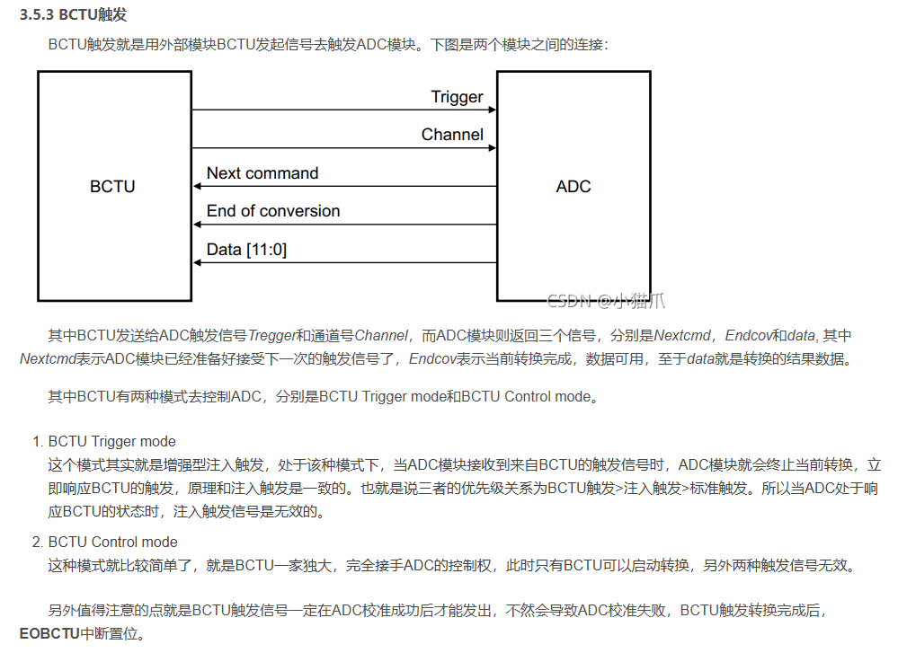
