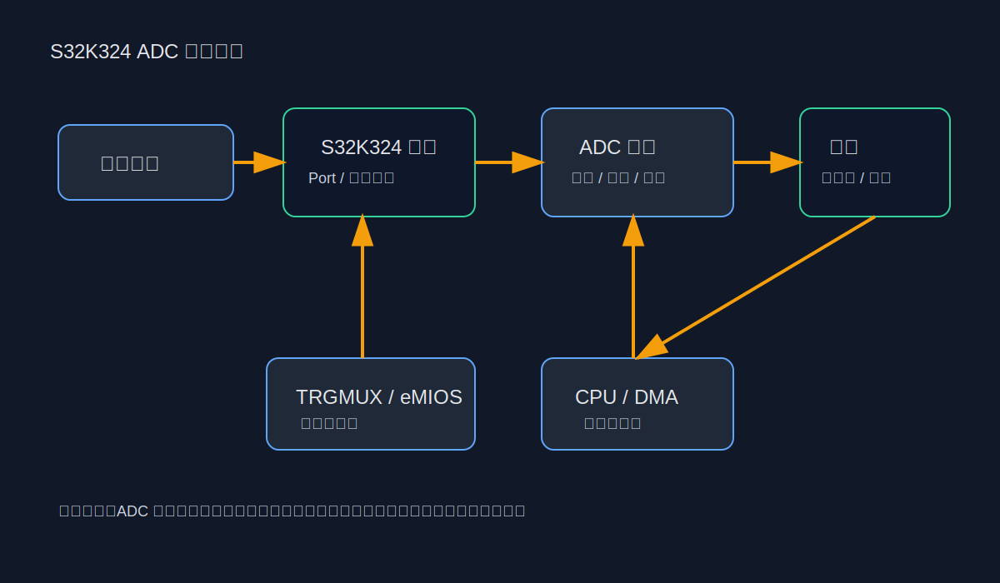
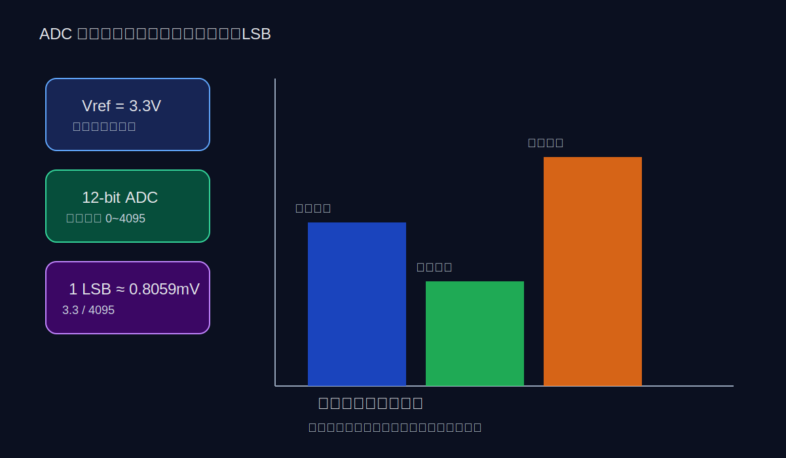
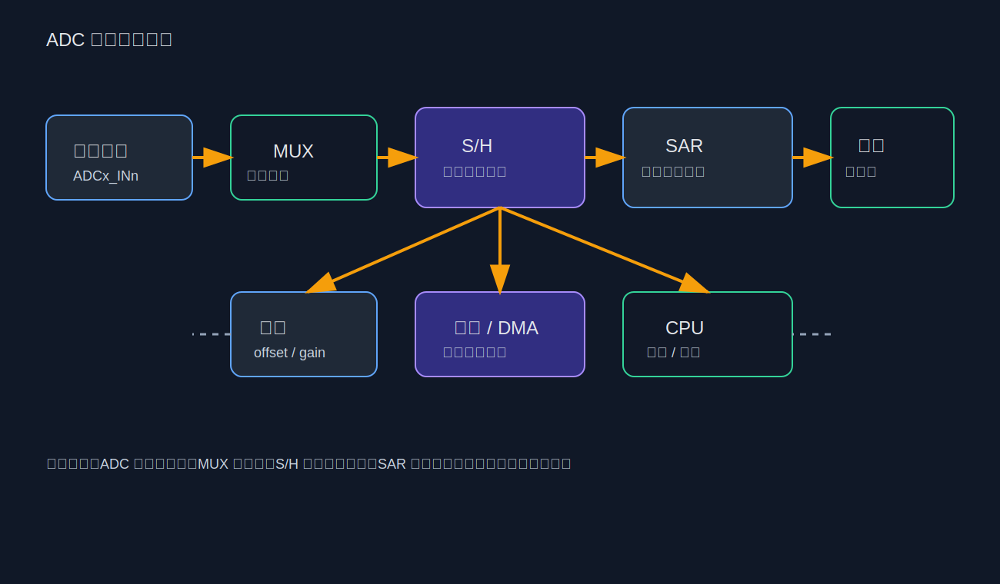
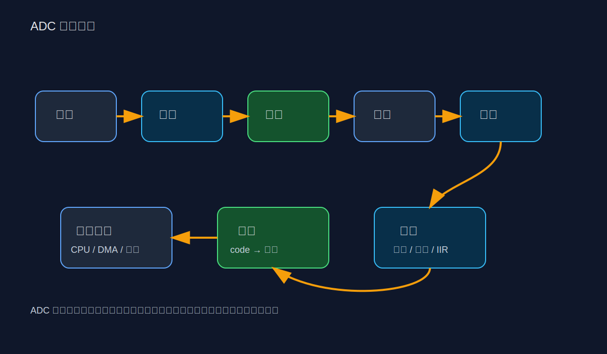
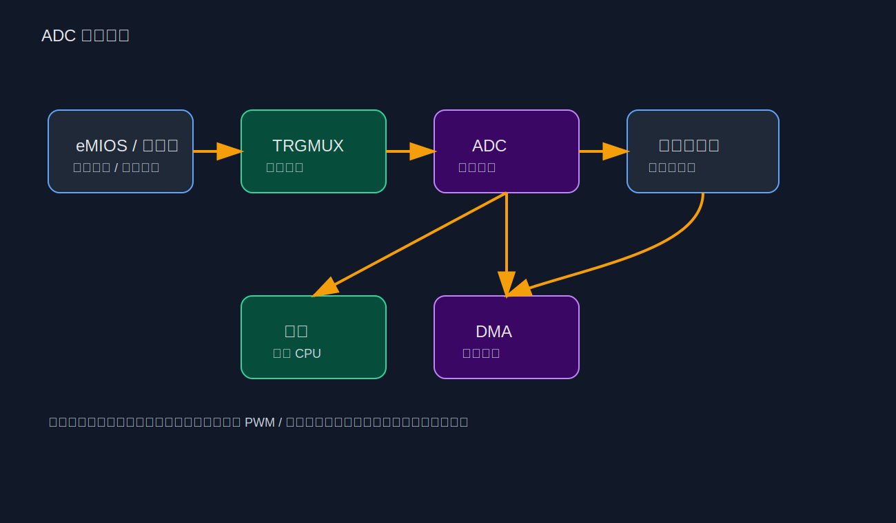
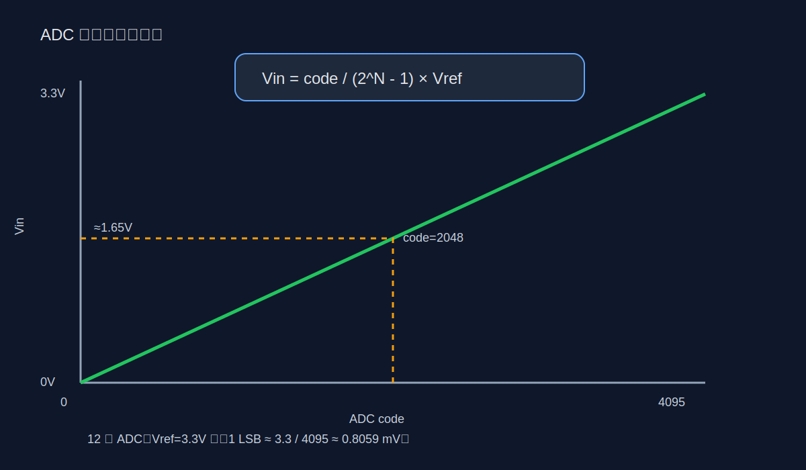
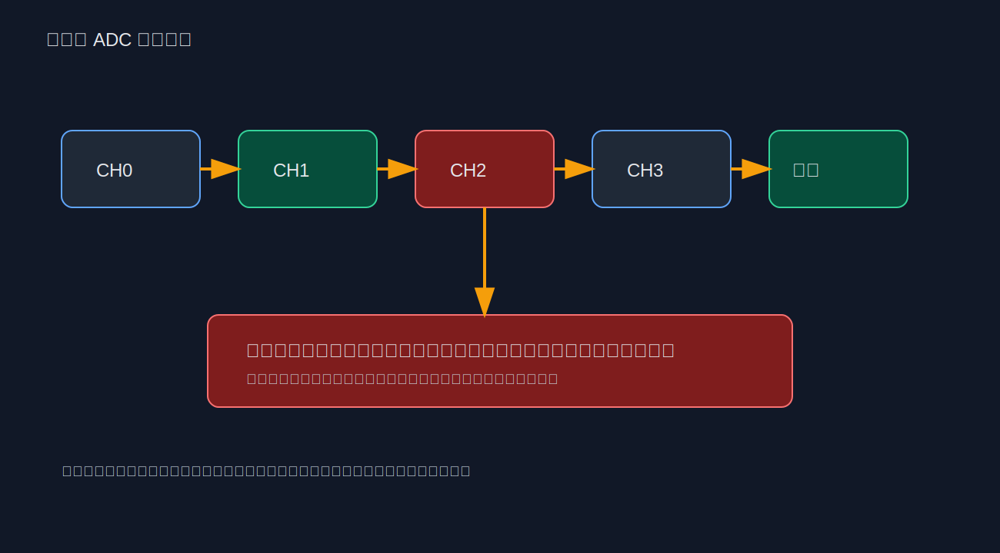
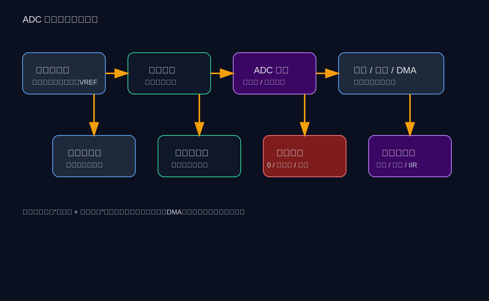
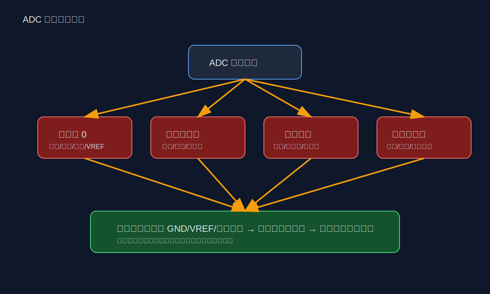

# S32K324 ADC 学习笔记（完整版）

> 适用对象：正在做 S32K324 / S32K3 系列项目，想系统掌握 ADC 原理、RTD/MCAL 配置、触发链路、采样计算、调试排查的同学。
>
> 本文尽量把“硬件原理 + S32K324 实际配置 + 工程调试”串成一条线。文中的图片已整理为本地 SVG 图，便于 Obsidian 直接打开。

---

## 目录

1. ADC 基础概念
2. S32K324 ADC 在系统中的位置
3. ADC 的关键指标
4. ADC 的硬件结构
5. 采样与转换原理
6. S32K324 ADC 的触发链路
7. 参考电压、分辨率与换算公式
8. 通道、结果寄存器与扫描序列
9. RTD/MCAL 配置思路
10. 常见应用场景
11. 常见问题与排查方法
12. 调试建议与工程经验
13. 学习总结
14. 附录：可直接复用的公式与检查清单

---

## 1. ADC 基础概念

ADC（Analog to Digital Converter，模数转换器）用于把模拟电压转换为数字码值。

在车载 MCU 里，ADC 不是一个孤立模块，它通常服务于：

- 电池电压采样
- 电流采样
- 温度采样
- 压力/位置传感器采样
- 电机控制反馈采样
- 保护检测
- 闭环控制算法输入

简单理解：

> ADC 的工作，就是把“连续变化的电压”变成“CPU 可计算的数字”。

### ADC 的基本输出形式

如果参考电压是 3.3V，12 位 ADC 的输出范围通常是 0 ~ 4095。

- 0V ≈ 0
- 3.3V ≈ 4095
- 中间电压按比例映射

---

## 2. S32K324 ADC 在系统中的位置

S32K324 是 S32K3 系列 MCU，常用于汽车电子控制场景。ADC 在它的系统中通常不是单独工作的，而是和以下模块配合：

- TRGMUX：触发路由
- eMIOS：定时/同步触发
- PDB/定时器类模块：周期事件
- DMA：搬运结果
- 中断控制器：事件通知
- Port/I/O 配置：引脚模拟功能复用
- 电源参考与模拟地：影响最终精度

### 系统理解图



### 你要先建立的认识

在 S32K324 里，ADC 不是“调用一次 API 就结束”，而是一个完整链路：

1. 输入信号接到正确引脚
2. 引脚切到模拟功能
3. ADC 选择正确通道
4. 触发源触发采样
5. 采样保持后完成转换
6. 结果写入寄存器
7. CPU / 中断 / DMA 读取结果
8. 软件换算、滤波、诊断

---

## 3. ADC 的关键指标

### 3.1 分辨率

分辨率表示 ADC 能把量程切成多少个离散等级。

常见位数：

- 8 位：256 级
- 10 位：1024 级
- 12 位：4096 级
- 16 位：65536 级

位数越高，理论上越细，但对噪声、采样时间和系统设计要求也更高。

### 3.2 参考电压

ADC 的所有结果都是相对于参考电压来的。

如果参考电压不准，ADC 的数字结果也会整体偏移。

常见参考：

- VREFH / VREFL
- 外部参考电压
- 某些内部参考源（依芯片支持而定）

### 3.3 采样时间

ADC 先对输入电压进行采样，再保持住这个电压完成转换。

如果采样时间太短：

- 高阻抗信号充不满
- 读数偏低
- 多通道切换时串扰更明显

### 3.4 转换时间

转换时间决定一次采样从“开始”到“结果有效”需要多久。

影响因素包括：

- ADC 时钟
- 采样时钟配置
- 分辨率
- 硬件内部转换机制

### 3.5 输入源阻抗

这是非常重要但经常被忽略的一项。

ADC 输入前端实际上有采样电容，若信号源阻抗太高，采样电容充电不足，就会导致：

- 采样偏差
- 抖动大
- 通道切换后结果不稳定

### 关键指标图



---

## 4. ADC 的硬件结构

### 4.1 抽象结构

ADC 内部一般可以拆成：

- 输入通道选择 MUX
- 采样保持电路 S/H
- 逐次逼近转换器 SAR
- 数字结果寄存器
- 校准/补偿逻辑
- 中断/DMA 输出路径

### 结构图



### 4.2 各部分作用

#### MUX

负责选择当前采样哪个模拟输入。

#### S/H

负责在转换开始时“抓住”输入电压并保持住。

#### SAR

负责把模拟值逐步逼近成数字值。

#### 结果寄存器

负责存放转换结果，供 CPU 或 DMA 读取。

#### 校准/补偿

用于减小 offset / gain 误差，提升准确性。

---

## 5. 采样与转换原理

### 5.1 工作流程

```text
输入模拟电压 → 采样 → 保持 → 转换 → 结果写寄存器 → 读出
```

### 5.2 采样保持的意义

ADC 转换并不是瞬间完成的。为了让转换过程不受输入电压继续变化影响，ADC 需要先采样再保持。

### 5.3 SAR 转换的理解方式

SAR（逐次逼近）可以理解为：

- 从高位到低位逐步试探
- 每一步比较输入电压与内部基准
- 最终逼近真实数字码

### 5.4 转换过程图



---

## 6. S32K324 ADC 的触发链路

S32K324 的 ADC 常常不是靠软件死循环轮询驱动，而是靠硬件触发驱动，这样时序更稳定。

### 6.1 常见触发来源

- 软件触发
- 定时器触发
- eMIOS 触发
- TRGMUX 路由触发
- 其他外设事件

### 6.2 软件触发与硬件触发的区别

| 方式         | 优点        | 缺点            | 适合场景      |
| ---------- | --------- | ------------- | --------- |
| 软件触发       | 简单，易验证    | 时序不稳定，CPU 占用高 | 初学调试      |
| 硬件触发       | 时序稳定，实时性好 | 配置更复杂         | 电机控制、闭环采样 |
| 硬件触发 + DMA | 高效，适合高频采样 | 调试门槛更高        | 连续采样、波形分析 |
|            |           |               |           |

### 6.3 触发链路图



### 6.4 工程上最常见的链路

```text
PWM / 定时器 / eMIOS
      ↓
    TRGMUX
      ↓
     ADC
      ↓
结果寄存器 / 中断 / DMA
      ↓
   软件处理
```

---

## 7. 参考电压、分辨率与换算公式

### 7.1 基本换算公式

如果 ADC 为 N 位，参考电压为 Vref，原始码值为 code，则：

```text
Vin = code / (2^N - 1) * Vref
```

### 7.2 12 位 ADC 示例

12 位 ADC 的最大码值是 4095。

如果 Vref = 3.3V：

```text
1 LSB ≈ 3.3 / 4095 ≈ 0.8059 mV
```

若读取到 2048：

```text
Vin ≈ 2048 / 4095 × 3.3 ≈ 1.6504 V
```

### 7.3 不要只看“理论满量程”

实际工程中，参考电压、电阻精度、PCB 噪声、输入保护、源阻抗、采样窗口都会影响最终精度。

### 电压换算图



---

## 8. 通道、结果寄存器与扫描序列

### 8.1 通道选择

ADC 一次只能采样某个通道，但它可以通过扫描序列轮流采多个通道。

### 8.2 结果寄存器

结果寄存器存放每次转换的最终数字值。

工程上要注意：

- 是单结果还是多结果
- 是否按序列输出
- 读寄存器是否会清标志
- 多结果是否存在覆盖风险

### 8.3 多通道扫描的坑

多通道扫描时，常见问题是前一通道残留电荷影响下一通道，尤其在：

- 通道之间电压跨度很大
- 源阻抗较高
- 采样时间太短

### 8.4 扫描顺序建议

- 低阻信号优先
- 大动态通道适当分开
- 高阻通道后面增加等待或重复采样

### 扫描序列图



---

## 9. RTD/MCAL 配置思路

这一部分是工程里真正会用到的。

### 9.1 先看原理图，再看配置

不要一上来只盯着工具界面，先确认：

- 输入脚接了什么信号
- 经过没经过分压
- 是否有 RC 滤波
- 是否和其他功能复用
- VREF 是否稳定
- 模拟地是否干净

### 9.2 引脚配置

S32K324 某些引脚要切换为模拟输入功能，不能继续作为数字 GPIO 使用。

要重点确认：

- Port 引脚模式
- 模拟输入使能
- 是否关闭数字干扰路径
- 复用关系是否正确

### 9.3 ADC 模块配置项

通常需要关注：

- 分辨率
- 采样时间
- 触发方式
- 通道选择
- 校准
- 中断/DMA
- 结果寄存器配置
- 转换模式

### 9.4 配置流程建议

1. 先单通道软件触发
2. 再验证硬件触发
3. 再做多通道
4. 再接中断或 DMA
5. 最后叠加滤波与诊断

### 9.5 配置流程图



### 9.6 经验性建议

如果你发现：

- 读数一直 0
- 一直满量程
- 抖动大
- 多通道串扰

优先检查：

1. 通道号是否对
2. 引脚是否真的切到模拟
3. 参考电压是否正确
4. 输入信号是否真的到板子上
5. 采样时间是否太短
6. 源阻抗是否过高

---

## 10. 常见应用场景

### 10.1 电池电压采样

通常通过电阻分压后送入 ADC。

注意事项：

- 分压比例要算准
- 电阻精度会影响最终误差
- 高压输入要做保护
- 输出点要避免过高源阻抗

### 10.2 电流采样

常见方案：

- 分流电阻 + 运放
- 霍尔传感器

注意：

- 零点漂移
- 运放输出饱和
- PWM 同步采样点
- 噪声与滤波

### 10.3 温度采样

常见传感器：

- NTC
- 温度芯片模拟输出

NTC 需要非线性换算，通常用查表或拟合公式。

### 10.4 电机控制采样

在 PMSM / FOC 场景中，ADC 常用于：

- 相电流采样
- 母线电压采样
- 温度采样
- 过流保护检测

这类场景最强调：

- 固定采样时刻
- 强抗噪
- 时序与 PWM 同步

---

## 11. 常见问题与排查方法

### 11.1 读数一直是 0

可能原因：

- 引脚没切到 ADC 模式
- 选错通道
- 输入没接上
- 参考电压异常
- 转换根本没启动

### 11.2 读数一直接近满量程

可能原因：

- 输入悬空
- 输入被拉高
- 分压关系错误
- 通道配置错
- 参考电压/量程理解错

### 11.3 读数抖动很大

可能原因：

- 源阻抗高
- 采样时间短
- 电源噪声大
- PCB 模拟地不干净
- 没做滤波

### 11.4 与万用表不一致

原因可能有：

- ADC 本身量化误差
- 参考电压偏差
- 电阻精度误差
- 输入有纹波
- 万用表和 ADC 的采样方式不同

### 11.5 多通道串扰

原因常见于：

- 通道切换过快
- 前一通道电压跨度大
- 源阻抗大
- 采样时间不足

解决思路：

- 增大采样时间
- 调整通道顺序
- 在高阻信号前加缓冲运放
- 必要时增加空采样

### 调试排查图



---

## 12. 调试建议与工程经验

### 12.1 从单通道开始

不要一开始就多通道 + DMA + 触发 + 滤波一起上。

建议顺序：

1. 单通道轮询
2. 单通道中断
3. 硬件触发
4. 多通道扫描
5. DMA 搬运
6. 软件滤波和诊断

### 12.2 先看原始值，再看工程值

调试时先打印原始 ADC code，再换算电压。

因为原始值更容易判断问题位置：

- 是采样没成功
- 还是换算公式有误
- 还是硬件输入本身就异常

### 12.3 关注采样时刻

如果 ADC 用于 PWM 同步采样，采样时刻非常关键。

要关注：

- 在 PWM 哪个边沿采样
- 电流纹波最小时刻
- 开关噪声是否会污染结果

### 12.4 用已知电压源验证

建议准备几个标准点：

- GND
- 1V 左右
- 2V 左右
- 接近 VREF 的高电平

这样更容易判断线性是否正常。

### 12.5 做好软件滤波

常见滤波：

- 滑动平均
- 中值滤波
- 一阶 IIR

但滤波不是万能的。先把硬件采样链路做对，再考虑滤波。

---

## 13. 学习总结

S32K324 的 ADC 学习，最重要的是建立“完整链路思维”：

> 模拟输入 → 引脚复用 → 通道选择 → 触发采样 → 保持转换 → 结果寄存器 → 中断/DMA → 软件换算/滤波

只要你能把下面几件事说清楚，就算真正把 ADC 入门了：

- ADC 为什么能把电压变成数字
- 分辨率和参考电压如何影响结果
- 为什么采样时间和源阻抗会影响精度
- 软件触发和硬件触发有什么区别
- 多通道为什么会串扰
- 为什么工程上常常要配合 DMA、中断、滤波和诊断

---

## 14. 附录：可直接复用的公式与检查清单

### 14.1 常用公式

```text
Vin = code / (2^N - 1) * Vref
```

```text
1 LSB ≈ Vref / (2^N - 1)
```

12 位时：

```text
1 LSB ≈ Vref / 4095
```

### 14.2 ADC 调试检查清单

- [ ] 引脚是否已经切到模拟输入功能
- [ ] 通道号是否和原理图一致
- [ ] VREF 是否稳定
- [ ] 输入电压是否真实存在
- [ ] 源阻抗是否太高
- [ ] 采样时间是否足够
- [ ] 是否启用了正确触发源
- [ ] 是否正确读取结果寄存器
- [ ] 中断或 DMA 是否正确工作
- [ ] 结果换算公式是否正确

### 14.3 最后一句话

ADC 不是“读一个数”这么简单，而是一个从硬件到软件、从时序到噪声、从配置到调试都要一起考虑的系统问题。

---

如果你愿意，我下一步可以继续给你补一版更偏“项目实战版”的内容，比如：

- 按 S32K324 RTD 配置界面逐项讲解 ADC
- 加上“ADC 引脚与通道对照表示例”
- 写一个“PWM 同步采样 ADC”的完整案例
- 再补一份“适合 Obsidian 的图文笔记增强版”
