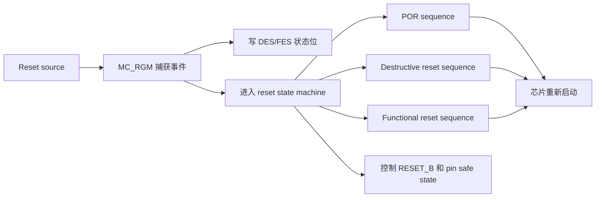
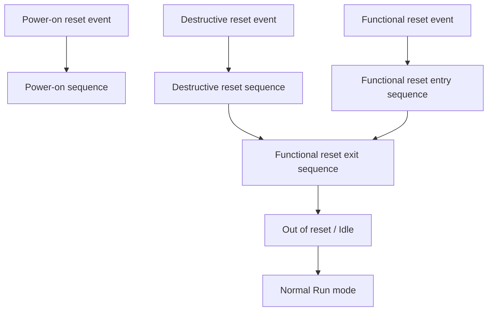
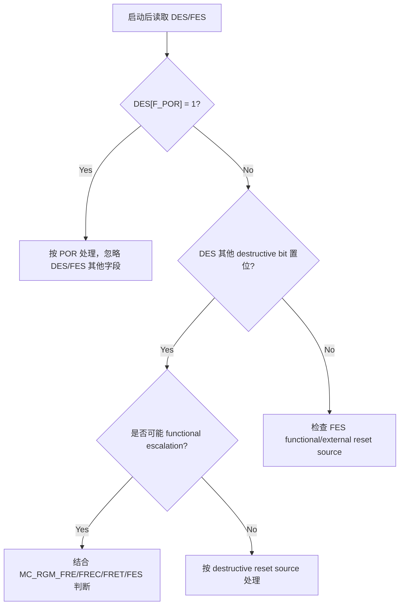

# S32K3xx Chapter 33 MC_RGM 学习笔记
  
> 芯片背景：S32K3xx，当前重点按 S32K324 理解  
> 主要资料：`S32K3xx Reference Manual, Rev. 9, 07/2024` Chapter 33，以及 Chapter 31 `Reset Overview`、Chapter 32 `Boot Overview` 的相关内容  
> 阅读定位：这一章不是单纯“复位寄存器表”，而是理解 S32K3 启动、异常复位、自测试复位、诊断复位原因的核心章节

## 0. 先给结论

`MC_RGM` 是 Reset Generation Module，复位生成模块。它是 S32K3xx 里集中管理 reset source、reset status、reset sequence、`RESET_B` 引脚行为和 reset escalation 的模块。

一句话理解：

> `MC_RGM` 是芯片复位系统的“总调度员”。谁触发了复位、复位属于哪一级、哪些模块要被复位、`RESET_B` 要不要拉低、复位原因要记录在哪里，都和它有关。

开发中最常用它做三件事：

1. 启动后读取 `DES` 和 `FES`，判断上一次复位原因。
2. 配置部分 functional reset 是否降级为 interrupt。
3. 在 self-test 前后控制 `RESET_B` 和 pin safe state，或者配置反复复位时的 escalation 策略。

学习主线可以先记住这张图：



## 1. 为什么要学 MC_RGM

在 MCU 项目里，复位不是一个简单的“重新启动”。不同复位源的严重程度不同，对芯片内部状态的影响也不同。

例如：

- 上电低压触发的复位，通常意味着全芯片状态都要重新建立。
- 看门狗超时触发的复位，可能说明软件卡死，但 SRAM 里某些信息仍可保留。
- FCCU 或时钟故障触发的复位，可能是安全相关的严重硬件故障。
- STCU2 self-test 完成后触发的复位，是预期流程的一部分，不应该简单判成异常。

`MC_RGM` 的价值就在于：它把这些复位事件集中捕获、分类、执行相应 reset sequence，并留下状态标志给软件判断。

所以这章和以下开发场景直接相关：

- Bootloader 判断上一次 reset reason。
- AUTOSAR `Mcu_GetResetReason()` 的底层来源。
- DCM 诊断读取 ECU reset reason。
- Watchdog reset 后区分软件卡死还是外部复位。
- BIST/self-test 后根据 `ST_DONE` 判断测试流程是否完成。
- 功能安全里处理 repeated reset escalation。

## 2. 复位类型的总体框架

S32K3xx 把 reset source 分为三大类：

| Reset 类型 | 英文 | 严重程度 | 对芯片影响 | 常见来源 |
| --- | --- | --- | --- | --- |
| 上电复位 | `POR` / Power-on reset | 最高 | 完整芯片复位，MC_RGM 自身也复位，memory 内容视为无效 | 电源上电、低压、POR_WDG 超时 |
| 破坏性复位 | `Destructive reset` | 高 | 接近完整芯片复位，SRAM 内容视为丢失，保证安全启动状态 | 严重时钟故障、FCCU/FOSU、STCU unrecoverable fault、软件 destructive reset |
| 功能复位 | `Functional reset` | 相对低 | 大多数数字模块、核、通信外设复位，部分模拟模块/特定模块/SRAM 可能保留 | 看门狗、软件 functional reset、self-test done、HSE reset |

老师式理解：

> POR 是“全屋断电重来”；destructive reset 是“严重故障后尽量全系统重置”；functional reset 是“业务系统重启，但有些底层状态还保留”。

### 2.1 POR 为什么优先级最高

Power-on reset 通常和电源状态有关。如果供电本身不可靠，其他 reset 逻辑也不能假设可靠。

因此 POR 的特点是：

- 总是生成 reset。
- 优先级高于 destructive 和 functional reset。
- 不能被软件降级成 interrupt。
- 如果 `DES[F_POR] = 1`，上电时应忽略 `DES` 和 `FES` 的其他字段。

最后一点很重要。因为 POR 之后寄存器/状态捕获可能不代表一次“普通运行中的异常复位”，手册明确提醒：如果 `DES[F_POR]` 置位，power up 时要忽略 `DES` 和 `FES` 里的其他字段。

### 2.2 Destructive reset 的含义

Destructive reset 表示发生了比较严重的事件，之后关键寄存器或 memory 内容不再能保证。

典型来源：

- `FCCU_FTR`：FCCU failure to react。
- `STCU_URF`：STCU2 unrecoverable fault。
- `MC_RGM_FRE`：functional reset escalation 触发的 destructive reset。
- `FXOSC_FAIL`：外部晶振故障。
- `PLL_LOL`：PLL loss of lock。
- `CORE_CLK_FAIL`、`AIPS_PLAT_CLK_FAIL`、`CM7_CORE_CLK_FAIL`：关键时钟失败。
- `SYS_DIV_FAIL`：系统分频器对齐失败。
- `HSE_TMPR_RST`、`HSE_SNVS_RST`：HSE tamper/SNVS 相关 destructive reset。
- `SW_DEST`：软件请求 destructive reset。
- `DEBUG_DEST`：debug 请求 destructive reset。
- 外部 `RESET_B` 低电平也会启动 destructive reset sequence，并在 `FES[F_EXR]` 中记录外部 reset 事件。

开发上如果看到 destructive reset，不要轻易认为“只是一次普通重启”。它通常说明上一次运行遇到更严重的问题，至少要记录诊断信息，必要时进入安全策略。

### 2.3 Functional reset 的含义

Functional reset 表示发生了一个复位事件，但芯片认为关键寄存器和 memory 内容仍然可保证一定程度的完整。

典型来源：

- `FCCU_RST`：FCCU soft functional reset reaction。
- `ST_DONE`：STCU2 self-test done。
- `SWT0_RST`、`SWT1_RST`、`SWT2_RST`、`SWT3_RST`：software watchdog reset。
- `JTAG_RST`：JTAG reset。
- `HSE_SWT_RST`：HSE watchdog timeout。
- `HSE_BOOT_RST`：HSE boot reset。
- `SW_FUNC`：软件请求 functional reset。
- `DEBUG_FUNC`：debug 请求 functional reset。
- `PLL_AUX`：辅助 PLL reset request，注意并非所有芯片都有。

对 S32K324 要注意芯片差异：

- `SWT0`、`SWT1`、`SWT2` 在 S32K324 相关资料中可见。
- `SWT3` 主要适用于 S32K338/S32K388/S32K389 等，不是所有芯片都有。
- `PLL_AUX` 主要适用于 S32K358/S32K388/S32K389。

工程代码里如果用了统一的 reset reason 枚举，可能会保留很多 S32K3 family 字段，但不代表每个字段都适用于 S32K324。

## 3. MC_RGM 的位置和基本功能

`MC_RGM` 的全称是 Reset Generation Module。

它主要做这些事：

1. 接收来自 PMC、FCCU、STCU2、SWT、MC_ME、HSE、debug、RESET_B 等模块的 reset request。
2. 判断 reset 类型：POR、destructive、functional。
3. 设置 reset status flag：`DES` 或 `FES`。
4. 执行 reset state machine。
5. 控制 `RESET_B` 引脚是否拉低。
6. 生成 pin safe state 控制。
7. 支持 functional reset demotion，也就是把某些 functional reset 降级为 interrupt。
8. 支持 functional reset escalation，也就是多次 functional reset 升级为 destructive reset。
9. 支持 destructive reset escalation，也就是多次 destructive reset 后保持在 reset，直到下一次 POR。

### 3.1 基地址

`MC_RGM` 基地址：

```text
0x4028_C000
```

本工程头文件 `S32K324_MC_RGM.h` 中也定义：

```c
#define IP_MC_RGM_BASE (0x4028C000u)
#define IP_MC_RGM      ((MC_RGM_Type *)IP_MC_RGM_BASE)
```

### 3.2 Register map

Reference Manual Rev.9 Chapter 33 给出的主要寄存器：

| Offset | Register | Reset value | 用途 |
| --- | --- | --- | --- |
| `0x00` | `DES` | `0x0000_0001` | Destructive/POR reset status |
| `0x08` | `FES` | `0x0000_0000` | Functional/external reset status |
| `0x0C` | `FERD` | `0x0000_0000` | Functional reset disable/demotion |
| `0x10` | `FBRE` | `0x0000_0000` | Functional reset 时 `RESET_B` 行为 |
| `0x14` | `FREC` | `0x0000_0000` | Functional reset escalation counter |
| `0x18` | `FRET` | `0x0000_000F` | Functional reset escalation threshold |
| `0x1C` | `DRET` | `0x0000_0000` | Destructive reset escalation threshold |
| `0x20` | `ERCTRL` | `0x0000_0000` | 软件控制 external reset pin assertion |
| `0x24` | `RDSS` | `0x0000_0000` | Standby 期间是否发生 reset |

本工程头文件还包含：

| Offset | Register | 备注 |
| --- | --- | --- |
| `0x28` | `FRENTC` | Functional Reset Entry Timeout Control，工程头文件可见，Rev.9 Chapter 33 正文寄存器表未展开 |
| `0x2C` | `LPDEBUG` | Low Power Debug Control，工程头文件可见，Rev.9 Chapter 33 正文仅提到 `0x2C` 访问不产生 transfer error |

这属于资料版本和芯片头文件之间常见差异。学习时以当前项目使用的 RM、header、RTD/MCAL 版本共同确认。

## 4. Reset state machine 怎么跑

MC_RGM 的核心不是寄存器，而是 reset state machine。

高层入口如下：



### 4.1 Reset event 一被捕获会发生什么

不管是 POR、destructive 还是 functional reset，MC_RGM 捕获后会立即做几件事：

1. 在 `DES` 或 `FES` 中设置对应 status bit。
2. 将芯片 pin 放到 default/safe state。
3. 拉低 `RESET_B`，但某些 functional reset 的 `RESET_B` 行为可由 `FBRE` 配置。
4. 根据当前 state 和 reset 类型进入相应 reset sequence。

这解释了为什么上电启动后第一件事之一要读 reset reason：`MC_RGM` 已经帮你把原因记在 `DES/FES` 里了。

### 4.2 Power-on reset sequence

POR sequence 大致包括：

1. Power-up 阶段。
2. 等所有 POR source 清除。
3. 等 FIRC 启动并稳定。
4. 进入 destructive reset sequence，再继续后续流程。

POR 之后，芯片会走完整 reset/boot 流程。因为 POR 会 reset MC_RGM 自身，状态分析要特别小心。

### 4.3 Destructive reset sequence

Destructive reset sequence 从 `DEST0` 开始。`DEST0` 做的事情可以理解为：

- 对几乎整个芯片施加 reset。
- 等待 destructive reset 输入清除。
- 保持至少 8 个 `FIRC_CLK` 周期的 destructive reset assertion。
- 条件满足后退出 destructive sequence，进入 functional reset sequence。

如果 destructive reset 过程中又发生 POR，则立即进入 POR sequence。

如果 destructive reset escalation counter 达到 `DRET[DRET]` 阈值，芯片会停留在 `DEST0`，直到下一次 power-on reset。

### 4.4 Functional reset sequence

Functional reset sequence 分成两部分：

- Functional reset entry sequence。
- Functional reset exit sequence。

功能复位只在 idle/out-of-reset 状态下真正进入 entry sequence。如果在已经进行中的 reset sequence 里又来了一个 functional reset，MC_RGM 会设置对应 status flag，也可能按配置拉低 `RESET_B`，但不会打断当前 reset sequence。

Functional reset 的关键阶段可以这样理解：

| Stage | 做什么 | 学习理解 |
| --- | --- | --- |
| `FUNC0` | functional reset event 后开始，屏蔽 FCCU/CMU 相关监控避免误触发 | 先避免复位过程中的假故障 |
| `FUNC1` | halt sequence，停止 crossbar 等访问 | 让总线和模块安静下来 |
| `FUNC2` | 触发 MC_CGM 将硬件 clock mux 切到 FIRC | 复位过程使用安全基础时钟 |
| `FUNC3` | 初始化硬件 clock mux divider 到默认值 | 恢复可预测时钟状态 |
| `FUNC4` | 同步关闭 PLLDIG | 避免 PLL clock glitch |
| `FUNC5` | 同步关闭 FXOSC | 配合 PLL/时钟复位 |
| `FUNC6` | 为需要同步复位的模块开 clock；self-test 相关逻辑在这里也有特殊处理 | 确保同步 reset 真正生效 |
| `FUNC7` | assert functional reset，最多 64 个 FIRC cycle | 真正施加 functional reset |
| `FUNC8` | Flash 和 MC_RGM handshake | 等 flash 初始化 |
| `FUNC9` | DCM 扫描 flash DCF records | 加载芯片配置数据 |
| `FUNC10` | DCM 加载模拟 trim | 恢复模拟模块校准 |
| `FUNC11` | MC_RGM 释放 `RESET_B`，检查外部是否仍拉低；处理 low-power debug ack | 复位流程收尾，回到运行 |

注意：functional reset 不是简单拉一下 reset 线，它会涉及 clock switch、PLL/FXOSC 关闭、flash 初始化、DCF 扫描等流程。

## 5. RESET_B 引脚和 pin safe state

`RESET_B` 是低有效、双向 reset pin。

它有两个角色：

1. 外部拉低 `RESET_B` 可以让芯片进入 reset。
2. 芯片内部 reset sequence 也可以拉低 `RESET_B`，通知外部器件“我正在 reset”。

### 5.1 正常 reset sequence 下的 RESET_B

MC_RGM 在 reset sequence 中会拉低 `RESET_B`，直到 reset sequence 结束。

同时，大多数 pin 会进入 safe/default state。具体每个 pin 的 safe state 取决于 IOMUX 表或 spreadsheet，不应该凭经验猜。

### 5.2 软件单独拉低 RESET_B：ERCTRL[ERASSERT]

`ERCTRL[ERASSERT]` 允许软件拉低 `RESET_B`，但不会启动 reset sequence。

这个点非常容易误解。

```text
ERCTRL[ERASSERT] = 1
```

含义是：

- `RESET_B` 被 assert。
- 大多数 pin 进入 safe/pad state。
- 不会因此启动一次 reset sequence。
- 该 bit 会在 reset sequence 中清除。
- `RESET_B` 会保持 assert，直到芯片下一次退出 reset sequence。

手册特别强调：这个功能只应该作为 main reset domain self-test entry procedure 的一部分使用。其他时候使用可能导致不可预测系统行为。

开发记忆法：

> `ERASSERT` 不是“软件复位按钮”，而是“self-test 前告诉外部我不可用，并把 pin 放安全态”的控制位。

如果要软件请求 functional/destructive reset，一般应通过 `MC_ME` 等复位请求机制，而不是误用 `ERASSERT`。

### 5.3 Self-test 期间为什么要关心 RESET_B

LBIST/MBIST 运行时，芯片不是正常 functional mode。此时可以在 self-test 前写：

```text
MC_RGM.ERCTRL[ERASSERT] = 1
```

这样外部看到 `RESET_B` 被拉低，知道芯片不可用，同时 GPIO 进入 safe state。

self-test 完成后，STCU2 会导致 functional reset，`MC_RGM.FES[ST_DONE]` 会记录这个事件。

`RESET_B` 的几种典型行为：

| 配置 | Self-test 期间 | Self-test 完成后 |
| --- | --- | --- |
| `ERASSERT = 1` | `RESET_B` 在 self-test 前就被拉低 | reset sequence 结束后释放 |
| `ERASSERT = 0` | self-test 期间不提前拉低 | self-test 完成后的 functional reset 会拉低 |
| `ERASSERT = 0` 且 `FBRE[ST_DONE] = 1` | self-test 期间不提前拉低 | ST_DONE functional reset 后不拉低 `RESET_B` |

这里的关键是 `FBRE[ST_DONE]`：它可以配置 ST_DONE 这个 functional reset 是否对外拉低 `RESET_B`。

## 6. DES：Destructive Event Status Register

### 6.1 基本信息

```text
Register: DES
Offset:   0x00
Reset:    0x0000_0001
Access:   Supervisor RW, User RO
Clear:    W1C
Reset by: Power-on reset only
```

`DES` 用来记录 destructive reset source，以及 POR source。

`W1C` 表示 write 1 clear：写 1 清除对应状态位，写 0 不影响。

### 6.2 DES 重点字段

| Bit | Field | 含义 |
| --- | --- | --- |
| `0` | `F_POR` | Power-on reset occurred |
| `3` | `FCCU_FTR` | FCCU failure to react |
| `4` | `STCU_URF` | STCU2 unrecoverable fault |
| `6` | `MC_RGM_FRE` | Functional reset escalation 触发 destructive reset |
| `8` | `FXOSC_FAIL` | FXOSC failure |
| `9` | `PLL_LOL` | PLL loss of lock |
| `10` | `CORE_CLK_FAIL` | Core clock failure |
| `12` | `AIPS_PLAT_CLK_FAIL` | AIPS platform clock failure |
| `14` | `HSE_CLK_FAIL` | HSE clock failure |
| `15` | `SYS_DIV_FAIL` | System clock divider alignment failure |
| `16` | `CM7_CORE_CLK_FAIL` | CM7 core clock failure |
| `17` | `HSE_TMPR_RST` | HSE tamper reset |
| `18` | `HSE_SNVS_RST` | HSE SNVS tamper reset |
| `29` | `SW_DEST` | Software destructive reset |
| `30` | `DEBUG_DEST` | Debug destructive reset |

### 6.3 DES 的读法

启动后可以这样理解：

```text
if DES[F_POR] == 1:
    这次是 power-on 相关复位
    power up 时忽略 DES/FES 其他字段
else if DES 其他 destructive bit == 1:
    上一次发生 destructive reset
    根据具体 bit 判断严重原因
else:
    再看 FES 判断 functional/external reset
```

`DES` 可以有多个 bit 同时为 1。软件要根据项目策略判断最关键的 reset source。

### 6.4 DES 的易错点

不要一读到 `DES` 里有多个 bit 就简单报 multiple reset，然后不分析。比如如果 `F_POR` 置位，手册明确要求 power up 时忽略其他字段。

另外，`DES` 只在 power-on reset 时复位，普通 functional reset 不会把它清掉。开发中如果要避免旧状态影响后续诊断，要在合适时机 W1C 清除已处理的位。

## 7. FES：Functional / External Reset Status Register

### 7.1 基本信息

```text
Register: FES
Offset:   0x08
Reset:    0x0000_0000
Access:   Supervisor RW, User RO
Clear:    W1C, 且触发源必须已经在 source 端清除
Reset by: Power-on reset only
```

`FES` 用来记录 functional reset 和 external reset。

### 7.2 FES 重点字段

| Bit | Field | 含义 | S32K324 注意 |
| --- | --- | --- | --- |
| `0` | `F_EXR` | External `RESET_B` assertion | 外部 reset 是 destructive reset source，但状态在 FES |
| `3` | `FCCU_RST` | FCCU functional reset reaction | 可 demote，取决于 FERD |
| `4` | `ST_DONE` | Self-test done reset | 自测试完成后的功能复位 |
| `6` | `SWT0_RST` | SWT0 reset request | S32K324 常用 |
| `7` | `SWT1_RST` | SWT1 reset request | S32K324 可见 |
| `8` | `SWT2_RST` | SWT2 reset request | S32K324 可见 |
| `9` | `JTAG_RST` | JTAG reset | 可 demote |
| `10` | `SWT3_RST` | SWT3 reset request | 不一定适用于 S32K324 |
| `12` | `PLL_AUX` | PLL_AUX reset request | 不一定适用于 S32K324 |
| `16` | `HSE_SWT_RST` | HSE SWT timeout | HSE watchdog |
| `20` | `HSE_BOOT_RST` | HSE boot reset | HSE boot 流程相关 |
| `29` | `SW_FUNC` | Software functional reset | 软件请求 |
| `30` | `DEBUG_FUNC` | Debug functional reset | debug 请求 |

### 7.3 FES 和 DES 的关系

手册给了两个很重要的判断规则：

1. 如果 functional reset escalation 到 destructive reset 没有启用，而 `DES` 中除 `F_POR` 以外的 destructive bit 被置位，则应忽略 `FES`。
2. 如果 functional reset escalation 已启用，并且 `DES` 中除 `F_POR` 以外的 bit 被置位，软件要判断 destructive reset 是由 functional reset escalation 引起，还是直接由 destructive source 引起。

这说明 reset reason 判断不能只读一个寄存器。

更合理的思路：



### 7.4 FES 的清除

`FES` 是 W1C，但还有一个条件：触发该事件的 source 端必须已经清除。

例如 watchdog reset source、FCCU reset source、debug source 如果在源头还没释放或没清掉，仅仅写 `FES` 可能清不掉，或者清掉后又被置位。

## 8. FERD：Functional Event Reset Disable Register

### 8.1 基本信息

```text
Register: FERD
Offset:   0x0C
Reset:    0x0000_0000
Access:   Supervisor RW, User RO
Reset by: Power-on reset or destructive reset
Special:  每个 byte 在 destructive/POR 后只能写一次
```

`FERD` 的名字是 Functional Event Reset Disable。它的作用不是禁用事件本身，而是把某些 functional reset source 从“触发 reset sequence”降级为“产生 interrupt request”。

| `FERD` bit | 结果 |
| --- | --- |
| `0` | 该 functional event 触发 reset sequence |
| `1` | 该 functional event 产生 interrupt request |

老师式理解：

> `FERD` 不是说“故障没有了”，而是说“这个事件来了以后别立刻重启，先给 CPU 一个中断处理机会”。

### 8.2 可配置字段

| Bit | Field | 对应事件 |
| --- | --- | --- |
| `3` | `D_FCCU_RST` | FCCU functional reset |
| `6` | `D_SWT0_RST` | SWT0 reset |
| `7` | `D_SWT1_RST` | SWT1 reset |
| `8` | `D_SWT2_RST` | SWT2 reset，芯片适用性需确认 |
| `9` | `D_JTAG_RST` | JTAG reset |
| `10` | `D_SWT3_RST` | SWT3 reset，芯片适用性需确认 |
| `30` | `D_DEBUG_FUNC` | Debug functional reset |

工程头文件的 S32K324 版本中可见 `D_FCCU_RST`、`D_SWT0_RST`、`D_SWT1_RST`、`D_JTAG_RST`、`D_DEBUG_FUNC`。是否还有其他字段要看具体芯片和头文件版本。

### 8.3 FERD 的关键注意点

手册明确要求：

> 写 `FERD` 某些字段为 1 之前，要先清 `FES`。

否则可能立即产生 interrupt request。

原因很直观：如果某个 `FES` 事件标志已经挂在那里，你再告诉 RGM“这个事件以后不要 reset，改成 interrupt”，硬件可能马上根据已有事件产生中断。

另外，`FERD` 每个 byte 在 destructive/POR 后只能写一次。这是安全寄存器常见限制，防止运行过程中被反复篡改复位策略。

## 9. FBRE：Functional Bidirectional Reset Enable Register

### 9.1 基本信息

```text
Register: FBRE
Offset:   0x10
Reset:    0x0000_0000
Access:   Supervisor RW, User RO
Reset by: Power-on reset or destructive reset
```

`FBRE` 控制 functional reset 发生时，是否对外 assert `RESET_B`。

这个寄存器字段名字容易反着理解。手册字段叫 `BE_xxx`，但描述是：

| `FBRE` bit | 结果 |
| --- | --- |
| `0` | functional reset 发生时，外部 reset pin 会被 assert |
| `1` | functional reset 发生时，外部 reset pin 不会被 assert |

所以 bit 名里的 `BE` 不要简单理解成“1 就使能拉低”。在这个寄存器里，`1` 表示不拉低 `RESET_B`。

### 9.2 常用字段

| Bit | Field | 对应事件 |
| --- | --- | --- |
| `3` | `BE_FCCU_RST` | FCCU functional reset |
| `4` | `BE_ST_DONE` | Self-test done reset |
| `6` | `BE_SWT0_RST` | SWT0 reset |
| `7` | `BE_SWT1_RST` | SWT1 reset |
| `8` | `BE_SWT2_RST` | SWT2 reset，芯片适用性需确认 |
| `9` | `BE_JTAG_RST` | JTAG reset |
| `10` | `BE_SWT3_RST` | SWT3 reset，芯片适用性需确认 |
| `12` | `BE_PLL_AUX` | PLL_AUX reset，芯片适用性需确认 |
| `16` | `BE_HSE_SWT_RST` | HSE SWT reset |
| `20` | `BE_HSE_BOOT_RST` | HSE boot reset |
| `29` | `BE_SW_FUNC` | Software functional reset |
| `30` | `BE_DEBUG_FUNC` | Debug functional reset |

### 9.3 和 ST_DONE 的关系

self-test 完成后通常会触发 `FES[ST_DONE]` functional reset。

如果：

```text
FBRE[ST_DONE] = 0
```

则 ST_DONE functional reset 会拉低 `RESET_B`。

如果：

```text
FBRE[ST_DONE] = 1
```

则 ST_DONE functional reset 不会拉低 `RESET_B`。

这对外部系统很重要。例如外部 PMIC、监控芯片、其他 ECU 或外设可能通过 `RESET_B` 判断 MCU 是否处于 reset。你是否让 `ST_DONE` 对外表现为 reset，要和系统架构一起定。

## 10. FREC / FRET：Functional reset escalation

### 10.1 escalation 是什么

`escalation` 是升级处理。

Functional reset 本来是较轻的 reset。如果短时间内频繁发生 functional reset，说明系统可能陷入了重启循环，或者某个故障一直没被解决。此时继续 functional reset 可能没有意义，需要升级成 destructive reset，让系统以更彻底的方式恢复。

### 10.2 FREC

```text
Register: FREC
Offset:   0x14
Reset:    0x0000_0000
Field:    FREC[3:0]
```

`FREC` 提供当前 functional reset escalation counter 值。

它会在以下情况下清零：

- Power-on reset。
- Destructive reset。
- 写 `FRET` 任意值。
- 某些情况下重新配置 `FREC` 字段为 `0xF`。

### 10.3 FRET

```text
Register: FRET
Offset:   0x18
Reset:    0x0000_000F
Field:    FRET[3:0]
```

`FRET` 设置 functional reset escalation threshold。

| `FRET` | 含义 |
| --- | --- |
| `0` | 禁用 functional reset escalation |
| 非 0 | 发生多少次 functional reset 后升级为 destructive reset |

Rev.9 中 `FRET` reset value 是 `0xF`，也就是默认阈值为 15。

当 functional reset escalation 启用后，每发生一次会真正启动 reset sequence 的 functional reset，counter 加 1。当 counter 达到 `FRET` 阈值，MC_RGM 会触发 destructive reset。

注意：并不是所有 functional reset source 都一定参与 escalation，具体还要看 Reset Overview 里 reset source 表的 escalation 列。

### 10.4 开发例子

假设设置：

```text
FRET = 3
```

那么如果连续发生 3 次参与 escalation 的 functional reset，第三次会触发 destructive reset。

这可以防止系统反复轻复位却永远恢复不了。

## 11. DRET：Destructive reset escalation

### 11.1 基本信息

```text
Register: DRET
Offset:   0x1C
Reset:    0x0000_0000
Field:    DRET[3:0]
Reset by: Power-on reset only
```

`DRET` 设置 destructive reset escalation threshold。

| `DRET` | 含义 |
| --- | --- |
| `0` | 禁用 destructive reset escalation |
| 非 0 | 发生多少次 destructive reset 后保持在 reset，直到下一次 POR |

当 destructive reset escalation 启用后，每次 destructive reset 进入 `DEST0` 都会让 counter 增加。如果 counter 达到 `DRET`，MC_RGM 会让芯片停留在 `DEST0`，直到下一次 power-on reset。

### 11.2 为什么 destructive reset escalation 更严厉

Functional reset escalation 的结果是“升成 destructive reset”。

Destructive reset escalation 的结果是“保持 reset，不再尝试继续启动，直到重新上电”。

这说明它面对的是更严重的场景：如果芯片连续发生 destructive reset，继续启动可能带来风险，所以干脆停在 reset，等待外部电源循环或系统级干预。

### 11.3 Boot 流程里的 DRET

Reset Overview 的 boot sequence 图里有一个细节：启动流程中可能会把 `MC_RGM.DRET` 从 `0` 改成 `0xF`。

这说明某些启动/安全配置会主动开启 destructive reset escalation，防止严重复位反复循环。

开发时如果看到 `DRET` 被 boot/sBAF/HSE 或初始化代码改写，不要立刻当成异常，要结合 boot flow 和项目安全策略确认。

## 12. ERCTRL：External Reset Control Register

### 12.1 基本信息

```text
Register: ERCTRL
Offset:   0x20
Reset:    0x0000_0000
Field:    ERASSERT[0]
Access:   Supervisor RW, User RO
Reset by: All resets
```

字段：

| Bit | Field | 含义 |
| --- | --- | --- |
| `0` | `ERASSERT` | 写 1 assert external reset pin |

编码：

| `ERASSERT` | 含义 |
| --- | --- |
| `0` | No change |
| `1` | External reset is asserted |

### 12.2 ERCTRL 写完后要等待

Chapter 33 的 chip-specific 信息中有一个很容易漏掉的 note：

> `ERCTRL` 配置需要几个周期才能生效。写 `ERCTRL` 后，任何进一步访问 `MC_RGM` 都必须至少等待 9 个 `AIPS_SLOW_CLK` 周期。

开发上，如果你写了：

```c
IP_MC_RGM->ERCTRL = MC_RGM_ERCTRL_ERASSERT(1u);
```

后面如果还要访问 MC_RGM，不要紧接着读写，需要满足这个等待要求。

### 12.3 ERASSERT 的易错点

`ERASSERT = 1` 不启动 reset sequence。

它只是：

- 拉低 `RESET_B`。
- 让多数 pin 进入 safe/pad state。
- 表示芯片当前不可用于 normal functional mode。

手册限制用途：只应作为 main reset domain self-test entry procedure 的一部分。

## 13. RDSS：Reset During Standby Status Register

### 13.1 基本信息

```text
Register: RDSS
Offset:   0x24
Reset:    0x0000_0000
Clear:    W1C
Reset by: Power-on reset only
```

字段：

| Bit | Field | 含义 |
| --- | --- | --- |
| `0` | `DES_RES` | Standby mode 期间发生 destructive reset event |
| `1` | `FES_RES` | Standby mode 期间发生 functional reset event |

### 13.2 为什么 Standby 要单独判断

Standby exit 和 reset exit 在软件上可能有相似的启动路径。如果 standby 期间发生了 reset，软件不能只看 `MC_ME[PREV_MODE]` 就判断上一个模式。

手册要求：

1. Standby exit 后，软件读取 `MC_ME[PREV_MODE]`。
2. 同时读取 `RDSS`。
3. 如果 `RDSS` 任意 bit 置位，忽略 `MC_ME[PREV_MODE]` 的状态。
4. 如果 `MC_ME` 显示 last mode 为 RESET，则执行 reset exit 软件流程；否则执行 standby exit。

老师式理解：

> `RDSS` 是告诉你：别被“我像是从 Standby 回来”的表象骗了，Standby 期间可能已经发生过 reset。

## 14. Functional reset demotion to interrupt

Functional reset demotion 指的是：某些 functional reset source 发生时，不触发 reset sequence，而是产生 interrupt request。

这个机制由 `FERD` 控制。

适用场景可以这样理解：

- 有些事件默认很严重，会触发 reset。
- 但项目可能希望先让软件记录信息、做降级处理或延迟复位。
- 因此允许把部分 functional reset source 转成 interrupt。

但这不是万能功能：

- POR 不能 demote。
- Destructive reset 大多不能 demote，Reset Overview 里提到 destructive sources 中只有 PLL LOL 有特定 bypass/demotion 机制。
- `ST_DONE`、`SW_FUNC`、`HSE_SWT_RST`、`HSE_BOOT_RST` 等并不都支持 demotion。
- 即使 demote 成 interrupt，事件本身仍然需要在 source 端清除，并清 `FES`。

开发建议：

> 除非安全需求明确要求，并且驱动/安全手册支持，否则不要随意把 reset demote 成 interrupt。因为你是在改变故障反应策略。

## 15. Reset reason 的推荐读取流程

启动早期通常需要读取 reset reason。当前工程里也能看到 `Diag_McuResetReason` 相关模块，最终会通过 `Mcu_GetResetReason()` 和底层 MCAL 获取 reset 信息。

底层思路可以这样整理：

```c
typedef struct {
    uint32_t des;
    uint32_t fes;
    uint32_t rdss;
    uint32_t fret;
    uint32_t dret;
} ResetSnapshot;

ResetSnapshot ReadResetSnapshot(void)
{
    ResetSnapshot s;

    s.des  = IP_MC_RGM->DES;
    s.fes  = IP_MC_RGM->FES;
    s.rdss = IP_MC_RGM->RDSS;
    s.fret = IP_MC_RGM->FRET;
    s.dret = IP_MC_RGM->DRET;

    return s;
}
```

判断逻辑：

```text
1. 先读 DES。
2. 如果 DES[F_POR] = 1，按 POR 处理，power up 时忽略 DES/FES 其他字段。
3. 如果 DES 中有其他 destructive bit，按 destructive reset 处理。
4. 如果 DES[MC_RGM_FRE] = 1，重点考虑 functional reset escalation。
5. 如果 DES 没有 destructive bit，再读 FES 判断 functional/external reset。
6. 如果 FES[ST_DONE] = 1，说明可能是 self-test done 后的 functional reset。
7. 如果 FES[SWTx_RST] = 1，说明可能是 watchdog reset。
8. 如果 FES[F_EXR] = 1，说明外部 RESET_B assertion 被捕获。
9. 根据项目策略记录、上报、清除 W1C 状态位。
```

清除状态位要注意：

```c
/* 伪代码，只表达 W1C 规则 */
IP_MC_RGM->DES = handled_des_mask;  /* write 1 clear */
IP_MC_RGM->FES = handled_fes_mask;  /* write 1 clear, source must be cleared */
IP_MC_RGM->RDSS = handled_rdss_mask;
```

不要直接写：

```c
IP_MC_RGM->DES = 0xFFFFFFFFu;
IP_MC_RGM->FES = 0xFFFFFFFFu;
```

除非项目明确允许这样清所有状态。更好的做法是只清已经读取、记录并处理过的 bit。

## 16. 和 AUTOSAR/MCAL 的关系

在 AUTOSAR 项目中，应用通常不会直接读 `MC_RGM.DES` 和 `MC_RGM.FES`，而是通过：

```c
Mcu_GetResetReason();
```

或者项目封装的诊断接口读取。

你当前工程中可以看到：

- `ECU/Diag/Diag_McuResetReason.c`
- `ECU/Diag/Diag_McuResetReason.h`
- `Mcu_GetResetReason()`

这些模块的本质就是把底层 reset status 映射成项目里的 reset reason bit 或诊断数据。

学习 `MC_RGM` 的意义在于：当 `Mcu_GetResetReason()` 返回某个枚举，或者诊断 DID 报出某个 reset reason，你能反推它来自哪个 `DES/FES` bit，以及它代表什么硬件事件。

## 17. 常见开发场景

### 17.1 上电后发现 DES[F_POR] = 1

说明发生了 power-on reset。

处理原则：

- 按冷启动处理。
- SRAM 内容视为无效。
- power up 时忽略 `DES/FES` 其他字段。
- 完成记录后按项目策略清除相关状态。

### 17.2 发现 FES[SWT0_RST] = 1

说明 SWT0 watchdog reset event 发生。

可能原因：

- 软件主循环卡死。
- OS 调度异常。
- 中断长时间关闭。
- 喂狗任务未运行。
- self-test/flash 操作/临界区中忘记调整 watchdog 策略。

处理建议：

- 启动早期记录 reset reason。
- 如果支持保留 RAM 或 NVM 日志，记录关键上下文。
- 检查上一次运行的 task watchdog、OS alive counter、异常日志。

### 17.3 发现 FES[ST_DONE] = 1

说明 STCU2 self-test 完成后触发了 functional reset。

这通常不是异常，而是 self-test 流程的一部分。

下一步应该：

- 读取 STCU2/BIST manager 的结果。
- 判断 LBIST/MBIST pass/fail。
- 根据 safety strategy 继续启动或进入安全状态。

### 17.4 发现 DES[MC_RGM_FRE] = 1

说明 functional reset escalation 触发 destructive reset。

这表示系统已经多次发生 functional reset，达到 `FRET` 阈值。

处理建议：

- 不要只记录成普通 destructive reset。
- 同时检查 `FRET/FREC` 和 `FES` 历史策略。
- 排查反复 watchdog reset、软件 functional reset、HSE reset 等是否导致 escalation。

### 17.5 发现 FES[F_EXR] = 1

说明外部 `RESET_B` assertion 被捕获。

注意：外部 `RESET_B` 是 destructive reset source，但状态字段在 `FES[F_EXR]`。

可能原因：

- 外部调试器拉 reset。
- PMIC/SBC 拉 reset。
- 板级复位按键。
- 外部监控电路动作。
- `RESET_B` 线干扰或硬件问题。

## 18. 重点、难点、易错点

### 18.1 重点

- `MC_RGM` 是 reset source 和 reset sequence 的集中管理模块。
- `DES` 记录 destructive/POR reset status。
- `FES` 记录 functional/external reset status。
- `FERD` 可以把部分 functional reset demote 成 interrupt。
- `FBRE` 控制 functional reset 是否向外 assert `RESET_B`。
- `FRET/FREC` 管 functional reset escalation。
- `DRET` 管 destructive reset escalation。
- `ERCTRL[ERASSERT]` 可以软件 assert `RESET_B`，但不启动 reset sequence。
- `RDSS` 用于 standby 期间发生 reset 的判定。

### 18.2 难点

第一个难点是 `DES` 和 `FES` 不能孤立看。  
如果 `DES[F_POR]` 置位，power up 时应忽略其他字段。如果 destructive bit 置位，还要考虑 functional reset escalation 是否导致 destructive reset。

第二个难点是 `RESET_B` 的行为不等于内部 reset 行为。  
内部 functional reset 可以配置是否对外拉低 `RESET_B`；`ERASSERT` 也可以只拉低 `RESET_B` 而不启动 reset sequence。

第三个难点是 escalation。  
Functional reset escalation 是“多次轻复位升级为 destructive reset”；destructive reset escalation 是“多次严重复位后停在 reset 等 POR”。两者后果不同。

### 18.3 易错点

- 把 `ERASSERT` 当成软件复位使用。
- 忘记写 `ERCTRL` 后需要等待至少 9 个 `AIPS_SLOW_CLK` 周期再访问 MC_RGM。
- 看到 `F_POR = 1` 还继续分析 `FES` 里的其他位。
- 清 `FES` 时没有先清 source 端，导致清不掉或又被置位。
- 写 `FERD` 前没有先清 `FES`，导致立即产生 interrupt request。
- 忘记 `FERD` 每个 byte 在 destructive/POR 后只能写一次。
- 误解 `FBRE`：在该寄存器里 bit 为 1 表示对应 functional reset 不 assert external reset pin。
- 把 `FES[ST_DONE]` 当异常 reset，而不是 self-test completion reset。
- 把 family 级字段全部当作 S32K324 一定存在的硬件资源。
- 忽略 destructive reset 后 SRAM 内容不可靠。

## 19. 寄存器速查

### 19.1 DES

| 项 | 内容 |
| --- | --- |
| Offset | `0x00` |
| Reset | `0x0000_0001` |
| 用途 | destructive/POR reset status |
| 清除 | W1C |
| 关键位 | `F_POR`, `FCCU_FTR`, `STCU_URF`, `MC_RGM_FRE`, `FXOSC_FAIL`, `PLL_LOL`, `SW_DEST`, `DEBUG_DEST` |

### 19.2 FES

| 项 | 内容 |
| --- | --- |
| Offset | `0x08` |
| Reset | `0x0000_0000` |
| 用途 | functional/external reset status |
| 清除 | W1C，且 source 端已清除 |
| 关键位 | `F_EXR`, `FCCU_RST`, `ST_DONE`, `SWT0_RST`, `SWT1_RST`, `JTAG_RST`, `HSE_SWT_RST`, `HSE_BOOT_RST`, `SW_FUNC`, `DEBUG_FUNC` |

### 19.3 FERD

| 项 | 内容 |
| --- | --- |
| Offset | `0x0C` |
| Reset | `0x0000_0000` |
| 用途 | 将部分 functional reset source 降级为 interrupt |
| 关键规则 | 写字段为 1 前先清 `FES`；每 byte 在 destructive/POR 后只能写一次 |

### 19.4 FBRE

| 项 | 内容 |
| --- | --- |
| Offset | `0x10` |
| Reset | `0x0000_0000` |
| 用途 | 控制 functional reset 是否 assert `RESET_B` |
| 易错点 | bit = 1 表示不 assert external reset pin |

### 19.5 FREC / FRET

| Register | Offset | 用途 |
| --- | --- | --- |
| `FREC` | `0x14` | 当前 functional reset escalation counter |
| `FRET` | `0x18` | functional reset escalation threshold |

`FRET = 0` 禁用 escalation，非 0 表示达到该次数后触发 destructive reset。

### 19.6 DRET

| 项 | 内容 |
| --- | --- |
| Offset | `0x1C` |
| Reset | `0x0000_0000` |
| 用途 | destructive reset escalation threshold |
| 结果 | 达到阈值后芯片停在 `DEST0`，直到下一次 POR |

### 19.7 ERCTRL

| 项 | 内容 |
| --- | --- |
| Offset | `0x20` |
| Reset | `0x0000_0000` |
| 关键位 | `ERASSERT[0]` |
| 用途 | 软件 assert external reset pin |
| 限制 | 只应作为 main reset domain self-test entry procedure 的一部分 |

### 19.8 RDSS

| 项 | 内容 |
| --- | --- |
| Offset | `0x24` |
| Reset | `0x0000_0000` |
| 用途 | 记录 standby 期间是否发生 reset |
| 位 | `DES_RES`, `FES_RES` |

## 20. 用一句话输出每个概念

| 概念 | 一句话 |
| --- | --- |
| `MC_RGM` | S32K3xx 的复位集中管理和 reset sequence 调度模块 |
| `DES` | 记录 destructive reset 和 POR 的状态寄存器 |
| `FES` | 记录 functional reset 和 external reset 的状态寄存器 |
| `POR` | 电源/低压/POR_WDG 等导致的完整上电复位 |
| `Destructive reset` | 严重故障后的高强度复位，SRAM 内容不可靠 |
| `Functional reset` | 较轻的功能复位，部分状态可能保留 |
| `FERD` | 把部分 functional reset source 降级为 interrupt 的配置寄存器 |
| `FBRE` | 控制 functional reset 是否对外拉低 `RESET_B` 的配置寄存器 |
| `FRET` | functional reset escalation 阈值 |
| `DRET` | destructive reset escalation 阈值 |
| `ERASSERT` | 软件拉低 `RESET_B` 并让 pin 进入 safe state，但不启动 reset sequence |
| `RDSS` | 判断 standby 期间是否发生 reset 的状态寄存器 |
| `ST_DONE` | self-test 完成后由 STCU2 触发的 functional reset 标志 |
| `F_EXR` | 外部 `RESET_B` 拉低事件标志 |

## 21. 复习清单

读完本章后，你应该能回答这些问题：

- `MC_RGM` 的核心职责是什么？  
  答：集中管理 reset source、reset status、reset sequence、`RESET_B` 和 reset escalation。

- `DES` 和 `FES` 分别记录什么？  
  答：`DES` 记录 destructive/POR，`FES` 记录 functional/external。

- 为什么 `DES[F_POR] = 1` 时要忽略其他 `DES/FES` 字段？  
  答：POR 是完整上电复位，手册明确要求 power up 时忽略其他状态位。

- External reset 为什么在 `FES[F_EXR]`，但又说是 destructive reset source？  
  答：外部 `RESET_B` 低电平会启动 destructive reset sequence，但外部事件状态由 `FES[F_EXR]` 捕获。

- `FERD` 写 1 是什么意思？  
  答：对应 functional reset source 不再触发 reset sequence，而是产生 interrupt request。

- 写 `FERD` 前为什么要先清 `FES`？  
  答：否则已有 pending event 可能立即转成 interrupt request。

- `FBRE` 写 1 是 assert `RESET_B` 吗？  
  答：不是。对对应 functional reset，`FBRE` bit 为 1 表示不 assert external reset pin。

- `ERCTRL[ERASSERT]` 是软件复位吗？  
  答：不是。它只 assert `RESET_B` 和 safe-state pins，不启动 reset sequence。

- Functional reset escalation 的结果是什么？  
  答：多次 functional reset 达到 `FRET` 阈值后触发 destructive reset。

- Destructive reset escalation 的结果是什么？  
  答：多次 destructive reset 达到 `DRET` 阈值后停在 reset，直到下一次 POR。

- `FES[ST_DONE]` 通常代表什么？  
  答：STCU2 self-test 完成后触发的 functional reset。

## 22. 建议的学习顺序

建议按这个顺序继续学：

1. Chapter 31 `Reset Overview`：先理解 POR/destructive/functional reset 的整体区别。
2. Chapter 33 `MC_RGM`：理解状态寄存器、复位引脚、降级和升级。
3. Chapter 32 `Boot Overview`：看 reset sequence 结束后 boot chain 怎么走。
4. Chapter 54 `STCU2`：理解 self-test done 为什么会触发 functional reset。
5. 项目代码：看 `Mcu_GetResetReason()` 和 `Diag_McuResetReason` 如何映射 `DES/FES`。

不要一开始就死背 bit。更好的方式是：

```text
复位源
  -> 复位类型
  -> MC_RGM 状态位
  -> reset sequence
  -> RESET_B 行为
  -> 软件启动后如何判断和处理
```

## 23. 参考资料

- 本地资料：`C:/Users/nvtc140/Zotero/storage/GKPNECE2/S32K3xx Reference Manual.pdf`，`S32K3xx Reference Manual, Rev. 9, 07/2024`，Chapter 31 `Reset Overview`、Chapter 32 `Boot Overview`、Chapter 33 `Reset Generation Module (MC_RGM)`。
- 工程头文件：`E:/github/ECAS_RTA_S32K324GHS_Heating/BasicSoftware/integration/mcal/src/modules/BaseNXP/header/S32K324_MC_RGM.h`。
- 工程 reset reason 封装：`E:/github/ECAS_RTA_S32K324GHS_Heating/ECU/Diag/Diag_McuResetReason.c`。
- NXP S32K3 产品页：<https://www.nxp.com/products/S32K3>。页面显示 `S32K3xx MCU Family - Reference Manual` 当前有更新版本可下载，实际项目请和项目使用的 RM/RTD/MCAL 版本保持一致。
- NXP Community：S32K Power-On Reason 相关讨论，说明实际项目中 reset reason 需要结合 MC_RGM 状态寄存器和芯片资料判断：<https://community.nxp.com/t5/S32K/S32K-PowerOn-Reason/m-p/1668775>。

