# S32K324 内部总线与互连学习笔记

> 主题：把 S32K324 里面的 `AHB`、`AXBS`、`AIPS`、`TCM backdoor`、`eDMA`、`XBIC`、`XRDC` 等“芯片内部道路系统”讲清楚，并结合当前工程的 linker、MPU、RM、XBIC、DMAMUX 配置来理解。
>
> 参考资料：`S32K3xx Reference Manual.pdf` Rev. 9, 07/2024；当前工程 `BasicSoftware/integration/linker/ETAS_BIP_S32KGHS.ld`、`BasicSoftware/integration/src/target/src/system.c`、`BasicSoftware/integration/mcal/src/gen/*`、`BasicSoftware/integration/mcal/src/modules/BaseNXP/header/S32K324_*.h`。

## 0. 先建立直觉：**memory map 是门牌号，总线是道路**

学习 S32K324 时，很容易把两件事混在一起：

- `memory map` 说的是“地址门牌号”：`0x00454520` 是 App 代码 Flash，`0x20404000` 是 System SRAM，`0x40000000` 往后是外设寄存器。
- `bus/interconnect` 说的是“访问怎么走过去”：CPU、DMA、HSE、EMAC 这些 master 发起一次读写后，交易会经过 AXI/AHB/AXBS/AIPS/PRAMC/PFLASH 等硬件路径。

所以一句 C 代码：

```c
*(volatile uint32 *)0x40024000 = 1U;
```

表面上只是“写地址 `0x40024000`”。硬件上其实是：

1. Cortex-M7 发现这是外设地址。
2. 通过 `AHBP` 发起 AHB-Lite transaction。
3. 进入 `AXBS_1 peripheral crossbar`。
4. 被送到 `AIPS_Lite` 的某个外设 slot。
5. AIPS 再选通具体外设寄存器。

**这就是总线学习最重要的视角：不要只看地址，还要问“谁是 master，目标是谁，中间经过哪些桥，哪些模块会拦截、检查、仲裁”。**

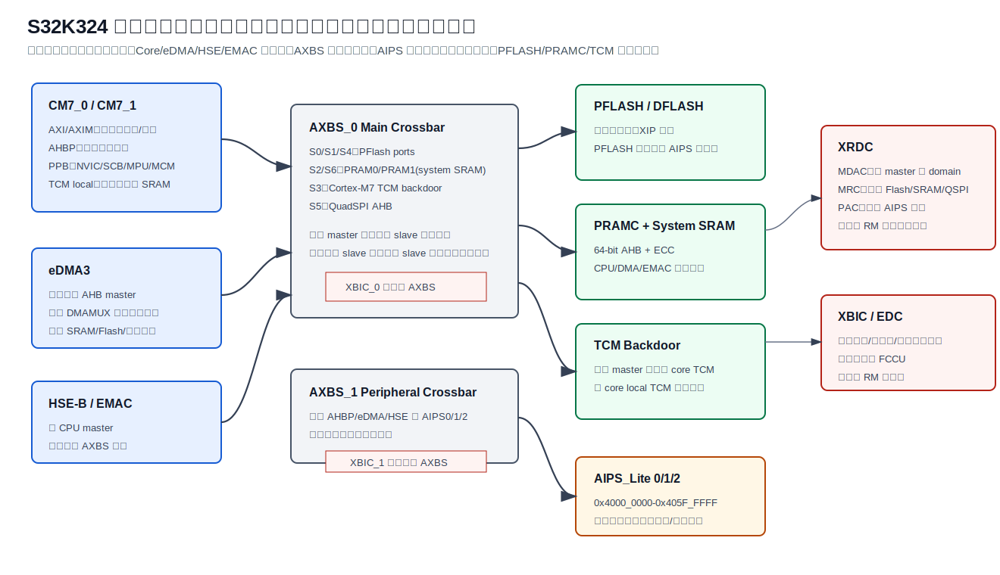


## 1. S32K324 总线大图

下面是参考手册中 S32K324/S32K344/S32K314 对应的 block diagram。先不用害怕图很密，它其实在讲四类东西：

- **`master`：能主动发起访问的人，例如 CM7_0、CM7_1、eDMA、HSE_B、EMAC。**
- **`interconnect`：负责转发和仲裁的道路，例如 AXBS_0、AXBS_1、AXBS_2、AXBS_3、AXBS_4。**
- **`slave/target`：被访问的目标，例如 PFlash、PRAM/SRAM、TCM、AIPS 外设。**
- **`safety/protection`：监视或拦截访问的模块，例如 XBIC、XRDC、ECC/EDC gasket、ERM/FCCU。**

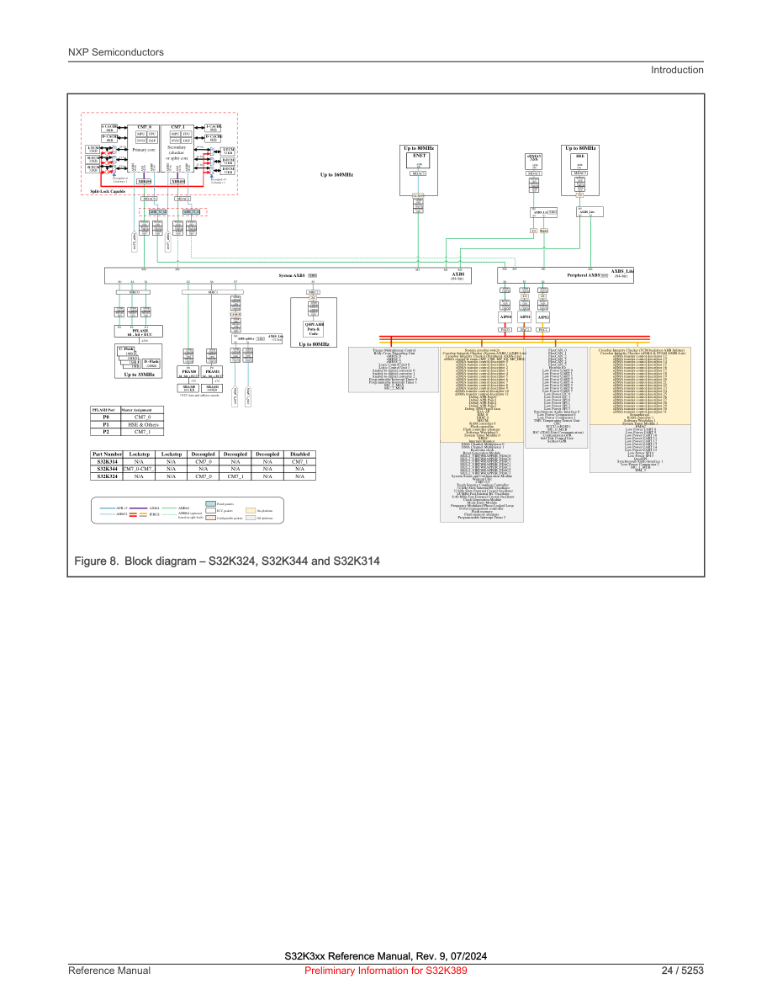

一句话版结构：

```text
CM7/eDMA/HSE/EMAC
    -> AXI/AHB/AHBP/AHBM
    -> AXBS crossbar group
    -> Flash / PRAMC SRAM / TCM backdoor / QuadSPI / AIPS peripheral bridge
    -> XBIC 检查完整性，XRDC 可做权限隔离，MPU/cache 决定 CPU 侧属性
```

## 2. 常见缩写先翻译成人话

| 名称                     | 全称/性质                                 | 通俗理解                      | 在 S32K324 中的角色                                |
| ---------------------- | ------------------------------------- | ------------------------- | --------------------------------------------- |
| `bus`                  | 总线                                    | 芯片内部搬地址、数据、控制信号的路         | 不是 CAN/LIN 那种板级通信总线，而是片上访问通路                  |
| `master`               | 主设备                                   | 能主动发起读写的人                 | CM7、eDMA、HSE_B、EMAC                           |
| `slave` / `target`     | 从设备/目标                                | 被访问的人                     | Flash、SRAM、TCM、AIPS 外设                        |
| **`transaction`**      | **一次总线交易**                            | **一次读或写，带地址、方向、大小、属性**    | **AXBS、XRDC、XBIC 都是围绕 transaction 工作**        |
| ==**`AXI` / `AXIM`**== | ==**Arm AMBA AXI master interface**== | ==**Cortex-M7 高带宽访问出口**== | ==**经 XHB400 转到 AHB-Lite，再进 AXBS**==          |
| `AHB`                  | Advanced High-performance Bus         | ==MCU 内部常见高性能总线协议==       | Flash/SRAM/DMA/TCM backdoor 主要围绕 AHB/AHB-Lite |
| `AHB-Lite`             | 单 master 简化 AHB                       | 比完整 AHB 少一些复杂仲裁信号         | 很多局部桥和 slave 采用 AHB-Lite                      |
| `AHBM`                 | AHB master port                       | Core 作为主设备访问系统资源的端口       | CM7_0/CM7_1 访问主 AXBS                          |
| ==`AHBP`==             | ==AHB peripheral port==               | ==Core 访问外设的端口==          | ==连到 peripheral AXBS，再到 AIPS==                |
| `AHBS`                 | AHB slave port                        | Core/TCM 被别的 master 访问的入口 | 常和 TCM backdoor、core slave 语境一起出现             |
| ==`PPB`==              | ==Private Peripheral Bus==            | ==Cortex-M 私有外设总线==       | ==NVIC、SCB、MPU、SysTick、部分 core control==      |
| `AXBS`                 | Crossbar Switch                       | 片上立交桥                     | 让多个 master 同时访问不同 slave，冲突时仲裁                 |
| `AIPS_Lite`            | Peripheral Bridge                     | 外设寄存器桥                    | 把 AHB transaction 变成外设 slot 访问                |
| `PRAMC`                | RAM Controller                        | SRAM 控制器                  | 把 AHB 访问转换成 SRAM array + ECC 访问               |
| `PFLASH`               | Flash Memory Controller               | Flash 控制器                 | 代码 Flash/DFlash 的控制和状态接口                      |
| `DMAMUX`               | DMA Channel Multiplexer               | DMA 请求路由器                 | 只管“谁触发 DMA”，不搬数据                              |
| `eDMA`                 | Enhanced DMA                          | 独立搬运工                     | 自己成为 AHB master，读源地址、写目的地址                    |
| `XBIC`                 | Crossbar Integrity Checker            | 总线完整性检查器                  | 检查 AXBS 通路上的地址/数据/反馈完整性                       |
| `XRDC`                 | Extended Resource Domain Controller   | 资源域访问控制器                  | 给 master 分 domain，对 memory/peripheral 做权限裁决   |
| `MSCM`                 | Miscellaneous System Control Module   | 多核/系统控制杂项模块               | 中断路由、core 编号、EDC 使能、AHB gasket 配置             |
| `gasket`               | 协议/完整性小桥                              | 两段总线之间的小适配器               | 常用于 32/64 位转换、EDC 生成/检查、写优化                   |

## 3. 当前工程配置先看结论

先把工程事实摆出来，后面解释就有落脚点。

| 配置点 | 当前工程结论 | 位置 |
|---|---|---|
| S32K324 App 主要代码 Flash | `int_flash = 0x00454520` 起 | `BasicSoftware/integration/linker/ETAS_BIP_S32KGHS.ld` |
| DFlash | `int_dflash = 0x10000000`，长度 `128KB` | 同上 |
| ITCM | `int_itcm = 0x00000000`，长度 `32KB` | 同上 |
| DTCM local | `int_dtcm = 0x20000000`，长度 `64KB` | 同上 |
| DTCM0 backdoor | `int_dtcm0_bd = 0x21000000`，长度 `64KB` | 同上 |
| DTCM1 backdoor | `int_dtcm1_bd = 0x21400000`，长度 `64KB` | 同上 |
| System SRAM | `0x20400000-0x2044FFFF`，工程切成 calib、sram、magic flag、stack | 同上 |
| AIPS 外设空间 MPU 属性 | `0x40000000-0x405FFFFF` 强顺序、不可缓存、不可执行 | `BasicSoftware/integration/src/target/src/system.c` |
| PPB MPU 属性 | `0xE0000000-0xE00FFFFF` 强顺序、不可缓存 | 同上 |
| Rm 是否配置 AXBS | `STD_OFF` | `BasicSoftware/integration/mcal/src/gen/include/CDD_Rm_Ipw_Cfg.h` |
| Rm 是否配置 XRDC | `STD_OFF` | 同上 |
| Rm 是否配置 MSCM | `STD_OFF` | 同上 |
| Rm 是否配置 XBIC | `STD_ON` | 同上 |
| Rm 是否配置 DMAMUX | `STD_ON` | 同上 |
| DMAMUX 当前通道 | LPSPI0 TX/RX、LPSPI1 TX/RX、LPI2C0 TX/RX | `BasicSoftware/integration/mcal/src/gen/src/Dma_Mux_Ip_PBcfg.c` |
| XBIC 当前实例 | 4 个：main AXBS、peripheral AXBS、eDMA AXBS、TCM AXBS | `S32K324_XBIC.h` 与 `Xbic_Ip_PBcfg.c` |

这几个结论非常重要：

- 硬件上，S32K324 有一组 AXBS crossbar。
- 当前工程没有通过 Rm 去改 AXBS 仲裁/park/priority，因此 AXBS 基本沿用硬件复位默认。
- 当前工程启用了 XBIC，所以总线完整性检查是当前工程真实在用的安全配置。
- 当前工程启用了 DMAMUX，所以 LPSPI/LPI2C 的 DMA 请求路由是真实在用的。
- 当前工程没有启用 XRDC，所以文档里讲 XRDC 是“硬件能力和未来安全隔离能力”，不是当前 Rm 已配置的访问控制策略。

对应到生成代码，核心宏就是：

```c
#define RM_IPW_ENABLE_XRDC     (STD_OFF)
#define RM_IPW_ENABLE_PFLASH   (STD_OFF)
#define RM_IPW_ENABLE_AXBS     (STD_OFF)
#define RM_IPW_ENABLE_XBIC     (STD_ON)
#define RM_IPW_ENABLE_DMA_MUX  (STD_ON)
#define RM_IPW_ENABLE_MSCM     (STD_OFF)
```

## 4. 从 Cortex-M7 出发：CPU 到底有几条路

手册第 5 章把 Cortex-M7 bus/interface 列出来，其中最需要记住的是 `AXIM`、`AHBP`、`PPB`，再加上 TCM local path。

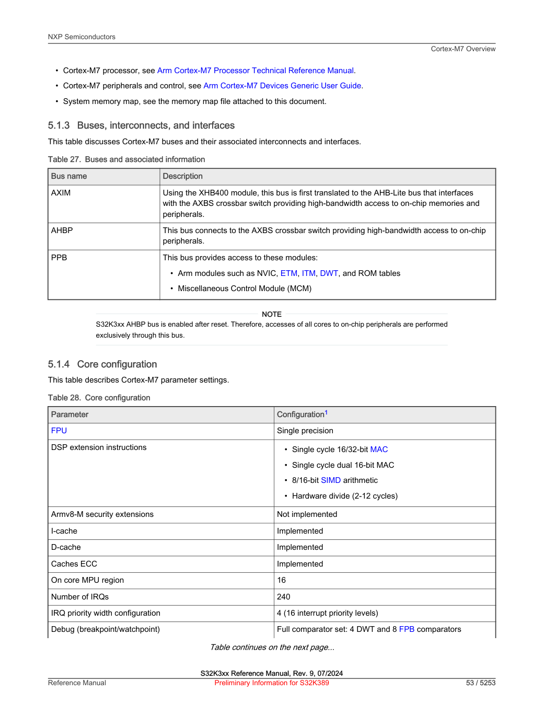

### 4.1 TCM local path：贴身小 SRAM，不是普通 SRAM

`TCM` 是 `Tightly Coupled Memory`，可以理解为“贴着 CPU 的小 SRAM”。S32K324 每个 Cortex-M7 core 带：

- `32KB ITCM`：Instruction TCM，**==适合放极关键、极确定的指令==**。
- `64KB DTCM`：Data TCM，**==适合放极关键、低延迟数据==**。

它们本质上还是 SRAM，也就是 Static RAM。和 DRAM 相比：

| 对比 | SRAM/TCM | DRAM |
|---|---|---|
| 存储单元 | 触发器结构保持 0/1 | 电容存电荷表示 0/1 |
| 刷新 | 不需要周期刷新 | 需要刷新，否则电荷泄漏 |
| 延迟 | 低，确定性好 | 相对高，受刷新和控制器影响 |
| 面积成本 | 大，贵 | 小，便宜，适合大容量 |
| MCU 使用 | 常见，适合实时控制 | S32K324 这类 MCU 内部一般不用 DRAM 做主 RAM |

TCM 比 System SRAM 更“贴身”。CPU 访问本核 TCM 时，不需要像访问 System SRAM 那样走主 AXBS 和 PRAMC。你可以把它想成办公室桌上的便签纸，System SRAM 像楼层共享文件柜，Flash 像档案室。

但 TCM 有两个地址视角：

| 视角             |                                                                        典型地址 | 谁用              | 说明                                   |
| -------------- | --------------------------------------------------------------------------: | --------------- | ------------------------------------ |
| local alias    |                                         `0x00000000` ITCM，`0x20000000` DTCM | 本 core 直接访问     | 低延迟、确定性最好                            |
| backdoor alias | `0x11000000/0x11400000` ITCM backdoor，`0x21000000/0x21400000` DTCM backdoor | 其他 master 或系统路径 | 通过 AXBS/TCM backdoor 访问某个 core 的 TCM |

当前 linker 里有：

```text
int_itcm     ORIGIN = 0x00000000, LENGTH = 0x00008000
int_dtcm     ORIGIN = 0x20000000, LENGTH = 0x00010000
int_dtcm0_bd ORIGIN = 0x21000000, LENGTH = 0x00010000
int_dtcm1_bd ORIGIN = 0x21400000, LENGTH = 0x00010000
```

这里要慢一点看：`0x20000000` 是 DTCM local 地址；`0x21000000` 是 DTCM0 backdoor 地址。二者可能映射到同一类物理 TCM 资源，但访问路径不同。local 像从自己房间门进去，backdoor 像从楼道公共门进去。

手册还强调了一个很嵌入式的现实：**TCM 和 System RAM 上电后必须先初始化 ECC，再读。原因是 SRAM array 旁边有 ECC 校验位，刚上电时数据位和 ECC 位没有建立一致关系。你如果先读，很可能不是读到随机值那么简单，而是直接触发 ECC 错误。**

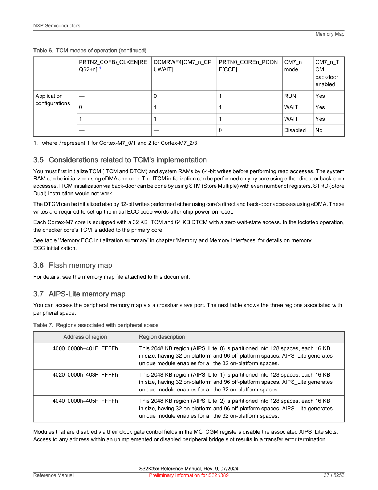

### 4.2 AXIM/AXI：CPU 高带宽访问出口

Cortex-M7 有 AXI master interface。AXI 是更高性能的 AMBA 总线协议，支持更强的流水、burst、并发属性。S32K324 图里能看到 `AXI64`、`XHB400`、`AHB64` 这些字样。

在 S32K324 里，CPU 的 AXI 访问不会直接一路 AXI 到所有目标，而是先经 `XHB400` 转换成 AHB-Lite，再进入 AXBS crossbar。也就是说：

```text
CM7 AXI/AXIM
    -> XHB400 bridge
    -> AHB-Lite
    -> AXBS_0 main crossbar
    -> Flash / PRAMC SRAM / TCM backdoor / QSPI
```

这条路一般用于：

- 从 PFlash 取指或读常量。
- 访问 System SRAM。
- 访问 memory-mapped QSPI。
- 访问通过 main AXBS 挂载的存储类资源。

为什么要这么设计？因为 Cortex-M7 本身喜欢高带宽、cache、burst，而片上 Flash/SRAM/外设控制器很多是 AHB/AHB-Lite 风格。桥接器让 CPU 侧和平台侧各自使用合适协议。

### 4.3 ==AHBP：CPU 访问外设寄存器的专线==

`AHBP` 是 AHB peripheral bus。手册说 S32K3xx 的 AHBP 在 reset 后启用，core 对 on-chip peripheral 的访问通过这条 bus 完成。

典型路径：

```text
CM7 AHBP
    -> AXBS_1 peripheral crossbar
    -> AIPS_Lite_0/1/2
    -> 外设寄存器，例如 CAN/LPSPI/ADC/eMIOS/PIT
```

这条路的重点不是“最快”，而是“规矩”。外设寄存器有副作用：

- 读一个状态位可能清标志。
- 写一个 bit 可能启动转换。
- 连续两次写寄存器的顺序不能乱。
- 访问未开时钟的外设可能 bus error。

所以当前工程在 `system.c` 里把 AIPS 区域配置成强顺序、不可缓存、不可执行。这样 CPU 不会把外设寄存器访问当普通内存优化，也不会对外设区域做投机 cache line fill。

### 4.4 ==PPB：Cortex-M 自己的私有控制区==

==`PPB` 是 `Private Peripheral Bus`，地址典型在 `0xE0000000-0xE00FFFFF`。它不是去 AIPS 外设，而是去 Cortex-M 内核私有模块==：

- NVIC
- SysTick
- SCB
- MPU
- DWT/ITM/ETM debug/trace
- MCM 也在手册的 PPB 访问说明里出现

当前工程 MPU 把 PPB 设为强顺序、不可缓存。这很合理，因为 NVIC/SCB/MPU 这些寄存器也都是有副作用的控制寄存器。

### 4.5 ==**AHBS：别人访问 core/TCM 的入口**==

`AHBS` 可以理解为 Cortex-M7 侧的 AHB slave 相关接口语境。它常出现在 TCM backdoor、core slave path、EDC 检查这些地方。

一个典型例子：eDMA 或另一个 core 想访问某个 core 的 DTCM，不能走那个 core 的 local DTCM 私有路径，只能从系统互连进入 TCM backdoor。于是会涉及 AHBS/TCM AXBS/EDC/XBIC 这些结构。

## 5. ==AXBS：S32K324 内部的主立交桥==

`AXBS` 是 `Crossbar Switch`。它不是软件对象，而是一组硬件 mux、仲裁器和 slave port 控制逻辑。

为什么不用“一根共享总线”就好了？因为一根共享总线有一个天然缺点：同一时刻基本只能服务一个访问。S32K324 有两个 core、eDMA、HSE、EMAC，大家都可能同时访问 Flash/SRAM/外设。Crossbar 的价值是：

- CM7_0 取 Flash 的同时，eDMA 可以访问 SRAM。
- CM7_1 写外设的同时，EMAC 可以访问 SRAM。
- 只有当多个 master 抢同一个 slave，例如都抢 PRAM0，才需要仲裁排队。

手册对 S32K324 所在型号组给出的 AXBS 连接矩阵如下。

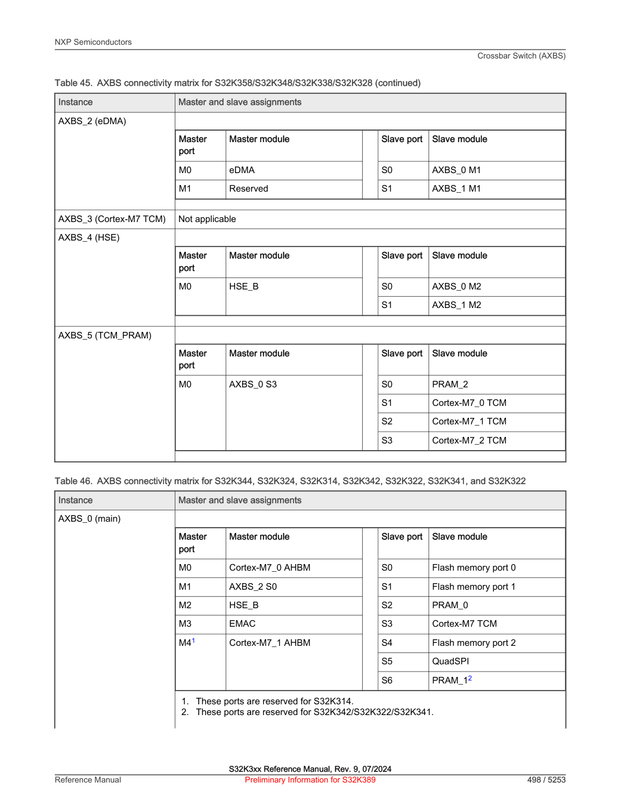

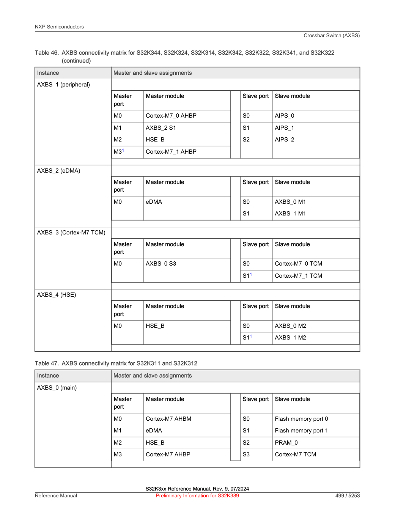

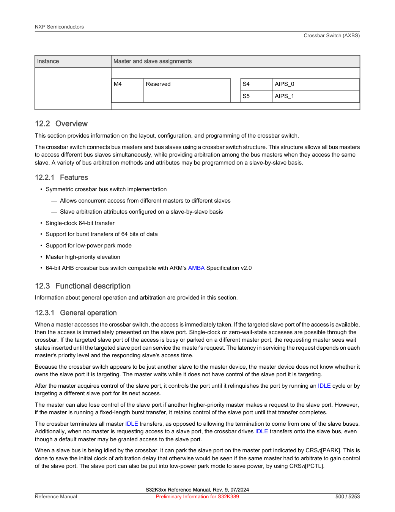

### 5.1 AXBS_0 main：主干 crossbar

==S32K324 的 `AXBS_0` 是 main crossbar。它连接高带宽存储资源。

| 端口  | S32K324 连接          | 解释                       |
| --- | ------------------- | ------------------------ |
| M0  | Cortex-M7_0 AHBM    | Core0 作为 master 访问主干资源   |
| M1  | AXBS_2 S0           | eDMA 通过 AXBS_2 进入主干      |
| M2  | HSE_B               | 硬件安全引擎访问主干               |
| M3  | EMAC                | 以太网 DMA/master 访问主干      |
| M4  | Cortex-M7_1 AHBM    | Core1 作为 master 访问主干     |
| S0  | Flash memory port 0 | PFlash 端口                |
| S1  | Flash memory port 1 | PFlash 端口                |
| S2  | PRAM_0              | System SRAM 的一部分         |
| S3  | Cortex-M7 TCM       | TCM backdoor 方向          |
| S4  | Flash memory port 2 | PFlash 端口                |
| S5  | QuadSPI             | 外部 memory-mapped QSPI 方向 |
| S6  | PRAM_1              | System SRAM 的另一部分        |

这里 `M` 是 master port，`S` 是 slave port。不要把 M0/S0 当地址。它们是 crossbar 内部编号。

### 5.2 ==**AXBS_1 peripheral：外设 crossbar**==

**`AXBS_1` 管外设方向。**

| 端口 | S32K324 连接 | 解释 |
|---|---|---|
| M0 | Cortex-M7_0 AHBP | Core0 访问外设 |
| M1 | AXBS_2 S1 | eDMA 访问外设 |
| M2 | HSE_B | HSE 访问外设 |
| M3 | Cortex-M7_1 AHBP | Core1 访问外设 |
| S0 | AIPS_0 | 外设桥 0 |
| S1 | AIPS_1 | 外设桥 1 |
| S2 | AIPS_2 | 外设桥 2 |

所以当你写 CAN、ADC、LPSPI、PIT 等寄存器时，通常是：

```text
CM7_n AHBP -> AXBS_1 -> AIPS_x -> peripheral register
```

### 5.3 A==XBS_2 eDMA：DMA 的分叉口==

`AXBS_2` 很小，但很关键：

| 端口 | S32K324 连接 | 解释 |
|---|---|---|
| M0 | eDMA | eDMA 是唯一 master |
| S0 | AXBS_0 M1 | eDMA 去 Flash/SRAM/TCM/QSPI |
| S1 | AXBS_1 M1 | eDMA 去外设寄存器/AIPS |

这就是为什么 eDMA 既能从 LPSPI RX 寄存器搬到 SRAM，也能从 SRAM 搬到 LPSPI TX 寄存器。eDMA 不是 CPU 的“助手线程”，**==它是一个真正的 bus master。==**

### 5.4 ==AXBS_3 Cortex-M7 TCM：TCM backdoor crossbar

`AXBS_3` 负责 TCM backdoor：

| 端口  | S32K324 连接      | 解释                 |
| --- | --------------- | ------------------ |
| M0  | AXBS_0 S3       | 从 main AXBS 来的访问   |
| S0  | Cortex-M7_0 TCM | Core0 TCM backdoor |
| S1  | Cortex-M7_1 TCM | Core1 TCM backdoor |

==这解释了 `0x21000000`、`0x21400000` 这类 backdoor 地址为什么存在：它们不是普通 System SRAM 地址，而是通过系统互连访问某个 core 的 TCM。==

### 5.5 AXBS_4 HSE：HSE_B 进入主干/外设的桥

`AXBS_4` 用于 HSE_B：

| 端口 | S32K324 连接 | 解释 |
|---|---|---|
| M0 | HSE_B | HSE 作为 master |
| S0 | AXBS_0 M2 | HSE 去主干资源 |
| S1 | AXBS_1 M2 | HSE 去外设/AIPS |

HSE_B 是安全子系统，它需要访问 Flash、SRAM、外设控制寄存器等资源。手册中还提到 HSE_B/SBAF 对某些 alternate flash controller/interface 有默认独占配置，这也是安全启动场景里常见的隔离设计。

### 5.6 ==AXBS 仲裁：同一目标被抢时谁先过

AXBS 的并行能力只在“不同 master 访问不同 slave”时成立。如果多个 master 抢同一个 slave，就要仲裁。

AXBS 支持：

- 固定优先级：高优先级 master 可以更快拿到 slave，但配置不好可能饿死低优先级。
- 轮询优先级：更公平，适合吞吐均衡。
- park：slave 空闲时可以停靠在某个 master 上，减少下一次访问延迟。
- high priority elevation：把某些 master 提升为高优先级。
- read-only lock：把配置锁住，防止运行时误改。

当前工程的重点是：`RM_IPW_ENABLE_AXBS = STD_OFF`，`Axbs_Ip_PBcfg.c` 没有实际配置内容。因此本项目没有通过 Rm 去重配 AXBS priority/park/arb，通常理解为使用硬件复位默认。手册 block diagram 也提示部分 AXBS/AXBS_Lite 默认是 round-robin，slave park 在 last access master。

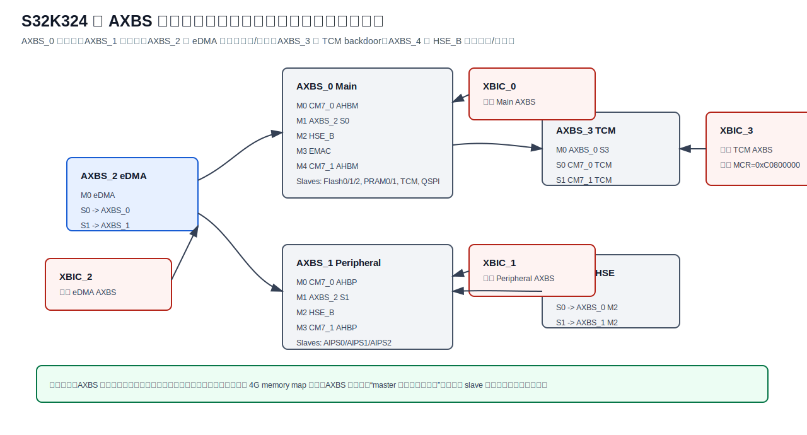

## 6. AIPS_Lite：外设寄存器不是普通内存

`AIPS_Lite` 是 `Peripheral Bridge`。它的工作是把来自 AXBS 的访问转换成外设内部寄存器访问。

S32K324 外设空间主要分三段：

| 地址范围                    | 区域          | 说明                  |
| ----------------------- | ----------- | ------------------- |
| `0x40000000-0x401FFFFF` | AIPS_Lite_0 | 2MB，128 个 16KB slot |
| `0x40200000-0x403FFFFF` | AIPS_Lite_1 | 2MB，128 个 16KB slot |
| `0x40400000-0x405FFFFF` | AIPS_Lite_2 | 2MB，128 个 16KB slot |

AIPS 的硬件结构可以想成“外设片选译码器”：

```text
AXBS_1 slave port
    -> AIPS_Lite
        -> 地址高位判断 16KB slot
        -> 检查该 slot 是否实现、是否开时钟
        -> 选通具体外设寄存器
```

为什么外设不直接挂在 AXBS 上？因为外设数量多、寄存器位宽/时钟/低功耗状态各不相同。AIPS 作为桥，统一处理：

- 地址译码。
- clock gate 之后的访问错误。
- 未实现 slot 的错误响应。
- peripheral register access 的顺序和属性。

当前工程 MPU 把 `0x40000000-0x405FFFFF` 配为强顺序、不可缓存、不可执行。这个配置很关键，原因是外设寄存器不能被 CPU 当成普通变量优化：

- 不能缓存。
- 不能乱序。
- 不能 speculative read。
- 不能执行。

如果外设未开 clock，访问 AIPS slot 可能直接 bus error。因此调试 HardFault/BusFault 时，看到地址在 `0x400xxxxx`、`0x402xxxxx`、`0x404xxxxx`，要第一时间想到 AIPS 和外设时钟。

## 7. eDMA 和 DMAMUX：一个是搬运工，一个是门铃分配器

这两个名字经常一起出现，但它们不是一回事。

| 模块 | 做什么 | 不做什么 |
|---|---|---|
| DMAMUX | 把某个外设请求信号接到某个 DMA channel | 不搬数据，不访问 SRAM/外设数据寄存器 |
| eDMA | 根据 TCD 读源地址、写目的地址 | 不决定哪个外设请求接哪个 channel |

当前工程 `Dma_Mux_Ip_PBcfg.c` 配了 6 个请求：

| DMA MUX channel | 请求源 | 用途 |
|---:|---|---|
| 0 | `LPSPI_0_TX_REQUEST` | LPSPI0 发送 DMA |
| 1 | `LPSPI_0_RX_REQUEST` | LPSPI0 接收 DMA |
| 2 | `LPSPI_1_TX_REQUEST` | LPSPI1 发送 DMA |
| 3 | `LPSPI_1_RX_REQUEST` | LPSPI1 接收 DMA |
| 4 | `LPI2C0_TX_REQUEST` | LPI2C0 发送 DMA |
| 5 | `LPI2C0_RX_REQUEST` | LPI2C0 接收 DMA |

典型 LPSPI TX DMA 路径：

```text
LPSPI0 TX empty event
    -> DMAMUX channel 0
    -> eDMA channel 被触发
    -> eDMA 作为 AHB master 读取 SRAM buffer
    -> AXBS_2 S1 -> AXBS_1 -> AIPS -> LPSPI0 TX register
```

这里最容易踩坑的是 cache coherency。当前工程 MPU 里有 cacheable SRAM，也有 non-cacheable/shared SRAM。DMA buffer 如果放在 cacheable SRAM，CPU 写了 buffer 但还在 D-cache 里没 clean，eDMA 读 system bus 上的 SRAM 可能读到旧值。反过来，eDMA 写 SRAM 后 CPU 还从 D-cache 读，也可能读到旧值。

所以工程里分出 `__RAM_NO_CACHEABLE_START` 和 `__RAM_SHAREABLE_START` 是有意义的：DMA buffer、跨 core 共享数据、外设共享描述符，优先放 non-cacheable/shareable 区域，或者严格做 cache clean/invalidate。

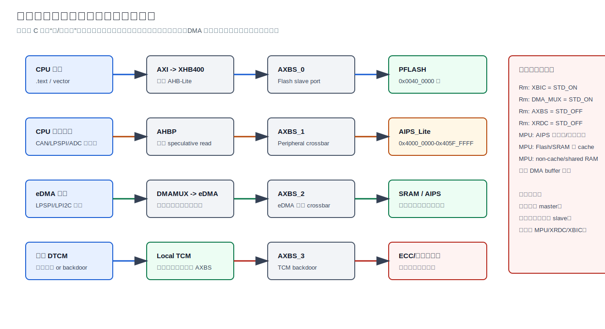

## 8. 存储目标：Flash、PRAMC SRAM、TCM backdoor、QSPI

总线学习不能只讲路，还要讲目的地。S32K324 的存储类 slave 大体有四类。

### 8.1 PFlash/DFlash：非易失存储，读写不对称

PFlash/DFlash 是 Flash array。Flash 的硬件本质不是 SRAM 触发器，而是浮栅/电荷存储类非易失单元。特点是：

- 掉电不丢。
- 读相对快，可用于 XIP 取指。
- 擦写慢，而且必须按 sector/page/program phrase 等粒度。
- 擦写期间可能影响同一 block 的读。
- 需要 Flash controller 管状态、命令、错误、ECC。

S32K324 里 PFlash 数据访问路径和 PFLASH 控制寄存器路径不是一回事：

| 内容 | 地址/路径 | 说明 |
|---|---|---|
| Flash array 内容 | `0x00400000` 起的 memory map | CPU 取指/读常量走 AXBS_0 -> flash port |
| DFlash array 内容 | `0x10000000` 起 | NvM/Fee/EEPROM emulation 常用 |
| PFLASH controller registers | `IP_PFLASH_BASE = 0x40268000` | 这是 AIPS 外设寄存器，用来发命令/查状态 |

当前 linker：

```text
int_flash  ORIGIN = 0x00454520
int_dflash ORIGIN = 0x10000000, LENGTH = 0x00020000
```

当前 MPU 把 Flash 配成 Normal、write-back/write-allocate、可执行或只读。这对取指性能有帮助，因为 Cortex-M7 有 I-cache/D-cache。但 Flash 擦写时必须格外注意 speculative access 和 cache。手册也提示：如果一个区域不希望被投机访问，应通过 MPU 设置 Device/Strongly-ordered、Execute Never 或临时禁止访问。

### 8.2 PRAMC + System SRAM：共享工作内存

System SRAM 是所有 master 都可能访问的共享 RAM。S32K324 有 SRAM0/SRAM1，总体在 `0x20400000-0x2044FFFF` 这一带。它经 PRAMC 接到 AXBS。

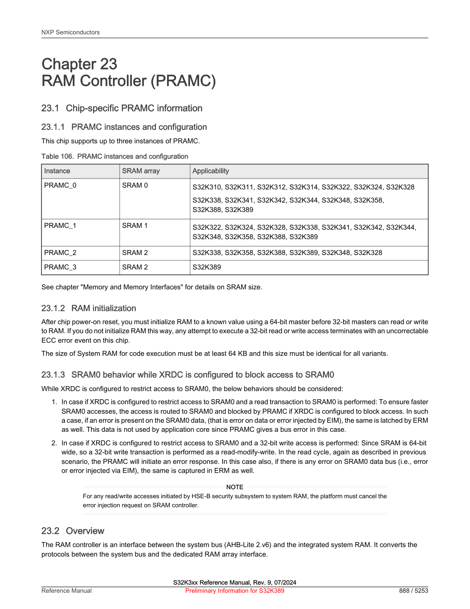

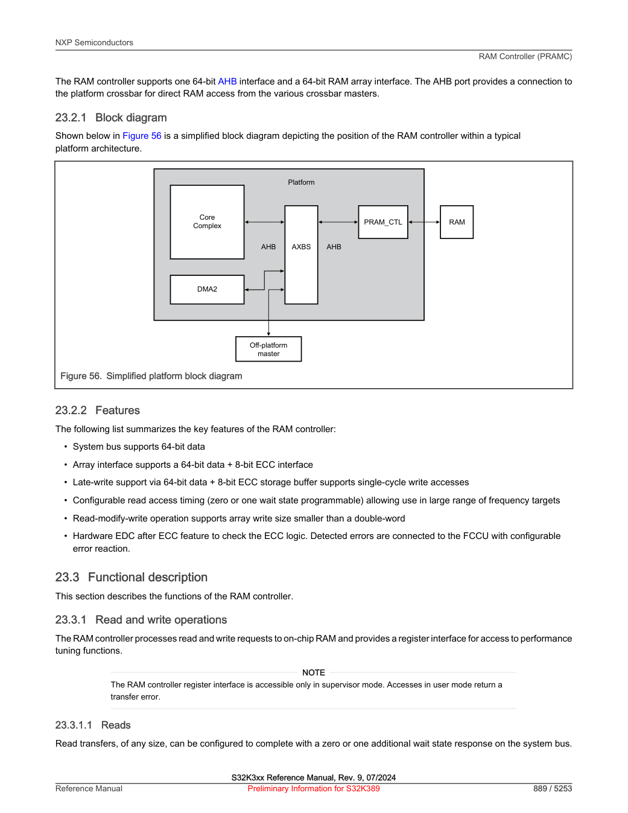

PRAMC 的角色：

```text
AXBS AHB transaction
    -> PRAMC
    -> SRAM array 64-bit data + ECC
```

PRAMC 不是“RAM 本体”，而是 SRAM 控制器。它处理：

- AHB 64-bit 访问。
- SRAM array 接口。
- ECC 位。
- 小于 64-bit 写入时的 read-modify-write。
- 可配置读 wait state。
- 错误上报到 ERM/FCCU。

为什么小于 64-bit 写可能麻烦？因为 SRAM + ECC 的自然粒度是 64-bit data + ECC。你只写 1 byte 或 4 bytes 时，控制器可能需要先读出原 64-bit，合并新字节，再重新生成 ECC 写回。这就是 read-modify-write。

当前 linker 对 System SRAM 的切分：

| 区域 | 地址 | 用途 |
|---|---|---|
| `int_flash_share_calib` | `0x20400000-0x20401FFF` | 标定共享 RAM |
| `int_calibram` | `0x20402000-0x20403FFF` | 标定 RAM |
| `int_sram` | `0x20404000` 起 | 普通 SRAM 数据 |
| `int_Magic_Flag` | `0x2044BE00-0x2044BFFF` | Boot/App magic flag |
| `int_sram_stack_c0` | `0x2044C000-0x2044DFFF` | Core0 stack |
| `int_sram_stack_c1` | `0x2044E000-0x2044FFFF` | Core1 stack |

当前 MPU 进一步把 SRAM 分成：

- cacheable SRAM：性能优先。
- non-cacheable SRAM：DMA/外设共享优先。
- shareable SRAM：跨 core 或共享场景优先。

### 8.3 TCM backdoor：共享访问 TCM 的“后门”

TCM backdoor 的目的不是让本 core 更快，而是让别的 master 能访问 TCM。

例如：

```text
eDMA -> AXBS_2 -> AXBS_0 -> AXBS_3 -> CM7_0 DTCM backdoor
CM7_1 -> AXBS_0 -> AXBS_3 -> CM7_0 DTCM backdoor
```

这和 `CM7_0` 自己访问 local DTCM 是不同路径。local TCM 是 core 旁边的贴身 SRAM；backdoor 是把这块 SRAM 暴露给系统互连。

当前 linker 有 `int_dtcm0_bd = 0x21000000`。如果某些段被放在 backdoor alias，调试时要意识到：这不是普通 System SRAM，也不等价于 `0x20000000` local alias 的访问路径。对实时性、DMA 可见性、ECC 初始化，都要用 TCM backdoor 的逻辑去想。

### 8.4 QuadSPI AHB：外部存储的 memory-mapped 窗口

S32K324 也有 QuadSPI AHB memory-mapped 方向。当前 `system.c` 里也有 QSPI 相关 MPU 区域：

- `0x67000000` QSPI Rx，强顺序。
- `0x68000000-0x6FFFFFFF` QSPI AHB，Normal cacheable。

这说明工程启动代码预留了 QSPI memory-mapped 访问模型。即便项目当前不一定使用外部 QSPI XIP，理解路径也很重要：

```text
CPU/eDMA -> AXBS_0 -> QuadSPI AHB bridge -> external serial flash
```

外部 QSPI 和内部 PFlash 的共同点是都可以 memory-mapped read；不同点是 QSPI 后面是串行外设和 AHB buffer，延迟、burst、abort、cache 策略都更敏感。

## 9. XBIC：总线完整性检查，不是权限控制

**==`XBIC` 是 `Crossbar Integrity Checker`。它站在 AXBS 旁边，检查总线交易的完整性。通俗地说，它不是问“你有没有权限访问”，而是问“这次交易在路上有没有坏掉”。==**

它会关心这类事情：

- slave port 的 EDC error detection。
- master port feedback integrity check。
- 地址、写数据、读反馈等路径上的完整性。
- 错误状态、错误地址。
- 错误可连接到 FCCU 做安全反应。

S32K324 所在型号组有 4 个 XBIC 实例：

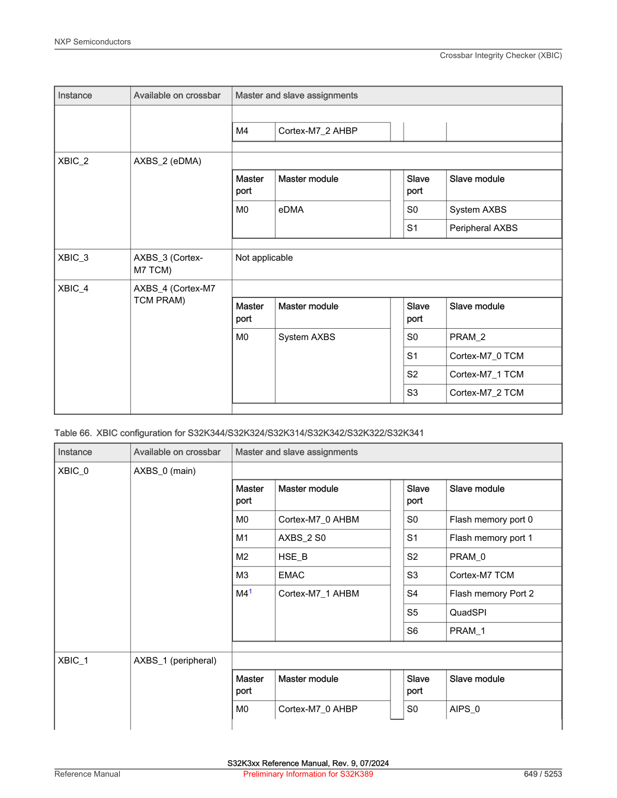

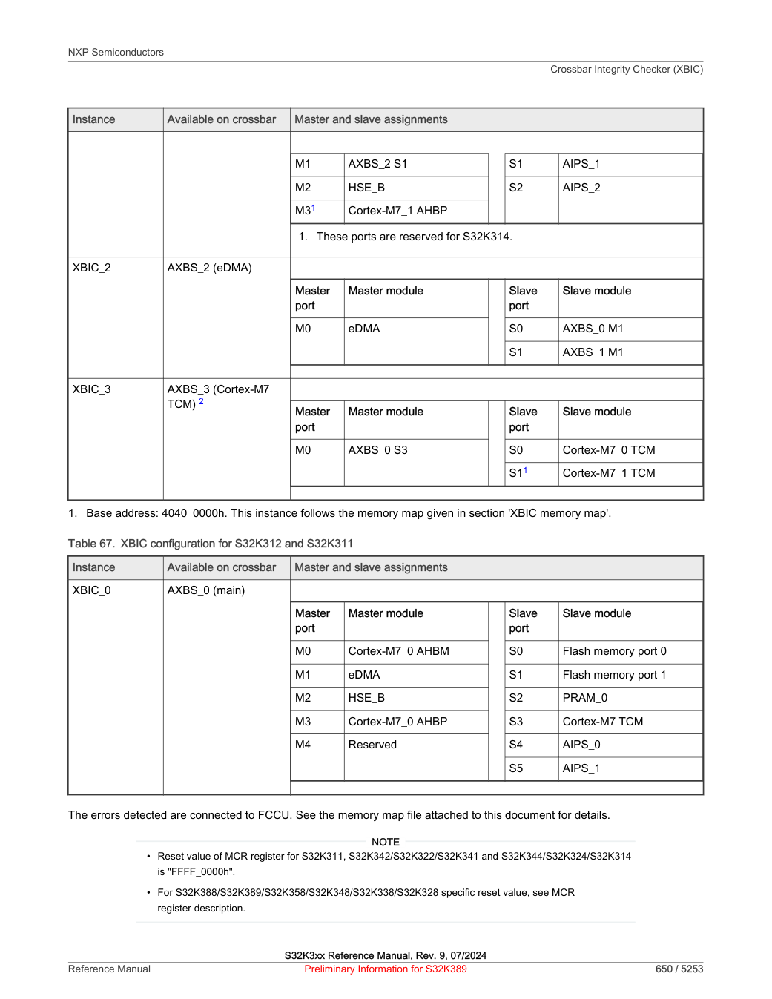

当前工程头文件中基址：

| XBIC 实例 | 基址 | 监视对象 |
|---|---:|---|
| `XBIC_0` | `0x40204000` | `AXBS_0 main` |
| `XBIC_1` | `0x40208000` | `AXBS_1 peripheral` |
| `XBIC_2` | `0x40404000` | `AXBS_2 eDMA` |
| `XBIC_3` | `0x40400000` | `AXBS_3 TCM` |

当前工程 `Xbic_Ip_PBcfg.c` 中的 MCR 配置：

| 实例 | MCR 值 | 通俗解释 |
|---|---:|---|
| `XBIC_0` | `0xFEF80000` | 主 AXBS 多数 slave/master 检查打开，未用端口关闭 |
| `XBIC_1` | `0xE0F00000` | 外设 AXBS 的 AIPS/相关 master 检查打开，未用端口关闭 |
| `XBIC_2` | `0xC0800000` | eDMA AXBS 只启用实际存在的 eDMA 入口和目标反馈 |
| `XBIC_3` | `0xC0800000` | TCM AXBS 只启用实际存在的入口和目标反馈 |

这和手册里的 S32K324 连接矩阵是对应的。比如 AXBS_2 只有 eDMA 一个 master 和两个 slave 方向，不需要把不存在的 M2/M3/M4 全部检查打开。

### 9.1 XBIC 和 XRDC 的区别

| 模块 | 关注问题 | 类比 |
|---|---|---|
| XBIC | 数据/地址/反馈在路上有没有损坏 | 道路上的电子稳定系统 |
| XRDC | 这个 master 有没有权限访问这个资源 | 门禁/权限系统 |
| MPU | CPU 自己访问某地址时是否合法、可缓存、可执行 | CPU 自己的地址规则 |

所以不要把 XBIC 当权限隔离。eDMA 写错地址，XBIC 不一定拦；XRDC/MPU/软件边界才负责权限。XBIC 负责的是通路完整性。

## 10. XRDC：把 master 和资源分成 domain 的硬件门禁

`XRDC` 是 `Extended Resource Domain Controller`。它的思想很像操作系统权限组，但它在硬件 transaction 层工作。

XRDC 的 transaction flow 可以简化成：

```text
Master 发起访问
    -> MDAC 给这次访问贴 domain ID / privilege / secure 属性
    -> transaction 穿过 interconnect
    -> MRC/PAC 在目标侧检查权限
    -> 允许则继续，不允许则 bus error / violation
```

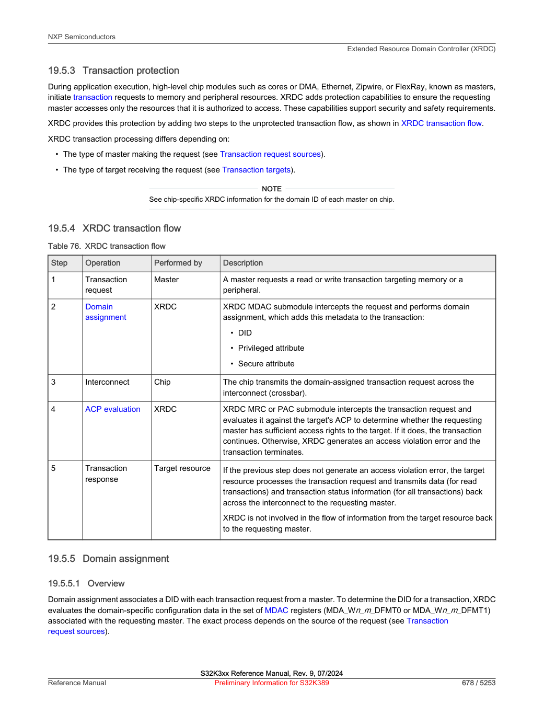

### 10.1 MDAC：给 master 贴身份

S32K324 相关 master 的 MDAC 信息：

| MDAC | Master | Master ID | 说明 |
|---|---|---:|---|
| `XRDC_MDAC0` | Cortex-M7_0 AXI/AHBP | `0x0` | Core0 CPU 访问 |
| `XRDC_MDAC1` | eDMA AHB | `0x2` | DMA 访问 |
| `XRDC_MDAC4` | Cortex-M7_1 AXI/AHBP | `0x1` | Core1 CPU 访问 |
| `XRDC_MDAC5` | EMAC AHB | `0x4` | S32K324 有 EMAC master |

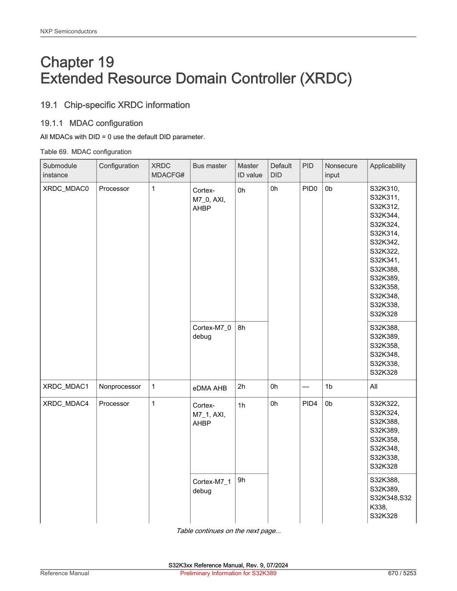

如果未来做安全隔离，可以把不同 core、DMA、EMAC 放到不同 domain。比如让 DMA 只能写某个 non-cacheable SRAM ring buffer，不能写 App 代码区；让非安全任务不能写安全外设寄存器。

### 10.2 MRC：保护 memory target

`MRC` 是 Memory Region Controller。它保护的是存储类资源。

S32K324 相关 MRC：

| MRC | 保护对象 | 说明 |
|---|---|---|
| `XRDC_MRC0` | PFlash ports / PFLASH_WR | 代码 Flash 和 Flash 写相关访问 |
| `XRDC_MRC1` | PRAM0/PRAM1 | System SRAM |
| `XRDC_MRC2` | QuadSPI | 外部 memory-mapped 区域 |

MRC 的思路是：定义地址范围，再给每个 domain 配访问权限。没有命中 region、权限不够、重叠 region 全部拒绝，都可能触发访问错误。

### 10.3 PAC：保护 peripheral target

`PAC` 是 Peripheral Access Controller。它保护 AIPS 外设：

| PAC | 保护对象 |
|---|---|
| `XRDC_PAC0` | AIPS_0 |
| `XRDC_PAC1` | AIPS_1 |
| `XRDC_PAC2` | AIPS_2 |

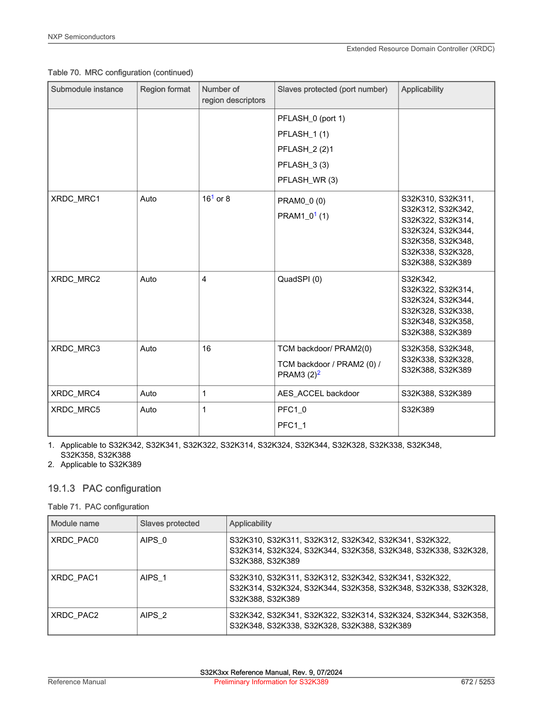

### 10.4 当前工程 XRDC 状态

当前工程 `CDD_Rm_Ipw_Cfg.h`：

```c
#define RM_IPW_ENABLE_XRDC (STD_OFF)
```

所以本项目当前没有通过 Rm 配 XRDC domain/MRC/PAC。OS 目录里能看到一些 memory access check 生成文件，但那是 OS/软件层面的访问检查，不等价于 XRDC 硬件访问控制已经配置。

如果后续要启用 XRDC，建议按这个顺序想：

1. 先列 master：CM7_0、CM7_1、eDMA、EMAC、HSE_B。
2. 再列资源：PFlash、DFlash、SRAM cacheable、SRAM non-cacheable、AIPS 外设。
3. 给每个 master 分 domain。
4. 用 MRC/PAC 只开放必要资源。
5. 先在调试环境记录 violation，再逐步收紧。

## 11. MSCM：系统控制、EDC 使能和 AHB gasket 配置

`MSCM` 是 `Miscellaneous System Control Module`。它不是主数据通路，但它掌握很多系统级控制点：

- core 编号读取。
- interrupt router，当前 `SystemInit()` 会配置 `MSCM->IRSPRC[]` 让中断路由到当前 core。
- `ENEDC` / `ENEDC1`：启用互连 EDC 检查位。
- `IAHBCFGREG`：AHB gasket write optimization 配置。

当前工程 `Rm` 里 `RM_IPW_ENABLE_MSCM = STD_OFF`，说明没有通过 Rm 初始化 MSCM 的 EDC/IAHB 配置。但 `system.c` 直接使用了 `MSCM` 做中断路由。

`S32K324_MSCM.h` 中可以看到一些和总线直接相关的位：

- `MSCM_ENEDC_EN_RD_CM7_0_AHBM`
- `MSCM_ENEDC_EN_RD_CM7_0_AHBP`
- `MSCM_ENEDC_EN_RD_CM7_1_AHBM`
- `MSCM_ENEDC_EN_RD_CM7_1_AHBP`
- `MSCM_ENEDC_EN_WR_AIPS0`
- `MSCM_ENEDC_EN_ADD_AIPS0`
- `MSCM_ENEDC_EN_WR_CM7_0_TCM`
- `MSCM_ENEDC_EN_ADD_CM7_0_TCM`
- `MSCM_IAHBCFGREG_DMA_AXBS_S0_DIS_WR_OPT`
- `MSCM_IAHBCFGREG_TCM_DIS_WR_OPT`
- `MSCM_IAHBCFGREG_QSPI_DIS_WR_OPT`

这些名字很长，但含义朴素：

- `EN_RD_*`：读数据路径检查。
- `EN_WR_*`：写数据路径检查。
- `EN_ADD_*`：地址路径检查。
- `DIS_WR_OPT`：禁用某个 AHB gasket 的写优化。

写优化通常是性能和严格时序之间的权衡。对普通内存，写优化能提高吞吐；对有安全诊断或强顺序要求的路径，可能需要更保守。

## 12. MPU/cache：软件眼里的地址属性会改变总线行为

总线硬件决定“路在哪里”，MPU/cache 决定“CPU 怎么看这条路”。

当前 `system.c` 的 MPU 表非常值得读：

| Region | 地址/符号 | 属性 | 对总线学习的意义 |
|---:|---|---|---|
| 0 | `0x00000000-0xFFFFFFFF` | Strongly Ordered、No Access、XN | 先用背景区封死全部地址，再逐段开放 |
| 1 | ITCM | Normal、non-cache、executable | TCM 按 Arm 推荐设为 Normal non-shareable |
| 2 | PFlash | Normal、WB/WA、RO、executable | 取指和常量读取走 cache 提升性能 |
| 3 | DFlash | Normal、WB/WA、RO、XN | 数据 Flash，默认不执行 |
| 5 | DTCM | Normal、non-cache、executable | 低延迟本地 RAM |
| 6 | SRAM cacheable | Normal、WB/WA | 性能优先，DMA 要做一致性维护 |
| 7 | SRAM non-cache | Normal、non-cache、shareable、XN | DMA buffer/共享数据优先 |
| 8 | SRAM shareable | Normal、non-cache、shareable、XN | 跨 core 或共享对象 |
| 9 | AIPS_0/1/2 | Strongly Ordered、non-cache、XN | 外设寄存器必须强顺序 |
| 13 | PPB | Strongly Ordered、non-cache、XN | NVIC/SCB/MPU 等 core 私有寄存器 |

手册第 5 章也提醒了 speculative access 的风险。Cortex-M7 性能高，是因为它会 cache、预取、投机读取。但外设和 Flash 擦写期间不喜欢这些优化。

非常实用的判断：

- 外设寄存器：强顺序、不可缓存、不可执行。
- DMA buffer：non-cacheable，或者手动 clean/invalidate。
- Flash 擦写区域：擦写期间避免被投机取指/读。
- Vector table 如果放在 cacheable Flash/SRAM，更新后要考虑 I-cache/D-cache 同步；放 ITCM/DTCM 可减少这类问题。

## 13. 结合当前代码走几条真实路径

### 13.1 CPU 执行 App 代码

当前 App 代码主要从 `int_flash = 0x00454520` 开始：

```text
CM7_n instruction fetch
    -> I-cache 查找
    -> AXI/AXIM
    -> XHB400
    -> AXBS_0 main
    -> PFlash port
    -> Flash array
```

如果 cache 命中，后续取指可能不再上总线；如果 cache miss，就会通过 AXBS 去 Flash port 读 line。

### 13.2 CPU 写 CAN/LPSPI/ADC/eMIOS 寄存器

```text
CM7_n load/store
    -> AHBP
    -> AXBS_1 peripheral
    -> AIPS_Lite_x
    -> peripheral register
```

这个路径被 MPU 设成强顺序。写寄存器不会像普通变量那样被 cache，也不应该被编译器/CPU 随意重排。C 代码里仍然要用 `volatile`，因为 `volatile` 管编译器，MPU 管 CPU/总线属性。

### 13.3 eDMA 做 LPSPI0 TX

当前 DMAMUX channel 0 接 `LPSPI_0_TX_REQUEST`：

```text
LPSPI0 TX request
    -> DMAMUX0 channel 0
    -> eDMA channel
    -> eDMA 读 SRAM buffer
        -> AXBS_2 -> AXBS_0 -> PRAMC -> SRAM
    -> eDMA 写 LPSPI0 TX register
        -> AXBS_2 -> AXBS_1 -> AIPS -> LPSPI0
```

这里 CPU 没有搬数据。CPU 只是配置 TCD、buffer、DMAMUX、LPSPI，然后 eDMA 自己在总线上跑。

如果 buffer 在 cacheable SRAM，必须考虑：

- TX 前：CPU clean D-cache，让 eDMA 看到最新数据。
- RX 后：CPU invalidate D-cache，让 CPU 看到 eDMA 写入的数据。
- 更简单稳妥：buffer 放 non-cacheable/shareable section。

### 13.4 CPU/ DMA 访问 System SRAM

CPU 访问 `0x20404000` 附近普通 SRAM：

```text
CM7_n AXI/AXIM
    -> XHB400
    -> AXBS_0
    -> PRAMC_0/PRAMC_1
    -> SRAM array + ECC
```

eDMA 访问同一块 SRAM：

```text
eDMA
    -> AXBS_2
    -> AXBS_0
    -> PRAMC
    -> SRAM array + ECC
```

这就是为什么 SRAM 是共享资源。共享资源就会带来三类问题：

- 仲裁：CPU 和 DMA 同时抢同一个 PRAM bank，会有 wait state。
- cache：CPU cache 和 DMA system bus 看到的值可能不同步。
- 保护：如果未来启用 XRDC，可以限制 DMA 只能访问部分 SRAM。

### 13.5 访问 DTCM backdoor

如果地址是 `0x21000000`：

```text
Master
    -> AXBS_0 S3
    -> AXBS_3 TCM
    -> CM7_0 DTCM backdoor
```

这条路被 `XBIC_3` 监视。它不是普通 PRAMC SRAM，也不是 CPU local DTCM 快路。放置段时要注意这个差异。

### 13.6 读写 NVIC/SCB/MPU

例如写 `SCB->VTOR`、配 MPU、清 cache：

```text
CM7 core
    -> PPB
    -> core private peripherals
```

这不走 AIPS。调试寄存器地址在 `0xE0000000` 区间时，不要按普通外设 AIPS 去理解。

## 14. 各模块控制寄存器地址：别把控制器地址和被控制资源混淆

很多初学者会被 `0x402xxxxx` 迷惑。比如 `PFLASH_BASE = 0x40268000`，是不是 Flash 内容在这里？不是。

| 控制器/模块 | 控制寄存器基址 | 它控制/监视的资源 |
|---|---:|---|
| `AXBS_LITE` | `0x40200000` | AXBS 可编程寄存器模型 |
| `XBIC_AXBS` | `0x40204000` | Main AXBS 完整性检查 |
| `XBIC_AXBS_PERI` | `0x40208000` | Peripheral AXBS 完整性检查 |
| `XBIC_AXBS_TCM` | `0x40400000` | TCM AXBS 完整性检查 |
| `XBIC_AXBS_EDMA` | `0x40404000` | eDMA AXBS 完整性检查 |
| `MSCM` | `0x40260000` | 系统控制、中断路由、EDC、AHB gasket |
| `PRAMC_0` | `0x40264000` | SRAM0 控制器 |
| `PFLASH` | `0x40268000` | Flash controller 寄存器 |
| `XRDC` | `0x40278000` | domain/region/peripheral 权限寄存器 |
| `PRAMC_1` | `0x40464000` | SRAM1 控制器 |

这些地址都落在 AIPS 外设空间里。也就是说，访问这些控制器寄存器本身，走的是：

```text
CM7 AHBP -> AXBS_1 -> AIPS -> 控制器寄存器
```

但控制器背后的数据资源，例如 PFlash array、System SRAM array，则走主 AXBS 的存储路径。

## 15. 出问题时怎么按总线路径排查

### 15.1 BusFault/HardFault 看到地址在外设区

如果 fault address 在 `0x40000000-0x405FFFFF`：

1. 看外设 clock 是否打开。
2. 看访问地址是否落在实现的 AIPS slot。
3. 看访问宽度是否允许，有些寄存器只支持 32-bit。
4. 看 MPU 是否允许该特权级访问。
5. 如果启用了 XRDC，查 XRDC violation。

### 15.2 DMA 数据不对

先问三个问题：

1. DMAMUX 请求源接对了吗？
2. eDMA TCD 的 source/destination 地址分别在哪个 memory map 区域？
3. buffer 是否 cacheable？

常见路径错误：

- 把 peripheral register 当普通 SRAM buffer。
- RX buffer 放 cacheable SRAM，CPU 没 invalidate。
- TX buffer 放 cacheable SRAM，CPU 没 clean。
- DMA 访问 TCM local alias，而不是 backdoor/system visible alias。

### 15.3 Flash 擦写期间异常

先区分：

- CPU 正在从同一 Flash block 取指吗？
- D-cache/I-cache 是否可能访问该区域？
- MPU 是否临时禁止了擦写区域投机访问？
- PFLASH controller 状态寄存器是否报 read-while-write 或 ECC error？

### 15.4 XBIC 报错

如果是 XBIC 相关错误：

1. 先定位哪个实例：main、peripheral、eDMA、TCM。
2. 查 `ESR` 看错误类型。
3. 查 `EAR` 看错误地址。
4. 对照 AXBS 连接矩阵看 master/slave 组合。
5. 再看 FCCU/ERM 是否同步记录。

例如 `XBIC_2` 报错，优先想到 eDMA 通路；`XBIC_3` 报错，优先想到 TCM backdoor 通路。

### 15.5 性能抖动或实时性不稳定

总线层面常见原因：

- 两个 core 和 DMA 同时抢同一个 PRAM/SRAM bank。
- CPU 从 Flash 执行且 cache miss 频繁。
- DMA 大 burst 抢占 SRAM。
- 外设 register polling 太密集，AHBP/AIPS 被占。
- AXBS 默认仲裁没有按应用负载优化。

如果真要优化，先用测量证明瓶颈，再考虑：

- 把高频 ISR 或关键 loop 放 ITCM。
- 把关键数据放 DTCM。
- DMA buffer 放 non-cacheable SRAM。
- 降低不必要的外设 polling。
- 谨慎启用 AXBS priority 配置，并留下可回退方案。

## 16. 一张表复盘所有关键总线/桥

| 块 | 是否是 bus/interconnect | 主要路径 | 当前工程关系 | 你应该记住 |
|---|---|---|---|---|
| CM7 local TCM path | 是，core 内部局部路径 | CM7 -> ITCM/DTCM | linker 定义 ITCM/DTCM | 最快最确定，但只对本 core 自然可见 |
| AXI/AXIM | 是，CPU master 接口 | CM7 -> XHB400 -> AXBS_0 | 取指/读写 SRAM/Flash | 高带宽，受 cache/MPU 影响 |
| AHBP | 是，CPU 外设接口 | CM7 -> AXBS_1 -> AIPS | 外设寄存器访问 | 外设访问主路，强顺序 |
| AHBS | 是，slave 侧接口语境 | TCM/core 被系统访问 | TCM backdoor 相关 | 别人访问 core TCM 时会遇到 |
| PPB | 是，core 私有外设 bus | CM7 -> NVIC/SCB/MPU | MPU region 13 | 不走 AIPS，地址在 `0xE0000000` |
| AXBS_0 | crossbar | Core/eDMA/HSE/EMAC -> Flash/SRAM/TCM/QSPI | 未通过 Rm 重配 | 主干立交桥 |
| AXBS_1 | crossbar | Core/eDMA/HSE -> AIPS | 未通过 Rm 重配 | 外设立交桥 |
| AXBS_2 | crossbar | eDMA -> AXBS_0/AXBS_1 | eDMA 真实使用 | DMA 分叉口 |
| AXBS_3 | crossbar | AXBS_0 -> CM7 TCM | XBIC_3 开启 | TCM backdoor 入口 |
| AXBS_4 | crossbar | HSE_B -> AXBS_0/AXBS_1 | HSE 硬件相关 | 安全子系统通路 |
| AIPS_Lite | peripheral bridge | AXBS_1 -> 外设 slot | MPU 强顺序 | 外设寄存器桥 |
| PRAMC | memory controller | AXBS_0 -> SRAM array | System SRAM 真实使用 | SRAM 64-bit + ECC 控制器 |
| PFLASH controller | peripheral controller | AIPS 控制寄存器；Flash array 在主存储路径 | Flash/NvM 相关 | 控制器地址不是 Flash 内容地址 |
| DMAMUX | request mux | 外设请求 -> eDMA channel | STD_ON，6 个通道 | 不搬数据，只接门铃 |
| eDMA | bus master | eDMA -> AXBS_2 -> 资源 | LPSPI/LPI2C DMA | 独立 master，注意 cache |
| XBIC | integrity checker | 监视 AXBS 通路 | STD_ON，4 实例 | 检查完整性，不管权限 |
| XRDC | access controller | MDAC -> interconnect -> MRC/PAC | Rm STD_OFF | 硬件门禁，当前未配置 |
| MSCM | system control | 中断路由/EDC/gasket | Rm STD_OFF，SystemInit 用中断路由 | 不是主数据路，但管很多系统开关 |

## 17. 最后用一句话把 S32K324 总线讲完整

S32K324 的 4GB memory map 是一本门牌号簿；Cortex-M7、eDMA、HSE_B、EMAC 是会主动出门的人；AXI/AHB/AHBP/PPB 是他们脚下的不同出门通道；AXBS 是芯片内部主立交桥；AIPS 是去外设寄存器的匝道；PRAMC/PFLASH/TCM backdoor 是存储目标的门卫和控制器；XBIC 检查路上的信号有没有坏；XRDC 可以检查谁有没有权限；MPU/cache 决定 CPU 自己如何看待这些地址。

真正调试时不要背名词。看到一个地址，先问：

1. 这个地址属于 Flash、SRAM、TCM、AIPS、PPB 还是 QSPI？
2. 这次访问是谁发起的，CM7 还是 eDMA/HSE/EMAC？
3. 它会走 AXBS_0、AXBS_1、AXBS_2、AXBS_3 中哪一条？
4. MPU/cache/XRDC/XBIC 有没有参与？
5. 如果出错，错误更像权限错误、未开时钟、ECC/EDC、cache coherency，还是 AXBS 仲裁/性能问题？

按这个顺序想，总线就不再是一堆缩写，而是一张能帮你定位问题的芯片内部地图。
