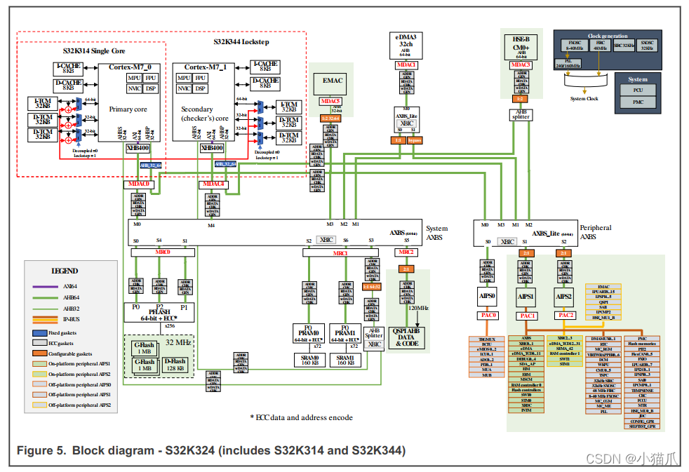

# S32K324 4GB 地址空间 Memory Map 学习笔记

> 重新生成版，旧版中文曾被写成问号，本文件已按 UTF-8 中文重写。目标是把 S32K324 的 32 位 4GB 地址空间讲清楚，并结合当前工程的 linker、Boot/FBL、Mem_43_INFLS、Fee/NvM 相关配置一起理解。


## 0. 资料来源和阅读方法

主要资料：

- `S32K3xx Reference Manual.pdf`，Chapter 3 `Memory Map`
- `S32K3xx_memory_map.xlsx`，筛选 `S32K324`
- `BasicSoftware/integration/linker/ETAS_BIP_S32KGHS.ld`
- `boot/ASU_Boot_Flash/文档/S32K324MemmoryLayout.xlsx`
- `BasicSoftware/integration/mcal/src/gen/include/C40_Ip_Cfg.h`
- `BasicSoftware/integration/mcal/src/gen/src/Mem_43_INFLS_Cfg.c`
- `BasicSoftware/integration/src/target/src/system.c`

先给一句总纲：**4GB 地址空间不是 4GB 物理 RAM，而是一张 32 位地址地图。** CPU 发出一个地址，芯片内部的地址译码和总线矩阵会判断它应该去 Flash、SRAM、TCM、外设寄存器、QuadSPI 外部窗口，还是落入未实现区域。


Reference Manual 对 memory map 的说明如下：


## 1. 先把几个硬件概念讲透

### 1.1 地址空间像一栋楼的门牌号

S32K324 是 Cortex-M7，地址是 32 位，所以 CPU 理论上能表达 `0x00000000` 到 `0xFFFFFFFF`，合计 4GB。这个 4GB 更像一栋大楼的门牌号系统，不代表每个门牌后面都有房间。

访问 `0x00400000`，总线把请求送到 Program Flash。访问 `0x20400000`，总线把请求送到 System SRAM。访问 `0x400A0000`，总线把请求送到 ADC0 的寄存器。访问一个保留地址，通常会总线错误、HardFault，或者返回未定义值，取决于芯片和访问类型。

### 1.2 SRAM 是什么，和 DRAM 有什么区别

SRAM 的全称是 Static Random Access Memory，中文常说静态随机存储器。它的基本存储单元是触发器，简单理解就是几个晶体管互相“拽着”保持一个 0 或 1。只要供电不断，它就能保持数据，不需要周期性刷新。

**DRAM 的全称是 Dynamic Random Access Memory，中文常说动态随机存储器。它的基本存储单元更像一个小电容，电荷会慢慢漏掉，所以控制器要不断刷新。DRAM 的优势是密度高、容量大、成本低，常见于 PC 内存和高端 SoC 外挂内存。**

放到 S32K324 里看：

| 对比项            | SRAM                             | DRAM                       |
| -------------- | -------------------------------- | -------------------------- |
| 存储结构           | 触发器保持状态                          | 电容存电荷                      |
| 是否刷新           | 不需要刷新                            | 需要刷新                       |
| 延迟确定性          | **==很好，适合实时控制==**                | ==**受刷新和控制器影响**==          |
| 面积和成本          | 单 bit 面积大，容量通常小                  | 单 bit 面积小，容量容易做大           |
| 在 S32K324 中的角色 | TCM 和 System SRAM 都属于片上 SRAM 类存储 | S32K324 片内没有把 DRAM 作为主 RAM |

**所以汽车 MCU 喜欢 SRAM，是因为它确定、快、结构简单，适合中断、控制环、DMA 缓冲、栈、全局变量这些实时软件场景。**

### 1.3 Flash 和 RAM 的根本差异

Flash 是非易失存储，断电后内容还在。PFlash 存代码，CPU 可以直接从里面取指执行，也就是 XIP。DFlash 多用于数据保存，比如 NvM/Fee 做 EEPROM emulation。

RAM 是易失存储，断电后内容丢失。代码运行时的栈、`.data`、`.bss`、DMA buffer、运行时标定 RAM 都在 RAM 里。

Flash 擦写有两个关键限制：

- **擦除粒度比写入粒度大。本工程 DFlash 的 `Mem_43_INFLS_Cfg.c` 配置里，sector size 是 `8192` 字节**。
- **写入通常只能把 bit 从 1 写成 0，想从 0 回到 1 要先擦除整个 sector**。

**这就是为什么 NvM/Fee 不会像普通 RAM 一样随便改一个字节，而是要做块管理、磨损均衡、状态标记。**

### 1.4 TCM 是“贴在 CPU 身边的小 SRAM”

ITCM = **Instruction Tightly Coupled Memory**  
DTCM = **Data Tightly Coupled Memory**
区别：

| 项目 | ITCM | DTCM |
|---|---|---|
| 用途 | 放代码/指令 | 放数据/栈/变量 |
| 访问者 | CPU 取指 | CPU load/store |
| 典型内容 | 中断函数、实时控制代码、启动代码 | 栈、实时变量、DMA 不访问的数据 |
| 延迟 | 很低，确定性强 | 很低，确定性强 |
| Cache 影响 | 通常不走 I-cache | 通常不走 D-cache |
| 总线 | 指令 TCM 接口 | 数据 TCM 接口 |

一句话：  
**ITCM 给 CPU 快速取代码，DTCM 给 CPU 快速读写数据。**

注意点：  
==**很多 MCU 上 DMA/其他总线主机不能访问 TCM，或访问受限。所以 DMA buffer 通常别放 DTCM，放 SRAM/AXI SRAM 更稳**。

TCM 是 Tightly Coupled Memory，直译是紧耦合存储器。它也是 SRAM 类存储，但和普通 System SRAM 的连接方式不同。TCM 贴近 Cortex-M7 核，走专门的 TCM 接口，访问延迟稳定，**适合放启动代码、关键中断、关键数据、栈或者实时控制变量**。

S32K324 有两个 Cortex-M7 核，所以 Excel 里会看到 `ITCM_0`、`ITCM_1`、`DTCM_0`、`DTCM_1`。注意它们的 local alias 都写成类似 `0x00000000` 或 `0x20000000`，**这是从各自 CPU 核的本地视角看过去的地址。系统里还有 backdoor 地址，例如 `0x11000000` 和 `0x21000000`**，**方便通过系统总线访问某个核的 TCM。**


### 1.5 AIPS 是外设寄存器窗口，不是内存条
```
AIPS = **AHB-to-I P bridge / Advanced IP bus System**，在 NXP S32K3 里常见。
作用：把 Cortex-M7 / DMA / 总线主机访问，桥接到外设寄存器区，比如 MC_ME、MC_CGM、SIUL2、FlexCAN、LPUART 等。
- **地址解码**：CPU 访问某外设地址，AIPS 路由到对应外设。
- **访问保护**：可限制 master 权限、特权/用户模式、读写权限。
- **外设时钟/复位后访问通道**：外设挂在 AIPS 下，通过它被总线访问。
- **错误响应**：非法地址、无权限访问、外设未响应时，AIPS 可返回 bus error。
  
  **AIPS 是 MCU 内部“外设寄存器总线网关”。CPU 不直接摸外设，先过 AIPS。**
```


`0x40000000` 附近的 AIPS 区域看起来也是地址，但它不是 RAM。比如 `0x400A0000` 是 ADC0 的寄存器窗口，读写这里是在读写 ADC 模块的控制寄存器和状态寄存器。

这种区域有副作用。写一个 bit 可能启动转换、清中断、解锁寄存器、喂狗、触发复位。它不能按普通变量看待，也不应该被 cache。**当前工程在 `system.c` 里把 AIPS 和 PPB 配成 Strongly Ordered、non-cacheable、execute never，这正是为了避免 CPU 乱序、预取、缓存造成外设访问语义出错。**

### 1.6 PPB 是 Cortex-M7 自己的私有外设区

PPB 是 Private Peripheral Bus，地址是 `0xE0000000-0xE00FFFFF`。它不是 NXP AIPS 外设，**而是 Arm Cortex-M7 核心自带的系统控制区**，例如 NVIC、SysTick、SCB、MPU、DWT、ITM。OS 里的中断开关、向量表地址 `VTOR`、SysTick，都在这里。


## 2. ==S32K324 4GB 总地址地图==

这张表是最重要的。它把 4GB 地址空间按大块分开。标成保留的区域，不代表无意义，而是对 S32K324 这个具体料号来说没有实现可访问资源，或者留给同系列更大芯片、内部测试、未来扩展。

| 地址范围                    | 块名                           | 解释和用途                                                                                                            |
| ----------------------- | ---------------------------- | ---------------------------------------------------------------------------------------------------------------- |
| `0x00000000-0x0000FFFF` | ITCM local alias             | 每个 Cortex-M7 核本地看到的指令 TCM 窗口。Excel 最大窗口 64KB，S32K324 每核实现 32KB。当前 linker 的 `int_itcm` 用 `0x00000000-0x00007FFF`。 |
| `0x00010000-0x003FFFFF` | Reserved                     | S32K324 未实现普通存储。不要把代码或变量放到这里。                                                                                    |
| `0x00400000-0x007FFFFF` | Program Flash                | 4MB 代码 Flash。当前工程把这里切成 BM、BOOT、App、共享代码、标定 Flash 等区域。                                                            |
| `0x00800000-0x0FFFFFFF` | Reserved                     | 对 S32K324 没有实现 PFlash。更大派生型号可能有不同布局。                                                                             |
| `0x10000000-0x1001FFFF` | Data Flash implemented       | S32K324 实际实现的 128KB DFlash。当前 `C40_IP_DATA_BLOCK_END_ADDR` 也是 `0x1001FFFF`。                                      |
| `0x10020000-0x1003FFFF` | DFlash nominal upper window  | Excel 行最大窗口到 `0x1003FFFF`，但 S32K324 size 是 128KB，所以这一半不作为本芯片已实现 DFlash 使用。                                       |
| `0x10040000-0x10FFFFFF` | Reserved                     | DFlash 后面的空洞。                                                                                                    |
| `0x11000000-0x11007FFF` | ITCM0 backdoor implemented   | 通过系统总线访问 CM7_0 的 ITCM。当前 linker `int_itcm0_bd` 使用 32KB。                                                          |
| `0x11008000-0x113FFFFF` | Reserved                     | ITCM0 backdoor 最大窗口剩余部分以及后续空洞，S32K324 不使用。                                                                       |
| `0x11400000-0x11407FFF` | ITCM1 backdoor implemented   | 通过系统总线访问 CM7_1 的 ITCM。当前 linker `int_itcm1_bd` 使用 32KB。                                                          |
| `0x11408000-0x1AFFFFFF` | Reserved                     | ITCM1 backdoor 之后到 UTEST 之前的空洞。                                                                                  |
| `0x1B000000-0x1B001FFF` | UTEST Flash                  | 8KB 用户测试和工厂配置类 Flash 区域，通常不要当普通应用 Flash 使用。                                                                      |
| `0x1B002000-0x1FFFFFFF` | Reserved                     | UTEST 后的空洞。                                                                                                      |
| `0x20000000-0x2000FFFF` | DTCM local alias implemented | 每个核本地的数据 TCM。Excel 最大窗口 128KB，S32K324 每核实现 64KB。当前 linker `int_dtcm` 使用 64KB。                                    |
| `0x20010000-0x203FFFFF` | Reserved                     | DTCM local alias 未实现的上半部分和后续空洞。                                                                                  |
| `0x20400000-0x2044FFFF` | System SRAM                  | 320KB 系统 SRAM，分 SRAM0 和 SRAM1。CPU、DMA、外设都可通过系统总线访问。当前工程把标定 RAM、普通 SRAM、Magic Flag、双核栈都放在这里。                      |
| `0x20450000-0x20FFFFFF` | Reserved                     | System SRAM 结束后的空洞。                                                                                              |
| `0x21000000-0x2100FFFF` | DTCM0 backdoor implemented   | 系统总线视角访问 CM7_0 DTCM。当前 linker `int_dtcm0_bd` 使用 64KB。                                                            |
| `0x21010000-0x213FFFFF` | Reserved                     | DTCM0 backdoor 后面的空洞。                                                                                            |
| `0x21400000-0x2140FFFF` | DTCM1 backdoor implemented   | 系统总线视角访问 CM7_1 DTCM。当前 linker `int_dtcm1_bd` 使用 64KB。                                                            |
| `0x21410000-0x3FFFFFFF` | Reserved                     | RAM 和外设区之间的大空洞。                                                                                                  |
| `0x40000000-0x401FFFFF` | AIPS0                        | 外设寄存器桥 0。S32K324 这里主要放 TRGMUX、BCTU、eMIOS、LCU、ADC、PIT、MU_2。                                                       |
| `0x40200000-0x403FFFFF` | AIPS1                        | 外设寄存器桥 1。这里是系统控制、DMA、Debug、Flash 控制、时钟复位、GPIO 包装、CAN、UART、SPI、I2C、安全模块等主要区域。                                     |
| `0x40400000-0x405FFFFF` | AIPS2                        | 外设寄存器桥 2。这里有 TCM/eDMA XBIC、eDMA TCD12-31、PRAM1、EMAC、LPUART8-15、LPSPI4-5、QuadSPI 控制器等。                            |
| `0x40600000-0x66FFFFFF` | Reserved                     | 当前 `system.c` 有 AIPS3 的通用 MPU 区域，但 S32K324 的 Excel memory map 只实现 AIPS0、AIPS1、AIPS2。                             |
| `0x67000000-0x670003FF` | QuadSPI Rx buffer            | QuadSPI 接收缓冲窗口，只有 1KB。它是控制器内部 buffer 的地址映射，不是外部 Flash 主窗口。                                                       |
| `0x67000400-0x67FFFFFF` | Reserved                     | QuadSPI Rx buffer 后的空洞。                                                                                          |
| `0x68000000-0x6FFFFFFF` | QuadSPI AHB                  | 128MB 外部 QuadSPI AHB 映射窗口。外部串行 Flash 可以像内存一样被读，适合资源或外部 XIP 场景。                                                   |
| `0x70000000-0xDFFFFFFF` | Reserved                     | S32K324 未实现的大段地址。                                                                                                |
| `0xE0000000-0xE00FFFFF` | PPB                          | Cortex-M7 私有外设区，含 NVIC、SCB、SysTick、MPU、DWT 等。                                                                    |
| `0xE0100000-0xFFFFFFFF` | Reserved                     | PPB 之后的系统保留区域。                                                                                                   |

## 3. NXP Excel 中的 S32K324 memory rows

这里按 `S32K3xx_memory_map.xlsx` 的 `Memories` 页筛选 S32K324。Excel 的 `Max size` 是这个地址窗口最多可容纳的大小，`S32K324 size` 是本料号实际实现大小。

| 起始地址 | 结束地址 | 名称 | S32K324 实现 | 解释 |
| --- | --- | --- | --- | --- |
| `0x00000000` | `0x0000FFFF` | ITCM_0 | 32KB | CM7_0 的指令 TCM，本地取指低延迟。窗口最大 64KB，本芯片实际 32KB。 |
| `0x00000000` | `0x0000FFFF` | ITCM_1 | 32KB | CM7_1 的指令 TCM。两个核本地都看到 `0x00000000`，这是核内局部地址视角。 |
| `0x00400000` | `0x004FFFFF` | Program flash Block 0 | 1024KB | PFlash 第 0 块。当前 BM、BOOT、App 起始区域都落在这里。 |
| `0x00500000` | `0x005FFFFF` | Program flash Block 1 | 1024KB | PFlash 第 1 块。当前工程的系统代码区、CAN 应用代码区、共享代码区跨到这里。 |
| `0x00600000` | `0x006FFFFF` | Program flash Block 2 | 1024KB | PFlash 第 2 块。当前共享代码末尾和标定 Flash `0x00680000` 落在这里。 |
| `0x00700000` | `0x007FFFFF` | Program flash Block 3 | 1024KB | PFlash 第 3 块。当前 linker 暂未切满，可作为后续应用或数据扩展空间，需和 Boot 规划一致。 |
| `0x10000000` | `0x1003FFFF` | Data flash Block 4 | 128KB | DFlash 地址窗口最大 256KB，S32K324 实现 128KB，即 `0x10000000-0x1001FFFF`。用于 NvM/Fee 类非易失数据。 |
| `0x11000000` | `0x1100FFFF` | ITCM_0 Backdoor | 32KB | 通过系统总线访问 CM7_0 ITCM。backdoor 主要给其他 master 或调试路径使用。 |
| `0x11400000` | `0x1140FFFF` | ITCM_1 Backdoor | 32KB | 通过系统总线访问 CM7_1 ITCM。 |
| `0x1B000000` | `0x1B001FFF` | UTEST Block 0 | 8KB | 用户测试和配置相关 Flash 区，不按普通 PFlash 分配应用。 |
| `0x20000000` | `0x2001FFFF` | DTCM_0 | 64KB | CM7_0 的数据 TCM，本地数据访问低延迟，常适合关键数据和栈。 |
| `0x20000000` | `0x2001FFFF` | DTCM_1 | 64KB | CM7_1 的数据 TCM，本地地址同样是 `0x20000000`。 |
| `0x20400000` | `0x20427FFF` | SRAM0 | 160KB | System SRAM 的前半部分，通过系统总线访问，CPU 和 DMA 都能用。 |
| `0x20428000` | `0x2044FFFF` | SRAM1 | 160KB | System SRAM 的后半部分。当前 Magic Flag 和双核栈位于 SRAM1 末端附近。 |
| `0x21000000` | `0x2101FFFF` | DTCM_0 Backdoor | 64KB | 系统总线访问 CM7_0 DTCM 的窗口。当前 linker 把一部分 `.sram_bss` 放到 `int_dtcm0_bd`。 |
| `0x21400000` | `0x2141FFFF` | DTCM_1 Backdoor | 64KB | 系统总线访问 CM7_1 DTCM 的窗口。 |
| `0x40000000` | `0x401FFFFF` | AIPS0 | 2048KB | 外设寄存器桥 0，不是 RAM，访问有外设副作用。 |
| `0x40200000` | `0x403FFFFF` | AIPS1 | 2048KB | 外设寄存器桥 1，是本芯片最密集的系统外设寄存器区。 |
| `0x40400000` | `0x405FFFFF` | AIPS2 | 2048KB | 外设寄存器桥 2，含 DMA 后半、通信外设和 QuadSPI 控制器。 |
| `0x67000000` | `0x670003FF` | QuadSPI Rx buffer | 1KB | QuadSPI 控制器内部接收缓冲映射。 |
| `0x68000000` | `0x6FFFFFFF` | QuadSPI AHB virtual code and data | 128MB | 外部 QuadSPI Flash 的 AHB 映射窗口，当前 `system.c` 可把它设为 Normal cacheable。 |
| `0xE0000000` | `0xE00FFFFF` | Private Peripheral Bus | 1024KB | Arm Cortex-M7 私有外设区，OS 和内核控制寄存器在这里。 |
| Total RAM |  |  | 512KB | 组成是 ITCM 64KB、DTCM 128KB、System SRAM 320KB。 |

## 4. 当前工程对 PFlash 和 RAM 的切分

芯片手册只告诉我们硬件有哪些地址。真正的软件布局由 linker 和 Boot 文档决定。

### 4.1 PFlash 的工程切分

| 工程区域 | 地址范围 | 来源 | 用途 |
| --- | --- | --- | --- |
| BM | `0x00400000-0x00409FFF` | Boot Excel | Boot manager 或启动管理相关区域。 |
| BOOT | `0x0040A000-0x0043BFFF` | Boot Excel | FBL/Boot 主体区域。 |
| APP and CAL PresentMark | `0x0043C000-0x0043FFFF` | Boot Excel | App 和标定存在标记，大小 16KB。 |
| int_ApplCheckinfo | `0x00440000-0x004404FF` | linker | 应用检查信息，长度 1280B。Boot 可用它判断 App 元信息。 |
| int_ApplBmHeader | `0x00440500-0x0044051F` | linker | App Boot Header，长度 32B。`ApplBmHdr_Cfg.c` 中的 header 放在这里。 |
| int_flash_rsvd | `0x00440520-0x0045051F` | linker | 预留 64KB，给启动协同、对齐或后续扩展。 |
| int_os_vectors | `0x00450520-0x0045451F` | linker | 中断向量表区域。`__CORE0_VTOR`、`__CORE1_VTOR` 指向 ROM interrupt start。 |
| int_flash | `0x00454520-0x0049FFFF` | linker | 应用主代码、只读数据、启动代码、MCAL 代码等。 |
| int_flash_sys | `0x004A0000-0x00587FFF` | linker | 系统应用代码区，长度 928KB。 |
| int_flash_can | `0x00588000-0x005C7FFF` | linker | CAN 应用相关代码区，长度 256KB。linker 注释里写 64KB，但 LENGTH 是 `0x00040000`。 |
| int_flash_shareable | `0x005C8000-0x0067FFFF` | linker | 共享代码区，长度 736KB。 |
| int_flash_calib | `0x00680000-0x00681FFF` | linker | 标定 Flash 区，当前只开 8KB。原注释里曾有 512KB 规划，但当前生效长度是 8KB。 |

理解方式：PFlash 是一整片 4MB 可执行非易失存储，但 Boot、App、标定、共享代码不能混在一起，所以 linker 像切蛋糕一样把它切成固定区间。Boot 根据这些固定地址去找 App header、向量表和标定数据。

### 4.2 DFlash 和 NvM/Fee

| 配置项 | 当前值 | 含义 |
| --- | --- | --- |
| C40 DFlash base | `0x10000000` | DFlash 起始地址。 |
| C40 DFlash end | `0x1001FFFF` | S32K324 实际 128KB DFlash 的末地址。 |
| Mem sector batch | `0x10000000-0x10007FFF` | 当前 Mem_43_INFLS 只配置前 32KB 给 DFlash batch。 |
| Sector size | `8192` 字节 | 一次擦除的基本粒度。 |
| Read page size | `8` 字节 | MCAL 配置的读页粒度。 |
| Write page size | `8` 字节 | MCAL 配置的写页粒度。 |

这里要分清两层：硬件有 128KB DFlash，但当前 Mem 配置只把前 32KB 拿出来作为 batch 使用。后面的 DFlash 地址不是不存在，而是当前配置没有给 Mem/Fee 管理。后续若要扩大 NvM，需要同步改 Mem、Fee、NvM、分区规划和擦写寿命评估。

### 4.3 System SRAM 的工程切分

| 工程区域 | 地址范围 | 用途 |
| --- | --- | --- |
| int_flash_share_calib | `0x20400000-0x20401FFF` | 共享标定 RAM，长度 8KB。名字里带 flash，但地址在 SRAM，含义是 Flash 标定数据运行时的 RAM 镜像。 |
| int_calibram | `0x20402000-0x20403FFF` | 标定 RAM，长度 8KB。 |
| int_sram | `0x20404000-0x2044BDFF` | 普通 System SRAM，放 `.data`、`.bss`、RTE、MCAL、non-cacheable、shareable 等运行时数据。 |
| int_Magic_Flag | `0x2044BE00-0x2044BFFF` | App 和 Boot 共享的 RAM magic flag，长度 512B。 |
| int_sram_stack_c0 | `0x2044C000-0x2044DFFF` | Core0 栈，长度 8KB。 |
| int_sram_stack_c1 | `0x2044E000-0x2044FFFF` | Core1 栈，长度 8KB。 |

`Magic Flag` 放 SRAM 而不是 Flash，是因为它是启动切换过程中的临时握手标记。SRAM 写起来快，不需要擦除，也不会消耗 Flash 寿命。但它断电会丢，所以只适合表达“本次复位流程中的意图”，不适合长期保存状态。

### 4.4 TCM 和 backdoor 的工程切分

| 工程区域 | 地址范围 | 用途 |
| --- | --- | --- |
| int_itcm | `0x00000000-0x00007FFF` | 32KB ITCM，适合放低延迟代码。 |
| int_itcm0_bd | `0x11000000-0x11007FFF` | CM7_0 ITCM backdoor。 |
| int_itcm1_bd | `0x11400000-0x11407FFF` | CM7_1 ITCM backdoor。 |
| int_dtcm | `0x20000000-0x2000FFFF` | 64KB DTCM local alias。 |
| int_dtcm0_bd | `0x21000000-0x2100FFFF` | CM7_0 DTCM backdoor。 |
| int_dtcm1_bd | `0x21400000-0x2140FFFF` | CM7_1 DTCM backdoor。 |

TCM local alias 和 backdoor 的关系可以这样想：local alias 是本核正门，backdoor 是系统总线侧门。本核自己访问 TCM 走正门，最快最确定。其他 master 或调试路径要看这个核的 TCM，就从侧门进。

## 5. MPU 和 cache 配置如何影响这些地址

Reference Manual Excel 里很多区域 reset cache mode 都是 `non-cacheable`，这是复位默认状态。工程启动后，`system.c` 会建立 MPU 区域并启用 cache。当前配置的核心思想如下：

| 区域 | MPU 属性思路 | 原因 |
| --- | --- | --- |
| PFlash | Normal，可执行，可 cache | 代码取指频繁，I-cache 能提升性能。 |
| TCM | Normal，non-cacheable | TCM 本来就低延迟、确定性强，不需要 cache。 |
| SRAM cacheable | Normal，write-back/write-allocate | 普通数据访问性能更好。 |
| SRAM non-cacheable | Normal，non-cacheable，shareable | DMA buffer、核间共享或外设共享数据需要避免 cache coherency 问题。 |
| AIPS0/1/2 | Strongly Ordered，non-cacheable，execute never | 外设寄存器不能乱序，不能缓存，不能执行。 |
| QuadSPI AHB | Normal，可 cache，可执行 | 外部 Flash 映射窗口，适合读密集资源或外部执行场景。 |
| PPB | Strongly Ordered，non-cacheable，execute never | Arm 核心控制寄存器必须按顺序访问。 |

经验判断：只要地址像 `0x400xxxxx`、`0x402xxxxx`、`0x404xxxxx`、`0xE000xxxx`，就先按寄存器看待。寄存器不是普通内存，不要 memcpy 大范围扫，不要 cache，不要随意 speculative read。

## 6. AIPS 外设寄存器完整表

下面是 `Peripherals` 页筛选 S32K324 后的完整外设寄存器窗口。大多数窗口是 16KB slot。`Register protection` 在 Excel 里标 YES 的模块，通常属于关键系统控制模块，写寄存器时要考虑保护机制、初始化顺序和安全状态。

### 6.1 AIPS0，`0x40000000-0x401FFFFF`

| 地址范围 | 模块 | 解释和用途 |
| --- | --- | --- |
| `0x40080000-0x40083FFF` | TRGMUX | Trigger Multiplexing Control，触发路由矩阵。把 eMIOS、PIT、BCTU、ADC 等触发源和目标连起来。 |
| `0x40084000-0x40087FFF` | BCTU | Body Cross Triggering Unit，复杂触发单元。常用于 PWM 边沿触发 ADC 采样，保证采样点和控制时序对齐。 |
| `0x40088000-0x4008BFFF` | eMIOS0 | 定时、输入捕获、输出比较、PWM 生成模块 0。 |
| `0x4008C000-0x4008FFFF` | eMIOS1 | 定时、输入捕获、输出比较、PWM 生成模块 1。 |
| `0x40090000-0x40093FFF` | eMIOS2 | 定时、输入捕获、输出比较、PWM 生成模块 2。 |
| `0x40098000-0x4009BFFF` | LCU0 | Logic Control Unit 0，硬件逻辑组合单元，可把输入信号按逻辑规则直接生成输出，减少 CPU 干预。 |
| `0x4009C000-0x4009FFFF` | LCU1 | Logic Control Unit 1，常和 PWM、故障保护、输出控制配合。 |
| `0x400A0000-0x400A3FFF` | ADC0 | 模数转换器 0，把电压采样变成数字量。 |
| `0x400A4000-0x400A7FFF` | ADC1 | 模数转换器 1，多通道采样和冗余采样常会用到。 |
| `0x400A8000-0x400ABFFF` | ADC2 | 模数转换器 2，给更多模拟输入或冗余安全通道使用。 |
| `0x400B0000-0x400B3FFF` | PIT0 | Programmable Interrupt Timer 0，可产生周期中断或触发事件。 |
| `0x400B4000-0x400B7FFF` | PIT1 | Programmable Interrupt Timer 1。 |
| `0x400B8000-0x400BBFFF` | MU_2 MUA | Messaging Unit 2 A 侧，用于处理器或安全子系统之间的消息通信。 |
| `0x400BC000-0x400BFFFF` | MU_2 MUB | Messaging Unit 2 B 侧，和 MUA 成对，用于握手、消息、事件通知。 |

### 6.2 AIPS1，`0x40200000-0x403FFFFF`

| 地址范围 | 模块 | 解释和用途 |
| --- | --- | --- |
| `0x40200000-0x40203FFF` | AXBS | System crossbar switch，系统交叉开关。负责把 CPU、DMA 等 master 的访问分发到 Flash、SRAM、外设等 slave。 |
| `0x40204000-0x40207FFF` | System_XBIC | System AXBS 的 Crossbar Integrity Checker，监控交叉开关访问完整性，属于安全机制。 |
| `0x40208000-0x4020BFFF` | Periph_XBIC | Peripheral AXBS-Lite 的完整性检查器，监控外设总线路径错误。 |
| `0x4020C000-0x4020FFFF` | eDMA control | eDMA 控制和状态寄存器，管理 DMA 全局状态、错误状态、通道请求。 |
| `0x40210000-0x40213FFF` | eDMA TCD 0 | DMA 通道 0 的 Transfer Control Descriptor，描述源地址、目标地址、长度、步进和触发。 |
| `0x40214000-0x40217FFF` | eDMA TCD 1 | DMA 通道 1 的传输描述符寄存器窗口。 |
| `0x40218000-0x4021BFFF` | eDMA TCD 2 | DMA 通道 2 的传输描述符寄存器窗口。 |
| `0x4021C000-0x4021FFFF` | eDMA TCD 3 | DMA 通道 3 的传输描述符寄存器窗口。 |
| `0x40220000-0x40223FFF` | eDMA TCD 4 | DMA 通道 4 的传输描述符寄存器窗口。 |
| `0x40224000-0x40227FFF` | eDMA TCD 5 | DMA 通道 5 的传输描述符寄存器窗口。 |
| `0x40228000-0x4022BFFF` | eDMA TCD 6 | DMA 通道 6 的传输描述符寄存器窗口。 |
| `0x4022C000-0x4022FFFF` | eDMA TCD 7 | DMA 通道 7 的传输描述符寄存器窗口。 |
| `0x40230000-0x40233FFF` | eDMA TCD 8 | DMA 通道 8 的传输描述符寄存器窗口。 |
| `0x40234000-0x40237FFF` | eDMA TCD 9 | DMA 通道 9 的传输描述符寄存器窗口。 |
| `0x40238000-0x4023BFFF` | eDMA TCD 10 | DMA 通道 10 的传输描述符寄存器窗口。 |
| `0x4023C000-0x4023FFFF` | eDMA TCD 11 | DMA 通道 11 的传输描述符寄存器窗口。 |
| `0x40240000-0x40243FFF` | Debug APB Page0 | 调试 APB 页 0，给调试和 trace 基础设施使用。 |
| `0x40244000-0x40247FFF` | Debug APB Page1 | 调试 APB 页 1。 |
| `0x40248000-0x4024BFFF` | Debug APB Page2 | 调试 APB 页 2。 |
| `0x4024C000-0x4024FFFF` | Debug APB Page3 | 调试 APB 页 3。 |
| `0x40250000-0x40253FFF` | Debug APB Paged Area | 调试 APB 分页区域，通常由调试器或芯片内部调试逻辑使用。 |
| `0x40254000-0x40257FFF` | SDA-AP | System Debug Access Port，系统调试访问端口。 |
| `0x40258000-0x4025BFFF` | EIM0 | Error Injection Module，错误注入模块，用于安全机制测试和诊断验证。 |
| `0x4025C000-0x4025FFFF` | ERM0 | Error Reporting Module，错误报告模块，常和 ECC、内存错误、系统错误诊断相关。 |
| `0x40260000-0x40263FFF` | MSCM | Miscellaneous System Control Module，多核共享控制、中断路由和系统控制相关。 |
| `0x40264000-0x40267FFF` | PRAM0 | RAM controller 0，System SRAM 控制器，涉及 ECC、RAM 初始化、错误状态等。 |
| `0x40268000-0x4026BFFF` | PFC | Program Flash Controller，Flash 读写、擦除、状态控制相关。 |
| `0x4026C000-0x4026FFFF` | PFC alt | Flash controller alternate，Flash 控制器备用寄存器窗口。 |
| `0x40270000-0x40273FFF` | SWT0 | Software Watchdog 0，看门狗模块。软件需要按时服务它，否则触发复位或故障。 |
| `0x40274000-0x40277FFF` | STM0 | System Timer Module 0，系统定时器，常用于 OS tick、时间戳或 GPT。 |
| `0x40278000-0x4027BFFF` | XRDC | Extended Resource Domain Controller，资源域访问控制，限制 master 对内存和外设的访问权限。 |
| `0x4027C000-0x4027FFFF` | INTM | Interrupt Monitor，中断监控模块，用于安全监控中断延迟或中断行为异常。 |
| `0x40280000-0x40283FFF` | DMAMUX0 | DMA Channel Multiplexer 0，把外设请求线映射到 DMA 通道。 |
| `0x40284000-0x40287FFF` | DMAMUX1 | DMA Channel Multiplexer 1。 |
| `0x40288000-0x4028BFFF` | RTC | Real-time clock，实时时钟或低功耗时间基准。 |
| `0x4028C000-0x4028FFFF` | MC_RGM | Reset Generation Module，复位生成和复位原因管理。 |
| `0x40290000-0x40293FFF` | SIUL wrapper PDAC0 HSE | SIUL2 虚拟包装访问窗口，面向 HSE 域的管脚和 GPIO 访问控制。 |
| `0x40294000-0x40297FFF` | SIUL wrapper PDAC0 HSE | SIUL2 虚拟包装访问窗口的另一段 slot。 |
| `0x40298000-0x4029BFFF` | SIUL wrapper PDAC1 M7_0 | 面向 CM7_0 域的 SIUL2 管脚和 GPIO 访问窗口。 |
| `0x4029C000-0x4029FFFF` | SIUL wrapper PDAC1 M7_0 | CM7_0 域 SIUL2 访问窗口的另一段 slot。 |
| `0x402A0000-0x402A3FFF` | SIUL wrapper PDAC2 M7_1 | 面向 CM7_1 域的 SIUL2 管脚和 GPIO 访问窗口。 |
| `0x402A4000-0x402A7FFF` | SIUL wrapper PDAC2 M7_1 | CM7_1 域 SIUL2 访问窗口的另一段 slot。 |
| `0x402A8000-0x402ABFFF` | SIUL wrapper PDAC3 | 通用 SIUL2 虚拟包装访问窗口。 |
| `0x402AC000-0x402AFFFF` | DCM | System Status and Configuration Module，器件状态和配置模块。 |
| `0x402B4000-0x402B7FFF` | WKPU | Wakeup Unit，唤醒源管理，低功耗唤醒相关。 |
| `0x402BC000-0x402BFFFF` | CMU | Clock Monitor Unit 0-5，监控时钟是否丢失、超频或异常。 |
| `0x402C4000-0x402C7FFF` | TSPC | Touch Sensing Coupling Controller，触摸感应耦合控制器。 |
| `0x402C8000-0x402CBFFF` | SIRC | 32 kHz Slow Internal RC Oscillator，慢速内部 RC 时钟。 |
| `0x402CC000-0x402CFFFF` | SXOSC | 32 kHz Slow External Crystal Oscillator，慢速外部晶振。 |
| `0x402D0000-0x402D3FFF` | FIRC | 48 MHz Fast Internal RC Oscillator，快速内部 RC 时钟。 |
| `0x402D4000-0x402D7FFF` | FXOSC | 8-40 MHz Fast External Crystal Oscillator，快速外部晶振。 |
| `0x402D8000-0x402DBFFF` | MC_CGM | Clock Generation Module，时钟生成和分频选择。 |
| `0x402DC000-0x402DFFFF` | MC_ME | Mode Entry Module，运行模式、低功耗模式和外设时钟使能管理。 |
| `0x402E0000-0x402E3FFF` | PLL | Phase-Locked Loop，锁相环，用来把外部或内部时钟倍频到系统高频时钟。 |
| `0x402E8000-0x402EBFFF` | PMC | Power Management Controller，电源管理控制器。 |
| `0x402EC000-0x402EFFFF` | FMU | Flash Memory Unit，Flash 存储单元控制和状态。 |
| `0x402F0000-0x402F3FFF` | FMU alt | Flash Memory Unit alternate，Flash 控制备用窗口。 |
| `0x402FC000-0x402FFFFF` | PIT2 | Programmable Interrupt Timer 2。 |
| `0x40304000-0x40307FFF` | FlexCAN0 | CAN FD 控制器 0，当前汽车通信栈 Can、CanIf、CanTp、Com、Dcm 会依赖它。 |
| `0x40308000-0x4030BFFF` | FlexCAN1 | CAN FD 控制器 1。 |
| `0x4030C000-0x4030FFFF` | FlexCAN2 | CAN FD 控制器 2。 |
| `0x40310000-0x40313FFF` | FlexCAN3 | CAN FD 控制器 3。 |
| `0x40314000-0x40317FFF` | FlexCAN4 | CAN FD 控制器 4。 |
| `0x40318000-0x4031BFFF` | FlexCAN5 | CAN FD 控制器 5。 |
| `0x40324000-0x40327FFF` | FlexIO | Flexible IO，可模拟或扩展一些串行和波形接口。 |
| `0x40328000-0x4032BFFF` | LPUART0 | 低功耗 UART 0，用于串口通信或诊断通道。 |
| `0x4032C000-0x4032FFFF` | LPUART1 | 低功耗 UART 1。 |
| `0x40330000-0x40333FFF` | LPUART2 | 低功耗 UART 2。 |
| `0x40334000-0x40337FFF` | LPUART3 | 低功耗 UART 3。 |
| `0x40338000-0x4033BFFF` | LPUART4 | 低功耗 UART 4。 |
| `0x4033C000-0x4033FFFF` | LPUART5 | 低功耗 UART 5。 |
| `0x40340000-0x40343FFF` | LPUART6 | 低功耗 UART 6。 |
| `0x40344000-0x40347FFF` | LPUART7 | 低功耗 UART 7。 |
| `0x40350000-0x40353FFF` | LPI2C0 | 低功耗 I2C 0，用于板上低速外设通信。 |
| `0x40354000-0x40357FFF` | LPI2C1 | 低功耗 I2C 1。 |
| `0x40358000-0x4035BFFF` | LPSPI0 | 低功耗 SPI 0，用于外部芯片、SBC、传感器或驱动器通信。 |
| `0x4035C000-0x4035FFFF` | LPSPI1 | 低功耗 SPI 1。 |
| `0x40360000-0x40363FFF` | LPSPI2 | 低功耗 SPI 2。 |
| `0x40364000-0x40367FFF` | LPSPI3 | 低功耗 SPI 3。 |
| `0x4036C000-0x4036FFFF` | SAI0 | Synchronous Audio Interface 0，音频同步接口。 |
| `0x40370000-0x40373FFF` | LPCMP0 | 低功耗比较器 0，用于模拟阈值比较。 |
| `0x40374000-0x40377FFF` | LPCMP1 | 低功耗比较器 1。 |
| `0x4037C000-0x4037FFFF` | TMU | Temperature Sensor Unit，芯片温度传感器单元。 |
| `0x40380000-0x40383FFF` | CRC | CRC 硬件计算模块，加速数据完整性校验。 |
| `0x40384000-0x40387FFF` | FCCU | Fault Collection and Control Unit，故障收集和控制单元，是安全架构中的核心故障汇聚模块。 |
| `0x4038C000-0x4038FFFF` | MU_0 MUB | Messaging Unit 0 B 侧，用于域间消息或与安全子系统通信。 |
| `0x40394000-0x40397FFF` | JDC | JTAG Data Communication，调试数据通信窗口。 |
| `0x4039C000-0x4039FFFF` | CONFIGURATION_GPR | 通用配置寄存器，保存芯片配置和状态类 bit。 |
| `0x403A0000-0x403A3FFF` | STCU | Self-Test Control Unit，自测试控制单元，启动或管理内建自测试。 |
| `0x403B0000-0x403B3FFF` | SELFTEST_GPR | 自测试相关通用寄存器。 |

### 6.3 AIPS2，`0x40400000-0x405FFFFF`

| 地址范围 | 模块 | 解释和用途 |
| --- | --- | --- |
| `0x40400000-0x40403FFF` | TCM_XBIC | TCM backdoor AHB splitter 的完整性检查器，监控 TCM backdoor 访问路径。 |
| `0x40404000-0x40407FFF` | eDMA_XBIC | eDMA 和 STAM AXBS-Lite 路径的完整性检查器。 |
| `0x40410000-0x40413FFF` | eDMA TCD 12 | DMA 通道 12 的传输描述符寄存器窗口。 |
| `0x40414000-0x40417FFF` | eDMA TCD 13 | DMA 通道 13 的传输描述符寄存器窗口。 |
| `0x40418000-0x4041BFFF` | eDMA TCD 14 | DMA 通道 14 的传输描述符寄存器窗口。 |
| `0x4041C000-0x4041FFFF` | eDMA TCD 15 | DMA 通道 15 的传输描述符寄存器窗口。 |
| `0x40420000-0x40423FFF` | eDMA TCD 16 | DMA 通道 16 的传输描述符寄存器窗口。 |
| `0x40424000-0x40427FFF` | eDMA TCD 17 | DMA 通道 17 的传输描述符寄存器窗口。 |
| `0x40428000-0x4042BFFF` | eDMA TCD 18 | DMA 通道 18 的传输描述符寄存器窗口。 |
| `0x4042C000-0x4042FFFF` | eDMA TCD 19 | DMA 通道 19 的传输描述符寄存器窗口。 |
| `0x40430000-0x40433FFF` | eDMA TCD 20 | DMA 通道 20 的传输描述符寄存器窗口。 |
| `0x40434000-0x40437FFF` | eDMA TCD 21 | DMA 通道 21 的传输描述符寄存器窗口。 |
| `0x40438000-0x4043BFFF` | eDMA TCD 22 | DMA 通道 22 的传输描述符寄存器窗口。 |
| `0x4043C000-0x4043FFFF` | eDMA TCD 23 | DMA 通道 23 的传输描述符寄存器窗口。 |
| `0x40440000-0x40443FFF` | eDMA TCD 24 | DMA 通道 24 的传输描述符寄存器窗口。 |
| `0x40444000-0x40447FFF` | eDMA TCD 25 | DMA 通道 25 的传输描述符寄存器窗口。 |
| `0x40448000-0x4044BFFF` | eDMA TCD 26 | DMA 通道 26 的传输描述符寄存器窗口。 |
| `0x4044C000-0x4044FFFF` | eDMA TCD 27 | DMA 通道 27 的传输描述符寄存器窗口。 |
| `0x40450000-0x40453FFF` | eDMA TCD 28 | DMA 通道 28 的传输描述符寄存器窗口。 |
| `0x40454000-0x40457FFF` | eDMA TCD 29 | DMA 通道 29 的传输描述符寄存器窗口。 |
| `0x40458000-0x4045BFFF` | eDMA TCD 30 | DMA 通道 30 的传输描述符寄存器窗口。 |
| `0x4045C000-0x4045FFFF` | eDMA TCD 31 | DMA 通道 31 的传输描述符寄存器窗口。 |
| `0x40460000-0x40463FFF` | SEMA42 | 硬件信号量模块，多核或多 master 共享资源时用于互斥。 |
| `0x40464000-0x40467FFF` | PRAM1 | RAM controller 1，System SRAM 后半或相关 RAM 控制、ECC、状态寄存器。 |
| `0x4046C000-0x4046FFFF` | SWT1 | Software Watchdog 1，第二个软件看门狗实例。 |
| `0x40474000-0x40477FFF` | STM1 | System Timer Module 1，第二个系统定时器实例。 |
| `0x40480000-0x40483FFF` | EMAC | Ethernet MAC，以太网控制器。当前项目若不用以太网，这块仍是硬件寄存器窗口。 |
| `0x4048C000-0x4048FFFF` | LPUART8 | 低功耗 UART 8。 |
| `0x40490000-0x40493FFF` | LPUART9 | 低功耗 UART 9。 |
| `0x40494000-0x40497FFF` | LPUART10 | 低功耗 UART 10。 |
| `0x40498000-0x4049BFFF` | LPUART11 | 低功耗 UART 11。 |
| `0x4049C000-0x4049FFFF` | LPUART12 | 低功耗 UART 12。 |
| `0x404A0000-0x404A3FFF` | LPUART13 | 低功耗 UART 13。 |
| `0x404A4000-0x404A7FFF` | LPUART14 | 低功耗 UART 14。 |
| `0x404A8000-0x404ABFFF` | LPUART15 | 低功耗 UART 15。 |
| `0x404BC000-0x404BFFFF` | LPSPI4 | 低功耗 SPI 4。 |
| `0x404C0000-0x404C3FFF` | LPSPI5 | 低功耗 SPI 5。 |
| `0x404CC000-0x404CFFFF` | QuadSPI | QuadSPI 控制器寄存器窗口，用来配置外部串行 Flash 的命令、时序、AHB 映射等。 |
| `0x404DC000-0x404DFFFF` | SAI1 | Synchronous Audio Interface 1。 |
| `0x404E8000-0x404EBFFF` | LPCMP2 | 低功耗比较器 2。 |
| `0x404EC000-0x404EFFFF` | MU_1 MUB | Messaging Unit 1 B 侧。 |

## 7. PPB 常用子区域

PPB 这 1MB 不是 NXP 外设，而是 Arm Cortex-M7 核心私有外设。当前工程里 OS 和平台代码直接使用了这些地址，例如 `NVIC_BASEADDR 0xE000E100`，`VTOR 0xE000ED08`。

| 地址或范围 | 模块 | 用途 |
| --- | --- | --- |
| `0xE0000000` 附近 | ITM | Instrumentation Trace Macrocell，调试 trace 输出。 |
| `0xE0001000` 附近 | DWT | Data Watchpoint and Trace，数据观察点、周期计数、调试辅助。 |
| `0xE0002000` 附近 | FPB | Flash Patch and Breakpoint，断点和 patch 相关。 |
| `0xE000E010` | SysTick | Cortex-M 系统滴答定时器。 |
| `0xE000E100` | NVIC ISER | 中断使能寄存器。 |
| `0xE000E180` | NVIC ICER | 中断关闭寄存器。 |
| `0xE000E200` | NVIC ISPR | 中断置 pending。 |
| `0xE000E280` | NVIC ICPR | 清中断 pending。 |
| `0xE000ED00` 附近 | SCB | System Control Block，异常控制、复位控制、系统状态。 |
| `0xE000ED08` | VTOR | Vector Table Offset Register，向量表基地址。 |
| `0xE000ED90` 附近 | MPU | Memory Protection Unit，内存属性和访问权限控制。 |

PPB 最适合用“CPU 自己的控制面板”来理解。它不走 AIPS，不代表外部 ADC、CAN、SPI，而是 CPU 内核的中断、异常、调试和保护控制。

## 8. 按地址快速判断用途

| 地址前缀 | 通俗判断 | 常见用途 |
| --- | --- | --- |
| `0x000xxxxx` | ITCM local | 低延迟指令或启动关键代码。 |
| `0x004xxxxx` 到 `0x007xxxxx` | PFlash | Boot、App、向量表、只读常量、标定 Flash。 |
| `0x100xxxxx` | DFlash | NvM/Fee，EEPROM emulation，掉电保存数据。 |
| `0x110xxxxx`、`0x114xxxxx` | ITCM backdoor | 系统总线访问某个核的 ITCM。 |
| `0x1B0xxxxx` | UTEST | 测试和配置类 Flash。 |
| `0x200xxxxx` | DTCM local | 本核低延迟数据 TCM。 |
| `0x204xxxxx` | System SRAM | 全局变量、栈、RTE、MCAL buffer、Magic Flag。 |
| `0x210xxxxx`、`0x214xxxxx` | DTCM backdoor | 系统总线访问某个核的 DTCM。 |
| `0x400xxxxx` | AIPS0 | ADC、PIT、eMIOS、BCTU 等外设寄存器。 |
| `0x402xxxxx` | AIPS1 | DMA、时钟、复位、CAN、UART、SPI、FCCU 等外设寄存器。 |
| `0x404xxxxx` | AIPS2 | eDMA 后半、EMAC、LPUART8-15、QuadSPI 控制器等。 |
| `0x670xxxxx` | QuadSPI Rx buffer | QuadSPI 内部接收缓冲。 |
| `0x680xxxxx` | QuadSPI AHB | 外部串行 Flash 映射窗口。 |
| `0xE000xxxx` | PPB | NVIC、SysTick、SCB、MPU 等 Cortex-M7 私有寄存器。 |

## 9. 学习时最容易混淆的点

1. `0x00000000` 不是普通 Flash 起点。S32K324 的 PFlash 起点是 `0x00400000`，`0x00000000` 是 ITCM local alias。
2. `0x20000000` 和 `0x21000000` 都和 DTCM 有关，但前者是本核 local alias，后者是 CM7_0 DTCM backdoor。
3. `0x20400000` 是 System SRAM，不是 DTCM。DMA 和多个 master 更常通过 System SRAM 协作。
4. `0x400A0000` 这种地址不是数组，不是 RAM，而是 ADC0 寄存器。读写会影响硬件。
5. Excel 里的最大窗口和 S32K324 实现大小要分开看。DFlash 最大窗口 256KB，但本芯片实现 128KB。
6. reset 时 non-cacheable 不等于运行时一定 non-cacheable。工程启动后 MPU 会重新定义 cache 和访问属性。
7. DFlash 硬件 128KB 不等于 NvM 已经使用 128KB。当前 Mem batch 只配置前 32KB。

## 10. 一句话收束

S32K324 的 memory map 可以按四类理解：**Flash 存长期内容，RAM 存运行时内容，TCM 给核心实时访问，AIPS/PPB 是寄存器控制面板。** 当前工程又在这张硬件地图上进一步切出 Boot、App、向量表、标定、NvM、Magic Flag、栈和 cacheable/non-cacheable RAM。看地址时先判断它属于哪一类，再回到 linker、MCAL 配置和模块手册看具体语义，就不会被 4GB 大表绕晕。
