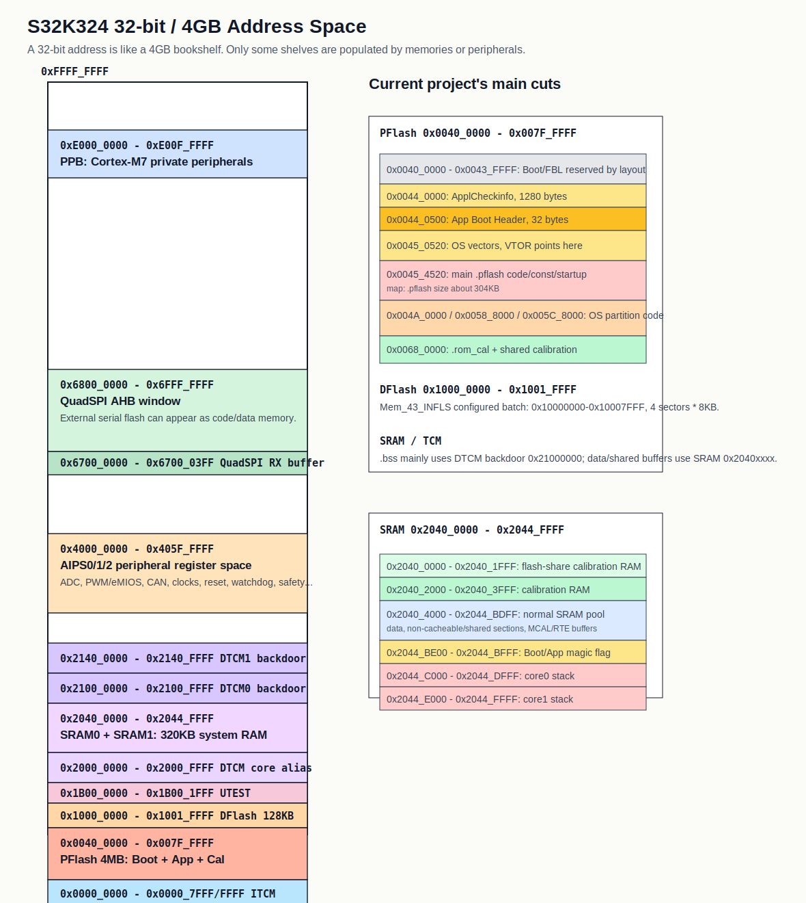
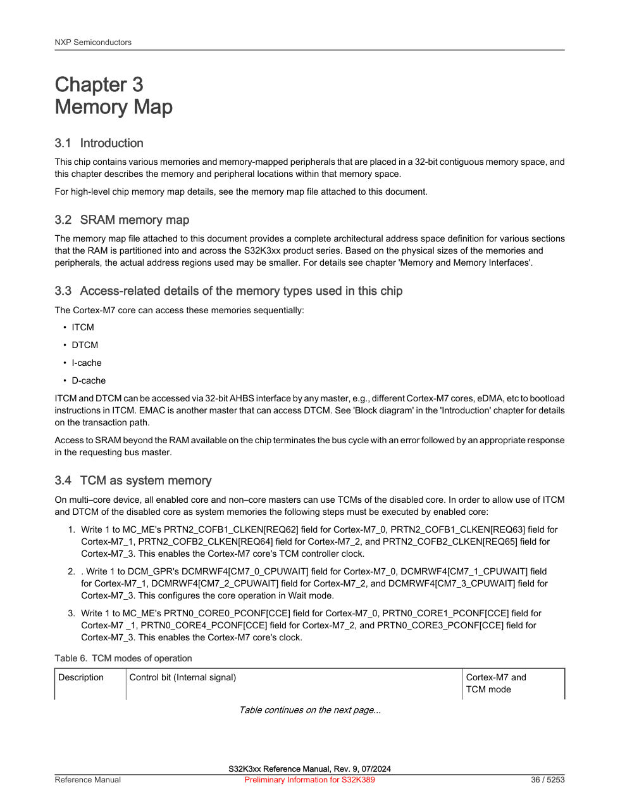
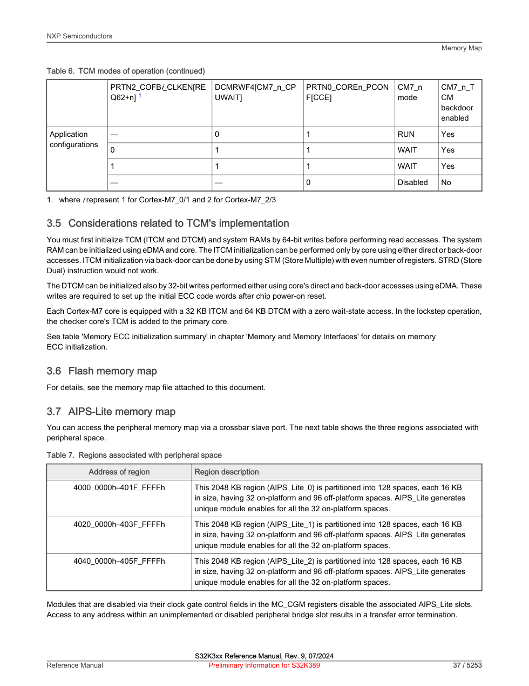
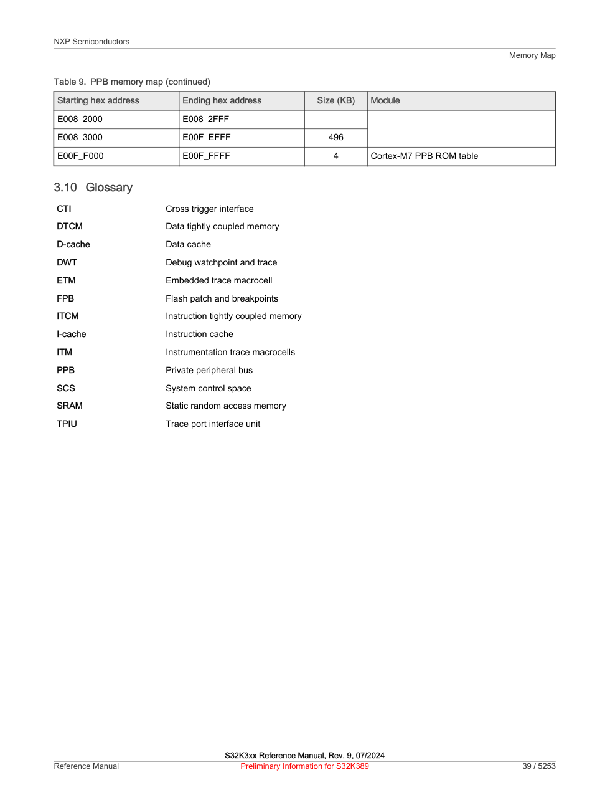

# S32K324 4GB Address Memory Map ????
> ???? S32K324 ? 32-bit / 4GB ??????????????? linker?map?Boot/FBL?Mem_43_INFLS/Fee/NvM ??????
## 0. ???????????
- `S32K3xx Reference Manual.pdf`?`C:/Users/nvtc140/Zotero/storage/GKPNECE2/S32K3xx Reference Manual.pdf`?Rev. 9, 07/2024?? 3 ? `Memory Map`?
- `S32K3xx_memory_map.xlsx`?NXP ????????? `S32K324` ????
- ???? linker?`BasicSoftware/integration/linker/ETAS_BIP_S32KGHS.ld`?`GHS_ARM_shared.ld`?
- ???? map?`output/dbg/D_ECAS_RTA_S32K324GHS_Heating.map`?
- Boot/FBL ????`boot/ASU_Boot_Flash/??/S32K324MemmoryLayout.xlsx`?
- Flash/NvM ???????`BasicSoftware/integration/mcal/src/gen/src/Mem_43_INFLS_Cfg.c`?`BasicSoftware/integration/mcal/src/gen/include/C40_Ip_Cfg.h`?
## 1. ????4GB ?????? 4GB RAM

Cortex-M7 ? 32 ?????????????????? `0x00000000` ? `0xFFFFFFFF`??? 4GB???????????? 4GB ????S32K324 ????? RAM ??? 512KB?ITCM 64KB?DTCM 128KB?System SRAM 320KB???????? Flash???????????/???????? QuadSPI ??????????
??? 4GB ??????????????????????? PFlash?DFlash?SRAM?????????????????? ADC/CAN/??????????????????????????????
??? 3 ??????????? memory ? memory-mapped peripherals ???? 32-bit ?????????? memory map ???? Excel?

## 2. ???????????
### 2.1 SRAM?Static RAM?????????
SRAM ? `static` ?????????????????? DRAM ?????????? SRAM ?????????????? 0/1?DRAM ?????????????????? refresh?
- SRAM ??????????????????? MCU ????????DMA ??????????
- SRAM ???????????????? DRAM ??
- DRAM ????????? PC/SoC ?????
- DRAM ???????????????????????????? MCU ???? RAM?
?? S32K324 ????? SRAM/TCM?????? DRAM????SRAM ??????????????????????????
### 2.2 Flash?????????? RAM ???
PFlash ? DFlash ?????? Flash???????????????????? NvM ???Flash ????????????????????????????????????????? C40 ???? DFlash ???? `8192` ????? `8` ???
### 2.3 TCM?Tightly Coupled Memory???????????
ITCM/DTCM ????? SRAM???????????? SRAM???????? Cortex-M7 ????/????????????????????????????????? cache ?????
S32K324 ?? Cortex-M7?????? `ITCM_0`?`ITCM_1`?`DTCM_0`?`DTCM_1`?Excel ????? TCM ????????????? DTCM ?? `0x20000000`?????????????????????? TCM??????????????? backdoor ???`0x21000000` ?? DTCM0?`0x21400000` ?? DTCM1?
??????TCM ? System RAM ???????? 64-bit ????????? ECC/?????????

### 2.4 AIPS??????????????????
`0x40000000` ??? AIPS ??????? RAM??? `0x400A0000` ? ADC0 ???????????????????? ADC?????????? ADC ??/???
????????????????????? 3 ??????????? read-after-write ?????????????? ISR?????????????????????????????????????????????????????????
### 2.5 Cache/MPU?reset ? non-cacheable????????? cache
Excel ? `Cache mode at Reset` ??? `non-cacheable`?????????????? `BasicSoftware/integration/src/target/src/system.c` ??? MPU?PFlash?DFlash??? SRAM?QuadSPI AHB ???? Normal cacheable?AIPS/PPB/??????? Strongly Ordered / non-cacheable???????????????
## 3. S32K324 4GB ?????????
| ???? | ? | ?? |
|---|---|---|
| `0x00000000-0x0000FFFF` | ITCM local alias | CM7 ?? TCM ?????S32K324 ??? 32KB??????????????????????? TCM? |
| `0x00010000-0x003FFFFF` | Reserved / hole | S32K324 ?????? RAM/Flash??????????????????? |
| `0x00400000-0x007FFFFF` | Program Flash, 4MB | ?? Flash?????? BM/BOOT/App/Header/Vector/Cal ???? 4MB ?? |
| `0x00800000-0x0FFFFFFF` | Reserved for larger derivatives / hole | S32K324 ???? PFlash????????????????? S32K324? |
| `0x10000000-0x1001FFFF` | Data Flash, 128KB implemented | NvM/Fee ??????????? int_dflash ?? 128KB? |
| `0x10020000-0x1003FFFF` | DFlash upper window not implemented on S32K324 | Excel ????? 256KB?? S32K324 ?? 128KB???????? |
| `0x11000000-0x11007FFF` | ITCM0 backdoor | ?????? CM7_0 ITCM ???? |
| `0x11400000-0x11407FFF` | ITCM1 backdoor | ?????? CM7_1 ITCM ???? |
| `0x1B000000-0x1B001FFF` | UTEST Flash, 8KB | ????/?????? Flash???????????????? |
| `0x20000000-0x2000FFFF` | DTCM local alias | ????? DTCM ??????S32K324 ???? 64KB? |
| `0x20400000-0x2044FFFF` | System SRAM, 320KB | SRAM0+SRAM1?CPU/DMA/????????????????????Magic Flag ?????? |
| `0x21000000-0x2100FFFF` | DTCM0 backdoor | ???? .sram_bss ?????????map ??? 0x21000000 ??? |
| `0x21400000-0x2140FFFF` | DTCM1 backdoor | ???? DTCM ?????????? |
| `0x40000000-0x401FFFFF` | AIPS0 | ???????S32K324 ??? ADC/eMIOS/PIT/MU ???? |
| `0x40200000-0x403FFFFF` | AIPS1 | ???????DMA???????CAN?SPI/I2C?FCCU ?????????????? |
| `0x40400000-0x405FFFFF` | AIPS2 | ???????? TCM/eDMA XBIC?EMAC?????/????? |
| `0x40600000-0x66FFFFFF` | Reserved / no AIPS3 on S32K324 | system.c ? AIPS3 MPU ??? S32K39x ???S32K324 ???? |
| `0x67000000-0x670003FF` | QuadSPI RX buffer | QuadSPI ?????????? |
| `0x68000000-0x6FFFFFFF` | QuadSPI AHB, 128MB | ???? Flash ? AHB ????????????? |
| `0x70000000-0xDFFFFFFF` | Reserved / hole | S32K324 memory map ?????????? |
| `0xE0000000-0xE00FFFFF` | Private Peripheral Bus | Arm Cortex-M7 ???????NVIC?SysTick?SCB?DWT??????? |
| `0xE0100000-0xFFFFFFFF` | Reserved / system hole | ??????????? |
## 4. NXP Excel ? S32K324 ??? memory rows
???? NXP `S32K3xx_memory_map.xlsx` ? `Memories` ??? `S32K324` ???????????????????????? TCM ????
| ???? | ???? | ?? | ???? KB | Reset cache | ?? |
|---|---|---|---:|---|---|
| `0x00000000` | `0x0000FFFF` | ITCM_0 | 32 | non-cacheable | Instruction TCM?????? Cortex-M7 ?????? SRAM?????????????????S32K324 ? CM7_0/CM7_1 ???? 32KB???????????? 0x00000000? |
| `0x00000000` | `0x0000FFFF` | ITCM_1 | 32 | non-cacheable | Instruction TCM?????? Cortex-M7 ?????? SRAM?????????????????S32K324 ? CM7_0/CM7_1 ???? 32KB???????????? 0x00000000? |
| `0x00400000` | `0x004FFFFF` | Program flash (Block 0) | 1024 | non-cacheable | PFlash/Code Flash????????????????????????????????????????????????????? RAM ?????? |
| `0x00500000` | `0x005FFFFF` | Program flash (Block 1) | 1024 | non-cacheable | PFlash/Code Flash????????????????????????????????????????????????????? RAM ?????? |
| `0x00600000` | `0x006FFFFF` | Program flash (Block 2) | 1024 | non-cacheable | PFlash/Code Flash????????????????????????????????????????????????????? RAM ?????? |
| `0x00700000` | `0x007FFFFF` | Program flash (Block 3) | 1024 | non-cacheable | PFlash/Code Flash????????????????????????????????????????????????????? RAM ?????? |
| `0x10000000` | `0x1003FFFF` | Data flash (Block 4) | 128 | non-cacheable | DFlash/Data Flash???????? NvM/Fee ? EEPROM emulation????? MCAL ???? 0x10000000-0x10007FFF ? 32KB ????? |
| `0x11000000` | `0x1100FFFF` | ITCM_0 Backdoor | 32 | non-cacheable | ITCM backdoor ??????/eDMA/????????? ITCM ?????????????? 0x00000000?? TCM ?????????? |
| `0x11400000` | `0x1140FFFF` | ITCM_1 Backdoor | 32 | non-cacheable | ITCM backdoor ??????/eDMA/????????? ITCM ?????????????? 0x00000000?? TCM ?????????? |
| `0x1B000000` | `0x1B001FFF` | UTEST (Block 0) | 8 | non-cacheable | UTEST ?????/???? flash ?????????????????????????????? |
| `0x20000000` | `0x2001FFFF` | DTCM_0 | 64 | non-cacheable | Data TCM????? SRAM???? Cortex-M7 ?? TCM ????????????????????/????????????????? |
| `0x20000000` | `0x2001FFFF` | DTCM_1 | 64 | non-cacheable | Data TCM????? SRAM???? Cortex-M7 ?? TCM ????????????????????/????????????????? |
| `0x20400000` | `0x20427FFF` | SRAM0 | 160 | non-cacheable | System SRAM??? RAM???????????? AXBS/PRAMC ? CPU?DMA??????S32K324 ? SRAM0+SRAM1 ?? 320KB? |
| `0x20428000` | `0x2044FFFF` | SRAM1 | 160 | non-cacheable | System SRAM??? RAM???????????? AXBS/PRAMC ? CPU?DMA??????S32K324 ? SRAM0+SRAM1 ?? 320KB? |
| `0x21000000` | `0x2101FFFF` | DTCM_0 Backdoor | 64 | non-cacheable | DTCM backdoor ??????????? DTCM ??????????? .bss ?? 0x21000000 ?? DTCM0 backdoor ?? |
| `0x21400000` | `0x2141FFFF` | DTCM_1 Backdoor | 64 | non-cacheable | DTCM backdoor ??????????? DTCM ??????????? .bss ?? 0x21000000 ?? DTCM0 backdoor ?? |
| `0x40000000` | `0x401FFFFF` | AIPS0 | 2048 | non-cacheable | AIPS ??????????????????? ADC/CAN/??/?????????????????????????? |
| `0x40200000` | `0x403FFFFF` | AIPS1 | 2048 | non-cacheable | AIPS ??????????????????? ADC/CAN/??/?????????????????????????? |
| `0x40400000` | `0x405FFFFF` | AIPS2 | 2048 | non-cacheable | AIPS ??????????????????? ADC/CAN/??/?????????????????????????? |
| `0x67000000` | `0x670003FF` | QuadSPI Rx buffer | 1 | non-cacheable | QuadSPI ??????????? Flash ?????????? |
| `0x68000000` | `0x6FFFFFFF` | QuadSPI AHB  (virtual code & data) | 131072 | non-cacheable | QuadSPI AHB ????????? Flash ????????????????????? |
| `0xE0000000` | `0xE00FFFFF` | Private Peripheral Bus | 1024 | non-cacheable | PPB ? Arm Cortex-M7 ???????? NVIC?SysTick?SCB???/?????????????? |
## 5. ???? linker/map ?????????
??????????????????????????????? `.map` ????????
| ???/?? | ???? | ?? | ??????? |
|---|---|---|---|
| `BM` | `0x00400000-0x00409FFF` | Boot ? S32K324MemmoryLayout.xlsx | Boot manager/boot marker ???? |
| `BOOT` | `0x0040A000-0x0043BFFF` | Boot ? | FBL/Boot ????? |
| `APP & CAL PresentMark` | `0x0043C000-0x0043FFFF` | Boot ? | ????????? 16KB? |
| `int_ApplCheckinfo` | `0x00440000-0x004404FF` | ETAS_BIP_S32KGHS.ld | ?? 1280B??? map ? .ApplCheckinfo ??? 0?ApplCheckinfotestFlag ???? SRAM?????????? |
| `int_ApplBmHeader` | `0x00440500-0x0044051F` | ETAS_BIP_S32KGHS.ld + map | App Boot Header?g_stApplBmHdrHeader ?? 32B??? magic????? 0x00440000??? 0x00240000??? _start? |
| `int_flash_rsvd` | `0x00440520-0x0045051F` | ETAS_BIP_S32KGHS.ld | ?? 64KB ????????????????????? |
| `int_os_vectors` | `0x00450520-0x0045451F` | ETAS_BIP_S32KGHS.ld + map | ???????map ? .os_vectors_0 ??? 2048 ??? 0x00450800?__CORE0_VTOR/__CORE1_VTOR ????? |
| `int_flash` | `0x00454520-0x0049FFFF` | ETAS_BIP_S32KGHS.ld + map | ??? .pflash?startup/text/rodata/MCAL ????map ????? 304KB? |
| `int_flash_sys` | `0x004A0000-0x00587FFF` | ETAS_BIP_S32KGHS.ld | SysOsApp/????????? |
| `int_flash_can` | `0x00588000-0x005C7FFF` | ETAS_BIP_S32KGHS.ld | CanOsApp ???????????? 64KB?? LENGTH=0x40000 ? 256KB? |
| `int_flash_shareable` | `0x005C8000-0x0067FFFF` | ETAS_BIP_S32KGHS.ld + map | shared_RTE_CODE ???????map ? .shared_code ? 0x005C8000 ??? |
| `int_flash_calib` | `0x00680000-0x00681FFF` | ETAS_BIP_S32KGHS.ld + map | ?? Flash??????? 512KB ?? 8KB?.rom_cal ? .shared_calib ?????? |
| `int_dflash` | `0x10000000-0x1001FFFF` | ETAS_BIP_S32KGHS.ld | DFlash 128KB?Mem_43_INFLS ?????? 32KB ? DFLASH sector batch? |
| `int_flash_share_calib` | `0x20400000-0x20401FFF` | ETAS_BIP_S32KGHS.ld | ????/???? RAM 8KB? |
| `int_calibram` | `0x20402000-0x20403FFF` | ETAS_BIP_S32KGHS.ld | ?? RAM 8KB? |
| `int_sram` | `0x20404000-0x2044BDFF` | ETAS_BIP_S32KGHS.ld + map | ?? SRAM ??? .data?non-cache/shared?RTE/MCAL ???? |
| `int_Magic_Flag` | `0x2044BE00-0x2044BFFF` | ETAS_BIP_S32KGHS.ld + map | Boot/App ?? RAM magic flag?au8BmMagicFlag ??? 0x2044BE00?8B? |
| `int_sram_stack_c0` | `0x2044C000-0x2044DFFF` | ETAS_BIP_S32KGHS.ld | Core0 ? 8KB? |
| `int_sram_stack_c1` | `0x2044E000-0x2044FFFF` | ETAS_BIP_S32KGHS.ld | Core1 ? 8KB? |
| `int_dtcm0_bd` | `0x21000000-0x2100FFFF` | ETAS_BIP_S32KGHS.ld + map | .sram_bss ?????????????????? |
### 5.1 App Boot Header ????? 0x00440500
`ECU/AppBootIntegration/ApplBmHdr_Cfg.c` ?? `g_stApplBmHdrHeader` ?? `#pragma ghs section rodata=".APPLBMHEADER_HEADER"` ?? linker ? `.ApplBmHeader`?map ???? `0x00440500-0x0044051F`?????magic?App ???? `0x00440000`??? `0x00240000`??? `_start`??????Boot/FBL ???????????????????? App?????????
### 5.2 Magic Flag ???? SRAM ??
`au8BmMagicFlag` ??? `0x2044BE00`??? RAM ???? Flash ??????? App ? Boot ????????????????????????? SRAM ??????????????????? linker ???? 512B???????????????????? RAM flag ????
### 5.3 ???????? Flash ?? RAM
`.rom_cal` ? `.shared_calib` ? `0x00680000` ??? PFlash ????`int_flash_share_calib` ? `int_calibram` ? `0x20400000` ??? SRAM?Flash ?????????????RAM ???????XCP/??????????? linker ? 512KB ?? Flash ??????????? 8KB?`int_flash_calib : ORIGIN = 0x00680000, LENGTH = 0x00002000`?
### 5.4 DFlash/NvM/Fee ?????? 32KB
S32K324 DFlash ?? 128KB?`C40_Ip_Cfg.h` ??? `C40_IP_DATA_BLOCK_END_ADDR = 0x1001FFFF`??? `Mem_43_INFLS_Cfg.c` ?? sector batch ? `StartAddress=268435456` ? `EndAddress=268468223`???? `0x10000000-0x10007FFF`?4 ? 8KB sector?? 32KB????? NvM/Fee ????? DFlash ??????? DFlash ???? NvM ???
### 5.5 ????????????ApplCheckinfo ?????? Flash
linker ???? `*(.ApplCheckinfo)`?? `ECU/User_Memmap/ApplCheckinfo/ApplCheckinfoMemMap.h` ????? `#pragma ghs section rodata=".ApplCheckinfoData"`??? stop ????????? `ApplCheckinfo_START_SEC_VAR_NOINIT`??? map ?? `.ApplCheckinfo` ??? 0?`ApplCheckinfotestFlag` ??? `0x20404F76` ? SRAM `.data`?????????????/???????????????? STOP ??
## 6. ??????????
| ?? | ??????? | ???????? |
|---|---|---|
| ??? ITCM | Arm/MCU ????????????????????????????????????????? | ? `.itcm_text`?`__INT_ITCM_START`??????????? ITCM? |
| 0x00400000 PFlash | Flash ???????? TCM???? Boot/FBL/App ????????? XIP ??? | ? `ETAS_BIP_S32KGHS.ld` ? `int_flash*` ? map ? `.pflash`? |
| 0x10000000 DFlash | ? EEPROM emulation ????? Flash ????? NvM ????????? | ? `Mem_43_INFLS_Cfg.c` ? DFLASH sector batch? |
| 0x20000000 DTCM | ????????????? RAM??? `.bss`???????? | ?? `.sram_bss` ??? DTCM0 backdoor `0x21000000`? |
| 0x20400000 System SRAM | ? CPU/DMA/?????? RAM ???????RTE?MCAL?????? | ? `.sram_data`?`.shared_cleared`?`.non_cacheable_*`? |
| 0x40000000 AIPS | ???????????????????????????????? | ? `S32K324_*.h` ? `IP_xxx_BASE`? |
| 0x68000000 QuadSPI AHB | ???? Flash ?????????????????????? | ? QuadSPI ???????? Flash ??? |
| 0xE0000000 PPB | Arm Cortex-M ????????????? NVIC/SysTick/SCB/????? | ? `S32K324_SCB.h`?`S32K324_SYSTICK.h`?`S32K324_NVIC.h`? |
## 7. AIPS ??????????S32K324 ???
????? `S32K3xx_memory_map.xlsx` ? `Peripherals` ??????????? 16KB slot?slot ????????????????? RAM?`Register protection=YES` ???????????/??????`IPS/PDAC slot` ??????XRDC/????????
### AIPS0
| ???? | Instance | ???? | RegProt | IPS/PDAC | ??/?????? |
|---|---|---|---|---|---|
| `0x40080000-0x40083FFF` | TRGMUX | Trigger Multiplexing Control | - | 0/32 | ???????????????????????/PWM/ADC/BCTU ??????????? MCAL ??? Trgmux ??? |
| `0x40084000-0x40087FFF` | BCTU | Body Cross Triggering Unit | - | 1/33 | ADC ????????? PWM/???????? ADC ??????? ADC/BCTU MCAL ? Cdd_Adc ??? |
| `0x40088000-0x4008BFFF` | eMIOS0 | eMIOS 0 | - | 2/34 | ?????/PWM/?????????? PWM ????/??????????????? Pwm/eMIOS MCAL? |
| `0x4008C000-0x4008FFFF` | eMIOS1 | eMIOS 1 | - | 3/35 | ?????/PWM/?????????? PWM ????/??????????????? Pwm/eMIOS MCAL? |
| `0x40090000-0x40093FFF` | eMIOS2 | eMIOS 2 | - | 4/36 | ?????/PWM/?????????? PWM ????/??????????????? Pwm/eMIOS MCAL? |
| `0x40098000-0x4009BFFF` | LCU0 | Logic Control Unit 0 | - | 6/38 | ??????????????????????? CPU ??????? PWM/????? |
| `0x4009C000-0x4009FFFF` | LCU1 | Logic Control Unit 1 | - | 7/39 | ??????????????????????? CPU ??????? PWM/????? |
| `0x400A0000-0x400A3FFF` | ADC 0 | Analog-to-digital converter 0 | - | 8/40 | ???? ADC ????????????????? Cdd_Adc/AnalogSigRoute ?? ADC ??? |
| `0x400A4000-0x400A7FFF` | ADC 1 | Analog-to-digital converter 1 | - | 9/41 | ???? ADC ????????????????? Cdd_Adc/AnalogSigRoute ?? ADC ??? |
| `0x400A8000-0x400ABFFF` | ADC 2 | Analog-to-digital converter 2 | - | 10/42 | ???? ADC ????????????????? Cdd_Adc/AnalogSigRoute ?? ADC ??? |
| `0x400B0000-0x400B3FFF` | PIT0 | Programmable Interrupt Timer 0 | - | 12/44 | ??????????? GPT/????????????????? Pit/Gpt? |
| `0x400B4000-0x400B7FFF` | PIT1 | Programmable Interrupt Timer 1 | - | 13/45 | ??????????? GPT/????????????????? Pit/Gpt? |
| `0x400B8000-0x400BBFFF` | MU_2 | MU_2_MUA | - | 14/46 | Messaging Unit?????? HSE/???????????????/?????????? |
| `0x400BC000-0x400BFFFF` | MU_2 | MU_2_MUB | - | 15/47 | Messaging Unit?????? HSE/???????????????/?????????? |
### AIPS1
| ???? | Instance | ???? | RegProt | IPS/PDAC | ??/?????? |
|---|---|---|---|---|---|
| `0x40200000-0x40203FFF` | AXBS | System crossbar switch | YES | 0/128 | ??????/??????? CPU?DMA?Flash?SRAM?????????????????? |
| `0x40204000-0x40207FFF` | System_XBIC | Crossbar Integrity Checker (System AXBS / AXBS Lite) | YES | 1/129 | Crossbar Integrity Checker??????/????????? SafeTpack/eMcem ?? XBIC ????? |
| `0x40208000-0x4020BFFF` | Periph_XBIC | Crossbar Integrity Checker (Peripheral AXBS-Lite) | YES | 2/130 | Crossbar Integrity Checker??????/????????? SafeTpack/eMcem ?? XBIC ????? |
| `0x4020C000-0x4020FFFF` | eDMA | eDMA control & status (MP_CSR; MP_ES; MP_HRS) | YES | 3/131 | DMA ???? DMA ???????????? CPU ??????? Mcl/Dma MCAL ?????? |
| `0x40210000-0x40213FFF` | eDMA TCD 0 | eDMA transfer control descriptor 0 | YES | 4/132 | DMA ???? DMA ???????????? CPU ??????? Mcl/Dma MCAL ?????? |
| `0x40214000-0x40217FFF` | eDMA TCD 1 | eDMA transfer control descriptor 1 | YES | 5/133 | DMA ???? DMA ???????????? CPU ??????? Mcl/Dma MCAL ?????? |
| `0x40218000-0x4021BFFF` | eDMA TCD 2 | eDMA transfer control descriptor 2 | YES | 6/134 | DMA ???? DMA ???????????? CPU ??????? Mcl/Dma MCAL ?????? |
| `0x4021C000-0x4021FFFF` | eDMA TCD 3 | eDMA transfer control descriptor 3 | YES | 7/135 | DMA ???? DMA ???????????? CPU ??????? Mcl/Dma MCAL ?????? |
| `0x40220000-0x40223FFF` | eDMA TCD 4 | eDMA transfer control descriptor 4 | YES | 8/136 | DMA ???? DMA ???????????? CPU ??????? Mcl/Dma MCAL ?????? |
| `0x40224000-0x40227FFF` | eDMA TCD 5 | eDMA transfer control descriptor 5 | YES | 9/137 | DMA ???? DMA ???????????? CPU ??????? Mcl/Dma MCAL ?????? |
| `0x40228000-0x4022BFFF` | eDMA TCD 6 | eDMA transfer control descriptor 6 | YES | 10/138 | DMA ???? DMA ???????????? CPU ??????? Mcl/Dma MCAL ?????? |
| `0x4022C000-0x4022FFFF` | eDMA TCD 7 | eDMA transfer control descriptor 7 | YES | 11/139 | DMA ???? DMA ???????????? CPU ??????? Mcl/Dma MCAL ?????? |
| `0x40230000-0x40233FFF` | eDMA TCD 8 | eDMA transfer control descriptor 8 | YES | 12/140 | DMA ???? DMA ???????????? CPU ??????? Mcl/Dma MCAL ?????? |
| `0x40234000-0x40237FFF` | eDMA TCD 9 | eDMA transfer control descriptor 9 | YES | 13/141 | DMA ???? DMA ???????????? CPU ??????? Mcl/Dma MCAL ?????? |
| `0x40238000-0x4023BFFF` | eDMA TCD 10 | eDMA transfer control descriptor 10 | YES | 14/142 | DMA ???? DMA ???????????? CPU ??????? Mcl/Dma MCAL ?????? |
| `0x4023C000-0x4023FFFF` | eDMA TCD 11 | eDMA transfer control descriptor 11 | YES | 15/143 | DMA ???? DMA ???????????? CPU ??????? Mcl/Dma MCAL ?????? |
| `0x40240000-0x40243FFF` | Debug APB Page0 | Debug APB Page0 | - | 16/149 | ?????????????????/????????????????? |
| `0x40244000-0x40247FFF` | Debug APB Page1 | Debug APB Page1 | - | 17/149 | ?????????????????/????????????????? |
| `0x40248000-0x4024BFFF` | Debug APB Page2 | Debug APB Page2 | - | 18/149 | ?????????????????/????????????????? |
| `0x4024C000-0x4024FFFF` | Debug APB Page3 | Debug APB Page3 | - | 19/149 | ?????????????????/????????????????? |
| `0x40250000-0x40253FFF` | Debug APB Paged Area | Debug APB Paged Area | - | 20/149 | ?????????????????/????????????????? |
| `0x40254000-0x40257FFF` | SDA-AP | SDA-AP | - | 21/149 | ?????????????????/????????????????? |
| `0x40258000-0x4025BFFF` | EIM0 | EIM0 | - | 22/150 | Error Injection Module??????????????????? SafeTpack/eMcem ??? |
| `0x4025C000-0x4025FFFF` | ERM0 | ERM0 | - | 23/151 | Error Reporting Module??? ECC/?????????? eMcem/???????? |
| `0x40260000-0x40263FFF` | MSCM | MSCM | - | 24/152 | ??????????????????????? |
| `0x40264000-0x40267FFF` | PRAM 0 | RAM controller 0 | YES | 25/153 | SRAM ?????? RAM ????ECC/?????????? TCM/SRAM ???? 64-bit ????? |
| `0x40268000-0x4026BFFF` | PFC | Flash controller | YES | 26/154 | Flash ??/???????? Mem_43_INFLS/Pflash_Ip/C40 ?????? DFlash? |
| `0x4026C000-0x4026FFFF` | PFC alt | Flash controller alternate | - | 27/155 | Flash ??/???????? Mem_43_INFLS/Pflash_Ip/C40 ?????? DFlash? |
| `0x40270000-0x40273FFF` | SWT 0 | Software Watchdog 0 | - | 28/156 | ??????????? Wdg/WdgMUT/WdgM ??? |
| `0x40274000-0x40277FFF` | STM 0 | System Timer Module 0 | YES | 29/157 | ??????????????? OS/GPT ?????? ECU/Time.c ?? STM ????? |
| `0x40278000-0x4027BFFF` | XRDC | XRDC | - | 30/158 | ??????????????/????????????? |
| `0x4027C000-0x4027FFFF` | INTM | Interrupt Monitor | - | 31/159 | ???????????????/????????? |
| `0x40280000-0x40283FFF` | DMAMUX 0 | DMA Channel Multiplexer 0 | YES | 0/160 | DMA ???? DMA ???????????? CPU ??????? Mcl/Dma MCAL ?????? |
| `0x40284000-0x40287FFF` | DMAMUX 1 | DMA Channel Multiplexer 1 | YES | 1/161 | DMA ???? DMA ???????????? CPU ??????? Mcl/Dma MCAL ?????? |
| `0x40288000-0x4028BFFF` | RTC | Real-time clock | - | 2/162 | ????????????????? RTC CDD???? RTC/GPT ?????????? |
| `0x4028C000-0x4028FFFF` | MC_RGM | Reset Generation Module | YES | 3/163 | ????????????????????? Diag_McuResetReason/Diag_McuAbnormalReset ?????? |
| `0x40290000-0x40293FFF` | SIUL_VIRTWRAPPER_PDAC0_HSE | SIUL_VIRTWRAPPER_PDAC0 | - | 4/164 | SIUL2/???????? GPIO??????????????? Port/Dio/Valve_Dio ??????? |
| `0x40294000-0x40297FFF` | SIUL_VIRTWRAPPER_PDAC0_HSE | SIUL_VIRTWRAPPER_PDAC0 | - | 5/165 | SIUL2/???????? GPIO??????????????? Port/Dio/Valve_Dio ??????? |
| `0x40298000-0x4029BFFF` | SIUL_VIRTWRAPPER_PDAC1_M7_0 | SIUL_VIRTWRAPPER_PDAC1 | - | 6/166 | SIUL2/???????? GPIO??????????????? Port/Dio/Valve_Dio ??????? |
| `0x4029C000-0x4029FFFF` | SIUL_VIRTWRAPPER_PDAC1_M7_0 | SIUL_VIRTWRAPPER_PDAC1 | - | 7/167 | SIUL2/???????? GPIO??????????????? Port/Dio/Valve_Dio ??????? |
| `0x402A0000-0x402A3FFF` | SIUL_VIRTWRAPPER_PDAC2_M7_1 | SIUL_VIRTWRAPPER_PDAC2 | - | 8/168 | SIUL2/???????? GPIO??????????????? Port/Dio/Valve_Dio ??????? |
| `0x402A4000-0x402A7FFF` | SIUL_VIRTWRAPPER_PDAC2_M7_1 | SIUL_VIRTWRAPPER_PDAC2 | - | 9/169 | SIUL2/???????? GPIO??????????????? Port/Dio/Valve_Dio ??????? |
| `0x402A8000-0x402ABFFF` | SIUL_VIRTWRAPPER_PDAC3 | SIUL_VIRTWRAPPER_PDAC3 | - | 10/170 | SIUL2/???????? GPIO??????????????? Port/Dio/Valve_Dio ??????? |
| `0x402AC000-0x402AFFFF` | DCM | System Status and Configuration Module | YES | 11/171 | Device Configuration Module?????/?????????? DCM ????? |
| `0x402B4000-0x402B7FFF` | WKPU | Wakeup Unit | - | 13/173 | ?????????????/????? |
| `0x402BC000-0x402BFFFF` | CMU | CMU 0-5 | YES | 15/175 | ????????????????????? SafeTpack/Clk_Mon ??? |
| `0x402C4000-0x402C7FFF` | TSPC | Touch Sensing Coupling Controller | - | 17/177 | ??/???????????????????? |
| `0x402C8000-0x402CBFFF` | SIRC | 32 kHz Slow Internal RC Oscillator | - | 18/178 | ??/??/????????????? Mcu/Clock/Power ??????????? |
| `0x402CC000-0x402CFFFF` | SXOSC | 32 kHz Slow External Crystal Oscillator | - | 19/179 | ??/??/????????????? Mcu/Clock/Power ??????????? |
| `0x402D0000-0x402D3FFF` | FIRC | 48 MHz Fast Internal RC Oscillator | - | 20/180 | ??/??/????????????? Mcu/Clock/Power ??????????? |
| `0x402D4000-0x402D7FFF` | FXOSC | 8-40 MHz Fast External Crystal Oscillator | YES | 21/181 | ??/??/????????????? Mcu/Clock/Power ??????????? |
| `0x402D8000-0x402DBFFF` | MC_CGM | Clock Generation Module | YES | 22/182 | ??/??/????????????? Mcu/Clock/Power ??????????? |
| `0x402DC000-0x402DFFFF` | MC_ME | Mode Entry Module | YES | 23/183 | ??/??/????????????? Mcu/Clock/Power ??????????? |
| `0x402E0000-0x402E3FFF` | PLL | Frequency Modulated Phase-Locked Loop | YES | 24/184 | ??/??/????????????? Mcu/Clock/Power ??????????? |
| `0x402E8000-0x402EBFFF` | PMC | Power management controller | YES | 26/186 | ??/??/????????????? Mcu/Clock/Power ??????????? |
| `0x402EC000-0x402EFFFF` | FMU | Flash memory | YES | 27/187 | Flash ??/???????? Mem_43_INFLS/Pflash_Ip/C40 ?????? DFlash? |
| `0x402F0000-0x402F3FFF` | FMU alt | Flash memory alternate | - | 28/188 | Flash ??/???????? Mem_43_INFLS/Pflash_Ip/C40 ?????? DFlash? |
| `0x402FC000-0x402FFFFF` | PIT2 | Programmable Interrupt Timer 2 | - | 31/191 | ??????????? GPT/????????????????? Pit/Gpt? |
| `0x40304000-0x40307FFF` | FlexCAN 0 | FlexCAN 0 | - | 33/193 | CAN/CAN FD ?????? Can/CanIf/CanSM/CanTp/Com/Dcm ??? CAN ??? |
| `0x40308000-0x4030BFFF` | FlexCAN 1 | FlexCAN 1 | - | 34/194 | CAN/CAN FD ?????? Can/CanIf/CanSM/CanTp/Com/Dcm ??? CAN ??? |
| `0x4030C000-0x4030FFFF` | FlexCAN 2 | FlexCAN 2 | - | 35/195 | CAN/CAN FD ?????? Can/CanIf/CanSM/CanTp/Com/Dcm ??? CAN ??? |
| `0x40310000-0x40313FFF` | FlexCAN 3 | FlexCAN 3 | - | 36/196 | CAN/CAN FD ?????? Can/CanIf/CanSM/CanTp/Com/Dcm ??? CAN ??? |
| `0x40314000-0x40317FFF` | FlexCAN 4 | FlexCAN 4 | - | 37/197 | CAN/CAN FD ?????? Can/CanIf/CanSM/CanTp/Com/Dcm ??? CAN ??? |
| `0x40318000-0x4031BFFF` | FlexCAN 5 | FlexCAN 5 | - | 38/198 | CAN/CAN FD ?????? Can/CanIf/CanSM/CanTp/Com/Dcm ??? CAN ??? |
| `0x40324000-0x40327FFF` | FlexIO | Flexible IO | - | 41/201 | ?? IO ??????????/???????????? FlexIO ?? MCAL? |
| `0x40328000-0x4032BFFF` | LPUART 0 | Low Power UART 0 | - | 42/202 | ??? UART ???????????????????????????? |
| `0x4032C000-0x4032FFFF` | LPUART 1 | Low Power UART 1 | - | 43/203 | ??? UART ???????????????????????????? |
| `0x40330000-0x40333FFF` | LPUART 2 | Low Power UART 2 | - | 44/204 | ??? UART ???????????????????????????? |
| `0x40334000-0x40337FFF` | LPUART 3 | Low Power UART 3 | - | 45/205 | ??? UART ???????????????????????????? |
| `0x40338000-0x4033BFFF` | LPUART 4 | Low Power UART 4 | - | 46/206 | ??? UART ???????????????????????????? |
| `0x4033C000-0x4033FFFF` | LPUART 5 | Low Power UART 5 | - | 47/207 | ??? UART ???????????????????????????? |
| `0x40340000-0x40343FFF` | LPUART 6 | Low Power UART 6 | - | 48/208 | ??? UART ???????????????????????????? |
| `0x40344000-0x40347FFF` | LPUART 7 | Low Power UART 7 | - | 49/209 | ??? UART ???????????????????????????? |
| `0x40350000-0x40353FFF` | LPI2C 0 | Low Power I2C 0 | - | 52/212 | I2C ?????? CDD_RTC/RSM_IIC ?????????? I2C? |
| `0x40354000-0x40357FFF` | LPI2C 1 | Low Power I2C 1 | - | 53/213 | I2C ?????? CDD_RTC/RSM_IIC ?????????? I2C? |
| `0x40358000-0x4035BFFF` | LPSPI 0 | Low Power SPI 0 | - | 54/214 | SPI ?????? BE13????/SBC ???????? SPI? |
| `0x4035C000-0x4035FFFF` | LPSPI 1 | Low Power SPI 1 | - | 55/215 | SPI ?????? BE13????/SBC ???????? SPI? |
| `0x40360000-0x40363FFF` | LPSPI 2 | Low Power SPI 2 | - | 56/216 | SPI ?????? BE13????/SBC ???????? SPI? |
| `0x40364000-0x40367FFF` | LPSPI 3 | Low Power SPI 3 | - | 57/217 | SPI ?????? BE13????/SBC ???????? SPI? |
| `0x4036C000-0x4036FFFF` | SAI0 | Synchronous Audio Interface 0 | - | 59/219 | ??????????????????? |
| `0x40370000-0x40373FFF` | LPCMP 0 | Low Power Comparator 0 | - | 60/220 | ???????????????????????? |
| `0x40374000-0x40377FFF` | LPCMP 1 | Low Power Comparator 1 | - | 61/221 | ???????????????????????? |
| `0x4037C000-0x4037FFFF` | TMU | TMU Temperature Sensor Unit | - | 63/223 | ??????????????????????????? RAM ??? |
| `0x40380000-0x40383FFF` | CRC | CRC | YES | 64/224 | ?? CRC ???????? Crc BSW ? Lib_CRC? |
| `0x40384000-0x40387FFF` | FCCU | FCCU (+FOSU) | - | 65/225 | Fault Collection and Control Unit??????????????? SafetyMgr/eMcem ??? |
| `0x4038C000-0x4038FFFF` | MU_0 | MU_0_MUB | - | 67/227 | Messaging Unit?????? HSE/???????????????/?????????? |
| `0x40394000-0x40397FFF` | JDC | JDC (JTAG Data Communication) | - | 69/229 | JTAG/debug ??????????????????? |
| `0x4039C000-0x4039FFFF` | CONFIGURATION_GPR | Configuration GPR | - | 71/231 | ????/????????????????? |
| `0x403A0000-0x403A3FFF` | STCU | Self-Test Control Unit | - | 72/232 | Self-Test Control Unit???/??????????? Bist/SCST/SafeTpack ??? |
| `0x403B0000-0x403B3FFF` | SELFTEST_GPR | Selftest GPR | - | 76/236 | ????/????????????????? |
### AIPS2
| ???? | Instance | ???? | RegProt | IPS/PDAC | ??/?????? |
|---|---|---|---|---|---|
| `0x40400000-0x40403FFF` | TCM_XBIC | Crossbar Integrity Checker (TCM backdoor AHB Splitter) | YES | 0/256 | Crossbar Integrity Checker??????/????????? SafeTpack/eMcem ?? XBIC ????? |
| `0x40404000-0x40407FFF` | eDMA_XBIC | Crossbar Integrity Checker (eDMA & STAM AXBS-Lite) | YES | 1/257 | Crossbar Integrity Checker??????/????????? SafeTpack/eMcem ?? XBIC ????? |
| `0x40410000-0x40413FFF` | eDMA TCD 12 | eDMA transfer control descriptor 12 | YES | 4/260 | DMA ???? DMA ???????????? CPU ??????? Mcl/Dma MCAL ?????? |
| `0x40414000-0x40417FFF` | eDMA TCD 13 | eDMA transfer control descriptor 13 | YES | 5/261 | DMA ???? DMA ???????????? CPU ??????? Mcl/Dma MCAL ?????? |
| `0x40418000-0x4041BFFF` | eDMA TCD 14 | eDMA transfer control descriptor 14 | YES | 6/262 | DMA ???? DMA ???????????? CPU ??????? Mcl/Dma MCAL ?????? |
| `0x4041C000-0x4041FFFF` | eDMA TCD 15 | eDMA transfer control descriptor 15 | YES | 7/263 | DMA ???? DMA ???????????? CPU ??????? Mcl/Dma MCAL ?????? |
| `0x40420000-0x40423FFF` | eDMA TCD 16 | eDMA transfer control descriptor 16 | YES | 8/264 | DMA ???? DMA ???????????? CPU ??????? Mcl/Dma MCAL ?????? |
| `0x40424000-0x40427FFF` | eDMA TCD 17 | eDMA transfer control descriptor 17 | YES | 9/265 | DMA ???? DMA ???????????? CPU ??????? Mcl/Dma MCAL ?????? |
| `0x40428000-0x4042BFFF` | eDMA TCD 18 | eDMA transfer control descriptor 18 | YES | 10/266 | DMA ???? DMA ???????????? CPU ??????? Mcl/Dma MCAL ?????? |
| `0x4042C000-0x4042FFFF` | eDMA TCD 19 | eDMA transfer control descriptor 19 | YES | 11/267 | DMA ???? DMA ???????????? CPU ??????? Mcl/Dma MCAL ?????? |
| `0x40430000-0x40433FFF` | eDMA TCD 20 | eDMA transfer control descriptor 20 | YES | 12/268 | DMA ???? DMA ???????????? CPU ??????? Mcl/Dma MCAL ?????? |
| `0x40434000-0x40437FFF` | eDMA TCD 21 | eDMA transfer control descriptor 21 | YES | 13/269 | DMA ???? DMA ???????????? CPU ??????? Mcl/Dma MCAL ?????? |
| `0x40438000-0x4043BFFF` | eDMA TCD 22 | eDMA transfer control descriptor 22 | YES | 14/270 | DMA ???? DMA ???????????? CPU ??????? Mcl/Dma MCAL ?????? |
| `0x4043C000-0x4043FFFF` | eDMA TCD 23 | eDMA transfer control descriptor 23 | YES | 15/271 | DMA ???? DMA ???????????? CPU ??????? Mcl/Dma MCAL ?????? |
| `0x40440000-0x40443FFF` | eDMA TCD 24 | eDMA transfer control descriptor 24 | YES | 16/272 | DMA ???? DMA ???????????? CPU ??????? Mcl/Dma MCAL ?????? |
| `0x40444000-0x40447FFF` | eDMA TCD 25 | eDMA transfer control descriptor 25 | YES | 17/273 | DMA ???? DMA ???????????? CPU ??????? Mcl/Dma MCAL ?????? |
| `0x40448000-0x4044BFFF` | eDMA TCD 26 | eDMA transfer control descriptor 26 | YES | 18/274 | DMA ???? DMA ???????????? CPU ??????? Mcl/Dma MCAL ?????? |
| `0x4044C000-0x4044FFFF` | eDMA TCD 27 | eDMA transfer control descriptor 27 | YES | 19/275 | DMA ???? DMA ???????????? CPU ??????? Mcl/Dma MCAL ?????? |
| `0x40450000-0x40453FFF` | eDMA TCD 28 | eDMA transfer control descriptor 28 | YES | 20/276 | DMA ???? DMA ???????????? CPU ??????? Mcl/Dma MCAL ?????? |
| `0x40454000-0x40457FFF` | eDMA TCD 29 | eDMA transfer control descriptor 29 | YES | 21/277 | DMA ???? DMA ???????????? CPU ??????? Mcl/Dma MCAL ?????? |
| `0x40458000-0x4045BFFF` | eDMA TCD 30 | eDMA transfer control descriptor 30 | YES | 22/278 | DMA ???? DMA ???????????? CPU ??????? Mcl/Dma MCAL ?????? |
| `0x4045C000-0x4045FFFF` | eDMA TCD 31 | eDMA transfer control descriptor 31 | YES | 23/279 | DMA ???? DMA ???????????? CPU ??????? Mcl/Dma MCAL ?????? |
| `0x40460000-0x40463FFF` | SEMA42 | Semaphores2 | - | 24/280 | ???????????????????? |
| `0x40464000-0x40467FFF` | PRAM 1 | RAM controller 1 | YES | 25/281 | SRAM ?????? RAM ????ECC/?????????? TCM/SRAM ???? 64-bit ????? |
| `0x4046C000-0x4046FFFF` | SWT 1 | Software Watchdog 1 | - | 27/283 | ??????????? Wdg/WdgMUT/WdgM ??? |
| `0x40474000-0x40477FFF` | STM 1 | System Timer Module 1 | YES | 29/285 | ??????????????? OS/GPT ?????? ECU/Time.c ?? STM ????? |
| `0x40480000-0x40483FFF` | EMAC | EMAC | - | 0/288 | ??? MAC ?????????????????????????? CAN? |
| `0x4048C000-0x4048FFFF` | LPUART 8 | Low Power UART 8 | - | 3/291 | ??? UART ???????????????????????????? |
| `0x40490000-0x40493FFF` | LPUART 9 | Low Power UART 9 | - | 4/292 | ??? UART ???????????????????????????? |
| `0x40494000-0x40497FFF` | LPUART 10 | Low Power UART 10 | - | 5/293 | ??? UART ???????????????????????????? |
| `0x40498000-0x4049BFFF` | LPUART 11 | Low Power UART 11 | - | 6/294 | ??? UART ???????????????????????????? |
| `0x4049C000-0x4049FFFF` | LPUART 12 | Low Power UART 12 | - | 7/295 | ??? UART ???????????????????????????? |
| `0x404A0000-0x404A3FFF` | LPUART 13 | Low Power UART 13 | - | 8/296 | ??? UART ???????????????????????????? |
| `0x404A4000-0x404A7FFF` | LPUART 14 | Low Power UART 14 | - | 9/297 | ??? UART ???????????????????????????? |
| `0x404A8000-0x404ABFFF` | LPUART 15 | Low Power UART 15 | - | 10/298 | ??? UART ???????????????????????????? |
| `0x404BC000-0x404BFFFF` | LPSPI 4 | Low Power SPI 4 | - | 15/303 | SPI ?????? BE13????/SBC ???????? SPI? |
| `0x404C0000-0x404C3FFF` | LPSPI 5 | Low Power SPI 5 | - | 16/304 | SPI ?????? BE13????/SBC ???????? SPI? |
| `0x404CC000-0x404CFFFF` | QuadSPI | QuadSPI | - | 19/307 | SPI ?????? BE13????/SBC ???????? SPI? |
| `0x404DC000-0x404DFFFF` | SAI1 | Synchronous Audio Interface 1 | - | 23/311 | ??????????????????? |
| `0x404E8000-0x404EBFFF` | LPCMP 2 | Low Power Comparator 2 | - | 26/314 | ???????????????????????? |
| `0x404EC000-0x404EFFFF` | MU_1 | MU_1_MUB | - | 27/315 | Messaging Unit?????? HSE/???????????????/?????????? |
## 8. PPB?Cortex-M7 ???????
PPB ?? `0xE0000000-0xE00FFFFF` ? Arm Cortex-M7 ???????? AIPS ???????????? NVIC?SysTick?SCB?MPU?DWT?ITM?FPB?TPIU?ETM ???? `SCB->VTOR`??? `SysTick`???????????????? PPB?

## 9. ??????????
- `0x004xxxxx`???? PFlash ???????????Boot/App/?? Flash?
- `0x0068xxxx`???????? Flash ??
- `0x100xxxxx`?DFlash????? NvM/Fee/?????
- `0x200xxxxx`??? DTCM ?????
- `0x204xxxxx`?System SRAM???????Magic Flag?RTE/MCAL ??????????
- `0x210xxxxx` / `0x214xxxxx`?DTCM backdoor??? `.bss` ??? `0x21000000`?
- `0x400xxxxx` / `0x402xxxxx` / `0x404xxxxx`??????????????
- `0x680xxxxx`?QuadSPI AHB ???????
- `0xE000xxxx`?Cortex-M7 ????????
## 10. ?????????
1. ??? 4GB ??????? 4GB ?????S32K324 ???? RAM ? 512KB?
2. ?????????????????????????????????????????????
3. ???? TCM ????? backdoor ??????`0x20000000` ???????`0x21000000/0x21400000` ?????? DTCM ????
4. ???? linker ????? `.map` ????????? `ApplCheckinfo` ????????????????
5. Flash ????????????????DFlash/NvM ??? 8KB erase sector?8B write page????????????
6. Cache ??????? MPU ????????? non-cache/strongly ordered?DMA buffer ??? non-cache ??? clean/invalidate?

---
???????? NXP memory map Excel?S32K3xx Reference Manual ? 3 ???????? linker/map/MCAL ???????? linker ? BSW ?????????? `.map` ??? section ???
