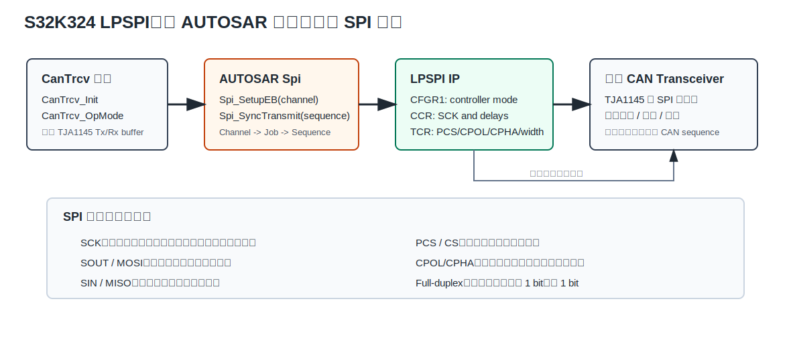
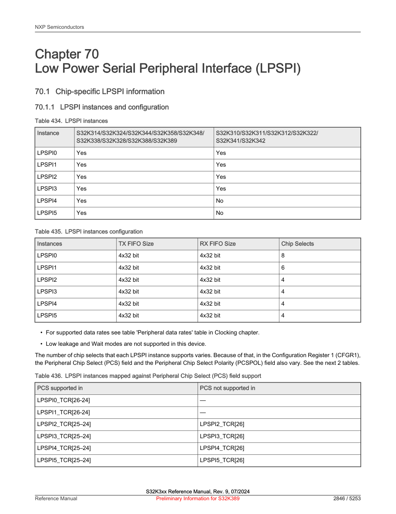
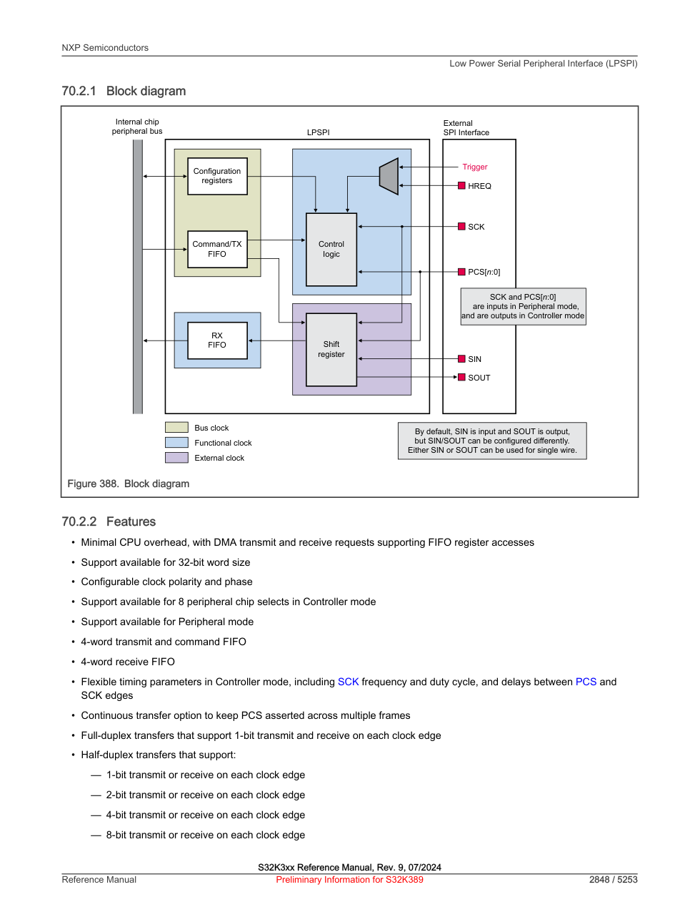
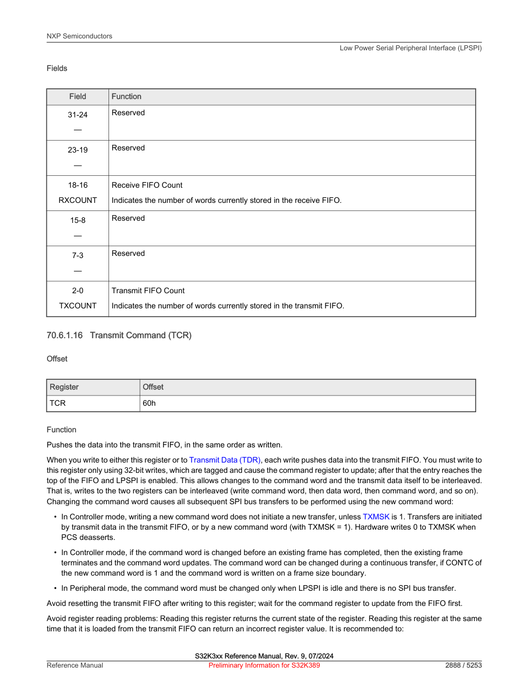
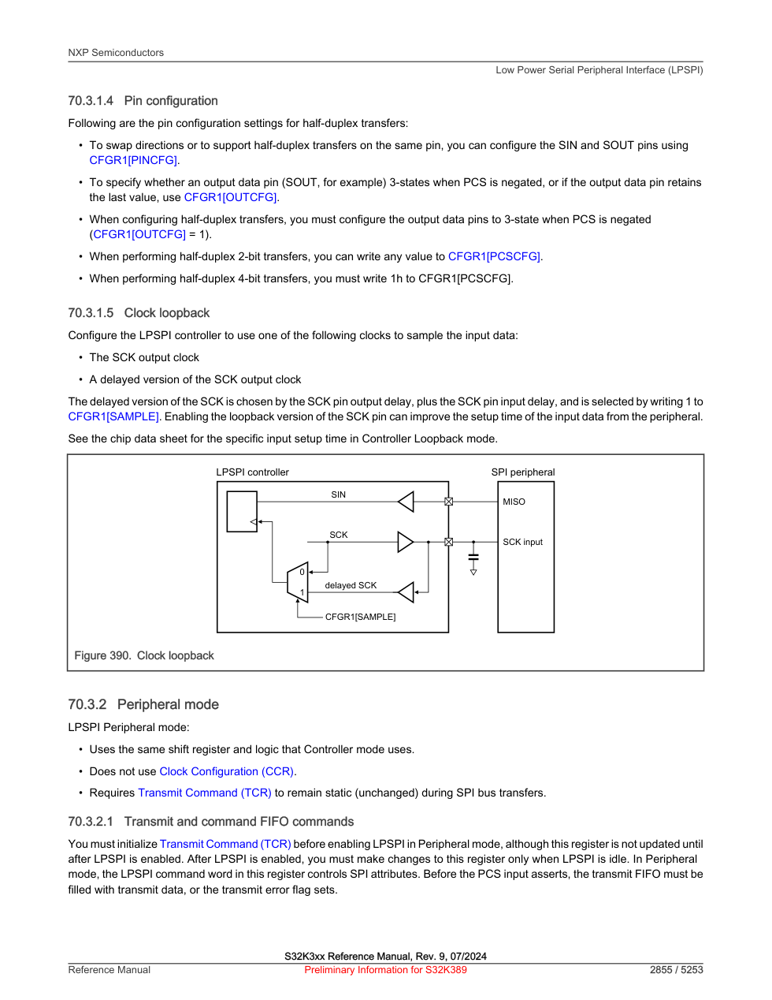
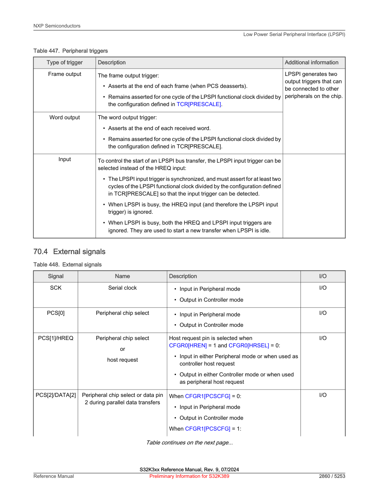
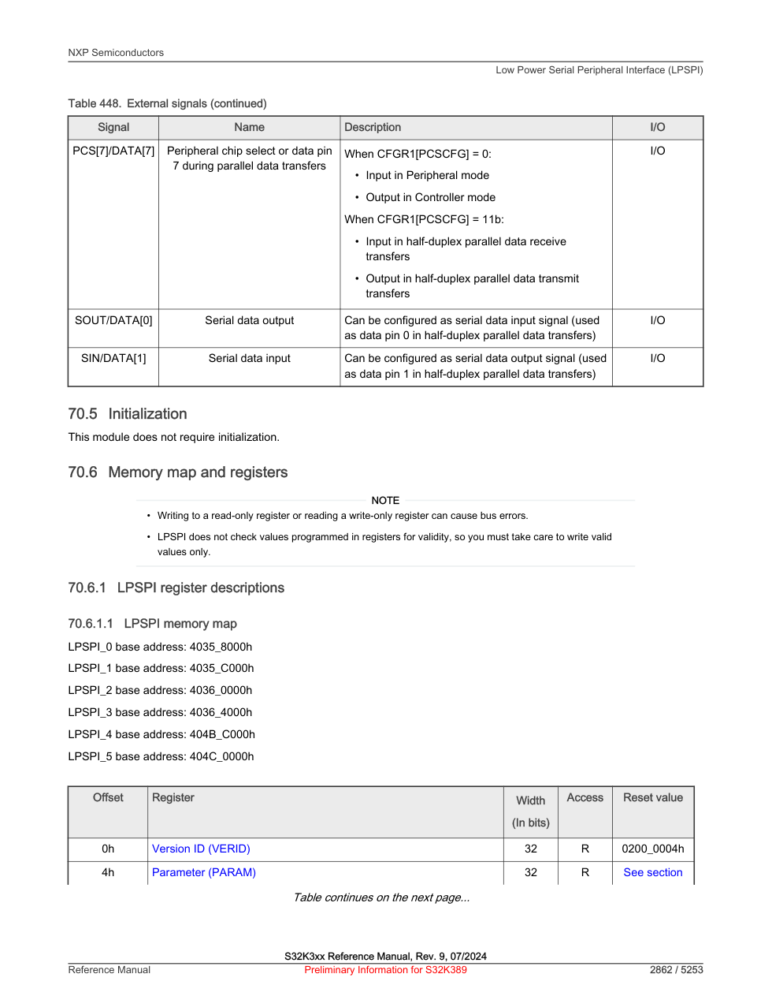
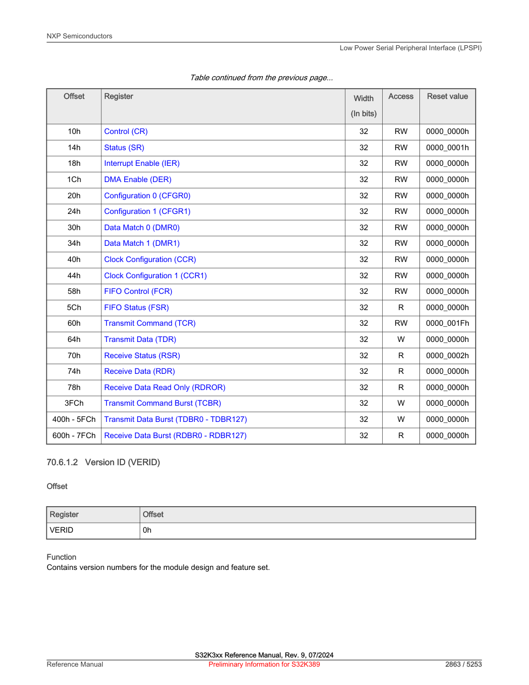

# Chapter 70 Low Power Serial Peripheral Interface (LPSPI) 学习笔记

> 本笔记面向 S32K324，结合 Reference Manual Chapter 70、AUTOSAR Spi MCAL、EB tresos 配置和当前工程实际代码。读完以后，希望你看到 `Spi_SetupEB + Spi_SyncTransmit`、`CPOL/CPHA`、`PCS0`、`LPSPI3`、`TCR/CCR/CFGR1` 时，不再觉得它们是散落的名词，而能把它们串成一条真实的板上通信链路。

## 0. 本章先给结论

S32K324 的 LPSPI 是片上的 SPI 控制器。它负责把 CPU 或 DMA 准备好的数据，按 SPI 协议变成板子上的几根信号线：`SCK`、`SOUT`、`SIN`、`PCS`。在 AUTOSAR 工程里，上层通常不直接操作 LPSPI 寄存器，而是通过 MCAL `Spi` 模块：

```text
应用/BSW
  -> Spi_SetupEB(channel, tx, rx, len)
  -> Spi_SyncTransmit(sequence) 或 Spi_AsyncTransmit(sequence)
  -> AUTOSAR Spi Channel/Job/Sequence
  -> LPSPI IP driver
  -> SCK/SOUT/SIN/PCS 波形
  -> 外部芯片寄存器
```

当前工程里，能明确看到 CAN 收发器 `TJA1145` 路径在使用 SPI：

- `EcuM_Cfg_Startup.c` 调用 `Spi_Init(...)` 初始化 Spi 驱动。
- `CanTrcv_Cfg.c` 把 CanTrcv 绑定到 `SpiSequence_CAN` 和 `SpiChannel_CAN`。
- `CanTrcv_OpMode.c` 通过 `Spi_RbSetupEB` 也就是 `Spi_SetupEB` 设置外部 buffer，然后通过 `Spi_SyncTransmit` 同步发送。
- `SpiChannel_CAN` 对应 `LPSPI_3`，硬件实例是 `Spi3_CAN`，片选是 `PCS0`，16 bit frame，CPOL=0，CPHA=1。



## 1. SPI 协议先讲明白

### 1.1 SPI 到底是什么

SPI 是 Serial Peripheral Interface，串行外设接口。它适合一块 PCB 上短距离、速度较快、协议简单的芯片间通信，比如 MCU 访问 CAN 收发器、SBC、电源芯片、传感器、外部 Flash、ADC、驱动芯片等。

SPI 最经典的连接有四根线：

| 信号 | 常见旧名 | NXP 本章名 | 方向 | 通俗解释 |
| --- | --- | --- | --- | --- |
| `SCK` | SCLK | SCK | Controller 输出 | 时钟线。每一个时钟边沿推进一位数据。 |
| `MOSI` | MOSI | SOUT | Controller 输出 | 控制器发给外设的数据。 |
| `MISO` | MISO | SIN | Peripheral 输出 | 外设回给控制器的数据。 |
| `CS` | SS/CS | PCS | Controller 输出 | 片选。选中哪个外设，通常低有效。 |

NXP 文档里把传统的 Master/Slave 改成 Controller/Peripheral。意思不变：Controller 是主动发时钟的一方，Peripheral 是被时钟驱动的一方。

### 1.2 SPI 是全双工的

SPI 很关键的一点是：**每来一个 SCK 时钟，双方同时移出 1 bit，也同时采进 1 bit。** 所以即使你只是想读外设，也必须发一些 dummy 数据让时钟跑起来；即使你只是想写外设，外设那边也可能同时回传状态字。

这就是为什么 CanTrcv 里既有 Tx buffer，也有 Rx buffer：

```text
Spi_SetupEB(channel, txBuffer, rxBuffer, length)
```

`txBuffer` 里的每个 16 bit word 会被发出去；同一时间，`rxBuffer` 会收到外设移回来的 16 bit word。

### 1.3 CPOL 和 CPHA 是 SPI 最容易错的两位

`CPOL` 决定 SCK 空闲时是低电平还是高电平。`CPHA` 决定在第几个边沿采样数据。

| 模式 | CPOL | CPHA | 通俗理解 |
| --- | --- | --- | --- |
| Mode 0 | 0 | 0 | SCK 空闲低，第一个边沿采样。 |
| Mode 1 | 0 | 1 | SCK 空闲低，第二个边沿采样。 |
| Mode 2 | 1 | 0 | SCK 空闲高，第一个边沿采样。 |
| Mode 3 | 1 | 1 | SCK 空闲高，第二个边沿采样。 |

当前工程：

- `Spi0_BE13`：`CPOL=0`、`CPHA=0`，也就是 Mode 0。
- `Spi1_Level`：`CPOL=0`、`CPHA=1`，也就是 Mode 1。
- `Spi3_CAN`：`CPOL=0`、`CPHA=1`，也就是 Mode 1。

如果 CPHA 配错，示波器上你可能还能看到时钟和数据在动，但读回来的寄存器值会错位，看起来像“偶发通信异常”。所以调 SPI，第一件事不是怀疑代码，而是拿外设 datasheet 对 `CPOL/CPHA`。

### 1.4 片选 CS/PCS 决定一次事务的边界

SPI 总线上可以挂多个外设，它们共享 `SCK/SOUT/SIN`，但每个外设有自己的片选 `PCS`。片选拉到有效电平，外设开始听；片选释放，外设认为一笔事务结束。

当前 EB 配置里三个设备都是：

- `SpiCsPolarity = LOW`，片选低有效。
- `SpiCsSelection = CS_VIA_PERIPHERAL_ENGINE`，由 LPSPI 硬件自动控制片选。
- `SpiEnableCs = true`，启用片选。

`SpiCsBehavior` 有两种当前用法：

- `CS_TOGGLE`：每个 frame 或 transaction 后释放再拉低，适合外设要求每个访问独立结束。
- `CS_KEEP_ASSERTED`：连续传输期间保持片选有效，适合一次连续读写多个寄存器或一串数据。

当前 `Spi3_CAN` 使用 `CS_KEEP_ASSERTED`，这很符合 CAN 收发器初始化或控制过程中连续访问多个寄存器的场景。

## 2. S32K324 LPSPI 硬件长什么样

### 2.1 S32K324 有哪些 LPSPI 实例

Reference Manual 给出的 S32K324 支持情况如下：LPSPI0 到 LPSPI5 都存在。每个实例 TX FIFO 和 RX FIFO 都是 `4 x 32 bit`，但片选数量不完全一样。



| 实例 | S32K324 是否支持 | TX FIFO | RX FIFO | PCS 数量 |
| --- | --- | --- | --- | --- |
| LPSPI0 | 支持 | 4 x 32 bit | 4 x 32 bit | 8 |
| LPSPI1 | 支持 | 4 x 32 bit | 4 x 32 bit | 6 |
| LPSPI2 | 支持 | 4 x 32 bit | 4 x 32 bit | 4 |
| LPSPI3 | 支持 | 4 x 32 bit | 4 x 32 bit | 4 |
| LPSPI4 | 支持 | 4 x 32 bit | 4 x 32 bit | 4 |
| LPSPI5 | 支持 | 4 x 32 bit | 4 x 32 bit | 4 |

在 memory map 里：

| 实例 | 基地址 | 当前工程是否配置 |
| --- | --- | --- |
| LPSPI0 | `0x40358000` | 是，`Spi0_BE13` |
| LPSPI1 | `0x4035C000` | 是，`Spi1_Level` |
| LPSPI2 | `0x40360000` | 否，当前未见 Spi 配置使用 |
| LPSPI3 | `0x40364000` | 是，`Spi3_CAN` |
| LPSPI4 | `0x404BC000` | 否，当前未见 Spi 配置使用 |
| LPSPI5 | `0x404C0000` | 否，当前未见 Spi 配置使用 |

### 2.2 LPSPI block diagram 怎么读



这张图可以分成四块：

| 模块 | 作用 | 软件上对应什么 |
| --- | --- | --- |
| Configuration registers | 配置寄存器，决定模式、片选、时钟、采样、FIFO 等 | `CFGR0`、`CFGR1`、`CCR`、`TCR` |
| Command/TX FIFO | 命令和发送数据 FIFO | 写 `TCR` 放命令，写 `TDR` 放数据 |
| Shift register | 移位寄存器，把并行 word 一 bit 一 bit 推到线上 | 真实 SCK/SOUT/SIN 波形 |
| RX FIFO | 接收 FIFO，把收到的 bit 组回 word | 读 `RDR`，MCAL 放入 rxBuffer |

讲得更直白一点：CPU 写的是内存映射寄存器，LPSPI 吐出来的是板子上的电平波形。FIFO 是中间的缓冲区，避免 CPU 每个 bit 都来干预。

### 2.3 ==Controller mode 和 Peripheral mode==

LPSPI 可以做 Controller，也可以做 Peripheral。当前工程都配置成 `SPI_MASTER`，也就是 Controller mode。

| 模式 | SCK | PCS | 当前工程 |
| --- | --- | --- | --- |
| Controller mode | LPSPI 输出 SCK | LPSPI 输出 PCS | 使用 |
| Peripheral mode | 外部控制器输入 SCK | 外部控制器输入 PCS | 未使用 |

Controller mode 下，LPSPI 自己产生 SCK，自己拉片选，自己按 `CCR/TCR` 规定的时序发送 frame。

### 2.4 FIFO 和 TCR：为什么 SPI 不只是写数据

LPSPI 的 TX FIFO 比较特别，它既可以放 transmit data，也可以放 command word。command word 来自 `TCR`，用于描述后续数据怎么发：

- 使用哪个 `PCS`
- `CPOL/CPHA`
- frame size
- 是否 continuous transfer
- bit width
- prescaler



这就解释了一个现象：**同一个 LPSPI 实例可以服务不同外设，但每次换外设前要换一组命令和时序。** AUTOSAR Spi 的 ExternalDevice 配置，本质上就是把每个外设的 `TCR/CCR/CFGR0` 属性先算好，传输时套用。

### 2.5 时钟：Bus clock、Functional clock、SCK 不是一回事

Reference Manual 把 LPSPI clock 分成三类：

| 时钟 | 用途 | 通俗解释 |
| --- | --- | --- |
| Bus clock | CPU 访问 LPSPI 寄存器和 FIFO | 软件读写寄存器的通道时钟 |
| Functional clock | LPSPI 内部工作时钟 | 分频后生成 SCK 和各种延时 |
| External clock | 线上真正的 SCK | Controller mode 由 LPSPI 输出，Peripheral mode 从外部输入 |

EB 中 `SpiPhyUnitClockRef = AIPS_PLAT_CLK`，说明这些 LPSPI 实例使用 AIPS 平台时钟作为配置时钟来源。`CCR` 里的 `SCKDIV`、`SCKPCS`、`PCSSCK`、`DBT` 则把这个时钟换算成 SPI 线上时序。

### 2.6 Clock loopback 是高速采样时的补偿手段



在普通低速 SPI 下，Controller 用自己内部时钟采样 SIN 就够了。但当线长、负载、板级延迟、外设输出延迟变大时，输入数据可能在采样边沿附近不稳定。`CFGR1[SAMPLE]` 可以选择使用延迟后的 SCK 做采样参考，相当于把采样点往后挪一点。

当前工程 `SpiSamplePoint = 0`，生成代码里 `LPSPI_CFGR1_SAMPLE(0U)`，也就是没有启用 clock loopback 延迟采样。

### 2.7 外部信号不只有四根线



经典 SPI 是 `SCK/SOUT/SIN/PCS`，但 LPSPI 支持更多玩法：

- `PCS[1]` 可以作为 `HREQ` host request。
- `PCS[2]` 到 `PCS[7]` 在某些配置下可以做并行数据位。
- `SOUT` 和 `SIN` 可以通过 pin configuration 做方向交换或半双工。

当前工程：

- `SpiTransferWidth = TRANSFER_1_BIT`
- `SpiDeviceHalfDuplexSupport = false`
- `LPSPI_IP_HALF_DUPLEX_MODE_SUPPORT = STD_OFF`

也就是说当前只使用最常见的 1-bit 全双工 SPI。

## 3. 关键寄存器用老师的话讲




| 寄存器 | 偏移 | 用途 | 工程理解 |
| --- | --- | --- | --- |
| `VERID` | `0x00` | 版本 ID | 识别 IP 版本，驱动一般只读。 |
| `PARAM` | `0x04` | 参数 | FIFO 大小、能力信息。 |
| `CR` | `0x10` | Control | 使能模块、软件复位、清 FIFO。 |
| `SR` | `0x14` | Status | TDF、RDF、传输完成、错误等状态位。 |
| `IER` | `0x18` | Interrupt Enable | 哪些状态产生中断。当前工程 HWUnit transfer mode 是 polling。 |
| `DER` | `0x1C` | DMA Enable | 是否允许 TX/RX DMA request。BE13 异步 DMA 有用到 DMA 配置。 |
| `CFGR0` | `0x20` | Configuration 0 | Host request、circular FIFO、data match 等。当前 HREQ disabled。 |
| `CFGR1` | `0x24` | Configuration 1 | Controller/Peripheral、pin config、PCS polarity、sample 等。当前 MASTER=1。 |
| `CCR` | `0x40` | Clock Configuration | PCS 到 SCK、SCK 到 PCS、SCK 分频、frame 间 delay。 |
| `CCR1` | `0x44` | Clock Configuration 1 | SCK high/low setup/hold、PCS-to-PCS 等更细时序。 |
| `FCR` | `0x58` | FIFO Control | TX/RX watermark，决定何时触发 TDF/RDF 或 DMA。 |
| `FSR` | `0x5C` | FIFO Status | 当前 FIFO 里有多少 word。 |
| `TCR` | `0x60` | Transmit Command | 最核心命令字，配置 PCS、CPOL、CPHA、frame size 等。 |
| `TDR` | `0x64` | Transmit Data | 写要发送的数据。 |
| `RSR` | `0x70` | Receive Status | 接收状态。 |
| `RDR` | `0x74` | Receive Data | 读接收到的数据。 |

一个非常重要的提醒：LPSPI memory map 章节明确说，写只读寄存器或读只写寄存器可能引起 bus error。寄存器值也不会帮你检查是否合理，软件必须自己保证配置有效。这也是为什么 MCAL 和 EB 配置存在价值：它们帮我们把很多危险寄存器访问收束成配置项和 API。

## 4. EB tresos 配置项逐项讲

AUTOSAR Spi 的抽象层级是：

```text
Channel：一次传输的数据单元和 buffer 属性
Job：使用哪个外设、哪个硬件单元、由哪些 Channel 组成
Sequence：由哪些 Job 组成，上层真正调用传输的对象
ExternalDevice：某个外部芯片的 SPI 时序、片选、模式
PhyUnit：某个 LPSPI 硬件实例
```

### 4.1 SpiChannel

| 配置项 | 含义 | 当前值 |
| --- | --- | --- |
| `SpiChannelType` | Buffer 类型，`EB` 是外部 buffer，调用前由上层传入 tx/rx 指针 | 三个通道都是 `EB` |
| `SpiDataWidth` | 一个 SPI frame 的 bit 数 | BE13 是 32，Level/CAN 是 16 |
| `SpiDefaultData` | 如果发送 buffer 为空，用什么 dummy 数据 | 1 |
| `SpiEbMaxLength` | EB 通道一次最多传多少 frame | BE13 1024，Level 512，CAN 511 |
| `SpiTransferStart` | 先发 MSB 还是 LSB | 三个都是 MSB |
| `SpiByteSwapTransfer` | 是否做字节交换 | false |
| `SpiChannelHalfDuplexDirection` | 半双工方向 | 当前半双工未启用，配置项不生效 |

老师式记忆：Channel 管的是“这包数据长什么样”。它不关心用哪个片选，也不关心接到哪个外设。

### 4.2 SpiExternalDevice

| 配置项 | 含义 | 当前工程 |
| --- | --- | --- |
| `SpiBaudrate` | 期望波特率 | BE13 5MHz，Level/CAN 4MHz |
| `SpiCalculatedBaudrate` | 工具按时钟和分频算出的实际波特率 | 三个都是 1MHz |
| `SpiCsIdentifier` | 使用哪个 PCS | BE13 PCS2，Level PCS0，CAN PCS0 |
| `SpiCsPolarity` | 片选有效电平 | 三个都是 LOW |
| `SpiCsSelection` | 片选由硬件还是 GPIO 软件控制 | 三个都是 `CS_VIA_PERIPHERAL_ENGINE` |
| `SpiDataShiftEdge` | 数据采样边沿 | BE13 trailing，Level/CAN leading |
| `SpiShiftClockIdleLevel` | SCK 空闲电平 | 三个都是 LOW |
| `SpiTimeClk2Cs` | SCK 到 CS 的延时要求 | 1us |
| `SpiTimeCs2Clk` | CS 到 SCK 的延时要求 | 1us |
| `SpiTimeCs2Cs` | 两次 CS 之间最小间隔 | 1us |
| `SpiCsBehavior` | 连续传输时 CS 是否保持 | BE13 toggle，Level/CAN keep asserted |
| `SpiTransferWidth` | 1-bit/2-bit/4-bit/8-bit 宽传输 | 三个都是 1-bit |
| `SpiHostRequest` | 是否启用 HREQ | 三个都是 DISABLE |

这里有一个非常值得注意的点：EB 期望 `SpiBaudrate` 是 4MHz 或 5MHz，但生成配置里的 `SpiCalculatedBaudrate` 是 1MHz，`CCR` 里 BE13 的 `SCKDIV=14`，Level/CAN 的 `SCKDIV=18`。这通常说明实际 LPSPI functional clock 和分频组合只能得到当前值，或者工具按当前时钟配置算出来就是 1MHz。调试时要以示波器实测 SCK 为准。

### 4.3 SpiPhyUnit

| PhyUnit | 映射实例 | 模式 | 同步属性 | DMA | 工程含义 |
| --- | --- | --- | --- | --- | --- |
| `SpiPhyUnit_0_BE13` | LPSPI_0 | SPI_MASTER | async | 使用 DMA | 用于 BE13，当前搜索未见上层直接调用 |
| `SpiPhyUnit_1_Level` | LPSPI_1 | SPI_MASTER | sync | 不使用 DMA | 用于 Level，当前搜索未见上层直接调用 |
| `SpiPhyUnit_3_CAN` | LPSPI_3 | SPI_MASTER | sync | 不使用 DMA | 用于 CAN 收发器，当前确定使用 |

生成代码中所有 `CFGR1` 都是：

```text
PINCFG = 0
PCSPOL = 0
MASTER = 1
SAMPLE = 0
```

翻译成人话就是：普通引脚配置、片选低有效、控制器模式、不使用延迟采样。

### 4.4 SpiJob 和 SpiSequence

当前三个配置都是一条最简单的链：

```text
SpiChannel_BE13 -> SpiJob_BE13 -> SpiSequence_BE13 -> Spi0_BE13 -> LPSPI0
SpiChannel_Level -> SpiJob_Level -> SpiSequence_Level -> Spi1_Level -> LPSPI1
SpiChannel_CAN -> SpiJob_CAN -> SpiSequence_CAN -> Spi3_CAN -> LPSPI3
```

| Sequence | Job | Channel | ExternalDevice | HWUnit |
| --- | --- | --- | --- | --- |
| `SpiSequence_BE13` | `SpiJob_BE13` | `SpiChannel_BE13` | `Spi0_BE13` | CSIB0 / LPSPI0 |
| `SpiSequence_Level` | `SpiJob_Level` | `SpiChannel_Level` | `Spi1_Level` | CSIB1 / LPSPI1 |
| `SpiSequence_CAN` | `SpiJob_CAN` | `SpiChannel_CAN` | `Spi3_CAN` | CSIB2 / LPSPI3 |

当前所有 sequence：

- `SpiInterruptibleSequence = false`
- `SpiSeqEndNotification = NULL_PTR`
- DMA fast transfer disabled
- Dma continuous memory transfer disabled

这说明传输流程比较保守：一条 sequence 不被别的 sequence 打断，也没有完成回调，调用方自己等同步传输返回或查询结果。

### 4.5 SpiGeneral 和 IP 层开关

EB 里除了 Channel、Job、Sequence，还有一些全局开关。它们不像 `CPOL/CPHA` 那样直接决定波形，但会决定驱动行为、错误检查、同步异步能力和 DMA 能力。

| 配置项或宏 | 当前值 | 含义 |
| --- | --- | --- |
| `SPI_DEV_ERROR_DETECT` | `STD_ON` | 开发错误检测打开。参数错、未初始化调用等会走 DET 报错。 |
| `SPI_VERSION_INFO_API` | `STD_ON` | 支持 `Spi_GetVersionInfo`。 |
| `SPI_INTERRUPTIBLE_SEQ_ALLOWED` | `STD_OFF` | Sequence 不允许被打断。当前配置也都是 `SpiInterruptibleSequence=false`。 |
| `SPI_HW_STATUS_API` | `STD_ON` | 支持查询 HWUnit 状态。 |
| `SPI_CANCEL_API` | `STD_ON` | 支持取消传输 API。 |
| `SPI_CHANNEL_BUFFERS_ALLOWED` | `SPI_USAGE1` | 只允许 EB，也就是上层自己提供 Tx/Rx buffer。 |
| `SPI_LEVEL_DELIVERED` | `SPI_LEVEL2` | AUTOSAR Spi Level 2，理论上同步和异步能力都可用。 |
| `SPI_TIMEOUT_COUNTER_U32` | `50000` | 同步/异步等待一帧完成时的循环超时计数。 |
| `SPI_SUPPORT_CONCURRENT_SYNC_TRANSMIT` | `STD_OFF` | 不允许多个线程同时发起同步传输。 |
| `SPI_HWUNIT_ASYNC_MODE` | `STD_OFF` | 不支持运行时单独切换 HWUnit 异步模式。 |
| `SPI_MULTICORE_ENABLED` | `STD_OFF` | Spi 驱动未启用多核隔离配置。 |
| `LPSPI_IP_NUMBER_OF_INSTANCES` | `3U` | 当前生成代码只启用 3 个 LPSPI 实例。 |
| `LPSPI_IP_0/1/3_ENABLED` | `STD_ON` | LPSPI0、LPSPI1、LPSPI3 启用。 |
| `LPSPI_IP_SLAVE_SUPPORT` | `STD_OFF` | 不支持 Peripheral/Slave 模式配置。 |
| `LPSPI_IP_DMA_USED` | `STD_ON` | IP 层编译了 DMA 支持，但具体 HWUnit 是否用 DMA 还要看 PhyUnit。 |
| `LPSPI_IP_HALF_DUPLEX_MODE_SUPPORT` | `STD_OFF` | 半双工支持关闭。 |
| `LPSPI_IP_FRAMESIZE_MAX_U16` | `64` | IP 层最大 frame size 64 bit。 |

一个好用的判断方法：`Spi_Cfg.h` 里的宏回答“AUTOSAR Spi 驱动提供什么能力”；`Lpspi_Ip_Cfg.h` 里的宏回答“底层 LPSPI IP 驱动编译了哪些硬件能力”。

### 4.6 Port 引脚配置，最终要落到真实管脚

SPI 配置只决定 LPSPI 外设怎么工作；Port 配置决定这些信号有没有真正连到芯片引脚。当前 `Port.xdm` 中能解析到 17 个 LPSPI 相关 pin。和三条已配置 Spi 链路直接相关的是：

| SPI 链路 | LPSPI 信号 | Port 配置名 | 方向 |
| --- | --- | --- | --- |
| BE13 / LPSPI0 | SIN | `PTE0_LPSPI0_SIN` | 输入 |
| BE13 / LPSPI0 | SCK | `PTE1_LPSPI0_SCK` | 输出 |
| BE13 / LPSPI0 | SOUT | `PTE2_LPSPI0_SOUT` | 输出 |
| BE13 / LPSPI0 | PCS2 | `PTE6_LPSPI0_PCS2` | 输出 |
| Level / LPSPI1 | SIN | `RTA2_LPSPI1_SIN` | 输入 |
| Level / LPSPI1 | SCK | `PTA3_LPSPI1_SCK` | 输出 |
| Level / LPSPI1 | SOUT | `PTD2_LPSPI1_SOUT` | 输出 |
| Level / LPSPI1 | PCS0 | `PTD3_LPSPI1_PCS0` | 输出 |
| CAN / LPSPI3 | SOUT | `PTA17_LPSPI3_SOUT` | 输出 |
| CAN / LPSPI3 | PCS0 | `PTB17_LPSPI3_PCS0` | 输出 |
| CAN / LPSPI3 | SIN | `PTD20_LPSPI3_SIN` | 输入 |
| CAN / LPSPI3 | SCK | `PTE7_LPSPI3_SCK` | 输出 |

这张表很重要。调 SPI 的时候，不能只看 `Spi.xdm` 说用了 `LPSPI3 PCS0`，还要确认 Port 真的把 `LPSPI3_SCK/SOUT/SIN/PCS0` 复用到正确管脚，并且板级原理图也接到了对应外部芯片。

## 5. 当前工程实际应用情况

### 5.1 初始化路径

`BasicSoftware/src/bsw/EcuM/EcuM_Cfg_Startup.c` 中调用：

```c
(void)Spi_Init(ConfigPtr->ModuleInitPtrPB.SpiInitConfigPtr_cpst);
```

这说明 Spi 是由 EcuM 启动配置统一初始化的。上层模块使用 SPI 前，必须保证 EcuM 已经把 MCAL Spi 初始化完成。

### 5.2 CanTrcv 使用 SPI 访问 TJA1145

`BasicSoftware/src/bsw/CanTrcv/CanTrcv_Cfg.c` 中：

```c
static const CanTrcvSpiAccessType_tst CanTrcvSpiAccess_acst[1]=
{
    {
        FALSE,
        SpiConf_SpiSequence_SpiSequence_CAN,
        SpiConf_SpiChannel_SpiChannel_CAN
    }
};
```

这表示 CanTrcv 的 SPI 访问绑定到：

- Sequence：`SpiSequence_CAN`
- Channel：`SpiChannel_CAN`
- 对应外部设备：`Spi3_CAN`
- 对应 LPSPI：`LPSPI_3`

`CanTrcv_Cfg.c` 还配置：

```c
{TRUE, 0, 28, 39, TJA1145}
```

它表示当前 CAN transceiver 是 TJA1145 类设备，控制区从 buffer 的 28 到 39 位置。结合 `CanTrcv_OpMode.c`，实际通信过程是：

```text
1. 上层修改 CanTrcv_Prv_TJA1145_SpiCtrlTxBuf_ao 中对应寄存器 word
2. 调用 Spi_SetupEB，把 Tx/Rx buffer 交给 Spi MCAL
3. 调用 Spi_SyncTransmit 触发 LPSPI3 发送
4. LPSPI3 通过 PCS0 选中 TJA1145，发出 16bit frame
5. 同时接收 TJA1145 回传状态到 Rx buffer
6. CanTrcv 从 Rx buffer 解析模式、唤醒、故障等状态
```

### 5.3 CanTrcv 的同步传输

`CanTrcv_Cfg_IntCode.h` 里：

```c
#define Spi_RbSetupEB Spi_SetupEB
#define CANTRCV_SPI_TRANSMIT(seq) (Spi_SyncTransmit(seq))
```

也就是说当前 CanTrcv 没用异步回调，而是同步等 SPI 完成。这样设计的优点是逻辑简单，调用后结果马上可用；缺点是调用期间 CPU 会等待 SPI 传输完成，如果 SPI 卡住就依赖 timeout 和重试保护。

`CanTrcv_OpMode.c` 中的通信函数有重试逻辑：

```text
do
  Spi_SetupEB(...)
  Spi_SyncTransmit(...)
  如果失败，等待 CANTRCV_SPI_COMTIMEOUT 后重试
while 失败且未超过 CANTRCV_SPI_COMRETRIES
```

这说明工程已经考虑到 SPI 通信失败场景，而不是盲目相信一次传输一定成功。

### 5.4 当前 CAN SPI 配置总结

| 项 | 当前值 | 解释 |
| --- | --- | --- |
| 上层模块 | CanTrcv | CAN transceiver 驱动 |
| 外部芯片 | TJA1145 类 | CAN 收发器，通过 SPI 配寄存器 |
| AUTOSAR Channel | `SpiChannel_CAN` | EB buffer，16 bit frame |
| AUTOSAR Sequence | `SpiSequence_CAN` | 上层传输入口 |
| ExternalDevice | `Spi3_CAN` | 外设时序配置 |
| HWUnit | CSIB2 / LPSPI3 | S32K324 的 LPSPI3 |
| 基地址 | `0x40364000` | LPSPI3 register base |
| PCS | PCS0 | 片选低有效 |
| CPOL/CPHA | 0/1 | SPI Mode 1 |
| bit order | MSB first | 高位先传 |
| transfer width | 1-bit | 普通四线 SPI |
| frame size | 16 bit | CanTrcv buffer 是 `uint16` |
| 传输方式 | Sync + polling | `Spi_SyncTransmit` |
| DMA | 不使用 | CAN 这个 HWUnit DMA false |
| CS behavior | keep asserted | 连续 frame 中保持片选 |

## 6. 生成代码中的几个“看起来奇怪”的点

### 6.1 `SPI_MAX_CHANNEL` 是 3，但 `Spi_Config` 里写 2U

`Spi_Cfg.h` 定义：

```c
#define SPI_MAX_CHANNEL  (3u)
#define SPI_MAX_JOB      (3u)
#define SPI_MAX_SEQUENCE (3u)
```

但 `Spi_PBcfg.c` 的 `Spi_Config` 中：

```c
3U, /* u16MaxExternalDevice */
2U, /* Spi_Max_Channel */
2U, /* Spi_Max_Job */
2U, /* Spi_Max_Sequence */
```

这看起来像“最大 index”而不是“数量”。因为 channel/job/sequence ID 是 0、1、2，最大 ID 为 2。读生成代码时要结合上下文，不要只看注释里的 `number of channels`。这里最终数组确实有 3 个元素。

### 6.2 期望波特率和 calculated baudrate 不一致

EB 中：

- BE13 `SpiBaudrate = 5000000.0`
- Level/CAN `SpiBaudrate = 4000000.0`
- 三个 `SpiCalculatedBaudrate = 1000000.0`

这意味着实际配置很可能是 1MHz。笔记里要特别提醒：SPI 波特率最终要看 functional clock、prescaler、CCR 分频和示波器实测。外设 datasheet 写的是上限，工具配置写的是目标值，真正板上跑的是计算后的 SCK。

### 6.3 BE13 是 async + DMA，但当前未见上层调用

`SpiPhyUnit_0_BE13`：

- `SpiPhyUnitSync = false`
- `SpiPhyUnitAsyncUseDma = true`
- tx/rx DMA channel 分别是 `dmaLogicChannel_BE13_Tx/Rx`

当前全工程搜索没有看到 `SpiSequence_BE13` 的上层使用。它可能是预留配置，或者对应代码尚未接入。这个结论只基于当前 checkout 的源码搜索。

## 7. 调试和验证建议

### 7.1 示波器或逻辑分析仪要看什么

调 SPI 最好抓四根线：

- `SCK`
- `SOUT/MOSI`
- `SIN/MISO`
- `PCS/CS`

对当前 CAN SPI，重点确认：

| 检查项 | 期望 |
| --- | --- |
| PCS | 空闲高，传输时拉低 |
| SCK idle | 低电平 |
| CPHA | Mode 1，也就是第二个边沿采样 |
| frame | 16 bit 一组 |
| bit order | MSB first |
| CS behavior | 连续 frame 中 PCS 保持低 |
| SCK 频率 | 以实测为准，配置显示 calculated 1MHz |

### 7.2 软件调试要看什么

| 位置 | 看点 |
| --- | --- |
| `Spi_Init` | 是否在 CanTrcv 使用前完成 |
| `Spi_SetupEB` 返回值 | 是否 `E_OK` |
| `Spi_SyncTransmit` 返回值 | 是否 `E_OK` |
| `Spi_GetSequenceResult` | 是否 `SPI_SEQ_OK` |
| CanTrcv Tx buffer | 写入的寄存器地址、读写 bit、数据是否符合 TJA1145 datasheet |
| CanTrcv Rx buffer | 返回状态位是否合理 |
| Port mux | SCK/SOUT/SIN/PCS 是否复用成 LPSPI 功能，而不是普通 GPIO |
| LPSPI `SR` | 是否有 transmit/receive/error flag 异常 |

### 7.3 常见问题速查

| 现象 | 常见原因 |
| --- | --- |
| SCK 没有波形 | Spi 未初始化、sequence 未调用、外设时钟未开、引脚 mux 不对 |
| PCS 不动 | CS 没启用、PCS 编号错、Port 配置错、外设设备没绑定到 job |
| 只发不收 | MISO/SIN 引脚错误、外设没被选中、CPHA 错、外设未上电 |
| 回读值整体错位 | CPOL/CPHA 错、bit order 错、frame size 错 |
| 第一笔正常后面错 | CS behavior 不符合外设要求，或者 PCS-to-PCS delay 不够 |
| 偶发错 | SCK 太快、采样点不稳、线束/板级干扰、没有满足外设 setup/hold |
| 同步调用卡住 | FIFO 状态异常、外设不响应、驱动 timeout 配置过大或错误 |

## 8. 最后总结

### 8.1 从协议角度总结

SPI 就是一种“控制器给时钟，双方同时移位”的同步串行协议。它简单、快、实时性好，但没有统一的报文层规范。每个外设怎么解释 16 bit 或 32 bit 数据，要看外设 datasheet。

### 8.2 从 LPSPI 硬件角度总结

LPSPI 的核心是配置寄存器、命令/发送 FIFO、移位寄存器、接收 FIFO。`CFGR1` 决定基本模式，`CCR` 决定时钟和延时，`TCR` 决定一次传输的片选、相位、极性和 frame size，`TDR/RDR` 承载数据。

### 8.3 从 AUTOSAR EB 配置角度总结

Channel 管数据宽度和 buffer，ExternalDevice 管外设时序和片选，PhyUnit 管哪个 LPSPI 硬件实例，Job 把 Channel 和 ExternalDevice 绑起来，Sequence 是上层真正发起传输的入口。

### 8.4 从当前工程角度总结

当前工程配置了三条 SPI 链路：BE13、Level、CAN。确定实际使用的是 CAN 收发器链路：CanTrcv 使用 `SpiChannel_CAN`、`SpiSequence_CAN`，最终落到 LPSPI3、PCS0、16bit、Mode 1、同步轮询传输。BE13 和 Level 有完整配置，但当前源码搜索没有发现上层业务直接调用对应 sequence，可能是预留或待接入。

一句话记住本章：**SPI 的本质是四根线上的时序，LPSPI 是把寄存器配置变成时序的硬件，AUTOSAR Spi 是把这种硬件访问包装成 Channel/Job/Sequence，而当前项目用这条链路去配置和读取 CAN 收发器。**
