# S32K324 Chapter 73 CAN (FlexCAN) CAN Driver 学习笔记

> 主题：`CAN (FlexCAN)`，重点只放在 **AUTOSAR MCAL CAN Driver** 和 **S32K324 FlexCAN 外设**。  
> 工程背景：`E:\github\ECAS_RTA_S32K324GHS_Heating`，当前 EB tresos 配置文件为 `BasicSoftware/integration/mcal/MCAL_Cfg/config/Can_43_FLEXCAN.xdm`。  
> 不展开范围：`Com`、`PduR`、`CanIf`、`CanTp`、`Dcm` 的上层路由和信号映射。本文只在 Driver 边界处提到 `CanIf_RxIndication`、`CanIf_TxConfirmation`、`CanIf_ControllerBusOff` 等回调。

## 0. 先给结论

S32K324 的 CAN 外设在 Reference Manual Chapter 73 里叫 **CAN (FlexCAN)**。在 AUTOSAR MCAL 里，对应的驱动模块是 `Can_43_FLEXCAN`，底层再调用 `FlexCAN_Ip` 去配置真实硬件寄存器和 message buffer。

当前工程实际启用了 2 个 AUTOSAR `CanController`：

| AUTOSAR Controller | 实际硬件通道 | Base address | 当前用途理解 |
|---|---|---:|---|
| `CanController_0` | `FLEXCAN_1` / `CAN_1` | `0x4030_8000` | CAN1，CAN FD，500 kbit/s 仲裁段 + 2 Mbit/s 数据段 |
| `CanController_1` | `FLEXCAN_2` / `CAN_2` | `0x4030_C000` | CAN2，Classic CAN，500 kbit/s |

最容易踩的坑：

1. `CanController_0` **不是** 硬件 `CAN_0`，它映射到 `FLEXCAN_1`。生成代码里 `Controller Offset = 1U`。
2. CAN Driver 配置不只在 `Can_43_FLEXCAN.xdm`，还必须同时看 `Mcu.xdm` 的 FlexCAN 时钟、`Port.xdm` 的 CAN 引脚复用。
3. 当前工程 `FLEXCAN_PE_CLK0_2 = 40 MHz`，两个启用的控制器都引用它。
4. `CanController_0` 打开了 FD 和 BRS，且 TDC enabled，offset = 17；`CanController_1` 是 Classic CAN。
5. FlexCAN 的收发核心不是 FIFO，而是 **Message Buffer (MB)**。当前工程 `CanController_0` 用 19 个 HOH/MB，`CanController_1` 用 2 个 HOH/MB。
6. RM 提醒 FlexCAN RAM 需要初始化，`MCR[MDIS]` 复位后为 1，驱动初始化时要完成模块使能、Freeze 配置、MB RAM 初始化。
7. Rx MB 读取顺序很关键：先读 `CS`，确认 `BUSY=0`，再读 ID/Data，清 `IFLAG`，最后读 `TIMER` 解锁。不要简单轮询 `CODE` 当作接收流程。

先看总览图：

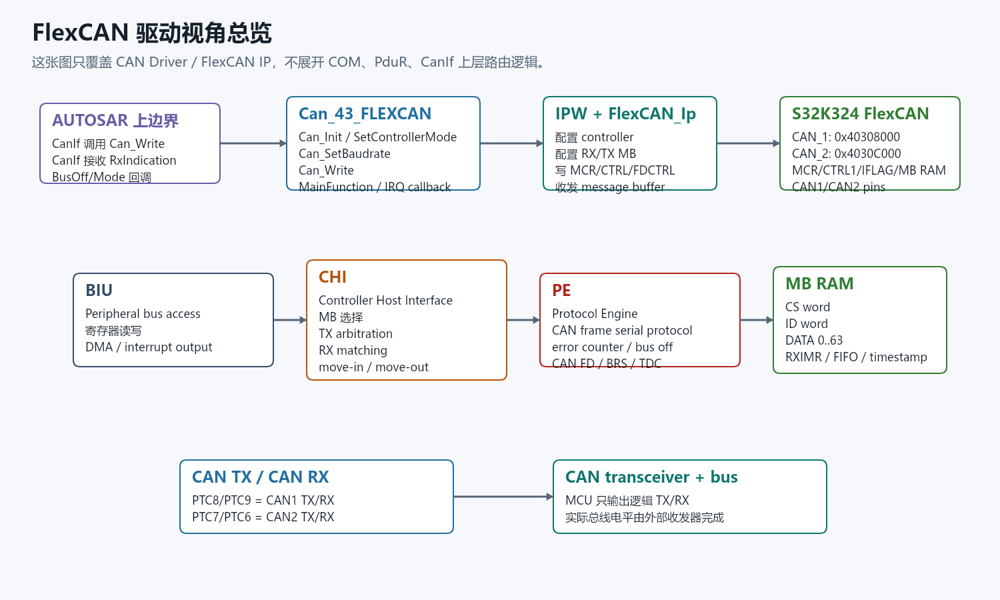

上图的阅读方式：左边是 AUTOSAR CAN Driver 的 API 边界，中间是 `Can_43_FLEXCAN` 和 `FlexCAN_Ip`，右边才是 S32K324 的 FlexCAN 寄存器、MB RAM 和 CAN 引脚。本文主要沿这条链路讲。

## 1. 学 CAN Driver 到底在学什么

如果只说“学 CAN”，很容易混在一起。实际工程里至少有 5 层：

| 层级 | 典型模块 | 本文是否展开 | 你需要关注的点 |
|---|---|---|---|
| 应用/诊断/通信服务 | SWC、Dcm、Com | 不展开 | 谁要发哪帧，收到后给谁 |
| AUTOSAR 通信栈 | CanIf、CanTp、PduR、Com | 只讲边界 | `Can_Write` 调用 CAN Driver，Driver 回调 CanIf |
| AUTOSAR MCAL CAN Driver | `Can_43_FLEXCAN` | 重点 | Controller、HOH、HTH、HRH、baudrate、mode、IRQ |
| IP wrapper / IP driver | `Can_43_FLEXCAN_Ipw`、`FlexCAN_Ip` | 重点 | 把 EB 配置变成寄存器/MB 操作 |
| S32K324 硬件 | FlexCAN | 重点 | MCR、CTRL1、FDCTRL、IFLAG、MB RAM、时钟、引脚 |

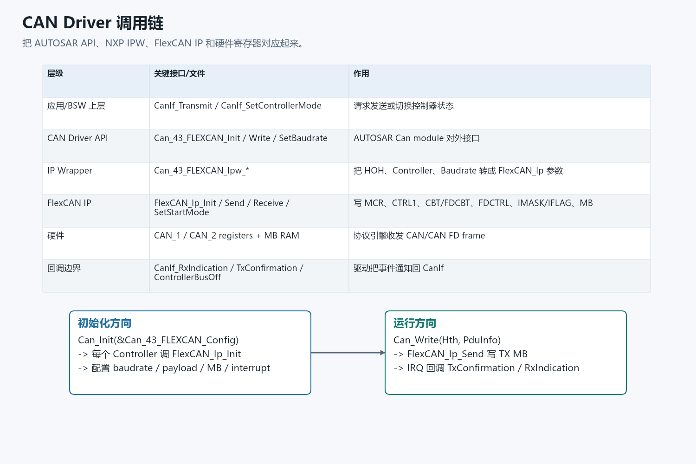

==**一句话总结：**==

```text
CanIf 调用 Can_43_FLEXCAN_Write
        |
        v
Can_43_FLEXCAN 选择 Controller / HOH / HTH
        |
        v
Can_43_FLEXCAN_Ipw 找到硬件 MB
        |
        v
FlexCAN_Ip 写 MCR/CTRL1/FDCTRL/MB/IFLAG
        |
        v
S32K324 FlexCAN 在 CAN_TX/CAN_RX 上收发帧
```

## 2. 手册 Chapter 73 定位

Reference Manual Chapter 73 是 FlexCAN 的硬件章节。学习 CAN Driver 时，建议优先看这些位置：

| PDF 页码 | 内容 | 为什么重要 |
|---:|---|---|
| 3043 | Chapter 73 起始，FlexCAN chip-specific 信息 | 确认模块名、实例能力、适用芯片 |
| 3044 | S32K324 FlexCAN 实例能力表 | 确认 S32K324 有哪些 FlexCAN、MB 数、FD/FIFO 能力 |
| 3047 | FlexCAN RAM 初始化、`MCR[MDIS]` 复位状态 | Driver 初始化必须理解 |
| 3048 | Overview 和 block diagram | 理解 BIU、CHI、PE、MB RAM |
| 3051-3052 | Normal、Freeze、Loopback、Listen-only、Disable 等模式 | 对应 `Can_SetControllerMode` 和调试模式 |
| 3053-3055 | TX process | 对应 `Can_Write` 和 Tx MB |
| 3056-3057 | RX process | 对应 Rx MB 读取顺序和锁定/解锁 |
| 3072-3077 | CAN FD、BRS、TDC | 对应 FD 配置和高速数据段 |
| 3080-3084 | Bit timing | 对应 EB 里的 prescaler、segments、SJW |
| 3089-3094 | Clocks 和 interrupts | 对应 Mcu clock、IRQ/BusOff/Error |
| 3106-3225 | Register descriptions、MB structure、FD RAM partition | 对应寄存器速查和 MB 内存布局 |

下面是几张手册定位截图式摘录。截图用于快速定位原文，完整表格和字段建议打开 PDF 对照阅读。

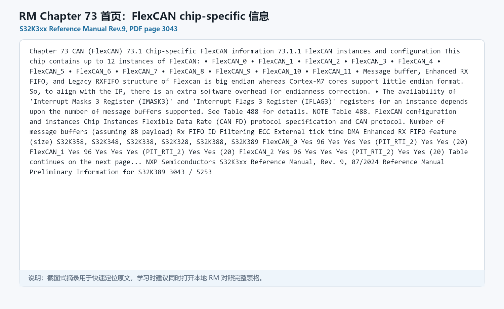

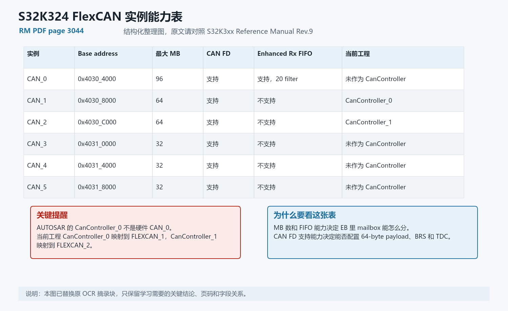

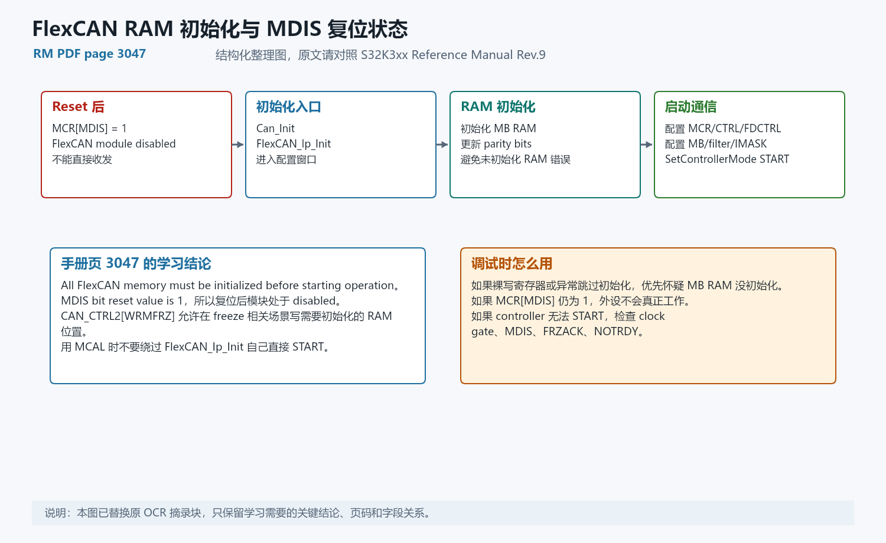

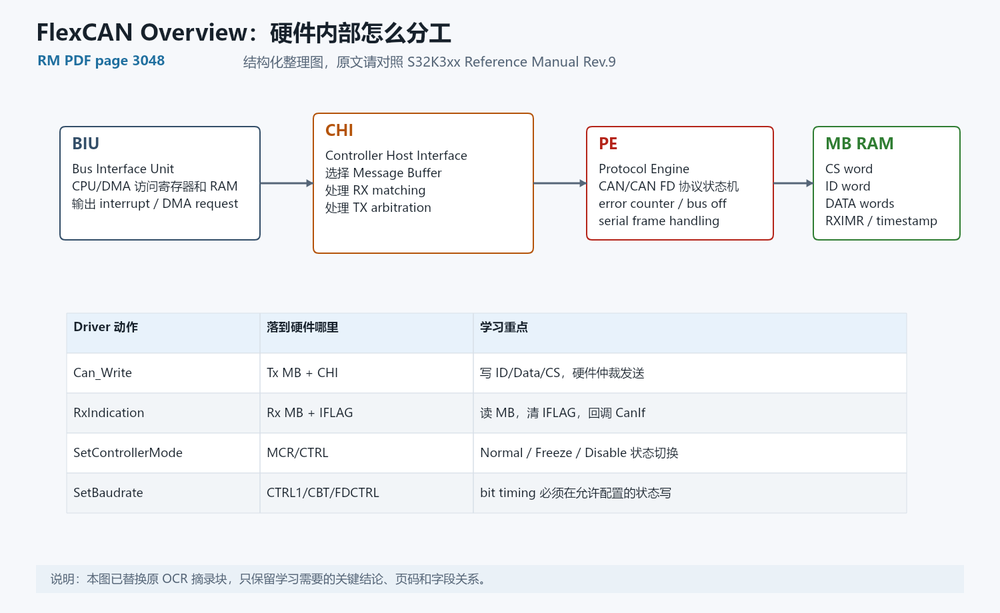

## 3. S32K324 FlexCAN 硬件实例

S32K324 有 6 个 FlexCAN 实例，工程头文件也能看到：

```c
/* BasicSoftware/integration/mcal/src/modules/BaseNXP/header/S32K324_FLEXCAN.h */
#define FLEXCAN_INSTANCE_COUNT (6u)
#define IP_CAN_0_BASE          (0x40304000u)
#define IP_CAN_1_BASE          (0x40308000u)
#define IP_CAN_2_BASE          (0x4030C000u)
#define IP_CAN_3_BASE          (0x40310000u)
#define IP_CAN_4_BASE          (0x40314000u)
#define IP_CAN_5_BASE          (0x40318000u)
```

按 RM 的 S32K324 行理解：

| 硬件实例                  |  Base address | 最大 MB 数 | CAN FD | Enhanced Rx FIFO | 当前工程是否作为 CanController |
| --------------------- | ------------: | ------: | ------ | ---------------- | ---------------------- |
| `CAN_0` / `FlexCAN_0` | `0x4030_4000` |      96 | 支持     | 支持，20 个过滤元素      | 未用作 AUTOSAR controller |
| `CAN_1` / `FlexCAN_1` | `0x4030_8000` |      64 | 支持     | 不支持              | `CanController_0`      |
| `CAN_2` / `FlexCAN_2` | `0x4030_C000` |      64 | 支持     | 不支持              | `CanController_1`      |
| `CAN_3` / `FlexCAN_3` | `0x4031_0000` |      32 | 支持     | 不支持              | 未用作 AUTOSAR controller |
| `CAN_4` / `FlexCAN_4` | `0x4031_4000` |      32 | 支持     | 不支持              | 未用作 AUTOSAR controller |
| `CAN_5` / `FlexCAN_5` | `0x4031_8000` |      32 | 支持     | 不支持              | 未用作 AUTOSAR controller |

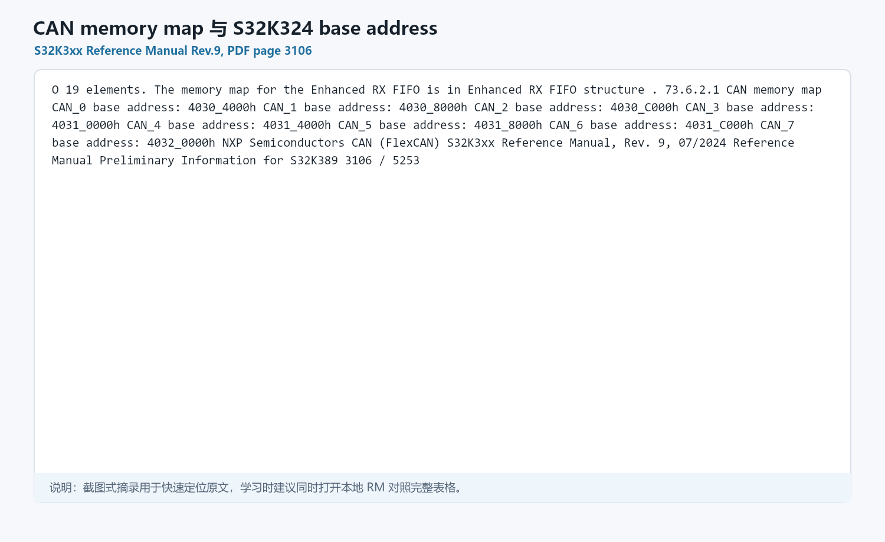

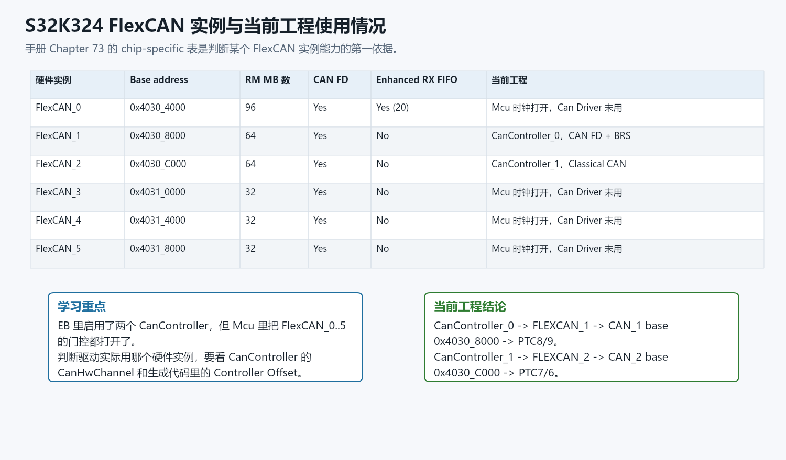

注意：S32K324 的 `CAN_0` 能力最强，有 96 个 MB 和 Enhanced Rx FIFO；但当前工程没有把 `CAN_0` 配成 AUTOSAR `CanController`。当前工程实际用的是 `FLEXCAN_1` 和 `FLEXCAN_2`。

## 4. EB 配置文件总入口

CAN Driver 的 EB 配置至少要看 3 个 xdm：

| 配置文件 | 作用 | 当前工程重点 |
|---|---|---|
| `Can_43_FLEXCAN.xdm` | CAN Driver 主配置 | Controller、baudrate、FD、HOH、HTH、HRH |
| `Mcu.xdm` | 外设时钟和模块时钟门控 | `FLEXCAN_PE_CLK0_2 = 40 MHz`，FlexCAN peripheral enable |
| `Port.xdm` | SIUL2 引脚复用 | PTC6/7/8/9 配成 CAN2/CAN1 RX/TX |

生成代码主要看：

| 生成文件 | 作用 |
|---|---|
| `Can_43_FLEXCAN_Cfg.h` | 宏开关、controller 数、HOH 数、API 开关 |
| `Can_43_FLEXCAN_PBcfg.c` | AUTOSAR CAN Driver 的 Controller/HOH/Baudrate 配置 |
| `Can_43_FLEXCAN_Ipw_PBcfg.c` | IP wrapper 配置 |
| `FlexCAN_Ip_PBcfg.c` | `FlexCAN_Ip` 的底层控制器配置 |

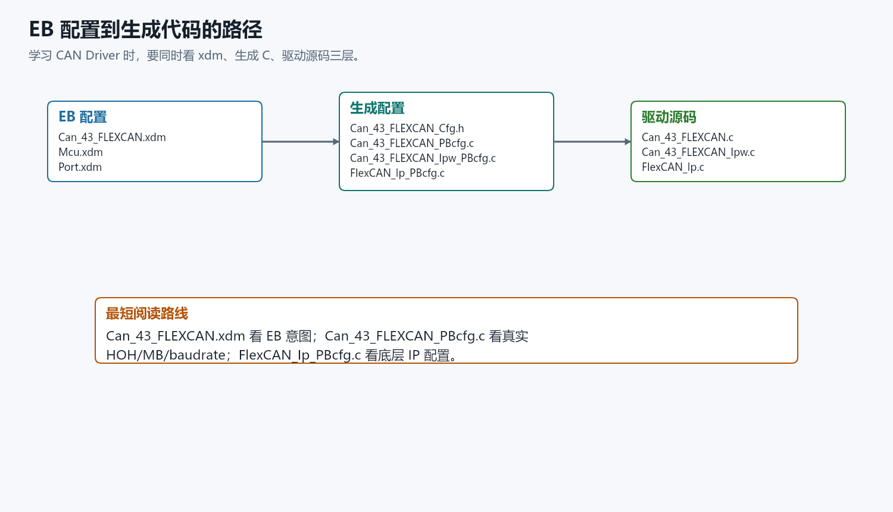

建议学习顺序：

```text
1. Mcu.xdm      先确认 FlexCAN 时钟和模块使能
2. Port.xdm     再确认 CAN_RX/CAN_TX 引脚复用
3. Can_43_FLEXCAN.xdm
   3.1 CanController
   3.2 CanControllerBaudrateConfig
   3.3 CanControllerFdBaudrateConfig
   3.4 CanHardwareObject
4. src/gen      看 EB 最终生成了什么结构体
5. modules      看 Can_43_FLEXCAN / FlexCAN_Ip 怎么消费这些结构体
```

## 5. EB 配置：Mcu 时钟

当前工程 `Mcu.xdm` 里与 FlexCAN 相关的 clock reference：

| Clock reference | 频率 | 当前用途 |
|---|---:|---|
| `FLEXCAN_PE_CLK0_2` | `4.0E7` = 40 MHz | `FLEXCAN_0/1/2` 这一组 PE clock，当前两个 controller 都引用它 |
| `FLEXCAN_PE_CLK3_5` | `1.2E7` = 12 MHz | `FLEXCAN_3/4/5` 这一组 PE clock，当前未作为 CAN Driver controller |

`McuPeripheral` 里 `FlexCAN_0..5` 外设时钟均打开：

| FlexCAN 外设 | MC_ME slot | Clock enable |
|---|---|---|
| `FlexCAN_0` | `PRTN1_COFB2_REQ65` | `true` |
| `FlexCAN_1` | `PRTN1_COFB2_REQ66` | `true` |
| `FlexCAN_2` | `PRTN1_COFB2_REQ67` | `true` |
| `FlexCAN_3` | `PRTN1_COFB2_REQ68` | `true` |
| `FlexCAN_4` | `PRTN1_COFB2_REQ69` | `true` |
| `FlexCAN_5` | `PRTN1_COFB2_REQ70` | `true` |

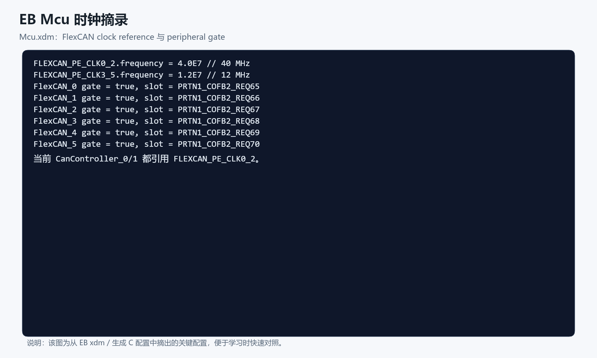

**学习重点：**

1. CAN bit timing 公式里的输入时钟来自 `CanCpuClockRef`，当前是 40 MHz。
2. FlexCAN 外设即使在 Can Driver 里没配置为 controller，也可能在 Mcu 里打开 clock gate。真正是否作为 AUTOSAR CAN 使用，要看 `Can_43_FLEXCAN.xdm`。
3. 修改 bit rate 前一定先确认时钟频率，否则 EB 参数看起来对，示波器/总线分析仪看到的波特率仍可能不对。

## 6. EB 配置：Port 引脚复用

当前工程 CAN 引脚在 `Port.xdm` 中配置如下：

| Pin config | PortPinId | PCR/MSCR | Direction | Mode | 信号 |
|---|---:|---:|---|---|---|
| `PTC6_CAN2_RXD` | 20 | 70 | `PORT_PIN_IN` | `CAN2_CAN2_RX_IN` | CAN2 RX |
| `PTC7_CAN2_TXD` | 21 | 71 | `PORT_PIN_OUT` | `CAN2_CAN2_TX_OUT` | CAN2 TX |
| `PTC8_CAN1_TXD` | 22 | 72 | `PORT_PIN_OUT` | `CAN1_CAN1_TX_OUT` | CAN1 TX |
| `PTC9_CAN1_RXD` | 23 | 73 | `PORT_PIN_IN` | `CAN1_CAN1_RX_IN` | CAN1 RX |

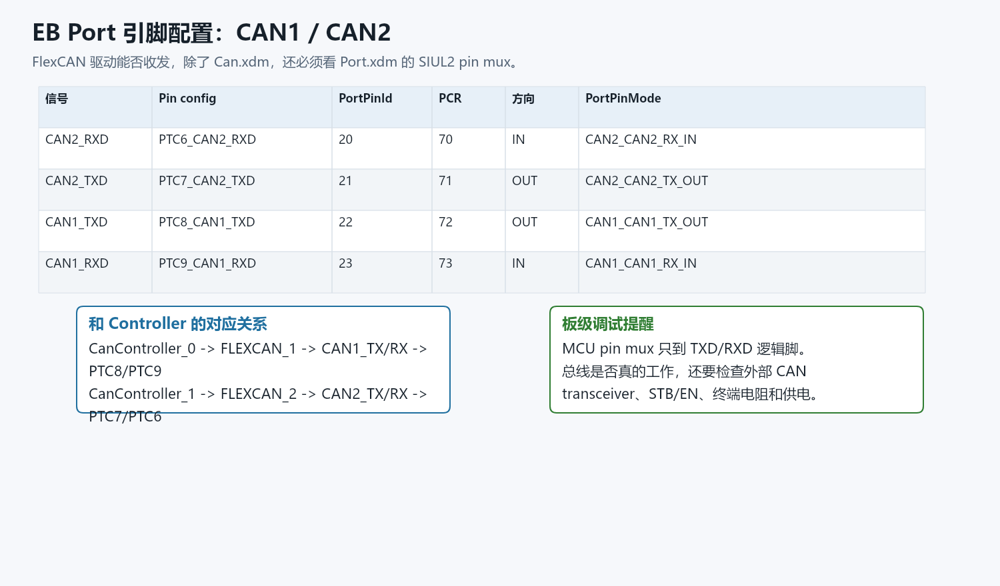

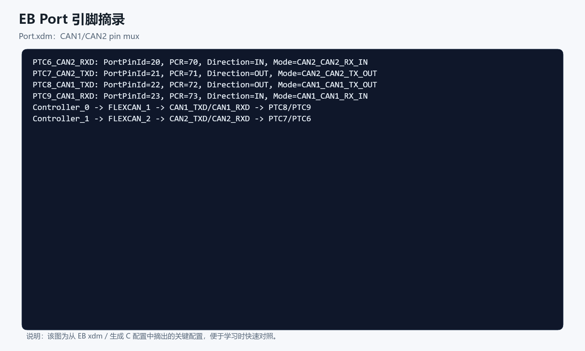

**调试建议：**

1. `CAN_TX` 是 MCU 输出到 CAN transceiver 的逻辑信号，不是直接接 CANH/CANL。
2. `CAN_RX` 是 transceiver 回到 MCU 的逻辑信号。
3. 如果总线上完全没波形，先看 transceiver enable / standby，再看 CAN_TX 引脚是否有跳变。
4. 如果 CAN_TX 有波形但 CAN_RX 不正常，重点查 transceiver、终端电阻、CANH/CANL、对端节点。
5. 如果 CAN_RX 有波形但驱动收不到，重点查 Port mux、bit timing、Rx MB filter、interrupt enable。

## 7. EB 配置：CanController 总览

当前工程 `Can_43_FLEXCAN.xdm` 配了两个 controller：

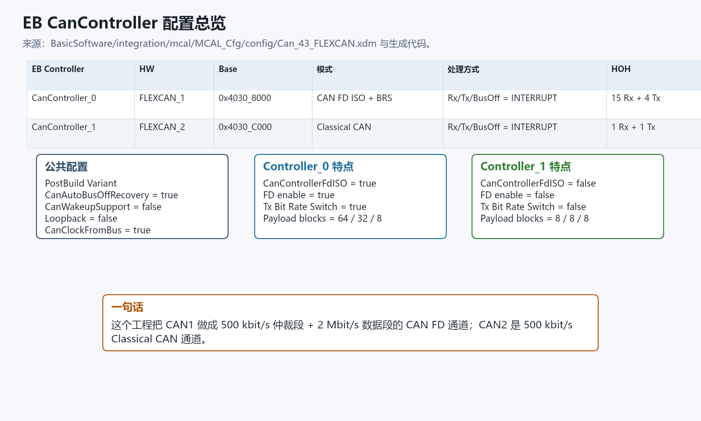

### 7.1 CanController_0

`CanController_0` 是 AUTOSAR 抽象 controller，实际硬件为 `FLEXCAN_1`：

| 配置项                       | 当前值                 | 说明                            |
| ------------------------- | ------------------- | ----------------------------- |
| `CanControllerId`         | `0`                 | AUTOSAR controller ID         |
| `CanHwChannel`            | `FLEXCAN_1`         | 硬件实例 CAN_1                    |
| `CanControllerActivation` | `true`              | 启用                            |
| `CanCpuClockRef`          | `FLEXCAN_PE_CLK0_2` | 40 MHz                        |
| `CanRxProcessing`         | `INTERRUPT`         | Rx 用中断                        |
| `CanTxProcessing`         | `INTERRUPT`         | Tx confirmation 用中断           |
| `CanBusoffProcessing`     | `INTERRUPT`         | BusOff 用中断                    |
| `CanWakeupProcessing`     | `POLLING`           | wakeup 轮询，但当前 wakeup disabled |
| `CanAutoBusOffRecovery`   | `true`              | 自动 bus-off recovery           |
| `CanLoopBackMode`         | `false`             | 非 loopback                    |
| `CanControllerFdISO`      | `true`              | ISO CAN FD                    |
|                           |                     |                               |
|                           |                     |                               |
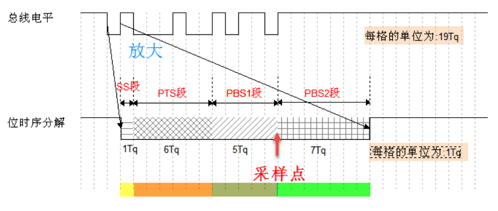
**• SS 段 (SYNC SEG)**

**SS 译为同步段，若通讯节点检测到总线上信号的跳变沿被包含在 SS 段的范围之内，则表示节点与总线的时序是同步的，当节点与总线同步时，采样点采集到的总线电平即可被确定为该位的电平。SS 段的大小固定为 1Tq。**

**• PTS 段 (PROP SEG)**

**PTS 译为传播时间段，这个时间段是用于补偿网络的物理延时时间。是总线上输入比较器延时和输出驱动器延时总和的两倍。PTS 段的大小可以为 1~8Tq。**

**• PBS1 段 (PHASE SEG1)，**

**PBS1 译为相位缓冲段，主要用来补偿边沿阶段的误差，它的时间长度在重新同步的时候可以加长。PBS1 段的初始大小可以为 1~8Tq。**

**• PBS2 段 (PHASE SEG2)**

**PBS2 这是另一个相位缓冲段，也是用来补偿边沿阶段误差的，它的时间长度在重新同步时可以缩短。PBS2 段的初始大小可以为 2~8Tq。**

**1.3.3 通讯的波特率**

**总线上的各个通讯节点只要约定好 1 个 Tq 的时间长度以及每一个数据位占据多少个 Tq，就可以确定 CAN 通讯的波特率。**
**例如，假设上图中的 1Tq=1us，而每个数据位由 19 个 Tq 组成，则传输一位数据需要时间 T1bit=19us，从而每秒可以传输的数据位个数为：1x1000000/19 = 52631.6 (bps)**

==**这个每秒可传输的数据位的个数即为通讯中的波特率。**==

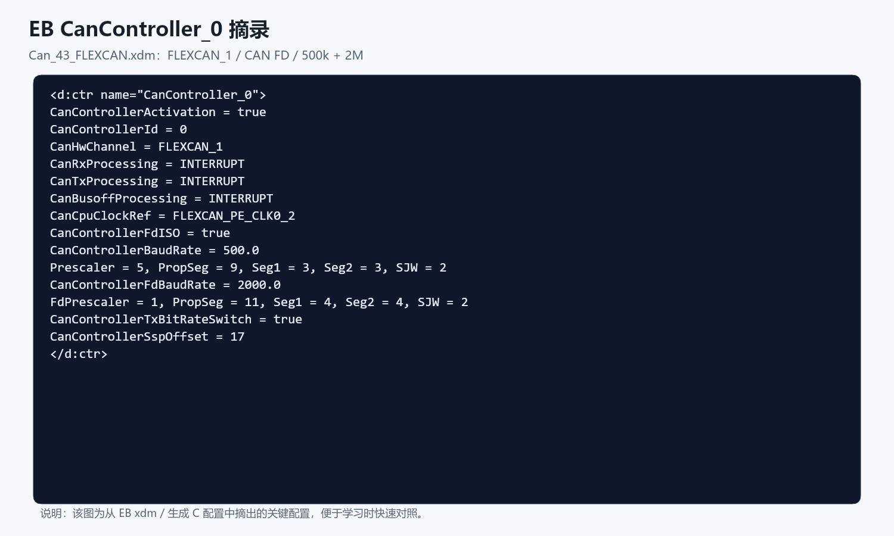

### 7.2 CanController_1

`CanController_1` 实际硬件为 `FLEXCAN_2`：

| 配置项 | 当前值 | 说明 |
|---|---|---|
| `CanControllerId` | `1` | AUTOSAR controller ID |
| `CanHwChannel` | `FLEXCAN_2` | 硬件实例 CAN_2 |
| `CanControllerActivation` | `true` | 启用 |
| `CanCpuClockRef` | `FLEXCAN_PE_CLK0_2` | 40 MHz |
| `CanRxProcessing` | `INTERRUPT` | Rx 用中断 |
| `CanTxProcessing` | `INTERRUPT` | Tx confirmation 用中断 |
| `CanBusoffProcessing` | `INTERRUPT` | BusOff 用中断 |
| `CanAutoBusOffRecovery` | `true` | 自动 bus-off recovery |
| `CanLoopBackMode` | `false` | 非 loopback |
| `CanControllerFdISO` | `false` | Classic CAN |

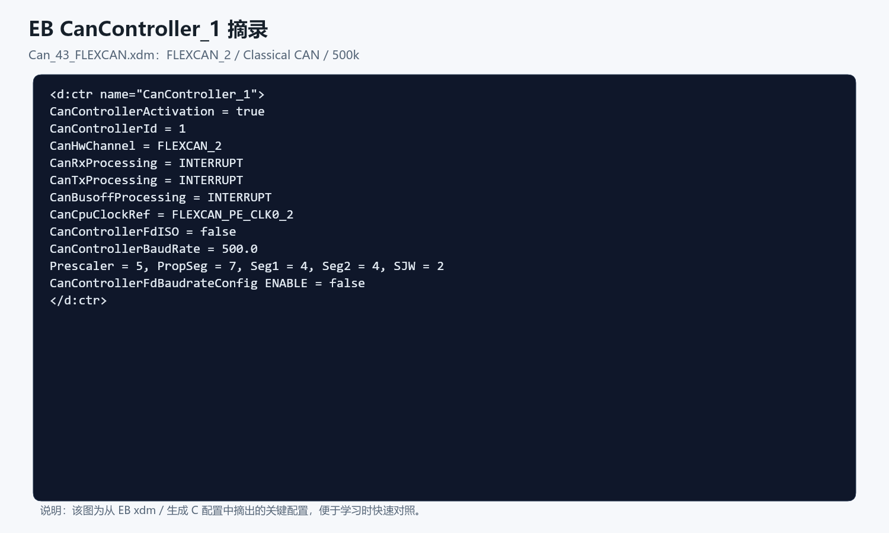

## ==8. EB 配置：Bit Timing==

**FlexCAN bit timing 的基本公式可以先记成：**
**CAN bitrate = FlexCAN_PE_CLK / Prescaler / (1 + PropSeg + PhaseSeg1 + PhaseSeg2)**

**Sample Point = (1 + PropSeg + PhaseSeg1) / (1 + PropSeg + PhaseSeg1 + PhaseSeg2)**
**其中**

| 字段                   | 含义                                  |
| -------------------- | ----------------------------------- |
| `SyncSeg`            | 固定 1 Tq                             |
| `PropSeg`            | 补偿物理传播延迟                            |
| `PhaseSeg1` / `Seg1` | 采样点前的相位段                            |
| `PhaseSeg2` / `Seg2` | 采样点后的相位段                            |
| `SJW`                | resynchronization jump width，同步跳转宽度 |
| `Prescaler`          | 从 FlexCAN PE clock 分频得到 Tq          |

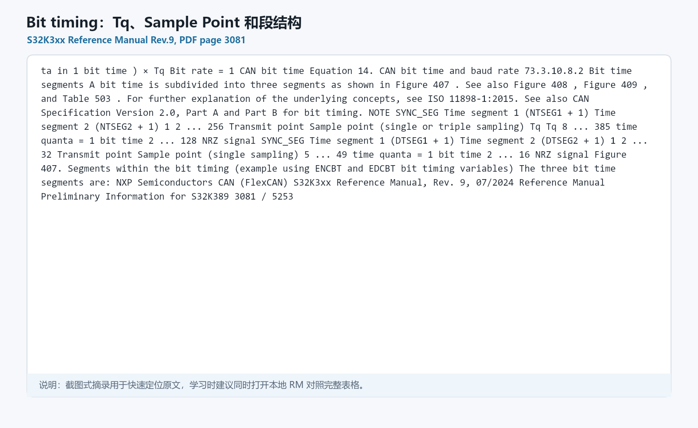


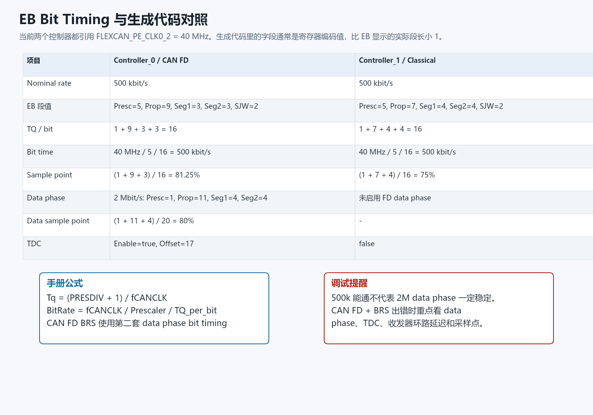


### 8.1 CanController_0 nominal phase：500 kbit/s

EB 配置：

| 参数 | 值 |
|---|---:|
| `CanControllerBaudRate` | 500.0 kbit/s |
| `CanControllerPrescaller` | 5 |
| `CanControllerPropSeg` | 9 |
| `CanControllerSeg1` | 3 |
| `CanControllerSeg2` | 3 |
| `CanControllerSyncJumpWidth` | 2 |
| Clock | 40 MHz |

计算：

Tq 总数 = 1 + 9 + 3 + 3 = 16
bitrate = 40 MHz / 5 / 16 = 500 kbit/s
sample point = (1 + 9 + 3) / 16 = 81.25%


### 8.2 CanController_0 data phase：2 Mbit/s CAN FD

EB 配置：

| 参数 | 值 |
|---|---:|
| `CanControllerFdBaudRate` | 2000.0 kbit/s |
| `CanControllerFdPrescaller` | 1 |
| `CanControllerPropSeg` | 11 |
| `CanControllerSeg1` | 4 |
| `CanControllerSeg2` | 4 |
| `CanControllerSyncJumpWidth` | 2 |
| `CanControllerTxBitRateSwitch` | `true` |
| `CanControllerSspOffset` | 17 |

计算：

Tq 总数 = 1 + 11 + 4 + 4 = 20
bitrate = 40 MHz / 1 / 20 = 2 Mbit/s
sample point = (1 + 11 + 4) / 20 = 80%

### 8.3 CanController_1 nominal phase：500 kbit/s Classic CAN

EB 配置：

| 参数 | 值 |
|---|---:|
| `CanControllerBaudRate` | 500.0 kbit/s |
| `CanControllerPrescaller` | 5 |
| `CanControllerPropSeg` | 7 |
| `CanControllerSeg1` | 4 |
| `CanControllerSeg2` | 4 |
| `CanControllerSyncJumpWidth` | 2 |
| Clock | 40 MHz |

计算：

```text
Tq 总数 = 1 + 7 + 4 + 4 = 16
bitrate = 40 MHz / 5 / 16 = 500 kbit/s
sample point = (1 + 7 + 4) / 16 = 75%
```

### 8.4 EB 值和生成代码值为什么不完全一样

在 `Can_43_FLEXCAN_PBcfg.c` 和 `FlexCAN_Ip_PBcfg.c` 里，bit timing 会进入 IP 层结构体。例如 nominal 500 kbit/s 可能生成成：

```c
{
    (uint8)8U,
    (uint8)2U,
    (uint8)2U,
    (uint16)4U,
    (uint8)1U
}
```

这不是 EB UI 写错，而是很多寄存器字段使用 **实际值减 1** 或 IP 内部格式。例如 prescaler=5 最终寄存器/结构体里可能写 `4`，SJW=2 可能写 `1`。学习时建议：

1. EB UI 参数用于计算和评审 bit timing。
2. 生成代码参数用于确认驱动最终会写什么。
3. 真实总线用示波器或 CAN analyzer 验证波特率、采样点兼容性、错误帧情况。

## ==**9. CAN FD、BRS 和 TDC**==

CAN FD 和 Classic CAN 的关键区别：

| 项目         | Classic CAN       | CAN FD              |     |
| ---------- | ----------------- | ------------------- | --- |
| 最大 payload | 8 bytes           | 最高 64 bytes         |     |
| 仲裁段速率      | 固定                | 同 nominal phase     |     |
| 数据段速率      | 同仲裁段              | **可通过 BRS 切到更高速率**  |     |
| 关键控制位      | IDE、RTR、DLC       | EDL/FDF、BRS、ESI、DLC |     |
| 工程例子       | `CanController_1` | `CanController_0`   |     |

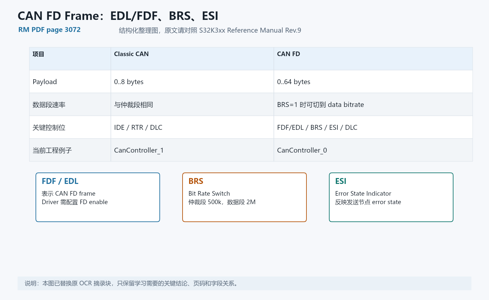

当前 `CanController_0`：

| 项目              | 当前值               |
| --------------- | ----------------- |
| FD enable       | `true`            |
| ISO FD          | `true`            |
| BRS             | `true`            |
| Nominal bitrate | 500 kbit/s        |
| Data bitrate    | 2 Mbit/s          |
| TDC enable      | `true`            |
| TDC offset      | 17                |
| Payload blocks  | 64 / 32 / 8 bytes |

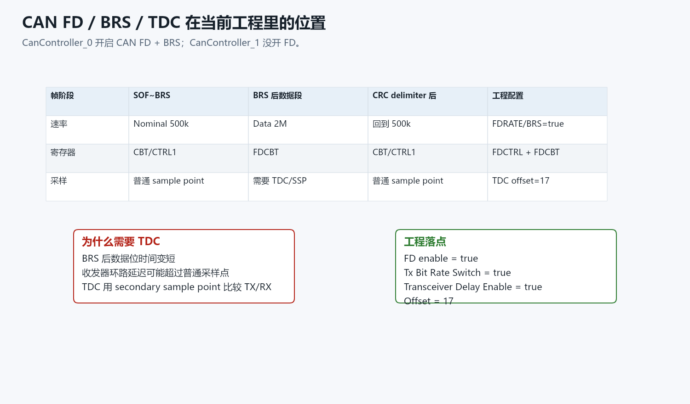

**==TDC 的理解**
1. ==**高速 data phase 下，CAN transceiver 和 PCB 线路延迟会让采样点偏移。**
2. **==TDC 用 Secondary Sample Point 补偿 transmitter delay。**
3. **==EB 里的 `CanControllerSspOffset = 17` 最终生成到 baudrate 配置里。**
4. ==**如果 FD 2 Mbit/s 只在某些节点上不稳定，除了波特率，还要重点查 TDC、transceiver FD 能力、线束长度、终端电阻==**

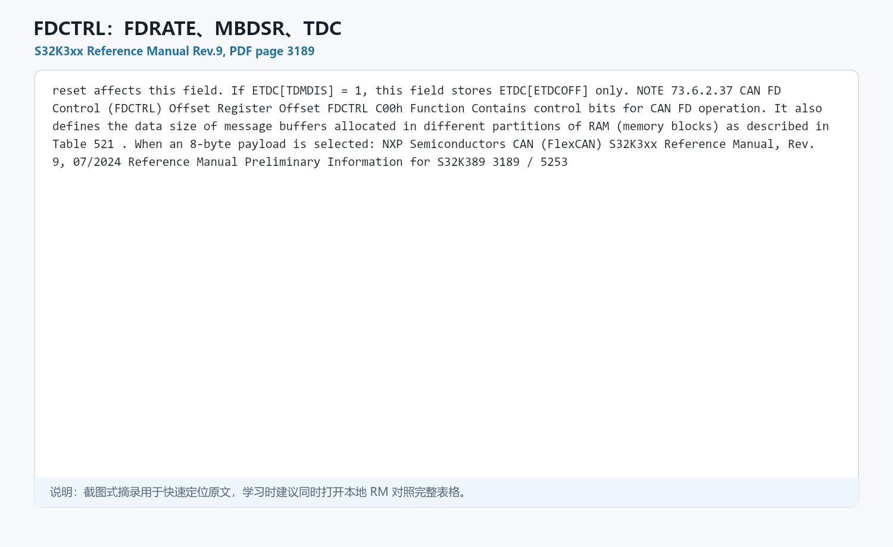

## 10. EB 配置：HOH、HRH、HTH 和 Message Buffer

AUTOSAR CAN Driver 里最重要的对象之一是 `CanHardwareObject`，简称 HOH。按方向分：

| AUTOSAR 名称 | 常用缩写 | 作用 |
|---|---|---|
| Receive Hardware Object | HRH | 接收邮箱，匹配 ID filter 后上报 `CanIf_RxIndication` |
| Transmit Hardware Object | HTH | 发送邮箱，`Can_Write` 使用它发帧 |

当前工程：

| Controller | 硬件通道 | Rx HOH | Tx HOH | Total |
|---|---|---:|---:|---:|
| `CanController_0` | `FLEXCAN_1` | 15 | 4 | 19 |
| `CanController_1` | `FLEXCAN_2` | 1 | 1 | 2 |
| 合计 | | 16 | 5 | 21 |

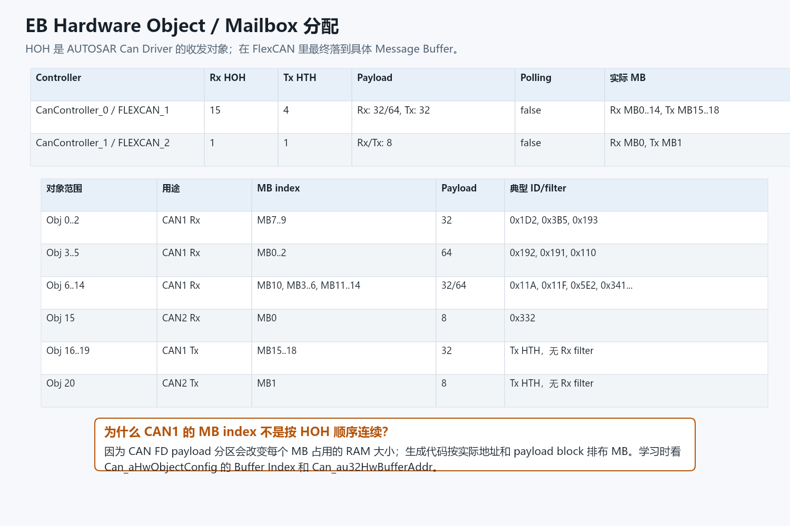

生成宏：

```c
/* BasicSoftware/integration/mcal/src/gen/include/Can_43_FLEXCAN_Cfg.h */
#define CAN_43_FLEXCAN_HWCONTROLLER_SUPPORT       6U
#define CAN_43_FLEXCAN_HWMB_COUNT                 ((uint8)96U)
#define CAN_43_FLEXCAN_CONTROLLER_CONFIG_COUNT    (2U)
#define CAN_43_FLEXCAN_HWOBJECT_CONFIG_COUNT      ((Can_HwHandleType)21U)
#define CAN_43_FLEXCAN_SET_BAUDRATE_API           (STD_ON)
#define CAN_43_FLEXCAN_ABORT_MB_API               (STD_ON)
#define CAN_43_FLEXCAN_DEV_ERROR_DETECT           (STD_OFF)
```

`DEV_ERROR_DETECT = STD_OFF` 的含义：很多 API 参数错误不会走 DET 报错帮助你定位，集成调试时更要靠断点、返回值和生成配置表核对。

## 11. 当前工程 mailbox 映射

当前工程的 mailbox/filter 从 `Can_43_FLEXCAN_PBcfg.c` 可以整理成下表。

### 11.1 CanController_0 / FLEXCAN_1

| ObjId | 方向 | MB | Payload | Filter ID | 说明 |
|---:|---|---:|---:|---:|---|
| 0 | Rx | 7 | 32 | `0x1D2` | `ETAS_CAN_Rx_Std_MailBox_1` |
| 1 | Rx | 8 | 32 | `0x3B5` | `ETAS_CAN_Rx_Std_MailBox_4` |
| 2 | Rx | 9 | 32 | `0x193` | `ETAS_CAN_Rx_Std_MailBox_5` |
| 3 | Rx | 0 | 64 | `0x192` | `ETAS_CAN_Rx_Std_MailBox_6` |
| 4 | Rx | 1 | 64 | `0x191` | `ETAS_CAN_Rx_Std_MailBox_7` |
| 5 | Rx | 2 | 64 | `0x110` | `ETAS_CAN_Rx_Std_MailBox_8` |
| 6 | Rx | 10 | 32 | `0x11A` | `ETAS_CAN_Rx_Std_MailBox_9` |
| 7 | Rx | 3 | 64 | `0x11F` | `ETAS_CAN_Rx_Std_MailBox_10` |
| 8 | Rx | 11 | 32 | `0x5E2` | `ETAS_CAN_Rx_Std_MailBox_11` |
| 9 | Rx | 4 | 64 | `0x341` | `ETAS_CAN_Rx_Std_MailBox_12` |
| 10 | Rx | 5 | 64 | `0x11E` | `ETAS_CAN_Rx_Std_MailBox_13` |
| 11 | Rx | 6 | 64 | `0x117` | `ETAS_CAN_Rx_Std_MailBox_14` |
| 12 | Rx | 12 | 32 | `0x677` | `ETAS_CAN_Rx_Std_MailBox_15` |
| 13 | Rx | 13 | 32 | `0x7DF` | `ETAS_CAN_Rx_Std_MailBox_16` |
| 14 | Rx | 14 | 32 | `0x72B` | `ETAS_CAN_Rx_Std_MailBox_17` |
| 16 | Tx | 15 | 32 | N/A | `ETAS_CAN_Tx_Std_MailBox_1` |
| 17 | Tx | 16 | 32 | N/A | `ETAS_CAN_Tx_Std_MailBox_2` |
| 18 | Tx | 17 | 32 | N/A | `ETAS_CAN_Tx_Std_MailBox_3` |
| 19 | Tx | 18 | 32 | N/A | `ETAS_CAN_Tx_Std_MailBox_4` |

### 11.2 CanController_1 / FLEXCAN_2

| ObjId | 方向 | MB | Payload | Filter ID | 说明 |
|---:|---|---:|---:|---:|---|
| 15 | Rx | 0 | 8 | `0x332` | `ETAS_CAN2_Rx_Std_MailBox_1` |
| 20 | Tx | 1 | 8 | N/A | `ETAS_CAN2_Tx_Std_MailBox_1` |

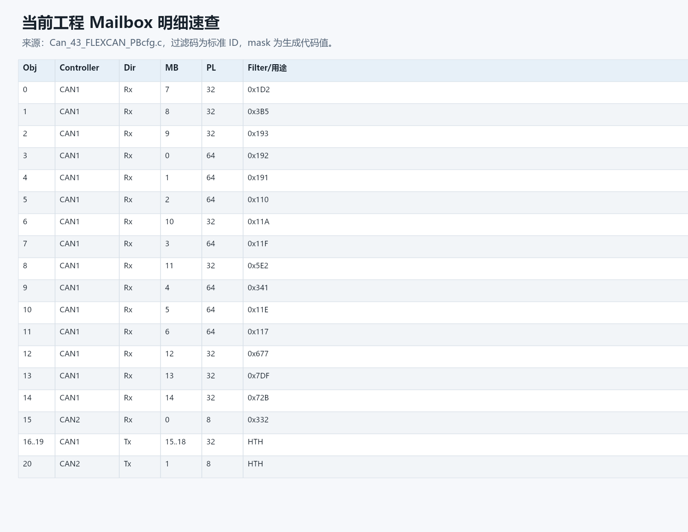

从生成代码能看到 Controller 到硬件 offset 的映射：

```c
static const uint8 Can_aCtrlOffsetToCtrlIDMap[CAN_43_FLEXCAN_HWCONTROLLER_SUPPORT]=
{
    CAN_43_FLEXCAN_CONTROLLER_UNUSED,
    0,
    1,
    CAN_43_FLEXCAN_CONTROLLER_UNUSED,
    CAN_43_FLEXCAN_CONTROLLER_UNUSED,
    CAN_43_FLEXCAN_CONTROLLER_UNUSED
};
```

这表示：

```text
硬件 offset 0 -> 未使用
硬件 offset 1 -> CanController_0
硬件 offset 2 -> CanController_1
硬件 offset 3/4/5 -> 未使用
```

## 12. FlexCAN Message Buffer 结构

FlexCAN 的收发基本单位是 Message Buffer。每个 MB 由控制状态、ID、数据区组成。

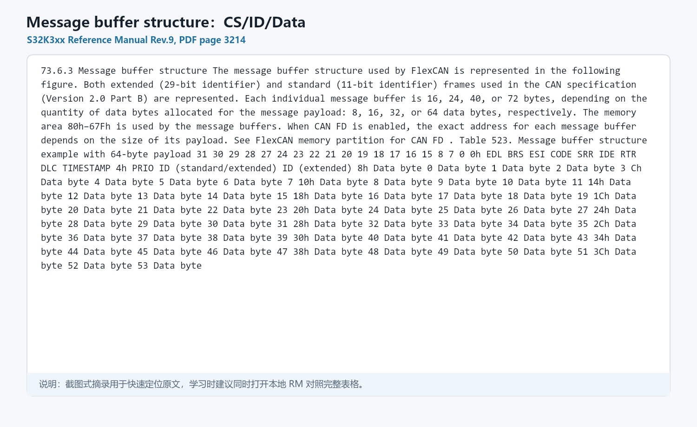

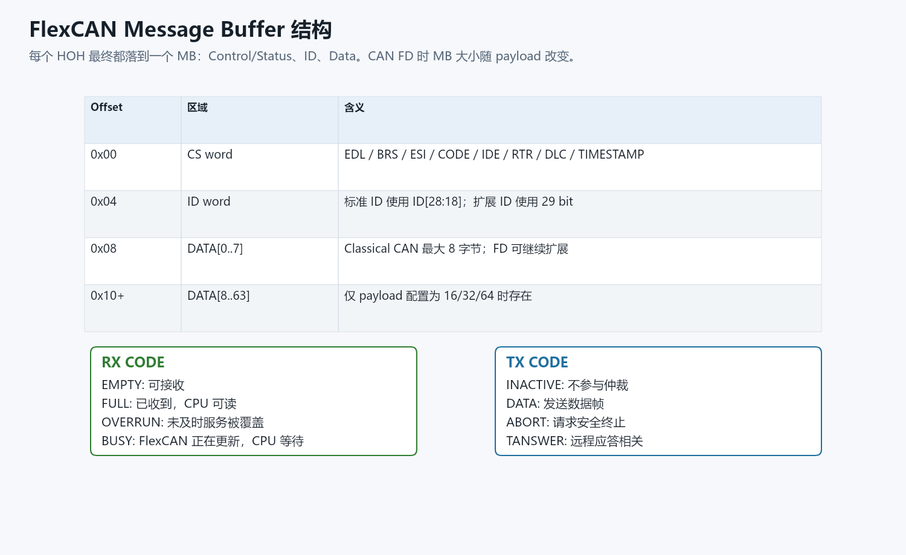

MB 可以理解成硬件里的一个“邮箱”：

```text
MB[n]
  CS word     : CODE、DLC、IDE、RTR、EDL/FDF、BRS、timestamp 等
  ID word     : 标准 ID 或扩展 ID
  DATA word   : payload 数据，Classic CAN 最高 8 bytes，CAN FD 最高 64 bytes
```

CAN FD 下不同 MB 的 payload 大小受 RAM partition 影响。当前 `FLEXCAN_1` payload block 配置为：

```c
{
    FLEXCAN_PAYLOAD_SIZE_64,
    FLEXCAN_PAYLOAD_SIZE_32,
    FLEXCAN_PAYLOAD_SIZE_8
}
```

对应当前 mailbox 分配：

1. MB0..MB6 用 64-byte payload，放 7 个 FD Rx。
2. MB7..MB18 用 32-byte payload，放 8 个 FD Rx + 4 个 FD Tx。
3. 8-byte block 当前对 `FLEXCAN_1` 没实际使用到。

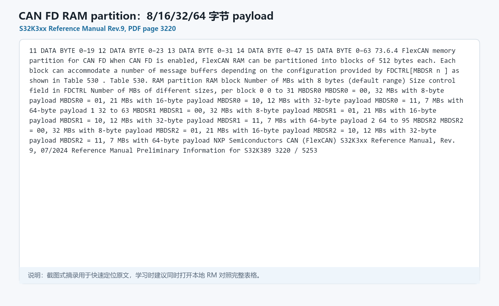

学习时要特别注意：FD payload 越大，每个 MB 占用 RAM 越多，可用 MB 数会下降。不是所有 FlexCAN 实例都能在 FD 64-byte 模式下保留同样多的 mailbox。

## 13. 初始化流程：从 Can_Init 到 FlexCAN RAM

`Can_43_FLEXCAN_Init` 是 CAN Driver 初始化入口。当前工程代码位置：

```text
BasicSoftware/integration/mcal/src/modules/Can_43_FLEXCAN/src/Can_43_FLEXCAN.c:863
```

典型流程：

```text
Can_43_FLEXCAN_Init(Config)
    |
    | 读取 Can_aControllerConfig
    | 初始化 Driver 全局状态
    | 对每个 active controller 调用 IPW
    v
Can_43_FLEXCAN_Ipw_InitController
    |
    | 根据 Controller Offset 选择 FLEXCAN_1 / FLEXCAN_2
    | 配置 baudrate、FD、MB、filter、interrupt callback
    v
FlexCAN_Ip_Init(instance, state, config)
    |
    | 进入 Freeze/Disable 配置窗口
    | 初始化 FlexCAN RAM / MB
    | 写 MCR / CTRL1 / FDCTRL / IMASK / RXIMR
    v
Controller 进入 STOPPED 或准备 START
```

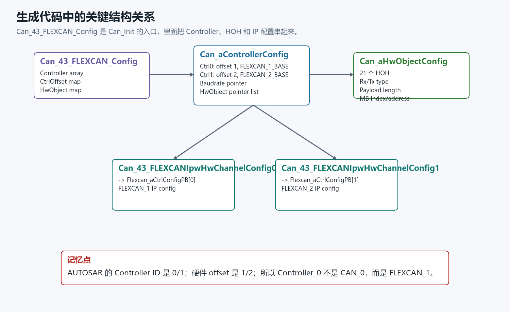

RM 的关键提醒是 FlexCAN RAM 必须初始化；这个动作通常由 `FlexCAN_Ip_Init` 完成。调试时如果你绕过 MCAL，直接裸写寄存器，一定不能跳过 RAM 初始化。

## 14. Controller Mode：Start / Stop / Sleep

AUTOSAR API：

```c
Std_ReturnType Can_43_FLEXCAN_SetControllerMode(
    uint8 Controller,
    Can_ControllerStateType Transition
);
```

代码位置：

```text
BasicSoftware/integration/mcal/src/modules/Can_43_FLEXCAN/src/Can_43_FLEXCAN.c:1117
```

常见状态转换：

| AUTOSAR transition | FlexCAN 硬件动作理解 |
|---|---|
| `CAN_CS_STARTED` | 退出 Freeze/Halt，进入 Normal mode，开始参与总线 |
| `CAN_CS_STOPPED` | 进入 Freeze/Halt 或停止收发，允许重新配置部分参数 |
| `CAN_CS_SLEEP` | 进入低功耗/唤醒相关状态，当前工程 wakeup 不是重点 |

底层会调用类似：

```text
FlexCAN_Ip_SetStartMode(instance)
FlexCAN_Ip_SetStopMode(instance)
```

RM 里 Normal、Freeze、Loopback、Listen-only、Disable 的关系要结合 `MCR[HALT]`、`MCR[FRZ]`、`MCR[MDIS]` 理解。很多寄存器必须在 Freeze/Stop 状态才能安全改。

## 15. 发送流程：Can_Write 到 Tx MB

AUTOSAR API：

```c
Std_ReturnType Can_43_FLEXCAN_Write(
    Can_HwHandleType Hth,
    const Can_PduType * PduInfo
);
```

代码位置：

```text
BasicSoftware/integration/mcal/src/modules/Can_43_FLEXCAN/src/Can_43_FLEXCAN.c:1965
BasicSoftware/integration/mcal/src/modules/Can_43_FLEXCAN/src/Can_43_FLEXCAN_Ipw.c:2303
```

发送流程图：

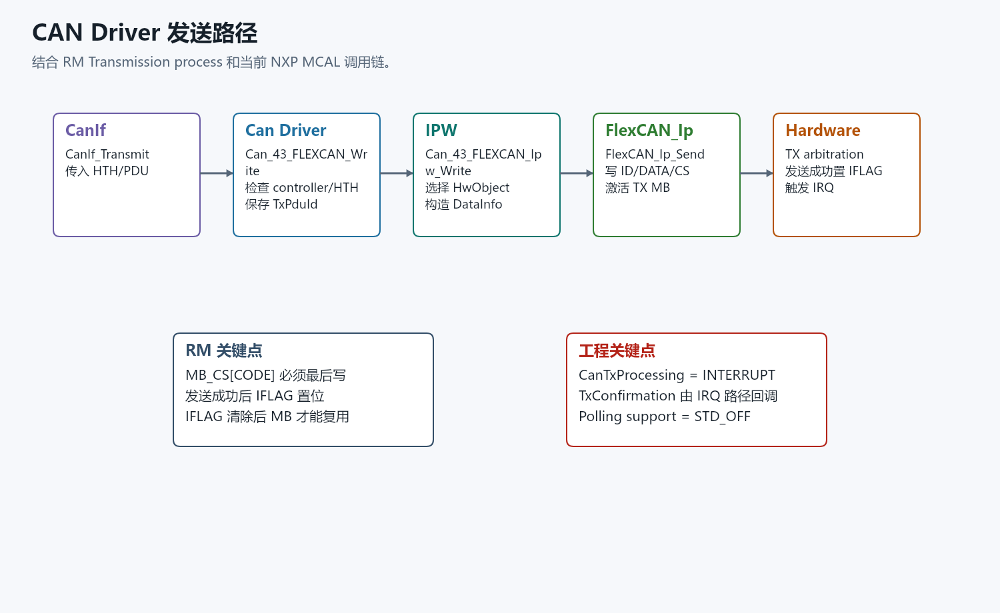

结合 RM 的 TX process：

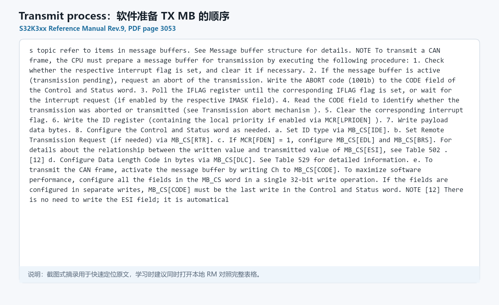

可以按下面顺序理解：

1. 上层 `CanIf` 调用 `Can_Write(Hth, PduInfo)`。
2. CAN Driver 根据 `Hth` 找到 `CanHardwareObject`。
3. Driver 检查 controller 是否 STARTED、mailbox 是否 free、DLC 是否符合 payload。
4. IPW 把 `PduInfo->id`、`PduInfo->length`、`PduInfo->sdu` 转成 FlexCAN MB 需要的 `DataInfo`。
5. 调用 `FlexCAN_Ip_Send(instance, mbIdx, &DataInfo, id, data)`。
6. `FlexCAN_Ip` 写 Tx MB 的 CS/ID/Data，并把 MB CODE 设置成 transmit active。
7. 硬件参与总线仲裁，发送成功后置位对应 `IFLAG`。
8. 中断路径里 Driver 调用 `CanIf_TxConfirmation(PduId)`。

当前工程 Tx confirmation 是 interrupt 方式，不靠主函数轮询：

```text
CanTxProcessing = INTERRUPT
Object uses polling = FALSE
```

调试 Tx 不出帧时，建议按这个顺序查：

```text
CanIf 是否调用到 Can_Write
Hth 是否对应 Tx HOH
Controller 是否 STARTED
Can_Write 返回 E_OK 还是 CAN_BUSY / E_NOT_OK
FlexCAN_Ip_Send 是否被调用
Tx MB CODE / IFLAG 是否变化
CAN_TX 引脚是否有波形
CAN_RX 是否回读到总线 dominant/recessive
是否 ACK error / bus off
```

## 16. 接收流程：Rx MB 到 CanIf_RxIndication

当前工程 Rx 是 interrupt 方式：

```text
CanRxProcessing = INTERRUPT
Object uses polling = FALSE
```

接收流程图：

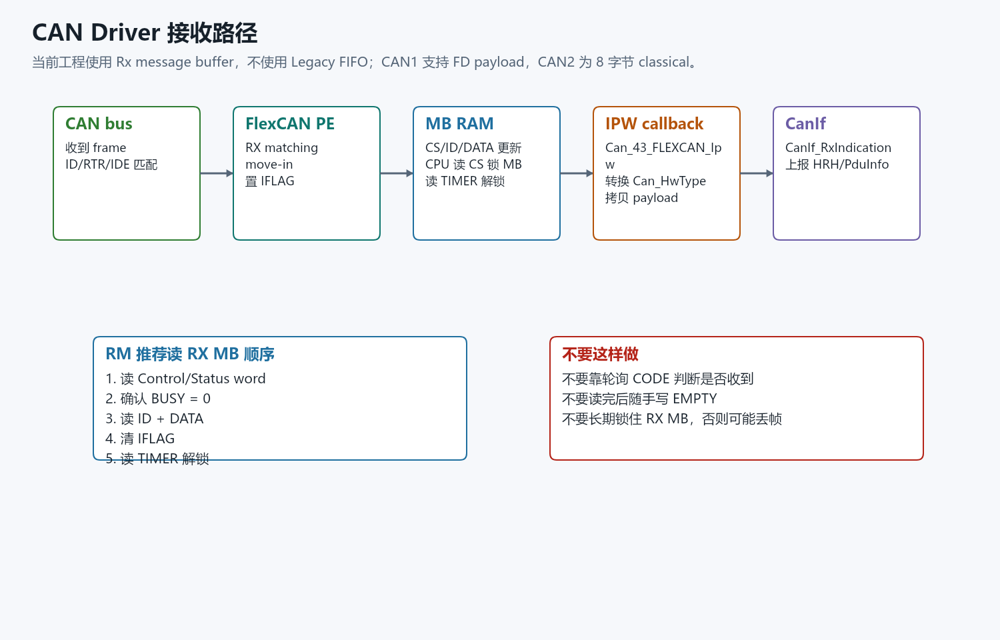

RM 推荐的 Rx MB 读取顺序非常重要：

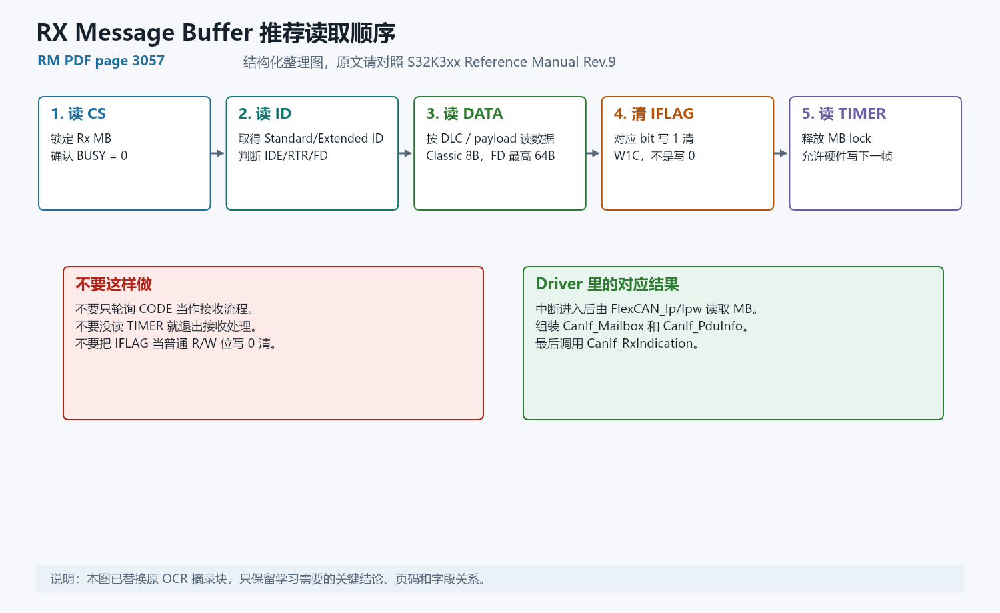

核心顺序：

```text
1. 读 MB CS word，锁定该 MB
2. 确认 BUSY = 0
3. 读 ID word
4. 读 DATA words
5. 写 1 清对应 IFLAG
6. 读 TIMER，释放 MB lock
```

为什么不能简单轮询 `CODE`：

1. Rx MB 有硬件锁定机制，读错顺序可能让硬件无法重新写入新帧。
2. `IFLAG` 是 W1C，清标志动作和 MB 解锁顺序影响下一帧接收。
3. 对高速 CAN FD，错误顺序更容易造成丢帧、重复读、状态卡住。

Driver 里接收完成后走：

```text
Can_43_FLEXCAN_Ipw.c:1127  CanIf_RxIndication(CanIf_Mailbox, CanIf_PduInfo)
Can_43_FLEXCAN_Ipw.c:2781  CanIf_RxIndication(&CanIf_Mailbox, &CanIf_PduInfo)
```

调试收不到帧时，建议按这个顺序查：

```text
总线分析仪确认帧 ID、DLC、FD/BRS 是否符合预期
CAN_RX 引脚是否有波形
Controller bit timing 是否匹配
Rx filter ID/mask 是否匹配
对应 MB 是否被配置为 Rx active
IMASK 是否打开
IFLAG 是否置位
ISR 是否进入
CanIf_RxIndication 是否被调用
CanIf/PduR 上层是否继续转发
```

## 17. 中断、IFLAG 和 BusOff

FlexCAN 的中断来源很多，常见有：

| 中断来源 | 寄存器/标志理解 | Driver 结果 |
|---|---|---|
| MB Rx complete | `IFLAG1` 对应 MB bit | 调 `CanIf_RxIndication` |
| MB Tx complete | `IFLAG1` 对应 MB bit | 调 `CanIf_TxConfirmation` |
| Bus Off | ESR/CTRL interrupt mask 相关 | 调 `CanIf_ControllerBusOff` |
| Error / Warning | Error status、warning flag | Driver error callback 或状态处理 |
| Wakeup | wakeup flag | 当前工程不是重点 |

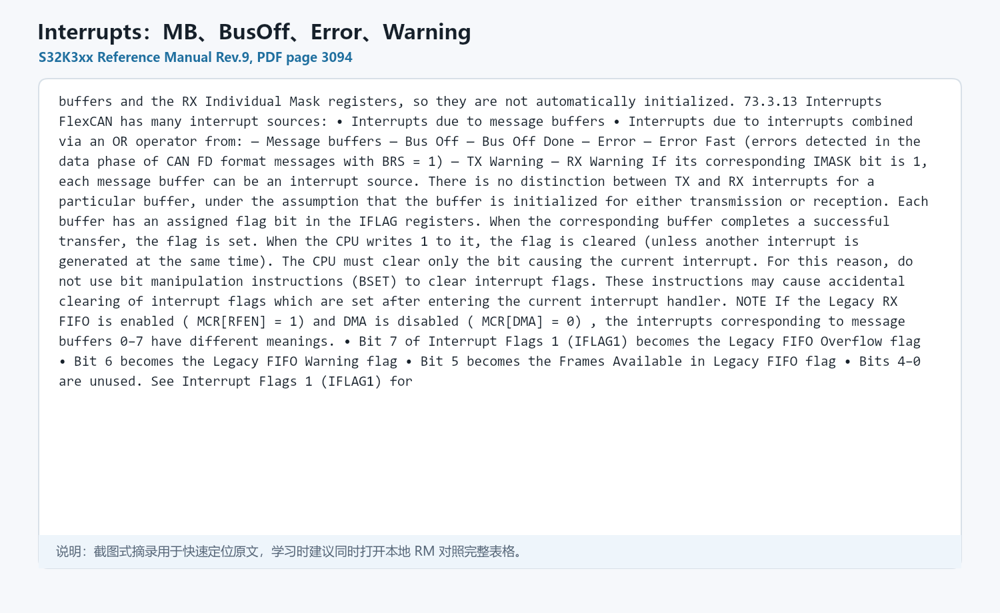

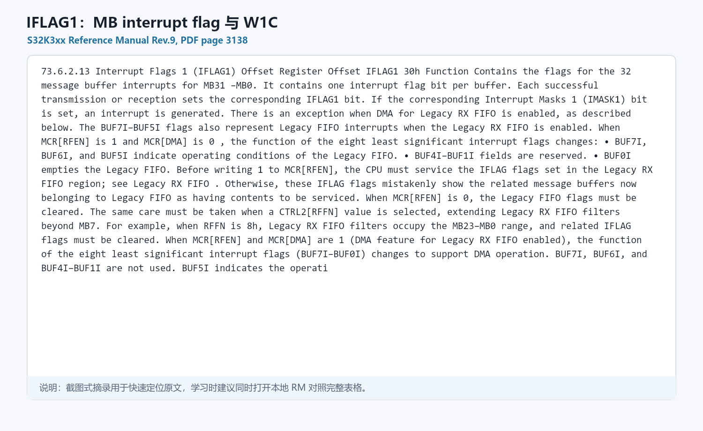

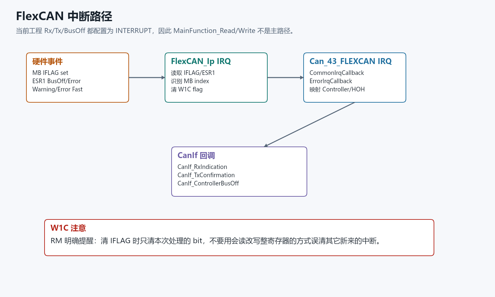

`IFLAG1` 是 W1C，也就是 write 1 clear。调试时常见误区：

1. 读到 1 不代表写 0 能清掉，很多状态位必须写 1 清。
2. 如果中断处理函数没有正确清 `IFLAG`，会反复进中断。
3. 如果过早清 `IFLAG` 或没按 Rx MB 顺序解锁，可能导致接收异常。

BusOff 路径：

```text
FlexCAN 硬件 error counter 达到 bus-off
        |
        v
Error/BusOff interrupt
        |
        v
Can_43_FLEXCAN.c:3076
CanIf_ControllerBusOff(Can_pController->Can_u8AbstControllerID)
```

当前工程 `CanAutoBusOffRecovery = true`，但实际恢复行为还要结合 CanIf/ComM/BswM 对 controller mode 的管理。Driver 能上报 bus off，不代表上层一定会按你期望自动恢复通信。

## 18. 关键寄存器速查

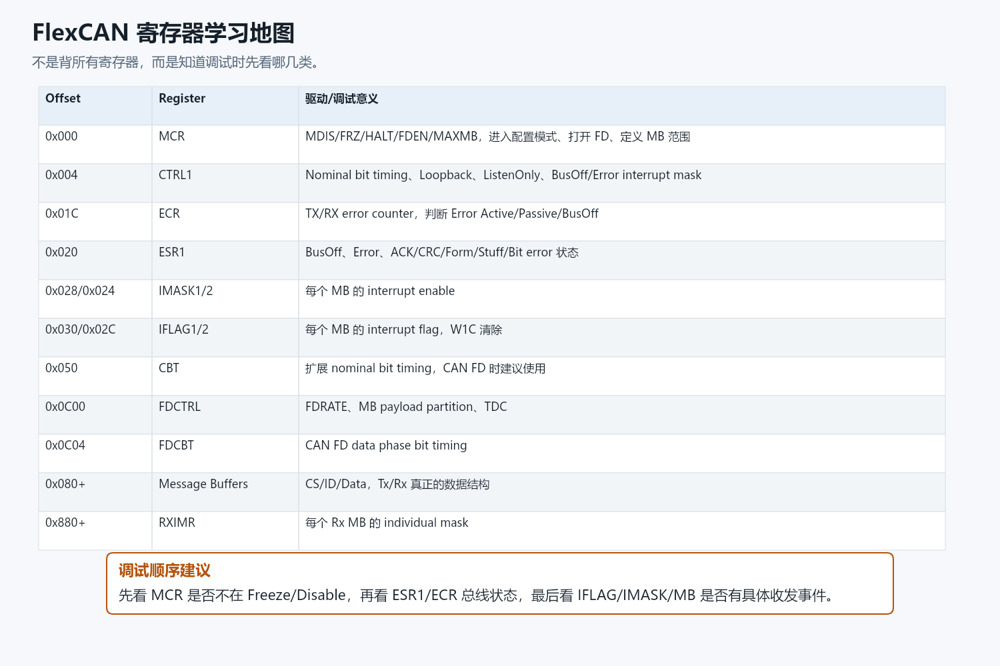

### 18.1 MCR

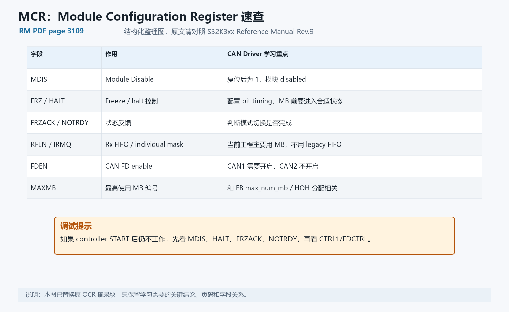

常看字段：

| 字段 | 学习重点 |
|---|---|
| `MDIS` | Module Disable，复位后为 1，模块默认 disabled |
| `FRZ` | Freeze enable，允许进入 freeze |
| `HALT` | 请求停止/进入 freeze |
| `NOTRDY` | 模块未准备好 |
| `FRZACK` | freeze acknowledge |
| `SOFTRST` | software reset |
| `RFEN` | legacy Rx FIFO enable |
| `IRMQ` | individual Rx masking and queue |
| `FDEN` | CAN FD enable |
| `MAXMB` | 使用到的最高 MB 编号 |

对 CAN Driver 的意义：

1. 初始化和改 bit timing 时，需要在合适模式下写寄存器。
2. FD enable 必须和 MB RAM partition、payload size 配套。
3. `MAXMB` 和 EB 的 `max_num_mb`、HOH/MB 数有关。

### 18.2 CTRL1

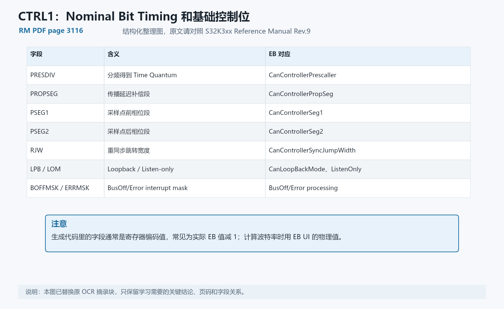

常看字段：

| 字段 | 学习重点 |
|---|---|
| `PRESDIV` | nominal phase 分频 |
| `PROPSEG` | propagation segment |
| `PSEG1` | phase segment 1 |
| `PSEG2` | phase segment 2 |
| `RJW` | resync jump width |
| `LOM` | listen-only |
| `LPB` | loopback |
| `BOFFMSK` | bus-off interrupt mask |
| `ERRMSK` | error interrupt mask |
| `CLKSRC` | clock source |

### 18.3 FDCTRL

`FDCTRL` 主要服务 CAN FD：

| 字段 | 学习重点 |
|---|---|
| `FDRATE` | data phase 是否使用更高 bit rate，也就是 BRS 相关 |
| `MBDSR` | mailbox data size region，决定各 RAM block payload size |
| `TDCEN` | transceiver delay compensation enable |
| `TDCOFF` | TDC offset |
| `TDCVAL` | measured delay value |

### 18.4 IFLAG / IMASK

| 寄存器 | 作用 |
|---|---|
| `IFLAG1` | MB interrupt flag，W1C |
| `IMASK1` | MB interrupt mask |
| `RXIMR` | individual Rx mask |
| `TIMER` | free-running timer，Rx MB 解锁流程里要读 |

调试建议：

```text
Rx 不进中断：看 IMASK1 对应 bit 是否打开，IFLAG1 是否置位
Tx 不确认：看 Tx MB 对应 IFLAG 是否置位，Tx interrupt 是否打开
反复进中断：看 IFLAG 是否被 W1C 清掉
接收卡住：看 Rx MB 读取顺序和 TIMER read 是否完成
```

## 19. 生成代码怎么读

### 19.1 宏开关

文件：

```text
BasicSoftware/integration/mcal/src/gen/include/Can_43_FLEXCAN_Cfg.h
```

关键行：

| 行号 | 宏 | 当前值 | 意义 |
|---:|---|---|---|
| 140 | `CAN_43_FLEXCAN_HWCONTROLLER_SUPPORT` | `6U` | 芯片支持 6 个硬件 controller |
| 160 | `CAN_43_FLEXCAN_HWMB_COUNT` | `96U` | 最大 MB 能力，来自最强实例 |
| 184 | `CAN_43_FLEXCAN_DEV_ERROR_DETECT` | `STD_OFF` | DET 关闭 |
| 194 | `CAN_43_FLEXCAN_SET_BAUDRATE_API` | `STD_ON` | 支持运行时切换 baudrate API |
| 199 | `CAN_43_FLEXCAN_ABORT_MB_API` | `STD_ON` | 支持 abort MB |
| 263 | `CAN_43_FLEXCAN_CONTROLLER_CONFIG_COUNT` | `2U` | 当前配置 2 个 controller |
| 268 | `CAN_43_FLEXCAN_HWOBJECT_CONFIG_COUNT` | `21U` | 当前配置 21 个 HOH |

### 19.2 Controller 配置

文件：

```text
BasicSoftware/integration/mcal/src/gen/src/Can_43_FLEXCAN_PBcfg.c
```

重点结构体：

```text
Can_aControllerConfig[]
Can_aBaudrateConfig_Ctrl0[]
Can_aBaudrateConfig_Ctrl1[]
Can_apHwObject_Ctrl0[]
Can_apHwObject_Ctrl1[]
Can_aHwObjectConfig[]
Can_aHwFilter_Object*
```

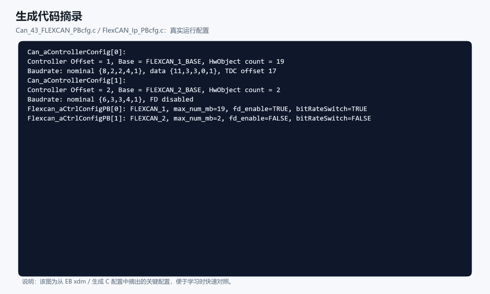

`Can_aControllerConfig` 里能看到：

```text
CanController_0:
  Abstracted CanIf Controller ID = 0
  Controller ID                  = 0
  Controller Offset              = 1
  Controller Base Address        = FLEXCAN_1_BASE

CanController_1:
  Controller Offset              = 2
  Controller Base Address        = FLEXCAN_2_BASE
```

这再次证明：`CanController_0` 是 AUTOSAR ID，不等于硬件 `CAN_0`。

### 19.3 FlexCAN IP 配置

文件：

```text
BasicSoftware/integration/mcal/src/gen/src/FlexCAN_Ip_PBcfg.c
```

重点结构体：

```c
const Flexcan_Ip_ConfigType Flexcan_aCtrlConfigPB[2U]
```

`FLEXCAN_1` 生成内容摘要：

```text
max_num_mb     = 19
fd_enable      = TRUE
bitRateSwitch  = TRUE
payload        = 64 / 32 / 8
ctrlOptions    = BUSOFF_RECOVERY | ISO | EACEN
Callback       = Can_43_FLEXCAN_CommonIrqCallback
ErrorCallback  = Can_43_FLEXCAN_ErrorIrqCallback
```

`FLEXCAN_2` 生成内容摘要：

```text
max_num_mb     = 2
fd_enable      = FALSE
bitRateSwitch  = FALSE
payload        = 8 / 8 / 8
ctrlOptions    = BUSOFF_RECOVERY | EACEN
Callback       = Can_43_FLEXCAN_CommonIrqCallback
ErrorCallback  = Can_43_FLEXCAN_ErrorIrqCallback
```

## 20. Driver API 和调用链

当前工程 CAN Driver 主要 API：

| API | 代码位置 | 作用 |
|---|---|---|
| `Can_43_FLEXCAN_Init` | `Can_43_FLEXCAN.c:863` | 初始化 CAN Driver 和 FlexCAN controller |
| `Can_43_FLEXCAN_DeInit` | 同文件 | 反初始化 |
| `Can_43_FLEXCAN_SetBaudrate` | 同文件 | 切换 baudrate config |
| `Can_43_FLEXCAN_SetControllerMode` | `Can_43_FLEXCAN.c:1117` | START/STOP/SLEEP |
| `Can_43_FLEXCAN_Write` | `Can_43_FLEXCAN.c:1965` | 发送 CAN/CAN FD PDU |
| `Can_43_FLEXCAN_AbortMb` | 同文件 | abort mailbox |
| `Can_43_FLEXCAN_MainFunction_Write` | `Can_43_FLEXCAN.c:2178` | polling Tx 时使用，当前主要不是它 |
| `Can_43_FLEXCAN_MainFunction_Read` | `Can_43_FLEXCAN.c:2338` | polling Rx 时使用，当前主要不是它 |
| `Can_43_FLEXCAN_MainFunction_BusOff` | `Can_43_FLEXCAN.c:2495` | polling BusOff 时使用，当前主要不是它 |
| `Can_43_FLEXCAN_MainFunction_Mode` | `Can_43_FLEXCAN.c:2568` | mode polling |

IP 层关键函数：

| 函数 | 代码位置 | 作用 |
|---|---|---|
| `FlexCAN_Ip_Init` | `FlexCAN_Ip.c:1798` | 初始化实例 |
| `FlexCAN_Ip_Send` | `FlexCAN_Ip.c:1901` | 发送 MB |
| `FlexCAN_Ip_Receive` | `FlexCAN_Ip.c:2005` | 配置/接收 MB |
| `FlexCAN_Ip_SetStartMode` | `FlexCAN_Ip.c:3819` | 进入 start/normal |

Driver 到 CanIf 的回调边界：

| 回调 | 代码位置 | 含义 |
|---|---|---|
| `CanIf_RxIndication` | `Can_43_FLEXCAN_Ipw.c:1127`、`:2781` | 收到帧，上报 CanIf |
| `CanIf_TxConfirmation` | `Can_43_FLEXCAN_Ipw.c:1547`、`:2514` | 发送完成，上报 CanIf |
| `CanIf_ControllerBusOff` | `Can_43_FLEXCAN.c:3076` | bus off，上报 CanIf |

## 21. 结合 EB 做一次配置复盘

假设你要在 EB 里复盘当前 CAN1 / CAN2 配置，可以按这个 checklist：

### 21.1 Mcu

1. 打开 `McuClockSettingConfig_0`。
2. 找到 `FLEXCAN_PE_CLK0_2`，确认 40 MHz。
3. 找到 `McuPeripheral`，确认 `FlexCAN_1` 和 `FlexCAN_2` clock enable。
4. 确认 mode entry slot：`PRTN1_COFB2_REQ66` 和 `PRTN1_COFB2_REQ67`。

### 21.2 Port

1. 找 `PTC8_CAN1_TXD`，mode = `CAN1_CAN1_TX_OUT`。
2. 找 `PTC9_CAN1_RXD`，mode = `CAN1_CAN1_RX_IN`。
3. 找 `PTC7_CAN2_TXD`，mode = `CAN2_CAN2_TX_OUT`。
4. 找 `PTC6_CAN2_RXD`，mode = `CAN2_CAN2_RX_IN`。
5. TX direction 为 OUT，RX direction 为 IN。

### 21.3 Can_43_FLEXCAN / Controller

1. `CanController_0`：`CanHwChannel = FLEXCAN_1`。
2. `CanController_1`：`CanHwChannel = FLEXCAN_2`。
3. 两个 controller 的 Rx/Tx/BusOff 都是 interrupt。
4. `CanController_0` 的 FD ISO 打开，`CanController_1` 关闭。
5. 两个 controller 的 `CanCpuClockRef` 都引用 `FLEXCAN_PE_CLK0_2`。

### 21.4 Baudrate

1. CAN1 nominal 500k：`5, 9, 3, 3, 2`。
2. CAN1 FD data 2M：`1, 11, 4, 4, 2`，BRS true，TDC offset 17。
3. CAN2 nominal 500k：`5, 7, 4, 4, 2`。
4. 生成后在 `Can_43_FLEXCAN_PBcfg.c` 和 `FlexCAN_Ip_PBcfg.c` 里复核。

### 21.5 HOH

1. 确认 Rx HOH 的 ID filter 和 mask。
2. 确认 payload length 是否匹配报文 DLC，FD 报文尤其要注意。
3. 确认 Tx HTH 的 payload length 是否能承载上层要发的 PDU。
4. 确认所有 HOH `Object uses polling = FALSE`，因为当前走中断。

## 22. 常见问题和定位方法

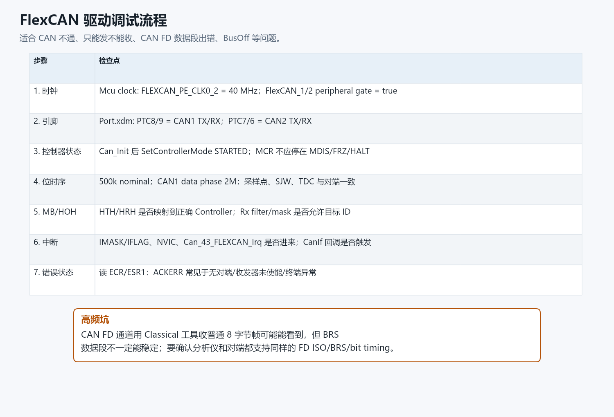

### 22.1 Can_Write 返回忙或失败

重点查：

1. HTH 是否是 Tx HOH，不要把 HRH 传给 `Can_Write`。
2. Controller 是否 STARTED。
3. Tx MB 是否还在 busy。
4. DLC 是否超过 HOH payload。
5. 对 CAN FD 帧，上层 ID 标志、DLC、FD/BRS 是否和 controller 能力匹配。
6. `DEV_ERROR_DETECT = STD_OFF` 时，不要指望 DET 自动告诉你哪个参数错。

### 22.2 总线上无波形

重点查：

1. `Mcu_InitClock` / mode 设置是否完成。
2. `Port_Init` 是否在 CAN Driver start 前执行。
3. `Can_Init` 是否执行，controller 是否 STARTED。
4. CAN transceiver 是否退出 standby/sleep。
5. CAN_TX 引脚是否有波形。
6. Tx MB 是否置 active，IFLAG 是否有 Tx complete。

### 22.3 有发送但对方收不到

重点查：

1. 波特率是否一致。
2. CAN FD / Classic CAN 是否一致。
3. BRS 是否一致，对方是否支持 FD+BRS。
4. ID 是 standard 还是 extended。
5. Bus 是否有 ACK error。
6. CANH/CANL 是否接反，终端电阻是否正确。

### 22.4 本端收不到对方帧

重点查：

1. CAN_RX 引脚是否有波形。
2. `PTC6/PTC9` 是否复用成 CAN RX。
3. Rx filter ID/mask 是否匹配。
4. Rx MB payload 是否够大。
5. `IMASK1` 是否打开，`IFLAG1` 是否置位。
6. ISR 是否注册并进入。
7. `CanIf_RxIndication` 是否被调用。

### 22.5 FD 低速可以，高速数据段不稳定

重点查：

1. `CanControllerFdBaudRate` 是否对。
2. Sample point 是否适合网络拓扑。
3. TDC 是否打开，offset 是否合理。
4. Transceiver 是否支持目标 FD data rate。
5. 线束长度和节点数是否适合 2 Mbit/s。
6. CAN analyzer 是否也配置了 FD+BRS。

### 22.6 BusOff

重点查：

1. ESR/error counter。
2. 是否 ACK error 大量增加。
3. 是否只有一个节点在发，没有其他节点 ACK。
4. bit timing 是否错。
5. CANH/CANL 硬件错误。
6. `CanIf_ControllerBusOff` 是否被调用。
7. 上层是否按设计请求 controller recovery。

## 23. 把手册和 EB 对起来

| 学习点 | RM Chapter 73 | EB / 生成代码 |
|---|---|---|
| FlexCAN 实例能力 | 3044 实例表 | `CanHwChannel = FLEXCAN_1/2`，`S32K324_FLEXCAN.h` base address |
| 模块使能和 RAM 初始化 | 3047，`MCR[MDIS]`、memory init | `FlexCAN_Ip_Init` |
| 模式切换 | 3051-3052 | `Can_SetControllerMode`、`FlexCAN_Ip_SetStartMode` |
| Tx MB 流程 | 3053-3055 | `Can_Write`、`FlexCAN_Ip_Send` |
| Rx MB 流程 | 3056-3057 | `FlexCAN_Ip_Receive`、`CanIf_RxIndication` |
| CAN FD / BRS | 3072-3075 | `CanControllerFdISO`、`CanControllerTxBitRateSwitch` |
| TDC | 3076-3077、FDCTRL | `CanControllerSspOffset = 17` |
| Bit timing | 3080-3084 | `CanControllerPrescaller/PropSeg/Seg1/Seg2/SJW` |
| Clocks | 3089-3094 | `FLEXCAN_PE_CLK0_2 = 40 MHz` |
| Interrupts | 3094、IFLAG/IMASK | `CanRxProcessing/CanTxProcessing/CanBusoffProcessing = INTERRUPT` |
| MB RAM partition | 3220-3225 | `FLEXCAN_PAYLOAD_SIZE_64/32/8` |

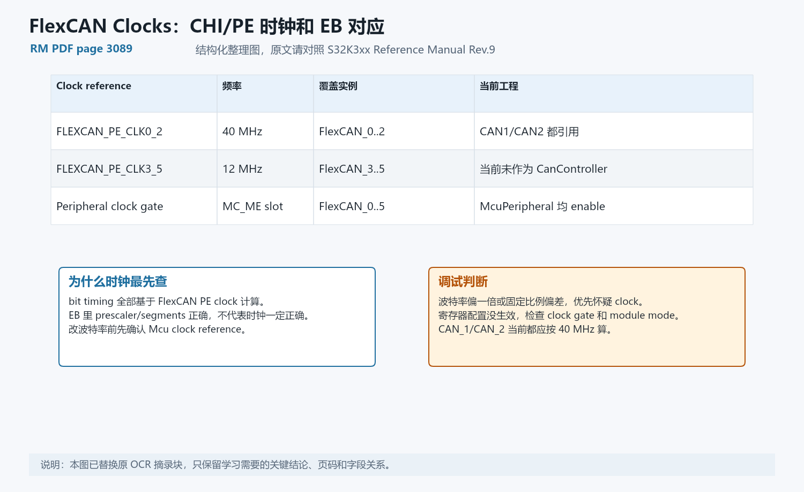

## 24. 学习路线建议

如果是第一次学 CAN Driver，建议不要一上来就读完整源码。更好的路线：

1. 用本文第 3-8 章把 S32K324 的实例、时钟、引脚、controller、baudrate 搞清楚。
2. 用第 10-12 章理解 HOH/MB/filter/payload。
3. 打开 `Can_43_FLEXCAN_PBcfg.c`，只看当前两个 controller 的生成结构体。
4. 打开 `FlexCAN_Ip_PBcfg.c`，看 `fd_enable`、`bitRateSwitch`、payload、callback。
5. 打断点在 `Can_43_FLEXCAN_Init`、`Can_43_FLEXCAN_SetControllerMode`、`Can_43_FLEXCAN_Write`。
6. 用 CAN analyzer 发一帧 `0x332`，验证 CAN2 Rx。
7. 用 CAN analyzer 发一帧 CAN FD `0x192` 或当前 CAN1 filter 表里的 ID，验证 CAN1 Rx。
8. 看 `CanIf_RxIndication` 是否进入。
9. 发送一帧，确认 `CanIf_TxConfirmation`。
10. 最后再看 MCR/CTRL1/FDCTRL/IFLAG 的寄存器值。

## 25. 一页速查

```text
当前工程：
  CanController_0 -> FLEXCAN_1 -> CAN_1 base 0x40308000
    Pins: PTC8 TX, PTC9 RX
    Clock: FLEXCAN_PE_CLK0_2 = 40 MHz
    Mode: interrupt Rx/Tx/BusOff
    FD: enabled, ISO, BRS
    Nominal: 500 kbit/s, sample point 81.25%
    Data: 2 Mbit/s, sample point 80%
    TDC: enabled, offset 17
    HOH: 15 Rx + 4 Tx

  CanController_1 -> FLEXCAN_2 -> CAN_2 base 0x4030C000
    Pins: PTC7 TX, PTC6 RX
    Clock: FLEXCAN_PE_CLK0_2 = 40 MHz
    Mode: interrupt Rx/Tx/BusOff
    FD: disabled
    Nominal: 500 kbit/s, sample point 75%
    HOH: 1 Rx + 1 Tx

关键文件：
  Can_43_FLEXCAN.xdm
  Mcu.xdm
  Port.xdm
  Can_43_FLEXCAN_Cfg.h
  Can_43_FLEXCAN_PBcfg.c
  FlexCAN_Ip_PBcfg.c
  Can_43_FLEXCAN.c
  Can_43_FLEXCAN_Ipw.c
  FlexCAN_Ip.c

关键 API：
  Can_43_FLEXCAN_Init
  Can_43_FLEXCAN_SetControllerMode
  Can_43_FLEXCAN_Write
  FlexCAN_Ip_Init
  FlexCAN_Ip_Send
  FlexCAN_Ip_Receive
  CanIf_RxIndication
  CanIf_TxConfirmation
  CanIf_ControllerBusOff
```

## 26. 最后再强调几个坑

1. `CanController_0` 不是 `CAN_0`，当前它是 `FLEXCAN_1`。
2. CAN Driver 配置必须和 Mcu clock、Port mux 一起看。
3. CAN FD 的 payload 配置会影响 MB RAM 划分，不是只改 DLC 就行。
4. EB UI 的 bit timing 值和生成代码里的 IP 层值可能有编码差异，计算用 EB 值，核对写寄存器用生成代码。
5. Rx MB 不要乱读，按 RM 推荐顺序读 `CS -> ID/Data -> clear IFLAG -> TIMER`。
6. `IFLAG` 是 W1C，清中断时写 1。
7. BusOff 不是单纯软件 bug，更多时候是 bit timing、ACK、物理层、transceiver standby、终端电阻问题。
8. 当前 `DEV_ERROR_DETECT = STD_OFF`，调试时要主动看 API 返回值和 Driver 内部状态。
9. CAN FD 2 Mbit/s 不稳定时，TDC、transceiver、线束和 analyzer 配置都要查。
10. 修改 EB 后一定看生成代码，不要只相信 UI 页面。
