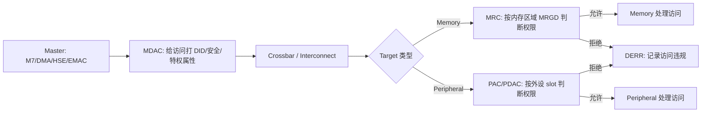

# Chapter 19 Extended Resource Domain Controller (XRDC) 学习笔记

> 适用背景：S32K324 / S32K3xx，面向多核隔离、HSE/安全域、DMA/外设访问控制、AUTOSAR Rm/OS 集成和故障排查。  
> 参考资料：用户提供的 `S32K3xx Reference Manual.pdf` Chapter 19，本工程 `S32K324_XRDC.h`、`Xrdc_Ip_PBcfg.c`、`Xrdc_Ip.c`、`Os_IsXRDCConfigOK.c` 等生成代码，以及 NXP 公开 XRDC API 文档、NXP Community 中关于 S32K3 XRDC PID 和双核共享内存的讨论。  
> 说明：XRDC 是“资源访问控制”模块，不是普通功能外设。学习时不要只背寄存器，要先抓住“谁访问谁、带什么身份、权限是否允许”这条主线。

---

## 1. 先用一句话抓住 XRDC

XRDC，全称 **Extended Resource Domain Controller**，可以理解成芯片内部的“资源门禁系统”。

它负责回答一个问题：

```text
某个 master 以某个身份访问某个 memory/peripheral，是否允许？
```

如果允许，访问继续。如果不允许，XRDC 终止这次访问、产生访问违规，并把违规信息记录到错误捕获寄存器里。

老师式理解：

XRDC 就像大楼的门禁系统。CPU、DMA、HSE、EMAC 这些 master 是“人”；SRAM、Flash、外设寄存器是“房间”；domain 是“部门”；ACP 是“权限表”。一个人刷卡进房间时，门禁先看他属于哪个部门，再看这个部门有没有读/写权限。

---

## 2. XRDC 解决什么开发问题

在简单单核裸机工程里，所有代码都跑在一个特权上下文里，所有 master 基本都能访问所有资源。这样开发方便，但在汽车 MCU 里风险很大。

典型风险：

- DMA 配错地址，把安全关键变量覆盖了。
- 一个非安全任务误写了安全任务的内存。
- M7_0 和 M7_1 共享资源时互相踩内存。
- HSE 或安全固件使用的 Flash alternate interface 被应用误访问。
- 某个外设只允许安全域使用，但普通应用也能写寄存器。

XRDC 的价值就是给这些访问加硬件边界：

| 场景 | XRDC 的意义 |
|---|---|
| 多核系统 | 让不同 core 处于不同 domain，便于资源隔离 |
| 安全/非安全软件共存 | 限制非安全 domain 访问安全资源 |
| DMA 访问控制 | 防止 DMA 访问不该访问的内存或外设 |
| HSE/安全固件保护 | 保护安全固件专用接口和资源 |
| AUTOSAR OS/Rm | 支撑多核 OS、资源管理和 SEMA42 锁机制 |
| 故障定位 | 记录违规访问地址、domain、读写类型和安全属性 |

**重点：XRDC 不是 MPU 的替代品，而是 MPU 之外的系统级访问控制。**  
MPU 通常是每个 CPU core 内部的本地保护；XRDC 则在总线系统上控制多个 master 到多个 target 的访问。

---

## 3. XRDC 的核心模型

XRDC 的主线可以拆成三步：



这里有几个关键词：

| 概念 | 全称 | 作用 |
|---|---|---|
| master | bus master | 发起访问的一方，例如 CPU、DMA、HSE、EMAC |
| target | memory/peripheral | 被访问的一方，例如 Flash、SRAM、AIPS 外设 |
| domain | resource domain | 资源隔离组 |
| DID | Domain ID | domain 的编号，随总线访问一起传播 |
| MDAC | Master Domain Assignment Controller | 给 master 的访问分配 DID、secure、privileged 属性 |
| MRC | Memory Region Controller | 对内存地址范围做权限判断 |
| PAC/PDAC | Peripheral Access Controller | 对外设 slot 做权限判断 |
| ACP | Access Control Policy | 权限策略，决定读/写是否允许 |
| DERR | Domain Error | 访问违规捕获寄存器 |

---

## 4. Domain 是什么

Domain 是 XRDC 里最重要的概念。

手册的定义可以通俗化为：

> 一个 domain 是一组 master 加上一组允许访问的 memory/peripheral，构成一个隔离的计算环境。

比如你可以设计：

| Domain | 可能放哪些 master | 可能允许访问哪些资源 |
|---|---|---|
| Domain0 | M7_0、DMA、安全启动代码 | 全部基础资源 |
| Domain1 | M7_1 或某个应用核 | 自己的代码区、数据区、部分外设 |
| Domain2 | HSE/安全服务或受限任务 | 安全相关资源 |

实际项目不一定这么分，取决于安全架构。

### 4.1 S32K324 支持的 DID

本工程生成配置里：

```c
#define XRDC_NUMBER_OF_DOMAINID (uint32)(3UL)
```

也就是说，本工程针对 S32K324 使用 3 个 Domain ID：

```text
DID = 0, 1, 2
```

当前工程生成配置实际只用了：

```text
Domain0
Domain1
```

Domain2 在能力上存在，但当前配置没有作为 active domain 使用。

**易错点：** 不要把 `XRDC_NUMBER_OF_DOMAINID = 3` 理解成 domain 编号是 1、2、3。domain 编号从 0 开始，所以是 0、1、2。

### 4.2 一个 core 可以属于多个 domain 吗

手册说，一个 core 可以被分配到多个 domain，但同一时刻只有一个 domain 是 active 的。

这通常通过 PID-based domain assignment 来实现：同一个 core 执行不同进程、任务或上下文时，PID 不同，MDAC 根据 PID 把访问分到不同 DID。

本工程当前配置里：

```text
PID mode disable
```

所以当前项目主要是直接 domain assignment，不是按 PID 动态切 domain。

---

## 5. XRDC 的一次访问怎么被判断

手册把 XRDC transaction flow 分成几步。开发时可以记成这条链：

```text
Master 发起访问
    -> MDAC 给 transaction 打上 DID / secure / privileged
    -> crossbar 转发
    -> 如果目标是 memory，MRC 查 MRGD
    -> 如果目标是 peripheral，PAC 查 PDAC
    -> 权限通过就访问目标
    -> 权限失败就终止访问并记录 DERR
```

更具体：

1. CPU、DMA、HSE、EMAC 等 master 发起读或写。
2. XRDC 的 MDAC 拦截请求，为这次访问生成：
   - DID。
   - privileged/user 属性。
   - secure/nonsecure 属性。
3. 请求带着这些属性穿过 interconnect/crossbar。
4. 到达目标前，XRDC 的 MRC 或 PAC 再检查目标权限。
5. 如果权限足够，访问继续。
6. 如果权限不足，XRDC 产生 access violation，记录错误地址和属性。

**重点：XRDC 主要参与请求方向，不参与目标返回数据的正常路径。**  
也就是说，XRDC 主要在“发起访问时”判断能不能进门。

---

## 6. 三个核心子模块：MDAC、MRC、PAC

### 6.1 MDAC：给 master 分配 domain

MDAC 是 **Master Domain Assignment Controller**。

它的任务是：

```text
这个 master 发起的访问，应该带哪个 DID？
```

S32K324 常见 master 包括：

- Cortex-M7_0。
- eDMA。
- HSE 相关 master。
- Cortex-M7_1。
- EMAC/GMAC AHB。

本工程 `Xrdc_Ip_PBcfg.c` 里的 domain 配置如下：

| 配置项 | Master | 类型 | 分配 Domain |
|---|---|---|---|
| `XRDC_MDAC0` | M7_0 | core master | `XRDC_DOMAIN0` |
| `XRDC_MDAC1` | eDMA | noncore master | `XRDC_DOMAIN0` |
| `XRDC_MDAC3` | 工程类型定义为 `XRDC_CORE_HSE` | core master | `XRDC_DOMAIN0` |
| `XRDC_MDAC5` | EMAC/GMAC AHB | noncore master | `XRDC_DOMAIN0` |
| `XRDC_MDAC4` | M7_1 | core master | `XRDC_DOMAIN1` |

这说明当前工程的隔离策略大致是：

```text
M7_0 / DMA / HSE / EMAC 在 Domain0
M7_1 在 Domain1
```

### 6.2 MRC：控制 memory region

MRC 是 **Memory Region Controller**。

它的任务是：

```text
某个 domain 能不能访问某个地址范围？
```

一个 MRC 通过多个 memory region descriptor 管理内存区域。每个 descriptor 定义：

- 起始地址。
- 结束地址。
- 每个 domain 的访问权限。
- 可选 semaphore 条件。
- valid/lock 状态。

本工程配置了 9 个 memory region：

| 工程配置名 | MRC | 开发理解 |
|---|---|---|
| `Xrdc_0_PFLASH_0` | `XRDC_MRC0` | PFLASH 相关入口 |
| `Xrdc_0_PFLASH_1` | `XRDC_MRC0` | PFLASH 相关入口 |
| `Xrdc_0_PFLASH_2` | `XRDC_MRC0` | PFLASH 相关入口 |
| `Xrdc_0_PFLASH_3` | `XRDC_MRC0` | PFLASH 相关入口 |
| `Xrdc_0_PFLASH_WR` | `XRDC_MRC0` | PFLASH write path |
| `Xrdc_0_PRAM0_0` | `XRDC_MRC1` | PRAM0 |
| `Xrdc_0_PRAM1_0` | `XRDC_MRC1` | PRAM1 |
| `Xrdc_0_TCM` | `XRDC_MRC1` | TCM path |
| `Xrdc_0_QuadSPI` | `XRDC_MRC2` | QuadSPI memory path |

### 6.3 PAC/PDAC：控制 peripheral slot

PAC 是 **Peripheral Access Controller**，PDAC 是具体的 peripheral domain access control register。

它的任务是：

```text
某个 domain 能不能访问某个外设 slot？
```

S32K324 上有 AIPS_0、AIPS_1、AIPS_2 等外设总线区域，XRDC 通过 PAC/PDAC 控制外设访问。

本工程生成配置里：

```c
static const Xrdc_Ip_PeripheralConfigType Xrdc_Peripheral_Config_XRDC_INSTANCE0[145]
```

说明项目配置了 145 个 peripheral slot。每个 slot 都有：

- peripheral slot number。
- 是否启用 SEMA4。
- SEMA4 gate number。
- PDAC lock。
- Domain0-7 的 ACP。
- Domain8-15 的 ACP。

**易错点：** 参考手册 Chapter 19 不直接给出所有外设到 PDAC slot 的完整映射，而是提示去看随手册附带的 memory map file。实际项目中要以工具生成配置、芯片 memory map、S32K324 头文件三者交叉确认。

---

## 7. Access Control Policy (ACP)

ACP 是 XRDC 的权限编码。

每个 domain 对某个 target 都有一个 3-bit 的 `DdACP` 字段：

```text
D0ACP: Domain0 的权限
D1ACP: Domain1 的权限
D2ACP: Domain2 的权限
...
```

它会根据访问属性判断是否允许：

- secure privileged。
- secure user。
- nonsecure privileged。
- nonsecure user。
- read。
- write。

按参考手册表 85 整理，常用理解如下：

| `DdACP` | 大致含义 |
|---|---|
| `000b` | 无访问权限 |
| `001b` | 仅较高安全/特权等级可访问 |
| `010b` | 安全特权可读写，非安全特权通常只允许部分读访问 |
| `011b` | 安全态可读写，非安全特权通常只允许读 |
| `100b` | 安全态可读写，非安全态无访问 |
| `101b` | 安全态可读写，非安全态有部分访问 |
| `110b` | 安全态和非安全特权可读写，非安全用户无访问 |
| `111b` | 最宽松，通常表示各访问等级都可读写 |

学习阶段先记住两个极端：

```text
000b = 不允许
111b = 最宽松
```

本工程里大量使用：

```c
0x3fUL
```

`0x3f` 的二进制低 6 位是：

```text
111 111
```

也就是：

```text
D0ACP = 111b
D1ACP = 111b
D2ACP = 000b
```

所以当前工程的总体效果可以理解成：

```text
Domain0 和 Domain1 有访问权限
Domain2 没有访问权限
```

这和“当前只用了 Domain0/Domain1”的工程策略是一致的。

---

## 8. MDA 寄存器：master 怎么拿到 DID

MDA 是 **Master Domain Assignment**。

它分两种格式：

| 格式 | 用途 | 典型 master |
|---|---|---|
| `DFMT0` | core master domain assignment | Cortex-M7_0、Cortex-M7_1 |
| `DFMT1` | noncore master domain assignment | eDMA、EMAC 等 |

### 8.1 DFMT0：core master

DFMT0 用于 core master。关键字段：

| 字段 | 含义 |
|---|---|
| `VLD` | 这条 domain assignment 是否有效 |
| `LK1` | 锁住 MDA 寄存器，直到下次 reset |
| `DFMT` | 0 表示 DFMT0 |
| `PID` | PID-based domain assignment 时使用 |
| `PIDM` | PID mask |
| `PE` | PID enable |
| `DIDS` | DID 来源选择 |
| `DID` | domain id |

本工程 core master 的 PID 都是 disabled，所以可以先按“直接分配 DID”理解。

比如 M7_0：

```text
XRDC_MDAC0 -> XRDC_DOMAIN0
```

M7_1：

```text
XRDC_MDAC4 -> XRDC_DOMAIN1
```

### 8.2 DFMT1：noncore master

DFMT1 用于 noncore master。关键字段：

| 字段 | 含义 |
|---|---|
| `VLD` | 有效位 |
| `LK1` | 锁定位 |
| `DFMT` | 1 表示 DFMT1 |
| `DIDB` | DID bypass |
| `SA` | secure attribute 处理方式 |
| `PA` | privileged attribute 处理方式 |
| `DID` | domain id |

DFMT1 的 `SA` 和 `PA` 很有用，因为 DMA/EMAC 这类 noncore master 不一定天然有和 CPU 一样清晰的安全/特权状态。XRDC 可以强制它们为 secure/nonsecure、privileged/user，或者直接使用 master 输入属性。

本工程配置中 noncore master：

- eDMA 在 Domain0。
- EMAC/GMAC AHB 在 Domain0。

### 8.3 DID 没命中时会怎样

手册提醒：如果一个 master 有多个 MDA 条件，但没有任何条件 hit，那么生成的 DID 是 0。

这很危险，因为 Domain0 往往权限最大。

**易错点：** 如果你设计了 PID-based domain，但 PID 条件没命中，访问可能掉回 DID0。此时如果 DID0 权限很宽，隔离就被绕开了。安全设计里要特别检查这个默认路径。

---

## 9. PID-based domain assignment

PID 是 **Process Identifier**。

它用于让同一个 core 根据当前进程、任务或虚拟上下文切换 domain。

XRDC 的 PID 逻辑大致是：

```text
当前 core 的 PID
    -> 与 MDA 中 PID/PIDM 条件匹配
    -> 匹配某个 MDA descriptor
    -> 得到对应 DID
```

PID 寄存器关键字段：

| 字段 | 含义 |
|---|---|
| `PID[5:0]` | process id |
| `PID[5]` | 对 transaction secure attribute 有影响，0 secure，1 nonsecure |
| `TSM` | three-state model |
| `LK2` | PID 寄存器锁 |

本工程目前：

```text
XRDC_MDA_PID_DISABLE
```

所以 PID 不是当前工程的主要隔离方式。

开发建议：

- 简单双核隔离：先用直接 DID 分配。
- 多任务/虚拟化隔离：再考虑 PID-based domain。
- 使用 PID 时必须设计“未命中默认 DID0”的安全策略。

---

## 10. MRGD：内存区域权限描述符

MRGD 是 **Memory Region Descriptor**。

一个 MRGD 通常由 4 个 word 组成：

| Word | 主要内容 |
|---|---|
| `MRGD_W0` | start address |
| `MRGD_W1` | end address |
| `MRGD_W2` | D0-D4 ACP、SEMA4 enable、SNUM |
| `MRGD_W3` | VLD、LK2 |

### 10.1 地址对齐

手册说明：

- start address 是 32-byte 对齐。
- end address 是 `31 modulo 32`。
- 最小 region size 是 32 byte。

通俗理解：

```text
起始地址低 5 位必须是 0
结束地址低 5 位通常是 11111b
```

本工程 RTD driver 写 MRGD 时会把配置地址 OR 上低位：

```c
start | 0x1UL
end   | 0x1UL
```

这是驱动按寄存器格式处理地址字段的方式。你学习寄存器时要看 RM 的 bit field，不要把 C 配置里的 `0xffffffff` 直接理解成物理地址逐 bit 全参与比较。

### 10.2 Memory region hit

一次 memory 访问到来时，MRC 会判断访问地址是否落在某个有效 region 里。

访问违规的情况包括：

1. 地址没有命中任何定义的 memory region。
2. 地址命中了 region，但该 domain 的 ACP 不允许。
3. 地址命中了多个重叠 region，而且所有命中的 region 都认为违规。

**重点：对于 memory，未定义区域不是默认放行，而是会报 access error。**

### 10.3 MRGD 的 VLD 特别重要

`MRGD_W3[VLD]` 表示该 memory region descriptor 是否有效。

手册里有一个非常容易踩的差异：

```text
CR[GVLD] = 0 时，所有 memory 访问允许
CR[GVLD] = 1 且 MRGD VLD = 0 时，相关 memory 访问会被阻止
```

而 PDAC 对 peripheral 的 invalid 行为不同，后面会讲。

### 10.4 配置 MRGD 的安全顺序

RTD 驱动里的 `Xrdc_Memory_Config_Descriptor()` 做法很值得学：

```text
1. 清 MRGD_W3[VLD]
2. 写 MRGD_W0 start
3. 写 MRGD_W1 end
4. 写 MRGD_W2 ACP / semaphore
5. 最后写 MRGD_W3[VLD] 和高 domain ACP
```

这样可以避免 descriptor 半配置状态下被硬件拿去判断。

---

## 11. PDAC：外设 slot 权限

PDAC 由两个 word 组成：

| Word | 主要内容 |
|---|---|
| `PDAC_W0_s` | D0-D7 ACP、SEMA4 enable、SNUM |
| `PDAC_W1_s` | D8-D15 ACP、VLD、LK2 |

其中 `s` 是 peripheral slot number。

### 11.1 PDAC slot 怎么找

PAC 每个外设 slot 对应一组 PDAC。slot number 通常来自：

- S32K3xx memory map file。
- 配置工具生成的 PDAC 配置。
- RTD/MCAL 生成代码。
- 芯片专用头文件和地址映射。

手册 Chapter 19 里也明确提醒：外设到 PDAC 寄存器的分配要看随文档附带的 memory map file。

### 11.2 PDAC invalid 和 MRGD invalid 不一样

这是本章最容易混的地方之一。

对 peripheral：

```text
CR[GVLD] = 0 或 PDAC VLD = 0 -> 该 peripheral 访问允许
```

对 memory：

```text
CR[GVLD] = 1 且没有有效 region 命中 -> memory 访问报错
```

所以外设的 PDAC 没配，往往是“默认放行”；内存的 MRGD 没配，往往是“没有定义区域，访问失败”。

### 11.3 配置 PDAC 的安全顺序

RTD 驱动里的 `Xrdc_Peripheral_Access_Config()` 做法：

```text
1. 清 PDAC_W1[VLD]
2. 写 PDAC_W0
3. 写 PDAC_W1，设置 VLD 和高 domain ACP
```

同样是先让 descriptor invalid，再写具体内容，最后 valid。

---

## 12. Hardware semaphore 和动态访问权限

XRDC 支持把 SEMA4 加进权限判断。

意思是：某个 domain 即使有静态 ACP 权限，也可能还需要持有某个 semaphore gate，访问才允许。

典型用途：

- 多核共享外设。
- 多核共享 SRAM buffer。
- 某个资源同一时间只允许一个 domain 使用。

MRGD 和 PDAC 里都有：

| 字段 | 含义 |
|---|---|
| `SE` | 是否启用 semaphore 参与判断 |
| `SNUM` | 使用哪个 semaphore number |

本工程当前配置里：

```text
XRDC_SEMA4_DISABLE
```

说明 XRDC 的静态访问控制没有再叠加 SEMA4 条件。

但 RTA-OS 仍然关心 XRDC domain，因为 SEMA42 spin-lock 的实现会使用 domain 信息。

---

## 13. DERR：访问违规怎么记录

当 MRC 或 PAC 检测到访问违规时，XRDC 会记录错误。

### 13.1 DERRLOC

`DERRLOCd` 表示 domain d 里哪些 MRC/PAC 实例发生了错误。

对 S32K324，本工程头文件：

```c
#define XRDC_DERRLOC_COUNT 3u
```

也就是有：

```text
DERRLOC0
DERRLOC1
DERRLOC2
```

分别对应 DID0、DID1、DID2。

### 13.2 DERR_Wx_i 映射

对 S32K324，常用映射：

| `DERR_Wx_i` | 对应实例 |
|---|---|
| `DERR_Wx_0` | MRC0 |
| `DERR_Wx_1` | MRC1 |
| `DERR_Wx_2` | MRC2 |
| `DERR_Wx_16` | PAC0 |
| `DERR_Wx_17` | PAC1 |
| `DERR_Wx_18` | PAC2 |

本工程头文件里：

```c
#define XRDC_DERRW0_COUNT 19u
```

注意这里是 0 到 18 的 register slot，但中间并不是每个编号都对应 S32K324 上实际可用实例。访问不存在的实例可能产生 bus error。

### 13.3 DERR_W0、DERR_W1、DERR_W3

| 寄存器 | 作用 |
|---|---|
| `DERR_W0_i` | 错误地址 `EADDR` |
| `DERR_W1_i` | 错误 domain、属性、读写、端口、状态 |
| `DERR_W3_i` | 写 `RECR` 重新 armed error capture |

`DERR_W1` 关键字段：

| 字段 | 含义 |
|---|---|
| `EDID` | 发生错误的 DID |
| `EATR` | 错误属性，secure/user/privileged/instruction/data |
| `ERW` | read or write |
| `EPORT` | MRC port number，PAC 错误时通常为 0 |
| `EST` | 错误状态，无错误、单个错误、多个错误 |

`EST = 11b` 表示多个访问违规发生过，但硬件只保留第一次错误的详细信息，后续只记录 overrun。

### 13.4 错误处理流程

手册推荐的处理思路：

1. 扫描 `DERRLOCd`，找到哪个 domain 有错误。
2. 让错误处理代码运行在对应 DID 下。
3. 读 `HWCFG1[DID]` 确认当前 master 的 DID。
4. 根据 `DERRLOCd[MRCINST]` / `PACINST` 找到具体 MRC/PAC。
5. 读 `DERR_W0_i` 获取错误地址。
6. 读 `DERR_W1_i` 获取错误属性。
7. 软件按安全策略处理。
8. 写 `DERR_W3_i[RECR] = 01b` 重新 arm。
9. 继续处理其他 pending bit。

开发时的简化排查顺序：

```text
先看哪个 DERRLOCd 非 0
再看是 MRC 还是 PAC
再读 DERR_W0_i 地址
再读 DERR_W1_i 看 DID、读写、secure/privileged
最后写 DERR_W3_i.RECR 清除并重新捕获
```

---

## 14. 初始化流程

手册推荐初始化步骤：

1. 读硬件配置寄存器：
   - `HWCFG0`
   - `HWCFG1`
   - `HWCFG2`
   - `MDACFGm`
   - `MRCFGc`
2. 根据目标 domain 架构配置：
   - `MDA_Ww_m_DFMT0`
   - `MDA_Ww_m_DFMT1`
   - `MRGD_Ww_n`
   - `PDAC_Ww_s`
3. 设置各 descriptor 的 `VLD`。
4. 必要时设置 `LK1` / `LK2` 锁定配置。
5. 写 `CR[GVLD] = 1` 启用 XRDC。

启用后 XRDC 才真正开始做权限检查。

### 14.1 启用时为什么可能出现误报

手册提醒：XRDC 是分布式、流水线总线结构。刚打开 `CR[GVLD]` 后，新的 DID 传播到系统各处需要多个周期。在这期间，硬件可能还用 master 的 default DID。

如果 default DID 的权限不足，就可能出现看似“莫名其妙”的访问错误。

规避方法：

- 启用 XRDC 时尽量减少系统总线访问。
- 初始化阶段给 default DID 足够权限。
- 确认 `HWCFG1[DID]` 已经反映期望 DID 后，再收紧权限。
- 尽量让配置 XRDC 的 master 在初始化前后使用相同 DID。

**重点：不要在系统所有任务、DMA、外设都很忙的时候随意重新打开 XRDC。**

---

## 15. Control 和硬件配置寄存器

### 15.1 `CR`

`CR` 是 Control register。

关键字段：

| 字段 | 含义 |
|---|---|
| `GVLD` | XRDC global enable |
| `HRL` | hardware revision level |
| `MRF` | memory region descriptor format |
| `VAW` | virtualization aware |
| `LK1` | lock CR until reset |

最重要的是 `GVLD`：

```text
GVLD = 0 -> XRDC disabled，所有 master 可以访问所有 target
GVLD = 1 -> XRDC enabled，按 MDAC/MRC/PAC 权限判断
```

### 15.2 `HWCFG0`

`HWCFG0` 是只读硬件能力寄存器。

字段：

| 字段 | 含义 |
|---|---|
| `NDID` | domain 数量减 1 |
| `NMSTR` | bus master 数量减 1 |
| `NMRC` | MRC 数量减 1 |
| `NPAC` | PAC 数量减 1 |
| `MID` | module id |

比如 `NDID = 2` 表示实际有 3 个 DID。

### 15.3 `HWCFG1`

`HWCFG1[DID]` 表示当前访问 XRDC 的 bus master 的 DID。

RTA-OS 生成代码也会读这个寄存器，用来确认多核 domain 配置是否满足要求。

本工程 OS 头文件里：

```c
#define OS_XRDC_HWCFG1 *((OS_VOLATILE uint32 *)(0x402780F4U))
```

也就是读 XRDC 基地址 `0x40278000 + 0xF4`。

### 15.4 `HWCFG2`

`HWCFG2` 是 PID present bitmap。

如果某个 bit 表示 PIDm present，那么对应 core master 有 PID 寄存器支持。

---

## 16. SBAF / HSE 相关注意

SBAF 是启动阶段的重要固件。参考手册说，SBAF 需要保护自己的资源，所以在初始化阶段会配置 XRDC。

与 HSE_B 相关的默认保护：

| Peripheral | PDAC number | 说明 |
|---|---:|---|
| Flash memory controller alternate | 155 | HSE_B exclusive use |
| Flash memory alternate | 188 | HSE_B exclusive use |

也就是说，应用域默认不能随便访问这些 HSE_B 专用 alternate interface。

如果 HSE_B firmware-feature flag 被清除，SBAF：

- 不允许 XRDC configuration。
- 锁住上述配置。

**开发意义：** 如果你调 Flash/HSE/启动阶段权限问题，不能只看应用代码里的 XRDC 配置，还要考虑 SBAF/HSE 在更早阶段做过什么。

---

## 17. 本工程里的 XRDC 落地

### 17.1 芯片头文件

文件：

```text
BasicSoftware/integration/mcal/src/modules/BaseNXP/header/S32K324_XRDC.h
```

关键宏：

```c
#define XRDC_INSTANCE_COUNT       (1u)
#define IP_XRDC_BASE              (0x40278000u)
#define XRDC_MDAC_COUNT           6u
#define XRDC_MRC_COUNT            3u
#define XRDC_DERRLOC_COUNT        3u
#define XRDC_DERRW0_COUNT         19u
#define XRDC_PID_COUNT            5u
```

开发结论：

```text
S32K324 当前工程只有 1 个 XRDC instance
XRDC base = 0x4027_8000
```

### 17.2 AUTOSAR Rm 生成配置

文件：

```text
BasicSoftware/integration/mcal/src/gen/src/Xrdc_Ip_PBcfg.c
```

当前配置：

| 类型 | 数量 | 说明 |
|---|---:|---|
| XRDC instance | 1 | `XRDC_INSTANCE0` |
| domain config | 5 | 5 个 master assignment |
| memory config | 9 | PFLASH/PRAM/TCM/QuadSPI |
| peripheral config | 145 | 外设 slot 权限 |
| CR lock | unlock | `XRDC_CR_UNLOCK` |
| PID lock | unlocked | `XRDC_PID_UNLOCKED` |

当前 domain 分配：

```text
Domain0:
  XRDC_MDAC0  M7_0
  XRDC_MDAC1  eDMA
  XRDC_MDAC3  HSE-related core master in project type definition
  XRDC_MDAC5  EMAC/GMAC AHB

Domain1:
  XRDC_MDAC4  M7_1
```

当前内存和外设策略基本是：

```text
D0ACP = 111b
D1ACP = 111b
D2ACP = 000b
```

也就是 Domain0 / Domain1 放行，Domain2 不放行。

### 17.3 RTD driver 的实现特点

文件：

```text
BasicSoftware/integration/mcal/src/modules/Rm/src/Xrdc_Ip.c
```

关键函数：

| 函数 | 作用 |
|---|---|
| `Xrdc_Ip_Init_Privileged()` | XRDC 初始化入口 |
| `Xrdc_Ip_InstanceInit_Privileged()` | 初始化单个 XRDC instance |
| `Xrdc_Domain_Init()` | 写 MDA，给 master 分配 DID |
| `Xrdc_Memory_Config_Descriptor()` | 写 MRGD memory descriptor |
| `Xrdc_Peripheral_Access_Config()` | 写 PDAC peripheral descriptor |
| `Xrdc_Ip_GetDomainID_Privileged()` | 读当前 DID |
| `Xrdc_Ip_GetDomainIDErrorStatus_Privileged()` | 读取访问违规信息 |
| `Xrdc_Ip_SetProcessID_Privileged()` | 设置 PID |

驱动实现里有大量 `MCAL_DATA_SYNC_BARRIER()` 和 `MCAL_INSTRUCTION_SYNC_BARRIER()`，说明 XRDC 配置不是普通变量赋值，而是总线权限相关的同步点。不要随便删。

### 17.4 RTA-OS 对 XRDC 的依赖

文件：

```text
BasicSoftware/src/os/gen/src/Os_IsXRDCConfigOK.c
BasicSoftware/src/os/gen/src/StartOS.c
BasicSoftware/src/os/gen/src/Os_TestAndSetSEMA42fair.c
```

OS 生成代码说明：

```text
For multi-core configurations the XRDC must be setup
so that each core is in a separate domain before calling StartOS().
```

`StartOS.c` 里会：

```c
Os_SetDomainID();
if (!Os_IsXRDCConfigOK()) { Os_ShutdownOS(E_OS_STATE); }
```

`Os_IsXRDCConfigOK()` 判断：

```c
return (Os_CoreDomainIDs[0] != Os_CoreDomainIDs[1]);
```

也就是说，多核配置下，OS 期望两个 core 已经处在不同 domain。当前工程配置 M7_0 = Domain0、M7_1 = Domain1，正好满足这个要求。

**重点：XRDC 配错不一定表现为某个外设不能用，也可能在 StartOS 阶段直接被 OS 判定状态错误。**

---

## 18. 常见开发场景

### 18.1 新增一个 DMA buffer，如何考虑 XRDC

你要问：

1. DMA master 属于哪个 domain？
2. buffer 所在 memory region 由哪个 MRC 管？
3. 该 region 的 DdACP 是否允许 DMA 的 DID 读/写？
4. CPU core 所在 domain 是否也有访问这个 buffer 的权限？
5. 是否需要 SEMA4 控制共享访问？
6. 如果 DMA 写失败，DERR 里会不会看到对应 DID 和地址？

### 18.2 某个外设访问 bus error

排查顺序：

1. 确认访问是哪个 master 发起的，M7_0、M7_1、DMA 还是 HSE。
2. 读 `HWCFG1[DID]` 看当前 core DID。
3. 查该外设对应 PDAC slot。
4. 查该 slot 的 DdACP。
5. 看 `DERRLOCd` 是否 PAC bit 置位。
6. 读 `DERR_W0_16/17/18` 和 `DERR_W1_16/17/18`。
7. 确认是否 SBAF/HSE 默认锁住了某些 alternate interface。

### 18.3 某段内存访问失败

排查顺序：

1. 访问地址属于 PFLASH、PRAM、TCM、QuadSPI 还是别的 memory path。
2. 找对应 MRC 和 descriptor。
3. 看 descriptor 是否 valid。
4. 看 start/end 是否覆盖这个地址。
5. 看当前 DID 的 DdACP 是否允许读/写。
6. 看是否有 region overlap。
7. 看 `DERRLOCd[MRCINST]` 和 `DERR_W0_i[EADDR]`。

### 18.4 双核启动失败

重点看：

- M7_0 是否在 Domain0。
- M7_1 是否在 Domain1。
- `OS_XRDC_HWCFG1` 读出的两个 core DID 是否不同。
- `StartOS()` 前 XRDC 是否已经完成配置。
- RTA-OS 的 `Os_IsXRDCConfigOK()` 是否返回 false。

---

## 19. 重点、难点、易错点

### 19.1 重点

1. XRDC 是系统级资源访问控制模块。
2. XRDC 通过 domain/DID 做隔离。
3. MDAC 给 master 的 transaction 分配 DID、安全属性、特权属性。
4. MRC 控制 memory region。
5. PAC/PDAC 控制 peripheral slot。
6. ACP 是每个 domain 对目标资源的权限编码。
7. `CR[GVLD] = 1` 后 XRDC 才真正启用。
8. 访问违规会记录到 `DERRLOC`、`DERR_W0`、`DERR_W1`。
9. 处理完错误后要写 `DERR_W3[RECR]` rearm。
10. 本工程多核 OS 依赖 M7_0/M7_1 处于不同 XRDC domain。

### 19.2 难点

| 难点 | 为什么难 |
|---|---|
| domain 架构设计 | 不是寄存器问题，而是系统安全架构问题 |
| PDAC slot 映射 | 需要 memory map file 和工具配置共同确认 |
| MRC region overlap | 多个 region 命中时权限判断容易误解 |
| PID-based domain | 同一个 core 可动态变 domain，调试复杂 |
| HSE/SBAF 影响 | 启动固件可能早于应用锁住某些访问 |
| DERR 读取 | 错误处理代码可能要切到 faulting DID 下读取 |
| 启用时序 | DID 传播有延迟，默认 DID 可能导致误报 |

### 19.3 易错点

1. 以为 XRDC disabled 时仍有限制。实际上 `GVLD=0` 时所有访问放行。
2. 以为 peripheral PDAC invalid 会阻止访问。实际上 PDAC invalid 通常放行。
3. 以为 memory MRGD invalid 也放行。实际上 memory 未命中有效 region 会报错。
4. 以为 Domain 数量 3 就是 DID 1、2、3。实际是 DID 0、1、2。
5. 忘记 M7_0/M7_1 多核 OS 要求不同 domain。
6. PID 条件未命中后掉回 DID0，导致权限过宽。
7. 只看 CPU MPU，不看 DMA 的 XRDC 权限。
8. 只看应用 XRDC 配置，不看 SBAF/HSE 默认锁定。
9. 修改 MRGD/PDAC 时没有先清 VLD，产生半配置窗口。
10. 锁了 `LK1/LK2` 后还想运行时修改配置，只能等 reset。

---

## 20. 复习用问答

### Q1：XRDC 和 MPU 有什么区别

MPU 是 CPU core 内部的本地保护，主要约束这个 core 自己的访问。XRDC 是系统总线级访问控制，可以约束 CPU、DMA、HSE、EMAC 等多个 master 对 memory/peripheral 的访问。

### Q2：XRDC 的判断依据是什么

主要依据：

- DID。
- secure/nonsecure 属性。
- privileged/user 属性。
- read/write 类型。
- target 的 ACP。
- 可选 SEMA4 状态。

### Q3：MDAC、MRC、PAC 分别干什么

MDAC 给访问打身份标签；MRC 判断内存访问权限；PAC 判断外设访问权限。

### Q4：为什么 OS 要检查 XRDC domain

多核配置下，RTA-OS 需要每个 core 在不同 domain，尤其是 SEMA42 spin-lock 等机制会依赖 domain 信息。当前工程通过 `Os_IsXRDCConfigOK()` 检查两个 core 的 DID 是否不同。

### Q5：访问违规后看哪些寄存器

先看 `DERRLOCd`，再看对应实例的 `DERR_W0_i` 和 `DERR_W1_i`，最后写 `DERR_W3_i[RECR]` 重新 arm。

### Q6：本工程 XRDC 当前怎么分 domain

当前生成配置大致是：

```text
M7_0 / eDMA / HSE / EMAC -> Domain0
M7_1                    -> Domain1
```

Domain0 和 Domain1 对多数已配置 memory/peripheral slot 具有较宽权限，Domain2 当前没有放行。

---

## 21. 一页速记

```text
XRDC = Extended Resource Domain Controller
核心作用 = 系统级资源访问控制

访问链路:
  master -> MDAC 分配 DID/secure/privileged
         -> crossbar
         -> MRC/PAC 判断 ACP
         -> allow 或 DERR

S32K324 工程:
  XRDC instance = 1
  base          = 0x4027_8000
  available DID = 0,1,2
  current used  = Domain0, Domain1

子模块:
  MDAC = master domain assignment
  MRC  = memory region control
  PAC  = peripheral access control
  DERR = domain error capture

关键寄存器:
  CR.GVLD      = XRDC 全局使能
  HWCFG0       = 硬件能力
  HWCFG1.DID   = 当前 master DID
  MDA          = master -> DID
  MRGD         = memory region ACP
  PDAC         = peripheral slot ACP
  DERR_W0/W1   = 违规地址/属性
  DERR_W3.RECR = rearm error capture

关键坑:
  GVLD=0 全放行
  MRGD invalid/未命中可能导致 memory access error
  PDAC invalid 通常放行 peripheral
  M7_0/M7_1 多核 OS 要求不同 domain
  PID 未命中可能回到 DID0
  锁位 LK1/LK2 只能 reset 清
```

---

## 22. 公开资料与社区补充

除了参考手册和本工程生成配置，公开资料里有几条对开发很有帮助：

1. NXP MCUXpresso SDK 的 XRDC API 文档把 XRDC driver 按 `XRDC_MGR`、`XRDC_MDAC`、`XRDC_MRC`、`XRDC_PAC` 分组。这个划分很适合反过来理解硬件：`MGR` 管全局编程模型，`MDAC` 管 master 到 DID 的生成，`MRC` 管内存 region，`PAC` 管外设 slot。
2. NXP Community 的 “S32K3 XRDC with PID” 讨论说明：如果配置工具里 PID 相关选项是灰色，先看 `Xrdc PID Enable` 是否关闭。也就是说，PID-based domain 不是默认可改，必须先打开 PID enable 层级配置。
3. NXP Community 的 “S32K3 shared memory in SRAM” 讨论强调：S32K3 硬件上多核可以访问共享 SRAM，但在 RTD 里通常要通过 RM 相关模块配置，包括 MPUC、XRDC、SEMA42、RAM/FLASH controller、XBAR/XBIC 等。注意，XRDC 解决的是“能不能访问”，不自动解决 cache/data coherency。

这三条可以帮你把学习重点从“寄存器表格”转到“开发动作”：

```text
想隔离 master     -> 看 MDAC / PID / DID
想隔离内存       -> 看 MRC / MRGD / ACP
想隔离外设       -> 看 PAC / PDAC / slot
想做多核共享资源 -> 同时看 XRDC 权限、SEMA42 互斥、cache/一致性策略
```

---

## 23. 参考文件和延伸阅读

1. `S32K3xx Reference Manual.pdf`：Chapter 19 Extended Resource Domain Controller (XRDC)。
2. `BasicSoftware/integration/mcal/src/modules/BaseNXP/header/S32K324_XRDC.h`。
3. `BasicSoftware/integration/mcal/src/gen/src/Xrdc_Ip_PBcfg.c`。
4. `BasicSoftware/integration/mcal/src/modules/Rm/src/Xrdc_Ip.c`。
5. `BasicSoftware/integration/mcal/src/modules/Rm/include/Xrdc_Ip_Types.h`。
6. `BasicSoftware/integration/mcal/src/modules/Rm/include/Xrdc_Ip_Device_Registers.h`。
7. `BasicSoftware/src/os/gen/src/Os_IsXRDCConfigOK.c`。
8. `BasicSoftware/src/os/gen/src/StartOS.c`。
9. NXP MCUXpresso SDK API Reference：XRDC Extended Resource Domain Controller。
10. NXP Community：S32K3 XRDC with PID。
11. NXP Community：S32K3 shared memory in SRAM。
