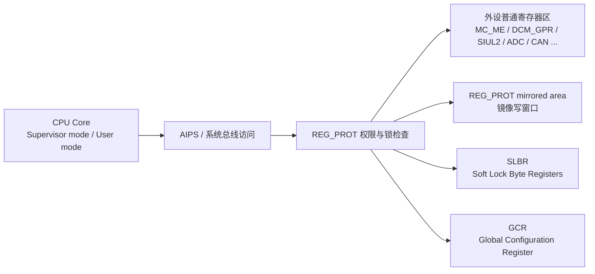
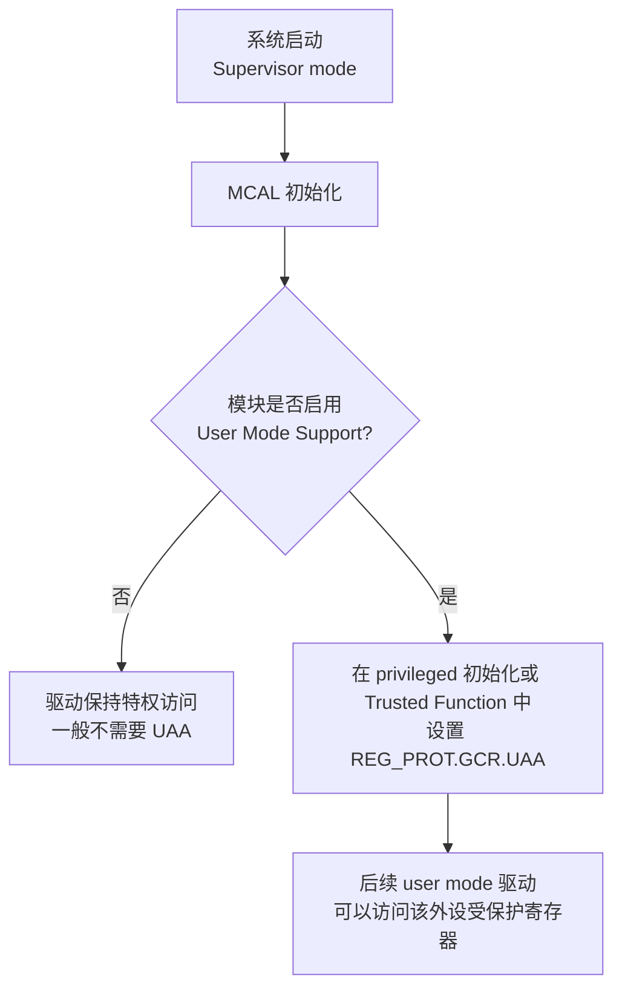
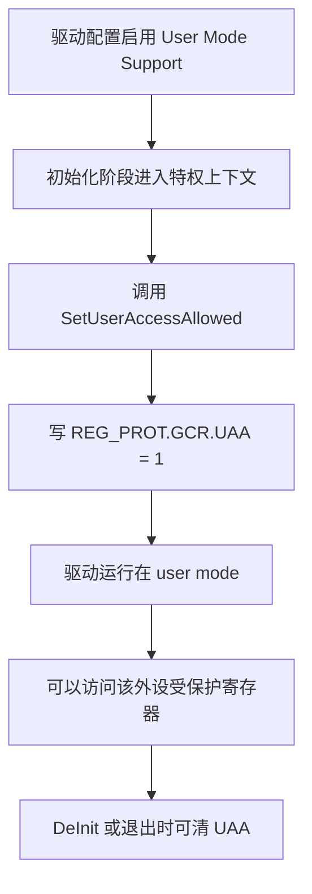
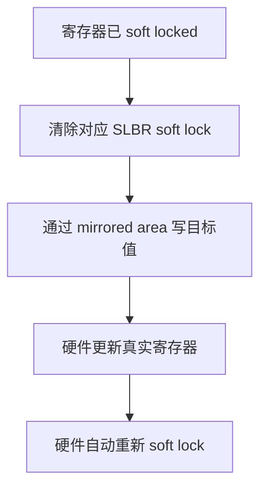
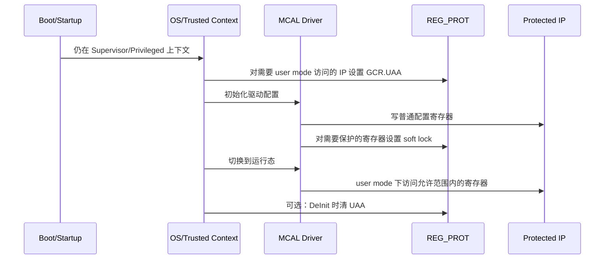
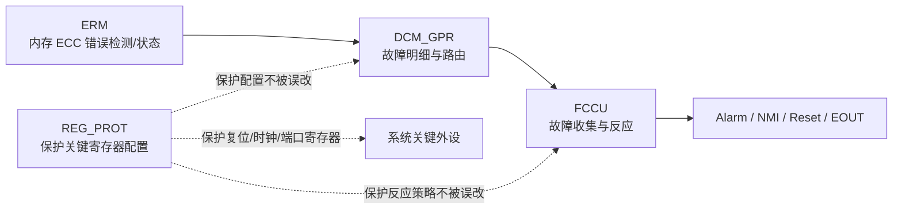

# Chapter 55 Register Protection (REG_PROT) 学习笔记

> 适用背景：S32K324 / S32K3xx，面向 AUTOSAR MCAL/RTD、用户态驱动、功能安全寄存器保护、启动初始化和故障排查。
>
> 主要参考：S32K3xx Reference Manual Chapter 55 Register Protection (REG_PROT)，本工程 `RegLockMacros.h`、`Reg_eSys.h`、`Power_Ip_*`、`FlexCAN_Ip.c`、`Adc_Sar_Ip.c`、`Pit_Ip.c` 等源码，以及 NXP Community 关于 S32K3 REG_PROT 的讨论。
>
> 说明：REG_PROT 在不同 S32K3 型号、不同外设、不同 RTD 版本里的可保护寄存器集合可能不同。真正做项目时，要以当前芯片 Reference Manual、`s32k3xx_REG_PROT_details.xlsx`、SVD、RTD 生成文件为准。

---

## 1. 先用一句话抓住 REG_PROT

**REG_PROT，Register Protection，寄存器保护模块，用来防止关键外设寄存器在错误权限、错误时机或错误流程下被随意修改。**

你可以先把 MCU 外设寄存器想象成一个控制柜。普通寄存器就是控制柜上的旋钮和开关。REG_PROT 就是在这些关键旋钮外面加的一套“权限门”和“锁”：

```text
普通外设寄存器      -> 真正控制时钟、复位、Flash、端口、DMA、ADC、CAN 等硬件行为
REG_PROT.GCR.UAA    -> 是否允许 User mode 访问这个受保护外设
Soft lock / SLBR    -> 单个寄存器级别的软件锁，可以按规则解锁再修改
Hard lock / HLB     -> 更强的硬锁，通常只能通过 Power-On Reset 解除
Mirrored area       -> 一块镜像写窗口，用来完成“写寄存器并自动重新上锁”
```

开发时最重要的一句话是：

**如果驱动跑在 User mode，而某个外设寄存器受 REG_PROT 保护，那么在没有打开 `GCR.UAA` 的情况下访问它，很可能直接进异常。**

NXP 社区里也有类似案例：用户在 EB tresos 打开 User Mode Support 后，程序切到 user mode 访问外设，结果进入硬件异常。NXP 技术支持的解释很直接：外设默认受 register protection 保护，如果 user mode 访问前没有配置 user access，就会触发 exception。

---

## 2. 为什么 S32K3 需要寄存器保护

S32K3 是面向汽车功能安全的 MCU。汽车软件里，很多寄存器不是普通“配置项”，而是会影响系统安全状态的关键开关，例如：

| 外设/模块 | 典型关键寄存器会影响什么 |
|---|---|
| `MC_ME` | 模式切换、核启动、外设时钟门控、低功耗进入 |
| `MC_RGM` | 复位原因、复位升级、复位阈值 |
| `PMC` | 电源监控、低压/高压相关控制 |
| `C40ASF` / Flash | Flash 控制、擦写、错误处理 |
| `DCM_GPR` | 故障路由、复位域配置、安全故障细节 |
| `SIUL2` | 引脚复用、输入输出缓冲、外部中断路由 |
| `DMA` | DMA 控制、TCD、内存搬运路径 |
| `ADC` | 采样触发、转换控制、结果路径 |
| `FlexCAN` | CAN 控制器模式、报文缓冲区行为 |
| `STM` / `PIT` | 定时器控制、周期中断源 |

如果这些寄存器被错误修改，后果可能很大：

- 时钟被关掉，外设突然失效。
- 复位门限被改掉，系统进入异常复位循环。
- 端口复用被改掉，CAN/LIN/PWM/ADC 信号走错路径。
- DMA 指向错误地址，造成内存破坏。
- 安全故障路由被关闭，FCCU 看不到应该上报的故障。
- Flash 控制寄存器被误写，影响擦写流程甚至启动完整性。

所以 REG_PROT 的意义不是“为了让代码更复杂”，而是把关键寄存器从普通写操作里隔离出来，让软件必须经过明确授权和明确流程才能改。

从开发视角看，它解决三个问题：

| 问题 | REG_PROT 的作用 |
|---|---|
| User mode 代码不该随便改硬件 | 用 `GCR.UAA` 控制 user mode 是否允许访问 |
| 某些初始化寄存器配置好后不该再变 | 用 soft lock 或 hard lock 锁住 |
| 需要修改时希望改完自动恢复保护 | 用 mirrored area 配合 lock 写宏 |

---

## 3. REG_PROT 在 S32K3 安全架构里的位置

REG_PROT 不是一个孤立模块。它夹在 CPU/总线访问和外设寄存器之间，负责判断“这个访问是不是被允许”。



这张图要这样理解：

CPU 发起一次寄存器访问，不是直接等价于“外设一定接受”。如果这个寄存器属于受 REG_PROT 控制的区域，硬件会先看保护条件：

1. 当前访问来自 Supervisor mode 还是 User mode。
2. 该外设的 `GCR.UAA` 是否允许 user mode 访问。
3. 目标寄存器有没有 soft lock。
4. 该外设有没有 hard lock。
5. 写入是否走了正确的镜像地址或正确解锁序列。

如果这些条件不满足，写入可能被拒绝，或者产生总线错误/HardFault/异常。对于嵌入式调试来说，这就是为什么你看到“寄存器明明地址对了，但一写就 fault”。

---

## 4. REG_PROT 不是什么

这一节非常重要，因为 REG_PROT 很容易和其他安全/保护机制混在一起。

### 4.1 REG_PROT 不是 MPU

MPU 是 Cortex-M 核里的 Memory Protection Unit，主要按内存区域控制读写执行权限。比如某段 RAM 是否可执行，某段外设地址是否 user mode 可访问。

REG_PROT 是 S32K3 外设侧的寄存器保护机制。它关注的是“某个受保护外设寄存器是否允许被访问或修改”。

简化理解：

| 机制 | 保护对象 | 常见粒度 |
|---|---|---|
| MPU | 内存/外设地址区域 | 地址 region |
| REG_PROT | 外设内部关键寄存器 | 外设寄存器、寄存器锁 |

### 4.2 REG_PROT 不是 XRDC

XRDC 更偏向跨主机、跨域的访问控制，比如不同 bus master、不同 domain、不同外设 slot 的访问权限。它常用于资源隔离。

NXP 社区里关于 S32K312 REG_PROT 的回复也明确提醒：XRDC 不属于 REG_PROT 覆盖范围，二者要分开看。REG_PROT 只覆盖 Reference Manual 和 `s32k3xx_REG_PROT_details.xlsx` 列出的寄存器保护范围。

### 4.3 REG_PROT 不是互斥锁

REG_PROT 的 lock 不是 RTOS mutex。

它不能自动解决这些问题：

- 两个任务同时改同一个寄存器的竞态。
- ISR 和 task 同时 RMW 同一个寄存器。
- 驱动状态机重入。
- 多核之间的软件同步。

REG_PROT 只能限制“是否允许访问/是否允许修改”。如果你要解决并发问题，仍然需要 SchM、SuspendInterrupts、spinlock、OS resource 或驱动自己的状态机保护。

---

## 5. 本工程里哪里用到了 REG_PROT

本工程没有一个单独叫 `Reg_Prot.c` 的应用层驱动。REG_PROT 主要以 MCAL/RTD 宏的形式散落在各模块里。

| 文件 | 作用 |
|---|---|
| `BasicSoftware/integration/mcal/src/modules/BaseNXP/include/RegLockMacros.h` | REG_PROT 核心宏：UAA、hard lock、soft lock、mirrored write |
| `BasicSoftware/integration/mcal/src/modules/BaseNXP/include/Reg_eSys.h` | 哪些 IP 支持 REG_PROT，以及 `*_PROT_MEM_U32` 参数 |
| `BasicSoftware/integration/mcal/src/gen/include/Soc_Ips.h` | 定义 `IPV_REG_PROT` 版本，用于平台差异判断 |
| `BasicSoftware/integration/mcal/src/modules/Mcu/src/Power_Ip_DCM_GPR.c` | DCM_GPR user mode 访问授权 |
| `BasicSoftware/integration/mcal/src/modules/Mcu/src/Power_Ip_MC_ME.c` | MC_ME user mode 访问授权 |
| `BasicSoftware/integration/mcal/src/modules/Mcu/src/Power_Ip_MC_RGM.c` | MC_RGM / RDC user mode 访问授权 |
| `BasicSoftware/integration/mcal/src/modules/Mcu/src/Power_Ip_PMC.c` | PMC user mode 访问授权 |
| `BasicSoftware/integration/mcal/src/modules/Mcu/src/Power_Ip_FLASH.c` | Flash/C40ASF user mode 访问授权 |
| `BasicSoftware/integration/mcal/src/modules/Mcu/src/Clock_Ip_Specific.c` | PLL/FXOSC/MC_CGM/CMU/PRAMC 等时钟相关模块授权 |
| `BasicSoftware/integration/mcal/src/modules/Can_43_FLEXCAN/src/FlexCAN_Ip.c` | FlexCAN user mode 访问授权/清理 |
| `BasicSoftware/integration/mcal/src/modules/Adc/src/Adc_Sar_Ip.c` | ADC user mode 访问授权/清理 |
| `BasicSoftware/integration/mcal/src/modules/Port/src/Siul2_Port_Ip.c` | SIUL2 端口寄存器 user mode 访问授权 |
| `BasicSoftware/integration/mcal/src/modules/Gpt/src/Pit_Ip.c`、`Stm_Ip.c` | 定时器寄存器 user mode 访问授权 |
| `BasicSoftware/integration/mcal/src/modules/Mcl/src/Dma_Ip.c` | DMA/TCD/MP 保护相关逻辑 |

工程里最核心的文件是 `RegLockMacros.h`。你理解了它，基本就理解了 RTD 是怎么把 Chapter 55 落地到代码里的。

---

## 6. 核心概念 1：Supervisor mode 和 User mode

Cortex-M7 有权限级别。严格 ARM Cortex-M 术语不是传统 ARM-A/R 的 `Supervisor mode`，而是 `Privileged / Unprivileged`，并区分 `Thread mode / Handler mode`。但在 AUTOSAR/MCAL 工具和工程交流里，经常把 privileged 语境近似叫成 supervisor。简单说：

| 模式 | 含义 | 开发理解 |
|---|---|---|
| Privileged mode（工程里常近似称 Supervisor） | 特权模式 | 启动代码、OS 内核、可信函数、底层初始化、ISR/Handler 常用 |
| User / Unprivileged mode | 用户模式/非特权模式 | Non-trusted 应用任务、部分普通驱动运行时可能使用 |

在 AUTOSAR/RTD 里，如果打开了 `MCAL_ENABLE_USER_MODE_SUPPORT` 或某个模块的 `*_ENABLE_USER_MODE_SUPPORT`，驱动可能会在 user mode 下执行普通寄存器访问。

这时问题来了：很多外设寄存器默认并不允许 user mode 访问。于是需要一个特权上下文先帮它打开权限；这个特权上下文可以是启动/初始化阶段的 privileged 代码，也可以是 AUTOSAR OS 的 Trusted Function 路径，不一定每次都必须通过 Trusted Function。



这里的关键不是“所有代码都必须跑 User mode”。关键是：

**只要你的代码或 MCAL 驱动要在 user mode 访问受保护外设，就必须提前考虑 REG_PROT 的 UAA 配置。**

NXP 社区也回答过类似问题：protected register 在 user mode 下不可访问，除非设置 Register Protection Global Configuration Register 里的 `UAA` bit。

---

## 7. 核心概念 2：GCR，全局配置寄存器

`GCR` 是 REG_PROT 的 Global Configuration Register。它不是每个普通寄存器一个，而是每个受保护 IP 区域有对应的全局控制。

本工程 `RegLockMacros.h` 里对 S32K3 平台的 GCR 地址偏移定义是：

```c
#define GCR_OFFSET_U32 ((uint32)0x900UL)
```

也就是说，对于一个受 REG_PROT 控制的外设，RTD 宏会用类似下面的公式找到它的 GCR：

```c
GCR address = baseAddr + prot_mem * GCR_OFFSET_U32
```

在本工程里，常见 `prot_mem` 是 `0x4`。例如 DCM_GPR：

```c
IP_DCM_GPR_BASE = 0x402AC000
DCM_PROT_MEM_U32 = 0x4
GCR_OFFSET_U32 = 0x900

GCR address = 0x402AC000 + 0x4 * 0x900
            = 0x402AE400
```

注意：这里的 `prot_mem` 不是“字节数 4 byte”的意思。它是 RTD 根据该 IP 的保护内存布局定义出来的乘数/保护尺寸参数。不要自己拍脑袋写。

### 7.1 GCR 里的两个关键 bit

本工程 `RegLockMacros.h` 定义：

```c
#define REGPROT_GCR_HLB_MASK_U32 ((uint32)0x80000000UL)
#define REGPROT_GCR_UAA_MASK_U32 ((uint32)0x00800000UL)

#define REGPROT_GCR_HLB_POS_U32  ((uint32)31UL)
#define REGPROT_GCR_UAA_POS_U32  ((uint32)23UL)
```

| bit | 名称 | 含义 | 开发理解 |
|---|---|---|---|
| bit31 | `HLB` | Hard Lock Bit | 整个受保护 IP 的强锁 |
| bit23 | `UAA` | User Access Allowed | 是否允许 user mode 访问该受保护 IP |

所以 Chapter 55 最常被开发者用到的两个动作就是：

```c
SET_USER_ACCESS_ALLOWED(base, prot_mem);
CLR_USER_ACCESS_ALLOWED(base, prot_mem);
```

和：

```c
SET_HARD_LOCK(base, prot_mem);
GET_HARD_LOCK(base, prot_mem);
```

---

## 8. 核心概念 3：UAA，User Access Allowed

`UAA` 是理解 REG_PROT 的第一个重点。

`UAA = 0` 时，受保护寄存器不允许 user mode 访问。  
`UAA = 1` 时，允许 user mode 访问这个受保护 IP 的寄存器区域。

本工程宏：

```c
#define SET_USER_ACCESS_ALLOWED(baseAddr, prot_mem) \
    RLM_REG_BIT_SET32((baseAddr) + ((prot_mem) * GCR_OFFSET_U32), REGPROT_GCR_UAA_MASK_U32)

#define CLR_USER_ACCESS_ALLOWED(baseAddr, prot_mem) \
    RLM_REG_BIT_CLEAR32((baseAddr) + ((prot_mem) * GCR_OFFSET_U32), REGPROT_GCR_UAA_MASK_U32)

#define GET_USER_ACCESS_ALLOWED(baseAddr, prot_mem) \
    ((uint8)(RLM_REG_BIT_GET32((baseAddr) + ((prot_mem) * GCR_OFFSET_U32), \
    REGPROT_GCR_UAA_MASK_U32) >> REGPROT_GCR_UAA_POS_U32))
```

老师式理解：

`UAA` 就像外设控制柜门上的“允许普通工程师进入”的开关。默认情况下，普通 user mode 代码不能碰。Supervisor mode 或 Trusted Function 先把开关打开，后续 user mode 才能访问。

### 8.1 UAA 的开发流程

典型流程是：



如果漏掉 C 这一步，后果通常是：

- 初始化或运行时进入 HardFault。
- 读写寄存器没有效果。
- OS 报 memory access violation。
- 某个 Trusted Call 路径没有执行，导致只有某些模块异常。

### 8.2 UAA 不是越开越好

`UAA = 1` 会放宽 user mode 对该外设的访问限制。它不是一个无害配置。

在功能安全或安全隔离设计里，应该问三个问题：

1. 这个外设真的需要 user mode 驱动直接访问吗？
2. 能不能只在初始化阶段由 supervisor 配好，运行时不开放？
3. 如果开放 UAA，是否有 OS/MPU/XRDC/应用架构继续限制谁能访问这些地址？

**重点：UAA 是权限开关，不是安全增强本身。它打开后，保护边界会变宽。**

---

## 9. 核心概念 4：Hard lock，硬锁

Hard lock 由 `GCR.HLB` 控制。它是比 soft lock 更强的一种锁。

NXP 社区里对 hard lock 的描述很直接：hard lock 通常只能通过 Power-On Reset 解除。

本工程宏：

```c
#define SET_HARD_LOCK(baseAddr, prot_mem) \
    RLM_REG_BIT_SET32((baseAddr) + ((prot_mem) * GCR_OFFSET_U32), REGPROT_GCR_HLB_MASK_U32)

#define GET_HARD_LOCK(baseAddr, prot_mem) \
    ((uint8)(RLM_REG_BIT_GET32((baseAddr) + ((prot_mem) * GCR_OFFSET_U32), \
    REGPROT_GCR_HLB_MASK_U32) >> REGPROT_GCR_HLB_POS_U32))
```

你可以把 hard lock 理解成“封条”。一旦贴上，软件运行时通常不能再随便拆。项目里如果要用 hard lock，一般应该在最终初始化完成后再做。

典型使用场景：

- 时钟树配置完成后，不希望运行时被改。
- 复位升级阈值配置完成后，不希望应用误改。
- 安全故障路由配置完成后，不希望被关闭。
- 生产阶段锁住某些一次性配置。

但是 hard lock 也很危险：

| 风险 | 说明 |
|---|---|
| 调试困难 | 一旦锁错，调试器下也可能很难改回来，只能复位或断电重上电 |
| 初始化顺序敏感 | 还没配置完就 hard lock，后续初始化会失败 |
| bootloader/app 交互复杂 | bootloader 锁住后，app 可能无法重新配置 |
| reset 类型影响 | 功能复位不一定解除 hard lock，具体看手册和 reset domain |

所以开发阶段建议：

```text
Bring-up 阶段：少用或不用 hard lock，先验证功能。
集成阶段：对确实不该变的寄存器逐步加 lock。
量产阶段：结合安全需求、复位策略、boot/app 架构决定是否 hard lock。
```

---

## 10. 核心概念 5：Soft lock 和 SLBR

Soft lock 是寄存器级别的软件锁。它不像 hard lock 那么“死”，可以通过规定序列解锁。

`SLBR` 是 Soft Lock Byte Register。它不是业务寄存器，而是 REG_PROT 为每个可保护寄存器提供的锁状态/写使能控制区域。

本工程里，S32K3 的 SLBR 区域偏移是：

```c
#define SLBR_ADDR_OFFSET_U32 ((uint32)0x800UL)
```

RTD 通过下面的宏计算某个寄存器对应的 SLBR 地址：

```c
#define SLBR_ADDR32(baseAddr, regAddr, prot_mem) \
    (((uint32)(baseAddr)) + ((prot_mem) * SLBR_ADDR_OFFSET_U32) + \
    ENDIANNESS((uint32)((((uint32)(regAddr)) - ((uint32)(baseAddr))) >> 0x2U)))
```

先不要被公式吓到。它的逻辑其实是：

1. 从外设基地址 `baseAddr` 出发。
2. 跳到这个 IP 对应的 SLBR 区域：`prot_mem * 0x800`。
3. 根据目标寄存器相对外设基地址的 word index 找到对应的 SLBR byte。
4. 根据大小端调整 byte 顺序。

### 10.1 为什么是 byte register

REG_PROT 的 soft lock 是按寄存器/寄存器内 byte 映射的。一个 32-bit 外设寄存器，对应 SLBR 中一些 bit。RTD 为 8/16/32 bit 寄存器分别准备了不同掩码。

本工程关键掩码：

```c
#define SLBR_SET_BIT_8BIT_REG_MASK_U8  ((uint8)0x88U)
#define SLBR_SET_BIT_16BIT_REG_MASK_U8 ((uint8)0xCCU)
#define SLBR_SET_BIT_32BIT_REG_MASK_U8 ((uint8)0xFFU)

#define SLBR_CLR_BIT_8BIT_REG_MASK_U8  ((uint8)0x80U)
#define SLBR_CLR_BIT_16BIT_REG_MASK_U8 ((uint8)0xC0U)
#define SLBR_CLR_BIT_32BIT_REG_MASK_U8 ((uint8)0xF0U)

#define SLBR_GET_BIT_8BIT_REG_MASK_U8  ((uint8)0x08U)
#define SLBR_GET_BIT_16BIT_REG_MASK_U8 ((uint8)0x0CU)
#define SLBR_GET_BIT_32BIT_REG_MASK_U8 ((uint8)0x0FU)
```

开发时你不需要死背这些 hex 值，但要知道它们的作用：

| 宏 | 作用 |
|---|---|
| `SLBR_SET_BIT_*` | 设置某个寄存器的 soft lock |
| `SLBR_CLR_BIT_*` | 清除某个寄存器的 soft lock，准备修改 |
| `SLBR_GET_BIT_*` | 读取某个寄存器当前是否 soft locked |

### 10.2 Soft lock 的基本动作

RTD 提供三类基础宏：

```c
REG_SET_SOFT_LOCK8/16/32(base, reg, prot_mem)
REG_CLR_SOFT_LOCK8/16/32(base, reg, prot_mem)
REG_GET_SOFT_LOCK8/16/32(base, reg, prot_mem)
```

含义很直观：

- `SET`：把某个寄存器软锁住。
- `CLR`：清掉某个寄存器的软件锁，允许下一步修改。
- `GET`：读当前锁状态。

如果 `USER_MODE_REG_PROT_ENABLED == STD_OFF`，这些宏很多会退化为空操作或普通读写。这是 RTD 的条件编译设计。

---

## 11. 核心概念 6：Mirrored area，镜像写窗口

`mirrored area` 是理解 soft lock 写操作的第二个难点。

S32K3 上 REG_PROT 对受保护寄存器提供一个镜像地址区域。你往镜像地址写，硬件会把内容作用到真实寄存器，同时完成 lock 相关动作。

本工程 S32K3 的镜像区域偏移是：

```c
#define MIRRORED_ADDR_OFFSET_U32 ((uint32)0x400UL)
```

RTD 的 lock 写宏一般是这种模式：

```c
REG_CLR_SOFT_LOCK32(baseAddr, regAddr, prot_mem);
RLM_REG_WRITE32((regAddr) + ((prot_mem) * MIRRORED_ADDR_OFFSET_U32), value);
```

也就是说：

```text
真实寄存器地址 = regAddr
镜像写地址     = regAddr + prot_mem * 0x400
```

对于常见 `prot_mem = 0x4`：

```text
镜像写偏移 = 0x4 * 0x400 = 0x1000
```

如果某个寄存器真实地址是：

```text
0x402AC010
```

那么对应镜像写地址就是：

```text
0x402AC010 + 0x1000 = 0x402AD010
```

注意：这个例子只是帮助理解计算。实际哪些寄存器可镜像、能不能写、写后行为如何，要看 Reference Manual 和 REG_PROT details 表。

### 11.1 为什么要有镜像写

因为 REG_PROT 希望你按这个顺序改受保护寄存器：



这比“先解锁、直接写真实寄存器、再手动上锁”更安全，因为它减少了寄存器处于未锁状态的窗口。

---

## 12. `RegLockMacros.h` 详解

本工程 `RegLockMacros.h` 是 Chapter 55 最值得读的代码文件。它把硬件规则封装成 MCAL 可用的宏。

### 12.1 基础读写宏

文件开头先定义最底层的 volatile 读写：

```c
#define RLM_REG_WRITE8(address, value)  ((*(volatile uint8*)(address)) = (value))
#define RLM_REG_WRITE16(address, value) ((*(volatile uint16*)(address)) = (value))
#define RLM_REG_WRITE32(address, value) ((*(volatile uint32*)(address)) = (value))

#define RLM_REG_READ8(address)          (*(volatile uint8*)(address))
#define RLM_REG_READ16(address)         (*(volatile uint16*)(address))
#define RLM_REG_READ32(address)         (*(volatile uint32*)(address))
```

这里的 `volatile` 很关键，因为寄存器访问不能被编译器优化掉。

### 12.2 `USER_MODE_REG_PROT_ENABLED` 检查

`RegLockMacros.h` 强制要求使用者定义：

```c
USER_MODE_REG_PROT_ENABLED
```

并且值必须是：

```c
STD_ON 或 STD_OFF
```

为什么要这样做？

因为同一套宏在 user mode 支持打开和关闭时行为不同。如果没有显式定义，宏到底应该执行 REG_PROT 序列，还是退化成普通寄存器访问，就不清楚。

很多模块会这样写：

```c
#define USER_MODE_REG_PROT_ENABLED (STD_ON)
#include "RegLockMacros.h"
```

或者：

```c
#define USER_MODE_REG_PROT_ENABLED (ADC_SAR_IP_ENABLE_USER_MODE_SUPPORT)
#include "RegLockMacros.h"
```

### 12.3 平台相关偏移

对 S32K3，本工程实际使用：

| 名称 | 值 | 含义 |
|---|---:|---|
| `MIRRORED_ADDR_OFFSET_U32` | `0x400` | 镜像寄存器区域偏移单位 |
| `SLBR_ADDR_OFFSET_U32` | `0x800` | SLBR 区域偏移单位 |
| `GCR_OFFSET_U32` | `0x900` | GCR 区域偏移单位 |

结合 `prot_mem` 后，地址公式就是：

```text
Mirrored address = regAddr  + prot_mem * 0x400
SLBR address     = baseAddr + prot_mem * 0x800 + mapped_word_index
GCR address      = baseAddr + prot_mem * 0x900
```

### 12.4 大小端处理

S32K3 Cortex-M7 常见是 little endian。本工程对 little endian 的处理：

```c
#define ENDIANNESS(x) ((x) ^ 3UL)
```

注释里说得很清楚：SLBR bytes 是按 `3 2 1 0` 的顺序排列。也就是说，你按寄存器 word index 算出来的 byte 序号，还要经过 `^ 3` 映射。

这是一个非常容易错的地方。你如果自己手算 SLBR 地址，忘了这个 endian 映射，就会锁错寄存器。

**开发建议：不要手写 SLBR 地址，优先用 `RegLockMacros.h`。**

### 12.5 写并自动上锁的宏

RTD 提供了三类常用写宏：

```c
REG_BIT_SET_LOCK8/16/32(base, reg, prot_mem, mask)
REG_BIT_CLEAR_LOCK8/16/32(base, reg, prot_mem, mask)
REG_WRITE_LOCK8/16/32(base, reg, prot_mem, value)
REG_RMW_LOCK8/16/32(base, reg, prot_mem, mask, value)
```

它们的共同模式是：

1. 先清掉目标寄存器对应的 soft lock。
2. 再通过 mirrored address 修改寄存器。
3. 硬件自动重新 soft lock。

比如 32-bit 写：

```c
#define REG_WRITE_LOCK32(baseAddr, regAddr, prot_mem, value) \
{ \
    REG_CLR_SOFT_LOCK32((baseAddr), (regAddr), (prot_mem)); \
    RLM_REG_WRITE32(((regAddr) + ((prot_mem) * MIRRORED_ADDR_OFFSET_U32)), (value)); \
}
```

如果 `USER_MODE_REG_PROT_ENABLED == STD_OFF`，它会退化成：

```c
RLM_REG_WRITE32((regAddr), (value))
```

这就是为什么同一份驱动在不同配置下行为不一样。打开 user mode support 后，寄存器写路径变成 REG_PROT-aware；关闭后，它可能只是普通 volatile write。

### 12.6 RMW 宏的易错点

`RLM_REG_RMW8/16/32` 的注释提醒：

```text
value has only "mask" bits set - (value & ~mask) == 0
```

意思是调用者要保证 `value` 只包含 `mask` 允许的 bit。宏本身不会帮你把 `value` 再 `& mask` 一次。

错误示例：

```c
REG_RMW_LOCK32(base, reg, prot_mem, MASK_A, VALUE_WITH_OTHER_BITS);
```

如果 `VALUE_WITH_OTHER_BITS` 里带了 `MASK_A` 之外的 bit，结果可能污染其他字段。

正确思路：

```c
value = desired_value & MASK_A;
REG_RMW_LOCK32(base, reg, prot_mem, MASK_A, value);
```

---

## 13. `Reg_eSys.h` 里的保护能力表

`Reg_eSys.h` 是本工程里一个很实用的索引文件。它告诉你哪些 IP 默认认为支持 REG_PROT。

摘取本工程中的关键项：

```c
#define MCAL_AXBS_REG_PROT_AVAILABLE   (STD_ON)
#define MCAL_XBIC_REG_PROT_AVAILABLE   (STD_ON)
#define MCAL_DMA_REG_PROT_AVAILABLE    (STD_ON)
#define MCAL_SIUL2_REG_PROT_AVAILABLE  (STD_ON)
#define MCAL_STM_REG_PROT_AVAILABLE    (STD_ON)
#define MCAL_C40ASF_REG_PROT_AVAILABLE (STD_ON)
#define MCAL_DCM_REG_PROT_AVAILABLE    (STD_ON)
#define MCAL_CMU_REG_PROT_AVAILABLE    (STD_ON)
#define MCAL_FXOSC_REG_PROT_AVAILABLE  (STD_ON)
#define MCAL_MC_RGM_REG_PROT_AVAILABLE (STD_ON)
#define MCAL_MC_CGM_REG_PROT_AVAILABLE (STD_ON)
#define MCAL_MC_ME_REG_PROT_AVAILABLE  (STD_ON)
#define MCAL_PLLDIG_REG_PROT_AVAILABLE (STD_ON)
#define MCAL_PMC_REG_PROT_AVAILABLE    (STD_ON)
```

同时它定义了常用 `prot_mem`：

```c
#define DCM_PROT_MEM_U32    ((uint32)0x00000004UL)
#define MC_ME_PROT_MEM_U32  ((uint32)0x00000004UL)
#define MC_RGM_PROT_MEM_U32 ((uint32)0x00000004UL)
#define PMC_PROT_MEM_U32    ((uint32)0x00000004UL)
#define SIUL2_PROT_MEM_U32  ((uint32)0x00000008UL)
```

注意 `SIUL2_PROT_MEM_U32` 是 `0x8`，不是常见的 `0x4`。这说明不同 IP 的 protection memory 布局不同，不能照抄。

**易错点：不要看到大多数是 `0x4`，就把所有外设都写成 `0x4`。**

---

## 14. 工程例子 1：DCM_GPR 的 UAA

`Power_Ip_DCM_GPR.c` 里有一个非常典型的 REG_PROT 使用点：

```c
#if (defined(POWER_IP_ENABLE_USER_MODE_SUPPORT) && (STD_ON == POWER_IP_ENABLE_USER_MODE_SUPPORT))
  #if (defined(MCAL_DCM_REG_PROT_AVAILABLE))
    #if (STD_ON == MCAL_DCM_REG_PROT_AVAILABLE)
      #define USER_MODE_REG_PROT_ENABLED (STD_ON)
      #include "RegLockMacros.h"
    #endif
  #endif
#endif
```

然后提供：

```c
void Power_Ip_DCM_GPR_SetUserAccessAllowed(void)
{
#if (defined(IP_DCM_GPR_BASE))
    SET_USER_ACCESS_ALLOWED(IP_DCM_GPR_BASE, DCM_PROT_MEM_U32);
#endif
}
```

这段代码的意思很简单：

如果 Power 模块启用了 user mode support，并且 DCM_GPR 支持 REG_PROT，那么在初始化/可信调用中设置 DCM_GPR 的 `UAA`，允许后续 user mode 代码访问 DCM_GPR 受保护寄存器。

这和 Chapter 38 DCM_GPR 关联很紧。DCM_GPR 里面有安全故障路由、复位域状态、低功耗相关控制等寄存器。它不是普通 RAM 变量，不能随便让 user mode 改。

---

## 15. 工程例子 2：FlexCAN 的 UAA 和清理

`FlexCAN_Ip.c` 里有：

```c
void FlexCAN_SetUserAccessAllowed(const FLEXCAN_Type * pBase)
{
    SET_USER_ACCESS_ALLOWED((uint32)pBase, FLEXCAN_PROT_MEM_U32);
}

void FlexCAN_ClrUserAccessAllowed(const FLEXCAN_Type * pBase)
{
    CLR_USER_ACCESS_ALLOWED((uint32)pBase, FLEXCAN_PROT_MEM_U32);
}
```

理解重点：

1. `pBase` 是具体 FlexCAN 实例的基地址。
2. `FLEXCAN_PROT_MEM_U32` 是该 IP 的 protection memory 参数。
3. Set 函数让 user mode 能访问。
4. Clear 函数把 UAA 清掉，恢复 user mode 访问限制。

这里源码注释里有一个小坑：`FlexCAN_ClrUserAccessAllowed` 的注释有版本里写成 “make the instance accessible in user mode”，但函数实际调用的是 `CLR_USER_ACCESS_ALLOWED`。真正语义应该是清除 UAA，让实例不再对 user mode 开放，或者“reset elevation requirement”。

**易错点：看源码时以函数名和宏实现为准，不要只相信注释。**

---

## 16. 工程例子 3：ADC 的实例化授权

`Adc_Sar_Ip.c` 里：

```c
void Adc_Sar_Ip_SetUserAccessAllowed(const uint32 Instance)
{
    AdcBasePtr = Adc_Sar_Ip_apxAdcBase[Instance];
    SET_USER_ACCESS_ALLOWED((uint32)AdcBasePtr, SAR_ADC_PROT_MEM_U32);
}

void Adc_Sar_Ip_ClrUserAccessAllowed(const uint32 Instance)
{
    AdcBasePtr = Adc_Sar_Ip_apxAdcBase[Instance];
    CLR_USER_ACCESS_ALLOWED((uint32)AdcBasePtr, SAR_ADC_PROT_MEM_U32);
}
```

ADC 的例子说明一点：REG_PROT 往往是按外设实例来的，不是“整个 ADC 驱动一个开关”。`ADC0`、`ADC1`、application extension 实例可能各有自己的基地址和保护参数。

调试 ADC user mode 问题时，要确认：

- 当前 `Instance` 是否正确。
- `Adc_Sar_Ip_apxAdcBase[Instance]` 是否指向预期外设。
- `SAR_ADC_PROT_MEM_U32` 或 `SAR_ADC_AE_PROT_MEM_U32` 是否定义。
- `ADC_SAR_IP_ENABLE_USER_MODE_SUPPORT` 是否真的打开。
- SetUserAccessAllowed 是否在访问寄存器之前执行。

---

## 17. 工程例子 4：Clock/Power 初始化中的批量授权

`Clock_Ip_Specific.c` 中可以看到很多时钟和电源相关模块的授权：

```c
SET_USER_ACCESS_ALLOWED(IP_PLL_BASE, PLLDIG_PROT_MEM_U32);
SET_USER_ACCESS_ALLOWED(IP_PLL_AUX_BASE, PLLDIG_PROT_MEM_U32);
SET_USER_ACCESS_ALLOWED(IP_FXOSC_BASE, FXOSC_PROT_MEM_U32);
SET_USER_ACCESS_ALLOWED(IP_MC_CGM_BASE, MC_CGM_PROT_MEM_U32);
SET_USER_ACCESS_ALLOWED(IP_CMU_0_BASE, CMU_PROT_MEM_U32);
SET_USER_ACCESS_ALLOWED(IP_PRAMC_0_BASE, PRAMC_PROT_MEM_U32);
SET_USER_ACCESS_ALLOWED(IP_MC_ME_BASE, MC_ME_PROT_MEM_U32);
SET_USER_ACCESS_ALLOWED(IP_FLASH_BASE, C40ASF_PROT_MEM_U32);
```

这些模块都属于系统级关键配置。为什么 user mode 驱动还可能需要访问它们？

因为 AUTOSAR MCAL 为了支持 user mode，有些驱动函数本体跑在 user mode，但关键权限提升通过 trusted function 完成。也就是说：

```text
普通驱动逻辑：可能在 user mode
权限配置动作：通过 trusted/supervisor 路径完成
```

这就是 `OsIf_Trusted_Call...` 或 `*_TrustedFunctions.h` 存在的原因。

---

## 18. 工程例子 5：Port/SIUL2 的特殊性

端口配置非常容易遇到 REG_PROT 问题，因为 SIUL2 控制引脚复用、输入输出、上下拉、驱动能力、外部中断路由等。

本工程里 SIUL2 的 protection memory 参数是：

```c
#define SIUL2_PROT_MEM_U32 ((uint32)0x00000008UL)
```

这不同于很多模块的 `0x4`。

Port 初始化中可能会调用：

```c
SET_USER_ACCESS_ALLOWED(IP_SIUL2_BASE, SIUL2_PROT_MEM_U32);
SET_USER_ACCESS_ALLOWED(IP_DCM_GPR_BASE, DCM_PROT_MEM_U32);
```

为什么配置端口还可能涉及 DCM_GPR？

因为某些引脚/唤醒/复位/低功耗或安全相关配置可能和 DCM_GPR 有关联。端口不只是“GPIO 高低电平”，它连接到芯片内部很多安全、复位和低功耗路径。

开发时如果遇到：

- MSCR 写入有效，但 IMCR 写入无效。
- 某些引脚复用寄存器 HardFault。
- 外部中断标志不触发，但 GPDI 能看到电平变化。

不要只怀疑引脚号。也要查：

- SIUL2 是否被 REG_PROT 保护。
- 当前代码是否在 user mode。
- UAA 是否打开。
- XRDC/MPU 是否也限制了访问。
- IOMUX 表里的 IMCR 编号是否和寄存器数组下标存在偏移。

---

## 19. 开发中应该怎么使用 REG_PROT

从开发流程看，REG_PROT 最好分阶段处理。

### 19.1 Bring-up 阶段

目标是先让板子跑起来。

建议：

- 先确认 MCAL user mode support 是否打开。
- 先确认哪些模块启用了 REG_PROT。
- 尽量使用 RTD 提供的 `SetUserAccessAllowed` 接口。
- 暂时少用 hard lock，避免锁死调试路径。
- 对关键寄存器写完后读回确认。

这个阶段最容易犯的错是：配置工具里打开了 user mode support，但启动代码/OS trusted function 没配完整，导致一进 user mode 就 fault。

### 19.2 集成阶段

目标是让不同 BSW/应用模块协同。

建议：

- 建立一张“哪些模块运行在 user mode、哪些外设需要 UAA”的表。
- 检查 `*_SetUserAccessAllowed` 是否在访问寄存器前调用。
- 检查 `*_ClrUserAccessAllowed` 是否会过早清掉 UAA。
- 对 bootloader 和 application 的权限边界做设计。
- 对 DMA、Port、Clock、Reset、Flash 这类高风险模块重点审查。

### 19.3 安全加固阶段

目标是减少运行时误写关键寄存器的机会。

建议：

- 对初始化后不该再变的寄存器考虑 soft lock。
- 对量产后绝不该改的配置谨慎考虑 hard lock。
- 对运行时仍需修改的寄存器，不要 hard lock。
- 对 user mode UAA 做最小化开放。
- 结合 MPU/XRDC/OS access control 形成多层保护。

### 19.4 量产阶段

目标是稳定和可诊断。

建议：

- 明确 hard lock 的解除条件和复位策略。
- 在启动日志或安全诊断里记录关键 GCR 状态。
- 对异常访问导致的 HardFault，能记录 fault 地址和 CFSR/BFAR。
- 对寄存器配置周期性 read/compare，但不要随意写测试值。

NXP 社区里也提到：受保护寄存器可以正常读取，周期性 read and compare 是可行的；但对运行中寄存器写 `0xAA/0x55` 做物理完整性测试通常没有实际意义，还可能破坏外设状态。

---

## 20. 推荐的初始化顺序

一个比较稳妥的顺序是：



更具体一点：

1. 系统启动，保持 supervisor 权限。
2. 初始化时钟、复位、电源、Flash、端口等基础模块。
3. 如果某模块驱动后续要在 user mode 访问受保护寄存器，调用该模块的 `SetUserAccessAllowed`。
4. 写入外设配置。
5. 对不希望运行时改变的寄存器 soft lock。
6. 对最终不允许修改的关键 IP 谨慎 hard lock。
7. 切到 user mode 运行应用。
8. 退出或反初始化时，根据设计清除 UAA。

---

## 21. Debug 场景 1：打开 User Mode Support 后 HardFault

现象：

```text
EB tresos 打开 Enable User Mode Support
启动后切 user mode
访问某个外设寄存器
进入 HardFault / hardware error interrupt
```

优先排查：

| 检查项 | 怎么看 |
|---|---|
| 当前 fault 是否发生在寄存器访问指令 | 看 PC、反汇编、调用栈 |
| 访问的外设是否 REG_PROT protected | 查 `Reg_eSys.h`、SVD、REG_PROT details |
| 对应 `SetUserAccessAllowed` 是否执行 | 下断点或读 GCR.UAA |
| `prot_mem` 是否正确 | 查 `*_PROT_MEM_U32`，不要手写 |
| OS trusted function 是否生效 | 查 `OsIf_Trusted_Call...` 是否真的进 privileged |
| MPU/XRDC 是否也限制访问 | REG_PROT 配好后仍 fault，就查其他保护层 |

一个简单判断：

```text
Supervisor mode 能访问，User mode 一访问就 fault
=> 优先怀疑 UAA / MPU / XRDC
```

---

## 22. Debug 场景 2：寄存器写了但值没变

现象：

```text
代码执行了写寄存器
没有 HardFault
但读回值还是旧值
```

可能原因：

1. 该寄存器被 soft locked，普通地址写入无效。
2. 写的是只读字段或 W1C/W1S 特殊字段。
3. 没有通过 mirrored area 写。
4. 写入时机不对，比如外设没时钟、处于 busy 状态、模式未切换。
5. 写错实例基地址。
6. `prot_mem` 错了，导致镜像地址不对。
7. 读回字段由硬件状态覆盖，软件写入不保持。

REG_PROT 角度的排查顺序：

```text
读 GCR.HLB
读 GCR.UAA
读目标寄存器对应 SLBR soft lock
确认写路径是否使用 REG_WRITE_LOCK / REG_RMW_LOCK
确认 mirrored address 计算是否正确
```

---

## 23. Debug 场景 3：Hard lock 后再也改不了

现象：

```text
初始化某模块后，后续代码再修改相关寄存器失败
复位后仍然失败
断电重上电才恢复
```

这很像 hard lock。

检查：

```c
GET_HARD_LOCK(base, prot_mem)
```

如果返回 1，说明该 IP 处于 hard lock 状态。

开发建议：

- bring-up 阶段不要过早 set hard lock。
- 如果必须 hard lock，先把所有后续初始化顺序确认完。
- bootloader 中 hard lock 前，要确认 application 不需要重新配置该 IP。
- 量产前把 hard lock 点列入设计评审。

---

## 24. Debug 场景 4：Soft lock 解锁了但还是写失败

可能原因：

| 原因 | 解释 |
|---|---|
| 清错 SLBR | 地址计算错，尤其是 endian 映射 |
| 写错路径 | 清了 soft lock，但直接写真实寄存器，没有写 mirrored address |
| 被 hard lock | hard lock 优先级更高 |
| 当前不是允许权限 | user mode 下 UAA 没开 |
| 寄存器本身有模式限制 | 只能在 freeze/init/disabled 状态写 |

正确模式应该接近：

```c
REG_CLR_SOFT_LOCK32(base, reg, prot_mem);
RLM_REG_WRITE32(reg + prot_mem * MIRRORED_ADDR_OFFSET_U32, value);
```

更推荐直接用：

```c
REG_WRITE_LOCK32(base, reg, prot_mem, value);
```

---

## 25. Debug 场景 5：`prot_mem` 参数写错

`prot_mem` 是 REG_PROT 宏里最不起眼但很关键的参数。

错误写法：

```c
SET_USER_ACCESS_ALLOWED(IP_SIUL2_BASE, DCM_PROT_MEM_U32);
```

这显然把 DCM 的保护参数用于 SIUL2。结果是 GCR 地址算错，UAA 根本没设置到目标外设。

正确写法：

```c
SET_USER_ACCESS_ALLOWED(IP_SIUL2_BASE, SIUL2_PROT_MEM_U32);
```

记住：

```text
baseAddr 和 prot_mem 必须属于同一个 IP。
```

本工程可从这些位置找：

- `Reg_eSys.h`
- 具体模块的 `*_Cfg.h`
- 具体模块的 `*_DeviceRegisters.h`
- RTD 生成文件

---

## 26. Debug 场景 6：FreeRTOS / AUTOSAR OS 兼容性疑问

NXP 社区里有人问：REG_PROT 是否必须运行在 user mode？是否兼容 FreeRTOS？

更准确的理解是：

- REG_PROT 是硬件特性，不是某个 RTOS 特性。
- 它和 FreeRTOS/AUTOSAR OS 本身没有“兼容或不兼容”的概念。
- 只要 OS 让任务跑在 user mode，而任务访问受保护外设，就必须配置 UAA 或通过 privileged API 访问。
- 如果所有关键寄存器访问都在 privileged context 完成，user mode 任务不直接访问，也可以使用 REG_PROT 的 lock 功能。

所以问题不是“REG_PROT 能不能配 FreeRTOS”，而是：

```text
谁在访问寄存器？
访问时处于什么权限级别？
该外设 UAA 是否打开？
该寄存器是否 soft/hard locked？
OS 有没有提供可信调用路径？
```

---

## 27. 周期性检查寄存器配置是否有意义

有意义，但要分清“读检查”和“写测试”。

### 27.1 读检查：有意义

对于关键配置寄存器，可以周期性读出并和期望值比较：

```text
expected = 初始化期望配置
actual   = 当前寄存器值
if actual != expected:
    上报诊断或安全故障
```

NXP 社区也提到，受保护寄存器读取没有限制，可以读出来和软件期望值比较。

适合检查：

- 时钟选择是否被改。
- 端口复用是否仍正确。
- 安全故障路由是否仍开启。
- 复位阈值是否仍为设计值。
- 外设关键模式位是否仍处于预期状态。

### 27.2 写测试：非常谨慎

有人会想到对寄存器写 `0xAA`、`0x55` 再恢复，用来验证寄存器物理完整性。

对外设控制寄存器来说，这通常不推荐。因为你写入测试值的瞬间，硬件真的会改变行为：

- 端口可能瞬间切复用。
- 时钟可能切源。
- DMA 可能启动错误搬运。
- Flash 控制可能进入错误流程。
- 安全路由可能被临时关闭。

所以运行中更常见的是 read and compare，不是随便写测试花样值。

---

## 28. 和 FCCU、DCM_GPR、ERM 的关系

你前面已经学过 FCCU、ERM、DCM_GPR。REG_PROT 和它们的关系可以这样看：



REG_PROT 自己不负责检测 ECC 错误，也不负责决定 reset 反应。它更像安全链条旁边的“配置保护员”。

举例：

- ERM 检测 SRAM ECC。
- DCM_GPR/FCCU 负责记录、汇聚、触发反应。
- REG_PROT 确保 DCM_GPR/FCCU/MC_RGM 等关键配置不要被 user mode 或误写随便改掉。

所以 REG_PROT 的安全价值在于：

**它保护安全机制的配置本身。**

---

## 29. 常见 API/宏速查

| 宏 | 作用 | 开发备注 |
|---|---|---|
| `SET_USER_ACCESS_ALLOWED(base, prot_mem)` | 设置 `GCR.UAA` | 允许 user mode 访问该 IP |
| `CLR_USER_ACCESS_ALLOWED(base, prot_mem)` | 清除 `GCR.UAA` | 关闭 user mode 访问 |
| `GET_USER_ACCESS_ALLOWED(base, prot_mem)` | 读取 `GCR.UAA` | 调试 user mode fault 时很有用 |
| `SET_HARD_LOCK(base, prot_mem)` | 设置 `GCR.HLB` | 谨慎使用，通常 POR 才解除 |
| `GET_HARD_LOCK(base, prot_mem)` | 读取 `GCR.HLB` | 判断是否 hard locked |
| `REG_SET_SOFT_LOCK8/16/32` | 设置 soft lock | 锁住单个目标寄存器 |
| `REG_CLR_SOFT_LOCK8/16/32` | 清除 soft lock | 准备修改目标寄存器 |
| `REG_GET_SOFT_LOCK8/16/32` | 读取 soft lock | 判断寄存器是否软锁 |
| `REG_WRITE_LOCK8/16/32` | 写寄存器并自动锁 | 推荐用于受保护寄存器写 |
| `REG_RMW_LOCK8/16/32` | RMW 并自动锁 | 注意 `value` 必须只含 mask 内 bit |
| `REG_BIT_SET_LOCK8/16/32` | 置位并自动锁 | 修改单个位或 bit mask |
| `REG_BIT_CLEAR_LOCK8/16/32` | 清位并自动锁 | 修改单个位或 bit mask |

---

## 30. 重点

1. **REG_PROT 是外设寄存器保护机制，不是 MPU、不是 XRDC、不是 mutex。**

2. **User mode 访问受保护外设前，必须考虑 `GCR.UAA`。**

3. **`GCR.UAA` 是 user mode 访问授权，`GCR.HLB` 是 hard lock。**

4. **Soft lock 是寄存器级别的锁，SLBR 是 soft lock 的字节寄存器区域。**

5. **Mirrored area 用于“写寄存器并自动重新上锁”。**

6. **S32K3 本工程常用偏移是：mirror `0x400`，SLBR `0x800`，GCR `0x900`。**

7. **`prot_mem` 是 RTD 生成的保护布局参数，不能随便猜。**

8. **打开 hard lock 前要确认所有初始化已经完成，且后续运行不需要改。**

9. **周期性读寄存器并比较期望值是合理的，运行中写测试值通常不推荐。**

10. **REG_PROT 的价值是保护关键配置，避免安全机制本身被错误修改。**

---

## 31. 难点

### 难点 1：地址布局不是普通寄存器线性表

普通外设寄存器、mirrored area、SLBR、GCR 在同一个 IP 地址空间附近，但不是同一个概念。你必须知道当前访问的是：

- 真实寄存器地址。
- 镜像写地址。
- SLBR 地址。
- GCR 地址。

### 难点 2：`prot_mem` 参与地址计算

很多人以为 `GCR_OFFSET_U32 = 0x900`，所以 GCR 就是 `base + 0x900`。在本工程宏里不是这样，而是：

```text
base + prot_mem * 0x900
```

如果 `prot_mem = 0x4`，实际偏移就是 `0x2400`。

### 难点 3：SLBR 有 endian 映射

Little endian 下：

```c
ENDIANNESS(x) = x ^ 3
```

所以手算 SLBR 地址很容易错。

### 难点 4：UAA 和 lock 是两条线

`UAA` 解决的是 user mode 能不能访问。  
`soft lock/hard lock` 解决的是寄存器能不能被修改。

即使 UAA 打开了，寄存器仍可能因为 soft lock/hard lock 不可写。

即使没有 soft lock，user mode 也可能因为 UAA 没开而 fault。

### 难点 5：RTD 条件编译改变宏行为

`USER_MODE_REG_PROT_ENABLED` 为 `STD_ON` 时，宏会执行 REG_PROT 相关流程。  
为 `STD_OFF` 时，部分宏会退化成普通寄存器写或空操作。

所以同一段代码在不同配置下行为可能不同。

---

## 32. 易错点

1. **把 REG_PROT 当成 XRDC。**  
   错。XRDC 是资源/域访问控制，REG_PROT 是寄存器保护。

2. **打开 user mode support 后忘记设置 UAA。**  
   这是最常见的 HardFault 来源之一。

3. **把 `prot_mem` 当字节数。**  
   它是保护布局参数，必须用对应 IP 的宏。

4. **直接写受 soft lock 保护的真实寄存器。**  
   应该使用 mirrored area 或 RTD 的 `REG_WRITE_LOCK` 类宏。

5. **过早 hard lock。**  
   一旦锁住，后续初始化、app 或调试器都可能改不了。

6. **只看注释不看实现。**  
   例如某些 `ClrUserAccessAllowed` 注释可能写得不准确，要看它实际调用 `CLR_USER_ACCESS_ALLOWED`。

7. **忘记检查 MPU/XRDC。**  
   REG_PROT 配对了仍 HardFault，可能是其他保护层拦截。

8. **运行中写测试值检查寄存器。**  
   对外设控制寄存器很危险，优先 read and compare。

9. **bootloader 锁住 app 还要改的寄存器。**  
   Boot/app 架构下尤其要评审 hard lock 和 UAA 的生命周期。

10. **以为 UAA 打开就是更安全。**  
    UAA 是放权，安全设计里要最小化开放。

---

## 33. 自学复习路线

建议按这个顺序复习：

1. 先看本章第 1 到 4 节，搞清楚 REG_PROT 是什么，不是什么。
2. 再看第 7 到 11 节，理解 `GCR.UAA`、`GCR.HLB`、SLBR、mirrored area。
3. 打开 `RegLockMacros.h`，对照第 12 节看宏。
4. 打开 `Reg_eSys.h`，看哪些模块支持 REG_PROT、`prot_mem` 是多少。
5. 打开 `Power_Ip_DCM_GPR.c`、`FlexCAN_Ip.c`、`Adc_Sar_Ip.c`，看真实工程怎么调用。
6. 最后看 Debug 场景，把知识和故障现象连起来。

你如果能回答下面几个问题，就说明 Chapter 55 基本入门了：

- 为什么 user mode 访问受保护寄存器会 HardFault？
- `SET_USER_ACCESS_ALLOWED` 实际写的是哪个 bit？
- `prot_mem` 为什么不能随便写？
- soft lock 和 hard lock 的区别是什么？
- 为什么 mirrored area 能减少未锁窗口？
- REG_PROT 和 XRDC/MPU 的区别是什么？
- 如果寄存器写了没变，你会按什么顺序排查？

---

## 34. 面试/评审可直接输出的总结

REG_PROT 是 S32K3 的寄存器保护机制，用于保护安全关键外设寄存器不被非授权或误流程修改。它主要包含三类能力：第一，通过 `GCR.UAA` 控制 user mode 是否允许访问受保护外设；第二，通过 SLBR 对单个寄存器做 soft lock，允许按规定序列解锁修改；第三，通过 `GCR.HLB` 做 hard lock，通常只能通过 Power-On Reset 解除。RTD 中通过 `RegLockMacros.h` 将这些硬件机制封装成 `SET_USER_ACCESS_ALLOWED`、`SET_HARD_LOCK`、`REG_WRITE_LOCK`、`REG_RMW_LOCK` 等宏。开发时要特别注意 `baseAddr` 和 `prot_mem` 必须匹配，user mode support 打开后要先配置 UAA，受 soft lock 保护的寄存器应通过 mirrored area 写入。REG_PROT 不等同于 MPU 或 XRDC，也不能替代 RTOS 互斥锁；它的核心价值是保护关键硬件配置，避免安全机制本身被错误修改。

---

## 35. 参考资料

- S32K3xx Reference Manual, Chapter 55 Register Protection (REG_PROT)。
- 本工程：`BasicSoftware/integration/mcal/src/modules/BaseNXP/include/RegLockMacros.h`。
- 本工程：`BasicSoftware/integration/mcal/src/modules/BaseNXP/include/Reg_eSys.h`。
- 本工程：`BasicSoftware/integration/mcal/src/modules/Mcu/src/Power_Ip_DCM_GPR.c`。
- 本工程：`BasicSoftware/integration/mcal/src/modules/Can_43_FLEXCAN/src/FlexCAN_Ip.c`。
- 本工程：`BasicSoftware/integration/mcal/src/modules/Adc/src/Adc_Sar_Ip.c`。
- NXP Community: [Register protection for S32K344](https://community.nxp.com/t5/S32K/Register-protection-for-S32K344/m-p/1936982)。
- NXP Community: [Register Protection Module of S32K312](https://community.nxp.com/t5/S32K/Register-Protection-Module-of-S32K312/m-p/1913858)。
- NXP Community: [S32K3 register protection or error detection](https://community.nxp.com/t5/S32K/S32K3-register-protection-or-error-ditection/td-p/2124307)。

