# S32K3xx Chapter 10 SIUL2 学习笔记

> 目标芯片/工程：S32K324 + NXP RTD AUTOSAR 4.7  
> 参考手册：`C:/Users/nvtc140/Zotero/storage/GKPNECE2/S32K3xx Reference Manual.pdf`，Chapter 10 `System Integration Unit Lite2 (SIUL2)`，PDF 第 312-483 页附近。  
> 工程路径：`E:/github/ECAS_RTA_S32K324GHS_Heating`

这份笔记按“硬件手册概念 -> EB 配置 -> 工程生成代码 -> 调试检查”的顺序写。SIUL2 本身不复杂，但很容易把 `Port`、`Dio`、`Icu`、`Mcu`、外设输入复用混在一起；学习时要抓住一句话：**SIUL2 是 S32K3 的引脚控制中心，负责 pad 电气属性、复用、GPIO 数据和外部中断/DMA 请求前端。**

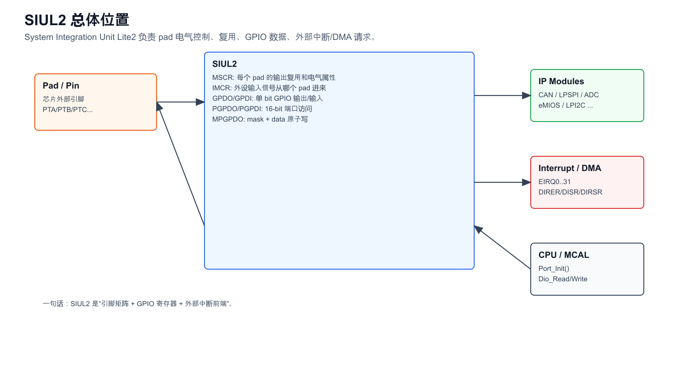

## 1. Chapter 10 章节地图

Chapter 10 的重点页码如下：

| 小节 | 内容 | PDF 页 |
|---|---|---:|
| 10.1 | chip-specific SIUL2 information | 312 |
| 10.2 | Overview / block diagram / features | 312-314 |
| 10.3.1 | Pad Control | 314 |
| 10.3.2 | GPIO pads | 314-315 |
| 10.3.4 | External interrupts | 315-317 |
| 10.3.5 | DMA requests | 317 |
| 10.6.1 | SIUL2 memory map | 318-360 |
| 10.6.20 | MSCR0 - MSCR323 | 413-426 |
| 10.6.21 | IMCR0 - IMCR473 | 427-438 |
| 10.6.22 | GPDO0 - GPDO323 | 439 |
| 10.6.23 | GPDI0 - GPDI323 | 440 |
| 10.6.24-33 | PGPDO/PGPDI parallel port access | 441-464 |
| 10.6.34-38 | MPGPDO masked output | 465-483 |

如果只为了工程配置，建议优先读：`10.1`、`10.2`、`10.3.1`、`10.3.2`、`10.3.4`、`10.6.20`、`10.6.21`、`10.6.22-38`。

## 2. SIUL2 解决什么问题

SIUL2 把芯片外部 pad 和内部模块连接起来。它做四类事情：

1. **Pad 电气控制**：输入缓冲、输出缓冲、上下拉、驱动强度、slew rate、反相、安全模式等。
2. **Pin mux 输出复用**：一个 pad 输出 GPIO、CAN_TX、LPSPI_SCK、eMIOS PWM 等，由 `MSCR[n].SSS` 选择。
3. **外设输入复用**：一个外设输入信号从哪个 pad 进来，由 `IMCR[m].SSS` 选择。
4. **GPIO 数据访问**：单 bit 的 `GPDO/GPDI`，16-bit 端口级的 `PGPDO/PGPDI`，以及 mask 写的 `MPGPDO`。

手册里还有外部中断/DMA 请求逻辑：EIRQ 输入从 pad 进 SIUL2，经边沿检测、可选 glitch filter，再送中断控制器或 DMA。

## 3. S32K324 的芯片特性提醒

手册 10.1 对本系列有几个限制，配置时很关键：

- `MSCR5[IFE]` 的 input filter enable 只支持 reset pad `PTA5`。其它输入的滤波要看具体模块或外部中断 filter。
- 芯片不实现通用 open-drain 功能。LPI2C/LPUART 相关 pad 的 pseudo open-drain 由对应模块处理，不要在 SIUL2 里找通用 ODE。
- `PTA24`、`PTA25` 是 input-only，手册说明 `GPDO[25:24]` 和 `PGPDO1[7:6]` 保留。工程里有 `DIO_PTA24_ASSVSW1`、`DIO_PTA25_ASSVSW2`，使用时更适合按输入理解，不要当普通输出脚写。
- `EIRQ[0..15]` 可用于 interrupt 或 DMA request；`EIRQ[16..31]` 只能做 interrupt。
- 当 pad `IBE=1` 时，pad 必须被主动驱动，否则 IO 状态不确定。悬空输入要配上下拉或由外部电路保证电平。

## 4. MSCR 与 IMCR

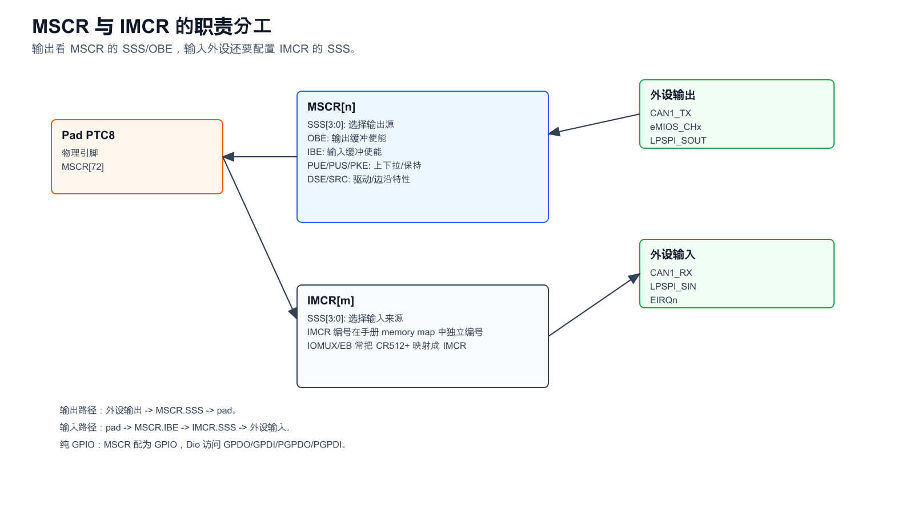

### 4.1 MSCR：pad 自身的配置寄存器

`MSCR[n]` 对应一个 pad。对工程最有用的字段：

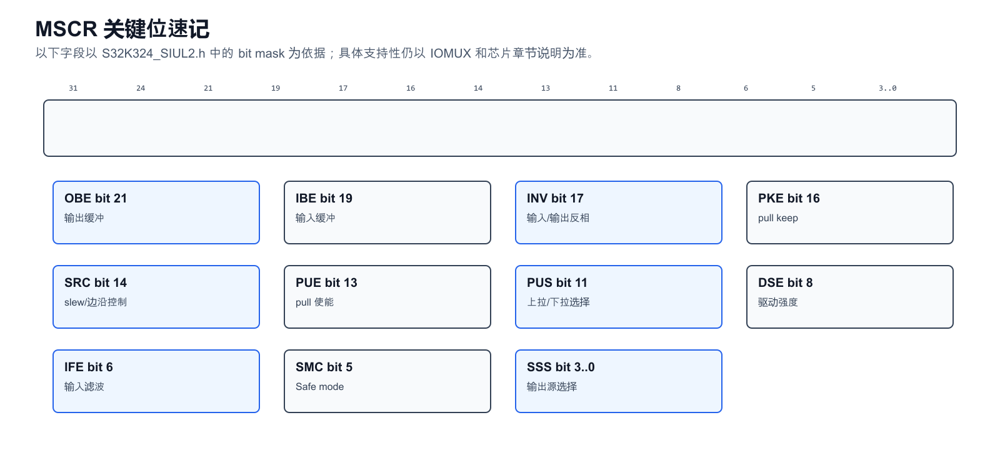

| 字段 | 作用 | EB/生成代码常见映射 |
|---|---|---|
| `SSS[3:0]` | 输出源选择：GPIO、ALT1、ALT2... | `PortPinMode`、`.mux` |
| `OBE` | output buffer enable | `PortPinDirection=OUT` 或输出型 alternate function |
| `IBE` | input buffer enable | `PortPinDirection=IN` 或外设输入 |
| `PUE/PUS/PKE` | 上下拉/keep | `PortPinPue`、`PortPinPus`、`PortPinPke` |
| `DSE` | drive strength | `PortPinDse` |
| `SRC` | slew rate control | `PortPinSlewRate` |
| `INV` | 反相控制 | `PortPinInvertControl` |
| `IFE` | input filter enable | S32K324 只对 reset pad 有限制性支持 |
| `SMC` | Safe mode 行为 | `PortPinSafeMode` |

工程头文件证据：  
`E:/github/ECAS_RTA_S32K324GHS_Heating/BasicSoftware/integration/mcal/src/modules/BaseNXP/header/S32K324_SIUL2.h` 中定义了 `SIUL2_MSCR_OBE_MASK`、`SIUL2_MSCR_IBE_MASK`、`SIUL2_MSCR_PUE_MASK`、`SIUL2_MSCR_PUS_MASK`、`SIUL2_MSCR_DSE_MASK`、`SIUL2_MSCR_IFE_MASK`、`SIUL2_IMCR_SSS_MASK` 等。

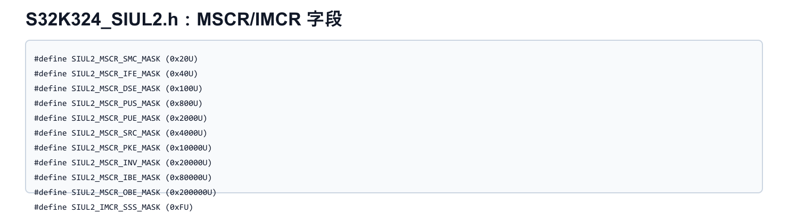

### 4.2 IMCR：外设输入选择

`IMCR[m]` 不是“另一个 pad 配置”，而是**外设输入目的端**的选择寄存器。比如 CAN1_RX 可以从多个 pad 进来，必须配置对应 IMCR，让 CAN1_RX 连接到当前 pad。

典型判断：

- 外设输出，例如 CAN_TX、LPSPI_SCK 输出：主要看 `MSCR[n].SSS` + `OBE`。
- 外设输入，例如 CAN_RX、LPSPI_SIN 输入：看 `MSCR[n].IBE` + 对应 `IMCR[m].SSS`。
- 双向或 inout 功能：MSCR 和 IMCR 都可能要配。

手册 10.1.2 提醒：CR 0-511 对应 MSCR，CR 512-1023 对应 IMCR；IOMUX 文件里的 IMCR 编号相对 SIUL2 memory map section 有 512 offset。读 EB/IOMUX 表时要留意这个编号差异。

## 5. GPIO 数据寄存器

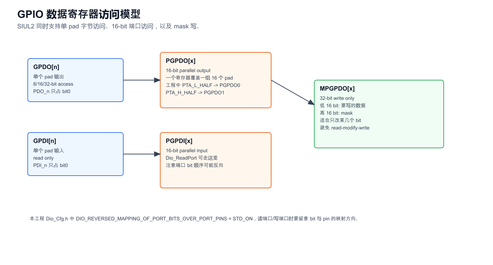

SIUL2 的 GPIO 数据访问有三种粒度：

| 寄存器 | 粒度 | 用途 |
|---|---|---|
| `GPDO[n]` | 单 pad 输出，byte register，bit0 有效 | 写单个 pad |
| `GPDI[n]` | 单 pad 输入，byte register，bit0 有效 | 读单个 pad |
| `PGPDO[x]` | 16-bit parallel output | 写一个半端口 |
| `PGPDI[x]` | 16-bit parallel input | 读一个半端口 |
| `MPGPDO[x]` | 32-bit masked output | 低 16 bit 是数据，高 16 bit 是 mask |

当前工程中，Dio IP 层把 `PTA/PTB/PTC...` 映射到 `PGPDO`：

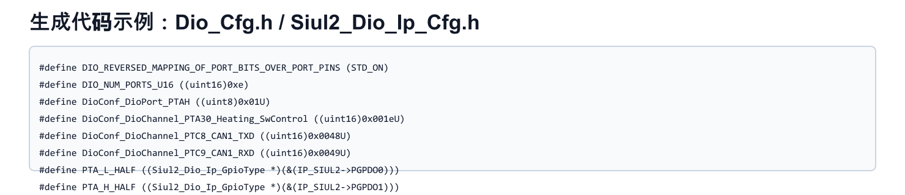

例如：

- `PTA_L_HALF` -> `IP_SIUL2->PGPDO0`
- `PTA_H_HALF` -> `IP_SIUL2->PGPDO1`
- `PTB_L_HALF` -> `IP_SIUL2->PGPDO2`
- `PTE_L_HALF` -> `IP_SIUL2->PGPDO8`

工程里 `DIO_REVERSED_MAPPING_OF_PORT_BITS_OVER_PORT_PINS = STD_ON`，所以看 `Dio_ReadPort()` / `Dio_WritePort()` 时必须确认 bit 顺序；不要想当然认为 bit0 一定就是 pin0。

## 6. 外部中断与 DMA

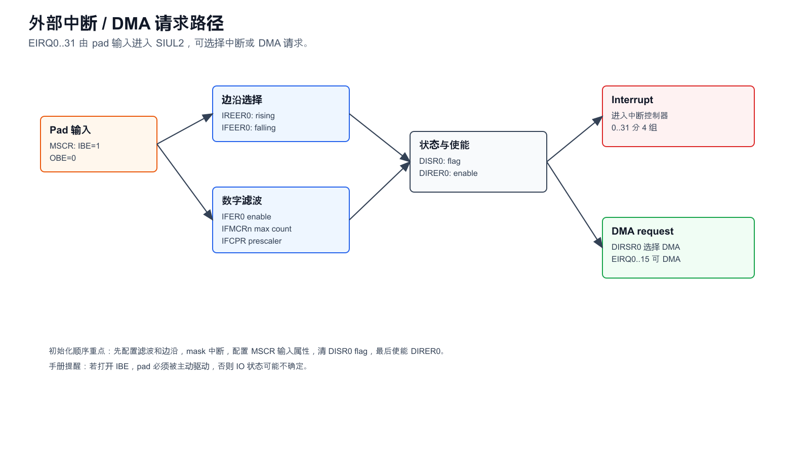

SIUL2 支持最多 32 个外部中断输入。外部中断链路大致是：

`Pad -> MSCR 输入缓冲 -> edge detector -> glitch filter -> DISR flag -> DIRER enable -> interrupt 或 DMA`

关键寄存器：

| 寄存器 | 作用 |
|---|---|
| `DISR0` | DMA/interrupt status flag，写 1 清 flag |
| `DIRER0` | interrupt/DMA request enable |
| `DIRSR0` | request select，选择 interrupt 还是 DMA |
| `IREER0` | rising edge enable |
| `IFEER0` | falling edge enable |
| `IFER0` | input filter enable |
| `IFMCRn` | filter maximum counter |
| `IFCPR` | filter clock prescaler |

手册推荐初始化顺序：

1. 配置 `IFER`，准备 glitch filter。
2. `DIRER0[EIREn]=0`，先 mask 中断。
3. 配置 `IREER0` / `IFEER0` 选择上升沿、下降沿或双边沿。
4. 配置对应 pad 的 `MSCR`：关闭输出，打开输入缓冲，必要时设置上下拉。
5. 配置 `DIRSR0`，选择 interrupt 或 DMA。
6. 配置 `IFMCRn`、`IFCPR`，再 enable filter。
7. 写 `DISR0` 清 pending flag。
8. 最后使能 `DIRER0`。

两个容易犯错的点：

- 不要把外部中断 pad 配成输出，否则可能误触发。
- 不要同时禁用 rising 和 falling edge；手册明确提醒不应两个边沿都关。

## 7. EB 配置与生成代码链路

当前工程配置源：

- `E:/github/ECAS_RTA_S32K324GHS_Heating/BasicSoftware/integration/mcal/MCAL_Cfg/config/Port.xdm`
- `E:/github/ECAS_RTA_S32K324GHS_Heating/BasicSoftware/integration/mcal/MCAL_Cfg/config/Dio.xdm`
- `E:/github/ECAS_RTA_S32K324GHS_Heating/BasicSoftware/integration/mcal/MCAL_Cfg/config/Icu.xdm`
- `E:/github/ECAS_RTA_S32K324GHS_Heating/BasicSoftware/integration/mcal/MCAL_Cfg/config/Mcu.xdm`

当前工程生成代码：

- `E:/github/ECAS_RTA_S32K324GHS_Heating/BasicSoftware/integration/mcal/src/gen/include/Port_Cfg.h`
- `E:/github/ECAS_RTA_S32K324GHS_Heating/BasicSoftware/integration/mcal/src/gen/src/Port_PBcfg.c`
- `E:/github/ECAS_RTA_S32K324GHS_Heating/BasicSoftware/integration/mcal/src/gen/src/Siul2_Port_Ip_PBcfg.c`
- `E:/github/ECAS_RTA_S32K324GHS_Heating/BasicSoftware/integration/mcal/src/gen/include/Dio_Cfg.h`
- `E:/github/ECAS_RTA_S32K324GHS_Heating/BasicSoftware/integration/mcal/src/gen/src/Dio_Cfg.c`
- `E:/github/ECAS_RTA_S32K324GHS_Heating/BasicSoftware/integration/mcal/src/gen/include/Siul2_Dio_Ip_Cfg.h`

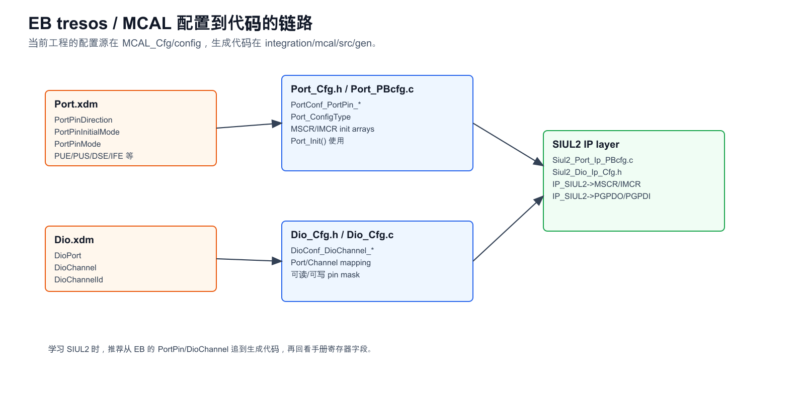

### 7.1 Port 模块要配什么

在 EB tresos 里，`Port` 负责 SIUL2 pad 初始化。通常要检查：

| EB 参数 | 含义 | 落到 SIUL2 |
|---|---|---|
| `PortPinPcr` | pad/MSCR index | `MSCR[n]` |
| `PortPinDirection` | 输入/输出/双向 | `IBE/OBE` |
| `PortPinInitialMode` | `Port_Init()` 后的初始模式 | `MSCR.SSS` 初始值 |
| `PortPinMode` | 允许 `Port_SetPinMode()` 切换的模式 | mode availability / mux table |
| `PortPinLevelValue` | 输出初值 | `GPDO/PGPDO` 初值 |
| `PortPinPue/Pus/Pke` | 上拉/下拉/保持 | `PUE/PUS/PKE` |
| `PortPinDse` | 驱动能力 | `DSE` |
| `PortPinSlewRate` | slew rate | `SRC` |
| `PortPinIfe` | 输入滤波 | `IFE`，但 S32K324 有限制 |
| `PortPinModeChangeable` | 是否允许运行时切换 mode | `Port_SetPinMode()` |
| `PortPinDirectionChangeable` | 是否允许运行时改方向 | `Port_SetPinDirection()` |

### 7.2 Dio 模块要配什么

`Dio` 不负责 mux，也不负责上下拉。Dio 只在 pad 已经被 Port 配成 GPIO/可读写后，提供 `Dio_ReadChannel()`、`Dio_WriteChannel()`、`Dio_ReadPort()`、`Dio_WritePort()` 等 API。

Dio 配置核心是：

- `DioPortId`：半端口编号，例如 `PTAL`、`PTAH`、`PTBL`。
- `DioChannelId`：该半端口内的 channel 编号。
- `DioChannel` 的 symbolic name：给应用/驱动代码使用。

例子：`DioConf_DioChannel_PTA30_Heating_SwControl = 0x001e`，`0x001e` 即十进制 30，对应 PTA30。

### 7.3 Mcu / Clock

手册 10.3.3 写 SIUL2 module 本身无特殊 clocking considerations，但工程中 MCU clock gate 仍有 SIUL2 相关时钟项。当前工程 `Clock_Ip_Data.c` 中可见 `SIUL2_CLK` gate 及若干 `SIUL2_PDACx` clock。一般 EB 里不需要像外设时钟那样为普通 GPIO 单独算波特率/频率，但低功耗、partition、PDAC、virtual wrapper 场景要看 Mcu/Rm 配置。

## 8. 本工程配置样例

### 8.1 PTA30：输出/复用脚

EB `Port.xdm` 中的 `PTA30_O_GPIO`：

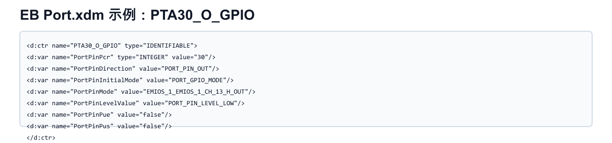

生成的 `Siul2_Port_Ip_PBcfg.c` 中，PTA30 最终是：

- `pinPortIdx = 30`
- `.mux = PORT_MUX_ALT2`
- `.inputBuffer = DISABLED`
- `.outputBuffer = ENABLED`
- `.initValue = 0`

`Port_PBcfg.c` 中同一个 pad 也能看到 `MSCR` 值：

```c
{ (uint16)30, (uint32)0x00200002, ..., PORT_PIN_OUT, ... }
```

拆一下 `0x00200002`：

- bit21 `OBE=1`，打开输出缓冲。
- bit19 `IBE=0`，输入缓冲关闭。
- `SSS=2`，选择 ALT2，对应 `EMIOS_1_EMIOS_1_CH_13_H_OUT`。

这说明虽然 EB 容器名字叫 `PTA30_O_GPIO`，但生成后的 SIUL2 初始化实际把它作为 eMIOS 输出复用脚使用。阅读 EB 时不要只看容器名，要看 `PortPinInitialMode/PortPinMode` 和生成的 `.mux/u32MSCR`。

### 8.2 PTA30 的 Dio symbolic name

EB `Dio.xdm` 中还有 `PTA30_Heating_SwControl`：

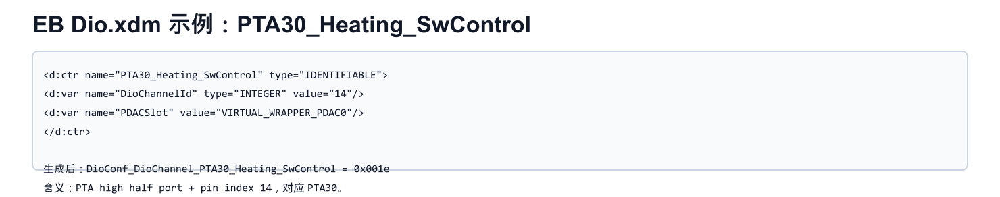

生成到 `Dio_Cfg.h`：

```c
#define DioConf_DioChannel_PTA30_Heating_SwControl ((uint16)0x001eU)
```

注意：如果 PTA30 当前 mux 是 eMIOS 输出，直接 `Dio_WriteChannel(Pta30...)` 不一定会反映到 pad 上。手册 10.3.2 说明：对 alternate function pad 写 data output register，不会反映到 pad，直到重新配置成 GPIO。也就是说，Dio symbolic name 存在，不代表运行时一定能作为 GPIO 输出使用。

### 8.3 PTC8/PTC9：CAN TX/RX

`PTC8_CAN1_TXD` 在 `Port.xdm` 中配置为输出，`PortPinMode=CAN1_CAN1_TX_OUT`；生成代码：

- `pinPortIdx = 72`
- `.mux = PORT_MUX_ALT3`
- `.outputBuffer = ENABLED`
- `u32MSCR = 0x00200003`

这就是典型外设输出：`SSS=3` 选择 CAN1_TX，`OBE=1` 开输出。

`PTC9_CAN1_RXD` 生成代码：

- `pinPortIdx = 73`
- `.mux = PORT_MUX_AS_GPIO`
- `.inputBuffer = ENABLED`
- `.outputBuffer = DISABLED`
- `.inputMuxReg = { 1 }`
- `.inputMux = { PORT_INPUT_MUX_ALT1, ... }`

这体现了输入复用的特点：pad 本身开输入缓冲，同时 IMCR 选择 CAN1_RX 的输入来源。

### 8.4 PTE4：普通 GPIO 输出

`PTE4_O_GPIO` 在 `Port.xdm` 中：

- `PortPinPcr = 132`
- `PortPinDirection = PORT_PIN_OUT`
- `PortPinInitialMode = PORT_GPIO_MODE`
- `PortPinMode = GPIO`
- `PortPinLevelValue = PORT_PIN_LEVEL_LOW`

生成的 `Siul2_Port_Ip_PBcfg.c`：

- `pinPortIdx = 132`
- `.mux = PORT_MUX_AS_GPIO`
- `.outputBuffer = ENABLED`
- `.inputBuffer = DISABLED`
- `.initValue = 0`

同时 `Dio_Cfg.h` 里有：

```c
#define DioConf_DioChannel_PTE4_MTG_LS_MCU ((uint16)0x0084U)
```

这类 pin 才是最标准的 Dio 输出使用方式。

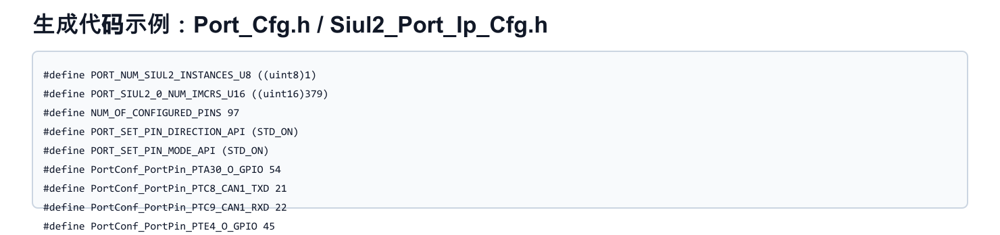

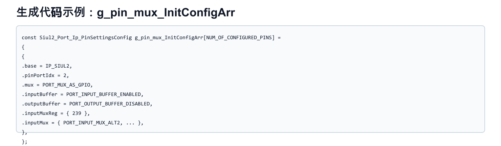

## 9. EB 配置操作建议

### 9.1 配一个普通 GPIO 输出

以 `PTE4` 这种低边控制或使能脚为例：

1. 在 `Port` 模块新增/选择对应 `PortPin`。
2. 确认 `PortPinPcr` 等于芯片 pad 的 MSCR index，例如 PTE4 在本工程为 `132`。
3. `PortPinDirection = PORT_PIN_OUT`。
4. `PortPinInitialMode = PORT_GPIO_MODE`。
5. `PortPinMode = GPIO`。
6. 设置 `PortPinLevelValue` 为安全默认值，常见低有效/高有效要结合电路。
7. 按硬件需要设置 `DSE/SlewRate/PUE/PUS`。输出脚一般不用内部上下拉，但 enable 脚可根据安全状态考虑。
8. 若要运行时切换方向/模式，打开 `PortPinDirectionChangeable`、`PortPinModeChangeable`；安全项目中要谨慎。
9. 在 `Dio` 模块为该 pad 建 `DioChannel`，channel id 对应 half-port 内 pin 编号。
10. 生成代码后检查 `Siul2_Port_Ip_PBcfg.c`：`.mux=PORT_MUX_AS_GPIO`、`.outputBuffer=ENABLED`、`.initValue` 正确。

### 9.2 配一个普通 GPIO 输入

1. `PortPinDirection = PORT_PIN_IN`。
2. `PortPinInitialMode = PORT_GPIO_MODE`。
3. `inputBuffer` 生成后应为 enabled，`outputBuffer` disabled。
4. 如果外部没有确定驱动，必须用 `PUE/PUS/PKE` 或外部上下拉保证电平。
5. 在 `Dio` 中配置 channel 后，使用 `Dio_ReadChannel()`。
6. 注意手册提示：`IBE=1` 的 pad 必须被主动驱动。

### 9.3 配一个外设输出，例如 CAN_TX / PWM / SPI_CLK

1. 在 IOMUX 表里确认 pad 支持目标外设输出，以及对应 SSS/ALT 值。
2. `PortPinDirection = PORT_PIN_OUT`。
3. `PortPinMode` 选择目标外设输出，如 `CAN1_CAN1_TX_OUT`。
4. 生成后确认 `.mux = PORT_MUX_ALTn`，`u32MSCR` 低 4 bit 等于目标 SSS。
5. 一般不需要 Dio channel；即使有 Dio channel，也不要用 Dio 直接改这个 pad 的实际输出。

### 9.4 配一个外设输入，例如 CAN_RX / SPI_SIN

1. 在 IOMUX 表里确认目标外设输入对应的 IMCR。
2. `PortPinDirection = PORT_PIN_IN` 或输入型模式。
3. 生成后确认 `.inputBuffer = ENABLED`。
4. 生成后确认 `.inputMuxReg` 和 `.inputMux` 有效，不是全 `NO_INIT`。
5. 如果输入悬空风险存在，配置上下拉或硬件保证。

### 9.5 配外部中断 EIRQ

SIUL2 的外部中断与 AUTOSAR 通常落在 `Icu` 或平台中断配置中，但 pad 本身仍依赖 `Port`：

1. Port：对应 pad 不能配输出，应该 `IBE=1`、`OBE=0`。
2. Port：必要时配置上下拉。
3. Icu/中断配置：选择 EIRQ 通道、边沿。
4. 若启用滤波，确认时钟和 filter 参数。手册提醒 filter 依赖内部 oscillator clock。
5. 初始化时先 mask、配置边沿和 pad、清 flag，最后 enable。

## 10. 调试与排错清单

### 10.1 GPIO 写了没反应

- 确认 pad 当前是 GPIO，不是 CAN/eMIOS/LPSPI alternate function。
- 查 `Siul2_Port_Ip_PBcfg.c` 的 `.mux` 是否为 `PORT_MUX_AS_GPIO`。
- 查 `.outputBuffer` 是否 enabled。
- 查 Dio channel 是否对应正确 port/pin，注意 half-port 和 bit 顺序。
- 查硬件是否有外部驱动、保护芯片、三极管/高边低边使能逻辑。

### 10.2 外设 RX 收不到

- 查对应 pad 的 `.inputBuffer` 是否 enabled。
- 查 `.inputMuxReg` / `.inputMux` 是否配置了目标外设输入。
- 查是否误把 pad 配成了纯 GPIO 输出。
- 查 IOMUX 表中此 pad 是否真的支持该外设输入。
- 查外设模块本身时钟、pin、controller 配置。

### 10.3 中断误触发

- 初始化前是否 mask `DIRER`。
- 是否在 enable 前清了 `DISR0` flag。
- 是否同时开了不期望的 rising/falling edge。
- 输入是否悬空。
- 是否误配输出导致 pad 电平变化触发。

### 10.4 上电瞬间电平不安全

- 看 reset 默认状态，不只看 `Port_Init()` 后状态。
- 检查 `PortPinLevelValue` 与硬件默认安全态是否一致。
- 高边/低边驱动脚要确认有效电平。
- 必要时靠外部上下拉保证上电到软件初始化前的状态。

## 11. 快速索引：工程里去哪看

| 想确认的问题 | 文件 |
|---|---|
| EB Port 原始配置 | `E:/github/ECAS_RTA_S32K324GHS_Heating/BasicSoftware/integration/mcal/MCAL_Cfg/config/Port.xdm` |
| EB Dio 原始配置 | `E:/github/ECAS_RTA_S32K324GHS_Heating/BasicSoftware/integration/mcal/MCAL_Cfg/config/Dio.xdm` |
| pin symbolic name | `E:/github/ECAS_RTA_S32K324GHS_Heating/BasicSoftware/integration/mcal/src/gen/include/Port_Cfg.h` |
| Port 初始化数组 | `E:/github/ECAS_RTA_S32K324GHS_Heating/BasicSoftware/integration/mcal/src/gen/src/Port_PBcfg.c` |
| SIUL2 IP pin mux 数组 | `E:/github/ECAS_RTA_S32K324GHS_Heating/BasicSoftware/integration/mcal/src/gen/src/Siul2_Port_Ip_PBcfg.c` |
| Dio symbolic channel | `E:/github/ECAS_RTA_S32K324GHS_Heating/BasicSoftware/integration/mcal/src/gen/include/Dio_Cfg.h` |
| Dio port/pin mask | `E:/github/ECAS_RTA_S32K324GHS_Heating/BasicSoftware/integration/mcal/src/gen/src/Dio_Cfg.c` |
| SIUL2 寄存器定义 | `E:/github/ECAS_RTA_S32K324GHS_Heating/BasicSoftware/integration/mcal/src/modules/BaseNXP/header/S32K324_SIUL2.h` |

## 12. 记忆口诀

- **MSCR 管 pad，IMCR 管输入目的端。**
- **输出看 SSS + OBE，输入看 IBE + IMCR。**
- **Dio 只读写 GPIO 数据，不负责 pin mux。**
- **Port_Init 决定上电后软件初始化状态，reset 到 Port_Init 之间还要看硬件默认和外部电路。**
- **外设复用脚不要用 Dio 强行控制，除非先切回 GPIO。**

