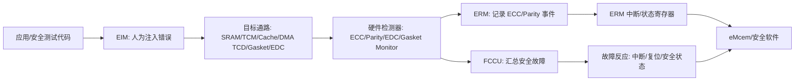
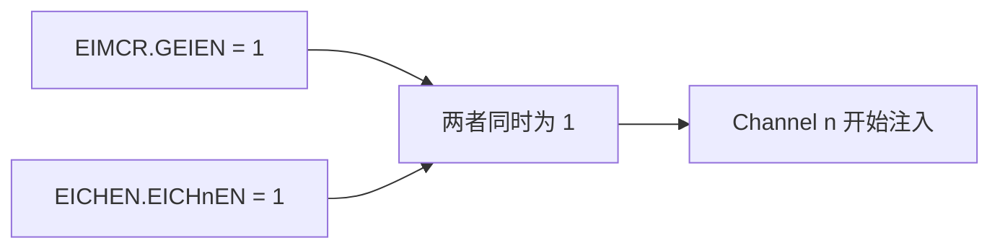
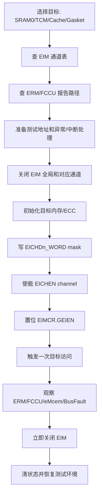

# Chapter 50 Error Injection Module (EIM) 学习笔记

> 适用背景：S32K324 / S32K3xx，面向功能安全开发、ECC/EDC 诊断验证、ERM/FCCU/eMcem 联调和复习输出。  
> 主要参考：用户提供的 `S32K3xx Reference Manual.pdf` 中 Chapter 50、Chapter 49、Chapter 51、Chapter 54；本工程 S32K324 头文件；NXP Community 与 NXP SAF/SPD 官方资料。  
> 说明：用户上传的参考手册文本为 S32K3xx Reference Manual Rev. 9，07/2024。NXP 参考手册可能后续更新，表号和措辞可能变化。本文以 S32K324 芯片实际通道和本工程头文件为主，表号仅作定位参考。

---

## 1. 先用一句话抓住 EIM

EIM，全称 **Error Injection Module**，可以理解成芯片内部的“故障注入开关”。

它的作用不是检测错误，也不是处理错误，而是**故意在某些受保护的数据通路上制造一个可控的假错误**，用来验证后面的 ECC、EDC、ERM、FCCU、eMcem 这些安全诊断链路是否真的能工作。

换句话说：

```text
EIM 负责“造一个错误”
ERM 负责“记录某些 ECC/Parity 错误”
FCCU 负责“汇总并触发安全反应”
eMcem/安全软件负责“解释、上报、恢复或进入安全状态”
```

开发时最重要的一句话是：

**EIM 是 check the checker 的工具。它不是业务功能，不是内存测试算法，也不是错误处理模块。**

---

## 2. EIM 在安全架构里的位置

先看整体关系，不要一开始就钻寄存器。



老师式理解：

车上的安全机制不能只靠“我觉得它能发现故障”。你要能证明它发现过。EIM 就是把一个小错误“塞”到指定位置，让 ECC 或总线监控器真的报警。报警以后，ERM 有没有记录？FCCU 有没有收到？软件有没有按设计进入降级、复位或安全状态？这些都可以通过 EIM 做闭环验证。

---

## 3. 为什么需要故障注入

汽车 MCU 里有很多硬件安全机制，例如：

- SRAM ECC。
- TCM ECC。
- Cache ECC。
- DMA TCD RAM ECC。
- 总线数据/地址 EDC。
- Gasket monitor。
- Lockstep 比较。
- FCCU 故障汇总与反应。

这些机制平时大多数时候不会触发，因为真实硬件故障不是你想让它出现就出现。问题是，功能安全开发又要求你证明这些机制可用。于是就需要“受控故障注入”。

EIM 的意义可以分成三层：

| 层次 | 你验证的是什么 | 举例 |
|---|---|---|
| 检测层 | ECC/Parity/EDC/Gasket 是否能发现错误 | SRAM 读数据被翻 1 bit 后，ECC 是否报单 bit 错误 |
| 报告层 | ERM/FCCU 是否能拿到这个错误 | ERM 状态位、地址、syndrome 是否更新 |
| 软件反应层 | 安全软件是否按策略处理 | eMcem 是否回调，FCCU 是否触发 NCF reaction，系统是否进入安全状态 |

**重点：EIM 测的不是“内存是不是坏了”，而是“如果内存/通路表现出错误，诊断链路能不能发现并处理”。**

这就是功能安全里常说的 **check the checker**，也就是“检查检测器本身是否还健康”。

---

## 4. 必须先懂的背景概念

### 4.1 ECC 是什么

ECC 是 **Error Correcting Code**，错误纠正码。

以 SRAM 为例，CPU 或 DMA 写入数据时，硬件不只保存数据本身，还会保存一组额外的校验位。读出时，硬件拿“数据 + 校验位”重新计算，判断有没有 bit 被翻转。

常见的 SRAM ECC 能力是 **SEC-DED**：

| 缩写 | 全称 | 含义 |
|---|---|---|
| SEC | Single Error Correction | 单 bit 错误可以纠正 |
| DED | Double Error Detection | 双 bit 错误可以检测，但通常不能纠正 |

举例：

- SRAM 读出 64 bit 数据，同时读出 8 bit ECC checkbit。
- 如果其中 1 bit 数据错了，ECC 硬件可以定位并纠正，ERM 可能记录 single-bit event。
- 如果 2 bit 数据错了，ECC 硬件能判断“这里坏了”，但通常无法恢复原始数据，可能触发 BusFault、FCCU 或不可恢复故障。

EIM 就是故意在这个读路径上翻 bit，让 ECC 以为读到了坏数据。

### 4.2 Checkbit 是什么

Checkbit 是校验位，也就是 ECC 保存的额外位。

很多人刚学时会以为 ECC 只关心数据 bit。其实不是。ECC 读路径上有两类东西：

```text
read data bus  : 真正的数据
checkbit bus   : ECC 校验位
```

EIM 可以对这两类信号做掩码：

- `DATA_MASK`：选择要翻转的数据位。
- `CHKBIT_MASK`：选择要翻转的 ECC 校验位。

对 ECC 来说，不管你翻的是数据位还是 checkbit，只要组合校验关系被破坏，它都可能产生错误事件。

### 4.3 Parity 和 EDC 是什么

Parity 是奇偶校验，通常比 ECC 简单。它可以发现一部分位翻转，但一般不能纠错。

EDC 可以理解成更广义的 **Error Detection Code**。在 S32K3 的安全架构里，EDC 不只保护存储阵列，还会保护一些总线路径，例如地址、写数据、读数据路径。

简单对比：

| 机制 | 主要目的 | 能否纠正 |
|---|---|---|
| ECC | 存储器数据完整性保护 | 单 bit 通常可纠正，双 bit 通常只检测 |
| Parity | 简单错误检测 | 通常不能纠正 |
| EDC | 数据/地址通路错误检测 | 通常不能纠正，只负责发现 |

### 4.4 Memory controller 是什么

Memory controller 是内存控制器。CPU 并不是直接把手伸进 SRAM 阵列里拿数据，而是通过控制器访问。

可以这样理解：

```text
CPU/DMA 读请求 -> Memory controller -> Memory array -> read data/checkbit -> ECC/监控逻辑 -> CPU/DMA
```

EIM 通道通常挂在某个 memory controller 的读路径上。也就是说，EIM 并不是“改 SRAM 里面存的值”，而是在读出来的信号经过某处时临时翻转 selected bits。

### 4.5 Gasket 是什么

Gasket 直译是“垫片”，在芯片安全架构里可以理解成**夹在两个模块接口之间的监控层**。

它通常不改变正常业务数据，只是观察接口上的地址、读数据、写数据、控制信号等是否符合安全保护规则。如果发现不一致，就产生 gasket alarm。

S32K3 里常见的 gasket 包括：

- EMAC gasket。
- TCM gasket。
- DMA AXBS gasket。
- HSE gasket。
- QuadSPI gasket。
- AIPS gasket。

**重点：EIM 对 gasket 注入错误时，不会改变真实业务数据流。gasket 会拿真实数据和被 EIM 修改后的监控数据做比较，然后报 alarm。**

这和 SRAM ECC 注入不一样。SRAM ECC 注入会让读出的数据/ECC 组合看起来坏了；gasket 注入更像是在监控器旁边制造一个“对比不一致”的场景。

### 4.6 ERM 是什么

ERM 是 **Error Reporting Module**，错误报告模块。

它负责记录某些内存 ECC 和 parity 事件，例如：

- single-bit error。
- multi-bit error。
- syndrome。
- 错误地址，某些通道支持。
- 中断通知，某些通道支持。

不要把 ERM 和 EIM 混在一起：

| 模块 | 角色 |
|---|---|
| EIM | 造错误 |
| ERM | 记录某些被硬件检测到的错误 |

### 4.7 FCCU 是什么

FCCU 是 **Fault Collection and Control Unit**，故障收集与控制单元。

它负责把芯片里大量安全故障源收集起来，然后根据配置触发：

- 中断。
- 外部安全引脚。
- 功能复位。
- 破坏性复位。
- 进入安全状态。

EIM 本身不是 FCCU 故障源的最终管理者。EIM 只是触发上游错误，让 ECC/EDC/gasket 产生故障，再由 ERM/FCCU/eMcem 去记录和处理。

### 4.8 eMcem 是什么

eMcem 是 NXP S32 Safety Software 里的 **extended Microcontroller Error Manager**。

从开发角度看，它是安全软件对 ERM、FCCU、EIM 等硬件安全机制的一层封装和管理。你的工程里已经有相关头文件，例如：

```text
BasicSoftware/integration/mcal/src/modules/eMcem/inc/eMcem_Eim.h
BasicSoftware/integration/mcal/src/modules/eMcem/inc/eMcem_EimChannels_S32K3XX.h
BasicSoftware/integration/mcal/src/modules/eMcem/inc/eMcem_Erm.h
```

本工程的 `eMcem_EimChannels_S32K3XX.h` 里还可以看到：

```c
#define EMCEM_EIM_BASE_OFFSET         192U
#define EMCEM_EIM_CHANNEL_COUNT       31U
#define EMCEM_EIM_INSTANCE_COUNT       1U
```

这说明在 eMcem 的软件抽象里，S32K324 这一类器件的 EIM 通道数是 31 个，实例数是 1 个。`EMCEM_EIM_BASE_OFFSET` 表示 eMcem 把 EIM 通道编号放在某个软件通道编号空间里，它不是硬件 EIM 寄存器通道号本身。

---

## 5. S32K324 上的 EIM 实例和基地址

S32K3 家族不同型号的 EIM 实例数不同。有的高配型号最多有 EIM_0、EIM_1、EIM_2、EIM_3。

但对 **S32K324** 来说，重点很简单：

| 项目 | S32K324 结论 |
|---|---|
| EIM 实例 | 只有 `EIM_0` |
| EIM_0 基地址 | `0x4025_8000` |
| 本工程头文件 | `S32K324_EIM.h` |
| 头文件宏 | `IP_EIM_BASE (0x40258000u)` |
| 实例数宏 | `EIM_INSTANCE_COUNT (1u)` |

本工程头文件位置：

```text
BasicSoftware/integration/mcal/src/modules/BaseNXP/header/S32K324_EIM.h
```

里面定义：

```c
#define EIM_INSTANCE_COUNT   (1u)
#define IP_EIM_BASE          (0x40258000u)
#define IP_EIM               ((EIM_Type *)IP_EIM_BASE)
```

**易错点：** 参考手册通用寄存器章节里会出现 `EIM_0 base address: 4050_C000h`，这是其他 S32K3 变体的 EIM_0 地址。对 S32K324 开发时，不要直接照抄这个地址。本工程和 S32K324 芯片专用信息使用 `0x4025_8000`。

---

## 6. EIM 能做什么，不能做什么

### 6.1 EIM 能做什么

EIM 可以在指定通道上做受控 bit inversion，也就是把某些 bit 取反。

典型用途：

1. 对 SRAM/TCM/DMA TCD 等 RAM 读数据路径注入单 bit 错误。
2. 对 SRAM/TCM/DMA TCD 等 RAM 读数据路径注入双 bit 错误。
3. 对 ECC checkbit 注入错误。
4. 对 cache ECC 路径做受控验证。
5. 对 gasket monitor 注入不一致，让 gasket alarm 触发。
6. 对 EDC 地址/写数据/读数据检查路径注入错误。

### 6.2 EIM 不能做什么

EIM 不能替代所有硬件自检。

| 误解 | 正确理解 |
|---|---|
| EIM 能证明 SRAM 每个 bit 都是好的 | 不能。EIM 不是 MBIST，不做存储单元覆盖测试 |
| EIM 会真的把 SRAM 改坏 | 通常不会。它主要在读路径或监控路径上翻转信号 |
| EIM 是错误检测模块 | 不是。检测由 ECC/Parity/EDC/gasket 完成 |
| EIM 是错误处理模块 | 不是。处理由 ERM/FCCU/eMcem/应用安全策略完成 |
| EIM 可以随便在运行时开着 | 绝对不建议。它会让后续访问持续产生人工错误 |

老师式理解：

MBIST 像体检，检查身体组织有没有问题。EIM 像老师故意在试卷里放一个错字，看阅卷系统能不能发现。它验证的是“发现错误的系统”，不是全面检查硬件本体。

---

## 7. S32K324 EIM 通道映射

S32K324 使用 EIM_0，芯片专用映射表里通道是 0 到 30，共 31 个。这个结论也和本工程 `S32K324_EIM.h` 以及 eMcem 通道头文件一致。

**版本注意：** 参考手册功能概述里有一句通用描述“supports 17 error injection channels”。但 S32K324 的芯片专用 EIM channel mapping 和工程头文件实际覆盖到 `EICHD30_WORD1`。开发时以芯片专用通道表和芯片头文件为准。

| EIM 通道 | 目标 | 位宽 | 开发理解 |
|---:|---|---:|---|
| 0 | SRAM0 | 64 data + 8 check | 最常用，适合验证 SRAM0 ECC 单 bit/双 bit 错误链路 |
| 1 | SRAM1 | 64 data + 8 check | S32K324 有 SRAM1，适合验证 SRAM1 ECC |
| 2 | DMA TCD RAM | 64 data + 8 check | 验证 eDMA TCD RAM ECC，不要误当普通 SRAM |
| 3 | Cortex-M7_0 I-cache tag | 44 data + 14 check | 验证 CM7_0 指令 cache tag ECC |
| 4 | Cortex-M7_0 I-cache data | 128 data + 16 check | 验证 CM7_0 指令 cache data ECC |
| 5 | Cortex-M7_0 D-cache tag | 104 data + 28 check | 验证 CM7_0 数据 cache tag ECC |
| 6 | Cortex-M7_0 D-cache data0 | 128 data + 28 check | 验证 CM7_0 D-cache data bank |
| 7 | Cortex-M7_0 D-cache data1 | 128 data + 28 check | 验证 CM7_0 D-cache data bank |
| 8 | Cortex-M7_1 I-cache tag | 44 data + 14 check | 验证 CM7_1 指令 cache tag ECC |
| 9 | Cortex-M7_1 I-cache data | 128 data + 16 check | 验证 CM7_1 指令 cache data ECC |
| 10 | Cortex-M7_1 D-cache tag | 104 data + 28 check | 验证 CM7_1 数据 cache tag ECC |
| 11 | Cortex-M7_1 D-cache data0 | 128 data + 28 check | 验证 CM7_1 D-cache data bank |
| 12 | Cortex-M7_1 D-cache data1 | 128 data + 28 check | 验证 CM7_1 D-cache data bank |
| 13 | Cortex-M7_0 ITCM | 64 data + 8 check | 验证 CM7_0 ITCM ECC |
| 14 | Cortex-M7_0 D0TCM | 32 data + 8 check | 验证 CM7_0 D0TCM ECC |
| 15 | Cortex-M7_0 D1TCM | 32 data + 8 check | 验证 CM7_0 D1TCM ECC |
| 16 | Cortex-M7_1 ITCM | 64 data + 8 check | 验证 CM7_1 ITCM ECC |
| 17 | Cortex-M7_1 D0TCM | 32 data + 8 check | 验证 CM7_1 D0TCM ECC |
| 18 | Cortex-M7_1 D1TCM | 32 data + 8 check | 验证 CM7_1 D1TCM ECC |
| 19 | EMAC gasket | 188 data + 0 check | 验证 EMAC 接口 gasket alarm |
| 20 | Cortex-M7 TCM gasket | 188 data + 0 check | 验证 TCM AHB gasket alarm |
| 21 | DMA AXBS S0 gasket | 60 data + 0 check | 验证 DMA AXBS S0 gasket alarm |
| 22 | DMA AXBS S1 gasket | 60 data + 0 check | 验证 DMA AXBS S1 gasket alarm |
| 23 | HSE gasket | 60 data + 0 check | 验证 HSE gasket alarm |
| 24 | QuadSPI gasket | 60 data + 0 check | 验证 QuadSPI gasket alarm |
| 25 | AIPS1 gasket | 60 data + 0 check | 验证 AIPS1 gasket alarm |
| 26 | AIPS2 gasket | 60 data + 0 check | 验证 AIPS2 gasket alarm |
| 27 | Cortex-M7 lockstep | 30 data + 0 check | 验证 lockstep 比较相关错误注入路径 |
| 28 | ECC checking address | 24 data + 0 check | EDC 地址检查注入，需要配合 `MSCM_ENEDC` |
| 29 | EDC checking wdata | 18 data + 0 check | EDC 写数据检查注入，需要配合 `MSCM_ENEDC` |
| 30 | EDC checking rdata | 18 data + 0 check | EDC 读数据检查注入，需要配合 `MSCM_ENEDC` |

### 7.1 通道表怎么读

比如通道 0：

```text
Channel 0: SRAM0
DATA_MASK  : SRAM0 read data
CHKBIT_MASK: SRAM0 read data ECC
```

这表示 EIM channel 0 挂在 SRAM0 的读数据和 ECC checkbit 路径上。你写 `EICHD0_WORDx` 选择要翻哪一位，然后访问 SRAM0 某个地址，SRAM0 ECC 就会看到一个被破坏的读结果。

### 7.2 不要把 EIM 通道号和 ERM 通道号直接画等号

这是很常见的坑。

有些通道刚好对应，例如：

```text
EIM ch0 SRAM0 -> ERM ch0 SRAM0
EIM ch1 SRAM1 -> ERM ch1 SRAM1
```

但很多通道不一样，例如：

```text
EIM ch2  DMA TCD        -> ERM ch16 DMA TCD
EIM ch13 CM7_0 ITCM     -> ERM ch10 CM7_0 ITCM
EIM ch14 CM7_0 D0TCM    -> ERM ch11 CM7_0 D0TCM
EIM ch15 CM7_0 D1TCM    -> ERM ch12 CM7_0 D1TCM
```

所以开发时要查两张表：

1. EIM channel mapping：我要在哪里注入。
2. ERM channel mapping：错误会在哪里报告。

NXP 社区也明确提醒过这个点：EIM 通道分配看参考手册 EIM channel mapping 表，ERM 的 memory-to-channel mapping 看 ERM channel mapping 表。

---

## 8. EIM 的编程模型

### 8.1 EIM 不需要初始化

参考手册明确说：**This module does not require initialization.**

这句话很容易被误解。它不是说你可以直接乱用 EIM，而是说 EIM 模块本身没有类似“先 Init 后 Start”的复杂初始化序列。

真正使用前，你仍然要准备：

- 目标内存里要有有效 ECC。
- ERM/FCCU/eMcem 观察路径要配置好。
- 中断优先级和异常处理要准备好。
- 要确保测试地址不是关键数据、堆栈或向量表。
- 注入结束后要立刻关闭 EIM。

### 8.2 访问规则

EIM 的寄存器访问有严格要求：

| 规则 | 含义 |
|---|---|
| Supervisor mode only | 只能在特权态访问 |
| 32-bit word access only | 只能用 32 位访问 |
| 访问保留地址会 error termination | 不要手写未知偏移 |
| 用户态访问会 error termination | 不能让普通应用态代码直接操作 |
| 非 32 位访问会 error termination | 不要用 `uint8_t *` 或 `uint16_t *` 访问 |

开发建议：

```c
IP_EIM->EIMCR = EIM_EIMCR_GEIEN(1u);  /* OK: 32-bit register access */
```

不要这样：

```c
*((volatile uint8_t *)&IP_EIM->EIMCR) = 1u;  /* 错误示例：非 32-bit 访问 */
```

### 8.3 运行中不要改 EIM 配置

参考手册说，EIM 正在操作时更新 programming model 会导致 **non-deterministic behavior**。

通俗讲就是：EIM 正在给某个通路翻 bit 时，你又去改它的 descriptor 或 enable，结果就不保证了。

开发规则：

1. 先关全局使能 `GEIEN = 0`。
2. 再写 descriptor。
3. 再使能 channel。
4. 最后打开 `GEIEN`。
5. 触发一次受控访问。
6. 立刻关闭。

---

## 9. EIM 的双层使能机制

EIM 有两层开关：

| 开关 | 寄存器 | 作用 |
|---|---|---|
| 全局开关 | `EIMCR[GEIEN]` | 整个 EIM 是否允许注入 |
| 通道开关 | `EICHEN[EICHnEN]` | 某个 channel 是否允许注入 |

只有两个都打开，注入才会发生。



### 9.1 正确使能顺序

推荐流程：

```text
1. 确保 EIM 全局关闭
2. 准备目标内存或目标通路
3. 写 EICHDn_WORDx，配置要翻转的 bit
4. 设置 EICHEN 中对应 channel enable bit
5. 设置 EIMCR.GEIEN
6. 访问目标地址或触发目标通路
7. 观察 ERM/FCCU/eMcem/异常
8. 立即关闭 EIMCR.GEIEN 和对应 EICHEN bit
```

### 9.2 最容易踩的坑：写 descriptor 会清 channel enable

参考手册明确说明：**成功写入任意 `EICHDn_WORD` 寄存器，会清除对应的 `EICHEN[EICHnEN]`。**

也就是说，如果你这样写：

```text
1. 先 enable channel
2. 再写 EICHDn_WORD1
3. 再等着注入
```

实际结果可能是：你写 descriptor 的那一下，把 channel enable 清掉了。

正确顺序是：

```text
先写 mask，再 enable channel，再打开 global enable。
```

**易错点：** 很多调试代码注入失败，不是因为 ECC 不工作，而是因为使能顺序错了。

---

## 10. Descriptor 和 Mask 怎么理解

每个 EIM channel 有一组 descriptor 寄存器，用来告诉 EIM“翻哪些 bit”。

参考手册的描述：

- 每个 channel descriptor 最多是 288 bit，也就是 36 byte。
- 由最多 9 个 32-bit word 构成。
- `WORD0` 如果存在，用于 `CHKBIT_MASK`。
- `WORD1` 以及后续 word，如果存在，用于 `DATA_MASK`。
- 未使用的 word 不会在手册里展开。

### 10.1 `EICHDn_WORD0`：checkbit mask

`WORD0` 通常对应 ECC checkbit mask。

例如 SRAM0 的 checkbit 是 8 bit，映射在：

```text
EICHD0_WORD0[31:24]
```

本工程头文件里有：

```c
#define EIM_EICHD0_WORD0_CHKBIT_MASK_MASK   (0xFF000000U)
#define EIM_EICHD0_WORD0_CHKBIT_MASK_SHIFT  (24U)
```

参考手册强调：`CHKBIT_MASK` 是 **left-justified**。

通俗讲就是，如果 checkbit 只有 8 bit，它不会放在 `[7:0]`，而是顶到这个 32-bit word 的高位，例如 `[31:24]`。

### 10.2 `EICHDn_WORD1+`：data mask

`WORD1` 开始通常对应数据位 mask。

比如 SRAM0 是 64-bit data：

```text
EICHD0_WORD1
EICHD0_WORD2
```

这两个 32-bit word 合起来选择 SRAM0 读数据路径上的 64 个 data bits。

注意，`WORD1` 里的 bit 不一定等同于你 C 语言变量里的 bit0。它对应的是硬件通道表里定义的读数据总线位。开发时，如果只是想产生一个 ECC single-bit event，选择任意一个合法 data mask bit 就可以；如果要验证某个具体总线位，就必须按参考手册通道表逐位对照。

### 10.3 一个 mask bit 代表什么

mask bit 为 0：

```text
该位置不翻转
```

mask bit 为 1：

```text
该位置在注入时翻转
```

例子：

```text
原始读数据某 bit = 0，mask 对应 bit = 1，EIM 输出给检测器的是 1
原始读数据某 bit = 1，mask 对应 bit = 1，EIM 输出给检测器的是 0
```

---

## 11. 单 bit、双 bit、多 bit 的区别

参考手册对 EIM error injection scenarios 的要求很明确：

| 注入类型 | 配置要求 | 典型结果 |
|---|---|---|
| single-bit error | 只翻转 `CHKBIT_MASK` 或 `DATA_MASK` 中 1 个 bit | SEC-DED 通常可纠正并报告 |
| multi-bit error | 只翻转 2 个 bit | 通常不可纠正，会报告 multi-bit event |
| 超过 2 bit | 不允许这样理解为“更多错误” | 可能导致 undefined behavior |

**难点：** 手册里的 multi-bit 在这个上下文里基本应按“2 bit 注入”理解。不要为了制造“大错”一次性把很多 mask bit 都置 1。

### 11.1 单 bit 错误

单 bit 错误常用于验证：

- ECC correction 能否发生。
- ERM single-bit 状态是否置位。
- single-bit interrupt 是否触发。
- 软件是否记录并清除状态。

单 bit 错误通常不会破坏程序继续执行，因为 ECC 可以纠正。但这并不等于它没有安全意义。安全软件仍然可能要计数、诊断、上报或进入降级策略。

### 11.2 双 bit 错误

双 bit 错误常用于验证：

- ECC detection 能否发现不可纠正错误。
- ERM multi-bit 状态是否置位。
- BusFault 是否触发。
- FCCU 是否收到相应 fault。
- 软件是否进入预期安全反应。

双 bit 错误更危险，尤其是目标地址在栈、向量表、当前执行代码或重要数据里时，系统可能直接跑飞、进入 Fault Handler 或复位。

---

## 12. 关键寄存器速查

### 12.1 `EIMCR`

`EIMCR` 是 Error Injection Module Configuration Register。

| 项目 | 值 |
|---|---|
| 偏移 | `0x00` |
| 复位值 | `0x0000_0000` |
| 关键 bit | `GEIEN` bit 0 |

`GEIEN`：

| 值 | 含义 |
|---|---|
| 0 | 全局禁止 EIM 注入 |
| 1 | 全局允许 EIM 注入 |

开发理解：

`GEIEN` 是总闸。总闸不开，单个 channel enable 也不会真正注入。总闸一开，所有已经 enable 的 channel 都可能开始对后续访问注入错误。

### 12.2 `EICHEN`

`EICHEN` 是 Error Injection Channel Enable Register。

| 项目 | 值 |
|---|---|
| 偏移 | `0x04` |
| 复位值 | `0x0000_0000` |
| 作用 | 使能/禁止各个 EIM 通道 |

S32K324 头文件里的通道使能 bit 是从高位往低位排：

| EIM 通道 | `EICHEN` bit | 头文件宏 |
|---:|---:|---|
| 0 | 31 | `EIM_EICHEN_EICH0EN_MASK` = `0x80000000U` |
| 1 | 30 | `EIM_EICHEN_EICH1EN_MASK` = `0x40000000U` |
| 2 | 29 | `EIM_EICHEN_EICH2EN_MASK` |
| 16 | 15 | `EIM_EICHEN_EICH16EN_MASK` = `0x00008000U` |
| 30 | 1 | `EIM_EICHEN_EICH30EN_MASK` = `0x00000002U` |

规律：

```text
channel n -> bit (31 - n)
```

对 S32K324，channel 0 到 30 使用 bit 31 到 bit 1，bit 0 不对应 channel 31。

### 12.3 `EICHDn_WORDm`

通道 descriptor 从偏移 `0x100` 开始，每个通道占用 `0x40` 的地址空间。

通用计算方式：

```text
EICHDn_WORDm offset = 0x100 + 0x40 * n + 0x4 * m
```

其中：

- `n` 是 channel 号。
- `m` 是 word 号。
- 只有手册/头文件定义存在的 word 才能访问。

例子：

| 寄存器 | 偏移 |
|---|---:|
| `EICHD0_WORD0` | `0x100` |
| `EICHD0_WORD1` | `0x104` |
| `EICHD0_WORD2` | `0x108` |
| `EICHD1_WORD0` | `0x140` |
| `EICHD30_WORD1` | `0x884` |

**易错点：** 不要访问未定义 descriptor word。访问保留地址可能触发 error termination。

---

## 13. 标准开发流程

这里用“安全测试代码”的角度整理一个推荐流程。

### 13.1 流程图



### 13.2 SRAM0 单 bit ECC 注入示例

下面是教学用伪代码，目的是说明顺序，不是可以直接粘贴进量产项目的完整代码。

```c
#include "S32K324_EIM.h"

#define SRAM0_TEST_ADDR ((volatile uint32_t *)0x20400000u)

void Demo_EimInjectSram0SingleBit(void)
{
    volatile uint32_t dummy;

    /* 1. 先关闭 EIM，避免配置过程中产生非预期注入。 */
    IP_EIM->EIMCR = 0u;
    IP_EIM->EICHEN &= ~EIM_EICHEN_EICH0EN_MASK;

    /* 2. 准备目标内存，让测试地址已有有效 ECC。 */
    *SRAM0_TEST_ADDR = 0xA5A5A5A5u;
    dummy = *SRAM0_TEST_ADDR;
    (void)dummy;

    /* 3. 配置 channel 0 的 data mask。
     *    这里示例选择一个合法 data mask bit 产生 single-bit inversion。
     *    具体总线位含义要按 RM 的 channel mapping 表确认。
     */
    IP_EIM->EICHD0_WORD0 = 0u;
    IP_EIM->EICHD0_WORD1 = 0x00000001u;
    IP_EIM->EICHD0_WORD2 = 0u;

    /* 4. 注意：写 EICHD0_WORDx 会清 EICH0EN，所以必须写完 mask 后再 enable channel。 */
    IP_EIM->EICHEN |= EIM_EICHEN_EICH0EN_MASK;

    /* 5. 打开全局注入。 */
    IP_EIM->EIMCR |= EIM_EIMCR_GEIEN_MASK;

    /* 6. 读取 SRAM0，触发读路径 ECC 检查。 */
    dummy = *SRAM0_TEST_ADDR;
    (void)dummy;

    /* 7. 立刻关闭，避免后续所有 SRAM0 访问继续被注入。 */
    IP_EIM->EIMCR = 0u;
    IP_EIM->EICHEN &= ~EIM_EICHEN_EICH0EN_MASK;

    /* 8. 后续检查 ERM/FCCU/eMcem 状态，并按项目策略清状态。 */
}
```

### 13.3 这段示例背后的重点

1. 先写目标地址，是为了生成有效 ECC。
2. `dummy` 必须是 `volatile` 相关访问，否则编译器可能优化掉读操作。
3. 写 descriptor 后再 enable channel。
4. `GEIEN` 只在非常短的窗口打开。
5. 读完马上关闭 EIM。
6. 真正项目里还要处理 ERM 状态、FCCU 状态、中断优先级、BusFault 和安全反应。

### 13.4 双 bit 注入时额外注意

双 bit 注入可能触发不可纠正 ECC 错误，导致 BusFault 或 FCCU reaction。

做双 bit 测试前要确认：

- 向量表不在被注入的内存区域。
- 栈不在被注入的内存区域。
- 当前执行代码不在被注入的区域。
- BusFault handler 已准备好。
- ERM interrupt priority 与 BusFault priority 符合你的验证目标。
- FCCU 是否会触发复位，如果会，要准备复位后读取状态。

NXP 的 S32K344 EIM+ERM 示例特别强调：如果向量表在 SRAM0 或 DTCM0，而你又对这些区域注入不可纠正 ECC 错误，异常取向量时也可能被破坏，系统行为会不可预测。

---

## 14. EIM、ERM、FCCU、eMcem 怎么联调

### 14.1 先明确你的测试目标

不同目标决定你该观察什么。

| 测试目标 | 主要观察点 |
|---|---|
| SRAM/TCM ECC single-bit | ERM single-bit 状态、中断、地址/syndrome |
| SRAM/TCM ECC double-bit | ERM multi-bit 状态、BusFault、FCCU fault |
| Cache ECC | ERM cache single/multi-bit 状态，通常没有地址和 syndrome |
| Gasket alarm | 对应 gasket alarm 状态和 FCCU NCF |
| EDC address/wdata/rdata | MSCM/FCCU/相关 EDC 状态 |

### 14.2 ERM 只负责一部分错误报告

ERM 主要报告 memory ECC 和 parity event。它不一定报告所有 gasket/EDC 细节。

比如：

- SRAM0 ECC 事件可以看 ERM ch0。
- SRAM1 ECC 事件可以看 ERM ch1。
- DMA TCD ECC 事件看 ERM ch16，而不是 ERM ch2。
- CM7_0 ITCM/DTCM 事件看 ERM ch10/ch11/ch12。
- Gasket alarm 更多要看对应安全状态和 FCCU 配置。

### 14.3 FCCU 注入和 EIM 注入不是一回事

FCCU 自己有“让 FCCU 看到一个假故障”的机制，用来测试 FCCU 的 reaction path。

EIM 是“在上游制造一个硬件检测器能发现的错误”。

对比一下：

| 项目 | EIM 注入 | FCCU fake/NCF 注入 |
|---|---|---|
| 注入位置 | ECC/EDC/gasket/比较路径前后 | FCCU 内部或 FCCU 输入侧 |
| 能否验证 ECC 检测器 | 能 | 不能 |
| 能否验证 ERM 记录 | 对 ECC/Parity 可验证 | 通常不能验证 ERM |
| 能否验证 FCCU reaction | 可以间接验证 | 可以直接验证 |
| 典型用途 | check ECC/EDC/gasket checker | check FCCU reaction |

一句话：

**EIM 测“错误检测器能不能发现错”；FCCU fake fault 测“FCCU 收到错以后怎么反应”。**

### 14.4 eMcem 的角色

如果项目使用 NXP SAF/SPD 或 eMcem，建议尽量通过 eMcem 的配置和 API 来做安全机制联调，而不是到处散落裸寄存器写法。

这样有几个好处：

- 通道编号和故障编号更统一。
- FCCU/ERM 状态处理更接近量产软件。
- 安全反应更容易纳入项目安全机制。
- 更容易保留测试证据。

但学习阶段仍然应该看懂裸寄存器，因为 eMcem 最终还是在管理这些硬件机制。

---

## 15. Cache 通道的特殊限制

CM7 cache ECC 注入是 EIM 里比较危险的一类。

参考手册提醒：Cortex-M7 的 I-cache 和 D-cache 有 ECC。若 cache RAM 发生 hard/permanent error，clean、invalidate、retry 机制可能导致访问不断 replay，形成 deadlock。为降低风险，cache 测试时要注意：

| 要求 | 含义 |
|---|---|
| 一次只在一个 cache line 注入一个 single-bit error | 不要一次注入多个 cache 错误 |
| 确保被测 cache 至少有一个 error bank register 可用 | 让 CM7 的 fault recovery 机制有空间记录/屏蔽故障位置 |
| S32K324 的 I-cache/D-cache 为 8 KB 时，cache bit 0 注入无效 | 不要选择无效 bit 做实验 |
| Cache ERM 通道通常不报告地址和 syndrome | 不要期待像 SRAM 一样拿到完整地址 |

**难点：** Cache 注入不适合作为第一次 EIM 实验。建议先用 SRAM0 single-bit，链路稳定后再碰 cache。

---

## 16. Gasket 和 EDC 通道的特殊点

### 16.1 Gasket 注入不会改变真实数据流

参考手册明确说明：EIM 对 gasket 的错误注入不会改变 actual data flow。gasket 的 read data、write data、monitor error 本身不会被真实改变。

它的行为是：

```text
真实数据流保持正常
EIM 生成一份 modified data/monitor signal
gasket 比较真实值和 modified 值
发现不一致
gasket alarm 置位
```

因此，gasket EIM 测试的重点不是读回数据是否错误，而是：

- 对应 gasket alarm 是否置位。
- FCCU NCF 是否收到。
- 安全软件是否按策略响应。

### 16.2 单 bit gasket 注入也会报 alarm

对 memory ECC 来说，single-bit 和 double-bit 的后果不同。

但对 gasket monitor 来说，只要比较不一致，即使是 single-bit error，也会产生 alarm。

### 16.3 EDC channel 28/29/30 需要 `MSCM_ENEDC`

参考手册特别提醒：

```text
For enabling error injection on EDC gaskets
channel 28, channel 29, channel 30
you must also enable the corresponding fields in MSCM_ENEDC
before enabling the EIM channel.
```

也就是说，EDC 通道不是只写 EIM 就够了。你还要打开 MSCM 里对应的 EDC gasket enable。

**易错点：** 忘记 `MSCM_ENEDC` 时，EIM 侧看起来配置了，实际 EDC 注入链路可能没有预期响应。

---

## 17. EIM 和 STCU2 的关系

STCU2 章节里有一条重要 note：

**EIM should be disabled when STCU based Self-Test is running.**

通俗解释：

STCU2 负责启动芯片内建自检，例如 LBIST/MBIST。自检期间硬件状态和普通运行阶段不同。如果 EIM 还开着，就可能给自检或自检后的状态判断引入额外干扰。

建议规则：

1. 启动 STCU2 自检前，确认 `EIMCR.GEIEN = 0`。
2. 确认所有 `EICHEN` channel enable 已清除。
3. STCU2 自检期间不要做 EIM 故障注入。
4. 自检结束复位后，再按安全软件流程决定是否执行 EIM 诊断验证。

---

## 18. 开发实验建议

### 18.1 第一个实验：SRAM0 single-bit ECC

这是最适合入门的实验。

目标：

```text
EIM ch0 -> SRAM0 ECC -> ERM ch0 -> ERM interrupt/status -> 软件清状态
```

建议步骤：

1. 选一个不会影响栈、堆、全局变量、DMA buffer 的 SRAM0 测试地址。
2. 写入测试值，保证 ECC 初始化。
3. 配置 ERM ch0 single-bit event interrupt 或状态读取。
4. 配置 EIM ch0，只翻一个 data mask bit。
5. 打开 EIM。
6. 读取测试地址。
7. 检查 ERM ch0 single-bit 状态。
8. 关闭 EIM。
9. 清除 ERM 状态。

预期：

- 读操作可以完成。
- ERM single-bit event 置位。
- 如果配置中断，ERM interrupt 触发。
- 程序不应该直接跑飞。

### 18.2 第二个实验：SRAM0 double-bit ECC

目标：

```text
EIM ch0 -> SRAM0 ECC double-bit -> ERM ch0 multi-bit -> BusFault/FCCU/eMcem
```

建议前提：

- BusFault handler 可用。
- ERM/FCCU 配置明确。
- 测试地址不在向量表/栈/关键数据区。
- 如果 FCCU 配置会复位，知道复位后在哪里读取状态。

预期：

- ERM multi-bit event 置位。
- 核可能进入 BusFault。
- FCCU 可能记录对应 fault。
- 软件应进入预期安全反应。

### 18.3 第三个实验：DTCM ECC

DTCM 更靠近 CPU 核，风险比 SRAM 高。

做 DTCM 注入时，尤其注意：

- 当前异常向量表不要放在 DTCM0 或被测 DTCM。
- 当前栈不要放在被测 DTCM 地址。
- 当前执行代码不要依赖被测区域。
- ERM interrupt 和 BusFault priority 要按验证目标设置。

NXP 的 S32K344 示例里提到一个实用处理：默认情况下 ERM interrupt 优先级可能低于 BusFault，因此为了先处理 ERM，可以故意降低 BusFault 优先级，让 ERM interrupt 先服务。这个策略是否适合量产，要按项目安全架构决定。

### 18.4 第四个实验：Gasket alarm

目标：

```text
EIM gasket channel -> gasket monitor alarm -> FCCU/eMcem reaction
```

注意：

- 不要期待业务读回数据被改坏。
- 重点看 gasket alarm status。
- 重点看 FCCU NCF 是否配置并触发。
- 单 bit 注入也足够触发 alarm。

---

## 19. 常见问题和排查路径

### 19.1 注入后 ERM 没反应

按下面顺序查：

1. EIM 基地址是否用错。S32K324 是 `0x4025_8000`，不是所有变体都用 `0x4050_C000`。
2. 是否在 supervisor mode 下访问 EIM。
3. 是否用 32-bit access。
4. descriptor 是否先写，channel 是否后 enable。
5. 写 descriptor 后是否忘了重新 set `EICHEN`。
6. `EIMCR.GEIEN` 是否真的置 1。
7. 是否访问了正确的目标内存或目标通路。
8. 读操作是否被编译器优化掉。
9. 目标内存 ECC 是否先初始化。
10. 查的 ERM 通道是否正确。不要默认 EIM ch2 对 ERM ch2。
11. 目标错误是否应该由 ERM 报告。gasket/EDC 可能要看 FCCU/MSCM。
12. 是否被 BusFault 或 FCCU reaction 抢先打断。
13. 是否在 cache 影响下读的不是你以为的路径。

### 19.2 为什么 single-bit 没有进入 BusFault

这通常是正常的。

SEC-DED ECC 对 single-bit error 的设计目标就是纠正。它可能会：

- 修正读出的数据。
- 记录 single-bit event。
- 触发 ERM interrupt。
- 不触发 BusFault。

如果你想验证不可纠正路径，应该做 double-bit 注入，但要准备好异常和安全反应。

### 19.3 为什么 double-bit 后调试器直接停住

这也可能是正常的。

double-bit ECC 常常会触发 BusFault、HardFault、FCCU reaction 或复位。调试器停住不代表 EIM 配错，可能说明错误链路真的在工作。

你要看：

- Fault status register。
- ERM multi-bit 状态。
- FCCU status。
- MC_RGM reset cause。
- eMcem 回调或故障记录。

### 19.4 为什么 SRAM0 可以，其他内存不行

常见原因：

- 通道号错。
- ERM 报告通道错。
- 目标内存没有被实际访问。
- TCM/cache 的访问路径和普通 SRAM 不一样。
- 目标通道在该芯片变体上不存在。
- 目标内存被 MPU/cache/链接脚本影响。
- DTCM/ITCM 的异常和向量表位置不安全。
- EDC/gasket 需要额外 enable。

### 19.5 Flash ECC 能不能照 SRAM 的方式做

不要直接照搬。

S32K324 的 EIM_0 channel mapping 里，主要直接列出了 SRAM、DMA TCD、cache、TCM、gasket、EDC checking address/wdata/rdata 等目标。ERM 里有 flash port 的错误报告通道，但“ERM 能报告 flash port 错误”不等于“EIM 有一个同号 flash data ECC 注入口”。

开发时要严格按 S32K324 的 EIM channel mapping 判断是否支持对应 flash 路径注入，不要用其他型号或其他 EIM 实例的例子直接套。

---

## 20. 重点、难点、易错点

### 20.1 重点

1. EIM 是故障注入模块，用于验证安全诊断链路。
2. S32K324 只有 `EIM_0`，基地址是 `0x4025_8000`。
3. EIM 双层使能：`EIMCR.GEIEN` + `EICHEN.EICHnEN`。
4. 写 `EICHDn_WORDx` 会清对应 channel enable。
5. single-bit 只翻 1 bit，double-bit 只翻 2 bit。
6. 超过 2 bit 可能 undefined behavior。
7. EIM 通道号和 ERM 通道号不能简单等同。
8. Gasket 注入不改变实际数据流，只触发 monitor alarm。
9. Cache 注入有额外 deadlock 风险和 bit 选择限制。
10. STCU2 自检期间必须关闭 EIM。

### 20.2 难点

| 难点 | 为什么难 |
|---|---|
| 通道映射 | S32K3 不同型号差异大，RM 版本表号也会变 |
| mask 位含义 | `WORD0` checkbit left-justified，`WORD1+` data 位要按表理解 |
| ERM 对应关系 | 不是所有 EIM channel 都对应同号 ERM channel |
| double-bit 调试 | 可能触发 BusFault/FCCU/reset，调试器表现像“程序死了” |
| cache 注入 | 有 error bank、cache line、无效 bit、地址不可见等限制 |
| gasket 注入 | 不看业务数据是否变，而看 alarm/FCCU |

### 20.3 易错点

1. 把 `0x4050_C000` 当成 S32K324 的 EIM base。
2. 先 enable channel，再写 descriptor，导致 channel enable 被清掉。
3. 用 8-bit/16-bit 指针访问 EIM 寄存器。
4. EIM 开着没关，后续正常访问继续报错。
5. 对 double-bit 注入没有准备 BusFault handler。
6. 向量表放在被注入的 SRAM/TCM 区域。
7. 使用普通变量读取，结果读操作被优化。
8. 忘记先写内存生成有效 ECC。
9. 以为 single-bit 必须 BusFault。
10. 以为 ERM ch2 就是 EIM ch2。
11. 对 EDC channel 28/29/30 忘记配置 `MSCM_ENEDC`。
12. 在 STCU2 self-test 期间打开 EIM。

---

## 21. 和本工程代码的对应关系

### 21.1 S32K324 EIM 头文件

位置：

```text
BasicSoftware/integration/mcal/src/modules/BaseNXP/header/S32K324_EIM.h
```

你可以在里面确认：

```c
#define EIM_INSTANCE_COUNT  (1u)
#define IP_EIM_BASE         (0x40258000u)
#define IP_EIM              ((EIM_Type *)IP_EIM_BASE)
```

还可以看到：

```c
#define EIM_EIMCR_GEIEN_MASK      (0x1U)
#define EIM_EICHEN_EICH0EN_MASK   (0x80000000U)
#define EIM_EICHEN_EICH30EN_MASK  (0x2U)
```

这直接验证了 S32K324 的 EIM base 和通道使能位排布。

### 21.2 eMcem EIM 通道头文件

位置：

```text
BasicSoftware/integration/mcal/src/modules/eMcem/inc/eMcem_EimChannels_S32K3XX.h
```

关键点：

```c
#define EMCEM_EIM_BASE_OFFSET      192U
#define EMCEM_EIM_CHANNEL_COUNT    31U
#define EMCEM_EIM_INSTANCE_COUNT   1U
```

学习时可以这样理解：

- 硬件 EIM channel：0 到 30。
- eMcem channel：为了和 FCCU 等其他故障源统一管理，加了 `192U` 偏移。
- 不要把 eMcem 的软件通道号直接写进 EIM 寄存器。

---

## 22. 复习用问答

### Q1：EIM 是错误检测模块吗

不是。EIM 是错误注入模块。它负责制造受控错误，真正检测错误的是 ECC、Parity、EDC、gasket monitor 等硬件机制。

### Q2：EIM 和 ERM 的区别是什么

EIM 造错误，ERM 记错误。

更准确地说，EIM 在读数据、checkbit 或监控路径上翻转 bit；ECC/Parity 发现错误后，ERM 记录 memory event。

### Q3：为什么 EIM 要双层使能

为了防止误打开。必须同时设置：

```text
EICHEN.EICHnEN = 1
EIMCR.GEIEN = 1
```

某个 channel 才会开始注入。

### Q4：写完 descriptor 后为什么注入没发生

因为写任意 `EICHDn_WORDx` 会清除对应的 `EICHEN.EICHnEN`。写完 descriptor 后要重新 enable channel。

### Q5：single-bit 和 double-bit 的软件现象有什么区别

single-bit 通常可纠正，可能只产生 ERM single-bit event。double-bit 通常不可纠正，可能触发 ERM multi-bit event、BusFault、FCCU reaction 或复位。

### Q6：Gasket 注入为什么读回数据没错

因为 gasket 注入不改变 actual data flow。它让 gasket 比较真实数据和 modified monitor 数据，触发 alarm。

### Q7：S32K324 的 EIM base 是多少

`0x4025_8000`。

不要误用通用章节或其他变体中的 `0x4050_C000`。

### Q8：EIM 能替代 MBIST 吗

不能。MBIST 检查存储器硬件阵列本身，EIM 验证错误检测链路。

---

## 23. 一页速记

```text
EIM = Error Injection Module
作用 = 人为造错，验证 ECC/EDC/gasket/ERM/FCCU/eMcem 链路

S32K324:
  EIM instance = EIM_0
  Base         = 0x4025_8000
  Channels     = 0..30

使能条件:
  EICHDn_WORDx 配 mask
  EICHEN.EICHnEN = 1
  EIMCR.GEIEN = 1

关闭:
  EIMCR.GEIEN = 0
  或清对应 EICHEN bit

关键坑:
  写 EICHDn_WORDx 会清 EICHEN.EICHnEN
  只能 supervisor + 32-bit access
  single-bit = 1 个 bit
  double-bit = 2 个 bit
  >2 bit 可能 undefined behavior
  EIM channel != ERM channel
  gasket 注入不改变真实数据流
  STCU self-test 时 EIM 必须关闭
```

---

## 24. 参考资料

1. 用户提供的 `S32K3xx Reference Manual.pdf`：Chapter 50 Error Injection Module (EIM)，Chapter 49 Safety Overview，Chapter 51 Error Reporting Module (ERM)，Chapter 54 STCU2。
2. 本工程 `S32K324_EIM.h`：`BasicSoftware/integration/mcal/src/modules/BaseNXP/header/S32K324_EIM.h`。
3. 本工程 eMcem 通道定义：`BasicSoftware/integration/mcal/src/modules/eMcem/inc/eMcem_EimChannels_S32K3XX.h`。
4. NXP Community：[S32K3 RTD for EIM and ERM peripherals](https://community.nxp.com/t5/S32K/S32K3-RTD-for-EIM-and-ERM-peripherals/td-p/1569852)。
5. NXP Community：[Example_S32K344_EIM_ERM_DTCM_SRAM_Baremetal_v3_0_S32DS36](https://community.nxp.com/t5/S32K-Knowledge-Base/Example-S32K344-EIM-ERM-DTCM-SRAM-Baremetal-v3-0-S32DS36/ta-p/2193534)。
6. NXP Community：[Fault Injection of ECC error on RAM](https://community.nxp.com/t5/S32K/Fault-Injection-of-ECC-error-on-RAM/td-p/2324120/jump-to/first-unread-message)。
7. NXP 官方：[S32 Safety Software Framework (SAF) and Safety Peripheral Drivers (SPD)](https://www.nxp.com/design/design-center/software/functional-safety-software/s32-safety-software-framework-saf-and-safety-peripheral-drivers-spd%3ASAF)。
8. NXP Reference Manual 下载入口：[S32K3XXRM](https://www.nxp.com/webapp/Download?colCode=S32K3XXRM)。
