# S32K3xx Chapter 51 Error Reporting Module (ERM) 学习笔记

> 主题：Error Reporting Module (`ERM`)  
> 芯片背景：S32K3xx，当前重点按 S32K324 理解  
> 关联模块：`EIM`、`eMcem`、`FCCU`、`DCM_GPR`、`MC_ME`、`PRAMC`、PFLASH/FMUs、Cortex-M7 cache/TCM  
> 工程背景：`ECAS_RTA_S32K324GHS_Heating` 已启用 `SafetyBase/eMcem`，并打开 `EIM_0`、`ERM_0` 外设时钟

## 0. 先给结论

`ERM` 的全称是 Error Reporting Module。它不是“制造错误”的模块，而是 S32K3xx 内部 ECC / parity / memory error 的集中记录模块。

一句话理解：

> `ERM` 是 ECC 事件的记录员。内存、cache、TCM、DMA TCD、Flash 等模块发现错误后，ERM 记录是哪一路通道出错、错误类型是 correctable 还是 non-correctable、最后一次错误地址、syndrome，以及 correctable error 的累计次数。然后安全软件 `eMcem` 和系统安全模块 `FCCU` 决定怎么报警、怎么复位、怎么进入安全状态。

对 S32K324 来说，最重要的结论如下：

| 项目 | S32K324 结论 |
| --- | --- |
| ERM 实例 | 只有 `ERM_0`，没有 `ERM_1` |
| ERM_0 base address | `0x4025_C000` |
| ERM channel 数 | 20 个，channel `0..19` |
| 主要监控对象 | `SRAM0/SRAM1`、`CM7_0/CM7_1 cache`、`CM7_0/CM7_1 ITCM/DTCM`、`DMA TCD`、Flash port `p0/p1/p2` |
| 事件类型 | `SBC` = single-bit correction event；`NCE` = non-correctable error event |
| Correctable error | 有状态位、有计数器，可读地址/syndrome，部分通道不提供地址/syndrome |
| Non-correctable error | 有状态位，但不计数，通常按严重故障处理 |
| 访问要求 | Supervisor mode，32-bit word access |
| 工程软件封装 | `SafetyBase/eMcem` 封装 ERM 读写；当前工程 NCF2/NCF3 均启用并配置短复位反应 |

整体链路可以先看这张图：

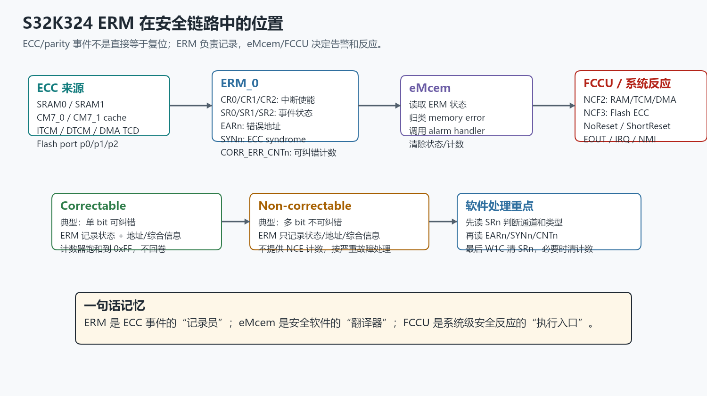

## 1. 为什么要学 ERM

S32K324 是面向功能安全场景的 MCU。很多片上存储都带 ECC 或 parity，例如 SRAM、TCM、cache、DMA TCD RAM、Flash controller 相关 RAM/port。硬件发现错误以后，如果软件没有办法定位错误来源，就只能看到“系统异常”“FCCU reset”“HardFault”或者“不可解释的复位”。ERM 的价值就是把这些 memory error 变成可诊断的信息。

常见开发场景：

1. 启动后或运行中需要判断是否发生过 RAM ECC 错误。
2. FCCU NCF2 / NCF3 触发后，需要进一步区分是 SRAM、TCM、cache、DMA TCD，还是 Flash ECC。
3. 做安全机制验证时，需要配合 `EIM` 注入 ECC 错误，然后检查 `ERM` 是否记录到正确通道。
4. 做 DEM / DTC 时，需要把不可纠错 ECC 错误转成诊断事件。
5. 做 latent fault / periodic test 时，需要读取 correctable error counter，判断是否出现异常增长。
6. 做故障定位时，需要读 `EARn` 和 `SYNn`，确认最后一次错误地址和 syndrome。

ERM、EIM、FCCU 的关系可以粗略记成：

| 模块 | 角色 | 用途 |
| --- | --- | --- |
| `EIM` | Error Injection Module | 主动注入 ECC/parity 错误，用于验证安全机制 |
| `ERM` | Error Reporting Module | 记录 ECC/parity 错误事件和诊断信息 |
| `FCCU` | Fault Collection and Control Unit | 收集安全故障并执行反应，例如 IRQ、NMI、EOUT、reset |
| `eMcem` | Safety software wrapper | 用软件 API 管理 FCCU、ERM、EIM、DCM、XBIC 等安全机制 |

## 2. 手册定位

ERM 在 RM Chapter 51。S32K324 相关内容主要集中在章首的 chip-specific 信息、ERM_0 register descriptions，以及 memory configuration 章节对 ECC 报告来源的描述。

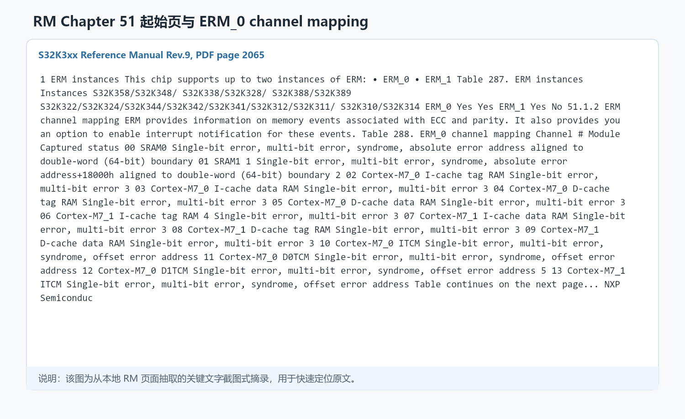

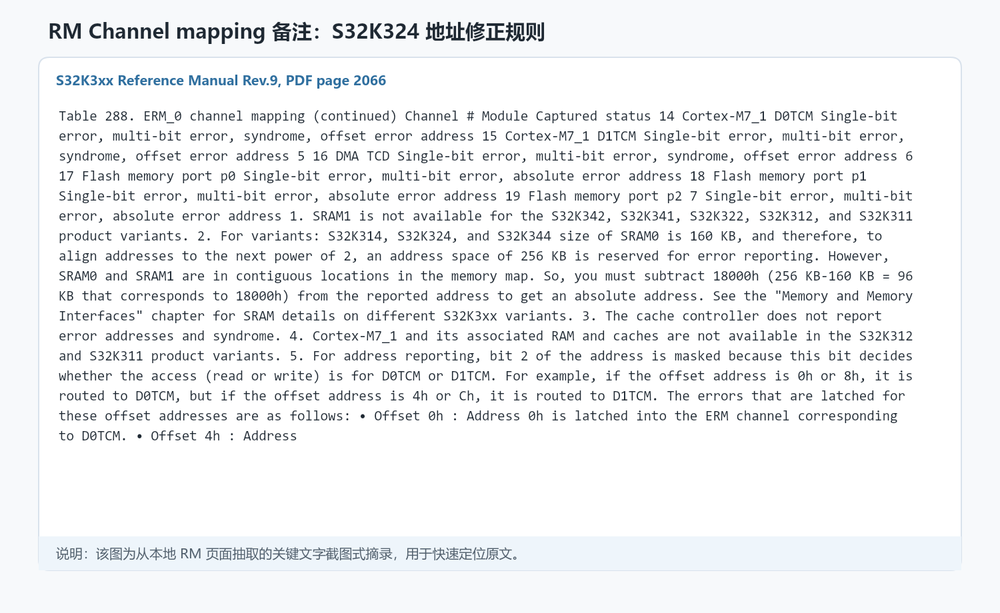

手册还提醒一个很关键的访问要求：ERM programming model 只能 supervisor mode、32-bit word access。如果用 user mode 或非 32-bit 访问，可能产生 transfer error。

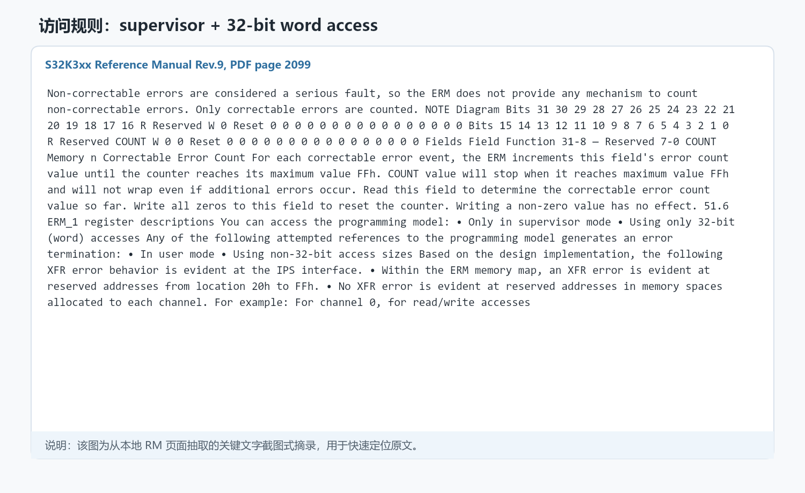

## 3. ERM 在系统里的位置

ERM 接收来自不同 memory client / controller 的错误事件。它本身只记录事件，不直接决定系统是否 reset。系统级反应通常通过 `eMcem`、`FCCU`、`DCM_GPR`、`MC_RGM` 等模块串起来。

典型路径：

```text
Memory / cache / TCM / Flash / DMA TCD
        |
        | ECC/parity event
        v
ERM_0 记录 SRn / EARn / SYNn / CORR_ERR_CNTn
        |
        | eMcem 读取与归类
        v
FCCU NCF2 / NCF3 触发安全反应
        |
        v
IRQ / NMI / EOUT / short reset / long reset / functional reset
```

注意：ERM 记录到错误，不等于一定复位。是否复位取决于 FCCU/eMcem 配置。当前工程里 RAM_ERROR 和 FLASH_ERROR 组配置为 `ShortResetReaction`，所以这些故障的系统反应会更激烈。

## 4. S32K324 的 ERM 实例

S32K3xx 家族里有些高端型号有 `ERM_1`，例如 S32K358/S32K388/S32K389 等；但 S32K324 没有 `ERM_1`。

S32K324：

```text
ERM_INSTANCE_COUNT = 1
IP_ERM_BASE        = 0x4025C000
```

工程头文件也能看到这个定义：

```c
/* BasicSoftware/integration/mcal/src/modules/BaseNXP/header/S32K324_ERM.h */
#define ERM_INSTANCE_COUNT (1u)
#define IP_ERM_BASE        (0x4025C000u)
#define IP_ERM             ((ERM_Type *)IP_ERM_BASE)
```

`eMcem_ErmChannels_S32K3XX.c` 里对 S32K324 路径也给出同样结论：

```c
const uint8 au8ChannelsPerInstance[EMCEM_ERM_INSTANCE_COUNT] = { 20U };
const uint32 au32InstanceBaseAddr[EMCEM_ERM_INSTANCE_COUNT] = {
    0x4025C000UL
};
```

## 5. ERM_0 channel mapping

S32K324 的 `ERM_0` 有 20 个通道。通道号非常重要，因为 `CRn/SRn/EARn/SYNn/CORR_ERR_CNTn` 都按通道号组织。

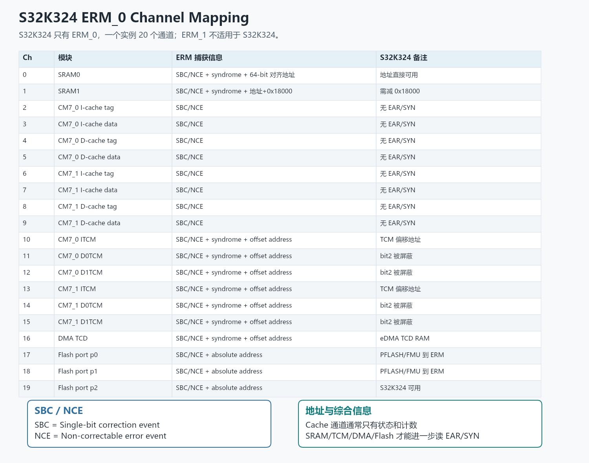

完整表如下：

| Ch | 模块 | 捕获信息 | S32K324 注意点 |
| --- | --- | --- | --- |
| 0 | `SRAM0` | SBC/NCE、syndrome、64-bit 对齐地址 | 报告绝对地址 |
| 1 | `SRAM1` | SBC/NCE、syndrome、报告地址加 `0x18000` | S32K324 需要减 `0x18000` 得到真实地址 |
| 2 | `CM7_0 I-cache tag RAM` | SBC/NCE | cache 不报告地址和 syndrome |
| 3 | `CM7_0 I-cache data RAM` | SBC/NCE | cache 不报告地址和 syndrome |
| 4 | `CM7_0 D-cache tag RAM` | SBC/NCE | cache 不报告地址和 syndrome |
| 5 | `CM7_0 D-cache data RAM` | SBC/NCE | cache 不报告地址和 syndrome |
| 6 | `CM7_1 I-cache tag RAM` | SBC/NCE | cache 不报告地址和 syndrome |
| 7 | `CM7_1 I-cache data RAM` | SBC/NCE | cache 不报告地址和 syndrome |
| 8 | `CM7_1 D-cache tag RAM` | SBC/NCE | cache 不报告地址和 syndrome |
| 9 | `CM7_1 D-cache data RAM` | SBC/NCE | cache 不报告地址和 syndrome |
| 10 | `CM7_0 ITCM` | SBC/NCE、syndrome、offset address | TCM 偏移地址 |
| 11 | `CM7_0 D0TCM` | SBC/NCE、syndrome、offset address | bit 2 被屏蔽 |
| 12 | `CM7_0 D1TCM` | SBC/NCE、syndrome、offset address | bit 2 被屏蔽 |
| 13 | `CM7_1 ITCM` | SBC/NCE、syndrome、offset address | TCM 偏移地址 |
| 14 | `CM7_1 D0TCM` | SBC/NCE、syndrome、offset address | bit 2 被屏蔽 |
| 15 | `CM7_1 D1TCM` | SBC/NCE、syndrome、offset address | bit 2 被屏蔽 |
| 16 | `DMA TCD` | SBC/NCE、syndrome、offset address | eDMA TCD RAM |
| 17 | Flash memory port `p0` | SBC/NCE、absolute address | Flash/FMU 路径 |
| 18 | Flash memory port `p1` | SBC/NCE、absolute address | Flash/FMU 路径 |
| 19 | Flash memory port `p2` | SBC/NCE、absolute address | S32K324 可用 |

### 5.1 SRAM1 地址为什么要减 0x18000

手册备注里有一个容易忽略的点：S32K314/S32K324/S32K344 的 SRAM0 size 是 160 KB。为了把错误报告地址空间对齐到 2 的幂，ERM 给 SRAM0 预留 256 KB 的错误报告地址空间。SRAM0 和 SRAM1 在 memory map 里又是连续的，所以 SRAM1 报告出来的地址会多一个空洞偏移：

```text
256 KB - 160 KB = 96 KB = 0x18000
```

因此：

```text
SRAM1 实际错误地址 = ERM 报告地址 - 0x18000
```

这个点在做故障定位时很关键。否则你会拿着 ERM 的地址去查 map，发现地址对不上。

### 5.2 Cache 通道为什么没有 EAR/SYN

通道 2..9 是 Cortex-M7 cache tag/data RAM。手册明确说明 cache controller 不报告 error address 和 syndrome。也就是说这些通道的主要诊断信息是：

```text
哪个 cache 通道发生了 SBC/NCE
correctable counter 增长到多少
```

如果需要更进一步定位 cache 相关问题，通常要结合：

- 哪个 core 在运行；
- cache 是否开启；
- 是否发生过 lockstep/split mode 切换；
- 是否与自测、EIM 注入、初始化顺序有关；
- 是否伴随 bus fault、HardFault 或 FCCU fault。

## 6. Memory configuration 与 ERM 的关系

RM 的 Memory and Memory Interfaces 章节会列出哪些 memory 的 ECC/parity diagnostic information 由 ERM 报告。对于 S32K324，典型对象包括 SRAM、CM7 cache、CM7 TCM、DMA TCD 等。

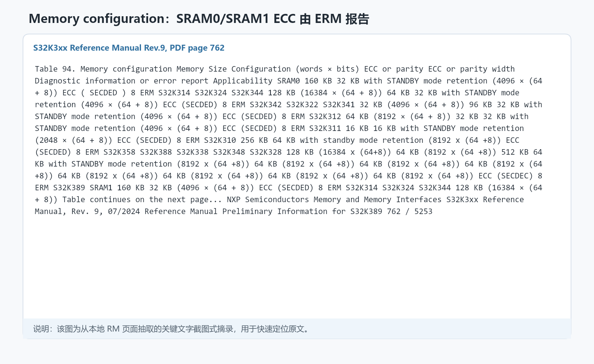

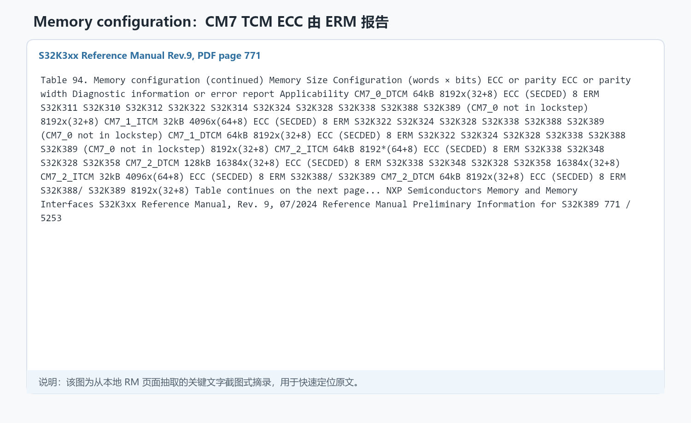

这个关系很实用：你排查某个 ECC fault 时，不要只看 Chapter 51。Chapter 20 的 memory configuration 能告诉你这个 memory 的 ECC 报告入口到底是 ERM、FlexCAN 自己、GMAC 自己，还是 not applicable。

## 7. ERM clocking 和外设时钟

ERM 的寄存器接口需要 AIPS 平台时钟，通道相关逻辑还与 memory channel clock 有关。RM 时钟章节给出 ERM clocking 关系：

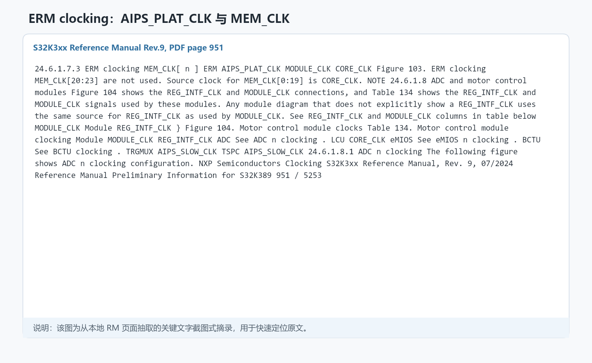

手册还特别提醒：

> To access the channel registers, corresponding memory channel clock must be enabled.

工程里 `Mcu.xdm` 已经打开了 `EIM_0` 和 `ERM_0`：

```xml
<d:var name="McuPeripheralName" value="EIM_0"/>
<d:var name="McuModeEntrySlot" value="PRTN1_COFB0_REQ22"/>
<d:var name="McuPeripheralClockEnable" value="true"/>

<d:var name="McuPeripheralName" value="ERM_0"/>
<d:var name="McuModeEntrySlot" value="PRTN1_COFB0_REQ23"/>
<d:var name="McuPeripheralClockEnable" value="true"/>
```

这说明当前工程已经把 ERM/EIM 作为安全相关外设启用。若后续调试发现 ERM 寄存器读写异常，第一步就应该回到 `Mcu.xdm` 检查对应 mode entry slot 是否开启。

## 8. Register map

ERM_0 的寄存器结构很规律。前面是三组配置寄存器和三组状态寄存器，后面每个通道占 `0x10` 字节空间。

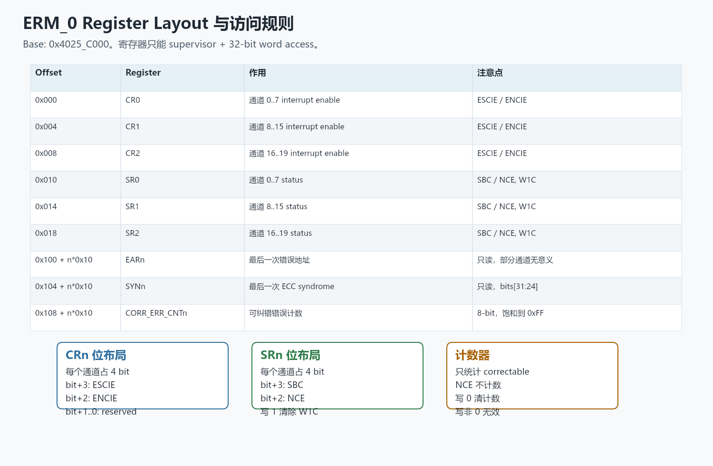

RM 对 ERM_0 memory map 的摘录如下：

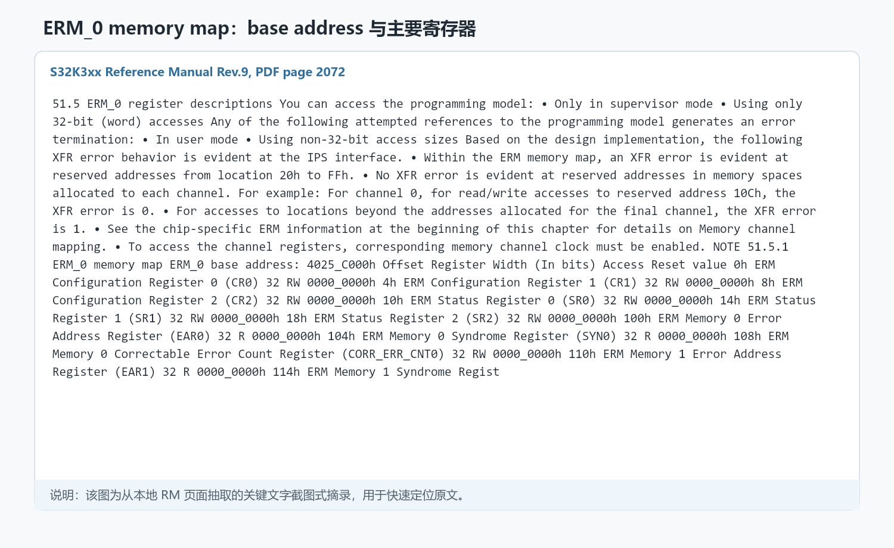

主要寄存器：

| Offset | Register | 说明 |
| --- | --- | --- |
| `0x000` | `CR0` | Channel 0..7 interrupt notification enable |
| `0x004` | `CR1` | Channel 8..15 interrupt notification enable |
| `0x008` | `CR2` | Channel 16..19 interrupt notification enable |
| `0x010` | `SR0` | Channel 0..7 event status |
| `0x014` | `SR1` | Channel 8..15 event status |
| `0x018` | `SR2` | Channel 16..19 event status |
| `0x100 + n*0x10` | `EARn` | Memory n Error Address |
| `0x104 + n*0x10` | `SYNn` | Memory n Syndrome |
| `0x108 + n*0x10` | `CORR_ERR_CNTn` | Memory n Correctable Error Count |

工程 `S32K324_ERM.h` 里对 `ERM_Type` 的定义也和这个一致，例如：

```c
typedef struct {
  __IO uint32_t CR0;
  __IO uint32_t CR1;
  __IO uint32_t CR2;
  uint8_t RESERVED_0[4];
  __IO uint32_t SR0;
  __IO uint32_t SR1;
  __IO uint32_t SR2;
  ...
  __I  uint32_t EAR0;
  __I  uint32_t SYN0;
  __IO uint32_t CORR_ERR_CNT0;
  ...
  __IO uint32_t CORR_ERR_CNT19;
} ERM_Type;
```

## 9. CR0 / CR1 / CR2：中断通知使能

`CRn` 用于配置每个 channel 是否产生 interrupt notification。每个通道占 4 bit，其中两个有效位：

```text
bit + 3: ESCIE = Enable Single Correction Interrupt Notification
bit + 2: ENCIE = Enable Non-Correctable Interrupt Notification
bit + 1..0: reserved
```

例如 channel 0 在 `CR0[31:30]`：

```text
CR0[31] = ESCIE0
CR0[30] = ENCIE0
```

channel 7 在 `CR0[3:2]`：

```text
CR0[3] = ESCIE7
CR0[2] = ENCIE7
```

RM 的 CR0 摘录如下：

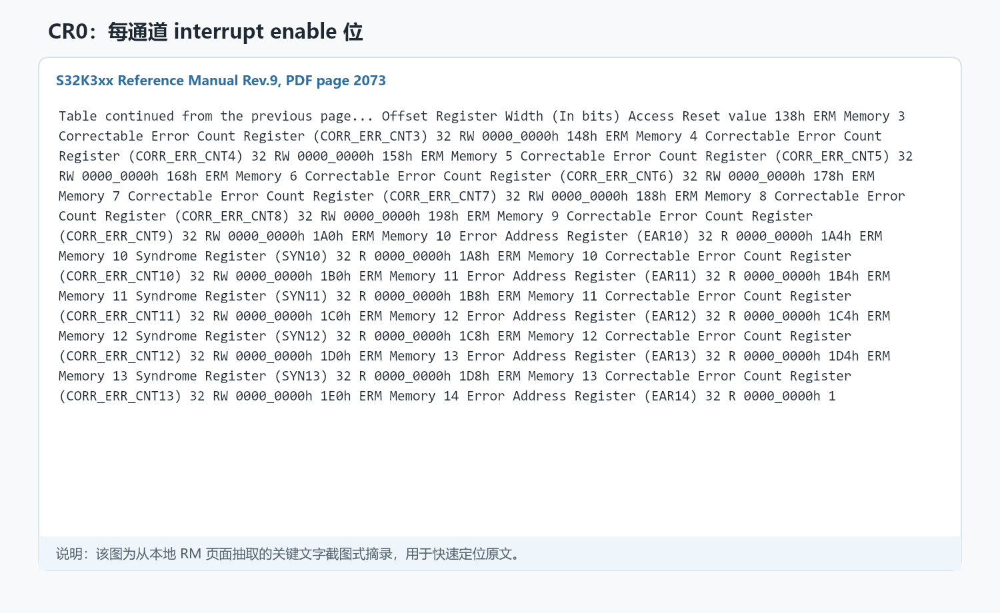

工程头文件中也能看到同样的位定义：

```c
#define ERM_CR0_ENCIE0_MASK  (0x40000000U)
#define ERM_CR0_ESCIE0_MASK  (0x80000000U)
#define ERM_CR0_ENCIE7_MASK  (0x4U)
#define ERM_CR0_ESCIE7_MASK  (0x8U)
```

注意：ERM 的 interrupt notification 只是 ERM 层面的通知使能。实际系统是否走 FCCU、是否产生 reset、是否输出 EOUT，要继续看 eMcem/FCCU 配置。

## 10. SR0 / SR1 / SR2：事件状态寄存器

`SRn` 用于记录每个通道是否发生过错误事件。每个通道同样占 4 bit，其中两个有效位：

```text
bit + 3: SBC = Single-Bit Correction Event
bit + 2: NCE = Non-Correctable Error Event
bit + 1..0: reserved
```

状态位是 W1C，也就是 write 1 to clear。读取后如果要清除，必须对对应位写 1。不要写 0 期待清除。

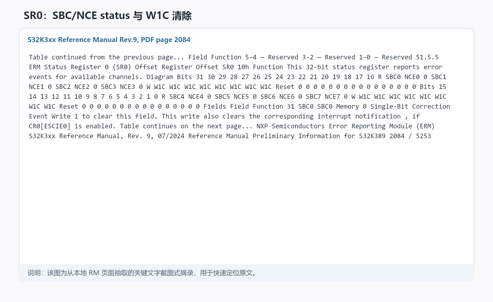

工程 eMcem 里清状态使用的是：

```c
#define ERM_SR_CLEAR_VAL_U32 ((uint32)0xCCCCCCCCUL)
```

`0xCCCCCCCC` 的二进制形态是每 4 bit 一个 `1100`，刚好对应每个 channel 的 `SBC/NCE` 两个 W1C 位。初始化时 `eMcem_Erm_Init()` 会遍历 ERM instance 的状态寄存器并写这个值清状态。

## 11. EARn：错误地址寄存器

`EARn` 是 Memory n Error Address Register。它记录最后一次 ECC event 的错误地址。

```text
EARn offset = 0x100 + n * 0x10
width       = 32 bit
access      = read only
```

注意不同 channel 的地址含义不同：

| Channel 类型 | EARn 含义 |
| --- | --- |
| SRAM0 | 绝对地址，64-bit 对齐 |
| SRAM1 | 报告地址需要减 `0x18000` |
| TCM | offset address |
| DMA TCD | offset address |
| Flash port | absolute address |
| Cache | 不提供 address |

eMcem 封装读取函数：

```c
void eMcem_Erm_GetErrAddr(uint32 instanceId,
                          uint32 instanceChannelId,
                          eMcem_MemErrInfoType *pInfo)
{
    addr = ERM_EAR_ADDR32(au32InstanceBaseAddr[instanceId],
                          instanceChannelId);
    pInfo->Err_AddrRaw = SAFETYBASE_REG_READ32(addr);
}
```

## 12. SYNn：ECC syndrome 寄存器

`SYNn` 是 Memory n Syndrome Register。它记录最后一次 ECC event 对应的 syndrome。

```text
SYNn offset = 0x104 + n * 0x10
bits[31:24] = SYNDROME
bits[23:0]  = reserved
```

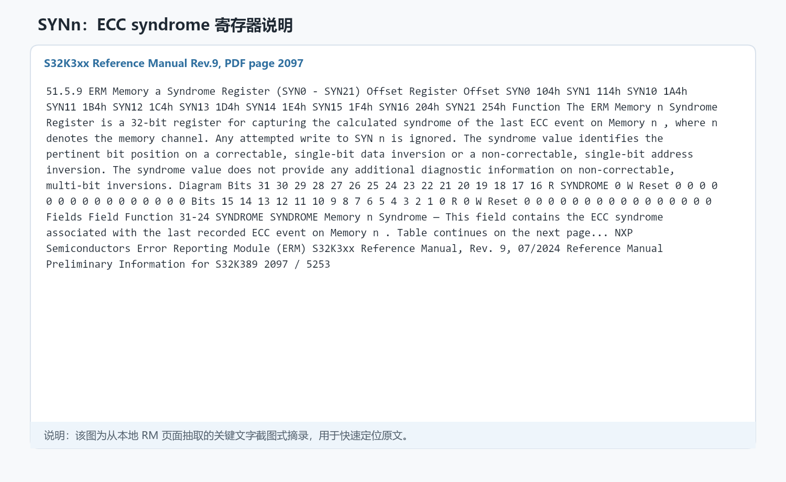

手册说明 syndrome 的含义：

- 对 correctable single-bit data inversion，syndrome 可用于识别相关 bit position。
- 对 non-correctable single-bit address inversion，也可能提供定位意义。
- 对 non-correctable multi-bit inversion，syndrome 不提供额外诊断信息。

eMcem 读取 syndrome 时取的是高 8 bit：

```c
pInfo->Err_Syndrome = (uint8)(SAFETYBASE_REG_READ32(addr) >> 24UL);
```

## 13. CORR_ERR_CNTn：correctable error 计数

`CORR_ERR_CNTn` 只统计 correctable ECC event，也就是通常说的 single-bit correction event。它不统计 non-correctable error。

```text
CORR_ERR_CNTn offset = 0x108 + n * 0x10
COUNT bits           = [7:0]
最大值               = 0xFF
是否回卷             = 不回卷，饱和停止
清除方式             = 写 0
写非 0               = 无效
```

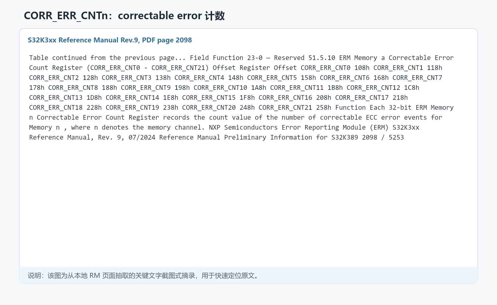

手册特别强调：non-correctable errors are considered a serious fault，所以 ERM 不提供 NCE 计数机制。

工程 eMcem 提供两个 API：

```c
uint8 eMcem_Erm_GetCorrErrCnt(eMcem_ChannelType nChannelId);
void  eMcem_Erm_ClrCorrErrCnt(eMcem_ChannelType nChannelId);
```

如果做周期诊断，可以考虑定期读取关键通道的 correctable counter。若某个通道的 SBC 计数持续增长，说明该存储区域可能存在硬件退化、供电/时钟干扰、温度相关异常，或者 EIM 测试未正确清理。

## 14. Correctable 与 Non-correctable 的处理差异

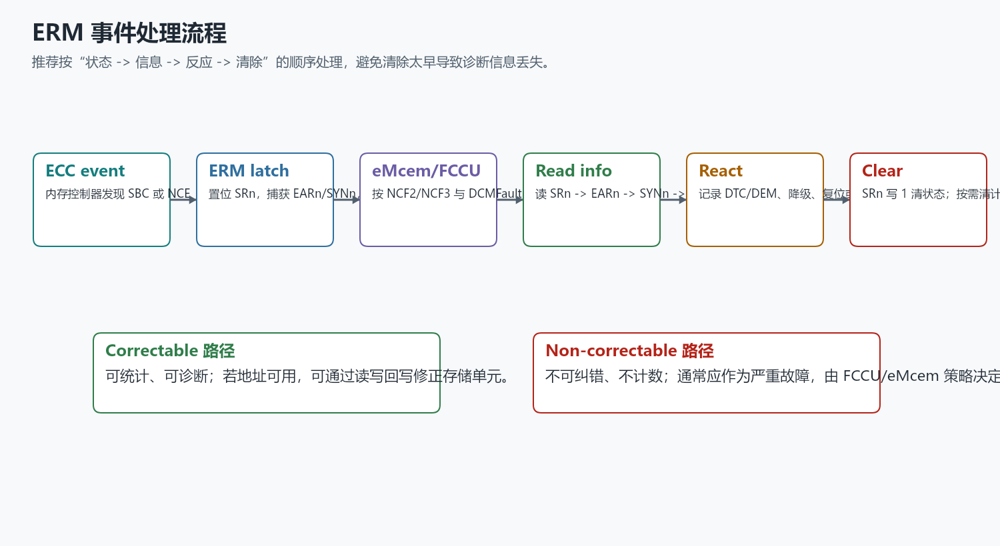

### 14.1 Correctable error

Correctable error 一般对应单 bit ECC 错误。硬件可以在读取时纠正数据，但这并不代表可以完全忽略。

建议处理：

1. 读取 `SRn` 判断哪个 channel 出现 `SBC`。
2. 若该通道提供地址，读取 `EARn`。
3. 若该通道提供 syndrome，读取 `SYNn`。
4. 读取 `CORR_ERR_CNTn`，判断是否只是偶发还是持续增长。
5. 记录诊断信息。
6. 必要时对错误地址做 read-back/write-back，让存储单元写回修正后的数据。
7. W1C 清 `SRn` 对应 `SBC` 位。

工程 eMcem 里也有 `eMcem_Erm_CorrectCorrErr()`：

```c
void eMcem_Erm_CorrectCorrErr(uint32 u32Addr)
{
    uint32 u32Value;
    u32Value = SAFETYBASE_REG_READ32((sBase_PointerSizeType)u32Addr);
    SAFETYBASE_REG_WRITE32((sBase_PointerSizeType)u32Addr, u32Value);
}
```

这就是典型的 read-modify/write-back 思路，用一次读把 ECC 更正后的数据拿出来，再写回去刷新存储单元中的 ECC 编码。

### 14.2 Non-correctable error

Non-correctable error 一般对应多 bit 错误或无法被 ECC 修正的错误。它通常是严重故障，不应靠普通软件逻辑“修一修继续跑”。

建议处理：

1. 读取 `SRn` 判断 `NCE` 通道。
2. 读取可用的 `EARn/SYNn`。
3. 记录故障来源。
4. 交给 eMcem/FCCU 安全反应。
5. 根据项目 safety concept，触发 reset、安全输出、降级或禁止执行危险动作。

当前工程里 RAM/Flash 相关故障组大多配置为 `ShortResetReaction`，所以 NCE 触发后不要期待普通任务还能稳定继续执行。

## 15. EB tresos / eMcem 配置说明

当前工程不是通过一个单独的 `ERM.xdm` 来配置 ERM，而是通过 `SafetyBase`、`eMcem`、`Mcu`、`FCCU/DCM fault group` 来使用 ERM。

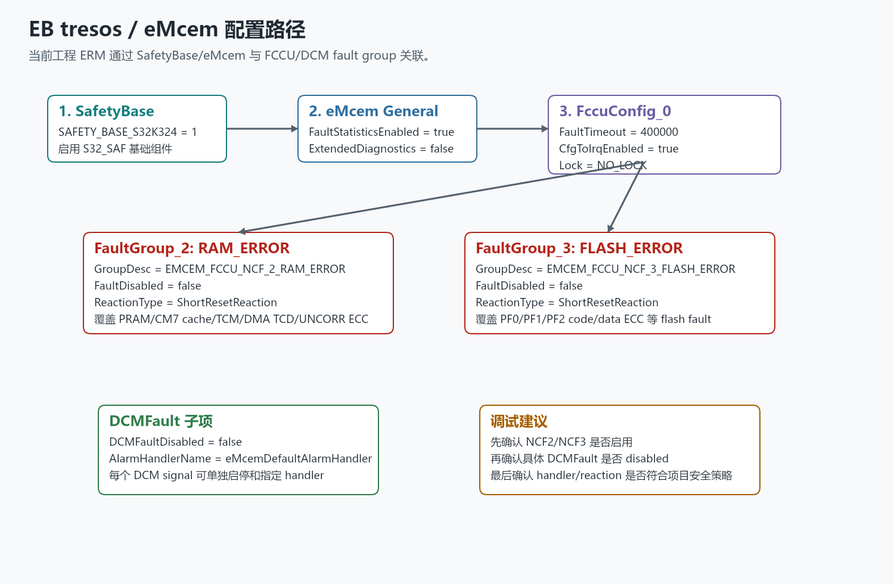

### 15.1 SafetyBase 芯片选择

工程配置：

```c
/* BasicSoftware/integration/mcal/src/gen/include/SafetyBase_Cfg.h */
#define SAFETY_BASE_S32K324 1
#define SAFETY_BASE_S32K3XX SAFETY_BASE_S32K324
```

这会影响 eMcem 的 channel 条件编译。例如 `eMcem_ErmChannels_S32K3XX.h` 中：

```c
#define EMCEM_ERM_SRAM0 0U
#if ((SAFETY_BASE_S32K314 == 1) || (SAFETY_BASE_S32K324 == 1) || ...)
#define EMCEM_ERM_SRAM1 1U
#endif
...
#define EMCEM_ERM_CHANNEL_COUNT 20U
#define EMCEM_ERM_INSTANCE_COUNT 1U
```

所以当前工程下 eMcem 对 ERM 的理解就是 S32K324：20 通道、1 实例。

### 15.2 Mcu 外设时钟配置

在 EB tresos 的 Mcu 配置里，要确认 `EIM_0` 和 `ERM_0` clock enable。

当前工程 `Mcu.xdm`：

| Peripheral | Slot | Enable |
| --- | --- | --- |
| `EIM_0` | `PRTN1_COFB0_REQ22` | `true` |
| `ERM_0` | `PRTN1_COFB0_REQ23` | `true` |

这一步非常重要。没有打开 ERM clock，后续 eMcem 读取 ERM 寄存器或者访问 channel register 都可能失败。

### 15.3 eMcem General

当前工程 `eMcem.xdm` 的 General 摘录：

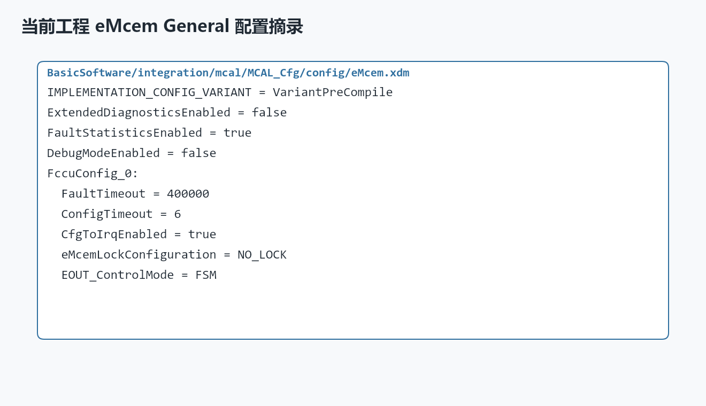

关键项：

| 配置项 | 当前值 | 含义 |
| --- | --- | --- |
| `IMPLEMENTATION_CONFIG_VARIANT` | `VariantPreCompile` | 预编译配置 |
| `ExtendedDiagnosticsEnabled` | `false` | 未打开扩展诊断记录 |
| `FaultStatisticsEnabled` | `true` | 打开 fault statistics |
| `DebugModeEnabled` | `false` | 未打开 debug mode |
| `FaultTimeout` | `400000` | FCCU fault reaction timeout |
| `ConfigTimeout` | `6` | FCCU config timeout |
| `CfgToIrqEnabled` | `true` | FCCU 配置超时可转 IRQ |
| `eMcemLockConfiguration` | `NO_LOCK` | 当前未锁配置 |
| `EOUT_ControlMode` | `FSM` | EOUT 由 FCCU 状态机控制 |

### 15.4 FaultGroup_2：RAM_ERROR

当前工程 `FaultGroup_2` 是 RAM/TCM/cache/DMA TCD 相关故障组：

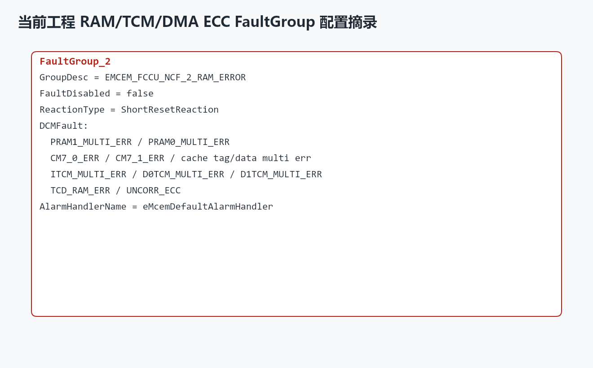

关键配置：

```text
GroupDesc      = EMCEM_FCCU_NCF_2_RAM_ERROR
FaultDisabled  = false
ReactionType   = ShortResetReaction
```

该组下的 `DCMFault` 子项包括：

- `EMCEM_DCM_NCF_2_PRAM1_MULTI_ERR`
- `EMCEM_DCM_NCF_2_PRAM0_MULTI_ERR`
- `EMCEM_DCM_NCF_2_CM7_0_ERR`
- `EMCEM_DCM_NCF_2_CM7_1_ERR`
- `EMCEM_DCM_NCF_2_CM7_0_TAG_ERR`
- `EMCEM_DCM_NCF_2_CM7_1_TAG_ERR`
- `EMCEM_DCM_NCF_2_CM7_0_IC_MULTI_ERR`
- `EMCEM_DCM_NCF_2_CM7_1_IC_MULTI_ERR`
- `EMCEM_DCM_NCF_2_CM7_0_TAG_MULTI_ERR`
- `EMCEM_DCM_NCF_2_CM7_1_TAG_MULTI_ERR`
- `EMCEM_DCM_NCF_2_ITCM_MULTI_ERR`
- `EMCEM_DCM_NCF_2_D0TCM_MULTI_ERR`
- `EMCEM_DCM_NCF_2_D1TCM_MULTI_ERR`
- `EMCEM_DCM_NCF_2_ITCM_MULTI_ERR_CM7_1`
- `EMCEM_DCM_NCF_2_D0TCM_MULTI_ERR_CM7_1`
- `EMCEM_DCM_NCF_2_D1TCM_MULTI_ERR_CM7_1`
- `EMCEM_DCM_NCF_2_TCD_RAM_ERR`
- `EMCEM_DCM_NCF_2_PRAM0_AHB_ALARM`
- `EMCEM_DCM_NCF_2_PRAM1_AHB_ALARM`
- `EMCEM_DCM_NCF_2_UNCORR_ECC`

多数子项配置：

```text
DCMFaultDisabled = false
AlarmHandlerName = eMcemDefaultAlarmHandler
```

这说明当前工程不是只在硬件里开着 ERM，而是已经把 RAM/TCM/DMA 相关 fault 接到了 eMcem/FCCU 安全路径。

### 15.5 FaultGroup_3：FLASH_ERROR

当前工程 `FaultGroup_3` 是 Flash ECC / Flash fault 相关故障组：

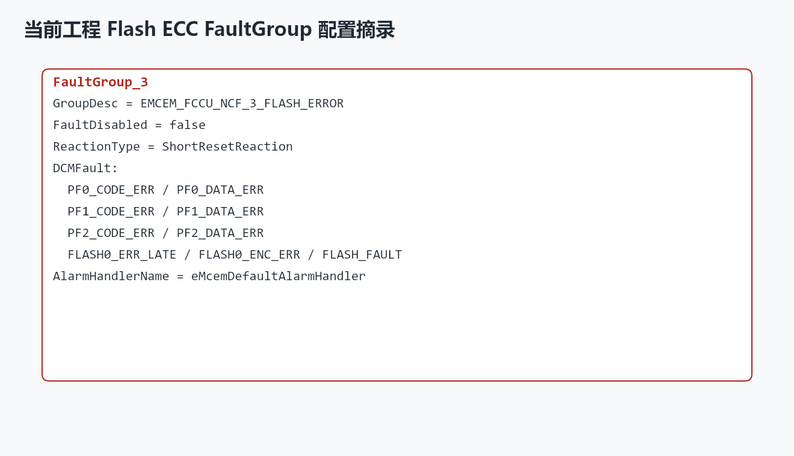

关键配置：

```text
GroupDesc      = EMCEM_FCCU_NCF_3_FLASH_ERROR
FaultDisabled  = false
ReactionType   = ShortResetReaction
```

该组下典型 `DCMFault` 子项：

- `EMCEM_DCM_NCF_3_PFO_CODE_ERR`
- `EMCEM_DCM_NCF_3_PFO_DATA_ERR`
- `EMCEM_DCM_NCF_3_PF1_CODE_ERR`
- `EMCEM_DCM_NCF_3_PF1_DATA_ERR`
- `EMCEM_DCM_NCF_3_PF2_CODE_ERR`
- `EMCEM_DCM_NCF_3_PF2_DATA_ERR`
- `EMCEM_DCM_NCF_3_FLASH0_ERR_LATE`
- `EMCEM_DCM_NCF_3_FLASH0_ENC_ERR`
- `EMCEM_DCM_NCF_3_FLASH0_CURR_ERR`
- `EMCEM_DCM_NCF_3_FLASH0_RST_ERR`
- `EMCEM_DCM_NCF_3_FLASH_FAULT`
- `EMCEM_DCM_NCF_3_EDC_FCCU_ALARM`

这和 ERM channel 17/18/19 的 Flash port `p0/p1/p2` 是同一条安全诊断主线。

## 16. eMcem API 与 ERM 的关系

工程里的 eMcem 对 ERM 做了比较完整的封装。常用函数：

| 函数 | 用途 |
| --- | --- |
| `eMcem_Erm_Init()` | 初始化 ERM，清状态寄存器 |
| `eMcem_Erm_GetInstanceAndChannel()` | 全局 channel ID 转 instance + local channel |
| `eMcem_Erm_GetErrType()` | 读取 `SRn`，判断 SBC/NCE |
| `eMcem_Erm_ClrErrType()` | W1C 清除 `SRn` 状态 |
| `eMcem_Erm_GetErrAddr()` | 读取 `EARn` |
| `eMcem_Erm_GetErrSyndrome()` | 读取 `SYNn` |
| `eMcem_Erm_GetCorrErrCnt()` | 读取 correctable error counter |
| `eMcem_Erm_ClrCorrErrCnt()` | 清 correctable error counter |
| `eMcem_Erm_CorrectCorrErr()` | 对可纠错地址做读写回写修正 |

### 16.1 eMcem 怎么判断通道是否提供地址/syndrome

`eMcem_ErmChannels_S32K3XX.c` 中定义了 mask：

```c
const uint32 au32AddrProvidedMask[EMCEM_ERM_MASK_SIZE] = {
    0x000FFC03UL
};

const uint32 au32SynProvidedMask[EMCEM_ERM_MASK_SIZE] = {
    0x0001FC03UL
};
```

对 S32K324：

- `0x000FFC03` 表示 channel 0、1、10..19 提供 address。
- `0x0001FC03` 表示 channel 0、1、10..16 提供 syndrome。

也就是说：

- cache channel 2..9 不提供 address/syndrome；
- Flash channel 17..19 提供 address，但不提供 syndrome；
- SRAM/TCM/DMA TCD 通道提供 syndrome。

### 16.2 eMcem 怎么从 SRn 中取出通道状态

`eMcem_Erm_GetErrType()` 的关键逻辑：

```c
addr = ERM_SR_ADDR32(baseAddr, (u32InstanceChannelId >> 3UL));
u32Status = SAFETYBASE_REG_READ32(addr);
u32Shift = ((7UL - (u32InstanceChannelId & 7UL)) << 2UL) + 2UL;
u32Status = (u32Status >> u32Shift) & u32StatusMask;
```

这个公式体现了 ERM 状态寄存器的排列方式：

```text
每个 SR 寄存器管理 8 个 channel
channel 在寄存器里从高位往低位排
每个 channel 占 4 bit，其中 bit+3=SBC，bit+2=NCE
```

所以 channel 0 在 `SR0[31:30]`，channel 7 在 `SR0[3:2]`。

## 17. 和 FCCU / DCM_GPR 的关系

ERM 记录事件，FCCU 做系统级 fault collection。DCM_GPR 中的一些 `DCMROD` 字段可用于进一步定位 FCCU NCF 的内部来源。

例如 RM 中提到：

- Flash ECC errors are reported from FMU and connected to FCCU NCFs and to ERM。
- PF2 code/data ECC error 对 S32K324 可用。
- PRAM0/PRAM1、CM7 cache/TCM、DMA TCD 等多 bit error 通常进入 RAM_ERROR 类故障。

工程里的 `eMcem.xdm` 把 NCF2 和 NCF3 拆成多个 `DCMFault` 子项，就是为了把 FCCU group fault 进一步细分。

实战排查时可以按这个顺序：

1. 先看 reset reason，确认是否 FCCU 触发 reset。
2. 再看 FCCU NCF 状态，确认是 NCF2 还是 NCF3。
3. 读 DCM_GPR/ROD 信息，确认具体 DCM fault signal。
4. 读 ERM `SRn/EARn/SYNn/CNTn`，定位具体 memory channel。
5. 最后结合 eMcem fault container、DEM/DTC、日志和 map 文件定点分析。

## 18. 和 EIM 的关系

`EIM` 是 Error Injection Module，用于向支持 ECC/parity 的 memory 注入错误。ERM 则用来观察注入结果。

测试链路一般是：

```text
配置 EIM 注入 channel / bit mask
        |
访问目标 memory 触发 ECC 检测
        |
ERM 记录 SBC 或 NCE
        |
eMcem/FCCU 产生安全反应
        |
读取 ERM / FCCU / DCM / eMcem 状态验证
```

当前工程 `Mcu.xdm` 里 `EIM_0` 和 `ERM_0` 都打开，这说明做 ECC 注入测试时有基础条件。

注意事项：

- EIM 注入后要清理注入配置，避免影响后续正常运行。
- 注入 NCE 可能触发 FCCU short reset，测试前要明确反应策略。
- 做 SBC 测试时，要区分“读取后硬件纠错”和“存储单元是否已写回修正”。
- 如果测试 cache 通道，地址/syndrome 可能无法从 ERM 获得。

## 19. 推荐调试流程

### 19.1 运行中怀疑 ECC 错误

1. 确认 `ERM_0` clock 已开启。
2. 读取 `SR0/SR1/SR2`。
3. 根据置位的 `SBC/NCE` 推导 channel。
4. 查 channel mapping，确认模块。
5. 如果通道提供地址，读取 `EARn`。
6. 如果通道提供 syndrome，读取 `SYNn`。
7. 如果是 SBC，读取 `CORR_ERR_CNTn`。
8. 根据 eMcem/FCCU 配置判断是否需要记录 DTC、触发降级或复位。
9. 保存信息后清状态。

### 19.2 FCCU NCF2 触发

NCF2 在当前工程中对应 `EMCEM_FCCU_NCF_2_RAM_ERROR`，通常和 RAM/TCM/cache/DMA TCD 相关。

建议：

- 查 `eMcem.xdm` 中 FaultGroup_2 是否启用。
- 读 ERM channel 0..16。
- 若 channel 0/1，重点查 SRAM。
- 若 channel 2..9，重点查 cache。
- 若 channel 10..15，重点查 CM7 TCM。
- 若 channel 16，重点查 DMA TCD。
- 结合 `DCMFault` 子项进一步定位 PRAM、CM7、TCD 或 UNCORR ECC。

### 19.3 FCCU NCF3 触发

NCF3 在当前工程中对应 `EMCEM_FCCU_NCF_3_FLASH_ERROR`，通常和 Flash ECC / Flash controller fault 相关。

建议：

- 查 `eMcem.xdm` 中 FaultGroup_3 是否启用。
- 读 ERM channel 17/18/19。
- 结合 `DCMFault` 子项区分 PF0/PF1/PF2 code/data ECC。
- 注意 Flash ECC 可能也会反映在 DCM_GPR 的 ROD 字段中。
- 由于当前配置是 `ShortResetReaction`，调试时要准备好复位后读取保留日志或 reset reason。

## 20. 常见坑

### 20.1 把 ERM 当成 FCCU

ERM 只是记录模块，不是系统级反应模块。真正控制反应的是 FCCU/eMcem 配置。看到 ERM 状态位不一定马上 reset；看到 reset 也不一定只有 ERM 一条来源。

### 20.2 清状态太早

`SRn` 是 W1C。清掉以后，如果没有先读 `EARn/SYNn/CNTn`，诊断信息就可能丢失。处理顺序应该是：

```text
读状态 -> 读地址/syndrome/计数 -> 记录日志 -> 清状态
```

### 20.3 忽略 SRAM1 的 0x18000 偏移

S32K324 的 SRAM1 报告地址需要减 `0x18000`。这是 ERM 地址对齐规则导致的，不是 map 文件错误。

### 20.4 对 cache 通道强行读地址

Cache 通道 2..9 不提供 address/syndrome。即使寄存器空间存在，也不能把读出来的值当成有效定位信息。

### 20.5 不开 ERM_0 clock

ERM channel register 访问要求对应 memory channel clock 可用。当前工程已开启 `ERM_0`，但如果移植到新工程，要检查 Mcu/MC_ME peripheral clock 配置。

### 20.6 忽略 access size

ERM programming model 要求 32-bit word access。不要用 8-bit/16-bit 方式访问寄存器。

### 20.7 忽略 NCE 没有计数器

NCE 是严重故障，ERM 不统计 NCE 次数。不要试图通过 `CORR_ERR_CNTn` 推断 NCE 发生次数。

## 21. 代码/寄存器速查

### 21.1 Base address

```c
#define IP_ERM_BASE 0x4025C000u
#define IP_ERM      ((ERM_Type *)IP_ERM_BASE)
```

### 21.2 计算寄存器地址

```c
#define ERM_SR0_ADDR32(instance)               ((uint32)((instance) + 0x0010UL))
#define ERM_SR_ADDR32(instance, add)           (ERM_SR0_ADDR32(instance) + ((add) << 2U))

#define ERM_EAR0_ADDR32(instance)              ((uint32)((instance) + 0x0100UL))
#define ERM_EAR_ADDR32(instance, add)          (ERM_EAR0_ADDR32(instance) + ((add) << 4U))

#define ERM_SYN0_ADDR32(instance)              ((uint32)((instance) + 0x0104UL))
#define ERM_SYN_ADDR32(instance, add)          (ERM_SYN0_ADDR32(instance) + ((add) << 4U))

#define ERM_CORR_ERR_CNT0_ADDR32(instance)     ((uint32)((instance) + 0x0108UL))
#define ERM_CORR_ERR_CNT_ADDR32(instance, add) (ERM_CORR_ERR_CNT0_ADDR32(instance) + ((add) << 4U))
```

### 21.3 Channel 到 SR bit 的关系

```text
sr_index = channel / 8
slot     = channel % 8
shift    = ((7 - slot) * 4) + 2

NCE bit  = shift
SBC bit  = shift + 1
```

例如：

| Channel | Register | SBC bit | NCE bit |
| --- | --- | --- | --- |
| 0 | `SR0` | 31 | 30 |
| 1 | `SR0` | 27 | 26 |
| 7 | `SR0` | 3 | 2 |
| 8 | `SR1` | 31 | 30 |
| 15 | `SR1` | 3 | 2 |
| 16 | `SR2` | 31 | 30 |
| 19 | `SR2` | 19 | 18 |

### 21.4 清除状态

清单个通道：

```c
ERM->SR0 = (status_bits << shift); /* W1C */
```

清所有状态寄存器的 SBC/NCE 位：

```c
#define ERM_SR_CLEAR_VAL_U32 0xCCCCCCCCUL
ERM->SR0 = ERM_SR_CLEAR_VAL_U32;
ERM->SR1 = ERM_SR_CLEAR_VAL_U32;
ERM->SR2 = ERM_SR_CLEAR_VAL_U32;
```

## 22. 学习 ERM 时的思维模型

可以把 ERM 分成三层来记：

1. **物理来源层**：SRAM、TCM、cache、DMA TCD、Flash 发生 ECC/parity event。
2. **ERM 记录层**：channel 状态、地址、syndrome、correctable counter。
3. **安全反应层**：eMcem/FCCU/DCM_GPR 把记录转成 fault、handler、reset、EOUT、诊断事件。

不要只背寄存器。真正调试时，最重要的是建立这条链：

```text
哪个 memory 发生错误
-> 映射到 ERM 哪个 channel
-> SRn 哪个位会置位
-> 是否能读 EAR/SYN
-> 是否影响 FCCU NCF2/NCF3
-> 当前 EB 配置会做什么反应
```

## 23. 当前工程检查清单

| 检查项 | 当前工程状态 |
| --- | --- |
| `SAFETY_BASE_S32K324` | `1` |
| `ERM_0` clock | `Mcu.xdm` 中 `PRTN1_COFB0_REQ23 = true` |
| `EIM_0` clock | `Mcu.xdm` 中 `PRTN1_COFB0_REQ22 = true` |
| ERM instance count | `1` |
| ERM channel count | `20` |
| `FaultStatisticsEnabled` | `true` |
| `FaultGroup_2 RAM_ERROR` | enabled |
| `FaultGroup_2 ReactionType` | `ShortResetReaction` |
| `FaultGroup_3 FLASH_ERROR` | enabled |
| `FaultGroup_3 ReactionType` | `ShortResetReaction` |
| DCMFault handler | 多数为 `eMcemDefaultAlarmHandler` |

## 24. 最后再压缩成一页

如果只想快速记住 ERM：

- `ERM_0 = 0x4025_C000`。
- S32K324 只有一个 ERM 实例，20 个 channel。
- `CR0/1/2` 开 interrupt notification。
- `SR0/1/2` 看 `SBC/NCE`，W1C 清除。
- `EARn` 看最后错误地址，`SYNn` 看 syndrome。
- `CORR_ERR_CNTn` 只统计 correctable error，最大 `0xFF` 不回卷，写 0 清。
- channel 0/1 是 SRAM，2..9 是 cache，10..15 是 CM7 TCM，16 是 DMA TCD，17..19 是 Flash ports。
- SRAM1 地址要减 `0x18000`。
- cache 通道无地址/syndrome。
- 当前工程通过 `eMcem` 把 NCF2 RAM_ERROR 和 NCF3 FLASH_ERROR 都配置为 `ShortResetReaction`。

