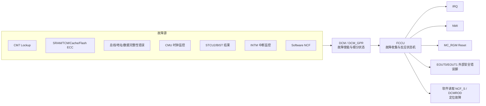
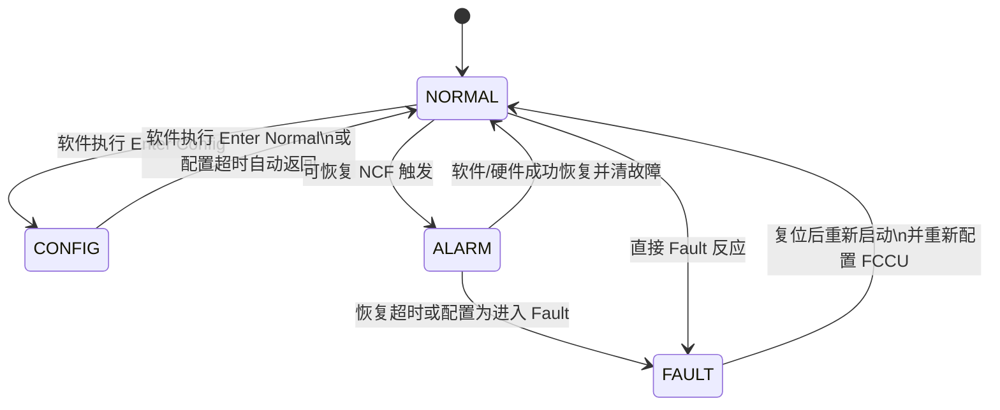
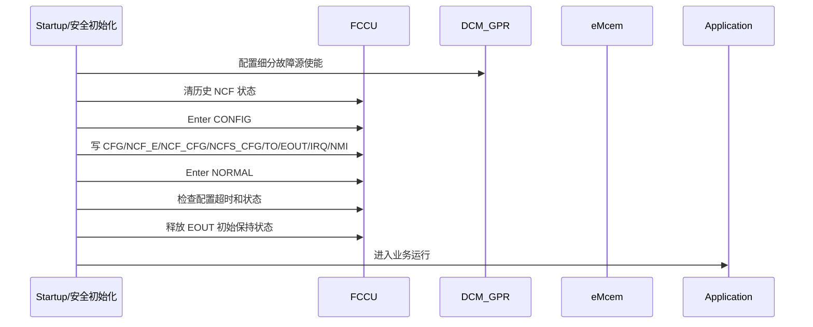
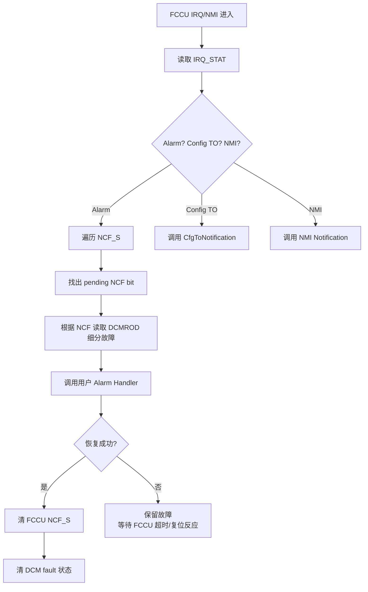
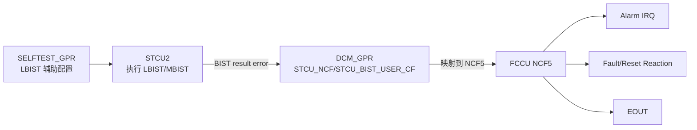

# Chapter 52 Fault Collection and Control Unit (FCCU) 学习笔记

> 适用背景：S32K324 / S32K3xx，面向开发理解、故障处理、功能安全集成和复习输出。  
> 本笔记结合：S32K3xx Reference Manual Chapter 52 FCCU、本工程 NXP MCAL/S32_SAF/eMcem 源码、S32K324 SVD/寄存器头文件、NXP 社区关于 FCCU fault map 的说明。  
> 阅读定位：FCCU 不是普通外设，它是芯片安全架构里的“故障收集、分类、反应和对外报警”中心。

---

## 1. 先用一句话抓住 FCCU

FCCU，全称 **Fault Collection and Control Unit**，可以理解成芯片内部的“安全故障调度中心”。

它不负责产生所有故障，也不负责修复所有故障。它真正负责的是：

1. 接收芯片内部各模块上报的故障信号。
2. 把故障归类到不同的 fault channel。
3. 判断这个故障是可以给软件处理，还是必须直接进入安全反应。
4. 触发中断、NMI、复位或外部错误引脚 `EOUT`。
5. 保存故障状态，方便软件复位后或中断里诊断。

老师式理解：

> FCCU 像汽车 MCU 里的“故障总值班室”。各个模块发现异常后不是各自乱处理，而是把报警送到 FCCU。FCCU 根据事先配置好的规则决定：通知软件、拉错误脚、触发复位，还是进入 Fault 状态。

---

## 2. 为什么 S32K3 需要 FCCU

汽车 MCU 不只要“能跑”，还要在硬件出问题时“知道自己不可靠了”，并且快速进入可控状态。

例如：

- CPU core 进入 lockup。
- SRAM、TCM、Cache、Flash 出现不可纠正 ECC 错误。
- 总线、地址、数据完整性校验出错。
- 时钟监控出错。
- STCU2/BIST 自检失败。
- INTM 中断监控发现中断延迟异常。
- 软件主动上报某类安全故障。

如果没有统一的故障中心，每个模块都自己报错，软件会很难保证反应一致性。FCCU 的价值就是把这些安全相关异常收敛到一套硬件状态机和反应机制里。

从开发角度看，FCCU 帮我们解决三个问题：

| 问题 | 如果没有 FCCU | 有 FCCU 之后 |
| --- | --- | --- |
| 谁发现故障 | 分散在 DCM、ERM、CMU、STCU、INTM 等模块 | 各模块上报，FCCU 统一收集 |
| 谁决定反应 | 软件到处判断，容易遗漏 | FCCU 根据配置自动进入 Alarm/Fault/Reset |
| 谁通知外部 | 各模块自己没有统一安全输出 | FCCU 通过 `EOUT0/EOUT1` 对外给出安全故障信号 |

---

## 3. FCCU 在安全架构里的位置

先看整体链路：



这里要特别注意一个开发重点：

> 在 S32K324 上，FCCU 里直接可见的是 `NCF0..NCF7` 这 8 个非关键故障通道。更细的故障源，例如“Flash0 data ECC uncorrectable error”或“CM7_0 DCache data ECC”，主要在 `DCM_GPR` 的状态位和使能位中体现，再映射到某个 FCCU NCF 通道。

所以调试时不要只看 FCCU 的 `NCF_S0`。`NCF_S0` 只能告诉你哪个 NCF 组报警了，真正的细分原因还要看 DCM 的相关状态寄存器，或者通过 eMcem 的 DCM fault mapping 去解析。

---

## 4. 本工程里 FCCU 的资料位置

本工程已经包含 NXP 提供的 FCCU 头文件和 S32_SAF/eMcem 封装。重要文件如下：

| 文件 | 用途 |
| --- | --- |
| `BasicSoftware/integration/mcal/src/modules/BaseNXP/header/S32K324_FCCU.h` | FCCU 寄存器结构、地址、位宏 |
| `BasicSoftware/integration/mcal/src/modules/BaseNXP/header/S32K324_M7.svd` | SVD 形式的寄存器和字段描述 |
| `BasicSoftware/integration/mcal/src/modules/BaseNXP/header/S32K324_DCM_GPR.h` | DCM_GPR 故障状态和故障使能位 |
| `BasicSoftware/integration/mcal/src/modules/eMcem/inc/Reg_eSys_Fccu.h` | eMcem 使用的 FCCU 地址、key、状态宏 |
| `BasicSoftware/integration/mcal/src/modules/eMcem/src/eMcem_Fccu.c` | FCCU 初始化、配置、清故障、注入故障 |
| `BasicSoftware/integration/mcal/src/modules/eMcem/src/eMcem_Fccu_Irq.c` | FCCU Alarm/NMI/Timeout 中断处理 |
| `BasicSoftware/integration/mcal/src/modules/eMcem/src/eMcem_DcmNcfList_S32K3XX.c` | DCM 细分故障到 FCCU NCF 的映射 |

本工程里 S32K324 的 FCCU 基地址：

```c
#define IP_FCCU_BASE  (0x40384000u)
#define IP_FCCU       ((FCCU_Type *)IP_FCCU_BASE)
```

---

## 5. FCCU 的核心概念

### 5.1 Fault 是什么

这里的 fault 不是普通软件错误，而是安全相关的异常事件。它通常来自硬件监控逻辑，比如 ECC、lockup、时钟监控、总线完整性监控，也可以来自软件主动上报。

开发时要区分：

| 类型 | 含义 | 例子 |
| --- | --- | --- |
| 硬件故障 | 硬件监控模块自动发现 | SRAM double-bit ECC、CM7 lockup |
| 自检故障 | STCU2/BIST 测试失败 | LBIST/MBIST 结果异常 |
| 监控故障 | 安全监控逻辑发现运行异常 | INTM 中断超时、CMU 时钟异常 |
| 软件故障 | 软件主动注入或上报 | Software NCF0..3 |

### 5.2 NCF 是什么

`NCF` 是 **Non-Critical Fault**，非关键故障通道。

名字里有 “Non-Critical”，容易让人误会成“不重要”。其实它的意思更接近：

> 这个故障不一定要瞬间由硬件直接判死刑，可以先进入 FCCU 的可配置反应流程。根据配置，它可能给软件一个处理窗口，也可能最终触发复位和 EOUT。

S32K324 的 FCCU 有 8 个 NCF 通道：

```text
NCF0 ~ NCF7
```

这些通道在 FCCU 寄存器里以 bit 形式出现：

```text
NCF_S0 bit0 -> NCF0
NCF_S0 bit1 -> NCF1
...
NCF_S0 bit7 -> NCF7
```

### 5.3 细分故障源和 NCF 的关系

一个 NCF 通道后面可能对应很多细分故障源。例如 S32K324 本地 SVD/源码显示：

| FCCU NCF | 典型故障源                                                                                                             |
| -------- | ----------------------------------------------------------------------------------------------------------------- |
| `NCF0`   | CM7_0 lockup、CM7_1 lockup、HSE lockup                                                                              |
| `NCF1`   | TCM/DMA/HSE/QSPI/AIPS/EMAC 等总线 gasket alarm、地址/数据完整性错误、read data EDC 错误                                           |
| `NCF2`   | SRAM、Cache、TCM、DMA_TCD、HSE RAM 等 ECC 不可纠正错误                                                                       |
| `NCF3`   | Flash ECC、Flash address encode、Flash reference/read voltage、Flash reset、Flash scan/access 相关错误，lifecycle scanning |
| `NCF4`   | 电源 Go/Nogo 类错误，例如 VDD1P1、VDD_HV_FLA 相关监控                                                                          |
| `NCF5`   | STCU/BIST 非关键故障、意外 test activation、非法 MTR 访问、debug activation                                                     |
| `NCF6`   | INTM0..3 中断监控错误                                                                                                   |
| `NCF7`   | Software NCF0..3                                                                                                  |

这张表是理解 FCCU 的入口。你看到 `NCF_S0 = 0x04`，只能知道 `NCF2` 触发了；想知道是 SRAM0 ECC、SRAM1 ECC、DCache ECC 还是 HSE RAM ECC，还要继续看 DCM_GPR 的细分状态。

---

## 6. FCCU 状态机：Normal、Config、Alarm、Fault

FCCU 不是简单的“有故障/没故障”寄存器，它内部有状态机。



### 6.1 Normal 状态

`NORMAL` 是正常运行状态。此时 FCCU 监控已使能的故障源，系统业务正常运行。

开发重点：

- 量产运行时 FCCU 应该长期处于 Normal。
- 如果一直停在 Config，说明初始化流程有问题。
- 如果进入 Alarm/Fault，要立刻读取故障状态并处理。

### 6.2 Config 状态

`CONFIG` 是配置状态。很多 FCCU 配置寄存器只有在 Config 状态才能写，例如：

- `CFG`
- `NCF_E`
- `NCF_CFG`
- `NCFS_CFG`
- `NCF_TOE`
- `NCF_TO`
- `DELTA_T`
- `IRQ_ALARM_EN`
- `NMI_EN`
- `EOUT_SIG_EN`

进入 Config 需要通过 `CTRLK` 写 key，再写 `CTRL.OPR` 执行操作。eMcem 中对应：

```c
FCCU_OP1_KEY_U32 = 0x913756AF;  /* enter Config */
FCCU_OP2_KEY_U32 = 0x825A132B;  /* enter Normal */
```

老师式提醒：

> FCCU 配置不是随便写寄存器。你要先“申请进配置室”，配置完要“退出配置室”。一直待在配置室里，安全监控本身就不完整。

### 6.3 Alarm 状态

`ALARM` 是“故障已发生，但还有恢复机会”的状态。

典型流程：

1. 某个 NCF 触发。
2. FCCU 进入 Alarm。
3. 如果对应 Alarm interrupt 使能，触发 IRQ。
4. 软件在中断或安全任务里读取故障。
5. 软件执行降级、关断输出、记录诊断、清故障等处理。
6. 如果在 `NCF_TO` 时间内恢复成功，可以回 Normal。
7. 如果超时未恢复，根据配置进入 Fault 或复位。

Alarm 是 FCCU 最适合软件参与的阶段。

### 6.4 Fault 状态

`FAULT` 是 FCCU 判定系统已经处于故障条件的状态。

进入 Fault 后可能发生：

- `EOUT` 指示 fault。
- 触发 functional reset。
- MC_RGM 记录 FCCU reset reason。
- 软件复位后再读取复位原因和 FCCU/DCM 状态。

在本工程的 MC_RGM 头文件里可以看到 FCCU 相关复位标志：

```c
MC_RGM_DES_FCCU_FTR_MASK  /* FCCU failure to react */
MC_RGM_FES_FCCU_RST_MASK  /* FCCU Reset Reaction */
```

含义：

- `FCCU_RST`：FCCU 按配置触发了复位反应。
- `FCCU_FTR`：FCCU failure to react，表示 FCCU 没有按预期完成反应，这是更严重的问题。

---

## 7. 开发必须掌握的寄存器

### 7.1 CTRL 和 CTRLK：执行 FCCU 操作

`CTRL` 是控制寄存器，`CTRLK` 是控制 key 寄存器。

| 字段 | 含义 |
| --- | --- |
| `CTRL.OPR[4:0]` | 要执行的操作 |
| `CTRL.OPS[7:6]` | 操作状态：Idle、In progress、Aborted、Successful |
| `CTRL.DEBUG` | FCCU debug mode enable |
| `CTRLK` | 某些受保护操作前必须写 key |

eMcem 中定义的常用操作：

| 操作 | 编码 | 含义 |
| --- | ---: | --- |
| `FCCU_ENTER_CONFIG_STATE` | `1` | 进入 Config 状态 |
| `FCCU_ENTER_NORMAL_STATE` | `2` | 进入 Normal 状态 |
| `FCCU_CLEAR_FREEZE_STATUS_REGS` | `13` | 清冻结状态寄存器 |
| `FCCU_CLEAR_OPERATION_STATUS` | `15` | 清操作状态 |

执行逻辑可以理解为：

```text
检查 CTRL.OPS 不在 in progress
  -> 如果要进 Config，先写 CTRLK = 0x913756AF
  -> 写 CTRL.OPR = 目标操作
  -> 轮询 CTRL.OPS
  -> OPS == Successful 才算成功
```

易错点：

> 写了 OPR 不等于操作完成。一定要看 `OPS`。如果没有等操作完成就继续写配置，后续行为可能不稳定。

### 7.2 STAT：当前 FCCU 状态

`STAT` 是状态寄存器。

| 字段 | 含义 |
| --- | --- |
| `STATUS[2:0]` | FCCU 状态 |
| `ESTAT` | 是否处于 faulty condition |
| `PhysicErrorPin[1:0]` | 当前 EOUT1/EOUT0 物理状态 |

`STATUS` 常用值：

| 值 | 状态 | 含义 |
| ---: | --- | --- |
| `0` | `NORMAL` | 正常监控 |
| `1` | `CONFIG` | 配置状态 |
| `2` | `ALARM` | 报警状态 |
| `3` | `FAULT` | 故障状态 |

调试时最先看：

```text
FCCU.STAT.STATUS
FCCU.STAT.ESTAT
FCCU.NCF_S0
```

### 7.3 NCF_E：使能哪些 NCF

`NCF_E0` 是 Non-critical Fault Enable。

| bit | 含义 |
| --- | --- |
| bit0 | 使能 NCF0 |
| bit1 | 使能 NCF1 |
| ... | ... |
| bit7 | 使能 NCF7 |

复位值为 `0`，表示默认不使能这些 NCF 通道。项目初始化时必须明确配置。

开发理解：

> DCM_GPR 里细分故障使能了，不代表 FCCU 一定会响应；FCCU 的对应 NCF 通道也要使能。反过来，FCCU NCF 使能了，也不代表每个细分源都使能；细分源还要看 DCM_GPR 里的 enable 位。

### 7.4 NCF_CFG：硬件恢复还是软件恢复

`NCF_CFG0` 决定每个 NCF 是硬件可恢复还是软件可恢复。

| 值 | 名称 | 含义 |
| ---: | --- | --- |
| `0` | Hardware-recoverable | 硬件恢复型 |
| `1` | Software-recoverable | 软件恢复型 |

这里的“恢复”不是指故障真的自动修好了，而是指 FCCU 对该类故障清除和恢复流程的控制方式。

在 eMcem 的 `eMcem_Fccu_ClearFault()` 中可以看到：

- 如果配置为 HW recoverable，软件清 FCCU fault 时直接返回 `E_OK`。
- 如果配置为 SW recoverable，软件需要写 `NCFK` 解锁，再写 `NCF_S` 对应 bit 清除。

易错点：

> 只有配置成 software-recoverable 的 NCF，软件清 FCCU `NCF_S` 才有意义。硬件恢复型不能按同样方式硬清。

### 7.5 NCFS_CFG：Fault-State 反应配置

`NCFS_CFG0` 决定每个 NCF 是否能触发 fault-state reset reaction。

S32K324 SVD 中显示每个 NCF 对应 2 bit：

| 编码 | 含义 |
| --- | --- |
| `00` | Disabled |
| `01` | Enabled，触发 `rst_sfunc_b` short reset reaction |
| `11` | Disabled |

也就是说，如果某个 NCF 最终要让 FCCU 触发功能复位，必须正确配置 `NCFS_CFG`。

开发上常见设计：

- 轻微或可降级故障：只开 Alarm IRQ，不立刻 reset。
- 严重且不可继续运行故障：配置 Fault-State reset reaction。
- 需要对外部安全监控器报警的故障：配置 EOUT signaling。

### 7.6 NCF_S 和 NCFK：故障状态与清除

`NCF_S0` 是故障状态寄存器。

| bit | 含义 |
| --- | --- |
| bit0 | NCF0 pending |
| bit1 | NCF1 pending |
| ... | ... |
| bit7 | NCF7 pending |

清软件可恢复 NCF 的流程：

```text
写 NCFK = 0xAB3498FE
写 NCF_S0 = 对应 bit mask
等待 CTRL.OPS successful
重新读 NCF_S0 确认 bit 清掉
清 DCM_GPR 中对应细分故障状态
```

为什么还要清 DCM？

因为 FCCU 只保存 NCF 通道状态，DCM 还保存“到底哪个细分源触发了这个 NCF”。如果只清 FCCU，不清 DCM，下一次诊断可能还会看到旧故障，甚至再次触发。

### 7.7 NCF_TOE 和 NCF_TO：Alarm 恢复超时

`NCF_TOE0` 决定每个 NCF 是否启用 Alarm-state timeout。

`NCF_TO` 是 Alarm-state timeout interval。

含义：

- 当 NCF 进入 Alarm 后，如果该通道启用了 timeout，FCCU 开始计时。
- 如果软件没有在规定时间内恢复/清除故障，FCCU 会按配置进入 Fault 或触发复位反应。

开发思考：

| 配置 | 适用场景 |
| --- | --- |
| 开启 timeout | 安全相关故障必须在有限时间内处理 |
| 关闭 timeout | 某些故障只做记录或由上层周期性处理 |

易错点：

> timeout 太短会导致软件还没来得及进入 handler 就被复位；timeout 太长会让系统在异常状态下停留太久。它是安全时间预算的一部分，不是随便填的延时。

### 7.8 IRQ_ALARM_EN、NMI_EN、IRQ_STAT、IRQ_EN

FCCU 支持几类通知：

| 寄存器 | 用途 |
| --- | --- |
| `IRQ_ALARM_EN0` | 每个 NCF 的 Alarm IRQ 使能 |
| `NMI_EN0` | 每个 NCF 的 Fault-state NMI 使能 |
| `IRQ_EN` | 配置超时 IRQ 使能 |
| `IRQ_STAT` | 配置超时、Alarm、NMI 状态 |

典型软件策略：

- 可恢复故障：打开 Alarm IRQ，在 IRQ handler 中调用故障处理函数。
- 极严重故障：打开 NMI 或直接 reset reaction。
- 配置阶段：打开配置超时 IRQ，防止卡在 Config。

### 7.9 EOUT_SIG_EN、CFG、EINOUT、DELTA_T：外部错误脚

FCCU 可以通过 `EOUT0/EOUT1` 对外输出故障状态，供外部 watchdog、fail-safe ASIC、电源管理芯片或系统安全电路使用。

相关寄存器：

| 寄存器 | 用途 |
| --- | --- |
| `CFG.FOM` | EOUT 输出模式 |
| `CFG.PS` | EOUT 极性 |
| `CFG.CM` | 配置指示模式 |
| `CFG.FCCU_SET_CLEAR` | EOUT 控制方式 |
| `CFG.FCCU_SET_AFTER_RESET` | reset 后 EOUT 是否 active |
| `EINOUT` | Test mode 下控制/读取 EOUT/EIN |
| `EOUT_SIG_EN0` | 每个 NCF 是否触发 EOUT signaling |
| `DELTA_T` | EOUT 最小信号持续时间 |

eMcem 里定义了更多输出模式：

| 模式 | 含义 |
| --- | --- |
| Dual-rail | 双线互补协议 |
| Time-switching | 时间切换协议 |
| Bi-stable | 双稳态 |
| Fault-toggle | 故障翻转 |
| Test0/1/2 | EOUT 测试模式 |

S32K324 头文件/SVD 中明确列出的 `FOM` 值包括：

| 值 | 模式 |
| ---: | --- |
| `2` | Bi-Stable |
| `5` | Test0 |
| `6` | Test1 |
| `7` | Test2 |

本工程 Port 配置中也能看到 FCCU 错误脚复用：

```text
SIUL2_0_PORT2   -> FCCU_ERR0_OUT
SIUL2_0_PORT3   -> FCCU_ERR1_OUT
SIUL2_0_PORT143 -> FCCU_ERR0_OUT
SIUL2_0_PORT144 -> FCCU_ERR1_OUT
```

工程 DIO 里还有：

```text
DioConf_DioChannel_PTE16_O_S_FCCU1
```

这说明项目层面很可能把 FCCU 错误输出接到了外部安全链路中。

开发易错点：

> 配了 FCCU 的 EOUT，不代表板子上 EOUT 一定会动。还要检查 SIUL2/Port 复用、引脚方向、电气连接、外部上拉下拉、外部安全芯片逻辑和 EOUT 极性。

### 7.10 NCFF：伪造故障，用于测试

`NCFF` 是 Non-critical Fault Fake 寄存器，用来注入假 NCF。

eMcem 中：

```c
void eMcem_Fccu_InjectFault(eMcem_FaultType nFaultId)
{
    SAFETYBASE_REG_WRITE32(FCCU_NCFF_ADDR32, nFaultId);
}
```

用途：

- 验证 FCCU 中断是否配置正确。
- 验证 Alarm handler 是否能被调用。
- 验证 EOUT 是否输出。
- 验证复位反应和复位原因记录。

注意：

> 故障注入是开发和安全验证手段，不要在量产正常业务路径中随意调用。测试完要确认清故障、清 DCM 状态、复位原因和外部安全芯片状态。

### 7.11 TRANS_LOCK 和 PERMNT_LOCK：配置锁

FCCU 支持配置锁：

| 寄存器 | 含义 |
| --- | --- |
| `TRANS_LOCK` | 临时锁，后续可以用 key 解锁 |
| `PERMNT_LOCK` | 永久锁，一旦锁定通常只能复位后恢复 |

eMcem 中 key：

```c
FCCU_TRANS_LOCK_KEY_U32   = 0xFFFFFF43
FCCU_TRANS_UNLOCK_KEY_U32 = 0x000000BC
FCCU_PERM_LOCK_KEY_U32    = 0x000000FF
```

开发建议：

- 初始化完成后可以 transient lock，防止误写。
- 量产安全项目可以考虑 permanent lock，但必须非常谨慎。
- 调试阶段不建议过早 permanent lock，否则排查会很痛苦。

---

## 8. DCM_GPR 和 FCCU 的配合

### 8.1 为什么要看 DCM_GPR

FCCU 只告诉你“哪个 NCF 组出问题”。DCM_GPR 能告诉你“哪个细分监控源出问题”。

例如：

```text
FCCU.NCF_S0 bit2 = 1
```

表示 `NCF2` 触发。`NCF2` 后面可能是：

- SRAM0 multi-bit ECC。
- SRAM1 multi-bit ECC。
- CM7_0 DCache data ECC。
- CM7_1 DCache tag ECC。
- ITCM/DTCM uncorrectable ECC。
- DMA_TCD RAM ECC。
- HSE RAM ECC。

要定位具体原因，需要看 DCM_GPR 的 `DCMROD3/DCMROD4/DCMROD5...` 状态。

### 8.2 DCMROD 和 DCMRWD

本工程 `S32K324_DCM_GPR.h` 中可以看到两类重要寄存器：

| 类型 | 例子 | 含义 |
| --- | --- | --- |
| `DCMROD*` | `DCMROD3/4/5` | Read Only GPR On Destructive Reset，保存状态 |
| `DCMRWD*` | `DCMRWD3/4/5` | Read Write GPR On Destructive Reset，用于使能相关故障监控 |

举例：

```c
DCM_GPR_DCMRWD4_PF0_CODE_ECC_ERR_EN_MASK
DCM_GPR_DCMROD4_PF0_CODE_ECC_ERR_MASK
```

前者是使能位，后者是状态位。

### 8.3 DCM 到 NCF 的映射

本工程 eMcem 文件 `eMcem_DcmNcfList_S32K3XX.c` 给了 S32K324 的映射 mask：

```c
#elif SAFETY_BASE_S32K324
const uint32 au32NCFDCMMask[FCCU_NCF_COUNT * DCM_FAULT_REGISTER_COUNT] = {
    0x00000007UL, 0x00000000UL, 0x00000000UL, 0x00000000UL, 0x00000000UL, 0x00000000UL, /* NCF 0 */
    0x000FFBE0UL, 0x00000000UL, 0x007EC000UL, 0x00000000UL, 0x0000001BUL, 0x00000000UL, /* NCF 1 */
    0xFF000000UL, 0x00000FFFUL, 0x00000000UL, 0x00000000UL, 0x00000000UL, 0x00000000UL, /* NCF 2 */
    ...
};
```

这段的意思是：

- 每个 NCF 对应 6 个 DCMROD 寄存器的 mask。
- handler 读 DCMROD 状态后，用 mask 筛出属于当前 NCF 的细分故障。
- 然后再调用对应 alarm handler 或清除对应 DCM fault。

这就是为什么 NXP 社区里会提醒：S32K3 的 FCCU fault mapping 要看参考手册附带的 `S32K3xx_fault_map` 或安全库提供的映射文件。

---

## 9. FCCU 初始化流程

裸写寄存器可以理解原理，但真实项目更建议使用 eMcem/S32_SAF 封装。下面先讲通用流程。



### 9.1 eMcem 的初始化做了什么

本工程 `eMcem_Fccu_Init()` 的核心动作：

1. 清 `IRQ_STAT` 中的配置超时标志，避免误报。
2. 可选打开 FCCU debug mode。
3. 读取 `NCF_S0`，如果有历史 pending fault，逐个清掉。
4. 对每个 pending NCF，同时清 DCM 中对应细分状态。
5. 进入 Config 状态。
6. 写 FCCU 配置：
   - `CFG`
   - `NCF_TO`
   - `IRQ_EN`
   - `DELTA_T`
   - `NCF_E`
   - `NCF_CFG`
   - `NCF_TOE`
   - `IRQ_ALARM_EN`
   - `NMI_EN`
   - `EOUT_SIG_EN`
   - `NCFS_CFG`
7. 进入 Normal 状态。
8. 检查配置超时。
9. 释放 EOUT pins：

```c
DCM_GPR.DCMRWD2.B.EOUT_STAT_DUR_STEST = 0U;
```

这里最后一步很关键，意思是解除自检期间 EOUT 可能保持在 fault 状态的控制。

### 9.2 初始化顺序要点

推荐顺序：

```text
基础时钟/模式初始化
  -> DCM_GPR/安全监控源配置
  -> FCCU/eMcem 初始化
  -> 清历史 fault
  -> FCCU 进入 Normal
  -> 外部安全输出释放
  -> OS/业务启动
```

易错点：

| 易错点 | 后果 |
| --- | --- |
| 未使能 FCCU 时钟或访问权限 | 读写无效或异常 |
| 不进入 Config 就写配置寄存器 | 配置不生效 |
| 进入 Config 后不返回 Normal | FCCU 监控不处于正常运行状态 |
| 只清 FCCU，不清 DCM | 故障状态残留 |
| 初始化阶段 EOUT 极性没确认 | 外部安全芯片误判故障 |

---

## 10. FCCU 中断处理流程

FCCU 常见中断有：

- Configuration timeout interrupt。
- Alarm interrupt。
- NMI notification。

本工程 `eMcem_Fccu_Irq.c` 的处理思路非常典型。



### 10.1 Alarm handler 应该做什么

Alarm handler 不是普通日志函数，它处在安全故障处理路径上。

建议动作：

1. 立即记录故障 ID 和上下文。
2. 判断是否能恢复。
3. 对安全相关输出执行降级或关断。
4. 必要时通知 Dem/DTC。
5. 如果能恢复，返回 recovered，让 eMcem 清 FCCU 和 DCM 状态。
6. 如果不能恢复，不要假装清除，让 FCCU 进入后续 timeout/Fault/reset 反应。

伪代码：

```c
eMcem_ErrRecoveryType My_FccuAlarmHandler(eMcem_FaultType fault)
{
    SaveSafetyFault(fault);

    if (fault == FCCU_NCF2_ECC_GROUP)
    {
        DisableSafetyCriticalOutput();
        return EMCEM_ERR_NOT_RECOVERED;
    }

    if (TryRecoverFault(fault) == true)
    {
        return EMCEM_ERR_RECOVERED;
    }

    return EMCEM_ERR_NOT_RECOVERED;
}
```

重点：

> 不能恢复的故障不要强行清。强行清掉只会让系统带病运行，功能安全上比直接复位更危险。

---

## 11. EOUT 外部错误输出

### 11.1 EOUT 的作用

`EOUT0/EOUT1` 是 FCCU 对外表达安全状态的引脚。

外部可能连接：

- 外部 watchdog。
- SBC / PMIC。
- Fail-safe ASIC。
- 板级安全关断电路。
- 其他 MCU 或系统监控器。

当 FCCU 进入 fault condition 或指定 NCF 触发时，EOUT 可以改变状态，让外部系统知道 MCU 不可信。

### 11.2 EOUT 模式怎么理解

`EOUT` 有多种协议，核心差别是“用什么电平/时序表示正常和故障”。

| 模式 | 通俗理解 |
| --- | --- |
| Dual-rail | 两根线组合表示状态，通常期望互补，提高诊断能力 |
| Time-switching | 通过时间切换序列表达状态，外部可检测卡死 |
| Bi-stable | 正常一种稳定电平，故障另一种稳定电平 |
| Fault-toggle | 故障时翻转 |
| Test0/1/2 | 测试 EOUT 引脚方向和电平 |

如果只是学习，可以先抓住：

> EOUT 不是普通 GPIO，它是安全协议输出。配置要和外部电路、极性、监控窗口一致。

### 11.3 如何测试 EOUT

典型步骤：

1. 确认 Port mux 把引脚配成 `FCCU_ERR0_OUT/FCCU_ERR1_OUT`。
2. 配置 FCCU `CFG.FOM`、`CFG.PS`、`EOUT_SIG_EN`。
3. 使用 `NCFF` 注入假 NCF。
4. 用示波器或外部监控器看 EOUT 电平/时序。
5. 清 FCCU/ DCM fault。
6. 验证 EOUT 回到正常状态。

开发提醒：

> 不要只用软件读 `STAT.PhysicErrorPin` 证明 EOUT 正常。真实项目要看板级引脚和外部芯片实际看到的信号。

---

## 12. FCCU 和 STCU2 的关系

你前面已经整理了 Chapter 53/54，所以这里把关系接起来。



STCU2 负责自检，FCCU 负责自检失败后的故障反应。

典型例子：

- STCU2 跑 LBIST/MBIST。
- 如果 BIST result error，DCM_GPR 中 `STCU_NCF` 置位。
- 该错误映射到 FCCU `NCF5`。
- FCCU 根据 `NCF5` 配置触发 Alarm、NMI、EOUT 或 Reset。

易错点：

> STCU2 失败不等于软件只读 STCU2 状态就结束。安全链路上还要确认 FCCU 是否正确接收并反应。

---

## 13. FCCU 和 MC_RGM 的关系

FCCU 本身不是复位控制器。真正执行复位动作的是 MC_RGM。

FCCU 的作用是：

1. 判定某故障需要 reset reaction。
2. 向 MC_RGM 发出复位请求。
3. MC_RGM 执行 functional reset 或 destructive reset。
4. 复位后，软件读取 MC_RGM 复位原因。

相关复位原因：

```c
MCU_FCCU_RST_RESET  /* FCCU Reset Reaction */
MCU_FCCU_FTR_RESET  /* FCCU failure to react */
```

复位后软件建议检查：

```text
MC_RGM.FES / DES
FCCU.NCF_S0
DCM_GPR.DCMROD*
STCU2 status，如果与 BIST 相关
Dem/NvM 中保存的故障历史
```

---

## 14. 从开发角度怎么配置一类故障

假设我们要配置一个故障源，完整思路如下。

### 14.1 明确故障源

先确定故障源来自哪里：

- Core lockup？
- Flash ECC？
- SRAM ECC？
- INTM？
- STCU2？
- Software NCF？

然后查 fault map，确定映射到哪个 NCF。

例如：

```text
Flash0 data ECC uncorrectable error -> NCF3
CM7_0 lockup -> NCF0
STCU BIST result error -> NCF5
INTM0 error -> NCF6
Software NCF0 -> NCF7
```

### 14.2 使能细分源

在 DCM_GPR 里打开具体故障源使能位。例如 Flash ECC、Core lockup、INTM error 等。

这一步决定“这个细分故障是否会送到 FCCU”。

### 14.3 使能 FCCU NCF

配置：

```text
FCCU.NCF_E0.NCFEx = 1
```

这一步决定“FCCU 是否响应这个 NCF 通道”。

### 14.4 配置恢复类型

配置：

```text
FCCU.NCF_CFG0.NCFCx = 0/1
```

决定该 NCF 是硬件恢复还是软件恢复。

### 14.5 配置反应路径

根据安全需求选择：

| 反应 | 配置 |
| --- | --- |
| Alarm IRQ | `IRQ_ALARM_EN0` |
| NMI | `NMI_EN0` |
| EOUT | `EOUT_SIG_EN0` + `CFG` |
| timeout | `NCF_TOE0` + `NCF_TO` |
| reset reaction | `NCFS_CFG0` |

### 14.6 配置 handler

如果使用 eMcem，配置 `Fault_AlarmHandler[]`。

handler 中处理：

- 关断危险输出。
- 记录故障。
- 判断可恢复性。
- 返回 recovered 或 not recovered。

### 14.7 验证

使用故障注入或真实 fault test：

```text
NCFF 注入 NCF
  -> 看 IRQ/NMI 是否进入
  -> 看 handler 是否调用
  -> 看 EOUT 是否变化
  -> 看 timeout 后是否复位
  -> 看复位原因是否正确
  -> 看故障是否能清除
```

---

## 15. 常见调试场景

### 15.1 系统一启动就复位

排查顺序：

1. 读 MC_RGM 复位原因，看是否 `FCCU_RST` 或 `FCCU_FTR`。
2. 读 `FCCU.NCF_S0`，看哪个 NCF pending。
3. 读 DCMROD，定位细分故障。
4. 检查初始化是否在进入 Normal 前就触发故障。
5. 检查 EOUT 初始保持是否没有释放。
6. 检查 `NCFS_CFG` 是否把某个测试故障配置成立刻 reset。

### 15.2 FCCU 进不了 Config

可能原因：

- FCCU 操作正在进行，`CTRL.OPS == In progress`。
- key 写错。
- 时钟/访问权限问题。
- 配置被 transient/permanent lock。
- 已经处于 Fault 状态。

建议看：

```text
CTRL.OPS
STAT.STATUS
TRANS_LOCK/PERMNT_LOCK 配置
IRQ_STAT.CFG_TO_STAT
```

### 15.3 配置完 FCCU 后没有故障反应

检查：

- DCM_GPR 细分源是否使能。
- FCCU `NCF_E` 是否使能。
- `IRQ_ALARM_EN/NMI_EN/EOUT_SIG_EN` 是否使能。
- `NCFS_CFG` 是否配置 reset reaction。
- 该故障是否真的映射到你配置的 NCF。
- Port mux 是否配置到 EOUT。

### 15.4 Alarm 中断进来了但不知道具体原因

步骤：

1. 读 `NCF_S0` 找 NCF。
2. 根据 NCF 读 DCMROD 对应 mask。
3. 用 `eMcem_DcmNcfList_S32K3XX.c` 的 `au32NCFDCMMask` 定位细分 bit。
4. 把细分 bit 映射到具体 DCM fault ID。
5. 再决定安全处理策略。

### 15.5 故障清不掉

可能原因：

- 故障源仍然存在。
- NCF 配置为 HW recoverable，软件清方式不适用。
- 没有先写 `NCFK` key。
- 只清 FCCU，没有清 DCM。
- 清除后硬件马上再次置位。
- FCCU 当前操作还没完成。

排查建议：

```text
清前读 NCF_S0 和 DCMROD
写 NCFK
写 NCF_S0 对应 bit
等 CTRL.OPS successful
清 DCM 对应状态
再读 NCF_S0 和 DCMROD
```

---

## 16. 重点、难点、易错点

### 16.1 重点

1. FCCU 是安全故障收集与反应中心，不是普通 GPIO/中断控制器。
2. S32K324 FCCU 直接管理 8 个 NCF 通道。
3. 细分故障源主要通过 DCM_GPR 映射到 NCF。
4. FCCU 有状态机：Normal、Config、Alarm、Fault。
5. 多数配置寄存器只能在 Config 状态写。
6. Alarm 是软件参与恢复的窗口。
7. Fault 往往意味着 EOUT、NMI、reset 等安全反应。
8. EOUT 是板级安全输出，必须结合 Port 和外部电路验证。

### 16.2 难点

**难点 1：NCF 和具体故障源不是一对一。**  
一个 NCF 可能对应很多 DCM 细分故障。只看 `NCF_S0` 不够。

**难点 2：可恢复和不可恢复不是靠感觉判断。**  
这由 `NCF_CFG`、`NCFS_CFG`、timeout、handler 返回值、安全需求共同决定。

**难点 3：EOUT 是协议输出。**  
它不是普通“高=错，低=对”的 GPIO，模式和极性要跟外部安全电路一致。

**难点 4：清故障要清两层。**  
FCCU 层的 NCF 要清，DCM 细分状态也要清。

### 16.3 易错点

| 易错点 | 正确理解 |
| --- | --- |
| 以为 NCF 是具体故障 | NCF 是分组通道，具体原因要看 DCM |
| 以为 enable FCCU 就够了 | DCM 细分源也要使能 |
| 不进 Config 就写配置 | 多数配置不会生效 |
| 不等待 `CTRL.OPS` | 操作可能未完成 |
| Alarm handler 里强行清所有故障 | 不可恢复故障应让系统进入安全反应 |
| 只软件读 EOUT 状态 | 板级必须用实际引脚验证 |
| 忘记配置 Port mux | EOUT 不会从芯片引脚输出 |
| 调试阶段 permanent lock | 可能导致后续无法改配置 |

---

## 17. 和本工程结合的阅读建议

如果你要在这个工程里深入 FCCU，建议按这个顺序读代码：

1. `S32K324_FCCU.h`  
   先看 FCCU 寄存器布局，知道有哪些寄存器。

2. `Reg_eSys_Fccu.h`  
   看 eMcem 用到的 key、地址、操作状态宏。

3. `eMcem_Fccu_Types.h`  
   看 eMcem 把 FCCU 配置抽象成哪些字段。

4. `eMcem_Fccu.c`  
   重点看：
   - `eMcem_Fccu_Init`
   - `eMcem_Fccu_ConfigureFccu`
   - `eMcem_Fccu_ClearFault`
   - `eMcem_Fccu_InjectFault`

5. `eMcem_Fccu_Irq.c`  
   看 Alarm IRQ 如何读 DCMROD、调用 handler、清 fault。

6. `eMcem_DcmNcfList_S32K3XX.c`  
   看 S32K324 的 DCM 细分故障如何映射到 NCF0..7。

---

## 18. 最后总结

FCCU 学习时不要陷入“背寄存器”的误区。真正要抓住的是这一条链：

```text
故障源
  -> DCM_GPR 细分状态/使能
  -> FCCU NCF 分组
  -> FCCU 状态机 Normal/Alarm/Fault
  -> IRQ/NMI/EOUT/Reset
  -> 软件 handler/复位后诊断
```

开发上最重要的判断是：

1. 这个故障源映射到哪个 NCF？
2. 这个 NCF 是否使能？
3. 这个故障是否允许软件恢复？
4. 软件必须在多长时间内处理？
5. 处理失败后是报警、NMI、EOUT，还是复位？
6. 复位后如何定位真正故障源？

老师式收尾：

> FCCU 的本质不是“发现错误”，而是“把错误变成系统可控的安全反应”。你能把 NCF、DCM、Alarm、Fault、EOUT、MC_RGM 这一条链讲清楚，就真正理解了 Chapter 52。

---

## 参考资料

- NXP S32K3xx Reference Manual, Chapter 52 Fault Collection and Control Unit (FCCU)。
- 本工程 `BasicSoftware/integration/mcal/src/modules/BaseNXP/header/S32K324_FCCU.h`。
- 本工程 `BasicSoftware/integration/mcal/src/modules/BaseNXP/header/S32K324_DCM_GPR.h`。
- 本工程 `BasicSoftware/integration/mcal/src/modules/eMcem/src/eMcem_Fccu.c`。
- 本工程 `BasicSoftware/integration/mcal/src/modules/eMcem/src/eMcem_Fccu_Irq.c`。
- 本工程 `BasicSoftware/integration/mcal/src/modules/eMcem/src/eMcem_DcmNcfList_S32K3XX.c`。
- [NXP S32K3 product page](https://www.nxp.com/products/S32K3)：S32K3 系列功能安全能力、FCCU、SAF/SPD 软件生态入口。
- [NXP S32K3xx Data Sheet](https://www.nxp.com/docs/en/data-sheet/S32K3xx.pdf)：S32K3 系列数据手册，用于确认器件族、ASIL、ECC、监控等背景信息。
- [NXP Community: S32K3 FCCU configuration](https://community.nxp.com/t5/SafeAssure-Community/S32K3-FCCU-configuration/m-p/1622914)：讨论 R2/R3 反应、EOUT、Fault handler 是否能执行等开发问题。
- [NXP Community: S32K3x8 SBC FCCU monitoring](https://community.nxp.com/t5/S32K/S32k3x8-Sbc-FCCU-monitoring/td-p/1762041)：说明 FCCU EOUTx 需要 SIUL 引脚复用，故障类型与反应要参考 Reference Manual 附带的 `S32K3xx_fault_map`。
- [NXP AN14068](https://www.nxp.com/docs/en/application-note/AN14068.pdf)：S32K3 + FS23 硬件和安全应用笔记，包含 S32K3 FCCU 上报到外部安全器件的应用场景。
