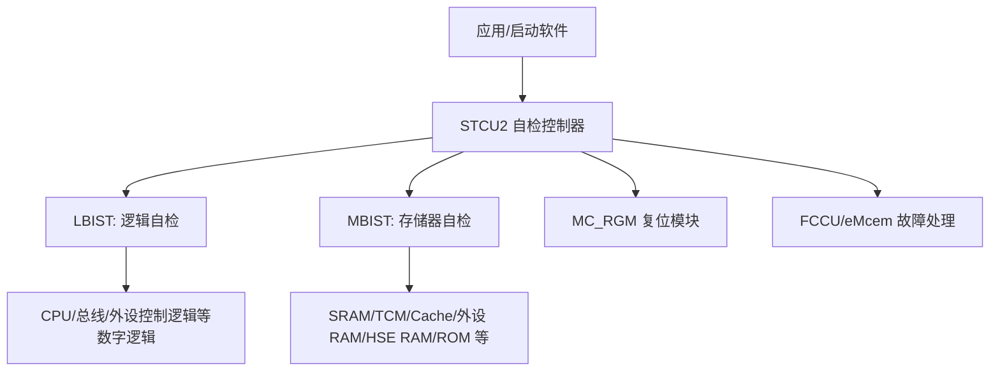
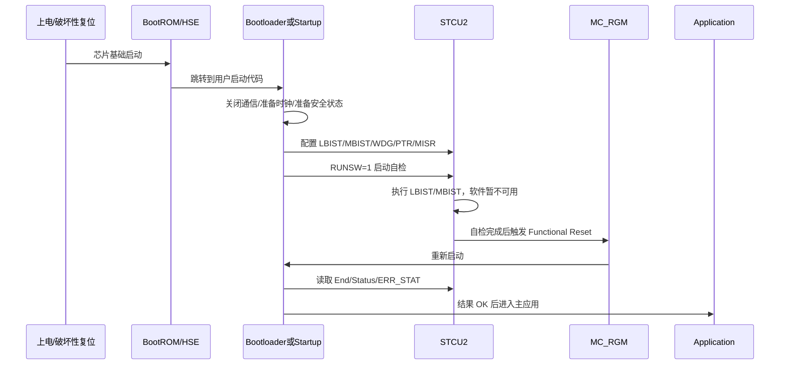

# Chapter 54 Self-Test Control Unit (STCU2) 学习笔记

> 适用背景：S32K324 / S32K3xx，面向开发理解、启动自检集成、故障排查和复习输出。  
> 参考资料：S32K3xx Reference Manual 的 STCU2 章节、NXP AN14969、NXP SAF/SPD BIST 驱动资料、本工程 S32K324 代码。

---

## 1. 先用一句话抓住 STCU2

STCU2，全称 **Self-Test Control Unit 2**，可以把它理解成芯片内部的“自检调度老师”。

它自己并不是某一个具体的测试算法，而是负责：

1. 配置要跑哪些自检。
2. 启动自检。
3. 监控自检有没有跑完。
4. 收集 LBIST/MBIST 的结果。
5. 把错误映射成可恢复故障或不可恢复故障。
6. 在自检结束后配合复位模块，让软件重新启动并读取结果。

开发时不要把 STCU2 简单理解成一个普通外设。它更像是安全架构中的一个控制器：软件把测试计划交给它，它接管一段时间，芯片在这段时间里基本不能正常跑业务代码，测试完成后再通过复位和状态寄存器把结果交还给软件。

---

## 2. 为什么汽车 MCU 需要自检

汽车电子里面最怕的不是“软件发现一个普通 bug”，而是硬件本身出现随机故障以后，系统还以为一切正常。

例如：

- 某块 SRAM 某一位永远卡在 0。
- 某个总线仲裁逻辑有固定故障。
- 某个外设内部 RAM 损坏。
- 某个 CPU 相关逻辑出现永久性缺陷。

这些问题不一定在普通功能路径中马上暴露。车可能还能跑，但在某个关键时刻会输出错误控制量，这就会变成安全风险。

功能安全里常见几个词：

| 概念 | 含义 | 对 STCU2 的意义 |
|---|---|---|
| Random hardware fault | 随机硬件故障，不是软件写错，而是硬件位翻转、老化、制造缺陷、永久失效等 | BIST 用来发现一部分永久性硬件故障 |
| Permanent fault | 永久故障，例如某个存储单元 stuck-at 0/1 | LBIST/MBIST 主要针对这类故障 |
| Latent fault | 潜伏故障，故障已经存在但还没被系统发现 | 启动/停车自检常用于提升潜伏故障诊断覆盖率 |
| Diagnostic coverage | 诊断覆盖率，能发现多少比例的目标故障 | 使用 NXP 验证过的 BIST 配置才有可追溯覆盖率 |
| LPFM | Latent Point Fault Metric，潜伏点故障度量 | 启动/关闭阶段跑 BIST 可以帮助提升 LPFM |
| Safe state | 安全状态，系统发现严重故障后进入的风险可控状态 | BIST 失败后应用要决定降级、禁止功能或复位 |

**老师式理解：**  
普通功能测试像是开车试一圈看看能不能跑；BIST 更像是体检，专门检查“身体内部是不是已经有问题”。它不是替代业务功能测试，而是补足硬件安全诊断能力。

---

## 3. STCU2、BIST、LBIST、MBIST 的关系

这几个词很容易混：



### 3.1 BIST 是什么

BIST 是 **Built-In Self-Test**，意思是“内建自测试”。

==**它不是由软件一条条读写所有寄存器来测试，而是芯片设计时已经把测试结构做进硬件内部。软件只负责配置和启动，真正的测试由硬件完成。**

这有几个好处：

- 能测试软件不容易直接触达的内部逻辑。
- 能用芯片设计阶段验证过的测试模式。
- 能把测试结果用硬件寄存器保存下来。
- 能和安全架构里的 FCCU、MC_RGM、复位原因诊断配合。

### 3.2 STCU2 是什么

STCU2 是 BIST 的控制器。

它负责调度 LBIST 和 MBIST，就像一个考试监考老师：

- 试卷是谁：由 MBIST/LBIST 分区决定。
- 谁先考谁后考：由 PTR 链表决定。
- 是否同时考：由 CSM 并行/串行模式决定。
- 考试时间上限：由 WDG 看门狗决定。
- 是否考完：由 End Flag 判断。
- 是否合格：由 Status/MISR/错误标志判断。

### 3.3 LBIST 是什么

LBIST 是 **Logic Built-In Self-Test**，逻辑自检。

它测试的是芯片内部的数字逻辑，例如 CPU 相关逻辑、总线、DMA、外设控制逻辑等。LBIST 常用 scan chain 和 MISR signature 的思想：

1. 芯片内部逻辑被设计成可扫描结构。
2. 测试时向逻辑链输入一系列测试 pattern。
3. 输出结果被压缩成 signature。
4. 实际 signature 与期望 signature 比较。
5. 不一致说明逻辑路径中可能有永久故障。

**重点：**  
LBIST 很强，但侵入性也强。跑 LBIST 时，被测逻辑不能继续承担正常业务，所以通常放在启动、关闭、制造测试、维修诊断或“车停稳、任务很少”的场景。

### 3.4 MBIST 是什么

MBIST 是 **Memory Built-In Self-Test**，存储器自检。

它测试的是芯片内部 RAM/ROM 类资源，比如：

- 系统 SRAM。
- Core local memory / cache / TCM。
- eDMA TCD RAM。
- FlexCAN RAM。
- QSPI peripheral RAM。
- EMAC RAM。
- HSE RAM/ROM。

MBIST 一般会对存储器执行固定算法，例如 March 类算法。它会写入、读回、比较特定数据模式，用来发现 stuck-at、耦合、地址译码等故障。

**重点：**  
**MBIST 对 RAM 的内容通常是破坏性的。跑完之后，RAM 内容不能假设还保留原值，所以复位后需要重新初始化 RAM、堆栈、BSS、数据区等。**

---

## 4. STCU2 在启动流程里的位置

典型流程如下：



**关键理解：**  
STCU2 自检不是“函数调用完返回”。更常见的开发模型是：

1. 第一次启动：软件配置并启动 BIST。
2. STCU2 执行测试。
3. STCU2 触发功能复位。
4. 第二次启动：软件读取 STCU2/RGM 状态，判断上一次 BIST 是否成功。

所以写代码时要有“跨复位状态机”的思维。

---

## 5. Online、Offline、Safety Boot、Diagnostic 的区别

### 5.1 Online BIST

Online BIST 指 BootROM 之后，由软件在运行期可访问 STCU2 寄存器并触发自检。

NXP AN14969 明确说明，S32K3xx 的 BIST 是在 BootROM 后、应用启动代码之后由软件配置 STCU2 执行的 online testing。S32K3xx 不支持从 DCD records 进行 offline BIST 执行。

### 5.2 Safety Boot 配置

`BIST_SAFETYBOOT_CFG` 是 NXP 验证过的一套启动自检配置。

它的典型用途：

- BootROM/HSE 之后。
- 主应用正式运行之前。
- 主要覆盖启动阶段必须确认的关键 BIST 分区。
- 执行结束后触发 functional reset。
- 第二次启动读取结果。

在本工程代码中，`Bist_Sequence()` 使用的就是：

```c
Bist_GetExecStatus(BIST_SAFETYBOOT_CFG);
Bist_Run(BIST_SAFETYBOOT_CFG);
```

### 5.3 Diagnostic 配置

`BIST_DIAGNOSTIC_CFG` 是更完整的诊断配置，包含平台上可用的每一个 BIST。

它的典型用途：

- 车辆停放、维修、生产测试、下电前诊断等。
- 系统没有强实时任务，或任务很少。
- 可以接受较长的自检时间和功能复位。
- 追求更完整的潜伏故障检测。

NXP 社区里也把这类场景称为类似 “garage use case”：车停着，非关键任务少，适合跑更完整的自检。

### 5.4 不要随意改 NXP 验证配置

NXP 的应用笔记强调，`BIST_SAFETYBOOT_CFG` 和 `BIST_DIAGNOSTIC_CFG` 是 NXP 验证过的配置集。随意修改配置会改变诊断覆盖率，原来的覆盖率结论就不能直接沿用。

**易错点：**  
开发阶段为了“快一点”删掉几个 MBIST，看似功能还能跑，但安全分析上已经不是原来的 BIST 配置了。量产安全项目里，这类修改需要重新做安全论证。

---

## 6. S32K324 支持的 BIST 分区

### 6.1 LBIST 分区

S32K324 属于 S32K314/S32K324/S32K344 这一组，支持 1 个 LBIST 分区：

| BIST ID | Instance | Safety Boot | Diagnostic |
|---:|---|---|---|
| 0 | LBIST | 支持 | 支持 |

S32K310/S32K311/S32K312 没有 LBIST，这一点不要和 S32K324 混淆。

### 6.2 S32K324 MBIST 分区

S32K324 支持 12 个 MBIST 控制分区。工程头文件中也能看到：

```c
#define STCU_MB_CTRL_COUNT 12u
```

S32K324 的 MBIST 分区可按下表理解：

| MBIST ID | Instance Name  | Safety Boot    | Diagnostic | 开发理解             |
| -------: | -------------- | -------------- | ---------- | ---------------- |
|        0 | SYS0_RAMS      | 支持             | 支持         | 系统 RAM 分区 0      |
|        1 | SYS1_RAMS      | 支持             | 支持         | 系统 RAM 分区 1      |
|        2 | DMA_TCD_RAM    | 支持             | 支持         | eDMA TCD 描述符 RAM |
|        3 | CM7_0_TOP      | 支持             | 支持         | Core0 相关存储/局部资源  |
|        4 | CM7_1_TOP      | 支持             | 支持         | Core1 相关存储/局部资源  |
|        5 | FLEX_CAN_RAMS  | 支持             | 支持         | FlexCAN 内部 RAM   |
|        6 | QSPI_PERI_RAMS | 支持             | 支持         | QSPI 外设 RAM      |
|        7 | EMAC_TSN_RAM   | 支持             | 支持         | 以太网 TSN 相关 RAM   |
|        8 | EMAC_RAMS      | 支持             | 支持         | 以太网普通 RAM        |
|        9 | b03_ETF_RAMS   | 支持             | 支持         | Trace/ETF 相关 RAM |
|       10 | HSE_RAMS       | 支持             | 支持         | HSE RAM          |
|       11 | **HSE_ROMS**       | **不在 Safety Boot** | **支持**         | **HSE ROM，自诊断配置中覆盖** |

**重点：**  
**HSE_ROMS 只在 Diagnostic 配置里跑，不在 Safety Boot 配置里跑。这个正好能在本工程的 `Bist_SpecificCfg_S32K3XX.c` 里看到：S32K324 的 `BistConfig` 到 `MBIST_10` 结束，而 `BistDiagConfig` 包含 `MBIST_11`。**

---

## 7. STCU2 的寄存器从开发角度怎么看

S32K324 的 STCU2 基地址：

```c
#define IP_STCU_BASE (0x403A0000u)
#define IP_STCU      ((STCU_Type *)IP_STCU_BASE)
```

本工程对应文件：

- `BasicSoftware/integration/mcal/src/modules/BaseNXP/header/S32K324_STCU.h`
- `BasicSoftware/integration/mcal/src/modules/Bist/inc/Bist_Reg_Common.h`

下面按开发最常接触的寄存器解释。

### 7.1 RUNSW：启动自检

`RUNSW` 是启动 online self-test 的关键寄存器。

| 位 | 名称 | 含义 |
|---:|---|---|
| 0 | RUNSW | 写 1 启动自检；自检结束后硬件自动清 0 |
| 8 | LBSWPLLEN | LBIST 是否使用软件已配置好的 PLL，并监控 PLL lock |
| 9 | MBSWPLLEN | MBIST 是否使用软件已配置好的 PLL，并监控 PLL lock |

开发理解：

- `RUNSW=1` 后，软件不要期待继续正常运行。
- 如果启用了 PLL 监控，而自检期间 PLL 丢锁，`ERR_STAT.LOCKESW` 会提示。
- 如果 `RUNSW` 长时间不清 0，要怀疑 BIST 卡住、时钟不满足、看门狗配置不合理或指针链错误。

### 7.2 SKC：解锁 STCU2

`SKC` 是 Security Key Code。

写保护的 STCU2 寄存器需要先解锁：

```c
STCU2_SKC = 0x753F924E;
STCU2_SKC = 0x8AC06DB1;
```

本工程 BIST 驱动在 `Bist_StcuUnlock()` 中做了这件事。

**易错点：**  
解锁顺序错、少写一次、或者解锁后又被写保护，后续配置可能没有生效。调试时要读 `CFG.WRP` 判断是否仍处于写保护状态。

### 7.3 CFG：全局配置和第一跳指针

`CFG` 是 STCU2 全局配置。

| 字段 | 含义 | 开发理解 |
|---|---|---|
| `CLK_CFG` | STCU2/LBIST/MBIST 内部时钟分频 | 决定测试相关时钟比例，要结合手册和数据手册 |
| `WRP` | Write protection | 1 表示写保护，软件不能随意写特定 STCU2 寄存器 |
| `LB_DELAY` | 多个 LBIST 并发启动时的延迟 | 用于平滑电流/功耗瞬态 |
| `PTR` | 第一个要执行的 LBIST/MBIST 逻辑指针 | STCU2 自检链表的入口 |

PTR 是理解 STCU2 的难点。STCU2 不是“数组从 0 顺序跑到底”，而是通过指针链把多个 MBIST/LBIST 串起来。

### 7.4 WDG：STCU2 自检看门狗

`WDG` 定义自检序列允许的最大执行时间。

如果 BIST 在时间预算内没完成，STCU2 会中断当前 BIST 并置位 watchdog timeout 相关错误。

开发上要注意：

- WDG 太短会误判失败。
- WDG 太长会让真正卡死的检测变慢。
- 不同芯片、不同频率、并行/串行 MBIST 下执行时间不同。
- AN14969 给了部分器件的测试时间参考，但没有直接给 S32K324 的实测表，S32K324 项目最好以实际板级测量为准。

### 7.5 MB_CTRL[n]：每个 MBIST 的控制

S32K324 有 12 个 `MB_CTRL`。

重要字段：

| 字段 | 含义 |
|---|---|
| `BSEL` | 是否选择该 MBIST 执行 |
| `PTR` | 下一个 LBIST/MBIST 的逻辑指针 |
| `CSM` | Concurrent/Sequential mode，并发或顺序 |

本工程驱动中有几个关键宏：

```c
#define BIST_MBIST_PTR_OFFSET 0x80UL
#define BIST_PTR_OFFSET       0x15UL
#define BIST_NIL              0x3FFL
```

意思是：

- MBIST 的逻辑指针从 `0x80` 开始。
- PTR 字段位于 bit 21 起。
- `0x3FF` 表示链表结束，没有下一个 BIST。

**重点：最后一个 MBIST 必须正确结束。**  
NXP 应用笔记提醒：最后一个 MBIST 控制寄存器必须配置成 sequential mode，否则 STCU2 可能报 invalid linked pointer list，也就是 `ERR_STAT.INVPSW`。

### 7.6 LB_CTRL[n]：每个 LBIST 的控制

S32K324 有 1 个 LBIST，所以主要看 `LB_CTRL0`。

重要字段：

| 字段 | 含义 |
|---|---|
| `CWS` | Capture window size |
| `SCEN_ON` | scan enable 打开前后的延迟 |
| `SCEN_OFF` | scan enable 关闭前后的延迟 |
| `SHS` | shift speed |
| `PTR` | 下一个 LBIST/MBIST 指针 |
| `CSM` | 并发/顺序模式 |

**易错点：**  
`SCEN_ON` 和 `SCEN_OFF` 不能随便为 0，NXP 应用笔记要求它们要配置为大于等于 1。工程里不要手写魔法值，优先使用 NXP 生成/验证过的配置。

### 7.7 LB_PCS 与 MISR

LBIST 的结果不是简单“读一个 RAM 看对不对”，而是通过 signature 判断。

| 寄存器 | 作用 |
|---|---|
| `LB_PCS0` | LBIST pattern count stop，控制 pattern 数量 |
| `MISRELSW` | 期望 MISR 低 32 位 |
| `MISREHSW` | 期望 MISR 高 32 位 |
| `MISRRLSW` | 实际 MISR 低 32 位 |
| `MISRRHSW` | 实际 MISR 高 32 位 |

MISR 可以理解成“把大量逻辑测试输出压缩成一个签名”。期望签名和实际签名不一致，就说明逻辑自检失败。

### 7.8 LBSSW/MBSSW 与 LBESW/MBESW

这几组寄存器是结果判断常用入口。

| 寄存器 | 含义 |
|---|---|
| `LBESW0` | LBIST end status，表示 LBIST 是否执行结束 |
| `LBSSW0` | LBIST execution status，表示 LBIST 执行状态 |
| `MBESW0` | MBIST end status，S32K324 的 12 个 MBIST 结果位在这里 |
| `MBSSW0` | MBIST execution status，S32K324 的 12 个 MBIST 状态位在这里 |

本工程 BIST 驱动的失败列表逻辑是：

```c
BistStatus = ~(LBSSW0 or MBSSW0);
BistEnd    =  (LBESW0 or MBESW0);
FailList   = BistStatus & BistEnd;
```

也就是说：

- End bit = 1：这个 BIST 至少执行结束了。
- Status bit = 1：执行成功。
- End bit = 1 且 Status bit = 0：执行失败。

### 7.9 ERR_STAT：先看这个排大方向

`ERR_STAT` 是 STCU2 错误状态寄存器。

| 位 | 名称 | 含义 | 排查方向 |
|---:|---|---|---|
| 8 | `RFSF` | Recoverable Faults Status Flag | 有可恢复故障条件 |
| 9 | `UFSF` | Unrecoverable Faults Status Flag | 有不可恢复故障条件 |
| 16 | `INVPSW` | invalid pointer | PTR 链表非法、入口越界、链接循环、LBIST/MBIST 并发关系非法 |
| 17 | `ENGESW` | engine error | STCU2 内部执行/状态机/协议错误 |
| 19 | `WDTOSW` | watchdog timeout | 自检超时或 End 信号内部不一致 |
| 20 | `LOCKESW` | PLL lock error | 启用 PLL 监控时，自检期间 PLL 丢锁 |

本工程的错误判断宏：

```c
#define BIST_STCU_INT_ERR_MASK   0x001F0000UL
#define BIST_STCU_BIST_FAIL_MASK 0x300UL
```

也就是说：

- bit 16/17/19/20 这类内部错误会让 `Bist_GetExecStatus()` 返回 `BIST_ERROR`。
- bit 8/9 这类 BIST 失败状态会让它返回 `BIST_FAILED`。

### 7.10 ERR_FM、LBUFM、MBUFM：错误映射

STCU2 发现问题以后，问题要走哪条安全反应路径？

大致有两类：

| 类型 | 去向 | 结果 |
|---|---|---|
| Recoverable fault | FCCU / eMcem NCF | 软件/安全框架可以配置反应，比如中断、报警、受控降级 |
| Unrecoverable fault | MC_RGM | 通常触发复位反应 |

`ERR_FM` 用于内部 STCU2 错误的 fault mapping。`LBUFM0` 和 `MBUFM0` 用于 LBIST/MBIST 分区失败的 unrecoverable fault mapping。

本工程 `Bist.xdm` 中配置了 `Unrecoverable_MBIST_0` 到 `Unrecoverable_MBIST_11`，以及 `Unrecoverable_LBIST_0`，说明这些分区失败时被配置为不可恢复映射。

---

## 8. STCU2 配置执行流程

### 8.1 裸寄存器视角

官方应用笔记给出的 STCU2 配置主线可以概括为：

1. Unlock STCU2。
2. Program `STCU2_CFG`。
3. Program `STCU2_WDG`。
4. Program `STCU2_MB_CTRL[n]`。
5. Program `STCU2_LB_CTRL[n]`。
6. Start BIST by `STCU2_RUNSW.RUNSW = 1`。

更工程化地写，就是：

```c
/* 1. unlock */
STCU2.SKC = 0x753F924E;
STCU2.SKC = 0x8AC06DB1;

/* 2. watchdog */
STCU2.WDG = timeout_value;

/* 3. global config: clock + first pointer */
STCU2.CFG = cfg_value_with_first_PTR;

/* 4. MBIST linked list */
STCU2.MB_CTRL[0] = mbist0_ctrl;
STCU2.MB_CTRL[1] = mbist1_ctrl;
...

/* 5. LBIST config and MISR expected value */
STCU2.LB[0].CTRL = lbist0_ctrl;
STCU2.LB[0].PCS = pc_stop;
STCU2.LB[0].MISRELSW = expected_low;
STCU2.LB[0].MISREHSW = expected_high;

/* 6. start */
STCU2.RUNSW = 1u;
```

实际项目里建议优先使用 NXP SAF/SPD BIST 驱动，不建议业务代码自己硬写所有寄存器。

### 8.2 NXP 驱动视角

本工程已经集成了 NXP SAF/SPD 风格的 BIST 驱动。关键 API：

| API | 作用 |
|---|---|
| `Bist_Run(BIST_SAFETYBOOT_CFG)` | 配置并启动 Safety Boot BIST |
| `Bist_Run(BIST_DIAGNOSTIC_CFG)` | 配置并启动 Diagnostic BIST |
| `Bist_GetExecStatus()` | 读取当前/上次 BIST 执行状态 |
| `Bist_GetRawErrorStatus()` | 读取 STCU2 `ERR_STAT` 原始值 |
| `Bist_GetFailLists()` | 获取失败的 LBIST/MBIST 位图 |
| `Bist_GetFailRDs()` | 获取失败 reset domain 信息 |

驱动内部大致做了这些事：

1. `Bist_StcuUnlock()` 写两次安全 key。
2. 写 `STCU2_WDG`。
3. 写 `ALGOSEL` 和 `BSTART`。
4. 写 `CFG.PTR`，指定第一项。
5. 按配置表写 `MB_CTRL[n]` 和 `LB_CTRL[0]`。
6. 写 `MISR expected`。
7. 写 `LBUFM/MBUFM`。
8. 配置 MC_RGM 外部 reset control。
9. 写 `RUNSW=1` 启动。

---

## 9. 启动 BIST 前的软件准备

这是开发中最容易出问题的地方。STCU2 不只是“打开一个模块再启动”，它会让芯片进入自检状态，所以启动前必须把系统整理干净。

### 9.1 只保留一个核心负责配置

NXP 建议只让一个 core 负责配置 MCU 进入 self-test。对大多数 S32K3xx，推荐主安全核 CM7_0。

原因：

- 多核同时运行时，另一个核可能访问即将被测试的资源。
- 多核同步复杂，容易在 BIST 触发前后出现竞态。
- STCU2 触发后软件不可用，多核业务没有继续运行意义。

### 9.2 停止通信和外设控制器

启动 BIST 前要停止通信接口，例如：

- CAN / CAN FD。
- Ethernet。
- SPI / DSPI。
- I2C。
- FlexRay，如果有。
- 其他会访问内存或外设 RAM 的 DMA/外设。

原因：

- 被测试资源不能被正常业务同时使用。
- 通信中断可能导致上层协议误判。
- DMA 继续访问 RAM 可能与 MBIST 冲突。
- 外设输出要进入安全状态，避免自检期间输出乱跳。

### 9.3 避免其他复位源打断 Self-Test

自检期间，如果其他模块触发 reset，STCU2 序列可能被打断，结果就难以判断。

本工程 `MC_bist.c` 里有一个函数：

```c
void selftestwithNoReset(void)
{
    MC_RGM.FERD.B.D_FCCU_RST = 0X01;
    MC_RGM.FERD.B.D_SWT0_RST = 0X01;
    MC_RGM.FERD.B.D_SWT1_RST = 0X01;
    MC_RGM.FERD.B.D_JTAG_RST = 0X01;
}
```

它体现了一个思路：自检期间要处理 FCCU reset、SWT reset、JTAG reset 等可能打断自检的复位源。

但工程里这段调用目前是注释掉的：

```c
/* selftestwithNoReset(); */
```

**开发提醒：**  
是否启用这段逻辑，不能只看代码能不能跑，要结合项目安全需求、外部 PMIC/看门狗策略和 NXP 手册建议决定。尤其是安全项目中，禁用某些 reset reaction 本身也要有安全理由和恢复策略。

### 9.4 时钟要满足要求

NXP 对 BIST 前的时钟有明确建议：

- 系统和外设时钟配置到 Reference Manual/Data Sheet 定义的最大功能频率。
- `LBIST_CLK` 设置为 40 MHz。
- 系统时钟基于 PLL。

为什么对时钟这么敏感？

- LBIST/MBIST 的测试时间依赖时钟。
- PLL lock 如果不稳定，会触发 `LOCKESW`。
- 时钟太低可能导致超时。
- 时钟配置不符合验证条件，测试覆盖率和结果可信度会受影响。

---

## 10. BIST 执行后的结果判断

**BIST 结束后，通常发生 functional reset。软件重新启动以后，要读取状态。**

### 10.1 先看复位原因

本工程 `Diag_McuResetReason.h` 已经把 STCU2 相关复位原因抽象出来：

| 复位标志 | 含义 |
|---|---|
| `RGM_FES[F_FR4]` / `Mcu_St_Done_Reset` | Self-Test Done，BIST 完成触发的 functional reset |
| `RGM_DES[F_DR4]` / `Mcu_Stcu_Urf_Reset` | STCU unrecoverable fault，STCU 不可恢复故障导致 destructive reset |

开发判断顺序建议：

1. 先看是不是 `Self-Test Done` 复位。
2. 再看有没有 `STCU unrecoverable fault`。
3. 然后读 STCU2 的 `ERR_STAT`、`LBESW/MBESW`、`LBSSW/MBSSW`。
4. 最后调用 BIST driver API 做抽象判断。

### 10.2 `Bist_GetExecStatus()` 的状态含义

本工程使用的 `Bist_StatusType`：

```c
typedef enum
{
    BIST_BUSY,
    BIST_ERROR,
    BIST_FAILED,
    BIST_NORUN,
    BIST_INTEGRITY_FAIL,
    BIST_OK
} Bist_StatusType;
```

逐个解释：

| 状态                    | 含义                                         | 开发处理建议                                                       |
| --------------------- | ------------------------------------------ | ------------------------------------------------------------ |
| `BIST_BUSY`           | `RUNSW` 仍为 1，自检还在跑                         | 不要读取最终结果；如果异常长时间 busy，查 WDG/时钟/指针链                           |
| `BIST_ERROR`          | STCU2 内部错误，例如 INVPSW、ENGESW、WDTOSW、LOCKESW | 读 `ERR_STAT` 定位；通常建议 reset 后重试                               |
| `BIST_FAILED`         | LBIST/MBIST 有失败结果                          | 调 `Bist_GetFailLists()` 或 `Bist_GetFailRDs()` 定位分区；进入降级/安全状态 |
| `BIST_NORUN`          | 没有检测到有效 BIST 执行结果                          | 可能没有跑、被打断、配置未生效；本工程会尝试 `Bist_Run()`                          |
| `BIST_INTEGRITY_FAIL` | 驱动期望执行的 BIST 没有全部完成                        | 不是单纯 `ERR_STAT` 错误；建议检查前置条件并重试                               |
| `BIST_OK`             | 执行成功                                       | 可以继续启动主应用                                                    |

### 10.3 `BIST_ERROR` 和 `BIST_FAILED` 的区别

这是非常重要的难点。

`BIST_FAILED` 表示测试真的跑出了失败结果。比如某个 MBIST 分区执行结束，但 status 显示失败。这类问题通常说明被测存储器或逻辑存在故障。

`BIST_ERROR` 表示 STCU2 自检流程本身出现内部错误。比如：

- 指针链配置错。
- 链表形成死循环。
- PLL 丢锁。
- Watchdog 超时。
- STCU2 engine/protocol error。

**老师式理解：**

- `BIST_FAILED`：学生答错题。
- `BIST_ERROR`：考场流程出问题，试卷没按规则发完、计时器出错、考场中断。

这两类问题处理方式不同，调试时不要混。

---

## 11. 本工程里的 STCU2/BIST 落地

### 11.1 SafetyMgr 的启动顺序

本工程 `ASW/SWC/SafetyMgr/SafetyMgr.c` 中：

```c
void SafetyMgr_PreOsInit(void)
{
    Fusa_FailureStatus_Init();

#if RM_MODULE_ENABLED
    Rm_Init(NULL_PTR);
#endif
#if (BIST_MODULE_ENABLED == 1U)
    Bist_Sequence();
#endif
#if (EMCEM_MODULE_ENABLED == 1)
    eMcem_SPDInit();
#endif
#if (SCST_MODULE_ENABLED == 1U)
    SCST_ForegroundTest();
#endif
}
```

这说明本项目把 BIST 放在 Pre-OS 初始化阶段，早于周期任务和主业务逻辑。

顺序含义：

1. 初始化安全故障状态管理。
2. 初始化资源管理 RM。
3. 调用 BIST 结果检查/触发逻辑。
4. 初始化 eMcem。
5. 执行 SCST 前台测试。

### 11.2 `Bist_Sequence()` 做了什么

本工程 `CDD/SafeTpack/Bist/src/MC_bist.c` 中的核心逻辑：

```c
bistStatus = Bist_GetExecStatus(BIST_SAFETYBOOT_CFG);

if ((MC_RGM.DES.B.F_POR) == 1)
{
    (MC_RGM.DES.B.F_POR) = 0u;

    if (bistStatus != BIST_OK)
    {
        if (bistStatus == BIST_ERROR)
        {
            stcuStatus = Bist_GetRawErrorStatus();
            ...
        }
        else if (bistStatus == BIST_FAILED)
        {
            retStatus = Bist_GetFailRDs(&Bist_LBistRDList, &Bist_MBistRDList);
            ...
        }
        else if (bistStatus == BIST_BUSY)
        {
            ...
        }
        else if (bistStatus == BIST_NORUN)
        {
            Bist_Run(BIST_SAFETYBOOT_CFG);
        }
        else if (bistStatus == BIST_INTEGRITY_FAIL)
        {
            ...
        }
    }
}
```

可以看出它的思路：

- 先读取上次 BIST 状态。
- 只在 POR 场景下处理启动自检逻辑。
- 如果 `BIST_OK`，不做故障处理。
- 如果 `BIST_ERROR`，读取 STCU2 原始错误。
- 如果 `BIST_FAILED`，读取失败 reset domain。
- 如果 `BIST_NORUN`，重新触发 `Bist_Run(BIST_SAFETYBOOT_CFG)`。

### 11.3 项目配置对应 S32K324

`SafetyBase_Cfg.h` 中：

```c
#define SAFETY_BASE_S32K324 1
#define SAFETY_BASE_S32K3XX SAFETY_BASE_S32K324
```

说明当前 safety base 以 S32K324 为目标芯片。

`Bist_SpecificCfg_S32K3XX.c` 中，S32K324 的 Safety Boot 配置包含：

- `MBIST_0` 到 `MBIST_10`。
- `LBIST_0`。

Diagnostic 配置包含：

- `MBIST_0` 到 `MBIST_11`。
- `LBIST_0`。

这与前面的分区表一致：`MBIST_11/HSE_ROMS` 是 Diagnostic 配置覆盖。

### 11.4 RAM 状态检查也依赖 STCU2

本工程 `Ram_Ip_GetRamState()` 中会看 `IP_STCU->MBESW0` 和 `IP_STCU->MBSSW0`：

```c
#define STCU2_MBESW0_RAM_TEST_MASK32 0x00000003U
#define STCU2_MBSSW0_RAM_TEST_MASK32 0x00000003U
```

它用前两个 MBIST end/status bit 判断 RAM test 是否完成且有效。

这说明 STCU2 不只是 BIST 模块自己关心，MCAL RAM 初始化/状态判断也会使用 STCU2 的结果。

---

## 12. STCU2 和其他安全模块的关系

### 12.1 STCU2 与 MC_RGM

MC_RGM 是 Reset Generation Module。

STCU2 与 MC_RGM 的关系主要体现在：

- BIST 成功结束后触发 functional reset。
- STCU unrecoverable fault 可能触发 destructive reset。
- 复位原因寄存器记录 Self-Test Done 和 STCU unrecoverable fault。

开发时一定要把 STCU2 状态和 RGM reset reason 一起看。

### 12.2 STCU2 与 FCCU/eMcem

FCCU 是 Fault Collection and Control Unit。eMcem 是 NXP safety software 里对错误管理/故障反应的封装。

STCU2 的 recoverable fault 可以映射到 FCCU/eMcem 的 NCF fault line。NXP 社区讨论中提到，recoverable mapping path 是 FCCU，需要结合 eMcem UM 中 NCF_5 相关描述配置反应；unrecoverable mapping path 到 MC_RGM，通常执行 reset reaction。

### 12.3 STCU2 与 SCST

SCST 是 Structural Core Self-Test，通常以软件库形式测试 CPU core 的结构故障。

LBIST 和 SCST 都和“逻辑/核心测试”有关，但定位不同：

| 项目 | LBIST | SCST |
|---|---|---|
| 执行者 | STCU2 + 硬件 scan/self-test 结构 | CPU 执行软件测试库 |
| 侵入性 | 很强，通常伴随复位 | 相对可控，但仍要调度 |
| 覆盖对象 | 芯片逻辑分区 | CPU core 相关结构 |
| 典型时机 | 启动/关闭/诊断 | 启动或运行期按 safety plan |

本工程里 `SafetyMgr_PreOsInit()` 是先 BIST，再 eMcem，再 SCST。

---

## 13. 常见故障排查路线

### 13.1 现象：启动后一直复位

优先检查：

1. `MC_RGM_FES` 是否反复出现 `Self-Test Done`。
2. `MC_RGM_DES` 是否出现 `STCU_URF`。
3. `ERR_STAT` 是否有 `UFSF`。
4. 是否每次启动都无条件调用 `Bist_Run()`，导致复位循环。
5. 是否缺少“一次 BIST 已完成”的状态机判断。

建议：

- 用复位原因区分“第一次启动触发 BIST”和“BIST 完成后的第二次启动”。
- 如果需要重试，限制重试次数。
- 重试计数不要放在会被 MBIST 清掉的普通 RAM 中。

### 13.2 现象：`BIST_NORUN`

可能原因：

- 上一次没有真正启动 BIST。
- `RUNSW` 没有写成功。
- STCU2 没解锁。
- STCU2 时钟没有开。
- 自检被其他 reset source 打断。
- 读取结果时机不对。
- 配置和当前芯片 derivative 不匹配。

本工程在 `BIST_NORUN` 时会调用：

```c
Bist_Run(BIST_SAFETYBOOT_CFG);
```

这适合启动阶段的状态机，但量产项目要防止无限重试。

### 13.3 现象：`BIST_ERROR`

先读 `ERR_STAT`：

```c
uint32 stcuStatus = Bist_GetRawErrorStatus();
```

按位排查：

| 错误位 | 排查重点 |
|---|---|
| `INVPSW` | PTR 初始值是否越界；MB_CTRL/LB_CTRL 链表是否错误；最后一个节点是否正确结束；是否形成循环 |
| `ENGESW` | STCU2 engine/protocol 内部错误；确认是否使用 NXP demo 配置可复现 |
| `WDTOSW` | WDG 太短；时钟太慢；并行/串行配置导致时间超预算；End 信号不一致 |
| `LOCKESW` | PLL 配置、PLL lock 稳定性、是否启用 `LBSWPLLEN/MBSWPLLEN` |

NXP 社区建议：STCU2 internal error 时，执行 reset 并重试 BIST；如果持续复现，需要提供 BIST 配置、芯片型号、SAF/SPD 版本、是否基于 demo 等信息进一步定位。

### 13.4 现象：`BIST_FAILED`

说明 BIST 已执行，但某些分区失败。

建议：

1. 调 `Bist_GetFailLists()` 获取 LBIST/MBIST 失败位图。
2. 对照 S32K324 分区表定位资源。
3. 如果 MBIST 失败，相关 memory 不应继续在降级模式中使用。
4. 进入项目定义的 safe state 或 degraded mode。
5. 记录 DTC/NVM 日志，便于售后和安全分析。

### 13.5 现象：`BIST_INTEGRITY_FAIL`

NXP 社区解释中提到，这不是直接来自 `ERR_STAT` 的错误，而是 BIST API 的完整性检查发现：本来应该执行的一些 LBIST/MBIST 没有全部完成。

常见原因：

- 前置条件没满足。
- 自检被打断。
- BIST mask 与实际执行 end flag 不一致。
- 使用了不匹配的配置文件。

建议：

- 不要只盯 `ERR_STAT`。
- 检查 expected mask 和 `LBESW/MBESW`。
- 复查启动前准备条件。
- 可按 NXP 建议重试；若持续发生，需要对配置和平台版本做系统排查。

---

## 14. 开发集成建议

### 14.1 优先使用 NXP SAF/SPD 驱动

除非你是在学习或做极小裸机实验，否则项目里建议使用 NXP BIST driver。

原因：

- 寄存器多，配置链复杂。
- MISR、PC stop、PTR、BSTART、ALGOSEL 这些值不适合业务手写。
- NXP driver 已经封装了状态判断和失败列表。
- 安全项目需要可追溯、可复核的配置来源。

### 14.2 把 BIST 当成跨复位流程设计

推荐设计一个简单状态机：

| 阶段 | 软件动作 |
|---|---|
| Power-on first boot | 判断是否需要跑 Safety Boot BIST |
| Before BIST | 停外设、停通信、准备时钟、处理 reset source |
| Start BIST | 调 `Bist_Run()` |
| STCU2 running | 软件不可用，等待硬件流程和 reset |
| After ST_DONE reset | 读取 `Bist_GetExecStatus()` |
| OK | 进入主应用 |
| Failed/Error | 记录故障，进入安全策略 |

### 14.3 不要让外部看门狗误复位

很多 ECU 有外部 PMIC/watchdog。BIST 期间 CPU 可能没法正常喂狗。

要提前设计：

- BIST 前让外部 watchdog 进入合适窗口。
- 或由 SBC/PMIC 配置更长窗口。
- 或在安全手册允许的范围内切换监控模式。
- BIST 后恢复正常 watchdog 策略。

### 14.4 注意多核和 RAM 初始化

S32K324 是多核 Cortex-M7 平台。BIST 前要确认其他核不会继续跑业务。

MBIST 后 RAM 可能不保留，所以：

- 不要把 BIST 重试计数放在普通 RAM。
- 不要假设 BSS/data/stack 保留。
- BIST 后的第二次启动要完整走 RAM 初始化。
- 若要保存 shutdown BIST 结果，要用合适的 retention/NVM 策略。

### 14.5 Diagnostic 配置不要随便放到行车运行中

Diagnostic 配置覆盖更全，也更重。

开发上更合理的场景：

- 车辆静止。
- 维修诊断。
- 生产下线测试。
- 关闭阶段。
- 用户无感且不会影响安全控制的时间窗。

行车中强行跑完整 Diagnostic BIST，可能打断业务、通信和控制闭环。

---

## 15. 重点、难点、易错点总结

### 15.1 重点

1. STCU2 是 LBIST/MBIST 的控制器，不是具体测试算法本身。
2. LBIST 测逻辑，MBIST 测存储器。
3. BIST 运行时软件基本不可用，完成后通常 functional reset。
4. 结果要在复位后读取。
5. `BIST_SAFETYBOOT_CFG` 和 `BIST_DIAGNOSTIC_CFG` 是 NXP 验证配置，不建议随意改。
6. S32K324 有 1 个 LBIST、12 个 MBIST 控制分区。
7. Safety Boot 覆盖 MBIST 0-10 和 LBIST 0；Diagnostic 覆盖 MBIST 0-11 和 LBIST 0。

### 15.2 难点

1. PTR 链表：STCU2 通过 PTR 决定测试顺序，不是简单数组遍历。
2. CSM 并发/顺序：配置错误会导致指针错误或执行结果异常。
3. 跨复位状态：`Bist_Run()` 后不一定返回，而是触发 reset，下一次启动再看结果。
4. 错误分类：`BIST_ERROR` 和 `BIST_FAILED` 完全不是一类问题。
5. 安全反应：Recoverable fault 到 FCCU/eMcem，Unrecoverable fault 到 MC_RGM。

### 15.3 易错点

| 易错点 | 后果 |
|---|---|
| 没解锁 STCU2 就写配置 | 配置不生效 |
| 最后一个 MBIST 仍配置并发/错误 PTR | `INVPSW` |
| 时钟没按要求配置 | timeout、LOCK error、结果不可信 |
| BIST 前没停通信/DMA | 访问冲突、外设异常、测试失败 |
| 看门狗没处理 | 自检被复位打断 |
| 把重试计数放 RAM | MBIST/复位后丢失，可能无限循环 |
| 修改 NXP 配置后仍沿用原覆盖率结论 | 安全分析不成立 |
| 只看 RGM，不看 STCU2 `ERR_STAT` | 无法定位真实原因 |
| 只看 `ERR_STAT`，不看 End/Status | 可能漏判分区未完成 |

---

## 16. 复习时可以这样讲出来

如果要向别人解释 STCU2，可以按下面这段输出：

> STCU2 是 S32K3 的自检控制单元，负责调度 LBIST 和 MBIST。LBIST 用硬件 scan/signature 方法测试数字逻辑，MBIST 用硬件存储器测试算法测试 SRAM、外设 RAM、HSE RAM/ROM 等存储资源。软件在 BootROM/HSE 之后配置 STCU2，包括解锁、配置 WDG、配置 MBIST/LBIST 控制寄存器、配置 PTR 链表和 MISR 期望值，然后写 RUNSW 启动。自检运行期间芯片业务软件不可用，完成后通常触发 functional reset。复位后启动代码读取 MC_RGM 的 Self-Test Done 标志和 STCU2 的 ERR_STAT、End/Status 寄存器，通过 Bist_GetExecStatus 判断结果。如果是 BIST_FAILED，要定位失败分区并进入降级或安全状态；如果是 BIST_ERROR，要重点查指针链、watchdog、PLL lock、STCU2 engine error 等流程问题。

---

## 17. 开发检查表

### 17.1 启动 BIST 前

- [ ] 是否只由 CM7_0 或指定安全核配置 BIST？
- [ ] 其他 core 是否停止或未启动？
- [ ] CAN/Ethernet/SPI/I2C/DMA 等是否停止？
- [ ] 外设输出是否进入安全状态？
- [ ] 软件 reset/destructive reset 触发路径是否被控制？
- [ ] SWT/JTAG/HSE_SWT/FCCU_RST/DEBUG reset 策略是否处理？
- [ ] 系统时钟是否基于 PLL？
- [ ] `LBIST_CLK` 是否满足 40 MHz 要求？
- [ ] 外部 watchdog/PMIC 是否允许这段自检时间？
- [ ] STCU2 时钟是否打开？

### 17.2 配置 STCU2 时

- [ ] 是否写了 `SKC` 两个 key？
- [ ] `CFG.WRP` 是否允许写？
- [ ] `CFG.PTR` 是否指向第一个正确 BIST？
- [ ] `WDG` 是否覆盖最坏执行时间？
- [ ] `MB_CTRL[n].BSEL/PTR/CSM` 是否正确？
- [ ] 最后一个 MBIST 是否顺序结束？
- [ ] `LB_CTRL.SCEN_ON/OFF` 是否大于等于 1？
- [ ] MISR expected value 是否来自 NXP 验证配置？
- [ ] `LBUFM/MBUFM/ERR_FM` fault mapping 是否符合安全设计？

### 17.3 BIST 后

- [ ] 是否检测 `RGM_FES[F_FR4]` Self-Test Done？
- [ ] 是否检测 `RGM_DES[F_DR4]` STCU unrecoverable fault？
- [ ] 是否调用 `Bist_GetExecStatus()`？
- [ ] `BIST_ERROR` 时是否读取 `Bist_GetRawErrorStatus()`？
- [ ] `BIST_FAILED` 时是否读取失败分区？
- [ ] RAM 是否重新初始化？
- [ ] 是否防止无限 BIST 重试？
- [ ] 是否记录 DTC/NVM 日志？
- [ ] 是否进入项目定义的 safe/degraded mode？

---

## 18. 和本工程文件的对应关系

| 文件                                                                               | 作用                                     |
| -------------------------------------------------------------------------------- | -------------------------------------- |
| `CDD/SafeTpack/Bist/src/MC_bist.c`                                               | 本项目 BIST 启动/状态处理封装                     |
| `CDD/SafeTpack/Bist/api/MC_bist.h`                                               | BIST sequence 对外声明和 DCD/self-test 开关   |
| `ASW/SWC/SafetyMgr/SafetyMgr.c`                                                  | Pre-OS 阶段调用 `Bist_Sequence()`          |
| `ECU/Diag/Diag_McuResetReason.h`                                                 | 定义 STCU/RGM 复位原因字段                     |
| `BasicSoftware/integration/mcal/src/modules/BaseNXP/header/S32K324_STCU.h`       | S32K324 STCU2 寄存器定义                    |
| `BasicSoftware/integration/mcal/src/modules/Bist/src/Bist_General_S32K3XX.c`     | NXP BIST driver 主逻辑                    |
| `BasicSoftware/integration/mcal/src/modules/Bist/src/Bist_InternalApi.c`         | STCU 解锁、忙状态检查、PTR 计算                   |
| `BasicSoftware/integration/mcal/src/modules/Bist/src/Bist_SpecificCfg_S32K3XX.c` | S32K3xx BIST 配置表                       |
| `BasicSoftware/integration/mcal/MCAL_Cfg/config/Bist.xdm`                        | BIST 配置模型，包括 unrecoverable LBIST/MBIST |
| `BasicSoftware/integration/mcal/src/modules/Mcu/src/Ram_Ip.c`                    | RAM 状态检查读取 STCU2 MBIST 结果              |

---

## 19. 最后给自己的一句话

学 STCU2 不要只背寄存器。真正要抓住的是：

> STCU2 是一个会打断正常软件执行、跨复位保存结果、由安全架构消费故障反应的 BIST 调度器。

只要你把它放进“启动状态机 + 复位原因 + BIST 分区 + 故障反应”这个框架里，寄存器就不再是散的。

---

## 20. 参考资料

1. NXP, **AN14969 - Using the Built-In Self-Test (BIST) Functionality on S32K3xx**, Rev. 1.0, 26 Feb 2026: <https://www.nxp.jp/docs/en/application-note/AN14969.pdf>
2. NXP S32K3 product page, documentation and software overview: <https://www.nxp.com/products/S32K3>
3. NXP Community, **STCU2 internal errors and SPD-BIST BIST_DIAGNOSTIC_CFG**: <https://community.nxp.com/t5/S32K/STCU2-internal-errors-and-SPD-BIST-BIST-DIAGNOSTIC-CFG/m-p/1817451>
4. 本工程源码：`CDD/SafeTpack/Bist`、`BasicSoftware/integration/mcal/src/modules/Bist`、`BasicSoftware/integration/mcal/src/modules/BaseNXP/header/S32K324_STCU.h`
