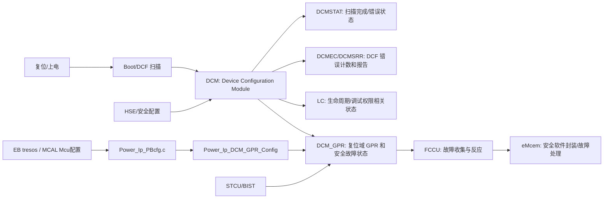

# Chapter 39 Device Configuration Module (DCM) 学习笔记

> 适用背景：S32K324 / S32K3xx，面向芯片启动、DCF 配置、生命周期状态、安全故障定位、MCAL/EB 工程开发和自学复习。
>
> 先声明一个非常重要的点：这里的 **DCM = Device Configuration Module**，是芯片硬件模块；不是 AUTOSAR 诊断栈里的 **Diagnostic Communication Manager**。工程里 `BasicSoftware/src/bsw/Dcm`、`Dcm_Lcfg_*`、`DcmDspUds_*` 基本都不是本章要讲的 DCM。
>
> 本笔记结合本工程 S32K324 头文件、MCAL Power/Mcu 代码、eMcem 安全软件代码，以及 NXP 公开资料/NXP Community 信息整理。不同 Reference Manual 版本中 DCM 和 DCM_GPR 章节号可能相邻变化，本笔记以本工程实际 S32K324 文件为准。

---

## 1. 先用一句话抓住 DCM

**DCM 是芯片的“启动配置、生命周期、安全状态和故障细节中枢”。**

它不像 FlexCAN、ADC、PWM 那样直接完成某个业务外设功能。DCM 更像芯片内部的配置管理员：

- 复位/启动时读取并扫描 DCF 配置；
- 记录 DCF 是否加载完成、是否出错、哪里出错；
- 管理芯片生命周期 LC 相关状态；
- 反映调试、OTA、用户测试等状态；
- 通过 DCM_GPR 这组通用寄存器保存/暴露某些复位域状态；
- 把很多硬件安全故障的“具体原因”记录到 DCMROD 等寄存器里，供 FCCU/eMcem 进一步处理。

用老师讲课式的话说：

```text
MCU 不是一上电就直接跑你的应用。
它先要知道：我现在是什么生命周期？哪些安全/调试/启动配置有效？DCF 有没有加载成功？内部安全故障来自哪里？

DCM 就是帮芯片回答这些问题的硬件模块。
```

**重点：DCM 本身不是业务驱动，也不是诊断通信模块；它是芯片级配置和状态模块。**

---

## 2. DCM 在 S32K3 系统里的位置

先看一张关系图：



这张图要读出三层意思：

1. **启动配置层**：复位后 DCM 扫描 DCF，决定芯片很多底层配置是否有效。
2. **状态观测层**：软件可以通过 `DCMSTAT`、`DCMEC`、`DCMSRR`、`DCMLCC` 等寄存器看启动配置和生命周期状态。
3. **安全故障层**：很多安全故障最终不只是 FCCU 一个 NCF 位，还会在 `DCMROD3` 到 `DCMROD8` 这类寄存器里留下更细的原因。

**难点：DCM 横跨启动、安全、复位、低功耗、调试权限和故障诊断，所以不要只用“一个普通外设”的思路理解它。**

---

## 3. 本章必须先懂的几个背景概念

### 3.1 DCF 是什么

DCF 通常可以理解成 **Device Configuration Format / Device Configuration Field** 相关配置记录。不同资料里写法略有差别，但开发上可以先这样理解：

**DCF 是芯片在启动或特定复位流程中要读取的一批“底层硬件配置记录”。**

它和普通 C 代码配置不一样。普通外设配置一般是应用或 MCAL 在运行后写寄存器；DCF 更靠前，往往在芯片复位启动阶段就被扫描/加载，用来影响非常底层的行为，例如：

- 某些安全机制是否打开；
- 某些复位/启动行为；
- 某些调试或安全访问状态；
- 某些硬件模块启动前就必须知道的配置。

可以这样类比：

```text
普通外设配置：程序跑起来以后，软件告诉外设怎么工作。
DCF 配置：程序正式跑起来之前，芯片先读取“出厂/安全/底层启动配置”。
```

DCM 和 DCF 的关系就是：

- DCM 负责扫描/加载/检查 DCF；
- `DCMSTAT.DCMDONE` 表示 DCM/DCF 相关扫描配置完成；
- `DCMSTAT.DCMERR` 表示 DCM 发现错误；
- `DCMEC` 记录 DCF 错误数量；
- `DCMSRR[0..15]` 记录 DCF 扫描报告。

**重点：如果芯片启动后行为很怪，尤其涉及 lockstep、HSE、安全配置、调试口、低层复位行为，不要只查 C 代码，也要想到 DCF/DCM。**

NXP Community 中也有类似开发场景：例如 S32K344 lockstep 问题中，NXP 支持人员提到需要通过 DCM records 将设备切换到 lockstep 模式，并查看参考手册附带的 DCF client 表。这类信息说明：有些配置不是普通运行时代码写一个寄存器就完事，而是和 DCF/DCM 记录有关。

### 3.2 LC 生命周期是什么

LC 是 **Life Cycle**，生命周期状态。

芯片生命周期不是软件随便定义的“运行模式”，它更接近安全芯片的状态机。例如一个芯片可能处于开发、量产、封存、退役等不同安全阶段。生命周期会影响：

- 调试口是否可用；
- HSE/安全服务是否允许；
- 某些密钥、认证、写入操作是否允许；
- 某些 DCF/安全配置是否能够改变。

DCM 里有 `DCMLCC`、`DCMLCS`、`DCMLCS_2` 这些 LC 相关寄存器：

- `DCMLCC`：LC and LC Control，生命周期与生命周期控制；
- `DCMLCS`：LC Scan Status，生命周期扫描状态；
- `DCMLCS_2`：更多生命周期扫描状态。

**易错点：生命周期不是应用层模式，也不是 AUTOSAR BswM/EcuM 的模式。它是芯片安全生命周期，随便写错可能导致调试权限、安全访问、启动行为发生严重变化。**

### 3.3 GPR 是什么

GPR 是 **General-Purpose Register**，通用寄存器。

但在 DCM_GPR 里，它不是普通“随便给软件存变量”的 RAM，而是一组带有明确复位域、读写属性和安全含义的寄存器。比如：

- 有些是只读状态；
- 有些是故障状态；
- 有些是故障使能；
- 有些和 Standby 退出配置有关；
- 有些保存 DCF 读取出来的配置状态；
- 有些按 Power On Reset、Destructive Reset、Functional Reset 等复位类型刷新或保留。

本工程里 `S32K324_DCM_GPR.h` 把它们分成这些家族：

| 名称前缀 | 字面含义 | 开发理解 |
|---|---|---|
| `DCMROD` | Read Only GPR On Destructive Reset | 破坏性复位域相关只读/状态寄存器，很多安全故障细项在这里 |
| `DCMROF` | Read Only GPR On Functional Reset | 功能复位域相关只读状态，包含一批 `DCF_SDIDx` 配置位 |
| `DCMRWP` | Read Write GPR On Power On Reset | 上电复位域相关可读写寄存器 |
| `DCMRWD` | Read Write GPR On Destructive Reset | 破坏性复位域相关可读写寄存器，常见用途是故障监控使能 |
| `DCMRWF` | Read Write GPR On Functional Reset | 功能复位域相关可读写寄存器，低功耗/软件 NCF/Standby 相关配置常在这里 |
| `DCMROPP` | Read Only GPR On PMCPOR Reset | PMC POR 相关只读寄存器 |

**难点：看 DCM_GPR 时一定要带着“复位域”思维。一个寄存器在功能复位后是否保留、在破坏性复位后是否清除，不能凭感觉，要结合手册和 MC_RGM 复位原因一起判断。**

### 3.4 NCF、FCCU 和 DCMROD 的关系

FCCU 是 **Fault Collection and Control Unit**，负责收集芯片内部很多安全故障。NCF 通常指 FCCU 的 Non-Critical Fault 通道/组。

但 FCCU 的 NCF 往往是“汇总后的组信号”。一个 NCF 背后可能对应很多具体故障原因。例如：

```text
FCCU NCF1 被触发
    不代表你已经知道具体原因
    可能还要看 DCMROD3/4/5/...
```

NXP Community 上有一个很关键的回答：S32K3 的硬件安全机制和 FCCU 映射问题中，NXP 支持人员建议查看 DCM_GPR 章节；只读寄存器用于指出 NCF 的故障原因，可读写寄存器用于使能/禁止对应 NCF 的故障监控。

这和本工程代码完全对得上：

- `eMcem_Dcm_GetErrors()` 读取 `DCMROD3` 到 `DCMROD8`；
- `eMcem_Dcm_Init()` 清 `DCMROD3` 到 `DCMROD8` 的状态；
- `eMcem_Dcm_Init()` 写 `DCMRWD3/4/5/14/15` 等故障使能寄存器；
- `eMcem_DcmNcfList_S32K3XX.*` 维护 DCM fault 到 FCCU NCF 的映射。

**重点：查安全故障时，不要只看 FCCU。FCCU 告诉你“哪组报警了”，DCM_GPR 往往告诉你“这组里面到底哪个源头报警了”。**

### 3.5 DCM 和 AUTOSAR Dcm 的名字冲突

本工程里 `Dcm` 这个名字非常容易误导：

| 名称 | 实际含义 | 典型路径 |
|---|---|---|
| DCM 硬件模块 | Device Configuration Module | `BaseNXP/header/S32K324_DCM.h`、`S32K324_DCM_GPR.h` |
| AUTOSAR Dcm | Diagnostic Communication Manager，UDS 诊断通信管理器 | `BasicSoftware/src/bsw/Dcm`、`DcmDspUds_*` |

如果你要研究 Chapter 39 DCM，重点看：

```text
BasicSoftware/integration/mcal/src/modules/BaseNXP/header/S32K324_DCM.h
BasicSoftware/integration/mcal/src/modules/BaseNXP/header/S32K324_DCM_GPR.h
BasicSoftware/integration/mcal/src/modules/Mcu/src/Power_Ip_DCM_GPR.c
BasicSoftware/integration/mcal/src/modules/eMcem/src/eMcem_Dcm.c
```

如果你在 `BasicSoftware/src/bsw/Dcm` 里找 Chapter 39 DCM，多半会越找越乱，因为那里是 UDS 诊断服务，不是芯片配置模块。

---

## 4. 本工程中 DCM 的地址和两个视图

本工程 S32K324 头文件里，DCM 的基地址是：

```c
#define IP_DCM_BASE      (0x402AC000u)
#define IP_DCM_GPR_BASE  (0x402AC000u)
```

也就是说：

- `S32K324_DCM.h` 看到的是 DCM 主寄存器视图；
- `S32K324_DCM_GPR.h` 看到的是 DCM_GPR 视图；
- 它们基地址相同，结构体偏移不同，是同一片 DCM 地址空间的不同解释方式。

可以这样理解：

```text
0x402AC000 这一片地址空间
    前面一段：DCMSTAT、DCMLCC、DCMLCS、DCMSRR 等 DCM 主寄存器
    后面一段：DCMROD、DCMROF、DCMRWD、DCMRWF 等 DCM_GPR 寄存器
```

**易错点：不要以为 `IP_DCM` 和 `IP_DCM_GPR` 是两个完全独立外设。它们是同一个 DCM 地址空间的两个软件视图。**

---

## 5. DCM 主寄存器总览

`S32K324_DCM.h` 中定义的主寄存器布局如下：

| 寄存器 | 偏移 | 作用 | 开发时怎么看 |
|---|---:|---|---|
| `DCMSTAT` | `0x00` | DCM Status | 看 DCM/DCF 是否完成、是否有错误、LC/OTA/debug 相关状态 |
| `DCMLCC` | `0x04` | LC and LC Control | 看当前/请求/工厂生命周期相关字段 |
| `DCMLCS` | `0x08` | LC Scan Status | 看生命周期扫描的分段状态、错误、致命错误 |
| `DCMMISC` | `0x1C` | DCM Miscellaneous | DCM 杂项控制/调试相关位 |
| `DCMDEB` | `0x20` | Debug Status and Configuration | 看应用调试状态、SoC 调试状态 |
| `DCMEC` | `0x2C` | DCF Error Count | DCF 错误计数 |
| `DCMSRR[16]` | `0x30` | DCF Scan Report | DCF 扫描错误报告槽 |
| `DCMLCS_2` | `0x80` | LC Scan Status 2 | 更多 LC 扫描状态 |

开发时最常看的组合是：

```text
启动/配置是否成功：DCMSTAT + DCMEC + DCMSRR
生命周期/调试状态：DCMLCC + DCMLCS + DCMLCS_2 + DCMDEB
```

---

## 6. DCMSTAT：先看 DCM 是否正常完成

`DCMSTAT` 是最适合作为第一眼检查的状态寄存器。

本工程头文件中可见字段：

| 字段 | bit | 含义理解 |
|---|---:|---|
| `DCMDONE` | 0 | DCM/DCF 扫描配置完成 |
| `DCMERR` | 1 | DCM 检测到错误 |
| `DCMLCST` | 4 | 生命周期扫描状态 |
| `DCMUTS` | 8 | 用户测试/用户状态相关状态位 |
| `DCMOTAS` | 9 | OTA 相关状态位 |
| `DCMDBGPS` | 10 | Debug port/status 相关状态位 |

如果你在调试启动问题，可以先按这个顺序想：

```text
1. DCMDONE 是否为 1？
   否：DCM/DCF 扫描可能还没完成，或启动流程有问题。

2. DCMERR 是否为 1？
   是：继续看 DCMEC 和 DCMSRR。

3. LC / debug / OTA 相关状态是否符合预期？
   不符合：继续看 DCMLCC、DCMLCS、DCMDEB。
```

示例代码思路：

```c
uint32_t stat = IP_DCM->DCMSTAT;

if ((stat & DCM_DCMSTAT_DCMDONE_MASK) == 0U)
{
    /* DCM scan is not done yet or startup flow is abnormal. */
}

if ((stat & DCM_DCMSTAT_DCMERR_MASK) != 0U)
{
    uint32_t err_count = IP_DCM->DCMEC & DCM_DCMEC_DCMECT_MASK;
    /* Continue checking DCMSRR report slots. */
}
```

**重点：`DCMSTAT.DCMERR = 1` 不是最终结论，只是告诉你“有错误”。真正定位要继续看 `DCMEC` 和 `DCMSRR`。**

---

## 7. DCMEC 和 DCMSRR：定位 DCF 扫描错误

### 7.1 DCMEC

`DCMEC` 是 DCF Error Count。字段：

| 字段 | 位宽 | 含义 |
|---|---:|---|
| `DCMECT` | 16 bit | DCF 错误计数 |

如果 `DCMSTAT.DCMERR = 1`，而 `DCMEC.DCMECT` 也不为 0，说明 DCF 扫描过程中确实统计到了错误。

### 7.2 DCMSRR

`DCMSRR` 是 DCF Scan Report，一共有 16 个槽：

```c
__IO uint32_t DCMSRR[16];
```

每个槽都有类似的字段命名：

| 字段族 | 位域 | 开发理解 |
|---|---|---|
| `DCMDCFE` | `[20:0]` | DCF error entry / address / element 信息，具体解释看手册表 |
| `DCMDCFF` | `[26:24]` | DCF fault field / format / fault classification 信息 |
| `DCMESF` | bit 27 | Error source flag 相关状态 |
| `DCMESD` | bit 28 | Error source data/detail 相关状态 |
| `DCMDCFT` | bit 29 | DCF fault type 相关状态 |

这里不要死记字段名。掌握开发意义更重要：

```text
DCMEC 只告诉你错了几个。
DCMSRR 告诉你错误报告槽里具体记录了什么。
```

如果遇到 DCF 导致的启动异常，建议：

1. 先读 `DCMSTAT`；
2. 如果 `DCMERR = 1`，读 `DCMEC`；
3. 遍历 `DCMSRR[0..15]`，把非零项打出来；
4. 对照 Reference Manual 里的 DCMSRR 字段解释和 DCF client 表；
5. 同时检查 HSE/LC/调试权限相关配置。

**难点：DCMSRR 的字段不是“看名字就能完整破译”的普通状态位。它需要结合手册、DCF client 表和当前芯片型号。**

---

## 8. DCMLCC、DCMLCS、DCMLCS_2：生命周期相关

### 8.1 DCMLCC

`DCMLCC` 是 LC and LC Control。可见字段包括：

| 字段 | 位域 | 含义理解 |
|---|---|---|
| `DCMCLC` | `[2:0]` | 当前生命周期相关编码 |
| `DCMLCFN` | bit 3 | 生命周期字段/状态相关标志 |
| `DCMRLC` | `[6:4]` | 请求生命周期相关编码 |
| `DCMFLC` | `[9:8]` | 工厂生命周期相关编码 |

开发时要注意：

- 这里不是普通应用状态机；
- 生命周期状态会影响安全访问和调试；
- 不要在应用里随便写 LC 控制位；
- 如果 debug 口突然不能用、HSE 权限异常、某些安全配置无法更改，LC 是重要排查点。

### 8.2 DCMLCS 和 DCMLCS_2

`DCMLCS` 和 `DCMLCS_2` 是生命周期扫描状态寄存器。它们的字段呈重复结构，例如：

```text
DCMLCSSx  : LC scan status
DCMLCCx   : LC code / classification
DCMLCEx   : LC error
DCMLCFEx  : LC fatal error
```

可以这样记：

```text
S  = status
C  = code/class
E  = error
FE = fatal error
```

`DCMLCS` 覆盖第 1 到第 5 组扫描状态，`DCMLCS_2` 继续覆盖后续组。

**重点：如果 LC 相关状态异常，不要只看 `DCMLCC` 当前值，还要看扫描状态中有没有 error/fatal error。**

---

## 9. DCMMISC 和 DCMDEB：调试与杂项状态

### 9.1 DCMMISC

`DCMMISC` 里本工程头文件可见这些字段：

| 字段 | bit | 含义理解 |
|---|---:|---|
| `DCMDBGT` | 10 | DCM debug 触发/测试相关 |
| `DCMDBGE` | 11 | DCM debug enable 相关 |
| `DCMCERS` | 28 | DCM error reset/status 相关 |

这些字段和调试/错误状态有关。开发上一般不会把它当业务配置来写，更多是在调试 DCM/LC/debug 状态时确认。

### 9.2 DCMDEB

`DCMDEB` 是 Debug Status and Configuration。可见字段：

| 字段 | bit | 含义理解 |
|---|---:|---|
| `DCM_APPDBG_STAT` | 1 | 应用调试状态 |
| `APPDBG_STAT_SOC` | 16 | SoC 层面的应用调试状态 |

当你遇到“以前能连调试器，现在连不上/权限不对”的问题时，不能只看 J-Link/PEmicro 或 IDE 设置，也要把 DCM/LC/debug 状态一起纳入排查。

---

## 10. DCM_GPR：开发里最常实际碰到的一组寄存器

虽然用户问的是 Chapter 39 DCM，但在实际工程里，很多 DCM 相关问题会落到 `DCM_GPR`。原因是：

- MCAL Mcu/Power 配置写的是 `DCMRWF1/2/5`；
- eMcem 读写的是 `DCMROD3..8` 和 `DCMRWD3/4/5/...`；
- FCCU 故障的细项原因常在 `DCMROD`；
- STCU/BIST 故障也会出现在 `DCMROD5`。

### 10.1 DCMROD1：早期安全/电源/HSE 状态

`DCMROD1` 中本工程可见字段：

| 字段 | 含义 |
|---|---|
| `PCU_ISO_STATUS` | PCU 隔离状态 |
| `HSE_DCF_VIO` | HSE DCF violation，HSE 相关 DCF 违规 |
| `KEY_RESP_READY` | key response ready，密钥响应就绪状态 |

这里的重点是 `HSE_DCF_VIO`。如果你改了 HSE/安全/DCF 相关内容后启动异常，这个位值得关注。

### 10.2 DCMROD3：CPU、HSE、Gasket、EDC/ECC 类故障

`DCMROD3` 里有很多安全故障状态，例如：

- `CM7_0_LOCKUP`
- `CM7_1_LOCKUP`
- `HSE_LOCKUP`
- `TCM_GSKT_ALARM`
- `DMA_SYS_GSKT_ALARM`
- `DMA_PERIPH_GSKT_ALARM`
- `SYS_AXBS_ALARM`
- `DMA_AXBS_ALARM`
- `HSE_GSKT_ALARM`
- `QSPI_GSKT_ALARM`
- `AIPS1_GSKT_ALARM`
- `AIPS2_GSKT_ALARM`
- `ADDR_EDC_ERR`
- `DATA_EDC_ERR`
- `LC_ERR`
- `PRAMx_ECC_ERR`
- `CM7_x_DCDATA_ECC_ERR`

这说明 `DCMROD3` 非常像一个“安全故障细节面板”。FCCU 可能只告诉你某个 NCF 触发了，但 `DCMROD3` 能告诉你是 lockup、gasket、EDC、ECC，还是 LC error。

**重点：如果 FCCU 报警但你不知道原因，优先看 `DCMROD3..8`。**

### 10.3 DCMROD5：STCU/BIST 和软件 NCF 很关键

`DCMROD5` 中本工程可见字段包括：

| 字段 | 含义 |
|---|---|
| `SW_NCF_0..3` | 软件触发 NCF 状态 |
| `STCU_NCF` | STCU 相关 NCF |
| `MBIST_ACTIVATION_ERR` | MBIST 激活错误 |
| `STCU_BIST_USER_CF` | STCU BIST 用户配置相关故障 |
| `DEBUG_ACTIVATION_ERR` | 调试激活错误 |
| `TCM_RDATA_EDC_ERR` | TCM 读数据 EDC 错误 |
| `MAC_RDATA_EDC_ERR` | MAC 读数据 EDC 错误 |
| `DMA_RDATA_EDC_ERR` | DMA 读数据 EDC 错误 |
| `CM7_x_AHBP/AHBM_RDATA_EDC_ERR` | CM7 总线读数据 EDC 错误 |
| `HSE_RDATA_EDC_ERR` | HSE 读数据 EDC 错误 |

这和你前面学 STCU2 直接相关：

```text
STCU 执行 BIST
    如果有不可恢复/配置类问题
    可能通过 DCMROD5.STCU_NCF 等位反映
    再映射到 FCCU NCF
    最后由 eMcem 做安全处理
```

本工程 eMcem 头文件里也有：

```c
#define EMCEM_DCM_NCF_5_STCU_NCF 73U
```

**易错点：STCU 不只是看 STCU 寄存器本身。涉及 FCCU/eMcem 安全故障时，还要看 `DCMROD5`。**

### 10.4 DCMRWDx：故障监控使能

`DCMRWD` 是 Read Write GPR On Destructive Reset。和 `DCMROD` 的关系可以这样理解：

```text
DCMROD = 看到哪些故障状态已经发生
DCMRWD = 控制哪些故障监控/上报被使能
```

例如 `DCMRWD5` 中有：

- `STCU_NCF_EN`
- `MBIST_ACTIVATION_ERR_EN`
- `STCU_BIST_USER_CF_EN`
- `SW_NCF_x_EN`
- 各类 EDC/ECC/gasket 相关 enable 位

本工程 `eMcem_Dcm_Init()` 会写：

```c
DCM_GPR.DCMRWD3.R  = au32DcmEnable[0];
DCM_GPR.DCMRWD4.R  = au32DcmEnable[1];
DCM_GPR.DCMRWD5.R  = au32DcmEnable[2];
DCM_GPR.DCMRWD14.R = au32DcmEnable[3];
DCM_GPR.DCMRWD15.R = au32DcmEnable[4];
```

所以 eMcem 初始化不仅是“启动安全库”，它还会把 DCM 故障使能写到对应寄存器。

### 10.5 DCMRWF1：软件 NCF、Standby IO、监控配置

`DCMRWF1` 是功能复位域可读写寄存器，常见字段包括：

- `CAN_TIMESTAMP_SEL`
- `CAN_TIMESTAMP_EN`
- `FCCU_SW_NCF0..3`
- `STANDBY_IO_CONFIG`
- `SUPPLY_MON_EN`
- `SUPPLY_MON_SEL`
- 多个电压 divider/analog mux 相关 enable 位

本工程 eMcem 用 `DCMRWF1.FCCU_SW_NCFx` 做软件故障触发：

```c
DCM_GPR.DCMRWF1.R |= (4UL << u8SwFaultId);
```

Power/Mcu 低功耗相关代码会写 `STANDBY_IO_CONFIG`：

```c
Power_Ip_DCM_GPR_GlobalPadkeepingConfig(...)
```

开发理解：

- 想做 FCCU 软件故障测试，看 `FCCU_SW_NCFx`；
- 想看 Standby 期间 IO 是否保持，看 `STANDBY_IO_CONFIG`；
- 但不要把 `DCMRWF1` 当作普通变量寄存器随便写，因为它里面混有多个系统级控制位。

### 10.6 DCMRWF2：Standby 退出时的 bypass 配置

`DCMRWF2` 中本工程关注这些位：

| 字段 | 含义 |
|---|---|
| `DCM_SCAN_BYP_STDBY_EXT` | Standby 退出时 bypass DCM scanning |
| `FIRC_TRIM_BYP_STDBY_EXT` | Standby 退出时 bypass FIRC trimming |
| `PMC_TRIM_RGM_DCF_BYP_STDBY_EXT` | Standby 退出时 bypass PMC trimming / RGM DCF loading |
| `SIRC_TRIM_BYP_STDBY_EXT` | Standby 退出时 bypass SIRC trimming |
| `HSE_GSKT_BYPASS` | HSE gasket bypass |

本工程 `Power_Ip_DCM_GPR_Config()` 注释写得很直接：它控制 Standby 退出时是否 bypass SIRC trimming、PMC trimming、RGM DCF loading、FIRC trimming、DCM scanning。

**重点：低功耗 Standby 退出异常时，`DCMRWF2` 是关键寄存器。**

### 10.7 DCMRWF5：Fast Standby Exit 启动地址

`DCMRWF5` 有两个关键字段：

| 字段 | 含义 |
|---|---|
| `BOOT_MODE` | Boot mode，是否 Fast Standby 等 |
| `BOOT_ADDRESS` | Standby 退出后的 CM7_0 vector table base address |

本工程代码逻辑：

```c
if (1U == ConfigPtr->BootMode)
{
    IP_DCM_GPR->DCMRWF5 = ConfigPtr->BootAddress | ConfigPtr->BootMode;
}
else
{
    IP_DCM_GPR->DCMRWF5 = 0U;
}
```

如果使用 Fast Standby Exit，`BootAddress` 必须正确，否则退出 Standby 后 CPU 可能跳到错误向量表。

**易错点：`BOOT_ADDRESS` 不是普通函数地址，而是 Cortex-M7_0 向量表基地址。**

---

## 11. 工程代码里 DCM 是怎么被用起来的

### 11.1 头文件入口

本工程硬件寄存器定义：

```text
BasicSoftware/integration/mcal/src/modules/BaseNXP/header/S32K324_DCM.h
BasicSoftware/integration/mcal/src/modules/BaseNXP/header/S32K324_DCM_GPR.h
```

这两个文件是理解 DCM 的基础。

- `S32K324_DCM.h`：主 DCM 状态、LC、DCF scan report；
- `S32K324_DCM_GPR.h`：GPR、故障状态、故障使能、低功耗相关配置。

### 11.2 MCAL Power/Mcu 配置入口

相关文件：

```text
BasicSoftware/integration/mcal/src/modules/Mcu/include/Power_Ip_DCM_GPR_Types.h
BasicSoftware/integration/mcal/src/modules/Mcu/src/Power_Ip_DCM_GPR.c
BasicSoftware/integration/mcal/src/modules/Mcu/src/Power_Ip.c
BasicSoftware/integration/mcal/src/gen/src/Power_Ip_PBcfg.c
```

配置结构体：

```c
typedef struct
{
    boolean DcmGprUnderMcuControl;
    uint8  BootMode;
    uint32 BootAddress;
    uint32 ConfigRegister;
    boolean GlobalPadkeeping;
} Power_Ip_DCM_GPR_ConfigType;
```

每个字段的意思：

| 字段 | 含义 |
|---|---|
| `DcmGprUnderMcuControl` | DCM_GPR 是否由 Mcu/Power 驱动控制 |
| `BootMode` | Standby 退出后的 boot mode |
| `BootAddress` | CM7_0 向量表基地址 |
| `ConfigRegister` | 写入 `DCMRWF2` 的配置值 |
| `GlobalPadkeeping` | 是否配置 `DCMRWF1.STANDBY_IO_CONFIG` |

调用路径是：

```text
Mcu_SetMode()
  -> Mcu_Ipw_SetMode()
    -> Power_Ip_SetMode()
      -> Power_Ip_DCM_GPR_Config()
        -> 写 DCMRWF5 / DCMRWF2
      -> Power_Ip_DCM_GPR_GlobalPadkeepingConfig()
        -> 写 DCMRWF1.STANDBY_IO_CONFIG
```

也就是说，**EB/MCAL 里和 DCM_GPR 相关的配置，通常是通过 Mcu mode / Power mode 配置生成出来，然后在 `Mcu_SetMode()` 时生效。**

### 11.3 本工程当前生成配置

在 `Power_Ip_PBcfg.c` 中可以看到：

```c
static const Power_Ip_DCM_GPR_ConfigType Power_Ip_DCM_GPR_ConfigPB_0 =
{
    (boolean)FALSE,     /* DcmGprUnderMcuControl */
    (uint8)0U,          /* Boot Mode */
    ((uint32)0x0U),     /* BootAddress */
    ((uint32)0x00000000U), /* DCMRWF2 */
    (boolean)FALSE      /* Global Padkeeping */
};
```

这意味着本工程当前生成配置中：

- `DcmGprUnderMcuControl = FALSE`；
- `BootMode = 0`；
- `BootAddress = 0`；
- `DCMRWF2` 配置值为 0；
- `GlobalPadkeeping = FALSE`。

所以即使 `Mcu_SetMode()` 调到了 `Power_Ip_DCM_GPR_Config()`，也会因为 `DcmGprUnderMcuControl == FALSE` 而不写 `DCMRWF5/DCMRWF2`。

**重点：如果你在 EB 里找 DCM_GPR 配置，但生成代码里 `DcmGprUnderMcuControl` 仍然是 `FALSE`，那说明当前工程并没有让 Mcu 驱动接管这些 DCM_GPR 配置。**

### 11.4 eMcem 安全软件入口

相关文件：

```text
BasicSoftware/integration/mcal/src/modules/eMcem/src/eMcem_Dcm.c
BasicSoftware/integration/mcal/src/modules/eMcem/inc/eMcem_Dcm.h
BasicSoftware/integration/mcal/src/modules/eMcem/src/eMcem_Lib_S32K3XX.c
BasicSoftware/integration/mcal/src/modules/eMcem/inc/eMcem_DcmNcfList_S32K3XX.h
BasicSoftware/integration/mcal/src/modules/eMcem/src/eMcem_DcmNcfList_S32K3XX.c
```

eMcem 初始化 DCM 的路径：

```text
eMcem_Init()
  -> eMcem_Init_Int()
    -> eMcem_Dcm_Init(pConfigPtr->DcmConfig->Fault_Dcm_E)
```

`eMcem_Dcm_Init()` 做两件事：

1. 清 DCM fault status flags：

```c
DCM_GPR.DCMROD3.R = 0xFFFFFFFFUL;
DCM_GPR.DCMROD4.R = 0xFFFFFFFFUL;
DCM_GPR.DCMROD5.R = 0xFFFFFFFFUL;
DCM_GPR.DCMROD6.R = 0xFFFFFFFFUL;
DCM_GPR.DCMROD7.R = 0xFFFFFFFFUL;
DCM_GPR.DCMROD8.R = 0xFFFFFFFFUL;
```

2. 写 DCM fault enable：

```c
DCM_GPR.DCMRWD3.R  = au32DcmEnable[0];
DCM_GPR.DCMRWD4.R  = au32DcmEnable[1];
DCM_GPR.DCMRWD5.R  = au32DcmEnable[2];
DCM_GPR.DCMRWD14.R = au32DcmEnable[3];
DCM_GPR.DCMRWD15.R = au32DcmEnable[4];
```

注意一个细节：虽然这些寄存器名字里有 `Read Only`，但 eMcem 通过写 `1` 清故障标志。这说明它们对普通读操作是状态寄存器，但清除机制可能是 W1C，也就是 Write 1 to Clear。

**易错点：不要机械地把 `DCMROD` 理解成“绝对不能写”。对状态寄存器来说，经常是“读状态，写 1 清除”。具体以手册和驱动实现为准。**

### 11.5 eMcem 读取 DCM 故障

`eMcem_Dcm_GetErrors()` 会读取：

```c
DCMROD3
DCMROD4
DCMROD5
DCMROD6
DCMROD7
DCMROD8
```

并且和 `eMcem_au32StaticFaultMasks[]` 做 mask：

```c
pFaultContainer[0] = (DCM_GPR.DCMROD3.R | au32InjectedFaults[0]) & eMcem_au32StaticFaultMasks[0];
```

这说明：

- eMcem 不会无脑上报所有 DCMROD 位；
- 它会结合静态 fault mask；
- 还有一套 `au32InjectedFaults[]` 用于软件注入/测试。

---

## 12. EB 里面到底怎么配

结合本工程代码，结论可以分三类说。

### 12.1 DCM 主模块不是普通外设时钟配置

DCM 不是 FlexCAN、ADC、LPSPI 这种“先在 MC_ME 里开外设时钟，然后配置寄存器”的典型业务外设。

它和启动、复位、DCF、LC、安全状态绑定。很多 DCM 主功能在复位/启动阶段由硬件完成，不是应用代码里 `Mcu_InitClock()` 之后再打开一个普通 DCM clock。

所以你如果在 EB 里按“找一个 DCM 外设时钟开关”的方式找，通常会找不到。

**重点：Chapter 39 DCM 的 DCF/LC 这些核心功能，不应按普通外设 clock enable 思路理解。**

### 12.2 DCM_GPR 的 MCAL 配置在 Mcu/Power mode 相关生成代码里

本工程里 DCM_GPR 配置是通过 Mcu/Power 生成：

```text
Power_Ip_PBcfg.c
  -> Power_Ip_DCM_GPR_ConfigPB_0
  -> Power_Ip_aModeConfigPB[0].DcmGprConfigPtr
```

如果 EB 里有对应项，通常会在 Mcu 模块的 mode / low power / DCM_GPR 相关配置下，而不是 AUTOSAR `Dcm` 模块下。

你可以反向验证：

```text
EB 配置是否生效
    看 Power_Ip_PBcfg.c
        DcmGprUnderMcuControl 是否 TRUE
        BootMode 是否符合预期
        BootAddress 是否符合预期
        ConfigRegister 是否生成了 DCMRWF2 的 bypass 位
        GlobalPadkeeping 是否 TRUE
```

本工程当前是 `FALSE/0/0/0/FALSE`，所以 DCM_GPR 没有被 Mcu 运行时配置接管。

### 12.3 安全故障使能在 eMcem 配置里

如果你关心的是：

- DCMROD3/4/5 哪些故障会监控；
- STCU_NCF 是否使能；
- DCM fault 和 FCCU NCF 怎么对应；
- eMcem 报警处理函数；

那就不是 Mcu/Power 的 DCM_GPR 低功耗配置，而是 eMcem/Safety 相关配置。

工程中落地到：

```text
eMcem_Dcm_Init(... Fault_Dcm_E ...)
DCMRWD3/4/5/14/15
eMcem_DcmNcfList_S32K3XX.*
```

### 12.4 AUTOSAR Dcm 模块不用看

如果你在 EB 里打开的是 AUTOSAR Diagnostic Communication Manager，也就是诊断服务里的 `Dcm`，那它控制的是：

- UDS session；
- SecurityAccess；
- DID；
- RoutineControl；
- DTC 诊断服务；
- PduR/CanTp/ComM 交互。

这些和 Chapter 39 Device Configuration Module 没有直接关系。

**易错点：EB 里有 Dcm，不代表那就是本章 DCM。**

---

## 13. 常见开发场景怎么排查

### 13.1 场景一：芯片启动异常，怀疑 DCF 问题

排查路径：

```text
1. 读 DCMSTAT
   - DCMDONE 是否为 1
   - DCMERR 是否为 1

2. 如果 DCMERR = 1
   - 读 DCMEC.DCMECT
   - 遍历 DCMSRR[0..15]

3. 同时读 DCMROD1
   - HSE_DCF_VIO 是否置位

4. 再结合 MC_RGM
   - 看复位原因
   - 看是 functional reset、destructive reset、POR 还是其他复位

5. 如果和 HSE/安全配置有关
   - 检查 HSE 配置、DCF records、生命周期状态
```

常见误区：

```text
只看应用代码没有改，就认为启动配置没问题。
实际 DCF/HSE/LC 这类配置可能在应用代码运行前就影响了芯片。
```

### 13.2 场景二：FCCU 报警，但不知道具体故障源

排查路径：

```text
1. 看 FCCU 哪个 NCF 被触发
2. 查 eMcem_DcmNcfList_S32K3XX.h/c 中 NCF 和 DCM fault 的映射
3. 读 DCMROD3..8
4. 用 eMcem_GetErrors() 获取封装后的 fault container
5. 对照 DCMROD 位名判断具体源头
```

例如：

- `CM7_0_LOCKUP`：CM7_0 lockup；
- `HSE_LOCKUP`：HSE core lockup；
- `TCM_GSKT_ALARM`：TCM gasket alarm；
- `ADDR_EDC_ERR` / `DATA_EDC_ERR`：地址/数据 EDC 错误；
- `STCU_NCF`：STCU 相关 NCF。

**重点：FCCU 是“收集器”，DCMROD 是“原因面板”。**

### 13.3 场景三：STCU2 自检后出现安全故障

排查路径：

```text
1. 看 STCU2 自身状态寄存器
2. 看 FCCU 对应 NCF
3. 看 DCMROD5
   - STCU_NCF
   - MBIST_ACTIVATION_ERR
   - STCU_BIST_USER_CF
4. 看 DCMRWD5 对应 enable 是否打开
5. 看 eMcem_DcmNcfList 中 STCU_NCF 映射
```

这能把 Chapter 54 STCU2 和 Chapter 39 DCM 串起来。

老师式理解：

```text
STCU 负责执行 BIST。
DCM_GPR 负责留下“STCU 相关安全故障”的状态位。
FCCU 负责把它收集起来并触发反应。
eMcem 负责软件层读取、清除、回调、上报。
```

### 13.4 场景四：Standby 退出后不按预期启动

排查路径：

```text
1. 看是否使用 Fast Standby Exit
2. 看 DCMRWF5.BOOT_MODE
3. 看 DCMRWF5.BOOT_ADDRESS
4. 看 DCMRWF2 的 standby exit bypass 位
5. 看 Mcu_SetMode() 是否真的调用
6. 看 Power_Ip_PBcfg.c 中 DcmGprUnderMcuControl 是否 TRUE
```

本工程当前 `DcmGprUnderMcuControl = FALSE`，所以不会由 Mcu 驱动主动写 `DCMRWF5/DCMRWF2`。

**易错点：只改 EB 页面但没有看生成代码，可能以为配置生效了，实际上生成值仍然是默认值。**

### 13.5 场景五：想触发 FCCU 软件故障做测试

eMcem 里有：

```c
void eMcem_Dcm_AssertSWFault(uint8 u8SwFaultId)
{
    DCM_GPR.DCMRWF1.R |= (4UL << u8SwFaultId);
}
```

这对应 `DCMRWF1.FCCU_SW_NCF0..3`。

开发理解：

- 这是通过 DCM_GPR 触发软件 NCF；
- 用于安全反应链路测试；
- 触发后要确认 FCCU/eMcem 的处理是否符合配置；
- 测试完成要 deassert/clear，避免影响后续安全状态。

---

## 14. DCM 和复位域：为什么一定要结合 MC_RGM 看

DCM_GPR 名字里反复出现：

- Power On Reset；
- Destructive Reset；
- Functional Reset；
- PMCPOR Reset。

这些不是装饰词。它们决定寄存器在不同复位后的状态行为。

举例：

```text
一次 functional reset 后，你看到某个 DCMROD 位还在
    可能是故障真的又发生了
    也可能是该复位类型没有清掉这个状态
    也可能是安全软件初始化时清了又被重新置位

一次 destructive reset 后，你看到状态没了
    可能是复位域清掉了
    不代表故障原因不存在
```

因此排查时要同时看：

- `MC_RGM` 的复位原因；
- `DCMROD` 的故障细项；
- `FCCU` 的 NCF 状态；
- eMcem 初始化是否已经清过 DCM flags；
- 你的测试是在复位前看，还是复位后看。

**难点：安全故障调试经常不是“读一个寄存器就完事”，而是要把复位原因、清除时机、故障重触发路径放在一起看。**

---

## 15. 重点、难点、易错点总结

### 15.1 重点

- DCM 是芯片级 Device Configuration Module，不是 AUTOSAR 诊断 Dcm。
- DCM 主寄存器负责 DCF 扫描状态、错误报告、生命周期状态和 debug 状态。
- `DCMSTAT.DCMDONE` 和 `DCMSTAT.DCMERR` 是启动配置排查第一入口。
- `DCMEC` 和 `DCMSRR` 用于 DCF 错误定位。
- `DCM_GPR` 是实际工程中最常碰到的 DCM 扩展视图。
- `DCMROD3..8` 是很多安全故障的细节状态。
- `DCMRWDx` 常用于使能/屏蔽对应 DCM fault 监控。
- `DCMRWF1/2/5` 和软件 NCF、Standby、Fast Standby boot 配置有关。
- eMcem 会读写 DCM_GPR，并把 DCM fault 映射到 FCCU NCF。

### 15.2 难点

- DCF 不是普通运行时代码配置，很多配置发生在应用启动之前。
- LC 生命周期状态会影响调试和安全权限，不能当普通 mode 处理。
- DCM_GPR 寄存器带复位域属性，调试时必须结合 MC_RGM。
- FCCU NCF 是汇总后的故障组，DCMROD 才常常是细节。
- 同一个 `DCM` 名字在工程里同时代表硬件模块和 AUTOSAR 诊断模块。

### 15.3 易错点

- 在 `BasicSoftware/src/bsw/Dcm` 里找 Chapter 39 DCM。
- 在 EB 里打开 AUTOSAR Dcm 模块，以为能配置硬件 DCM。
- 以为 DCM 像普通外设一样有一个显眼的 clock enable 开关。
- 看到 `DCMROD` 写着 Read Only，就认为不能写，忽略 W1C 清标志机制。
- 只看 FCCU，不看 DCMROD3..8。
- 只改 EB 页面，不检查 `Power_Ip_PBcfg.c` 生成值。
- 忽略 `DcmGprUnderMcuControl`，导致以为 Mcu 会配置 DCM_GPR，实际没有。
- 不区分 functional reset、destructive reset、power on reset。
- 随便改 DCF/LC/Debug 相关配置，导致芯片调试或启动异常。

---

## 16. 开发自查清单

### 16.1 查 DCF/启动配置

```text
[ ] DCMSTAT.DCMDONE 是否为 1
[ ] DCMSTAT.DCMERR 是否为 1
[ ] DCMEC.DCMECT 是否非 0
[ ] DCMSRR[0..15] 是否有非零报告
[ ] DCMROD1.HSE_DCF_VIO 是否置位
[ ] MC_RGM 复位原因是否异常
[ ] 最近是否改过 HSE、DCF、生命周期、lockstep、安全配置
```

### 16.2 查 FCCU/eMcem 安全故障

```text
[ ] FCCU 哪个 NCF 被触发
[ ] DCMROD3..8 哪些位被置位
[ ] eMcem_GetErrors() 是否返回对应 fault
[ ] eMcem_DcmNcfList_S32K3XX 映射是否符合预期
[ ] DCMRWDx 对应 enable 是否打开
[ ] eMcem 初始化是否清过 DCM flags
```

### 16.3 查 STCU/BIST 故障

```text
[ ] STCU2 自身状态是否正常
[ ] DCMROD5.STCU_NCF 是否置位
[ ] DCMROD5.MBIST_ACTIVATION_ERR 是否置位
[ ] DCMROD5.STCU_BIST_USER_CF 是否置位
[ ] DCMRWD5 对应 enable 是否打开
[ ] FCCU/eMcem 是否有 STCU_NCF 对应 fault
```

### 16.4 查 Standby/低功耗退出

```text
[ ] 是否使用 Fast Standby Exit
[ ] Power_Ip_PBcfg.c 中 DcmGprUnderMcuControl 是否 TRUE
[ ] DCMRWF5.BOOT_MODE 是否符合预期
[ ] DCMRWF5.BOOT_ADDRESS 是否为正确向量表地址
[ ] DCMRWF2 standby exit bypass 位是否符合预期
[ ] DCMRWF1.STANDBY_IO_CONFIG 是否符合 padkeeping 预期
[ ] Mcu_SetMode() 是否实际调用
```

---

## 17. 用一段话把 DCM 讲给别人听

DCM 是 S32K3 芯片内部的 Device Configuration Module，它负责在复位/启动阶段扫描和检查 DCF 配置，并提供生命周期、调试、OTA、用户状态等芯片级状态。开发时可以通过 `DCMSTAT` 看 DCM/DCF 是否完成和是否出错，通过 `DCMEC`、`DCMSRR` 定位 DCF 扫描错误。实际工程里还要结合 DCM_GPR，因为 `DCMROD3..8` 记录很多安全故障细项，`DCMRWDx` 控制这些故障监控使能，`DCMRWF1/2/5` 又和软件 NCF、Standby exit、Fast Standby boot 有关。FCCU 往往只给出故障组，DCM_GPR 才能告诉你组内具体原因，eMcem 则负责把这些 DCM fault 读出来、清除、映射和上报。

---

## 18. 本工程文件定位速查

| 目的 | 文件 |
|---|---|
| DCM 主寄存器定义 | `BasicSoftware/integration/mcal/src/modules/BaseNXP/header/S32K324_DCM.h` |
| DCM_GPR 寄存器定义 | `BasicSoftware/integration/mcal/src/modules/BaseNXP/header/S32K324_DCM_GPR.h` |
| DCM_GPR 配置结构体 | `BasicSoftware/integration/mcal/src/modules/Mcu/include/Power_Ip_DCM_GPR_Types.h` |
| Mcu/Power 写 DCM_GPR 的代码 | `BasicSoftware/integration/mcal/src/modules/Mcu/src/Power_Ip_DCM_GPR.c` |
| `Mcu_SetMode` 后 Power 配置入口 | `BasicSoftware/integration/mcal/src/modules/Mcu/src/Power_Ip.c` |
| EB 生成的 DCM_GPR 配置 | `BasicSoftware/integration/mcal/src/gen/src/Power_Ip_PBcfg.c` |
| eMcem 读写 DCM fault | `BasicSoftware/integration/mcal/src/modules/eMcem/src/eMcem_Dcm.c` |
| eMcem DCM fault 接口 | `BasicSoftware/integration/mcal/src/modules/eMcem/inc/eMcem_Dcm.h` |
| DCM fault 到 FCCU NCF 映射 | `BasicSoftware/integration/mcal/src/modules/eMcem/inc/eMcem_DcmNcfList_S32K3XX.h` |
| DCM fault 映射表实现 | `BasicSoftware/integration/mcal/src/modules/eMcem/src/eMcem_DcmNcfList_S32K3XX.c` |
| 不要混淆的 AUTOSAR 诊断 Dcm | `BasicSoftware/src/bsw/Dcm` |

---

## 19. 参考资料

- 本工程 `S32K324_DCM.h`、`S32K324_DCM_GPR.h`、`Power_Ip_DCM_GPR.c`、`Power_Ip_PBcfg.c`、`eMcem_Dcm.c`、`eMcem_DcmNcfList_S32K3XX.*`。
- NXP S32K3 产品页：公开页面列出 S32K3xx Reference Manual、Data Sheet、BIST 应用笔记等资料入口。参考：[S32K3 Microcontrollers for Automotive General Purpose](https://www.nxp.com/products/S32K3)。
- NXP Community：S32K3 硬件安全机制和 FCCU 映射问题，NXP 回复指出 DCM_GPR 只读寄存器用于识别 NCF 故障原因，可读写寄存器用于使能/禁止监控。参考：[HW safety mechanism and FCCU matching on S32K](https://community.nxp.com/t5/SafeAssure-Community/HW-safety-mechanism-and-FCCU-matching-on-S32K/m-p/1819586)。
- NXP Community：S32K3 FCCU/eMcem 配置讨论，说明 FCCU NCF 组与多个 DCM fault/AlarmHandler 的关系。参考：[S32K3 FCCU configuration](https://community.nxp.com/t5/SafeAssure-Community/S32K3-FCCU-configuration/m-p/1622914)。
- NXP Community：S32K3 SPD FCCU 初始化讨论，提到 `eMcem_GetErrors` 与 DCM flags/FCCU NCF 状态之间的关系。参考：[S32K3 SPD FCCU initialization](https://community.nxp.com/t5/SafeAssure-Community/S32K3-SPD-FCCU-initialization/m-p/1387270)。
- NXP Community：S32K3 HSE OTA indicators 讨论，提到用户可在 `DCMSTAT` 中读取状态。参考：[s32k3: what's hse ota indicators?](https://community.nxp.com/t5/S32K/s32k3-what-s-hse-ota-indicators/m-p/2263253)。
- NXP Community：S32K344 lock-step kernel 讨论，NXP 回复提到通过 DCM records 切换 lockstep，并参考 DCF client 表。参考：[S32K344 Lock-step kernel](https://community.nxp.com/t5/S32K/S32K344-Lock-step-kernel/m-p/1934901)。

