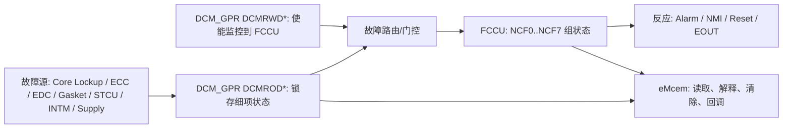
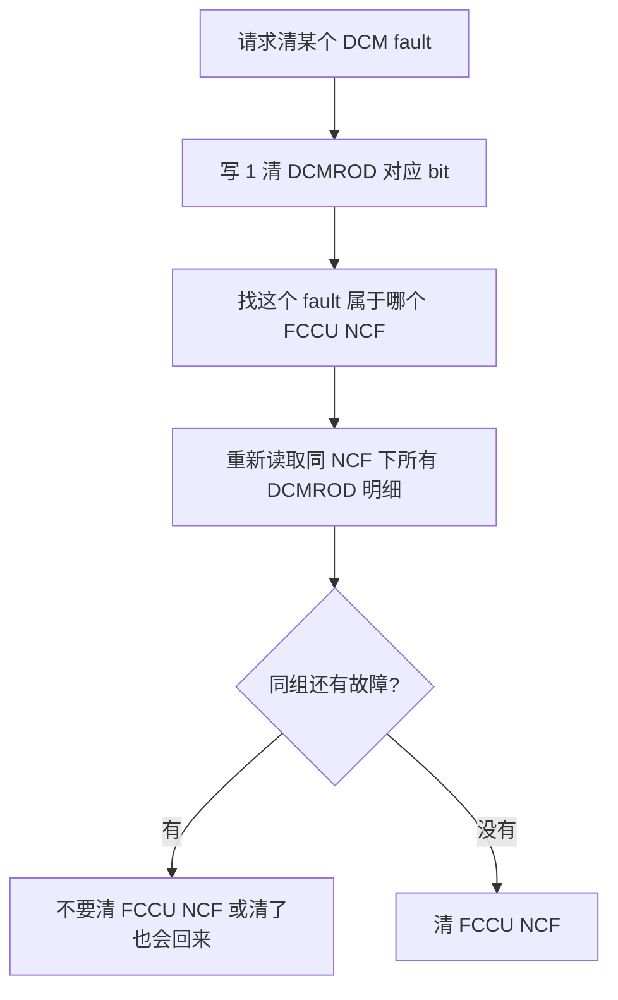
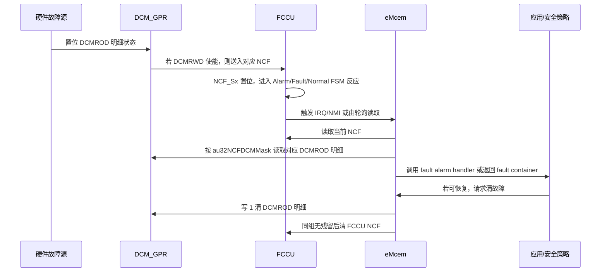
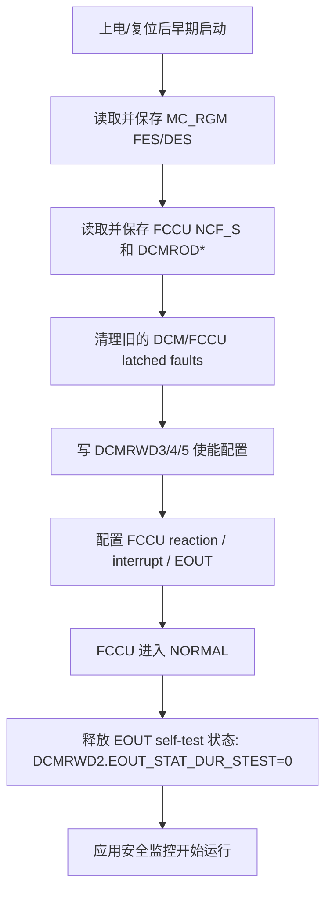
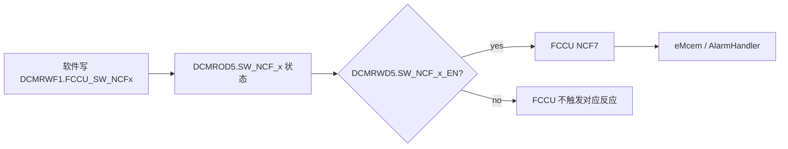

# Chapter 38 Device Configuration Module General-Purpose Registers (DCM_GPR) 学习笔记

> 适用背景：S32K324 / S32K3xx，面向功能安全开发、FCCU/eMcem 联调、复位原因分析、低功耗/启动配置和复习输出。  
> 主要参考：用户提供的 S32K3xx Reference Manual Chapter 38；本工程 `S32K324_DCM_GPR.h`、`S32K324_M7.svd`、S32 SAF/eMcem 代码；NXP S32K3 产品页与 NXP Community 讨论。  
> 说明：S32K3xx 不同型号的 DCM_GPR 字段会有差异。本文以本工程 S32K324 头文件和 eMcem 映射为主；如果你手上的 Reference Manual 版本更新，字段表号可能变化，但学习方法和调试思路不变。

---

## 1. 先用一句话抓住 DCM_GPR

DCM_GPR，全称 **Device Configuration Module General-Purpose Registers**，可以理解成芯片内部的一组“配置与状态小账本”。

它不像 EIM 那样主动制造故障，也不像 FCCU 那样决定复位、拉 EOUT 或进安全状态。它更像安全链路旁边的“明细账”：

```text
故障源真的出问题了       -> DCM_GPR 记录更细的故障原因
某类故障要不要送到 FCCU  -> DCM_GPR 提供使能开关
FCCU 看到的是 NCF 组      -> DCM_GPR 帮你拆开 NCF 背后的具体来源
低功耗/启动/复位配置      -> DCM_GPR 也保存一些芯片配置位
```

开发时最重要的一句话是：

**FCCU 告诉你“哪一组 NCF 出事了”，DCM_GPR 告诉你“这组 NCF 里到底是哪一个硬件细项出事了”。**

---

## 2. 千万别把 DCM_GPR 和 AUTOSAR DCM 搞混

汽车软件里经常看到 `Dcm`，但这里的 DCM_GPR 不是 AUTOSAR Diagnostic Communication Manager。

| 名字 | 全称 | 所属层次 | 作用 |
|---|---|---|---|
| AUTOSAR Dcm | Diagnostic Communication Manager | 诊断通信栈 | 处理 UDS 诊断服务，例如 0x10、0x22、0x19 |
| DCM_GPR | Device Configuration Module General-Purpose Registers | MCU 硬件寄存器 | 芯片配置、复位域状态、FCCU 故障明细、低功耗控制 |

本章的 DCM_GPR 是 **MCU 外设寄存器块**，基地址在本工程头文件中是：

```c
#define IP_DCM_GPR_BASE (0x402AC000u)
```

所以，当你看到 `eMcem_Dcm.c` 里的 `eMcem_Dcm_Init()`，这里的 `Dcm` 指的是 eMcem 对 DCM_GPR 这类硬件安全寄存器的封装，不是 UDS 诊断栈。

---

## 3. DCM_GPR 在安全架构里的位置

先看整体关系，不要一上来就背寄存器名。



老师式理解：

很多安全故障不会一根线一根线直接送到软件。硬件会先把几十个细项归并成 FCCU 的几个 NCF 组。这样 FCCU 的反应配置比较简洁，但调试时你不能只看 FCCU，因为 FCCU 只告诉你“NCF2 组有问题”。至于 NCF2 是 SRAM ECC、TCM ECC、Cache ECC、DMA TCD ECC，还是 HSE RAM ECC，就要回头看 DCM_GPR 的 `DCMROD*` 状态位。

---

## 4. 为什么 S32K3 需要 DCM_GPR

S32K3 是面向汽车功能安全的 MCU，内部安全机制很多：

- Cortex-M7 core lockup。
- Lockstep / RCCU 类比较故障。
- SRAM / TCM / Cache / DMA TCD / HSE RAM ECC。
- Flash ECC / EDC / 地址编码错误。
- 总线、gasket、AXBS、AIPS、QSPI、HSE 等数据通路完整性报警。
- INTM 中断监控错误。
- STCU/BIST/调试意外激活等测试和安全监控错误。
- 供电 Go/Nogo 监控错误。

如果每一个细故障都直接在 FCCU 中单独配置，FCCU 会非常复杂。S32K3 的设计是：

```text
多个细故障源 -> DCM_GPR 记录细节 -> FCCU NCF 组汇总 -> 安全反应
```

这样带来两个好处：

| 好处 | 含义 |
|---|---|
| FCCU 配置更集中 | FCCU 可以按 NCF 组配置反应，比如报警、NMI、功能复位、EOUT |
| 软件诊断更细 | eMcem 或应用软件可以读 DCMROD 明细，知道同一个 NCF 组下的真实来源 |

所以开发时要形成一个习惯：

**看安全故障不要只看 FCCU，也不要只看 DCM_GPR。正确顺序是 FCCU 定组，DCM_GPR 定源，必要时再看 ERM/MC_RGM/异常寄存器补证据。**

---

## 5. 寄存器名字怎么读

DCM_GPR 的寄存器名看起来很绕，其实有规律：

```text
DCM R O D 3
    | | | |
    | | | +-- reset domain / 复位域: D/F/P/PP
    | | +---- access: O = Read Only, W = Read Write
    | +------ Register
    +-------- Device Configuration Module
```

更实用地说，可以这样拆：

| 名字片段 | 含义 | 开发理解 |
|---|---|---|
| `RO` | Read Only | 主要用于读状态、读硬件锁存结果 |
| `RW` | Read Write | 软件可配置或控制 |
| `D` | Destructive Reset domain | 与 destructive reset 域相关 |
| `F` | Functional Reset domain | 与 functional reset 域相关 |
| `P` | Power-On Reset domain | 与 power-on reset 域相关 |
| `PP` | PMCPOR Reset domain | 与 PMC/POR watchdog 相关的状态域 |

几个典型例子：

| 寄存器 | 全名 | 直觉含义 |
|---|---|---|
| `DCMROD3` | Read Only GPR On Destructive Reset Register | destructive reset 域下的只读/状态类寄存器，常用于故障明细 |
| `DCMRWD3` | Read Write GPR On Destructive Reset Register | destructive reset 域下的软件可写配置，常用于故障监控使能 |
| `DCMRWF1` | Read Write GPR On Functional Reset Register | functional reset 域下的软件可写控制，含软件 NCF、低功耗、供电监控等 |
| `DCMROPP1` | Read Only GPR On PMCPOR Reset | POR watchdog 相关只读状态快照 |

**难点：不要把 `On Destructive Reset` 简单理解成“功能复位后一定保留，破坏性复位才清”。**  
实际项目里还要看具体芯片手册、errata、启动代码和故障注入方式。NXP 社区里就有人讨论过 `DCMROD3` 在 FCCU functional reset 后读不到预期值的问题。开发上更稳的做法是：发生故障后尽早读取并保存 `FCCU NCF_S + DCMROD* + MC_RGM FES/DES`，不要把所有希望都寄托在复位后的晚期读取。

---

## 6. 本工程里 DCM_GPR 资料在哪里

本工程和 DCM_GPR 直接相关的文件：

| 文件 | 作用 |
|---|---|
| `BasicSoftware/integration/mcal/src/modules/BaseNXP/header/S32K324_DCM_GPR.h` | S32K324 DCM_GPR 基地址、寄存器布局、字段 mask |
| `BasicSoftware/integration/mcal/src/modules/BaseNXP/header/S32K324_M7.svd` | SVD，字段描述比 C 头文件更像手册文字 |
| `BasicSoftware/integration/mcal/src/modules/Safetybase/SafetyBase_S32K3XX_SAF.h` | SAF 使用的 S32K3XX 通用寄存器结构，eMcem 通过它访问 DCM_GPR |
| `BasicSoftware/integration/mcal/src/modules/eMcem/inc/Reg_eSys_Dcm.h` | eMcem 对 DCMROD 地址的宏定义 |
| `BasicSoftware/integration/mcal/src/modules/eMcem/src/eMcem_Dcm.c` | DCM_GPR 故障读取、清除、注入、软件 NCF 操作 |
| `BasicSoftware/integration/mcal/src/modules/eMcem/src/eMcem_DcmNcfList_S32K3XX.c` | DCMROD 明细位到 FCCU NCF0..NCF7 的映射表 |
| `BasicSoftware/integration/mcal/src/modules/eMcem/inc/eMcem_DcmNcfList_S32K3XX.h` | eMcem 统一 fault ID 定义 |
| `BasicSoftware/integration/mcal/src/modules/Mcu/src/Power_Ip_DCM_GPR.c` | MCU Power driver 对 DCMRWF1/2/5 的配置 |

一个很重要的工程事实：

`S32K324_DCM_GPR.h` 是芯片外设头文件；`SafetyBase_S32K3XX_SAF.h` 是 SAF/eMcem 为 S32K3xx 系列准备的通用安全结构。因此你会看到 eMcem 里按 `DCMROD3..DCMROD8` 六个状态寄存器做数组化处理，而 S32K324 实际有效映射主要由 `au32NCFDCMMask` 决定。不要只凭一个头文件就认为所有系列所有字段都有效。

---

## 7. 寄存器总览

S32K324 DCM_GPR 基地址：

```text
DCM_GPR base = 0x402A_C000
```

本工程 `S32K324_DCM_GPR.h` 暴露的主要寄存器布局：

| 地址偏移 | 寄存器 | 类型 | 主要用途 |
|---:|---|---|---|
| `0x200` | `DCMROD1` | RO/状态 | PCU 隔离、HSE DCF violation、key response ready |
| `0x208` | `DCMROD3` | RO/状态 | NCF0/1/2/3 的部分故障明细 |
| `0x20C` | `DCMROD4` | RO/状态 | NCF2/3/4/5 的部分故障明细 |
| `0x210` | `DCMROD5` | RO/状态 | NCF1/5/6/7 的部分故障明细 |
| `0x300..0x340` | `DCMROF1..17` | RO/状态 | DCF SDID、功能复位域状态 |
| `0x348..0x350` | `DCMROF19..21` | RO/状态 | DCM done、FCCU EOUT dedicated、DCF reset escalation 等 |
| `0x400` | `DCMRWP1` | RW/配置 | standby clockout、POR watchdog 相关配置 |
| `0x408` | `DCMRWP3` | RW/配置 | destructive reset 转 IPI 等 |
| `0x504` | `DCMRWD2` | RW/控制 | `EOUT_STAT_DUR_STEST`，自测试期间 EOUT 状态控制 |
| `0x508` | `DCMRWD3` | RW/使能 | 对应 `DCMROD3` 多数字段的 FCCU 监控使能 |
| `0x50C` | `DCMRWD4` | RW/使能 | 对应 `DCMROD4` 多数字段的 FCCU 监控使能 |
| `0x510` | `DCMRWD5` | RW/使能 | 对应 `DCMROD5` 多数字段的 FCCU 监控使能 |
| `0x514` | `DCMRWD6` | RW/配置 | CM7_0 调试时各外设 debug disable |
| `0x51C` | `DCMRWD8` | RW/配置 | CM7_1 调试时各外设 debug disable |
| `0x600` | `DCMRWF1` | RW/控制 | CAN timestamp、软件 NCF、低功耗 IO、供电监控 |
| `0x604` | `DCMRWF2` | RW/控制 | standby exit 后 DCM scanning/trim bypass、HSE gasket bypass |
| `0x60C` | `DCMRWF4` | RW/控制 | 其他功能复位域控制 |
| `0x610` | `DCMRWF5` | RW/控制 | Fast Standby boot mode 和 boot address |
| `0x700..0x70C` | `DCMROPP1..4` | RO/状态 | POR watchdog 溢出时捕获的复位/流程状态 |

**重点：学 Chapter 38 不要把所有寄存器同等背诵。开发上最常用、最容易和 FCCU 联动的是 `DCMROD3/4/5 + DCMRWD3/4/5 + DCMRWF1`。**

---

## 8. 核心概念一：DCMROD 是故障明细状态

`DCMROD*` 这组寄存器主要用来记录硬件故障明细。它们的字段描述常常写着：

```text
Read this bit to identify the reason of fault in case of FCCU NCF x.
```

翻译成开发语言就是：

**当 FCCU 的某个 NCF 组置位时，你读对应的 DCMROD 位，判断这个 NCF 是由哪个细故障源引起的。**

### 8.1 DCMROD3：Core lockup、gasket/AXBS/EDC、SRAM/Cache ECC、生命周期错误

`DCMROD3` 是非常重要的状态寄存器，典型字段如下：

| bit | 字段 | 所属 NCF | 含义 |
|---:|---|---:|---|
| 0 | `CM7_0_LOCKUP` | NCF0 | CM7_0 core lockup |
| 1 | `CM7_1_LOCKUP` | NCF0 | CM7_1 core lockup |
| 2 | `HSE_LOCKUP` | NCF0 | HSE core lockup |
| 5 | `TCM_GSKT_ALARM` | NCF1 | TCM IAHB gasket monitor alarm |
| 6 | `DMA_SYS_GSKT_ALARM` | NCF1 | DMA system AXBS IAHB gasket alarm |
| 7 | `DMA_PERIPH_GSKT_ALARM` | NCF1 | DMA peripheral AXBS IAHB gasket alarm |
| 8 | `SYS_AXBS_ALARM` | NCF1 | System AXBS safety alarm |
| 9 | `DMA_AXBS_ALARM` | NCF1 | DMA AXBS_Lite safety alarm |
| 11 | `HSE_GSKT_ALARM` | NCF1 | HSE IAHB gasket alarm |
| 12 | `QSPI_GSKT_ALARM` | NCF1 | QSPI IAHB gasket alarm |
| 13 | `AIPS1_GSKT_ALARM` | NCF1 | AIPS1 IAHB gasket alarm |
| 14 | `AIPS2_GSKT_ALARM` | NCF1 | AIPS2 IAHB gasket alarm |
| 15 | `ADDR_EDC_ERR` | NCF1 | 地址完整性错误 |
| 16 | `DATA_EDC_ERR` | NCF1 | 数据完整性错误 |
| 17 | `TCM_AXBS_ALARM` | NCF1 | TCM AHB splitter safety alarm |
| 18 | `EMAC_GSKT_ALARM` | NCF1 | EMAC IAHB gasket alarm |
| 19 | `PERIPH_AXBS_ALARM` | NCF1 | Peripheral AXBS_Lite safety alarm |
| 22 | `LC_ERR` | NCF3 | Lifecycle scanning error |
| 24 | `PRAM1_ECC_ERR` | NCF2 | SRAM1 multi-bit ECC error |
| 25 | `PRAM0_ECC_ERR` | NCF2 | SRAM0 multi-bit ECC error |
| 26 | `CM7_0_DCDATA_ECC_ERR` | NCF2 | CM7_0 D-cache data ECC multi-bit |
| 27 | `CM7_1_DCDATA_ECC_ERR` | NCF2 | CM7_1 D-cache data ECC multi-bit |
| 28 | `CM7_0_DCTAG_ECC_ERR` | NCF2 | CM7_0 D-cache tag ECC multi-bit |
| 29 | `CM7_1_DCTAG_ECC_ERR` | NCF2 | CM7_1 D-cache tag ECC multi-bit |
| 30 | `CM7_0_ICDATA_ECC_ERR` | NCF2 | CM7_0 I-cache data ECC multi-bit |
| 31 | `CM7_1_ICDATA_ECC_ERR` | NCF2 | CM7_1 I-cache data ECC multi-bit |

老师式理解：

`DCMROD3` 前半段偏“总线/完整性/gasket”，后半段偏“SRAM/cache ECC”。如果 FCCU 报 NCF1，大概率去看 bit5..19；如果 FCCU 报 NCF2，大概率去看 bit24..31。

### 8.2 DCMROD4：TCM/DMA/HSE RAM ECC、Flash 错误、供电 Go/Nogo、测试激活

`DCMROD4` 典型字段：

| bit | 字段 | 所属 NCF | 含义 |
|---:|---|---:|---|
| 0 | `CM7_0_ICTAG_ECC_ERR` | NCF2 | CM7_0 I-cache tag ECC multi-bit |
| 1 | `CM7_1_ICTAG_ECC_ERR` | NCF2 | CM7_1 I-cache tag ECC multi-bit |
| 2 | `CM7_0_ITCM_ECC_ERR` | NCF2 | CM7_0 ITCM uncorrectable ECC |
| 3 | `CM7_0_DTCM0_ECC_ERR` | NCF2 | CM7_0 DTCM0 uncorrectable ECC |
| 4 | `CM7_0_DTCM1_ECC_ERR` | NCF2 | CM7_0 DTCM1 uncorrectable ECC |
| 5 | `CM7_1_ITCM_ECC_ERR` | NCF2 | CM7_1 ITCM uncorrectable ECC |
| 6 | `CM7_1_DTCM0_ECC_ERR` | NCF2 | CM7_1 DTCM0 uncorrectable ECC |
| 7 | `CM7_1_DTCM1_ECC_ERR` | NCF2 | CM7_1 DTCM1 uncorrectable ECC |
| 8 | `DMA_TCD_RAM_ECC_ERR` | NCF2 | DMA TCD memory uncorrectable ECC |
| 9 | `PRAM0_FCCU_ALARM` | NCF2 | PRAM0 safety alarm |
| 10 | `PRAM1_FCCU_ALARM` | NCF2 | PRAM1 safety alarm |
| 11 | `HSE_RAM_ECC_ERR` | NCF2 | HSE RAM uncorrectable ECC |
| 12 | `PF0_CODE_ECC_ERR` | NCF3 | Flash0 code ECC uncorrectable |
| 13 | `PF0_DATA_ECC_ERR` | NCF3 | Flash0 data ECC uncorrectable |
| 14 | `PF1_CODE_ECC_ERR` | NCF3 | Flash1 code ECC uncorrectable |
| 15 | `PF1_DATA_ECC_ERR` | NCF3 | Flash1 data ECC uncorrectable |
| 16 | `PF2_CODE_ECC_ERR` | NCF3 | Flash2 code ECC uncorrectable |
| 17 | `PF2_DATA_ECC_ERR` | NCF3 | Flash2 data ECC uncorrectable |
| 18 | `FLASH_EDC_ERR` | NCF3 | Flash ECC correction error through EDC |
| 19 | `FLASH_ADDR_ENC_ERR` | NCF3 | Flash address encode error |
| 20 | `FLASH_REF_ERR` | NCF3 | Flash reference current/read voltage error |
| 21 | `FLASH_RST_ERR` | NCF3 | Flash reset error |
| 22 | `FLASH_SCAN_ERR` | NCF3 | DCM flash scanning invalid data |
| 24 | `FLASH_ACCESS_ERR` | NCF3 | Flash controller transaction monitor mismatch |
| 26 | `VDD1P1_GNG_ERR` | NCF4 | VDD1P1 Go/Nogo indicator |
| 27 | `VDD2P5_GNG_ERR` | NCF4 | VDD_HV_FLA Go/Nogo indicator |
| 29 | `TEST_ACTIVATION_0_ERR` | NCF5 | accidental partial test activation |
| 30 | `TEST_ACTIVATION_1_ERR` | NCF5 | accidental partial test activation |

老师式理解：

`DCMROD4` 很像“存储器和 Flash 安全故障表”。如果你调 EIM/ERM 后看到 NCF2，优先看 `DCMROD3[31:24]` 和 `DCMROD4[11:0]`。如果看到 NCF3，优先看 Flash 相关 bit。

### 8.3 DCMROD5：INTM、软件 NCF、STCU/BIST/调试、读数据 EDC

`DCMROD5` 典型字段：

| bit | 字段 | 所属 NCF | 含义 |
|---:|---|---:|---|
| 1 | `INTM_0_ERR` | NCF6 | Interrupt monitor0 error |
| 2 | `INTM_1_ERR` | NCF6 | Interrupt monitor1 error |
| 3 | `INTM_2_ERR` | NCF6 | Interrupt monitor2 error |
| 4 | `INTM_3_ERR` | NCF6 | Interrupt monitor3 error |
| 5 | `SW_NCF_0` | NCF7 | Software NCF0 status |
| 6 | `SW_NCF_1` | NCF7 | Software NCF1 status |
| 7 | `SW_NCF_2` | NCF7 | Software NCF2 status |
| 8 | `SW_NCF_3` | NCF7 | Software NCF3 status |
| 9 | `STCU_NCF` | NCF5 | STCU non-critical fault / BIST result error |
| 10 | `MBIST_ACTIVATION_ERR` | NCF5 | accidental backdoor access on memories |
| 11 | `STCU_BIST_USER_CF` | NCF5 | L/M BIST accidentally enabled |
| 12 | `MTR_BUS_ERR` | NCF5 | illegal access on MTR |
| 13 | `DEBUG_ACTIVATION_ERR` | NCF5 | unintended debug activation |
| 14 | `TCM_RDATA_EDC_ERR` | NCF1 | TCM read data EDC error |
| 15 | `EMAC_RDATA_EDC_ERR` | NCF1 | EMAC read data EDC error |
| 17 | `DMA_RDATA_EDC_ERR` | NCF1 | eDMA read data EDC error |
| 18 | `CM7_1_AHBP_RDATA_EDC_ERR` | NCF1 | CM7_1 peripheral read data integrity error |
| 19 | `CM7_1_AHBM_RDATA_EDC_ERR` | NCF1 | CM7_1 main read data integrity error |
| 20 | `CM7_0_AHBP_RDATA_EDC_ERR` | NCF1 | CM7_0 peripheral read data integrity error |
| 21 | `CM7_0_AHBM_RDATA_EDC_ERR` | NCF1 | CM7_0 main read data integrity error |
| 22 | `HSE_RDATA_EDC_ERR` | NCF1 | HSE read data EDC error |

这里最值得记的是：

```text
DCMRWF1[FCCU_SW_NCF0..3] 触发软件 NCF
DCMROD5[SW_NCF_0..3]     记录软件 NCF 状态
DCMRWD5[SW_NCF_0..3_EN]  决定软件 NCF 是否送到 FCCU NCF7
```

---

## 9. 核心概念二：DCMRWD 是故障监控使能

`DCMRWD3/4/5` 和 `DCMROD3/4/5` 是一对非常重要的对应关系。

可以粗略理解为：

```text
DCMROD3/4/5 = 故障状态/原因
DCMRWD3/4/5 = 这些故障要不要被 FCCU 监控
```

SVD 里很多 `DCMRWD*` 字段的描述都是：

```text
Enable bit for enabling the fault monitoring at FCCU NCF x for the fault: ...
```

这句话很关键。它说明 `DCMRWD` 不是普通业务配置，而是安全故障路由的门控。

### 9.1 DCMRWD3 对应 DCMROD3

例如：

| 状态位 | 使能位 | 所属 NCF |
|---|---|---:|
| `DCMROD3.CM7_0_LOCKUP` | `DCMRWD3.CM7_0_LOCKUP_EN` | NCF0 |
| `DCMROD3.TCM_GSKT_ALARM` | `DCMRWD3.TCM_GSKT_ALARM_EN` | NCF1 |
| `DCMROD3.ADDR_EDC_ERR` | `DCMRWD3.ADDR_EDC_ERR_EN` | NCF1 |
| `DCMROD3.PRAM0_ECC_ERR` | `DCMRWD3.PRAM0_ECC_ERR_EN` | NCF2 |
| `DCMROD3.LC_ERR` | `DCMRWD3.LC_ERR_EN` | NCF3 |

### 9.2 DCMRWD4 对应 DCMROD4

例如：

| 状态位 | 使能位 | 所属 NCF |
|---|---|---:|
| `DCMROD4.CM7_0_ITCM_ECC_ERR` | `DCMRWD4.CM7_0_ITCM_ECC_ERR_EN` | NCF2 |
| `DCMROD4.DMA_TCD_RAM_ECC_ERR` | `DCMRWD4.DMA_TCD_RAM_ECC_ERR_EN` | NCF2 |
| `DCMROD4.PF0_CODE_ECC_ERR` | `DCMRWD4.PF0_CODE_ECC_ERR_EN` | NCF3 |
| `DCMROD4.FLASH_ACCESS_ERR` | `DCMRWD4.FLASH_ACCESS_ERR_EN` | NCF3 |
| `DCMROD4.VDD1P1_GNG_ERR` | `DCMRWD4.VDD1P1_GNG_ERR_EN` | NCF4 |
| `DCMROD4.TEST_ACTIVATION_0_ERR` | `DCMRWD4.TEST_ACTIVATION_0_ERR_EN` | NCF5 |

### 9.3 DCMRWD5 对应 DCMROD5

例如：

| 状态位 | 使能位 | 所属 NCF |
|---|---|---:|
| `DCMROD5.INTM_0_ERR` | `DCMRWD5.INTM_0_ERR_EN` | NCF6 |
| `DCMROD5.SW_NCF_0` | `DCMRWD5.SW_NCF_0_EN` | NCF7 |
| `DCMROD5.STCU_NCF` | `DCMRWD5.STCU_NCF_EN` | NCF5 |
| `DCMROD5.DEBUG_ACTIVATION_ERR` | `DCMRWD5.DEBUG_ACTIVATION_ERR_EN` | NCF5 |
| `DCMROD5.TCM_RDATA_EDC_ERR` | `DCMRWD5.TCM_RDATA_EDC_ERR_EN` | NCF1 |

**重点：量产项目不要随手改 `DCMRWD3/4/5`。你以为只是关掉一个烦人的 fault，实际可能是在降低安全覆盖率。**

---

## 10. DCM_GPR 到 FCCU NCF 的映射

FCCU 的 NCF 是按组来的。S32K324 工程里 eMcem 使用 `au32NCFDCMMask` 把 DCMROD 明细位映射到 FCCU NCF0..NCF7。

本工程 S32K324 映射如下：

| FCCU NCF | `DCMROD3` mask | `DCMROD4` mask | `DCMROD5` mask | 主要故障类型 |
|---:|---:|---:|---:|---|
| NCF0 | `0x00000007` | `0x00000000` | `0x00000000` | CM7/HSE lockup |
| NCF1 | `0x000FFBE0` | `0x00000000` | `0x007EC000` | gasket、AXBS、地址/数据/读数据 EDC |
| NCF2 | `0xFF000000` | `0x00000FFF` | `0x00000000` | SRAM、cache、TCM、DMA TCD、HSE RAM ECC |
| NCF3 | `0x00400000` | `0x027FF000` | `0x00000000` | lifecycle、Flash ECC/EDC/scan/access |
| NCF4 | `0x00000000` | `0x0C000000` | `0x00000000` | supply Go/Nogo |
| NCF5 | `0x00000000` | `0x60000000` | `0x00003E01` | STCU/BIST/MTR/debug/test activation |
| NCF6 | `0x00000000` | `0x00000000` | `0x0000001E` | INTM0..3 |
| NCF7 | `0x00000000` | `0x00000000` | `0x000001E0` | Software NCF0..3 |

eMcem 的完整数组是 6 个 DCMROD slot 一组：

```text
NCF0: ROD3 0x00000007, ROD4 0x00000000, ROD5 0x00000000, ROD6 0x00000000, ROD7 0x00000000, ROD8 0x00000000
NCF1: ROD3 0x000FFBE0, ROD4 0x00000000, ROD5 0x007EC000, ROD6 0x00000000, ROD7 0x0000001B, ROD8 0x00000000
NCF2: ROD3 0xFF000000, ROD4 0x00000FFF, ROD5 0x00000000, ROD6 0x00000000, ROD7 0x00000000, ROD8 0x00000000
NCF3: ROD3 0x00400000, ROD4 0x027FF000, ROD5 0x00000000, ROD6 0x00000000, ROD7 0x00000000, ROD8 0x00000000
NCF4: ROD3 0x00000000, ROD4 0x0C000000, ROD5 0x00000000, ROD6 0x00000000, ROD7 0x00000000, ROD8 0x00000000
NCF5: ROD3 0x00000000, ROD4 0x60000000, ROD5 0x00003E01, ROD6 0x00000000, ROD7 0x00000000, ROD8 0x00000000
NCF6: ROD3 0x00000000, ROD4 0x00000000, ROD5 0x0000001E, ROD6 0x00000000, ROD7 0x00000000, ROD8 0x00000000
NCF7: ROD3 0x00000000, ROD4 0x00000000, ROD5 0x000001E0, ROD6 0x00000000, ROD7 0x00000000, ROD8 0x00000000
```

**难点：同一个 FCCU NCF 可能对应多个 DCMROD 位。清除 FCCU NCF 前，要确认这个 NCF 组下所有相关 DCM 明细都清掉了，否则你清了 FCCU，马上又被同组未清的 DCM 明细顶回来。**

---

## 11. eMcem 是怎么用 DCM_GPR 的

本工程里 eMcem 对 DCM_GPR 的封装非常值得看，因为它就是量产安全软件的使用方式。

### 11.1 初始化：清状态，再写使能

`eMcem_Dcm_Init()` 做两件事：

```c
void eMcem_Dcm_Init(const uint32 *const au32DcmEnable)
{
    DCM_GPR.DCMROD3.R = 0xFFFFFFFFUL;
    DCM_GPR.DCMROD4.R = 0xFFFFFFFFUL;
    DCM_GPR.DCMROD5.R = 0xFFFFFFFFUL;
    DCM_GPR.DCMROD6.R = 0xFFFFFFFFUL;
    DCM_GPR.DCMROD7.R = 0xFFFFFFFFUL;
    DCM_GPR.DCMROD8.R = 0xFFFFFFFFUL;

    DCM_GPR.DCMRWD3.R = au32DcmEnable[0];
    DCM_GPR.DCMRWD4.R = au32DcmEnable[1];
    DCM_GPR.DCMRWD5.R = au32DcmEnable[2];
    DCM_GPR.DCMRWD14.R = au32DcmEnable[3];
    DCM_GPR.DCMRWD15.R = au32DcmEnable[4];
}
```

这里有一个容易误会的点：

`DCMROD*` 名字里有 `Read Only`，但 eMcem 会向它写 `1` 来清除故障状态。这类状态寄存器在安全代码里按 **write-one-to-clear** 的方式处理。

**易错点：不要用普通变量赋值思维去写 `DCMROD*`。写 1 可能表示清除对应状态；写 0 通常不是“清零所有位”。**

### 11.2 读取：读 DCMROD，再按静态 mask 过滤

`eMcem_Dcm_GetErrors()` 会读取 DCMROD 状态，并与 `eMcem_au32StaticFaultMasks[]` 做过滤：

```c
pFaultContainer[0] = (DCM_GPR.DCMROD3.R | au32InjectedFaults[0]) & eMcem_au32StaticFaultMasks[0];
pFaultContainer[1] = (DCM_GPR.DCMROD4.R | au32InjectedFaults[1]) & eMcem_au32StaticFaultMasks[1];
pFaultContainer[2] = (DCM_GPR.DCMROD5.R | au32InjectedFaults[2]) & eMcem_au32StaticFaultMasks[2];
```

这说明 eMcem 看 DCM_GPR 时不是裸读就上报，而是会结合配置 mask。工程上你也应该这么想：

```text
raw DCMROD 状态
  -> 按芯片有效 bit 过滤
  -> 按 FCCU NCF 组过滤
  -> 交给 alarm handler / diagnostic container
```

### 11.3 eMcem_GetErrors：只有 FCCU 对应 NCF 还活跃，DCM 明细才保留

`eMcem_GetErrors_Int()` 会先读 FCCU faults，再读 DCM faults。然后它会把没有对应 FCCU NCF 的 DCM bits 过滤掉。

这一步非常聪明：

```text
如果 DCMROD 某 bit 置位，但对应 FCCU NCF 没置位
    eMcem 会把这个 DCM bit mask 掉
```

这样可以避免“孤立状态位”误导软件。调试时如果你裸读 DCMROD 和 eMcem API 结果不一致，不一定是 bug，可能是 eMcem 依据 FCCU 状态做了二次过滤。

### 11.4 清除：先清 DCM 明细，再判断是否能清 FCCU NCF

`eMcem_ClearFaults_Int()` 的逻辑很关键：

1. 先清指定 DCM fault bit。
2. 根据 `au8NCFIdList[nFaultId]` 找到它属于哪个 NCF。
3. 再读一遍 DCM faults。
4. 如果这个 NCF 组下没有残留 DCM 明细，才清 FCCU NCF。
5. 如果同组还有别的 DCM 明细，就保留 FCCU NCF。

这就是实际项目中推荐的清故障思路：



**重点：FCCU 是组状态，DCM_GPR 是细项状态。清故障一定要按“细项 -> 组”的逻辑考虑。**

### 11.5 FCCU ISR：用 NCF 找对应 DCMROD 明细

FCCU alarm handler 中，eMcem 会遍历 DCMROD register：

```c
u32RegisterValue =
    (SAFETYBASE_REG_READ32(DCM_DCMROD_ADDR32(u8DCMRegIndex)) |
     au32InjectedFaults[u8DCMRegIndex]) &
    au32NCFDCMMask[(u8FccuFaultId * DCM_FAULT_REGISTER_COUNT) + u8DCMRegIndex];
```

这段代码就是 DCM_GPR 学习的“灵魂”：

```text
当前 FCCU fault id 是 u8FccuFaultId
  -> 去 au32NCFDCMMask 找这个 NCF 对应哪些 DCMROD bits
  -> 读 DCMROD 状态
  -> 只处理当前 NCF 相关的 bit
```

---

## 12. DCMRWF1：软件 NCF 和其他功能控制

`DCMRWF1` 是一个功能比较杂但开发上很常见的寄存器。

| bit | 字段 | 含义 |
|---:|---|---|
| 0 | `CAN_TIMESTAMP_SEL` | CAN timestamp 源选择 |
| 1 | `CAN_TIMESTAMP_EN` | FlexCAN timestamp 使能 |
| 2 | `FCCU_SW_NCF0` | 触发软件 NCF0 到 FCCU |
| 3 | `FCCU_SW_NCF1` | 触发软件 NCF1 到 FCCU |
| 4 | `FCCU_SW_NCF2` | 触发软件 NCF2 到 FCCU |
| 5 | `FCCU_SW_NCF3` | 触发软件 NCF3 到 FCCU |
| 7 | `RMII_MII_SEL` | Ethernet MII/RMII 选择 |
| 15 | `VDD_HV_B_IO_CTRL_LATCH` | 低频 RUN 下 IO 控制锁存 |
| 16 | `STANDBY_IO_CONFIG` | Standby mode IO 状态控制 |
| 20 | `SUPPLY_MON_EN` | ADC supply voltage monitoring 使能 |
| 21:23 | `SUPPLY_MON_SEL` | ADC 供电监控源选择 |
| 24 | `VSS_LV_ANMUX_EN` | VSS_LV monitoring |
| 25 | `VDD_HV_A_VLT_DVDR_EN` | VDD_HV_A 分压监控 |
| 26 | `VDD_HV_B_VLT_DVDR_EN` | VDD_HV_B 分压监控 |
| 27 | `VDD_1_5_VLT_DVDR_EN` | VDD1P5 分压监控 |

### 12.1 软件 NCF 怎么触发

eMcem 触发软件 NCF 的代码：

```c
void eMcem_Dcm_AssertSWFault(uint8 u8SwFaultId)
{
    DCM_GPR.DCMRWF1.R |= (4UL << u8SwFaultId);
}
```

因为 `FCCU_SW_NCF0` 从 bit2 开始，所以 `4UL << u8SwFaultId` 正好对应 bit2..bit5。

取消软件 NCF：

```c
void eMcem_Dcm_DeassertSWFault(uint8 u8SwFaultId)
{
    DCM_GPR.DCMRWF1.R &= ~(4UL << u8SwFaultId);
}
```

对应关系：

| `u8SwFaultId` | DCMRWF1 bit | DCMROD5 状态 | FCCU NCF |
|---:|---:|---|---:|
| 0 | bit2 `FCCU_SW_NCF0` | bit5 `SW_NCF_0` | NCF7 |
| 1 | bit3 `FCCU_SW_NCF1` | bit6 `SW_NCF_1` | NCF7 |
| 2 | bit4 `FCCU_SW_NCF2` | bit7 `SW_NCF_2` | NCF7 |
| 3 | bit5 `FCCU_SW_NCF3` | bit8 `SW_NCF_3` | NCF7 |

**易错点：eMcem 宏名里有 `EMCEM_DCM_NCF_7_SW_NCF_1`，注释对应的是硬件 `Software NCF0`。也就是说 eMcem fault ID 命名从 1 写到 4，但硬件字段是 SW_NCF0 到 SW_NCF3。调试时不要被名字绕进去。**

### 12.2 DCMRWF1 也被 MCU Power driver 使用

本工程 `Power_Ip_DCM_GPR_GlobalPadkeepingConfig()` 会改：

```c
DCMRWF1[STANDBY_IO_CONFIG]
```

`Power_Ip_DCM_GPR_PMICBypasses()` 会改：

```c
DCMRWF1[PMIC_PGOOD_HNDSHK_BYP]
```

所以 `DCMRWF1` 不是 eMcem 独占寄存器。你在安全测试里改软件 NCF bit 时，要避免破坏低功耗、CAN timestamp、供电监控等其他字段。正确做法是按 mask 做 read-modify-write。

---

## 13. DCMRWD2：EOUT_STAT_DUR_STEST

`DCMRWD2` 对开发很关键的字段是：

```text
DCMRWD2[7] EOUT_STAT_DUR_STEST
```

SVD 描述为控制 self-test 期间 EOUT 状态。

本工程 eMcem FCCU 初始化后会做：

```c
DCM_GPR.DCMRWD2.B.EOUT_STAT_DUR_STEST = 0U;
```

注释是：

```text
Release EOUT pins
```

老师式理解：

FCCU 的 EOUT 引脚是对外安全状态输出。自测试期间，为了避免外部安全监控误判，硬件可能让 EOUT 处于某种受控状态。自测试/初始化结束后，软件要释放 EOUT，让它回到正常 FCCU 控制逻辑。否则你可能遇到：

```text
软件看起来初始化完成了
但外部安全引脚状态不对
或系统一直被外部 PMIC/安全监控认为处在 fault 状态
```

---

## 14. DCMRWF2 和 DCMRWF5：低功耗/启动相关

DCM_GPR 不只管安全故障，也参与低功耗和启动配置。

### 14.1 DCMRWF2：Standby exit 相关 bypass

`DCMRWF2` 典型字段：

| bit | 字段 | 含义 |
|---:|---|---|
| 3 | `DCM_SCAN_BYP_STDBY_EXT` | Standby exit 后是否 bypass DCM scanning |
| 4 | `FIRC_TRIM_BYP_STDBY_EXT` | Standby exit 后是否 bypass FIRC trimming |
| 5 | `PMC_TRIM_RGM_DCF__BYP_STDBY_EXT` | Standby exit 后是否 bypass PMC trimming 和 RGM DCF loading |
| 6 | `SIRC_TRIM_BYP_STDBY_EXT` | Standby exit 后是否 bypass SIRC trimming |
| 16 | `HSE_GSKT_BYPASS` | Standby 退出后 HSE IAHB gasket 行为控制 |

本工程 `Power_Ip_DCM_GPR_Config()` 会读取 `DCMRWF2`，清掉可写 bit mask，再写入 `ConfigRegister`。

### 14.2 DCMRWF5：Fast Standby boot mode 和 boot address

`DCMRWF5` 字段：

| bit | 字段 | 含义 |
|---:|---|---|
| 0 | `BOOT_MODE` | Standby 退出后的 boot mode |
| 1:31 | `BOOT_ADDRESS` | Fast Standby mode 下 CM7_0 使用的 vector table base address |

本工程逻辑：

```c
if (1U == ConfigPtr->BootMode)
{
    IP_DCM_GPR->DCMRWF5 = ConfigPtr->BootAddress | ConfigPtr->BootMode;
}
else
{
    IP_DCM_GPR->DCMRWF5 = 0U;
}
```

开发理解：

如果项目用了 Fast Standby，这个寄存器会影响 standby exit 后从哪里恢复/启动。它和安全故障不是一类问题，但都在 DCM_GPR 里，所以看寄存器时不要把所有字段都归到 FCCU。

---

## 15. DCMRWD6 / DCMRWD8：调试行为控制

`DCMRWD6` 对 CM7_0，`DCMRWD8` 对 CM7_1，里面有很多：

```text
xxx_DBG_DIS_CM7_0
xxx_DBG_DIS_CM7_1
```

例如：

- `FCCU_DBG_DIS_CM7_0`
- `EDMA_DBG_DIS_CM7_0`
- `STM0_DBG_DIS_CM7_0`
- `FLEXCAN0_DBG_DIS_CM7_0`
- `FCCU_DBG_DIS_CM7_1`

字段描述大意是：设置为 1 后，当对应 core 进入 debug mode 时，该 IP 不受 debug 影响，保持功能运行。

这类字段在调试安全故障时很重要。因为你用调试器 halt core，硬件安全机制可能继续跑，也可能进入 debug 相关状态。如果配置不合适，你会看到一些“只在调试器下发生”的故障，比如 watchdog、timer、FCCU、debug activation 相关问题。

**易错点：调试器不是透明的。安全机制调试时，要记录是否连接 debugger、是否 halt、是否单步、相关 DBG_DIS 位怎么配。**

---

## 16. DCMROF / DCMRWP / DCMROPP 怎么理解

这些寄存器不是本章功能安全调试的主战场，但需要知道它们是什么。

### 16.1 DCMROF：功能复位域只读状态

典型字段：

| 寄存器 | 字段 | 含义 |
|---|---|---|
| `DCMROF1` | `EMAC_MDC_CHID_0/1` | EMAC DMA channel ID status |
| `DCMROF2..17` | `DCF_SDID0..15` | DCF client SDID 配置状态 |
| `DCMROF19` | `DCM_DONE` | DCM done |
| `DCMROF19` | `FCCU_EOUT_DEDICATED` | FCCU EOUT dedicated 状态 |
| `DCMROF20/21` | `DCF_DEST_RST_ESC` | destructive reset escalation 的 DCF 配置信息 |

老师式理解：

`DCMROF*` 更像芯片配置/DCF 加载后的只读观察窗口。它帮助你确认某些 device configuration fuse/DCF 的结果，而不是像 `DCMROD3/4/5` 那样主要用来拆 FCCU NCF 故障原因。

### 16.2 DCMRWP：Power-On Reset 域配置

典型字段：

| 寄存器 | 字段 | 含义 |
|---|---|---|
| `DCMRWP1` | `CLKOUT_STANDBY` | standby clockout |
| `DCMRWP1` | `STANBDY_PWDOG_DIS` | standby entry/exit POR watchdog window disable |
| `DCMRWP1` | `POR_WDOG_TRIM` | POR watchdog timeout trim |
| `DCMRWP3` | `DEST_RST9_AS_IPI` | destructive reset 9 配置为 interrupt |

这类字段和 reset/low-power 流程有关。不是每个项目都会直接改它，通常由 MCAL/配置工具生成。

### 16.3 DCMROPP：POR watchdog 状态快照

`DCMROPP1..4` 捕获 POR watchdog overflow 时的一些流程状态和 RGM 事件状态。

开发上什么时候看它？

```text
系统像是卡在 reset / standby entry / standby exit
怀疑 POR watchdog 参与了复位
需要知道 POR watchdog 溢出时芯片流程走到哪一步
```

---

## 17. 从故障发生到软件处理的完整流程

把前面的概念串起来：



这张图要反复看，因为它解释了大多数调试现象：

- 只看 FCCU，只能知道 NCF 组。
- 只看 DCMROD，不知道 FCCU 是否还认为它是有效故障。
- 只清 FCCU，不清 DCMROD，故障可能又回来。
- 只清 DCMROD，不清 FCCU，FCCU 状态可能还挂着。
- DCMRWD 没使能，故障可能不会进入 FCCU 反应链。

---

## 18. 开发时推荐的初始化流程

一个典型安全初始化流程可以这样理解：



这里有一个关键顺序：

**保存复位和故障证据要尽量早，清故障要在证据保存之后。**

很多项目启动时会很快初始化 eMcem，而 `eMcem_Dcm_Init()` 会写 `0xFFFFFFFF` 清 DCMROD。如果你的应用还没来得及保存故障明细，证据就没了。量产项目通常需要一个非常早期的 reset/fault snapshot 机制，把以下信息保存到保留 RAM、诊断 RAM 或 NVM：

- `MC_RGM.FES`
- `MC_RGM.DES`
- `FCCU.NCF_Sx`
- `DCMROD3/4/5`
- 必要时加 ERM status、SCB fault status、fault address

---

## 19. 软件 NCF 测试怎么做

软件 NCF 常用于验证 FCCU/eMcem 软件通路，不需要真实硬件 ECC/EDC 故障。

典型步骤：

1. 使能 `DCMRWD5.SW_NCF_x_EN`，让软件 NCF 能送到 FCCU NCF7。
2. 配置 FCCU NCF7 的 reaction，比如 Alarm interrupt。
3. 设置 `DCMRWF1.FCCU_SW_NCFx = 1`。
4. 观察 `FCCU NCF7` 是否置位。
5. 观察 `DCMROD5.SW_NCF_x` 是否置位。
6. eMcem alarm handler 是否被调用。
7. 清 `DCMRWF1.FCCU_SW_NCFx`。
8. 写 1 清 `DCMROD5.SW_NCF_x`。
9. 清 FCCU NCF7。

用一张图表示：



**重点：软件 NCF 是测试 FCCU/eMcem 反应链的好工具，但它不能证明 ECC、EDC、gasket 这些真实检测器健康。要验证检测器本身，仍然要用 EIM 或真实源头注入。**

---

## 20. 三种“故障注入”不要混淆

安全调试里很容易混淆下面三种注入：

| 注入方式 | 注入位置 | DCMROD 是否一定有真实硬件状态 | 能验证什么 |
|---|---|---|---|
| EIM 注入 | ECC/EDC/gasket 等上游通路 | 通常能触发对应硬件链路，但要看目标源 | 检测器 + DCM + FCCU + eMcem |
| DCM/eMcem 虚拟注入 | eMcem 辅助数组 `au32InjectedFaults` | 不一定写入真实 DCMROD | 软件处理路径、alarm handler |
| FCCU fake fault / NCFF | FCCU 输入侧或 FCCU 内部 | 不会“反向”填 DCMROD | FCCU reaction path |

NXP 社区也提到过类似现象：通过 FCCU 注入的 fault 只会让 FCCU 状态看到故障，不会从 FCCU 反向传播到 `DCMROD3`，所以不能用它证明完整源头链路。

老师式总结：

```text
想测 FCCU 反应             -> 可以用 FCCU fake fault / software NCF
想测 eMcem handler         -> 可以用 eMcem 虚拟注入
想测 ECC/EDC/gasket 检测器 -> 要从源头注入，例如 EIM 或真实访问触发
```

---

## 21. 常见调试场景

### 21.1 eMcem 初始化后 FCCU 进 FAULT，不进 NORMAL

现象：

```text
eMcem_Init 过程中 FCCU 从 CONFIG 回 NORMAL 失败
或一保存配置就进 FAULT/ALARM
```

优先检查：

1. `FCCU NCF_Sx` 是否已有 pending fault。
2. `DCMROD3/4/5` 是否已有 latched fault。
3. `eMcem_Dcm_Init()` 是否真的清掉了对应 DCMROD。
4. 某个 DCM fault 是否被使能后立即传播到 FCCU。
5. 外部 EOUT/FOSU/PMIC 是否参与复位。

NXP 社区里也有类似建议：进入配置阶段前先检查是否存在 latched faults，否则一旦使能并保存配置，pending fault 会直接进入 FCCU 状态机。

### 21.2 FCCU 报 NCF2

NCF2 多数和 ECC 类错误有关。

优先看：

```text
DCMROD3 & 0xFF000000
DCMROD4 & 0x00000FFF
ERM status registers
SCB fault status / BusFault address
```

典型来源：

- SRAM0/1 multi-bit ECC。
- CM7 cache data/tag ECC。
- CM7 ITCM/DTCM uncorrectable ECC。
- DMA TCD RAM ECC。
- HSE RAM ECC。

调试问题时不要只说“NCF2 了”，要继续定位：

```text
NCF2 -> DCMROD4 bit3 -> CM7_0 DTCM0 ECC uncorrectable
```

这才是能指导修复的表达。

### 21.3 FCCU 报 NCF1

NCF1 多数和总线、gasket、AXBS、EDC 读写路径完整性有关。

优先看：

```text
DCMROD3 & 0x000FFBE0
DCMROD5 & 0x007EC000
```

典型来源：

- Gasket monitor alarm。
- AXBS safety alarm。
- 地址/数据 EDC。
- TCM/EMAC/DMA/HSE read data EDC。
- CM7 AHBM/AHBP read data integrity error。

### 21.4 软件 NCF 不触发

检查顺序：

1. 是否写了 `DCMRWF1.FCCU_SW_NCFx`。
2. `DCMRWD5.SW_NCF_x_EN` 是否使能。
3. FCCU NCF7 是否 enable。
4. NCF7 reaction 是否配置成你期待的 alarm/NMI/reset。
5. eMcem 是否初始化，alarm handler 是否配置。
6. 触发后是否太快清掉。

### 21.5 DCMROD 有位，但 eMcem_GetErrors 看不到

可能原因：

- 对应 FCCU NCF 没有置位，eMcem 把 DCM bit 过滤掉了。
- `eMcem_au32StaticFaultMasks[]` 没包含该位。
- 这个位不属于当前芯片有效 fault。
- 读得太晚，启动代码已经清过。
- 你读的是 BaseNXP 头文件视角，eMcem 用的是 SafetyBase 通用结构视角。

### 21.6 清了 FCCU 又马上回来

常见原因：

- DCMROD 明细没清。
- 同一个 NCF 组里还有另一个 DCMROD 位没清。
- 底层硬件故障源仍然存在，清状态后马上重新置位。
- 清除顺序不对。
- DCMRWD 使能后 pending fault 重新传播。

推荐排查：

```text
1. 读 FCCU NCF_S
2. 按 au32NCFDCMMask 读对应 DCMROD
3. 处理底层真实故障源
4. 写 1 清 DCMROD
5. 确认同组 DCMROD 全部为 0
6. 清 FCCU NCF
7. 再读确认
```

---

## 22. 从开发角度怎么写诊断日志

建议不要只记录一个 `FccuFaultId`。更好的日志结构：

```c
typedef struct
{
    uint32 rgm_fes;
    uint32 rgm_des;
    uint32 fccu_ncf_status;
    uint32 dcmrod3;
    uint32 dcmrod4;
    uint32 dcmrod5;
    uint32 erm_status0;
    uint32 erm_status1;
    uint32 scb_cfsr;
    uint32 scb_hfsr;
    uint32 scb_bfar;
} SafetyFaultSnapshot;
```

日志输出时建议翻译成人能读懂的格式：

```text
FCCU: NCF2 active
DCMROD3: bit25 PRAM0_ECC_ERR
DCMROD4: no NCF2 bits
ERM: channel x multi-bit ECC
RGM: no destructive reset, FCCU functional reset
Conclusion: SRAM0 multi-bit ECC path triggered FCCU NCF2
```

**重点：安全故障日志要能从“组”追到“源”。只记录 NCF id 价值很低。**

---

## 23. 重点、难点、易错点

### 23.1 重点

1. `DCMROD3/4/5` 是 FCCU NCF 的故障明细来源。
2. `DCMRWD3/4/5` 是对应故障是否送到 FCCU 的使能。
3. `DCMRWF1[FCCU_SW_NCF0..3]` 可以触发软件 NCF，最终归到 NCF7。
4. eMcem 使用 `au32NCFDCMMask` 把 DCMROD 明细映射到 FCCU NCF。
5. 清故障要考虑 DCM 明细和 FCCU 组状态两个层次。
6. `DCMRWD2.EOUT_STAT_DUR_STEST` 和 FCCU EOUT 自测试状态释放有关。
7. `DCMRWF2/5` 说明 DCM_GPR 也参与低功耗和启动，不是纯安全故障模块。

### 23.2 难点

1. **名字难**：`ROD/ROF/RWP/RWD/RWF/ROPP` 都和访问权限、复位域有关。
2. **层级难**：FCCU 是组，DCM_GPR 是细项，ERM/SCB/RGM 是旁证。
3. **清除难**：`DCMROD*` 名义上是 Read Only，但安全库会写 1 清状态。
4. **注入难**：EIM、FCCU fake fault、software NCF、eMcem virtual injection 验证的链路不一样。
5. **变体难**：S32K3xx 各型号字段和有效 mask 不完全一样，必须看当前芯片和当前配置。

### 23.3 易错点

| 易错点 | 正确理解 |
|---|---|
| 把 DCM_GPR 当 AUTOSAR Dcm | DCM_GPR 是 MCU 硬件寄存器，和 UDS Dcm 不是一回事 |
| 只看 FCCU NCF | FCCU 只给组，DCMROD 才给细项 |
| 随手关闭 DCMRWD bit | 这会改变安全故障监控覆盖 |
| 以为 `DCMROD*` 完全不可写 | eMcem 用写 1 清状态，按 W1C 思路处理 |
| 以为 FCCU fake fault 会填 DCMROD | FCCU 注入通常不会反向产生 DCMROD 源头状态 |
| 复位后晚点再读故障明细 | 启动代码或 functional reset 可能已经让状态消失，要早期保存 |
| 清 FCCU 前不清 DCMROD | 同组明细仍在时，FCCU 可能重新置位 |
| 用别的 S32K3 型号表套 S32K324 | 必须看 S32K324 header/SVD/eMcem mask |
| 调试器下结论直接带到量产 | Debug halt 会影响安全外设、watchdog、FCCU、debug activation |

---

## 24. 学习时可以这样记

把 DCM_GPR 记成四句话：

```text
ROD 看故障原因
RWD 管是否上报 FCCU
RWF 管软件触发、低功耗和启动控制
FCCU 看组，DCM_GPR 看细项
```

再记一张 NCF 速查表：

| NCF | 直觉分类 |
|---:|---|
| NCF0 | core/HSE lockup |
| NCF1 | 总线、gasket、AXBS、EDC 数据完整性 |
| NCF2 | SRAM/cache/TCM/DMA/HSE RAM ECC |
| NCF3 | Flash、lifecycle、flash scan/access |
| NCF4 | 供电 Go/Nogo |
| NCF5 | STCU/BIST/MTR/debug/test activation |
| NCF6 | INTM 中断监控 |
| NCF7 | Software NCF |

---

## 25. 和 Chapter 50 EIM、Chapter 52 FCCU 的关系

如果把三章连起来：


一句话总结：

```text
EIM 让错误出现
DCM_GPR 说明错误来自哪里
FCCU 决定错误造成什么安全反应
eMcem 把硬件状态变成软件可处理的 fault
```

这也是你以后调 S32K3 安全机制时的主线。

---

## 26. 复习题

1. FCCU 报 NCF2，为什么不能直接说“SRAM 坏了”？

因为 NCF2 下面有很多细项，包括 SRAM、cache、TCM、DMA TCD、HSE RAM ECC 等。必须看 `DCMROD3/4` 的对应 bit，必要时再看 ERM 状态和 fault address。

2. `DCMRWD5.SW_NCF_0_EN = 0` 时，写 `DCMRWF1.FCCU_SW_NCF0 = 1` 会怎样？

软件 NCF 控制位可能被置位，`DCMROD5.SW_NCF_0` 也可能作为状态出现，但是否送到 FCCU NCF7 要看使能和具体硬件行为。开发上应认为 `DCMRWD5.SW_NCF_0_EN` 是进入 FCCU 监控链的关键门控。

3. 为什么清 FCCU NCF 前要看 DCMROD？

因为 FCCU NCF 是组状态。同组里只要还有一个 DCMROD 明细未清或底层故障仍存在，FCCU 可能清不掉或清完马上回来。

4. FCCU fake fault 能不能证明 ECC 检测器工作正常？

不能。FCCU fake fault 主要验证 FCCU reaction path。要验证 ECC 检测器，要从 ECC/EDC 源头注入，例如 EIM 或实际访问触发。

5. 为什么安全故障快照要尽早保存？

因为启动代码、eMcem 初始化、functional reset 行为、清故障逻辑都可能改变 DCMROD/FCCU/RGM 状态。晚读可能已经不是故障发生瞬间的证据。

---

## 27. 最后浓缩成一页

```text
DCM_GPR = S32K3 的配置/状态寄存器块

最重要的安全寄存器：
  DCMROD3/4/5  = fault detail status
  DCMRWD3/4/5  = fault monitoring enable to FCCU
  DCMRWF1      = software NCF + 其他功能控制
  DCMRWD2      = self-test EOUT 状态控制

最重要的关系：
  DCMROD bit  -> DCMRWD enable -> FCCU NCF group -> eMcem handler

调试顺序：
  1. 看 MC_RGM FES/DES
  2. 看 FCCU NCF_S
  3. 按 NCF 查 DCMROD 明细
  4. 必要时看 ERM/SCB/地址/异常
  5. 先处理源头，再清 DCMROD，再清 FCCU

最容易错：
  FCCU 是组，不是源
  DCMROD 名字是 RO，但 eMcem 写 1 清状态
  FCCU fake fault 不会反向填 DCMROD
  DCMRWD 是安全监控使能，不要随手关
```

---

## 28. 参考资料

- 本工程：`BasicSoftware/integration/mcal/src/modules/BaseNXP/header/S32K324_DCM_GPR.h`
- 本工程：`BasicSoftware/integration/mcal/src/modules/BaseNXP/header/S32K324_M7.svd`
- 本工程：`BasicSoftware/integration/mcal/src/modules/Safetybase/SafetyBase_S32K3XX_SAF.h`
- 本工程：`BasicSoftware/integration/mcal/src/modules/eMcem/src/eMcem_Dcm.c`
- 本工程：`BasicSoftware/integration/mcal/src/modules/eMcem/src/eMcem_DcmNcfList_S32K3XX.c`
- 本工程：`BasicSoftware/integration/mcal/src/modules/eMcem/src/eMcem_Fccu_Irq.c`
- 本工程：`BasicSoftware/integration/mcal/src/modules/Mcu/src/Power_Ip_DCM_GPR.c`
- NXP S32K3 产品页：[S32K3 Microcontrollers for Automotive General Purpose](https://www.nxp.com/products/S32K3)
- NXP Community：[S32K3 FCCU configuration](https://community.nxp.com/t5/SafeAssure-Community/S32K3-FCCU-configuration/m-p/1622914)
- NXP Community：[S32K344 DCMROD3 unexpectedly clears after FCCU functional reset](https://community.nxp.com/t5/S32K/S32K344-DCMROD3-unexpectedly-clears-after-FCCU-functional-reset/td-p/1765187)
- NXP Community：[S32K396 SPD DEMO](https://community.nxp.com/t5/S32K/S32K396-SPD-DEMO/m-p/2087869)

