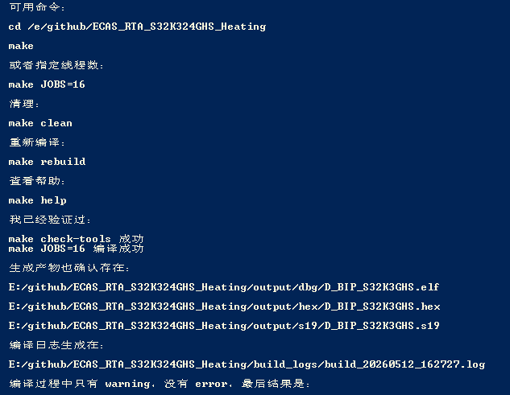

| **想要执行的操作**          | **SVN 命令**           | **说明**                                      |
| -------------------- | -------------------- | ------------------------------------------- |
| **Pull** (拉取更新)      | `svn update`         | 将服务器上的最新改动同步到你的本地工作副本。                      |
| **Commit/Push** (提交) | `svn commit -m "说明"` | 在 SVN 中，commit 会**直接**把改动推送到服务器。没有单独的 push。 |
| **Add** (添加新文件)      | `svn add 文件名`        | 如果你新建了文件，必须先 add 告知 SVN 追踪它，然后再 commit。     |
| **Status** (查看状态)    | `svn status`         | 查看哪些文件被修改了、哪些是新添加的（显示 `M` 为修改，`?` 为未追踪）。    |
| **Log** (查看日志)       | `svn log -l 10`      | 查看最近 10 条提交记录。                              |
 SVN 和git的脚本需求：
 我是一个嵌入式软件开发工程师，目前开发的任务是ASU空气悬架。公司内部使用SVN进行软件版本管理，我不太喜欢，因为VSCODE里面不
太好用，我想实现两个脚本需求：1.第一个脚本可以自动更新当前文件夹中的在SVN中对应的文件夹
SVN的文件夹需要由我来选定，给我提示如：请选择pull的地址.当我输入后，把更新好的工程放到我github文件夹下的相同名字的工程代
码，要求是能够在vscode中显示所有变更，如果有冲突的地方让我自己选择更改内容。2.第二个脚本就是github文件夹中是我的workspac
e,你需要帮我生成一个脚本，这个脚本实现的功能是：需要提示我svn是否更新到workspace?当我选择yes之后，脚本自动的把当前worksp
ace中工程的被我修改的任何文件复制到SVN中指定的文件目录下，这个目录由我自己指定，你需要给我提示如：请指定覆盖目录地址。注
意：vscode的配置文件还有svn的配置文件不要复制。3.上面这是两个脚本，名字要区分，一个是pull，一个是push.都放在github文件夹
下。

## 编译指令

Obsidian 最基础的指令（快捷键）：

*   **`Ctrl/Cmd + P`**：命令面板（搜索并执行所有功能）
*   **`Ctrl/Cmd + O`**：快速切换（搜索并打开文件）
*   **`Ctrl/Cmd + N`**：新建笔记
*   **`Ctrl/Cmd + E`**：切换编辑/阅读模式
*   **`Ctrl/Cmd + F`**：当前笔记内搜索
*   **`Ctrl/Cmd + Shift + F`**：全局搜索
*   **`[[`**：插入双向链接（引用笔记）
*   **`#`**：创建标签或标题

在我的笔记中没有找到你记录的自定义指令。如果需要更详细的 Markdown 语法或特定功能说明，请告诉我。hi