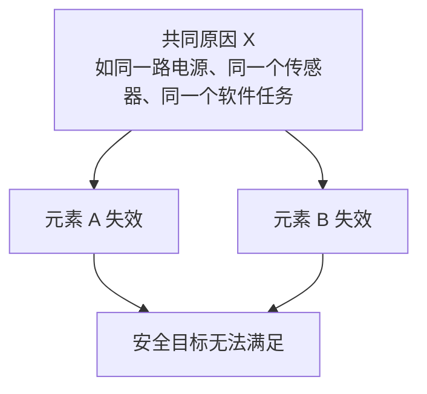
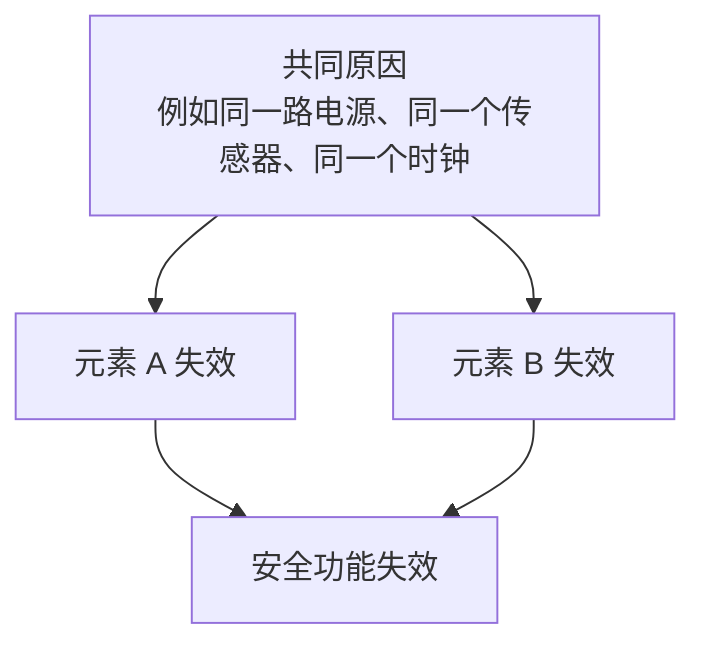

从系统到开发。知识点详解。

1. 为什么需要功能安全：人不是完美的 => 系统性失效 、物不是完美的=>随机硬件失效
2. 功能安全在解决什么问题：除通常质量管理(QM)外，对汽车E/E系统软硬件全生命周期安全开发流程，方法等进行约束和规范(主要是通过ASIL)，**尽可能降低人为结构性的系统失效对控制器硬件部分进行概率化度量，尽可能降低随机硬件失效**。除过程约束外，设定安全状态，一旦系统发生故障，在故障容错时间内将系统导入安全状态，避免对人身、财产造成伤害。
3. 汽车功能安全特点：旨在尽可能避免由系统功能异常导致的危害，不是为了提高系统原有功能或非安全性能(动力性)或避免系统本身功能不足导致的危害(属预期功能安全)、既基于系统功能实现(基于现有功能进行危害分析和风险评估，定义目标及安全需求并采取安全措施)，又有所区别(一般独立开发，ASIL要求贯穿全过程，直接决定功能安全开发工作量和内容) 、不关注本质安全(即通过消除危险的原因确保安全的方式)、系统，软件，硬件开发遵寻各自V模型，都是从需求，到架构，再到设计实现，最后验证及系统确认(确认只有在系统层面)。为了加速迭代过程，可以和敏捷过程相结合(后续细聊)。
4. 功能安全是否真的有必要：安全问题重视程度取决于企业价值排序。个人觉得，安全第一，须竭尽全力保障汽车产品安全，先发布再以牺牲用户利益为代价的市场测试，至少有违道德、条条道路通罗马，ISO 26262只是其中一条，非强制执行。只要企业安全文化到位，产品开发流程有效覆盖功能安全问题，也能走出自己的一条功能安全之路、规范的存在既是门槛，也是为了让普通工程师在规范的约束下，有可能开发出一流的符合功能安全的产品(我这么说不要打我，我也是普通工程师)、功能安全不是形式主义，不为死抠标准，不为通过评审而做，**不会短期见效，却能避免企业陷入重大安全召回、系统优化企业组织架构和交流接口，优化开发流程，将功能安全融入企业各自开发流程中，实现不同平台，项目间的最大化复用，是功能安全实施的关键之一.**

---

专业术语：

级联失效：由一个根本原因导致某个相关项的要素失效。一个要素的失效引起另一个或者多个要素的失效。

要素：系统(3.163) 、 组件(3.21) (硬件或软件) 、 硬件元器件(3.71) 或软件单元（软件组件是架构层面的“模块”，软件单元是实现层面的“最小可验证单元”）

**相关项：实现整车层面功能或部分功能的系统或系统组合。**

**共因失效：有一个单一特定事件或根源引起的两个或多个要素的失效**

**共模失效：看起来是“独立的多个东西”，但因为“同一个原因”，在同一时间一起挂掉。**

功能安全里经常会说：

“我有冗余，很安全 👍”

但 ISO 会反问你一句：

“如果它们是一起死的呢？”

这就是共模失效要解决的问题。

双点故障：与另一个非相关故障组合而导致双点失效的一个故障。

**双点失效：由两个独立硬件故障的组合引起, 且直接导致违背安全目标的失效 。**

免于干扰 freedomfrominterference：（FFI）两个或两个以上的要素之间, 不存在可能导致违背安全要求的级联失效 。

危害分析和风险评估 hazard analysisandrisk assessment;HARA:为了避免不合理的风险(3.176) , 对相关项(3.84) 的危害事件(3.77) 进行识别和归类的方法以及定义防止和减轻相关危害(3.75) 的安全目标(3.139) 和 ASIL(3.6) 等级的方法。 找出“这个整车功能在什么情况下会伤人”，并判断“有多严重、多久发生、能不能被躲开”，从而决定安全等级（ASIL）

![0](data:image/png;base64,iVBORw0KGgoAAAANSUhEUgAAAecAAADmCAYAAADvJk1FAAAAAXNSR0IArs4c6QAAIABJREFUeF7tnQ10XMWV5/9OyEZDMhIzzCCSWRBx1u6swJIywQZnMAonthxmsViGFnKCV8lGjpgNFixg56uRjRE9AWTCgAxnEWgGtAYs1AzBJuux7BxiYMdYYhN9gJO2N14ESwYx64ylxBux8cR76n1016uuelXv9ZPUUl+dkxPcXZ+/qn7/urdu1Vtw+vTp0wDg/B/7T+tvwYIFmf/mvxc/9ySifxABIkAEiAARIAJ5E1jgirOuJF68SaB1tOh7IkAEiAARIALhCQQWZxLm8LApJxEgAkSACBABEwLG4mxSGKUhAkSACBABIkAE8idA4pw/QyqBCBABIkAEiECkBEicI8VJhREBIkAEiAARyJ8AiXP+DKkEIkAEiAARIAKhCIgnpVghLLaLxDkUTspEBIgAESACRCB/Aq44M0H2nIoyPUqVfxOoBCJABIgAESACRMAlwAtzzmckzjRRiAARIAJEgAhET0B3P4hMnFkr2Oez5tZ+8803wf4X9d8HP/hBrFixIupiqTwiQASIABEgAkYEZPvIbkb+rpCCFOetW7fijjvuMOpokERnnnkmTp48GSQLpSUCRIAIEAEiEBkBX3c1dzW2n2U9a5azJc73PACs2xEZEIw+hzNHngomzlNp7NoH1K+JZdox/PgGPPpj+5/L1m9HU1XAJh7uwYbnptBwTSMuqSxDiSf7MHpuehQDdun42oNNqA5YPDCBAzsO4IJ4PSq8hfuXNJVGzxPv4uobalHGpzw1gYGH7sXPrkyiabG3iOHH2jH8mRZct6QcJWcEbihlIAJEwIfAcKoTRz4Yw+LPVOOCc8pRJv6eR/rQefgc1F15CWI5X84RtON92HjTECquqcXlV1yO6vIgD6050keumX7WsGg9F644d2wHWl+Ojv7A4zjz1U5zcT6+CxsuXYeecWDZdwex/0Ym0OPouWoRNrzEmlWOTQeOou3TwZqYTi7B0nvGrEwV3xzEaCIr/EA/mkvj6LO+bUBqsht1wYpH+oEVWNo2DJwRQ1N3CtuuqRAWAJICj/UgvnoD+seBsrUpvN5VZwv01AEkPr0Gne8AKGtC6mfbUfcRJ/87XVj5bzfaC4mSeuw4ugP1HlWXN3zq+DgmTtnflXy0HGVueZ7kU5gYn8CUnQplZ5epxf/kBMZ/bae0UpdJHmLul0JaLhPKgzzcgtTpM35jDyzFkrZ0wBFmyWNIDg2idaFBVr6tZ5Sh/GzZw4/xHsPQP6QxwYr8aAWqqy5AuR93a35MYPzYEA6lWa4yxD5bg4pyccFp0EY3yakpTPwijUP/YwxTKEHFZy5B7Hyz8qaOjyH942GM/RoouaAalyyukM+tkxMYO3IIw29O2f1cFkOFydgH6OvUxDjGhg8hfRzA2THUfiammOd+bMbQeekSJA6zNLXYfnQ3msq96Q/ceg7WPGbP/YbeSXRfqSpvHMPPHcIYKnDJNdVgxYz/ZBcOvQlULKtH9Z/Y+Q58exHWfz/AeHmSVmPT3hRazrc/5H/nmWSS+TeViuOcr/ZbSWofPIrdXxE6ydfxzjB2DdjPzrLqOtSeP4GB3YfwLvvdf7IWdVXZBxCrf+wNewzKYrW4ZLHPMyRsl0PkU4kzK8rUomZpZ9dynm1xPtKJFRcnMOwMQHX7IF6+uYT7wQR4QGYePgew8eNr0GX9npZh20/3o8X5YdhJ8hPniT3NuKixz37Asr9PJzH4w1bEdFbtRD+aL4qjz8lo99VeNIw/vgaLbjpg/yA44eYfDNofVWYS8w8cINY+isGbKyRTnOfgx3kKfY3noHlPtgh1mYBODEsW1uJrW7ajzXdBE6xOv9+vrj3qvOZzz1NHZRKjr7YiS3wCA4/cihu/3Ye0s2Dy1tmE1OT23AXi8QF03nQ9ErvHc5t4RjnqtzyJh25chjLdvHNzHx9A17dvw+07h50FGVdsyTJs+sGzaFsqX/lNDHbixqYEdrEFJP8n9HXiYBdu3XQ7+kayCzk3ecnyTXjhmTYsk1Vxahy7bo1j/eO5bfMK4hTGnmvHhu904oDYFraUX9uNVx5uQLkpk/EerFm0AdYv7/LtOPpCkyWqmb9T3LOkpAW7f7ENtaqyX9qIc67qwtTiNgy+tgmxTF6v6Pe3lCK+02/G+n3Hz0nv7zyTi43JU0C8JgGzJanXQMnOZefZ+dZGnLO6y1rItbzwHrZdDkwd7EDDV9slY1COuo4XsOOGmN5YCYvAIJ8VzCW81ZFlU1nJqs+LW5wB8GJXfdt+vLClHD2Z1Wwduv8xhQap5ScfpanUOpzz1V32l7IfXB7iPDHYjqs+35FZTKCsAanXu1HnPHCmpqZQUuLjMvIsRsqx6ZWjaLNc9hPoazzPEsDyVUmkelpRPd6Jpe4P7MpuvN3b4HWFKydpxOLMW+9unedvwuDrbeD9Ee5XpmLIL05yuhKwTjNxjmHTD1/IWB2qPGP/5SqsvI891qIQ5wn0t1yE+M7MUk5Sba73ZuKljbjsqi7Y9ovP39IkBvcaLAyhXzQB1Ui+9jJahW2VnMWoUpwVYsGnly1kT6XR+fmlSPxE3k+vOPMLSnl6j1dKgW7qyAH0vzEB/PhBrHvA3uAqj2/DfWvOtXOcFUPdFTGAf5Ysb8WOv7zEU2LZhXWoXcx+71Pou/4cNO8GSm7Yj/c6liHzHHLF2snJLP6J3LWL7zDL5+R0iDPntVzTjfeebMC463nifvO637i5IaGb4HJLV59LniKIu5uVUPDi/MEFQNXHPow3//m3+Off/M6fSwC3Nu+S+dlfx3H7R+9Cav2nALyE7yxqdtzO9eg+eh8u96nV62IdR9fnF2HjIMuQXel5s4eznKcOd2DVpe1ZYRYfZu/0YM2Sdnx4y5Po9rFoJnY3Y9H1A2h69hVsW/Vmdv/7+CE8n67A1Z+1HxDvvtSD/mN2y2NrmnDJ2QD+9GvY/hXdDnm04jz+yEos2sQeYCUoKZnClPVgqcCmV0fRVpk7MJ4fbnkDtt17NaweHT+EB7d2YiCjU/Xo/scd0oVX0Dr9JiXfnpLycr2leXwc41YfIxDnw+1YcmlHRmTLrtiEh+5owiUfLwHefxfD/c/g3nsm8I2jnOUseJPY1s6yr9yEG66owIePD6Pnv3Sg/0i2xyZixFJbHLYCDVuS+MbaapwF4MRIB9Zf25Wd084DObO8PNaJFTVZz1bsKzuwo73O2nudOp7GSy9OoDq+zLE2nXl3qgHJ734D11VZNWB423rEH3F9Y0D937yHHXG3hin0f30R4jucSVFeh2T3Q/jaZ8tRcmoCYz99HukPNqEuE3Ni/3ZfWt6KtrtbsNrh+Py3r8LG3e7EUs9Nl5pOXGB5BK7D3syzRD7DMh6kk32If6wZzHHc8OQkutdkn0OuWGdLcN3f5hLz7u7bsDHFPCjeOal0a0886izsy9HQcR+uPuddPP+NjehjRVy+CTuaq7mFCbc4PNWP5j9kW34uw6xY89uDFr/tZWj95jdwXV01zjp+CJ3/eR263AXWp5MYPcB7j8z76qZURVurLGKTtzWauLstUXas7oIW52sv+n101pfjY79/Bk6fBp748QQ2PP8uTv72tJy2sTgbrLKNxlPYk3ZdS7akKfYMg4tzriVTjbZX92FTpfOQEVf/i1uQ2rsNdUxQc/4mMHG8DGXWd3pLwJN9bQqTXbod8ijFmS+rDpu+OY6Oe+wHbfltL+PoltyFgq+LdzCBRZ/vhO2oLUHL3vewbbkIKHidhSrOYw+twJJvO8KkcosyV3fGVcrHW7A9jnp0v7oDDZ5tmQkMtK3Eygdcp2UZWva+LeHopTJ+sB8nPl2HmODYGd66CCvuc1znHjf1FPpbzkd8p23mxbYMYvA2ma/ErWccA/tOoGqV6NIcRvuiFehwqvBsiRzjvEMlDdhxtFsTUzGMA/suQO0qwTfOiSNrjf/esIEXoTKJwfvHsHJ1V3b7SjLJ3L5kF5OOC/t4dlGW25aAv3lPvYYLxgxXN332N5Xhv6cZpY0s8oYT54OOC3vpNhz9YQvKT+1C8x+uQ5+wPTh+JI2ShTHvQvdIB5Ze3G670s9owu5fbket0TM8N5HoZvYL2tKdYxbF3k/ExbIKVpzPPvOD+MV3/g32/8+TWPPE/8a/i30U32/619iy759w14ssCkPyN+PizE9W3mp2xfkxlP21G5nttncMBx4/4FgzFaj9Si23P8jSVKA+sQl1zubTeGodLv7qLu5HWm25R7P7c7muyxxr5mQaB/qdQCCrGWWI1dUi9pGAP9SZFmfe8mNbBPeOYaVrCZa0YP9727BMmAa+4sw/jFXiHKJOM3E2e7Bl22+WntWt6rPXQluG5Ov70eoE80jb7LG0S9DQ+xa6r5Rsk5wawMZPrESXaywazQs5JeV48YKn22/1fQirF4v8wmBZx1Hsv8EnUMm3Du/vKIg4Z9NyZVS2oOWPutBlBaWWoOnJUbS5E/2tLmtry9r4cOI5sq7qEpSxYL1MgKAs0JI/LWKmXid+/Ax2Wfv43JxkwXMK/3jJeA9WXuYIpbYKTpydMjNBpCx48PgEppRBjlzhP2nHotoOe+Gdp+XsF7TFihcFVrXHzHfdz2oWBdz9d8GKc9W5H8bwzZ/A9Tt/gaeGJ632/nLzYvzd65NY/3csdi8fcVZEGrIiuckPtqf21HWWC47/O9S2COusoIrsZJ3a04zzG/u4YBf2XRJDNW5ktnaWOgmcMs+fQP+3L0P8EX7nTxRmZCO3ndxla3fg9YfrvatKjyjx7eYeCMoHrEkavm/RWc78w9PeRzqB9ouWouMt+6HlBoh4auejo8WAoVQc5zlRo4DcrR2mTr+R1bowlZnzF2cIbm07un8Htq2JSSPjRUtbtvhxm+uxeMs34eWjbSGOBAoLWt6tvW8DSq/tsauL78Dkw9Xof6QLvftGMLGwCrVrWvC1VQanFIT4gaxbewydtUucveYY2l4bRMtUDx58bBcGjpWhYnktvvaXTaiWep+EQfN4zIK5taXizLZwzpjCFPNquFakWyX3W/YLjDR92pikky4YM5ZvbgmxtQ3Azr5QAWEm7clJM5VGx+qlaHfc2ro9Z51Q6vaGTVzYfBt9LxqRBI65eQtWnNle8yt/WYH/+9vTaH72H/GFxR/BQ1efi891jeHlN3+TtzgrJ8HuZpRebx90yt2vsXNlIx4bsOOX3aiHYElYqfIT58ufXoQV93CRsmW12P7D3Z5zyMaR27MozmY/NpkQDWDjOSudqPdsxCl/TK1k/W689z2v80q15/z+4R58555+x6UNVH93FC/fKEaRh6uzYMUZioCwkmo0tN+H7zV7o609kbxXduO93gZ11Cv3O8n7SKAF0Ose58cxdnMSVY8nMicNXN7a/W5xu6esBfv/1zYss9z43u2ltvYjaGfHEz1/8iA1TxLhFIQ8CNRbKt83ueWcxOiPrsObj3wHL5V9Ay3rYtkI8DzFObJobSNxdn7XH8lGpWf6K3Nrmz0svKkmDmBj7Rp0OfEx2jnhEzXtFqwTZ5YuiECL5Yn72aqyClacGYDPLTwTP1x/Pj6wwMbWNXACNzynsJpZAmO3tnoWDGw6Bysfsfe56h4eROOeq/DIshfwws3ZvSxenK1zysKek116vnvOE+j/+sWI7xgHFrYg9UPvHnJO5LbfkSrHPZTOiQTmHlCSaFC7H4fw4Jc77bPORu7LMPv5Ela8NcJHvXuswVzrV2upMuvxiRewfY3EhRmyTt9niurctfZBpDn7zeX3deWfmkB/20rEH5IcbCmvw7bnd6DFiV3wPLh1Y+15OAc8r88uvUmyqPSsGIoP1fR9S7F0K9fmM8pQvepqlL/zDPq5o1JKK+n4ANr/YiU6MlHYZWjofR3dVzr7xZn9zCxIdsxuzZ8CL33/AMbdY2ceQfcO2tSxHqyv3YBdmSBDAzEXtiEqrmhCrbVG5La7mMfnlSaM33MtVt4zgLJ1KRx9uM5eKBWKODsu6OF7Lkb8MQagAd1H/8oKns26tZ2AsF/3YP3WfkzBDRCDPCBM+5sQEpwaRnvNCseTBlTckMIr363TBl3q9olNArdMxdnvGk+dyBesOH/yDz+En932Sez4yQS+s/ef8GcVv4euv/gY7v7R/8G9L/1SPoz5ijN/rpDtyy4G0kfsX17FDbvxSge7WYsPmnHPiLqCVI2mtVPo2el3FCZIQJh9E9in1tZ7z06KEbWfbsPg3k2IMVeY5RKT48l1T03/njNKylEudQ1OYfwd96mWK868UHgfwGnOtS1G3+qCbUpQ+92X0Xej/Bxk2DpzaYdZoKifTDr3pf85Z7vcqWP9ePTudrTnnDOuQ/fbKTSU8R4h1TFAro1hLWcmmtetRId1osH+y/62sp/xi2R2Qce213dnjqENb12CFfc52z2S44oTB9tx7b/rwEDmXHcFWl54Bdsu5wK5+DPGzG5fvxtHv1drC+BEH+Ln2dHP8sDBKYztWI+VX9+V8cRA4tlSjah2AckCwnqA9Zk7GLiFRZ7ibE+GMQwfOwvVlTyPfnQkd1mxMBVr2rBpFbd4ZefAHz+ES74iPIf4ZyG/JZHjqfNT3YALO64o/thqLDGIl7+pP99sYrWaBIDlI86meQtWnL/9ubPxV6v/GGV3HMHk+/YRqq5rzsXVlb+P8uTRaRFnzxll6wdSho2f34ADjoaUrenGa08swzOXObf6cHua7IGx4awUHsM6LLVuhMrXclZM6CM9WMO1CY4wnzvaieYvJXDoCu72L6GI2RDnUJeQnOzDuo81wzkt7vfLBgT3q+fBt3gT9v+gBeXpLqy7Kns+XHrGOY8654I4Z9p4fBhdt8ax8bnslol7TMVjrWqCsNRR1j7DJc5dVKDpyf1SL4ZnHNme89/UZwvmI3OFwMD042uw8qYD2QDKhU3Y8YPtqPdEnLOivJfgsD3nTdwZ611fLcW6lF2ld3E4gQObLsMaLhak7Ioknu1plV9wIsFhIs7sIpmzPDESziJqILsXr1u0yUaCXeiy7i8SODAhLFjcSGmxv6cmsOvrF2EdOysvevA470Nd+260fOQldB2/BKmGdOaOhJLyMkyNOw9Qd6HuOSFwHR77aTJUZHWWo9l9FLxFHNZ6Nsln8mIL/4ea/W3BivPtV5yN9ro/xgX3/E+MnbCXwM83/WtcsfBMlN7BHbTke5mP5Sy4SDLRm5yVWr1lEPtuK8Gj7iUlfMDRsTTS58dQ8pB7XeM0iLNCmGM4gA2L1qDHvf1Lup/KW5Vu27JXaGbdU/ZlGav/W/YyjMzlGSVlBldg5h8Q5lkkaWex9wYklRU54XnQ2QFA/MM4nzplTeTPgA4/fhv6y7+G1lWfyno1XrwNi1rs5Ud911Hcd4W6o+orUO08Jpazt3QhEMt1YXMPaJa+7m/eRiouuVLrZD+aPxFHn3OZRe4VtZK+nOzHhk/FM3NUtlXD5+KvfMzZTvEcgcpG7U/t24BF1/ZkhNnfzckfsTL33HiC5lCG2o796At4I5XRnrN1y1v2ciCLzZpuvL3u73GedQRJf2RLOqM8XresG56/DTBz6yDG0ffli9HsnuH+9Cbs38XdspaZL3XY/uQF2Hg9u8mrHt1DTXjzr5kVXoHaTx5Cc5vtg6i+sRt3/cfFGGlagQdj3XjlkTUoKykJfZvX+L4OtO9mtr7ZOwpUe79+t3kF+U4XaKZ9lAkJClacF539IYz+54U4+NZv8OjACcT++F9h8+f/CPe/8kvc+oP35P3MQ5z9rIaJlxK4dbQJ3dbd29yKW+JS0x+FCeLWznZz6nAnrroskXXVCbczeYPD5HtffNvanv8GhlsOoMm5gELcR49lop7No4YdqeCuPw1zfaf3rG1JVT2u+1MxXv4EhnfuwrAjDvwxGLVQCWd4PXv0+dXp/6Pj3PDlrXj5aNKOaub2bLP7jmJJZg8d5VGq5zoxXP011C8Uj0NNoOfa87Bhn1NfZn9ZdMcL5+lZ8lPCA5vdCf3T3WjKsUy9fRnYdB5WPuKsHs9vxf7Xkljm9/4Dz73u3qsrPcLt/gaF410VN+/HYPsy3wc/L0jeo1S8cHPn4dlFP//WuW7Tikl5G6l1BpfNC8NqLs4AnDp/8839ePaby1C2zz0fHFKchVsRWQDb6PcmsI67xpg114oB+NabuPbijfYzp7wJqde2Z24jZGkyWw9sDL5/Lr5jXSDCbTWJwXKsmPMrMP7WCdTfeDUOPfQ8rjY4Ix9U1FTpxSNPJu5rVpbs6FSQz8O2v2DFmXWo9hNn4s5Vf4TLP3Em/unkv+DhV/8Z333xON7/l3wvIfHiEqOelRaD9XByD8bLA6SmQ5wn9m3EZddmr1Msu2I79j/bJNynLdx2JL7EQnqFoiu8aXRcvBTtzCHhuAnLRXE+3oUN/3ABWtfXIeZ7nWmelrPn6IvqohDAs9LnjpuYn3PmIrbzrNPvx8cfsfNcnOIT7Zotz2w/TnfOufzyVmxqvgSxWAxIj2Dk+3ci8Vz2iJ7HbZtzQxhQfnkDVi/8PeDXYzjwwgGMcdc/+l6DmukIHwUPyBdcLDG/GPFajWVrtmP/91ajJP0MNlzP3LJ24ZmjUR6rvwTV11yHaplu8rfc/aQdS2rdG9SqsemFHWiJTeHQ1jjW7XD4cNdG8nfQs/sIcu8osNuUs2ebjzizLWL+Wl5u3ujOU/vNy/QDK3Hjr/8KT35xDLfVNmeC2srLyzDuuKHLrtiGFzr+AA/eOoSmJ5Oo5Xly8Tls/vRdM4We65dgIzubzfafn6jCo6prUcuXoenK37Pve6hsxe7n21CreVOVTEjTD63Eim8PYOpPGtC9v1u4LMdMEk2Cv3gh1rm1zWo1S1XQ4mzWBS5VCMt5Ys8GXNzYkw3s0N0jze93rUth8mHvjVmRirMk0rZ83Q689mA9yk7xlwBM4d2RYYyN96P96z2Z84ViBGzuXlc5Wn94FMlTG3GeexuRs4ebudPW3TtPuyv2aiRff9nnMov8xNnTRsVFI9aIK25j07l4PcFEjtVXm+LeHBWiTvU8FSzRslps29tnR0fPhOVs8kYsSZS/6d3ay5g1l1imv3P9rU6suCh7Daeal7AYEa7vFPPx89vrbvZ5cnii0IUFbU42rweq/+ul7Mi19k+3F8zPUWW0tuflJdkqea9BPuIM6zWxzbi+LXu80OL5cAV6eFE9I4aG727DX325Frx+TuyM47wW212d+1eL+jVD2OW6w6/sxvayZmzwvHCjBOXlwLh1V61zJFUSyCqLdrYt2X5sKI3DOQnv84Id/+EyFWexFNOgLu1k8UlQxOI8hfQjDVi5iQse4V03UwPo2noIf7CsAh92Ab4/hmfuTmCXc6ZOdlY2OnHmrNnQI+w9PuKxNs9YhuQrz6I+ncBVX+7J3L/sWiIeF/irL6P26SVY+QALItIFX+Qjzt5IbNU5cwuHJ7I++2pOnThDvN3qyrtw0xu340HrYhP12Xa/OlXDk3m1p5CgfHkTbrrwZ0g8Zr/0YLr2nK239/ynDhw4JnnTwRnlqL3hPjzWLkbgOo213krVbO3piblLqhpwV8f30LLc0KVrHL0r8RS8swsbrl6HHk+YSTmWffMhPPvN7LEZbZCVOwY5R8QmMPCAV6SspIsbsL3nITS5V+R67jfw/0EGEWdpSW4sC3sG3TeEcyvt++7ff+t53LvVfbtYiNfZTrH7wg9g198+igd3cMfFWOH8NtmpNHquXYkNL/IvTClBxeXXoWVdA+quqEHFyR7r3nPtm6ecl/Ngk/02rJKvpPDWg86xsOM9WPOJDTggucRGLcouMf4Mfzmanh3F9lXB3xNtYgmbRHiHfkSTOAsEpobRsXIF2ke4z3P2VHTHYaqRHHo553270YkzwF+4EXrwM3cGc1ZCWQN2/PcbkP7SSi8DzopSPuxyXkkYumXzOqPX+mQWcxNeamrGLskbGP1BqF6gEgCfeNWiyXWIbvHuFYrOv33fpR2gSUGTeq6o1L2DOmjhLD3fT6PAxzCV2Hk8v62ycpR/lH3KHS3M/Mb8nkHqF7dIWzaxC82L1mWC+Pg0lgeE7Wd7LFfFooXtR9+wH293VKD/vmcwUXU5llWdi7PYe9un+hBf1Iz+zBG2rOfBezROaKHkTL2JaDJm7J3wUL4z3myMog7kMqtVn6poLWfPJR5LN2H/3+W+61U9ocpR/zevYEc89yKLKMUZ3PEe941G51atRrVbbXkV6pxVtXVf9mc/ZV81+v5e3HjRBvSjHHXt3FuqWMRsbS/qf2i/ZpLfQytftQ0vPNmSfTGBwqVY+/BR7F4X9g5i/YScLykm9iWwsrHTeodyZk/31BTSLz6Kzgd68Pw/pDEhfb+yQCCve6XnC8351Y8gAWHyZ1A5mnpfw3b3QhVDPPYb6dwrhktQvfYu3NXe5L/fy95Etu02tD80YG/9SWJZstVPYGCre7mMcNXwkU6svNQOaPW4hM9YirsO7s95VSgrc6ZEc6bqMRymTLLZFed7/hpofCxom9Xp39iNM9/ow8mTJ83KPNKH9hcrcJNwjaGbOfPeVfeDj1aguuoClPus3LPh/d4XWGQbxF88r4/GnTo+AbD6zHqUSTW2pwfjy5qwzPdu4An0J+/Fu2u+gaYqiYvy+DD6X8q6NbPvjw3YmGJNPjGArp2/QeMN7PIa9Z/vO3aDWLnFynmO9Zt/rlQsq0e1FemePdYIbsy9z6ASVHymGhecU46yoA8Ei9EEDtz3INJV9bh6RbVnD1mLkC0s/6EHIx9qQsNy/8rTjydwYFlb5ua5TNlTE3j3hPfqZdcTozuyNJ2uZTMrXUso8gSzK8533BF5h84880xzcY68diqQCBABIkAEVAT87plWHVlSlTUTQVmzOZKzJs6/+MUv8M4770Te9w984AP4zGc+E3m5VCARIAJEgAiYE5C5i/0+YyXLbtcy/dy8ZXMj5ayJ89zAQ60kAkSACBCBMARMxZmVHSRiGtH3AAAgAElEQVStKn2YNhZyHhLnQh4dahsRIAJEYI4SCCK4Qfd9CzWIK8qhInGOkiaVRQSIABEoEgImAqm6MtNvf9lkL9mk7rk+DCTOc30Eqf1EgAgQgRkmYGrpmopzUFc1ifMMDzhVRwSIABEgAoVPIF9xZj00eaGE7AiVad2FT9G/hWQ5z/URpPYTASJABGaQgP5qzWxjRMvZz0JWWcOy+mTiPoMIZqQqEucZwUyVEAEiQAQKm4CJ6IpWq8697CfOosDqyipsetG3jsQ5eqZUIhEgAkRgThFQWac6AdUJqkycVdazrqw5BTSCxpI4RwCRiiACRIAIzBUCpkecTMRSt/8b1FVdDO5q03lC4mxKitIRASJABOYBAZU4hz3e5CfiJt/xSE2OUc2DITDqAomzESZKRASIABGYHwRMLWeV+1mk4Gc9m1jf84Nq9L0gcY6eKZVIBIgAEZhVAqq9XrdRpuePdW5rvjyVS1rXllkFVcCVkzgX8OBQ04gAESACpgSCHDkyFeeg1rPq1Y/krjYdxWw6EufgzCgHESACRKDgCIguZN1+r8kboIKKs8p6LjhYc6BBJM5zYJCoiUSACBABPwJB93ZVlrNMXE3LNk1HI2lGgMTZjBOlIgJEgAjMGgHd3m9QYfS7HMTkWs1ZA1FEFZM4F9FgU1eJABGYWwTCXg7Cu6NV1rDp0amgwj+3CBdua+eoOI+h89IlGNoyie4rXbj9aC6NA738Z0HAszLjwFODaF0YJJ+Qdk8zSrfWYPTVVlQEKoa1P4GaoTzrD1QnJSYCRKBQCcisZZUFzQuoSWCYyeUgrniTOM/ODJkVce5vKUV8Z8AOr01hsqsum+lYJ5bWJID2UQzezGQwf3Hub4kjvrMKqclucDV5G8rqvTuGQb4tfIrQ4gzYXBr09dckkA6ID5XJEAuGoJVQeiJABKIioBNQVUCXaCn7ibwqulrsA0VbRzWq5uXMmjgnLnRFVd/YsQeWYskbSa84W9mYIPeikYmpI9ZVOsvZSRdY3OCIpptfXCy43dCKs231Jw7r++1NoRFtWXFcXxt0XII2h9ITASKQNwFdRLUotOzffpeIuA3S7RubWMN0Pjnv4c2rgIISZ2Y5ykRbLc5c3y0h6kGTzi1spRtC0s86FpGKeTxWe9pyp/f5DYPHapW55DVjyAS/Ef4WtacIbgFAFnNePxDKTASmg4CJ61lVr86iDiLoZBFPx+hGU+bcE+dILN88xZmxV1nI4udaSzqagXRLsRYybbZfwN9adgQc5O6OdgSoNCLgT0B0M+siscXSSJyLY4bNqjinEM8IiQp3rH0UVjqpW5vLZVmXI0jKLGep5RnCgjWZExpx5sXTpDg+jdY1bfWzD2b7yyTOQflTeiIQBQGdW9rPmtUJuUnAmNsHcltHMZrTV8asirMdyJX9y8etbYne003SoCf5dybi7AhYlRCM5jce+VjOgd3XQkPyzT9984xKJgJFQ0B0Wev2f3mxZP9tIs6qNH5Hr3RlF80AzZGOFpA429HWfZI9Uv2esy2iPV+0rew4Uk4Etz0KgcVZDKSKjWFsYYXnaFR/y1Kkv5V77CmnrT5u7ZzFSL7imm/+OTJpqZlEoBAJ5HMmmfUnrFUsspC1g/aWC3HG+LepYMTZFdBkVQIJ4TiRVpw9Lu3cI1Vm4uwsDhgvbRCVa3WngEZNMBjPXxcYlq+45pt/7s1fajERKAgCQd3JKis2bPQ2iW9BTINIG1EQ4mzvwyKzX2yf941l/u0vzhLXs3CsyioPomtaPNIU4KgSK/9LQCrnohG19Z8zarKocXfPWDLEbO9d3AbISUbiHOmPgworHgL57r/qgrSieMmE30UjJM7zb67OsjhnjyGJwU7uRSXs881HVOecnahpWSAYE6rnGjHZFbPPFefsG5vsOTsDLogeWyyIrnMrpePCTn2xB72LB7nbyyQTRxbAlq+45pt//s1v6hERMCLAi7PJGWCVKznf/WWdBa7qDImz0TDPqUSzKM4pND0dR8LnKI9rMY9emJBHa+fcEiZjn92P9lqe5uLsdYtzF5/w1Xmsdd1VoE6bEEP6MHcjWb7iGig/RWvPqV8qNXZaCcis0igEL4hF7XZQF83tpouifdMKlQrPi8AsirOBm9bpmtyt7biQVTd1uVgcV3HuMSSVaOfy9LjFMxa531WirAyfu7K5ILG0c5Wp1T4EvWzE21aj6z8zWUic8/rlUOY5TUC0lGUWbxTipxNnBtHE2g5jzc/pAaLGY9bEOa+7td29WYkwy84RK/drffZ4vXMju//NBLD3muzLNXj3e/YlHG5uyR609JpRLhjNb1KK/ZW0X3sWmiY9EShSAqJ1zL/Ygf236vuwuMJEX+vyhG0L5Zt7BGZNnEPfra20hGcavnnwl7tgYMLZ+Jz8itKZbj3VRwSKgYCf4LrWsyxNFJaqrgzTo1fFME7Ux1wCsyLONBBEgAgQgekkoHJbm3zutiufCG6dMPN9F0U6Cnf6dLKlsmeGAInzzHCmWogAEZhBAiYirLOqWXN1QqnbU5YdodKVOYOYqKoCJkDiXMCDQ00jAkRATkBnmYrfiy5svlRx71nHXOWO5stxy+D3smV16uqi74uXAIlz8Y499ZwIzCkCKsFVdcLUevYTZ51lLLOuaS95Tk2rgm0siXPBDg01jAgQAT8L2dR65q1Y9t/iXrLMqhbd0UFc0bSHTPM2CgIkzlFQpDKIABGIlIBpMJZfOp1r29SdrVsEiB0Pmj5ScFTYvCFA4jxvhpI6QgTmLgGdhez3ikTdKxZlIqxyecuE1t03DmI9z92RoJYXCgES50IZCWoHEShiAqbiLEuns57FQC3xwhGZq1v8zNSSL+IhpK5HTIDEOWKgVBwRIALhCKgEUOcm1gmnuKfsJ85+bSDLOdy4Uq5wBEicw3GjXESACERMQBWopbNsg4i3SQS3rFu6BUDEKKg4IjA7d2sTdyJABIiASEDn2mbpZVavSrzd8kVB5ssxjcomcab5OtMEyHKeaeJUHxEgAkoC0+3a5oXcz1KXLRzIrU0TdyYJkDjPJG2qiwgQAV8CpoIpOyblWsQ6tzTtK9MknAsESJznwihRG4lAkRAw2T/O1y2tivj2E/ciwU/dLCACJM4FNBjUFCJABOQ3eMmE09TKFl3ZPGNyVdOMK1QCJM6FOjLULiJQpARMRTeIa5sCuop0Ms3hbpM4z+HBo6YTgflIIMhFI0GEnKzk+Thb5m+fSJzn7NiOofPSJRjaMonuK4H+llIkLhzF4M0VmR7JPtN291gnltYMITnZjTrfxHb9iaoUJrv4lP1oLo0DvXa7zP9YvgRqhgbRutA8F5+S9Te+M4ZkHmWEq5lyRU1Ad+bZdXObinPU7aPyiMB0Eyg+cbbEJ4F0CLINvZPYfGQplrSFyQ2gMonRp4B4HvVnBM/qRw+aHCHKFWKveBt311Ccxx5gHKqQyhFxiTjvaUZpIyRpuVYdG0P/7jjibQglrnZ7gFhlGmkkMfpqK7LLFOPeU8ICISATXVeQVU3UBZMVSNeoGUTAiEDxibMEi/VgfyOZsQBDWZxWubYwjbR7LVjdSISp38rzdFNGhHLbLLdEbRGTLC7WOhawkZDmLgx6r3EtZU6cY85CiC1KXq0HjlWgYqH9fZ8OSs73DUpxd4XZtphVFn3gCinDLBKQ7RGb7BubpJnFblHVRMCYQFGKs1KgfLDFDASXCWRWpNSF5V+/LUA9X0yiqi0hEboGpHqBeKMgga4As6Z5LGRH0A77zRtHHC3xHhGsW5Y/DjzFxJETX0uUbQs2u3hIB3d7+ywY5K5sEmjjJ0CBJiSRLdCBoWbNGIHiFWfO6tRZriaWdEZweQFUDKNo9Qau33HNV3H7umIbPf9m4ra1xuvqVbmvZULIfRZTWd5WX5mAN6JXsuesE2dLZEcU7mipOLsLCrVFbQu3+vsZ+5VRRYEJkDgHRkYZ5hkBEmcAgcVRnAR7mrH0SCOano5LAqRyZ0y+4uwuBNgeuLsH7RVnx3rlXdVBxFlMKxN3yQ+BtSuOpMXBDVSzk2mCxIT9c91vzO2/iTcDlrD3wSitrmL6fsYIkDjPGGqqqEAJFKQ4Hz58GLfccgsOHjyI5cuX4/7770dlZWVkCPN3K3NNYcJydwyDXbFs9PI1vRLXbzZPfvXbe8kjlWlUOZHalvzx0dpssfAc+7QRg111OYsPqyUKy1lcOFhpPeKsdoG7AijtH+fiFgfSsnAhRn3LhztjYQcIrGvoHUXN1iVIUKBYZL8hKogIEIHpJVCQ4rx69WpLmN0/JtB79+6NjESOAGmCoJRubSZwXwJS1r6qsM+ZiQrPdavmU79oncqjx9lxoiSGvpTG5ldbkZYcs1KJs0wove2VR4GbuP7dRUR8Z8ih1GwZmLYhZO2UjQgQASIwYwQKUpxLS0tzAExOTk4TFDe4KkSENbdvDVGc3dY6blXrGJX0eE+w+vtbmoGuzUg7Z5wtcc60gy8LTpBWCviSG6wlWPw555nlwhtMnGUBXyq3tp+7O/h5aRLnafqJULFEgAjMOIGCFOfps5xNopJ9xsA5ErSLXb6R4yL1jxC2g5P+HF+u/G94wjcqWld/1kpn+7pqca6wXN29FyYx8rRr3cvE2RZ66zIRyx2fex5ZJs4JSR9stzYvzm7ktuxiEH9eUvc613ybp+HvxcelblgCJSMCRIAIzCiBghTn6d5zzhD2cWd7z866OfwEJcTxncD1e9uhE2fbdZ0Aco6B8WeNXeFUW/DegDmdW9sWZ/sQl0+k9LF+9O/uRbyNpRTEW3pcS/+7IMtZz4hSEAEiMDcIFKQ4zwg64aYwMfI5+DWQAcU5r/qzAulnObuRyuD2alVXXPodZfLuQ+sCwuTnmP2DvnLL5MfDdD6QOJuSonREgAgUOoHiFWfPyIjiEOZsbEBxzqt+QZyFG7+y7uVeNE4yt7VkzzlTv+68sGhRm1nO4t3aOuHMcVOHcEXr6ij0HyO1jwgQASLgEiBxds7g2m5Y270au5vbzzQWibDinOti1tevspzdYRWCqZT3ZcvbnLufyy9WwoizPI97/tliL3J2A+lyXONhr/8Ewljj9KggAkSACMwGgeIT55wXX/hbyeY3fxmKcyT1q8TOnkLSa0SZ2D3XKLxBKsyU4+uW7V07l7rk3N/tcubzGHgoJLehhWk15SECRIAIzCUCxSfOc2l0qK1EgAgQASJQlARInIty2KnTRIAIEAEiUMgESJwLeXSobUSACBABIlCUBEici3LYqdNEgAgQASJQyARInAt5dKhtRIAIEAEiUJQESJyLctip00SACBABIlDIBEicC3l0qG1EgAgQASJQlARInIty2KnTRIAIEAEiUMgESJwLeXSobUSACBABIlCUBEici3LYqdNEgAgQASJQyARInAt5dKhtRIAIEAEiUJQESJyLctip00SACBABIlDIBEicC3l0qG1EgAgQASJQlARInEMPu/fNULJ3CUf2fmHlKx+5xjuvWLTf5VwRolfsbVEJ1AwNonVhiOzO27DiO+3XboYtI1zNlIsIEAEiML8IFJ8457yy0XxAPe8DtsrpQZMjRLlCrHito0n9a1PeVzvqxDlvYQZwbAz9u+OItyGUuNqv1gRilWmkkcToq60Is0QwHw1KSQSIABGYvwSKT5wlY2kJyxvJjCCaWLxWnqebMiKUm0dviYpl8E3zfOcnzo4w66ZodmHBv09Zl4v/Xv3uZVeYbYvZ8L3WQaqmtESACBCBIiNQlOJsi0k60FB73cW2APV8MYmqtgT6ckpqQKoXiDcK3/AWsSWqQGqyG3WuSxhZi9lEnO1+VGXKyGmG1KK2xRm9k+i+0hCB0FY+F1uU5LqySaANyVIyIkAEiICUQPGKM2f16iznHKvYcU1XcQInpvH8m4nb1pqsq1dwidsj43WD+4uzY/1WMvdxDHeW9qLREXm7LNc6llm7cnG2RHZE4Y6WirMjwIfVFrUt3Orv6TdJBIgAESACcgIkzkwWNW5tUXhdy5vfg/amccTRtZQ94uyKmmpK2mIW493mHre2a7VnA7+yFvRmpC9dgsRhwLM/rpv90sWCOpPbf6Pgsyj2w3Xtp++JABEgAvOMQEGK8+HDh3HLLbfg4MGDWL58Oe6//35UVlZGhj4/t7a9lzxSmUbVlqxrWLSUlz7HmtuIwa66HPH364hbTgrx7J62LiAsYykHFGWnIZaFy7nUde2zLOyngHhNAiabAw29o6jZugSJaQgUO336tNwltGBBZPOFCiICRIAIzDSBghTn1atXW8Ls/jGB3rt3b2RscgKxfPZULSdxSykSF9qWKssbRxJNT8cxtGUSm4/I9q/ZcaIkhr6UxuZXW5Hm8ud0QnR5Own0e868Bc65jt0AMcvlnRsxbbuaQ6IUo8iFYkwC6ULWLM3GC/MCR4xln0VZJ5VFBIgAEZgJAgUpzqWlpTl9n5ycnCYeuW5if8uxGeiy3ccZcc7sX/NlAZ2XxoGnUsCX2P+7Z3/10dLMXay0nDPR2eJ5YjN3OQs+y/75BYcFDxybLXF2hdntlyvQ4ufTNIGoWCJABIhA5AQKUpynz3LWCZiGb8YazQZvWZazVJwrLIu798IkRp4GUqpzv6Et52xbZXvgmW+d4DXkXE7iH1Htd8zL9SYYW+AKK95kNvtZwioRJuvZhCylIQJEoJAJFKQ4T/eec2ZAfNzZ3rO74hCaiTOUwsiVl4c4uy5qKzBr8Z0ofa7Rc3mJv2j3o393L+Jt7LiXYIVbXEYCX0YSpeVsspfsZyGT9VzIjx1qGxEgAjoCBSnOukZH8r1wU5cYee1/DaWhOLsuaL+9WoU4e/ooBoRJI6A5l/qaXVjKgrWMLdZcj0KgaG+nsVGJs0xY/faXVW5tlyG5tyP5xVAhRIAIzCCB4hVnD2RRnHRncwVxFi40sY8YpdFsnT9m+9P8nrMwupIbvnKOKGmjtZ0yMwuO4Pdb5wSKGQt7tj9RiHNQN7ZOyFnrSJxn8IlCVREBIhAJARJn7hiS696N3c1FNEtFSmU5u2MiBFPx4pojxiohFQLHVNY3X15gQeXqEPNmyhUXKvqANtXMNLHGg7qq/dzf5NqO5BlBhRABIjALBIpPnHNePOFvJWfORHvEUfFSC86923uNcD0mEzthTzjceAtWvuZ4U24dvLjqPATshRjsBR8J8LehhWt3/rmCim3Q9Pm3kEogAkSACERDoPjEORpuVMoMEwgTgU3iPMODRNURASIQGQES58hQUkFhCJgKqGk6vg1h8oTpA+UhAkSACERNgMQ5aqJUXiACJhZx0DR8AygYLNBwUGIiQAQKhACJc4EMxHxvRtBAr6AWsCwwjIR5vs8q6h8RmL8ESJzn79gWVM/CirPuaBUJcEENMzWGCBCBiAiQOEcEkorxJ6ATWTe37p5s0UImcaaZRwSIwHwkQOI8H0d1Fvpk4lYOYz2rzjGzLpIwz8JAU5VEgAjMCAES5xnBPH8r8RNPUUCjEGcS5Pk7l6hnRIAIZAmQONNsgEk0tAyTiauaF1OT9EEEnYaOCBABIjBfCZA4z9eR1fSLCaVMOINYpiaWsInY0j5ykU5C6jYRIAJKAiTORTQ5/EQwzAskdJd8mJTp4g+yKCiiIaOuEgEiUKQESJzn+cCbBlSJLmdVviDWtkq8yVKe55OOukcEiEDeBEic80UofR+z/4sx8q3SJL8qetp03zeoO1pm+eosa5N+UBoiQASIQDESKFpxtt429UYSk111nnG33muMFCa74LyPuRveFMI0iUKcTd/XHGCGqkTYVJxV541NRJulCRtkFqCLlJQIEAEiMG8JFKk4qy3bjDh/K4b+3XHEn27C6KutqHCmgPX9zpDzQfF6x+yCwHcZoKhU8n5lVs81z6C08RlPnut6J/HoF05bn/lZurrvVRHYsgbSXnLIuULZiAARKGoCxSnOzNpt7PMMfEOv/f5lUSjZv3PezcznDGo5S+o2noGWuDOLPg639bH2UQzenEZzaQI1Q4Oo3+14BK7pRWkjkJpklj8T8ARqfjKADQvt2lSiaRKB7WdV830hYTYeWUpIBIgAEfAQKEJxtq3mni8yUXPt4SyTjLv7W2ksrUkgnfmqwRG6aGeQtRgYSXqsc/8aHKEdGkTs7lIkLtSLc8xx4U88sipTtE6cZQJOrupox55KIwJEgAioCBSfOEstXcdi5t3VlWaCKe5dW/8WXOHsM7aPnbsYsF3ScKx2d5CYYNuim7t4gGsFZ8Q5iaq2RMaStsqw3Nqu5bwZ6UuXYHiLv0ubnyBhrGf6iREBIkAEiEB0BIpOnC3hG4khfThrE4MTYpm4KnFbgVw9aBoaRKvjLhbzu3vUtvvZK7aquoKJs8Zy7gXiW2swcnBDZt9c524mcY7uB0YlEQEiQATCEChIcT58+DBuueUWHDx4EMuXL8f999+PysrKMP1T5lGKsLUnDKSGapDwuLUBd1/aLlRu9WbLjeFOa29Y4Q63hD2BKsFqtkrWWM7ry25H9Y8PIXZPmW1hr9mFpTVDSE52w3Vhu5Zzw9o+9CEFE5e2C4vc15FONSqMCBABIhCYQEGK8+rVqy1hdv+YQO/duzdw5/wyiOJs/btNbk3nlpONkPYKNuApRxGdDdj73onDtnDDIAJ8wYVJjBxkUeP9aC67HTVMnO89C4nKEV9xTk1uRnp5FW5f0ocTj6zyDQQLcsFIpINBhREBIkAEiICHQEGKc2lpac4wTU5ORjJ08qNQvHWbDbhyXdXeiG1bmEfaU2h6Oo6hLXaUt/XnWMNpxJDkXN1iw7MCLreqRcvZe6HIPqw/yxHne85C4sK7NHvO3Vj1805c8qf/Ff/hx4fQ+skFnubQbV2RTCsqhAgQASIQKYGCFOfZsJyzVL3R3LI9ZDtYC5b1a4lzzHZRZ+xuv2Ay1529tgF9O92jTt4x5cU5d/+Xs5wtcR7RHqVadfo09t1wFm6/cBgDN1/guSCEr1m3Fx3pzKPCiAARIAJEQEmgIMV5VvecnT1fFl09emECS9qqFEeo3ItMUkBjHH2OC9svyIuVmULcPjcNZ2/bOocsF+eBm863vvCKZj/WlzVkzznfOYKBxXeidGuNdRwL7s1n3DlnJs5jD16C6jfuslzbJMj0RCACRIAIFDaBghTnmUCWFdF67Lo0DjyVjbjOuqezbudc0ZXfMqYT58x1oXuaUbZ2AfpOPApXLl0Rdi1nlTiLF4rsu8EJDLu5wgoma1iQwsS/ZzeEnbYWFqtOv4ntn63Gf107jEM3VSj3nWeCO9VBBIgAESACegLFLc5uAJgncIu7DpNzT+desam4AlR6jloS2b1nPcrWnkbficcy4uxayf7inB1Uy+X99+tx1tpR3PWTAbQuHEPn8ipbhBe3o8y5Bc0W/Qb0TTzmf0+4fr5QCiJABIgAEZgBAkUvzvz5YzdYzI7A5iOq7Ys8PMFfTsS19zM2YpK7rtnHlSza2j5rzMTy9J5mnLV2Ae66cxi3bz7iGWrle5CF6O/TVqDX7cCdd2GJcxHJggWfwl0/PoQNR5hoLyBBnoEfEVVBBIgAEYiaQJGKs2j1OoIqOfqUie42vDHMb4A8kdF/vx5lmbuv7VxKUZbchc3S8vvIOcFc7nltyZ521JOIyiMCRIAIEIFoCRSpOEcLMUhpQW/fkl0IwpdB70wOQp/SEgEiQATmBgESZ59xEs8Au0lNXhqhShvmfcqydrhtIHGeGz80aiURIAJEIAgBEmcJLZUo80lVr000uWUrqPXMu7zZf5vUEWQSUFoiQASIABEoLAIkztx4+FmoYQUyyD4yX4fphSBkORfWD4paQwSIABGIggCJs0Kcda5rE+tV5cIO49p2m8nyii5t0ZqOYmJQGUSACBABIjB7BEicBfY6S9TPEnZF0uStTrp6xCnh52o3tbJnb5pRzUSACBABIhCEAImzQpxl1qiJJWxqxQYVZz+3epABp7REgAgQASJQ+ARInA3FWff2pqBBXrx7uvCnCbWQCBABIkAEZpLAvBNnXVCXCdwwLmSdVU2uZxPylIYIEAEiQAQsD+xpk3NDc4iV7IIOU1ez282wAh9G1OcQWmoqESACRIAIzBCBeSXOJsFaJlxNArpU5ejc3yb1UxoiQASIABEobgJzSpx1oqna9zUNvpIdUyJ3dHH/QKj3RIAIEIHZIDAnxNnUXawTZ5l7W2Xp6hYCszFYVCcRIAJEgAgUB4E5Jc66iz9MLvfIltGP5rLbUcNer7gwO9i6OtyUYw8sxZI3kpjsquNmiuS9zT7zyCqjDUgODaKVa0PYqcfKiyOFwZvZiynpjwgQASJABOYqgYIX5yDWsIk4w3pVY581XjlCbL0yEmgujSO1YIFnTE839nmEWCbOcsFWTQ31aypDTaZjnVha04MmjdDbC4J0qCr4d1+HKoAyEQEiQASIgBGBOSvOrHd+AWCqF1NkRNkSsyEknfcds/c2Jy4cxeDNaTSXJlAzNIgNnzhtQXzrwUuw5I27/MXZKi8BtezFPBZycJH05veOrv1+6p4vsvaT1Ww08ykRESACRKCACcwJcZYFZenOFYuWcY6Y72lG6dYajL7aCiZnMnF2Xc28RczSxXcKI7o2ieRIwkccmZVsC75VpiPkaHfEVGhL0PlitWkkmemLlV9YfAQtk9ITASJABIjA7BEoeHFWoQni7nbL4PNkxdi2NE3F2S3LEkQwN3gdvO5syb6zx+UscWczcXZc7fL+NiDlWPji97YFXiV8b1vSiaokRr/VigphPzvbV9jpDisoV9qCD+n++uxNWqqZCBABIjDfCcyIOAe51MP0WkuT6zJF6zmT5+/Xo7QRnKDZYja0ZRLdVzriKY68tR/tBn9xaTyfwxbqp5uUVmxMJnRhLWdL1EdyAsps614t6KI42/122u4GuXFtInGe748B6h8RIAKFRmDaxVl0P5sEbQW76p0AAA5+SURBVB0+fBi33norDh48iOXLl+P+++9HZWVlhp3JuWVVvQv+13Zrb7iqVxBix0qsgOCChiBarBV7mrF06wjSVUmkEHf2qi3nuBVMBqtsbqh1LuYw4uxY2w1iXQrB5iceiXOh/QypPUSACBABL4EZE2fZESXRsmX/ZqL6hS98wRJm948J9N69e0OLM9/lfTeUcWLqhWEWbT2GzpZdiF3Yg7hlZQLNl6ax2XX/Mqv5KSDOBZtp938DurXdYLIcYRb3shWzndza9BggAkSACBQ2gbzFWWfF6vaGZcFepaWlOdQmJyetz/zKy/c2LxNxds8SM4vZe87Za3F7yorSclZaxuJeNnPVx4Gncs9Qk+Vc2D9Kah0RIAJEYNbFWWY9r169Wmk5i+Ic9C7r4EeYuEmyNoUUeoGuboh7x3yAmJ3DFssRFpG9Zpfn2JZtSYtnkrn0/HEo5kI/sllzRMoJAIM3Ylu6/+0JfrMDwmjPmR4ERIAIEIHCIhCZOMtE1s/S9fuO7TnfcsstOXvOftd4quo3w21bmUNVQN8IEEMTUs4RK1V+WYS2fbWJ+NeAVC8QF45t2ZHeMeF8Mn9e2YmkrmpAw84+W+SlZ5jlwpyzQODyklvbbFZQKiJABIjAbBHIS5xNrFaTADBTd3SQqG9ToPwVmvW7nSs5v5XW3rZl4gLPtMET8MUHjfldHsK5yWFfcGIHsfE9c4T5sDoymwWviRHdKre2hxlFa5tOIUpHBIgAEYicQGhx5t3LJgIss2x1L5cQj1Xp9reD0HEvE+GvpPQKrit88pu5gogz7/IWLwwRz1t7BJ077pVbn3ucy0eYrcLcM8/Zo2DKOhUAg/Q1yBhQWiJABIgAEZATmHZxZtWanElWXbdpalWbDrAryjmRzrIjU7y4sYs6uDPNfoKVe4uYzrKVO8TVd1m7CweTXrPFRRJDNdkjXtJbznRFCee5dcnpeyJABIgAEQhPIC9xNn2Dk4llPVPi7IdqPluI+byxaj5zCf/ToZxEgAgQgekjEFqcxSaZuKhZHtPzztPXZSqZCBABIkAEiEBhE4hMnE3d1zIcUbuuCxs5tY4IEAEiQASIgD+BGRNnXrz5JpEw0xQlAkSACBABIuAlMC3iLLqvCToRIAJEgAgQASJgTiBScda5ts2bRSmJABEgAkSACBQvgQW/+93vTkfpWo7yLHLxDgv1nAgQASJABIqZgCXOUbqhTd/HXMzQqe9EgAgQASJABPwIZMQ5SoEm5ESACBABIkAEiEB4AtaeM7miwwOknESACBABIkAEoiZA4hw1USqPCBABIkAEiECeBEic8wRI2YkAESACRIAIRE2AxDlqolQeESACRIAIEIE8CVBAWJ4AKTsRIAJEgAgQgagIZGLAoj5KFVUDqRwiQASIABEgAsVCgH95FOtz5DeEFQtI6icRIAJEgAgQgagIiG92JHGOiiyVQwSIABEgAkQgJAHxSDOJc0iQlI0IEAEiQASIgAkB0WVtua0XLMjJyt+wSeJsQpbSEAEiQASIABEIQUB0V4v/5ov0fJe5HixEpZSFCBABIkAEiAARsAnIbts0/YzPb1nWJM40rYgAESACRIAI5E/AVIhV1jOfn8Q5//GYeyXsaUZpYx+wNoXJrrpM+8ceWIolbens54p0UXXYra+hdxLdV3KlhqnXzYMYkkODaF0YVStnppwMewA5PMQmFMj4zQwZqoUIzB0CpuKssrL5npI4z51xj6yl/S2liO/MFYGZEGe3blVnmDA1Pme3T/yLtY9i8OYKSdZ+NJfG0ed+Iyw6shnG0HnpEiQOe4to6E0BjVx+ReMyoplZCJgOSQNSk93ILoOEfMc6sbQmgbT7cWUSo6+2QtZTlmQ2x8+0x5SOCMxHAiYviRJfm6zK47f3zNjNe3HOiIH0gZd9qMsf/MLDXPHQ560ec0HJPmStPJoHcmQTXRQCALH2FJqejueIlrfO6C1SqeXsts9lLf5bJs3OYoP/ytf6dMVVxjzDx6e/fvn5RmTK8hNnbmGxtgENO/vsRYZqgVFA4xfZnKSCiMAcIKATU7cLpuLM0vuJPYmzY3FJxTnnQSh/yPqJszVg0getYO3NkDvWXazI+jsTljN8rc4YYpVppC3L1mHtpFdZzVn2tpjW73Zc8348C0ac+Tng7a9q3sz6+M2Bhyg1kQhMB4F8xdmyhoXjU75u8EIMCHvzzTfxxBNPIBaLIR6P44wzzgjNOh/LOfPgr4whdjhtuR1lFllWIHjxljx4+V5we6SuIKndtqG7L2TMegJ8++EuJsLs/eqa6pTJ6t98xBZS/r9Z9tjaBmBnH6o4F7c/d6+Vm3WdK6xfP3HOjIuPtRuF5exZpHjb6Vnseaz7Ahg/3fjS90RgnhLIuV5Tck7ZtYZNRNjPcras70IT55/+9KdYsWIF/uQjx/HbfwFO/O5jGBsbw4c+9KFQQx5enLMPQiaayTeW2PugEitYLs682zr3QZ9p19oURi9M2IFYM+Dalu35NrQnMdLG7XkqSEeyePAVZyDZXoWhxY32HvDaJJIjCSQO+/BTWMiiRe0JEBPFVeIqzkHAj02ee87eMZAvIERvjLs4mfXxC/UrpExEoHAJmFjEvIWr23cW3dq8CIvW85xxax89ehSXXXYZLj3vPbQ3Av/vFHDFncADD3Vj4UJv+C2zplla3V9ocRb3HtNOhLPrbuUqlooz/8DPEfSsVW09dGNuQFD0+7o5fPb0oz+WRoIFIM3AYiC3fpejbOTc/vvt9XPfSQWTE3JORD0LC6U4S6xlmZUc2nLm+xWzFiKJtkwYmwRIA5LtI0iwhZsVGzCKwcXp2R0/3Q+OvicCc4SA7NYuUTxl1m3RifPPf/5zS2yvrPoV1l76W5w+Dbz9f07jqUO/h9PIveZs4PCv8PUNt6Kjo8N3Kuiig93MolWYK+rq4DHfPWeJAOaKOffQVkYaRzjj3YXDbIiz1Q2v+DasbUDfSI0nQll+tMjHrat0R3s9IFa0t0ac4QSY2WJ4p33sTLYQ0PEzCghzxtXEne5OgVkfvwjnIhVFBGaJgCiyJha0nxXsdsM0OltXX0G4tdkeM3Nlf/FzwL0bPmE0VIfemMSfb3obx48fnwZxlguxygpXirP04S0XYpVrXOyc6WJDBiWzbyt5uGvL1QmR0aghK4yIoWEt0Lczc4DIpwTNUSSWM4i4GYqzxQuOpV/g4jxj42c6zpSOCBQQAdMIap1VrBNgmaXNY5BZ67I7ti0Lfrb2nO+4445Mm7u6urD2cx/A9272uq5/86tf4Vf//EucOLkAT//3056hfu1nv8avPrgEP/rRj8zEOchRKu2eoiqAxxERP5e2wf6m9hKK0JNejBB3ClqbQgpx6dlnRGqluQsTb2R1xrV/dwyD30pbZ35ZMJh7MQm/P89fmuLBEJk4b0baOQutFWfjcYhqcTHb42fcYUpIBAqKQFBxtsRREfBlKsB++U3gzJo4s4ZfetHv44/P+hD+fe3Z+Oqac5XtZVbyir88jM9+9rOZNBdddBGSySTKysoiF2etFeLu/zkXYsisXtWNT9pjV6w30+3a9rGccxYGkYoz65z8IhDtZNUxiUycG9FrHa9zFmBurEGklrNCZFUQxL7P6vhpR4oSEIGCIxDEhW1iPetc0rKgsKBQZlWc33xuKSo+VqJs86n338f7U7/BG8emcNXmE3jvvfeC9i9zm5I8Elrmvva7mEQejGR+lMp/bzm7KDCwtAKT4DLMpltb2W6Xe8i+hxFnpy3ZaPUGpIZq7GA54Zx1oe85axeUUW1L5DPvKC8RiJiAqZs4zLWa+VrPc9pyLkRx9j2Cw+w+9/5p7giPcr9YjBZ2g4tU9ydz6afPtQ14XNVbhhA/sjlzVMzYcjaNWFb9GHPOUPtYkzqrmdURUpyVgYBWuxULBdO+z0RAWNjxi/ghScURgZkmIFqvftZsEHFm/cjXep73lrM72Nv7foHHf3QWXnvttcDjH+woFbi7lxUPZsl+sjqYy+vCXbECePll1gXVkSlOoKbT0vHse9ttid0tv29btefsd1OV0SApxXk6LWdnPCC/u1q15aB8MYdujKZbnC3Q4cbPaIwoEREoYAImAso3X7XvLLOQTcs2TRcGY0G7tf/prTEMHPktru/4v/jBD36AP/uzPwvTR8ojEpBYmcHcot7ALvM3QIXcb3ba73sJShDLOWdG8O3iFgeqwD5twKBYgaLMIDNTc6Y72PgFqZjSEoHCJBBUGP0uBzG90WsmSRS0ODMQ9z/9DnYNn48XX3xxJrnM77os0RlCkntTkupNR1LL2eBlFDMOMKQ4Gx1hc8rOLA6mw60dBFi+4xekLkpLBGaBgMlecpTiLFrPQcueDkSzKs4sWrvkX33At18jP/8NHvvbnbjmmmumo/9UJhEgAkSACBQIAVGUmUWr2kvmBVQm5jLBlQVpBd2PnilUsybOuvPJLoCPf/zjWLx48UzxoHqIABEgAkRglgjobtfixVUm5KzZfmLuJ85il/ONts4X4ayJc74Np/xEgAgQASIwvwiEFWfVnjFvPesiqHVnl2eaNInzTBOn+ogAESACRUjAdB85qOtZdF+7aFUXj8y2RWw69CTOpqQoHREgAkSACIQiEORMsqwCnUUtE2gS51BDRZmIABEgAkSgWAj4BV2pLF+eDYlzscwU6icRIAJEgAhERkC3X6sT17AvmWAdkNVdCEeh8oVLbu18CVJ+IkAEiECRElAdYRKtYZ04+1nPJkJrcpRqrg0RifNcGzFqLxEgAkSgAAj4Waym4sxbvqaBYAXQ9RlpAonzjGCmSogAESAChUVAd7RI11qdNaw6kxzkqkxVUJefpa1r91z5nsR5rowUtZMIEAEiECEBXpxNXMdi1VGLs8raVnV5rhyJCjtkJM5hyVE+IkAEiMAcJuCKsy6YK2gXg4i2W7Yumptvw3wXZbev/x+zBCZ2y+ygdAAAAABJRU5ErkJggg==)

潜伏故障 latentfault：在多点故障探测时间间隔(3.98) 内, 未被安全机制(3.142) 探测到且未被驾驶员感知到的多点故障

修改条件/判定覆盖率 modifiedcondition/decisioncoverage; MC/DC

分支覆盖率branchcoverage：在测试中, 已执行计算机程序的控制流分支所占的比率。

分区：为实现某种设计, 而对功能或要素(3.41) 的分隔 通过 Partition，把不同安全等级的软件“关在不同房间里”

安全机制 safety mechanism：为了保持预期功能(3.83) 或者达到/保持某种安全状态, 由电气/电子系统的功能/要素(3.41) 或者其他技术(3.105) 来实施的技术解决方案, 以探测并减轻/容许故障(3.54) 、 或者控制/避免失效(3.50) 。

能够使相关项(3.84) 过渡到或保持在安全状态(3.131)

如同在功能安全概念(3.68) 中定义的, 能够向驾驶员发出提醒以控制失效(3.50) 的影响

半形式记法 semi-formal notation：语法定义是完整的, 但语义定义可以是不完整的描述方法。结构化分析与设计技术(SADT) 、 统一建模语言(UML) 。

---

# 概念阶段开发

ISO 26262 基于V模型，汽车功能安全开发活动始于概念阶段，该阶段主要包含以下内容:

- 相关项定义(Item Definition)，即定义研究对象
- 危害分析和风险评估(HARA)，即导出安全目标及ASIL等级
- 功能安全方案开发(FSC)，即形成系统化概念阶段工作方案输出。

**我们所熟知的功能实现的需求多源于用户需求，而功能安全开发的需求源于功能实现部分。**

- 功能层面的需求: 相对抽象的逻辑功能需求(就是大爷大妈们也能看得懂)，需细化至技术需求。
- 技术层面的需求: 技术可实施的需求，可直接转化为软硬件开发。

功能安全概念阶段开发本质就是，在相对抽象的逻辑功能层面，通过安全分析提出功能安全开发最初的安全需求。因此，被称为概念阶段。

具体而言，**就是通过对相关项所实现的功能进行危害分析和风险评估(HARA)，导出功能安全开发最初安全目标(Safety Goal)以及功能安全需求(FSR)。**

## 相关项 = 结构 + 功能描述 + 对象属性特征

结构: 研究对象是什么，由哪些系统及组件构成，一般采用UML或SysML结构视图表达(实在不行就上PPT)

功能描述: 研究对象实现了哪些系统级别的功能，是后续危害分析和风险评估(HARA)基础。

对象属性特征: 对象预期的功能危险，内部以及对外依赖关系(以接口体现)，相关法律法规。

注: 可对相关项进行裁剪，复用类似相关项工作输出产物，以此降低产品开发周期和成本。

## 什么是HARA:

简单来说，**HARA(Hazard Analysis and Risk Assessment)是在概念阶段**为**导出功能安全目标及其ASIL等级的系统安全分析方法。****

**具体而言，根据相关项定义的功能，分析其功能异常表现，识别其可能的潜在危害(Hazard)及危害事件(Hazard Event)，并对其风险进行量化(即确定ASIL等级)，导出功能安全目标(Safety Goal)和ASIL等级，以此作为功能安全开发最初最顶层的安全需求。**


## 功能安全目标(SG)属于基于车辆或系统级别的安全需求，过于抽象，我们需要将其进行细化，得到为满足安全目标，基于组件级别的相对比较具体的，但依旧还是基于功能层面的逻辑功能需求，这个就是FSR。

## 功能安全需求(Functional Safety Requirements, FSR)：

- 故障预防
- 故障探测，控制故障或功能异常
- 过渡到安全状态
- 容错机制
- 发生错误时功能的降级及与驾驶员预警的相互配合
- 将风险暴露时间减少到可接受的持续时间所必需的驾驶员预警
- 驾驶员预警，以增加驾驶员对车辆的可控性
- 车辆级别时间相关要求，即故障容错时间间隔，故障处理时间间隔，和
- 仲裁逻辑，从不同功能同时生成的多种请求中选择最合适的控制请求。
- 事前预防: 从设计的角度出发，为尽可能避免系统中软件和硬件相关的失效，系统中的组件应该实现或具备哪些功能。
- 事后补救: 如果系统还是发生了失效，及时探测，显示，控制故障。尽早给驾驶员警示故障，让驾驶员有效干预，或控制车辆系统进入一个安全状态，防止或减轻伤害产生。


---
这句话的意思是：

**FSR 应该继承它对应 Safety Goal 的 ASIL 等级。**

比如：

| Safety Goal      |   ASIL | 派生 FSR       | FSR ASIL |
| ---------------- | -----: | ------------ | -------: |
| SG1 防止行驶中非预期高度变化 | ASIL C | FSR1 监控高度变化  |   ASIL C |
| SG1 防止行驶中非预期高度变化 | ASIL C | FSR2 故障后停止调节 |   ASIL C |
| SG1 防止行驶中非预期高度变化 | ASIL C | FSR3 告警驾驶员   |   ASIL C |

也就是说，**默认情况下，SG 是 ASIL C，它下面的 FSR 也按 ASIL C 来开发和验证。**
后半句说的是 **ASIL 分解**。
**比如某个安全目标是 ASIL C，你不想让单个 FSR 或单个技术方案独自承担 ASIL C，而是拆成两个相互独立的安全措施**，例如：

```text
SG1: 防止非预期高度变化，ASIL C

分解为：
FSR1: 主控制逻辑限制非预期高度调节，ASIL B(C)
FSR2: 独立监控逻辑检测异常并关闭输出，ASIL A(C)
```

**这里的 `B(C)`、`A(C)` 表示：**  
**这个需求原本来自 ASIL C，但通过 ASIL 分解，分别由两个较低 ASIL 的独立元素承担。**

但注意，**ASIL 分解不是随便拆两条需求就行**。**ISO 26262-9 要求这些被分解的安全措施之间要满足 independence 独立性。**
**独立性大概包括：**
- **不能共用同一个会导致共同失效的关键资源**
- **不能一个失效把另一个也带坏**
- **设计、实现、验证上要有足够独立性**
- **要考虑共因失效，比如同一个传感器错误、同一个电源异常、同一个软件任务跑飞**
- **要证明两个安全措施确实能分别承担分解后的安全作用**
最后括号里的 “注意独立性和免于干扰 FFI 的区别” 是在提醒：
**Independence 独立性** 和 **Freedom From Interference 免于干扰** 不是一回事。
简单区分：

| 概念               | 关注点                          | 举例                        |
| ---------------- | ---------------------------- | ------------------------- |
| Independence 独立性 | 两个安全措施之间是否足够独立，避免共同失效        | 主控制和监控不要因为同一个软件错误同时失效     |
| **FFI 免于干扰**         | **高 ASIL 软件/元素不被低 ASIL 软件/元素破坏** | **QM 诊断服务不能写坏 ASIL C 高度控制数据** |
|                  |                              |                           |

放到 ASU 例子里：
SG 是：
```text
防止行驶中非预期高度变化，ASIL C
```
默认 FSR：
```text
FSR1: ASU 应防止无有效请求时执行高度调节。ASIL C
FSR2: ASU 应检测非预期高度变化。ASIL C
FSR3: ASU 应在故障后停止危险调节。ASIL C
```
如果你做 ASIL 分解，可能变成：
```text
FSR1: 主控制路径应限制高度调节条件。ASIL B(C)
FSR2: 独立监控路径应检测异常高度变化并关闭执行器。ASIL A(C)
```
但你必须说明：  
主控制路径和监控路径之间如何独立，比如是否不同软件组件、不同输入来源、不同执行路径、不同输出关断机制、不同验证人员/方法等。
一句话：
**这句话就是说：FSR 默认继承安全目标的 ASIL；如果你把一个高 ASIL 需求拆成两个低 ASIL 需求，就必须证明这两个需求/实现之间满足 ISO 26262 对“独立性”的要求，而且这不等同于软件分区里的 FFI。**

---

---


##  Functional Safety Concept(FSC)一般翻译为**功能安全方案**或概念，个人觉得功能安全方案更合理些，FSC本质上是概念阶段所有开发工作进行系统化汇总后形成的工作输出产物。


其中，**安全状态主要包括: 关闭功能，功能降级，安全运行模式，Limp Home等Fail to safe策略，目前Fail to operational，如冗余运行等策略相对较少。**

## 如何确定故障容错时间间隔FTTI:

一般可以根据安全目标所对应的代表性危害事件(一般是ASIL等级最高的危害事件)，通过对应运行场景定量或定性评估得到，包括历史数据，仿真计算，实际测试等。

在实际操作中，如果难以计算确定，可以根据经验对其进行预设，然后对代表性危害事件进行实车运行场景模拟，最后根据测试数据和安全确认指标(Validation criteria)确定假设合理性。

对于ASIL等级较高的安全需求，理论上都应该进行车辆测试确认。

`**FTTI 是从“故障多久会变成危险”推出来的，不是从软件多久能检测推出来的。ASU 里通常要基于高度变化量、变化速率、姿态差、车速和气路最坏响应来确定，然后再把这个时间分配给检测时间 FDTI 和反应时间 FRTI。**`

## 怎么从SG得到FSR:
和安全目标(SG)导出，即HARA过程相比，从安全目标(SG)到功能安全需求(FSR)，也需要进行安全分析，其区别在于:
- 安全分析的对象基于组件层次，非车辆或系统级别。
- 除了归纳分析法(Inductive analysis)，还可采取演绎(Deductive analysis)分析方法。
- 其中，FMEA(Failure Mode and Effects Analysis, 即失效模式与影响分析)和FTA(Fault Tree Analysis, 即故障树分析)是归纳和演绎最具代表性的分析方法，也是功能安全开发最常用的安全分析方法。


**==从SG到FSR，多采用FTA分析方法进行分析==**，主要原因在于:

首先，==FMEA在设计阶段一般指DFMEA，即Design FMEA==。FMEA一般用于产品设计或工艺在真正实现之前，对其进行安全分析发现产品弱点，并优化改进。所以**FMEA意味着事件发生之前的行为**，尽可能避免危害产生，只包括事前预防，这一点和功能安全安全机制需求完全不同，事后补救是功能安全重要的保证安全的措施。
其次，FTA自上而下，从结果到原因的分析方法和从SG到FSR的导出方向一致，操作更为便捷，更容易完整地识别故障原因和影响。
## FSR分配至系统架构 ：

根据ISO 26262-3-2018要求，FSR必须分配至系统架构，作为FSC的重要组成部分。其主要目的在于:
- 将不同安全目标对应的安全需求及ASIL落实到架构中具体的软件或硬件组件当中去，进而确定不同组件开发对应的所有安全需求及最高ASIL等级要求，以便于后续系统，软件和硬件的进一步开发。
- ---
这句话讲的是 **安全需求分配**，也就是从功能安全概念/技术安全概念往系统架构、软硬件架构落地。
拆开看就是：
**1. “不同安全目标对应的安全需求及 ASIL”**
先有 HARA 得到的安全目标 SG，例如：
```text
SG1：防止行驶中悬架高度非预期变化，ASIL C
SG2：防止左右高度差过大，ASIL B
SG3：故障时告警驾驶员，ASIL A
```
然后每个 SG 会派生出 FSR/TSR，并继承或分解 ASIL：
```text
SG1 ASIL C → FSR1 ASIL C → TSR1 ASIL C
SG2 ASIL B → FSR2 ASIL B → TSR2 ASIL B
SG3 ASIL A → FSR3 ASIL A → TSR3 ASIL A
```

**2. “落实到架构中具体的软件或硬件组件当中去”**

意思是：这些需求不能只停留在文档里，要分配给具体实现它们的组件。

比如 ASU 架构里有：
- 高度控制软件模块
- 诊断监控软件模块
- 通信模块
- 输出驱动模块
- MCU
- 电源监控电路
- 阀驱动芯片
- 高度传感器
- 压力传感器
那就要明确：

| 安全需求        |   ASIL | 分配组件                      |
| ----------- | -----: | ------------------------- |
| 监控高度传感器合理性  | ASIL C | 诊断监控软件、高度传感器输入电路、ADC      |
| 故障后关闭阀输出    | ASIL C | 输出仲裁软件、阀驱动芯片、MCU GPIO/PWM |
| 车速无效时禁止高位模式 | ASIL B | 通信模块、高度控制软件、模式管理模块        |
| 安全故障告警      | ASIL A | 诊断管理软件、CAN 通信模块、仪表接口      |
|             |        |                           |

**3. “进而确定不同组件开发对应的所有安全需求”**
一个组件可能承担多个安全需求。  
所以要把所有分配到这个组件的需求汇总起来，形成该组件的开发输入。
例如“输出驱动模块”可能承担：

```text
TSR-01：执行器输出默认关闭，ASIL C
TSR-02：故障时关闭阀输出，ASIL C
TSR-03：检测阀驱动开路/短路，ASIL B
TSR-04：限制空压机连续工作时间，ASIL A
```

那输出驱动模块的软件/硬件开发就必须考虑这些需求。

**4. “及最高 ASIL 等级要求”**

**一个组件如果同时承担 ASIL A、ASIL B、ASIL C 的需求，通常这个组件至少要按它承担的最高 ASIL来开发，除非做了合理的分区、隔离或 ASIL 分解。**

例如：

| 组件 | 分配到的需求 | 组件最高 ASIL |
|---|---|---:|
| 高度控制模块 | ASIL B、ASIL C | ASIL C |
| 通信模块 | ASIL A、ASIL B | ASIL B |
| 告警模块 | ASIL A | ASIL A |
| 诊断监控模块 | ASIL C、ASIL B | ASIL C |
| 非安全舒适性调节模块 | QM，但会影响 ASIL C 输出 | 需要受 ASIL C 安全机制约束，或证明 FFI |

注意：  
**不是说整个 ECU 里所有软件都自动变成 ASIL C。**  
**而是要看架构中有没有隔离、分区、接口控制和免于干扰证明。**

**5. “以便于后续系统、软件和硬件的进一步开发”**

意思是：做完分配后，后续开发就有清楚输入了。
系统开发知道：
```text
哪些系统功能要满足哪些 TSR
哪些外部接口要满足哪些安全要求
哪些故障要检测，多久内检测，怎么反应
```
软件开发知道：
```text
哪些软件组件是 ASIL C
哪些接口、状态机、诊断、输出仲裁要实现安全机制
哪些 QM 软件不能干扰 ASIL 软件
```
硬件开发知道：
```text
哪些电路要支持诊断
哪些输出通道要故障安全
哪些电源/MCU/驱动芯片要满足对应 ASIL
是否需要看门狗、电压监控、读回、电流检测、冗余等
```
放到 ASU 里的例子：
```text
SG1：防止行驶中非预期高度变化，ASIL C
  ↓
FSR1：ASU 应检测非预期高度变化，ASIL C
  ↓
TSR1：ECU 应比较目标高度、实际高度和高度变化方向，ASIL C
  ↓
分配到：
- 高度传感器采集模块，ASIL C
- 高度监控软件模块，ASIL C
- 输出仲裁模块，ASIL C
- 阀驱动关闭路径，ASIL C
```
另一个：
```text
SG3：安全故障时告警驾驶员，ASIL A
  ↓
FSR：ASU 应请求驾驶员告警，ASIL A
  ↓
TSR：ECU 应通过 CAN 发送故障状态和告警请求，ASIL A
  ↓
分配到：
- DTC 管理模块，ASIL A
- 通信模块，ASIL A
- 仪表接口信号，ASIL A
```

一句话总结：

**这句话就是要求你把 SG/FSR/TSR 和 ASIL 从“安全文档里的需求”分配到“真实架构里的软件模块、硬件电路、传感器、执行器和接口”上，然后统计每个组件承担了哪些安全需求，以及它最高需要按哪个 ASIL 等级开发。**

---

- 架构作为需求和具体软/硬件实现之间的桥梁，是基于模型的系统工程开发(MBSE)重要内容，能有效改善基于文本或文档开发的弊端，实现模型统一的管理，维护，及需求和测试的可追溯性，可验证性.

一般来讲，系统架构一般采用通用化建模语言UML或SysML在相关架构开发软件，如Enterprise Architect， Cameo等，进行开发，作为功能安全概念开发的输入内容。但可惜的是，目前大部分车企都没有完整的系统架构或多基于PowerPoint等形式的简单架构描述。这就导致一方面安全分析没有办法依据架构开展，另一方面，没有办法将安全需求分配至系统架构。

---

# 系统阶段开发 - 技术安全需求(TSR)及安全机制

根据ISO 26262，功能安全系统阶段开发内容可以分为两大部分:

- **技术安全需求及方案开发及验证**
- **系统集成测试及安全确认(Validation)**
## 什么是TSR:

技术安全需求(TSR: Technical Safety Requirement)是为满足安全目标SG或功能安全需求(FSR)，由功能安全需求(FSR)在技术层面派生出的可实施的安全需求.

**技术安全需求(TSR) = 由FSR技术化的安全需求 + 安全机制 + Stakeholder需求.**

- 由FSR技术化的安全需求
- 将FSR进一步技术化，得到可以实施的技术安全需求，是TSR的重要来源，但它只是TSR其中一个组成部分。
- 例如，由FSR技术化的安全需求包括，定义逻辑功能需求中所涉及的软件组件，硬件组件(传感器，控制单元，执行单元)，组件接口技术信息(如信号名称，来源等)，传输方式(CAN总线等)，计算周期，软件组件不同平台复用配置需要的标定数据，硬件组件指标要求等。

- 安全机制
- 安全机制(Safety Mechanism)目的在于探测，显示和控制故障，属于功能安全事后补救措施，是TSR非常重要的组成部分，是实现功能安全，防止安全目标SG或者功能安全需求FSR违反的重要技术实现手段之一。

- 安全机制应包括：检测系统性及随机硬件故障的措施。例如，针对系统I/O，总线信号范围检查，冗余校验，有效性检测，逻辑计算单元数据流及程序流监控，控制器硬件底层软件监控等。显示故障。例如，对驾驶员进行声音，不同类型及颜色的指示灯，提示文字等预警，增加驾驶员对车辆的可控性。控制故障的措施。例如，Fail to safe: 将系统在指定的故障容错时间间隔(FTTI)导入安全状态，包括降级，故障仲裁，故障记录等。如果不能，还需要定义紧急运行时间间隔及运行状态。或者Fail to operational，通过并行冗余系统，当一个系统失效后，进入另外一个并行系统继续提供全部或部分功能。少

- Stakeholder需求
- Stakerholder需求主要包括车辆使用，法律法规，生产和服务方面相关的安全需求。一般都是以具体技术细节直接进行呈现，所以会直接并入TSR之中。例如，车辆发生碰撞后，相关项应该采取的哪些应对措施，可能是转矩输出非使能，高压系统断电等。

## 安全机制： 
- 安全机制属于更深层次的TSR 安全机制是为防止SG或FSR的违反，基于由FSR技术化的安全需求，提出的更深层次的**事后补救技术安全措施**，它包括:由FSR技术化得到的TSR的安全机制，主要是防止系统性故障，或硬件单点故障潜伏提出的技术安全需求。以及安全机制的安全机制。例如针某TSR提出了已经有了安全机制A，但由于该TSR的ASIL等级较高(C或D)，安全机制A本身也可能失效，此时如果原有功能正常，系统不会违反安全目标SG，但安全机制A的失效就会潜伏，变成双点故障，所以需要对安全机制A的功能安全进行监控，提出针对安全机制A的相应的技术安全需求，防止安全机制A的故障潜伏。一般来讲，考虑到系统实现的成本和复杂度，安全机制不超过两层。根据ISO 26262，三点及以上故障就可以认为安全故障，否则就会出现无穷的安全机制嵌套。
- 安全机制是实现相应ASIL等级的关键之一。除ISO 26262对不同开发过程的约束(包括方法，验证等)外，在系统，软件和硬件开发阶段，不同ASIL等级直接决定了应该采取哪些安全措施，以及安全措施的类型(或高级层度)。
- 安全机制多和系统安全架构设计相关，一定程度上决定了系统安全架构。安全机制是保证系统功能安全的非常重要的技术手段，而这些技术手段，例如，硬件冗余，输入输出有效性检验，安全状态导入，或我们常见的控制器3层安全监控架构等等，这些都直接决定了我们系统的安全架构，会在架构设计中进行考虑，直接融入架构设计之中。这个也是为什么在功能安全在系统阶段开发过程中，花很大的篇幅来讲安全机制和架构设计的重要原因之一。


## 怎么从FSR到TSR:

TSR的具体组成部分，包括由FSR技术化的TSR，安全机制和Stakeholder需求。

前两部分TSR的导出，和概念阶段聊到的SG到FSR类似，都是通过安全分析(即FTA，FMEA分析方法)完成。

以FTA分析为例，主要是将违反的FSR作为顶层分析事件，进行原因分析，安全分析的具体细节我在这里就不重复了，不熟悉的朋友移步功能安全专题03篇内容。

实际操作过程中，对于比较简单的FSR，即涉及的组件功能的比较简单，完全可以依据经验直接导出，对于相对比较复杂的FSR则需要进行完整的安全分析。

对于Stakeholder需求，一般需要根据Item Definition中定义的法律法规及之前项目经验进一步细化，一般情况下，该部分需求可以在不同项目中可以复用。
**从 FSR 到 TSR，就是把“安全功能要达到的结果”拆成“架构上具体由哪些技术机制、哪些组件、在什么条件和多长时间内来实现”**

## 技术安全方案TSC


除此TSR之外，系统安全架构也是TSC不可或缺的重要内容，需要对系统架构功能安全部分内容进行开发，得到系统安全架构。


## 安全分析：

安全分析是功能安全最重要的内容之一，它伴随功能安全整个开发过程，是所有安全开发工作的基础，但在每个开发阶段侧重点有所不同。

在概念阶段，安全分析侧重整车功能分析，首先采用系统或者整车级别安全分析方法HAZOP导出SG，然后利用FMEA或FTA安全分析方法， 由SG导出FSR。

在系统阶段，安全分析，除了由FSR导出TSR以外，侧重点在于对系统架构的分析，主要有以下两个目的：

- 对系统安全架构进行分析，提供系统设计适合性的证据，确保系统架构可以实现安全相关的需求和属性，以及对应ASIL等级。
- 对系统进行复查，识别以系统架构没有覆盖的故障原因和风险。对于新识别出危害，必须重新按照HARA过程进行分析和更新，并对FSR和TSR和架构进行完善。

对于安全分析方法而言，不管在哪个开发阶段(包括概念，系统，软件，硬件)，无非就以下两种:
- 归纳分析法(Inductive analysis): FMEA(Failure Mode and Effects Analysis，即失效模式与影响分析)，定性分析。
- 演绎分析法(Deductive analysis): FTA(Fault Tree Analysis, 即故障树分析)，可定性和定量分析。定量分析多用于硬件指标计算。

## 如何安全分析：

其实安全分析方法和过程都很明确，简单的说:

- FMEA就是从系统实现功能去分析它们可能存在的潜在失效情况和故障。
- FTA正好反过来，如果出现这种失效或者故障，可能是由系统哪些部件或功能导致。
很多朋友过于强化安全分析工具的作用，寄希望于通过特定安全分析工具来实现不同阶段的安全分析，认为有了分析工具就搞定了一切。
但这些分析工具只是支持手段，把我们安全分析的思路和过程记录下来而已，很多大企业目前还是采用Excel照样做安全分析。重点在于我们对系统的了解和认知程度，这些直接决定了安全分析的结果的可靠性和全面性，这个也是安全分析的难点。

## TSR分配至系统架构

根据ISO 26262-4-2018要求，**TSR必须分配至系统架构**，作为TSC的重要组成部分。
这样做的主要目的在于，通过将TSR及对应ASIL落实到架构中具体的软件或硬件组件当中去，就可以明确系统中不同组件后续开发需要的所有安全需求及对应的ASIL等级，**为后续软件和硬件的开发提供需求基础。**
**那具体如果确定一个组件的ASIL等级呢？**


```
- **FSR 必须分配到初步架构/功能安全概念中的相关元素上。**
- **TSR 必须分配到系统设计/技术架构中的具体硬件、软件或外部元素上。**
```

FFI: 要避免在两个或者更多要素之间由于级联失效而导致的违反功能安全要求。
ASIL等级分解独立性: 除保证无级联失效外，还需要保证无共因失效问题。所以独立性要求更为广泛，需要通过相关失效分析(DFA)证明。

**那为什么FFI只要求避免级联失效，而ASIL分解独立性要求，除避免级联失效外，还要求避免共因失效呢？**

二者需要解决的问题不同: 

FFI旨在解决不同ASIL等级(包括QM)组件共存的问题，需要对不同ASIL等级组件进行有效隔离，防止低ASIL等级组件故障蔓延或者影响到其他高ASIL等级组件，即防止串联失效，这属于级联关系的失效。

共因失效，即共同外部因素错误导致的组件失效，可以简单理解为并联失效。不管组件之间是否进行了隔离，只要有共同的外部错误输入，涉及的组件一定会出现故障，所以共因失效和FFI无关。

**ASIL分解旨在，在保证原有安全性的情况下，将高ASIL等级需求分解成两个独立的低ASIL等级需求，一般这两个低ASIL等级需求会分配至两个不同组件，由此降低组件开发难度。**

那怎么才能用低ASIL等级实现原有安全需求呢？


## 系统架构作用

架构是一门艺术，在整车汽车系统，软/硬件开发过程中非常重要，尤其在基于模型的系统开发(MBSE)中，架构是整个开发过程的核心之一。
一般来讲，系统架构一般采用通用化建模语言UML或SysML在相关架构开发软件，如Enterprise Architect， Cameo等，进行开发。但可惜的是，目前大部分车企都没有完整的系统架构或多基于PowerPoint等形式的简单架构描述。
**在功能安全第三部分概念开发和第四部分系统开发过程中，都需要系统架构作为输入条件，借助系统架构进行安全分析，导出功能安全需求(FSR)和技术安全需求(TSR)，并将相应的安全需求分配至系统架构。**
但在系统开发阶段，我们还需要对**系统架构进行功能安全相关内容进一步开发，将架构相关的安全机制融入系统架构当中，形成系统安全架构(Safety Architecture)**，以此勾勒出实现系统技术安全需求所需要的核心技术框架，为后续软件和硬件架构的详细设计提供基础。

## 系统架构相关安全机制

一般来说ASIL等级越高，需要采取的安全机制数目及质量要求越高。但ISO 26262并没有，其实也没有办法明确哪个ASIL等级应该具体采取哪些安全机制，只有对硬件部分，不同覆盖率(中，高，低)对应的安全机制的推荐。

- 虽然有一些通用的安全机制，但研究对象不同，采用的安全机制也不尽相同。
- 为功能安全技术实施多样性提供更多空间和选择，便于不同企业根据自身技术积累和开发条件进行实施。
- 为技术更新换代提供可能性。随技术发展，很多新的安全机制得以实现或得以在汽车行业应用。
- 如果ASIL等级和安全机制一一挂钩，强制执行，可能很多车企的车都没办法上市了(你懂的🤣)。


- 需要注意的是，系统阶段的安全机制主要作用是勾勒出实现系统功能安全所需的核心技术框架，明确应该采取哪些技术手段实现相应的安全目标，不会涉及具体的实施细节，这个会在后续软件和硬件开发阶段进一步明确。


## 系统安全架构设计

了解系统架构相关的安全机制，接下来我们就将这些安全机制融入原有的系统架构，分别看看系统不同组成部分，融入安全机制后形成的系统安全架构长什么样？

### 传感器部分

首先，我们在系统中融入传感器部分安全机制，需要注意的是，此处的传感器代表广义的输入信息，可以是具体传感器信号，也可以是其他类型通讯信息，例如CAN，SENT等。
传感器的硬件冗余(当然传感器必须独立供电)多适用于对于ASIL等级要求非常高的信号，如ASIL  C, D，尤其是D，其主要目的是为避免传感器硬件随机失效，通过信号相互校验，增加系统输入信息可靠性。
这里的传感器硬件冗余采集，可以是利用相同的两个传感器，对同一信号进行重复采集(例如，踏板信号)，也可以是利用不同类型传感器，对强相关的两个信号分别进行采集(例如，制动踏板位置和压力信息等)。
当然，传感器输入冗余信息，在控制单元中，必须进行多路采集，除传感器本身提供诊断信息外，还需要对其信号有效性进行检验，包括数值有效范围检测，在线监控，Test Pattern，输入对比，相关性，合理性检测等.

### 控制单元

控制单元属于整个系统中最重要的部分，控制单元相关的安全机制其实很大程度上决定了系统安全架构和系统复杂程度。

提到控制单元相关的安全机制，很多朋友第一反应是，控制器软件分层，控制器硬件冗余(双控制器，Dual Core LockStep双核锁步等)，看门狗，程序流监控等。

虽然这些都是控制单元常用的安全机制，但从系统角度而言，它们相对过于具体，只是针对某一类故障而设计的软件或硬件安全机制，需要在系统安全架构基础上具体明确。

接下来我们从系统角度，先看看系统级别安全架构，后续无非就是将具体的软件和硬件安全机制逐步应用于系统架构当中去。一般来说，所有的安全机制本质上都服务于两类安全架构:

- Fail to safe 
- Fail to operational 


功能实现部分一般按正常开发流程就行开发，主要实现系统的功能性需求，不需要考虑功能安全需求(也就是全部QM)。

监控单元用于实现系统功能安全相关的需求，主要目的在于对功能实现部分进行安全监控，在线监测功能实现部分是否按照预期运行。一旦发现问题，就将系统导入安全状态，停止提供系统原有功能或者维持最必要的功能。需要注意的是，监控单元非功能层全部功能的多样化复现，不能独立于功能实现部分单独存在，ASIL等级则直接决定了监控单元的硬件及软件复杂度。

对于ASIL等级要求较高的系统，监控单元软件一般独立于功能层。为实现有效监控，在监控单元不仅需要对功能层中，和功能安全相关的输入和输出进行诊断，还需要对功能安全相关的计算逻辑进行监控，计算执行器关键控制信号的安全输出范围，并和功能层计算结果进行对比，甚至需要对控制器硬件进行额外的硬件监控。
如下图所示，发动机控制单元最常见的E-Gas三层安全架构就属于典型的1oo1D的应用，包括功能应用层，功能监控层，控制器监控层


``
```

E-Gas 三层安全架构可以理解为一种经典的**电子节气门/扭矩控制安全架构**。它的核心思想是：

**正常控制、功能监控、硬件/处理器监控分层实现，避免单一软件或硬件故障直接导致非预期扭矩。**

虽然最早用于发动机电子油门系统，但它的思想也常被借鉴到电驱、制动、转向、悬架等控制器里。

**三层分别是什么**

| 层级 | 名称 | 主要作用 |
|---|---|---|
| Level 1 | 功能层 / 控制层 | 实现正常控制功能 |
| Level 2 | 功能监控层 | 独立监控 Level 1 是否安全 |
| Level 3 | 控制器监控层 | 监控 MCU、软件执行、存储器、时钟、程序流等基础故障 |

**Level 1：正常功能控制层**

这是“干活”的那一层。

在 E-Gas 里，Level 1 负责：

- 读取油门踏板
- 计算驾驶员扭矩请求
- 控制节气门开度
- 执行发动机扭矩控制

放到 ASU 里类比，Level 1 就是：

- 接收高度调节请求
- 计算目标高度
- 控制阀、空压机
- 执行升降控制
- 做舒适性/高度控制策略

它可以很复杂，但从安全角度看，**不能只相信 Level 1 自己说自己没问题**。

**Level 2：功能监控层**

这是“盯着 Level 1 有没有危险行为”的一层。

在 E-Gas 里，Level 2 会监控：

- 实际扭矩是否超过允许扭矩
- 节气门开度是否与请求一致
- 踏板信号是否合理
- 控制输出是否可能导致非预期加速

如果发现 Level 1 的行为危险，Level 2 会触发安全反应，比如切断节气门执行、进入跛行模式、报警等。

放到 ASU 里类比，Level 2 可以监控：

- 是否无请求却发生高度变化
- 实际高度变化方向是否与命令相反
- 左右/前后高度差是否超限
- 高速下是否错误进入高位模式
- 阀/空压机命令是否与车辆状态矛盾
- 传感器、压力、气路响应是否合理

Level 2 的重点是：  
**它不负责舒适性控制，而是负责判断 Level 1 的结果是否仍然安全。**

**Level 3：控制器监控层**

这是“看整个 ECU 自身是不是还活着、还可信”的一层。

在 E-Gas 里，Level 3 通常包括：

- 看门狗
- 程序流监控
- 任务运行监控
- RAM/Flash 检查
- CPU 自检
- 时钟监控
- 电源监控
- ADC/IO/通信基础诊断
- MCU 异常后复位或关断输出

放到 ASU 里，Level 3 就是：

- MCU 看门狗
- 软件 alive 监控
- 安全任务周期监控
- RAM/Flash/标定 CRC
- 电源过压/欠压监控
- 输出驱动芯片诊断
- 复位后输出默认关闭
- 故障时关闭阀和空压机驱动

Level 3 不关心“高度目标算得舒不舒服”，它关心的是：

**ECU 是否还能正确执行安全相关软件和输出控制。**

**一个简单类比**

```text
Level 1：司机
负责开车。

Level 2：副驾安全员
看司机有没有开危险，比如超速、方向错、该刹不刹。

Level 3：车辆体检系统
看刹车、方向盘、电源、仪表、控制器本身是否还能工作。


**为什么要三层**

因为单靠正常控制逻辑不够安全。

比如：

```text
Level 1 软件错误 → 错误打开阀 → 车身非预期升高


如果有 Level 2：

```text
Level 2 发现无请求但高度在变 → 禁止输出 → 告警


如果是 MCU 或软件跑飞：

```text
Level 3 看门狗/程序流监控发现异常 → 复位或关闭输出


所以三层架构是在防：

- 控制算法错误
- 输入信号错误
- 输出执行错误
- 软件任务异常
- MCU/硬件基础故障
- 单点故障导致危险输出

**放到 ASU 的示例**

| 层级 | ASU 中可能的实现 |
|---|---|
| Level 1 | 高度控制算法、模式管理、目标高度计算、阀/泵控制 |
| Level 2 | 高度变化方向监控、左右高度差监控、车速-高度模式监控、请求-输出合理性监控、故障反应 |
| Level 3 | 看门狗、MCU 自检、电源监控、存储器校验、任务监控、输出默认关闭、驱动芯片诊断 |

一句话总结：
```
```
**E-Gas 三层架构就是：第一层负责正常控制，第二层独立监督控制结果是否安全，第三层监督控制器自身是否还能可信运行。它的价值是让一个控制错误、监控错误或硬件故障不至于轻易演变成危险行为。**

```


两条功能链路功能可以保持一致，通过多样化软件设计保证系统安全，或者形成主副功能链路，主功能链路利用高性能计算单元实现复杂的功能计算，副功能链路对控制器硬件安全性及可靠性要求高，承担系统功能安全任务，只实现系统功能安全相关的功能，一旦主功能链路出现故障，则系统切换至副功能链路。

### 执行器

执行器属于系统功能实现终端，执行器冗余会极大增加系统成本，一般在Fail to operational 安全架构中才会采用。例如EPS系统，制动系统等，除电动执行单元外，还必须保留机械执行路径。这也是目前自动驾驶系统，为什么还必须保留驾驶员自主驾驶所需要的全部执行输入(例如，踏板，方向盘)的根本原因。

### 通信安全
系统组件之间以及组件内部的通信安全**，也是系统功能安全的重要内容，一般都采用信息冗余(CRC)，时间监控，问答机制等安全保护机制，主要应用就是AUTOSAR中的E2E保护，利用数据控制信息，保证信息通讯安全。**

# 硬件开发-硬件安全需求，安全设计及安全机制


## 1.什么是硬件安全需求：

硬件安全需求(Hardware Safety Requirement, HWSR)硬件安全需求HWSR = 安全机制无关的硬件安全需求 + 硬件安全机制

安全机制无关的硬件安全需求包括: 


## 2.怎么从TSR得到HSR呢？

HWSR属于由硬件相关的TSR细化得到硬件层面安全需求，只要在系统开发阶段有效识别出硬件相关的TSR，HWSR导出相对比较容易

具体来说，根据硬件相关TSR，对其进行安全分析或直接根据经验，分别针对组成HWSR的三个部分进行分析：

- 为避免硬件内部失效措施
- 为避免外部相关失效对应的内部措施
- 为避免硬件随机失效的概率度量要求


## 3.硬件安全设计

硬件安全设计主要包括两个方面:

- 硬件安全架构设计
- 硬件安全详细设计

硬件安全架构和详细设计均基于HWSR，硬件安全架构的设计旨在描述硬件组件以及其彼此的相互关系，更重要的是将硬件架构相关的HWSR，尤其是安全机制应用于硬件架构，为后续硬件详细设计提供基础。

硬件安全机制是硬件安全设计中最核心的内容，我们会在第三部分单独阐述。除此之外，ISO 26262-5:2018第7部分还对硬件安全架构和详细实现设计提出了相关约束，主要包括

对硬件安全架构设计而言:

- 硬件架构应能够承载HWSR。
- HWSR应该被分配至硬件架构中的组件。
- 不同或非ASIL等级硬件组件开发需满足以下原则之一:

─ 按最高ASIL等级

─ 要素共存FFI

- 对硬件安全要求和实施之间的可追溯性。
- 为避免系统失效, 硬件架构应具有下述特性:

─  模块化;

─  适当的粒度水平;及

─  简单性。

- 在硬件架构设计时，应考虑安全相关硬件组件失效的非功能性原因，例如: 温度、振动、水、灰尘、电磁干扰、来自硬件架构的其他硬件组件或其所在环境的串扰。

对硬件详细实现设计而言:

- 为了避免常见的设计缺陷, 可运用相关的经验总结。
- 在硬件详细设计时, 应考虑安全相关硬件元器件失效的非功能性原因, 可包括以下的影响因素:温度、振动、水、灰尘、电磁干扰、噪声因素、来自硬件组件的其他硬件元器件或其所在环境的串扰。
- 硬件详细设计中, 硬件元器件的运行条件应符合它们的环境和运行限制规范。
- 应考虑鲁棒性设计原则。

## 4.硬件安全机制

硬件相关安全机制是组成HWSR最重要组成部分，是硬件安全设计最重要的体现，也是功能安全ISO 26262中最晦涩难懂的内容之一。

ISO 26262-5:2018附录D中列出了控制器硬件可能存在的故障，对应的安全措施及覆盖率，为后续硬件概率度量提供了基础，基本上涵盖了硬件通用的安全机制，强烈建议多看几遍。


CPU主要由运算器，控制器，寄存器组成，所以针对处理器的安全机制也主要针对这三大部分。由于表格里的处理器相关安全机制分类存在一定重叠，且不是很好理解，个人将其进行总结分类如下: 

- 自检

根据自检方法，自检安全机制一般可以分为: 

- 软件自检

对安全相关路径中的使用到的指令，利用预先设置好或自动生成的数据或代码，对物理存储(例如，数据和地址寄存器)或运算器及控制器(例如，指令解码器)，或者它们两者进行检测。

- 硬件自检

在控制单元内部集成专用自检硬件，最常见的就是内建自测试(BIST)，通过在芯片设计中加入额外自测试电路，测试时从外部施加控制信号，运行内部自测试硬件和软件，检查电路缺陷或故障，是防止故障潜伏的重要安全机制。

BIST一般仅在处理单元初始化或者下电时运行，所以不能覆盖瞬态故障，根据其自检时间一般可以分为:

1Online Self-test: 在车辆启动时间限制内尽可能多地进行测试。

2Offline Self-test: 车辆停机或诊断测试，最大的测试覆盖率，车辆断电时没有时间限制。

3Periodic Self-test: 车辆在正常操作模式下，进行的诊断测试。


- 硬件冗余

硬件冗余是处理器或控制器最重要的安全机制之一，根据硬件冗余的形式，控制器硬件冗余一般可以分为以下两大类:

- 双(多)MCU硬件冗余

使用两个相同或不同类型的MCU，进行硬件冗余，二者相互独立，构成主，副功能链路，其中一个MCU负责功能实现，另外一个对功能安全要求较高的MCU负责功能安全需求实现，二者输出结果进行相互比较并控制安全输出。

优点在于: 物理复制安全相关和非安全相关的功能与特性，避免相关失效鲁棒性高，可以实现Fail Operational 系统架构，当其中一个MCU失效后，另外一个MCU可以实现全部或部分功能，维持系统继续运行，多用于高级辅助和自动驾驶控制系统。

缺点在于: 配置复杂，成本高，再加上软件同步及PCB空间增加等因素，会给带来巨大的挑战和障碍。


- 单MCU硬件冗余

单MCU硬件冗余一般采用CPU冗余，形成双(多)核MCU，并采用双核锁步技术(Dual Core LockStep)。

双核: 两个相同的核镜像，90°旋转，隔离设计，间距100um。

锁步: 两个核运行相同程序并严格同步，一个输入延迟，另外一个输出延迟，延迟时间一般为2-3个时钟周期，计算结果利用比较逻辑模块进行比较，检测到任何不一致时，就会发现其中一个核存在故障，但不会确定是哪个核故障。


在E-Gas三层功能安全架构中，第二层，即功能监控层可以采用双核锁步安全机制，并且功能安全相关和非相关的软件可以进行分区，使用不同的硬件资源(例如,不同的 RAM、ROM 存储范围)可提高诊断覆盖率。


其中，MCU采取双核锁步模式，并且存在独立的监控单元，工作于低功耗模式，对双核MCU进行电源管理和安全监控

- 看门狗


对于功能安全而言，主要采用硬件看门狗作为安全机制。根据其实现复杂度，它可以工作于不同模式:

- 计时模式(Time out mode)
- 时间窗模式(Window mode)
- 问答模式(Q&A mode)

从上往下，其可靠度和复杂度依次上升。

除此之外，还必须注意以下几点:

- 看门狗必须在系统初始化中进行测试，避免看门狗自身故障。
- 看门狗输入为喂狗(kicking the dog/service the dog)，必须在特定的时间或时间窗内喂狗，否则会触发相应Reset端或功能降级。

- 流监控

程序流监控的实现的本质是看门狗，用于检查程序是否按照预期的执行顺序执行。如果监控实体以不正确的顺序执行，或在规定的截止时间或时间窗内没有被执行就出现不正确的程序流。

具体应用过程中，可以在功能安全相关的一个或多个监测实体中按照程序预期的执行顺序设置一个或多个Checkpoint，如果在特定的时间限制内，Checkpoint没有被依次执行，则会触发相应的复位或错误处理机制。


---

# 硬件开发-硬件随机失效概率化评估

## 1.硬件随机故障基本类型


由上图可知，ISO 26262将硬件随机故障失效模式，按照发生故障的数目，是否可以被探测以及感知进行了分类，其主要特点总结如下:

    单点故障   

─ 某个器件单独导致功能失效的故障。

─ 单点故障可直接导致违背安全目标。

─ 单点故障意味着没有任何安全机制，否则不能归类为单点故障。

    残余故障   

─ 安全机制无法覆盖的那部分故障(没有100%覆盖率的安全机制，如果一个安全机制覆盖率为90%，那剩余的10%则属于残余故障)。

─ 残余故障可直接导致违背安全目标。

─ 残余故障至少存在一个安全机制。

    潜在故障   

─ 既不被安全机制所探测，又不被驾驶员感知的故障。

─ 系统保持正常工作至所有独立故障发生。

─ 潜在故障可直接导致违背安全目标。

可探测的故障

─ 通过安全机制可探测到的那部分故障。

─ 通过安全机制探测到故障并进行显示。

可感知的故障

─ 可以被驾驶员感知的故障。

─ 可以有或者无安全机制进行探测。

    双点故障   ─ 两个独立的故障同时发生才会违背安全目标，则这两独立的故障属于双点故障。

─ 某故障和其对应的安全机制失效属于常见的双点故障。

─ 双点故障又细分为可探测的双点故障、可感知的双点故障以及潜伏的双点故障。

     安全故障   

─ 不会导致违背安全目标的故障，例如某指示灯显示故障，但不影响其正常功能。

─ 三点及以上的故障通常也被认为是安全故障(一般发生概率较低且所对应的安全机制过于复杂，所以归类为安全故障)。

## 2.硬件随机失效率

为了对硬件随机失效进行量化，引入了硬件随机失效率λ，其定义为:

失效率是指元器件在单位时间内发生失效的概率，记为λ，一般以小时(h)作为时间计量单位，所以其单位为: 次/h。

考虑到电子元器件失效率极低，所以一般采用FIT (Failures In Time) 来计量，1 FIT=1次失效/10^9 h。

不知道朋友们有没有想过，既然电子元器件的失效和自身老化相关，那它的失效率为什么是常数，而不是随时间变化的?为了回答这个问题，我们先来看看电子元器件的生命周期特性。电子元器件的生命周期非常符合浴盆曲线(Bathtub Curve)，如下图所示:


## 3.硬件的架构度量

硬件架构的度量, 用于评估相关项架构应对单独类型的随机硬件失效的有效性。由于硬件随机故障中，单点故障、残余故障和潜伏故障会直接导致安全目标的违背或实现有显著影响，所以硬件架构概率度量包含以下两个方面:


─ λSPF: 单点故障失效率，λRF,est: 估算的残余故障的失效率，λDC,RF: 残余故障的诊断覆盖率。


─ λMPF,L,est: 潜伏故障的估算的失效率，λDC,MPF,L: 潜伏故障的诊断覆盖率。

─ 由于λ=λSPF+λRF +λMPF +λS，所以残余故障多为双点或多点故障MPF。


# 硬件开发-随机硬件失效量化FMEDA

FMEDA(Failure Modes Effects and Diagnostic Analysis) 是一种评估系统安全架构和实施的强大方法，多用于硬件定量分析。

和FMEA定性分析不同，FMEDA在FMEA 自下而上的方法论基础上增加了对硬件故障定量化的评估内容，包括模式失效率(Failure rate)、故障模式占比(Failure mode distribution)和对应的安全机制诊断覆盖率(Diagnostic coverage)，对FMEA进行扩展从而可以完成定量分析，是计算硬件概率化度量指标的有效手段，其具体流程如下图所示：


具体的步骤：

- 计算失效率

- 首先，需要根据系统硬件架构，罗列所有硬件单元，为了方便分析和计算，可以对硬件单元按照类型进行分组。

然后，根据行业公认的标准(SN29500, IEC 62380)，历史或测试数据，查询各硬件单元失效模式以及对应的失效率分布。此过程可以采用手动模式，或者采用利用相关软件，输入系统硬件单元，进行自动化查询及计算。


- 识别故障模式

- 对步骤1中列出的硬件单元进行安全分析，根据故障分析流程图，确定其故障模式是否和功能安全相关以及故障的类型


- 如果和功能安全无关，则为安全无关的安全故障。
- 如果和功能安全相关，则需要进一步分析，确定其故障的类型，包括单点故障或双点故障等(和功能安全相关的三点及以上的故障也属于安全故障)，以及是否存在相应的安全机制。
- 不是所有硬件单元的故障都会导致安全目标的违背，为了方便有效识地识别和功能安全相关的故障以及故障类型，可以采用FTA安全分析方法，对不同安全目标SG进行自上而下的安全分析，识别出违反安全目标的底层事件，根据不同底层事件和安全目标之间的关系，即''与门''和''或门''，就可以基本识别出不同故障类型。

- 计算诊断覆盖率

根据识别得到的硬件单元实施的安全机制，确定诊断覆盖率数值，在ISO 26262-5:2018附录D中，提供了硬件系统不同组件，包括传感器，连接器，模拟输入输出，控制单元等常见的安全机制以及对应的诊断覆盖率。一般安全机制诊断覆盖率可以根据相应的公式进行计算，但过程相对比较复杂，所以多采取保守估算方式。

对于给定要素的典型安全机制的有效性，ISO 26262-5:2018附录D按照它们对所列举的故障覆盖能力进行了分类，分别为低、中或高诊断覆盖率。这些低、中或高的诊断覆盖率被分别定义为60%、90%或99%的典型覆盖水平


- 计算量化指标


在功能安全中，$\lambda$（Lambda）通常表示单位时间内的失效率（单位通常为 FIT，即 $10^{-9}$ 小时一次失效）。


- SPFM计算的是：系统中有多少比例的故障是“非单点”和“非残余”的（即被保护好的）。

- LFM计算的是：系统中有多少比例的多点故障是“被感知或被检测”的（即非潜伏的）。

- PMHF 是将单点、残余以及潜伏双点故障随时间累积的概率加在一起的综合值。

- 优化设计
- 根据步骤4计算结果，对硬件设计可靠性进行综合评估，判定是否满足指定的ASIL等级要求，如果满足则分析结束，否则需要根据计算结果，优化硬件设计，增加新的安全机制或者采用更高诊断覆盖率的安全机制，然后再次进行计算，直至满足安全需求为止

举个例子：


针对其安全目标: ''当速度超过 10km/h 时关闭阀1的时间不得长于20 ms''。安全目标被分配为 ASIL C 等级。安全状态为：阀1打开(I61控制阀1)。

针对该安全目标，罗列所有硬件组件，如下表所示，根据FMEDA步骤1至4，分别查询硬件组件失效率，失效模式及分布比例，并计算相应的硬件度量指标。


例如， 对于控制芯片uc而言，其失效率为100 FIT，存在两种失效模式，其分布比例各占50%，只有第一种失效模式和安全相关，第二种失效模式则无需考虑。

由于安全机制SM4的存在，对该硬件组件第一种故障的诊断覆盖率为90%，该硬件组件

单点或残余故障失效率为λSPF/RF=100×50%×(1-90%)=5FIT

由于安全机制SM4还能够对该故障进行探测，防止其成为潜伏故障，其诊断覆盖率为100%，则该硬件组件的双点潜伏故障失效率为：λDPF_latent=0FIT

除单点故障，残余故障及双(多)点潜伏故障，剩余的则是可探测双点潜伏故障，则硬件组件的双(多)点故障的可探测失效率为：

λDPF_det=100×50%-λSPF/RF-λDPF_latent=50-5=45FIT


注：ASIL 等级的指标

|      |         |           |           |          |                                      |
| ---- | ------- | --------- | --------- | -------- | ------------------------------------ |
| 指标   | ASIL A  | ASIL B    | ASIL C    | ASIL D   | 含义简述                                 |
| SPFM | - (无要求) | ≥ 90%     | ≥ 97%     | ≥ 99%    | 系统抵御单点和残余故障的能力                       |
| LFM  | - (无要求) | ≥ 60%     | ≥ 80%     | ≥ 90%    | 系统识别潜伏故障（双点故障）的能力                    |
| PMHF | - (无要求) | ≤ 100 FIT | ≤ 100 FIT | ≤ 10 FIT | 每小时平均失效概率（10 FIT = $10^{-8} h^{-1}$） |

---

# 软件开发-软件开发模型以及安全需求

在功能安全系统开发阶段，我们已经得到了技术层面可实施的技术安全需求TSR，并将其分配至系统架构中的硬件(HW)和软件(SW)组件，接下来以此为基础进行相应硬件和软件功能安全开发。

## 1.软件开发模型

不管是ISO 26262，Aspice还是System Engineering，其开发过程都基于V模型，可以说V模型是汽车工程师必修内容。


## 2.什么是软件安全需求(Software Safety Requirement, SWSR)

SWSR定义相对比较简单，但需要注意的是，很多朋友认为只要定义软件相关安全机制就足够了，其实除此之外，SWSR还包含和安全机制无关的SWSR，它是保证功能安全的基础或支持内容，SWSR一般来讲 软件安全需求SWSR = 安全机制无关的软件安全需求 + 软件安全机制 

==安全机制无关的软件安全需求包括: 

1使标称功能可以安全执行的功能等。

例如: 软件安全运行相关基础软件，包括操作系统，时钟，运行模式等。

2在生产、运行、服务和报废过程中与车载测试和非车载测试相关的功能。

例如: 车载通信、密钥管理或闪存数据安全检测等，或OBD II相关内容，包括故障存储，读取，清除等。

3允许在生产和服务过程中对软件进行修改的功能。

例如: 可配置性数据或标定数据，以满足多车型软件复用或者升级。

4软硬件接口规范要求。

例如: I/O接口，通讯等信号安全需求。==

5对软件功能和特性的要求，包括对错误输入的鲁棒性、不同功能之间的独立性或免于干扰、或软件的容错能力。

例如: FFI中软件分区。

- 软件安全机制包括:

1与应用软件本身、基础软件或操作系统失效探测、指示和减轻有关的自检或监控功能。

例如: 应用层软件程序流监控，输入，输出合理性检测等; 基础软件自检等。

2与安全相关硬件要素故障探测、指示和减轻相关的功能。

例如: 涉及基础软件相关安全机制，包括控制单元电源，时钟，内存等硬件要素故障信息探测，指示和控制。

3使系统达到或维持安全状态或降级状态的功能。

例如: 错误管理，安全状态等。

### 怎么从TSR得到SWSR呢？

SWSR属于由软件相关的TSR细化得到软件层面安全需求，只要在系统开发阶段有效识别出软件相关的TSR，SWSR导出相对比较容易。

根据分配至软件组件的TSR，对其进行进一步安全分析或直接根据经验，导出更为详细的SWSR，需要注意的是:

1.在实际操作中，除安全机制相关的SWSR外，还需要根据适用性，充分考虑上述提到的非安全机制相关SWSR，尤其是软硬件接口规范和FFI免于干扰的安全需求，它们是保证软件功能安全重要内容。

2. FFI免于干扰的安全需求多和基础软件相关，部分属于安全机制。在实际操作中，一般会将SWSR分为应用层软件安全相关和基础软件相关的安全需求，便于后续独立开发。

### 软件需求书写实践原则

软件需求作为后续软件开发的重要输入，其质量很大程度上决定了软件开发质量，所以写好需求是门技术，需要对系统及Stakeholder需求有充分的理解，这也是为什么近几年需求的定义和管理越来越收到企业重视的原因。

- 层次化。
- 需求不可分解，不要将两个要求合二为一，保持需求细化。
- 应该使每个要求表述尽可能完整和准确，无歧义，无冗余，不要输入可能使开发人员感到困惑的不合理的额外信息
- 除了需求本身，可以添加规则或示例、范围陈述或目标进行补充。
- 需求定义软件该做什么，而不是不该做什么。
- 有必要在文档中记录所有假设。
- 需求可验证性。
- 需求可追溯性。

- RUP版本，Volere版本，ISO版本，SERU版本等

# 软件开发-软件安全架构设计(对我来说非常重要)

## 1.软件架构安全设计任务

软件安全架构旨在刻画出实现软件功能安全基本的软件框架，需要在系统架构的基础上，对其软件部分进行进一步细化，开发满足软件功能安全要求的软件架构设计。

软件架构设计需要同时考虑安全相关和非安全相关的软件要求，安全相关的需求甚至很大程度上决定了软件架构的形式，例如，是否需要分层设计，软件分区等。

- 软件架构要素的静态设计方面，包括；

 ─ 分级层次的软件结构；

 ─ 数据类型和它们的特征参数；

 ─ 软件组件的外部接口；

 ─ 嵌入式软件的外部接口；

 ─ 全局变量；

 ─ 包括架构的范围和外部依赖的约束。

- 软件架构要素的动态设计方面，包括：

 ─ 事件和行为的功能链；

 ─ 数据处理的逻辑顺序；

 ─ 控制流和并发进程；

 ─ 通过接口和全局变量传递的数据流；

 ─ 时间的限制。

所以，不管系统还是软件架构，都包含静态和动态特性，这两方面特性描述越全面，越利于后续软件详细设计，在实际应用中可根据需要选择。

## 2.软件架构开发常见视图

为了描述软件架构静态和动态特性，ISO 26262对软件架构设计的标记法进行明确规定，包括: 自然语言，非半形式，半形式(伪代码，UML,SysML，Simulink等)，形式记法(可运行代码)，其中对于ASIL等级C和D软件安全需求对应的架构设计强烈推荐采用半形式法进行。

在实际架构设计过程中，一般采用通用化建模语言UML或SysML，目前大部分架构设计软件都支持这两种设计语言，如Enterprise Architect， Cameo等。

此外，这些架构设计语言及软件和后续软件设计一脉相承，可以将相应的软件架构视图直接导入AUTOSAR或SIMULINK等软件开发工具，以此为基础直接用于软件详细设计。当然，也可以直接采用AUTOSAR等软件开发工具链进行，进行软件架构设计，形成ARXML描述文件，其图形化设计语言也属于半形式标记法。

为了刻画软件架构静态和动态特性，往往需要采用不同的软件视图，即从不同的角度，描述软件架构的行为。

为什么需要采取UML/SysML等半形式标记法描述架构？？？

图比传统语言，代码更清晰，易懂。（清晰）

ISO 26262 对架构设计标记法明确，对于ASIL C和D的系统，强烈推荐使用半形式标记法，即UML或SysML。（规定）

图可以描述复杂系统或者过程，统一建模语言及视图统一了各种方法对不同类型的系统、不同开发阶段以及不同内部概念的不同观点，从而有效的消除了各种建模语言之间不必要的差异。（消除差异）

为基于AUTOSAR的系统设计阶段提供输入和后续软件详细设计提供基础。

UML或SysML为描述架构静态和动态特性，分别引入了两大类视图：


UML组件图，用于描述组件内部子组件及其接口关系


## 3.软件架构安全设计

软件架构安全的设计的本质是将和架构相关的软件安全需求SWSR应用于软件架构设计，初步确定软件功能安全实现的基本框架和方式，为后续软件详细设计提供基础.
除经典AUTOSAR的软件架构，将软件整体分为应用层，TRE通讯层，基础软件层外，为实现软件功能安全，还会将功能安全和非功能安全软件进行分层设计。例如E-Gas三层架构，将软件整体分为功能层，功能监控层和控制器监控层，其中功能层和功能监控层均属于AUTOSAR中应用软件层，控制器监控层为基础软件层，二者相互统一，并不矛盾。
底软代码中，ASW文件夹是属于功能监控层；应用层代码是属于功能层。
(我通常会觉得就是AUTOSAR架构，还需要设计什么？)
总体来讲，根据不同的软件分层，软件架构安全设计基本分为两大部分：
- 功能监控层安全设计
- 基础软件安全设计
### 功能监控层安全设计(在当前的项目里放在里底软代码的ASW里)

对于软件监控层架构安全设计而言，主要是将软件架构相关的SWSR，即错误探测和错误处理安全机制，应用于软件监控层的架构设计。

功能监控层属于独立于软件功能实现的功能安全开发内容，一般按照相应ASIL等级进行独立开发，对功能层中功能安全相关部分进行监控，包括输入输出诊断，逻辑监控，故障分类及故障优先级仲裁等。

在功能监控层软件架构设计，主要是将和架构相关的错误探测和错误处理等安全机制，应用于功能监控层架构设计。虽然根据不同类型的控制器，其安全机制具体实施有所差别，但总体而言，主要包含以下安全机制：，

#### 用于错误探测的安全机制包括：

---输入输出数据的范围检查；(值的范围的检查)

─ 合理性检查(例如，使用期望行为参考模型、断言检查、或不同来源信号比较)；


─ 数据错误探测（例如，检错码和多重数据存储）；（EDC就是检错码比如奇偶校验、checksum、CRC校验；不只存一份数据，多存几份，相互对照。）

─ 外部要素监控程序执行，例如，通过专用集成电路（ASIC）或者其他软件要素来执行看门狗功能。监控可以是逻辑监控或时间监控，或者两者的结合；

─ 程序执行的时间监控；（看门狗是粗粒度时间监控；定时器监控；任务时间预算（RTOS进行的时间保护。） ）

─ 设计中的异构冗余；（ 用“不同原理、不同实现”的多套方案，来完成同一个功能，从而避免同源失效。这个成本太高了(两个不同厂家的MCU)）

—在软件或硬件中实施的访问冲突控制机制，与授权访问或拒绝访问安全相关共享资源有关。（软件：spinlock、信号量、临界区；硬件：MPUMMU、总线仲裁、硬件锁信号硬件层面的原子操作防止同时写入寄存器 ）

#### 用于错误处理的安全机制可能包括：

─ 为了达到和维持安全状态的功能关闭；（比如禁止控阀，关闭压缩机）

─ 静态恢复机制（例如，恢复块、后向恢复（回滚）、前向恢复（把错误修正到正确状态）以及通过重试来恢复）

─ 通过划分功能优先级进行平稳降级，从而最小化潜在失效对功能安全的不利影响；（故障等级判断）

─ 设计中同构冗余，主要侧重于控制运行相似软件的硬件中瞬态故障或随机故障的影响(例如，软件在时间上的冗余执行（同一段软件，在不同时间执行多次，然后对结果进行比较）)；

具体来讲，在功能监控层架构设计过程中，可以根据具体监控的功能，进行相应的异构冗余计算，对其输入，输出，进行范围及合理性检查，异构冗余计算程序执行过程进行时内部或外部要素的时间或逻辑监控，一旦发现错误，通过错误处理机制，将系统导入安全状态。（safe state）

实例：以整车控制器加速踏板信号为例，其ASIL等级要求一般为D，为了实现该安全需求，需要从软件和硬件两个方面着手: 硬件安全方面主要是加速度传感器本身冗余及双路冗余采样等。软件安全方面主要是以上述安全机制的具体应用，例如，两路加速踏板传感器信号自身故障诊断，信号电压范围是否在有效范围内，和制动踏板信号之间的合理性检验，双路信号是否同步等等。

题外话：

同样，在软件开发过程中，ISO 26262并没有也没办法明确哪个ASIL等级应该采取哪些软件安全机制，根据个人经验，一般存在以下两种方式可以进行参考

- ISO 26262第5部分硬件开发附件中对不同类型安全机制诊断覆盖率进行高中低分类，可以依据安全机制覆盖率的中高低分别应用于ASIL D，C，B类型的安全需求。
- 依靠以往开发经验，一般对于ASIL D或C的安全需求，需要根据适用性采取目前State of Art的所有或大部分安全机制，对于ASIL B或A的安全需求，则没有明确要求。
- （==state of art 是什么意思，用GPT-5的LLM查了一下。在当前时间点，被行业普遍认可、经过验证、技术上成熟且可行的“先进技术水平 / 通行最佳实践”。SoA）==

### 基础软件安全设计

基础软件多和控制器硬件相关，是保证上层软件(应用层，功能监控层)正常运行基本条件。

对于基础软件安全设计而言，主要是对基础软件提出的更高的功能安全方面的需求，从ISO 26262角度而言，依据非或不同ASIL等级要素共存原则，基础软件开发存在两种方式：

#### 全部依据最高ASIL等级开发

以AUTOSAR为例，如下图所示，全部基础软件，包括OS，内存分配，通讯等均统一按照最高ASIL等级开发


优点: 安全性能高，软件主体为功能安全组件，之间无需额外安全机制保护，运行效率高.

缺点: 底层模块需按ASIL等级开发，成本高，但随着软件复杂度不断提高，为降低开发复杂度和增加软件可靠性，逐渐成为趋势。

#### 采用Partition，使用免于干扰(FFI)，要素共存措施

为降低开发成本，目前基于功能安全和非功能安全的Partion类型开发也尤为常见。为了实现非或不同ASIL等级要素共存，除了在功能监控层对其开发进行区别对待外，还需要在基础软件部分采用相应的安全措施，避免高ASIL等级软件受到低ASIL等级或QM软件的干扰，进而破坏安全需求，具体如下图所示


像当前这个配置可能会存在以下风险：

1.QM软件异常:占用了CPU的资源，影响ASIL软件组件的运行；错误调用了BSW RTE,破坏了RTE的数据。；导致中断、任务调度异常。

2.共享总线、中断，ASIL软件可能被抢占或者干扰。

3.RAM 、flash 全局变量被意外访问

这就是为什么需要隔离!!!

如何隔离呢？

针对执行和时序(Timing &Execution)干扰

─ 执行阻塞 (blocking of execution): 一个任务有CPU控制，阻塞了另外一个任务。(全抢占的后果)

─ 死锁 (deadlocks): 每一个处于等待状态的任务相互等待释放已经被锁定的资源。（resource的问题）

─ 活锁 (livelocks) :  进程状态不断变化，但仍相互依赖，永远无法完成它们的任务。

─ 执行时间的不正确分配 (incorrect allocation of execution time)。

─软件要素间的不正确同步 (incorrect synchronization between software elements)。

对应的安全机制：

─ 内外部看门狗(Internal/External Watchdog)

─ 程序监控(Program Flow Monitor)

针对内存(Memory)干扰：

─ 内容损坏(corruption of content)

─ 数据不一致(inconsistent data (e.g. due to update during data fetch))

─ 堆栈溢出或下溢(stack overflow or underflow)

─ 对已分配给其他软件要素的内存进行读写访问(read or write access to memory allocated to another software element)

对应的安全机制：

 内存分区，使用内存保护单元(Memory Protection Unit , MPU)来实现软件分区。（需要进一步明确partition application 会不会更改MPU寄存器）

信息交换(Exchange of information)干扰

发送方(Sender)和接收方(Receiver)之间的数据交换对系统的功能安全造成影响

─ 信息重复 (repetition of information)

─ 信息丢失 (loss of information)

─ 信息延迟 (delay of information)

─ 信息插入 (insertion of information)

─ 信息次序不正确 (incorrect sequence of information)

─ 信息伪装或不正确寻址(masquerade or incorrect addressing of information)

─ 信息损坏 (corruption of information)

─ 从发送方传送到多个接收方的信息不对称(asymmetric information sent from a sender to multiple receivers)

─ 发送方发送的信息只能被部分接收方接收(information from a sender received by only a subset of the receivers)

─ 通信信道阻塞(blocking access to a communication channel)。

其对应的安全机制包括:

─ 循环冗余校验(cyclic redundancy check)

─ E2E保护 (End2End Protection)

针对FFI不同干扰类型以及安全机制，分别对应相应的基础软件安全模块，包括:

Safe OS，SafeRTE， SafeWDG，SafeE2E等等，具体使用需要根据相应开发工具链进行配置就可，但相对成本也较高

除此之外，ISO 26262对功能安全相关的软件架设计，还根据不同ASIL等级，提出了其他相关约束，包括:

ISO 26262对功能安全相关的软件架构设计，还根据不同ASIL等级，提出了其他相关约束(relate to ISO 26262-6:2018 第7章节)，包括:

- 软件架构细致程度应能够承载SWSR。
- 软件架构设计原则，包括: 适当分层，限制软件组件规模和复杂度，限制接口规模，组内高内聚，组间低耦合，限制中断使用等。
- 软件架构设计验证方法，包括: 设计走查，设计检查，控制流，数据流分析，仿真，快速原型等。
- HWSR应被分配至软件架构中的组件。
- 不同或非ASIL等级软件组件开发需满足以下原则之一:

─ 按最高ASIL等级。

─ 要素共存FFI，例如软件分区。

- 对SWSR和具体实施之间的可追溯性。

# 4.软件架构设计实例分析（续）：

## 系统层面：

系统需求如下：

1) SYSReq_001：ECU需要采集外部设备A输入的电压信息

2) SYSReq_002：当电压持续超过16V时（持续时间1000ms）,判断为过压。

3) SYSReq_003：当发生过压情况时，切断电源；

系统架构设计图：


## 软件层面：

软件需求：

1) SWReq_001：软件间隔10ms，从MCU的哪个PIN脚，进行电压ADC采样；

2) SWReq_002：当电压持续超过16V时（持续时间1000ms）,判断为过压。

3) SWReq_003：当发生过压情况时，通过MCU有哪个PIN脚，切断外部ECU2的电源供电；

软件架构静态图：


1) 上图即为软件架构静态图，里面深蓝色的框框，即为上篇软件架构设计文档说的“软件组件”。

2) 上图浅蓝色部分，属于软件组件内部的设计，在软件架构设计可以不用展开详细分析，在软件详细设计再展开详细设计即可。

3) 上图红色的箭头为模块间的接口，需要软件架构设计文档中展开详细描述。

4) 上图黑色的箭头为模块内的接口，不需要软件架构设计文档中展开详细描述，在软件详细设计展开即可。

软件组件：

需要给每个组件做好编号，并详细解释每个组件的相关意义。具体可参考下表：


软件组件接口：


动态设计图：
若由多个组件共同实现某项软件需求，则需编写动态行为图以进行功能的设计说明。具体参考下图：


另外，软件架构中还需要说明相关的软件控制策略，例如：

1）需罗列出所有使用的软件任务，分析每个任务的用途、执行时间，调用周期，等相关信息。

2）需罗列出所有的软件中断，分析每个中断的用途、执行时间，调用周期，等相关信息。

3）需对初始化流程进行分析。

4）需对共享资源进行控制与分析。

5）需对看门狗使用策略进行分析

RAM/FLASH资源消耗分析

CPU负载分析

# 软件详细设计及安全测试

功能安全软件详细设计或者软件单元设计主要任务就是基于软件安全架构，对软件安全需求进行进一步实现。和非功能安全软件详细设计相比，功能安全软件详细设计，除了实现软件安全需求外，最主要的区别就是需要考虑由软件安全需求ASIL等级带来的开发约束，其主要包括:\

## 软件详细设计

- 建模和编码指南约束

- 不同ASIL等级软件单元设计语言或标记约束

- 软件单元设计原则的约束

## 软件安全测试内容及方法

为更好地理解，我们可以从测试类型的角度，将以上测试方法分为:

- 静态分析(Static Analysis)
- 动态分析(Dynamic Analysis)

对于功能安全软件安全测试，软件单元验证，集成验证，嵌入式软件验证对应测试类型如下:

- 单元验证: 静态分析 + 动态分析，静态为主
- 集成验证: 静态分析 + 动态分析，动态为主
- 嵌入式软件验证: 动态分析

也就是说这些验证是要关注过程的,整个开发过程是不是按照规定的要求去做了?

### 静态分析:

静态测试属于最基本的测试，是指不用执行程序的测试，它主要采取代码走查、技术评审、代码审查等方法对软件产品进行测试，它主要包括:


### 动态分析:

动态分析是指实际运行程序，并通过观察程序运行的实际结果来发现错误的软件测试技术，它包括了以下几个方面:


重要的动态测试包括:

基于需求测试:─ 基于分配的安全需求和测试环境，制定安全测试用例，测试用例一般包括5个关键参数，即: 初始状态或前提条件，数据设置，输入，预期输出，实际输出。

     ─ 需管理需求和测试用例及结果的可追溯性，进行覆盖率解析。

接口测试: ─ 不同软件层次接口，包括信号名称，数目，数据类型，范围测试。

错误注入测试:─ 即鲁棒性测试，故障注入测试主要目的是验证系统设计、软件设计过程所提出安全机制或安全措施的有效性，通过在特定位置注入错误，包括错误的数值，方向，频率等，对系统功能安全机制响应时间、诊断覆盖等内容进行验证。

Back-to-Back测试: ─ 基于模型设计的测试，验证模型和生成的代码的一致性，即采用相同的测试用例，同时输入模型和生成的代码进行执行，对二者输出结果进行比较，一致则通过，否则存在不一致。

除基本测试方法外，ISO 26262-6:2018对不同阶段的软件安全测试环境也有相应的要求:

- 单元验证及集成验证: 基于开发环境的软件测试，包括模型在环，软件在环，处理器在环，硬件在环。

- (MIL 模型在环,直接对逻辑模型进行测试,完全再PC端的仿真<mark style="background: #FFB8EBA6;">软件中运行)(SI</mark>L 软件在环 将模型编译成C代码,然后再PC上运行这些代码进行测试.目的是为了验证从模型转换到代码的过程中,逻辑是否依然一致)
- (PIL处理器在环,这个基本上你只要用板子调试了就都有,软件在实际的板子中测试)

- 嵌入式软件验证: 硬件在环或车辆
- (HIL硬件在环,真实控制器成品 + HIL仿真柜机,测试控制器的电气特性和实时响应.)

### 软件安全测试用例导出:

静态测试多自动化完成，多不需要测试用例，相对比较简单，而动态测试基本上都需要用到测试用例，那如何导出测试用例，用尽可能少的测试用例，覆盖尽可能多的测试场景，这是个很重要的问题。

在ISO 26262-6:2018中，根据不同ASIL等级，对于软件单元，集成测试，嵌入式软件这三个层次的用测试用例导出方法基本类似，包括:

- 需求分析 (所写即所测,证明功能实现没有偏离原始设计)
- 等价类的生成和分析(将输入数据的范围划分为若干个等价的区域,在同一个区域内,程序处理逻辑上是一样的)
- 边界值分析(在等价类的边缘选取测试点,经验表明,程序在处理最大值 \最小值刚超过阈值的点处最容易出错)
- 基于经验的错误猜想(这是一种非正式但却有效的方法,依赖于测试工程师对系统缺陷的直觉和历史教训)
- 功能相关性分析(分析不同功能模块\输入参数之间的耦合关系\针对他们相互影响的逻辑进行测试 例如,如果还没有ADC采样完毕,PWM就更新的占空比,系统是否还能维持安全状态?)
- 操作用例的分析(确保软件在动态的\不可预测的真实场景依然符合功能安全目标)

## 如何保证软件安全测试完整性

结构覆盖率用于度量我们设计的测试用例在多大程度上可以覆盖我们的代码，包括代码的语句，函数，分支等等。因此，结构覆盖率又可以进一步分为:

- 语句覆盖率: 用于统计每个代码语句被测试用例执行的比例
- 分支覆盖率: 用于统计每个判定分支(即If...else等)被测试用例执行的比例
- 函数覆盖率: 用于统计代码中所有函数被测试用例执行的比例(所有已经定义的函数是否被执行了,多用于检测未被调用的多余函数)
- 调用覆盖率: 用于统计每个函数调用端被测试用例执行的比例(函数未定义,而且也永远不会被执行,多用于检测死代码)
- MC/DC(修改条件/判定覆盖率): 这个比较复杂，我们单独来讲'

- MC/DC是分支测试的进一步补充，适用于判定类代码覆盖检测
- 比如测试对象中,if A and (B or C)


需要注意的是:


# 关于功能安全的一点思考:

- 对小公司来讲，生存是首要任务，功能安全实施耗时耗力，安全文化很难落地，更多的只能依靠优秀个体或团队的经验，对产品可能存在的较大的风险重点把控，展开相应的功能安全开发活动。
- 对于大公司而言，随着业务增加，组织复杂化，安全文化建立必不可缺，需要将安全文化融入自身组织架构及研发流程当中，不为流程而做，合理规划安全开发活动，优化开发流程，走出自己的一条功能安全路线。


# ASIL 等级分解
这篇文章讲的是 **ASIL 等级分解**，也就是 ISO 26262 里一个很常见、但容易被误解的概念。

原文链接：[17 - 汽车功能安全 ISO 26262 系列：你真的了解 ASIL 等级分解吗（上）](https://mp.weixin.qq.com/s/ZEJ9U2LoWZ4nyAVknng3SQ)

**一句话总结**

ASIL 分解就是：  
**在保证安全目标不降低的前提下，把一个高 ASIL 要求拆成两个或多个较低 ASIL 的安全措施，但前提是这些措施之间必须足够独立。**

比如原来一个安全目标是：

```text
SG：防止非预期加速，ASIL D
```

如果直接按 ASIL D 开发，成本高、流程严、硬件指标难。于是可以考虑拆成：

```text
措施1：主控制路径，ASIL B(D)
措施2：独立监控路径，ASIL B(D)
```

意思是：  
这两个措施加起来共同满足原来的 ASIL D 安全目标。

**1. ASIL 分解的目的**

文章先讲了为什么要做 ASIL 分解。

ASIL 等级越高，开发要求越严格：

| ASIL 等级 | 含义 |
|---|---|
| QM | 普通质量管理即可 |
| ASIL A | 最低安全等级 |
| ASIL B | 中等偏低 |
| ASIL C | 中等偏高 |
| ASIL D | 最高安全等级 |

ASIL 越高，通常意味着：

- 开发流程更严格
- 验证确认更多
- 硬件随机失效指标更难满足
- 软件开发要求更高
- 成本和周期增加

所以 ASIL 分解的意义是：

**在安全性仍然满足的情况下，通过冗余和独立设计，把某个高 ASIL 要求分摊给多个较低 ASIL 的元素。**

可以这样理解：

```text
不是让安全要求变低，
而是让多个独立安全措施共同承担原来的高安全要求。
```

**2. ASIL 分解的本质是冗余**

文章里很重要的一句话是：

**<mark style="background: #FF5582A6;">ASIL 分解本质是充分冗余，冗余的本质是独立性。</mark>**

通俗说就是：

如果你想把一个 ASIL D 拆成两个 ASIL B(D)，那这两个 ASIL B(D) 不能是“同一套东西换个名字”。

它们必须真的能互相兜底。

例如：

```text
主控制逻辑出错
↓
独立监控逻辑还能发现问题并进入安全状态
```

如果主控制坏了，监控也一起坏，那这个分解就没有意义。

**3. ASIL 分解的前提：独立性**

文章强调，ASIL 分解最关键的前提是 **Independence，独立性**。

独立性要求至少要避免两类问题：

| 类型 | 通俗理解 | 例子 |
|---|---|---|
| 级联失效 | 一个坏了，把另一个也带坏 | 主控软件写坏共享数据，导致监控软件也判断错误 |
| 共因失效 | 同一个原因让两个一起坏 | 主控和监控都依赖同一个错误传感器 |

可以画成这样：


这是级联失效：A 坏了，导致 B 也坏。



这是共因失效：A 和 B 不是互相带坏，而是被同一个原因一起影响。

**4. FFI 和 Independence 不是一回事**

文章还特别区分了：

```text
FFI：Freedom From Interference，免于干扰
Independence：独立性
```

简单说：

| 概念 | 主要防什么 | 范围 |
|---|---|---|
| FFI | 防止一个元素干扰另一个元素，尤其是低 ASIL 干扰高 ASIL | 偏“互不干扰” |
| Independence | 防止级联失效，也防止共因失效 | 范围更大 |

所以：

**ASIL 分解要求的独立性，比 FFI 更严格。**

FFI 更多关注：

```text
A 不要干扰 B
```

而 ASIL 分解的独立性还要关注：

```text
A 和 B 会不会因为同一个原因一起失效？
A 失效后会不会把 B 也拖下水？
```

**5. 要用 DFA 来证明独立性**

文章提到，独立性不是嘴上说“独立”就行，而是要通过：

```text
DFA：Dependent Failure Analysis
相关失效分析
```

DFA 的目的就是分析：

- 两个元素之间有没有潜在依赖
- 有没有共用资源
- 有没有共同失效原因
- 有没有级联影响路径
- 设计上是否真的实现了独立

如果是在 ECU 或系统层面做 ASIL 分解，DFA 会比较复杂，因为要看很多东西：

| 可能的共同依赖 | 举例 |
|---|---|
| 电源 | 主控和监控是否共用同一路供电 |
| 时钟 | 是否共用同一个时钟源 |
| MCU | 是否运行在同一个处理器上 |
| 传感器 | 是否都依赖同一个传感器 |
| 通信 | 是否都依赖同一条总线 |
| PCB | 是否有共同短路、开路风险 |
| 软件 | 是否共用任务、数据、算法或内存 |

**6. ASIL 分解的形式**

文章提到 ISO 26262 给出了不同 ASIL 等级的分解可能性。

常见理解方式是：

```text
ASIL D 可以分解为 B(D) + B(D)
ASIL D 可以分解为 C(D) + A(D)
ASIL C 可以分解为 B(C) + A(C)
ASIL C 可以分解为 A(C) + A(C) + A(C)
```

括号里的字母很重要。

例如：

```text
ASIL B(D)
```

不是普通 ASIL B，而是：

```text
这是从 ASIL D 分解出来的 ASIL B 要求
```

括号用于保持追踪关系，提醒你它原本服务于 ASIL D 安全目标。

**7. 文章里的“数学记忆法”**

作者用了一个很通俗的记忆方法：

| 等级 | 数字 |
|---|---:|
| QM | 0 |
| ASIL A | 1 |
| ASIL B | 2 |
| ASIL C | 3 |
| ASIL D | 4 |

那么分解后，数字加起来要等于原始等级。

例如：

```text
ASIL D = ASIL B(D) + ASIL B(D)
4 = 2 + 2
```

```text
ASIL C = ASIL A(C) + ASIL A(C) + ASIL A(C)
3 = 1 + 1 + 1
```

这个方法方便理解，但项目里还是要以 ISO 26262 的分解规则和独立性证明为准。

**8. 不是只能分成两个**

文章还讲了一个容易误会的点：

ISO 26262 表格里常见的是“两部分分解”，但并不代表只能分成两个。

只要每次分解都满足独立性原则，理论上可以继续分解。

例如：

```text
ASIL D
↓
ASIL C(D) + ASIL A(D)
↓
ASIL A(D) + ASIL A(D) + ASIL A(D) + ASIL A(D)
```

但文章也提醒：  
理论上可以不断分解，实际项目里很难，因为你每多拆一个元素，就要证明它们之间都满足独立性，这个工作量会迅速变大。

**放到 ASU 里怎么理解**

比如 ASU 有一个安全目标：

```text
SG1：防止行驶中车身高度非预期变化，ASIL C
```

如果不分解，相关 FSR/TSR 可能都按 ASIL C 开发。

如果考虑分解，可能是：

```text
主控制路径：限制高度调节条件，ASIL B(C)
独立监控路径：监控实际高度变化并关闭输出，ASIL A(C)
```

但你必须证明：

- 主控制和监控不是同一个软件逻辑
- 监控不能被主控制轻易带坏
- 两者不能完全依赖同一个错误输入
- 输出关闭路径确实能独立阻止危险动作
- 电源、MCU、通信、传感器等共同原因已经分析过

否则这个 ASIL 分解就站不住。

**最终理解**

这篇文章核心其实就三句话：

1. **ASIL 分解是为了在不降低安全目标的情况下，降低单个元素承担的 ASIL 压力。**

2. **ASIL 分解不是简单拆需求，而是要靠冗余和独立性来保证安全。**

3. **独立性必须通过 DFA 证明，既要防级联失效，也要防共因失效；这比普通 FFI 要求更广。**


# 相关失效分析

这篇文章讲的是 **DFA：Dependent Failure Analysis，相关失效分析**。它和你前面问的 **ASIL 分解、级联失效、共因失效、FFI** 都是连在一起的。

原文链接：[19 - 汽车功能安全 ISO 26262 系列：相关失效分析 DFA 怎么做（上）](https://mp.weixin.qq.com/s/lOznTcaR_UXqLqp8pOOJUg)

**一句话总结**

DFA 就是专门检查：  
**两个或多个安全相关元素之间，会不会因为“互相影响”或“共同原因”而一起失效。**

它主要用来证明两件事：

- **FFI，免于干扰**：低 ASIL 或 QM 元素不会干扰高 ASIL 元素。
- **ASIL 分解独立性**：分解后的两个安全措施真的独立，不会一起坏。

**1. 什么是 DFA**

普通安全分析一般会问：

```text
这个功能会怎么失效？
这个失效会不会导致危害？
需要什么安全机制？
```

而 DFA 问的是另一类问题：

```text
两个看起来独立的元素，实际上会不会有关联？
一个坏了，会不会把另一个带坏？
它们会不会因为同一个原因一起坏？
```

文章里说，DFA 关注的是 **非独立失效**，主要包括两类：

| 类型 | 通俗理解 |
|---|---|
| 共因失效 Common Cause Failure | 同一个原因导致多个元素一起失效 |
| 级联失效 Cascading Failure | 一个元素先坏，然后影响另一个元素也坏 |

可以这样画：



这是 **共因失效**。


这是 **级联失效**。

**2. 为什么需要 DFA**

因为很多安全机制看起来有效，但可能有隐藏依赖。

比如你设计了：

```text
主控制软件 + 监控软件
```

看起来有冗余，但如果它们都依赖同一个错误输入：

```text
同一个高度传感器错误
→ 主控制判断错
→ 监控也判断错
```

那这个监控就不是真正独立。

再比如 ASU：

```text
主控制模块负责高度调节
监控模块负责检测非预期高度变化
```

如果主控制模块可以写监控模块的关键变量，或者两者运行在同一个任务里，主控制异常后可能导致监控也异常，这就是 DFA 要识别的问题。

**3. DFA 解决什么问题**

文章总结了两个主要用途。

第一，**评估安全措施是否真的有效**。

你可能已经有安全机制，比如：

- 传感器合理性检查
- 输出驱动诊断
- 监控路径
- 看门狗
- 冗余信号
- 故障反应

但 DFA 要继续问：

```text
这些安全机制自己会不会被同一个原因破坏？
安全机制会不会被被监控对象影响？
安全机制和功能实现之间有没有隐藏依赖？
```

第二，**给 FFI 和 ASIL 分解提供证据**。

DFA 不是只做一个“分析动作”，它最后要给项目证据：

```text
为什么可以认为两个元素免于干扰？
为什么可以认为 ASIL 分解后的两个元素相互独立？
```

**4. FFI 和 ASIL 分解独立性的区别**

文章中特别强调了这个区别。

| 概念 | 关注点 | 需要避免 |
|---|---|---|
| FFI 免于干扰 | 一个元素不要影响另一个元素 | 主要避免级联失效 |
| ASIL 分解独立性 | 两个分解元素要真正独立 | 要避免级联失效和共因失效 |

通俗说：

**FFI 更像“别互相拖累”。**

例如：

```text
QM 舒适性模块不能写坏 ASIL C 安全模块的数据。
```

它主要防的是：

```text
QM 模块坏了 → 干扰 ASIL C 模块 → ASIL C 模块也失效
```

这是级联失效。

**ASIL 分解独立性要求更高。**

因为 ASIL 分解靠的是冗余。如果你把一个 ASIL C 需求拆成：

```text
ASIL B(C) + ASIL A(C)
```

那这两部分不仅不能互相干扰，还不能被同一个原因一起击穿。

例如：

```text
同一个高度传感器错误
→ 主控制路径失效
→ 监控路径也失效
```

这就是共因失效。即使两者软件隔离做得很好，仍然不能说独立性足够。

**5. DFA 和普通安全分析有什么区别**

文章说，DFA 本质上也属于安全分析，但视角不同。

| 对比项 | 普通安全分析 | DFA |
|---|---|---|
| 分析方向 | 纵向 | 横向 |
| 关注内容 | 某个功能/元素如何失效，导致什么危害 | 不同失效之间有没有关联 |
| 常见产物 | 安全目标、FSR、TSR、安全机制 | 独立性证据、FFI 证据、相关失效控制措施 |
| 典型问题 | 某个传感器失效会怎样？ | 两个传感器会不会因同一路电源一起失效？ |

普通安全分析像这样：

```text
故障 → 功能失效 → 危害 → 安全需求
```

DFA 更像这样：

```text
元素 A 的失效
元素 B 的失效
元素 C 的失效
↓
它们之间有没有关联？
有没有共同原因？
有没有互相影响？
```

**6. DFA 常见分析对象**

文章提到，DFA 可以用于系统、软件和硬件，但实际项目里，常见重点包括：

- 硬件要素
- 底层基础软件
- 安全机制
- ASIL 分解后的元素
- 不同 ASIL 软件组件之间的隔离
- 共享资源，如电源、时钟、通信、传感器、内存、CPU、总线

放到 ASU，DFA 可以看这些：

| DFA 对象 | 要问的问题 |
|---|---|
| 高度传感器和高度监控 | 监控是否依赖同一个错误高度信号？ |
| 主控制和输出仲裁 | 主控制异常是否能绕过输出仲裁？ |
| 阀驱动和驱动诊断 | 驱动芯片失效是否同时破坏输出和诊断反馈？ |
| 通信模块和模式管理 | 错误车速信号是否同时影响控制和监控？ |
| MCU 和安全任务 | MCU 跑飞时监控任务是否还能执行？ |
| 电源和传感器 | 同一路供电失效是否导致多个传感器一起无效？ |

**7. 用 ASU 举个完整例子**

假设安全目标是：

```text
SG：防止行驶中车身高度非预期变化，ASIL C
```

你做了两个安全措施：

```text
措施1：高度控制逻辑限制升降条件
措施2：高度监控逻辑检测异常高度变化并关闭输出
```

DFA 要检查：

```text
两者是否共用同一个高度传感器？
两者是否共用同一个车速信号？
两者是否运行在同一个任务里？
主控制是否能修改监控的阈值或状态？
输出关闭路径是否真的能独立关断阀和空压机？
供电异常是否会同时让控制和监控失效？
通信异常是否会同时让控制和监控做出错误判断？
```

如果发现问题，就要补安全措施，比如：

- 增加传感器交叉校验
- 增加电源监控
- 增加输出硬件关断路径
- 增加内存保护
- 分离任务或数据访问权限
- 增加通信 E 2 E 校验
- 对关键输入采用多源校验或保守降级

**最终理解**

这篇文章的核心可以压缩成三句话：

1. **DFA 是用来分析“多个失效之间有没有依赖关系”的，不只是看单个元素怎么坏。**

2. **DFA 重点识别两类问题：共因失效和级联失效。**

3. **DFA 的主要价值是证明 FFI 和 ASIL 分解独立性，避免安全机制看起来冗余，实际却被同一个原因一起打穿。**


# 软件安全分析
这篇文章讲的是 **软件安全分析**，重点是：在 ISO 26262 软件开发里，软件 FMEA 应该怎么理解、为什么要做、分析什么、怎么做。

原文链接：[24 - 汽车功能安全 ISO 26262 系列：软件安全分析 FMEA 你会吗？](https://mp.weixin.qq.com/s/T8aK47bM804rT--hwe_D9w)

**一句话总结**

软件安全分析不是去逐行找代码 bug，而是从**软件架构层面**分析：  
**软件模块之间的时序、数据流、接口、资源共享、调度和隔离，会不会导致违反安全需求。**

**1. 软件 bug 从哪里来**

文章先区分了软件问题的两个层级。

| 层级 | 典型问题 | 特点 |
|---|---|---|
| 软件单元/函数层级 | 语法错误、变量错误、计算逻辑错误、死循环、函数漏写 | 确定性强，容易复现，偏静态 |
| 软件架构层级 | 时序错误、数据流错误、接口错误、资源抢占、调度异常 | 不容易复现，偏动态，和 FFI 强相关 |

通俗说：

```text
函数级 bug：代码本身写错了。
架构级 bug：模块之间配合出问题了。
```

比如 ASU 里：

```text
高度控制模块本身计算没错，
但车速信号更新延迟，
导致模式管理模块用了过期车速，
错误允许高速下升高车身。
```

这就是架构级、动态特性相关的软件安全问题。

**2. 软件安全分析有没有必要**

文章的观点是：**有必要，尤其是复杂软件。**

原因是：

- 汽车软件越来越复杂，多个团队协作，模块交互复杂。
- 纯靠流程和测试，不一定能发现动态架构问题。
- ISO 26262:2018 Part 6 已经明确提出软件安全分析要求。
- AI/机器学习等非白盒模型越来越多，可解释性变差，更需要从架构角度分析风险。

ISO 26262 的软件开发流程确实能降低系统性失效，但它不能完全替代软件安全分析。

**3. 软件安全分析到底分析什么**

文章强调：  
**软件安全分析的对象主要是软件架构，不是代码单元。**

不是这样做：

```text
逐行分析每个 if/else 有没有写错。
```

而是这样做：

```text
分析软件模块之间的交互、接口、调度、数据流、执行顺序、内存共享和信息交换。
```

重点尤其是 FFI，也就是免于干扰。

软件架构层面常见的 FFI 关注点有三类：

| FFI 关注点 | 通俗理解 | ASU 例子 |
|---|---|---|
| 时序和执行 | 任务有没有按时运行，执行顺序是否正确 | 高度监控任务延迟，未及时关闭阀 |
| 内存 | 数据是否被错误覆盖、越界访问、共享变量冲突 | QM 舒适性模块写坏 ASIL C 高度限制参数 |
| 信息交换 | 模块间传递的数据是否及时、正确、完整 | 通信模块给模式管理的车速信号过期或无效 |

**4. 软件安全分析的颗粒度**

文章说 ISO 26262 没有强制规定具体颗粒度，项目里要自己选。

建议原则：

- 颗粒度不能太粗，否则分析不出问题。
- 颗粒度也不能细到每个函数，否则工作量巨大，不现实。
- 可以按软件调度层级、软件组件、Runnable、任务、功能链来分析。

比如 ASU 可以按这些颗粒度：

```text
模式管理模块
高度控制模块
高度监控模块
传感器采集模块
通信接收模块
故障管理模块
输出仲裁模块
阀/泵驱动模块
```

这比逐个函数分析更实用。

**5. 用 FTA 还是 FMEA**

文章更推荐用 **FMEA**，也提到 STPA 也可以考虑。

原因是：

| 方法 | 方向 | 是否适合软件安全分析 |
|---|---|---|
| FTA | 从顶层失效往下找原因 | 更适合已有明确顶层失效事件 |
| FMEA | 从模块失效模式往上看影响 | 更适合软件架构模块分析 |

软件安全分析通常不是把安全目标继续分解，而是检查：

```text
现有软件架构有没有潜在设计缺陷？
这些缺陷会不会导致违反安全需求？
是否需要补充软件安全需求？
```

所以 FMEA 这种“从原因到影响”的归纳分析更顺手。

**6. 软件安全分析怎么做**

文章给了一个比较实用的流程。

**第一步：确定分析范围和对象**

输入是软件架构，包括：

- 静态架构：模块、接口、关系、数据流
- 动态架构：时序图、顺序图、调度图、状态图

例如 ASU：

```text
分析范围：高度控制相关软件架构
对象：高度控制、模式管理、传感器采集、输出仲裁、故障管理、通信模块
```

**第二步：列出软件模块**

不仅要列出已经分配了软件安全需求的模块，也要列出正常功能模块。

因为很多安全问题不是安全模块自己造成的，而是普通功能模块干扰了安全功能。

例如：

```text
ASIL C 高度监控模块
QM 舒适性高度调节模块
QM 诊断服务模块
通信接收模块
标定参数管理模块
输出驱动模块
```

都可能需要纳入分析。

**第三步：分析失效模式**

对每个软件模块，用引导词来问问题。

常见引导词可以是：

| 引导词 | 问题 |
|---|---|
| 未执行 | 这个模块没运行会怎样？ |
| 执行过早 | 这个模块提前运行会怎样？ |
| 执行过晚 | 这个模块延迟运行会怎样？ |
| 执行顺序错误 | 它和其他模块顺序反了会怎样？ |
| 数据错误 | 输入/输出数据错误会怎样？ |
| 数据过期 | 使用旧数据会怎样？ |
| 数据丢失 | 信号没收到会怎样？ |
| 多执行 | 重复执行会怎样？ |
| 资源冲突 | 和其他模块抢资源会怎样？ |
| 内存破坏 | 数据被覆盖或越界会怎样？ |

ASU 示例：

| 模块 | 失效模式 | 可能影响 |
|---|---|---|
| 车速接收模块 | 车速数据过期 | 高速下错误允许高位模式 |
| 高度监控模块 | 执行过晚 | 非预期高度变化未及时检测 |
| 输出仲裁模块 | 未执行 | 故障状态下仍然输出阀命令 |
| 模式管理模块 | 状态切换错误 | 误进入维修/举升模式 |
| 标定管理模块 | 阈值被错误覆盖 | 高度差超限无法被识别 |
| 通信发送模块 | 故障状态未发送 | 驾驶员未告警，其他系统不知道 ASU 降级 |

**第四步：制定改进措施**

发现风险后，要制定措施，必要时导出新的软件安全需求，并更新架构。

例如：

```text
问题：高度监控任务可能延迟。
措施：增加任务 alive 监控和最大执行周期监控。

问题：输出仲裁可能被绕过。
措施：所有阀/泵输出必须经过统一安全仲裁接口。

问题：QM 模块可能写安全参数。
措施：安全参数设置访问权限，增加 CRC 校验和范围检查。
```

**7. 这篇文章最重要的观点**

软件安全分析最有价值的地方，不是找普通代码 bug，而是找这些问题：

```text
调度是否可靠？
数据是否正确、及时、一致？
不同 ASIL 软件是否互相干扰？
安全监控是否可能被普通功能绕过？
共享资源是否会引入动态失效？
软件架构是否能保证安全机制真的生效？
```

**放到 ASU 项目里怎么用**

如果你做 ASU，可以这样落地：

```text
分析对象：
ASU 软件架构中的高度控制链路和安全监控链路。

重点模块：
高度控制、模式管理、传感器采集、压力采集、故障管理、输出仲裁、阀/泵驱动、通信、诊断、标定管理。

重点问题：
车速信号是否过期？
高度传感器数据是否同步？
输出仲裁是否能覆盖所有输出路径？
故障状态是否能及时禁止调节？
QM 舒适性功能是否能干扰 ASIL 高度限制？
标定参数错误是否会导致危险阈值失效？
```

**最终理解**

这篇文章可以压缩成三句话：

1. **软件安全分析是必要的，因为复杂软件的动态架构问题不一定能靠流程和测试完全发现。**

2. **软件安全分析重点看软件架构，不是逐行分析代码。**

3. **推荐用 FMEA 从模块失效模式出发，重点分析时序执行、内存、信息交换和 FFI，然后补充软件安全需求和安全机制。**

