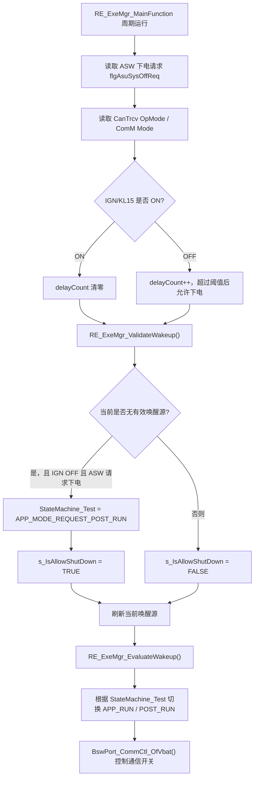
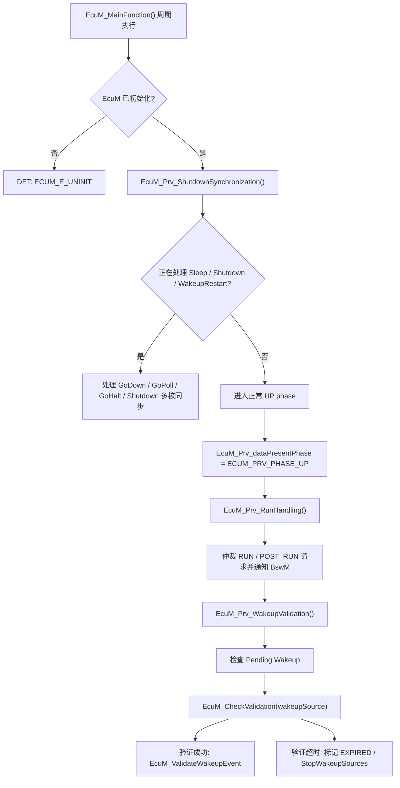
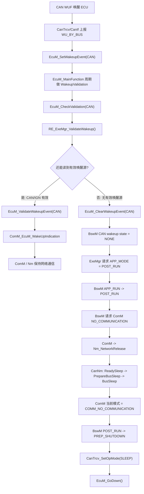

# 配置
## init & Goto Normal


CanTrcv_Init(NULL_PTR)
-> BswM_CanTrcv_GotoNormal()
   -> CanTrcv_SetOpMode(0, CANTRCV_TRCVMODE_NORMAL)
   -> CanTrcv_SetOpMode_SPI(0, CANTRCV_TRCVMODE_NORMAL)
### 解释

```
CanTrcv_SetOpMode()
  -> AUTOSAR 标准上层 API，提出“我要切模式”的请求
CanTrcv_SetOpMode_SPI()
  -> 针对 SPI 型 TJA1145 的底层状态机，负责拼 SPI 寄存器数据并确认模式切换
```

## 收发器的配置


解释一下CanTrcv的配置
我按你截图和工程生成文件看了一下：这个 `CanTrcv` 配置的是 **1 路 CAN 收发器 TJA 1145**，通过 **SPI** 控制，支持 **Bus Wakeup** 和 **硬件 PN/Selective Wake-up**。

**整体层级**  
`CanTrcv` 是 AUTOSAR CAN Transceiver Driver，位置在 `CanIf` 和外部 CAN 收发器芯片之间。它主要负责：

- 控制收发器模式：`NORMAL / STANDBY / SLEEP`
- 通过 SPI 配置 TJA 1145 寄存器
- 检测/上报 CAN 总线唤醒
- 配置 Partial Network，即只被特定 CAN ID/数据唤醒

你这里主要配置源是 [RTA_BIP_CanTrcv_EcucValues.arxml (line 15)](e:/github/ECAS_qirui_Single_Chamber/BasicSoftware/ecu_config/bsw/static/Other_Modules/RTA_BIP_CanTrcv_EcucValues.arxml:15)，生成结果在 [CanTrcv_Cfg.h (line 39)](e:/github/ECAS_qirui_Single_Chamber/BasicSoftware/src/bsw/CanTrcv/CanTrcv_Cfg.h:39)、[CanTrcv_Cfg.c (line 59)](e:/github/ECAS_qirui_Single_Chamber/BasicSoftware/src/bsw/CanTrcv/CanTrcv_Cfg.c:59)、[CanTrcv_PBcfg.c (line 43)](e:/github/ECAS_qirui_Single_Chamber/BasicSoftware/src/bsw/CanTrcv/CanTrcv_PBcfg.c:43)。

**CanTrcvGeneral**  
当前值大概是：

- `CanTrcvDevErrorDetect = true`：打开 DET 开发错误检测。
- `CanTrcvIndex = 0`：模块实例索引。
- `CanTrcvMainFunctionPeriod = 0.02`：`CanTrcv_MainFunction()` 周期 20 ms。
- `CanTrcvVersionInfoApi = false`：关闭版本信息 API。
- `CanTrcvWakeUpSupport = CANTRCV_WAKEUP_BY_POLLING`：唤醒通过轮询检测，不是中断方式。

工程里也能看到 RTE 周期调用了 `CanTrcv_MainFunction()`，位置在 [Rte.c (line 21149)](e:/github/ECAS_qirui_Single_Chamber/BasicSoftware/src/rte/gen/Rte.c:21149)。

**CanTrcvChannel_TJA 1145**  
这是唯一一个收发器通道，生成出来通道号是 0：

- `CanTrcvChannelUsed = true`：该通道启用。
- `CanTrcvRbHardwareType = TJA1145`：硬件芯片类型是 TJA 1145。
- `CanTrcvInitState = CANTRCV_OP_MODE_STANDBY`：初始化后默认进入 Standby。
- `CanTrcvMaxBaudrate = 500`：CAN 波特率 500 kbps。
- `CanTrcvHwPnSupport = true`：硬件支持 Partial Network/Selective Wake-up。
- `CanTrcvWakeupByBusUsed = true`：允许 CAN 总线唤醒 ECU。
- `CanTrcvControlsPowerSupply = false`：这个收发器不负责控制 ECU 主电源。

生成宏里也对应为：

- `CANTRCV_CFG_NUMBER_OF_CANTRCV = 1`
- `CANTRCV_CFG_SPI_USED = STD_ON`
- `CANTRCV_CFG_DIO_USED = STD_OFF`
- `CANTRCV_CFG_TJA1145_USED = STD_ON`
- `CANTRCV_CFG_HW_PN_SUPPORT = STD_ON`

**CanTrcvAccess / SPI**  
你截图里 `CanTrcvDioAccess` 是空的，实际使用的是 `CanTrcvSpiAccess`。

生成代码里 SPI 配置为：

```
FALSE,
SpiConf_SpiSequence_SpiSequence_CAN,
SpiConf_SpiChannel_SpiChannel_CAN
```

含义是：

- `CanTrcvSpiAccessSynchronous = false`：SPI 访问不是同步阻塞方式。
- `CanTrcvSpiSequenceName = SpiSequence_CAN`：使用 SPI 模块里的 `SpiSequence_CAN`。
- 实际 SPI Channel 是 `SpiChannel_CAN`。

也就是说，TJA 1145 的模式切换、状态读取、PN 寄存器配置，都是通过这个 SPI Sequence/Channel 发出去的。

**Partial Network**  
`CanTrcvPartialNetwork_0` 是选择性唤醒配置。当前标准 CanTrcv 生成值是：

- `CanTrcvBaudRate = 500`
- `CanTrcvPnCanIdIsExtended = false`：标准帧 ID，不是扩展帧。
- `CanTrcvPnFrameCanId = 1558`，十六进制是 `0x616`
- `CanTrcvPnFrameCanIdMask = 255`，十六进制是 `0x0FF`
- `CanTrcvPnFrameDlc = 8`
- `CanTrcvPnFrameDataMaskSpec[0..7]`：8 个数据字节掩码，其中 byte 2 的 mask 是 `0x1F`，其他基本是 0。

意思是：**==TJA 1145 可以在低功耗/Standby 下监听 CAN 总线，只有收到匹配 ID/mask/data mask 的 Wake-up Frame，才触发唤醒。数据掩码里 `index=2, mask=0x1F` 表示只关心第 2 个数据字节的低 5 bit。==**

**唤醒引用**  
`CanTrcvWakeupSourceRef` 指向：
`ECUM_WKSOURCE_INTERNAL_CAN`
生成值是 `0x20`，在 [EcuM_Cfg.h (line 271)](e:/github/ECAS_qirui_Single_Chamber/BasicSoftware/src/bsw/EcuM/EcuM_Cfg.h:271)。所以 CAN 收发器检测到有效唤醒后，会通过 EcuM 的 Wakeup Source 机制继续通知 BswM/ComM。
**和 CanIf 的关系**  
`CanIf` 里有引用指向这个通道：
`CanIfTrcvCanTrcvRef -> CanTrcvChannel_TJA1145`
所以 CanIf 调 `CanTrcv_SetOpMode()`、`CanTrcv_CheckWakeup()` 时，访问的就是这个 TJA 1145 通道。
一句话总结：你这份配置是 **单路 TJA 1145 CAN 收发器，SPI 控制，初始化 Standby，500 kbps，轮询唤醒，Bus Wakeup 接 EcuM 的 INTERNAL_CAN，带硬件 PN 唤醒帧过滤**。另外工程里 `CDD/CanTrcv/CANTrcv_Tja1145` 还有一套 TJA 1145 专用配置，值和 ETAS 标准 `BasicSoftware/src/bsw/CanTrcv` 生成配置不完全一致，后续如果调试唤醒问题，要确认实际编译链接用的是哪一套接口。


## 什么样的报文 ID 可以唤醒？

只看 **标准帧 ID 过滤** 的话，你这里能唤醒的不是单独 `0x616`，而是一组 ID。

当前配置在 [CanTrcv_PBcfg.c (line 99)](e:/github/ECAS_qirui_Single_Chamber/BasicSoftware/src/bsw/CanTrcv/CanTrcv_PBcfg.c:99) 里是：

```
CanTrcvPnCanIdIsExtended = FALSE   // 标准帧 11-bit
CanTrcvPnFrameCanId     = 1558     // 0x616
CanTrcvPnFrameCanIdMask = 255      // 0x0FF
CanTrcvPnFrameDlc       = 8
```

ID 匹配规则可以这样理解：

```
(RxCanId & Mask) == (WakeupCanId & Mask)
```

代入当前值：

```
(RxCanId & 0x0FF) == (0x616 & 0x0FF)
(RxCanId & 0x0FF) == 0x016
```

也就是说：**标准帧 ID 的低 8 bit 等于 `0x16` 就能通过 ID 匹配**，高 3 bit 不关心。

所以这些标准帧 ID 都匹配：

```
0x016
0x116
0x216
0x316
0x416
0x516
0x616
0x716
```

举例：

```
0x616 可以
0x516 可以
0x016 可以
0x615 不可以
0x617 不可以
0x600 不可以
```

为什么 `0x616` 不是唯一？因为你的 mask 是 `0x0FF`，只比较低 8 位。标准帧是 11 bit，如果想 **只有 `0x616` 能唤醒**，mask 应该配成：

```
CanTrcvPnFrameCanIdMask = 0x7FF
```

这样公式就是：

```
(RxCanId & 0x7FF) == (0x616 & 0x7FF)
```

只剩 `0x616` 匹配。

另外提醒一下：ID 只是第一关。你这里还配置了 `DLC = 8`，并且 data mask 里第 3 个字节 `index=2` 的 mask 是 `0x1F`，所以实际 WUF 还会受 DLC/数据字段过滤影响。单纯从 ID 看，就是上面这 8 个标准帧 ID。

### CAN 报文格式‘

CAN 报文通常指 **CAN 数据帧**，常用描述格式可以写成：

```
CAN_ID + DLC + DATA
```

例如：

```
ID: 0x123
DLC: 8
DATA: 11 22 33 44 55 66 77 88
```

底层标准 CAN 帧格式大致是：

```
SOF | 仲裁场 | 控制场 | 数据场 | CRC | ACK | EOF
```

其中最常用的字段是：

|字段|含义|
|---|---|
| `CAN ID` |报文标识符，标准帧 11 bit，扩展帧 29 bit|
| `RTR` |远程帧标志，数据帧一般为 0|
| `IDE` |标准帧/扩展帧标志|
| `DLC` |数据长度，经典 CAN 为 0-8 字节|
| `DATA` |实际数据内容|
| `CRC` |校验|
| `ACK` |应答|
| `EOF` |帧结束|

经典 CAN 的应用层常见写法：

```
0x123  8  11 22 33 44 55 66 77 88
```

意思是：

```
报文ID = 0x123
数据长度 = 8字节
数据 = 0x11 0x22 0x33 0x44 0x55 0x66 0x77 0x88
```

如果是 **CAN FD**，数据区可以到 **64 字节**，并且控制字段里会多出 `FDF`、`BRS`、`ESI` 等标志位。

### 发一帧 CAN 报文总共是多少字节呢

经典 CAN 不是按“字节”在总线上发，而是按 **bit** 发；总长度还会受 **标准帧/扩展帧、数据长度、位填充**影响。

常用结论：

|类型|8 字节数据时，理论长度|
|---|---|
|标准帧，11-bit ID|约 **108 bit**，约 **13.5 字节**|
|标准帧 + 帧间隔|约 **111 bit**，约 **13.875 字节**|
|扩展帧，29-bit ID|约 **128 bit**，约 **16 字节**|
|扩展帧 + 帧间隔|约 **131 bit**，约 **16.375 字节**|

但 CAN 总线上还有 **位填充 bit stuffing**：连续 5 个相同电平后会插入 1 bit，所以实际发送长度会更长一些。

如果你问的是软件里发送接口，比如：

```
CAN_ID + DLC + DATA[8]
```

那应用层有效数据最多就是 **8 字节**，但总线上真正发出去的帧远不止 8 字节。

简单记：  
**标准 CAN，8 字节数据，一帧大约 110 bit 左右；扩展帧大约 130 bit 左右，不含位填充的变化。**


### 报文的数据过滤是什么？


### 当前配置没有报文 ID 过滤为什么实际上有过滤？
首先澄清一个事实，CANid mask 1 代表 not care,0 代表 care


<mark style="background: #FF5582A6;">现在就是 0 x 6 xx 都可以正常的唤醒，但是 PnEnabled 没有使用，应该是唤醒不了的！</mark>
<mark style="background: #BBFABBA6;">上面这句话是错的!！</mark>

`CanTrcvPnEnabled` **不决定“哪些 CAN ID 能唤醒”**。它只是 selective wake-up 的**硬件使能开关**。

真正决定 ID 过滤条件的是这些参数：

- `CanTrcvPnFrameCanId`：目标唤醒 ID，比如你这里是 `1558 = 0x616`
- `CanTrcvPnFrameCanIdMask`：ID mask，比如 `255 = 0x0FF`
- `CanTrcvPnCanIdIsExtended`：标准帧还是扩展帧
- `CanTrcvPnFrameDlc`
- `CanTrcvPnFrameDataMaskSpec[]`：数据字节过滤

所以逻辑应该是：

```
CanTrcvPnEnabled = TRUE
    -> 启用硬件 selective wakeup
    -> 再用 CanId / CanIdMask / DLC / DataMask 判断哪类报文能唤醒

CanTrcvPnEnabled = FALSE
    -> 关闭硬件 selective wakeup
    -> 理论上不应该再按 ID/mask 做 WUF 过滤
```

但你这个工程里有个关键点：虽然 `CanTrcvPnEnabled_b = FALSE`，生成的 TJA 1145 SPI 配置里 `Reg 0x20 CAN control = 0x4030`，而驱动里定义 `CANTRCV_TJA1145_SPI_CPNC_MASK = 0x10`。也就是说，按这份代码看，CAN control 的 `0x30` 里面包含了 CPNC 位，硬件 PN/选择性唤醒相关位仍然被置上了。

另外驱动真正改这个硬件位的是 [CanTrcv_PrepareWakeUp.c (line 126)](E:/github/ECAS_qirui_Single_Chamber/BasicSoftware/src/bsw/CanTrcv/src/CanTrcv_PrepareWakeUp.c:126) 里的 `CanTrcv_SetPnActivationStateMachine()`，不是 `CanTrcvPnEnabled_b` 本身直接决定。

所以结论是：

`CanTrcvPnEnabled` 从 AUTOSAR 参数语义上是 selective wakeup 的总开关；但它不是 ID 匹配规则。你当前工程的实际表现，要看 TJA 1145 寄存器最终怎么写。现在看起来是：即使配置项是 `FALSE`，寄存器表仍然把选择性唤醒相关位打开了，所以 `0x600`、`0x611` 会按 `0x616 + mask 0x0FF` 的规则正常唤醒。


## Goto Sleep
这个 ActionList 被两条规则触发：
```
BswM_MDG == POST_RUN
&& WKSRC_IGN == NONE
&& ComM_Can_Network_ETAS == COMM_NO_COMMUNICATION
&& WKSRC_CAN == NONE
```


```
BswM_MDG == RUN
&& WKSRC_IGN == NONE
&& WKSRC_CAN == NONE
```


```
DcmEcuReset == HARD
|| DcmEcuReset == JUMPTOBOOTLOADER
```


**正常休眠/下电时，RUN 或 POST_RUN 满足无唤醒源条件会触发；诊断请求 HARD reset 或跳 Bootloader 也会触发。** 这些 ActionList 都是 `BSWM_TRIGGER` 类型，规则从非 TRUE 变成 TRUE 时执行一次。


我按你截图和工程生成文件看了一下：这个 `CanTrcv` 配置的是 **1 路 CAN 收发器 TJA1145**，通过 **SPI** 控制，支持 **Bus Wakeup** 和 **硬件 PN/Selective Wake-up**。

**整体层级**  
`CanTrcv` 是 AUTOSAR CAN Transceiver Driver，位置在 `CanIf` 和外部 CAN 收发器芯片之间。它主要负责：

- 控制收发器模式：`NORMAL / STANDBY / SLEEP`
- 通过 SPI 配置 TJA1145 寄存器
- 检测/上报 CAN 总线唤醒
- 配置 Partial Network，即只被特定 CAN ID/数据唤醒

你这里主要配置源是 [RTA_BIP_CanTrcv_EcucValues.arxml (line 15)](e:/github/ECAS_qirui_Single_Chamber/BasicSoftware/ecu_config/bsw/static/Other_Modules/RTA_BIP_CanTrcv_EcucValues.arxml:15)，生成结果在 [CanTrcv_Cfg.h (line 39)](e:/github/ECAS_qirui_Single_Chamber/BasicSoftware/src/bsw/CanTrcv/CanTrcv_Cfg.h:39)、[CanTrcv_Cfg.c (line 59)](e:/github/ECAS_qirui_Single_Chamber/BasicSoftware/src/bsw/CanTrcv/CanTrcv_Cfg.c:59)、[CanTrcv_PBcfg.c (line 43)](e:/github/ECAS_qirui_Single_Chamber/BasicSoftware/src/bsw/CanTrcv/CanTrcv_PBcfg.c:43)。

**CanTrcvGeneral**  
当前值大概是：

- `CanTrcvDevErrorDetect = true`：打开 DET 开发错误检测。
- `CanTrcvIndex = 0`：模块实例索引。
- `CanTrcvMainFunctionPeriod = 0.02`：`CanTrcv_MainFunction()` 周期 20 ms。
- `CanTrcvVersionInfoApi = false`：关闭版本信息 API。
- `CanTrcvWakeUpSupport = CANTRCV_WAKEUP_BY_POLLING`：唤醒通过轮询检测，不是中断方式。

工程里也能看到 RTE 周期调用了 `CanTrcv_MainFunction()`，位置在 [Rte.c (line 21149)](e:/github/ECAS_qirui_Single_Chamber/BasicSoftware/src/rte/gen/Rte.c:21149)。

**CanTrcvChannel_TJA1145**  
这是唯一一个收发器通道，生成出来通道号是 0：

- `CanTrcvChannelUsed = true`：该通道启用。
- `CanTrcvRbHardwareType = TJA1145`：硬件芯片类型是 TJA1145。
- `CanTrcvInitState = CANTRCV_OP_MODE_STANDBY`：初始化后默认进入 Standby。
- `CanTrcvMaxBaudrate = 500`：CAN 波特率 500 kbps。
- `CanTrcvHwPnSupport = true`：硬件支持 Partial Network/Selective Wake-up。
- `CanTrcvWakeupByBusUsed = true`：允许 CAN 总线唤醒 ECU。
- `CanTrcvControlsPowerSupply = false`：这个收发器不负责控制 ECU 主电源。

生成宏里也对应为：

- `CANTRCV_CFG_NUMBER_OF_CANTRCV = 1`
- `CANTRCV_CFG_SPI_USED = STD_ON`
- `CANTRCV_CFG_DIO_USED = STD_OFF`
- `CANTRCV_CFG_TJA1145_USED = STD_ON`
- `CANTRCV_CFG_HW_PN_SUPPORT = STD_ON`

**CanTrcvAccess / SPI**  
你截图里 `CanTrcvDioAccess` 是空的，实际使用的是 `CanTrcvSpiAccess`。

生成代码里 SPI 配置为：

```
FALSE,
SpiConf_SpiSequence_SpiSequence_CAN,
SpiConf_SpiChannel_SpiChannel_CAN
```

含义是：

- `CanTrcvSpiAccessSynchronous = false`：SPI 访问不是同步阻塞方式。
- `CanTrcvSpiSequenceName = SpiSequence_CAN`：使用 SPI 模块里的 `SpiSequence_CAN`。
- 实际 SPI Channel 是 `SpiChannel_CAN`。

也就是说，TJA1145 的模式切换、状态读取、PN 寄存器配置，都是通过这个 SPI Sequence/Channel 发出去的。

**Partial Network**  
`CanTrcvPartialNetwork_0` 是选择性唤醒配置。当前标准 CanTrcv 生成值是：

- `CanTrcvBaudRate = 500`
- `CanTrcvPnCanIdIsExtended = false`：标准帧 ID，不是扩展帧。
- `CanTrcvPnFrameCanId = 1558`，十六进制是 `0x616`
- `CanTrcvPnFrameCanIdMask = 255`，十六进制是 `0x0FF`
- `CanTrcvPnFrameDlc = 8`
- `CanTrcvPnFrameDataMaskSpec[0..7]`：8 个数据字节掩码，其中 byte2 的 mask 是 `0x1F`，其他基本是 0。

意思是：TJA1145 可以在低功耗/Standby 下监听 CAN 总线，只有收到匹配 ID/mask/data mask 的 Wake-up Frame，才触发唤醒。数据掩码里 `index=2, mask=0x1F` 表示只关心第 2 个数据字节的低 5 bit。

**唤醒引用**  
`CanTrcvWakeupSourceRef` 指向：

`ECUM_WKSOURCE_INTERNAL_CAN`

生成值是 `0x20`，在 [EcuM_Cfg.h (line 271)](e:/github/ECAS_qirui_Single_Chamber/BasicSoftware/src/bsw/EcuM/EcuM_Cfg.h:271)。所以 CAN 收发器检测到有效唤醒后，会通过 EcuM 的 Wakeup Source 机制继续通知 BswM/ComM。

**和 CanIf 的关系**  
`CanIf` 里有引用指向这个通道：

`CanIfTrcvCanTrcvRef -> CanTrcvChannel_TJA1145`

所以 CanIf 调 `CanTrcv_SetOpMode()`、`CanTrcv_CheckWakeup()` 时，访问的就是这个 TJA1145 通道。

一句话总结：你这份配置是 **单路 TJA1145 CAN 收发器，SPI 控制，初始化 Standby，500 kbps，轮询唤醒，Bus Wakeup 接 EcuM 的 INTERNAL_CAN，带硬件 PN 唤醒帧过滤**。另外工程里 `CDD/CanTrcv/CANTrcv_Tja1145` 还有一套 TJA1145 专用配置，值和 ETAS 标准 `BasicSoftware/src/bsw/CanTrcv` 生成配置不完全一致，后续如果调试唤醒问题，要确认实际编译链接用的是哪一套接口。


---


# RE_ExeMgr_MainFunction

它的核心作用是：**根据点火状态、ASW 下电请求、唤醒源有效性，决定 ECU 是否继续 APP_RUN，还是进入 POST_RUN 准备下电；同时更新唤醒源和通信控制状态。**





# EcuM_MainFunction
`EcuM_MainFunction()` 是 **EcuM 在 OS 运行后的周期主函数**。你工程里它被 RTE 映射到 20 ms BSW task 里调用，Core 0/Core 1 都有映射：  
[RTA_Rte_EcucValues.arxml (line 121)](E:/github/ECAS_qirui_Single_Chamber/BasicSoftware/ecu_config/rte/static/RTA_Rte_EcucValues.arxml:121)

主函数本体在这里：  
[EcuM_MainFunction.c (line 117)](E:/github/ECAS_qirui_Single_Chamber/BasicSoftware/src/bsw/EcuM/src/EcuM_MainFunction.c:117)

核心作用可以概括为三件事：

1. **处理 Sleep/Shutdown 流程**
    
    - 先调用 `EcuM_Prv_ShutdownSynchronization()`
    - 如果当前正在 `GoDown / GoPoll / GoHalt / WakeupRestart`，就优先处理下电、睡眠、多核同步等流程
    - 如果已经处理了 shutdown/sleep，它返回 `E_OK`，主函数后面就不再做正常 UP 流程
2. **处理 RUN / POST_RUN 仲裁**
    
    - 正常运行时设置当前 phase 为 `ECUM_PRV_PHASE_UP`
    - 调用 `EcuM_Prv_RunHandling()`
    - 它会检查 EcuM Flex User 是否请求 RUN 或 POST_RUN
    - 然后通过 `BswM_EcuM_RequestedState()` 通知 BswM
3. **处理 Wakeup Validation**
    
    - 调用 `EcuM_Prv_WakeupValidation()`
    - 对 pending wakeup source 调用 `EcuM_CheckValidation()`
    - 如果验证成功，应用侧会调用 `EcuM_ValidateWakeupEvent()`
    - 如果超时没验证成功，就标记为 `EXPIRED`，并通知 BswM

流程大概是这样：




跟你前面看的 CAN 唤醒关系最大的是这一段：  
[EcuM_MainFunction.c (line 773)](E:/github/ECAS_qirui_Single_Chamber/BasicSoftware/src/bsw/EcuM/src/EcuM_MainFunction.c:773)

```
if (EcuM_Prv_dataOldPendingWakeupEvents_u32 != ECUM_NO_WKUP_SRC)
{
    ...
    EcuM_CheckValidation(EcuM_Cfg_idxWakeupSourcesPC_au32[cntrLoopCtr_u8].WakeupSourceId);
}
```

也就是说，`EcuM_SetWakeupEvent()` 只是把 wakeup source 放到 pending；真正周期性去确认这个唤醒源是否有效，是 `EcuM_MainFunction()` 里调用 `EcuM_CheckValidation()` 完成的。而你工程里的 `EcuM_CheckValidation()` 又会走到 `RE_ExeMgr_ValidateWakeup()`，再去判断 IGN/CAN 唤醒源。


# 为什么我已经停发唤醒报文了，但是 CanIf_GetTrcvWakeupReason 仍然能读到 2，也就是 WU_BY_BUS

是正常现象：`CanIf_GetTrcvWakeupReason()` 读到 `2 / CANTRCV_WU_BY_BUS`，并不表示“当前总线上还在发唤醒报文”，而是表示**收发器/驱动曾经检测到 CAN bus wakeup，并且这个 wakeup reason 还没有被清掉**。

你工程里的调用链是：

```
CanIf_GetTrcvWakeupReason()
  -> CanTrcv_GetBusWuReason()
    -> CanTrcv_GetBusWuReason_SPI()
      -> 读取 CanTrcv_Internal_st.CanTrcv_Runtime[0].CanTrcv_TrcvWakeupReason
```

关键代码在 [CanTrcv_FetchWakeUp.c (line 373)](E:/github/ECAS_qirui_Single_Chamber/BasicSoftware/src/bsw/CanTrcv/src/CanTrcv_FetchWakeUp.c:373)：

```
*reason = CanTrcv_Internal_st.CanTrcv_Runtime[Transceiver].CanTrcv_TrcvWakeupReason;
```

所以它读的是**软件缓存的唤醒原因**，不是实时判断“现在有没有 CAN 报文”。

这个值在哪里被置成 `WU_BY_BUS`？在 `CanTrcv_MainFunction_SPI()` 中，如果 TJA 1145 的事件寄存器里 `CW` 位还在，就会写：

```
CanTrcv_TrcvWakeupReason = CANTRCV_WU_BY_BUS;
CanTrcv_CurrentWakeupFlag = TRUE;
```

对应位置：  
[CanTrcv_MainFunction.c (line 105)](E:/github/ECAS_qirui_Single_Chamber/BasicSoftware/src/bsw/CanTrcv/src/CanTrcv_MainFunction.c:105)

TJA 1145 的 `CW` 这类 wake event 是**锁存事件位**，不是报文实时状态。你停发 `0x600/0x611` 后，这个位不会自动消失，必须清。

你当前应用里清除入口是：  
[ExeMgrUT.c (line 94)](E:/github/ECAS_qirui_Single_Chamber/ASW/SWC/ExeMgrUT/src/ExeMgrUT.c:94)

```
CanIf_SetTrcvWakeupMode(..., CANTRCV_WUMODE_CLEAR);
```

但注意两个点：

1. 这个清除只在 `RE_ExeMgr_ValidateWakeup()` 或 `RE_ExeMgr_EvaluateWakeup()` 判断到 CAN wake 后才调用。
2. 对 SPI TJA 1145 来说，硬件 WUF 清除是通过 `CanTrcv_MainFunction_SPI()` 后续跑状态机写寄存器完成的，不是你调用 API 那一瞬间就一定完全清完。

更直接的 PN/WUF 清除 API 是：

```
CanIf_ClearTrcvWufFlag(CanIfConf_canIfTrcvCfg_CanIfTrcvCfg_1145);
```

它会走到 `CanTrcv_ClearTrcvWufFlag()`，然后请求清 TJA 1145 的 `CW/PNFDE` 等事件位：  
[CanTrcv_FetchWakeUp.c (line 638)](E:/github/ECAS_qirui_Single_Chamber/BasicSoftware/src/bsw/CanTrcv/src/CanTrcv_FetchWakeUp.c:638)

所以结论：

你停发唤醒报文后仍读到 `2`，不是说明报文还在，而是 **TJA 1145/CanTrcv 的 wakeup reason 被锁存了**。要让它变回非 `WU_BY_BUS`，需要确认清除流程真的执行，并且 `CanTrcv_MainFunction` 已经跑过足够周期把 SPI 清寄存器操作发出去。


# CAN 唤醒只是触发唤醒的条件并不是维持唤醒的条件

在 AUTOSAR 里，**CAN 唤醒报文停发本身不会直接触发下电**。它只是“不再产生新的唤醒事件”。真正下电靠这条链路：




# 对于当前的代码而言，如果 CAN 唤醒后，CAN 唤醒报文丢失了，那么此时收发器应该没有被触发唤醒，这个时候收发器处在什么模式下？INH 是高还是低？还是说继续维持之前的状态？通过走下电流程后，才实现了 INH 拉低进入 sleep 状态？

基于当前代码，结论是：

CAN 唤醒一旦被软件识别成 `L9388_CAN_Wakeup`，说明 TJA 1445 已经上报了 `CANTRCV_WU_BY_BUS`，并不是“收发器没有被唤醒”。这时 [PwrSplyDrv_GetWakeupState (line 103)](e:/github/tc377_l9388/src/00BSW/04ComplexDrivers/CD005A_PwrSplyDrvCtrl/L9388/src/CDD_L9388.c:103) 会设置 `McuWakeUpSrc = L9388_CAN_Wakeup`，并且 `CDD_L9388_Set_PHOLD_BIT(1)`，也就是自保持拉住。随后 [Tja1445_Init (line 60)](e:/github/tc377_l9388/src/00BSW/04ComplexDrivers/CD005A_PwrSplyDrvCtrl/src/Tja14xx.c:60) 还会把收发器设到 `CANTRCV_TRCVMODE_NORMAL`。所以这种情况下，运行期间收发器是 Normal，保持电源的 PHOLD/等效 INH 是高/有效。

如果你说的“CAN 唤醒报文丢失”是指后续 NM/PNC 报文没收到或没有活动请求，那么 [NmUT.c (line 391)](e:/github/tc377_l9388/ASW/NmUT/src/NmUT.c:391) 的 CAN wake 分支会在 debounce 到 600 后请求 `COMM_NO_COMMUNICATION`，但这个调用本身只是 ComM 请求，不会直接拉低 INH。真正拉低发生在下电链路最后：[Ecu_SwitchOff (line 95)](e:/github/tc377_l9388/BasicSoftware/BasicSoftware/integration/src/ecu/StartupShutdown/src/Ecu.c:95) 里先 `Tja1445_GotoSleep()`，成功后才 `CDD_L9388_Set_PHOLD_BIT(0)`。

如果 TJA 1445 根本没有检测到 CAN wake，也就是 `CanTrcv_TrcvWakeupReason != CANTRCV_WU_BY_BUS`，那当前软件不会进入 CAN wake 逻辑。严格说：若 ECU 没有被别的源拉起来，代码根本不会运行，收发器保持之前的低功耗状态，INH/保持信号不应被新拉高；若 ECU 因别的/异常原因起来，当前代码可能走 invalid 或默认 KL 15 分支，再由后续 KL 15 检测或下电流程处理。

所以你的理解基本对：**已识别 CAN wake 后，INH/PHOLD 会先保持高；只有走完 NoCom/NM sleep/EcuM shutdown 后，才通过 `Tja1445_GotoSleep()` + `PHOLD=0` 进入 sleep/断保持。**

# 代码中是怎么检测到没有唤醒报文了的？

简短说：当前代码没有专门检测“CAN 唤醒报文停发”这个事件。它检测到的是“CanNm/NM 报文不再被接收”，而且这个检测主要在 CanNm BSW 里，不在 `NmUT` 应用逻辑里。

链路是这样的：

1. 启动时只判断一次“是不是 CAN 唤醒”  
    [Tja14xx.c (line 60)](E:/github/tc377_l9388/src/00BSW/04ComplexDrivers/CD005A_PwrSplyDrvCtrl/src/Tja14xx.c:60) 里初始化 TJA 1445 后调用 `CanTrcv_43_TJA14XX_PN_GetBusWuReason()`，然后设置收发器到 `NORMAL`。  
    [CDD_L9388.c (line 103)](E:/github/tc377_l9388/src/00BSW/04ComplexDrivers/CD005A_PwrSplyDrvCtrl/L9388/src/CDD_L9388.c:103) 里根据 `CanTrcv_TrcvWakeupReason == CANTRCV_WU_BY_BUS` 把 `McuWakeUpSrc` 置为 `L9388_CAN_Wakeup`。
    
2. 唤醒后，如果报文不再来，是 CanNm 超时器感知  
    [CanNm_RxIndication.c (line 226)](E:/github/tc377_l9388/BasicSoftware/BasicSoftware/src/bsw/CanNm/src/CanNm_RxIndication.c:226) 每收到 NM PDU 会拷贝到 `RxBuffer_au8`，并置 `RxIndication_b = TRUE`。  
    [CanNm_Inl.h (line 223)](E:/github/tc377_l9388/BasicSoftware/BasicSoftware/src/bsw/CanNm/api/CanNm_Inl.h:223) 看到 `PduRxInd_b` 后会重启 `ctNMTimeoutTimer`。  
    所以停发后，本质就是 `RxIndication_b` 不再来，`ctNMTimeoutTimer` 不再被刷新。
    
3. 但是否下电取决于当前 Nm 状态  
    在 `READY_SLEEP` 下，NM timeout 到期会进 `PREPARE_BUS_SLEEP`：[CanNm_Inl.h (line 550)](E:/github/tc377_l9388/BasicSoftware/BasicSoftware/src/bsw/CanNm/api/CanNm_Inl.h:550)。  
    然后 `WaitBusSleepTime` 到期进入 `BUS_SLEEP`：[CanNm_Inl.h (line 451)](E:/github/tc377_l9388/BasicSoftware/BasicSoftware/src/bsw/CanNm/api/CanNm_Inl.h:451)。  
    但如果还在 `NORMAL_OPERATION` 且本 ECU 仍然请求网络，timeout 只是作为异常网络超时处理，并不会直接睡眠：[CanNm_Inl.h (line 639)](E:/github/tc377_l9388/BasicSoftware/BasicSoftware/src/bsw/CanNm/api/CanNm_Inl.h:639)。
    
4. `NmUT` 里当前没有用报文停发来判定  
    [NmUT.c (line 259)](E:/github/tc377_l9388/ASW/NmUT/src/NmUT.c:259) 虽然读了 `PNIbit` 和 `receivedUserdata`，但真正判断 PNI/userdata 无效并切 `POST_RUN` 的逻辑都被注释掉了。  
    当前 CAN wake 分支主要是靠 `Asw_SumActv`、`NoAct` 和 `counter_debounce >= 600` 后调用：  
    `Rte_Call_UR_PNCUser_30_RequestComMode(COMM_NO_COMMUNICATION)`，见 [NmUT.c (line 391)](E:/github/tc377_l9388/ASW/NmUT/src/NmUT.c:391)。
    

所以结论是：停发 CAN 唤醒报文本身没有被应用层显式检测；代码靠 CanNm 的 NM timeout 间接感知“NM 报文不再来”。如果本 ECU 已经释放网络请求，后续会通过 `READY_SLEEP -> PREPARE_BUS_SLEEP -> BUS_SLEEP` 进入下电链路；如果本 ECU 仍保持 FULL 请求，则不会因为停发报文本身直接下电。


 # **什么是网络管理报文**
 
 网络管理报文，也就是 **NM 报文 / Network Management PDU**，是 ECU 之间用来“商量网络是否保持唤醒、是否可以睡眠、谁还需要通信”的专用报文。

在 AUTOSAR CAN 网络里，它通常由 **CanNm** 模块周期发送和接收，不是普通应用信号报文，也不是诊断报文。

结合你这个工程：

- NM Tx 报文：`NM_Tx_0x60B`
- NM Rx 报文：`NM_Rx_0x616`
- 发送路径：`Nm/CanNm -> CanIf -> Can Driver -> CAN Bus`
- 接收路径：`CAN Bus -> CanIf -> CanNm -> Nm/ComM`
- 你的工程里 NM 用户数据还启用了：`NM_USER_DATA_ENABLED STD_ON`、`NM_COM_USER_DATA_SUPPORT STD_ON`

简单说，网络管理报文的作用是：

1. **保持网络唤醒**  
    只要 ECU 还需要通信，就周期发送 NM 报文，告诉其他节点“我还醒着”。
    
2. **协调网络睡眠**  
    如果大家都不再需要通信，NM 状态机会逐步进入 Prepare Bus-Sleep / Bus-Sleep，让网络安静下来，降低功耗。
    
3. **通知节点状态**  
    NM 报文里通常有 Node ID、Control Bit Vector，也可能有 User Data。其他 ECU 可以知道是谁发的、是否请求 Repeat Message、是否主动唤醒等。
    
4. **支持唤醒和部分网络**  
    如果配置了 Partial Networking，收发器还能根据特定 NM 报文或唤醒帧判断是否唤醒 ECU。你工程里 TJA 1145 硬件支持 PN，但 `CanTrcvPnEnabled=false`，所以目前看不是启用状态。
    

你可以把 NM 报文理解成 CAN 网络里的“值班签到报文”：普通报文负责业务数据，诊断报文负责维修测试，NM 报文负责告诉整个网络“谁还在线、谁还需要这条总线醒着”。


# CAN 唤醒后为什么下不了电


这张图说明：**Nm/ComM 已经没问题了，真正卡住的是 CAN wake 源还没有从 EcuM/BswM 清掉。**

现在状态：

```
ComM_Mode = 0                                  // COMM_NO_COMMUNICATION，OK
BswM_Cfg_ComMIndicationModeInfo_ast[0] = 0      // BswM 已收到 NoCom，OK
CanNm_RamData_s[0].Mode_en = NM_MODE_BUS_SLEEP  // Nm 已 BusSleep，OK
CanNm_RamData_s[0].State_en = NM_STATE_BUS_SLEEP// Nm 已 BusSleep，OK
s_IsAllowShutDown = TRUE                        // ExeMgr 允许下电，OK
```

但这两个还不对：

```
EcuM_Prv_dataValidatedWakeupEvents_u32 = 32
BswM_Cfg_EcuMWkpSrcInfo_ast[0].dataState = 2
WakeupSrc = 32
```

`dataState = 2` 就是：

```
ECUM_WKSTATUS_VALIDATED
```

所以 BswM 仍然认为 **CAN wake 是有效唤醒源**。而你们下电规则要求：

```
CAN wake == ECUM_WKSTATUS_NONE
```

因此不会从 `RUN` 走到 `PREP_SHUTDOWN`。

最关键的是这个：

```
WakeupSrc = 32
```

这表示 `RE_ExeMgr_GetWakeupSource()` 现在仍然判断当前唤醒源是 CAN。它里面判断 CAN 的条件是：

```
CanIf_GetTrcvWakeupReason(...) == E_OK
&& trcvWakeupReason == CANTRCV_WU_BY_BUS
```

所以你下一步要看：

```
CanTrcv_TrcvWakeupReason
CanTrcv_Internal_st.CanTrcv_Runtime[0].CanTrcv_TrcvWakeupReason
```

如果它还是 `CANTRCV_WU_BY_BUS`，那就是 transceiver wake reason 没清干净。  
如果它已经不是 `WU_BY_BUS`，但 `WakeupSrc` 还一直是 32，那就说明 `RE_ExeMgr_GetWakeupSource()` 没有再执行，或者判断路径里还有别的地方把 `WakeupSrc` 重新置成 CAN。

当前一句话结论：**网络已经睡了，但 ECU 不下电，是因为 EcuM/BswM 侧 CAN wake 仍是 VALIDATED，必须先让 `WakeupSrc` 从 32 变成 0，并让 `BswM_Cfg_EcuMWkpSrcInfo_ast[0].dataState` 从 2 变成 0。**


# 为什么代码中不直接去读取唤醒状态来进行判断？而只能在初始化里读一次

**TJA 1145 的 selective wake-up / WUF 检测器是否捕获到了匹配唤醒帧**。

结论先说：**TJA 1145 没有一个“当前正在收到匹配唤醒报文 = 1，停发后 = 0”的实时状态位。**

它能给你的更像是这几类状态：

1. **是否曾经捕获到 CAN wake-up/WUF 事件**  
    看 `REG63.CW`，这是锁存事件。
    
    工程里对应：
    
    ```
    CanTrcv_Prv_TJA1145_SpiCtrlRxBuf_ao[CanTrcvMapId][CANTRCV_TJA1145_SPI_REG63]
        & CANTRCV_TJA1145_SPI_CW_MASK
    ```
    
    定义：
    
    ```
    #define CANTRCV_TJA1145_SPI_REG63    3
    #define CANTRCV_TJA1145_SPI_CW_MASK  0x01u
    ```
    
    代码位置：[CanTrcv_FetchWakeUp.c (line 419)](/E:/github/ECAS_qirui_Single_Chamber/BasicSoftware/src/bsw/CanTrcv/src/CanTrcv_FetchWakeUp.c:419)
    
    这个位为 1，只能说明：**TJA 1145 曾经检测到 CAN wake-up event**。它不会因为唤醒报文停发就自动变 0，必须清。
    
2. **当前 CAN 总线是否静默**  
    看 `REG22.CBSS`。
    
    ```
    REG22.CBSS = 0  // CAN bus active，有通信
    REG22.CBSS = 1  // CAN bus inactive，静默超过 tto(silence)
    ```
    
    工程里 API 是：
    
    ```
    CanTrcv_ReadTrcvSilenceFlag(0, &flag);
    ```
    
    但它只能说明总线有没有通信，**不能说明是不是匹配唤醒帧**。
    

所以如果你想判断“唤醒报文停发了没有”，TJA 1145 本身不能直接给一个理想状态位。比较合理的判断组合是：

```
REG63.CW = 1
    说明曾经捕获到过唤醒帧 / CAN wake event

REG63.CW = 0
    说明当前没有锁存的 wake event

REG22.CBSS = 1
    说明当前总线已经静默

REG22.CBSS = 0
    说明总线上还有 CAN 通信，但不一定是唤醒帧
```

你可以这样理解：

```
CW 是“发生过匹配唤醒事件”的锁存标志
CBSS 是“总线现在有没有通信”的静默标志
没有一个位能表示“匹配唤醒帧正在持续发送”
```

如果你要做下电判断，建议还是别靠 TJA 1145 判断“唤醒报文停发”。应该靠：

```
CanNm timeout
CanNm_State == NM_STATE_BUS_SLEEP
ComM == COMM_NO_COMMUNICATION
```

TJA 1145 的 `CW/WU_BY_BUS` 只适合用来判断“这次 ECU 是不是被 CAN 唤醒的”，不适合判断“唤醒报文现在还在不在”。


# 我不太理解所谓的 bswM 自己的模式 MDG 和 SWC_APP mode，这个模式是怎么设置设置的？这个 MRP 就是设置的模式吗


可以这样理解，先把几个名词分开：

`MDG` = Mode Declaration Group，模式声明组。  
它只是定义一组模式值，比如：

```
STARTUP_ONE
STARTUP_TWO
RUN
APP_RUN
POST_RUN
PREP_SHUTDOWN
SHUTDOWN
```

`MRP` = Mode Request Port，模式请求端口。  
它不是“设置模式”的动作本身，而是 **BswM 接收某一路模式输入的入口**。比如你图里的：

```
BswM_MRP_BSWM_MDG
BswM_MRP_SWC_AppMode
BswM_MRP_WKSRC_IGN
BswM_MRP_WKSRC_CAN
```

意思分别是：

```
BswM_MRP_BSWM_MDG      BswM 自己/系统状态这一路输入
BswM_MRP_SWC_AppMode   SWC 应用请求这一路输入
BswM_MRP_WKSRC_IGN     IGN 唤醒源状态这一路输入
BswM_MRP_WKSRC_CAN     CAN 唤醒源状态这一路输入
```

真正“设置模式”的地方，是调用类似这种通知函数或 RTE Switch：

```
Rte_Switch_PP_BswM_APPMode_MDGP_APPMode(APP_RUN);
Rte_Switch_PP_BswM_APPMode_MDGP_APPMode(POST_RUN);
```

在你代码里，`ExeMgrUT.c` 这里就是 SWC 设置 `SWC_AppMode` 的来源：

```
Rte_Switch_PP_BswM_APPMode_MDGP_APPMode(
    RTE_MODE_MDG_ECUM_STATE_ECUM_STATE_POST_RUN
);
```

它最终会通知 BswM：

```
BswM_MRP_SWC_AppMode = POST_RUN
```

而 `BswM_MRP_BSWM_MDG` 更像 BswM 内部维护/系统当前所在的大状态。它会因为 BswM 规则和动作执行后变化，比如：

```
RUN -> APP_RUN
APP_RUN -> POST_RUN
POST_RUN -> PREP_SHUTDOWN
```

你截图里的逻辑表达式：

```
BswM_LE_Run2AppRun_SubLE
BswMLogicalOperator = BSWM_OR
Arguments:
  BswM_MC_WKSRC_IGN_Valid
  BswM_MC_WKSRC_CAN_Valid
```

意思是：

```
如果 IGN 有效 或 CAN 唤醒有效
则 Run2AppRun 的子条件成立
```

注意这里：

```
BswM_MC_xxx
```

是 Mode Condition，模式条件。它不是设置模式，而是判断某个 MRP 当前是不是某个值。

所以整条链路大概是：

```
EcuM/CanIf/ComM/SWC 等模块上报模式
        |
        v
BswM_MRP_xxx 保存这些模式输入
        |
        v
BswM_MC_xxx 判断某个输入是否满足条件
        |
        v
BswM_LE_xxx 把多个条件 AND/OR 组合
        |
        v
BswM_Rule 判断是否触发
        |
        v
BswM_ActionList 执行动作，比如切换 BSWM_MDG、请求 ComM、通知 RTE
```

用你当前休眠问题来说：

```
SWC_AppMode = APP_RUN/POST_RUN
```

是 ExeMgr 通过 `Rte_Switch...` 主动告诉 BswM 的“应用请求”。

```
BswM_MDG = RUN/APP_RUN/POST_RUN/...
```

是 BswM 根据规则推出来的“系统当前状态”。

所以不是 MRP 设置模式，而是：**MRP 是 BswM 接收模式的端口；模式由外部通知或 RTE Switch 写进来；BswM 根据 MRP 的值去跑规则，再决定自己的 MDG 怎么跳。**


# 为什么下电的时候会出现 SPI 一直 pending 的状态


这次问题不是单一原因，而是下电链路里有几个点叠加：

1. **BE 13 最后一笔 SPI 命令执行时，SPI 序列可能已经处在 PENDING**  
    `CddBE13_L2_NormalToSleepMode()` 是下电最后一环，但进入这里时，BE 13 周期任务/前一笔 SPI 事务可能还没结束，导致：
    ```
    Spi_GetSequenceResult(SpiConf_SpiSequence_SpiSequence_BE13) == SPI_SEQ_PENDING
    ```
    后续清 INT 1、进 Sleep 的 SPI 命令就发不出去，BE 13 没真正进入 Sleep，整板也不会完全下电。
2. **不是 BASEPRI/中断屏蔽导致**  
    你改过 `Os_ShutdownOS()` 的 BASEPRI 后现象仍存在，说明“LPSPI IRQ 被 OS 关中断屏蔽”不是主因。真正的问题更像是 BE 13 SPI 序列所有权/时序问题。
    
3. **Wakeup 源不是核心阻塞点**  
    后面确认：
    
    - `WakeupSrc = 0`
    - `IGN` 在 TP 262 已经拉低
    - `EcuM_Prv_dataValidatedWakeupEvents_u32 = 0`
    - `EcuM_Prv_dataPendingWakeupEvents_u32 = 0`
    
    所以不是有唤醒源导致不能下电。
    
4. **BswM 还必须走到 APPMode POST_RUN/Shutdown 链路**  
    `WakeupSrc=0` 只说明没有唤醒源，不等于 BswM 自动下电。关键是 SWC AppMode 要从 APP_RUN 切到 POST_RUN，触发 BswM 的 `Run -> PrepShutdown -> Shutdown` 规则链。你之前看到 `BswM_Cfg_GenericReqModeInfo_ast[0].dataMode_u16 = 4` 时，本质上还在 APP_RUN 相关状态；要走下电，必须进入 POST_RUN。
    
5. ** `INH_DISCG` 不是拉高 IGN**  
    原理图上 `INH_DISCG` 控制的是 VCC 1 _CAN/VCC 2_ CAN 放电通路，不是 IGN 输入。IGN 是否低，要看 TP 262；你已经用示波器确认 TP 262 是低的，所以这里不是 IGN 没拉低。
    

**解决办法**

已经采用的有效思路是：

1. **增加 `CddBE13_L2_PrepareShutdown()` **  
    在真正进入 `CddBE13_L2_NormalToSleepMode()` 前，提前做准备：
    
    - 设置 BE 13 shutdown flag
    - 阻止 BE 13 MainFunction/周期通信继续发新 SPI
    - 等待当前 BE 13 SPI sequence 退出 PENDING
    - 给后续最终 Sleep 命令让出 SPI 序列
2. **通过 BswM 配置调用 PrepareShutdown**  
    不直接手改生成的 `BswM_Cfg_AC.c`，而是在工具里配置 BswM UserCallout，调用 `CddBE13_L2_PrepareShutdown()`。  
    同时要保证生成文件能看到函数声明，建议通过 `BswMUserIncludeFiles` 引入 `L2_Cdd_Interface.h`，或者封装一个 `BswM_Integration.c/.h` 里的 wrapper。
    
3. **`CddBE13_L2_NormalToSleepMode()` 只做最终动作**  
    最终函数里做：
    
    - 等前一笔 SPI 完成
    - 清 BE 13 `INT1` 的 `CAN_WU` / `IGN_WU`
    - 发最终 Sleep/INT clear SPI
    - 等最终 SPI 完成
    - 最后再做 `INH_DISCG` /放电相关动作
4. **加调试变量确认执行结果**  
    当前这些变量是有价值的：
    - `CddBE13_SleepDbg_FirstWaitSeq_Uls_G_u32`
    - `CddBE13_SleepDbg_ClearSetupRet_Uls_G_u32`
    - `CddBE13_SleepDbg_ClearTransmitRet_Uls_G_u32`
    - `CddBE13_SleepDbg_ClearFinalSeq_Uls_G_u32`
    - `CddBE13_SleepDbg_ReadData_Uls_G_u32`
    - `CddBE13_SleepDbg_ReadErr_Uls_G_u32`
    用它们可以区分是 SPI 没发出去、发出去了但 BE 13 没接受、还是 INT 1 没清掉。
    

**最终结论**

根因不是单纯的唤醒源，也不是 OS 关中断。核心是：**BE 13 下电最后一笔 SPI 命令和前面的 BE 13 周期 SPI/状态机存在时序冲突，导致最终 Sleep 命令偶发无法执行完成。**

解决方式是把 BE 13 下电拆成两步：  
**BswM 下电准备阶段先停 BE 13 周期通信并清空 SPI 序列，Ecu_SwitchOff 最后一环只负责发送最终 Sleep 命令。**

# bug 汇总
1.栈溢出， OsTask_SysOsApp_Startup 导致进入 Os_Cbk_StackOverrunHook


2. 看门狗软件狗可能复位，测试时需要关闭
3. OsTask_SysOsApp_BSW_SwcRequest  task 最多允许有 2 次激活请求排队
		 为什么 RTE 需要 2？因为这个 task 可能被多个 RTE mode switch 共用。你这里 `Rte_Switch...APPMode` 会激活它，其他模式切换也可能激活它。
4. OS 负载率过高