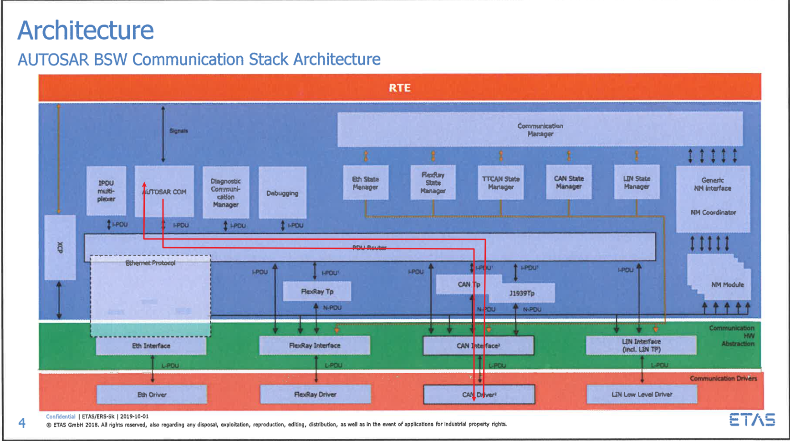
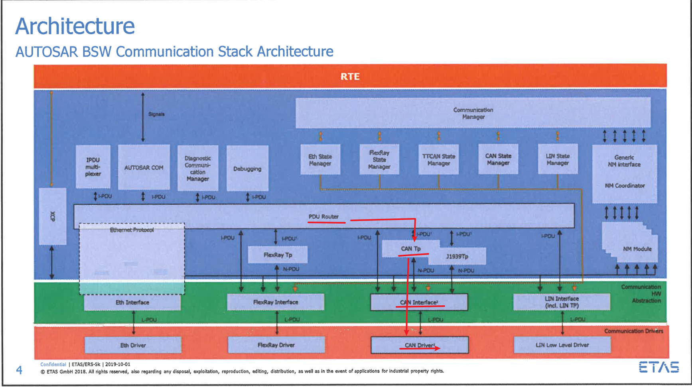
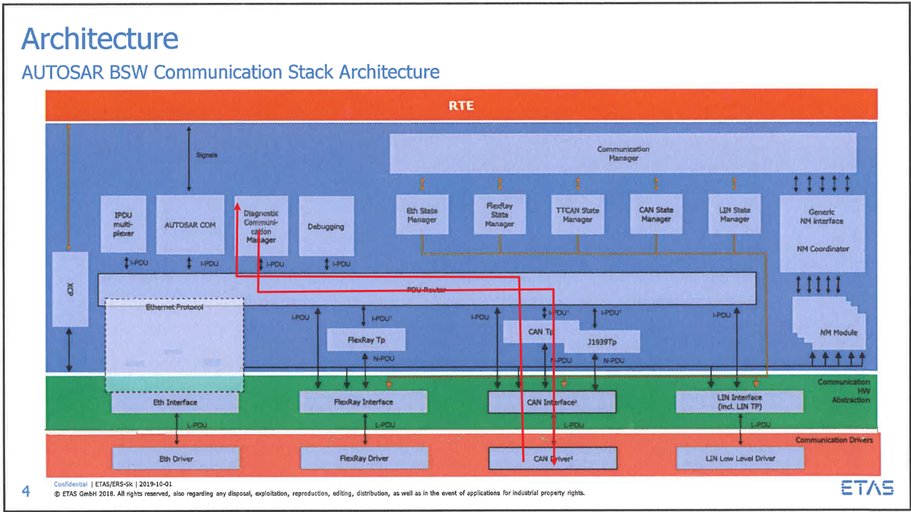
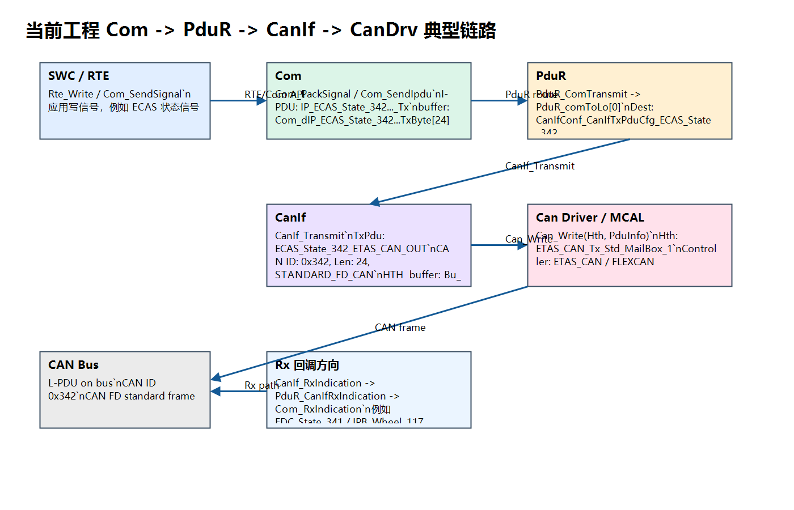
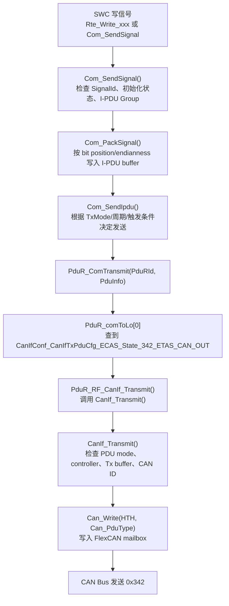
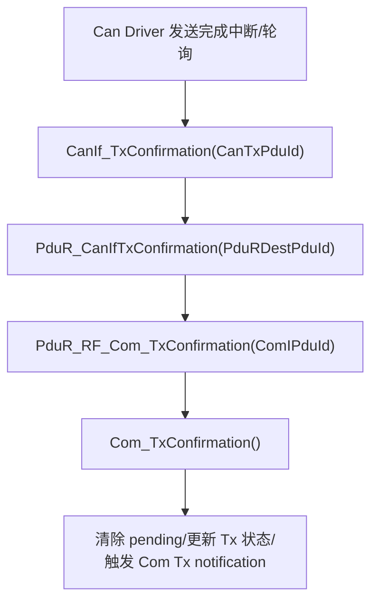
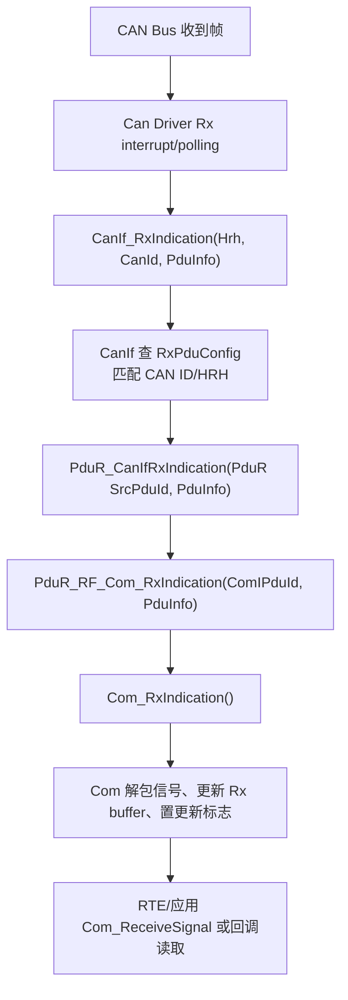

# AUTOSAR Com -> PduR -> CanIf -> CanDrv 链路学习笔记

> 目标链路：普通应用信号报文，不包含诊断 CanTp 分段链路。  
> 当前工程路径：`E:\github\ECAS_RTA_S32K324GHS_EOL_FCT`。  
> 说明：本轮有道云 MCP 当前只暴露待办/删除/重命名等接口，没有暴露 `searchNotes/getNoteTextContent` 读笔记接口。因此本文使用本地已同步的 `E:\github\worm_vault\daliy record` 笔记作为同源资料，并结合当前工程 ARXML/生成代码整理。Computer Use 连接 Windows 原生管道失败，无法新抓 ISOLAR GUI；本文使用已落盘的真实 ISOLAR 截图，并补充当前工程配置关系图。


# com 服务
com ->PduR ->Canif-> CanDrv

--Canif--CanDriver/file-20260626150233802.png)

--Canif--CanDriver/file-20260626150233800%201.png)


## 1. 一句话理解这条链路

普通应用报文的发送链路是：

```text
SWC/RTE
  -> Com
  -> PduR
  -> CanIf
  -> Can Driver
  -> CAN Bus
```

直白解释：

| 模块 | 初学者理解 | 它不负责什么 |
|---|---|---|
| `Com` | 把应用信号打包成 I-PDU，也把收到的 I-PDU 拆成信号 | 不直接碰 CAN mailbox，不直接发 CAN ID |
| `PduR` | 路由表，把上层 PDU 转发到下层模块 | 不解析信号，不关心信号 bit 位 |
| `CanIf` | CAN 抽象接口，把 PDU 变成具体 CAN ID、DLC、HTH/HRH | 不做信号打包，不做应用逻辑 |
| `Can Driver` | MCAL 驱动，真正写 FlexCAN/mailbox | 不知道 AUTOSAR 信号含义 |

普通 Com 报文 **不走 CanTp**。CanTp 主要给 UDS/诊断大报文做分段。

```text
普通信号：Com -> PduR -> CanIf -> CanDrv
诊断 UDS：Dcm -> PduR -> CanTp -> PduR -> CanIf -> CanDrv
NM 报文：CanNm -> CanIf -> CanDrv
NM UserData：Com -> PduR -> CanNm -> CanIf
```

## 2. 笔记和工程经验总结

从本地同步笔记和当前工程看，最容易踩坑的点不是“代码不会调用”，而是配置对象之间没有接上：

- `Com` 里配了 Signal，但没有挂到正确 `ComIPdu`，应用写信号后不会进入目标 I-PDU。
- `ComIPdu` 没有引用正确 `ComPduIdRef`，PduR 收到的 handle 对不上。
- `PduRRoutingPath` 的 Src/Dest 配错，发送时不会走到 `CanIf_Transmit()`。
- `CanIfTxPduRef` 没有指向 PduR 到 CanIf 的 EcuC PDU，或者 `TxPduTargetPduId` 不对，TxConfirmation 回不到上层。
- `CanIfTxPduCanId` / `CanIfTxPduCanIdType` 配错，CANoe 上看到的 ID 或帧类型不对。
- `ComIPduGroup_Tx/Rx` 没有被 BswM/ComM 打开，`Com_SendSignal()` 可能返回 OK，但报文不一定真正发出。
- CanSM/CanIf PDU Mode 没有 online，Com/PduR 都正常也发不出去。
- Can Driver 的 HTH/CanHardwareObject 配错，`Can_Write()` 可能返回忙或失败。
- Rx 方向最常见是 CanIf 收到了，但 `CanIfRxPduUserRxIndicationUL` 或 PduR Rx route 不对，导致 Com 没有 `Com_RxIndication()`。
- DLC/长度不一致时，CanIf/Com 可能丢弃、截断或按默认值处理，现场表现是“CANoe 有帧，应用读不到有效信号”。

## 3. ISOLAR 配置截图说明

### 3.1 Com 配置



Com 重点看这些对象：

| 配置项 | 作用 |
|---|---|
| `ComConfig` | Com 总配置容器 |
| `ComSignal` | 一个应用信号，比如状态、速度、校验、rolling counter |
| `ComSignalType` | 信号类型，如 `UINT8/UINT16/BOOLEAN` |
| `ComBitPosition` / `ComBitSize` | 信号在 I-PDU 里的 bit 位置和长度 |
| `ComSignalEndianness` | 大小端 |
| `ComTransferProperty` | 信号写入后是否触发发送，常见 `TRIGGERED` / `PENDING` |
| `ComIPdu` | Com 层报文容器，一个 I-PDU 包含多个信号 |
| `ComIPduDirection` | `SEND` 或 `RECEIVE` |
| `ComPduIdRef` | Com I-PDU 连接到 EcuC/PduR 的关键引用 |
| `ComIPduGroupRef` | 这个 I-PDU 属于哪个 I-PDU Group，没启动就不收发 |
| `ComTxMode` | 周期/混合/无周期等发送模式 |

### 3.2 PduR 配置



PduR 重点看：

| 配置项 | 作用 |
|---|---|
| `PduRRoutingPath` | 一条完整路由 |
| `PduRSrcPdu` | 从哪个上层/下层 PDU 进来 |
| `PduRDestPdu` | 转发到哪个下层/上层 PDU |
| `PduRSrcPduRef` | 源 EcuC PDU 引用 |
| `PduRDestPduRef` | 目标 EcuC PDU 引用 |
| `PduRSourcePduHandleId` | 上层调用 PduR 时用的 handle |
| `PduRDestPduHandleId` | 下层模块接收时用的 handle |

对发送链路，PduR 要从 `Com2PduR` 路由到 `PduR2CanIf`。  
对接收链路，PduR 要从 `CanIf2PduR` 路由到 `PduR2Com`。

### 3.3 CanIf 配置


CanIf 重点看：

| 配置项 | 作用 |
|---|---|
| `CanIfInitCfg` | CanIf 初始化配置 |
| `CanIfTxPduCfg` | Tx L-PDU 配置，绑定 CAN ID、DLC、HTH、上层回调 |
| `CanIfRxPduCfg` | Rx L-PDU 配置，绑定 CAN ID、HRH、上层 RxIndication |
| `CanIfTxPduCanId` | 真正在 CAN 总线上发送的 CAN ID |
| `CanIfTxPduCanIdType` | 标准帧/扩展帧、Classic CAN/CAN FD |
| `CanIfTxPduUserTxConfirmationUL` | TxConfirmation 回给谁，普通 Com 报文是 `PDUR` |
| `CanIfRxPduUserRxIndicationUL` | RxIndication 通知谁，普通 Com 报文是 `PDUR` |
| `CanIfTxPduBufferRef` | 绑定到哪个 Tx buffer/HTH |
| `CanIfCtrlDrvCfg` | CanIf controller 到 Can Driver controller 的关联 |

### 3.4 Can Driver 配置



Can Driver 重点看：

| 配置项 | 作用 |
|---|---|
| `CanController` | CAN 控制器，例如当前工程 `ETAS_CAN` |
| `CanControllerBaudrateConfig` | 仲裁段/数据段波特率 |
| `CanHardwareObject` | 硬件邮箱/HOH |
| `CanObjectType` | `TRANSMIT` 或 `RECEIVE` |
| `CanHandleType` | `FULL` 或 `BASIC` |
| `CanIdType` | Standard/Extended/FD |
| `CanHwObjectCount` | 这个 HOH 有几个硬件对象 |

### 3.5 当前工程关系图



## 4. 当前工程典型 Tx 报文：ECAS_State_342

当前工程普通应用 Tx 报文可以用 `ECAS_State_342` 作为主线。

### 4.1 配置对象对应关系

| 层级 | 当前工程对象 | 说明 |
|---|---|---|
| Com Signal | `S_ECAS_*_Can_Network_Channel_CAN_Tx` | 应用信号 |
| Com I-PDU | `IP_ECAS_State_342_Can_Network_Channel_CAN_Tx` | Com 层 Tx I-PDU |
| Com PDU Ref | `ECAS_State_342_Com2PduR_Can_Network_Channel_CAN` | Com 到 PduR 的 EcuC PDU |
| PduR Route | `ECAS_State_342_Com2CanIf_Can_Network_Channel_CAN` | PduR 路由路径 |
| PduR Dest | `ECAS_State_342_PduR2CanIf_Can_Network_Channel_CAN` | PduR 到 CanIf 的 EcuC PDU |
| CanIf Tx PDU | `ECAS_State_342_ETAS_CAN_OUT` | CanIf 发送 PDU |
| CAN ID | `0x342` | 生成代码中 CanIf TxPduCanId |
| 帧类型 | `STANDARD_FD_CAN` | 标准 CAN FD |
| 长度 | `24` bytes | CanIf Tx PDU 长度 |
| HTH/Buffer | `Bu_ETAS_CAN_Tx_Std_MailBox_1` | 绑定到 Can Driver Tx mailbox |

### 4.2 Tx 函数流程图



### 4.3 TxConfirmation 回调流程



TxConfirmation 不只是“发完通知”，它还影响 Com 内部 pending、重复发送、超时等状态。调试“第一帧能发，后续不发”时要看这条回调是否回来。

## 5. 当前工程典型 Rx 报文

当前工程普通 Rx 报文包括：

| CAN ID | CanIf Rx PDU | PduR route | Com I-PDU |
|---|---|---|---|
| `0x341` | `EDC_State_341_ETAS_CAN_IN` | `EDC_State_341_CanIf2Com...` | `IP_EDC_State_341_Can_Network_Channel_CAN_Rx` |
| `0x11E` | `EDC_State_11E_ETAS_CAN_IN` | `EDC_State_11E_CanIf2Com...` | `IP_EDC_State_11E_Can_Network_Channel_CAN_Rx` |
| `0x117` | `IPB_Wheel_117_ETAS_CAN_IN` | `IPB_Wheel_117_CanIf2Com...` | `IP_IPB_Wheel_117_Can_Network_Channel_CAN_Rx` |

Rx 函数流程：



## 6. 关键变量和配置表

### 6.1 Com 关键变量

| 变量/宏 | 文件 | 解释 |
|---|---|---|
| `ComConf_ComIPdu_IP_ECAS_State_342_Can_Network_Channel_CAN_Tx` | `Com_Cfg_SymbolicNames.h` | Com I-PDU 的外部 handle |
| `ComConf_ComSignal_S_ECAS_*_Tx` | `Com_Cfg_SymbolicNames.h` | Com Signal 的外部 handle |
| `Com_dIP_ECAS_State_342_Can_Network_Channel_CAN_TxByte[]` | `Com_PBcfg_Common.c/h` | Com 的 Tx I-PDU 数据缓存，最终要发出去的数据在这里 |
| `Com_Prv_TxIpduRam_IP_ECAS_State_342_Can_Network_Channel_CAN_Tx_st` | `Com_PBcfg_Common.c/h` | Tx I-PDU 运行时 RAM，保存 pending、timer、状态等 |
| `Com_Prv_TxSigFlagS_ECAS_State_342_*_st` | `Com_PBcfg_Common.c/h` | Tx signal 的更新/触发相关 flag |
| `ComConf_ComIPduGroup_ComIPduGroup_Tx` | `Com_Cfg_SymbolicNames.h` | Tx I-PDU Group，没启动就不要指望周期报文正常发 |
| `ComConf_ComIPduGroup_ComIPduGroup_Rx` | `Com_Cfg_SymbolicNames.h` | Rx I-PDU Group，没启动就可能收不到 Com 信号 |

### 6.2 PduR 关键变量

| 变量/宏 | 文件 | 解释 |
|---|---|---|
| `PduRConf_PduRSrcPdu_ECAS_State_342_Com2PduR_Can_Network_Channel_CAN` | `PduR_Cfg_SymbolicNames.h` | Com 调 PduR 时使用的源 PDU handle |
| `PduRConf_PduRDestPdu_ECAS_State_342_PduR2CanIf_Can_Network_Channel_CAN` | `PduR_Cfg_SymbolicNames.h` | PduR 到 CanIf 的目标 PDU handle |
| `PduR_comToLo[]` | `PduR_PBcfg.c` | Com 到 lower IF 的路由表，本工程 index 0 指向 CanIf |
| `PduR_ComToLoMapTable[]` | `PduR_PBcfg.c` | Com source PDU 到 `PduR_comToLo[]` 的映射 |
| `PduR_upIfRxIndTable[]` | `PduR_PBcfg.c` | CanIf Rx 到 Com 的上行回调表 |
| `PduR_upIfTxConfTable[]` | `PduR_PBcfg.c` | CanIf TxConfirmation 到 Com 的回调表 |

### 6.3 CanIf 关键变量

| 变量/宏 | 文件 | 解释 |
|---|---|---|
| `CanIfConf_CanIfTxPduCfg_ECAS_State_342_ETAS_CAN_OUT` | `CanIf_Cfg.h` | CanIf Tx PDU handle，当前值为 0 |
| `CanIfConf_CanIfRxPduCfg_EDC_State_341_ETAS_CAN_IN` | `CanIf_Cfg.h` | CanIf Rx PDU handle |
| `CanIf_TxPduGen_a[]` | `CanIf_PBcfg.c` | CanIf Tx PDU 配置数组，含 CAN ID、长度、上层模块、TxConfirmation |
| `CanIf_RxPduGen_a[]` | `CanIf_PBcfg.c` | CanIf Rx PDU 配置数组，含 CAN ID、上层模块、目标 PDU |
| `CanIf_TxBufferGen_a[]` | `CanIf_PBcfg.c` | CanIf Tx buffer/HTH 关联 |
| `CanIf_SetPduMode()` | `CanIf_PduMode.c` | 控制 Tx/Rx 是否 online，CanSM 会调用 |
| `CanIf_Transmit()` | `CanIf_Transmit.c` | PduR/CanNm/XCP 等上层真正发送时进入这里 |

### 6.4 Can Driver 关键变量

| 变量/宏 | 文件 | 解释 |
|---|---|---|
| `CanConf_CanController_ETAS_CAN` | Can/CanIf 生成代码 | 当前主 CAN controller |
| `Can_43_FLEXCANConf_CanHardwareObject_ETAS_CAN_Tx_Std_MailBox_1` | CanIf/Can 生成代码 | `ECAS_State_342` 使用的 Tx mailbox/HTH |
| `Can_Write()` | MCAL Can Driver | CanIf 最终调用的发送 API |
| `CanIf_ControllerBusOff()` | CanIf/CanSM 相关 | Driver 检测 BusOff 后上报给 CanIf，再到 CanSM |

## 7. 当前工程配置事实

### 7.1 Com

`IP_ECAS_State_342_Can_Network_Channel_CAN_Tx`：

- Direction：`SEND`
- Type：`NORMAL`
- Signal Processing：`IMMEDIATE`
- I-PDU Group：`ComIPduGroup_Tx`
- PduR Id：`PduRConf_PduRSrcPdu_ECAS_State_342_Com2PduR_Can_Network_Channel_CAN`
- I-PDU buffer：`Com_dIP_ECAS_State_342_Can_Network_Channel_CAN_TxByte[24]`
- Signal 数量：16

### 7.2 PduR

`PduR_comToLo[0]`：

```c
{
  CanIfConf_CanIfTxPduCfg_ECAS_State_342_ETAS_CAN_OUT,
  PduR_RF_CanIf_Transmit,
  PduR_IH_CancelTransmit
}
```

意思是：Com 给 PduR 的 `ECAS_State_342` 会转发到 CanIf 的 `ECAS_State_342_ETAS_CAN_OUT`。

### 7.3 CanIf

`ECAS_State_342_ETAS_CAN_OUT`：

- `TxPduCanId = 0x342`
- `TxPduCanIdType = STANDARD_FD_CAN`
- `TxPduTxUserUL = PDUR`
- `UserTxConfirmation = PduR_CanIfTxConfirmation`
- `TxPduLength = 24`
- `TxPduType = CANIF_STATIC`
- Buffer：`Bu_ETAS_CAN_Tx_Std_MailBox_1`

### 7.4 BswM/ComM/CanSM 对链路的影响

这条链路不是只靠 Com/PduR/CanIf 配对就能发。运行时还要满足：

```text
Com I-PDU Group 已启动
CanSM 已经 FullCom
CanIf Controller mode 已 STARTED
CanIf PDU mode 已 ONLINE
Can Driver mailbox 可用
```

当前工程 BswM 里能看到它会操作：

```text
ComConf_ComIPduGroup_ComIPduGroup_Rx
ComConf_ComIPduGroup_ComIPduGroup_Tx
```

所以如果 CANoe 没报文，不能只盯 `Com_SendSignal()`，还要查 BswM/CanSM 是否打开了通道。

## 8. 常见工程问题和排查顺序

### 8.1 应用写了信号，但 CANoe 没有报文

按顺序查：

1. `Com_SendSignal()` 或 RTE 写信号是否执行。
2. Signal handle 是否是 `ComConf_ComSignal_S_ECAS_*_Tx` 的正确 handle。
3. `ComIPduGroup_Tx` 是否已经启动。
4. `Com_dIP_ECAS_State_342...TxByte[]` 是否变化。
5. `Com_Prv_TxIpduRam_IP_ECAS_State_342...` 的发送状态/timer 是否在走。
6. 是否调用 `PduR_ComTransmit()`。
7. 是否进入 `PduR_RF_CanIf_Transmit()`。
8. 是否进入 `CanIf_Transmit()`。
9. CanIf PDU Mode 是否 `ONLINE`。
10. 是否调用 `Can_Write()`，返回值是否 `E_OK`。

### 8.2 CANoe 有报文，但 ID 或长度不对

重点查：

- `CanIfTxPduCanId`
- `CanIfTxPduCanIdType`
- `TxPduLength`
- Can Driver mailbox 是否支持 FD/长度
- DBC 和 ARXML 是否同源

当前 `ECAS_State_342` 是 `0x342`，`STANDARD_FD_CAN`，长度 24。如果 CANoe 按 Classic CAN 解析，可能看到异常。

### 8.3 Rx CANoe 有帧，应用读不到

按顺序查：

1. CanIf 是否匹配到 `CanIfRxPduCfg_*`。
2. `CanIfRxPduUserRxIndicationUL` 是否是 `PDUR`。
3. 是否进入 `PduR_CanIfRxIndication()`。
4. PduR Rx route 是否指向 `PduR2Com`。
5. 是否进入 `Com_RxIndication()`。
6. `ComIPduGroup_Rx` 是否启动。
7. 信号 bit 位、endianness、update bit 是否正确。
8. 应用是否用正确 RTE/Com API 读取。

### 8.4 TxConfirmation 没回来

现象：

- 第一次发送后状态卡住。
- 周期报文不继续。
- Com 内部 pending 没清。

重点查：

- CanIf Tx PDU 的 `UserTxConfirmation` 是否是 `PduR_CanIfTxConfirmation`。
- PduR 的 TxConfirmation route 是否回到 Com。
- Can Driver 是否真的触发 Tx confirmation。
- 中断/轮询配置是否正确。

### 8.5 Com 返回 `COM_SERVICE_NOT_AVAILABLE`

通常原因：

- Com 未初始化。
- 对应 I-PDU Group stopped。
- BswM 没打开 Tx/Rx group。
- 当前通信模式还没 FullCom。

### 8.6 BusOff 或 NoCom 导致发不出

Com/PduR 配置都对，也可能因为底层不允许发：

```text
ComM NoCom
  -> CanSM NoCom/Silent/BOR
  -> CanIf PduMode OFFLINE 或 TX_OFFLINE
  -> CanIf_Transmit 返回失败或不下发 Can_Write
```

所以调试发送问题时，必须同时看：

- `ComM` 当前通道模式
- `CanSM_CurrNw_Mode_en[0]`
- `CanIf` PDU mode
- `CanIf_SetControllerMode` / `CanIf_SetPduMode` 是否执行

## 9. 记忆版

发送：

```text
信号 -> Com 打包 -> PduR 查路由 -> CanIf 加 CAN ID/邮箱 -> CanDrv 写硬件
```

接收：

```text
硬件收到 -> CanIf 匹配 CAN ID -> PduR 查路由 -> Com 解包 -> 应用读信号
```

最关键的配置引用：

```text
ComSignal -> ComIPdu
ComIPdu -> ComPduIdRef
PduR SrcPdu -> PduR DestPdu
CanIfTxPduRef / CanIfRxPduRef -> EcuC PDU
CanIfTxPduCanId -> 真正 CAN ID
CanIfTxPduBufferRef -> HTH/mailbox
```

最关键的运行条件：

```text
ComIPduGroup started
CanSM FullCom
CanIf PduMode ONLINE
Can Controller STARTED
Can Driver HTH 可用
```

## 10. 后续建议

- 用 TRACE32 给 `Com_SendSignal`、`PduR_ComTransmit`、`CanIf_Transmit`、`Can_Write` 打断点，单步确认 `ECAS_State_342`。
- 在 CANoe 抓 `0x342`，确认周期、DLC、FD/Classic 类型和信号字节。
- 做一张 Tx/Rx handle 对照表，把 `ComConf_*`、`PduRConf_*`、`CanIfConf_*`、CAN ID 放到同一行。
- 如果后续有道云读笔记 MCP 恢复，可再把未同步到本地的有道云内容补入“经验问题”章节。
