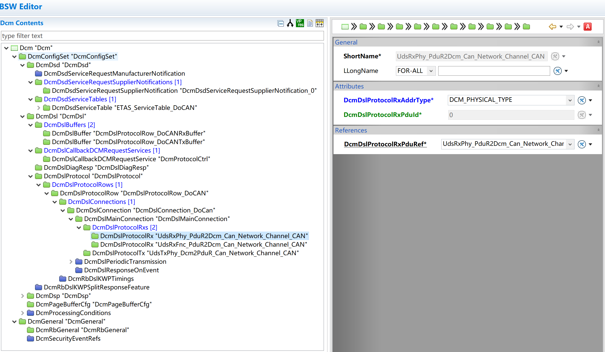
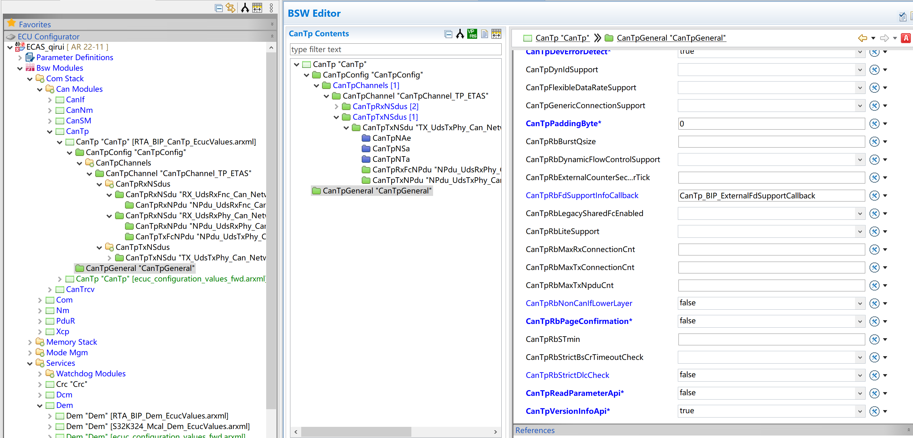
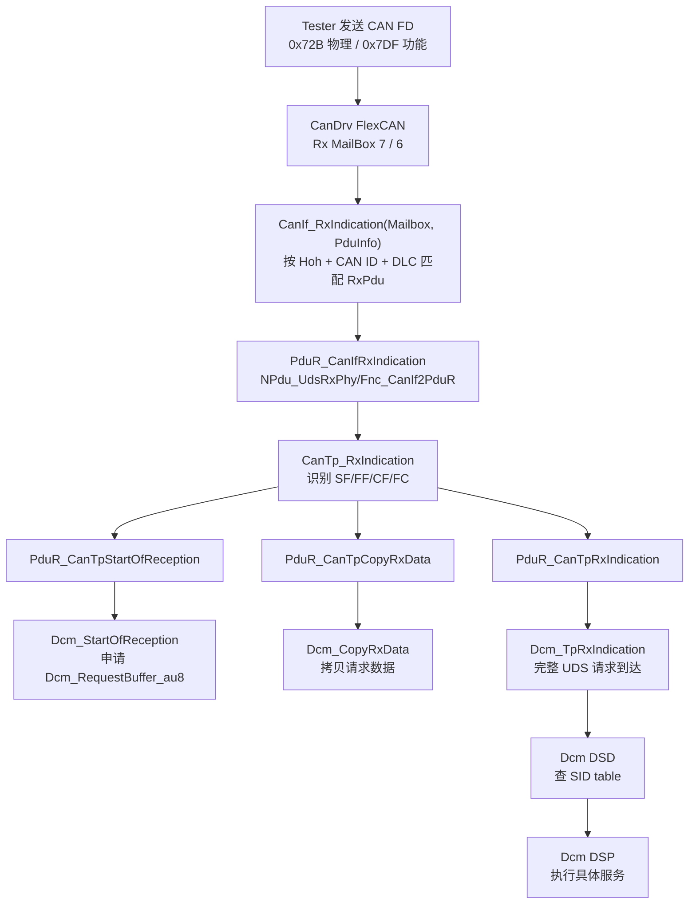
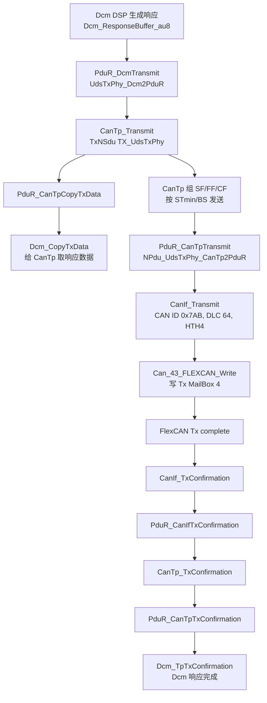

# DCM 服务
Dcm->PduR->CanTp->CanIf->CanDrv

--Canif--CanDriver/file-20260626150423313.png)


--Canif--CanDriver/file-20260626150233801.png)
相比于 COM 服务的不同：
1.第一个不同为 Dcm 服务与 APP 没有交集，因为 Dcm 就是 UDS。
2.第二个不同为在 CanIf 模块和 PduR 模块中多了一层 CanTP 模块，这个模块其实就是实现了 ISO 15765-2 中描述的 UDS on CAN 的网络层
<mark style="background: #FF5582A6;">DCM 就是 UDS.</mark>


# AUTOSAR Dcm -> PduR -> CanTp -> CanIf -> CanDrv 诊断链路学习笔记

> 工程：`E:\github\ECAS_RTA_S32K324GHS_EOL_FCT`  
> 目标链路：UDS on CAN/CAN FD 诊断链路  
> 日期：2026-06-29  
> 结论先放前面：诊断链不是只走一次 `PduR`。Rx 方向是 `CanDrv -> CanIf -> PduR -> CanTp -> PduR -> Dcm`；Tx 方向是 `Dcm -> PduR -> CanTp -> PduR -> CanIf -> CanDrv`。


## 1. 一句话看懂这条链

外部诊断仪发 CAN/CAN FD 报文，底层驱动先收到帧；`CanIf` 按 CAN ID、HRH、DLC 找到对应 Rx PDU；`PduR` 把 N-PDU 路由给 `CanTp`；`CanTp` 负责单帧/首帧/连续帧/流控帧处理，把多帧重新拼成完整 UDS 请求；`PduR` 再把完整 I-PDU 交给 `Dcm`；`Dcm` 判断 SID、Session、Security、DID/Routine，然后生成响应，反方向发出去。

当前工程的诊断 CAN ID：

| 方向 | CAN ID | 说明 |
|---|---:|---|
| Tester -> ECU 物理寻址 | `0x72B` | `UdsRxPhy`，CanIf Rx PDU handle 为 `6` |
| Tester -> ECU 功能寻址 | `0x7DF` | `UdsRxFnc`，CanIf Rx PDU handle 为 `5` |
| ECU -> Tester 物理响应 | `0x7AB` | `UdsTxPhy`，CanIf Tx PDU handle 为 `2` |

## 2. 有道云 MCP 笔记凝练总结

本次通过有道云 MCP 搜索并读取了 `Dcm`、`PduR`、`CanTp`、`CanIf`、`CanDrv`、`UDS`、`诊断指令不路由`、`Polling 诊断 丢帧`、`STmin 丢帧`、`CAN FD 诊断混用` 等相关笔记。`How to deploy UDS Diag Stack by Dext in RTA_CAR9_2_1.pdf` 读取失败，没有作为内容来源。

### 2.1 UDS/DCM

- UDS 是请求/响应协议。正响应 SID = 请求 SID + `0x40`；负响应格式是 `0x7F + 请求SID + NRC`。
- 物理寻址是一对一，功能寻址是一对多广播。功能寻址通常只用于请求，不适合需要长响应的服务。
- 常用服务：`0x10` Session、`0x3E` TesterPresent、`0x27` SecurityAccess、`0x22` ReadDID、`0x2E` WriteDID、`0x19` ReadDTC、`0x14` ClearDTC、`0x2F` IOControl、`0x31` RoutineControl。
- `0x78 ResponsePending` 的意思是请求已收到但还没处理完，后面必须再给最终正响应或负响应。
- `Dcm` 分三块：`DSL` 管诊断连接、buffer、session/security/timing；`DSD` 查服务表并分发 SID；`DSP` 执行具体服务逻辑。

### 2.2 PduR

- **`PduR` 只按静态路由表转发 PDU，不理解 UDS 服务，也不会自动猜路由。**
- 每条路由看两个东西：`SrcPdu` 从哪里来，`DestPdu` 到哪里去。
- TP 链路不是普通 `Transmit/RxIndication` 一步完成，而是 `StartOfReception -> CopyRxData -> RxIndication` 和 `CopyTxData -> TxConfirmation`。
- 如果打开 Routing Group，BswM 没有 enable route group，路由表存在也不会走。

### 2.3 CanTp

- **`CanTp` 是诊断多帧的核心，负责 ISO-TP 分段、重组、流控、超时。**
- 单帧直接交付；多帧先收 FirstFrame，再按 ConsecutiveFrame 拼包；接收方用 FlowControl 告诉发送方 `BS` 和 `STmin`。
- `STmin` 是连续帧间隔，`BS` 是一个 block 里允许连续发多少个 CF。
- 一条诊断会话不能混用 Classical CAN 和 CAN FD。可以同 CAN ID 并存，但必须是不同 N_AI/不同 CanTp 实体。

### 2.4 CanIf/CanDrv

- `CanIf` 抽象 CAN Driver，配置重点是 CAN ID、DLC、HRH/HTH、上层回调、Controller/PDU Mode。
- `CanIf_Transmit() == E_OK` 只表示发送请求被接受，不代表总线上已经发出。真正发出以后才会有 `TxConfirmation`。
- Rx 如果实际 DLC 小于配置 DLC，`CanIf` 可能直接丢弃，不会通知上层。
- `CanDrv` 的 mailbox/filter 是最底层入口。CanIf 是靠 `Mailbox->Hoh` 和 CAN ID 去匹配上层 PDU。

### 2.5 笔记里的工程坑

| 问题                           | 直接原因                                                                  | 排查/修复                                                                                  |
| ---------------------------- | --------------------------------------------------------------------- | -------------------------------------------------------------------------------------- |
| 诊断指令不路由                      | TP channel 或 PduR buffer 被占住，不一定是路由表错                                 | 看 `StartOfReception` 是否被拒、CanTp channel 是否 busy、TxConfirmation 是否释放资源                  |
| FrTp/CanTp 通道锁死              | delayed response 后 `TxPendingCounter` 下溢到 `0xFFFF`                    | Confirmation 里避免 0 再减；静态代码慎改，优先找配置/集成原因                                                |
| Polling 方式诊断丢帧               | 5 ms polling + FullCAN 单 buffer，两个 CF 落在一个周期内，后一帧被硬件拒收/覆盖             | 诊断 Rx 改 Basic/FIFO 或加深 buffer；缩短 polling 会增加 CPU 负载                                    |
| 不满足 STmin 仍丢帧                | 上层 copy 时间太长或 FIFO 深度太小，下一帧来时覆盖旧帧                                     | 发送方遵守 STmin；接收侧 FIFO 深度 > 1；不要把高频功能帧和物理多帧挤在弱 buffer                                    |
| CAN/CAN FD 混用误解              | 同一诊断消息不能一会儿 Classic CAN 一会儿 CAN FD                                    | 每条诊断连接固定一种帧类型和 CanTp 实体                                                                |
| `CanIf_Transmit` 返回 OK 但总线没帧 | `E_OK` 只是写入下层/硬件 buffer 成功，BusOff 或 controller 状态异常可能导致无 confirmation | 继续看 `CanIf_TxConfirmation`、CanDrv 中断/轮询、BusOff、PDU Mode                                |
| 导入 CDD 后大量报错                 | Dcm/Dem/BswM/CanIf/Com/PduR 引用没补齐                                     | 常见项：Dcm Rx/Tx buffer、SID table、TesterSourceAddr、BswM init、Task mapping、Service mapping |

## 3. 初学者白话解释模块功能

| 模块 | 白话功能 | 它不负责什么 |
|---|---|---|
| `Dcm` | 诊断服务的大脑：识别 SID，检查 Session/Security，调用 DID/Routine/DEM/应用回调，组织响应 | 不直接操作 CAN mailbox，不做 ISO-TP 分帧 |
| `PduR` | 路由表：把某个 PDU ID 从一个模块转给另一个模块 | 不解析 UDS，不改 payload |
| `CanTp` | ISO-TP 搬运工：大包切小包，小包拼大包，处理 FF/CF/FC、STmin、BS、超时 | 不知道 SID 是什么，也不决定 CAN ID |
| `CanIf` | CAN 抽象层：把上层 PDU 绑定到 CAN ID、DLC、HTH/HRH 和 Driver controller | 不做 UDS，不做多帧重组 |
| `CanDrv` | MCAL 驱动：配置 FlexCAN 控制器、mailbox、filter、波特率，收发真实 CAN 帧 | 不知道 AUTOSAR PDU 路由 |

## 4. ISOLAR/TEE 配置说明

当前机器打开的是 `RTA-CAR 12.3.2` 的 `Environment Editor (TEE)`，窗口标题为：

```text
workspace - ECAS_qirui/ecu_config/bsw/gen/RTA_BIP_CanSM_EcucValues.arxml - RTA-CAR 12.3.2
```

Computer Use 已读取真实 GUI 可访问性树，确认 ECU Navigator 里有：

```text
ECAS_qirui [ AR 22-11 ]
  Bsw Modules
    Com Stack
      Can Modules
        CanIf
        CanNm
        CanSM
        CanTp
        CanTrcv
      Com
      Nm
      PduR
      Xcp
```

截图捕获失败，错误为：

```text
SetIsBorderRequired failed: 不支持此接口 (0x80004002)
```

Computer Use 直接截取 ISOLAR/TEE 窗口时失败，报 `SetIsBorderRequired failed: 不支持此接口 (0x80004002)`。后续通过 Snipaste/剪贴板已补入部分 Dcm BSW Editor 截图；未截图到的页面仍以当前工程 ARXML 和生成代码核对，路径和 ISOLAR 树节点一致。

### 4.1 Dcm 重要配置

#### Dsl --diagnostic session layer



先按链路看，不要先看单个参数：

```text
DcmDslProtocolRow_DoCAN
  -> RxBufferRef / TxBufferRef
  -> SIDTable
  -> Connection
  -> MainConnection
  -> ProtocolRx: UdsRxPhy + UdsRxFnc
  -> ProtocolTx: UdsTxPhy
```

再和 PduR 对上：

```text
UdsRxPhy_PduR2Dcm  -> DcmDslProtocolRxPduId 0
UdsRxFnc_PduR2Dcm  -> DcmDslProtocolRxPduId 1
UdsTxPhy_Dcm2PduR  -> DcmDslTxConfirmationPduId 0
```

##### DcmDsl 配置项

| ISOLAR 节点                   | 配置项                                     | 当前值                               | 作用                                       | 配错后的现象                                          |
| --------------------------- | --------------------------------------- | --------------------------------- | ---------------------------------------- | ----------------------------------------------- |
| `DcmDslBuffers/RxBuffer`    | `DcmDslBufferSize`                      | `2048`                            | Dcm 接收完整 UDS 请求的 buffer。CanTp 拼完多帧后放到这里。 | 大请求进不来，`StartOfReception` 拒收，或 buffer 不够。       |
| `DcmDslBuffers/TxBuffer`    | `DcmDslBufferSize`                      | `2048`                            | Dcm 组织响应的 buffer。                        | 大 DID、大 DTC 扩展数据、Routine 大响应可能失败或 NRC `0x14`。   |
| `DcmDslDiagResp`            | `DcmDslDiagRespMaxNumRespPend`          | `5`                               | 最多发 5 次 `0x78 responsePending`。          | 应用一直 `DCM_E_PENDING` 时，超过次数后请求终止或测试仪超时。         |
| `DcmDslDiagResp`            | `DcmDslDiagRespOnSecondDeclinedRequest` | `true`                            | 一个请求未结束时，第二个请求是否返回拒绝响应。                  | 长服务并发时可能看到 busy/response pending；关掉则可能静默丢第二个请求。 |
| `DcmDslProtocolRow_DoCAN`   | `DcmDslProtocolType`                    | `DCM_UDS_ON_CAN`                  | 说明这条协议行是 UDS over CAN。                   | 协议类型错，Dcm 入口和 PduR/CanTp 链路对不上。                 |
| `DcmDslProtocolRow_DoCAN`   | `DcmDslProtocolPriority`                | `1`                               | 多协议抢占优先级。本工程只有一条 DoCAN，影响小。              | 多协议工程中可能抢占关系异常。                                 |
| `DcmDslProtocolRow_DoCAN`   | `DcmTimStrP2ServerAdjust`               | `0.01 s`                          | P2 时间修正，请求到首个响应的时间预算。                    | 测试仪报 ECU response timeout。                      |
| `DcmDslProtocolRow_DoCAN`   | `DcmTimStrP2StarServerAdjust`           | `0.01 s`                          | P2* 时间修正，发 `0x78` 后继续等待的时间预算。            | 长任务、擦写、Routine 容易被判超时。                          |
| `DcmDslProtocolRow_DoCAN`   | `DcmDemClientRef`                       | `DemClient_DoCAN`                 | Dcm 访问 Dem 的 client，影响 `0x19/0x14/0x85`。 | DTC 读不到、清不掉、控制异常。                               |
| `DcmDslProtocolRow_DoCAN`   | `DcmDslProtocolRxBufferRef`             | `DcmDslProtocolRow_DoCANRxBuffer` | 这条 DoCAN 协议使用哪个 Rx buffer。               | CanTp 已交给 Dcm，但 Dcm 没有正确接收区。                    |
| `DcmDslProtocolRow_DoCAN`   | `DcmDslProtocolTxBufferRef`             | `DcmDslProtocolRow_DoCANTxBuffer` | 这条 DoCAN 协议使用哪个 Tx buffer。               | Dcm 有结果但组织不了响应。                                 |
| `DcmDslProtocolRow_DoCAN`   | `DcmDslProtocolSIDTable`                | `ETAS_ServiceTable_DoCAN`         | 这条协议能识别哪张 SID 服务表。                       | 某 SID 返回 NRC `0x11` 或 `0x7F`。                   |
| `DcmDslMainConnection`      | `DcmDslProtocolRxConnectionId`          | `0`                               | Dcm DSL 内部连接 ID。不是 CAN ID。               | 多连接工程中 Rx/Tx 上下文混乱。                             |
| `DcmDslMainConnection`      | `DcmDslProtocolRxTesterSourceAddr`      | `1`                               | 测试仪源地址。不是 `0x72B/0x7DF` 这种 CAN ID。       | CDD 导入后缺失时常见 multiplicity/invalid reference。    |
| `DcmDslMainConnection`      | `DcmDslProtocolComMChannelRef`          | `Can_Network_Channel_Can_Network` | 诊断连接绑定到哪个 ComM channel。                  | `0x28`、诊断保持网络、ComM/BswM/CanSM 联动异常。             |
| `DcmDslProtocolRx/UdsRxPhy` | `DcmDslProtocolRxAddrType`              | `DCM_PHYSICAL_TYPE`               | 物理请求入口，对应 CAN ID `0x72B`。                | 响应策略异常，物理请求可能被当成功能请求。                           |
| `DcmDslProtocolRx/UdsRxPhy` | `DcmDslProtocolRxPduId`                 | `0`                               | Dcm 物理 Rx PDU handle。PduR 调 Dcm TP 接口时用。 | PduR 目标 PDU ID 对不上，Dcm 收不到物理请求。                 |
| `DcmDslProtocolRx/UdsRxPhy` | `DcmDslProtocolRxPduRef`                | `UdsRxPhy_PduR2Dcm...`            | PduR 到 Dcm 的物理请求 PDU 引用。                 | 物理请求路由到错误 Dcm Rx PDU。                           |
| `DcmDslProtocolRx/UdsRxFnc` | `DcmDslProtocolRxAddrType`              | `DCM_FUNCTIONAL_TYPE`             | 功能请求入口，对应 CAN ID `0x7DF`。                | 功能请求响应策略异常，不该响应的服务被响应。                          |
| `DcmDslProtocolRx/UdsRxFnc` | `DcmDslProtocolRxPduId`                 | `1`                               | Dcm 功能 Rx PDU handle。                    | `0x7DF` 到不了 Dcm，或被当成物理请求。                       |
| `DcmDslProtocolTx/UdsTxPhy` | `DcmDslTxConfirmationPduId`             | `0`                               | Dcm 等 TxConfirmation 的 Tx PDU handle。    | CANoe 能看到响应帧，但 Dcm 认为发送未结束，后续请求 busy。           |
| `DcmDslProtocolTx/UdsTxPhy` | `DcmDslProtocolTxPduRef`                | `UdsTxPhy_Dcm2PduR...`            | Dcm 响应出口，后面接 PduR -> CanTp -> CanIf。     | `PduR_DcmTransmit` 找不到正确路由，Dcm 有响应也发不出去。        |

##### DcmDsl 配置项解释

`DcmDslBufferSize` 是 Dcm 自己的收发缓存大小，不是 CAN 帧长度。本工程 Rx/Tx 都是 `2048`。CanTp 拼完完整 UDS 请求后放进 Rx buffer；Dcm 组织完整响应时先放进 Tx buffer。排查大 DID、大 DTC 扩展数据、Routine 大响应时，先看它，再看 `DcmDslProtocolMaximumResponseSize` 和 CanTp N-SDU 长度。

`DcmDslDiagRespMaxNumRespPend` 控制 `0x78 responsePending` 最多能回几次。本工程是 `5`。应用层如果一直返回 `DCM_E_PENDING`，Dcm 不会无限给 `7F xx 78`，超过次数后就会结束等待。排查 `0x31`、擦写、异步 DID 时，要同时看这个值、Dcm MainFunction 周期、应用 callback 返回值。

`DcmDslDiagRespOnSecondDeclinedRequest` 控制“一个请求还没处理完，又来了第二个请求”时 Dcm 是否给第二个请求回拒绝响应。本工程是 `true`，所以并发请求时更容易在总线上看到 busy 或 response pending，而不是静默无响应。

`DcmDslProtocolType` 是协议类型。本工程是 `DCM_UDS_ON_CAN`，说明这条 Dcm 协议行走 DoCAN，也就是 UDS over CanTp over CAN。这个值要和后面的 PduR、CanTp、CanIf 诊断 PDU 链路一致。

`DcmDslProtocolPriority` 是协议优先级。本工程只有一条 DoCAN，影响不大。多协议工程里，比如 DoCAN 和 DoIP 同时存在，Dcm 会用它处理协议抢占和并发关系。

`DcmTimStrP2ServerAdjust` 和 `DcmTimStrP2StarServerAdjust` 是 Dcm 对 P2/P2* 的修正时间。本工程都是 `0.01 s`。测试仪报 ECU response timeout 时，不要只怀疑应用慢，还要看 P2/P2*、Dcm 任务周期、CanTp STmin/BS、总线负载。

`DcmDemClientRef` 是 Dcm 访问 Dem 时用的 client。本工程是 `DemClient_DoCAN`。`0x19` 读 DTC、`0x14` 清 DTC、`0x85` 控制 DTC setting 都会依赖它。DTC 服务进了 Dcm 但读不到或清不掉时，要沿着这个引用查 Dem 配置。

`DcmDslProtocolRxBufferRef` 和 `DcmDslProtocolTxBufferRef` 是协议行到 Rx/Tx buffer 的引用。它们不是大小，而是告诉 `DcmDslProtocolRow_DoCAN` 用哪块 buffer。引用错时，CanTp 即使把数据交到 Dcm，Dcm 也可能无法接收或组织响应。

`DcmDslProtocolSIDTable` 是这条协议使用的服务表。本工程指向 `ETAS_ServiceTable_DoCAN`。如果某个 SID 回 `0x11 serviceNotSupported`，先看 SID 是否在这张表；如果回 `0x7F serviceNotSupportedInActiveSession`，再看 session/security 权限。

`DcmDslProtocolRxConnectionId` 是 Dcm DSL 内部连接 ID，不是 CAN ID，也不是 PduR PDU ID。本工程是 `0`，因为只有一条主连接。多连接时它用于区分不同 tester 或不同诊断连接上下文。

`DcmDslProtocolRxTesterSourceAddr` 是 tester source address，本工程是 `1`。它不是 `0x72B` 或 `0x7DF` 这种 CAN ID，而是诊断连接中的测试仪源地址。CDD 导入后这个值缺失时，ISOLAR 常见报 multiplicity 或 invalid reference。

`DcmDslProtocolComMChannelRef` 把诊断连接绑定到 ComM channel。本工程是 `Can_Network_Channel_Can_Network`。它影响 `0x28 CommunicationControl`、诊断保持网络、ComM/BswM/CanSM 状态联动。通信控制异常时不要只查 Dcm。

`DcmDslProtocolRxAddrType` 区分物理寻址和功能寻址。本工程 `UdsRxPhy` 是 `DCM_PHYSICAL_TYPE`，对应物理请求 CAN ID `0x72B`；`UdsRxFnc` 是 `DCM_FUNCTIONAL_TYPE`，对应功能请求 CAN ID `0x7DF`。功能寻址是广播性质，不适合做大响应或长耗时服务。

`DcmDslProtocolRxPduId` 是 Dcm 侧 Rx PDU handle。本工程物理请求是 `0`，功能请求是 `1`。PduR 调 `Dcm_StartOfReception`、`Dcm_CopyRxData`、`Dcm_TpRxIndication` 时会带这个 ID，所以它必须和 PduR 的 Dcm 目标 PDU 对上。

`DcmDslProtocolRxPduRef` 是 ARXML/EcuC PDU 引用，把 PduR 的目标 PDU 和 Dcm 的 Rx PDU 绑在一起。排查请求进不进 Dcm 时，从这个引用反查 PduR route，再反查 CanTp RxNSdu。

`DcmDslTxConfirmationPduId` 是 Dcm 等待发送确认用的 Tx PDU handle。本工程是 `0`。响应发送确认路径是 `CanDrv -> CanIf -> PduR -> CanTp -> PduR -> Dcm`。这个 ID 错时，CANoe 可能看到响应帧，但 Dcm 仍认为发送没结束。

`DcmDslProtocolTxPduRef` 是 Dcm 响应出口。本工程是 `UdsTxPhy_Dcm2PduR...`。Dcm 调 `PduR_DcmTransmit()` 后，从这里进入 PduR，再到 CanTp 的 `TX_UdsTxPhy`，最后由 CanIf/CanDrv 发出响应 CAN ID `0x7AB`。

#### Dsd

##### DcmDsd 服务表

服务表在 `Dcm_Lcfg_Dsd.c` 中配置了 12 个 SID。这里先只看“有没有这个服务”和“进哪个 handler”：

| SID | 服务 | 当前 handler |
|---:|---|---|
| `0x10` | DiagnosticSessionControl | `Dcm_Prv_DspDiagnosticSessionControl` |
| `0x11` | ECUReset | `Dcm_Prv_DspEcuReset` |
| `0x14` | ClearDiagnosticInformation | `Dcm_Prv_DspClearDiagnosticInformation` |
| `0x19` | ReadDTCInformation | `Dcm_Prv_DspReadDTCInformation` |
| `0x22` | ReadDataByIdentifier | `Dcm_Prv_DspReadDataByIdentifier` |
| `0x27` | SecurityAccess | `Dcm_Prv_DspSecurityAccess` |
| `0x28` | CommunicationControl | `Dcm_Prv_DspCommunicationControl` |
| `0x2E` | WriteDataByIdentifier | `Dcm_Prv_DspWriteDataByIdentifier` |
| `0x2F` | InputOutputControlByIdentifier | `Dcm_Prv_DspInputOutputControlByIdentifier` |
| `0x31` | RoutineControl | `Dcm_Prv_DspRoutineControl` |
| `0x3E` | TesterPresent | `Dcm_Prv_DspTesterPresent` |
| `0x85` | ControlDTCSetting | `Dcm_Prv_DspControlDTCSetting` |

##### Session ID 和内部 mask

这里必须拆开看，不能混在同一列里：

| 概念 | Default | Programming | Extended |
|---|---:|---:|---:|
| UDS 报文里的 Session/SubService ID | `0x01` | `0x02` | `0x03` |
| ETAS 生成代码里的 allowedSession bitmask | `0x1` | `0x2` | `0x4` |

所以截图里 `Extended_Session_Control` 的 `DcmDsdSubServiceId = 3` 是对的。它表示 tester 发 `10 03` 进入扩展会话。`0x4` 只表示 ETAS 生成代码里“允许扩展会话”的内部 bitmask。

内部 bitmask 组合：

| 内部 bitmask | 允许的 UDS session |
|---:|---|
| `0x1` | Default `0x01` |
| `0x2` | Programming `0x02` |
| `0x4` | Extended `0x03` |
| `0x5` | Default `0x01` + Extended `0x03` |
| `0x6` | Programming `0x02` + Extended `0x03` |
| `0x7` | Default `0x01` + Programming `0x02` + Extended `0x03` |
| `0xFFFFFFFF` | 所有 session |

##### DcmDsd 子服务表

下面这张表只回答一个问题：每个 SID 配了哪些子服务，以及这些子服务允许在哪些 session 下执行。

|    SID |    子服务 | UDS 名称                             | 允许的 UDS session                  |      内部 mask | 说明                       |
| -----: | -----: | ---------------------------------- | -------------------------------- | -----------: | ------------------------ |
| `0x10` | `0x01` | DefaultSession                     | Default / Programming / Extended |        `0x7` | 切回默认会话                   |
| `0x10` | `0x02` | ProgrammingSession                 | Programming / Extended           |        `0x6` | 进入编程会话                   |
| `0x10` | `0x03` | ExtendedDiagnosticSession          | Default / Programming / Extended |        `0x7` | 进入扩展会话，报文是 `10 03`       |
| `0x11` | `0x01` | HardReset                          | Default / Programming / Extended |        `0x7` | 硬复位                      |
| `0x11` | `0x03` | SoftReset                          | Default / Programming / Extended |        `0x7` | 软复位，工程未配 keyOffOnReset   |
| `0x19` | `0x01` | reportNumberOfDTCByStatusMask      | Default / Extended               |        `0x5` | 读取匹配状态的 DTC 数量           |
| `0x19` | `0x02` | reportDTCByStatusMask              | Default / Extended               |        `0x5` | 读取匹配状态的 DTC 列表           |
| `0x19` | `0x04` | reportDTCSnapshotRecordByDTCNumber | Default / Extended               |        `0x5` | 读取 DTC 快照                |
| `0x19` | `0x06` | reportDTCExtDataRecordByDTCNumber  | Default / Extended               |        `0x5` | 读取 DTC 扩展数据              |
| `0x19` | `0x0A` | reportSupportedDTC                 | Default / Extended               |        `0x5` | 读取支持的 DTC                |
| `0x27` | `0x01` | requestSeed Level 1                | Extended                         |        `0x4` | L1 请求 seed               |
| `0x27` | `0x02` | sendKey Level 1                    | Extended                         |        `0x4` | L1 发送 key，必须跟在 `27 01` 后 |
| `0x27` | `0x05` | requestSeed Level 3                | Programming                      |        `0x2` | L3 请求 seed               |
| `0x27` | `0x06` | sendKey Level 3                    | Programming                      |        `0x2` | L3 发送 key，必须跟在 `27 05` 后 |
| `0x28` | `0x00` | enableRxAndTx                      | Programming / Extended           |        `0x6` | 开启收发                     |
| `0x28` | `0x01` | enableRxAndDisableTx               | Programming / Extended           |        `0x6` | 开收关发                     |
| `0x28` | `0x02` | disableRxAndEnableTx               | Programming / Extended           |        `0x6` | 关收开发                     |
| `0x28` | `0x03` | disableRxAndTx                     | Programming / Extended           |        `0x6` | 关闭收发                     |
| `0x3E` | `0x00` | zeroSubFunction                    | 所有 session                       | `0xFFFFFFFF` | TesterPresent 保持会话       |
| `0x85` | `0x01` | on                                 | Default / Extended               |        `0x5` | 开启 DTC setting           |
| `0x85` | `0x02` | off                                | Default / Extended               |        `0x5` | 关闭 DTC setting           |

没有子服务表的 SID：`0x14`、`0x22`、`0x2E`、`0x2F`、`0x31`。这些服务是否可用，继续看 DID/Routine/DTC 的具体配置，不看 DSD 子服务表。

#### Dsp --diagnostic session processing
[2026.06.29 DcmDsp_Config_Notes](2026.06.29%20DcmDsp_Config_Notes.md)


配置经验：

- `DcmDslProtocolRxBufferID`、`DcmDslProtocolTxBufferID`、`DcmDslProtocolSIDTable` 少一个都会导致请求进 Dcm 后没法正常处理。
- `0x2E` 当前不是全安全等级可用，写 DID 前要确认 SecurityAccess 是否解锁到配置等级。
- `0x78` 相关问题先看 Dcm 的 async service、RTE callback 返回值、`DCM_CFG_MAX_WAITPEND`。


### 4.2 PduR 重要配置


#### PduRBswModules "CanIf"

这张图不是在配某一条具体路由，而是在告诉 PduR：`CanIf` 这个 BSW 模块在 PduR 眼里是什么角色、支持哪些 API。

| 配置项 | 当前值 | 直白解释 | 对诊断链路的影响 |
|---|---|---|---|
| `PduRBswModuleRef` | `CanIf` | 这个 PduR 模块配置绑定到真实的 CanIf 模块。 | 后面所有 `PduR -> CanIf` 或 `CanIf -> PduR` 的 route 都依赖它。 |
| `PduRLowerModule` | `true` | CanIf 是 PduR 的下层模块。 | PduR 往下发 CAN N-PDU 时会调用 CanIf，例如 `PduR_CanTpTransmit -> CanIf_Transmit`。 |
| `PduRUpperModule` | `false` | CanIf 不是 PduR 的上层模块。 | CanIf 不会像 Dcm/Com 那样主动请求 PduR 发送 I-PDU。 |
| `PduRCommunicationInterface` | `true` | CanIf 是 IF 类型模块。 | CanIf 传的是单帧 L-PDU/N-PDU，不走 TP 的 `StartOfReception/CopyRxData` 机制。 |
| `PduRTransportProtocol` | `false` | CanIf 不是 TP 类型模块。 | CanIf 不负责分段/重组，多帧诊断要交给 CanTp。 |
| `PduRTxConfirmation` | `true` | CanIf 支持发送确认回调。 | 响应帧发完后，确认链路能从 CanIf 往上回到 CanTp/PduR/Dcm。 |
| `PduRTriggertransmit` | `false` | CanIf 不通过 PduR 的 TriggerTransmit 拉取数据。 | 诊断发送不是 CanIf 来拉数据，而是上层主动 `Transmit` 下去。 |
| `PduRCancelTransmit` | `false` | PduR 不使用 CanIf 的取消发送能力。 | 诊断响应发出后，不依赖 PduR 调 CanIf cancel。 |
| `PduRCancelReceive` | `false` | PduR 不使用 CanIf 的取消接收能力。 | CanIf 收到 CAN 帧后直接上报，不存在 TP 那种取消接收过程。 |

初学者可以这样理解：

```text
CanIf 在 PduR 里是 lower + IF module

Rx 方向：
CanDrv -> CanIf_RxIndication
       -> PduR_CanIfRxIndication
       -> CanTp_RxIndication

Tx 方向：
CanTp_Transmit
       -> PduR_CanTpTransmit
       -> CanIf_Transmit
       -> CanDrv
```

这里最关键的是 `PduRCommunicationInterface = true`、`PduRTransportProtocol = false`。这说明 CanIf 只搬运单个 CAN PDU，不负责诊断多帧。诊断多帧的拼包、分包、流控都在 CanTp。

工程排查时，如果 CANoe 能看到 tester 发了 `0x72B/0x7DF`，但 Dcm 没反应，不能只看 Dcm。要按顺序查：CanDrv filter 是否命中、CanIf Rx PDU 是否上报到 `PDUR`、PduR 是否把 `NPdu_UdsRxPhy/Fnc` 路由到 CanTp、CanTp 是否再把完整 UDS 请求交给 Dcm。

在 TEE/ISOLAR 中看 `PduR -> PduRRoutingTables`：

| 路由 | 当前工程配置 | 说明 |
|---|---|---|
| Dcm Tx -> CanTp | `UdsTxPhy_Dcm2PduR -> UdsTxPhy_PduR2CanTp` | Dcm 发诊断响应时先到 CanTp |
| CanTp Rx -> Dcm | `UdsRxPhy/Fnc_CanTp2PduR -> UdsRxPhy/Fnc_PduR2Dcm` | CanTp 拼完完整请求后交给 Dcm |
| CanIf Rx -> CanTp | `NPdu_UdsRxPhy/Fnc_CanIf2PduR -> NPdu_UdsRxPhy/Fnc_PduR2CanTp` | 底层收到每个 CAN N-PDU 后交给 CanTp |
| CanTp Tx -> CanIf | `NPdu_UdsTxPhy_CanTp2PduR -> NPdu_UdsTxPhy_PduR2CanIf` | CanTp 发 SF/FF/CF/FC 等 N-PDU |

配置经验：

- `PduRSrcPduHandleId` 要和调用方传入的 PDU ID 一致。
- `PduRDestPduHandleId` 要和被调用模块的配置 ID 一致。
- TP route 要同时配 `StartOfReception`、`CopyRxData`、`RxIndication`、`CopyTxData`、`TxConfirmation` 这些回调方向。

### 4.3 CanTp 重要配置(Transport Protocol)



**CanTp 的作用只有一个：把 CAN 帧和完整 UDS 报文互相转换。**

```text
Rx 方向：
CanIf 收到单个 CAN N-PDU
  -> PduR 路由给 CanTp
  -> CanTp 按 SF/FF/CF/FC 拼成完整 UDS I-PDU
  -> PduR 交给 Dcm

Tx 方向：
Dcm 给出完整 UDS 响应
  -> PduR 路由给 CanTp
  -> CanTp 拆成 SF/FF/CF，并处理 FlowControl
  -> PduR 交给 CanIf 发送 CAN N-PDU
```

在 ISOLAR 中看 `CanTp -> CanTpConfig -> CanTpChannels -> CanTpChannel_TP_ETAS`。本工程只有 1 个 CanTp channel，下面挂了 2 个 Rx NSdu 和 1 个 Tx NSdu：

| 类型 | 当前对象 | 作用 |
|---|---|---|
| Rx NSdu | `RX_UdsRxPhy_Can_Network_Channel` | 物理请求入口，对应 tester 发 `0x72B` |
| Rx NSdu | `RX_UdsRxFnc_Can_Network_Channel` | 功能请求入口，对应 tester 发 `0x7DF` |
| Tx NSdu | `TX_UdsTxPhy_Can_Network_Channel` | 物理响应出口，对应 ECU 发 `0x7AB` |

#### CanTp RxNSdu 配置项

| 配置项                        | 当前值                                                             | 直白解释                                             | 配错后的现象                              |
| -------------------------- | --------------------------------------------------------------- | ------------------------------------------------ | ----------------------------------- |
| `CanTpRxNSduId`            | physical `0` / functional `1`                                   | CanTp 内部 Rx NSdu handle。                         | PduR 调 CanTp 时 ID 对不上，请求进不了正确 NSdu。 |
| `CanTpRxNSduRef`           | `UdsRxPhy_CanTp2PduR...` / `UdsRxFnc_CanTp2PduR...`             | CanTp 拼完整后交给 PduR 的 I-PDU 引用。                    | CanTp 收到 CAN 帧，但完整请求交不到 Dcm。        |
| `CanTpRxNPdu`              | `NPdu_UdsRxPhy_CanIf2CanTp...` / `NPdu_UdsRxFnc_CanIf2CanTp...` | CanIf 交给 CanTp 的单个 CAN N-PDU。                    | CanIf 收到帧，但 CanTp 没有入口。             |
| `CanTpRxTaType`            | physical `CANTP_PHYSICAL` / functional `CANTP_FUNCTIONAL`       | 区分物理请求和功能请求。                                     | 功能请求被当物理请求处理，或物理请求响应策略异常。           |
| `CanTpRxAddressingFormat`  | `CANTP_STANDARD`                                                | 标准寻址，CAN payload 里不额外放 target/source address 字节。 | 和对端寻址格式不一致时，首字节解释错，诊断完全不通。          |
| `CanTpRxPaddingActivation` | `CANTP_ON`                                                      | 接收时启用 padding 检查/处理。                             | 对端 padding 不符合时可能被丢弃；关闭则可能放宽检查。     |
| `CanTpBs`                  | `8`                                                             | 本 ECU 接收多帧时，告诉对端每发 8 个 CF 后等一次 FC。               | 太小效率低；太大时 ECU 处理不过来容易丢 CF。          |
| `CanTpSTmin`               | `0.02 s`                                                        | 本 ECU 接收多帧时，要求对端两个 CF 至少间隔 20 ms。                | 配太小可能压垮 CanIf/CanTp；配太大则刷写/大数据读取变慢。 |
| `CanTpRxWftMax`            | 空                                                               | 本 ECU最多允许发多少次 FC Wait。空值通常表示未启用或取默认生成策略。         | 长时间没 buffer 时，如果 wait 策略不对，对端可能超时。  |

#### CanTp TxNSdu 配置项

| 配置项 | 当前值 | 直白解释 | 配错后的现象 |
|---|---|---|---|
| `CanTpTxNSduId` | `0` | CanTp 内部 Tx NSdu handle。Dcm 响应最终会路由到它。 | Dcm 有响应，但 PduR/CanTp 找不到正确发送通道。 |
| `CanTpTxNSduRef` | `UdsTxPhy_PduR2CanTp...` | PduR 到 CanTp 的响应 I-PDU 引用。 | `PduR_DcmTransmit` 能走到 PduR，但进不了 CanTp Tx NSdu。 |
| `CanTpTxNPdu` | `NPdu_UdsTxPhy_CanTp2CanIf...` | CanTp 拆出的每个 CAN N-PDU 发给 CanIf 的出口。 | CanTp 已分帧，但 CanIf 不发送。 |
| `CanTpTxAddressingFormat` | `CANTP_STANDARD` | 标准寻址发送。 | 对端按扩展/混合寻址解析时会读错 payload。 |
| `CanTpTxPaddingActivation` | `CANTP_ON` | 发送 CAN FD/短帧时按 padding 策略补齐。 | 对端要求 padding 时，不补可能被判格式错误。 |
| `CanTpTxTaType` | `CANTP_PHYSICAL` | 这是物理响应。 | 配成功能类型会导致响应策略不符合 UDS 预期。 |
| `CanTpNas` | `0.07 s` | 等待下层发送确认的超时时间。 | CanIf/CanDrv 发不出去时，CanTp 会超时终止。 |
| `CanTpNbs` | `0.15 s` | 发送 FF 后等待对端 FC 的超时时间。 | 对端不回 FC 或 FC 丢失时，CanTp 超时。 |
| `CanTpNcs` | `0.06 s` | 发送连续帧 CF 时的超时时间预算。 | 总线拥塞或 CanIf 发送慢时，可能超时中断多帧响应。 |
| `CanTpTc` | `true` | Tx 完成后需要确认。 | 关掉或路由错时，Dcm/CanTp 发送状态可能无法正确闭环。 |

#### CanTpGeneral 配置项

| 配置项 | 当前值 | 说明 |
|---|---|---|
| `CanTpDevErrorDetect` | `true` | 开启 DET 检查，开发阶段能更快暴露错误参数、状态机错误。 |
| `CanTpPaddingByte` | `0` | padding 字节是 `0x00`。要和对端诊断仪期望一致。 |
| `CanTpRbFdSupportInfoCallback` | `CanTp_BIP_ExternalFdSupportCallback` | 用于判断/通知 FD 支持能力。 |
| `CanTpRbNonCanIfLowerLayer` | `false` | 下层就是 CanIf，不是自定义 lower layer。 |
| `CanTpRbPageConfirmation` | `false` | 不使用分页确认扩展。 |
| `CanTpRbStrictDlcCheck` | `false` | 不做严格 DLC 检查。现场排查格式问题时要知道这里放宽了。 |
| `CanTpReadParameterApi` | `false` | 不开放运行期读取参数 API。 |
| `CanTpVersionInfoApi` | `true` | 开放版本信息 API。 |

最容易混的两个概念：

```text
CanTpRxNPdu:
  CanIf -> CanTp 的“单个 CAN 帧入口”

CanTpRxNSdu:
  CanTp -> PduR/Dcm 的“完整 UDS 请求”
```

实际排查顺序：

```text
收不到请求：
CanDrv filter -> CanIf RxPdu -> PduR CanIf route -> CanTpRxNPdu -> CanTpRxNSdu -> PduR CanTp route -> Dcm

发不出响应：
Dcm TxPdu -> PduR Dcm route -> CanTpTxNSdu -> CanTpTxNPdu -> PduR CanTp route -> CanIf TxPdu -> CanDrv mailbox
```

当前 CanTp 和 Dcm 都在 `OsTask_SysOsApp_BSW_10ms_A`，执行顺序是 `CanTp_MainFunction()` 先，`Dcm_MainFunction()` 后。多帧偶发失败时，要同时看 `STmin`、`BS`、CanTp 主函数周期、CanIf mailbox/FIFO、总线负载。

#### CANoe Raw FD 示例：`00 23 22 ...`

通过 CAN ID `0x72B` 发送：

```text
00 23 22 F1 86 F1 90 F1 8A F1 8C F1 8B F1 93 F1 95
F1 88 F1 91 F1 97 F1 84 F1 00 F1 01 FC 0A FD 0C
F1 87 F1 02 00 00 00 00 00 00 00 00 00 00 00
```

这是一帧 CAN FD Single Frame 诊断请求，不是多帧。

| 字节 | 含义 |
|---|---|
| `00` | CAN FD Single Frame 扩展长度格式。普通 CAN SF 长度放在低 4 bit；CAN FD 单帧数据超过 7 字节时，用 `00 + length`。 |
| `23` | UDS payload 长度，十六进制 `0x23` = 35 字节。 |
| `22` | UDS SID，ReadDataByIdentifier。 |
| `F1 86 ... F1 02` | DID 列表。这里一次请求多个 DID。 |
| 后面的 `00` | CAN FD padding，不属于 UDS 数据。CanTp 根据 `0x23` 只取后面 35 字节交给 Dcm。 |

所以 Dcm 实际收到的 UDS 请求是：

```text
22 F1 86 F1 90 F1 8A F1 8C F1 8B F1 93 F1 95
F1 88 F1 91 F1 97 F1 84 F1 00 F1 01 FC 0A FD 0C
F1 87 F1 02
```

这个请求走的链路是：

```text
CAN ID 0x72B
  -> CanDrv Rx mailbox/filter
  -> CanIf RxPdu: NPdu_UdsRxPhy_ETAS_CAN_IN
  -> PduR route: NPdu_UdsRxPhy_CanIf2PduR -> NPdu_UdsRxPhy_PduR2CanTp
  -> CanTpRxNPdu
  -> CanTpRxNSdu: RX_UdsRxPhy_Can_Network_Channel
  -> PduR route: UdsRxPhy_CanTp2PduR -> UdsRxPhy_PduR2Dcm
  -> Dcm Rx PDU 0
  -> SID 0x22 ReadDataByIdentifier
```

周期 `90 ms` 表示 CANoe 每 90 ms 重复发一次这个请求。这个周期比常规人工诊断请求密很多，如果 ECU 响应还没发完又来了下一帧，容易看到 busy、丢请求、响应错位或 Dcm 还没 TxConfirmation 就收到新请求。压测可以这样发；功能验证时建议先单次发送，确认响应正确后再上周期。

### 4.4 CanIf 重要配置

在 TEE/ISOLAR 中看 `CanIf -> CanIfInitCfg -> CanIfTxPduCfg / CanIfRxPduCfg / Hrh / Hth`：

| 配置项 | 当前工程值 | 说明 |
|---|---|---|
| Tx PDU | `NPdu_UdsTxPhy_ETAS_CAN_OUT` | 响应 N-PDU |
| Tx CAN ID | `0x7AB` | ECU 响应 ID |
| Tx DLC | `64` | CAN FD |
| Tx upper layer | `PDUR` | TxConfirmation 回 PduR |
| Tx HTH | `ETAS_CAN_Tx_Std_MailBox_4` | 对应 CanDrv HOH `10` |
| Rx PDU 1 | `NPdu_UdsRxFnc_ETAS_CAN_IN` | CAN ID `0x7DF` |
| Rx PDU 2 | `NPdu_UdsRxPhy_ETAS_CAN_IN` | CAN ID `0x72B` |
| Rx HRH | mailbox 6/7 | 分别接功能/物理请求 |
| Rx upper layer | `PDUR` | RxIndication 先给 PduR，再到 CanTp |

配置经验：

- `CanIfRxPduCanId`、`CanIfRxPduHrhRef`、`CanIfRxPduUserRxIndicationUL` 三个要一起看。
- `CanIfTxPduCanId`、`CanIfTxPduBufferRef/HTH`、`CanIfTxPduUserTxConfirmationUL` 三个要一起看。
- FullCAN 单 mailbox 不适合高频多帧诊断接收，容易在 polling 或 copy 慢时丢 CF。

### 4.5 CanDrv/FlexCAN 重要配置

在 TEE/ISOLAR 中看 `Can -> CanConfigSet -> CanController / CanHardwareObject`：

| 配置项 | 当前工程值 | 说明 |
|---|---|---|
| Controller | `ETAS_CAN` / controller 0 | CanIf 绑定的主 CAN controller |
| Rx mailbox 6 | filter `0x7DF` | 功能寻址请求 |
| Rx mailbox 7 | filter `0x72B` | 物理寻址请求 |
| Rx payload length | `64` | CAN FD payload |
| Tx mailbox 4 | HOH `10` | 响应发送 mailbox |
| Tx payload length | `64` | CAN FD payload |
| Polling | `FALSE` | 当前对象使用中断/事件，不是 polling object |

配置经验：

- CanDrv filter 没中，后面 `CanIf_RxIndication()` 根本不会进。
- CAN FD 时 mailbox 数会受 payload size 影响，不能只按 Classic CAN mailbox 数估算。
- `CanIf_Transmit E_OK` 后仍要等 CanDrv 发送完成中断/轮询触发 `CanIf_TxConfirmation()`。

## 5. 当前工程配置总表

| 层 | 关键对象 | 当前值 |
|---|---|---|
| Dcm Rx physical | `DcmConf_DcmDslProtocolRx_UdsRxPhy_PduR2Dcm...` | `0` |
| Dcm Rx functional | `DcmConf_DcmDslProtocolRx_UdsRxFnc_PduR2Dcm...` | `1` |
| Dcm Tx physical | `DcmConf_DcmDslProtocolTx_UdsTxPhy_Dcm2PduR...` | `0` |
| PduR CanIf Rx physical source | `PduRConf_PduRSrcPdu_NPdu_UdsRxPhy_CanIf2PduR...` | `4` |
| PduR CanIf Rx functional source | `PduRConf_PduRSrcPdu_NPdu_UdsRxFnc_CanIf2PduR...` | `3` |
| PduR Dcm Tx source | `PduRConf_PduRSrcPdu_UdsTxPhy_Dcm2PduR...` | `0` |
| CanTp Rx NSdu physical | `CanTpConf_CanTpRxNSdu_RX_UdsRxPhy...` | `0` |
| CanTp Rx NSdu functional | `CanTpConf_CanTpRxNSdu_RX_UdsRxFnc...` | `1` |
| CanTp Tx NSdu physical | `CanTpConf_CanTpTxNSdu_TX_UdsTxPhy...` | `0` |
| CanIf Tx PDU | `CanIfConf_CanIfTxPduCfg_NPdu_UdsTxPhy_ETAS_CAN_OUT` | `2` |
| CanIf Rx functional | `CanIfConf_CanIfRxPduCfg_NPdu_UdsRxFnc_ETAS_CAN_IN` | `5` |
| CanIf Rx physical | `CanIfConf_CanIfRxPduCfg_NPdu_UdsRxPhy_ETAS_CAN_IN` | `6` |
| CanDrv Rx HOH functional | `ETAS_CAN_Rx_Std_MailBox_6` | filter `0x7DF` |
| CanDrv Rx HOH physical | `ETAS_CAN_Rx_Std_MailBox_7` | filter `0x72B` |
| CanDrv Tx HOH response | `ETAS_CAN_Tx_Std_MailBox_4` | HOH `10` |

## 6. 代码流程图

### 6.1 Rx：测试仪请求进入 Dcm



函数简短说明：

| 函数 | 作用 |
|---|---|
| `CanIf_RxIndication()` | CanDrv 收到帧后上报，CanIf 做 HRH/CAN ID/DLC 匹配 |
| `PduR_CanIfRxIndication()` | 把 CanIf 收到的 N-PDU 路由给 CanTp |
| `CanTp_RxIndication()` | 处理 ISO-TP 帧类型，单帧直接交付，多帧拼包 |
| `Dcm_StartOfReception()` | Dcm DSL 判断是否接收并给出可用 buffer |
| `Dcm_CopyRxData()` | CanTp 分段把数据拷入 Dcm 请求 buffer |
| `Dcm_TpRxIndication()` | 通知 Dcm 完整请求已收到 |

### 6.2 Tx：Dcm 响应发到总线



函数简短说明：

| 函数 | 作用 |
|---|---|
| `PduR_DcmTransmit()` | Dcm 请求发送响应，PduR 查 Dcm->CanTp 路由 |
| `CanTp_Transmit()` | CanTp 接管响应 I-PDU，决定单帧还是多帧 |
| `Dcm_CopyTxData()` | CanTp 需要 payload 时向 Dcm 拉数据 |
| `CanIf_Transmit()` | 绑定 CAN ID、DLC、HTH，调用 CanDrv |
| `Can_43_FLEXCAN_Write()` | MCAL 写 FlexCAN mailbox |
| `Dcm_TpTxConfirmation()` | 最终确认回 Dcm，释放诊断响应上下文 |

### 6.3 周期任务顺序


当前 RTE 生成代码里，`CanTp_MainFunction()` 在 `Dcm_MainFunction()` 前执行。多帧超时、STmin tick、Dcm response pending 都会受这个周期影响。

## 7. 关键变量和配置数组

### 7.1 Dcm

| 名称 | 位置 | 说明 |
|---|---|---|
| `Dcm_Cfg_DslProtocolRow_acst[]` | `BasicSoftware/src/bsw/Dcm/Dcm_Lcfg_Dsl.c` | DoCAN 协议行，关联协议类型、buffer、SID table、P2/P2* |
| `Dcm_Cfg_DslMainConn_acst[]` | `Dcm_Lcfg_Dsl.c` | 主连接配置，含 tester source address、TxPduId |
| `Dcm_Cfg_DslProtocolRx_acu16[]` | `Dcm_Lcfg_Dsl.c` | Dcm Rx PDU 到 connection 的映射 |
| `Dcm_RequestBuffer_au8` | Dcm DSL 配置 | 接收 UDS 请求 |
| `Dcm_ResponseBuffer_au8` | Dcm DSL 配置 | 发送 UDS 响应 |
| `Dcm_Cfg_DsdServiceTable0_acst[]` | `Dcm_Lcfg_Dsd.c` | SID 服务表 |

### 7.2 PduR

| 名称 | 位置 | 说明 |
|---|---|---|
| `PduR_DcmToLo[]` | `BasicSoftware/src/bsw/PduR/PduR_PBcfg.c` | Dcm 到 CanTp 的 Tx route |
| `PduR_CanTpRxToUp[]` | `PduR_PBcfg.c` | CanTp 完整接收后到 Dcm 的 route |
| `PduR_CanIfRxToUp[]` | `PduR_PBcfg.c` | CanIf Rx 到 CanTp 的 route |
| `PduR_CanTpToLo[]` | `PduR_PBcfg.c` | CanTp N-PDU 到 CanIf 的 route |
| `PduRConf_PduRSrcPdu_*` | `PduR_Cfg_SymbolicNames.h` | 源 PDU handle，调用方使用 |
| `PduRConf_PduRDestPdu_*` | `PduR_Cfg_SymbolicNames.h` | 目标 PDU handle，被调用模块使用 |

### 7.3 CanTp

| 名称 | 位置 | 说明 |
|---|---|---|
| `CanTp_Channel[]` | `BasicSoftware/src/bsw/CanTp/src/CanTp_Prv.c` | 每个 TP channel 的运行状态 |
| `CanTp_State[]` / `CanTp_SubState[]` | `CanTp_Prv.c` | CanTp 主状态/子状态 |
| `CanTp_TxConfirmationChannel[]` | `CanTp_Prv.c` | TxConfirmation 回来后找到对应 channel |
| `CanTp_RxPdu[]` | `BasicSoftware/src/bsw/CanTp_PC/CanTp_Cfg.c` | CanIf Rx N-PDU 到 CanTp RxSdu 的映射 |
| `CanTp_RxSdu[]` | `CanTp_Cfg.c` | 物理/功能请求 NSdu 配置 |
| `CanTp_TxSdu[]` | `CanTp_Cfg.c` | 物理响应 NSdu 配置 |
| `CanTp_Param[]` | `CanTp_Cfg.c` | `STmin = 0x14`、`BS = 0x08` |
| `STminTicks` | CanTp channel runtime | 连续帧间隔控制 |
| `BlockCfsRemaining` | CanTp channel runtime | 当前 block 剩余 CF 个数 |
| `SN` | CanTp channel runtime | 连续帧序号，错序会中止 |

### 7.4 CanIf

| 名称 | 位置 | 说明 |
|---|---|---|
| `CanIf_Prv_TxPduConfig_tacst[]` | `BasicSoftware/src/bsw/CanIf/CanIf_PBcfg.c` | Tx PDU 配置，含 CAN ID、DLC、HTH、上层确认 |
| `CanIf_Prv_RxPduConfig_tacst[]` | `CanIf_PBcfg.c` | Rx PDU 配置，含 CAN ID、DLC、HRH、上层 RxIndication |
| `CanIf_Prv_HrhConfig_tacst[]` | `CanIf_PBcfg.c` | HRH 和 Rx PDU 的关联 |
| `CanIf_Prv_HthConfig_tacst[]` | `CanIf_PBcfg.c` | HTH 和 CanDrv HOH 的关联 |
| `CanIf_RxIndication()` | `BasicSoftware/src/bsw/CanIf/src/CanIf_RxIndication.c` | CanDrv Rx 上报入口 |
| `CanIf_Transmit()` | `BasicSoftware/src/bsw/CanIf/src/CanIf_Transmit.c` | 上层发送入口 |
| `CanIf_TxConfirmation()` | `BasicSoftware/src/bsw/CanIf/src/CanIf_TxConfirmation.c` | Driver 发送完成回调 |

### 7.5 CanDrv

| 名称 | 位置 | 说明 |
|---|---|---|
| `Can_aHwFilter_Object5` | `BasicSoftware/integration/mcal/src/gen/src/Can_43_FLEXCAN_PBcfg.c` | Rx mailbox 6 filter，`0x7DF` |
| `Can_aHwFilter_Object6` | `Can_43_FLEXCAN_PBcfg.c` | Rx mailbox 7 filter，`0x72B` |
| `Can_43_FLEXCAN_Write()` | `BasicSoftware/integration/mcal/src/modules/Can_43_FLEXCAN/src/Can_43_FLEXCAN.c` | MCAL 发送入口 |
| `Can_43_FLEXCAN_ProcessMesgBufferCommonInterrupt()` | `Can_43_FLEXCAN.c` | mailbox 中断处理 |
| `CanIf_Mailbox` / `CanIf_PduInfo` | `Can_43_FLEXCAN_Ipw.c` | Driver 上报 CanIf 时组装的 mailbox 和 payload |

## 8. 代码位置索引

| 内容 | 文件 |
|---|---|
| Dcm DSL 配置 | `BasicSoftware/src/bsw/Dcm/Dcm_Lcfg_Dsl.c` |
| Dcm SID 服务表 | `BasicSoftware/src/bsw/Dcm/Dcm_Lcfg_Dsd.c` |
| Dcm Rx/Tx API | `BasicSoftware/src/bsw/Dcm/src/Dsl/Dcm_Reception/*`、`Dcm_Transmission/*` |
| PduR 路由表 | `BasicSoftware/src/bsw/PduR/PduR_PBcfg.c` |
| PduR handle 名称 | `BasicSoftware/src/bsw/PduR/PduR_Cfg_SymbolicNames.h` |
| CanTp 配置 | `BasicSoftware/src/bsw/CanTp_PC/CanTp_Cfg.c`、`CanTp_Cfg.h` |
| CanTp 状态机 | `BasicSoftware/src/bsw/CanTp/src/CanTp.c`、`CanTp_Prv.c` |
| CanIf 配置 | `BasicSoftware/src/bsw/CanIf/CanIf_PBcfg.c`、`CanIf_Cfg.h` |
| CanIf 运行入口 | `BasicSoftware/src/bsw/CanIf/src/CanIf_RxIndication.c`、`CanIf_Transmit.c`、`CanIf_TxConfirmation.c` |
| CanDrv 配置 | `BasicSoftware/integration/mcal/src/gen/src/Can_43_FLEXCAN_PBcfg.c` |
| CanDrv 运行入口 | `BasicSoftware/integration/mcal/src/modules/Can_43_FLEXCAN/src/Can_43_FLEXCAN.c`、`Can_43_FLEXCAN_Ipw.c`、`Can_43_FLEXCAN_Irq.c` |
| BswM 初始化 | `BasicSoftware/ecu_config/bsw/gen/RTA_BswM_EcucValues.arxml` |
| RTE 任务映射 | `BasicSoftware/ecu_config/rte/static/RTA_Rte_EcucValues.arxml`、`BasicSoftware/src/rte/gen/Rte.c` |

## 9. 按现象排障

### 9.1 CANoe 有请求，Dcm 没进

1. 看 CanDrv filter：`0x72B/0x7DF` 是否配置到正确 mailbox。
2. 看 CanIf：`CanIf_RxIndication()` 是否被调用。
3. 看 CanIf Rx PDU：CAN ID、DLC、HRH、upper layer 是否是 `PDUR`。
4. 看 PduR：`CanIf2PduR -> PduR2CanTp` route 是否存在。
5. 看 CanTp：是否拒绝 `StartOfReception`，channel 是否 busy。
6. 看 PduR TP route：`CanTp2PduR -> PduR2Dcm` 是否配到 `Dcm_StartOfReception/CopyRxData/TpRxIndication`。

### 9.2 Dcm 进了但负响应

1. `0x7F 0xSID 0x11/0x12`：服务或子服务没配进 SID table。
2. `0x7F 0xSID 0x7E/0x7F`：当前 session 不支持。
3. `0x7F 0xSID 0x33`：security 没解锁。
4. `0x7F 0xSID 0x13`：长度或格式错。
5. `0x7F 0xSID 0x78`：服务异步处理未完成，继续看 RTE/app callback。

### 9.3 Dcm 有响应但总线没帧

1. 看 `PduR_DcmTransmit()` 是否返回成功。
2. 看 `CanTp_Transmit()` 是否占到 channel。
3. 看 `Dcm_CopyTxData()` 是否能给出数据。
4. 看 `CanIf_Transmit()` 是否被调用、PDU mode 是否 online。
5. 看 `Can_43_FLEXCAN_Write()` 是否返回 OK。
6. 看 `CanIf_TxConfirmation()` 是否回来。没有 confirmation 时，Dcm/CanTp 可能一直等。

### 9.4 多帧偶发失败

1. 对齐发送方 STmin 和本工程 `CanTpSTmin = 20 ms`。
2. 当前 CanTp main period 是 `10 ms`，不要把 STmin 配得比系统实际调度能力还激进。
3. 检查 Rx mailbox/FIFO 深度。FullCAN 单 buffer 最怕连续帧密集到达。
4. 检查 Dcm buffer。当前 Rx/Tx buffer 是 `2048`，大 DID 或大 Routine 响应要特别小心。
5. 检查 CanTp `BS = 8` 后 FlowControl 是否按预期发出。

## 10. 初学者记忆法

```text
Dcm   = 看懂诊断服务的人
PduR  = 查表转发的人
CanTp = 拆包/拼包的人
CanIf = 给 PDU 找 CAN ID 和 mailbox 的人
CanDrv= 真正碰硬件寄存器的人
```

不要从 Dcm 一路猜到底。真实排查要按 PDU ID 串起来：

```text
Dcm RxPdu/TxPdu
  -> PduR Src/Dest Pdu
  -> CanTp RxNSdu/TxNSdu + RxNPdu/TxNPdu
  -> PduR N-PDU Src/Dest
  -> CanIf RxPdu/TxPdu
  -> CanDrv HRH/HTH/mailbox/filter
```

把这张表对齐，诊断链路 70% 的配置问题都能定位出来。
