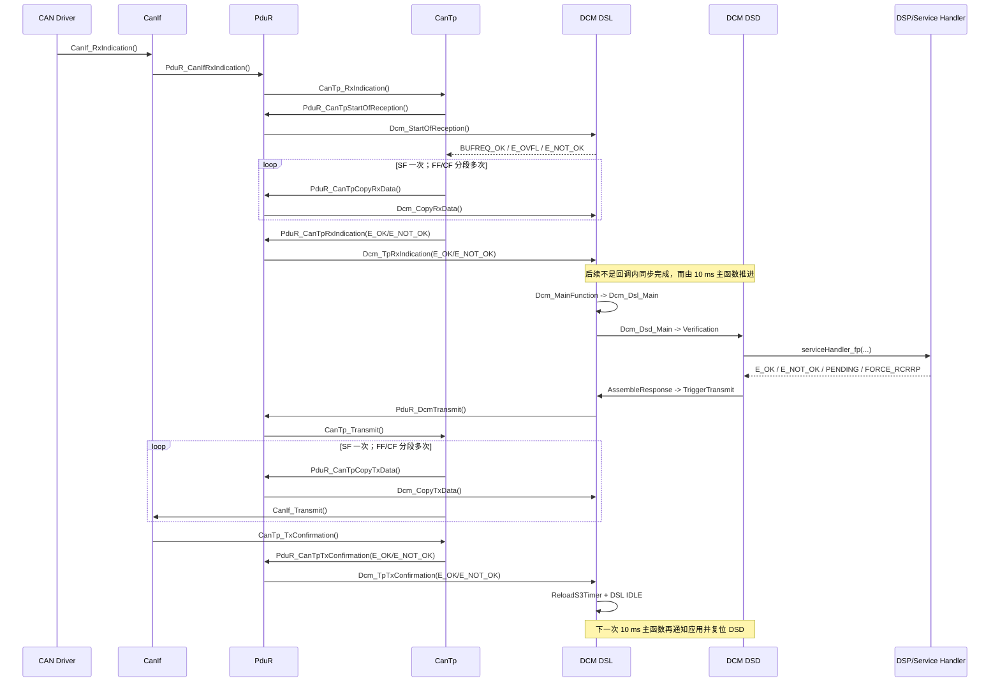

# DCM 诊断关键函数调用路径

## 1. 适用范围与当前配置

本文基于本项目当前生成代码和 BSW 实现整理，主路径是 **UDS on CAN / ISO-TP**。

| 配置项 | 当前值 | 对调用路径的影响 |
|---|---:|---|
| `Dcm_MainFunction` 周期 | 10 ms | DSL/DSD/DSP 状态机每 10 ms 推进一次 |
| `DCM_CFG_S3MAX_TIME` | 5,000,000 us | S3 Server 超时为 5 s |
| DCM Rx/Tx buffer | 2048 / 2048 bytes | `tpSduLength > 2048` 时 SoR 返回 `BUFREQ_E_OVFL` |
| Rx PDU | 2 个 | Physical Rx ID = 0；Functional Rx ID = 1 |
| Tx PDU | 1 个 | Physical Tx ID = 0 |
| 请求队列 | OFF | DSL busy 时不会进入队列 |
| 并行处理 | OFF | 单请求、单协议主状态机 |
| 协议抢占 | OFF | 无高优先级协议抢占分支 |
| KWP | OFF | `Dcm_Prv_ReloadS3Timer()` 只装载 UDS S3，不走 P3 |
| RxPdu sharing | OFF | 不进行 UDS/OBD 共享 PDU 重映射 |
| ROE / Paged buffer | OFF | 对应状态和 S3 调用点不参与当前构建 |
| Application-on-Rx | OFF | 不调用 `DcmAppl_StartOfReception/CopyRxData/TpRxIndication` |

配置依据：

- `BasicSoftware/src/bsw/Dcm/Dcm_Cfg_DslDsd.h:29-31, 38, 58-76, 94-110, 133-179, 432`
- `BasicSoftware/src/bsw/Dcm/Dcm_Lcfg_Dsl.c:45-130`
- `BasicSoftware/ecu_config/bsw/gen/bswmd/Dcm_Cfg_BSWMD.arxml:16-20`
- `BasicSoftware/ecu_config/rte/static/RTA_Rte_EcucValues.arxml:1675-1700`

## 2. 端到端主调用路径



## 3. `Dcm_StartOfReception()` 调用路径

### 3.1 上游入口

```text
CanIf_RxIndication
  -> configured upper-layer callback
  -> PduR_CanIfRxIndication
  -> CanTp_RxIndication
  -> CanTp_Prv_ProcessRxSingleFrame / CanTp_Prv_ProcessRxFirstFrame
  -> PduR_CanTpStartOfReception
  -> PduR_dCanTpStartOfReception
  -> configured StartOfReception function pointer
  -> Dcm_StartOfReception
```

PduR 映射：

- CanTp Rx route 0（Functional）映射到 DCM Rx PDU 1。
- CanTp Rx route 1（Physical）映射到 DCM Rx PDU 0。
- 两条 route 的回调均为 `Dcm_StartOfReception`、`Dcm_CopyRxData`、`Dcm_TpRxIndication`。

映射依据：`BasicSoftware/src/bsw/PduR/PduR_PBcfg.c:516-517, 585` 和
`BasicSoftware/src/bsw/Dcm/Dcm_Cfg_DslDsd.h:164-179`。

### 3.2 DCM 内部路径

```text
Dcm_StartOfReception(id, info, tpSduLength, bufferSizePtr)
  -> Dcm_Prv_CheckEnvironment
       - DCM 已初始化且允许接收
       - id < DCM_CFG_TOTAL_RX_PDUID
       - bufferSizePtr / metadata 有效
  -> Dcm_CheckDependancies
       - 检查连接的 ComM 通信状态
       - DcmAppl_DcmGetRxPermission(protocol, id, info, length)
  -> Dcm_Prv_GetRxBufferMaxLen
  -> length == 0
       - 仅查询可用 buffer，返回 BUFREQ_OK
     length > buffer max
       - 返回 BUFREQ_E_OVFL
     其他
       -> Dcm_StartOfReceptionProcess [SchM 全局临界区]
          -> Dcm_ProcessNewRequest
             -> Dcm_CheckFunctionalTesterPresent
             -> Dcm_Prv_IsDslBusyWithRequest
             -> 空闲主路径：
                - RequestProcessingFlag = TRUE
                - 设置 ActiveRxPduId / request length
                - Rx buffer 指向 protocol rxBuffer
                - DSL state = DSL_STATE_WAITFOR_RXINDICATION_E
                - 保存源地址/目标地址
          -> Dcm_ProcessNewRequestSuccessful
             - *bufferSizePtr = tpSduLength
  -> 返回 BUFREQ_OK / BUFREQ_E_OVFL / BUFREQ_E_NOT_OK
```

关键结论：

- SoR 只完成接收许可、buffer 建立和 DSL 状态占用，不解析完整 UDS 服务。
- 当前配置无请求队列。DCM busy 时按 DSL busy 分支拒绝或准备 NRC 0x21，而不是排队。
- `DcmAppl_DcmGetRxPermission()` 是项目接收许可的关键应用钩子，即使 `DCM_CALLAPPLICATIONONREQRX_ENABLED` 为 OFF 仍会执行。

源码入口：

- `BasicSoftware/src/bsw/CanTp/src/CanTp_Prv.c:168,253`
- `BasicSoftware/src/bsw/PduR/PduR_LoTp.c:221`
- `BasicSoftware/src/bsw/PduR/PduR_dLoTp.c:220`
- `BasicSoftware/src/bsw/Dcm/src/Dsl/Dcm_Reception/Dcm_Dsl_StartOfReception.c:743,857,908,1003,1049`

## 4. `Dcm_CopyRxData()` 调用路径

```text
CanTp receive SF payload / FF payload / each CF payload
  -> PduR_CanTpCopyRxData
  -> PduR_dCanTpCopyRxData
  -> configured CopyRxData function pointer
  -> Dcm_CopyRxData
     -> Dcm_CheckEnvironment
     -> info->SduLength == 0
          -> Dcm_ProvideRxBufferSize
        正常数据
          -> Dcm_Prv_ProcessCopyRxData [SchM 全局临界区]
             -> 检查 RequestProcessingFlag
             -> DCM_MEMCOPY(currentRxWritePtr, segment, segmentLength)
             -> currentRxWritePtr += segmentLength
             -> remainingLength -= segmentLength
             -> *bufferSizePtr = remainingLength
             -> BUFREQ_OK
```

失败时 `BUFREQ_E_NOT_OK` 会让 CanTp 终止接收，随后经 `PduR_CanTpRxIndication(..., E_NOT_OK)` 释放/丢弃 DCM 请求。

源码入口：

- `BasicSoftware/src/bsw/CanTp/src/CanTp_Prv.c:175,261,381`
- `BasicSoftware/src/bsw/PduR/PduR_dLoTp.c:170`
- `BasicSoftware/src/bsw/Dcm/src/Dsl/Dcm_Reception/Dcm_Dsl_CopyRxData.c:267,327`

## 5. `Dcm_TpRxIndication()` 调用路径

### 5.1 上游触发

```text
接收成功：
  CanTp 收完 SF 或最后一个 CF
    -> CanTp_Prv_PduRConfirmation(CANTP_RX_PDUR_CONFIRMATION, ..., E_OK)
    -> PduR_CanTpRxIndication
    -> PduR_dCanTpRxIndication
    -> Dcm_TpRxIndication(id, E_OK)

接收失败：
  CanTp timeout / SN error / buffer copy error / cancellation
    -> PduR_CanTpRxIndication(..., E_NOT_OK)
    -> Dcm_TpRxIndication(id, E_NOT_OK)
```

### 5.2 `E_OK` 主路径

```text
Dcm_TpRxIndication(id, E_OK)
  -> 校验 id
  -> 取得 protocol row 和 Rx buffer
  -> SchM_Enter_Dcm_Global
  -> Dcm_CheckDiagnosticStatus
       - 必要时通知 ComM_DCM_ActiveDiagnostic
  -> RequestProcessingFlag == TRUE
       -> Dcm_ProcessRxIndication
          -> Dcm_Prv_ReloadP2maxValue
          -> 校验保存的 RxPduId
          -> DSL state = DSL_STATE_REQUESTRECEIVED_STARTPROTOCOL_E
          -> Dcm_SetuptimerhighprioId
  -> SchM_Exit_Dcm_Global
```

这里的关键边界是：`Dcm_TpRxIndication()` 返回后，请求尚未完成校验和服务处理。它只是把状态从 `WAITFOR_RXINDICATION` 推到 `REQUESTRECEIVED_STARTPROTOCOL`。

### 5.3 `E_NOT_OK` 路径

```text
Dcm_TpRxIndication(id, E_NOT_OK)
  -> Dcm_DiscardRequest
     -> 清除/释放本次接收状态
     -> 当前请求正处于 WAITFOR_RXINDICATION 时：
        - DSL state = IDLE
        - Dcm_Prv_ReloadS3Timer
```

源码入口：

- `BasicSoftware/src/bsw/Dcm/src/Dsl/Dcm_Reception/Dcm_Dsl_RxIndication.c:412,536,639`
- `BasicSoftware/src/bsw/PduR/PduR_LoTp.c:97`
- `BasicSoftware/src/bsw/PduR/PduR_dLoTp.c:90`

## 6. 10 ms 状态机与服务分发路径

### 6.1 OS/RTE 调度

```text
TASK(OsTask_SysOsApp_BSW_10ms_A)
  -> CanTp_MainFunction
  -> Dcm_MainFunction
  -> Dem_MainFunction
  -> FiM_MainFunction
```

`Dcm_MainFunction()` 的主顺序：

```text
Dcm_MainFunction
  -> Dcm_Dsl_Main
     -> Dcm_Dsl_Prv_StateMachine
  -> Dcm_Dsd_Main
     -> Dcm_Dsd_Prv_StateMachine
  -> Dcm_Dsp_Main
```

### 6.2 Rx indication 后的正常状态迁移

```text
DSL_STATE_REQUESTRECEIVED_STARTPROTOCOL_E
  -> Dcm_Dsl_RequestReceived_StartProtocol
     -> 必要时 Dcm_StopProtocol
     -> Dcm_StartProtocol
     -> Dcm_Dsd_Prv_ServiceInit
  -> Dcm_DslState_MonitorP2Max
     -> DSL_STATE_P2MAX_TIMEMONITORING_E
     -> DSD_VERIFICATION_E

DSD_VERIFICATION_E
  -> Dcm_PrepareDcmMsgContext
  -> Dcm_Dsd_Prv_Verification
     - SID/子功能、长度、会话、安全级别等校验
  -> DSD_CALL_SERVICE_E

DSD_CALL_SERVICE_E
  -> Dcm_CallService
  -> Dcm_DsdSrvTableCfg_pst->serviceHandler_fp(...)
     - internalDspService: Dcm_SrvOpstatus_u8
     - external service: Dcm_ExtSrvOpStatus_u8
```

服务返回值处理：

| 返回值 | 后续行为 |
|---|---|
| `E_OK` | 组正响应，进入发送 |
| `E_NOT_OK` | 使用 NRC 组负响应，进入发送 |
| `DCM_E_PENDING` | 保持服务处理，后续主函数再次调用；P2/P2* 由 DSL 监控 |
| `DCM_E_FORCE_RCRRP` | 触发 NRC 0x78 Response Pending |
| `DCM_E_REQUEST_NOT_ACCEPTED` | 本周期不组响应 |

源码入口：

- `BasicSoftware/src/rte/gen/Rte.c:21133-21169`
- `BasicSoftware/src/bsw/Dcm/src/General/Dcm_General_MainFunction.c:337`
- `BasicSoftware/src/bsw/Dcm/src/Dsl/Dcm_Dsl.c:66`
- `BasicSoftware/src/bsw/Dcm/src/Dsl/Dcm_Dsl_StateMachine.c:659,697,821`
- `BasicSoftware/src/bsw/Dcm/src/Dsd/Dcm_Dsd.c:72`
- `BasicSoftware/src/bsw/Dcm/src/Dsd/Dcm_Dsd_StateMachine.c:182,253,294`

## 7. 响应发送与 `Dcm_CopyTxData()` 路径

### 7.1 响应组包和发送请求

```text
serviceHandler_fp returns
  -> Dcm_Dsd_EvaluateServiceResult
  -> Dcm_Dsd_Prv_AssembleResponse
     -> Dcm_Dsd_PositiveResponseAssembler
        或 Dcm_Dsd_NegativeResponseAssembler
     -> Dcm_Prv_TriggerTransmit(totalLength)
        -> length > 0:
           - 设置 Tx buffer/length
           - DSL state = WAITFOR_TXCONFIRMATION
           - Dcm_Prv_SendResponse
             -> 检查 ComM Full Communication
             -> PduR_DcmTransmit(activeTxPduId, pduInfo)
             -> PduR_dDcmTransmit
             -> configured lower transmit function
             -> CanTp_Transmit
```

若响应被抑制，`totalLength == 0`，不会调用 PduR：

```text
Dcm_Prv_TriggerTransmit(0)
  -> Dcm_Prv_ReloadS3Timer
  -> Dcm_Prv_SetNewSession
  -> Dcm_Dsd_Prv_Confirmation(E_OK)
  -> DSL state = IDLE
```

### 7.2 CanTp 拉取响应数据

```text
CanTp_Transmit
  -> CanTp state machine prepares SF/FF/CF
  -> PduR_CanTpCopyTxData
  -> PduR_dCanTpCopyTxData
  -> configured CopyTxData function pointer
  -> Dcm_CopyTxData
     -> Dcm_CheckEnvironment
     -> Dcm_UpdateAvailableResponse [SchM 全局临界区]
        - 从 DCM Tx buffer 拷贝本段
        - 更新剩余可用数据
        - 处理 TP_DATARETRY（如有）
  -> CanTp/CanIf 发送对应 CAN frame
```

源码入口：

- `BasicSoftware/src/bsw/Dcm/src/Dsd/Dcm_Dsd_AssembleResponse.c:120,147,220`
- `BasicSoftware/src/bsw/Dcm/src/Dsl/Dcm_Transmission/Dcm_Dsl_ResponseTransmission.c:544,676`
- `BasicSoftware/src/bsw/PduR/PduR_UpTp.c:57`
- `BasicSoftware/src/bsw/PduR/PduR_dUpTp.c:41`
- `BasicSoftware/src/bsw/CanTp/src/CanTp.c:241`
- `BasicSoftware/src/bsw/Dcm/src/Dsl/Dcm_Transmission/Dcm_Dsl_CopyTxData.c:560`

## 8. `Dcm_TpTxConfirmation()` 调用路径

### 8.1 上游触发

```text
CAN Driver Tx confirmation
  -> CanIf Tx confirmation callback
  -> PduR_CanIfTxConfirmation
  -> CanTp_TxConfirmation
     -> 单帧或最后一个 CF 确认后
     -> CanTp_Prv_PduRConfirmation(CANTP_TX_PDUR_CONFIRMATION, ..., E_OK)
  -> PduR_CanTpTxConfirmation
  -> PduR_dCanTpTxConfirmation
  -> configured TxConfirmation function pointer
  -> Dcm_TpTxConfirmation(id, result)
```

注意：中间 CF 的 CAN 层确认只推进 CanTp 分段状态；只有完整 N-SDU 发送完成，才上报 `Dcm_TpTxConfirmation()`。

### 8.2 DCM 内部主路径

```text
Dcm_TpTxConfirmation(id, result)
  -> txPduId = Dcm_Prv_GetTxPduIdFromTxIndex(id)
  -> 校验 id
  -> SchM_Enter_Dcm_Global
  -> txPduId == ActiveTxPduId
     -> 若为 NRC 0x78 的确认：
        Dcm_ConfirmationForPendingResponse
        - E_OK 时重装 P2*，继续等待最终服务结果
     -> 否则为最终响应确认：
        Dcm_Dsl_Prv_ConfirmationForCurrentResponse(result)
          -> Dcm_Prv_ReloadS3Timer
          -> Dcm_Prv_SetNewSession
          -> Dcm_Dsd_Prv_Confirmation(result)
             - 保存 POS/NEG + OK/NOT_OK confirmation status
             - DSD state = DSD_SENDTXCONF_APPL_E
             - Dcm_Prv_InactivateComMChannel
        -> DSL state = IDLE
  -> 清除可能的 NRC 0x21 跟踪状态
  -> SchM_Exit_Dcm_Global
```

下一次 `Dcm_MainFunction -> Dcm_Dsl_Main` 发现 `DSD_SENDTXCONF_APPL_E` 后：

```text
Dcm_Dsd_Prv_SendTx_Confirmation
  -> DcmAppl_DcmConfirmation / service-specific confirmation
Dcm_Dsd_Prv_ResetAfterProcessingTesterRequest
  -> DSD state = IDLE
  -> 清理本次请求上下文
```

源码入口：

- `BasicSoftware/src/bsw/CanTp/src/CanTp.c:445`
- `BasicSoftware/src/bsw/PduR/PduR_LoTp.c:134`
- `BasicSoftware/src/bsw/PduR/PduR_dLoTp.c:140`
- `BasicSoftware/src/bsw/Dcm/src/Dsl/Dcm_Transmission/Dcm_Dsl_Confirmation.c:573,772`
- `BasicSoftware/src/bsw/Dcm/src/Dsd/Dcm_Dsd_Confirmation.c:133`
- `BasicSoftware/src/bsw/Dcm/src/Dsl/Dcm_Dsl.c:66-84`

## 9. `Dcm_Prv_ReloadS3Timer()` 调用路径

### 9.1 函数本体

当前 KWP 关闭，实际逻辑为：

```text
Dcm_Prv_ReloadS3Timer
  -> DCM_TimerStart(
       s_DataTimeOutMonitor_u32,
       DCM_CFG_S3MAX_TIME,          // 5 s
       Dcm_P2OrS3StartTick_u32,
       Dcm_P2OrS3TimerStatus_uchr)
  -> Dcm_Prv_Set_DataTimeOut(s_DataTimeOutMonitor_u32)
```

因为 `DCM_CFG_OSTIMER_USE == FALSE`，S3 由 10 ms `Dcm_MainFunction()` 软件节拍处理。

### 9.2 当前配置下的重要调用点

| 场景 | 直接调用链 | 作用 |
|---|---|---|
| 最终响应发送确认 | `Dcm_TpTxConfirmation -> Dcm_Dsl_Prv_ConfirmationForCurrentResponse -> Dcm_Prv_ReloadS3Timer` | 正常请求最主要的 S3 重装点 |
| 响应被抑制/长度为 0 | `AssembleResponse -> Dcm_Prv_TriggerTransmit(0) -> Dcm_Prv_ReloadS3Timer` | 无 Tx confirmation 时直接重装 |
| 接收失败并丢弃活动请求 | `Dcm_TpRxIndication(E_NOT_OK) -> Dcm_DiscardRequest -> Dcm_Prv_ReloadS3Timer` | 恢复到空闲等待 |
| Functional TesterPresent 特殊处理 | `Dcm_TpRxIndication(E_OK) -> Dcm_Prv_ProcessFunctionalTP -> Dcm_Prv_ReloadS3Timer` | 功能寻址 TesterPresent 刷新 S3 |
| DSD verification 暂不接受请求 | `Dcm_Dsd_ProcessVerificationResult -> ResetAfterProcessingTesterRequest -> Dcm_Prv_ReloadS3Timer` | 放弃本次处理后恢复 S3 |
| Warm start 恢复 | `Dcm_Prv_Main_Warmstart -> Dcm_Prv_ReloadS3Timer` | 恢复诊断上下文 |
| 外部重启 P3/S3 API | `Dcm_DslDsd_RestartP3Timer -> Dcm_Prv_ReloadS3Timer` | 供集成层显式重启计时 |

以下源码中也有调用，但在当前配置被裁剪：ROE、协议抢占、KWP split response、请求队列/并行相关分支。

### 9.3 S3 计时和超时路径

```text
TASK OsTask_SysOsApp_BSW_10ms_A
  -> Dcm_MainFunction
  -> Dcm_Dsl_Main
  -> Dcm_Dsl_Prv_StateMachine
  -> DSL_STATE_IDLE_E
  -> Dcm_Dsl_Idle
     -> active session != DEFAULT_SESSION
     -> DCM_TimerProcess(dataTimeout, ...)
     -> 未超时：写回剩余值
     -> 已超时：
        - ComM_DCM_InactiveDiagnostic
        - SchM_Switch_Dcm_DcmDiagnosticSessionControl(DEFAULT_SESSION)
        - DcmAppl_Switch_DcmDiagnosticSessionControl(DEFAULT_SESSION)
        - Dcm_Prv_SetSesCtrlType(DEFAULT_SESSION)
        - 清除 P3 monitor 标志
```

源码入口：

- `BasicSoftware/src/bsw/Dcm/src/General/Dcm_Prv_General.c:1043`
- `BasicSoftware/src/bsw/Dcm/src/Dsl/Dcm_Dsl_StateMachine.c:724`
- `BasicSoftware/src/bsw/Dcm/src/Dsl/Dcm_Transmission/Dcm_Dsl_Confirmation.c:576`
- `BasicSoftware/src/bsw/Dcm/src/Dsl/Dcm_Transmission/Dcm_Dsl_ResponseTransmission.c:599`
- `BasicSoftware/src/bsw/Dcm/src/Dsl/Dcm_Reception/Dcm_Dsl_RxIndication.c:403,447`
- `BasicSoftware/src/bsw/Dcm/src/Dsd/Dcm_Dsd_StateMachine.c:170`
- `BasicSoftware/src/bsw/Dcm/src/General/Dcm_DslDsd_WarmStart.c:336`
- `BasicSoftware/src/bsw/Dcm/src/General/Dcm_DslDsd_RestartP3Timer.c:37`

## 10. 建议断点顺序

一次完整物理寻址请求建议按以下顺序观察：

```text
1  CanIf_RxIndication
2  CanTp_RxIndication
3  Dcm_StartOfReception
4  Dcm_CopyRxData                    // 可能多次
5  Dcm_TpRxIndication
6  Dcm_MainFunction
7  Dcm_Dsl_Prv_StateMachine
8  Dcm_Dsd_Prv_Verification
9  Dcm_CallService / serviceHandler_fp
10 Dcm_Dsd_Prv_AssembleResponse
11 Dcm_Prv_TriggerTransmit
12 PduR_DcmTransmit
13 CanTp_Transmit
14 Dcm_CopyTxData                    // 可能多次
15 CanTp_TxConfirmation
16 Dcm_TpTxConfirmation
17 Dcm_Prv_ReloadS3Timer
18 Dcm_Dsd_Prv_SendTx_Confirmation  // 下一次 Dcm_MainFunction
```

重点观察变量：

- `Dcm_Dsl_Prv_GetDslState()`：接收、P2、发送确认的主状态。
- `Dcm_Dsd_Prv_GetDsdState()`：校验、服务调用、等待确认、应用确认状态。
- `Dcm_Prv_Get_DataTimeOut()`：P2/P2*/S3 共用计时监控值。
- `Dcm_Prv_GetActiveRxPduId()` / `Dcm_Prv_GetActiveTxPduId()`：当前路由。
- `Dcm_ReceptionInfo_ast[id].Dcm_RequestProcessingFlag_b`：该 Rx PDU 是否被 DCM 接受。
- `Dcm_MsgContext_st.idContext`、`reqDataLen`、`resDataLen`：SID 和请求/响应上下文。
- `Dcm_SrvOpstatus_u8` / `Dcm_ExtSrvOpStatus_u8`：异步服务的 INITIAL/PENDING/CANCEL 状态。
- `Dcm_DebugTrace_st`：项目当前工作区已加入的 SoR、RxInd、TxConf、S3、PduR transmit 跟踪计数和最近状态。

## 11. 快速故障定位

| 现象 | 最先检查 |
|---|---|
| 进不了 `Dcm_StartOfReception` | CanIf Rx PDU、PduR CanIf->CanTp route、CanTp Rx NSdu 配置 |
| SoR 返回 `E_NOT_OK` | DCM init/accept flag、ComM 模式、`DcmAppl_DcmGetRxPermission`、DSL busy |
| SoR 返回 `E_OVFL` | `tpSduLength` 是否超过 2048 |
| 有 SoR、无 RxIndication | `Dcm_CopyRxData` 返回值、CanTp N_Cr、SN/FC、最后 CF 是否到达 |
| RxIndication 后服务不执行 | DSL/DSD state、10 ms task 是否运行、protocol start、DSD verification NRC |
| 服务已返回但无 CAN 响应 | ComM FullCom、`PduR_DcmTransmit` 返回值、CanTp Tx state、`Dcm_CopyTxData` |
| 已发帧但无 `Dcm_TpTxConfirmation` | CanIf Tx confirmation、CanTp 是否认为最后一帧完成、PduR Tx route ID |
| 会话提前回默认 | S3 是否在最终确认/TesterPresent 后重装，10 ms tick 与 `DCM_CFG_S3MAX_TIME` 是否一致 |
