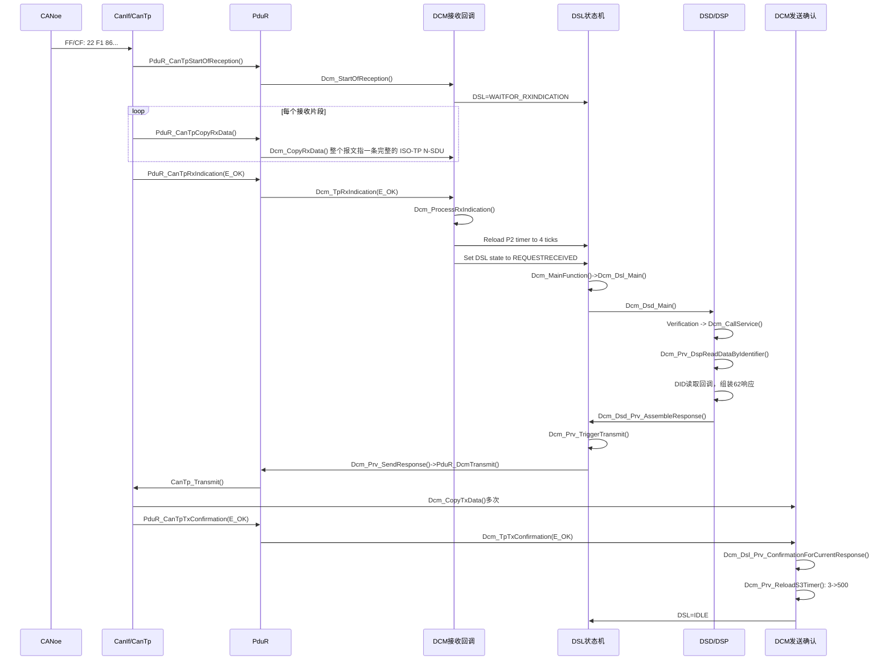
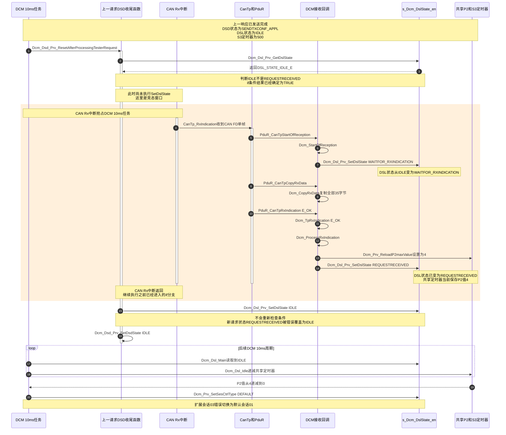

前文请查看：
[2026.06.29 UDS故障排查](2026.06.29%20UDS故障排查.md)


我设置了几个任务：

[[2026.07.14 UDS扩展会话超时进入默认会话排查#CANoe 中的关于 UDS 的配置]]
[故障分析排查过程](2026.07.14%20UDS扩展会话超时进入默认会话排查.md#故障分析排查过程)
[总结：DCM 的工作流解析](总结：DCM%20的工作流解析)


# 故障分析排查过程

## 现象复现：略
## 问题排查

`Dcm_Prv_SetSesCtrlType()` 是 DCM 内部真正执行“切换诊断会话”的核心函数。它不负责判断为什么要切换；S 3 超时、收到 `10 xx`、协议重启或应用请求等上层逻辑决定目标会话，然后调用它执行切换。

某个上层路径决定切换到 0 x 01
    ↓
Dcm_Prv_SetSesCtrlType(0 x 01)
    ↓
Dcm_Prv_SetDefaultSesCtrlType()
    ↓
idxActiveSession_u 8 = 0
    ↓
F 186 读取会话表索引 0
    ↓
响应 62 F 1 86 01
Dcm_Prv_SetSesCtrlType 我在函数中切换到默认会话的地方打断点，等待复现。一旦复现了，通过调用栈 局部变量等可以确定问题根因。
- 调用者是 `Dcm_Dsl_Idle()`：S 3 超时。
- 调用者是 `Dcm_Dsl_StartProtocol()`：诊断协议重新启动。
- 调用者是 `Dcm_Prv_ProcessResetToDefaultSession()`：应用请求回默认。
- 调用者是 DSC 服务：收到了或误解析了 `10 01`。


## 调试器排查


结论：
- 切换前确实是扩展会话 `0x03`。
- DCM 空闲状态机发现超时计数为 0。
- DCM 主动执行 `0x03 → 0x01`。
- 不是 ECU 复位、协议重启、F 186 错误或应用调用 ResetToDefault。

但还要继续区分两种情况：

- 真正经过 5 秒没有成功重载 S 3。
- 变量中残留的是 P 2/P 2* 计时值，响应结束时没有正确重载成 S 3，随后在 Idle 中很快变成 0。

$$
很有可能是计时器重载值被旧值覆盖、被错误改成 P 2 值，或状态机存在并发时序问题
$$

现在不是 S 3 真实超时，而是新请求状态被上一请求的清理流程覆盖。


## 问题分析

RE_DataServices_DID_ 0 xF 186 _Read_func
`F186` 是当前诊断会话 DID。对应代码会调用 `Dcm_GetSesCtrlType()`，把当前会话值写入响应


这里所说的“任务冲突”不是 DCM 任务真的 5 秒没运行，而是两个执行上下文同时操作同一组 S 3 变量：

```
CanTp/TxConfirmation回调
  -> Dcm_Prv_ReloadS3Timer()       重新装载S3

10 ms Dcm_MainFunction任务
  -> Dcm_Dsl_Idle()
  -> DCM_TimerProcess()            检查/处理S3
```

它们共享：

```
s_DataTimeOutMonitor_u32
Dcm_P2OrS3StartTick_u32
Dcm_P2OrS3TimerStatus_uchr
```

问题代码的关键点是：

- [Dcm_Dsl_StateMachine.c (line 721)](E:/github/ECAS_RTA_S32K324GHS_EOL_FCT/BasicSoftware/src/bsw/Dcm/src/Dsl/Dcm_Dsl_StateMachine.c:721) 在锁外读取 S 3。
- 同文件第 729 行在锁外开始处理 S 3。
- 到第 734 行才进入 `Dcm_Global` 锁，并把局部结果写回。
- [Dcm_Prv.h (line 107)](E:/github/ECAS_RTA_S32K324GHS_EOL_FCT/BasicSoftware/src/bsw/Dcm/src/General/Dcm_Prv.h:107) 中，重装定时器会同时更新全局起始 Tick 和定时值。

因此存在这种竞争窗口：

```
DCM任务读取旧S3值
        ↓
TxConfirmation重新装载5秒S3
        ↓
DCM任务继续使用旧快照计算
        ↓
把旧值或错误的0重新写回
        ↓
下一次Dcm_Dsl_Idle看到S3=0
        ↓
切回默认会话
```

这叫“错误超时判断”，不是总线真的 5 秒没有请求。
如果起始 Tick 比当前 Tick 更新，做无符号减法时可能产生一个很大的值，从而被错误判断为 5 秒已经到期。

### **后续修复方向**
最终修复不是增大 S 3，也不是改 CANoe 周期，而是让 S 3 的“读取、处理、回写”和“重新装载”使用同一个完整临界区，保证下面三个变量作为一个整体更新：


### 再次复现


这次已经确认了最关键的一层：**DCM 确实是从 `Dcm_Dsl_Idle()` 的 S 3 处理路径主动切回默认会话，不是复位，也不是收到 `10 01`。**

从截图可以直接读出：

```
Dcm_Prv_SetSesCtrlType(SesCtrlType_u8 = 1)
  <- Dcm_Dsl_Idle()
  <- Dcm_Dsl_Prv_StateMachine()
  <- Dcm_Dsl_Main()
  <- Dcm_MainFunction()
  <- 10ms BSW任务
```

同时：

```
currentSession_u8          = 3   // 切换前是扩展会话
SesCtrlType_u8             = 1   // 准备切到默认会话
s_DataTimeOutMonitor_u32   = 0   // DCM认为S3已经到期
```

`Dcm_DsdSrvTableCfg_pst->sid_u8 = 34` 和 `idContext = 34`，十进制 34 就是 `0x22`，现场仍保留的是 DID 读取上下文，不是会话控制 `0x10`。

所以现在的结论是：

```
周期22请求仍在发送
        ↓
S3变量却变成0
        ↓
Dcm_Dsl_Idle判断超时
        ↓
调用Dcm_Prv_SetSesCtrlType(1)
        ↓
扩展会话变成默认会话
```

但还需要区分两个根因：

1. `Dcm_Prv_ReloadS3Timer()` 没有被及时调用，例如 TxConfirmation 因为请求重叠没有正常完成。
2. S 3 已经被重新装载，但被 10 ms 任务与回调之间的并发操作覆盖成 0。


### 需要临时记录以下调用次数


当前最可能的是 `Dcm_TpRxIndication` 与 10 ms `Dcm_MainFunction` 的状态竞争，导致已接收请求没有被状态机继续处理。下一步应记录 DSL/DSD 状态切换和 `PduR_DcmTransmit()` 返回值，不需要再查 CanTp 或 S 3 重装。


###  记录 DSL/DSD 状态切换

 

定位到根因，是明确的并发竞争。

10 ms 任务检查 DSL，当时不是 2
        ↓
新请求中断到达，把 DSL 设置成 1 再设置成 2
        ↓
10 ms 任务继续执行旧判断结果
        ↓
把 DSL 从 2 错误覆盖为 0
此时新请求设置的 P 2 计时器为 `4`。DSL 却被错误改成 `IDLE`，于是 `Dcm_Dsl_Idle()` 把这个 4 当成 S 3 继续递减，约 40 ms 后变成 0 并切回默认会话。

<mark style="background: #FF5582A6;">修复方向：使用 `SchM_Enter_Dcm_Global()` 保护上述 DSL 检查、DSL 写入和 DSD 写入，使它们与 `StartOfReception/RxIndication` 的状态修改互斥。测试数据已经足够，不需要再继续加记录点。
</mark>


### 测试结果


连续测试了四个小时没有复现故障。


# 发送 1003 会显示超时


从截图看，ECU 的正响应分别晚了约 `4.118 s` 和 `427 ms`，而该工程给 CANoe 的 P 2 是 `0x0032 = 50 ms`。没有先发 `7F 10 78` 时，CANoe 报超时是正确行为。我要沿 `0x10 03` 的 DCM 处理链、会话切换回调和 10 ms 任务调度定位这段延迟究竟卡在哪里。


```
P2 是 UDS 的“请求到首个响应”的最大等待时间。


测试仪发送请求
        ↓
ECU完整接收请求
        ↓  P2计时
ECU必须发送：
  正响应 / 负响应 / 7F xx 78
  
```


<mark style="background: #FF5582A6;">

- `P2`：一条请求等待响应，当前为 50 ms。
- `P2*`：收到 NRC `0x78` 后继续等待，当前为 2 秒。
- `S3`：扩展会话无诊断活动时返回默认会话，当前为 5 秒。
- 
- </mark>
- 

结论：初步判断是调试器条件断点的影响，当我把条件断点取消的时候
- 
- 

### HLL


HLL 是 **High Level Language（高级语言）** 的缩写。在 TRACE 32 断点窗口中，它表示：`CONDITION` 里的表达式按照 C/C++ 源代码语法解析。

例如勾选 HLL 后，可以写：

```
SesCtrlType_u8 == 1 && Dcm_ActiveSessionIdx_u8 == 2
```

TRACE 32 会通过调试信息找到变量地址和类型，然后读取变量并判断条件。

关键问题是：这种条件通常不是 MCU 硬件直接判断的。实际过程往往是：

```
CPU执行到断点地址
        ↓
硬件断点暂停CPU
        ↓
TRACE32读取变量
        ↓
在调试器中计算HLL条件
        ↓
条件为真：保持暂停
条件为假：自动恢复运行
```

<mark style="background: #FF5582A6;">因此即使你没看到程序停住，CPU 也可能已经短暂停止过。函数执行频繁时，这些暂停会不断累积，最终造成</mark>：

- CANoe 等待 `1003` 响应超时
- DCM 任务执行延迟
- CAN/CanTp 时序异常
- 看起来像偶发的软件问题

你之前使用的条件断点就是这种情况：条件没有满足，所以界面没有停住，但每次经过断点地址时仍可能先暂停、读取变量、判断，再恢复。

你当前第 378 行的断点不需要 HLL：

```
CONDITION：空
HLL：不勾选
RESUME：不勾选
Action：stop
Method：ONCHIP
```

因为代码本身已经完成了条件筛选：

```
if (SesCtrlType_u8 == DCM_DEFAULT_SESSION)
{
    // 第378行断点
}
```

只有真正准备进入默认会话时才会执行到第 378 行，所以再添加 HLL 条件既没有必要，也会增加调试干扰。


# 总结：DCM 的工作流解析

## 代码时序分析

当前故障的本质是：

> <mark style="background: #FFF3A3A6;">上一条请求的 DSD 收尾与下一条请求的 CanTp 接收回调并发，旧代码用过期判断把新请求的 DSL 状态从 `REQUESTRECEIVED` 覆盖成 `IDLE`。此时共享定时器保存的是 P 2≈4 tick，却被 `Dcm_Dsl_Idle()` 当成 S 3 使用，约 40 ms 后切回默认会话。</mark>

### **关键函数作用**

| 函数                           | 调用时机          | 主要动作                                               |
| ---------------------------- | ------------- | -------------------------------------------------- |
| `Dcm_StartOfReception()`     | 收到 SF/FF      | 申请接收缓冲区，登记请求，DSL 进入 `WAITFOR_RXINDICATION`         |
| `Dcm_CopyRxData()`           | 收到每段有效数据      | 把 CanTp 重组的数据写入 DCM Rx Buffer                      |
| `Dcm_TpRxIndication()`       | 完整 N-SDU 接收结束 | 确认结果，启动 P 2，DSL 进入 `REQUESTRECEIVED_STARTPROTOCOL` |
| `Dcm_MainFunction()`         | 10 ms 任务      | 依次运行 DSL、DSD、DSP 周期处理                              |
| `Dcm_Dsd_Prv_StateMachine()` | DSD 处理        | 校验 SID/权限，调用具体服务，组装响应                              |
| `Dcm_Prv_SendResponse()`     | 响应准备完成        | 调用 `PduR_DcmTransmit()`                            |
| `Dcm_CopyTxData()`           | CanTp 请求响应数据  | 把 DCM 响应缓冲区交给 CanTp 分段发送                           |
| `Dcm_TpTxConfirmation()`     | 完整响应发送结束      | 处理发送结果，调用 `Dcm_Prv_ReloadS3Timer()`                |
| `Dcm_Prv_ReloadS3Timer()`    | 有效通信完成        | 将共享定时器重装为 S 3，即 500 tick                           |
| `Dcm_Dsl_Idle()`             | DSL 处于 IDLE   | 将共享定时器作为 S 3 递减，归零后切默认会话                           |

### **正常完整时序**



```mermaid
sequenceDiagram
 
```

`Dcm_MainFunction()` 中的实际顺序是：

```
Dcm_MainFunction
 ├─ Dcm_Dsl_Main
 │   └─ Dcm_Dsl_Prv_StateMachine
 ├─ Dcm_Dsd_Main
 │   └─ Dcm_Dsd_Prv_StateMachine
 │       ├─ Dcm_Dsd_State_Verification
 │       ├─ Dcm_CallService
 │       │   └─ serviceHandler_fp
 │       │       └─ Dcm_Prv_DspReadDataByIdentifier
 │       └─ Dcm_Dsd_Prv_AssembleResponse
 └─ Dcm_Dsp_Main
```

注意：`0x22` 不是由 `Dcm_Dsp_Main()` 直接调用，而是 DSD 通过 `serviceHandler_fp` 调用 `Dcm_Prv_DspReadDataByIdentifier()`。

### **异常竞态时序**





## UDS 的超时控制


  再结合多帧的流程图就可以更清晰的了解到每个时间参数具体限制的地方：


应用层定义了几种会话模式，在不同的会话模式下，客户端和服务端所被允许进行的访问内容是不同的，常规的有默认会话模式(defaultSession)，拓展会话模式(extendedSession)，编程会话模式(programmingSession)。在一个非默认会话模式启动后，则需要两个时间参数去约束，如下：


## CANtp 的通道配置


这里的 **SDU** 是 `Service Data Unit`，可以理解为：

> **CanTp 眼中的一条完整诊断消息，而不是单独一帧 CAN 报文。**

`CanTpRxNSdu` 中的 `N` 表示 Network Layer，所以完整名称是 **Network Service Data Unit**。

例如你发送的 35 字节请求：

```
22 F1 86 F1 90 F1 8A ... 00 00
```

对 CanTp 来说，这是一个完整的 **Rx N-SDU**。但在 CAN 总线上，它会被 ISO-TP 拆成：

```
首帧 FF：10 23 22 F1 86 F1 90 F1
流控 FC：30 08 0A 00 00 00 00 00
连续帧：21 ...
连续帧：22 ...
连续帧：23 ...
```

CanTp 接收并重新拼接后，交给 PduR/DCM 的内容仍然是：

```
22 F1 86 F1 90 ...
```

其中 `10 23`、`21`、`22`、`23` 等 ISO-TP 控制字节不会交给 DCM。

你的配置树表示：

```
CanTpChannel
├─ CanTpRxNSdus [2]
│  ├─ RX_UdsRxPhy...   物理寻址请求
│  └─ RX_UdsRxFnc...   功能寻址请求
└─ CanTpTxNSdus [1]
   └─ TX_UdsTxPhy...   物理寻址响应
```

具体含义如下。

|配置|作用|
|---|---|
| `RX_UdsRxPhy` |接收发给本 ECU 的物理诊断请求|
| `RX_UdsRxFnc` |接收广播式的功能寻址请求|
| `TX_UdsTxPhy` |ECU 向诊断仪发送物理响应|

例如：

```
诊断仪 --物理请求--> RX_UdsRxPhy
ECU    --物理响应--> TX_UdsTxPhy
```

你当前选择的是：

```
RX_UdsRxFnc_Can_Network_Channel
```

右侧的：

```
CanTpRxTaType = CANTP_FUNCTIONAL
```

也证明这是功能寻址 N-SDU。

而你一直发送的 35 字节 `0x22` 多帧请求，根据之前的 `0x72B -> 0x7AB` 链路，实际应该走：

```
RX_UdsRxPhy
```

不是当前选中的 `RX_UdsRxFnc`。所以要检查此次测试的 `BS/STmin/N_Cr`，应点击左边的：

```
RX_UdsRxPhy_Can_Network_Channel
```

截图中几个关键字段的含义：

- `CanTpRxNSduId = 1`：CanTp 内部识别这条 Rx N-SDU 的句柄，不是 CAN ID。
- `CanTpRxNSduRef`：把这个完整消息连接到 PduR，最终路由到 DCM。
- `CanTpRxTaType = CANTP_FUNCTIONAL`：表示功能寻址。
- `CanTpBs = 8`：接收多帧时，允许对方连续发送 8 个 CF，然后重新等待 FC。
- `CanTpSTmin = 0.02`：要求对方两个连续帧之间至少间隔 20 ms。
- `CanTpNcr = 0.15`：等待下一连续帧的超时通常为 150 ms，具体单位以工具定义为准。

还要注意：功能寻址诊断请求通常只能使用单帧。像你的 35 字节多帧 `0x22` 请求，应当使用物理寻址。因此，这次故障分析最需要检查的是 `RX_UdsRxPhy` 和 `TX_UdsTxPhy` 的配置。


## dsd\dsl\dsp 三者之前的关系

请求主链路是：

```
CAN报文
  ↓
CanIf / CanTp / PduR
  ↓
DSL：收完整请求、管理状态和定时器
  ↓
DSD：识别SID、检查权限、选择处理函数
  ↓
DSP：执行0x10、0x22、0x27等具体服务
  ↓
DSD：整理处理结果
  ↓
DSL：发送响应并等待TxConfirmation
  ↓
PduR / CanTp / CanIf
  ↓
CAN响应
```

### **1. DSL：Diagnostic Session Layer**

<mark style="background: #FF5582A6;">**DSL 是 DCM 的最外层，直接和 `PduR/CanTp` 打交道。它关注的不是 DID 具体内容，而是“一次诊断通信是否正常进行”。**</mark>

主要负责：

- 接收诊断请求
- 管理接收、处理、发送状态
- 管理当前诊断会话，例如默认会话 `01`、扩展会话 `03`
- 管理 P 2、P 2*、S 3 定时器
- 管理连接、协议、RxPdu、TxPdu
- 请求发送响应
- 等待 `TpTxConfirmation`
- 超时或协议停止时恢复默认会话

你看到的这些都属于 DSL：

```
Dcm_Dsl_Main()
Dcm_Dsl_Prv_StateMachine()
Dcm_Dsl_Idle()
Dcm_Dsl_Prv_SetDslState()
Dcm_Prv_SetSesCtrlType()
s_DataTimeOutMonitor_u32
Dcm_ActiveSessionIdx_u8
```

通俗地说，DSL 不关心 `F186` 是什么，它只关心：

> <mark style="background: #FF5582A6;">**请求收完整了吗？当前能不能处理？响应发完了吗？定时器是否超时？当前是什么会话？**</mark>

### **2. DSD：Diagnostic Service Dispatcher**

DSD 是中间的调度层。DSL 收到完整请求后，DSD 查看请求第一个字节，也就是 SID。

例如：
```
10 03        SID = 0x10
22 F1 86     SID = 0x22
27 01        SID = 0x27
```
DSD 主要负责：

- 根据 SID 查找服务配置表
- 判断该服务是否支持
- 检查当前会话是否允许
- 检查当前安全等级是否允许
- 检查请求长度等基本条件
- 把请求转交给对应的 DSP 服务处理函数
- 处理 NRC，例如 `0x11`、`0x12`、`0x13`、`0x7E`
- 管理请求完成、发送响应、TxConfirmation 等阶段

常见状态类似：

```
DSD_IDLE
DSD_CALL_SERVICE
DSD_WAITFORTXCONF
DSD_SENDTXCONF_APPL
```

通俗地说，DSD 做的是：

> <mark style="background: #FFB86CA6;">**这是哪个服务？有没有权限？应该交给谁？处理结束后下一步该做什么？**</mark>

它一般不直接读取 `F186`，也不直接操作 CAN。

### **3. DSP：Diagnostic Service Processing**

<mark style="background: #FF5582A6;">DSP 是真正执行诊断服务的业务层。</mark>

主要负责：

- `0x10` DiagnosticSessionControl
- `0x11` ECUReset
- `0x22` ReadDataByIdentifier
- `0x27` SecurityAccess
- `0x2E` WriteDataByIdentifier
- `0x31` RoutineControl
- `0x19` ReadDTCInformation
- DID、RID、安全算法及应用回调

例如收到：

```
22 F1 86
```

处理过程大致是：

```
DSD识别SID = 0x22
        ↓
DSP执行ReadDataByIdentifier
        ↓
DSP查找DID F186配置
        ↓
读取当前诊断会话
        ↓
生成数据03
        ↓
组成62 F1 86 03  
```

因此，`62 F1 86 01` 不一定是 F 186 读取函数出错。更可能是 DSP 读取 F 186 时，DSL 中保存的当前会话已经变成默认会话。

**结合你这次故障**

正常处理周期：

```
DSL接收到0x22请求
→ DSD识别0x22
→ DSP读取多个DID
→ DSD发起响应
→ DSL发送222字节响应
→ CanTp完成发送
→ DSL收到TxConfirmation
→ 刷新S3定时器
→ 回到空闲状态
```

异常时发生了状态竞争：

```
上一条请求的DSD还在执行收尾
                 +
下一条0x22已经被DSL接收
```

下一条请求已经让 DSL 进入：

```
IDLE
  → WAITFOR_RXINDICATION
  → REQUESTRECEIVED_STARTPROTOCOL
```

但上一条请求的 DSD 收尾代码根据旧状态，错误地又执行了：

```
DSL_STATE_REQUESTRECEIVED_STARTPROTOCOL
  → DSL_STATE_IDLE
```

这相当于：

> 前台刚接到新客户，调度员却按照上一位客户的流程，把前台状态强制改成“无人等待”。

此时 P 2 定时器还只有大约 `4` 个周期，但 DSL 状态已经是 `IDLE`。后续 `Dcm_Dsl_Idle()` 把这个计时值按照空闲/S 3 逻辑处理，计数归零后调用：

```
Dcm_Prv_SetSesCtrlType(1)
```

于是：

```
扩展会话03 → 默认会话01
```

下一次读取 F 186 就得到：

```
62 F1 86 01
```

所以三层在本问题里的责任可以概括为：

|层级|正常职责|本次问题中的表现|
|---|---|---|
|DSL|接收、发送、状态、会话、定时器|状态被错误改回 IDLE，随后切默认会话|
|DSD|服务调度及请求收尾|上一请求收尾与下一请求接收发生竞争|
|DSP|执行 `0x22`、读取 F 186|正确读出了当时已经变成 `01` 的会话|
|F 186 应用回调|返回会话值|不是根本原因|

最重要的一句话是：

> **DSL 管通信生命周期，DSD 管服务调度，DSP 管具体诊断业务。你这次不是 DSP 把 F 186 读错了，而是 DSD 收尾与 DSL 接收并发，导致 DSL 的会话状态被错误恢复成默认会话。**


## 使用到的变量解释

- [ ] s_DataTimeOutMonitor_u 32
	DCM 共用的软件计时器，具体含义取决于当前 DSL 状态：
	- 接收请求后：用作 `P2/P2*` 响应计时器。
	- 完成响应后：重新装载为 `S3` 会话保持计时器。
	- 当前配置任务周期 10 ms，因此它的单位是 10 ms。
	- `500`：S 3 剩余 5 秒。
	- `4`：P 2 大约剩余 40 ms。
	- `0`：当前计时器到期。
	- `0xFFFFFFFF`：计时器停止。
	本次故障中，新请求将它设置为 P 2 值 `4`，但 DSL 被错误改成 `IDLE`，于是这个 P 2 值被当作 S 3 递减到 0。

- [ ] `Dcm_isSessionStored_b`
	会话切换过程中的临时标志，不代表会话类型：
	- `FALSE`：正常直接读取 `Dcm_ActiveSessionIdx_u8`。
	- `TRUE`：新会话索引已经提前写入，但部分会话切换处理还未结束；读取会话时暂时返回旧会话。
	- `Dcm_Prv_SetSesCtrlType()` 完成后会将它恢复为 `FALSE`。
- [ ] `Dcm_ActiveSessionIdx_u8`
	- 0 -> 默认会话，UDS值01
	- 1 -> 编程会话，UDS值02
	- 2 -> 扩展会话，UDS值03
- [ ] `CanTp_SubState[0]`、`CanTp_SubState[1]`
	- 两个 CanTp 通道当前的实时状态。


- [ ] `CanTp_Channel[0]`、`CanTp_Channel[1]`
		- 每个 CanTp通道的运行上下文，主要字段：
		- 
		- - `TxBufferStatus`：发送缓存申请状态。
		- - `RX_DL`：接收到的 CAN/CAN FD帧长度。
		- - `PciId`：当前或最后处理的 ISO-TP帧类型。
		- - `SN`：连续帧序号。
		- - `BS`：FlowControl中的 Block Size。
		- - `ActiveSduId`：当前使用的 CanTp连接索引。
		- - `BlockCfsRemaining`：当前块剩余连续帧数。
		- - `SduLength`：完整诊断消息长度。
		- - `SduLengthRemaining`：尚未完成的长度。
		- - `InitialTicks`：当前或最后一次传输阶段的起始时刻。
		- - `STminTicks`：连续帧最小间隔。
- [ ] `Dcm_ReceptionInfo_ast[0]`、`Dcm_ReceptionInfo_ast[1]`
	- 每个 DCM RxPduId对应的接收管理信息。数组下标是 DCM RxPduId，不是 CanTp通道号。
	- `Dcm_FuncTesterPresent_b`：是否识别为功能寻址的抑制响应 TesterPresent。
	 - `Dcm_RequestProcessingFlag_b`：DCM是否正在接管该 RxPdu的接收过程。
	 - `Dcm_RxPduId`：该结构当前关联的 RxPduId。
	 - `Dcm_ServiceId_u8`：接收到的 UDS服务ID。