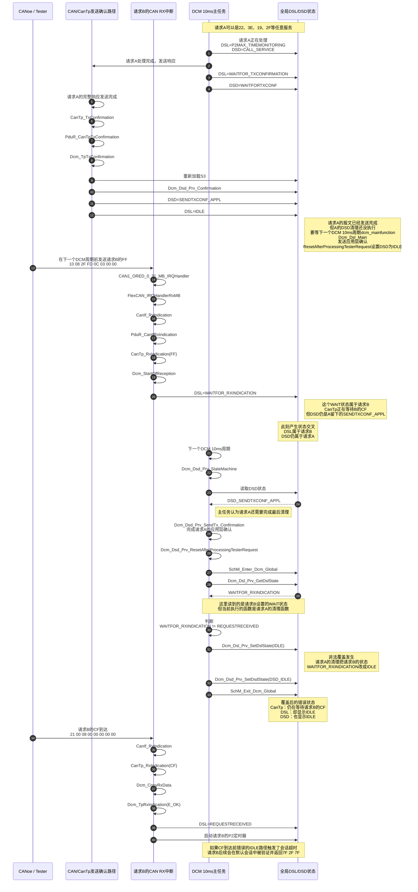

# 问题描述

## 测试过程

启动 CANoe 和 ECU
        ↓
10 03：进入扩展会话
        ↓
27 01：向 ECU 请求 Seed
        ↓
67 01：ECU 返回 Seed
        ↓
CANoe 根据 Seed 计算 Key
        ↓
27 02：向 ECU 发送 Key
        ↓
67 02：ECU 确认解锁成功
        ↓
开始回放 Selection_in_Trace 1.asc
        ↓
循环读取数据、执行 IO 控制、读取故障、发送 TesterPresent
        ↓
检查 ECU 是否持续正确响应

## 响应 2 F 服务出问题
 
正常应响应
2 F FD 0 C ... → 6 F FD 0 C ...
当前偶发的
2 F FD 0 C ... → 7 F 2 F 7 F
`Selection_in_Trace1.asc`主要回放的是 `0x22 ReadDataByIdentifier` 服务，也就是反复读取ECU的压力、温度、电压和控制状态。

总请求数约11,231条：

|请求SID|数量|ECU正常响应|用途|
|---|---|---|---|
|`22`|10,434|`62`|读取DID，占约92.9%|
|`3E`|703|`7E`|TesterPresent，保持会话|
|`2F`|57|`6F`|IO控制，控制执行器|
|`19`|35|`59`|读取DTC信息|
|`14`|2|`54`|清除DTC|

`0x22`重点读取的DID包括：

- `FD0B`：PS1压力，3,079次
- `FC04`：PS2压力，3,078次
- `FD0C`：阀和泵控制状态，701次
- `FC00～FC09`、`FD00`：电源电压、IGN电压、环境温度、电机温度、烘干器温度等，各约357～358次

所以这个Trace的主要目的可以概括为：

```
持续读取压力/温度/电压
        +
定期发送TesterPresent保持扩展会话
        +
偶尔通过2F控制阀和泵
        +
少量读取和清除故障
```

其中出现问题的`0x2F`只占57条。正常应响应：

```
2F FD 0C ... → 6F FD 0C ...
```

当前偶发的：

```
2F FD 0C ... → 7F 2F 7F
```

表示回放执行到阀泵控制请求时，ECU已经不在扩展会话。该文件自身不包含 `10 03` 和 `27 01/27 02`，它依赖回放开始前人工完成会话切换和解锁。


## 7 F 2 F 7 F
- `7F`：否定响应
- `2F`：被拒绝的服务
- 最后一个 `7F`：`ServiceNotSupportedInActiveSession`


# 问题分析

### FLEXCAN 中断

在当前工程里，针对诊断请求 `0x72B`，**CAN FD 和 Classic CAN 都进入同一个接收中断**：

```
CAN1_ORED_0_31_MB_IRQHandler
```

原因不是“CAN FD 和 Classic CAN 天生共用中断”，而是它们都使用：

- 控制器：`FlexCAN1`
- 接收邮箱：`Message Buffer 10`
- MB 10 属于 `0~31` 分组

CAN FD 改为 Classic CAN 时，主要把这个邮箱的 payload 从 64 字节改成了 8 字节，**邮箱编号 MB 10 没变**，所以 ISR 没变。

#### **中断触发条件**

一帧物理 CAN 报文接收完成后，需要满足：

1. FlexCAN 1 处于启动状态。
2. MB 10 已配置为接收状态。
3. 报文是标准帧，CAN ID 匹配 `0x72B` 过滤器。
4. 报文 CRC、位填充、格式等检查正确。
5. 整个物理 CAN 帧接收完成。
6. 硬件设置 MB 10 对应的 `IFLAG` 标志。
7. MB 10 对应的 `IMASK` 中断使能位为 1。
8. NVIC 和 OS 没有屏蔽该中断。

满足后进入：

```
CAN1_ORED_0_31_MB_IRQHandler
    -> FlexCAN_IRQHandler(1, 0, 31)
    -> 检查 MB10 IFLAG
    -> FlexCAN_IRQHandlerRxMB()
    -> FLEXCAN_EVENT_RX_COMPLETE
    -> CanIf_RxIndication()
    -> CanTp
```

驱动检查 `IFLAG` 并处理接收邮箱的位置在 [FlexCAN_Ip.c (line 2890)](/E:/github/ECAS_RTA_S32K324GHS_EOL_FCT/BasicSoftware/integration/mcal/src/modules/Can_43_FLEXCAN/src/FlexCAN_Ip.c:2890)，读取邮箱、清除标志并发出接收回调的位置在 [FlexCAN_Ip.c (line 1270)](/E:/github/ECAS_RTA_S32K324GHS_EOL_FCT/BasicSoftware/integration/mcal/src/modules/Can_43_FLEXCAN/src/FlexCAN_Ip.c:1270)。

#### **关键点：每个 CAN 帧触发一次**

中断条件是“一帧物理 CAN 报文接收完成”，不是“完整 UDS 请求接收完成”。

CAN FD 单帧发送 35 字节时：
```
一帧 CAN FD
-> 一次 RX 中断
-> CanTp 直接得到完整请求
```
<mark style="background: #FFF3A3A6;">因此，CAN FD 下 ECU 用**一个物理 CAN FD 帧**接收完整的 35 字节请求，只触发一次 RX 中断。</mark>


Classic CAN 发送同一个 35 字节请求时：

```
测试仪 72B：FF 10 23 ...   -> ECU RX 中断
ECU    7AB：FC 30 ...      -> ECU TX 完成中断
测试仪 72B：CF 21 ...      -> ECU RX 中断
测试仪 72B：CF 22 ...      -> ECU RX 中断
测试仪 72B：CF 23 ...      -> ECU RX 中断
测试仪 72B：CF 24 ...      -> ECU RX 中断
测试仪 72B：CF 25 ...      -> ECU RX 中断
```

正常寻址下，35 字节请求需要：

```
1 个 FF + 5 个 CF = 6 次接收中断
```

最终差异是：

|模式|35 字节请求|ECU 接收中断|
|---|---|---|
|CAN FD|1 个 SF|1 次|
|Classic CAN|1 个 FF + 5 个 CF|6 次|


**<mark style="background: #FF5582A6;">`Dcm_StartOfReception()` 通常在 FF 到达时执行，但 `Dcm_TpRxIndication()` 要等最后一个 CF 到达才执行。因此虽然 ISR 名称相同，Classic CAN 的中断次数更多，并且 DCM 停留在 `WAITFOR_RXINDICATION` 的时间更长。</mark>**

另外：

- 正常收发完成：`CAN1_ORED_0_31_MB_IRQHandler`
- Bus-off、协议错误等：`CAN1_ORED_IRQHandler`
- 如果使用 MB 32~63：`CAN1_ORED_32_63_MB_IRQHandler`
- 如果配置为轮询接收，则不会因为接收完成进入 MB ISR

<mark style="background: #FF5582A6;">所以当前问题的差异并不在“进入了不同中断”，而在于：**Classic CAN 将一个诊断请求拆成多个接收中断，扩大了 FF 到最后 CF 之间的状态竞争窗口。**</mark>


### CANFD 的问题
之前 CAN FD 时，35 字节请求可以作为一个 CAN FD 单帧接收
StartOfReception -> WAITFOR_RXINDICATION -> TpRxIndication -> REQUESTRECEIVED
这些动作基本在同一次接收中断内完成。

### CAN 的问题

改成 Classic CAN 后，`2F FD0C` 变成 ISO-TP 多帧：
```
FF -> 等待约 26~46 ms -> CF -> TpRxIndication
```

首帧到达后，[Dcm_Dsl_StartOfReception.c (line 799)](/E:/github/ECAS_RTA_S32K324GHS_EOL_FCT/BasicSoftware/src/bsw/Dcm/src/Dsl/Dcm_Reception/Dcm_Dsl_StartOfReception.c:799) 会把状态设为 `WAITFOR_RXINDICATION`。这个状态会持续两到四个 DCM 周期。
但是之前的修复只保护：

```
DSL_STATE_REQUESTRECEIVED_STARTPROTOCOL_E
```

并没有保护：

```
DSL_STATE_WAITFOR_RXINDICATION_E
```


### `CanIf_RxIndication`

是 **CAN Driver 向 CanIf 上报“一个物理 CAN 帧接收成功”**的同步回调。

FlexCAN RX ISR
  -> FlexCAN_IRQHandlerRxMB
  -> Can Driver
  -> CanIf_RxIndication
  -> PduR_CanIfRxIndication
  -> CanTp_RxIndication


 
# 问题排查方向


当前的 2 F 服务仍然是多帧。
393.673255  72 B  10 08 2 F FD 0 C 03 00 00
393.701639  72 B  21 00 08 00 00 00 00 00

```
10 08                         FF，总 UDS 长度 8 字节
2 F FD 0 C 03 00 00             FF 携带前 6 字节

21                            CF，序号 1
00 08                         剩余 2 字节
00 00 00 00 00                填充
```
这两个物理帧之间的间隔是：
```
393.701639 - 393.673255 = 28.384 ms
```
因此 DCM 状态仍可能经历：

```
FF 到达
-> Dcm_StartOfReception()
-> DSL = WAITFOR_RXINDICATION

等待约28ms，经过2～3个DCM 10ms周期

CF 到达
-> Dcm_TpRxIndication()
-> DSL = REQUESTRECEIVED
```


## DSL 关键状态


```
IDLE
没有完整诊断请求等待处理

WAITFOR_RXINDICATION
已经收到FF，CanTp正在等待后续CF

REQUESTRECEIVED
最后一个CF已经到达，完整UDS请求可以处理
```


DSL所有的状态：

| 值   | DSL状态                           | 含义                 |
| --- | ------------------------------- | ------------------ |
| 0   | `IDLE`                          | 当前没有请求正在接收或处理      |
| 1   | `WAITFOR_RXINDICATION`          | 已开始接收，等待完整请求       |
| 2   | `REQUESTRECEIVED_STARTPROTOCOL` | 完整请求已收到，准备启动/确认协议  |
| 3   | `P2MAX_TIMEMONITORING`          | 服务正在处理，监控P2/P2*    |
| 4   | `PREEMPTION_STOPPROTOCOL`       | 停止被高优先级请求抢占的协议     |
| 5   | `PREMMPTION_STOPROE`            | 停止被抢占的ROE处理        |
| 6   | `WAITFOR_TXCONFIRMATION`        | 响应已交给下层，等待发送确认     |
| 7   | `ROETYPE1_RECEIVED`             | 正在处理ROE Type 1事件响应 |
| 8   | `RESPONSETRANSMISSION`          | 已准备好响应，下一步启动发送     |
| 9   | `PAGEDBUFFER_TRANSMISSION`      | 分页发送大响应，本项目未启用     |

DSD 所有的状态：

|值|DSD状态|含义|
|---|---|---|
|0|`DSD_IDLE`|没有服务需要处理|
|1|`DSD_VERIFICATION`|验证SID、会话、安全等级等|
|2|`DSD_PAGE_TRANSMISSION`|分页生成大响应|
|3|`DSD_CALL_SERVICE`|调用具体UDS服务|
|4|`DSD_WAITFORTXCONF`|响应已提交，等待发送确认|
|5|`DSD_SENDTXCONF_APPL`|发送完成，准备通知应用并清理|
|6|`DSD_CANCEL`|取消正在执行的服务|


## 可能存在异常竞态时序：

```mermaid
sequenceDiagram
    autonumber

    participant Tester as CANoe / Tester
    participant HW as FlexCAN1 / MB10
    participant MCAL as CAN RX ISR / MCAL
    participant CanIf as CanIf / PduR
    participant CanTp as CanTp
    participant DcmRx as DCM Reception API
    participant Task as DCM 10ms MainTask
    participant State as DSL State / Shared Timer / Session

    Note over Task,State: 前置条件：请求A的响应已发送完成<br/>但DSD仍有最后一步清理尚未执行<br/>即将调用 ResetAfterProcessingTesterRequest

    Note over Tester,State: 请求B是8字节2F请求<br/>2F FD 0C 03 00 00 00 08<br/>Classic CAN必须使用 FF + CF

    Tester->>HW: 发送FF<br/>72B: 10 08 2F FD 0C 03 00 00

    HW->>HW: 标准ID 0x72B匹配MB10
    HW->>HW: 将8字节写入MB10
    HW->>HW: 设置MB10的IFLAG
    HW->>MCAL: 触发 CAN1_ORED_0_31_MB_IRQHandler

    activate MCAL
    MCAL->>MCAL: FlexCAN_IRQHandler(1, 0, 31)
    MCAL->>MCAL: 检查MB10 IFLAG和IMASK
    MCAL->>MCAL: FlexCAN_IRQHandlerRxMB(1, 10)
    MCAL->>MCAL: 读取MB10并清除IFLAG
    MCAL->>MCAL: Can_43_FLEXCAN_CommonIrqCallback<br/>FLEXCAN_EVENT_RX_COMPLETE
    MCAL->>MCAL: Can_43_FLEXCAN_ProcessMesgBufferCommonInterrupt
    MCAL->>MCAL: Can_43_FLEXCAN_Ipw_ProcessHwObject
    MCAL->>MCAL: Can_43_FLEXCAN_Ipw_ProcessRxMesgBuffer
    MCAL->>MCAL: Can_Ipw_ParseData
    MCAL->>CanIf: CanIf_RxIndication<br/>CanId=0x72B, Hoh=6, Length=8

    activate CanIf
    CanIf->>CanIf: 检查Controller/HRH/ID/帧类型
    CanIf->>CanIf: 匹配NPdu_UdsRxPhy
    CanIf->>CanIf: PduR_CanIfRxIndication
    CanIf->>CanTp: CanTp_RxIndication(FF)
    deactivate CanIf

    activate CanTp
    CanTp->>CanTp: CanTp_Prv_GetRxContext
    CanTp->>CanTp: 解析PCI=FF、总长度=8
    CanTp->>CanTp: CanTp_Prv_ProcessFrame
    CanTp->>CanTp: 进入FF接收处理
    CanTp->>DcmRx: PduR_CanTpStartOfReception<br/>→ Dcm_StartOfReception
    activate DcmRx
    DcmRx->>State: Dcm_Dsl_Prv_SetDslState<br/>IDLE → WAITFOR_RXINDICATION
    Note right of State: 合法状态<br/>表示正在等待后续CF
    DcmRx-->>CanTp: BUFREQ_OK
    CanTp->>DcmRx: PduR_CanTpCopyRxData<br/>→ Dcm_CopyRxData<br/>复制FF中的前6字节
    DcmRx-->>CanTp: BUFREQ_OK
    deactivate DcmRx

    CanTp->>CanTp: SduLengthRemaining = 2
    CanTp->>CanTp: 准备FlowControl CTS
    deactivate CanTp
    deactivate MCAL

    Note over HW,MCAL: FF接收中断结束

    CanTp->>CanIf: CanIf_Transmit(FC)
    CanIf->>HW: 使用7AB发送FC
    HW->>Tester: 7AB: 30 08 14...
    Note over Tester,CanTp: Tester收到FC后等待STmin<br/>FF到CF实际间隔约26～46ms

    Note over Task,State: 在等待CF期间，DCM 10ms任务开始执行<br/>此时请求B仍未完整接收

    activate Task
    Task->>Task: Dcm_MainFunction
    Task->>Task: Dcm_Dsd_Prv_StateMachine
    Task->>Task: 继续处理请求A的DSD收尾
    Task->>Task: Dcm_Dsd_Prv_ResetAfterProcessingTesterRequest

    Task->>State: SchM_Enter_Dcm_Global
    Note over Task,State: 全局锁已生效<br/>但FF中断已经执行完毕<br/>所以锁不会阻止当前清理读取WAIT状态

    Task->>State: Dcm_Dsl_Prv_GetDslState()
    State-->>Task: WAITFOR_RXINDICATION

    alt 当前状态不是 REQUESTRECEIVED
        Task->>State: 条件判断成立<br/>WAITFOR_RXINDICATION != REQUESTRECEIVED
        Task->>State: Dcm_Dsl_Prv_SetDslState(IDLE)
        Note right of State: 异常覆盖<br/>WAITFOR_RXINDICATION → IDLE<br/>CanTp实际仍在等待CF
    else 当前状态已经是 REQUESTRECEIVED
        Task->>State: 保留REQUESTRECEIVED
        Note right of State: 这是已有修复保护的状态
    end

    Task->>State: Dcm_Dsd_Prv_SetDsdState(DSD_IDLE)
    Task->>State: SchM_Exit_Dcm_Global
    deactivate Task

    loop CF到达前的后续DCM 10ms周期
        activate Task
        Task->>State: Dcm_Dsl_Prv_GetDslState()
        State-->>Task: IDLE
        Task->>Task: Dcm_Dsl_Prv_StateMachine
        Task->>Task: Dcm_Dsl_Idle()
        Task->>State: 读取共享dataTimeoutMonitor
        Task->>State: 按S3定时器语义进行处理
        deactivate Task
    end

    alt 共享定时器在异常IDLE窗口内到0
        activate Task
        Task->>State: Dcm_Prv_SetSesCtrlType(DEFAULT)
        Task->>State: UDS会话 03 → 01
        Note right of State: 这是产生7F 2F 7F所需的关键证据<br/>目前仍需运行时确认
        deactivate Task
    else 定时器没有到0
        Note right of State: 会话仍保持03<br/>后续CF到达后可能恢复正常
    end

    Tester->>HW: 发送最后一个CF<br/>72B: 21 00 08 00 00 00 00 00

    HW->>HW: 0x72B再次匹配MB10
    HW->>HW: 设置MB10 IFLAG
    HW->>MCAL: 再次触发 CAN1_ORED_0_31_MB_IRQHandler

    activate MCAL
    MCAL->>MCAL: FlexCAN_IRQHandler
    MCAL->>MCAL: FlexCAN_IRQHandlerRxMB
    MCAL->>MCAL: Can_43_FLEXCAN_CommonIrqCallback
    MCAL->>MCAL: Can_43_FLEXCAN_Ipw_ProcessRxMesgBuffer
    MCAL->>MCAL: Can_Ipw_ParseData
    MCAL->>CanIf: CanIf_RxIndication(CF)
    CanIf->>CanIf: PduR_CanIfRxIndication
    CanIf->>CanTp: CanTp_RxIndication(CF)

    activate CanTp
    CanTp->>CanTp: 解析PCI=CF、SN=1
    CanTp->>CanTp: CanTp_Prv_ProcessRxConsecutiveFrame
    CanTp->>DcmRx: PduR_CanTpCopyRxData<br/>→ Dcm_CopyRxData<br/>复制剩余2字节
    activate DcmRx
    DcmRx-->>CanTp: BUFREQ_OK
    deactivate DcmRx

    CanTp->>CanTp: SduLengthRemaining = 0
    CanTp->>CanTp: CanTp_Prv_PduRConfirmation(E_OK)
    CanTp->>DcmRx: PduR Dcm TpRxIndication<br/>→ Dcm_TpRxIndication(E_OK)

    activate DcmRx
    DcmRx->>State: DSL状态设为<br/>REQUESTRECEIVED_STARTPROTOCOL
    DcmRx->>State: 启动P2响应定时器
    Note right of State: 完整2F请求现在才正式进入DCM处理
    deactivate DcmRx
    deactivate CanTp
    deactivate MCAL

    activate Task
    Task->>Task: 下一个DCM 10ms主周期
    Task->>State: 读取DSL状态
    State-->>Task: REQUESTRECEIVED_STARTPROTOCOL
    Task->>Task: Dcm_Dsl_RequestReceived_StartProtocol
    Task->>State: DSL → P2MAX_TIMEMONITORING
    Task->>Task: DSD Verification
    Task->>Task: 查找SID 0x2F的会话权限

    alt 当前UDS会话已经是01
        Task->>Task: 0x2F不允许在默认会话执行
        Task->>Task: 设置NRC 0x7F<br/>ServiceNotSupportedInActiveSession
        Task->>CanTp: 发送负响应 7F 2F 7F
        CanTp->>CanIf: CanIf_Transmit
        CanIf->>HW: 7AB发送响应
        HW->>Tester: 7F 2F 7F
    else 当前UDS会话仍然是03
        Task->>Task: 0x2F会话检查通过
        Task->>Task: 执行IO Control服务
        Task->>CanTp: 发送正响应6F...
        CanTp->>CanIf: CanIf_Transmit
        CanIf->>HW: 7AB发送响应
        HW->>Tester: 6F FD 0C...
    end
    deactivate Task
```



## 继续详细分析一下





---


# SeedNkey 是什么？

我看了 [SeednKey.dll](C:\\Users\\nvtc140\\Desktop\\SeednKey.dll)。它基本可以确定是一个“种子-密钥（seed-key）”算法 DLL，给 ECU/诊断工具做安全解锁用。

- 它是 32 位 Windows DLL，不是系统自带组件。
- 只导出了 `GenerateKeyEx`，这类接口通常就是“根据 ECU 下发的 seed 计算 key”。
- 里面还留着调试符号路径 `E:\work\ZYNP\project\seedkey\KeyGenDll_GenerateKeyEx\Debug\SeednKey.pdb`，说明它很像项目里的内部 debug 构建。
- 文件没有数字签名。

它的作用通常是：

- ECU 先返回一个 seed。
- 上位机/测试软件调用这个 DLL 算出对应的 key。
- 再把 key 发回 ECU，获得安全访问权限。

为什么需要它：

- 没有它，软件不知道厂商自定义的 key 算法，安全访问就会失败。
- 一些受保护功能必须先解锁，比如刷写、编码、标定、读写受限数据、EOL/FCT 测试步骤。
- 把算法放在 DLL 里，比直接写在主程序里更容易维护和替换。

如果你的程序不做 ECU 安全解锁，这个 DLL 通常不需要；如果它是测试/诊断流程的一部分，删掉后相关步骤很可能会报 `security access denied` 之类的错误。

如果你要，我可以继续帮你查：

1. 是哪个程序在加载它。
2. 它的导出函数怎么调用。
3. 它是不是某个具体测试工具的插件格式。


# CANalyzer 和 CANoe 是什么区别？

你说的 **CANalyer** 应该是 **CANalyzer**。两者都是 Vector 的汽车总线工具，核心区别是：

|对比项|CANalyzer|CANoe|
|---|---|---|
|主要定位|总线报文分析与调试|ECU/整车网络仿真、测试与分析|
|报文监控|强，核心功能|支持|
|报文发送与信号激励|支持|支持|
|CAPL 编程|支持|支持，测试与仿真能力更完整|
|ECU/节点仿真|基础激励和简单仿真|完整节点及剩余总线仿真|
|自动化测试|能力有限、依赖配置|强，支持测试模块、Test Feature Set、vTESTstudio 等|
|典型用途|抓包、查周期/丢帧、分析信号、简单诊断|ECU 功能测试、诊断测试、网络仿真、HIL/SIL、自动化回归|
|成本与复杂度|通常较低、上手较快|通常更高、配置更复杂|

简单理解：

- **CANalyzer 像汽车总线的“示波器 + 报文分析器”**。
- **CANoe 像“CANalyzer + ECU 仿真环境 + 自动化测试平台”**。

例如调试一个 ECU：

- 只想查看 CAN/CAN FD 报文、检查周期、修改信号并发送，用 **CANalyzer** 通常够了。
- 需要模拟其他 ECU、运行 NM、诊断会话、故障注入并自动生成测试报告，用 **CANoe** 更合适。

两者都不只支持 CAN，还可根据许可证和 Option 支持 LIN、FlexRay、Automotive Ethernet、诊断等。具体能力受版本、License 和已购买 Option 影响，不能只看软件名称。Vector 官方也将 CANalyzer 定位为通信分析与激励工具，而 CANoe 更侧重 ECU 和整车网络的仿真、诊断及测试。[Vector 产品说明](https://jobs.vector.com/uk/we-are/who-is-vector/cutting-edge-technology)；[CANoe Test Feature Set 教程](https://support.vector.com/sys_attachment.do?sys_id=b1d992aa1bcca094d2cd97de1d4bcb4b)