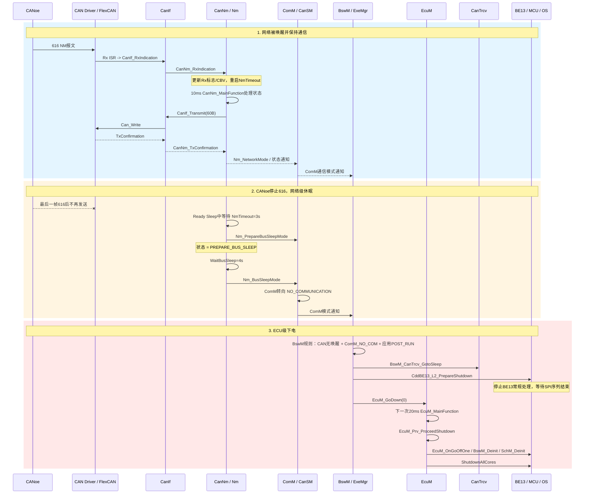

# 新需求

从回采的报文信息来看，大致厘清了所谓的需求：
	616 报文 1 s 周期发送的时候，只响应整车应用报文，616 快发 20 ms 周期的时候 ，响应整车应用报文以及对应的 60 B 网络管理报文。
		616 不发了时候，才开始休眠，不响应任何报文。
	
更准确的过程是：
ECU 休眠
  ↓ 收到 0 x 616 的 20 ms 唤醒突发
收发器/MCU 启动
  ↓ 本地网络被请求
ECU 发送 0 x 60 B，恢复应用报文
  ↓ 本地网络释放
停止 0 x 60 B，但 ECU 仍然醒着，应用报文继续发送
  ↓ 0 x 616 继续接收，维持网络
  ↓ 0 x 616 停止并经过关机延时
应用报文全部停止，ECU 进入休眠

- **20 ms 的 0 x 616 快发用于可靠唤醒**。ECU 从第一帧 0 x 616 到恢复发报约需要 121 ms，所以连续快发可以保证启动过程中还能收到后续 NM 帧。
- **1 s 周期的 0 x 616 可以维持 ECU 唤醒**。即使 ECU 不再发送 0 x 60 B，只要应用报文还在发送，就不能认为 ECU 休眠。
- **0 x 60 B 停止只表示本节点不再主动参与 NM 发送**，很可能进入了 `Ready Sleep` 或本地网络已经 `NetworkRelease`，不等于板子睡眠。
- 0 x 616 停发后，经过约 2.5 s，ECU 的所有报文停止，才是这份记录中可以观察到的休眠点.


当前 报文响应为 1 s 周期。


# 吉利 3.0 的需求

已检查 Zotero 中完整的 652 页 PDF。`JDWRRXKV` 和 `EQVPYTGF` 是重复附件，SHA-256 完全相同。文档为 Revision 003、状态 `PRELIMINARY`：[Base Tech SWRS SUM-V 03-GEEA 3.0](C:/Users/nvtc 140/Zotero/storage/JDWRRXKV/Base Tech SWRS SUM-V 03-GEEA 3.0.pdf)。

**核心需求**

| 需求 ID           | PDF 页 | 具体要求                                                                             |
| --------------- | ----- | -------------------------------------------------------------------------------- |
| `660824 v2`     | 38    | NM 报文 ID 应在 `0x500~0x53F`；`CanNmNodeId` 等于 CAN ID 低 8 位；收到合适的 NM 激活指示后才允许发送应用报文。 |
| `660826 v2`     | 38    | ECU 主动唤醒网络时，第一帧必须是 NM 帧；NM 帧成功发送后才能发送应用帧；不允许 Passive Mode。                       |
| `663109/663111` | 35~37 | 上电、硬复位或诊断硬复位后，最迟 `150ms` 具备 CAN 收发能力；有安全启动时允许 `250ms`。                           |
| `663110/663112` | 36~38 | ECU 已经运行、通信栈已初始化但网络未激活时，收到其他节点 NM 通信请求后，最迟 `25ms` 恢复应用通信。                        |
| `663132/663133` | 44~45 | 休眠时 MCU 仍供电，检测到 CAN 网络活动后，最迟 `50ms` 具备 CAN 收发能力。                                 |
| `663134`        | 45~46 | 休眠时 MCU 断电，网络唤醒后按 `150ms`，有安全启动时按 `250ms` 恢复 CAN收发。                              |
| `660827 v1`     | 39    | 网络释放、无通信需求后，ECU 应在 `15s` 内进入 Off/Sleep；发现自身无请求却持续发送 NM 等异常时，必须有恢复措施。             |
| `685689 v2`     | 39~40 | 默认诊断会话中，诊断请求建立网络请求，响应完成后释放；非默认会话持续保持网络；诊断复位后重新建立网络请求。                            |
| `663143 v1`     | 62~63 | NvM 写入/擦除期间禁止进入 Sleep/Low-Power；休眠条件满足后也必须等待 NvM 操作完成。                           |
| `660806 v2`     | 104   | 常电 ECU 必须使用支持 Sleep 的 CAN 收发器；切换供电 ECU 断电时 CAN 泄漏电流不得超过 `5µA`。                   |

**强制 CanNm 参数**

`663093 v3` 在 PDF 第 50~52 页明确说明：非编程会话必须采用指定配置，AUTOSAR 4.0.3 以上通信栈必须支持 PNC。

关键参数是：

```
CanNmActiveWakeupBitEnabled       TRUE
CanNmPassiveModeEnabled           FALSE
CanNmImmediateNmCycleTime         20 ms
CanNmImmediateNmTransmissions     20
CanNmRepeatMessageTime            1 s
CanNmMsgCycleTime                 1 s
CanNmMsgTimeoutTime               0.5 s
CanNmTimeoutTime                  4 s
CanNmWaitBusSleepTime             4 s
CanNmAllNmMessagesKeepAwake       FALSE
CanNmPnEnabled                    TRUE
CanNmPnEiraCalcEnabled            TRUE
ComMPncNmRequest                  TRUE
ComMPncPrepareSleepTimer          25 ms
ComMNmVariant                     FULL
```

因此标准休眠时序不是“`0x616` 停发后立即休眠”，而应理解为：

```
最后一个有效NM/PNC请求消失
  -> 所有本地ComM/诊断请求释放
  -> Ready Sleep
  -> CanNmTimeoutTime 4s
  -> Prepare Bus-Sleep
  -> CanNmWaitBusSleepTime 4s
  -> Bus-Sleep
  -> 完成NvM及关机处理
```

名义上从最后一个有效 NM 帧到 `Bus-Sleep` 约为 `8s`，整个 ECU 应在网络释放后 `15s` 内进入 Off/Sleep。

**当前工程差异**

当前配置与 SWRS 存在明确差异：

- `CanNmPnEnabled=false`，SWRS 要求 `true`：[RTA_BIP_CanNm_EcucValues.arxml (line 165)](E:/github/ECAS_qirui_Single_Chamber/BasicSoftware/ecu_config/bsw/gen/RTA_BIP_CanNm_EcucValues.arxml:165)。
- `CanNmRepeatMessageTime=4s`，要求 `1s`：[同一文件 (line 121)](E:/github/ECAS_qirui_Single_Chamber/BasicSoftware/ecu_config/bsw/gen/RTA_BIP_CanNm_EcucValues.arxml:121)。
- `CanNmTimeoutTime=3s`，要求 `4s`：[同一文件 (line 125)](E:/github/ECAS_qirui_Single_Chamber/BasicSoftware/ecu_config/bsw/gen/RTA_BIP_CanNm_EcucValues.arxml:125)。
- `ComMPncNmRequest=false`，要求 `true`：[RTA_BIP_ComM_EcucValues.arxml (line 69)](E:/github/ECAS_qirui_Single_Chamber/BasicSoftware/ecu_config/bsw/gen/RTA_BIP_ComM_EcucValues.arxml:69)。
- 当前 NM ID 为 `0x60B/0x616`，但 SWRS 要求 `0x500~0x53F`：[CanIf_PBcfg.c (line 553)](E:/github/ECAS_qirui_Single_Chamber/BasicSoftware/src/bsw/CanIf/CanIf_PBcfg.c:553)。这需要确认项目 ECU Extract 是否存在正式偏差批准。

所以需要修正之前关于 PNC 的判断：**单看 AUTOSAR 规范，PNC 可以按项目选择；但按这份吉利客户 SWRS，PNC 是强制项，不能删除 EcuM 的 PNC 引用，而应补齐 CanNm、ComM 及 PNC 位映射。**当前抓到的 `0x616 = 16 00 02...` 中 CBV 字节为 `0x00`，还需要核对其 PNI 位和 PNC 向量是否真的构成 SWRS 所说的“合适的 NM 唤醒请求”。


# 开发


1. **0x60B 不是对每帧 0x616 的应答报文**，它是否发送由本 ECU 的 ` CanNm/ComM ` 本地状态决定，而不是由 0x616 的周期直接决定。
2. CAN_WAKE_RX_LOST_DELAY_CNT 主动清除是在 500 ms，1 s 唤醒时间肯定是不够的
3. 被动唤醒流程：
	1. TJA1145 Bus Wake
	2.   -> EcuM PENDING(`EcuM_SetWakeupEvent`)[EcuM_WakeupServices.c (line 161)](E:\\github\\ECAS_qirui_Single_Chamber\\BasicSoftware\\src\\bsw\\EcuM\\src\\EcuM_WakeupServices.c:161)。
	3.   -> CanIf 收到有效 CanNm 0x616
	4.   -> EcuM VALIDATED
	5.   -> ComM 被动唤醒
	6.   -> CanSM/CanNm Network Mode
	7.   -> BswM APP_RUN
4. 被动唤醒的执行：
	1.       EcuM -> ComM_EcuM_WakeUpIndication -> ComM -> Nm_PassiveStartUp -> Nm -> CanNm_PassiveStartUp
5. `EcuM_SetWakeupEvent`  **将检测到的唤醒源上报给 EcuM，并更新该唤醒源的状态**。
6. `CanTrcv 唤醒 → EcuM → CanIf/CanSM → CanNm 验证 → EcuM 确认 → BswM/ComM 模式切换`
7. 被动唤醒链路
	1. EcuM 发现 CAN 唤醒 Pending
	2. → EcuM_StartWakeupSources()
	3. → CanSM_StartWakeupSource()
	4. → CanSM 将收发器切到 Normal
	5. → CanSM 停止并重新启动 CAN Controller
	6. → CanIf 记录 Controller = CAN_CS_STARTED
	7. → CanIf_SetPduMode(..., CANIF_OFFLINE) 可成功
	8. → 等待 CanNm 报文验证唤醒
8. 按照 AUTOSAR NM 规范，网络管理报文不是“一问一答”的响应机制，而是节点状态机控制的周期广播。
9. 被动唤醒：收到 0x616 后进入 `Repeat Message`，发送若干个 0x60B；`RepeatMessageTime` 到期后进入 `Ready Sleep`，停止发送，但继续接收 NM 报文。
	- 主动请求：ComM 发起 `COMM_FULL_COMMUNICATION`，CanNm 进入 `Normal Operation`，持续周期发送 0x60B，直到网络释放。
10. 从接收到网络管理报文，到发出响应报文，大概需要多长时间？
	1. `CanNmMsgCycleOffset = 0.1 s`：启动发送定时器后延迟 100 ms；
	 - `CanNmMainFunctionPeriod = 10 ms`：实际发送还有最多约 10 ms 的任务调度误差。
		`CanNmImmediateNmCycleTime = 20 ms` 当前不生效，因为立即发送次数配置为 0。
注意：如果节点已经处于 `NM_STATE_READY_SLEEP`，后续收到普通 616 不会重新启动一轮 60 B 快发，只会刷新接收/超时相关状态。因此测量时必须从**真正使状态从 Bus Sleep/Prepare Bus Sleep 进入 Repeat Message 的那一帧 616** 开始计时，不能从任意一帧 616 开始量。
11. CBV 是什么？
12.   
	1. CAN被动唤醒 ≠ ECU主动FullCom请求
	2. 点火唤醒 = 主动FullCom请求
13. `CanNm_NetworkRelease()` 的作用是“释放本 ECU 的网络请求

## 唤醒休眠流程

- **网络层休眠**：616 / 60 B、CanNm、ComM、CanSM、CanIf、CanTrcv。
- **整车/ECU 下电**：ExeMgr、BswM、EcuM、BE 13、OS/MCAL。





## CANoe 发出 616 后，ECU 如何响应 60B

| 环节     | 模块 / 函数                                             | 调度方式         | 作用                                                               |
| ------ | --------------------------------------------------- | ------------ | ---------------------------------------------------------------- |
| 报文接收   | FlexCAN MCAL / CAN Driver                           | RX 中断        | 硬件收到 616，进入接收回调                                                  |
| 接收分发   | `CanIf_RxIndication()`                              | 回调链          | 按 RxPdu 配置把 NM PDU 分发给 CanNm                                     |
| NM 接收  | `CanNm_RxIndication()`                              | 回调链          | 接收 NM、解析 CBV，置接收状态、刷新 NM 超时监管                                    |
| NM 状态机 | `CanNm_MainFunction()`                              | 10 ms        | 处理 Repeat Message / Normal / Ready Sleep / Prepare Bus Sleep 等状态 |
| NM 发报  | `CanNm_MessageTransmit()` → `CanIf_Transmit()`      | CanNm 主函数中触发 | 发送本节点 NM，ID 为 60B                                                |
| 发送执行   | `CanIf_Transmit()` → CAN Driver `Can_Write()`       | 同步请求 + 硬件发送  | 将 60B 放入 CAN 控制器 Tx buffer                                       |
| 发送确认   | `CanIf_TxConfirmation()` → `CanNm_TxConfirmation()` | TX ISR 回调    | 通知 CanNm 本帧已经发出                                                  |
|        |                                                     |              |                                                                  |


## CANoe 停止 616 后，网络多久进入 Bus Sleep


如果 ECU 已经在 `NM_STATE_READY_SLEEP`，且本地没有继续请求网络：

```
最后一帧 616
    ↓
CanNm 超时：3 s
    ↓
NM_STATE_PREPARE_BUS_SLEEP
    ↓
等待总线休眠：4 s
    ↓
NM_STATE_BUS_SLEEP
```

即：

> 从最后一帧 616 到 CanNm 进入 Bus Sleep，理论约 **7 秒**，外加最多一个 10 ms 的 CanNm 调度抖动。

对应函数链：

```
CanNm_CaseReadySleep()
  └─ NmTimeoutTime 到期
      └─ CanNm_GotoPrepareBusSleep()
          └─ Nm_PrepareBusSleepMode()
              └─ ComM_Nm_PrepareBusSleepMode()

CanNm 的 WaitBusSleepTimer 到期
  └─ CanNm_GotoBusSleep()
      └─ Nm_BusSleepMode()
          └─ ComM_Nm_BusSleepMode()
```

CanNm 的状态转换在 [CanNm_Inl.h (line 467)](E:\\github\\ECAS_qirui_Single_Chamber\\BasicSoftware\\src\\bsw\\CanNm\\api\\CanNm_Inl.h:467)，Bus Sleep 到 ComM 的通知在 [Nm_BusSleepMode.c (line 60)](E:\\github\\ECAS_qirui_Single_Chamber\\BasicSoftware\\src\\bsw\\Nm\\src\\Nm_BusSleepMode.c:60)。

注意：若停发时仍处于 `NM_STATE_REPEAT_MESSAGE`，不会直接开始那 3 秒；要先等 Repeat Message 结束，最长还可能多出约 4 秒。因此完整上界应按状态算：

```
当前处于 Repeat Message：
剩余 RepeatMessageTime
+ 3 s NmTimeout
+ 4 s WaitBusSleep
```


## 从 Bus Sleep 到整机/BE 13 下电，不是 CanNm 自动完成


`CanNm` 进入 Bus Sleep 仅表示**网络管理层认为总线可睡**。真正的 ECU 下电还要满足项目级条件。

本项目的自定义 ExeMgr 在点火关闭后：

```
IGN OFF
→ 请求 ComM_NO_COMMUNICATION
→ 等待 KL15_OFF_DELAY_CNT
→ 3 秒后允许下电
→ 同时要求 ComM 已是 NO_COMM，且没有 CAN 唤醒原因
→ 请求 APP_MODE_REQUEST_POST_RUN
```

`KL15_OFF_DELAY_CNT = 300 × 10 ms = 3 s`，见 [ExeMgrUT.c (line 46)](E:\\github\\ECAS_qirui_Single_Chamber\\ASW\\SWC\\ExeMgrUT\\src\\ExeMgrUT.c:46)。

随后进入 BswM/EcuM 链：

```
ComM_NO_COMMUNICATION
+ CAN / IGN wakeup source = NONE
+ AppMode = POST_RUN
    ↓
BswM规则满足
    ↓
BswM PostRun动作：
  停止 PDU Group
  请求 CAN / XCP NoCom
  禁止通信
    ↓
BswM PrepShutdown动作：
  BswM_CanTrcv_GotoSleep()
  BswM_SelfHold_Unlock()
    ↓
BswM Shutdown动作：
  CddBE13_L2_PrepareShutdown()
  EcuM_GoDown(0)
    ↓
下一次 EcuM_MainFunction（20 ms）
  EcuM_Prv_ProceedShutdown()
  EcuM_OnGoOffOne()
  BswM_Deinit()
  SchM_Deinit()
  ShutdownAllCores()
```

EcuM 和 BswM 主函数是 20 ms；CanTrcv 主函数也是单独 20 ms 任务。`EcuM_GoDown()` 到真正进入 `EcuM_Prv_ProceedShutdown()`，通常还要等待下一次 EcuM 20 ms 任务。


## 被动模式？

“被动模式”和“被动唤醒”不是一回事：

- 被动模式：描述 ECU 的长期工作配置——它不主动发 NM，只监听和响应网络。
- 被动唤醒：描述一次唤醒过程——例如总线上收到其他 ECU 的 NM，随后本 ECU 从 Bus Sleep/Prepare Bus Sleep 进入 Network Mode。

项目中的被动 ECU 通常是：

1. 不调用 `CanNm_MainFunctionTx()`，因此不主动发 NM；
2. 收到其他节点的 NM 后触发 `Nm_NetworkStartIndication()`；
3. 再通过 `CanNm_PassiveStartUp()` 进入 Network Mode；
4. 仍然不会因为进入 Network Mode 就主动发送 NM PDU。

也就是说，如果你当前 ECU 是“被动唤醒”的节点，通常应配置：

```
CANNM_PASSIVE_MODE_ENABLED == STD_ON
```

这时 `CanNm_MainFunctionTx()` 不会运行。相反，如果配置为 `STD_OFF`，它就是主动模式节点，可以通过网络请求主动唤醒并发送 NM。


`CanNm_MainFunctionTx()` 是 CanNm 的“NM 报文发送处理函数”。

它不是唤醒函数，也不是接收函数，主要负责在满足条件时发送本 ECU 的 NM PDU。当前配置中：

```
#define CANNM_PASSIVE_MODE_ENABLED STD_OFF
```

所以这个函数会被编译进来，并由 `CanNm_MainFunction()` 周期性调用。

它主要做以下几件事：

1. 判断当前是否允许发送：

```
RamPtr_ps->stCanNmComm != FALSE
RamPtr_ps->MsgTxStatus_b != FALSE
```

以及 NM 报文周期是否到期。

2. 更新 NM PDU 内容：

```
CanNm_UpdateTxPdu(ConfigPtr_pcs, RamPtr_ps);
```

例如更新控制位、用户数据、节点标识等。

3. 请求底层 CAN 发送：

```
CanNm_MessageTransmit(ConfigPtr_pcs, RamPtr_ps);
```

通常最终会走到 CanIf/PduR，再发送到 CAN 总线上。

4. 处理发送周期：
    - 普通周期使用 `MsgCycleTime`
    - 刚唤醒时可能使用 `ImmediateNmCycleTime`
    - `ImmediateNmTx_u8` 用来控制立即发送几帧 NM
5. 监控发送超时：

如果发送确认超时，会调用：

```
Nm_TxTimeoutException(nmChannelHandle);
```

简化理解就是：

```
CanNm_MainFunction
    └── CanNm_MainFunctionTx
          ├── 判断是否该发
          ├── 组装 NM PDU
          ├── 请求 CAN 发送
          ├── 更新下一次发送时间
          └── 监控发送确认超时
```

所以你当前的实际含义是：

> 被动模式关闭，允许本 ECU 发送 NM；但是否真的发送，还要看当前是否处于允许发送的 NM 状态，以及发送周期是否到期。

它和“是否通过被动唤醒进入网络”是两个不同问题。即使 ECU 是因为收到别人的 NM 而被动启动，进入 Network Mode 后，由于当前是主动模式，`CanNm_MainFunctionTx()` 仍可能开始发送本 ECU 的 NM PDU。


## 什么是 CBV?

CBV 是 CanNm 报文中的 **Control Bit Vector（控制位向量）**，用于携带网络管理控制状态，不是独立报文。

当前工程中配置为：

```
CanNmControlBitVectorPosition = byte 1
```

也就是 CAN 数据的第 2 个字节（按 0 起始编号）。

例如 60 B：

```
0B 00 02 00 00 00 00 00
│  │  │
│  │  └─ 用户数据
│  └──── CBV = 0x00
└─────── Node ID = 0x0B
```

当前 CBV 常用位：

|位|含义|
|---|---|
|bit 0|RMR，Repeat Message Request，重复报文请求|
|bit 1~bit 2|NM Coordinator Sleep Ready 状态|
|bit 4|Active Wakeup，主动唤醒|
|bit 6|PNI，PNC 状态指示|
|其他|保留或由特定功能使用|

所以当前 60 B 的第二个字节是 `0x00`，表示：

- 没有 RMR 请求；
- 没有 Active Wakeup；
- 没有 PNI 状态；
- 没有设置其他 CBV 控制位。

代码中接收 CBV 的位置是：

```
CanNm_RamData_s[RxPduId].RxCtrlBitVector_u8
```

发送 CBV 的位置是：

```
CanNm_RamData_s[TxPduId].TxCtrlBitVector_u8
```

需要特别注意：**快发/慢发主要由 CanNm 的 Repeat Message 状态和定时器决定，不是由 CBV 直接决定。** CBV 的 bit 0 只是“请求重复报文”，并不等于“当前报文周期就是 20 ms”。

## 代码配置


这个配置 `CanIfDispatchUserValidateWakeupEventUL = ECUM` 的作用是：
> 指定 CanIf 检测并确认 CAN 唤醒源有效后，把“唤醒验证成功”通知发送给哪个上层模块。


CanNmImmediateNmTransmissions： 它定义 CanNm 进入/重新进入网络模式时，要连续快速发送多少帧 NM PDU。
- - 不进行快速 NM 报文连发。
- `CanNmImmediateNmCycleTime = 0.02 s` 不会生效。
- 首帧 NM 按 `CanNmMsgCycleOffset = 0.1 s` 延迟发送。
- 后续 NM 报文按照正常周期 `CanNmMsgCycleTime = 1.0 s` 发送。
网络请求/主动唤醒
      │
      ├── 等待 0.1 s（CanNmMsgCycleOffset）
      │
      ├── 发送第 1 帧 NM
      │
      ├── 等待 1.0 s
      │
      ├── 发送第 2 帧 NM
      │
      └── 后续每 1.0 s 发送

如果改成：
CanNmImmediateNmTransmissions = 3
CanNmImmediateNmCycleTime     = 0.02 s
网络请求
  ├── 尽快发送第 1 帧 NM
  ├── 20 ms 后发送第 2 帧
  ├── 20 ms 后发送第 3 帧
  └── 之后切换为正常 1.0 s 周期

它不会禁止 NM 报文发送，只是关闭“启动阶段快速连发”。另外，截图中的 `CanNmActiveWakeupBitEnabled = true` 表示主动网络请求时仍会在 NM 控制位中设置 Active Wakeup Bit；只是当前第一帧通常要等约 `0.1 s` 才发送。


CanNmRepeatMessageTime ：4 延迟发送总共发送了 e 4 s,按照 CanNmMsgCycleTime 周期（1 s）,总共发四次。


这是 `CanNmNodeId`，表示本 ECU 在当前 CAN NM 网络中的节点标识。

当前配置：

```
CanNmNodeId = 11（十进制）= 0x0B
```

结合工程里的相关配置：

```
CanNmNodeIdEnabled = true
CanNmPduNidPosition = CANNM_PDU_BYTE_0
CanNmPduCbvPosition = CANNM_PDU_BYTE_1
```

因此发送的 NM PDU 基本布局是：

```
Byte 0：0x0B —— 本 ECU 的 Node ID
Byte 1：CBV  —— Control Bit Vector
Byte 2...：NM User Data
```

CanNm 初始化时会把 `0x0B` 写入 NM 发送缓冲区的 Byte 0：[CanNm_Init.c (line 194)](E:/github/ECAS_qirui_Single_Chamber/BasicSoftware/src/bsw/CanNm/src/CanNm_Init.c:194)。

它主要用于：

- 标识这帧 NM 报文由哪个网络节点发送。
- 接收方通过 NM PDU 中的 Node ID 判断发送节点。
- 支持 `CanNm_GetNodeIdentifier()` 获取最近接收 NM 报文的源节点。
- 支持 NM 节点检测和网络管理诊断。

工程中接收 NM 报文时，也会从配置的字节位置读取远端节点 ID：[CanNm_RxIndication.c (line 330)](E:/github/ECAS_qirui_Single_Chamber/BasicSoftware/src/bsw/CanNm/src/CanNm_RxIndication.c:330)。

需要特别区分：

```
CanNmNodeId = NM 协议中的节点编号
CAN ID      = 报文仲裁 ID，例如 0x60B
诊断地址    = UDS/DoIP 等诊断协议地址
```

三者不是一回事。`CanNmNodeId = 11` 不代表 CAN 报文 ID 是 `0x0B`。

这个值通常应由整车 CAN/NM 通信矩阵规定，并且同一 NM Cluster 内应保持唯一。修改它时，需要同步检查其他节点的 NM 矩阵、测试脚本和网络管理监控配置。当前工程 ARXML 中确认配置为 `11`，Node ID 位于 Byte 0：[RTA_BIP_CanNm_EcucValues.arxml (line 145)](E:/github/ECAS_qirui_Single_Chamber/BasicSoftware/ecu_config/bsw/gen/RTA_BIP_CanNm_EcucValues.arxml:145)。


# 测试结果

## 快发 NM


响应 1s周期，响应 4帧。满足配置


# 用到哪些变量
```
CanNm_RamData_s[0].Mode_en显示 CanNm 三种操作模式
CanNm_RamData_s[0].State_en显示CanNM已经处在NM_MODE_NETWORK模式的三种状态


