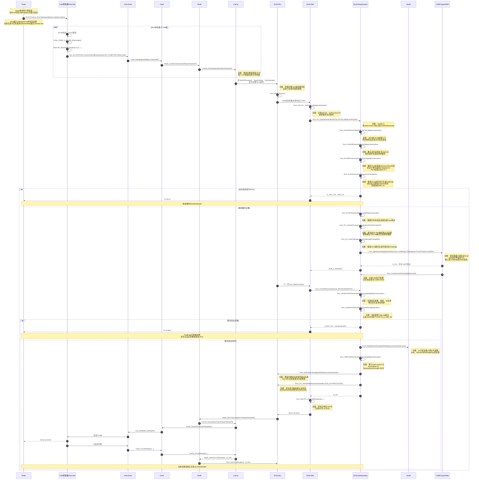

# 29 服务

源文件：Q_SQR E 8-20-2025 Vehicle Unified diagnostic services (UDS) Standard.pdf
## 一、0 x 29 服务总体实现范围

服务目的：客户端通过身份认证，获得受限制的数据或诊断服务访问权限，尤其是下载、上传、例程执行和特定内存读取等高风险操作。

标准提供两套认证机制：

| 机制         | 名称           | 本文件定义的流程  | 密码体系         |
| ---------- | ------------ | --------- | ------------ |
| Concept #1 | APCE，基于证书的认证 | `01 → 03` | PKI、非对称密码    |
| Concept #2 | ACR，挑战—响应认证  | `05 → 06` | 非对称软件令牌或对称密码 |

出处：6.9，印刷页 35；Figure 5；6.9.1.1、6.9.1.2。

### 证书和密钥要求

APCE 允许的证书格式：

- CVC，依据 ISO 7816-8。
- X.509，依据 ISO/IEC 9594-8、RFC 5280、RFC 5755。
- IEEE 1609.2 证书。

标准明确指出：`“generation, distribution and storage of cryptographic material is out of scope”`。因此以下内容必须由奇瑞与供应商单独确定：

- 根证书、信任链和证书烧录方式。
- 私钥生成和注入。
- HSM/Crypto Driver/Crypto Stack 使用方式。
- 证书更新、吊销、有效期检查策略。
- 密钥派生、轮换、销毁和恢复机制。

出处：6.9，印刷页 35。

## 二、必须实现的认证状态机

### 1. APCE 流程

```
未认证
  └─ 29 01 verifyCertificateUnidirectional
       ├─ 证书验证成功 → ReturnValue 11
       │                  CertificateVerified,
       │                  OwnershipVerificationNecessary
       └─ 29 03 proofOfOwnership
            └─ 所有权证明成功 → ReturnValue 12
                                   AuthenticationComplete
```

要求：

- `0x03` 只能在 `0x01` 成功后处理。
- `0x01` 成功不等于认证完成，只表示证书验证完成、等待所有权证明。
- 服务器 Challenge 必须与当前客户端、当前连接和当前认证事务绑定。
- `0x03` 验证成功后才能开放受保护服务。

出处：表 61–64，印刷页 36–38；表 72，印刷页 42；表 76，印刷页 44–45。

### 2. ACR 流程

```
未认证
  └─ 29 05 requestChallengeForAuthentication
       └─ 服务器返回Challenge及可选附加参数
            └─ 29 06 verifyProofOfOwnershipUnidirectional
                 └─ 验证成功 → ReturnValue 12
                                AuthenticationComplete
```

要求：

- `0x06` 只能在 `0x05` 成功后处理。
- Challenge 应具备足够随机性、新鲜度和一次性，防止重放。
- 算法标识必须在请求、响应和事务上下文中保持一致。
- 若服务器通过 `neededAdditionalParameter` 要求补充数据，客户端通过 `additionalParameter` 返回。

出处：表 65–68，印刷页 38–41；表 72，印刷页 42。

### 3. 退出认证

- 请求：`29 00`
- 响应：`69 00 ReturnValue`
- 成功返回值：`10 DeAuthenticationSuccessful`
- 退出后服务器必须重新进入受保护状态，并清除认证权限、临时密钥及未完成事务。

出处：表 69、70，印刷页 41；表 76，印刷页 45。

## 三、报文格式

所有多字节长度字段均为两字节，顺序为 MSB、LSB。

|子功能|请求报文|
|---|---|
| `00` deAuthenticate| `29 00` |
| `01` verifyCertificateUnidirectional| `29 01 communicationConfiguration certificateLength[2] certificate[m] challengeLength[2] challenge[n]` |
| `03` proofOfOwnership| `29 03 proofLength[2] proof[m] ephemeralKeyLength[2] ephemeralKey[n]` |
| `05` requestChallengeForAuthentication| `29 05 communicationConfiguration algorithmIndicator[16]` |
| `06` verifyProofOfOwnershipUnidirectional| `29 06 algorithmIndicator[16] proofLength[2] proof[m] challengeLength[2] challenge[n] additionalLength[2] additional[o]` |

|子功能|正响应报文|
|---|---|
| `00` | `69 00 returnValue` |
| `01` | `69 01 returnValue challengeLength[2] challenge[m] ephemeralKeyLength[2] ephemeralKey[n]` |
| `03` | `69 03 returnValue sessionKeyInfoLength[2] sessionKeyInfo[m]` |
| `05` | `69 05 returnValue algorithmIndicator[16] challengeLength[2] challenge[m] neededAdditionalLength[2] neededAdditional[n]` |
| `06` | `69 06 returnValue algorithmIndicator[16] sessionKeyInfoLength[2] sessionKeyInfo[m]` |

出处：表 61–70，印刷页 36–41。

### 报文解析规则

- `algorithmIndicator` 固定 16 字节。
- 变长字段由前面的 16 位长度字段控制。
- 对于条件字段，长度为 `0x0000` 时，后续数据字段不得发送。
- 必须检查长度加法溢出、截断报文、额外尾随字节和超出接收缓冲区的长度。
- 长证书、Challenge 和公钥可能触发 ISO-TP 多帧传输，应配置足够的 DCM/TP 接收缓冲区。
- 不应直接按照报文声明长度进行无边界动态分配。

## 四、关键参数实现

### `communicationConfiguration`

定义后续诊断通信采用何种安全方式。标准只给出 `00–FF` 范围，没有定义具体位含义，因此必须形成 OEM 接口定义，并与会话密钥、安全通信层及访问权限一致。

出处：表 61、65 及表 74，印刷页 36、38、43。

### `algorithmIndicator`

- 固定 16 字节。
- 内容为算法 OID 的 BER 编码值。
- 左对齐，不足 16 字节在右侧补零。
- 决定 POWN 生成/验证算法、算法参数以及可能的会话密钥创建模式。

出处：表 74、75，印刷页 43–44。

### 临时公钥

- APCE 双方均可携带 Diffie-Hellman 临时公钥。
- 如果没有临时公私钥对，长度必须为 `0x0000`，并省略公钥数据。
- 私钥必须存放于受保护区域；认证完成、失败、超时或退出认证时应清零。

出处：表 62–64、表 74–75，印刷页 37–38、43–44。

### `sessionKeyInfo`

可包括：

- 加密后的会话密钥。
- 客户端用于验证会话密钥的证明值，例如 Hash。
- 后续安全诊断通信所需的信息。

其格式、会话密钥生成方法和证明值计算方法由整车厂定义，并与 `communicationConfiguration` 关联。

出处：表 75，印刷页 44。

## 五、ReturnValue 处理

|值|含义|ECU 行为|
|---|---|---|
| `00` |RequestAccepted|本步骤成功，但不必然代表整个认证完成|
| `01` |GeneralReject|认证程序执行失败|
| `10` |DeAuthenticationSuccessful|已退出认证，服务器重新受保护|
| `11` |CertificateVerified, OwnershipVerificationNecessary|证书通过，必须继续执行 POWN|
| `12` |OwnershipVerified, AuthenticationComplete|认证完成，可以按权限开放服务|

出处：表 76，印刷页 44–45。

注意：`ReturnValue=01` 仍位于 `0x69` 正响应中；报文结构、子功能和执行条件错误则使用 `0x7F` 负响应。实现时不能把两类错误混为一谈。

## 六、负响应和检查顺序

负响应格式：

```
7F 29 NRC
```

本节明确要求的 NRC：

|NRC|条件|
|---|---|
| `12` subFunctionNotSupported|请求的子功能不支持|
| `13` incorrectMessageLengthOrInvalidFormat|长度或格式错误|
| `22` conditionsNotCorrect|当前条件不满足认证要求|
| `24` requestSequenceError|认证子功能调用顺序错误|

`0x24` 明确用于：

- 未成功处理证书验证，直接收到 `proofOfOwnership`。
- 未成功处理 Challenge 请求，直接收到 `verifyProofOfOwnership`。

出处：表 71、72 及 Figure 6，印刷页 41–42。

建议 ECU 检查顺序：

1. SID 和子功能支持性。
2. 固定字段及总报文长度。
3. 变长字段边界与条件字段一致性。
4. 当前认证状态和子功能调用顺序。
5. 车辆条件、会话、连接及资源条件。
6. 密码材料与认证结果。

## 七、必须由项目补充的设计项

<mark style="background: #FF5582A6;">6.9.3 **只明确认证用于 OBD 访问认证**，但认证状态如何保持、如何离开需要单独设计，原文关键词为：`“needs to be designed separately”`。出处：6.9.3，印刷页 45</mark>。

项目必须明确：

- 认证状态按物理连接、逻辑 Tester、源地址还是全 ECU 保存。
- 多 Tester 并发时是否允许共享认证权限。
- 诊断会话切换后是否保持认证。
- S 3 超时、通信断开、ECU Reset、点火循环后如何处理。
- 认证失败、Challenge 超时或重复请求时如何回滚。
- 认证有效期及自动去认证计时器。
- 哪些 SID/DID/RID/内存区域由哪种身份或证书权限开放。
- 安全权限检查发生在 DCM 内部还是应用回调中。
- 临时 Challenge、POWN、会话密钥和证书缓存的 RAM/NVM 策略。
- 密码运算时间超过 P 2/P 2* 时的异步处理策略。
- 审计日志只记录结果、身份标识摘要和失败原因，禁止记录私钥、会话密钥或完整 POWN。

## 八、文档中需要澄清的三处问题

1. 表 64 的响应值是子功能 `03`，但名称写成了 `verifyCertificateUnidirectional`；按上下文应为 `proofOfOwnership`。
    
2. 表 74 描述 `additionalParameter` 时引用“Table 67”，但 `neededAdditionalParameter` 实际出现在表 66 响应中，疑似交叉引用错误。
    
3. 表 72 的 `0x24` 说明提到 `verifyCertificateBidirectional` 和 `verifyProofOfOwnershipBidirectional`，但表 73 没有定义对应子功能值，本文件报文表也只定义单向认证。除非奇瑞另有补充规范，否则不应自行启用双向子功能；未知值应按 `NRC 0x12` 处理。
    

这三项建议进入需求澄清单，否则客户端和 ECU 实现可能产生互操作差异。


# 实现


最快的办法不是“先把信息安全学完”，也不是直接在正式 ECU 上硬做。我的建议是：

> 先用 2 天理解 0 x 29 的最小知识，然后立即围绕当前 ETAS DCM 做一个可观察的认证闭环；每遇到一个密码学接口，再补对应知识。

你不需要成为密码学专家。作为汽车软件工程师，你要掌握的是协议、状态机、DCM 配置、密码服务接口、权限控制和测试，而不是自己实现 RSA、ECC 或 AES。

## 一、你当前工程的真实情况

当前代码库不是从零开始，ETAS DCM 已经包含 0 x 29 完整框架：

- 总入口：[DcmDspUds_Authentication.c (line 20)](/E:/github/ECAS_qirui_Single_Chamber/BasicSoftware/src/bsw/Dcm/src/Dsp/Uds/DcmDspUds_Authentication.c:20)
- APCE 证书验证：[DcmDspUds_Auth_VerifyCertificate.c (line 19)](/E:/github/ECAS_qirui_Single_Chamber/BasicSoftware/src/bsw/Dcm/src/Dsp/Uds/DcmDspUds_Auth_VerifyCertificate.c:19)
- APCE 所有权验证：[DcmDspUds_Auth_ProofOfOwnership.c (line 19)](/E:/github/ECAS_qirui_Single_Chamber/BasicSoftware/src/bsw/Dcm/src/Dsp/Uds/DcmDspUds_Auth_ProofOfOwnership.c:19)
- ACR Challenge：[DcmDspUds_Auth_RequestChallenge.c (line 19)](/E:/github/ECAS_qirui_Single_Chamber/BasicSoftware/src/bsw/Dcm/src/Dsp/Uds/DcmDspUds_Auth_RequestChallenge.c:19)
- ACR POWN 验证：[DcmDspUds_Auth_VerifyProofOfOwnership.c (line 19)](/E:/github/ECAS_qirui_Single_Chamber/BasicSoftware/src/bsw/Dcm/src/Dsp/Uds/DcmDspUds_Auth_VerifyProofOfOwnership.c:19)
- 认证状态管理：[Dcm_Dsl_Authentication.c (line 29)](/E:/github/ECAS_qirui_Single_Chamber/BasicSoftware/src/bsw/Dcm/src/Dsl/Dcm_Dsl_Authentication.c:29)
- 超时管理：[Dcm_Dsl_AuthenticationTimer.c (line 20)](/E:/github/ECAS_qirui_Single_Chamber/BasicSoftware/src/bsw/Dcm/src/Dsl/Dcm_Dsl_AuthenticationTimer.c:20)

但当前项目中功能是关闭的：

- `DCM_CFG_DSP_AUTHENTICATION_ENABLED = DCM_CFG_OFF`：[Dcm_Cfg_DslDsd.h (line 400)](/E:/github/ECAS_qirui_Single_Chamber/BasicSoftware/src/bsw/Dcm/Dcm_Cfg_DslDsd.h:400)
- 双向认证也关闭：[Dcm_Cfg_DspUds.h (line 80)](/E:/github/ECAS_qirui_Single_Chamber/BasicSoftware/src/bsw/Dcm/Dcm_Cfg_DspUds.h:80)
- 当前 SWC 请求过滤也还没有 `case 0x29`：[Dcm_Swc.c (line 4372)](/E:/github/ECAS_qirui_Single_Chamber/ASW/SWC/Dcm_Swc/src/Dcm_Swc.c:4372)

所以你的最快路线是：

> 学会配置和接通现有 DCM 实现，而不是自己从头编写 0 x 29 协议栈。

## 二、先学什么，哪些暂时不要学

### <mark style="background: #FFB8EBA6;"> 第一阶段必须懂</mark>

只需要掌握下面七个概念：

1. **认证与授权的区别**
    
    - 认证：你是谁？
    - 授权：你认证成功后能做什么？
    - 0 x 29 既建立身份，也通过 Role 限制 SID、DID、RID 和内存区域。
2. **Challenge**
    
    ECU 生成的一次性随机数，防止攻击者重放以前的认证报文。
    
3. **Proof of Ownership**
    
    Tester 使用私钥或对称密钥处理 Challenge，证明自己确实持有秘密。
    
1. **Hash、MAC 和数字签名**
    
    - Hash：数据摘要。
    - MAC：双方持有同一密钥，验证来源和完整性。
    - 数字签名：私钥签名、公钥验证。
2. **对称与非对称密码**
    - ACR_SYMMETRIC：双方共享秘密密钥。
    - APCE_ASYMMETRIC：客户端持有私钥，ECU 通过证书取得客户端公钥。
3. **证书和信任链**
    ECU 不是看到一个证书就相信，而是检查它是否由受信任 CA 签发、是否有效、是否拥有对应权限。
4. **认证状态机**
    **这是你最重要的知识，优先级高于密码学数学。**

### 暂时不要学

初期不需要：
- RSA/ECC 的数学推导。
- 自己编写 AES、SHA 或签名算法。
- 深入研究全部 ASN.1 编码。
- 一次性通读完整 ISO 21434。
- 一开始就接真实生产证书和正式密钥。
密码算法必须使用供应商 Crypto 库、CSM/HSM 或经过认证的实现，不能自己手写。

## 三、建议按这个顺序上手

### 第 1 天：只学协议和状态机

先把下面两条流程画出来。

APCE：

```
Deauthenticated
    ↓ 29 01：验证客户端证书
CertificateVerified
    ↓ 29 03：验证客户端对Challenge的签名
Authenticated
    ↓ 29 00
Deauthenticated
```

ACR：

```
Deauthenticated
    ↓ 29 05：请求Challenge
ChallengeSent
    ↓ 29 06：验证POWN
Authenticated
    ↓ 29 00
Deauthenticated
```


这一天的目标不是理解密码算法，而是看到任意报文后，能回答：

- 当前处于什么状态？
- 这个子功能是否合法？
- 成功后进入哪个状态？
- 失败时状态是否改变？
- 返回 `0x69` 还是 `0x7F 29 NRC`？

#### question

今天先不要改配置。完成下面这张表：

| 场景                | 预期响应 | 下一状态 |     |
| ----------------- | ---- | ---- | --- |
| 上电后发送 `29 06`     | ？    | ？    |     |
| `29 05` 成功        | ？    | ？    |     |
| POWN 错误的 `29 06`  | ？    | ？    |     |
| POWN 正确的 `29 06`  | ？    | ？    |     |
| 认证后发送 `29 00`     | ？    | ？    |     |
| `29 00` 之后访问受保护服务 | ？    | ？    |     |


#####   ACR
- [x] ECU 上电后处于未认证状态，Tester 没有发送 `29 05` 请求 Challenge，直接发送 `29 06` 验证 POWN。ECU 应该返回什么？认证状态是否变化？ ✅ 2026-08-11
我们就从这一题开始，随后我带你沿当前工程的真实代码，一层一层追到 DCM、认证状态和 Crypto 接口。
<mark style="background: #ADCCFFA6;">A:  0 x 06 的前置步骤是 0 x 05 ，否则会返回 NRC 24.无法认证通过。</mark>   (0 x 29 不是几个独立子功能，而是有严格顺序的状态机。)


- [x] ECU 处于 `Deauthenticated` 状态。Tester 正确发送 `29 05`，ECU 成功生成并返回 Challenge。此时 ECU 是否已经完成认证？它应该处于什么状态？接下来 Tester 应该发送哪个子功能？ ✅ 2026-08-11
> 	A:  没有完成认证，处在 challenge 已发出，等待 06 `verifyProofOfOwnershipUnidirectional` 的中间状态

```
> Deauthenticated
>     │ 29 05
>     ▼
> Challenge已发出，等待29 06
>     │ 29 06验证成功
>     ▼
> Authenticated
```

- [x] ECU已经成功响应`29 05`，正在等待`29 06`。这时Tester又发送一次`29 05`。你认为ECU应该重新生成Challenge、返回顺序错误，还是复用原Challenge？先根据安全直觉说明理由，不要求立即找到标准答案。 ✅ 2026-08-11
> A: 按照这份Q/SQR规范，表72没有把“重复收到 `29 05`”列为 `NRC 0x24` 条件，因此应接受新请求并重新生成Challenge。
> 推荐行为：
> 1. 废弃旧Challenge。
> 2. 生成全新的随机Challenge。
> 3. 返回：
> ```
> 69 05 00 [AlgorithmIndicator] [New Challenge...]
> ```
> 4. 状态仍为“等待`29 06`”。
> 5. 后续只接受针对新Challenge生成的POWN。
> 
> 这里要记住一个安全原则：
> > <mark style="background: #FF5582A6;">同一连接在同一时间只能有一个有效Challenge；新Challenge产生后，旧Challenge立即失效。</mark>

- [x] > ECU先返回Challenge A，随后因第二次`29 05`又返回Challenge B。Tester却发送了基于Challenge A计算的`29 06`。ECU应该认证成功还是失败？失败后应处于什么状态？ ✅ 2026-08-11
> A:失败，POWN与当前Challenge不匹配：报文格式和调用顺序都正确，只是密码学验证结果失败。更合适的是正响应携带失败结果:69 06 01.
> <mark style="background: #FFF3A3A6;">POWN验证失败，返回`69 06 01`；ECU保持未认证，并废弃当前Challenge。</mark> (<mark style="background: #FF5582A6;">0 x 29 的密码学验证失败不一定使用 UDS 负响应，也可能通过正响应中的 `returnValue` 报告。</mark>)


- [x] ECU已经通过 `29 05 → 29 06` 完成认证。，当前状态为 `Authenticated`。Tester发送：29 00. ✅ 2026-08-11
- 成功时完整响应是什么？提示：查看表70和表76。
- ECU随后进入什么认证状态？
- 原来允许访问的受保护SID、DID、RID是否还能继续访问？
> 69 00 10- 认证状态回到`Deauthenticated`。
> - 受保护服务权限立即撤销。
> - 如需重新认证，Tester必须从`29 05`重新开始。


##### APCE

- [x] ECU处于`Deauthenticated`状态，Tester没有先发送`29 01`验证证书，而是直接发送`29 03 proofOfOwnership`。完整响应和认证状态分别是什么？ ✅ 2026-08-11
> `29 03 proofOfOwnership` 的前置步骤是成功完成 `29 01 verifyCertificateUnidirectional`。 缺少前置步骤属于`requestSequenceError`。
- [x] ECU处于`Deauthenticated`。 Tester发送`29 01`，证书验证成功。ECU返回：69 01 11 ... ✅ 2026-08-11
- `ReturnValue 0x11` 表示什么？
- 此时是否已经完成认证？
- 接下来 Tester 应该发送哪个子功能？
- 
> - 证书合法，但这只证明证书本身可信。
> - 还没有证明当前Tester确实持有与证书公钥对应的私钥。
> - ECU仍不能开放受保护服务。
> - 下一步必须执行`29 03 proofOfOwnership`

- [x] `29 01` 成功后，Tester 发送正确的 `29 03`，POWN 验证成功。完整响应前三字节是什么？ECU 进入什么状态？受保护服务是否可以访问？ ✅ 2026-08-11
响应：69 03 12
状态：Authenticated 。<mark style="background: #FF5582A6;">只能访问当前认证 Role 被授权的服务，不是所有受保护服务都自动开放。</mark>

- [x] ACR和APCE都使用Challenge及POWN。它们最大的区别是什么？为什么APCE要先发送证书，而ACR不需要证书 ✅ 2026-08-11
> <mark style="background: #FF5582A6;">APCE其实也有Challenge，只是它没有单独使用一个“请求Challenge”的子功能。</mark>
Tester 发送证书：
```
29 01
[CommunicationConfiguration]
[CertificateClient]
[可选ChallengeClient]
```
ECU 验证证书后，在 `29 01` 的响应中直接返回 Challenge：
```
69 01 11
[ChallengeServer]
[可选EphemeralPublicKeyServer]
```
然后 Tester 使用与证书对应的私钥处理这个 `ChallengeServer`，再发送：
```
29 03
[ProofOfOwnershipClient]
[可选EphemeralPublicKeyClient]
```

Tester 发送证书
    ↓
ECU 验证证书
    ↓
ECU 在 29 01 响应中返回 Challenge
    ↓
Tester 用证书对应的私钥生成 POWN
    ↓
ECU 通过 29 03 验证 POWN

- [x] APCE为什么既要验证证书，又要验证Challenge对应的POWN？仅验证证书为什么不够？ ✅ 2026-08-11
> <mark style="background: #FF5582A6;">证书证明公钥属于谁，POWN证明当前Tester确实持有对应私钥；随机Challenge保证这次证明是新鲜的。</mark>


### 第 2 天：顺着代码只读一遍

阅读顺序建议严格保持：

1. `DcmDspUds_Authentication.c`  
    看 0 x 29 总入口、子功能分发、长度检查和取消处理。
    
2. `DcmDspUds_Auth_RequestChallenge.c`  
    先读 ACR 的 `0x05`，它比证书流程简单。
    
3. `DcmDspUds_Auth_VerifyProofOfOwnership.c`  
    看 `0x06` 如何解析 POWN，以及如何更新认证状态。
    
4. `Dcm_Dsl_Authentication.c`  
    看认证状态是按什么对象、连接和 Role 保存的。
    
5. `Dcm_Dsl_AuthenticationTimer.c`  
    看认证超时和自动退出。
    

<mark style="background: #FFB86CA6;">先学 ACR，再学 APCE。APCE 增加了证书链、公钥、临时密钥等内容，更容易把初学者淹没。</mark>


##### ACR 时序图·

```mermaid
sequenceDiagram
    autonumber

    participant T as Tester
    participant HW as CAN控制器/ISR
    participant CD as Can Driver
    participant CI as CanIf
    participant PR as PduR
    participant TP as CanTp
    participant DSL as DCM DSL
    participant DSD as DCM DSD
    participant DSP as DCM DSP Authentication
    participant CSM as CSM/Crypto/HSM

    Note over T,CSM: 第一阶段：29 05 requestChallengeForAuthentication

    T->>HW: CAN报文<br/>UDS = 29 05 + communicationConfiguration + 16-byte algorithmIndicator

    Note over T,TP: 29 05请求总UDS长度为19字节<br/>经典CAN下一般需要FF/FC/CF多帧传输

    HW->>CD: CANx Rx Message Buffer中断
    CD->>CD: Can_43_FLEXCAN_CommonIrqCallback<br/>(u8Instance,event,u32buffIdx,driverState)
    CD->>CD: Can_Ipw_ParseData<br/>(CanIf_Mailbox,CanIf_PduInfo,...)

    Note right of CD: CanIf_Mailbox:<br/>CanId/Hoh/ControllerId<br/><br/>CanIf_PduInfo:<br/>SduDataPtr/SduLength

    CD->>CI: CanIf_RxIndication<br/>(Mailbox,PduInfoPtr)
    CI->>PR: PduR_CanIfRxIndication<br/>(CanIfRxPduId,PduInfoPtr)
    PR->>TP: CanTp_RxIndication<br/>(RxPduId,PduInfoPtr)

    TP->>TP: CanTp_Prv_ProcessFrame<br/>解析SF/FF/CF/FC
    TP->>PR: PduR_CanTpStartOfReception<br/>(PduRPduId,SduInfo,TpSduLength,bufferSizePtr)
    PR->>DSL: Dcm_StartOfReception<br/>(DcmRxPduId,info,tpSduLength,bufferSizePtr)

    DSL-->>TP: BUFREQ_OK + 可用缓冲区大小

    loop 每个接收分片
        TP->>PR: PduR_CanTpCopyRxData<br/>(PduRPduId,SduInfo,bufferSizePtr)
        PR->>DSL: Dcm_CopyRxData<br/>(DcmRxPduId,info,bufferSizePtr)
    end

    TP->>PR: PduR_CanTpRxIndication<br/>(PduRPduId,E_OK)
    PR->>DSL: Dcm_TpRxIndication<br/>(DcmRxPduId,E_OK)
    DSL->>DSL: Dcm_ProcessRxIndication(DcmRxPduId)<br/>设置DSL_STATE_REQUESTRECEIVED_STARTPROTOCOL

    Note over HW,DSL: 中断接收链到这里基本结束<br/>真正的0x29服务处理在周期任务Dcm_MainFunction中进行

    DSL->>DSL: Dcm_MainFunction()
    DSL->>DSL: Dcm_Dsl_Main()<br/>Dcm_Dsl_Prv_StateMachine()
    DSL->>DSL: Dcm_Dsl_StartProtocol()
    DSL->>DSD: Dcm_Dsd_Prv_ServiceInit(serviceTableId)
    DSL->>DSD: 设置DSD_VERIFICATION_E

    DSD->>DSD: Dcm_PrepareDcmMsgContext()

    Note right of DSD: idContext = 0x29<br/>reqData[0] = 0x05<br/>reqData[1] = communicationConfiguration<br/>reqData[2..17] = algorithmIndicator<br/>reqDataLen = 18<br/>dcmRxPduId = 当前接收PDU

    DSD->>DSD: Dcm_Dsd_Prv_Verification<br/>(pMsgContext,pNrc)
    DSD->>DSD: Dcm_VerifyService()<br/>查找SID 0x29、检查会话/安全/AuthRole
    DSD->>DSD: Dcm_VerifySubService()<br/>查找SubFunction 0x05

    DSD->>DSP: Dcm_Prv_DspAuthentication<br/>(OpStatus,pMsgContext,pNrc)
    DSP->>DSP: Dcm_CallSubServiceHandler(...)
    DSP->>DSP: Dcm_RequestChallenge<br/>(DCM_INITIAL,pMsgContext,pNrc)

    DSP->>DSP: 检查请求长度 = 18
    DSP->>DSP: 检查communicationConfiguration
    DSP->>DSP: Dcm_AlgorithmIndicatorCheck<br/>(pMsgContext,index=2,pNrc)

    DSP->>CSM: Csm_RandomGenerate<br/>(challengeJobId,challengeBuffer,challengeLengthPtr)
    CSM-->>DSP: E_OK/异步处理中
    DSP-->>DSD: DCM_E_PENDING

    Note over DSL,CSM: CSM异步执行期间，DCM保持服务上下文<br/>后续Dcm_MainFunction再次调用该服务

    CSM->>DSP: Dcm_CsmAsyncJobFinished<br/>(jobId,result)
    DSP->>DSP: AsyncState = COMPLETED

    DSL->>DSD: 下一次Dcm_MainFunction
    DSD->>DSP: Dcm_RequestChallenge<br/>(DCM_PENDING,pMsgContext,pNrc)
    DSP->>DSP: 检查CSM Job结果
    DSP->>DSP: 填充Challenge响应
    DSP->>DSP: Dcm_SetProofOfOwnershipExpected(TRUE)
    DSP-->>DSD: E_OK

    DSD->>DSD: Dcm_Dsd_Prv_AssembleResponse()
    DSD->>DSD: PositiveResponseAssembler<br/>0x29 + 0x40 = 0x69
    DSD->>DSL: 响应数据：69 05 00 ... Challenge
    DSL->>PR: PduR_DcmTransmit<br/>(DcmTxPduId,PduInfoPtr)
    PR->>TP: CanTp_Transmit<br/>(CanTpTxPduId,CanTpTxInfoPtr)

    loop CanTp获取并分段响应
        TP->>PR: PduR_CanTpCopyTxData(...)
        PR->>DSL: Dcm_CopyTxData(...)
        TP->>PR: PduR_CanTpTransmit(...)
        PR->>CI: CanIf_Transmit(TxPduId,PduInfoPtr)
        CI->>CD: Can_Write(Hth,PduInfo)
        CD->>HW: 发送CAN帧
    end

    HW-->>T: 69 05 00 ... Challenge

    HW->>CD: Tx Confirmation中断
    CD->>CI: CanIf_TxConfirmation(...)
    CI->>TP: CanTp_TxConfirmation(...)
    TP->>PR: PduR_CanTpTxConfirmation(...,E_OK)
    PR->>DSL: Dcm_TpTxConfirmation(DcmTxPduId,E_OK)

    Note over T,CSM: 当前状态：Challenge已发出，等待29 06<br/>ECU仍然是Deauthenticated

    Note over T,CSM: 第二阶段：29 06 verifyProofOfOwnershipUnidirectional

    T->>HW: 29 06 + algorithmIndicator<br/>+ proofOfOwnershipClientLength<br/>+ proofOfOwnershipClient
    HW->>CD: CAN Rx中断
    CD->>CI: CanIf_RxIndication(Mailbox,PduInfoPtr)
    CI->>PR: PduR_CanIfRxIndication(...)
    PR->>TP: CanTp_RxIndication(...)
    TP->>DSL: 经StartOfReception/CopyRxData/TpRxIndication接收完整请求

    DSL->>DSD: Dcm_MainFunction → DSL → DSD
    DSD->>DSD: Verification SID=0x29 SubFunction=0x06
    DSD->>DSP: Dcm_Prv_DspAuthentication<br/>(OpStatus,pMsgContext,pNrc)
    DSP->>DSP: Dcm_VerifyProofOfOwnership<br/>(DCM_INITIAL,pMsgContext,pNrc)

    DSP->>DSP: Dcm_ProofOfOwnershipSequenceCheck(pNrc)
    alt 未执行成功的29 05
        DSP-->>DSD: E_NOT_OK，NRC=0x24
        DSD-->>T: 7F 29 24
    else 已执行成功的29 05
        DSP->>DSP: Expected = FALSE<br/>消费本次Challenge
        DSP->>DSP: Dcm_AlgorithmIndicatorCheck<br/>(pMsgContext,index=1,pNrc)
        DSP->>DSP: 解析Proof长度和Proof数据
        DSP->>DSP: 取得29 05生成的Challenge

        DSP->>CSM: Csm_SignatureVerify<br/>(jobId,SINGLECALL,<br/>challengePtr,challengeLen,<br/>proofPtr,proofLen,<br/>verifyResultPtr)
        CSM-->>DSP: E_OK/异步处理中
        DSP-->>DSD: DCM_E_PENDING

        CSM->>DSP: Dcm_CsmAsyncJobFinished<br/>(jobId,result)
        DSP->>DSP: AsyncState = COMPLETED

        DSL->>DSD: 下一次Dcm_MainFunction
        DSD->>DSP: Dcm_VerifyProofOfOwnership<br/>(DCM_PENDING,pMsgContext,pNrc)
        DSP->>DSP: 检查jobResult和CRYPTO_E_VER_OK

        alt Proof验证失败
            DSP-->>DSD: OwnershipVerificationFailed
            DSD-->>T: 7F 29 NRC
            Note over DSP: 状态仍是Deauthenticated<br/>再次尝试必须重新执行29 05
        else Proof验证成功
            DSP->>DSP: Dcm_ReadRoleAndWhitelistsFromApplication<br/>(authConnectionIndex)
            DSP->>DSP: 填充returnValue=0x12
            DSP->>DSL: Dcm_Prv_SetAuthState<br/>(authConnectionIndex,DCM_AUTHENTICATED)
            DSP-->>DSD: E_OK

            DSD->>DSL: 组装69 06 12 ...响应
            DSL->>PR: PduR_DcmTransmit(...)
            PR->>TP: CanTp_Transmit(...)
            TP->>CI: 分段后CanIf_Transmit(...)
            CI->>CD: Can_Write(...)
            CD->>HW: 发送响应
            HW-->>T: 69 06 12 + algorithmIndicator + 00 00

            Note over DSL,DSP: 当前诊断连接进入Authenticated<br/>后续服务根据Role和Whitelist判断访问权限
        end
    end
```



`29 05` 请求到底包含什么:

29 05 CC AI[0] AI[1] ... AI[15]
│  │  │  └──────── 16 字节算法标识
│  │  └─────────── communicationConfiguration，1 字节
│  └────────────── SubFunction = 0 x 05
└───────────────── SID = 0 x 29

|字段|含义|
|---|---|
| `29` |Authentication 服务 SID|
| `05` |请求 ECU 生成 Challenge|
| `communicationConfiguration` |指定本次认证使用的通信配置|
| `algorithmIndicator[16]` |告诉 ECU 使用哪一种密码算法/配置|
|这里没有 Challenge|Challenge 由 ECU 生成，并放在 `69 05` 响应中|

例如： 
communicationConfiguration = 00
algorithmIndicator =
A 0 A 1 A 2 A 3 A 4 A 5 A 6 A 7 A 8 A 9 AA AB AC AD AE AF

Tester 发送的完整请求 是：29 05 00 A 0 A 1 A 2 A 3 A 4 A 5 A 6 A 7 A 8 A 9 AA AB AC AD AE AF


##### APCE 时序图
证书验证并获取 Challenge

```mermaid
sequenceDiagram
    autonumber

    participant T as Tester
    participant HW as CAN控制器/FlexCAN
    participant CD as CAN Driver
    participant CI as CanIf
    participant PR as PduR
    participant TP as CanTp
    participant DSL as DCM DSL
    participant DSD as DCM DSD
    participant DSP as DCM Authentication
    participant KM as KeyM
    participant CSM as CSM/Crypto/HSM

    Note over T,CSM: 第一阶段：29 01 verifyCertificateUnidirectional

    T->>HW: UDS请求：29 01 00 CertLen Certificate 0000
    Note over T: 29=SID，01=单向证书验证<br/>00=communicationConfiguration<br/>CertLen=2字节证书长度<br/>0000=ChallengeClient长度为0

    Note over T,TP: 证书通常远大于单帧CAN容量<br/>CanTp通过FF/FC/CF发送整个请求

    loop 请求中的每个CAN帧
        HW->>HW: CAN ID通过Rx MB硬件过滤
        Note right of HW: 完整CAN帧写入Rx MB<br/>IFLAG置位且IMASK已使能<br/>触发0～31共享中断

        HW->>HW: CANx_ORED_0_31_MB_IRQHandler()
        Note right of HW: 功能：处理CANx的MB0～31中断<br/>入参：无显式参数<br/>x由实际FlexCAN实例决定

        HW->>HW: FlexCAN_IRQHandler(instance,0,31,...)
        Note right of HW: 功能：扫描IFLAG与IMASK<br/>确定具体发生中断的MB<br/>区分Rx完成或Tx完成

        HW->>CD: Can_43_FLEXCAN_CommonIrqCallback(instance,RX_COMPLETE,mbIdx,state)
        Note right of CD: 功能：把FlexCAN事件转换为AUTOSAR Can Driver事件<br/>参数：控制器实例、事件、MB索引、驱动状态

        CD->>CI: CanIf_RxIndication(Mailbox,PduInfoPtr)
        Note right of CI: 功能：根据CAN ID和HRH识别Rx PDU<br/>Mailbox：CanId/Hoh/ControllerId<br/>PduInfo：数据指针和长度

        CI->>PR: PduR_CanIfRxIndication(CanIfRxPduId,PduInfoPtr)
        Note right of PR: 功能：按照静态路由表<br/>把诊断N-PDU交给CanTp

        PR->>TP: CanTp_RxIndication(RxPduId,PduInfoPtr)
        Note right of TP: 功能：解析ISO-TP帧类型<br/>处理FF、CF和流控状态
    end

    TP->>PR: PduR_CanTpStartOfReception(PduRPduId,SduInfo,totalLength,bufferSizePtr)
    PR->>DSL: Dcm_StartOfReception(DcmRxPduId,info,totalLength,bufferSizePtr)
    Note right of DSL: 功能：检查请求长度和连接状态<br/>申请并锁定DCM Rx缓冲区<br/>返回剩余缓冲区大小

    loop 每个ISO-TP数据分片
        TP->>PR: PduR_CanTpCopyRxData(PduRPduId,SduInfo,bufferSizePtr)
        PR->>DSL: Dcm_CopyRxData(DcmRxPduId,info,bufferSizePtr)
        Note right of DSL: 功能：把分片复制到DCM接收缓冲区<br/>info包含SduDataPtr和SduLength
    end

    TP->>PR: PduR_CanTpRxIndication(PduRPduId,E_OK)
    PR->>DSL: Dcm_TpRxIndication(DcmRxPduId,E_OK)
    Note right of DSL: 功能：通知完整UDS请求接收成功<br/>此处尚未执行证书验证

    DSL->>DSL: Dcm_ProcessRxIndication(DcmRxPduId)
    Note right of DSL: 功能：保存请求来源和协议信息<br/>DSL状态进入REQUEST_RECEIVED

    Note over HW,DSL: CAN接收中断链结束<br/>复杂的证书和密码学处理在Dcm_MainFunction中运行

    DSL->>DSL: Dcm_MainFunction()
    Note right of DSL: 功能：周期运行DSL、DSD和DSP状态机

    DSL->>DSL: Dcm_Dsl_Main()
    Note right of DSL: 功能：启动协议、管理P2/P2*定时器<br/>推动请求进入DSD

    DSL->>DSD: Dcm_Dsd_Prv_ServiceInit(serviceTableId)
    Note right of DSD: 功能：选择当前协议对应的诊断服务表

    DSD->>DSD: Dcm_PrepareDcmMsgContext()
    Note right of DSD: 功能：构建Dcm_MsgContext<br/>idContext=29<br/>reqData[0]=01<br/>reqData[1]=00<br/>dcmRxPduId=当前连接

    DSD->>DSD: Dcm_Dsd_Prv_Verification(pMsgContext,pNrc)
    Note right of DSD: 功能：检查SID、SubFunction、会话<br/>安全等级、AuthRole和ModeRule

    DSD->>DSP: Dcm_Prv_DspAuthentication(DCM_INITIAL,pMsgContext,pNrc)
    Note right of DSP: 功能：0x29总入口<br/>根据reqData[0]分派具体子服务

    DSP->>DSP: Dcm_VerifyCertificateUniBiDirectional(DCM_INITIAL,pMsgContext,pNrc)
    Note right of DSP: 功能：29 01/02处理入口<br/>INITIAL完成同步检查<br/>PROCESSSERVICE推进异步状态机

    DSP->>DSP: Dcm_VerifyCertificateInitial(pMsgContext,pNrc)
    Note right of DSP: 功能：检查异步状态是否空闲<br/>检查请求长度和communicationConfiguration

    DSP->>DSP: Dcm_VerifyCertificateLengthCheck(pMsgContext,pNrc)
    Note right of DSP: 功能：验证CertLen、ChallengeClientLen<br/>以及计算后的总长度是否等于reqDataLen

    DSP->>KM: Dcm_SetCertificate(pMsgContext,pNrc)
    Note right of DSP: 功能：根据dcmRxPduId找到认证连接<br/>取得certificateClientId<br/>提取Tester证书数据

    DSP->>KM: KeyM_SetCertificate(certId,certificateDataPtr)
    Note right of KM: 功能：将Tester证书交给KeyM<br/>参数：证书槽ID、证书地址和长度

    KM-->>DSP: E_OK或错误
    Note over DSP,KM: 此时只是把证书交给KeyM<br/>不等于证书已经验证成功

    DSP->>DSP: Dcm_VerifyCertificateProcess(pMsgContext,pNrc)
    Note right of DSP: 功能：依次执行<br/>验证证书 → 生成Challenge → 组装结果

    DSP->>DSP: Dcm_VerifyCertificate(pMsgContext,pNrc)
    Note right of DSP: 功能：管理KeyM异步验证状态<br/>INACTIVE、ACTIVE、COMPLETED

    DSP->>KM: KeyM_CertGetStatus(certId,statusPtr)
    Note right of KM: 功能：查询证书是否解析完成<br/>NOT_PARSED时DCM继续Pending

    KM-->>DSP: PARSED_NOT_VALIDATED

    DSP->>KM: KeyM_VerifyCertificate(certId)
    Note right of KM: 功能：按KeyM配置验证客户端证书<br/>具体证书链和信任锚由KeyM配置决定

    KM-->>DSP: E_OK，异步验证已启动
    DSP-->>DSD: DCM_E_PENDING

    KM->>DSP: Dcm_KeyMAsyncCertificateVerifyFinished(certId,result)
    Note right of DSP: 功能：保存证书ID和验证结果<br/>将Auth异步状态设为COMPLETED

    DSL->>DSD: 下一次Dcm_MainFunction()
    DSD->>DSP: Dcm_VerifyCertificateUniBiDirectional(DCM_PROCESSSERVICE,...)

    DSP->>DSP: Dcm_VerifyCertificateCompleted(pMsgContext,pNrc)
    Note right of DSP: 功能：读取KeyM异步结果<br/>只有KEYM_CERTIFICATE_VALID才继续

    alt 证书验证失败
        DSP-->>DSD: E_NOT_OK + Certificate NRC
        DSD->>DSL: 组装7F 29 NRC
        DSL-->>T: 证书无效负响应
        Note over T,DSP: 状态保持Deauthenticated
    else 证书验证成功
        DSP->>DSP: 状态切换为GENERATE_CHALLENGE_SERVER

        DSP->>CSM: Csm_RandomGenerate(jobId,challengeBuffer,challengeLengthPtr)
        Note right of CSM: 功能：生成不可预测的服务端Challenge<br/>jobId来自认证连接配置<br/>输出写入DCM Challenge缓冲区

        CSM-->>DSP: E_OK，异步Job已启动
        DSP-->>DSD: DCM_E_PENDING

        CSM->>DSP: Dcm_CsmAsyncJobFinished(jobId,result)
        Note right of DSP: 功能：保存CSM Job结果<br/>异步状态切换为COMPLETED

        DSL->>DSD: 下一次Dcm_MainFunction()
        DSD->>DSP: 继续Dcm_VerifyCertificateProcess(...)

        DSP->>DSP: Dcm_GenerateChallengeServerCompleted(pMsgContext,pNrc)
        Note right of DSP: 功能：检查RandomGenerate结果<br/>将Challenge写入响应缓冲区

        DSP->>DSP: Dcm_FillCommonAuthenticationResponse(...)
        Note right of DSP: 功能：填入SubFunction=01<br/>returnValue=11<br/>含义：证书有效，但仍需所有权验证

        DSP->>DSP: Dcm_FillChallengeServer(...)
        Note right of DSP: 功能：写入ChallengeServerLength<br/>以及ChallengeServer数据

        DSP->>DSP: Dcm_FillVerifyCertificateResponseExtended(...)
        Note right of DSP: 功能：写入EphemeralPublicKeyServerLength<br/>当前实现长度为0000

        DSP->>DSP: Dcm_SetProofOfOwnershipExpected(TRUE)
        Note right of DSP: 功能：记录下一步必须是29 03<br/>用于防止跳过29 01或重放错误顺序

        DSP-->>DSD: E_OK
        DSD->>DSD: Dcm_Dsd_Prv_AssembleResponse(...)
        Note right of DSD: 功能：添加正响应SID<br/>29+40=69

        DSD->>DSL: 响应：69 01 11 ChallengeLen Challenge 0000
        DSL->>PR: PduR_DcmTransmit(DcmTxPduId,PduInfoPtr)
        PR->>TP: CanTp_Transmit(CanTpTxPduId,PduInfoPtr)
        Note right of TP: 功能：将较长响应拆分成FF/CF<br/>处理Tester返回的Flow Control

        loop 每个响应CAN帧
            TP->>CI: CanIf_Transmit(TxPduId,PduInfoPtr)
            CI->>CD: Can_Write(Hth,CanPduPtr)
            CD->>HW: 写入Tx MB并启动发送
            HW-->>T: CAN响应帧
        end

        HW->>CD: Tx MB完成中断
        CD->>CI: CanIf_TxConfirmation(CanTxPduId)
        CI->>TP: CanTp_TxConfirmation(TxPduId)
        TP->>PR: PduR_CanTpTxConfirmation(...,E_OK)
        PR->>DSL: Dcm_TpTxConfirmation(DcmTxPduId,E_OK)

        Note over T,DSP: Certificate Verified<br/>等待29 03<br/>仍然不是Authenticated
    end
```


29 01 CC CL-H CL-L Certificate... CHL-H CHL-L ChallengeClient...
│  │  │  │           │               │
│  │  │  │           │               └─ 单向认证通常为 0000
│  │  │  │           └───────────────── 客户端证书
│  │  │  └───────────────────────────── 证书长度，2 字节
│  │  └──────────────────────────────── communicationConfiguration
│  └─────────────────────────────────── verifyCertificateUnidirectional
└────────────────────────────────────── Authentication SID

具体使用哪种哈希、签名算法和填充方式，由证书、CSM Job 及 OEM 规范决定。


`29 03`：证明 Tester 持有证书对应私钥



29 03 PL-H PL-L Proof... EL-H EL-L EphemeralPublicKey...
│  │    │          │       │
│  │    │          │       └─ 可选临时公钥
│  │    │          └───────── 临时公钥长度
│  │    └──────────────────── Proof 长度和 Proof 数据
│  └───────────────────────── proofOfOwnership
└──────────────────────────── Authentication


- [x] 为什么收到 `7F 29 11` 时应该检查 DSD 服务表，而不是检查 CSM ✅ 2026-08-12
> -DSD查找并分发服务；SID查找失败时，DSP和CSM都还没机会运行
> 


- **RSA 既能用于 APCE，也能用于 ACR。**
- “AES-256”只说明密钥长度和基础算法，还要看具体用途，例如 `AES-CMAC`、Challenge 加密或会话数据加密。
- APCE 的本质是“证书交换与证书验证”。
- ACR 的本质是“不交换 PKI 证书，使用预置密码材料完成 Challenge-Response”。


### 第 3 天：DCM 配置与生成代码验证

- ~~<mark style="background: #FF5582A6;">如果没有 Doip 的场景仅 CAN 总线诊断用 ACR; 支持 DOIP 以太网用 APCE</mark>
- 
- ~~

1.让 DCM 识别并分发 ACR 请求。暂不接 KeyM 证书和 CSM 算法。


#### role:
<mark style="background: #FF5582A6;">`ole 就是 ECU 贴给 Tester 的“权限身份标签”；ECU 根据这张标签决定 Tester 能使用哪些诊断功能。</mark>
`RoleSize`:范围是 1-4 个字节
	Bit 0 = Deauthenticated
	Bit 1 = DiagnosticTester
	Bit 2 = Supplier
	Bit 3 = Production
	...
- [x] 如果当前学习配置只准备定义`Deauthenticated`和`DiagnosticTester`两个角色，`RoleSize`选择1字节是否足够？为什么？ ✅ 2026-08-12
> 够  <mark style="background: #FFB8EBA6;">（量产时仍要与奇瑞证书 Profile 中的 Role 字段长度保持一致。）
</mark>

所以 ACR 包含两个不同问题：
Authentication（认证）
→ 你是谁？证书和私钥是不是真的？

Authorization（授权）
→ 认证成功后，你能做什么？（`Role` 属于第二个问题——授权。）

```
认证成功 → 得到Role
        → DCM检查该Role能否访问Service/DID/RID
```

区别是 Role 的来源。

|机制|Role 来源|
|---|---|
|APCE|从 Tester 证书的 Role 字段读取|
|ACR|由应用层/NvM 通过 `Dcm_ReadAccessRights()` 提供|

ACR 运行过程

```
初始状态
→ Role = Deauthenticated

29 05
→ ECU生成Challenge

29 06
→ CSM验证Tester的Proof
→ Dcm_ReadAccessRights()取得Role和白名单
→ 状态改为Authenticated

后续诊断请求
→ 检查当前Role是否具有访问权限
```

DcmDspAuthenticationDeauthenticatedRoleRef 未认证状态所使用的Role引用。

Authentication Row 定义角色；`DcmDsdServiceRoleRef` 决定该角色可以使用哪些服务。
`AuthenticationRow` 不是“已经认证的角色列表”，而是 DCM 整个授权系统中的角色列表，其中既包括未认证角色，也包括认证后的角色。
```
DiagnosticTester角色
        ↓ 被0x38服务引用
0x38只允许DiagnosticTester执行
```

```
未认证 ≠ 完全没有任何权限  
Deauthenticated
→ 允许公开、基础诊断功能
→ 禁止受保护功能
`Deauthenticated`就类似`Guest`。它虽然未认证，但仍然是权限模型中的一种身份
```


对 ACR 而言，BitPosition 不直接改变 `29 05/06` 报文；它改变 ECU 内部如何解释权限，最终影响认证后其他诊断请求是被允许，还是返回 `NRC 0x34`。

ACR Authentication Connection


ACR 的“连接配置”。它把某条诊断连接与密码学配置绑定起来。默认是单向认证，只有 05、06 子服务，没有 07 服务。

*<font color="#ff0000">白名单字段这些字段指向证书里的白名单元素，属于 APCE 路径。ACR 认证成功后，Role 与白名单通过应用接口取得 Dcm_ReadAccessRights</font>*

流程：
Tester → 29 05：请求 Challenge
ECU    → 返回随机 Challenge
Tester → 使用共享密钥计算 Proof
Tester → 29 06：提交 Proof
ECU    → 使用对应密钥验证 Proof


`EcuChallengeLength` ECU 生成的 Challenge 长度  ：~~ECU 生成 16 字节随机挑战值~~

`AlgorithmIndicator` `29 05/06` 报文中的 16 字节算法 OID  <font color="#ff0000">是一个固定 16 字节的算法身份证</font>

> BER编码的算法OID + 右侧补00，补足16字节
> 06092A864886F70D01010A0000000000
> - `06`：OID类型
> - `09`：后面OID内容长度为9字节
> - `2A864886F70D01010A`：OID `1.2.840.113549.1.1.10`
> - 后面的 `00`：补齐到16字节
> - 这个OID代表 `RSASSA-PSS`
> 
> 


`ConnectionMainConnectionRef ` 指定使用这套认证配置的 DoCAN 连接

`RandomJobRef` CSM 随机数生成 Job

`VerifyProof...JobRef` CSM Proof 验证 Job


#### CSM 配置


`ResultLength=16` 必须和前面配置的：

```
DcmDspAuthenticationEcuChallengeLength = 16
```

保持一致，否则 DCM 想要 16 字节，但 CSM Primitive 的输出定义不是 16 字节，会产生配置校验或运行问题。

另外三个参数通常类似：

```
AlgorithmFamily          → RNG
AlgorithmMode            → NOT_SET 或具体DRBG模式
AlgorithmSecondaryFamily → NOT_SET 或DRBG使用的底层算法
```

它们分别表示：

- `AlgorithmFamily`：这是随机数生成算法。
- `AlgorithmMode`：随机数发生器的具体工作方式，例如某种 DRBG。
- `AlgorithmSecondaryFamily`：DRBG 内部可能使用的 AES、SHA-256 等辅助算法。
- `CustomRef`：只有选择 `CUSTOM` 时才配置，当前先留空。

####  `AlgorithmIndicator` 和随机数生成算法的关系

随机数生成算法：负责“出题”
AlgorithmIndicator 对应的算法：负责“判卷”

1. ECU 使用随机数算法生成 Challenge
                 ↓
2. ECU 把 Challenge 发给诊断仪
                 ↓
3. 诊断仪使用认证密钥和认证算法计算 ProofOfOwnership
                 ↓
4. ECU 使用对应的 CSM 验证 Job 检查 Proof

两者配置对应关系：

| DCM参数                   | 对应CSM配置                         | 作用                 |
| ----------------------- | ------------------------------- | ------------------ |
| `EcuChallengeLength=16` | `RandomGenerateResultLength=16` | 生成16字节Challenge    |
| `RandomJobRef`          | `RandomGenerate Job`            | 指定如何生成随机数          |
| `AlgorithmIndicator`    | Proof验证Job的算法                   | 告诉双方用什么算法认证        |
| `VerifyProof...JobRef`  | `MacVerify`或工具要求的验证Job          | 验证ProofOfOwnership |


#### CSM job 配置


- `CRYPTO_USE_FNC`：DCM 通过 `Csm_RandomGenerate()` 函数接口调用，不经过 RTE 端口。
- `Priority=0`：目前只有一个 Job，不存在 Job 之间的优先级竞争。
- `CRYPTO_PROCESSING_SYNC`：调用时直接完成随机数生成，学习配置最简单。
- `CsmRandomGenerate`：已经正确选中刚才配置的随机数 Primitive。

完成这一步后：

DCM 收到 29 05
   ↓
调用 CsmJob_AuthChallengeRandom
   ↓
执行 CsmRandomGenerate
   ↓
产生 16 字节 Challenge

#### 验证诊断仪提交的 ProofOfOwnership

`CsmMacVerify` 才是从密码学含义上适合“对称 ACR”的 Primitive。
- `AlgorithmKeyLength`：共享认证密钥长度，不是 Challenge 长度。
- `CompareLength`：参与比较的 MAC 长度；允许项目使用完整 MAC 或截断 MAC。
- `DataMaxLength`：一次最多验证多少字节的输入数据。
- `SecondaryFamily`：CMAC 通常为 `NOT_SET`；特殊方案才使用其他值。


| 选择              | 含义              | 还需要什么                       |
| --------------- | --------------- | --------------------------- |
| `rba_CryptoCCL` | 软件密码库处理AES-CMAC | KeyElement、NvM Block、密钥装载方式 |
| `rba_CryptoHSM` | HSM内部保存并使用密钥    | HSM Key Slot ID、密钥注入方案      |
|                 |                 |                             |


### 第 4 天：KeyM 证书配置与 APCE
target:
客户端证书槽
CA/Trust Anchor
证书链
证书元素
证书状态
异步验证回调


### 第 5 天：CSM/Crypto 真实密码服务
target:
RandomGenerate Job
SignatureVerify Job
Crypto Key
Key Element
Crypto Driver/HSM
异步 Callback


### 第 6 天：Role 与 Whitelist 授权
证书有效 ≠ 可以访问所有服务
Authenticated ≠ 无限权限

### 第 7 天：正常流程集成测试

完整跑通：
APCE：29 01 → 69 01 11 → 29 03 → 69 03 12
ACR： 29 05 → 69 05 00 → 29 06 → 69 06 12
注销：29 00 → 69 00 10

### 第 8 天：异常、安全与边界测试
直接发送 29 03/29 06
错误证书
过期证书
不受信任证书
错误 Proof
重复 Proof
重复 Challenge
错误长度
错误 communicationConfiguration
CSM Busy/失败
KeyM Busy/失败
CanTp 超时
P 2/P 2* 超时
认证后会话切换
ECU 复位后认证状态
多个 Tester/连接隔离


十天后不一定成为信息安全专家，但应该能独立定位：

- 是报文解析问题；
- 是 DCM 状态机问题；
- 是配置问题；
- 是 Crypto Job 问题；
- 是 Key Slot 问题；
- 还是 Tester 证书/算法不匹配。
