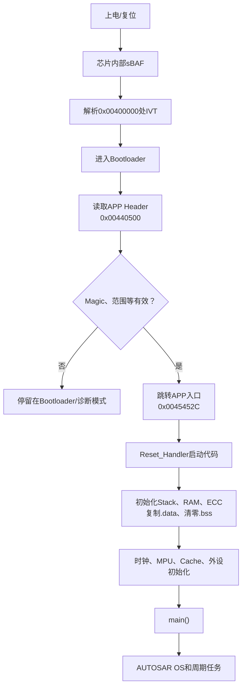

# 集成 SPD 


注意工具生成 Memmap 的时候，需要把 RTE 和 Memmap 一起生成，包括 RTEgen
RTA-RTE - 12.4.0
├─ ☑ RTA-RTE - 12.4.0
└─ ☑ AfterRTEGen

☑ MemMapGen - 12.3.0

- 不要在运行完 `AfterRTEGen` 后，又单独运行一次未勾选 hook 的 `RTA-RTE`；否则 `src/rte/gen` 会被清理，正确修改再次被覆盖。
- `MemMapGen` 与 `RTE_SPINLOCK` 错误没有直接关系；它只应在 RTE 和 `AfterRTEGen` 完成后执行。
- 最终生成不要直接调用裸 `RTEGen.exe`，也不要使用不执行 user hook 的生成入口。
- 若只想修复当前现有文件，也可以只勾选 `AfterRTEGen` 后运行一次，但正式流程建议始终把 `RTA-RTE` 和 `AfterRTEGen` 一起勾选。


<mark style="background: #FF5582A6;">- RAM：以 SPD 的 MBIST 和 eMcem 作为唯一硬件故障源。</mark>

-<mark style="background: #FF5582A6;"> ROM 硬件故障：使用 eMcem。</mark>

- ROM 镜像完整性：暂用分块 CRC。
- 
- NVM 逻辑故障：使用 AUTOSAR NvM 状态。
- 
- 应用层：负责 Dem 映射、锁存、40 次老化和安全关断。
- 
- BE 13/L 2 关断路径：由外部芯片状态和系统级反馈诊断，SPD 无法覆盖。
- 
# Ecu 硬件故障

1、<mark style="background: #FF5582A6;">检测到 L 2 功能安全关断路径失效</mark>   （）
2、TLE 9471 内部故障 （BE 13）以上任一条件满足就要报出 DTC


| 故障位             | 具体含义                                         | 可能影响                                               |
| --------------- | -------------------------------------------- | -------------------------------------------------- |
| `~~IREF_FAIL~~` | Internal Reference Current Failure，内部基准电流源异常 | ADC、比较器、过流/欠压检测等模拟功能的参考可能不再可信                      |
| `CP_FAIL`       | Charge Pump Failure，电荷泵故障                    | 无法产生MOS栅极所需驱动电压，高边驱动、阀或电机功率输出可能失效                  |
| `CLK_FAIL`      | Internal Clock Failure，BE13内部时钟监控异常          | 内部状态机、PWM、看门狗、通信或诊断时序可能不可靠                         |
| ~~FMSG~~        | ~~BE13故障/失效安全消息标志~~                          | 通~~常表示内部监督逻辑产生了失效安全故障汇总或进入异常状态；精确定义需以BE13寄存器手册为准~~ |
| `ALU_OVERFLW`   | BE13内部安全ALU/计算单元溢出或检查异常                      | 内部控制或安全计算结果不可信；这里不是S32K324 Cortex-M7的ALU故障         |
| `LBIST_FAIL`    | Logic Built-In Self-Test Failure，数字逻辑自检失败    | BE13内部数字逻辑、状态机或安全逻辑存在永久性硬件故障                       |
| `ABIST_FAIL`    | Analog Built-In Self-Test Failure，模拟电路自检失败   | 电压监控、基准源、比较器、电荷泵等模拟安全电路自检失败                        |


`~~~~L2_S_BE13SpiTransNum_Cnt_u16_CMP~~~~` 在 BE 13 自检时被改成了 1，但自检结束后没有恢复为 16。
导致寄存器无法回读。


只要注入一次就可以正常报出来故障，没有去抖。


# NvM 故障


局部变量读不到值。

已经定位：不是代码没有局部变量，也不是 DWARF 被删除，而是 TRACE 32 加载 Green Hills ELF 时缺少 `/GHS`。


## NvM_GetErrorStatus 返回 完整性错误

NVM_CFG_FIRST_USED_BLOCK 是否是 NvMConf_NvMBlockDescriptor_NvMBlock_LogisticData？
答：
- Block 0 是 MultiBlock 管理状态；
- Block 1 是 NvM 配置 ID 保留块；
- Block 2 是第一个普通 NvM 数据块。所以这两个其实是一回事。同一个东西。


Block 2 为什么返回完整性错误？
答：

名称：NvMBlock_LogisticData
NvM Block ID：2
长度：128 字节
管理类型：Native
参与 ReadAll：是
ROM 默认 Block：0 个
初始化回调：NULL
NvM 层 CRC：NoCrc

```
NvM启动时必须从Fee读出有效LogisticData
```

```
没有ROM默认值可以恢复
也没有初始化回调生成默认数据
```

```
NvM_Rb_GetErrorInfoDetail
```

| errorDetail | 含义                |
| ----------- | ----------------- |
| `0`         | 没有更多详细信息          |
| `1`         | Fee介质中没有找到有效Block |
| `2`         | 找到了Block，但数据校验错误  |
| `3`         | Block版本不匹配        |
| `4`         | 加解密处理失败           |
| `5`         | Split Block处理失败   |
| `6`         | 回调函数失败            |
| `7`         | 回调超时              |
可以知道 block 具体的错误类型。
现在发现 errorDetail 还是 0 
打开 detail 的 API。


<mark style="background: #FF5582A6;">所有 Block 初始返回 `NVM_REQ_INTEGRITY_FAILED + errorDetail=1`，主要是因为 Fee 中尚未存在这些 Block，而不是硬件损坏。</mark>


# RAM 故障

RAM：以 SPD 的 MBIST 和 eMcem 作为唯一硬件故障源。


## MBIST 的测试（破坏性测试）
MBIST 针对片内 RAM，硬件会执行类似 March Test 的读写序列
写 0 → 读 0/写 1 → 读 1/写 0 → 地址正序/倒序访问

|MBIST index|被测存储资源|
|---|---|
|0|PRAM0 block 1/2|
|1|PRAM1 block 1/2|
|2|DMA TCD RAM|
|3|CM7_0 Cache、Cache Tag、ITCM、DTCM|
|4|CM7_1相关Cache/TCM|
|5|FLEXCAN0～5 Message Buffer RAM|
|6|QSPI RAM、QSPI TX RAM|
|7|EMAC Timestamp RAM|
|8|EMAC RX/TX内部RAM|
|9|HTM/Shared/Core ETF Trace RAM|
|10|HSE Secure RAM、PKC RAM、MTB RAM|

10 个 Mbist 并发执行。

|ALGOSEL位|算法|作用|
|---|---|---|
|bit3|March C+ single|使用March C+读写序列检测RAM故障，默认算法|
|bit13|BasicChk|基础Checkerboard检查|

`0x2008 = bit13 + bit3`，所以两个算法都被选择。


## FCCU 周期性监控


故障注入

| 请求值    | 检测对象        | 注入类型             | 使用EIM | 使用ERM | FCCU行为                                                 |
| ------ | ----------- | ---------------- | ----- | ----- | ------------------------------------------------------ |
| `0x11` | SRAM0/PRAM0 | 单比特可纠正ECC错误 SBE  | 是，CH0 | 是     | 通常不上报NCF2 单比特 ECC 错误属于“可纠正错误”，严重程度通常不足以立即触发 FCCU 安全反应。 |
| `0x12` | SRAM0/PRAM0 | 双比特不可纠正ECC错误 DBE | 是，CH0 | 是     | 上报NCF2，但CPU读取会BusFault                                 |
| `0x21` | PRAM0故障状态   | 模拟PRAM0多比特错误     | 否     | 否     | 软件模拟DCM/FCCU NCF2                                      |
| `0x22` | PRAM1故障状态   | 模拟PRAM1多比特错误     | 否     | 否     | 软件模拟DCM/FCCU NCF2                                      |
注： SRAM 和 PRAM 通常是在不同层面描述同一组片上 RAM。
静态随机存取存储器:全局变量 静态变量 栈 堆 通信缓冲区 故障保留记录

如果注入双比特ECC错误，最终会卡死在一类中断（看门狗很重要）


`0x21/0x22` 软件模拟注入只修改 eMCEM 内部模拟状态，不会置真实 `DCMROD3`，所以现在它们不会触发这个 DTC；只有实际硬件 PRAM 0/PRAM 1 多比特 ECC 状态才会上报。代码中现在把模拟状态报 DTC 也考虑进去了。

故障注入后， 在经历一段时间后，会 reset.确认是内部看门狗复位的。 也是功能性复位。


 ###  FCCU_TIMEOUT_ISR 的触发条件

它处理的不是“故障恢复超时”，而是“FCCU 配置状态超时”。


## 测试流程

```
软件配置STCU2
      ↓
写RUNSW启动
      ↓
芯片停止运行应用软件
      ↓
STCU2先执行MBIST，再执行LBIST
      ↓
测试完成，产生ST_DONE功能复位
      ↓
MCU重新启动
      ↓
软件读取END、STATUS、ERR_STAT
      ↓
决定正常启动、降级运行或再次复位
```

S 32 K 324 没有一个普通的“POR 后自动执行全部 STCU 2 BIST”的硬件触发模式。Reference Manual Chapter 54 描述的受支持流程是 Online BIST：

1. 启动固件配置时钟和 STCU 2；
2. 软件写 `STCU2.RUNSW[RUNSW]=1`；
3. STCU 2 硬件接管并执行 MBIST/LBIST；
4. 测试期间 CPU 应用代码停止运行；
5. 完成后硬件产生 `ST_DONE` 功能复位；
6. 第二次启动时，固件读取保留的测试结果。
7. 
<mark style="background: #FF5582A6;">S 32 K 3 不支持通过 DCD 记录进行 Off-line BIST。只能在运行阶段由软件配置并触发 On-line BIST。</mark>


<mark style="background: #FF5582A6;">注意： 当前启动代码也会在 ST_DONE 复位后清除 `.Magic_Flag`。所以必须要有复位状态限制，不然一直复位了就没办法实现 MPU 的功能了</mark>


# ROM 故障


## LBIST 用伪随机测试向量激励芯片内部逻辑：

伪随机序列发生器
       ↓
芯片内部扫描链/数字逻辑
       ↓
输出结果压缩到 MISR 签名
       ↓
实际 MISR 与 NXP 给定期望值比较.如果签名一致，认为被测逻辑通过；不一致则对应 LBIST 通道失败。
<mark style="background: #FF5582A6;">LBIST 并不等于“所有 CPU 指令都已经测试”。Cortex-M 7 核的运行期结构测试一般还会使用 SCST；你们工程中 `SCST_MODULE_ENABLED` 当前是关闭的。</mark>

S 32 K 324 只有一个 LBIST 分区，即 `LBIST0`。覆盖的主要数字逻辑包括：

- EIM、ERM；
- XRDC；
- CRC；
- FCCU、FOSU；
- PFLASH 控制器；
- PRAM 控制器；
- SWT；
- CMU；
- DMA/HSE/AIPS/QSPI/TCM 等总线 Gasket；
- AXBS、AIPS Lite 等交叉总线逻辑


ROM 硬件故障：使用 eMcem


<mark style="background: #FF5582A6;">ROM 镜像完整性：暂用分块 CRC</mark>
这条需求的主检测手段应该是 **APP CRC 校验**；FCCU 只能作为硬件 Flash 故障的补充监控，不能替代 CRC。


ROM 本身故障应该由这些机制满足

| 机制                  | 能检测什么                   | 能否替代APP CRC  |
| ------------------- | ----------------------- | ------------ |
| EDC                 | 总线传输编码错误                | 不能           |
| XBIC                | Crossbar/互连访问、协议和完整性故障  | 不能           |
| ECC                 | Flash/RAM存储位翻转，尤其不可纠正错误 | 不能完全替代       |
| FMU/PFlash → NCF[3] | Flash控制器、ECC、阵列相关硬件错误   | 不能完全替代       |
| APP CRC             | 整个APP内容是否与发布镜像一致        | 可以满足截图中的明确判据 |
<mark style="background: #FFB86CA6;">现在完全按照他的需求开发， **APP CRC 校验**</mark>


## APP CRC 检验


| 地址           | 字段                     | 当前值/作用                            |
| ------------ | ---------------------- | --------------------------------- |
| `0x00440500` | `u32PresenceFlag`      | Magic Number `0x636F7570`，表示APP存在 |
| `0x00440504` | `u32BlockStartAddress` | APP起始地址 `0x00440000`              |
| `0x00440508` | `u32BlockLength`       | APP区域长度 `0x00240000`              |
| `0x0044050C` | `u32EntryAddress`      | APP入口函数 `_start`                  |
| `0x00440510` | `enTargetType`         | 表示目标类型为APP                        |
| `0x00440514` | `u32Dummy[0]`          | 当前扩展为APP CRC32参考值                 |
| `0x00440518` | `u32Dummy[1]`          | 保留                                |
| `0x0044051C` | `u32Dummy[2]`          | 保留                                |
构建完成
  ↓
计算 0 x 00440520～0 x 0067 FFFF 的 CRC 32
  ↓
写入 ApplBmHdr 的 0 x 00440514（脚本 计算后写入 hex）
  ↓
每次上电 APP 重新计算
  ↓
与 ApplBmHdr 中的参考 CRC 比较

output/hex/D_BIP_S 32 K 3 GHS.hex
              ↓ 原地写入 CRC
output/hex/D_BIP_S 32 K 3 GHS.hex
              ↓ App_Hex_Process.bat
boot/.../APP/ASU_Platform_APP.hex
              ↓ 与 Bootloader、CAL 合并
boot/.../Hex_ReleaseV 1.0/ASU_Platform_AppFblCal.hex


注意： HEX 流程只执行 `Data.LOAD.auto` 烧录，没有加载 ELF 符号我会让它保持“只烧 HEX”，但烧录完成后用匹配的 ELF `/NoCODE` 加载符号，再加载 Watch 布局。需要修改脚本。（<mark style="background: #FFB86CA6;">已修改</mark>）

### 校验的值不匹配


如果稀疏 HEX 未覆盖的地址没有被明确擦除为 `0xFF`，芯片中可能保留旧数据。它们运行期间没有变化，但从烧录完成时就与离线 CRC 假设不同。
CRC 脚本对 HEX 空洞的处理、最终 HEX 实际有多少空洞、以及 TRACE 32 的 `FLASH.ReProgram ALL` 是否会把未出现在 HEX 中的地址擦成 `0xFF`。

结果：
CRC 脚本确实按照 `0xFF` 计算 HEX 中未出现的地址。
当前 TRACE 32 烧录脚本不能保证这些地址会变成 `0xFF`。修改了脚本。

 修改完脚本后，就正常了FLASH.ReProgram 0 x 00400000--0 x 00681 FFF /Erase
(
  Data.LOAD.auto "&HEX_FILE"
)
FLASH.ReProgram OFF


注意：
代码运行期间 **PFlash 内容不会改变**。CPU 执行代码、读取常量以及 CRC 扫描都只是读操作，不会自动改写 PFlash。
比如说这里 `0x00440500` 是 **S 32 K 324 内部 Program Flash（PFlash）中的固定地址**，专门存放应用程序的 Boot Manager Header。


## 关于 S 32 K 324 的内存的一些想法

- <mark style="background: #FF5582A6;">PFlash 不能像 RAM 一样用普通赋值随便修改，但可以通过专门的 Flash 控制器命令擦除和编程。</mark>
- <mark style="background: #FF5582A6;">“擦除完成”后，所选范围通常读为 `0xFF`。</mark>
- <mark style="background: #FFF3A3A6;">“烧录完成”后，绝不是所有 PFlash 都为 `0xFF`：有程序数据的地址是 HEX 内容，空洞才是 `0xFF`。</mark>
-<mark style="background: #FF5582A6;"> CPU 通过内存映射直接从 PFlash 取指令和只读数据；不是先把全部代码复制到 RAM 再执行。</mark>
- 当前工程最终启动路径大致是：sBAF → Bootloader → APP Header → APP `Reset_Handler` → `main()`。


Flash 需要执行专门的硬件流程：

1. 解锁对应 Flash 扇区。
2. 配置需要擦除或编程的地址。
3. 把待写数据装入 Flash 控制器的数据寄存器。
4. 设置编程或擦除模式。
5. 启动内部高压操作。
6. 等待完成并检查错误状态。
7. 重新锁定扇区。


代码运行流程：




|   |   |   |   |   |   |   |   |
|---|---|---|---|---|---|---|---|
       

ITCM|0x00000000–0x0000FFFF  (ITCM_0, 最大64 KB)  <br>0x00000000–0x0000FFFF  (ITCM_1, 最大64 KB)  <br>0x00000000–0x0000FFFF  (ITCM_2, 最大64 KB)  <br>0x00000000–0x0000FFFF  (ITCM_3, 最大64 KB)
|0x00000000–0x0000FFFF|
核私有紧耦合RAM|与每个 Cortex-M7 内核紧耦合的指令存储器，绕过普通系统总线和数据缓存，提供低延迟、确定性的取指访问。|<mark style="background: #FF5582A6;">时间关键代码、中断/异常处理代码、启动代码；是否放置向量表由软件配置决定</mark>。|0x00000000 是各内核自己的本地别名；不同内核看到相同地址，但对应各自的物理 ITCM，不能按共享RAM理解。|


|2|Program Flash|0x00400000–0x0047FFFF  (Program flash (Block 0), 最大512 KB)  <br>0x00400000–0x004FFFFF  (Program flash (Block 0), 最大1024 KB)  <br>0x00400000–0x004FFFFF  (Program flash (PFC1 Block 0), 最大1024 KB)  <br>0x00400000–0x005FFFFF  (Program flash (Block 0), 最大2048 KB)  <br>0x00480000–0x004FFFFF  (Program flash (Block 1), 最大512 KB)  <br>0x00500000–0x005FFFFF  (Program flash (Block 1), 最大1024 KB)  <br>0x00500000–0x005FFFFF  (Program flash (PFC1 Block 1), 最大1024 KB)  <br>0x00600000–0x006FFFFF  (Program flash (Block 2), 最大1024 KB)  <br>0x00600000–0x007FFFFF  (Program flash (Block 1), 最大2048 KB)  <br>0x00600000–0x007FFFFF  (Program flash (PFC0 Block 0), 最大2048 KB)  <br>0x00700000–0x007FFFFF  (Program flash (Block 3), 最大1024 KB)  <br>0x00800000–0x009FFFFF  (Program flash (Block 2), 最大2048 KB)  <br>0x00800000–0x009FFFFF  (Program flash (PFC0 Block 1), 最大2048 KB)  <br>0x00A00000–0x00AFFFFF  (Program flash (PFC1 Block 2), 最大1024 KB)  <br>0x00A00000–0x00BFFFFF  (Program flash (Block 3), 最大2048 KB)  <br>0x00B00000–0x00BFFFFF  (Program flash (PFC1 Block 3), 最大1024 KB)  <br>0x00C00000–0x00DFFFFF  (Program flash (PFC0 Block 2), 最大2048 KB)  <br>0x00E00000–0x00FFFFFF  (Program flash (PFC0 Block 3), 最大2048 KB)|0x00400000–0x00FFFFFF|
片内非易失程序Flash|保存可执行程序和只读常量，支持从片内 Flash 取指执行；按器件容量和 PFC 控制器划分为多个物理块。|Bootloader、APP代码、常量、标定默认值、链接器只读段。|不同型号的块大小和块数不同；HSE、sBAF、Boot Header 等区域可能被器件或项目保留，不能仅按总容量全部分配。|


|3|Data Flash|0x10000000–0x1003FFFF  (Data flash (Block 2), 最大256 KB)  <br>0x10000000–0x1003FFFF  (Data flash (Block 4), 最大256 KB)  <br>0x10000000–0x1003FFFF  (Data flash (PFC0 Block 3), 最大256 KB)|0x10000000–0x1003FFFF|
片内非易失数据Flash|用于断电保持的数据存储，与 Program Flash 分开编程/擦除管理。|配置参数、学习值、故障记录、NVM/EEPROM仿真数据。|必须遵守 Flash 擦写粒度、对齐、寿命和执行期间访问限制；实际可用范围取决于具体型号及安全配置。|

|4|ITCM Backdoor|0x11000000–0x1100FFFF  (ITCM_0 Backdoor, 最大64 KB)  <br>0x11400000–0x1140FFFF  (ITCM_1 Backdoor, 最大64 KB)  <br>0x11800000–0x1180FFFF  (ITCM_2 Backdoor, 最大64 KB)  <br>0x11C00000–0x11C0FFFF  (ITCM_3 Backdoor, 最大64 KB)|0x11000000–0x11C0FFFF|ITCM
<mark style="background: #FF5582A6;">系统总线后门别名|通过系统总线访问某个内核的 ITCM，使调试器、DMA或其他总线主设备能够初始化、读取或诊断 TCM。|启动装载、跨核初始化、调试、受支持的DMA/系统主设备访问。|这是同一块物理 ITCM 的别名，不增加RAM容量；并发访问、权限和可见性需要按 XRDC/MPU/平台配置确认。|</mark>


|5|UTEST|0x1B000000–0x1B001FFF  (UTEST (Block 0), 最大8 KB)  <br>0x1B000000–0x1B001FFF  (UTEST (PFC0 Block 0), 最大8 KB)|0x1B000000–0x1B001FFF|专用测试/配置Flash|特殊用途的非易失区域，用于器件测试和设备配置类信息，而不是普通应用代码或通用数据存储。|DCF/设备配置、测试或生命周期相关数据（具体可编程字段以参考手册为准）。|误写可能影响启动、安全或器件配置；只能按 NXP 参考手册规定的流程和字段使用。|


|6|DTCM|0x20000000–0x2001FFFF  (DTCM_0, 最大128 KB)  <br>0x20000000–0x2001FFFF  (DTCM_1, 最大128 KB)  <br>0x20000000–0x2001FFFF  (DTCM_2, 最大128 KB)  <br>0x20000000–0x2001FFFF  (DTCM_3, 最大128 KB)|0x20000000–0x2001FFFF|核私有紧耦合RAM|与每个 Cortex-M7 内核紧耦合的数据存储器，提供低延迟、确定性的数据访问。|任务/中断栈、时间关键变量、控制算法状态、频繁访问的小型数据。|0x20000000 是各内核自己的本地别名；相同地址在不同内核上对应不同物理 DTCM，通常不用于核间共享。|
|7|SRAM|0x20400000–0x20427FFF  (SRAM0, 最大160 KB)  <br>0x20400000–0x2043FFFF  (SRAM0, 最大256 KB)  <br>0x20400000–0x2047FFFF  (SRAM0, 最大512 KB)  <br>0x20428000–0x2044FFFF  (SRAM1, 最大160 KB)  <br>0x20440000–0x2047FFFF  (SRAM1, 最大256 KB)  <br>0x20480000–0x204BFFFF  (SRAM2, 最大256 KB)  <br>0x20480000–0x204FFFFF  (SRAM1, 最大512 KB)  <br>0x20500000–0x2057FFFF  (SRAM2, 最大512 KB)  <br>
0x20580000–0x205DFFFF  (SRAM3, 最大384 KB)|0x20400000–0x205DFFFF|片内系统共享RAM|通过系统互连访问的通用易失性存储器，可供CPU内核、DMA和外设主设备使用。|全局变量、堆、共享缓冲区、核间通信、DMA缓冲区、可缓存/不可缓存分区。|原表给出复位时 non-cacheable；软件可再通过 MPU/Cache 属性划分。DMA共享区要处理缓存一致性、对齐和访问权限。|
|8|DTCM Backdoor|0x21000000–0x2101FFFF  (DTCM_0 Backdoor, 最大128 KB)  <br>0x21400000–0x2141FFFF  (DTCM_1 Backdoor, 最大128 KB)  <br>0x21800000–0x2181FFFF  (DTCM_2 Backdoor, 最大128 KB)  <br>0x21C00000–0x21C1FFFF  (DTCM_3 Backdoor, 最大128 KB)|0x21000000–0x21C1FFFF|DTCM系统总线后门别名|通过系统总线访问某个内核的 DTCM，便于调试器、DMA或其他系统主设备访问核私有数据。|启动初始化、调试、内存检查、受支持的DMA/跨核访问。|这是同一块物理 DTCM 的别名，不增加RAM容量；不要把本地地址和后门地址重复计入总RAM。|
|9|AIPS|0x40000000–0x401FFFFF  (AIPS0, 最大2048 KB)  <br>0x40200000–0x403FFFFF  (AIPS1, 最大2048 KB)  <br>0x40400000–0x405FFFFF  (AIPS2, 最大2048 KB)|0x40000000–0x405FFFFF|存储器映射外设寄存器窗口|承载片上外设的控制、状态和数据寄存器地址空间，CPU通过普通读写指令访问外设。|GPIO、时钟、定时器、ADC、CAN、DMA、安全和系统控制等外设寄存器访问；具体子地址见 Peripherals 页/参考手册。|不是RAM，禁止当作连续存储区读写；保留地址和寄存器访问宽度必须遵循外设章节，权限可能受 AIPS/XRDC 保护。|
|10|AES Accelerator|0x44000000–0x440003FF  (AES_ACCEL, 最大1 KB)|0x44000000–0x440003FF|AES硬件加速器寄存器窗口|提供硬件 AES 密码运算相关的控制、状态、密钥/数据接口。|硬件加速的加密、解密或相关安全流程；仅原表标明支持该窗口的型号适用。|不是通用内存；密钥管理、访问权限和安全生命周期限制应按安全子系统文档执行。|
|11|QuadSPI Rx Buffer|0x67000000–0x670003FF  (QuadSPI Rx buffer, 最大1 KB)|0x67000000–0x670003FF|QuadSPI接收缓冲区窗口|映射 QuadSPI 接收缓冲区，供软件读取串行接口接收的数据。|间接读、命令传输或调试 QuadSPI 数据通路。|不是外部Flash容量本身；其内容和有效性取决于 QuadSPI 控制器配置及传输状态。|
|12|QuadSPI AHB|0x68000000–0x6FFFFFFF  (QuadSPI AHB  (virtual code & data), 最大131072 KB)|0x68000000–0x6FFFFFFF|外部串行存储器的AHB映射窗口|把外部 QuadSPI/串行 Flash 映射到CPU地址空间，可作为虚拟代码和数据窗口进行内存映射读取。|外部Flash XIP、只读资源、查表数据和大容量固件/资源访问。|128MB是地址窗口，不代表板上实际Flash容量；可用范围、写入方式、缓存和时序取决于外部器件及控制器配置。|
|13|PPB|0xE0000000–0xE00FFFFF  (Private Peripheral Bus, 最大1024 KB)|0xE0000000–0xE00FFFFF|Cortex-M7内核私有外设总线窗口|Arm 内核系统控制与调试组件的架构地址空间。|NVIC、SysTick、SCB、MPU、Cache维护、DWT/ITM及其他内核调试/系统控制组件。|不是RAM；部分寄存器仅特权级或调试状态可访问，不同内核各自拥有其私有实例。|