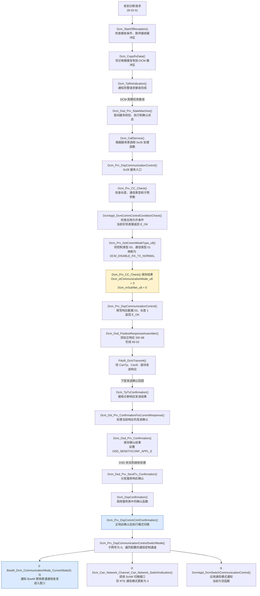
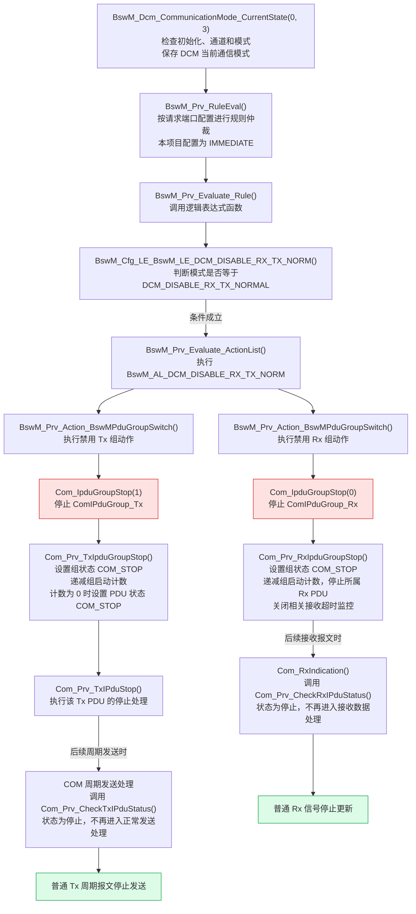
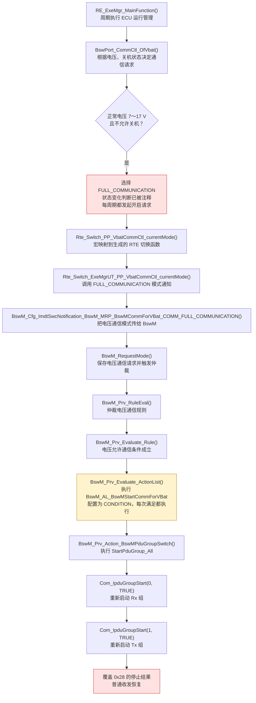

<!-- tcc:task-summary:start -->
## 当前任务

| 属性 | 内容 |
| --- | --- |
| 任务 | [[task_outline/工作任务.md#^tcc-c4b667b4-7ba6-4b8b-a537-77b3efa0c926\|28 服务失能问题排查]] |
| 状态 | 进行中 |
| 优先级 | 普通 |
| 开始 / 截止 | 2026-09-23 / 2026-09-24 |
| 下一步 | 未设置 |
| 子任务完成 | 0/0 |

### 当前子任务

暂无子任务
<!-- tcc:task-summary:end -->

## 本次记录

**目标**  

28 服务好像没有工作起来，还是可以正常的收发报文。

Dcm_Prv_DspCommunicationControl()
  → Dcm_Prv_CC_Check()
      → 检查请求长度
      → 检查 communicationType
      → DcmAppl_DcmCommControlConditionCheck()
      → Dcm_Prv_GetCommModeType_u 8()
      → 保存通信模式和子网号

## **实施过程**

<mark style="background: #FF5582A6;">收到完整请求后，DCM 周期任务驱动 DSL/DSD 状态机，检查服务、会话、子功能等条件，然后分发服务</mark>
CAN 驱动
  → CanIf
  → PduR / CanTp：处理诊断传输协议
  → PduR
  → Dcm_StartOfReception()
  → Dcm_CopyRxData()
  → Dcm_TpRxIndication()
➡
<mark style="background: #FF5582A6;">DSD 根据 SID `0x28` 找到处理函数</mark>
Dcm_Prv_DspCommunicationControl()
  → Dcm_Prv_CC_Check()
      → 检查请求长度
      → 检查 communicationType
      → DcmAppl_DcmCommControlConditionCheck()
      → Dcm_Prv_GetCommModeType_u 8()
      → 保存通信模式和子网号

➡
Dcm_Prv_DspCommunicationControl
Dcm_Prv_CC_Check （**此时仅保存了“准备切换到哪个模式”，尚未停止 COM 报文组。**）
<mark style="background: #FF5582A6;">等待报文响应。</mark>

➡
Dcm_Dsd_Main
Dcm_Dsd_State_Verification
Dcm_Dsd_Prv_StateMachine
Dcm_Dsd_EvaluateServiceResult
Dcm_Dsd_Prv_AssembleResponse
<mark style="background: #FF5582A6;">（到 `68 03` 只能说明请求已被接受并产生正响应，不能证明报文组之后一直保持停止状态。</mark>）

➡
<mark style="background: #FF5582A6;">响应确认后，才执行通信模式切换</mark>
Dcm_TpTxConfirmation  将 DSD 状态置为 DSD_SENDTXCONF_APPL_E

（注意：这份代码对正响应发送成功、正响应发送失败两种确认都会执行切换。）

➡➡➡
<mark style="background: #FF5582A6;">通知 BswM、更新 RTE 模式、调用应用回调</mark>

配置表记录“通知哪个通道，以及调用哪些函数”

|字段名|保存的内容|用途|
|---|---|---|
|`switch_fp`|`...SwitchIndication` 的函数地址|更新 RTE 通信模式|
|`checkmode_fp`|`...IsModeDefault` 的函数地址|检查是否处于默认通信模式，本次切换不调用它|
|`AllComMChannelId`|宏展开后为 `0`|指定要通知的通信通道|
/* 第一件事：通知 BswM */
BswM_Dcm_CommunicationMode_CurrentState(0, 3);

/* 第二件事：通知 RTE */
Dcm_Can_Network_Channel_Can_Network_SwitchIndication(3);

/* 第三件事：通知应用 */
DcmAppl_DcmSwitchCommunicationControl(0, 3);

BswM 路径负责执行停止动作

# 配置流程

## DCM：接收请求 → 解析参数 → 回复 → 通知通信模式切换

## BswM → COM：真正停止收发报文组
 

## 当前问题路径：电压控制又把报文组开启

****

# 问题确认

 Rte_Switch_PP_VbatCommCtl_currentMode(commCtlCmd[lastCtlStep]);
 **发出“切换通信模式”的通知。** 你这里反复传入开启模式，就会反复触发后面的报文组启动动作。
 