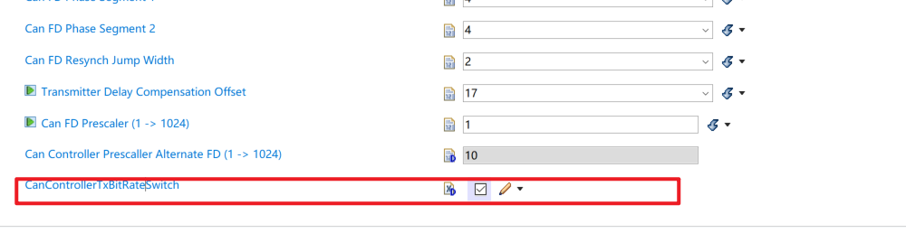
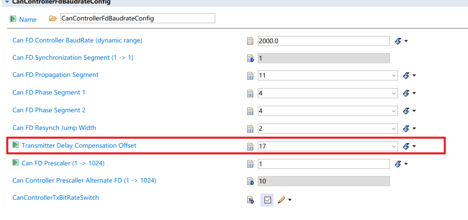
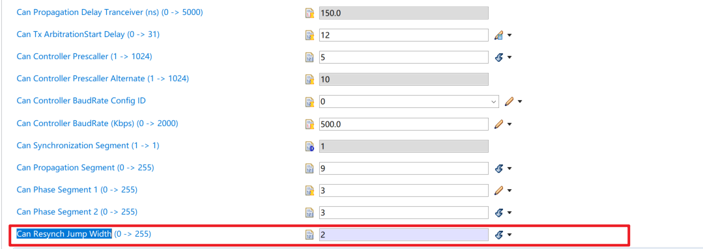
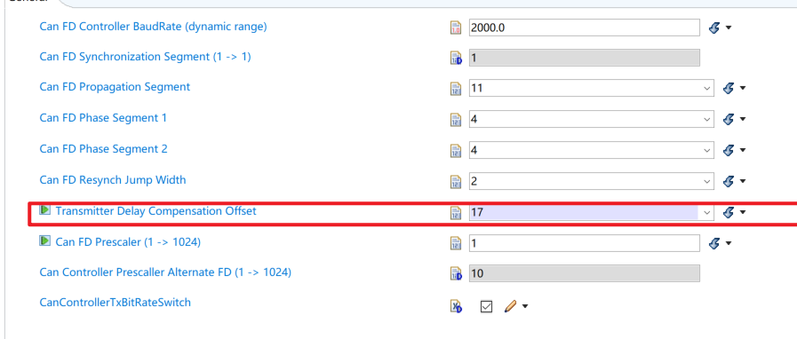

# Tq :
**FlexCAN bit timing 的基本公式可以先记成：**
**CAN bitrate = FlexCAN_PE_CLK / Prescaler / (1 + PropSeg + PhaseSeg1 + PhaseSeg2)**

**Sample Point = (1 + PropSeg + PhaseSeg1) / (1 + PropSeg + PhaseSeg1 + PhaseSeg2)**
**其中**


# BRS的作用是什么？



`BRS` 全称是 **Bit Rate Switch**，只用于 **CAN FD**。

它的作用是：

> **允许 CAN FD 报文在仲裁完成后，把数据段切到更高的波特率发送。**

例如你当前工程的 CAN1：

```text
Nominal phase / 仲裁段：500 kbit/s
Data phase / 数据段：2 Mbit/s
BRS = true
```

**开启 BRS 后，一帧 CAN FD 大概是这样：**

```text
SOF、ID、仲裁相关位       500 kbit/s
BRS 之后的数据段          2 Mbit/s
CRC 相关高速部分          2 Mbit/s
ACK、EOF 等再回到 nominal
```

好处：
**仲裁阶段低速，保证多节点仲裁可靠**
**数据阶段高速，提高 payload 传输效率**

**如果 `BRS = false`：**
**整帧 CAN FD 都用 nominal bitrate**
**比如全程 500 kbit/s**


它仍然可以是 CAN FD 帧，也仍然可以发超过 8 字节的数据，但不会切高速。

注意几点：

1. 只有 CAN FD 才有 BRS，Classic CAN 没有。
2. 总线上所有参与该 CAN FD 报文通信的节点都要支持对应的 data bitrate。
3. CAN 分析仪也要配置成 CAN FD + BRS，否则可能看到错误帧。
4. BRS 开启后更容易暴露物理层问题，比如线束、终端电阻、收发器能力、TDC 配置不合适。

一句话记忆：

> **`BRS` 是 CAN FD 的“数据段加速开关”。仲裁段慢慢抢总线，抢赢以后数据段高速发。**


# ==什么是仲裁段和数据段==

在一帧 CAN/CAN FD 报文里，可以粗略分成两类时间区域：

```text
仲裁段：决定“谁有资格继续发”
数据段：真正搬运 payload 数据
```

**仲裁段**就是多个节点可能同时开始发送时，用来抢总线优先级的部分。CAN 总线是“显性 0 压过隐性 1”，所以节点一边发一边读总线。如果自己发的是 1，但读到总线是 0，就说明有更高优先级的帧在发，自己退出仲裁。仲裁主要看 CAN ID，ID 数值越小，优先级越高。

仲裁段里通常包括：

```text
SOF
CAN ID
RTR / IDE 等控制位的一部分
```

**数据段**就是仲裁赢了的那个节点继续发送真正的数据内容，也就是 payload：

```text
DLC
Data bytes
CRC 相关部分
```

对 **Classic CAN** 来说，仲裁段和数据段速度一样，例如整帧都是 500 kbit/s。

对 **CAN FD + BRS** 来说，速度会切换：

```text
仲裁段：Nominal bitrate，例如 500 kbit/s
数据段：Data bitrate，例如 2 Mbit/s
```

**为什么 CAN FD 不能一开始就全程高速？因为仲裁时可能多个节点同时发，必须保证全网节点都能可靠同步、比较电平、退出仲裁，所以仲裁段通常保持较低速率。等仲裁结束后，只剩一个节点在发，就可以切到更高的数据段速率来提高吞吐量。**

# CAN和CANFD的位时序分解是一样的吗？

基本分解思想是一样的，但 **CAN FD 有两套位时序**。

你图里这种分解：

```text
1 bit = SS + PTS + PBS1 + PBS2
      = SyncSeg + PropSeg + PhaseSeg1 + PhaseSeg2
```

这个对 **Classic CAN** 和 **CAN FD** 都成立。

区别在这里：

| 类型            | 位时序数量 | 说明                                               |
| ------------- | ----: | ------------------------------------------------ |
| Classic CAN   |   1 套 | 全帧都用同一个 bit timing                               |
| CAN FD 不开 BRS |   1 套 | 虽然是 FD 帧，但不切高速，整帧仍用 nominal bit timing           |
| CAN FD 开 BRS  |   2 套 | **仲裁段用 nominal bit timing，数据段用 data bit timing** |

CAN FD 开 BRS 时可以理解成：

```text
仲裁段 / 控制段前部：
    Nominal bit timing
    例如 500 kbit/s

数据段 / CRC 相关高速部分：
    Data bit timing
    例如 2 Mbit/s
```

每一套内部仍然这样分：

```text
SyncSeg + PropSeg + PhaseSeg1 + PhaseSeg2
```

只是两套参数不同：

```text
Nominal phase:
    Prescaler_N
    PropSeg_N
    Seg1_N
    Seg2_N
    SJW_N

Data phase:
    Prescaler_D
    PropSeg_D
    Seg1_D
    Seg2_D
    SJW_D
```

结合你当前工程的 CAN1：

```text
Nominal phase:
40 MHz / 5 / (1 + 9 + 3 + 3)
= 500 kbit/s

Data phase:
40 MHz / 1 / (1 + 11 + 4 + 4)
= 2 Mbit/s
```

所以一句话：

> **CAN 和 CAN FD 的位时序分解形式一样，都是 SyncSeg + PropSeg + PhaseSeg1 + PhaseSeg2；但 CAN FD 如果开启 BRS，会有 nominal phase 和 data phase 两套位时序。**

另外 CAN FD 数据段速度高，通常还会用 `TDC`，也就是 Transceiver Delay Compensation，补偿收发器延迟。Classic CAN 一般不需要这么关注这个。


# TDC是怎么补偿的？

1. ==**高速 data phase 下，CAN transceiver 和 PCB 线路延迟会让采样点偏移。**
2. **==TDC 用 Secondary Sample Point 补偿 transmitter delay。**
3. **==EB 里的 `CanControllerSspOffset = 17` 最终生成到 baudrate 配置里。**
4. ==**如果 FD 2 Mbit/s 只在某些节点上不稳定，除了波特率，还要重点查 TDC、transceiver FD 能力、线束长度、终端电阻==**
`TDC` 全称是 **Transceiver Delay Compensation**，也叫收发器延迟补偿。

它补偿的不是总线本身，而是 **发送节点从 TXD 发出去，到自己 RXD 看到这个变化之间的延迟**。

可以这样理解：

```text
MCU FlexCAN_TX
    |
    v
CAN Transceiver
    |
    v
CANH/CANL 总线
    |
    v
CAN Transceiver 回读
    |
    v
MCU FlexCAN_RX
```

这一路会有延迟，叫 loop delay / transceiver delay。

## 1. 为什么 CAN FD 需要 TDC

Classic CAN 速度低，比如 500 kbit/s：

```text
1 bit = 2 us
```

收发器延迟假设 100 ns 到 200 ns，占比不大。

但 CAN FD data phase 可能是 2 Mbit/s、5 Mbit/s：

```text
2 Mbit/s: 1 bit = 500 ns
5 Mbit/s: 1 bit = 200 ns
```

这时 100 ns 的收发器延迟就很明显了。

如果发送节点还是按普通 sample point 去检查自己发出去的 bit，可能会出现：

```text
我已经切到下一个 bit 了
但 RXD 回读的还是上一个 bit
```

于是控制器误以为发生 bit error。

## 2. TDC 怎么补偿

TDC 的核心动作是：

> **在 CAN FD 数据段里，发送节点不用普通采样点检查自己的回读信号，而是使用一个延后的 Secondary Sample Point，也就是 SSP。**

普通情况：

```text
bit start
   |
   |------ normal sample point
   |
bit end
```

开启 TDC 后：

```text
bit start
   |
   |------ normal sample point
   |
   |------------- secondary sample point, SSP
   |
bit end
```

SSP 会考虑 TXD 到 RXD 的回环延迟。

更形象一点：

```text
TXD 边沿：  |________________
             t0

RXD 边沿：       |___________
                 t0 + transceiver delay

普通采样点：   ^   可能太早
TDC/SSP：          ^   延后采样，避开收发器延迟
```

## 3. FlexCAN 里面相关字段

在 S32K324 FlexCAN 里，TDC 主要和 `FDCTRL` 有关：

| 字段 | 作用 |
|---|---|
| `TDCEN` | 使能 Transceiver Delay Compensation |
| `TDCOFF` | TDC offset，决定 SSP 的位置 |
| `TDCVAL` | 控制器测得或使用的 delay value |

在 EB 里通常对应：

```text
CanControllerSspOffset
Transceiver Delay Compensation Enable
```

你当前工程 CAN1 是：

```text
CAN FD enabled = true
BRS = true
Data phase = 2 Mbit/s
TDC enabled = true
SspOffset = 17
```

也就是说，CAN1 在 FD 高速数据段会用 TDC 来调整发送节点的回读采样点。

## 4. TDC 不是改变总线波形

这个点很重要：
**TDC 不会让 CANH/CANL 变快**
**TDC 不会修复终端电阻、线束、收发器能力问题**
**TDC 只是调整发送节点内部的回读采样点**


接收节点仍然按自己的 data phase bit timing 采样。

## 5. 调试时怎么看

如果 CAN FD 仲裁段正常，但一到数据段就错误，重点查：

```text
BRS 是否两端一致
Data bitrate 是否一致
TDC 是否开启
TDC offset 是否合适
Transceiver 是否支持该 FD 速率
线束长度和终端电阻是否合理
CAN 分析仪是否配置 CAN FD + BRS
```

一句话记忆：

> **==`TDC` 是 CAN FD 高速数据段里，发送节点为了补偿 TXD 到 RXD 回读延迟而引入的“延后采样点”。==**


# JUMP WIDTH是什么？


**在重新同步的时候，PBS1 和 PBS2 中增加或减少的这段时间长度被定义为“重新同步补偿宽度SJW* (reSynchronization Jump Width)”。一般来说 CAN 控制器会限定 SJW 的最大值，如限定了最大 SJW=3Tq 时，单次同步调整的时候不能增加或减少超过 3Tq 的时间长度，若有需要，控制器会通过多次小幅度调整来实现同步。当控制器设置的 SJW 极限值较大时，可以吸收的误差加大，但通讯的速度会下降**


# 第二采样点的时刻是怎么确定的？

17代表的是**以时间量子（Time Quantum, Tq）为单位的额外补偿偏移量**。

