# BE13 / SC900719 制动芯片学习笔记

> 目标芯片：NXP SC900719，工程中常称 BE13  
> 数据手册：`C:/Users/nvtc140/Zotero/storage/JYG22VSP/BE13-SC900719 2022Q1.pdf`，Document Number `SC900719`，Rev. 7.0，2021-07  
> 当前工程：`E:/github/ECAS_RTA_S32K324GHS_Heating`  
> 生成目录：`E:/github/BE13_SC900719_StudyNotes`

这份笔记按“芯片功能 -> SPI 寄存器 -> EB/工程配置 -> 当前 CDD 驱动 -> 诊断调试”的顺序写。BE13 不是 S32K324 片上外设，也不是 AUTOSAR 标准 MCAL 模块。它是一颗 ESC/ESP 制动系统用的外部混合信号芯片，MCU 通过 32-bit SPI 控制它的电源、阀、泵、CAN、轮速、ADC、看门狗和自检功能。因此学习时不要只看某一个 `Cfg.h`，要把数据手册、SPI 配置、CDD 寄存器配置、DEM/RTE 调用关系一起看。

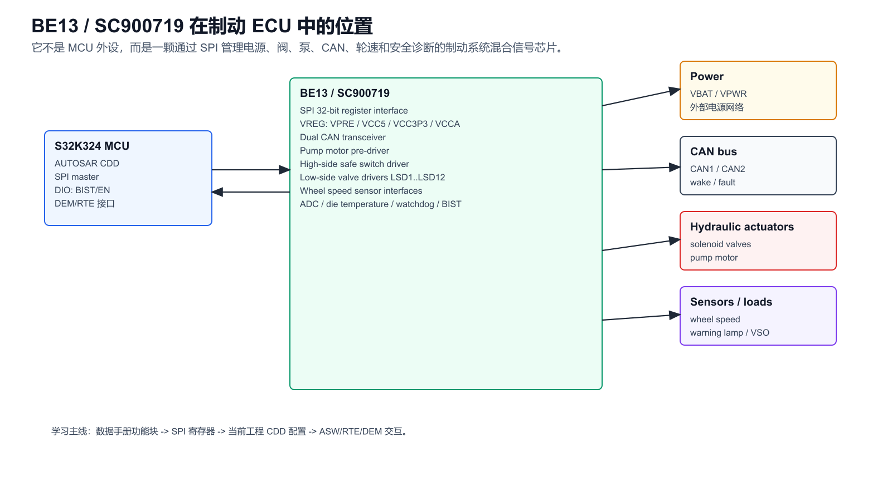

## 1. 数据手册章节地图

| PDF 页 | 章节 | 学习重点 |
|---:|---|---|
| 1 | 封面和应用图 | 芯片定位、典型 ESC/ABS 应用、主要外部连接 |
| 4 | Internal block diagram | 内部功能块总览 |
| 5-8 | Pin connections | 100-pin LQFP 引脚、SPI、阀、泵、CAN、轮速、电源引脚 |
| 15-19 | General description | 功能描述、特性、Sleep/Nominal/Safe 模式 |
| 30-41 | Regulators / oscillator / supervision | IREF、14 MHz 时钟、charge pump、VPRE/VCCA/VCC5/VCC3P3 |
| 42-44 | Dual CAN interfaces | 双 CAN 收发器、唤醒、故障保护 |
| 45-51 | Pump motor pre-driver | 泵电机预驱、16 kHz PWM、过流/过温/load dump |
| 52-53 | High-side pre-driver | 阀安全开关高边预驱 |
| 54-63 | Low-side switches | 4 路数字阀、8 路电流调节阀、PWM、PI 电流调节 |
| 64-73 | Wheel speed sensor | 4 路轮速传感器供电和信号调理 |
| 74-76 | VSO / WLD / K-line | 车速输出、报警灯预驱、K-line/第二 VSO |
| 77-81 | ADC | 10-bit ADC、内部电源和 die temperature 读取 |
| 82-86 | 32-bit SPI / watchdog / CRC | 固定 32-bit 帧、CRC、challenge watchdog |
| 87-123 | Register mapping | 0x00 到 0x49 的完整寄存器表 |
| 124-125 | SPI fault reporting / reset | Level 1/2 fault、清故障、复位条件 |
| 126 | Built-in self test | LBIST、ABIST、BIST 引脚监控 |
| 127-130 | Typical applications | 典型 ESC 应用原理图 |

如果只为工程调试，建议优先读：页 15-19、45-60、82-89、124-126，再结合工程里的 `CDD/L2_Cdd_BE13`。

## 2. 一句话理解 BE13

BE13 把制动 ECU 里一堆本来需要分立器件完成的模拟/功率/安全功能集成在一起：

- 给 MCU 和外部器件供电：VPRE、VCCA、VCC5、VCC3P3、VCC5_EXT、CAN supply。
- 控制执行器：12 路阀控制，包含 4 路数字阀和 8 路电流调节阀。
- 控制泵电机：半桥预驱，支持主动续流，PWM 最高到 16 kHz。
- 控制阀安全开关：高边 safe FET pre-driver。
- 接收传感器和总线：4 路轮速传感器、双 CAN、K-line/VSO、warning lamp。
- 做安全监控：电源欠压/过压、过温、开路/短路、SPI CRC、watchdog、LBIST/ABIST。

工程里 S32K324 的角色是 SPI master。BE13 负责功率和模拟世界，S32K324 负责策略、调度、诊断上报和安全动作。

## 3. 内部模块总览

数据手册页 4 和页 15 的框图可以按下面的方式记：


| 模块 | 数据手册功能 | 工程关注点 |
|---|---|---|
| Power / regulators | VPRE、VCCA、VCC5、VCC3P3、VCC5_EXT、CAN 5 V | 上电顺序、欠压/过压、`VREG_FLG`、ADC 电压读数 |
| SPI | 固定 32-bit、8-bit CRC、最多 10 MHz | `SpiChannel_BE13` 32-bit EB buffer，CRC 表，地址轮询 |
| Watchdog | challenge / timeout sequence | `WDSEED/WDMR/WDAR`，LFSR 和 ALU checker |
| Pump motor | 高边/低边预驱、PWM、load dump、过流/过温 | `PMDCLK`、`PMDCFG`、`PMD_F`、`VLV_PMDF` |
| HSD safe switch | 阀保护高边预驱 | `HSDCFG`、`VLVEN`、HSD fault bits |
| Low-side valves | 4 路数字阀，8 路电流调节阀 | `LSDxDC`、`LSDxI`、Kp/Ki、阀映射 |
| Wheel speed | 4 路轮速供电和信号调理 | `WSCFG1/2`、`WS_COUNT`、`WSS12FLT/WSS34FLT` |
| CAN | 双高速 CAN 收发器 | `CAN_CFG`、`CAN_FLG`、CAN wake/fault |
| ADC | 10-bit ADC，内部电源和温度 | `AD_*`、`AD_DIETMP`、温度换算和阈值 |
| BIST | LBIST/ABIST | `SVCFG_BIST`、`BIST` DIO、`ABISTFAIL/STUCKAT` |

## 4. 工作模式和安全思路

数据手册定义了 Sleep、Nominal、Safe 三类模式。Sleep 只保留唤醒相关功能，Nominal 是正常工作态，Safe 是监督故障后的受限安全状态，例如关闭 safe HS MOSFET。

理解 BE13 的安全逻辑要抓住三点：

1. 关键故障不是只在某个独立寄存器里出现，而是会先汇总到 `INT1` 这种 Level 1 中断寄存器，再到 Level 2 详细故障寄存器。
2. Level 2 故障大多需要写 1 清除。工程初始化时会写 `INT1`、`LSDxF`、`VLV_PMDF`、`SVFLT`、`VREG_FLG` 等清故障。
3. Watchdog、LBIST、ABIST、SPI CRC 都属于通信和芯片自身完整性检查，不是普通的外设状态位。

## 5. SPI 接口

BE13 的 SPI 是固定 32-bit 帧。手册页 82 说明一个命令必须有 32 个 SCLK，页 86 说明 CRC 和字段映射。工程里 `SpiChannel_BE13` 也配置成了 32-bit 数据宽度。

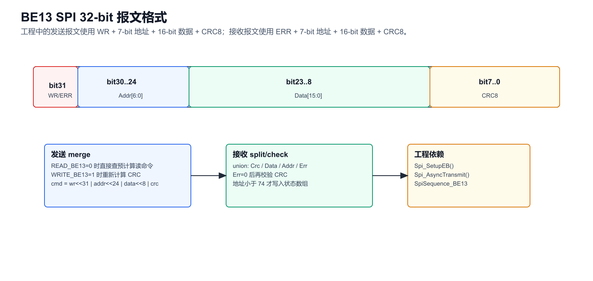

### 5.1 报文字段

| 位段 | MOSI 发送 | MISO 接收 | 工程 union 字段 |
|---|---|---|---|
| bit31 | `R/W`，0 读，1 写 | `Err`，上一帧错误标志 | `Err` |
| bit30..24 | 7-bit address | 7-bit address | `Addr` |
| bit23..8 | 16-bit data | 16-bit data | `Data` |
| bit7..0 | CRC8 | CRC8 | `Crc` |

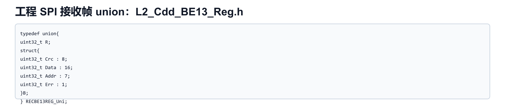

### 5.2 CRC

数据手册页 86 的 CRC 规则是：CRC 长度 8 bit，覆盖 bit31..8，然后作为 bit7..0 附加到 32-bit 帧末尾。工程里使用查表法：

- `CddBE13_L2_CalcCrc(uint8_t *ptr)`：seed 为 `0x42`，输入 3 个字节。
- `CddBE13_L2_MsgMerge()`：写命令时按 `wr/address/data` 重新算 CRC。
- `CddBE13_L2_CalcMsgCrc()`：接收时用 `Err/Addr/Data` 重算 CRC，和 `reg.B.Crc` 比较。

读命令在工程里预先存在 `t_S_BE13ReadCmd_Uls_u32_CMP[]`，所以 `READ_BE13` 时直接查表；写命令才动态合成。

### 5.3 EB SPI 配置

BE13 依赖 EB tresos 的 `Spi` 模块配置，不是 CDD 自己 bit-bang。

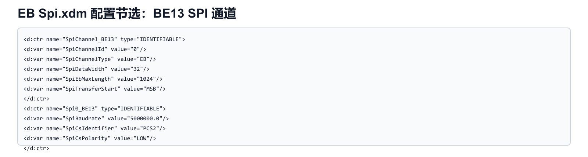

当前工程关键配置：

| 配置项 | 当前值 | 说明 |
|---|---|---|
| `SpiChannel_BE13` | channel id 0 | 工程宏 `SpiConf_SpiChannel_SpiChannel_BE13` |
| `SpiChannelType` | `EB` | 使用 external buffer，CDD 提供 tx/rx buffer |
| `SpiDataWidth` | 32 | 对应 BE13 固定 32-bit 帧 |
| `SpiTransferStart` | MSB | 对应手册 bit31 先传 |
| `Spi0_BE13` baudrate | 5 MHz 配置值 | 手册最大 10 MHz，生成代码需再看实际分频 |
| `SpiCsIdentifier` | PCS2 | 片选由外设引擎控制 |
| `SpiCsPolarity` | LOW | BE13 `CSB` 低有效 |
| `SpiSequence_BE13` | sequence id 0 | CDD 调 `Spi_AsyncTransmit()` |

生成后的 LPSPI 参数：

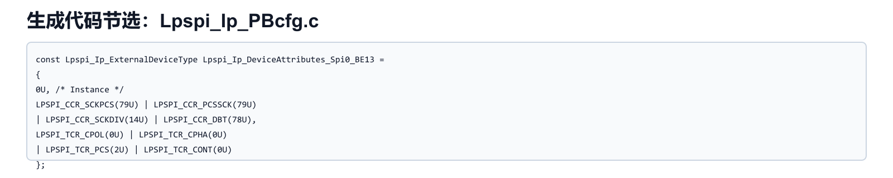

工程调用在 `CddBE13_L2_SpiTrans()`：

- `Spi_SetupEB(SpiConf_SpiChannel_SpiChannel_BE13, tx, rx, L2_S_BE13SpiTransNum_Cnt_u16_CMP << 2)`
- 等待 `SpiConf_SpiSequence_SpiSequence_BE13` 上一次结果为 `SPI_SEQ_OK`
- `Spi_AsyncTransmit(SpiConf_SpiSequence_SpiSequence_BE13)`

这里长度用 `<<2`，因为 buffer 是 `uint32_t`，SPI EB length 按 `Spi_DataBufferType` 字节/单元语义使用。调试时要确认 MCAL 对 EB length 的解释和生成代码一致。

## 6. 寄存器地图

工程里 `d_S_MAXBE13REG_Cnt_u8_CMP = 74`，正好覆盖 `0x00..0x49`。

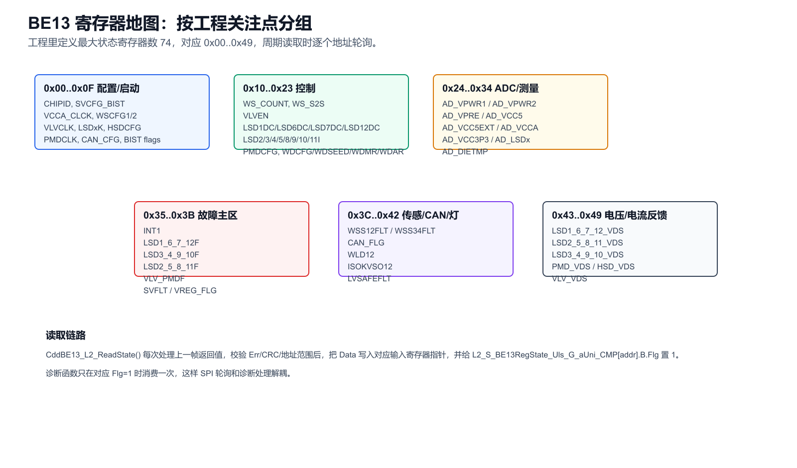

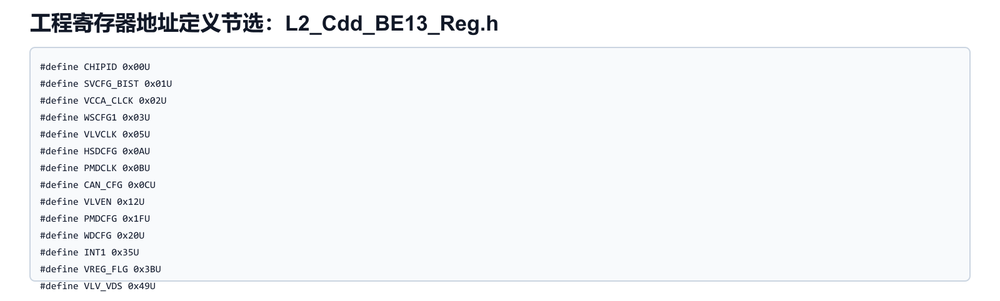

建议按功能分组记：

| 地址范围 | 主要寄存器 | 作用 |
|---|---|---|
| `0x00..0x0F` | `CHIPID`、`SVCFG_BIST`、`VCCA_CLCK`、`WSCFG1/2`、`VLVCLK`、`LSDxK`、`HSDCFG`、`PMDCLK`、`CAN_CFG`、`ABIST_*` | 芯片信息、监督/BIST、电源/阀/泵/CAN 基础配置 |
| `0x10..0x23` | `WS_COUNT`、`WS_S2S`、`VLVEN`、`LSDxDC`、`LSDxI`、`PMDCFG`、`WDCFG`、`WDSEED/WDMR/WDAR` | 轮速、阀使能、阀控制、泵控制、watchdog |
| `0x24..0x34` | `ADINx`、`AD_VPWRx`、`AD_VPRE`、`AD_VCCx`、`AD_LSDx`、`AD_DIETMP` | ADC 采样和芯片温度 |
| `0x35..0x3B` | `INT1`、`LSDxF`、`VLV_PMDF`、`SVFLT`、`VREG_FLG` | 主故障和详细故障 |
| `0x3C..0x42` | `WSS12FLT`、`WSS34FLT`、`CAN_FLG`、`WLD12`、`ISOKVSO12`、`LVSAFEFLT` | 轮速、CAN、灯、K-line/VSO、安全低压 |
| `0x43..0x49` | `LSDx_VDS`、`PMD_VDS`、`HSD_VDS`、`VLV_VDS` | VDS 实时状态/反馈 |

工程读取链路是流水式的：本周期处理上一帧 MISO，再发送下一条读命令。`CddBE13_L2_ReadState()` 检查 `Err` 和 CRC，通过后按地址把数据写入 `L2_S_InputBE13Reg_Uls_G_pau16_DMS[addr]` 指向的输入寄存器，并置位 `L2_S_BE13RegState_Uls_G_aUni_CMP[addr].B.Flg`。诊断和反馈函数依赖这个 `Flg` 消费新数据。

## 7. 阀控制

BE13 有 12 路阀控制。手册页 16 和页 54-63 的重点是：4 路数字低边阀做 PWM，占空比控制；8 路电流调节阀可以按目标电流控制，内部有 PI 调节，也能切换到 duty mode。

当前工程映射如下：

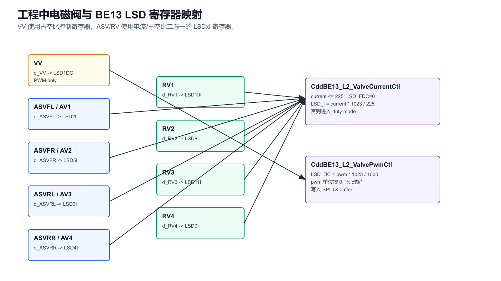

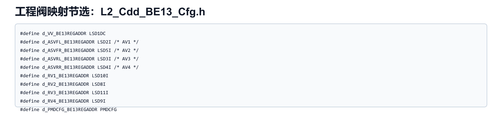

| 上层变量 | BE13 寄存器 | 控制函数 | 说明 |
|---|---|---|---|
| `L2_S_BE13PwmVV_Uls_G_u16_CMS` | `LSD1DC` | `CddBE13_L2_ValvePwmCtl()` | VV 使用数字 PWM |
| `ASVFL` | `LSD2I` | `CddBE13_L2_ValveCurrentCtl()` | AV1，电流/占空比 |
| `ASVFR` | `LSD5I` | `CddBE13_L2_ValveCurrentCtl()` | AV2 |
| `ASVRL` | `LSD3I` | `CddBE13_L2_ValveCurrentCtl()` | AV3 |
| `ASVRR` | `LSD4I` | `CddBE13_L2_ValveCurrentCtl()` | AV4 |
| `RV1` | `LSD10I` | `CddBE13_L2_ValveCurrentCtl()` | 回油阀 |
| `RV2` | `LSD8I` | `CddBE13_L2_ValveCurrentCtl()` | 回油阀 |
| `RV3` | `LSD11I` | `CddBE13_L2_ValveCurrentCtl()` | 回油阀 |
| `RV4` | `LSD9I` | `CddBE13_L2_ValveCurrentCtl()` | 回油阀 |

工程里的量纲：

- 电流上限 `225`，注释按 `0.01 A` 精度理解，即最大 2.25 A。
- 阀占空比上限 `1000`，按 `0.1%` 精度理解，即 100.0%。
- 电流模式换算：`LSD_I = current * 1023 / 225`。
- 占空比模式换算：`LSD_I/LSD_DC = pwm * 1023 / 1000`。

`CddBE13_L2_ValveCurrentCtl()` 的逻辑很重要：如果 `current <= 225`，使用电流模式并设置 `LSD_FDC = 0`；如果超出上限，则使用 duty mode 并设置 `LSD_FDC = 1`。因此上层 ASW 给异常电流值时，驱动并不是直接饱和到 2.25 A，而是切到占空比路径。

## 8. 泵电机和高边 safe switch

### 8.1 泵电机 PMD

手册页 45-51 描述泵电机预驱：SPI 控制，PWM 最高 16 kHz，支持主动续流、频率调制、过流、过温、load dump 和 PD_D disconnect 检测。

当前工程默认配置：

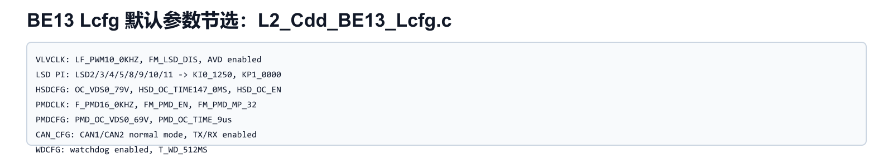

| 参数 | 当前工程值 | 作用 |
|---|---|---|
| `F_PMD` | `F_PMD16_0KHZ` | 泵 PWM 频率 16 kHz |
| `FM_PMD_EN` | enable | 泵频率调制打开 |
| `FM_PMD_MP` | 32 | 调制周期/速度选择 |
| `FM_PMD_MB` | 8 step | 调制带宽/步进选择 |
| `PMD_OC_SEL` | `PMD_OC_VDS0_69V` | 过流 VDS 阈值 |
| `PMD_OC_TIME` | `9us` | 过流滤波时间 |

`CddBE13_L2_PmdCtl()` 根据 `L2_S_BE13PwmMotor_Uls_G_u16_CMS` 设置：

- PWM 为 0：`PMD_ACT = 0`。
- PWM 非 0：`PMD_ACT = 1`。
- `PMD_DC = pwm * 255 / 1000`，即泵占空比寄存器是 8-bit。

### 8.2 高边 safe switch

手册页 52-53 描述阀安全高边预驱。工程配置 `HSDCFG`：

- `HSD_OC_SEL = OC_VDS0_79V`
- `HSD_OC_TIME = HSD_OC_TIME147_0MS`
- `HSD_OC_MASK = HSD_OC_EN`
- `V2V_RUN = V2V_RUN_DIS`

`VLVEN` 是关键使能寄存器，既控制 12 路阀，也和 safe FET、泵电机使能相关。工程初始化阶段先写 `VLVEN=0`，之后写 `VLVEN=0x1000`，正常态里 `CddBE13_L2_VLVENCtl()` 会根据 HSD 状态组织 `VLVEN` 写命令。

## 9. 电源、ADC 和温度

BE13 内部有多路电源监管：

- `VPRE`：外部 N-MOS 的预稳压。
- `VCCA`：DC/DC buck，可按芯片版本输出 1.2 V、1.25 V、1.3 V 或 3.3 V。
- `VCC3P3`：3.3 V LDO。
- `VCC5`：5 V LDO。
- `VCC5_EXT`：外部 5 V 供电。
- `VCCx_CAN`：双 CAN 的 5 V 供电。

手册页 77 说明 ADC 是 10-bit，参考 VCC5，用于 ADINx、内部电源和 die temperature。工程中温度换算为：

```c
L2_S_BE13DieTemp_Uls_G_s16_DMT =
    d_S_ADDIETEMP_B - AD_DIETMP * d_S_ADDIETEMP_K;
```

其中 `d_S_ADDIETEMP_B = 3689`，`d_S_ADDIETEMP_K = 5`，均按 0.1 精度理解。诊断阈值：

| 项 | 当前值 | 含义 |
|---|---:|---|
| `d_S_BE13DIETEMPOT_Uls_u16_CMP` | 1500 | 150.0 °C 过温阈值 |
| `d_S_BE13DIETEMPOT_Cnt_u16_CMP` | 50 | 连续计数后确认 |
| `d_S_BE13DIETEMPOTRECOVER_Uls_u16_CMP` | 1400 | 140.0 °C 恢复阈值 |
| `d_S_BE13DIETEMPOTRECOVER_Cnt_u16_CMP` | 50 | 连续计数后恢复 |

电源诊断在 `VREG_FLG`，并通过 `Interface_ASample.h` 暴露了 `BE13_VCC5EXT_OU/UU`、`BE13_VCC5_OU/UU`、`BE13_VCC3P3_OU/UU`、`BE13_VCCA13_OU/UU`、`BE13_VPRE_OU/UU` 等变量。

## 10. CAN、轮速、VSO、WLD、K-line

这几个模块当前工程里不是最主要的主动控制路径，但学习芯片时要知道它们存在：

| 模块 | 手册重点 | 工程关联 |
|---|---|---|
| CAN1/CAN2 | 双高速 CAN，支持故障保护，部分料号支持 CAN wake | `CAN_CFG` 配正常模式，`CAN_FLG` 诊断 |
| Wheel speed | 4 路轮速传感器供电、信号调理、计数、短路检测 | 当前初始化里 `WSCFG1/2` 基本关闭或禁用追踪，需结合硬件确认 |
| VSO | 车速输出，可由 WSOx 或 VSO_IN 控制 | `ISOKVSO12`、`VSO_VDS` |
| WLD | 两路 warning lamp 低边预驱 | `WLD12`、`WLD12_F` |
| ISO K-line | K-line 或第二 VSO 复用 | `ISOKVSO12` |

对本工程而言，主线仍然是阀、泵、高边、SPI、诊断；轮速/CAN/K-line 需要结合实际原理图确认是否启用。

## 11. BIST 和 Watchdog

### 11.1 LBIST / ABIST

手册页 126 说明 BE13 支持两类 built-in self test：

- `LBIST`：检查逻辑核心。
- `ABIST`：检查电源模块 UV 比较器以及 reset table 相关比较器。

工程上电初始状态就是 `STARTSELFCHECK_STATE`：

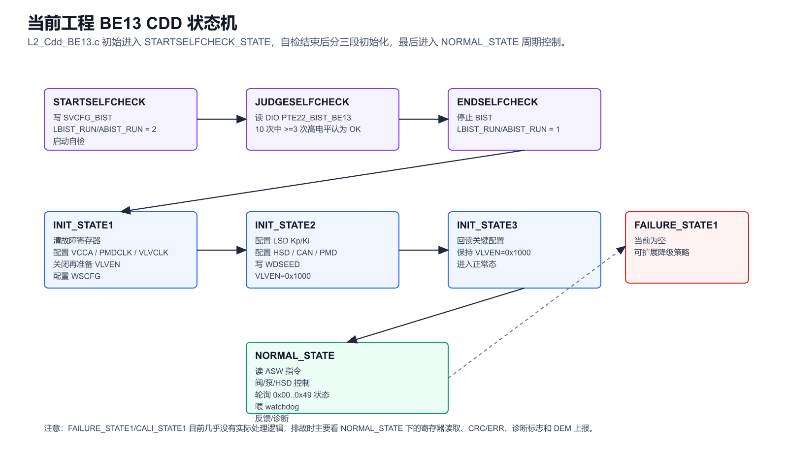

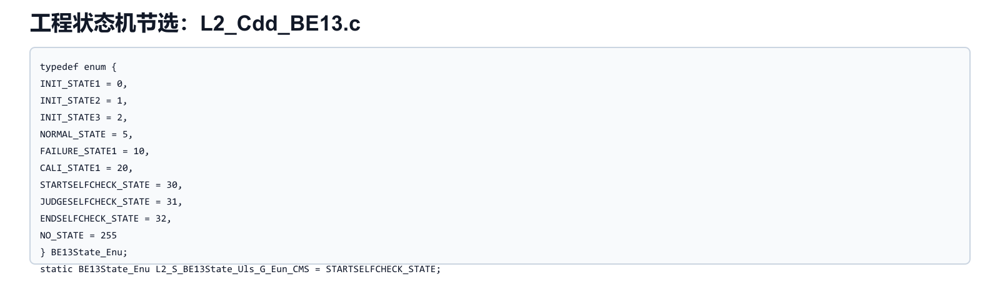

自检流程：

1. `CddBE13_L2_SelfCheck()` 写 `SVCFG_BIST`，设置 `LBIST_RUN=2`、`ABIST_RUN=2`。
2. 进入 `JUDGESELFCHECK_STATE`，读取 `DioConf_DioChannel_PTE22_BIST_BE13`。
3. 10 次采样中高电平计数大于等于 3，则置 `L2_S_BE13SelfCheckOk_Flg_G_u8_CMS = 1`。
4. `CddBE13_L2_EndSelfCheck()` 把 `LBIST_RUN/ABIST_RUN` 写回默认值 1。
5. 进入 `INIT_STATE1`。

注意：工程当前对自检 NG 后的降级处理不充分，主要只是记录 `SelfCheckOk` 标志并继续状态流。若量产安全策略要求自检失败不允许进正常驱动，需要补充失效处理。

### 11.2 Watchdog

手册的 watchdog 是 challenge/timeout sequence。工程配置：

- `WDCFG`: `WD_EN`，`T_WD_512MS`
- 默认 seed: `BE13_WD_SEED_DEFAULT = 0x5A5A`
- `CddBE13_L2_FeedWatchDog()` 每 20 次调度喂一次。

喂狗计算分两步：

1. `CddBE13_L2_ALUchecker(seed)` 生成 MCU result，写 `WDMR`。
2. `CddBE13_L2_LFSR(seed)` 更新下一次 seed。

`d_BE13_FEEDWDG_DISABLE_TEST` 可用于禁喂狗测试，但量产应保持 0。

## 12. 当前工程 CDD 架构

工程里有几套名字带 BE13 的文件，但真正完整的驱动栈是 `CDD/L2_Cdd_BE13`：

| 文件 | 作用 |
|---|---|
| `CDD/L2_Cdd_BE13/L2_Cdd_BE13.c` | 主状态机、SPI 报文、阀/泵/HSD、反馈、watchdog、自检 |
| `CDD/L2_Cdd_BE13/L2_Cdd_BE13.h` | 对外变量和 `Init/MainFunction` 声明 |
| `CDD/L2_Cdd_BE13/L2_Cdd_BE13_Reg.h` | 寄存器地址、bitfield union、枚举 |
| `CDD/L2_Cdd_BE13/L2_Cdd_BE13_Cfg.h` | 宏配置、阀映射、阈值、诊断 mask |
| `CDD/L2_Cdd_BE13/L2_Cdd_BE13_Lcfg.c/h` | 可调默认配置、诊断 enable/recover/DEM enable、DTC table |
| `CDD/L2_Cdd_BE13/L2_Cdd_BE13Diag.c/h` | 周期诊断、DEM 上报、温度诊断 |
| `CDD/L2_Cdd_Interface` | ASW 与 CDD 之间的全局接口变量 |

另有 `CDD/BE13` 和 `CDD/CanTrcv/CANTrcv_BE13`，目前更像模板/占位模块，主控制逻辑不在这里。

## 13. CDD 状态机


状态流：

| 状态 | 值 | 做什么 |
|---|---:|---|
| `STARTSELFCHECK_STATE` | 30 | 启动 LBIST/ABIST |
| `JUDGESELFCHECK_STATE` | 31 | 读 BIST 引脚，判断自检结果 |
| `ENDSELFCHECK_STATE` | 32 | 结束 BIST，进入初始化 |
| `INIT_STATE1` | 0 | 清故障、写基础配置、准备 `VLVEN` |
| `INIT_STATE2` | 1 | 写 Kp/Ki、HSD、CAN、PMD、BIST、WDSEED |
| `INIT_STATE3` | 2 | 回读关键配置，保持 `VLVEN=0x1000` |
| `NORMAL_STATE` | 5 | 周期阀/泵/HSD 控制、状态读取、喂狗、反馈 |
| `FAILURE_STATE1` | 10 | 当前基本为空，需按安全策略扩展 |
| `CALI_STATE1` | 20 | 当前基本为空 |

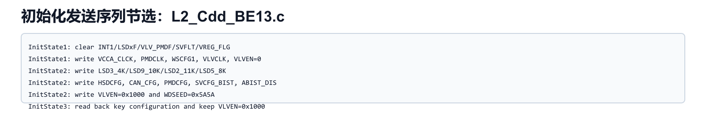

`CddBE13_L2_MainFunction()` 的顺序：

1. `CddBE13_L2_ReadAswInterface()`：从 ASW 接口变量读泵/阀目标值。
2. `CddBE13_L2_MsgSR()`：按状态机组织 SPI TX buffer 并触发传输。
3. `CddBE13_L2_Task()`：分片处理温度、泵反馈、阀反馈、HSD 反馈。
4. `CddBE13_L2_MotorLowSideEnCtl()`：泵低边相关控制。

实际调度入口在 `Core1_Swc.c` 的 `RE_Core1_Swc_Bsw_10ms`：

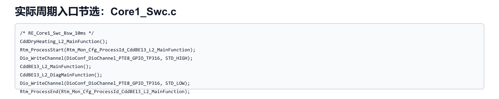

这点容易踩坑：`BasicSoftware/swc_config/CDD_BE13/arxml/CDD_BE13.arxml` 里配置了 `RE_CDD_BE13_1ms/10ms/Init`，但 `ASW/SWC/CDD_SWC/CDD_BE13/src/CDD_BE13.c` 当前 runnable 用户逻辑为空。真正执行 BE13 主函数的是 Core1 BSW 10ms 任务里的直接调用。

## 14. AUTOSAR/EB 配置

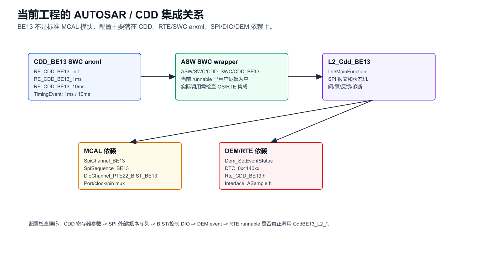

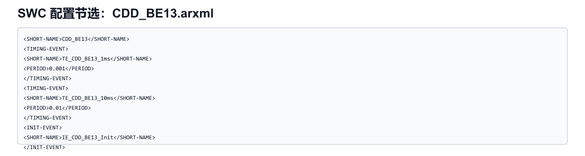

### 14.1 要在 EB 里看什么

BE13 没有一个叫“BE13”的标准 EB 参数页。要检查的是它依赖的 MCAL 模块：

| EB 模块 | 配置文件 | 检查点 |
|---|---|---|
| Spi | `BasicSoftware/integration/mcal/MCAL_Cfg/config/Spi.xdm` | `SpiChannel_BE13` 32-bit、EB、MSB、CS low、序列/Job/Device 绑定 |
| Mcl | `BasicSoftware/integration/mcal/MCAL_Cfg/config/Mcl.xdm` | BE13 Tx/Rx DMA logical channel 是否和 LPSPI 配套 |
| Port | `Port.xdm` | PTE0/PTE1/PTE2/PTE6 的 LPSPI 功能复用，PTE22 BIST 输入 |
| Dio | `Dio.xdm` | `PTE22_BIST_BE13`，以及测试/控制用 DIO symbolic name |
| Dem | DEM 配置文件 | `DTC_0x4140xx_Event` 是否存在并启用 |
| RTE/SWC | `BasicSoftware/swc_config/CDD_BE13/arxml/CDD_BE13.arxml` | runnable 周期、实际是否被 OS/RTE 调用 |

### 14.2 SPI 生成宏

当前工程生成宏：

- `SpiConf_SpiChannel_SpiChannel_BE13 = 0`
- `SpiConf_SpiJob_SpiJob_BE13 = 0`
- `SpiConf_SpiSequence_SpiSequence_BE13 = 0`
- `SPI_Spi0_BE13 = 0`

这些宏由 `Spi_Cfg.h` 提供，CDD 中直接引用。

### 14.3 DIO 配置

当前工程生成了这些 DIO 名称：

- `DioConf_DioChannel_PTE0_MISO_BE13 = 0x0080`
- `DioConf_DioChannel_PTE1_CLK_BE13 = 0x0081`
- `DioConf_DioChannel_PTE2_MOSI_BE13 = 0x0082`
- `DioConf_DioChannel_PTE6_CS_BE13 = 0x0086`
- `DioConf_DioChannel_PTE22_BIST_BE13 = 0x0096`

注意：SPI 引脚的复用主要由 Port/LPSPI 负责，DIO symbolic name 不代表这些脚一定以 GPIO 方式使用。`PTE22_BIST_BE13` 才是自检流程里真正用 `Dio_ReadChannel()` 读取的信号。

### 14.4 CDD 寄存器配置

`L2_Cdd_BE13_Lcfg.c` 是这个芯片的“寄存器配置页”。当前默认值包括：

- `VLVCLK`: 阀 PWM 10 kHz，AVD 打开，LSD frequency modulation 关闭。
- `LSD Kp/Ki`: LSD2/3/4/5/8/9/10/11 全部 `KP1_0000`、`KI0_1250`。
- `HSDCFG`: HSD 过流检测打开，阈值 `OC_VDS0_79V`。
- `PMDCLK`: 泵 16 kHz，PMD frequency modulation 打开。
- `CAN_CFG`: CAN1/CAN2 normal mode，TX/RX enable。
- `WDCFG`: watchdog enable，512 ms 窗口。

这类参数通常需要结合硬件、EMC、阀/泵负载、系统安全策略一起确认，不建议只因为软件能跑就固定不改。

## 15. 诊断与 DEM

BE13 的诊断是这份驱动最值得仔细看的部分。它不是把所有 fault bit 无脑上报，而是有三层开关：

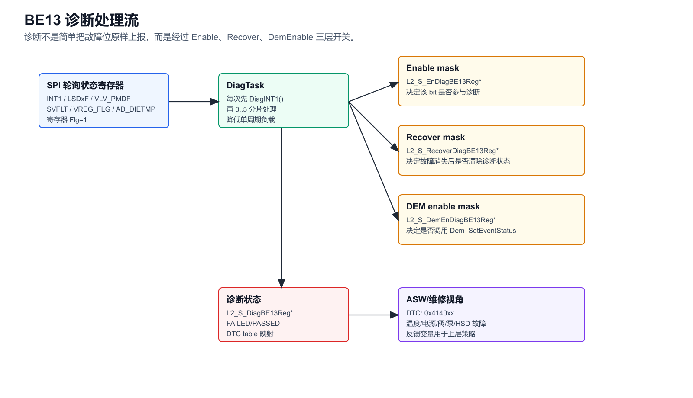

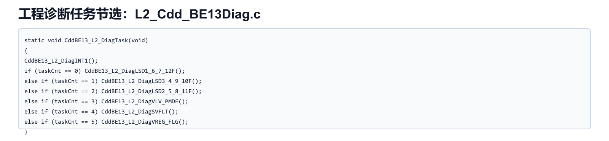

| 配置组 | 文件 | 作用 |
|---|---|---|
| `L2_S_EnDiagBE13Reg*` | `L2_Cdd_BE13_Lcfg.c` | 该故障 bit 是否参与诊断 |
| `L2_S_RecoverDiagBE13Reg*` | `L2_Cdd_BE13_Lcfg.c` | 故障消失后是否允许恢复为 passed |
| `L2_S_DemEnDiagBE13Reg*` | `L2_Cdd_BE13_Lcfg.c` | 是否调用 `Dem_SetEventStatus()` |
| `L2_S_DemEventParam*` | `L2_Cdd_BE13_Lcfg.c` | fault bit 到 DTC event 的映射 |

`CddBE13_L2_DiagTask()` 每周期先处理 `INT1`，然后分片处理：

1. `LSD1_6_7_12F`
2. `LSD3_4_9_10F`
3. `LSD2_5_8_11F`
4. `VLV_PMDF`
5. `SVFLT`
6. `VREG_FLG`

温度 `AD_DIETMP` 的诊断由 `CddBE13_L2_DieTemp()` 在读到新温度后触发。

常见 DTC 类型：

- `0x4140xx` 阀开路、短路、过温。
- HSD 过压、过流、过温、泄漏、断开。
- PMD 过流/过温。
- `CP_FAIL`、`CLK_FAIL`、`FMSG`、`LBIST_FAIL`、`ABIST_FAIL`。
- `VCC5`、`VPRE`、`VCC5EXT` 等电源过压/欠压/过温。
- `AD_DIETMP` 过温。

工程当前恢复 mask 多数为 0，也就是很多故障一旦置位不会自动恢复，需要按诊断策略确认是否符合项目要求。

## 16. ASW 接口

上层控制量来自 `CDD/L2_Cdd_Interface` 和模型代码：

| ASW/接口变量 | 作用 |
|---|---|
| `opd_Perc_motor_PWM` | 泵电机 PWM，0..1000 |
| `opd_Prec_PWMVV` | VV PWM |
| `opd_A_ASVCurrent_FL/FR/RL/RR` | ASV 目标电流 |
| `opd_Prec_PWMFL/FR/RL/RR` | ASV duty fallback |
| `opd_Prec_PWMRV1..RV4` | RV duty |
| `L2_S_BE13State_Uls_G_u08_CMT` | BE13 CDD 状态输出 |
| `L2_S_BE13DieTemp_Uls_G_s16_DMT` | BE13 温度，0.1 °C |
| `L2_S_BE13*Fb` | 阀、泵、HSD 反馈 |

`CddBE13_L2_ReadAswInterface()` 对 PWM 做上限保护：超过 `1000` 会置 0。电流变量则直接读入，后续在 `ValveCurrentCtl()` 中根据是否超过 `225` 决定电流模式还是 duty mode。

## 17. 调试检查清单

### 17.1 SPI 不通

1. 示波器确认 `CSB` 低有效，且一次传输正好 32 个 SCLK。
2. 确认 SCLK polarity/phase 与手册一致。当前生成代码是 `CPOL=0`、`CPHA=0`。
3. 确认 `SpiDataWidth=32`，`SpiTransferStart=MSB`。
4. 确认 `Spi_SetupEB()` 长度和 MCAL 数据宽度匹配。
5. 读取 `CHIPID`，检查 MISO 的 `Err`、`Addr`、`Data`、`CRC`。
6. 如果 CRC 错，先确认字节序和 bit31..8 的 CRC 输入顺序。

### 17.2 自检失败

1. 看 `SVCFG_BIST` 是否写到 `LBIST_RUN=2`、`ABIST_RUN=2`。
2. 看 `PTE22_BIST_BE13` 的 Port/Dio 配置，确认是输入。
3. 示波器测 BE13 `BIST` 引脚，比较软件采样计数。
4. 读 `ABISTFAIL`、`STUCKAT`、`SVFLT`。
5. 检查自检期间阀/HSD 是否按手册要求关闭。

### 17.3 阀不动作

1. 确认状态已到 `NORMAL_STATE`。
2. 确认 `VLVEN` 写入使能位，当前初始化阶段会写 `0x1000`。
3. 看对应阀寄存器，例如 `ASVFL -> LSD2I`，VV -> `LSD1DC`。
4. 看 `LSDxF` 是否有 `OP/OC/OT/CRER`。
5. 看 `VLV_PMDF` 是否有 HSD 或 AVD 相关 fault。
6. 看 ASW 输入值是否超过上限导致置 0或进入 fallback duty mode。

### 17.4 泵不动作

1. 确认 `L2_S_BE13PwmMotor_Uls_G_u16_CMS` 非 0。
2. 确认 `PMDCFG.PMD_ACT=1`，`PMD_DC` 有非零值。
3. 看 `PMDCLK` 是否 16 kHz 配置成功。
4. 看 `VLV_PMDF` 的 `PMD_OC_OP`、`PMD_OT`、`PMD_PDD_DISC`、`PMD_LD`。
5. 测 `PD_G`、`FRW_G`、`PD_D/PD_S` 相关硬件信号。

### 17.5 DEM 报故障但硬件正常

1. 先看对应 fault bit 是否真的从 SPI 读到。
2. 查 `L2_S_EnDiagBE13Reg*` 是否打开该 bit。
3. 查 `L2_S_DemEnDiagBE13Reg*` 是否允许上报。
4. 查 `Recover` mask 是否允许恢复。
5. 检查清故障是否需要写 1 到 Level 2 寄存器。
6. 如果是 VREG/ADC 类故障，用 ADC 原始值、电源实测值、阈值一起看。

## 18. 推荐阅读顺序

1. 先看本笔记的第 2、3、5、6 节，建立整体和 SPI/寄存器模型。
2. 打开数据手册页 15-19，看功能和模式。
3. 打开工程 `L2_Cdd_BE13_Reg.h`，把 `0x00..0x49` 的地址和本笔记第 6 节对应起来。
4. 打开 `L2_Cdd_BE13.c`，看状态机、`MsgMerge`、`ReadState`、`ValveCtl`、`PmdCtl`。
5. 打开 `L2_Cdd_BE13_Lcfg.c`，看实际默认配置和 DTC table。
6. 最后看 EB 的 `Spi.xdm`、`Dio.xdm`、`Port.xdm`，确认硬件通道配置。

## 19. 关键文件速查

| 类别 | 路径 |
|---|---|
| 数据手册 | `C:/Users/nvtc140/Zotero/storage/JYG22VSP/BE13-SC900719 2022Q1.pdf` |
| 主驱动 | `E:/github/ECAS_RTA_S32K324GHS_Heating/CDD/L2_Cdd_BE13/L2_Cdd_BE13.c` |
| 寄存器 | `E:/github/ECAS_RTA_S32K324GHS_Heating/CDD/L2_Cdd_BE13/L2_Cdd_BE13_Reg.h` |
| CDD 宏配置 | `E:/github/ECAS_RTA_S32K324GHS_Heating/CDD/L2_Cdd_BE13/L2_Cdd_BE13_Cfg.h` |
| Lcfg 配置 | `E:/github/ECAS_RTA_S32K324GHS_Heating/CDD/L2_Cdd_BE13/L2_Cdd_BE13_Lcfg.c` |
| 诊断 | `E:/github/ECAS_RTA_S32K324GHS_Heating/CDD/L2_Cdd_BE13/L2_Cdd_BE13Diag.c` |
| ASW 接口 | `E:/github/ECAS_RTA_S32K324GHS_Heating/CDD/L2_Cdd_Interface/L2_Cdd_Interface.h` |
| SPI EB 配置 | `E:/github/ECAS_RTA_S32K324GHS_Heating/BasicSoftware/integration/mcal/MCAL_Cfg/config/Spi.xdm` |
| DIO EB 配置 | `E:/github/ECAS_RTA_S32K324GHS_Heating/BasicSoftware/integration/mcal/MCAL_Cfg/config/Dio.xdm` |
| SWC arxml | `E:/github/ECAS_RTA_S32K324GHS_Heating/BasicSoftware/swc_config/CDD_BE13/arxml/CDD_BE13.arxml` |
| 实际调用入口 | `E:/github/ECAS_RTA_S32K324GHS_Heating/ASW/SWC/Core1_Swc/src/Core1_Swc.c` |

## 20. 最容易误解的点

- BE13 不是 S32K324 内部模块，不能像 SIUL2 那样只查 MCU reference manual。
- “EB 配置”不是一个 BE13 专用配置页，而是 SPI/DIO/Port/Mcl/DEM/RTE 加 CDD Lcfg 的组合。
- `CDD_BE13` SWC runnable 虽然存在，但当前真正调用在 `Core1_Swc.c` 的 10ms 任务中。
- `READ_BE13` 使用预计算读命令，`WRITE_BE13` 动态计算 CRC。
- MISO 返回的是上一帧选择地址的数据，调试时要注意一帧延迟。
- `L2_S_BE13RegState_Uls_G_aUni_CMP[addr].B.Flg` 是很多反馈和诊断函数的触发条件。
- 阀电流超过 2.25 A 对应的工程上限后，不是限幅到最大电流，而是切到 duty mode。
- 诊断有 enable、recover、DEM enable 三层开关，故障 bit、软件诊断状态和 DEM DTC 不是同一回事。
- 自检 NG 后当前工程缺少强降级动作，需要结合项目安全需求评审。

