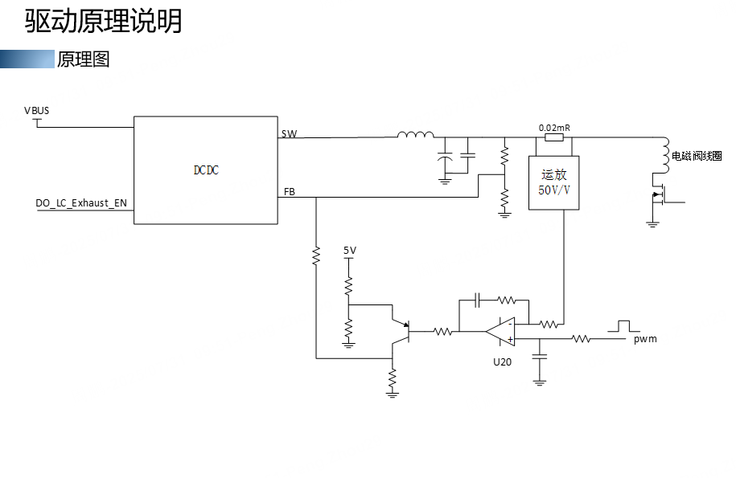
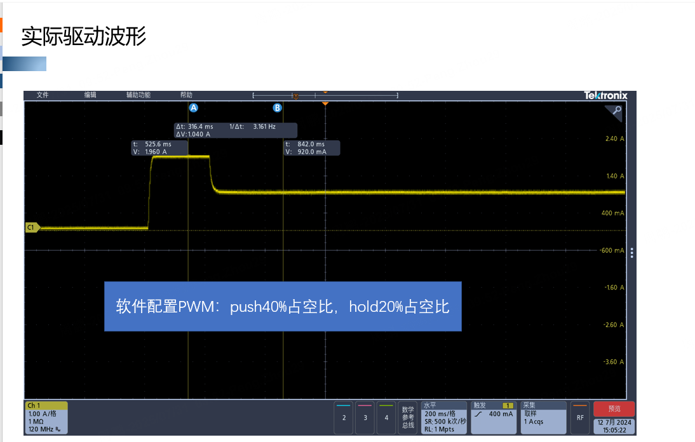

DCDC负责：动态输出可调电压，输出多少电压，由FB脚决定”（feedback）这是绝大多数 Buck 芯片的工作原理。
U20运放：比较目标电压和实际电流反馈。
同相输入PWM → RC滤波 → Vref，为目标电压
反向输入电流 → 0.02Ω → 放大50倍，为实际电压值
Vout​=A(V+​−V−​)
Iout​×0.02×50=5×duty

当 V+ > V-时，Vout升高，Vout ↑  → DCDC输出 ↑  → 线圈电流 ↑  → 采样电压 ↑  → V- ↑
 运放不是“主动知道要相等”而是因为开环增益巨大导致：只要有一点误差输出就剧烈变化。‘
```
 运算是一个超级暴躁的控制器，而负反馈会把他驯服，形成稳定控制。
```
三极管的核心作用是：当EN无效的时候，强制关闭整个恒流环。
```
PWM占空比为0的时候，并不一定真的彻底关闭。
- 运放漂移
- 噪声
- 偏置电流
- RC残压
  都会导致MOS有点导通，导致发热。
```

