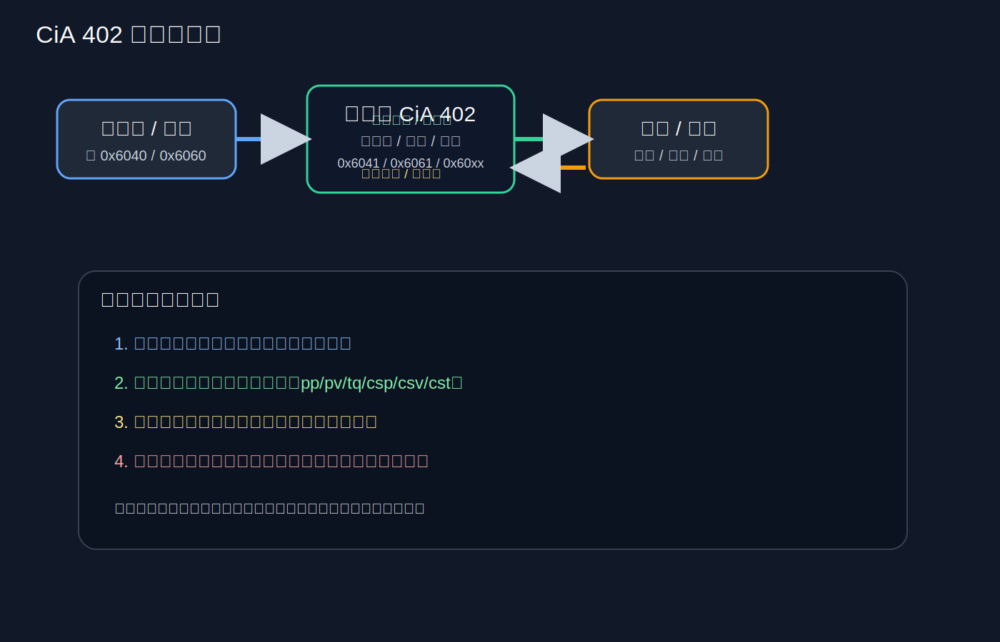
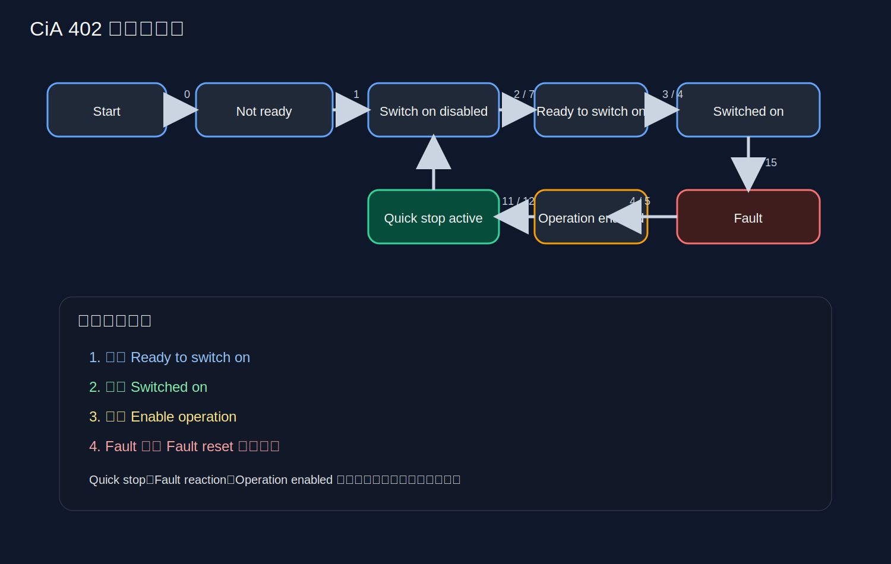
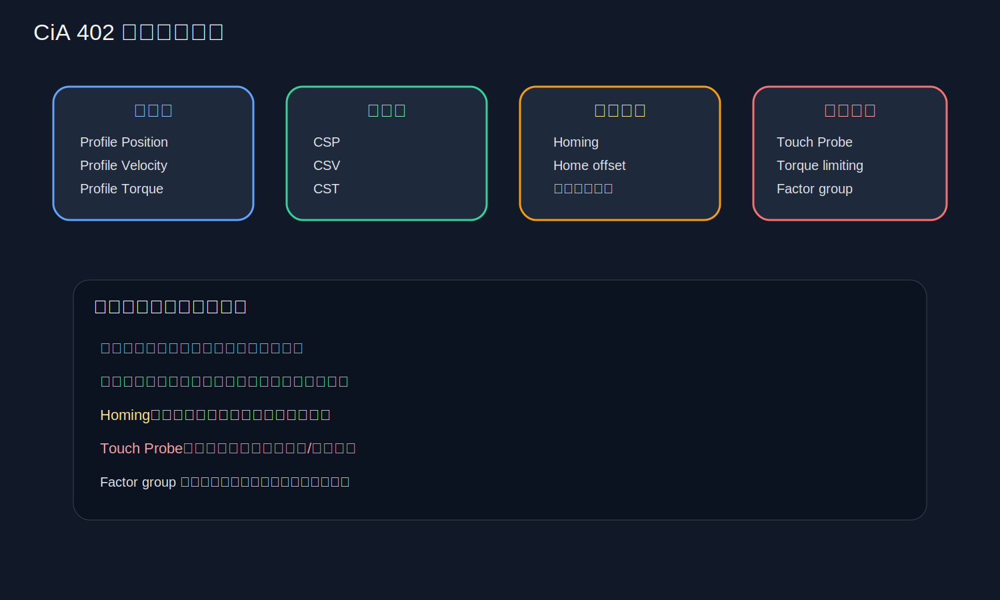
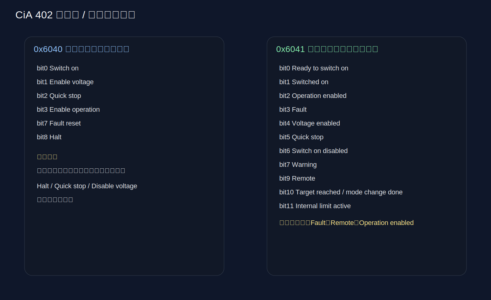

# CiA-402-2-version-3.0.0 学习笔记

## 0. 图示速览

> [!tip] 初学者阅读顺序
> 先看图示速览，再看状态机，再看控制字/状态字，最后看各运行模式和对象字典。

## 1. 目录

- [[#0. 图示速览]]
- [[#2. 这份文档到底讲什么]]
- [[#4. PDS 有限状态机：整份文档的核心骨架]]
- [[#5. 控制字 0x6040：你发给驱动器的命令]]
- [[#6. 状态字 0x6041：你从驱动器读回来的反馈]]
- [[#7. 运行模式总览]]
- [[#8. 0x6060 和 0x6061：模式选择与确认]]
- [[#9. 位置模式：Profile Position mode]]
- [[#10. 回零模式：Homing mode]]
- [[#11. 速度模式：Profile Velocity mode]]
- [[#12. 力矩模式：Profile Torque mode]]
- [[#13. Interpolated position mode]]
- [[#14. 以“同步控制”为核心的三种模式]]
- [[#15. Factor group：缩放、极性与机械意义]]
- [[#16. 错误码和故障处理]]
- [[#17. 这份文档最值得背下来的几个结论]]
- [[#19. 一句话总结]]

## 2. 这份文档到底讲什么

这份文档是 CiA 402 伺服驱动器/运动控制设备配置文件的一部分，标题是 “Part 2: Operation modes and application data”。它的核心目标是：

- 定义驱动器如何被上位控制器控制；
- 定义常见运行模式；
- 定义与运动控制相关的对象字典对象；
- 定义功率驱动系统（PDS, Power Drive System）的有限状态机（FSA）；
- 定义位置、速度、力矩、回零、插补、同步周期控制等功能。

你可以把它理解成：
“机器人/伺服电机从上位机发指令，到驱动器真正执行运动”的通用协议说明书。

这不是某一块硬件的驱动手册，而是“伺服控制行为标准”。

> [!note] 先建立一个总概念
> 这份标准不是讲“怎么写某一款驱动器的底层代码”，而是讲“伺服驱动应该如何行为才算符合 CiA 402”。

## 3. 这份标准适合用来解决什么问题

读完这份标准后，你应该能回答这些问题：

- 伺服驱动器上电后会经历哪些状态？
- 什么时候能发使能、关断、快速停止、复位故障？
- 0x6040 控制字每一位是什么意思？
- 0x6041 状态字怎么判断当前状态？
- 0x6060/0x6061 如何选择和确认运行模式？
- Profile Position / Homing / Velocity / Torque / CSP / CSV / CST 是什么？
- 每种模式需要哪些对象字典参数？
- 位置、速度、力矩的“目标值、实际值、限制值”如何理解？

如果你以后接触 EtherCAT、CANopen、伺服驱动器、机器人关节控制，这份资料都非常基础。

## 4. PDS 有限状态机：整份文档的核心骨架

PDS = Power Drive System，意思是伺服驱动系统。

### 4.1 主要状态

标准定义了典型状态：

- Not ready to switch on
- Switch on disabled
- Ready to switch on
- Switched on
- Operation enabled
- Quick stop active（可选）
- Fault reaction active
- Fault

### 4.2 状态机的意义

状态机不是“装饰图”，它决定了：

- 哪些命令能生效；
- 什么时候允许输出功率；
- 什么时候允许电机带载；
- 故障发生后如何恢复。

### 4.3 三个层次要分清

文档把系统能力分成三个区域：

- A：Low-level power（低压/控制单元上电）
- B：High-level power（高压/主功率上电）
- C：Torque on motor（电机真正有力矩输出）

初学者最容易混淆的是：
“系统通电”不等于“电机已经能转”。

### 4.4 关键理解

- Not ready to switch on：上电初期，驱动还没准备好；
- Switch on disabled：已经初始化，但还不允许上使能；
- Ready to switch on：准备好接收开机/使能命令；
- Switched on：主功率已开，但还没真正进入运动输出；
- Operation enabled：真正进入运动执行状态；
- Fault：故障锁定，必须先复位。

### 4.5 快速停止

文档说明 Quick stop active 是可选状态。

这意味着：
- 有些驱动实现了快速停止状态；
- 有些驱动不实现，而是把 quick stop 当成普通保护行为。

> [!important] 初学者常见误区
> 看到“上电成功”不代表可以立刻运动。必须确认状态字已经到达 Operation enabled。

## 5. 控制字 0x6040：你发给驱动器的命令

### 5.1 控制字作用

0x6040 是控制字，表示控制器对驱动器发出的命令。

它本质上是一个 16 位命令寄存器。

### 5.2 核心位定义

文档明确要求支持的关键位包括：

- Bit 0：Switch on
- Bit 1：Enable voltage
- Bit 2：Quick stop（可选）
- Bit 3：Enable operation
- Bit 7：Fault reset
- Bit 8：Halt（按模式处理）
- 其他位中部分是模式相关、制造商相关或保留

### 5.3 初学者怎么理解这几个位

可以把它记成一条“开机链”：

- Bit 1：给电压使能
- Bit 0：请求上电/切换上电状态
- Bit 3：真正允许运行
- Bit 7：故障复位

实际控制时，通常不是随便乱置位，而是要按状态机走。

### 5.4 Bit 8 Halt

Halt 是“暂停当前运动”的意思，但具体行为依赖模式。

它不是统一的“立即停机按钮”，而是模式相关控制。

## 6. 状态字 0x6041：你从驱动器读回来的反馈

### 6.1 状态字作用

0x6041 是状态字，表示驱动器当前状态。

### 6.2 关键位

标准要求支持的关键位包括：

- Bit 0：Ready to switch on
- Bit 1：Switched on
- Bit 2：Operation enabled
- Bit 3：Fault
- Bit 4：Voltage enabled
- Bit 5：Quick stop
- Bit 6：Switch on disabled
- Bit 7：Warning
- Bit 9：Remote
- Bit 10：Target reached / reserved
- Bit 11：Internal limit active
- Bit 12/13：模式相关
- Bit 14/15：制造商相关

### 6.3 初学者最常用的判断方法

看状态字时，不要只看单个 bit，要看组合。

例如：

- Operation enabled = 说明驱动进入工作状态；
- Fault = 说明必须先故障处理；
- Voltage enabled = 说明高压/主功率存在；
- Remote = 说明控制字由网络侧控制，而不是本地面板。

### 6.4 Target reached

Bit 10 表示目标已到达，或者在某些场景下表示模式切换完成。

这在位置模式里尤其有用。

## 7. 运行模式总览

文档列出的模式包括：

- Profile position mode（pp）
- Homing mode（hm）
- Interpolated position mode（ip）
- Profile velocity mode（pv）
- Torque profile mode（tq）
- Velocity mode（vl）
- Cyclic synchronous position mode（csp）
- Cyclic synchronous velocity mode（csv）
- Cyclic synchronous torque mode（cst）

### 7.1 你可以先这样分类

#### 7.1.1 轮廓型

- Profile position
- Profile velocity
- Torque profile

这类模式里，驱动器内部通常会帮你处理加减速、斜坡、过渡。

#### 7.1.2 找零点型

- Homing

这类模式是建立坐标基准，不是单纯运动。

#### 7.1.3 实时同步型

- CSP
- CSV
- CST
- Interpolated position

这类模式更接近机器人控制器的实时轨迹循环。

## 8. 0x6060 和 0x6061：模式选择与确认

### 8.1 0x6060 Modes of operation

这是“请求模式”。

上位机写入 0x6060，告诉驱动器：
“我想让你工作在什么模式”。

### 8.2 0x6061 Modes of operation display

这是“实际模式显示”。

驱动器把自己当前已经切到的模式反馈回来。

### 8.3 为什么要两个对象

因为你写入请求，不等于立刻生效。

正确理解方式是：

- 0x6060：我要求你切到某模式；
- 0x6061：我现在真的已经在这个模式了。

### 8.4 初学者常犯错

很多人以为写了 0x6060 就立刻切好了。

实际上要等驱动内部切换完成，并确认 0x6061。

## 9. 位置模式：Profile Position mode

### 9.1 它解决什么问题

用于“给一个位置目标，驱动器自己按轮廓运动过去”。

### 9.2 常见对象

和位置模式相关的对象很多，最关键的有：

- 0x607A Target position
- 0x6081 Profile velocity
- 0x6083 Profile acceleration
- 0x6084 Profile deceleration
- 0x6085 Quick stop deceleration
- 0x6064 Position actual value
- 0x6067 Position window
- 0x6068 Position window time
- 0x60F2 Positioning option code

### 9.3 核心理解

你发的是“目标位置”，不是直接电机 PWM。

驱动器内部会负责：

- 速度限制；
- 加速度限制；
- 减速度限制；
- 到位判定；
- 可能的缓停处理。

### 9.4 初学者记忆法

位置模式 = “我要去某个点，你帮我规划怎么去”。

## 10. 回零模式：Homing mode

### 10.1 它解决什么问题

回零是建立机械坐标原点。

机器人、电机、滑台都需要知道：
“当前位置相对于零点到底在哪里”。

### 10.2 回零不是随便找个点

Homing 要结合：

- 限位开关；
- 原点开关；
- 编码器 index pulse；
- 触发探针（touch probe）；
- 当前位置信息。

### 10.3 常见回零方法

文档列出了多种回零方法，包括：

- negative limit switch + index pulse
- positive limit switch + index pulse
- home switch + index pulse
- without index pulse
- homing on index pulse
- homing on current position
- homing with touch-probe

### 10.4 Home offset 的意义

0x607C Home Offset 是非常关键的概念。

它表示：
回零完成后，零点并不一定等于机械原点本身，而是原点再加一个偏移量。

也就是说：

零点 = Home position + Home offset

### 10.5 初学者应该记住

回零的目标不是“转到某个角度就结束”，而是：

- 找到机械参考点；
- 建立软件坐标系；
- 让后续位置控制有统一基准。

## 11. 速度模式：Profile Velocity mode

### 11.1 它解决什么问题

速度模式用于“给目标速度”，驱动器自己调速并维持。

### 11.2 典型对象

- 0x60FF Target velocity
- 0x606C Velocity actual value
- 0x606D Velocity window
- 0x606E Velocity window time
- 0x606F Velocity threshold
- 0x6070 Velocity threshold time

### 11.3 适合什么场景

- 传送带；
- 风机；
- 需要恒速运行的机构；
- 不是特别强调绝对位置，但强调速度。

## 12. 力矩模式：Profile Torque mode

### 12.1 它解决什么问题

用于直接控制输出力矩或电流趋势。

### 12.2 典型对象

- 0x6071 Target torque
- 0x6072 Max torque
- 0x6073 Max current
- 0x6077 Torque actual value
- 0x6078 Current actual value
- 0x6079 DC link voltage

### 12.3 适合什么场景

- 夹持；
- 压紧；
- 力控；
- 需要限力而不是限位移的机构。

## 13. Interpolated position mode

### 13.1 它解决什么问题

适用于控制器分段发送轨迹点，驱动器按给定时间周期插值执行。

### 13.2 学习重点

- 数据点不是单个点，而是一串轨迹数据；
- 驱动器要按周期执行；
- 常用于多轴同步、轨迹规划。

## 14. 以“同步控制”为核心的三种模式

### 14.1 CSP：Cyclic Synchronous Position

周期同步位置模式。

上位控制器每个周期给位置点，驱动器同步执行。

特点：
- 最适合高动态位置伺服；
- 机器人关节控制很常见；
- 轨迹主要在控制器侧规划。

### 14.2 CSV：Cyclic Synchronous Velocity

周期同步速度模式。

每个周期给速度参考值。

特点：
- 实时速度跟踪；
- 适合需要连续速度控制的系统。

### 14.3 CST：Cyclic Synchronous Torque

周期同步力矩模式。

每周期发力矩指令。

特点：
- 更接近底层力控；
- 对控制器周期性和实时性要求高。

## 15. Factor group：缩放、极性与机械意义

### 15.1 为什么需要因子组

编码器、电机、齿轮箱、丝杆、滑台之间不是一比一关系。

所以标准提供了因子组，让你把“脉冲、转数、毫米、度、牛米”之间的关系标准化。

### 15.2 常见对象

- 0x608F Position encoder resolution
- 0x6090 Velocity encoder resolution
- 0x6091 Gear ratio
- 0x6092 Feed constant
- 0x607E Polarity

### 15.3 初学者理解重点

你在上层看到的是“毫米/度/转”，
驱动器内部看到的是“编码器计数”。

因子组就是桥梁。

## 16. 错误码和故障处理

### 16.1 错误码的意义

驱动器发生故障时，会通过错误码和状态字反馈出来。

### 16.2 常见思路

- 先看状态字是否 Fault；
- 再看 0x603F 错误码；
- 再看是否需要 Fault reset；
- 排查外部原因：过流、过压、编码器异常、限位、温度、接地短路等。

### 16.3 学习建议

不要只会“复位一下看还会不会报错”。

更重要的是：
找到是“电气问题、机械问题、参数问题、通信问题”中的哪一类。

## 17. 这份文档最值得背下来的几个结论

1. 0x6040 是你发命令，0x6041 是驱动回状态。
2. 状态机是伺服控制的骨架，必须先理解。
3. 0x6060 是请求模式，0x6061 是实际模式。
4. Position / Velocity / Torque 是三类不同控制思路。
5. Homing 不是普通运动，而是建立零点。
6. 因子组是把编码器计数映射到机械量的桥梁。
7. Cyclic synchronous 模式更接近机器人实时轨迹控制。

## 18. 初学者的学习路线建议

如果你第一次学伺服协议，建议这样练：

1. 先把状态机图抄一遍；
2. 把 0x6040 和 0x6041 每个位画成表；
3. 选一个模式，比如 CSP；
4. 再看对应的对象字典；
5. 最后结合实际电机试运行。

## 19. 一句话总结

CiA 402 Part 2 讲的不是“如何实现某一颗芯片”，而是“如何把伺服驱动器变成一个可被标准化控制的运动执行器”。

对于机器人初学者，最重要的是先掌握：

- 状态机；
- 控制字/状态字；
- 运行模式；
- 回零；
- 位置/速度/力矩控制。

## 20. 原始来源

- E:/机器人/CiA-402-2-version-3.0.0.pdf
- 重点章节：5 Controling the power drive system, 6 Modes of operation, 7 Error codes and error behaviour, 8 Controlling the power drive system, 9 Factor group, 10-19 各运行模式
