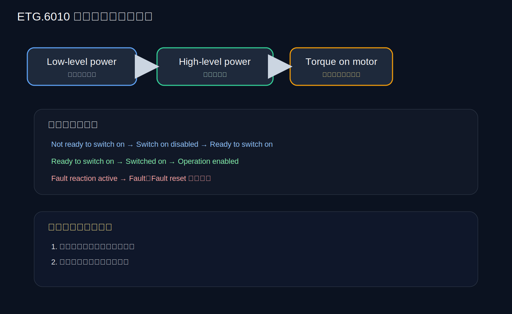
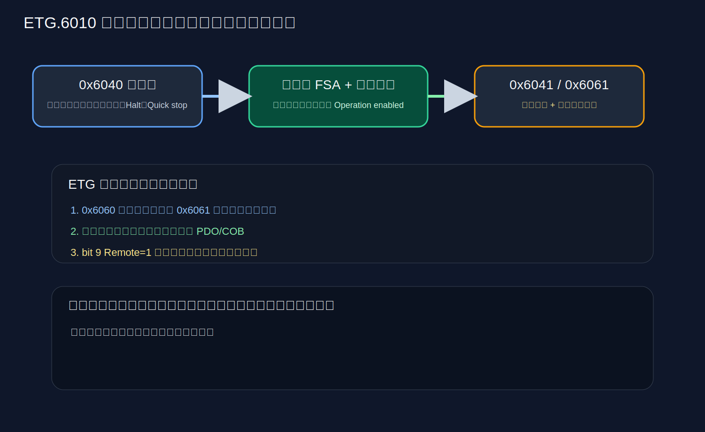
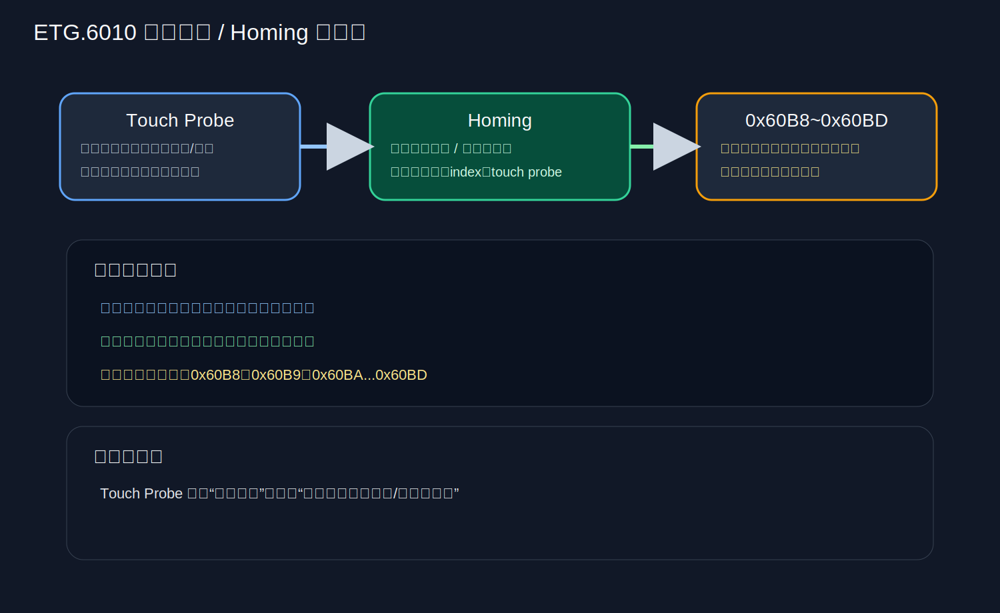

# ETG.6010 CiA402 Implementation Directive 学习笔记

## 0. 图示速览

> [!tip] 初学者阅读顺序
> 先看状态机和电源层次，再看模式切换，最后看 Homing 和 Touch Probe。

## 1. 目录

- [[#0. 图示速览]]
- [[#2. 这份文档是什么]]
- [[#4. 伺服状态机：这份文档的基础骨架]]
- [[#5. 控制字 0x6040：命令的编码方式]]
- [[#6. 状态字 0x6041：反馈的关键]]
- [[#7. 推荐运行模式]]
- [[#8. 模式切换：0x6060 和 0x6061]]
- [[#9. 功能组 1：Torque limiting]]
- [[#10. 功能组 2：Homing]]
- [[#11. 功能组 3：Touch Probe]]
- [[#12. 这份文档和 CiA 402 标准相比，最值得注意的点]]
- [[#13. 对初学者最实用的理解框架]]
- [[#14. 学这份文档时最容易混淆的点]]
- [[#15. 初学者推荐的理解顺序]]
- [[#16. 一句话总结]]
- [[#17. 原始来源]]

## 2. 这份文档是什么

这份文档是 EtherCAT Technology Group 的 CiA402 实施指南，标题是 “Implementation Directive for CiA402 Drive Profile”。

和前一份 CiA 402 标准不同，这份更像是“落地实现约束”和“建议统一行为”。

它的核心用途是：

- 让 EtherCAT 伺服驱动器的 CiA402 行为更一致；
- 统一主站和驱动之间的交互方式；
- 让不同厂家的 EtherCAT 伺服在行为上更可预期。

你可以把它理解成：
“CiA402 规则的 EtherCAT 版实施细则”。

## 3. 这份文档和 CiA 402 标准的关系

你可以这么理解：

- CiA 402 标准：定义通用伺服行为；
- ETG.6010：把这个行为收敛到 EtherCAT 伺服场景中，强调一致实现。

它特别关注：

- 状态机怎么走；
- 控制字怎么编码；
- 状态字怎么解释；
- 哪些运行模式是推荐的；
- 回零和触发探针等功能如何统一。

## 4. 伺服状态机：这份文档的基础骨架

### 4.1 状态名称

文档的状态机和 CiA 402 兼容，但更明确地表达了：

- Start
- Not ready to switch on
- Switch on disabled
- Ready to switch on
- Switched on
- Operation enabled
- Quick stop active（可选）
- Fault reaction active
- Fault

### 4.2 三段供电概念更清晰

文档把驱动供电划分得很清楚：

- Low-level power：控制单元电源
- High-level power：主功率电源
- Torque on motor：电机真正输出力矩

这对初学者很重要，因为很多人会把“驱动器上电”和“电机可输出力矩”混为一谈。

### 4.3 状态机的工程意义

它告诉你：

- 哪一步能让主功率打开；
- 哪一步能让电机真的开始受控；
- 哪一步只是预备态；
- 哪一步必须先故障清除。

### 4.4 Quick stop 的地位

文档明确说 Quick stop state 是可选的。

这意味着在某些实现中：

- 可能有完整的 quick stop 逻辑；
- 也可能没有独立状态，只是做等效处理。

> [!important] 初学者常见误区
> 同样是“停下来”，Quick stop、Disable voltage、Halt 的含义并不一样。

## 5. 控制字 0x6040：命令的编码方式

### 5.1 关键位

文档要求支持这些控制位：

- Bit 0：Switch on
- Bit 1：Enable voltage
- Bit 2：Quick stop
- Bit 3：Enable operation
- Bit 7：Fault reset
- Bit 8：Halt
- 其余部分为模式相关、制造商相关或保留

### 5.2 工程理解

你可以把控制字理解为：

- “先通电”；
- “再准备”；
- “再使能”；
- “故障时复位”；
- “必要时暂停”。

### 5.3 Stop / Halt / Quick stop 不要混

初学者容易把以下三个动作混在一起：

- Disable voltage：切断电压；
- Quick stop：快速停机流程；
- Halt：模式内暂停当前运动。

它们不是同一个东西。

## 6. 状态字 0x6041：反馈的关键

### 6.1 关键位

文档中的状态字位包括：

- Ready to switch on
- Switched on
- Operation enabled
- Fault
- Voltage enabled
- Quick stop
- Switch on disabled
- Warning
- Remote
- Target reached
- Internal limit active
- Operation mode specific

### 6.2 重点理解 bit 9 Remote

文档特别强调：

- bit 9 = 1：controlword 被处理，表示远程控制有效；
- bit 9 = 0：本地控制，网络控制字不生效。

对于 EtherCAT 伺服调试，这一位很关键。你若发现控制字写了没反应，要先看是不是还在 local 模式。

### 6.3 Target reached 的含义

Bit 10 不只是“到位”，还可能表示：

- 目标到达；
- 模式切换完成；
- quick stop 结束后的完成状态；
- halt 后已停住。

所以它是一个“综合完成状态”指示，而不只是位置到位。

## 7. 推荐运行模式

文档推荐的模式包括：

- Profile position mode（pp）
- Velocity mode（vl）
- Profile velocity mode（pv）
- Torque profile mode（tq）
- Homing mode（hm）
- Interpolated position mode（ip）
- CSP
- CSV
- CST

### 7.1 这里和普通 CiA 402 的不同感受

这份文档把 EtherCAT 伺服最常用的运动模式组织得更紧凑。

从工程使用角度，你可以把它理解为三类：

- 轮廓型：pp / pv / tq
- 校零型：homing
- 周期同步型：csp / csv / cst

### 7.2 CSP / CSV / CST 是 EtherCAT 场景的核心

对于 EtherCAT 伺服，周期同步三兄弟尤其重要：

- CSP：控制位置
- CSV：控制速度
- CST：控制力矩

它们是控制器周期性下发数据，驱动器实时跟随。

## 8. 模式切换：0x6060 和 0x6061

### 8.1 0x6060

请求的模式。

### 8.2 0x6061

实际已经生效的模式。

### 8.3 这份文档的一个重点

文档强调：

- 模式切换不会自动重配实时通信 COB；
- 模式切换可能受 FSA 状态限制；
- 也可能受本地控制限制；
- 控制器必须避免不一致。

这对 EtherCAT 系统非常重要。

意思是：
你不能只改模式对象，就指望整个 PDO 机制自动帮你重配好。

### 8.4 初学者理解方式

模式切换是“逻辑切换”，不是“自动把一切都改好”。

所以主站和驱动都要配合。

## 9. 功能组 1：Torque limiting

### 9.1 两个关键对象

- 0x60E0 Positive torque limit value
- 0x60E1 Negative torque limit value

### 9.2 它们的意义

这部分是为了限制正反方向力矩上限。

在机器人和伺服应用里，它相当于安全边界之一：

- 防止力矩过大；
- 防止机械冲击；
- 防止堵转时继续发大力。

## 10. 功能组 2：Homing

### 10.1 回零在这份文档里的地位

文档把 Homing 作为重要功能组，而且明确说：
回零通常由控制设备主导，所以所有回零方法都是可选的。

### 10.2 支持的方法很多

包括：

- 限位开关 + 编码器 index
- home switch + index
- 仅 index pulse
- current position
- touch-probe

### 10.3 回零方法 35 / 36 的调整说明

文档里提到了：

- 方法 35：current position
- 方法 36：touch-probe

这说明实现上，回零不再只是传统“碰开关归零”，还可以结合更高精度的触发测量。

### 10.4 Home Offset

这份文档再次强调了 Home Offset 的概念：

- 回零完成后，零位不是简单的机械零；
- 而是机械参考点加偏移。

### 10.5 初学者重点

不要把 homing 理解成“找一个零点就结束”。

它其实是在建立“驱动器内部的坐标参考系统”。

## 11. 功能组 3：Touch Probe

### 11.1 它解决什么问题

Touch probe 是“触发捕获”功能。

它常用于：

- 高精度位置捕获；
- 外部传感器触发定位；
- 回零辅助；
- 特定边沿的坐标记录。

### 11.2 最少需要什么

文档规定：

- 至少一个本地数字输入要支持 touch probe。

### 11.3 相关对象

关键对象包括：

- 0x60B8 Touch probe function
- 0x60B9 Touch probe status
- 0x60BA Touch probe position 1 positive value
- 0x60BB Touch probe position 1 negative value
- 0x60BC Touch probe position 2 positive value
- 0x60BD Touch probe position 2 negative value
- 0x60D0 Touch probe source

### 11.4 最重要的工程意义

Touch probe 本质上是“对某个事件发生时的位置/时间点进行锁存”。

这在精定位、边沿捕获、标记点校正中很有用。

## 12. 这份文档和 CiA 402 标准相比，最值得注意的点

### 12.1 更偏 EtherCAT 实现一致性

它不是单纯列标准，而是把标准行为收敛成 EtherCAT 驱动器更统一的实现指南。

### 12.2 更强调实际工程中的限制

例如：

- 是否支持 quick stop state；
- 模式是否能在某状态切换；
- 本地控制与网络控制的边界；
- PDO / COB 不会因为模式切换自动重配置。

### 12.3 更强调控制器责任

控制器必须避免：

- 写了模式却没检查实际模式；
- 以为主站一写就立刻切完；
- 忽略 remote/local；
- 忽略 FSA 所处状态。

## 13. 对初学者最实用的理解框架

你可以把 EtherCAT CiA402 伺服控制理解成四层：

### 13.1 第一层：状态机

决定驱动器现在能不能工作。

### 13.2 第二层：模式

决定它现在按什么方式工作。

### 13.3 第三层：参数对象

决定目标值、限制值、偏移值、速度、力矩等具体数值。

### 13.4 第四层：反馈对象

告诉你它到底做到了什么。

## 14. 学这份文档时最容易混淆的点

### 14.1 运行模式和状态机不是一回事

- 状态机：能不能使能、能不能输出力矩；
- 模式：输出方式是什么。

### 14.2 0x6060 和 0x6061 不是同一个值

- 一个是请求；
- 一个是确认。

### 14.3 Homing 不是普通运动模式

它是建立坐标基准。

### 14.4 Touch probe 不是普通输入

它是事件捕获功能。

## 15. 初学者推荐的理解顺序

1. 先搞懂状态机三层电源概念；
2. 记住 0x6040 / 0x6041；
3. 记住 0x6060 / 0x6061；
4. 区分 pp / pv / tq / csp / csv / cst；
5. 再理解 homing；
6. 最后看 touch probe 和 torque limiting。

## 16. 一句话总结

这份 ETG.6010 文件的重点，不是“再定义一套新协议”，而是把 CiA402 在 EtherCAT 伺服中的实现边界、推荐行为和功能约束讲清楚。

如果你以后做 EtherCAT 机器人关节，这份文档比你想象中更重要。

## 17. 原始来源

- E:/机器人/ETG.6010_V1i0i0_D_D_CiA402_ImplDirective.pdf
- 重点章节：5 Controlling the power drive system, 6 Modes of Operation, 7 Function Groups
