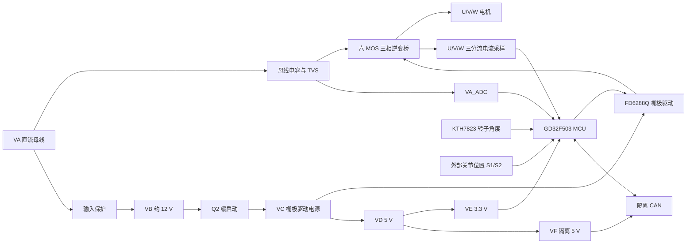

# Robotic Dog Driver A1.0 原理图详细解读

## 1. 这块板的定位

这不是整台机器狗的中央控制板，而是一块单电机、单关节级的三相伺服驱动器。它把直流母线 `VA` 转换成电机三相 `U/V/W`，同时完成三相电流、母线电压、转子角度、关节位置和温度采样，并通过隔离 CAN 与上位控制器通信。

第一页是完整原理图，第二页是 BOM。下文中的器件值和网络关系均来自第一页，并用第二页 BOM 交叉核对。图中灰色器件/网络通常表示未装、备选或机械兼容项，最终应以贴片清单和实板为准。


整体能量与信号链如下：



## 2. 电源与关键网络名

| 网络 | 含义 | 主要负载 |
|---|---|---|
| `VA` | 高压直流母线，图中没有明确标称值 | 三相逆变桥、母线电容、12 V 降压输入 |
| `VB` | 图纸标注 12 V | Q2 缓启动前级 |
| `VC` | Q2 后的栅极驱动/二级降压输入电源，通常略低于 `VB` | FD6288Q、5 V Buck |
| `VD` | 5 V 非隔离电源 | 位置传感器、3.3 V LDO、隔离 DC/DC |
| `VE` | 3.3 V 逻辑/模拟电源 | MCU、角度传感器、运放、隔离器逻辑侧 |
| `VF` | 5 V 隔离电源 | CAN 收发器和数字隔离器总线侧 |
| `GND` | 功率与控制侧地 | MCU、功率桥、采样电路 |
| `GND1` | CAN 总线隔离侧地 | CAN 收发器、TVS、隔离 DC/DC 输出侧 |

`VA` 很像 48 V 或 60 V 等级的电池母线，因为母线 TVS 为 `SMDJ60CA`，主要电容为 100 V，功率 MOSFET 型号也属于 100 V 等级。但原理图没有写出允许输入范围，因此不能把 48 V 或 60 V 当作正式规格。

## 3. 模块一：母线输入保护与 12 V 降压


### 作用

这一段把高压母线 `VA` 的辅助电源支路经过保护后送入 `LM5164`，生成 `VB`，图纸标注为 12 V。12 V 后续主要用于 MOSFET 栅极驱动和 5 V 电源。

必须注意，Q1 只串在 `VA -> LM5164` 这条辅助电源支路中。主功率路径 `VA -> 母线电容 -> 三相 MOSFET 桥` 没有经过 Q1，因此 Q1 不能为整个功率母线提供反接或断开保护。

### 输入保护部分

- `Q1 UF07P15G-AE3-R` 从符号和连接看是高边 P 沟道 MOS 保护开关。
- `D17 MM5Z18VT1G` 是约 18 V 的栅源钳位，避免高母线电压把 Q1 的 `VGS` 击穿。
- `Q5 MMBT5401`、`D18 MMSZ5267BS`、`R67/R68` 和 `C127` 构成高压检测及延时网络。`MMSZ5267B` 是 75 V 等级齐纳管，因此这部分很可能在母线过高时把 Q1 关断。
- `N1 0 Ω` 跨接 Q1，图中呈灰色，通常是调试/备选旁路。若实际装上，Q1 的保护作用会被旁路。
- `C128、C122、C123` 等为高压侧局部去耦。

这部分能为辅助电源支路提供反接/过压类保护，但图中没有看到主功率回路的保险丝、反接开关、热插拔控制器或明确的浪涌限流元件。系统级保险和上电浪涌措施仍需在电池、线束或其他板卡上实现。

### 12 V Buck 部分

- `U10 LM5164DDAR` 是高压同步降压芯片，直接从 `VA` 降压。
- `L1 68 uH` 是主电感；`C44/C57/C58` 等是输出滤波。
- `C46` 是自举电容，`R32/C47/C48` 为恒定导通时间控制所需的纹波注入/前馈网络。
- `PGOOD` 未使用，所以 MCU 不能通过该引脚直接知道 12 V 是否稳定。
- 反馈电阻为 `R34=470 kΩ`、`R33=51 kΩ`。按 LM5164 约 1.2 V 反馈基准估算：

```text
VB ≈ 1.2 × (1 + 470 / 51) ≈ 12.26 V
```

与图纸的 12 V 网络标注一致。

## 4. 模块二：直流母线电容阵列与浪涌钳位


### 作用

这组电容直接并接在 `VA-GND` 之间，承担三相逆变器的高频脉动电流，并在电机回馈制动时暂时吸收能量。

### 关键点

- 图中这一阵列共有 82 颗 `4.7 uF/100 V` 电容，标称总容量约为：

```text
Cbus_nominal = 82 × 4.7 uF = 385.4 uF
```

- 大量小封装电容并联的主要目的不只是增加容量，更重要的是降低 ESR/ESL，让开关电流在功率桥附近闭合。
- 100 V MLCC 在几十伏直流偏压下会明显降容，实效容量可能远低于 385.4 uF，必须结合具体料号的 DC Bias 曲线评估。
- `D16 SMDJ60CA` 是跨母线双向 TVS，用于钳制瞬态过压。
- `J4/J5` 在电气上并联到同一母线，可作为电源输入和并联出线；其具体机械用途不能只凭原理图确定。
- `J6、J11-J17、J19` 是连接到 `VA` 的金属/热焊盘，更像高电流铜块或机械导电件，不是温度传感器。

### 设计含义

电机减速或外力反拖时，能量会经 MOSFET 体二极管或同步整流返回 `VA`。图中没有制动电阻或制动斩波器，因此系统依赖电池/BMS吸收回馈能量以及母线电容缓冲。若用不能吸收回灌的台式电源测试，母线电压可能被抬高。

## 5. 模块三：栅极驱动电源缓启动与 5 V Buck


### `VB -> VC` 缓启动

- `Q2 FMMT634TA` 是 NPN 达林顿管，集电极接 `VB`，发射极输出 `VC`。
- `R37=40.2 kΩ` 与 `C49=2.2 uF` 让基极电压缓慢上升，时间常数约为：

```text
τ = R37 × C49 ≈ 40.2 kΩ × 2.2 uF ≈ 88 ms
```

- 因为是达林顿射极跟随器，`VC` 会比 `VB` 低约一个达林顿 `VBE`，实际可能在 10.5-11.5 V 附近，需以实测为准。
- `D8 SMF16CA` 对 `VC` 做约 16 V 等级的瞬态钳位；`C50/C55/C56` 提供缓启动和局部储能。

该设计让栅极驱动和 5 V 电源比 `VB` 更平缓地建立，降低上电冲击，也减少控制电源抖动时功率桥误动作的概率。

### `VC -> VD 5 V`

- `U11 LGS5145`、`L2 47 uH`、`D6 B16WS` 构成非同步 Buck。
- `R39=40.2 kΩ`、`R40=7.5 kΩ` 设置输出电压；网络直接标为 `VD 5V`。
- `R41/C42` 为自举回路，`C43 33 pF` 为反馈前馈/高频补偿。

## 6. 模块四：3.3 V 逻辑电源与隔离 5 V


左侧 `U12 SPX3819M5-L-3-3` 将 `VD 5 V` 线性稳压到 `VE 3.3 V`。`VE` 给 MCU、运放、角度传感器和数字隔离器逻辑侧供电。

右侧 `U15 B0505MT-1WR4` 是 5 V 输入、5 V 输出的隔离 DC/DC。其输出为 `VF`，回流地为 `GND1`，与控制侧 `GND` 隔离。它专门给 CAN 总线侧供电。

隔离是否真正有效还取决于 PCB 爬电距离、连接器屏蔽接地和线束。任何外部连接若把 `GND1` 与 `GND` 短接，CAN 隔离都会失效。

## 7. 模块五：隔离 CAN 与非隔离 UART


### CAN 信号链

```text
MCU CAN_TX/RX
  -> U14 NSI8321 数字隔离器
  -> U13 SIT1042 CAN 收发器
  -> L3 共模电感
  -> D19 CAN TVS
  -> 可切换 120 Ω 终端
  -> J1/J2
```

- U14 左侧使用 `VE/GND`，右侧使用 `VF/GND1`，完成 TX 与 RX 双向隔离。
- U13 的 `STB` 接 `GND1`，因此上电后默认工作在正常收发模式，而不是待机模式。
- `L3 ACM3225-510Y` 抑制共模噪声；`N2/N3 0 Ω` 是共模电感的备选旁路，图中灰色，通常不装。
- `D19 PESD1CAN` 做总线 ESD/浪涌保护。
- `SW1 + R54 120 Ω` 构成可开关终端电阻。只有处于 CAN 物理总线两端的驱动器应闭合该终端。
- `J1/J2` 并联，适合总线串接；`R4/R5` 各 2 Ω，用于阻尼和限制尖峰电流。

### UART

`UART0_TX/RX` 经过 `R55/R56 120 Ω` 和 `D20 PESD5V2S2UT` 后到 J3。它与 MCU 共地，属于 3.3 V 逻辑 UART，不是 RS-232，也没有隔离。

## 8. 模块六：外部关节位置传感器接口


J7 是 6 针 FPC 位置传感器接口，提供 `VD 5 V`、`GND` 和两路信号 `S1/S2`。红字说明引脚曾为适配机械结构而修改。J200 和四个单针焊盘是备选连接/调试方式。

两路信号的处理完全对称：

- `R65/R66 = 1 MΩ` 将原始信号弱下拉，避免断线时完全悬空。
- `R63/R64 = 2 kΩ` 限制输入尖峰电流。
- `C125/C126 = 2.2 nF` 在 MCU 侧形成低通滤波，单看 2 kΩ 与 2.2 nF，截止频率约 36 kHz。
- 输出网络 `PS_S1/PS_S2` 进入 MCU ADC。

这很像关节输出端的双通道模拟位置传感器，而板上的 KTH7823 更像电机转子角度传感器。两者结合后，内环可用转子角度做换相/FOC，外环可用关节实际位置做位置控制和减速器误差补偿。

需要特别确认传感器输出幅度。传感器由 5 V 供电，但 `PS_S1/PS_S2` 没有明显的 5 V 到 3.3 V 分压或钳位。如果外部传感器能输出接近 5 V，可能超过 MCU ADC 允许范围。

## 9. 模块七：母线电压与温度采样


### 母线电压 `VA_ADC`

直流分压由上臂 `R27+R28=80.4 kΩ` 和下臂 `R26+R25=4 kΩ` 构成：

```text
VA_ADC / VA = 4 / (80.4 + 4) ≈ 0.04739
VA ≈ VA_ADC × 21.1
```

典型电压为：

| `VA` | `VA_ADC` 理论值 |
|---:|---:|
| 48 V | 2.27 V |
| 60 V | 2.84 V |
| 69.6 V | 约 3.30 V |

`D7` 把 ADC 节点钳位到 `VE` 附近，`C73 0.1 uF` 抑制母线开关纹波。由于 ADC 满量程附近对应约 69.6 V，软件过压阈值必须低于这个硬上限，并留出电阻误差和钳位裕量。

### `NTC_ADC`

按图面，`R50=10 kΩ` 上拉到 3.3 V，`R24=10 kΩ` 下拉到地，得到固定约 1.65 V，`C70` 滤波。若 R24 确实是普通 10 kΩ 电阻，这个网络不具备温度感知能力。可能存在以下情况之一：

1. R24 的实际物料是 10 kΩ NTC，但原理图/BOM 误写为普通电阻。
2. 该通道只是 ADC 中点自检/参考通道，网络名命名不准确。
3. 这是 A1.0 尚未完成的板温采样设计。

这点建议优先对照实板丝印和阻值温漂确认。

### `NTC_Motor`

下方接口给外部电机 NTC 使用：`R74 10 kΩ` 上拉，外部 NTC 接地，`C142 0.1 uF` 滤波。该部分在图中为灰色，可能是 DNP/备选功能，需核对实际贴装。

## 10. 模块八：MCU 电源、时钟、启动与调试


核心控制器为 `U8 GD32F503CCT7`。

- 所有数字和模拟电源均来自 `VE 3.3 V`，每组电源脚附近放置 0.1 uF 去耦。
- `Y1` 是 12 MHz 晶振，`C75/C76` 为 12 pF 负载电容。
- `NRST` 由 `R75 10 kΩ` 上拉、`C132 0.1 uF` 滤波。
- `BOOT0` 由 `R81 10 kΩ` 下拉，默认从用户 Flash 启动。
- J18 提供 `SWDIO`、`SWCLK`、3.3 V 和 GND，用于烧录与在线调试，但没有单独引出 NRST。
- 没有外接 32.768 kHz 晶振，低速时钟脚未使用。

MCU 承担六路互补 PWM、三相电流 ADC、母线电压、位置/温度采样、角度 SPI、CAN 和 UART。它是整块板的控制中心。

值得注意的是 `TIMER0_BRKIN` 标成未连接。也就是说，原理图没有把硬件过流比较器或栅极驱动故障信号接到定时器刹车输入，功率关断主要依赖软件和驱动器内部保护。

## 11. 模块九：MCU I/O 分配与磁角度传感器


### 主要 I/O 映射

| 功能 | MCU 信号/引脚组 |
|---|---|
| U/V/W 相电流 | `U_CUR_ADC`、`V_CUR_ADC`、`W_CUR_ADC` |
| 母线电压 | `VA_ADC` |
| 外部位置 | `PS_S1`、`PS_S2` |
| 温度 | `NTC_ADC`、`NTC_Motor` |
| 六路 PWM | `6288_HIN1-3`、`6288_LIN1-3`，来自 TIMER0 互补通道 |
| CAN | `CAN_TX`、`CAN_RX` |
| UART | `UART0_TX`、`UART0_RX` |
| 角度传感器 | `SPI2_NSS/SCK/MISO/MOSI` |

### U16 KTH7823

`U16 KTH7823-X-N-QN16` 是板载磁角度传感器，使用 3.3 V 供电并通过 SPI2 与 MCU 通信。

- `R201-R204 10 kΩ` 将四根 SPI 线默认上拉，复位期间 `CS` 保持高电平可避免误选中。
- A/B/Z/PWM 等增量或 PWM 输出未使用，说明本设计主要读取 SPI 绝对角度。
- `MGH/MGL` 连接 MCU 的 ADC/复用引脚，按命名更像磁场过强/过弱诊断信号，用于检查磁铁距离和装配状态。
- `SSD` 未用；`SSCK` 通过 `R200 10 kΩ` 下拉；`TEST` 接地。
- 红绿双色 LED1 由 MCU 的 PA11/PA12 经 2 kΩ 电阻驱动，作为状态指示，因此这两个引脚不再用于 USB。

### 对电机控制的意义

这套硬件明显面向有位置传感器的 PMSM/BLDC 控制，而不是纯无感控制。典型闭环为：

```text
三相电流 ADC + KTH7823 电角度
  -> Clarke/Park 变换
  -> Id/Iq 电流环
  -> 反 Park + SVPWM
  -> TIMER0 六路互补 PWM
  -> FD6288Q
  -> 三相 MOSFET 桥
```

外部 `PS_S1/S2` 可再构成关节位置外环。机械角度转电角度时仍需电机极对数和零位偏置，这些信息不在原理图中，必须通过电机参数与标定获得。

## 12. 模块十：三相高低边栅极驱动


U9 `FD6288Q` 把 MCU 的 3.3 V PWM 逻辑转换成约 `VC` 幅度的六路 MOSFET 栅极驱动。

| 电机相 | 驱动通道 | 自举网络 | 高/低边输出 |
|---|---|---|---|
| U | 通道 3 | `D4 + C51` | `HO3 / LO3` |
| V | 通道 2 | `D2 + C52` | `HO2 / LO2` |
| W | 通道 1 | `D9 + C60` | `HO1 / LO1` |

### 工作方式

- 低边 MOSFET 由 `LOx` 直接相对 GND 驱动。
- 高边 MOSFET 的源极随相线跳变，必须依靠 `Dx/Cx` 自举产生浮动电源 `VBx-VSx`。
- 自举电容只有在相节点被拉低时才能充电，因此高边不能无限期保持 100% 占空比。控制软件要保留自举刷新时间。
- 每个栅极串联 20 Ω，降低开关速度、振铃和 EMI。
- 每个栅极有 10 kΩ 栅源下拉，确保驱动高阻时 MOSFET 关闭。
- `D10-D15` 是约 18 V 栅源钳位，保护 MOSFET 栅氧。
- `R10/R11/R14` 与 `D5/D3/D1` 位于 `VSx` 回路，用于限制负向尖峰和保护高边驱动参考端。

### 必须由固件保证的条件

1. 每个半桥高低边必须有足够死区，禁止同时导通。
2. PWM 启动前六个输入必须保持安全低电平。
3. PWM 停止、看门狗复位、欠压和通信失联时必须快速关断。
4. 三相编号存在映射：驱动通道 3 对应 U，2 对应 V，1 对应 W，软件相序必须与此一致。

图中没有看到 U9 的独立 `EN` 或 `FAULT` 连接，也没有 MCU 外部的 PWM 输入下拉。上电安全需要核对 FD6288Q 内部输入默认状态及 MCU 复位期间的 GPIO 状态。

## 13. 模块十一：六 MOSFET 三相功率桥


这是标准三相两电平逆变器：

| 相 | 高边 MOSFET | 低边 MOSFET | 低边分流电阻 |
|---|---|---|---|
| U | Q6 | Q7 | R1 1 mΩ |
| V | Q9 | Q8 | R2 1 mΩ |
| W | Q10 | Q11 | R3 1 mΩ |

- 高边漏极连接 `VA`，高低边中点是 U/V/W，相线通过 J20 输出到电机。
- 低边源极经过 1 mΩ 分流电阻接 GND，形成三分流低边电流采样。
- 六只 MOSFET 均为 `ASDM100R012NHT`。连接器名称虽写着 `IGBT-Output`，实际功率器件是 MOSFET。
- MOSFET 体二极管提供续流路径；在同步整流时，控制器会主动导通适当 MOSFET 以降低二极管损耗。

分流电阻耗散为 `P=I²R`：

| 相电流 | 单个 1 mΩ 分流电阻耗散 |
|---:|---:|
| 30 A | 0.9 W |
| 50 A | 2.5 W |
| 100 A | 10 W |

因此标称 1 mΩ 不等于可持续 100 A。连续电流能力取决于分流器额定功率、铜箔散热、MOSFET 热阻、开关损耗和板上风冷/壳体散热。

原理图看不到实际布局。高频母线回路、栅极回路和分流器 Kelvin 取样是否正确，只能结合 PCB 检查；这些因素往往比器件标称参数更决定逆变器是否稳定。

## 14. 模块十二：三相电流采样与 1.65 V 偏置


图中以 U 相为例，V/W 相电路完全相同。U7 是四运放 `RS624XQ`：三路放大 U/V/W 电流，剩下一路产生基准。

### VREF

`R61=R62=2 kΩ` 把 `VE=3.3 V` 分成约 1.65 V，U7B 电压跟随缓冲后得到 `VREF`。因此零电流时三个 ADC 输出都应接近 1.65 V，可同时测正、负相电流。

### 差分放大

以 U 相为例：

- 分流器 `R1=1 mΩ`。
- 输入电阻为 `R21/R22=2.49 kΩ`，另有两只 `R18/R19=100 Ω` 的 Kelvin 串联电阻。
- 反馈/参考电阻为 `R69/R70=40.2 kΩ`。
- `C40=2.2 nF` 是差分滤波电容，抑制 MOSFET 开关瞬间的共模/差模尖峰。

把 100 Ω 计入输入电阻，近似增益为：

```text
G ≈ 40.2 kΩ / (2.49 kΩ + 0.10 kΩ) ≈ 15.52
灵敏度 ≈ 1 mΩ × 15.52 = 15.52 mV/A
Vout ≈ 1.65 V ± Iphase × 15.52 mV/A
```

理想的 0-3.3 V ADC 对称范围约为 `±106 A`，但实际范围会被运放输入共模范围、输出摆幅、电阻误差、ADC 裕量和开关噪声缩小，不能直接把 ±106 A 当作额定电流。

### 对 FOC 采样的要求

这是低边三分流拓扑。只有对应低边 MOSFET 导通且采样节点稳定时，相电流才可信。ADC 应由 PWM 定时器触发，在开关沿之后、有效低边导通窗口中央采样；高占空比和窄脉冲区域需要按 SVPWM 扇区选择有效两相或做电流重构。

量产时至少要做：零电流偏置校准、三通道增益校准、相序/电流正方向校准和温漂检查。

## 15. 完整上电与控制时序

1. `VA` 接入，母线电容充电，D16 只处理瞬态而不负责持续稳压。
2. Q1 输入保护允许后，LM5164 建立 `VB 12 V`。
3. Q2 经过约 88 ms 缓启动建立 `VC`，随后 U11 建立 `VD 5 V`。
4. U12 建立 `VE 3.3 V`，U15 建立隔离的 `VF 5 V`。
5. MCU 复位释放，先保持六路 PWM 全关。
6. 固件检查 3.3 V 逻辑、母线电压、三个电流零点、KTH7823 通信、MGH/MGL 磁场状态、外部位置和温度合理性。
7. 完成转子电角度零位/方向标定后，才允许启动 PWM。
8. 运行中 ADC 与 PWM 同步，FOC 电流环产生 SVPWM，占空比经 FD6288Q 驱动三相桥。
9. 减速和负载反拖时能量回灌母线，电池/BMS必须允许吸收，或由系统增加制动消能措施。

## 16. 设计评审中最需要关注的风险

### 高优先级

1. **没有独立硬件快速过流关断。** 三相电流只进 ADC，`TIMER0_BRKIN` 未连接。严重短路时，软件 ADC 判定可能慢于 MOSFET 的安全时间。
2. **主功率母线没有看到反接开关、保险丝、预充或受控热插拔。** Q1 只保护辅助电源支路；大量母线 MLCC 会造成上电浪涌，外部必须承担主回路反接、短路和连接器保护。
3. **5 V 位置传感器到 3.3 V ADC 缺少明确限幅。** 必须确认 S1/S2 最大输出不超过 MCU ADC 绝对最大额定值。
4. **`NTC_ADC` 按图只是固定 1.65 V。** 需要确认 R24 的实际器件和功能定义。
5. **母线瞬态裕量需实测。** 60 V TVS 与 100 V MOSFET/电容组合在回馈、长线束和硬开关条件下的余量有限，必须测量 Q1 后端和各半桥的尖峰。

### 中优先级

1. 栅极驱动依赖自举，控制算法不能长期保持高边 100% 占空比。
2. U9 未见 `EN/FAULT` 接口，复位和看门狗故障时的安全态依赖输入默认状态。
3. 三个 1 mΩ 分流器在高电流下发热很快，应以热设计决定连续电流，而不是用 ADC 理论量程决定。
4. `PGOOD` 未利用，控制器难以区分 12 V/5 V 电源故障与其他故障。
5. 没有相电压/反电势采样，硬件明显偏向有传感器控制，不适合直接做纯无感启动与运行。
6. CAN 隔离必须核对实板上 `GND`、`GND1`、连接器屏蔽和安装金属件，避免意外跨接隔离带。

## 17. 建议的实验室验证顺序

1. 不接电机，使用限流电源从低母线电压开始，依次测 `VB`、`VC`、`VD`、`VE`、`VF-GND1`。
2. 示波器观察 Q2 上电斜率，确认 `VC` 无振荡且 FD6288Q 不误输出。
3. PWM 全关时确认 U/V/W 栅极均为低，三个 `CUR_ADC` 均在约 1.65 V。
4. 用小电流源流过每个分流器，核对约 15.5 mV/A 的斜率和正负方向。
5. 给 `VA` 注入已知电压，验证 `VA_ADC` 比例约 1/21.1，并校准电阻误差。
6. 检查 KTH7823 的 SPI 角度连续性、方向、零位，以及 MGH/MGL 在磁铁距离变化时的状态。
7. 检查外部 S1/S2 全量程，特别确认 ADC 端不超过 3.3 V。
8. 低母线、低占空比连接电机，先做开环相序检查，再做电流环和角度零位标定。
9. 最后在额定母线与负载下测 MOSFET `VDS` 尖峰、栅极振铃、分流器温升、母线回灌和 CAN 共模抗扰度。

## 18. 结论

这是一套结构完整的有传感器三相关节驱动：高压母线、三相 MOS 桥、三分流电流采样、磁角度传感器、外部关节位置、隔离 CAN 和分级控制电源都已集成。它具备实现 PMSM/BLDC FOC 的主要观测量和执行通道。

A1.0 图纸中最明显的短板不是控制功能，而是独立硬件保护链：没有看到快速过流比较器到 `BRKIN`、功率级故障反馈、保险/预充和回馈消能。因此，在把它用于高功率关节之前，应先把这些保护路径、实际贴装选项和 PCB 功率布局核对清楚。

## 19. 器件资料核对

- [TI LM5164 官方资料](https://www.ti.com/product/LM5164)：确认其为 6-100 V 输入、1 A 同步 Buck，内部反馈基准约 1.2 V。
- [Diodes Incorporated FMMT634 数据手册](https://www.mouser.com/datasheet/2/115/FMMT634-58152.pdf)：确认 Q2 为 100 V NPN 达林顿管。
